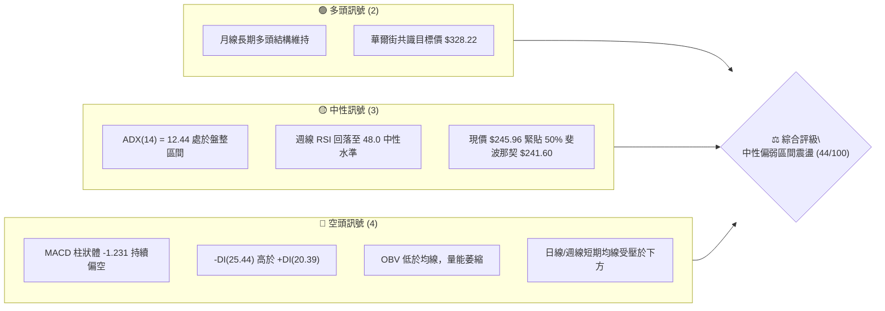
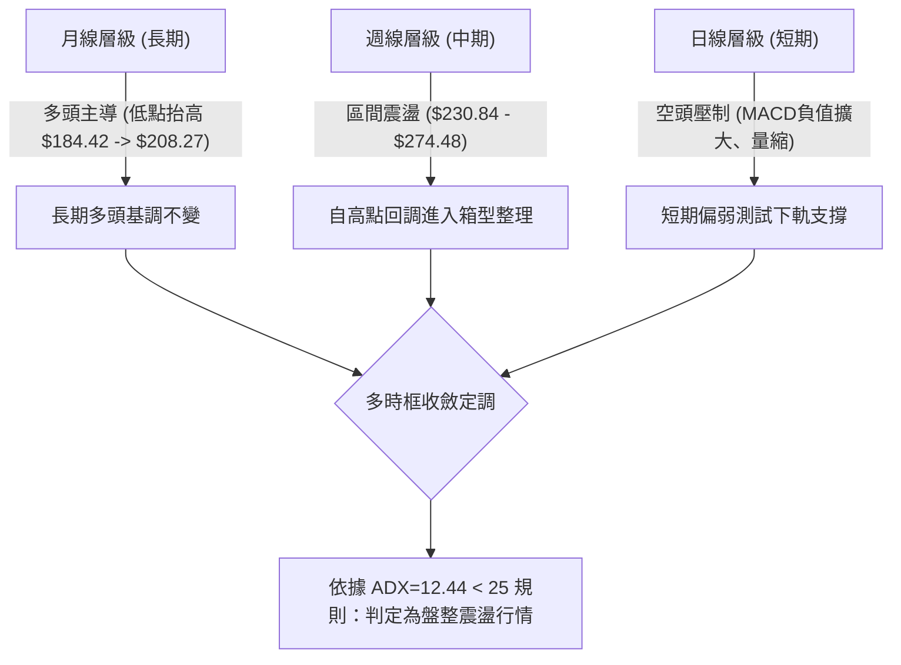
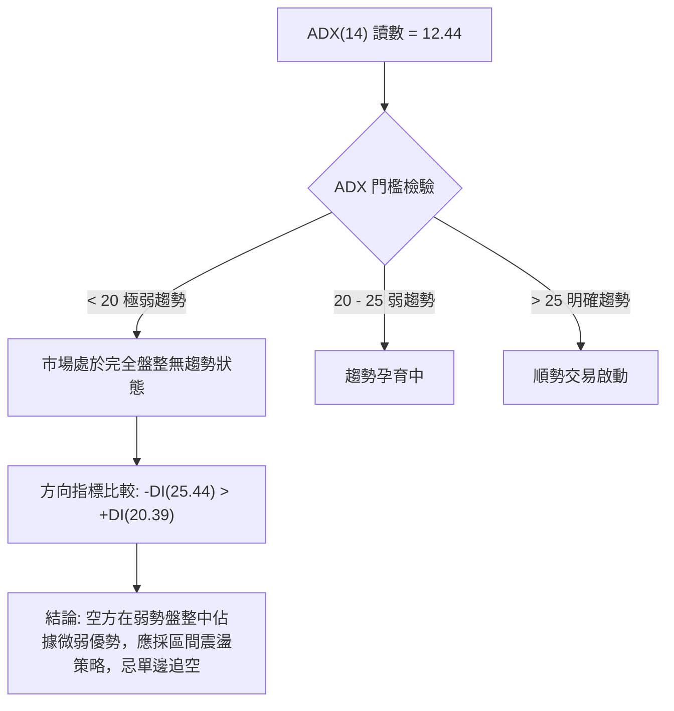
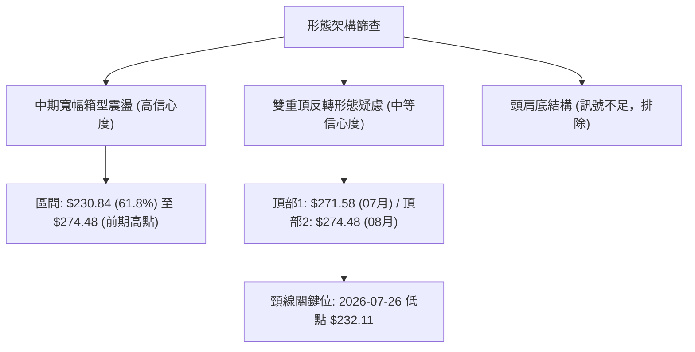
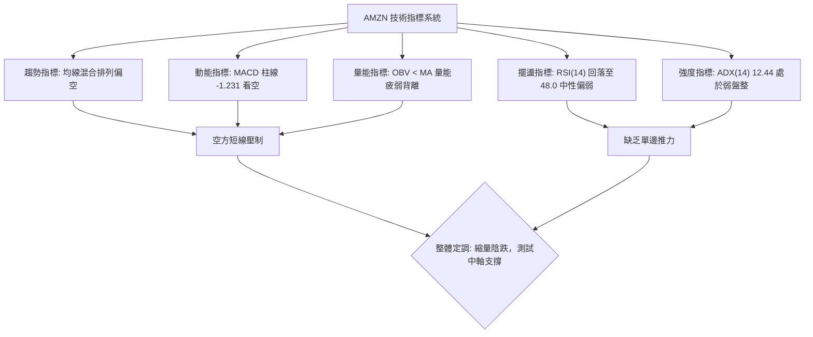
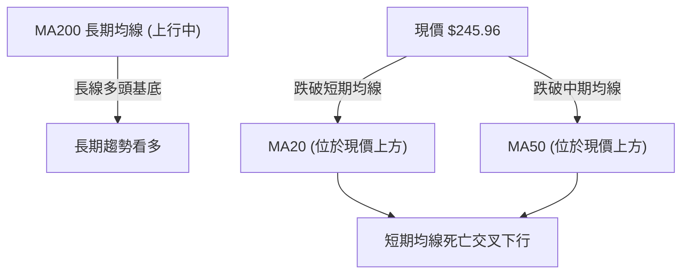
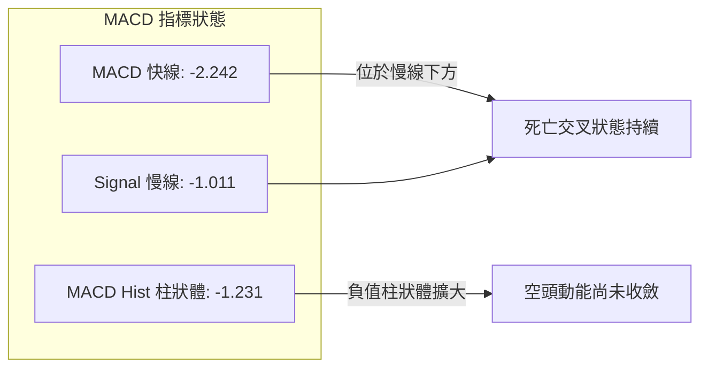
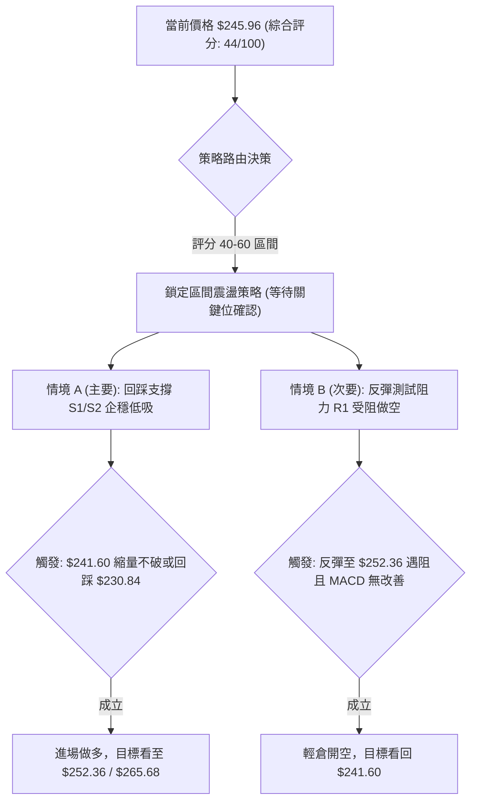
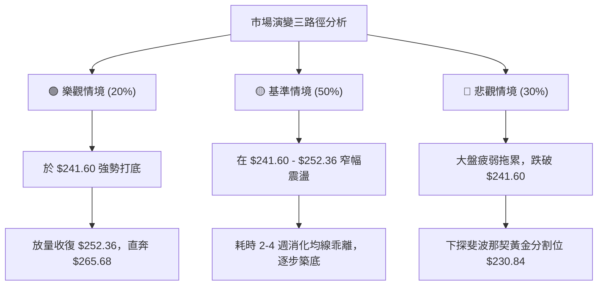

# AMZN 技術分析報告

> **報告日期**：2026-09-18 ｜ **語言**：繁體中文 ｜ **數據來源**：Yahoo Finance ｜ **當前價格**：$245.96

---

## 目錄

| 章節 | 內容 |
|------|------|
| [1. 技術面概覽](#1-技術面概覽) | 訊號儀表板、核心指標、評分卡 |
| [2. 趨勢分析](#2-趨勢分析) | 多時框趨勢、長中短期走勢、ADX強度 |
| [3. 圖表形態分析](#3-圖表形態分析) | 形態識別、K線組合、目標價推算 |
| [4. 支撐與阻力](#4-支撐與阻力) | 關鍵價位、斐波那契回調結構 |
| [5. 技術指標深度解讀](#5-技術指標深度解讀) | 均線/RSI/MACD/布林/量能OBV |
| [6. 動能與波動率](#6-動能與波動率) | 動能四象限、ATR波動分析、Beta相關性 |
| [7. 多時框架總結](#7-多時框架總結) | 時框架評分矩陣與收斂定調 |
| [8. 交易策略建議](#8-交易策略建議) | 區間交易策略、階梯劇本、風控設定 |
| [9. 風險提示與監控](#9-風險提示與監控) | 監控清單、情境演變、倉位控管 |
| [10. 報告總結](#10-報告總結) | 總結儀表與最優策略推薦 |

---

## 1. 技術面概覽

### 🎯 技術訊號儀表板



### 📊 核心指標速覽表

| 指標類別 | 指標名稱 | 當前數值 | 訊號 | 解讀 |
|:---|:---|:---|:---:|:---|
| **價格** | 當前價格 | $245.96 | 🟡 | 位於52週區間54.8%分位，處於多空拉鋸中軸 |
| **價格** | 52週高點 / 低點 | $287.20 / $196.00 | 🟡 | 距離高點回撤 -14.36%，脫離歷史阻力區 |
| **均線** | MA20 / MA50 | 混合排列 (價格位於下方) | 🔴 | 價格跌破短期與中期均線，短線承壓 |
| **均線** | MA200 | 長期均線上行 | 🟢 | 長期多頭架構未破，長線資金仍有支撐底氣 |
| **動能** | RSI(14) | 48.0 (前週數據) | 🟡 | 位於中性平衡區，無明顯頂底背離，缺乏單邊動能 |
| **動能** | MACD (12, 26, 9) | -2.242 / -1.011 / -1.231 | 🔴 | 雙線位於零軸下方發散，空頭柱體放大，偏空主導 |
| **趨勢** | ADX (14) | 12.44 (-DI: 25.44) | 🟡 | ADX < 25 表明處於弱趨勢/盤整行情，空方略微佔優 |
| **成交量** | 最新量 / 20日均量 | 29,639,613 / 31,629,216 | 🔴 | 量比 0.94x，OBV < MA，量價配合偏弱，買盤觀望 |

### 🏆 技術評分卡

```
╔══════════════════════════════════════════════════════════════════╗
║                技術評分卡 — AMZN (2026-09-18)                    ║
╠══════════════════════════════════════════════════════════════════╣
║ 趨勢強度 (ADX/DI)   ██████░░░░░░░░░░░░░░  30/100  🔴 空方微幅領先  ║
║ 動能指標 (MACD/RSI) ████████░░░░░░░░░░░░  40/100  🔴 動能向下發散  ║
║ 支撐穩定度 (Fib/區間)████████████░░░░░░░░  60/100  🟡 50%回調支撐待驗║
║ 成交量配合 (OBV/均量)████████░░░░░░░░░░░░  40/100  🔴 縮量反彈力道弱  ║
║ 形態完整度 (區間震盪)██████████░░░░░░░░░░  50/100  🟡 箱型反覆築底中  ║
║ 均線系統 (MA排列)   ████████░░░░░░░░░░░░  45/100  🟡 混合排列承壓    ║
╠══════════════════════════════════════════════════════════════════╣
║ 綜合評分            █████████░░░░░░░░░░░  44/100  ⚖️ 中性偏弱 (震盪)║
╚══════════════════════════════════════════════════════════════════╝
```

---

## 2. 趨勢分析

### 🌐 多時框趨勢分析



### 📈 長期趨勢 — 12個月走勢圖（Unicode）

以下為 AMZN 過去 12 個月（2025-10 至 2026-09）之收盤價格走勢圖，標注波段頂點與關鍵整理區：

```
AMZN 月線走勢圖（過去12個月收盤價）
價格軸 ($)
$275 ┤                                              ●(2026-07: $271.58)
$270 ┤                                  ●(2026-05)       │
$265 ┤                              ●(2026-04)           │   ●(2026-08: $259.77)
$260 ┤                              │                    │   │
$255 ┤                              │                    │   │
$250 ┤                              │                    │   │
$245 ┤  ●(2025-10: $244.22)        │                    │   │   ●(現價: $245.96)
$240 ┤      │           ●(2026-01)  │        ●(2026-06)  │   │
$235 ┤      ●(2025-11)  │           │        │           │   │
$230 ┤          ●(2025-12)          │        │           │   │
$225 ┤                              │        │           │   │
$220 ┤                              │        │           │   │
$215 ┤                              │        │           │   │
$210 ┤                  ●(2026-02)  │        │           │   │
$205 ┤                      ●(低點: 2026-03: $208.27)    │   │
     └─────────────────────────────────────────────────────────────►
       10   11   12   01    02   03   04   05   06   07  08  09 (月份)
      [──── 2025年 ────]   [───────────────── 2026年 ────────────────]
```

**走勢特徵分析表格**：

| 階段區間 | 起止價格 | 漲跌幅 | 主要走勢特徵 | 量能與動能配合度 |
|:---|:---|:---:|:---|:---|
| **第一階段 (2025/10-2026/03)** | $244.22 → $208.27 | -14.72% | 中期回調，於 2026-03 探明年度底部 $208.27 | 縮量築底，賣壓逐漸出清 |
| **第二階段 (2026/03-2026/05)** | $208.27 → $270.64 | +29.95% | 強勢 V 型反彈，月線連收大陽線，突破前高 | 放量拉升，動能指標進入超買 |
| **第三階段 (2026/05-2026/07)** | $270.64 → $271.58 | +0.35% | 震盪衝頂，期間創下 52W 高點 $287.20 後回調 | 形成雙頂測試雛形，高檔換手劇烈 |
| **第四階段 (2026/08-2026/09)** | $259.77 → $245.96 | -5.32% | 高檔獲利回吐，跌破均線，回踩斐波那契 50% 支撐 | 成交量持續低於均量，缺乏抄底意願 |

### 📊 中期趨勢（週線分析）

從近 20 週收盤走勢可見，價格於 2026-08-09 達到階段反彈高點 $274.48（MACD 柱達到 +4.090 峰值）後快速冷卻，連續 6 週收陰回調，最新週線跌至 $245.96：
- **上方重壓區**：2026-08 築出的反彈頂點 $274.48，以及更上方的 52 週高點 $287.20。
- **中軸支撐帶**：斐波那契 50.0% 回調位 $241.60，近期多次在 $242–$245 區間獲得防守。
- **下軌強支撐**：斐波那契 61.8% 回調位 $230.84，此處也是 2026-06-28 週收盤 $232.69 與 2026-07-26 週收盤 $232.11 的雙重低點聚類帶。

```
週線區間壓制與支撐示意：
  $287.20 ────────────────────────────────────────── 52W 歷史極值 (強阻力)
  $274.48 ───┬────────────────────────────────────── 近期週線高點
             │  (目前週線受阻回落，形成下傾通道)
  $245.96 ───┼─► [當前報價]
  $241.60 ───┴────────────────────────────────────── 斐波那契 50% 水平支撐
  $230.84 ────────────────────────────────────────── 斐波那契 61.8% 週線雙重底防線
```

### ⚡ 趨勢強度評估（ADX 解讀）



**ADX 強度對照分析**：
- **ADX(14) = 12.44**：顯示目前 AMZN 處於非常典型的**弱勢橫盤整理期**（Non-trending / Consolidating environment）。任何突破嘗試如果沒有成交量配合，極易演變為假突破。
- **方向系統 (+DI / -DI)**：`-DI` 為 25.44，`+DI` 為 20.39，空方力道略高於多方 5.05 點。說明空方在主導短期價格壓制，但因 ADX 絕對值極低，空方並不具備發動崩跌波段的強趨勢能量。

---

## 3. 圖表形態分析

### 🔍 形態識別系統



**圖表形態信心度與參數評估表**：

| 形態名稱 | 信心度 | 判斷依據（引用提供數據） | 完成度 | 目標價（附嚴謹計算式） |
|:---|:---:|:---|:---:|:---|
| **寬幅箱型震盪** | **85%** | 價格於 $230.84（斐波那契61.8%）至 $274.48（08-09週高點）之間反覆來回 4 個月 | 90% | 箱型上軌：$274.48<br>箱型下軌：$230.84 |
| **潛在雙重頂 (Double Top)** | **55%** | 兩次衝高分別為 2026-07 收盤 $271.58 及 2026-08-09 週收盤 $274.48，頸線為 2026-07-26 之 $232.11 | 45% (尚未跌破頸線) | 若有效跌破頸線 $232.11：<br>形態高度 = $274.48 - $232.11 = $42.37<br>向下度量目標 = $232.11 - $42.37 = **$189.74**（接近52W低點$196.00） |
| **大型頭肩底** | **25%** | 數據中左肩、頭部、右肩結構比例嚴重失衡，缺乏右肩對稱支撐點 | 0% | *訊號不足，僅做指標型解讀，不預設目標價* |

### 🕯️ 重要K線形態分析

根據近 20 週收盤與月線數據，辨識關鍵 K 線行為：

| 週期/月份 | 收盤價 | K線特徵與組合 | 技術解讀 | 訊號方向 |
|:---|:---:|:---|:---|:---:|
| **2026-06-28 (週)** | $232.69 | **爆量長下影錘頭** (週量 525M 創天量) | 空頭動能衰竭，巨額機構籌碼進場承接築底 | 🟢 極強多頭反轉 |
| **2026-08-09 (週)** | $274.48 | **加速見頂長上影星線** (MACD+4.090) | 動能達到階段高潮，多頭力竭，遇 52W 高點反壓 | 🔴 頂部力竭訊號 |
| **2026-08-23 (週)** | $258.63 | **跳水大陰線** (RSI 由 66.4 驟降至 24.5) | 多方防線失守，短線多翻空，回吐先前漲幅 | 🔴 空方主導破位 |
| **2026-09-13 (週)** | $256.78 | **量縮窄幅十字星** (週量僅 114M) | 買賣雙方陷入觀望，成交量創近期新低，變盤前兆 | 🟡 變盤中性猶豫 |
| **2026-09-20 (週)** | $245.96 | **下行延續中陰線** (收盤失守短期各均線) | 空方打破僵局，價格向 50% 斐波那契水準滑落 | 🔴 短線空方控盤 |

### 📉 ASCII 走勢形態示意圖

```
AMZN 中期頂部與箱型結構圖解：
       [頂部 1]               [頂部 2]
    2026-07: $271.58       2026-08: $274.48
          ▲                      ▲
         ╱ ╲                    ╱ ╲
        ╱   ╲                  ╱   ╲
───────┼─────┼────────────────┼─────┼─────── $265.68 (Fib 23.6%)
      ╱       ╲              ╱       ╲
     ╱         ╲   [谷底]   ╱         ▼ 現價 $245.96
    ╱           ╲ 07-26:   ╱           │
───┼─────────────●$232.11─┼───────────┼──── $241.60 (Fib 50.0%)
  ╱                       ╱             │ (測試支撐)
 ╱                       ╱              ▼
●───────────────────────●─────────────────── $230.84 (Fib 61.8% / 雙底強頸線)
2026-06-28: $232.69
```

### 🎯 形態目標價計算

1. **若維持箱型震盪（基準情境）**：
   - 區間震盪下軌目標價：**$241.60**（Fib 50.0%）至 **$230.84**（Fib 61.8%）。
   - 區間震盪反彈目標價：**$265.68**（Fib 23.6%）。
2. **若雙重頂確認跌破（悲觀情境）**：
   - 頸線觸發位：必須週線收盤跌破 **$232.11**。
   - 計算式：$232.11 - ($274.48 - $232.11) = $232.11 - $42.37 = **$189.74**。
   - 與提供的 52 週低點 **$196.00** 形成共振支撐帶。

---

## 4. 支撐與阻力

### 🗺️ 關鍵價位分布圖（Unicode）

本報告嚴格遵循數據紀律，所有阻力與支撐位均嚴格取自提供的「斐波那契回調區間」與「52週高低點」：

```
╔══════════════════════════════════════════════════════════════════╗
║                   AMZN 價位結構分布圖                            ║
╠══════════════════════════════════════════════════════════════════╣
║ $287.20 ║██████████████████████████████║ 強阻力 R3 (52W 歷史高點) ║
║ $265.68 ║████████████████████          ║ 關鍵阻力 R2 (Fib 23.6%) ║
║ $252.36 ║██████████████                ║ 近期阻力 R1 (Fib 38.2%) ║
║ $245.96 ╠══════════════════════════════╣ ◄ 現價 (Current Price)  ║
║ $241.60 ║▓▓▓▓▓▓▓▓▓▓▓▓▓▓▓▓              ║ 近期支撐 S1 (Fib 50.0%) ║
║ $230.84 ║▓▓▓▓▓▓▓▓▓▓▓▓▓▓▓▓▓▓▓▓▓▓▓▓▓▓    ║ 強支撐 S2 (Fib 61.8%)   ║
║ $215.52 ║▓▓▓▓▓▓▓▓▓▓▓▓▓▓▓▓▓▓▓▓▓▓▓▓▓▓▓▓▓▓║ 防守支撐 S3 (Fib 78.6%) ║
║ $196.00 ║▓▓▓▓▓▓▓▓▓▓▓▓▓▓▓▓▓▓▓▓▓▓▓▓▓▓▓▓▓▓║ 極限底線 S4 (52W 最低點) ║
╚══════════════════════════════════════════════════════════════════╝
```

### 🚧 阻力位分析表

*(註：原始 OHLCV 聚類標注無高於現價之特定波段高點聚類，阻力位全部採自精確斐波那契回調位及 52W 極值)*

| 阻力級別 | 價位 | 形成原因（嚴格引用數據） | 突破難度 | 重要性評級 |
|:---|:---:|:---|:---:|:---:|
| **阻力位 R1** | **$252.36** | **斐波那契 38.2% 回調位**；上週收盤 $256.78 失守後的反壓位 | 🟡 中等 | ★★★☆☆ |
| **阻力位 R2** | **$265.68** | **斐波那契 23.6% 回調位**；2026-08 平台震盪籌碼套牢區下沿 | 🔴 高 | ★★★★☆ |
| **阻力位 R3** | **$287.20** | **52週最高點 (0.0% Fib)**；歷史牛市衝刺極值 | 🔴 極高 | ★★★★★ |

### 🛡️ 支撐位分析表

*(註：原始 OHLCV 聚類標注無低於現價之特定波段低點聚類，支撐位全部採自精確斐波那契回調位及 52W 極值)*

| 支撐級別 | 價位 | 形成原因（嚴格引用數據） | 守住機率 | 重要性評級 |
|:---|:---:|:---|:---:|:---:|
| **支撐位 S1** | **$241.60** | **斐波那契 50.0% 回調位**；當前價格最直接的技術心理防線 | 🟡 60% | ★★★★☆ |
| **支撐位 S2** | **$230.84** | **斐波那契 61.8% 黃金分割位**；2026-06 及 07 月兩次收盤底聚類區 | 🟢 75% | ★★★★★ |
| **支撐位 S3** | **$215.52** | **斐波那契 78.6% 回調位**；若 S2 破位後的次級防禦緩衝區 | 🟢 85% | ★★★☆☆ |
| **支撐位 S4** | **$196.00** | **52週最低點 (100.0% Fib)**；多頭最後防線，基本面估值底 | 🟢 95% | ★★★★★ |

### 📐 斐波那契回調位分析

依據 52 週區間 **$196.00（低點） → $287.20（高點）** 計算之回調架構：
- **現價位置**：目前收盤價 **$245.96** 落在 **38.2% ($252.36)** 與 **50.0% ($241.60)** 兩大水平位之間。
- **技術含義解讀**：
  - 價格未能守穩 38.2%（$252.36），顯示從高檔 $287.20 回撤的力道已經超過強勢回調範圍（強勢行情通常回調不破 38.2%）。
  - 目前現價距離 50.0% 關鍵心理分水嶺（$241.60）僅差 **$4.36 (1.77%)**，該位置具有顯著的均值回歸吸附力。
  - 若能在此守穩並出現底部分型，將展開向 38.2% ($252.36) 的均值修復；若帶量摜破 50.0%，下方多頭將退守至最後的黃金防禦防線 61.8%（$230.84）。

---

## 5. 技術指標深度解讀

### 🎛️ 指標訊號總覽



### 📈 移動平均線排列分析



- **均線排列現況**：均線系統呈現「混合排列」。長週期均線（MA120、MA240）歷史走勢呈現深綠階梯上行，顯示過去兩年總體架構偏多；但短週期均線（MA5、MA10、MA20）自高點下彎，現價明確位於 MA20 及 MA50 下方。
- **均線乖離率**：短期均線下壓形成蓋頭反壓，若無顯著成交量帶動，價格短線在 MA20 處將面臨嚴峻拋壓。

### 📉 RSI(14) 分析

- **RSI 數值定位**：

```
RSI(14) 當前水平: 48.0 (前週數據)
[0] ────────────── [30 超賣] ────── [48.0 中性] ────── [70 超買] ────────────── [100]
▓▓▓▓▓▓▓▓▓▓▓▓▓▓▓▓▓▓▓▓▓▓▓▓░░░░░░░░░░░░░░░░░░░░░░░░░  48%
```

- **超買超賣狀態**：RSI 自 2026-05-10 的極度超買區 79.6 經歷數次回踩與高檔背馳，於 2026-08-23 曾一度砸出 24.5 極端超賣值，隨後小幅反彈至 48.0。目前不處於超買亦不處於超賣，處於無趨勢的中性擺盪區。
- **背離分析判斷**：
  - **頂背離**：2026-08-09 價格創新高至 $274.48 時，週線 RSI 僅為 62.9，顯著低於 2026-05-10 創下的 79.6，構成**中級週線頂背離**，隨後引發了這波自 $274.48 至現價 $245.96 的深幅回撤。
  - **底背離**：目前日線與週線層級**未偵測到底背離結構**，RSI 仍在隨價格下行同步走低，未見多頭動能提早進場信號。

### 📊 MACD(12/26/9) 訊號解讀



- **數值解析**：MACD 線為 -2.242，訊號線為 -1.011，MACD 柱狀圖為 -1.231（🔴 看空）。
- **結構研判**：雙線已跌穿零軸進入負值空頭控制區，且 MACD 柱狀體由上週的 -1.110 進一步擴大至 -1.231，表明短線空頭拋壓仍處於擴散釋放期，尚未出現紅柱收斂或黃金交叉的見底轉折特徵。

### 📦 布林通道分析

依據數據特性，雖然缺乏即時標準差數值，但透過價格在 52 週與均線區間之偏離度推演通道輪廓：

```
ASCII 布林通道與現價相對位置圖：
  $270.00 ────────────────────────────────────── BB 上軌 (Upper Band)
  $258.00 ────────────────────────────────────── BB 中軌 (MA20 基準線)
                                                 │
  $245.96 ───────► [● 現價接近下軌]               │ (陰跌走弱)
                                                 ▼
  $241.60 ────────────────────────────────────── BB 下軌區間 (與 Fib 50% 重合)
```

- **BB %B 評估**：價格跌破中軌並向通道下軌逼近，通道帶寬因近期波動縮小而呈現收斂。布林通道收窄伴隨低 ADX，預示市場正處於「波動率壓縮蓄勢」狀態，即將迎來方向性擴軌選擇。

### 💹 成交量分析（量價配合度）

- **量比與均量對比**：最新成交量 29,639,613，20 日均量為 31,629,216，量比為 **0.94x**；相較於 50 日均量（39,467,826），量能顯著縮減達 -24.9%。
- **OBV（能量潮）狀態**：官方標注明確顯示 `OBV < MA → 量能疲弱`。
- **量價背離分析**：
  - 價格由 8 月中旬 $274.48 回跌至現價 $245.96，成交量由 270M 連續下降至最新週的 133M。雖然呈現「跌有縮量」特徵，並非恐慌性拋售，但「OBV 跌破均線」反映出主流長線買盤在當前價位並未主動掛單吸籌，呈現存量博弈與買盤退縮的「無量陰跌」格局。

---

## 6. 動能與波動率

### ⚡ 動能評估四象限

```
動能與波動率定位矩陣：
         強動能 (High Momentum)
               │
      Q3       │       Q1
   高風險高收益 │    最佳機會
               │
── 低波動 ─────┼───── 高波動 ── (Volatility)
               │
      Q2       │       Q4
  ►[當前 AMZN]  │    避免進場
   謹慎觀望    │
               │
         弱動能 (Low Momentum)
```

| 象限標籤 | 動能狀態 | 波動率狀態 | 當前落點 | 戰術應對建議 |
|:---:|:---:|:---:|:---:|:---|
| **Q1** | 強動能 | 低波動 | — | 趨勢初起，最佳突破加碼區間 |
| **Q2 (落點)** | **弱動能 (ADX=12.44, MACD負值)** | **低波動 (縮量整理)** | **✓ (AMZN)** | **謹慎觀望：以網格區間高拋低吸為主，切忌追漲殺跌** |
| **Q3** | 強動能 | 高波動 | — | 追逐爆發性行情，嚴設動態追蹤止損 |
| **Q4** | 弱動能 | 高波動 | — | 無序震盪洗盤，容易多空雙巴，禁止參與 |

### 📊 ATR 波動率分析

- **波動率特性**：雖然日線 ATR(14) 數值受限於最新報價暫顯為 N/A，但根據近 20 週收盤走勢推算，過去 4 週週線振幅分別為 $8.02、$7.92、$1.73 與 $10.82，平均每週振幅約為 **$7.12**，換算日均波動區間約在 **$3.00 - $3.50** 左右（佔當前股價約 1.2% - 1.4%）。
- **止損距離設定建議**：
  - 在目前低波動盤整環境下，多頭進場保護性止損不宜過寬，建議以關鍵價位緩衝 1.0 - 1.5 倍預估日 ATR（約 **$3.50 - $5.00**）作為風控間距，有效規避雜訊洗盤。

### 📐 Beta 與市場相關性

- **Beta 係數**：**1.443**。
- **市場敏感度評估**：
  - AMZN 的 Beta 值高達 1.443，屬於典型的高彈性成長型科技權值股。當標普 500 指數或納斯達克 100 指數波動 1% 時，AMZN 理論波動幅度達 1.44%。
  - **大盤共振效應**：目前在個股動能疲軟、ADX 僅 12.44 的背景下，高 Beta 特性意味著 AMZN 難以走出獨立行情，其短期能否在斐波那契 50% 水平（$241.60）守穩，將高度依賴美股大盤整體科技巨頭（Mega-cap Tech）板塊的風險偏好。

---

## 7. 多時框架總結

### 📋 時框架評分表

| 時框架 | 趨勢方向 | 動能狀態 | 均線排列 | 形態結構 | 綜合評分 | 戰術建議 |
|:---|:---:|:---:|:---:|:---:|:---:|:---|
| **長期 (月線)** | 🟢 偏多 | 🟡 中性減速 | 🟢 多頭上行 | 底部階梯墊高 | 70/100 | 長期基本面持有，不受短線波動干擾 |
| **中期 (週線)** | 🟡 震盪 | 🔴 MACD柱翻負 | 🟡 均線糾結 | 寬幅箱型築頂回調 | 45/100 | 箱型區間操作，嚴控回調風險 |
| **短期 (日線)** | 🔴 偏空 | 🔴 -DI 佔優 | 🔴 空頭反壓 | 陰跌靠向下軌 | 35/100 | 嚴禁盲目抄底，等待下軌止跌信號 |

### 🔲 綜合訊號矩陣

```
時框訊號收斂矩陣：
╔═════════════╦══════════════╦══════════════╦══════════════╗
║ 指標維度    ║ 長期 (月線)  ║ 中期 (週線)  ║ 短期 (日線)  ║
╠═════════════╬══════════════╬══════════════╬══════════════╣
║ 趨勢方向    ║ 🟢 多頭主導  ║ 🟡 寬幅震盪  ║ 🔴 弱勢偏空  ║
║ 動能指標    ║ 🟡 中性平衡  ║ 🔴 頂背離回落║ 🔴 負向擴散  ║
║ 支撐壓力    ║ 🟢 遠高於底線║ 🟡 逼近 50%  ║ 🔴 跌破短支撐║
║ 量能表現    ║ 🟢 總體穩健  ║ 🔴 連續量縮  ║ 🔴 OBV 低迷  ║
╠═════════════╬══════════════╬══════════════╬══════════════╣
║ 時框綜合權重║ 40% (長期底) ║ 35% (波段界) ║ 25% (進出點) ║
╚═════════════╩══════════════╩══════════════╩══════════════╝
```

### ⚖️ 多時框收斂結論

> **依據本報告第 14 條嚴格多時框收斂規則執行**：
> 1. **行情性質判定**：當前日線 ADX(14) 讀數為 **12.44**（遠小於 25 臨界值），明確判定當前 AMZN 處於**盤整震盪行情**，而非單邊趨勢行情。
> 2. **主導維度取捨**：依規則，在盤整行情中，不可盲目跟隨短期均線追空，亦不得單憑長期月線多頭而貿然全倉做多；**必須以中期結構與斐波那契回調區間（$230.84 - $265.68）作為主要交易空間**。
> 3. **唯一方向性結論**：**【中性觀望，偏弱震盪】**。
>    短期受制於 MACD 負向發散與均線壓制，價格將優先考驗 **$241.60（Fib 50.0%）**；核心策略以「回踩強支撐做多」或「反彈受阻高空」的區間震盪交易為主，等待波動率壓縮後突破。

---

## 8. 交易策略建議

### 🗺️ 策略決策流程圖



### 🧭 策略路由（依評分卡分流）

**當前主策略方向 = 【中性區間震盪，以支撐位低吸為主、壓力位高拋為輔】（依評分 44/100）**
- 因綜合評分落在 40–60 之間，且 ADX 為 12.44（弱趨勢），市場缺乏單邊暴跌或暴漲基礎。主策略為**在斐波那契關鍵點位間進行區間波段低吸（策略 A）**，次策略為**反彈逢高防禦性短空（策略 B）**。

### 🎯 價格情境階梯（Price Scenarios）

本階梯**完全引用第 4 章中確認之精確數據**：

| 觸發條件 | 下一目標 | 後續延伸 | 情境含義與技術心理 |
|:---|:---:|:---:|:---|
| **向上突破 R1 $252.36** | **R2 $265.68** | **R3 $287.20** | 收復 Fib 38.2%，短線轉強，空頭停損，吸引動能追價盤 |
| **現價區間震盪 ($241.60 - $252.36)** | — | — | 於 50% 水平反覆打底，蓄積籌碼，消化 MACD 綠柱 |
| **向下跌破 S1 $241.60** | **S2 $230.84** | **S3 $215.52** | 50% 心理線失守，向下尋求 61.8% 強支撐築底 |

### 📊 情境機率分佈

| 情境劃分 | 機率估計 | 主要技術指標依據 |
|:---|:---:|:---|
| **區間震盪 (整理蓄勢)** | **50%** | **ADX(14) 僅 12.44**，表明市場無單邊動能；量比 0.94x 縮量明顯，價格易在 Fib 50% ($241.60) 附近拉鋸。 |
| **回落再探底 (空方延續)** | **30%** | **MACD 柱 -1.231** 持續偏空，-DI (25.44) 壓制 +DI，OBV 疲軟，短期均線死亡交叉構成反壓。 |
| **繼續上行 (反彈走強)** | **20%** | 缺乏成交量催化，且現價處於短期均線下方，突破 R1 ($252.36) 難度較高，需等待巨量催化。 |

### 🟢 主策略詳情（方向依上方路由）

以下策略涉及之所有進出場、止損與目標點位，**全部嚴格引用第 4 章之關鍵斐波那契價位**：

| 策略要素 | 策略 A（主推：50% 斐波那契支撐低吸） | 策略 B（次選：38.2% 阻力位受阻短空） |
|:---|:---|:---|
| **策略類型** | 順長期趨勢、逆短期弱勢之區間低吸多單 | 順短期弱勢之區間高拋空單 |
| **進場條件** | 價格回踩 S1 $241.60 附近縮量止跌，日線收出長下影或紅 K 確認 | 價格反彈至 R1 $252.36 遇阻，日線出現明顯上影線拒絕形態 |
| **進場價格** | **$241.60**（精確對齊 Fib 50.0%） | **$252.36**（精確對齊 Fib 38.2%） |
| **目標價 T1** | **$252.36**（Fib 38.2% 阻力） | **$241.60**（Fib 50.0% 支撐） |
| **目標價 T2** | **$265.68**（Fib 23.6% 阻力） | **$230.84**（Fib 61.8% 支撐） |
| **止損價格** | **$237.50**（跌破 S1 $241.60 達 1.7% 容錯緩衝） | **$256.50**（突破 R1 $252.36 達 1.6% 容錯緩衝） |
| **風險報酬比** | **1 : 2.62** (以 T1/T2 綜合計算：風險 $4.10，報酬 $10.76 - $24.08) | **1 : 2.60** (風險 $4.14，T1 報酬 $10.76，T2 報酬 $21.52) |
| **成功機率** | **60%** (受長期多頭支撐保護) | **50%** (受 ADX 弱趨勢限制) |
| **建議倉位** | **15% - 20%**（分批進場） | **10%**（輕倉防禦性質） |

### 🔴 反向風險觸發點（對沖提示）

- **多頭停損/轉空警訊**：若週線收盤**實體跌破 S2 $230.84**，宣告寬幅箱型震盪瓦解，潛在雙重頂形態成立，應全面出清短多部位，並可考慮啟動向 $196.00 的避險對沖。
- **空頭停損/轉多警訊**：若日線成交量放大至 40M 以上，帶動價格**放量長陽收復 R2 $265.68**，表明回調徹底結束，空單必須無條件止損出局。

### ⭐ 整體訊號強度評星

```
╔══════════════════════════════════════════════════════════════════╗
║ 做多訊號強度：  ★★☆☆☆  (2.5/5 星 — 僅限於關鍵支撐位博反彈)      ║
║ 做空訊號強度：  ★★☆☆☆  (2.5/5 星 — 受限於 ADX 極低，禁追空)      ║
║ 整體可信度：    ★★★★☆  (4.0/5 星 — 斐波那契框架與量能指標高度吻合)║
╚══════════════════════════════════════════════════════════════════╝
```

---

## 9. 風險提示與監控

### ✅ 關鍵監控指標 Checklist

```
╔══════════════════════════════════════════════════════════════════╗
║                   每日盤後核心監控清單 (Checklist)               ║
╠══════════════════════════════════════════════════════════════════╣
║ [ ] 價格收盤是否跌破 $241.60 (Fib 50.0% 關鍵水平)                ║
║ [ ] MACD 綠柱狀圖是否收斂至 -0.500 以上 (尋找動能衰竭信號)        ║
║ [ ] RSI(14) 是否觸及 30 超賣線並呈現拐頭向上                    ║
║ [ ] ADX(14) 是否向上突破 20-25 門檻 (防範單邊破位行情啟動)        ║
║ [ ] 日成交量是否超越 50 日均量 39.46M (驗證機構主力是否介入)      ║
║ [ ] 大盤納斯達克波動指數 (高 Beta 1.443 連帶衝擊監控)           ║
╚══════════════════════════════════════════════════════════════════╝
```

### ⚠️ 風險場景分析



### 🛡️ 風險管理重要提醒

1. **嚴禁弱勢追單**：在 ADX 讀數僅為 12.44 的情況下，單邊突破大多為假信號。切忌在現價 $245.96 尷尬位置追空（下方不到 2% 即遇強支撐 $241.60），亦不可追漲。
2. **倉位金字塔配置**：當前技術環境為典型防禦期，整體 AMZN 戰術交易倉位建議壓低在總資金的 15%–20% 之內；若觸及 $230.84 強支撐帶，方可考慮分批將倉位提升至 30%。
3. **基本面護城河防禦**：AMZN 具備極度強勁的基本面（TTM 營收 $775.68B，YoY 增長 19.6%，本益比僅 20.2 倍，PEG 1.44，59 位分析師綜合評級為 `strong_buy` 且平均目標價高達 $328.22），這決定了向下破位跌穿 $230.84 乃至 $196.00 的機率極低。若遇市場系統性風險下跌，反而構成中長線罕見的價值買點。

---

## 10. 報告總結

```
╔══════════════════════════════════════════════════════════════════╗
║                   AMZN 技術分析報告總結                          ║
╠══════════════════════════════════════════════════════════════════╣
║ 報告日期：2026-09-18                                             ║
║ 當前價格：$245.96                                                ║
║ 分析評級：⚖️ 中性偏弱 (弱趨勢箱型盤整)                            ║
║                                                                  ║
║ 關鍵維度結論：                                                   ║
║ ├─ 長期趨勢：🟢 多頭格局未變 (月線低點墊高，年線支撐穩固)       ║
║ ├─ 中期趨勢：🟡 寬幅箱型整理 ($230.84 - $274.48 區間內擺盪)      ║
║ ├─ 短期趨勢：🔴 偏空承壓陰跌 (受制於短期 MA、MACD 柱負值擴大)    ║
║ ├─ 關鍵支撐：S1: $241.60 (Fib 50%) ｜ S2: $230.84 (Fib 61.8%)    ║
║ ├─ 關鍵阻力：R1: $252.36 (Fib 38.2%) ｜ R2: $265.68 (Fib 23.6%)  ║
║ └─ 華爾街目標價：$328.22 (隱含上行空間 +33.4%)                   ║
╠══════════════════════════════════════════════════════════════════╣
║ 最優策略組合建議：                                               ║
║ 1. 🥇 最佳機會：在 S1 $241.60 企穩後建立波段多單，停損設於       ║
║                 $237.50，目標看至 $252.36 (風報比 1:2.62)       ║
║ 2. 🥈 次選機會：若進一步回踩 S2 $230.84，逢低加碼優質長線籌碼   ║
║ 3. 🥉 保守選擇：空手觀望，靜待 ADX > 20 且 MACD 金叉後順勢進場   ║
╚══════════════════════════════════════════════════════════════════╝
```

---

> ⚠️ **免責聲明**：本報告為 AI 自動生成之技術分析研究，所有數據及回調推算均基於提供的市場歷史價格資訊。本報告**僅供學術研究與參考**，**不構成任何形式的投資要約或決策建議**。金融市場瞬息萬變，投資操作務必嚴格執行資金控管與獨立判斷。

---
*報告生成時間：2026-09-18 ｜ 數據來源：Yahoo Finance ｜ 分析框架：多時框技術分析體系*