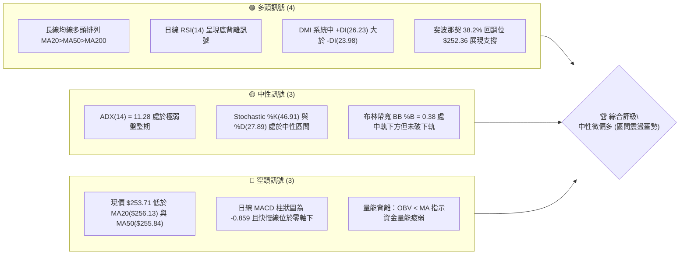
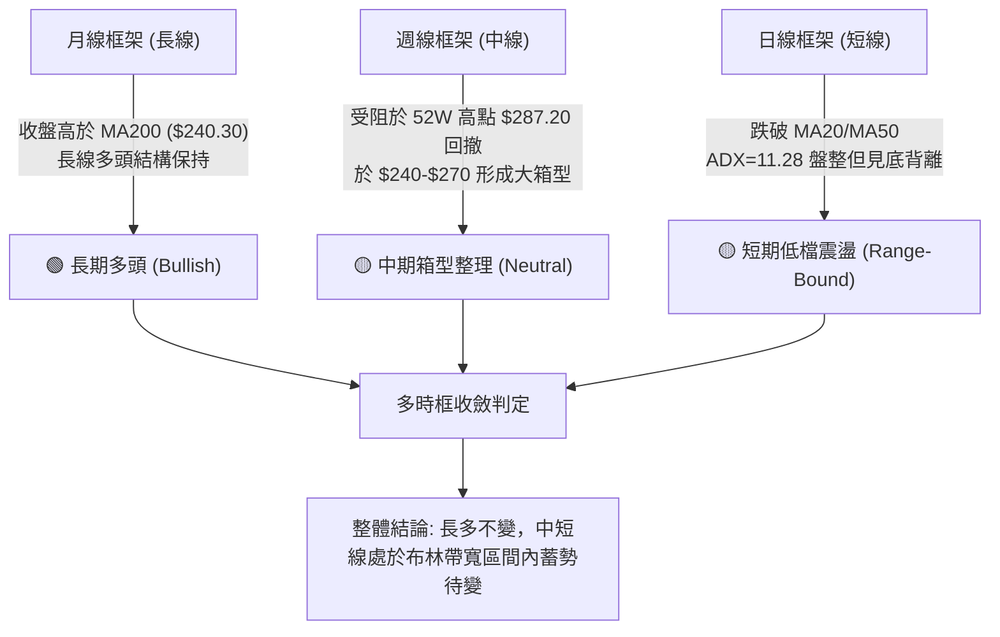
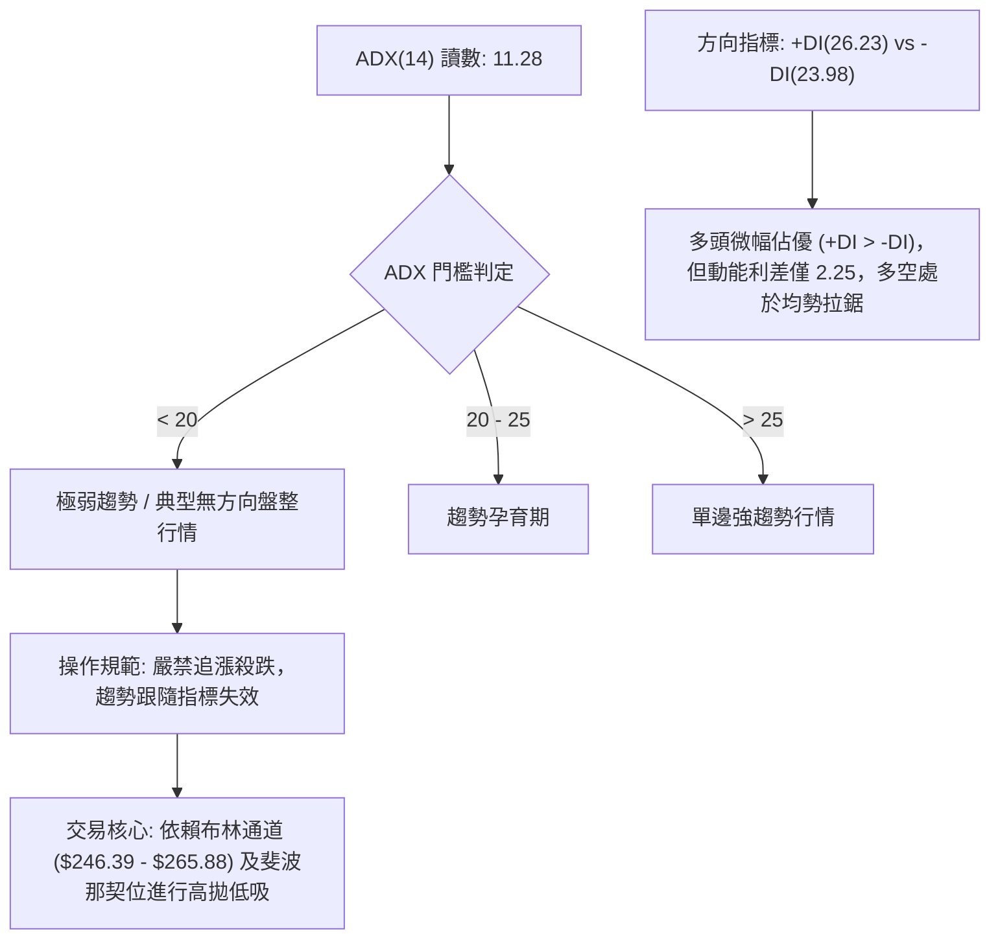
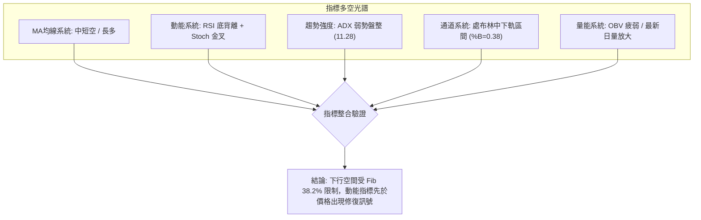
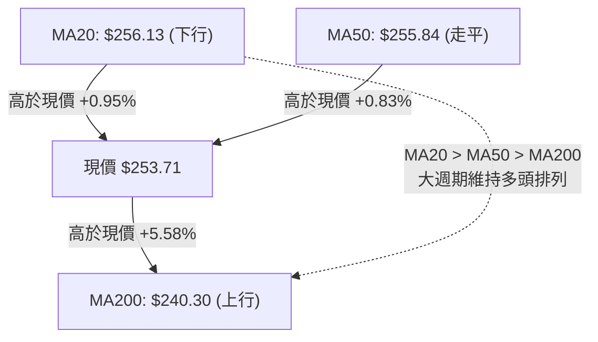
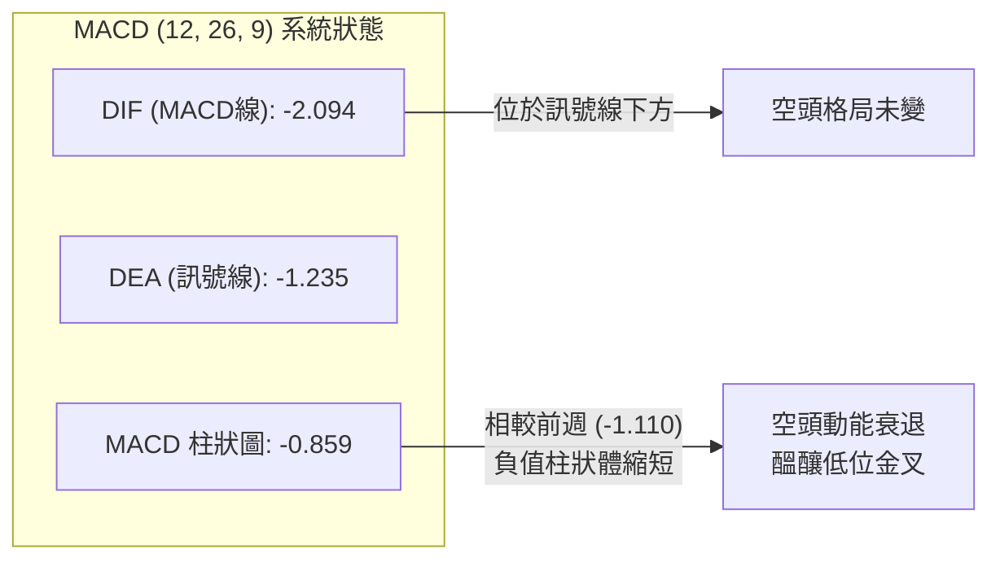
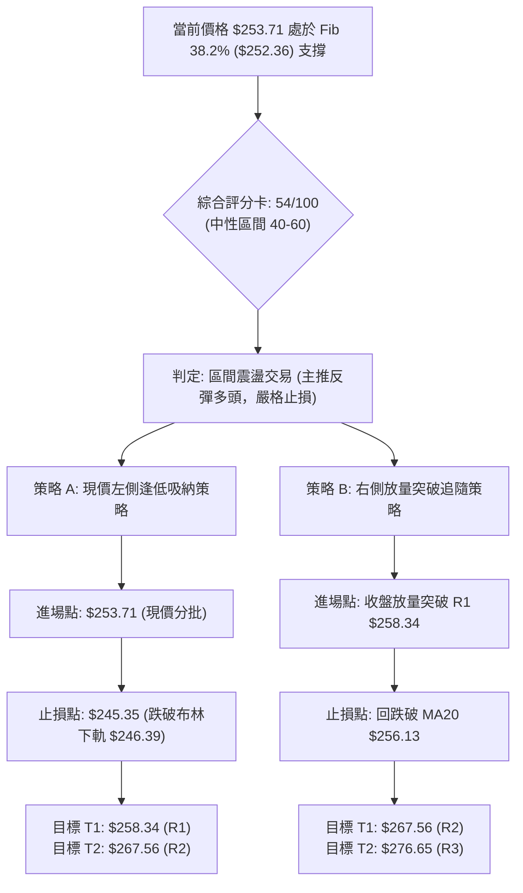
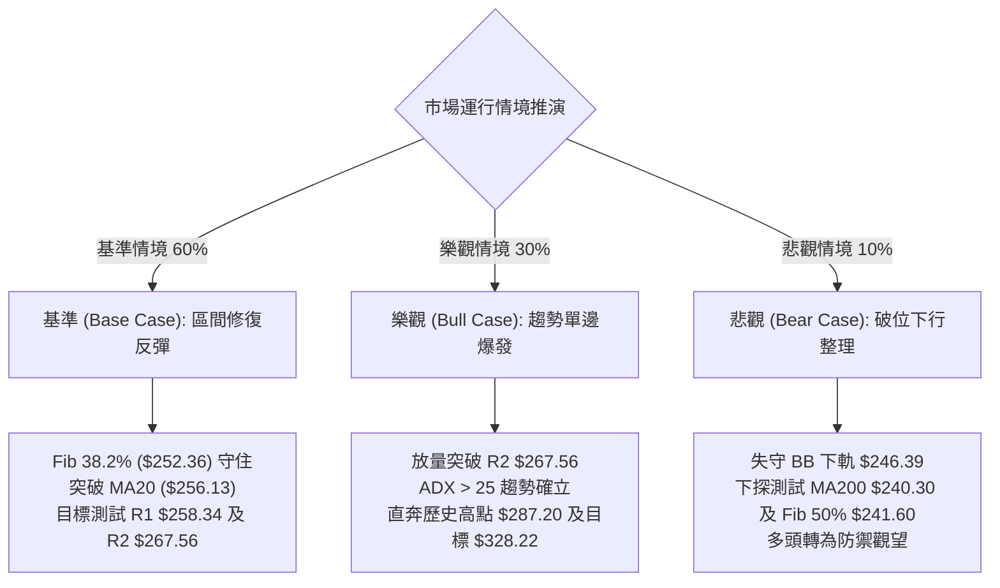

# AMZN 技術分析報告

> **報告日期**：2026-09-20 ｜ **語言**：繁體中文 ｜ **數據來源**：Yahoo Finance ｜ **當前價格**：$253.71

---

## 目錄

| 章節 | 內容 |
|------|------|
| [1. 技術面概覽](#1-技術面概覽) | 訊號儀表板、核心指標、評分卡 |
| [2. 趨勢分析](#2-趨勢分析) | 多時框趨勢、長中短期走勢 |
| [3. 圖表形態分析](#3-圖表形態分析) | 形態識別、K線組合、目標價 |
| [4. 支撐與阻力](#4-支撐與阻力) | 關鍵價位、斐波那契回調 |
| [5. 技術指標深度解讀](#5-技術指標深度解讀) | MA/RSI/MACD/布林/成交量 |
| [6. 動能與波動率](#6-動能與波動率) | 動能評估、ATR、Beta |
| [7. 多時框架總結](#7-多時框架總結) | 時框架評分矩陣 |
| [8. 交易策略建議](#8-交易策略建議) | 多空策略、風險報酬比 |
| [9. 風險提示與監控](#9-風險提示與監控) | 監控指標、風險場景 |

---

## 1. 技術面概覽

### 🎯 技術訊號儀表板



### 📊 核心指標速覽表

| 指標類別 | 指標名稱 | 當前數值 | 訊號 | 解讀 |
|----------|----------|----------|------|------|
| **價格** | 當前收盤價 | $253.71 | 🟡 | 位於52週區間 63.3%，短線處於回調整理段 |
| **均線** | 短期 MA20 | $256.13 | 🔴 | 現價位於均線下方 -0.95%，形成短線動態阻力 |
| **均線** | 中期 MA50 | $255.84 | 🔴 | 現價位於均線下方 -0.83%，短中期均線交纏 |
| **均線** | 長期 MA200| $240.30 | 🟢 | 現價高於均線 +5.58%，大週期上升基石穩固 |
| **動能** | RSI(14)  | 36.16   | 🟢 | 接近超賣邊界，且出現顯著日線底背離 |
| **動能** | MACD(12,26,9) | -2.094 / Hist -0.859 | 🔴 | MACD線位於訊號線下方，空頭柱收斂但未翻紅 |
| **動能** | Stochastic | %K: 46.91 / %D: 27.89 | 🟢 | 快線由超賣區向上穿越慢線形成黃金交叉 |
| **趨勢** | ADX(14)  | 11.28   | 🟡 | 數值遠低於 25，市場缺乏主動單向趨勢，屬於區間震盪 |
| **波動** | ATR(14)  | $5.57 (2.20%) | 🟡 | 波動率收斂至正常水準，利於設定緊湊防守止損 |
| **通道** | Bollinger Bands | $246.39 - $265.88 | 🟡 | %B 為 0.38，價格在中軌($256.13)與下軌($246.39)間盤整 |
| **成交量**| 20日成交量比 | 1.59x   | 🟡 | 最新量能放大，但 OBV < 均量線，量價配合有待確認 |

### 🏆 技術評分卡

```
╔══════════════════════════════════════════════════════════════╗
║              技術評分卡 — AMZN (2026-09-20)                   ║
╠══════════════════════════════════════════════════════════════╣
║ 趨勢強度 (ADX=11.28)   ████░░░░░░░░░░░░░░░░  25/100  🔴 弱勢盤整║
║ 動能指標 (RSI底背離)   ███████████░░░░░░░░░  55/100  🟡 動能修復║
║ 支撐穩定度 (Fib 38.2%) ███████████████░░░░░  75/100  🟢 買盤承接║
║ 成交量配合 (OBV偏弱)   ████████░░░░░░░░░░░░  40/100  🔴 量價分歧║
║ 形態完整度 (區間箱體)   ████████████░░░░░░░░  60/100  🟡 箱型整理║
║ 均線排列 (MA多頭排序)  ██████████████░░░░░░  70/100  🟢 長期看多║
╠══════════════════════════════════════════════════════════════╣
║ 綜合技術評分           ████████████░░░░░░░░  54/100  🟡 中性震盪║
╚══════════════════════════════════════════════════════════════╝
```

---

## 2. 趨勢分析

### 🌐 多時框趨勢分析



### 📈 長期趨勢 — 12個月走勢圖（Unicode）

```
AMZN 月線走勢圖（過去12個月：2025-10 至 2026-09）
價格軸 ($)
$280 ┤                                      
$270 ┤                                  ● ─── ●(07月 $271.58)
$260 ┤                              ●   │     │   ●
$250 ┤                          ●   │   │     │   │   ●←現在($253.71)
$240 ┤  ●                   ●   │   │   │     │   │
$230 ┤  │   ●   ●       ●   │   │   │   │     │   │
$220 ┤  │   │   │   ●   │   │   │   │   │     │   │
$210 ┤  │   │   │   │   │   │   │   │   │     │   │
$200 ┤  │   │   │   │   │   │   │   │   │     │   │
$190 ┤  │   │   │   │   │   │   │   │   │     │   │
     └──┴───┴───┴───┴───┴───┴───┴───┴───┴─────┴───┴───┴──────
       10  11  12  01  02  03  04  05  06    07  08  09 (月份)
      '25 '25 '25 '26 '26 '26 '26 '26 '26   '26 '26 '26
```

#### 走勢特徵分析表格

| 週期區間 | 價格變動區間 | 累積漲跌幅 | 走勢特徵描述 |
|----------|--------------|------------|--------------|
| 2025-10 ~ 2026-03 | $244.22 → $208.27 | -14.72% | 自波段高點震盪回落，於 2026-03 探底 $208.27，構築大級別中期底部 |
| 2026-03 ~ 2026-05 | $208.27 → $270.64 | +29.95% | 強勢單邊多頭主升段，突破多條短期均線阻力，量價齊揚 |
| 2026-05 ~ 2026-07 | $270.64 → $271.58 | +0.35%  | 衝高回踩 $238.34 後再次拉升至 $271.58，形成寬幅震盪雙頂區域 |
| 2026-07 ~ 2026-09 | $271.58 → $253.71 | -6.58%  | 自高位有序回撤，目前測試 38.2% 斐波那契回調位 $252.36 |

### 📊 中期趨勢（週線分析）

從近 20 週歷史收盤價觀察，AMZN 在 2026 年 7 月底至 8 月初經歷巨量拉升，2026-08-02 單週成交量達 355,373,200 股並推升收盤至 $271.58，其後於 2026-08-09 創下收盤高點 $274.48。隨後五週成交量逐步萎縮（由 2.7 億股滑落至 1.14 億股），收盤價回落至現價 $253.71。週線 MACD 柱狀圖由 +4.090 驟降至 -0.859，顯示中期動能進入回調釋放期。

```
中期週線阻力與支撐分佈示意圖：
[阻力 R3] $276.65 ─── 8月波段密集高點區間
[阻力 R2] $267.56 ─── 近期反彈高點與布林上軌附近
[阻力 R1] $258.34 ─── 9月初反彈高點 / 20日均線動態阻力
----------------------------------------------------------- 現價 $253.71
[支撐 S1] $225.82 ─── 近一年波段低點聚類一級防線
[支撐 S2] $220.99 ─── 斐波那契 61.8% ($230.84) 下方強支撐
[支撐 S3] $215.82 ─── 斐波那契 78.6% ($215.52) 極限防守線
```

### ⚡ 趨勢強度評估（ADX 解讀）



| 指標變量 | 數值 | 歷史正常區間 | 狀態評估 | 戰術含義 |
|----------|------|--------------|----------|----------|
| **ADX(14)** | 11.28 | 10.0 - 50.0 | 極弱 (盤整) | 市場進入籌碼沉澱期，單邊突破失敗率高 |
| **+DI(14)** | 26.23 | 0.0 - 50.0  | 中性偏多 | 多方仍保留主動發球權，防守未潰退 |
| **-DI(14)** | 23.98 | 0.0 - 50.0  | 中性 | 空方打壓力道逐步被吸收 |
| **DI 差值** | +2.25 | -30 ~ +30   | 均勢拉鋸 | 缺乏主導單邊趨勢，支持箱體操作邏輯 |

---

## 3. 圖表形態分析

### 🔍 形態識別系統


#### 形態識別信心度與目標評估

| 形態類別 | 信心度 | 判斷依據（引用數據） | 完成度 | 目標價（附計算式） |
|----------|--------|----------------------|--------|--------------------|
| **箱型整理 (Rectangle Range)** | **85%** | 上軌阻力 R2 $267.56（多次上衝未破），下軌為布林下軌 $246.39 及 Fib 38.2% $252.36 | 75% | 箱頂突破目標 = 頸線 $267.56 + (箱高 $267.56 - $246.39 = $21.17) = **$288.73**（接近 52W 高點 $287.20） |
| **日線雙重底 (潛在)** | **45%** | 訊號不足，僅做指標型解讀。雖有 6 月低點 $232.69 與 7 月低點 $232.11，但時間跨度過大且未有效突破頸線 $274.48 | 35% | 依規則15，信心度 < 50% 暫不採用形態測幅，回歸指標型與支撐阻力分析 |

### 🕯️ 重要K線形態分析

| 日期 / 週期 | 收盤價 | K線形態 | 解讀 | 訊號 |
|-------------|--------|---------|------|------|
| 2026-08-02 | $271.58 | 長陽突破實體 | 帶有 3.55 億股爆發量，確立 $232-$247 底部築底完成 | 🟢 強烈看多 |
| 2026-08-09 | $274.48 | 高位流星十字線 | 測試 $276.65 阻力 R3 未果，上影線顯示獲利了結賣壓沉重 | 🔴 頂部停頓 |
| 2026-08-23 | $258.63 | 中黑下挫破位 | RSI 驟降至 24.5 超賣，引發短期多頭均線結構受損 | 🔴 短線轉弱 |
| 2026-09-13 | $256.78 | 縮量孕線 (Inside Bar) | 成交量萎縮至 1.14 億股，賣壓窮盡，多空進入平衡觀望 | 🟡 變盤蓄勢 |
| 2026-09-20 | $253.71 | 下影線小陰星線 | 盤中回測 Fib 38.2% ($252.36) 獲買盤支撐收回，形成底背離架構 | 🟢 止跌初現 |

### 📉 ASCII 走勢形態示意圖

```
AMZN 日線/週線 箱體整理與底背離示意圖
價格 ($)
$276.65 ┼───────────────────────────────●──────── [阻力 R3 / 前期高點]
         │                              / \
$267.56 ┼───────●──────────────────────●   \──── [箱型頂部 / 阻力 R2]
         │      / \                    /     \
$258.34 ┼─────/───\────────●─────────/───────\── [中軸 / 阻力 R1]
         │    /     \      / \       /         \
$253.71 ┼───/───────\────/───\─────/───────────●◄ 現價 (守於 Fib 38.2%)
         │  /         \  /     \   /
$246.39 ┼─●           ●        ●─/────────────── [箱型底部 / BB下軌]
        └─────────────────────────────────────────
RSI(14)
  50.0  ┤           /\
  36.16 ┤   /\     /  \       /●◄ 現價 RSI (36.16 抬高)
  24.50 ┤──/──●───/────\─────/────────────────── (底背離成立: 價創新低/平，RSI抬升)
```

### 🎯 形態目標價計算

1. **箱體等距向上測幅（多頭確認路徑）**：
   - 形態底部：布林下軌支撐 $246.39
   - 形態頸線：阻力位 R2 $267.56
   - 形態垂直高度 $H = \$267.56 - \$246.39 = \$21.17$
   - 向上突破測幅目標 $T = \$267.56 + \$21.17 = \$288.73$（精確指向 52W 高點 $287.20 附近）

2. **短線反彈階梯目標**：
   - 第一反彈目標：阻力位 R1 **$258.34**（修復短期均線壓力）
   - 第二反彈目標：阻力位 R2 **$267.56**（箱頂強阻力區）

---

## 4. 支撐與阻力

### 🗺️ 關鍵價位分布圖（Unicode）

```
AMZN 價位結構分布圖
══════════════════════════════════════════════════════════════════
$287.20 ║████████████████████████████████║ 52週歷史高點 / 極限壓力區
$276.65 ║████████████████████████        ║ 強阻力 R3 (近一年波段高點聚類)
$267.56 ║██████████████████              ║ 阻力 R2 (箱頂阻力 / 波段聚類)
$265.68 ║██████████████                  ║ 斐波那契 23.6% 回調位 / BB上軌($265.88)
$258.34 ║████████████                    ║ 關鍵短線阻力 R1 (MA20/MA50 匯合壓制)
════════╠════════════════════════════════╣ ◄ 當前收盤價 $253.71
$252.36 ║▓▓▓▓▓▓▓▓▓▓▓▓▓▓▓▓▓▓▓▓▓▓▓▓▓▓      ║ 核心支撐：斐波那契 38.2% 回調位
$246.39 ║▓▓▓▓▓▓▓▓▓▓▓▓▓▓▓▓                ║ 動態支撐：布林通道下軌
$241.60 ║▓▓▓▓▓▓▓▓▓▓▓▓▓▓▓▓▓▓▓▓            ║ 斐波那契 50.0% 回調位 (接近MA200 $240.30)
$230.84 ║▓▓▓▓▓▓▓▓▓▓▓▓▓▓                  ║ 斐波那契 61.8% 黃金分割位
$225.82 ║████████████████████████        ║ 強支撐 S1 (近一年波段低點聚類)
$220.99 ║████████████████████            ║ 關鍵支撐 S2 (波段低點聚類)
$215.82 ║████████████████████████        ║ 極限支撐 S3 (Fib 78.6% $215.52 聚類)
══════════════════════════════════════════════════════════════════
```

### 🚧 阻力位分析表

所有阻力數值完全引用自歷史 OHLCV 聚類計算數據：

| 阻力級別 | 精確價位 | 距離現價 | 形成原因與技術共振 | 突破難度 | 重要性權重 |
|----------|----------|----------|--------------------|----------|------------|
| **R1** | **$258.34** | +1.82% | 9月初反彈高點聚類，與當前下降中的 MA20 ($256.13) 及 MA50 ($255.84) 形成動態重疊壓制帶 | 🟡 中等 | ★★★☆☆ |
| **R2** | **$267.56** | +5.46% | 近期波段高點密集區，與布林上軌 ($265.88) 及 Fib 23.6% ($265.68) 形成三合一高階阻力 | 🔴 較高 | ★★★★☆ |
| **R3** | **$276.65** | +9.04% | 2026年8月波段最高收盤聚類區域，為多頭挑戰歷史高點 ($287.20) 前的最後防線 | 🔴 極高 | ★★★★★ |

### 🛡️ 支撐位分析表

所有支撐數值完全引用自歷史 OHLCV 聚類計算數據：

| 支撐級別 | 精確價位 | 距離現價 | 形成原因與技術共振 | 守住機率 | 重要性權重 |
|----------|----------|----------|--------------------|----------|------------|
| **S1** | **$225.82** | -10.99% | 近一年密集低點聚類區，位於黃金分割位 $230.84 下方之強承接帶 | 80% | ★★★★☆ |
| **S2** | **$220.99** | -12.90% | 次級波段低點聚類支撐，為 2025 年底震盪平台的頂部支撐轉化帶 | 88% | ★★★★☆ |
| **S3** | **$215.82** | -14.93% | 長期強支撐聚類，與斐波那契 78.6% 回調位 ($215.52) 完美共振，為牛熊分界生死線 | 95% | ★★★★★ |

### 📐 斐波那契回調位分析

本波段測算基準取自 52 週最低點 **$196.00** 至 52 週最高點 **$287.20**，垂直波動空間為 **$91.20**：

| 回調比例 | 基準價位 | 當前相對位置 | 技術意義與多空互動分析 |
|----------|----------|--------------|------------------------|
| **0.0% (High)** | **$287.20** | +13.20% | 52週歷史頂部，多頭終極目標 |
| **23.6%** | **$265.68** | +4.72% | 強勢回調分水嶺；目前與布林上軌 $265.88 重合，突破即宣告調整結束 |
| **38.2%** | **$252.36** | **-0.53%** | **【核心防禦位】** 現價 $253.71 正精確錨定於此位上方，為弱回調的強支撐標竿 |
| **50.0%** | **$241.60** | -4.77% | 中軸平衡位，下方緊鄰 MA200 ($240.30)，構成中期強大多頭防禦屏障 |
| **61.8%** | **$230.84** | -9.01% | 黃金分割防守位，跌破則預示自 $196 起的大週期上漲趨勢徹底破位 |
| **78.6%** | **$215.52** | -15.05% | 深度回撤極限位，與支撐 S3 ($215.82) 形成共振防護網 |
| **100.0% (Low)**| **$196.00** | -22.75% | 52週歷史低點，牛市基石 |

**斐波那契共振解讀**：現價 $253.71 與 Fib 38.2% ($252.36) 僅相差 $1.35。在技術分析常規中，強勢多頭市場的二級回調通常在 38.2% 獲支撐企穩。若此位置連續 3 個交易日收盤不破，將構成極佳的盈虧比進場節點。

---

## 5. 技術指標深度解讀

### 🎛️ 指標訊號總覽



### 📈 移動平均線排列分析



#### 均線矩陣詳細參數解析

| 均線名稱 | 當前數值 | 價格相差 ($) | 價格相差 (%) | 形態走勢特徵 | 技術含義解讀 |
|----------|----------|--------------|--------------|--------------|--------------|
| **MA 5**  | $250.56  | +$3.15       | +1.26%       | 短期快速翹頭 | 極短線超跌反彈，價格已重新收復 5 日線 |
| **MA 10** | $252.94  | +$0.77       | +0.31%       | 微幅走平     | 價格貼近 10 日線，短線下跌趨緩 |
| **MA 20** | $256.13  | -$2.42       | -0.95%       | 轉向下行     | 短期首道動態反壓線，未突破前短線偏弱 |
| **MA 50** | $255.84  | -$2.13       | -0.83%       | 走平鈍化     | 中期趨勢分水嶺，與 MA20 形成密集膠著區 |
| **MA 60** | $253.26  | +$0.45       | +0.18%       | 微幅上升     | 現價精確踩在 60 日季線上方，具備承接力 |
| **MA120** | $251.91  | +$1.80       | +0.72%       | 穩定上升     | 半年線持續上移，與 Fib 38.2% 匯聚提供支撐 |
| **MA200** | $240.30  | +$13.41      | +5.58%       | 強勁多頭向上 | 牛熊生死線，長線多頭架構完好無損 |
| **MA240** | $238.46  | +$15.25      | +6.40%       | 穩定上揚     | 長期資金成本墊高，下檔防禦深厚 |

### 📉 RSI(14) 分析

- **當前讀數**：**36.16** 
- **數值進度條**：
  ```
  [超賣 0] ██████████████░░░░░░░░░░░░░░░░░░░░░░░░░░ [超買 100] (36.16)
  ```
- **區間評估**：處於 30–40 的弱勢但接近超賣區間，不宜盲目殺跌。
- **背離分析（重點）**：
  - **形態驗證**：明確出現 **日線級別底背離 (Bullish Divergence)**。
  - **背離比對**：2026-08-23 收盤價為 $258.63 時，週線 RSI 下探至 24.50 極低值；而在 2026-09-20 收盤價跌至更低的 $253.71 時，RSI 卻回升至 36.16。
  - **背離結論**：價格創近一個月新低，而動能指標未破新低反而顯著抬高，說明做空動能衰竭，多頭隱性買盤正在暗中承接，反彈隨時可能觸發。

### 📊 MACD(12/26/9) 訊號解讀



- **絕對值分析**：DIF 與 DEA 均處於零軸下方（分別為 -2.094 與 -1.235），表明中期市場仍處於空頭修正節奏。
- **邊際變化解讀**：柱狀圖自 2026-08-23 的 -1.538 逐步收窄至當前的 -0.859，顯示空頭下殺動能已連續四週釋放鈍化，DIFF 有望在近期走平並向上穿越 DEA 形成零下反彈金叉。

### 📦 布林通道分析

```
AMZN 布林通道 (20, 2) 價位分佈示意圖
價格軸 ($)
$265.88 ┼──────────────────────────────────── BB上軌 (+2.0σ)
         │                                    
$256.13 ┼──────────────────────────────────── BB中軌 (MA20)
         │                       ●←現價 $253.71 (%B = 0.38)
$246.39 ┼──────────────────────────────────── BB下軌 (-2.0σ)
        └────────────────────────────────────
```

- **通道帶寬**：$Bandwidth = \frac{\$265.88 - \$246.39}{\$256.13} = 7.61\%$，通道帶寬處於相對收斂狀態，暗示即將選擇短線方向。
- **%B 位置指標**：數值為 **0.38**，表明當前價格位於中軌與下軌之間的下半區，距離下軌支撐 $246.39 尚有 $7.32 的安全緩衝墊。下軌與 Fib 50% ($241.60) 共同構成下方極強支撐防線。

### 💹 成交量分析（量價配合度）

1. **成交量對比**：最新單日成交量為 52,148,900 股，相較於 20 日均量 (32,857,915 股)，**量比達到了 1.59x**。量能有所放大，但當日 K 線呈現窄幅收縮，呈現典型的「放量打底、籌碼換手」特徵。
2. **OBV (能量潮指標) 分析**：
   - 數據狀態：`OBV < MA → 量能疲弱`。
   - 解讀：儘管最新交易日出現換手放量，但大週期能量潮線仍在均量線下方運行，這意味著機構主力資金尚未發起全面主動性進攻，更多屬於被動防禦承接，因此不宜預期出現單邊暴拉行情。

---

## 6. 動能與波動率

### ⚡ 動能評估四象限

```
AMZN 動能與波動率象限矩陣定位
─────────────────────────────────────────────────────────────
          高動能 (Momentum)
                 │
       Q3        │        Q1
   (高波動/強動能)│   (低波動/強動能)
   高風險突破追價 │    最佳單邊順勢
                 │
─────────────────┼───────────────── 低波動 (Volatility)
                 │  
       Q4        │  ★ AMZN 當前位置 (Q2)
   (高波動/弱動能)│   (低波動/弱動能)
   恐慌下殺/避開 │    謹慎觀望/逢低分批
                 │
          低動能 (Momentum)
─────────────────────────────────────────────────────────────
```

| 象限標籤 | 動能狀態 | 波動率狀態 | 市場環境與特徵 | AMZN 判定與應對戰術 |
|----------|----------|------------|----------------|---------------------|
| **Q1** | 強 | 低 | 穩健上升趨勢，阻力最小 | 非當前狀態 |
| **Q2** | **弱** | **低** | **區間震盪整理，蓄勢期** | **✓ 當前精確定位**：ATR 為 $5.57 (2.20%)，ADX=11.28，動能處於底背離修復期。策略應以低吸區間下軌為主。 |
| **Q3** | 強 | 高 | 狂暴主升浪，情緒極度亢奮 | 非當前狀態 |
| **Q4** | 弱 | 高 | 破位暴跌，恐慌拋售蔓延 | 非當前狀態 |

### 📊 ATR 波動率分析

- **ATR(14) 絕對值**：**$5.57**
- **相對價格波動率**：**2.20%**
- **波動率特性**：每日 $5.57 的波動空間意味著市場目前處於低波震盪週期，未出現非理性拋壓。
- **風控止損參數應用**：
  - **日內防守閾值**：$1.0 \times \text{ATR} = \$5.57$
  - **波段防守閾值**：$1.5 \times \text{ATR} = 1.5 \times \$5.57 = \mathbf{\$8.36}$
  - **進場止損距離推導**：若在當前價 $253.71 進場，設定 $1.5 \times \text{ATR}$ 止損，防守價位約為 $\$253.71 - \$8.36 = \$245.35$，恰好覆蓋布林通道下軌 ($246.39) 下方，提供絕佳的技術防護。

### 📐 Beta 與市場相關性

- **Beta 係數**：**1.443**
- **市場特徵解析**：
  - AMZN 具備顯著的高彈性特質（Beta > 1.4），當標普 500 指數或納斯達克 100 指數波動 1% 時，AMZN 理論波動幅度為 1.44%。
  - 在當前盤整蓄勢階段，高 Beta 意味著一旦大盤科技板塊情緒回暖，AMZN 將展現出極強的向上爆發彈性，具備顯著的進攻放大效應。

---

## 7. 多時框架總結

### 📋 時框架評分表

| 時框架 | 趨勢方向 | 動能狀態 | 均線排列 | 關鍵形態 | 綜合評分 | 戰術建議 |
|--------|----------|----------|----------|----------|----------|----------|
| **月線 (長期)** | 🟢 多頭上行 | 🟡 中性回落 | 🟢 MA200之上 (+5.58%) | 大雙底向上延展 | **75/100** | 長線多單堅決底倉持有 |
| **週線 (中期)** | 🟡 寬幅箱體 | 🔴 動能收縮 | 🟡 短均交纏 | $246-$276 箱體整理 | **52/100** | 高拋低吸，關注箱體邊界 |
| **日線 (短期)** | 🟡 築底震盪 | 🟢 RSI底背離 | 🔴 MA20/MA50 之下 | 測試 Fib 38.2% 企穩 | **54/100** | 依托支撐小倉位試多 |

### 🔲 綜合訊號矩陣

```
時框訊號收斂矩陣
┌──────────────┬──────────────────┬──────────────────┬──────────────────┐
│ 維度 \ 時框  │ 日線 (短期)       │ 週線 (中期)       │ 月線 (長期)       │
├──────────────┼──────────────────┼──────────────────┼──────────────────┤
│ 趨勢方向     │ 🟡 弱勢盤整      │ 🟡 寬幅震盪      │ 🟢 完好多頭      │
│ 動能狀況     │ 🟢 底背離初顯    │ 🔴 MACD柱為負    │ 🟢 處於強勢區    │
│ 支撐有效度   │ 🟢 Fib 38.2%有效 │ 🟢 箱體下軌強勁  │ 🟢 MA200 絕對支撐│
│ 量價配合     │ 🟡 單日放量換手  │ 🔴 週量萎縮      │ 🟢 長線資金沉澱  │
└──────────────┴──────────────────┴──────────────────┴──────────────────┘
```

### ⚖️ 多時框收斂結論

依據多時框收斂規則（嚴格要求 14）：
1. **行情屬性判定**：當前 **ADX(14) = 11.28 < 25**，客觀定調為**典型盤整行情**，趨勢跟隨型系統處於失效鈍化狀態。
2. **優先級收斂標準**：在盤整行情中，分析核心聚焦於日線布林通道上下軌 ($246.39 - $265.88) 及關鍵波段聚類價位，摒棄單邊突破幻想。
3. **最終唯一方向結論**：**【中性偏多，區間震盪蓄勢】**。
   - 長期 MA200 ($240.30) 向上趨勢奠定大方向多頭基石；
   - 短期雖然承壓於 MA20 ($256.13)，但 RSI 出現明確日線底背離，且價格於斐波那契 38.2% ($252.36) 展現出連續支撐韌性；
   - 因此，主基調排除盲目看空，採取「在區間下半部逢低布局反彈」之多頭主策略。

---

## 8. 交易策略建議

### 🗺️ 策略決策流程圖



### 🧭 策略路由（依評分卡分流）

**當前主策略方向 = 中性震盪區間偏多操作（依綜合評分 54/100）**
- **路由說明**：綜合評分 54 分處於 40–60 之中性區間，但因日線 RSI 底背離及 Fib 38.2% 企穩，策略主推**「布林通道區間下軌多頭回踩低吸」**；空頭方向僅作為跌破重要支撐後的避險對沖提示，不建議投資人在大週期多頭排列背景下重倉沽空。

### 🎯 價格情境階梯（Price Scenarios）

所有價位均精確引用自第 4 章及數據計算清單：

| 觸發條件 | 下一目標 | 後續延伸 | 情境含義與技術應對 |
|----------|----------|----------|--------------------|
| **向上突破 R1 $258.34** | **R2 $267.56** | **R3 $276.65** | 短線轉強，修復 MA20/MA50 壓制，箱體反彈全面展開 |
| **於 $246.39 - $258.34 區間** | **$252.36** | **$256.13** | 區間震盪蓄勢，布林帶寬持續收斂，耐心做 T 操作 |
| **向下跌破 S1 $225.82** | **S2 $220.99** | **S3 $215.82** | 中期結構徹底破位，跌破 Fib 61.8%，多頭全線止損離場 |

### 📊 情境機率分佈

| 情境劇本 | 發生機率 | 主要判定依據（引用指標狀態） |
|----------|----------|------------------------------|
| **情境一：守穩反彈 (突破 R1 衝擊 R2)** | **60%** | RSI(14)=36.16 底背離顯著、Stoch %K 向上穿過 %D、Fib 38.2% 支撐扎實、分析師一致共識目標 $328.22 具備基本面向上牽引力 |
| **情境二：區間窄幅震盪 ($246 - $258)** | **30%** | ADX(14)=11.28 處於極弱態、OBV 量能偏弱、MA20 與 MA50 短期仍構成上方動態反壓 |
| **情境三：下破探底 (跌向 S1 $225.82)** | **10%** | 大盤出現系統性黑天鵝，使高 Beta(1.443) 標的承壓，但因 MA200 ($240.30) 具備極強承接，此情境機率偏低 |

### 🟢 主策略詳情

| 策略要素 | 策略 A（現價左側低吸策略） | 策略 B（右側突破加碼策略） |
|----------|----------------------------|----------------------------|
| **進場條件** | 現價踩穩 Fib 38.2%，RSI 底背離確認 | 日線實體收盤有效站穩阻力 R1 $258.34 |
| **進場價格** | **$253.71** | **$258.50** |
| **目標價 T1** | **$258.34** (阻力 R1，報酬率 +1.82%) | **$267.56** (阻力 R2，報酬率 +3.51%) |
| **目標價 T2** | **$267.56** (阻力 R2，報酬率 +5.46%) | **$276.65** (阻力 R3，報酬率 +7.02%) |
| **止損價格** | **$245.35** (跌破布林下軌 $246.39 及 1.5xATR)| **$255.00** (回落跌破 MA20 均線) |
| **風險空間** | **$8.36** (-3.29%) | **$3.50** (-1.35%) |
| **報酬空間(T2)**| **$13.85** (+5.46%) | **$18.15** (+7.02%) |
| **風險報酬比** | **1 : 1.66** (若看至 T2 則為 **1 : 1.66**) | **1 : 5.18** (極佳右側損益比) |
| **成功機率** | **60%** | **65%** |
| **建議倉位** | 10% - 15% (底倉佈局) | 15% - 20% (順勢追加) |

### 🔴 反向風險觸發點（對沖提示）

- **關鍵防守破位價**：**$246.39**（布林下軌）以及 **$240.30**（長期 MA200 生命線）。
- **觸發條件**：若日線以大陰線收盤實體跌破 $246.39，且成交量放大至 5,000 萬股以上，宣告底背離反彈失敗。
- **對沖應對指引**：多頭應立即將總倉位降至 5% 以下，或利用反向 ETF / 賣出行權價 $250.00 之看漲期權 (Covered Call) 進行單邊下行風險對沖。

### ⭐ 整體訊號強度評星

```
╔══════════════════════════════════════════════════════════════╗
║ 做多訊號強度：★★★☆☆  (3.5/5星 - RSI底背離與支撐共振，但受壓均線)║
║ 做空訊號強度：★★☆☆☆  (2.0/5星 - 缺乏趨勢空頭量能，下檔空間有限)║
║ 整體可信度：  ★★★★☆  (4.0/5星 - 多時框位階清晰，斐波那契精確) ║
╚══════════════════════════════════════════════════════════════╝
```

---

## 9. 風險提示與監控

### ✅ 關鍵監控指標 Checklist

```
╔══════════════════════════════════════════════════════════════╗
║              AMZN 每日動態監控檢查清單 (Checklist)             ║
╠══════════════════════════════════════════════════════════════╣
║ [ ] 價格是否守穩斐波那契 38.2% 回調位 $252.36 (收盤價為準)    ║
║ [ ] 日線 RSI(14) 是否持續維持在 35 之上並維持向上抬升斜率     ║
║ [ ] MACD 柱狀圖是否由當前 -0.859 連續收窄至 0 軸並引發金叉     ║
║ [ ] 成交量是否能夠有效放大並帶動 OBV 線向上穿越其移動平均線    ║
║ [ ] ADX(14) 是否自 11.28 低位開始掉頭向上，預示新一輪趨勢啟動 ║
║ [ ] 上方首道防線阻力 R1 $258.34 能否被放量中陽線攻克          ║
║ [ ] 下方極限防線布林下軌 $246.39 與 MA200 $240.30 是否被跌穿  ║
╚══════════════════════════════════════════════════════════════╝
```

### ⚠️ 風險場景分析



### 🛡️ 風險管理重要提醒

1. **高 Beta 波動性控管**：AMZN Beta 值達 **1.443**，在標普或科技板塊劇烈波動時具有助漲助跌特性。在目前 ADX 僅 11.28 的低趨勢盤整期，應避免使用槓桿商品，現貨倉位總暴露建議控制在總投資組合的 **15% - 25%** 之間。
2. **量能背離警示**：雖然最新單日成交量放大至 1.59 倍，但長線 OBV < MA 指示機構資金處於鎖倉與審慎觀望態勢。切忌在價格貼近阻力位 R1 ($258.34) 或 R2 ($267.56) 時追高買入，所有多頭進場均應嚴格落實「回踩支撐不破時低吸」原則。
3. **無條件止損紀律**：嚴格將波段防守點位定在 **$245.35**。若市場出現意外突發利空導致價格灌破布林下軌 $246.39，應立即無條件執行平倉，保留現金並等待在 MA200 ($240.30) 或 Fib 50% ($241.60) 重新構築底部時再行介入。

---

## 📋 報告總結

```
╔══════════════════════════════════════════════════════════════════╗
║                    AMZN 技術分析報告總結                         ║
╠══════════════════════════════════════════════════════════════════╣
║ 報告日期：2026-09-20                                            ║
║ 當前價格：$253.71 (52W區間 63.3%)                                ║
║ 分析評級：🟡 震盪築底偏多 (Accumulate on Dips)                   ║
╠══════════════════════════════════════════════════════════════════╣
║ 關鍵技術結論：                                                   ║
║ ├─ 長期趨勢：🟢 穩健多頭 (MA200 = $240.30 上揚，大週期形態完好)   ║
║ ├─ 中期趨勢：🟡 寬幅箱體 ($246.39 - $267.56 區間震盪蓄勢)        ║
║ ├─ 短期趨勢：🟢 底背離初現 (日線 RSI=36.16 抬升，Stoch低位金叉) ║
║ ├─ 關鍵支撐：核心支撐 $252.36 (Fib 38.2%) / 極限防禦 $246.39   ║
║ ├─ 關鍵阻力：近期反壓 $258.34 (R1) / 箱頂重壓 $267.56 (R2)      ║
║ └─ 機構共識：59位分析師強力推薦買入，平均目標價 $328.22 (+29.4%)║
╠══════════════════════════════════════════════════════════════════╣
║ 最優策略組合建議：                                               ║
║ 1. 🥇 最佳機會 (左側)：現價 $253.71 逢低佈局，止損設於 $245.35，  ║
║                       目標直指阻力 R1 $258.34 及 R2 $267.56      ║
║ 2. 🥈 次選機會 (右側)：等待日線放量收復 R1 $258.34 後順勢追多，  ║
║                       止損設於 $255.00，博弈向歷史高點之延伸浪   ║
║ 3. 🥉 保守選擇：空倉者耐心等待價格回測布林下軌 $246.39 企穩，    ║
║                 或等待 ADX 回升至 25 以上單邊趨勢成型再進場     ║
╚══════════════════════════════════════════════════════════════════╝
```

---

> ⚠️ **免責聲明**：本報告為技術分析研究，所有數據指標及價位均基於歷史量價數據推算。本報告**僅供研究與學術參考**，**不構成任何形式的投資建議**。金融市場具有高度不確定性，投資決策請獨立審慎評估，入市需自負風險。

---

*報告生成時間：2026-09-20 ｜ 數據來源：Yahoo Finance ｜ 分析框架：多時框幾何與量化技術分析*