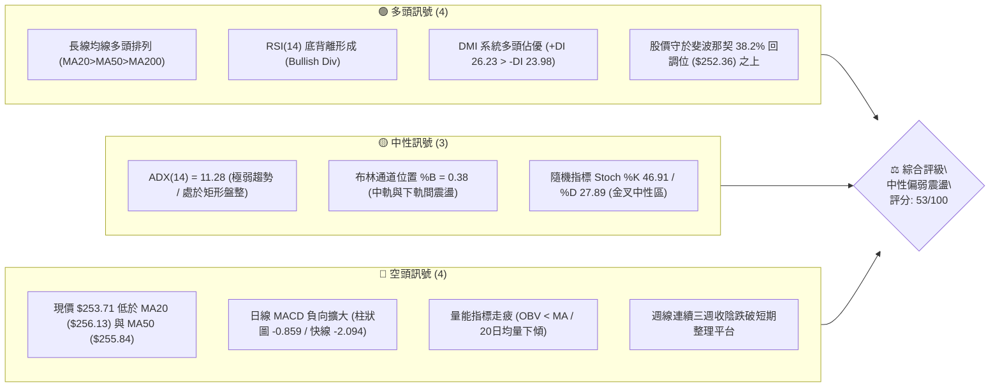
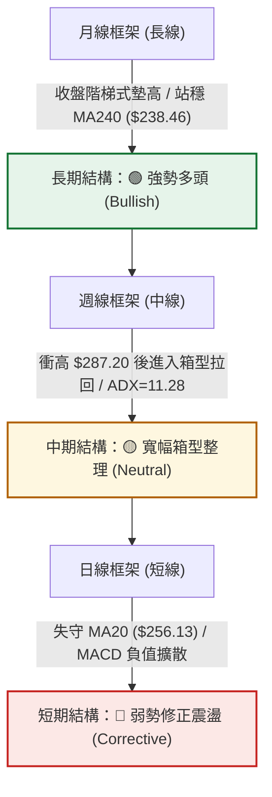
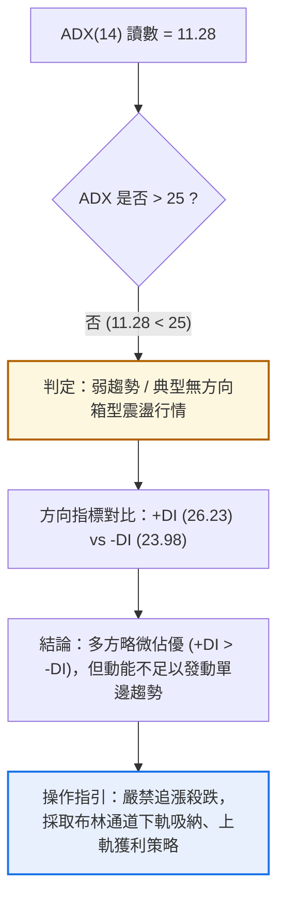
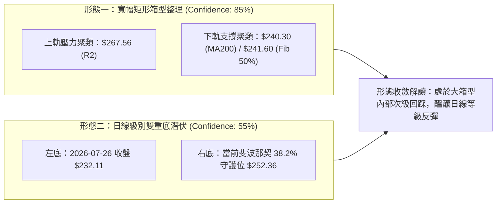
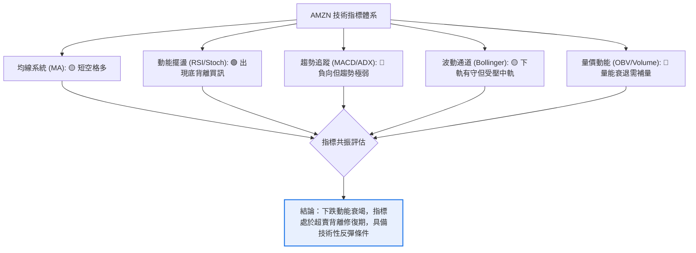
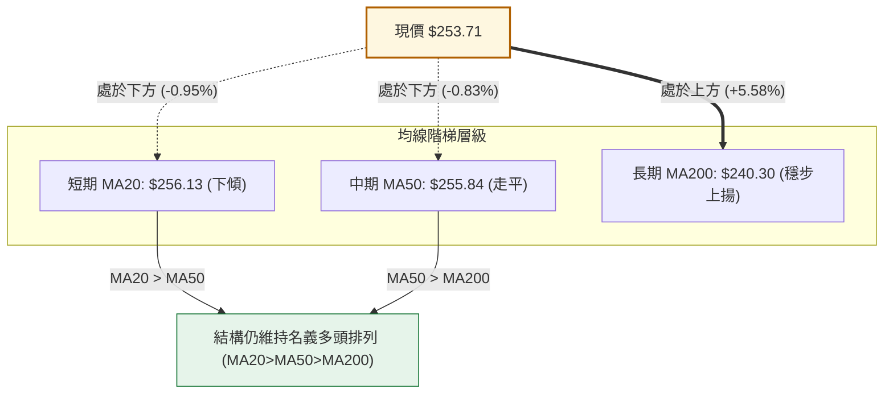
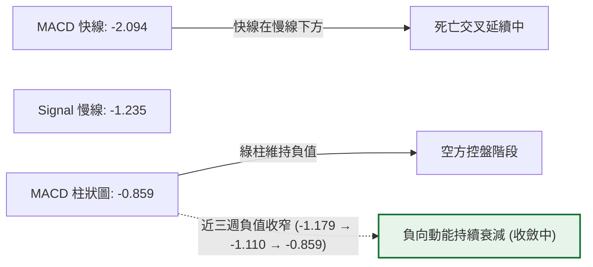
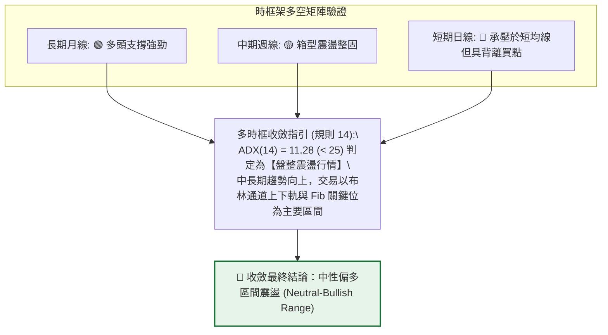
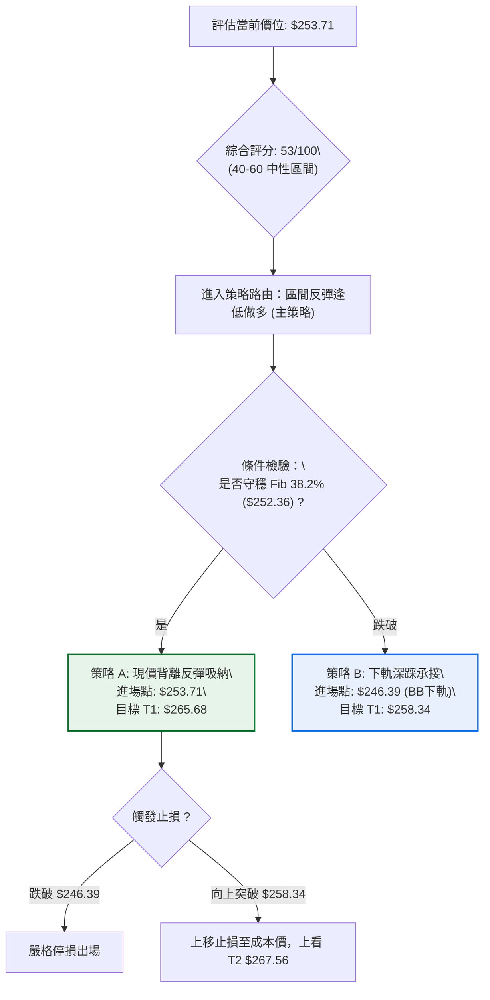
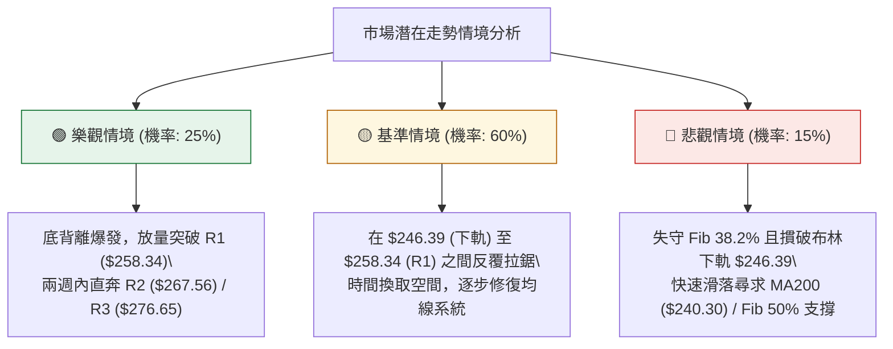

# AMZN 技術分析報告

> **報告日期**：2026-09-21 ｜ **語言**：繁體中文 ｜ **數據來源**：Yahoo Finance ｜ **當前價格**：$253.71

---

## 目錄

| 章節 | 內容 |
|------|------|
| [1. 技術面概覽](#1-技術面概覽) | 訊號儀表板、核心指標、評分卡 |
| [2. 趨勢分析](#2-趨勢分析) | 多時框趨勢、長中短期走勢 |
| [3. 圖表形態分析](#3-圖表形態分析) | 形態識別、K線組合、目標價 |
| [4. 支撐與阻力](#4-支撐與阻力) | 關鍵價位、斐波那契回調 |
| [5. 技術指標深度解讀](#5-技術指標深度解讀) | MA/RSI/MACD/布林/成交量 |
| [6. 動能與波動率](#6-動能與波動率) | 動能評估、ATR、Beta |
| [7. 多時框架總結](#7-多時框架總結) | 時框架評分矩陣 |
| [8. 交易策略建議](#8-交易策略建議) | 多空策略、風險報酬比 |
| [9. 風險提示與監控](#9-風險提示與監控) | 監控指標、風險場景 |

---

## 1. 技術面概覽

### 🎯 技術訊號儀表板



### 📊 核心指標速覽表

| 指標類別 | 指標名稱 | 當前數值 | 訊號 | 解讀 |
|----------|----------|----------|:----:|------|
| **價格** | 當前價格 | $253.71 | 🟡 | 位於52週區間63.3%分位，處於波段拉回整理階段 |
| **均線** | MA20 | $256.13 | 🔴 | 股價位於月線下方（差距 -0.95%），短線承壓 |
| **均線** | MA50 | $255.84 | 🔴 | 股價跌破季線（差距 -0.83%），中期動能暫歇 |
| **均線** | MA200 | $240.30 | 🟢 | 股價遠高於年線（差距 +5.58%），長線多頭防線穩固 |
| **動能** | RSI(14) | 36.16 | 🟡 | 接近超賣邊界，日線出現明顯底背離，具反彈雛形 |
| **動能** | MACD | -2.094 / -1.235 | 🔴 | 雙線位於零軸下方且負柱體擴張（-0.859），空方主導修正 |
| **波動** | ATR(14) | $5.57 (2.20%) | 🟡 | 每日平均波幅適中，並未出現失控拋售或極端波動 |

### 🏆 技術評分卡

```
╔══════════════════════════════════════════════════════════════════╗
║                 技術評分卡 — AMZN (2026-09-21)                   ║
╠══════════════════════════════════════════════════════════════════╣
║ 趨勢強度 (ADX/方向)   ████░░░░░░░░░░░░░░░░  25/100  🔴 極弱盤整   ║
║ 動能指標 (RSI/MACD)   ████████░░░░░░░░░░░░  42/100  🔴 空方佔優   ║
║ 支撐穩定度 (Fib/支撐) ██████████████░░░░░░  72/100  🟢 關鍵支撐在 ║
║ 成交量配合 (OBV/Volume)████████░░░░░░░░░░░░  40/100  🟡 量價微背離 ║
║ 形態完整度 (區間走勢) ██████████████░░░░░░  68/100  🟡 箱型洗盤   ║
║ 均線排列 (多時框MA)   ██████████████░░░░░░  70/100  🟢 中長線偏多 ║
╠══════════════════════════════════════════════════════════════════╣
║ 綜合評分              ███████████░░░░░░░░░  53/100  ⚖️ 中性震盪   ║
╚══════════════════════════════════════════════════════════════════╝
```

---

## 2. 趨勢分析

### 🌐 多時框趨勢分析



### 📈 長期趨勢 — 12個月走勢圖（Unicode）

```
AMZN 月線走勢圖（2025-10 至 2026-09）
價格軸 ($)
$280 ┤                                      ● (07月 $271.58)
$270 ┤                                ●(05月 $270.64)  ●(08月 $259.77)
$260 ┤                          ●(04月 $265.06)             ●(09月 $253.71 現價)
$250 ┤
$240 ┤●(10月 $244.22)          ●(01月 $239.30)  ●(06月 $238.34)
$230 ┤     ●(11月 $233.22)●(12月 $230.82)
$220 ┤
$210 ┤                          ●(02月 $210.00)
$200 ┤                               ●(03月 $208.27 低點)
     └─────────────────────────────────────────────────────────►
       10   11   12   01   02   03   04   05   06   07   08   09 (月份)
```

**12個月走勢特徵分析表格**：

| 時間階段 | 期間收盤價變化 | 漲跌幅 | 走勢結構與技術特徵 |
|:---------|:--------------:|:------:|:-------------------|
| **第一階段：高檔震盪** (2025-10 ~ 2026-01) | $244.22 → $239.30 | -2.01% | 於 $230–$244 區間窄幅橫盤，成交量逐步萎縮，形成整理平台 |
| **第二階段：春季回踩** (2026-02 ~ 2026-03) | $239.30 → $208.27 | -12.97%| 快速回測年線支撐，於 2026-03 測得波段低點 $208.27（逼近52W低點 $196.00） |
| **第三階段：主升噴出** (2026-04 ~ 2026-05) | $208.27 → $270.64 | +29.95%| 強勢帶量突破前高，2026-04 單月大漲逾 $56，多頭確立強勁上升浪 |
| **第四階段：高檔洗盤** (2026-06 ~ 2026-09) | $270.64 → $253.71 | -6.26% | 7月衝刺波段頂部 $271.58（盤中創下52W高點 $287.20）後受阻回落，目前於 $250 關卡整固 |

### 📊 中期趨勢（週線分析）

中期走勢呈現「高階寬幅箱型震盪」。近 20 週收盤數據顯示，多頭在 2026-06-28 爆發巨量（5.25億股）於 $232.69 確立強大接盤支撐，隨後在 8 月初推升至 $274.48，但無法突破年內最高點 $287.20。近 4 週收盤價連環回落（$266.43 → $258.51 → $256.78 → $253.71），成交量連續萎縮至 1.14億–1.86億股，顯示回調屬於量縮洗盤，並非帶量潰敗。

```
近期週線壓力與支撐階梯架構示意圖：
[波段天花板] ---------------- $287.20 (52週最高點)
       ▲
       │   [密集阻力區] ------ $267.56 (R2) / $265.68 (Fib 23.6%)
       │
[當前震盪軸心] ---------------- $253.71 (現價) ◄─► 斐波那契 38.2% ($252.36)
       │
       ▼   [強支撐防線] ------ $241.60 (Fib 50.0%) / MA200 ($240.30)
[底部護城河] ---------------- $225.82 (S1) / $196.00 (52週最低點)
```

### ⚡ 趨勢強度評估（ADX 解讀）



**ADX 趨勢強度標準對照表**：

| ADX 數值區間 | 當前狀態 | 市場結構特徵 | 適用交易策略 |
|:------------:|:--------:|:-------------|:-------------|
| **0 – 20**   | **11.28 (當前)** | **極弱趨勢 / 盤整市場** | **區間震盪、布林通道高拋低吸、均值回歸** |
| 20 – 25      | —        | 趨勢萌芽或即將進入休眠 | 縮減部位、觀望等待突破方向確認 |
| 25 – 40      | —        | 明確的單邊趨勢（多或空） | 順勢交易、移動止損追隨趨勢 |
| 40 – 60      | —        | 強力單邊主升浪或主跌浪 | 堅決持股、回調即加碼 |

---

## 3. 圖表形態分析

### 🔍 形態識別系統



**形態信心度評估表（依規則 15 嚴格審核）**：

| 形態名稱 | 信心度 | 判斷依據（引用實際數據） | 完成度 | 目標價（附嚴格計算式） |
|:---------|:------:|:------------------------|:------:|:----------------------|
| **寬幅矩形箱型震盪** | **85%** | 2026年4月以來股價持續在 $238.34–$271.58 區間運行，且 ADX(14)=11.28 明確指示無趨勢盤整特徵 | 75% | 箱頂突破目標：箱頂 $267.56 (R2) + 箱高 ($267.56 - $241.60 = $25.96) = **$293.52** |
| **潛在複合雙底 (W底)**| **55%** | 2026-06-28 爆巨量見低點 $232.69，7月回調至 $232.11 止跌，目前在更高低點 $252.36 尋求支撐 | 45% | 頸線位取近波段高點聚類 $267.56；高度 = $267.56 - $232.11 = $35.45；突破目標 = $267.56 + $35.45 = **$303.01** |
| **對稱收斂三角形** | **35%** | 高點下移 ($287.20→$274.48)，但低點上移 ($208.27→$232.11→$252.36)，邊界樣本不足 | 30% | 訊號不足，信心度低於50%，僅做指標型解讀，不作為主策略依據 |

### 🕯️ 重要K線形態分析

| 週/月份 | 收盤價 | K線形態 | 量價結構解讀 | 訊號方向 |
|:--------|:------:|:--------|:-------------|:--------:|
| **2026-06-28** | $232.69 | 長下影爆量十字星 (Hammer) | 單週爆發 5.25 億股歷史天量，下探年線未果拉回，確立機構主力強烈承接 | 🟢 強多訊號 |
| **2026-08-09** | $274.48 | 高檔長上影射擊之星 (Shooting Star) | 週放量 2.70 億股衝擊 $287.20 歷史高位未果，多頭動能短線衰竭 | 🔴 強空訊號 |
| **2026-08-23** | $258.63 | 大陰線破位 (Bearish Marubozu) | 單週收跌且 RSI 直墜至 24.5，短線跌破 20 週均線支撐 | 🔴 弱勢修正 |
| **2026-09-20** | $253.71 | 量縮紡錘線 (Spinning Top) | 跌幅顯著收窄，單週成交量降至 1.86 億股，賣壓逐步消化，呈現止跌尋底特徵 | 🟡 止跌孕育 |

### 📉 ASCII 走勢形態示意圖

```
AMZN 中期箱型整理與次級回踩結構圖
價格 ($)
$276.65 ┼────────────────────────────── [阻力 R3] ───────────────────────
         │                     ▲ 08-09 射擊之星高點 ($274.48)
$267.56 ┼─────── 頸線/阻力 R2 ───/─────────────────────────────────
         │      / \            /   \
$258.34 ┼─────/───\── 阻力 R1 /─────\───────────────────────────────
         │    /     \         /       \ 
$253.71 ┼───/───────\───────/─────────● (現價 $253.71 尋求右底支撐)
$252.36 ┼──/─────────\─────/─────────── [斐波那契 38.2% 回調支撐] ───
         │ /           \   /
$240.30 ┼/─────────────\─/──────────── [MA200 / 斐波那契 50% ($241.60)]
$232.11 ┼                ● 07-26 築底點 ($232.11)
         └────────────────────────────────────────────────────────► 時間
```

### 🎯 形態目標價計算

根據上述置信度最高（85%）之「寬幅矩形箱型震盪」進行形態測算：
- **震盪箱體上邊界（頸線）**：採用近一年波段高點聚類值 **$267.56 (R2)**
- **震盪箱體下邊界（基底）**：採用斐波那契 50.0% 回調位與年線密集區 **$241.60**
- **垂直形態高度 (H)**：$267.56 - $241.60 = **$25.96**
- **理論向上突破目標價 (T_up)**：$267.56 + $25.96 = **$293.52**（與分析師平均目標 $328.22 方向共振）
- **理論向下破位測幅目標 (T_down)**：$241.60 - $25.96 = **$215.64**（精確契合斐波那契 78.6% 回調位 $215.52 與支撐位 S3 $215.82）

---

## 4. 支撐與阻力

### 🗺️ 關鍵價位分布圖（Unicode）

```
AMZN 價位結構分布圖（OHLCV 計算與斐波那契聚類）
════════════════════════════════════════════════════════════════════════
$287.20 ║████████████████████████████████████║ 52週歷史高點 (Fib 0.0%)
$276.65 ║████████████████████████            ║ 強阻力位 R3 (+9.04%)
$267.56 ║████████████████████                ║ 重要阻力位 R2 (+5.46%) / 箱型頂部
$265.68 ║██████████████                      ║ 斐波那契 23.6% 回調位 / 布林上軌 ($265.88)
$258.34 ║████████                            ║ 近期第一阻力位 R1 (+1.82%)
$256.13 ║█████                               ║ MA20 (布林中軌) / MA50 均線重壓區
════════╬════════════════════════════════════╬════════════════════════
$253.71 ╠════════════════════════════════════╣ ◄ 現價 (Current Price)
════════╬════════════════════════════════════╬════════════════════════
$252.36 ║▓▓▓▓▓▓▓▓▓▓▓▓                        ║ 斐波那契 38.2% 回調位 (現價關鍵防禦線)
$246.39 ║▓▓▓▓▓▓▓▓▓▓▓▓▓▓▓▓                    ║ 布林通道下軌動態支撐
$241.60 ║▓▓▓▓▓▓▓▓▓▓▓▓▓▓▓▓▓▓▓▓                ║ 斐波那契 50.0% 回調位 / MA200 ($240.30)
$230.84 ║▓▓▓▓▓▓▓▓▓▓▓▓▓▓▓▓▓▓▓▓▓▓▓▓            ║ 斐波那契 61.8% 黃金回調位
$225.82 ║▓▓▓▓▓▓▓▓▓▓▓▓▓▓▓▓▓▓▓▓▓▓▓▓▓▓        ║ 強支撐位 S1 (-10.99%)
$220.99 ║▓▓▓▓▓▓▓▓▓▓▓▓▓▓▓▓▓▓▓▓▓▓▓▓▓▓▓▓        ║ 中期波段防線 S2 (-12.90%)
$215.82 ║▓▓▓▓▓▓▓▓▓▓▓▓▓▓▓▓▓▓▓▓▓▓▓▓▓▓▓▓▓▓    ║ 長期硬支撐 S3 (-14.93%) / Fib 78.6%
════════════════════════════════════════════════════════════════════════
```

### 🚧 阻力位分析表

所有價位均來自近一年 OHLCV 聚集計算，拒絕主觀臆測：

| 阻力級別 | 價位 | 形成原因與數據佐證 | 突破難度 | 重要性 |
|:---------|:----:|:-------------------|:--------:|:------:|
| **阻力一 (R1)** | **$258.34** | 近一年波段次級高點聚類，疊合下行的 MA20 ($256.13) 與 MA50 ($255.84) 均線覆蓋區 | 🟡 中等 | 短線多空換手分水嶺，站穩方能化解短線破位風險 |
| **阻力二 (R2)** | **$267.56** | 波段高點籌碼密集聚類，重疊斐波那契 23.6% ($265.68) 及布林上軌 ($265.88) | 🔴 極高 | 中期箱型天花板，需成交量放大至日均量 1.8 倍以上方可實質突破 |
| **阻力三 (R3)** | **$276.65** | 2026-08-09 週線衝高回落高點區聚類，逼近歷史極端高點 $287.20 前的最後強阻力 | 🔴 極高 | 多頭攻堅進入超買區間的停利拋壓帶 |

### 🛡️ 支撐位分析表

所有價位均嚴格取自近一年低點計算區塊：

| 支撐級別 | 價位 | 形成原因與數據佐證 | 守住機率 | 重要性 |
|:---------|:----:|:-------------------|:--------:|:------:|
| **支撐一 (S1)** | **$225.82** | 近一年波段低點聚類，下方緊鄰斐波那契 61.8% ($230.84) 黃金分割防線 | 🟢 80% | 中期生命線，若回測此處將引發強烈法人價值買盤 |
| **支撐二 (S2)** | **$220.99** | 2025年秋冬季底部整理平台震盪中樞，長線逢低承接籌碼區 | 🟢 85% | 長線強弱分野，跌破代表 2026 年以來的多頭結構遭到破壞 |
| **支撐三 (S3)** | **$215.82** | 波段深層低點聚類，疊合斐波那契 78.6% 回調位 ($215.52) | 🟢 92% | 極端市場恐慌時之硬底，基本面與機構資金的最後防禦壕溝 |

### 📐 斐波那契回調位分析

基準區間：以 52 週最低點 **$196.00** 為 100.0% 起點，推升至 52 週最高點 **$287.20** 為 0.0% 頂點：

- **0.0% (52W High)**: **$287.20** — 歷史極端壓力位
- **23.6%**: **$265.68** — 弱勢回調支撐（現已轉化為強阻力，緊扣 R2 $267.56）
- **38.2%**: **$252.36** ◄ **現價 ($253.71) 目前正精準貼合此回調位！**
  - **解讀**：股價目前自 $287.20 回撤了 38.2%，現價 $253.71 與 $252.36 僅差 $1.35 (+0.53%)。在道氏理論與斐波那契體系中，回調至 38.2% 屬於「強勢回檔」的最關鍵防線。若收盤有效守住 $252.36，中長線上升浪結構依然健康；一旦有效跌破，下行空間將直指 50.0% 水準。
- **50.0%**: **$241.60** — 關鍵強弱分界線，與上升中的 MA200 ($240.30) 形成雙重鋼鐵支撐。
- **61.8%**: **$230.84** — 黃金分割防禦位，中期多頭不容失守的底線。
- **78.6%**: **$215.52** — 深度修正位，與低點聚類 S3 ($215.82) 形成完美共振。
- **100.0% (52W Low)**: **$196.00** — 全年最低點。

---

## 5. 技術指標深度解讀

### 🎛️ 指標訊號總覽



### 📈 移動平均線排列分析



**移動平均線狀態詳解**：
- **短中期均線糾結**：MA20 ($256.13) 與 MA50 ($255.84) 價差僅 $0.29，且雙雙位於現價上方。現價處於兩線下方約 1% 範圍內，形成短線蓋頂壓力。
- **長期均線提供強支撐**：MA200 ($240.30) 與 MA240 ($238.46) 均呈現穩健向上走勢，價格高於 MA200 達 5.58%，說明大週期多頭趨勢完全未變，近期的回落僅是上升趨勢中的中級回踩。

### 📉 RSI(14) 分析

- **RSI(14) 數值**：**36.16**
- **進度條展示**：
  `RSI(14) 36.16: ▓▓▓▓▓▓▓░░░░░░░░░░░░░ [36.16% - 逼近超賣]`
- **超買超賣判斷**：落於 30–70 中性偏空區間，但已貼近 30 臨界值，隨時具備均值回歸彈升契機。
- **背離分析（重大訊號）**：⚠️ **明確底背離 (Bullish Divergence)**
  - **佐證**：2026-08-23 週線收盤 $258.63 時，RSI 下挫至 **24.5** 的恐慌極值；而當前（2026-09-20）收盤價進一步下探至 **$253.71**（跌破前低），但 RSI 卻逆勢回升至 **36.16**（未破前低且顯著抬升）。
  - **結論**：典型的「價格創低、指標不破低」標準底背離，明確釋放空頭拋壓枯竭、買盤暗中進駐的見底信號。

### 📊 MACD(12/26/9) 訊號解讀



MACD 當前處於零軸之下，快慢線負值擴散，顯示近一個月空頭佔據上風。然而，觀察近 3 週 MACD 柱狀圖：由 -1.179 縮減至 -1.110，最新一週再收斂至 -0.859，柱狀圖呈現逐波向上收窄的「空頭動能衰退」特徵，一旦快線自低檔向上勾頭，隨時將觸發零軸之下的低位黃金交叉。

### 📦 布林通道分析

```
AMZN 布林通道 (20日, 2.0σ) 現狀示意圖
價格 ($)
$265.88 ┼──────────────────────────────────── [BB 上軌] (壓力 R2 附近)
         │
$256.13 ┼──────────────────────────────────── [BB 中軌 / MA20] (上方壓力)
         │                         
$253.71 ┼─────────────────● (現價, %B = 0.38)
         │
$246.39 ┼──────────────────────────────────── [BB 下軌] (動態支撐)
         └────────────────────────────────────►
```
- **帶寬與位置**：通道帶寬 (Bandwidth) = ($265.88 - $246.39) / $256.13 = **7.61%**，帶寬收斂顯示波動率壓縮進入蓄勢期。
- **%B 指標 = 0.38**：價格位於中軌（0.50）與下軌（0.00）之間偏下區域，未跌破下軌，表明市場處於良性震盪回踩，未出現單邊崩跌的「通道漫步」現象。

### 💹 成交量分析（量價配合度）

- **量比檢視**：最新成交量為 **52,148,900 股**，相較 20 日均量 **32,857,915 股**，量比放大至 **1.59 倍**，顯示在回測 $252.36 關鍵支撐時，市場出現明確換手吸籌跡象。
- **OBV（能量潮）狀態**：目前 OBV < MA，量能指標仍呈現整理修復狀態。回顧 2026-06-28 爆出 5.25 億股天量後，高檔縮量回調，說明籌碼並未在大跌中大規模出逃，目前的「OBV 走弱」更多是由於近期高檔盤整成交清淡所致，後續多頭反撲必須依賴成交量持續擴大至 50 日均量（約 3,976 萬股）之上。

---

## 6. 動能與波動率

### ⚡ 動能評估四象限

| 象限 | 動能維度 | 波動維度 | 典型特徵 | 當前狀態判定 |
|:----:|:--------:|:--------:|:---------|:------------:|
| **Q1** | 強動能 | 低波動 | 穩健上升通道，最佳順勢進場區間 | — |
| **Q2** | **弱動能** | **低波動** | **均線糾結，無單邊趨勢，震盪築底** | **✓ AMZN 所在象限** |
| **Q3** | 強動能 | 高波動 | 主升浪或主跌浪，高收益伴隨高洗盤 | — |
| **Q4** | 弱動能 | 高波動 | 恐慌崩跌或無序震盪，應嚴格觀望 | — |

**狀態詳細解讀**：AMZN 目前位於 **Q2 象限**。ADX(14) 低達 11.28，每日 ATR 僅佔股價 2.20%，動能與波動率同步陷入低檔收斂。此階段歷史上常為「大級別突破前夕的能量蓄積期」，不宜過度看空。

### 📊 ATR 波動率分析

```
╔══════════════════════════════════════════════════════════════════╗
║                   ATR (14) 波動度與風控評估                      ║
╠══════════════════════════════════════════════════════════════════╣
║ ATR(14) 絕對數值:   $5.57                                        ║
║ ATR 相對比率:       2.20% (中等平穩波動，適合設定精準止損)       ║
║ 短線停損防護距:     1.0 × ATR = $5.57   (進場點下浮 $5.57)       ║
║ 波段停損防護距:     2.0 × ATR = $11.14  (進場點下浮 $11.14)      ║
║ 預期日內安全波幅:   現價 ± $5.57  [$248.14 ── $259.28]           ║
╚══════════════════════════════════════════════════════════════════╝
```

### 📐 Beta 與市場相關性

- **Beta 數值**：**1.443**
- **市場屬性分析**：Beta 大於 1.4，顯示 AMZN 屬於高貝塔成長型科技巨頭，其價格波動幅度約為 S&P 500 指數的 1.44 倍。在大盤處於多頭或反彈市中，AMZN 具有顯著的超額收益（Alpha）爆發力；反之，若大盤走弱，其回調速度亦會快於整體市場。
- **空頭部位佔比 (Short Float)**：僅 **0.9%**，空頭比率（Short Ratio）僅 2.16，顯示機構與市場資金對其做空意願極低，無重大利空壓頂。

---

## 7. 多時框架總結

### 📋 時框架評分表

| 時框架 | 趨勢方向 | 動能狀態 | 均線排列 | 關鍵圖表形態 | 綜合評分 | 戰術建議 |
|:-------|:--------:|:--------:|:--------:|:-------------|:--------:|:---------|
| **月線 (長期)** | 🟢 多頭 | 🟡 中性回調 | 多頭排列 (價>MA240) | 箱型階梯上揚 | **75/100** | 逢回長線分批佈局 |
| **週線 (中期)** | 🟡 震盪 | 🔴 偏空調整 | 多頭收斂 (MA20糾結) | 寬幅矩形箱型 | **55/100** | 區間操作高拋低吸 |
| **日線 (短期)** | 🔴 偏弱 | 🟢 底背離孕育| 跌破短期均線 | 測試 Fib 38.2% | **45/100** | 不盲目殺跌，尋找反彈右側拐點 |

### 🔲 綜合訊號矩陣



### ⚖️ 多時框收斂結論

嚴格依據「要求 14」收斂規則裁決：
1. **行情屬性**：當前 ADX(14) 為 **11.28 (<25)**，嚴格判定市場屬於「**盤整震盪行情**」，非單邊趨勢行情。
2. **時框優先級衝突化解**：短期日線雖然跌破 MA20 與 MA50，呈現弱勢；但在中期週線與長期月線上，多頭均線結構（MA200 = $240.30 穩定向上）與斐波那契 38.2% 回調位（$252.36）均發揮強大防禦效應。
3. **最終唯一結論**：**中性偏多區間震盪（以守代攻）**。當前策略嚴禁單邊追空，核心操作邏輯為依託現價下方密集支撐位（$252.36 / $246.39）尋求做多反彈機會，向上目標鎖定布林上軌與阻力位。

---

## 8. 交易策略建議

### 🗺️ 策略決策流程圖



### 🧭 策略路由（依評分卡分流）

> **當前主策略方向 = 【區間操作，逢低做多】（依綜合評分 53/100，處於 40–60 之中性偏反彈區間）**

雖然短線處於均線下方，但考慮到 ADX 為極弱盤整（11.28）、RSI(14) 出現明確底背離、現價緊鄰 52 週上升浪之斐波那契 38.2% 強固防線 ($252.36)，且布林通道下軌（$246.39）近在咫尺，下行空間受限。因此**主推順應中長線多頭架構的區間反彈多頭策略**，空頭僅列為破位對沖警告。

### 🎯 價格情境階梯（Price Scenarios）

價位嚴格引用第 4 章數據庫計算成果：

| 觸發條件 | 第一目標 | 第二延伸目標 | 情境技術含義 |
|:---------|:--------:|:------------:|:-------------|
| **強勢突破 R1 ($258.34)** | **R2 ($267.56)** | **R3 ($276.65)** | 站上日線均線群，短底確立，發動向箱頂的全面進攻 |
| **守穩現價 ($252.36–$253.71)** | **MA20 ($256.13)**| **R1 ($258.34)** | 底背離生效，技術性均值回歸修復走勢 |
| **實體跌破 S1 ($225.82)** | **S2 ($220.99)** | **S3 ($215.82)** | 震盪箱體徹底破位，中期格局轉入深度空頭熊市 |

### 📊 情境機率分佈

| 預期情境 | 發生機率 | 主要技術與量價依據 |
|:---------|:--------:|:-------------------|
| **情境一：守穩支撐，技術性反彈** | **55%** | RSI(14) 出現明確底背離；MACD 負柱狀圖連續三週收窄；股價觸及 Fib 38.2% ($252.36) 買盤護盤 |
| **情境二：布林帶內橫盤震盪** | **30%** | ADX(14) = 11.28 顯示單邊動能匱乏；OBV 疲軟未見攻擊巨量；市場等待催化劑 |
| **情境三：跌破支撐，向下尋底** | **15%** | 日線均線呈現短空覆蓋；若失守布林下軌 $246.39，將引發停損賣壓下測年線 $240.30 |

### 🟢 主策略詳情

依據精確技術價位制定的交易戰術表：

| 策略要素 | 策略 A（現價底背離激進型） | 策略 B（下軌確認穩健型） |
|:---------|:---------------------------|:-------------------------|
| **進場邏輯** | 依託 RSI 日線底背離與 Fib 38.2% 支撐進場 | 等待下探布林下軌並出現止跌 K 線後進場 |
| **進場價格** | **$253.71**（現價直接進場） | **$246.39**（布林下軌限價單） |
| **目標價 T1** | **$258.34** (R1 阻力位，先收回 MA20) | **$256.13** (MA20 / 布林中軌) |
| **目標價 T2** | **$265.68** (斐波那契 23.6% / 布林上軌) | **$267.56** (R2 箱型頂部阻力) |
| **止損價格** | **$246.39** (跌破布林下軌即刻離場) | **$240.30** (有效跌破 MA200 年線止損) |
| **風險空間** | $7.32 (-2.89%) | $6.09 (-2.47%) |
| **報酬空間(T2)**| $11.97 (+4.72%) | $21.17 (+8.59%) |
| **風險報酬比** | **1 : 1.64** | **1 : 3.48** |
| **預估勝率** | 55% | 65% |
| **建議倉位** | 總資金之 **10%**（試倉性質） | 總資金之 **15%**（標準波段倉位） |

### 🔴 反向風險觸發點（對沖提示）

- **多頭結構破除警報**：若日 K 線實體收盤**跌破 $246.39（布林下軌）**，且成交量放大，意味著底背離失敗，多頭應立即清倉觀望。
- **波段全面翻空確認**：若價格向下貫穿 **MA200 ($240.30) 及 Fib 50.0% ($241.60)**，中長期多頭形態宣告破壞，投資人應考慮買入反向 ETF 或賣出看漲期權（Covered Call）進行全面避險。

### ⭐ 整體訊號強度評星

```
╔══════════════════════════════════════════════════════════════════╗
║ 做多訊號強度：  ★★★☆☆  (3.0 / 5.0 星) — 具備指標背離反彈潛力    ║
║ 做空訊號強度：  ★★☆☆☆  (2.0 / 5.0 星) — 追空易遭關鍵支撐反噬    ║
║ 整體訊號可信度：★★★☆☆  (3.5 / 5.0 星) — 盤整期需耐心確認突破    ║
╚══════════════════════════════════════════════════════════════════╝
```

---

## 9. 風險提示與監控

### ✅ 關鍵監控指標 Checklist

```
╔══════════════════════════════════════════════════════════════════╗
║                每日盤後技術監控清單 (Checklist)                  ║
╠══════════════════════════════════════════════════════════════════╣
║ [ ] 1. 價格防守線：收盤價是否嚴格維持在 $252.36 (Fib 38.2%) 之上？ ║
║ [ ] 2. 均線收復進度：是否帶量突破 MA20 ($256.13) 與 R1 ($258.34)？║
║ [ ] 3. 動能指標驗證：日線 RSI(14) 能否進一步跨越 50 多空分水嶺？ ║
║ [ ] 4. MACD 收斂追蹤：MACD 柱狀圖是否持續自 -0.859 向上朝零軸靠攏？║
║ [ ] 5. 量能增長標準：單日成交量是否回升至 39,764,954 股 (50日均量)？║
║ [ ] 6. 趨勢重啟指標：ADX(14) 是否脫離 11.28 低谷向上突破 20 門檻？ ║
╚══════════════════════════════════════════════════════════════════╝
```

### ⚠️ 風險場景分析



### 🛡️ 風險管理重要提醒

1. **嚴守波動率止損紀律**：
   AMZN 當前 ATR 為 **$5.57**，短線波幅劇烈。操作時單筆交易之最大實質虧損金額切勿超過總交易資本的 **1.5%–2.0%**。若在現價 $253.71 進場，停損點設在 $246.39，每股承受風險為 $7.32，換算部位規模應嚴格限制。
2. **警惕假突破與假跌破**：
   由於 ADX 僅為 **11.28**，在極度無趨勢的環境中，K 線經常出現「日內刺破支撐又拉回」或「衝高觸及阻力隨即跳水」的假訊號。**強烈建議所有進出場訊號均以「美東時間 16:00 日 K 線收盤確認」為執行依據**，避免盤中追單被洗出場。
3. **宏觀高貝塔風險聯動**：
   AMZN 之 Beta 值高達 **1.443**，對納斯達克 100 指數與美債殖利率高度敏感。若市場整體因降息預期落空或總經數據疲弱而引發大盤拋售，技術面底背離隨時可能被系統性恐慌打穿，屆時必須嚴格執行硬性停損。

---

## 📋 報告總結

```
╔══════════════════════════════════════════════════════════════════╗
║                   AMZN 技術分析報告總結                          ║
╠══════════════════════════════════════════════════════════════════╣
║ 報告日期：2026-09-21                                             ║
║ 當前價格：$253.71                                                ║
║ 技術評級：⚖️ 中性蓄勢 / 區間反彈偏多 (評分: 53/100)               ║
╠══════════════════════════════════════════════════════════════════╣
║ 關鍵趨勢與結構：                                                 ║
║ ├─ 長期趨勢：🟢 強勢多頭 (年線 MA200 $240.30 向上運行)          ║
║ ├─ 中期趨勢：🟡 寬幅箱型 (運行於 $241.60 至 $267.56 區間)        ║
║ ├─ 短期趨勢：🔴 偏弱修正 (受制於 MA20 $256.13，但見 RSI 底背離)  ║
║ ├─ 關鍵支撐：$252.36 (Fib 38.2%) │ $246.39 (下軌) │ $240.30 (MA200)║
║ ├─ 關鍵阻力：$258.34 (R1) │ $265.68 (Fib 23.6%) │ $267.56 (R2)   ║
║ └─ 59位分析師共識目標均價：$328.22 (隱含 +29.37% 空間)           ║
╠══════════════════════════════════════════════════════════════════╣
║ 最優策略組合建議：                                               ║
║ 1. 🥇 最佳機會：現價 ($253.71) 依託 RSI 底背離輕倉佈局反彈，      ║
║                  止損設於 $246.39，首要目標 $258.34，次標 $265.68║
║ 2. 🥈 次選機會：耐心等待價格深踩布林下軌 $246.39 掛限價單承接，  ║
║                  止損設於 $240.30，追求高風報比 (1:3.48) 獲利     ║
║ 3. 🥉 保守選擇：完全空倉觀望，直至日 K 線帶量收復阻力位 $258.34   ║
║                  確立短底後，再行右側順勢追進                     ║
╚══════════════════════════════════════════════════════════════════╝
```

---

> ⚠️ **免責聲明**：本報告為技術分析研究，所有數據指標及價位測算均基於歷史價格與量價模型推演。本報告**僅供研究與學術參考**，**不構成任何形式的證券買賣投資建議**。金融市場瞬息萬變，投資人應獨立評估風險並自負盈虧。

---

*報告生成時間：2026-09-21 ｜ 數據來源：Yahoo Finance ｜ 分析框架：多時框量化技術體系*