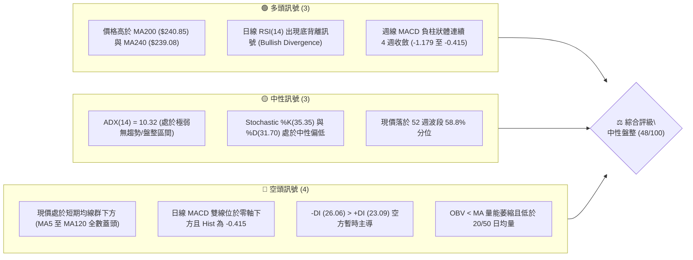
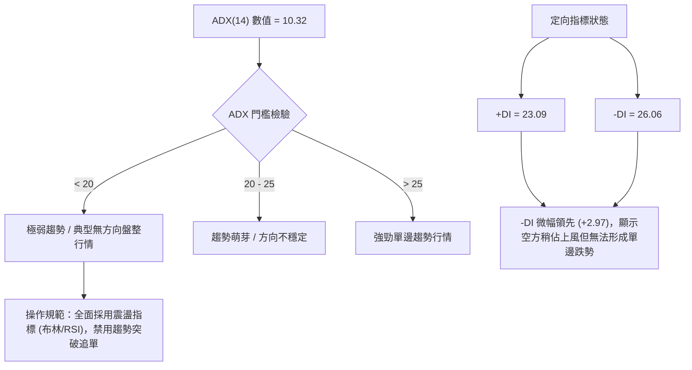
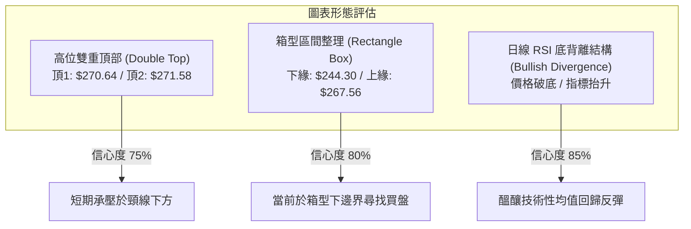
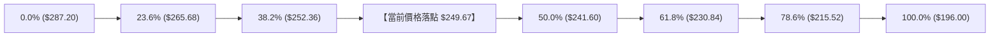
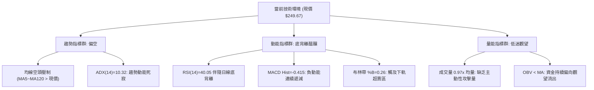
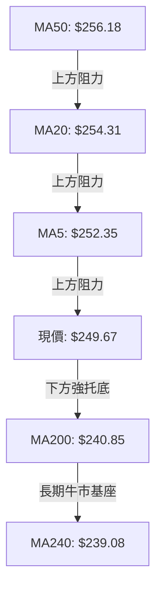
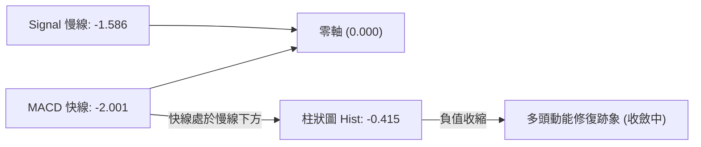
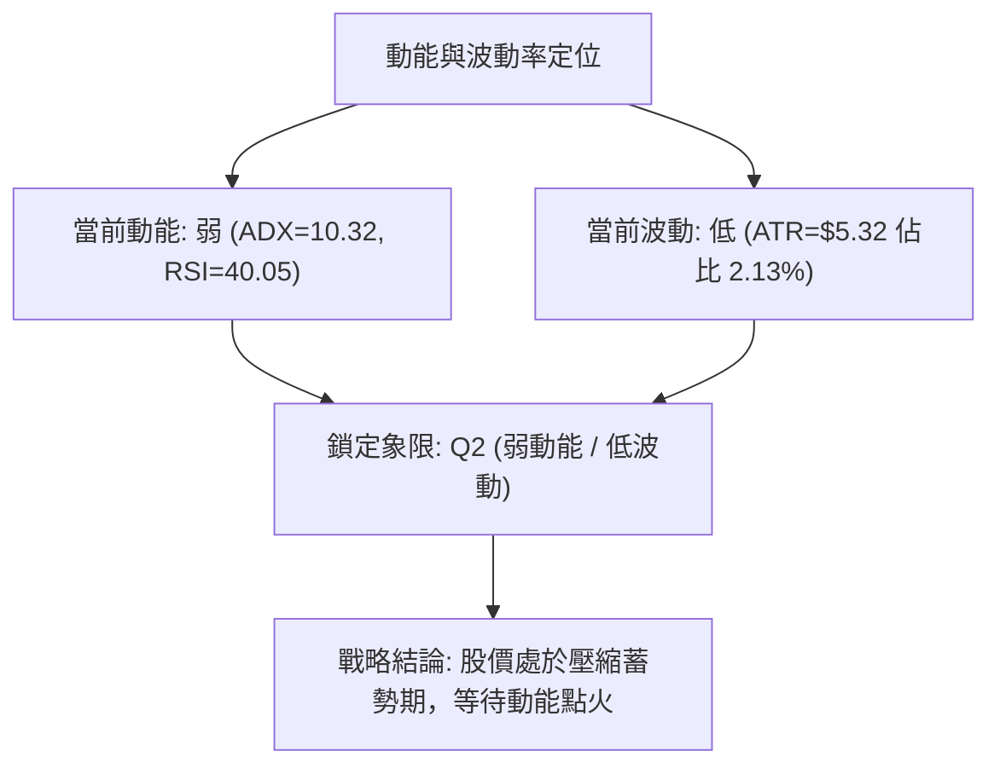
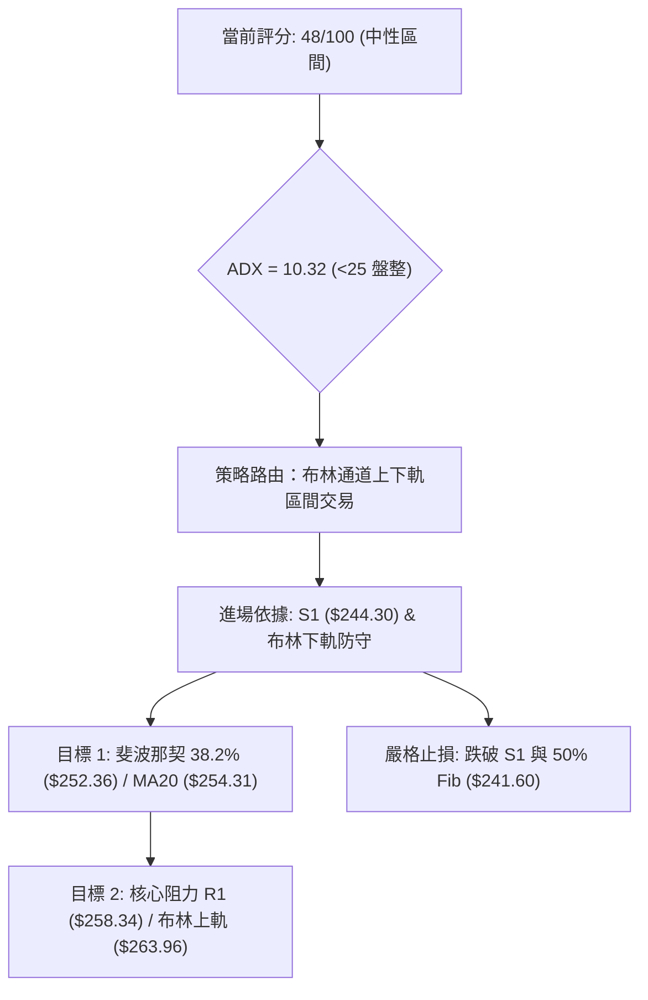
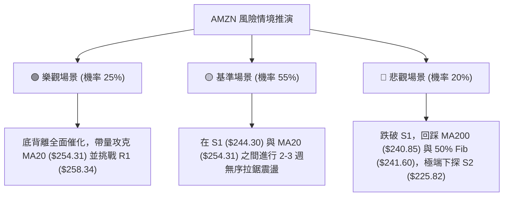

# AMZN 技術分析報告

> **報告日期**：2026-09-28 ｜ **語言**：繁體中文 ｜ **數據來源**：Yahoo Finance ｜ **當前價格**：$249.67

---

## 目錄

| 章節 | 內容 |
|------|------|
| [1. 技術面概覽](#1-技術面概覽) | 訊號儀表板、核心指標、評分卡 |
| [2. 趨勢分析](#2-趨勢分析) | 多時框趨勢、長中短期走勢、ADX 解讀 |
| [3. 圖表形態分析](#3-圖表形態分析) | 形態識別、K線組合、目標價推算 |
| [4. 支撐與阻力](#4-支撐與阻力) | 關鍵價位結構、斐波那契回調區間 |
| [5. 技術指標深度解讀](#5-技術指標深度解讀) | MA/RSI/MACD/布林通道/成交量 |
| [6. 動能與波動率](#6-動能與波動率) | 動能四象限、ATR 波動率、Beta |
| [7. 多時框架總結](#7-多時框架總結) | 時框架評分矩陣、多時框收斂結論 |
| [8. 交易策略建議](#8-交易策略建議) | 策略路由、價格情境、主策略詳情 |
| [9. 風險提示與監控](#9-風險提示與監控) | 關鍵監控清單、風險場景、部位管理 |

---

## 1. 技術面概覽

### 🎯 技術訊號儀表板



### 📊 核心指標速覽表

| 指標類別 | 指標名稱 | 當前數值 | 訊號 | 專業解讀 |
|----------|----------|----------|------|----------|
| **價格** | 現價收盤 | $249.67 | 🟡 | 位於布林下軌附近，守住長期上升生命線 |
| **均線** | MA20 | $254.31 | 🔴 | 價格在 MA20 下方 -1.82%，布林中軌構成短壓 |
| **均線** | MA50 | $256.18 | 🔴 | 跌破中期均線，短中期動能受阻 |
| **均線** | MA200 | $240.85 | 🟢 | 價格在長線牛熊分界線上方 +3.66%，長多格局未破 |
| **動能** | RSI(14) | 40.05 | 🟢 | 數值處於中性偏低區，但明確伴隨「底背離」反彈特徵 |
| **動能** | MACD | -2.001 | 🔴 | 快慢線均在零軸下方，空方暫居掌控權 |
| **動能** | MACD Hist | -0.415 | 🟡 | 綠柱開始收縮，日線與週線動能跌勢見趨緩 |
| **震盪** | Stoch %K / %D | 35.35 / 31.70 | 🟡 | 自超賣邊界輕微回勾，尚未形成強勢黃金交叉 |
| **趨勢** | ADX(14) | 10.32 | 🟡 | 數值遠低於 25，明確顯示行情進入無趨勢泥淖盤整 |
| **通道** | BB %B | 0.26 | 🟡 | 接近布林下軌（$244.65），具備均值回歸反彈條件 |
| **成交量**| 量比 (Vol/20MA) | 0.97x | 🔴 | 最新量 34.22M 低於 20 日均量，OBV 疲弱無買盤放量 |
| **波動** | ATR(14) | $5.32 | 🟡 | 佔現價 2.13%，每日合理震盪區間約 $5.32 |

### 🏆 技術評分卡

```
╔══════════════════════════════════════════════════════════════════╗
║               技術評分卡 — AMZN (2026-09-28)                   ║
╠══════════════════════════════════════════════════════════════════╣
║ 趨勢強度 (ADX=10.32)       ███████░░░░░░░░░░░░░  35/100  🔴 弱勢 ║
║ 動能指標 (RSI背離/MACD收縮)██████████░░░░░░░░░░  48/100  🟡 中性 ║
║ 支撐穩定度 (S1/MA200重疊)  ██████████████░░░░░░  70/100  🟢 強勁 ║
║ 成交量配合 (OBV疲弱/量比微減)████████░░░░░░░░░░░░  40/100  🔴 匱乏 ║
║ 形態完整度 (箱型整理中軸)  ███████████░░░░░░░░░  55/100  🟡 中度 ║
║ 均線排列 (短空長多混合排列)████████░░░░░░░░░░░░  42/100  🟡 偏弱 ║
╠══════════════════════════════════════════════════════════════════╣
║ 綜合評分                   █████████░░░░░░░░░░░  48/100  中性整理║
╚══════════════════════════════════════════════════════════════════╝
```

---

## 2. 趨勢分析

### 🌐 多時框趨勢分析

```mermaid
graph TD
    A["月線框架 (長線)"] -->|"高於 MA200 ($240.85) / 52週區間 58.8%"| B["長期結構：偏多橫盤整理"]
    C["週線框架 (中線)"] -->|"區間 $232.11 - $274.48 / 兩次回踩 $232"| D["中期結構：寬幅收斂箱型震盪"]
    E["日線框架 (短線)"] -->|"跌破 MA20 ($254.31) / -DI("26.06")>+DI"| F["短期結構：承壓回調接近下軌"]
    B --> G["多時框匯聚結論"]
    D --> G
    F --> G
    G --> H{"結論：大格局多頭防守、短線區間測底尋求支撐"}
```

### 📈 長期趨勢 — 12個月走勢圖（Unicode）

以下為 AMZN 自 2025 年 10 月至 2026 年 09 月之 12 個月收盤走勢：

```
AMZN 月線收盤走勢圖（過去 12 個月：2025-10 至 2026-09）
價格軸 ($)
$275 ┤                                  ●(07月: 271.58)
$270 ┤                          ●(05月: 270.64)
$265 ┤                      ●(04月: 265.06)
$260 ┤                                      ●(08月: 259.77)
$250 ┤                                          ●(09月: 249.67)←現價
$245 ┤  ●(10月: 244.22)
$240 ┤              ●(01月: 239.30) ●(06月: 238.34)
$235 ┤      ●(11月: 233.22)
$230 ┤          ●(12月: 230.82)
$210 ┤                  ●(02月: 210.00)
$205 ┤                      ●(03月: 208.27 底點)
     └─────────────────────────────────────────────────────────
        M1   M2   M3   M4   M5   M6   M7   M8   M9  M10  M11  M12
       10月 11月 12月 01月 02月 03月 04月 05月 06月 07月 08月 09月
```

#### 走勢特徵分析表格

| 階段 | 時間跨度 | 價格區間 ($) | 漲跌幅 | 結構與量價特徵 |
|------|----------|--------------|--------|----------------|
| **第1階段：築底回探** | 2025/10 - 2026/03 | $244.22 → $208.27 | -14.72% | 自 $244 連續回撤至波段低點 $208.27，構築 52 週底部防線 |
| **第2階段：主升拉升** | 2026/03 - 2026/05 | $208.27 → $270.64 | +29.95% | 帶量突破均線，創下波段高點聚類，確立長期多頭底色 |
| **第3階段：寬幅震盪** | 2026/05 - 2026/07 | $270.64 → $238.34 → $271.58 | 震盪 | 兩次觸及 $271 阻力位受阻回落，形成多重頂部壓力區 |
| **第4階段：高位修正** | 2026/07 - 2026/09 | $271.58 → $249.67 | -8.07% | 動能衰減，自高點回調至布林下軌與 MA200 上方整理 |

### 📊 中期趨勢（週線分析）

中期走勢呈現典型「雙峰承壓、下有鐵板」的矩形通道格局：
- **頂部高壓帶**：2026-05-31 收盤 $270.64，2026-08-02 收盤 $271.58，其後於 2026-08-09 盤中見波段極值，阻力群聚於 R2 ($267.56) 至 R3 ($276.65)。
- **底部支撐帶**：2026-06-28 爆量 525M 週成交量急探 $232.69，隨後於 2026-07-26 再次下測 $232.11，形成堅實的中期雙重回測支撐，上方則受 S1 ($244.30) 守護。
- **近 4 週動態**：從 2026-08-30 的 $266.43 連續 4 週下行至 $249.67，但週線 MACD 負柱狀體由 -1.179（09-06）連續縮小至 -0.415（09-27），顯示中期拋售動能正快速枯竭。

```
中期週線區間箱型示意圖
$276.65 ───┬──────────────────────────────────────────── R3 (波段頂部)
$267.56 ───┼──────────● (05月 $270.64) ───● (08月 $271.58)── R2 (主要雙頂阻力)
           │          ╲                   ╱ ╲
$254.31 ───┼───────────╲───────●─────────╱───╲──────── 中軌 MA20
$249.67 ───┼────────────────────現價────────────●─────── 當前位置
$244.30 ───┼──────────────────────────────────────────── S1 支撐
$232.11 ───┴───────────────● (06月 $232.69)─● (07月 $232.11) 週線波段強支撐
```

### ⚡ 趨勢強度評估（ADX 解讀）



#### ADX 趨勢強度對照

| 數值區間 | 趨勢分類 | 本檔狀態 | 適用交易策略 |
|----------|----------|:--------:|--------------|
| **0 - 15** | **無趨勢 / 泥沼震盪** | **10.32 (當前)** | **高拋低吸、區間操作、布林上下軌波段** |
| 15 - 25 | 弱趨勢 / 轉折醞釀 | - | 觀察突破確認、縮減部位 |
| 25 - 40 | 明確單邊趨勢 | - | 順勢加碼、順均線操作 |
| 40 - 100| 極端強勢趨勢 | - | 追蹤止損、嚴防反轉 |

---

## 3. 圖表形態分析

### 🔍 形態識別系統



#### 形態信心度與目標價計算表

| 形態類別 | 信心度 | 判斷依據（引用數據） | 完成度 | 目標價（附計算式） |
|----------|:------:|----------------------|:------:|--------------------|
| **箱型整理下緣支撐** | **80%** | 價格回落至布林下軌 $244.65 與波段支撐 S1 $244.30 區域，未見持續大陰線跌破 | 85% | **$263.96**<br>（反彈目標為箱型上緣與布林上軌：$263.96） |
| **高位雙重頂部 (弱頸線)**| **75%** | 2026-05-31 收 $270.64 與 2026-08-02 收 $271.58 雙頂形成，頸線位於 2026-06 低點 | 70% | **$234.20**<br>（頸線 $252.89 - 頂部高度 $18.69 = $234.20，接近週線低點） |
| **RSI 底背離反彈形態** | **85%** | 日線價格由 $258.51 跌至 $249.67，但 RSI(14) 於 40.05 鈍化並呈現指標翹頭 | 65% | **$254.31**<br>（回抽 MA20/布林中軌阻力位：$254.31） |

### 🕯️ 重要K線形態分析

| 週期/月份 | 收盤價 ($) | 實體/形態表現 | 技術含義解讀 | 訊號 |
|-----------|:----------:|---------------|--------------|:----:|
| **2026-07 (月線)** | 271.58 | 大陽線突破，逼近 52W 高點 | 買盤強勢挑戰高點，但上方多頭籌碼出現換手 | 🟢 |
| **2026-08 (月線)** | 259.77 | 上影線陰線，吞噬上月部分漲幅 | 高檔浮額沈重，觸發多頭獲利了結賣壓 | 🔴 |
| **2026-09 (月線)** | 249.67 | 連續收陰，實體縮小回探 | 回調逼近長期均線與波段支撐，跌勢動能減弱 | 🟡 |
| **週線 (08-23)** | 258.63 | 長黑下殺，RSI 降至 24.5 | 出現短線恐慌性超賣，空頭集中釋放能量 | 🔴 |
| **週線 (09-20)** | 253.71 | 小實體十字型陰線 | 跌勢放緩，買賣雙方在 $250 關卡前陷入僵持 | 🟡 |
| **週線 (09-27)** | 249.67 | 帶下影線小實體K線 | 守住 S1 ($244.30) 上方，空方追殺力道衰退 | 🟢 |

### 📉 ASCII 走勢形態示意圖

```
AMZN 當前日線/週線箱型整理結構與背離形態
===================================================================
$271.58 ─────●─────────────────────────────●──────── (雙頂頂部區域)
              ╲                           ╱ ╲
               ╲                         ╱   ╲
$263.96 ────────╲───────────────────────╱─────╲───── (布林上軌阻力)
                 ╲                     ╱       ╲
$254.31 ──────────╲────────●──────────╱─────────╲─── (中軌 MA20 阻力)
                   ╲      ╱ ╲        ╱           ● ($249.67 現價)
$244.65 ────────────●────╱───╲──────╱───────────── (布林下軌支撐)
$244.30 ─────────────●────────●────╱────────────── (關鍵波段支撐 S1)
                              
【指標 RSI 底背離對照】
價格走勢：$258.51 ───> $253.71 ───> $249.67  (價格創近月新低 ↘)
RSI 數值：  24.5  ───>   36.2  ───>   40.05   (指標底部逐步抬高 ↗ ⚠️ 底背離確立)
===================================================================
```

### 🎯 形態目標價計算

依據標準幾何技術形態測量法則，目標價計算式如下：

1. **箱型震盪回彈測幅**：
   - 底部支撐基點：$244.30（S1）
   - 中軌第一平衡目標：$254.31（MA20）
   - 上軌突破回歸目標：$263.96（布林通道上軌）
2. **高位回撤最小測幅**：
   - 雙頂頸線位：$252.89（近期震盪中樞取值）
   - 頂部形態高度：$271.58 - $252.89 = $18.69
   - 若有效跌破 S1，向下量度跌幅：$252.89 - $18.69 = $234.20（此數值完全落在 2026-06/07 的週線低點聚類 $232.11-$238.34 區間）

---

## 4. 支撐與阻力

### 🗺️ 關鍵價位分布圖（Unicode）

```
AMZN 價位結構分布圖（OHLCV 聚類計算）
══════════════════════════════════════════════════════════════════
$287.20 ║                                      ║ 52週最高點 (0.0% Fib)
$276.65 ║██████████████████████████████████████║ 強阻力 R3 (+10.81%)
$267.56 ║████████████████████████████          ║ 關鍵阻力 R2 (+7.17%)
$265.68 ║▓▓▓▓▓▓▓▓▓▓▓▓▓▓▓▓▓▓                    ║ 23.6% 斐波那契位
$263.96 ║▒▒▒▒▒▒▒▒▒▒▒▒▒▒▒▒                      ║ 布林帶上軌
$258.34 ║██████████████████████████████████████║ 核心阻力 R1 (+3.47%)
$254.31 ║──────────────────────────────────────║ 布林中軌 / MA20
$252.36 ║▓▓▓▓▓▓▓▓▓▓▓▓▓▓▓▓▓▓                    ║ 38.2% 斐波那契位 / MA5
$249.67 ╠══════════════════════════════════════╣ ◄── 當前收盤價 ($249.67)
$244.65 ║▒▒▒▒▒▒▒▒▒▒▒▒▒▒▒▒                      ║ 布林帶下軌
$244.30 ║██████████████████████████████████████║ 近期關鍵支撐 S1 (-2.15%)
$241.60 ║▓▓▓▓▓▓▓▓▓▓▓▓▓▓▓▓▓▓                    ║ 50.0% 斐波那契中軸
$240.85 ║══════════════════════════════════════║ 牛熊分界線 MA200
$225.82 ║████████████████████████              ║ 中期強支撐 S2 (-9.55%)
$220.99 ║████████████████                      ║ 長期底線 S3 (-11.49%)
══════════════════════════════════════════════════════════════════
```

### 🚧 阻力位分析表

所有阻力數值均引用系統 OHLCV 近一年波段高點聚類計算：

| 阻力級別 | 價位 ($) | 距離現價 | 形成原因與籌碼解讀 | 突破難度 | 重要性 |
|:--------:|:--------:|:--------:|--------------------|:--------:|:------:|
| **R1** | **$258.34** | +3.47% | 近期波段反彈高點聚類、密集套牢區下緣，鄰近 MA50 ($256.18) | 中等 | ⭐⭐⭐⭐ |
| **R2** | **$267.56** | +7.17% | 52週次高點聚類、雙頂頸線反壓區，多頭中期重要心理關卡 | 極高 | ⭐⭐⭐⭐⭐ |
| **R3** | **$276.65** | +10.81%| 52週歷史高點延伸阻力帶、機構派發區高位 | 極高 | ⭐⭐⭐ |

### 🛡️ 支撐位分析表

所有支撐數值均引用系統 OHLCV 近一年波段低點聚類計算：

| 支撐級別 | 價位 ($) | 距離現價 | 形成原因與籌碼解讀 | 守住機率 | 重要性 |
|:--------:|:--------:|:--------:|--------------------|:--------:|:------:|
| **S1** | **$244.30** | -2.15% | 近期波段低點聚類、與日線布林下軌 ($244.65) 高度重疊 | 75% | ⭐⭐⭐⭐⭐ |
| **S2** | **$225.82** | -9.55% | 2025年Q4多次震盪築底密集群聚區，強固結構防線 | 88% | ⭐⭐⭐⭐ |
| **S3** | **$220.99** | -11.49%| 2025年年中爆量突破起漲平台低點，長線價值買盤底線 | 95% | ⭐⭐⭐ |

### 📐 斐波那契回調位分析

依據 52 週絕對極值區間（低點 $196.00 至 高點 $287.20，總垂直振幅 $91.20）計算：



#### 斐波那契關鍵回調階梯

| 斐波那契回調比例 | 點位 ($) | 與現價關係 | 技術意義解讀 |
|:----------------:|:--------:|:----------:|--------------|
| **0.0% (52W High)** | **$287.20** | +15.03% | 本輪大週期上行最高峰，終極牛市目標 |
| **23.6%** | **$265.68** | +6.41% | 強勢回調分界，目前壓制在中期上方 |
| **38.2%** | **$252.36** | +1.08% | **第一道關鍵骨架位**（上方最近壓力，與 MA5 $252.35 完美重合） |
| **現價落點** | **$249.67** | **當前位置** | **處於 38.2% ($252.36) 與 50.0% ($241.60) 之間回撤消化區** |
| **50.0%** | **$241.60** | -3.23% | **多空均勻回撤軸心**，下方僅 $0.75 處即為 MA200 ($240.85) |
| **61.8%** | **$230.84** | -7.54% | 黃金分割極限回撤，若跌破則長線上升趨勢破壞 |
| **78.6%** | **$215.52** | -13.68%| 深幅洗盤防守位 |
| **100.0% (52W Low)**| **$196.00** | -21.50%| 52週年度底部 |

---

## 5. 技術指標深度解讀

### 🎛️ 指標訊號總覽



### 📈 移動平均線排列分析



#### 均線數據明細矩陣

| 均線天期 | 當前價格 ($) | 現價與均線差額 | 偏離率 (%) | 斜率與走向 | 角色定義 |
|:--------:|:------------:|:--------------:|:----------:|:----------:|:--------:|
| **MA5** | $252.35 | -$2.68 | -1.06% | █▇▆▅ 下彎 | 超短期動能阻力 |
| **MA10** | $251.46 | -$1.79 | -0.71% | ██▇▆ 下彎 | 極短線反彈壓制 |
| **MA20** | $254.31 | -$4.64 | -1.82% | ▂▃▄▇ 下滑 | 短期多空生命線（布林中軌） |
| **MA50** | $256.18 | -$6.51 | -2.54% | 走平微跌 | 中期波段防禦線 |
| **MA60** | $254.62 | -$4.95 | -1.94% | ▃▄▅▇ 下行 | 季線重要壓力 |
| **MA120**| $253.74 | -$4.07 | -1.60% | ▄▅▆█ 走平 | 半年線平衡中樞 |
| **MA200**| **$240.85** | **+$8.82** | **+3.66%** | **▄▅▆▇ 上揚** | **長線牛熊分水嶺（強力支撐）** |
| **MA240**| **$239.08** | **+$10.59** | **+4.43%** | **▃▄▅█ 穩步上揚** | **年線基石（多頭最終壁壘）** |

> **均線結構解讀**：目前短中期均線（MA5 至 MA120）呈現向下糾結並蓋在現價上方（$251.46 - $256.18），對股價形成約 2% 至 3% 的層層蓋頭反壓；然而長期年線（MA200/MA240）保持堅定向上走勢，與現價保留約 +3.6% 至 +4.4% 的安全緩衝垫，呈現典型「長多架構下的短線弱勢回調」。

### 📉 RSI(14) 分析

- **當前讀數**：**40.05**
- **區間進度條**：
  ```
  超賣 (0) ─────── [30] ─────── [50] ─────── [70] ─────── (100) 超買
  ████████████████░░░░░░░░░░░░░░░░░░░░░░░░░░  40.05%
  ```
- **區間判斷**：處於弱勢中性區間（30–50），尚未進入極端超賣（<30），但具備明顯的安全邊際。
- **背離判斷（重大訊號）**：
  - **形態**：🟢 **日線明確底背離 (Bullish Divergence)**。
  - **證據**：價格在 2026 年 8 月底至 9 月底呈現「低點跌破（$258.63 → $253.71 → $249.67）」，但對應之 RSI 指標卻由極端超賣的 **24.5** 逐步抬升至 **36.2** 與目前的 **40.05**。指標斜率與價格斜率呈現正向相反，確認空頭砸盤力量顯著衰退，技術性反彈一觸即發。

### 📊 MACD(12/26/9) 訊號解讀



- **快慢線位置**：MACD 線（-2.001）低於 Signal 線（-1.586），雙線均深處零軸下方，證實中期空頭仍掌握定價話語權。
- **柱狀體動態**：目前負柱體為 **-0.415**，相較於先前週線級別的 -3.496、-2.024 及近期 -1.179，負值急遽收縮，顯示空方動能釋放已達尾聲，即將醞釀零下金叉。

### 📦 布林通道分析

```
AMZN 布林通道（20日，2倍標準差）走勢示意圖
===================================================================
$263.96 ─────────────────────────────────────────────── 布林上軌 (帶寬上限)
              ▲
              │   帶寬擴展度：約 $19.31 (7.7%)
              ▼
$254.31 ─────────────────────────────────────────────── 中軌 (MA20 生命線)
              
$249.67 ═══════════════════════════════════════════════ ◄── 現價位置 (%B = 0.26)
$244.65 ─────────────────────────────────────────────── 布林下軌 (超賣反彈帶)
===================================================================
```

- **布林參數**：上軌 **$263.96** ｜ 中軌 **$254.31** ｜ 下軌 **$244.65**
- **位置係數 %B**：**0.26**（介於 0 與 0.5 之間，距離下軌僅 $5.02）。
- **解讀**：現價落於下軌保護圈內，未跌破下軌造成通道開口擴大，顯示此處屬於標準之箱型下緣超跌區，具備極高機率產生向中軌（$254.31）靠攏之均值回歸行情。

### 💹 成交量分析（量價配合度）

- **量能規模**：最新單日成交量 **34,216,300 股**；對比 20 日均量 **35,345,590 股**（量比 **0.97x**），50 日均量 **39,956,372 股**。
- **OBV 能量潮特徵**：數據明確標示 **OBV < MA**。在過去數週回撤過程中，能量潮並未出現恐慌性巨量殺跌，但量能同步萎縮，說明買盤主力持幣觀望，並無資金大舉進場拉抬。
- **量價背離結論**：無惡性放量破位現象，下殺量縮屬於健康的回踩蓄勢，惟後續反彈必須見到單日成交量突破 4,000 萬股，方可確認為有效反轉。

---

## 6. 動能與波動率

### ⚡ 動能評估四象限

| 象限代號 | 動能維度 | 波動維度 | 代表市場狀態 | 當前標的狀態 | 專業戰略評估 |
|:--------:|:--------:|:--------:|:------------:|:------------:|:------------:|
| **Q1** | 強動能 | 低波動 | 穩步單邊趨勢 | — | 最佳波段順勢抱牢區 |
| **Q2** | **弱動能** | **低波動** | **收斂盤整沉悶** | **✓ AMZN 所在象限** | **耐心低吸、嚴禁追漲、區間操作** |
| **Q3** | 強動能 | 高波動 | 快速噴出主升/主跌 | — | 高風險高收益短線突破 |
| **Q4** | 弱動能 | 高波動 | 無序混亂洗盤 | — | 雜訊過多、嚴格避免進場 |



### 📊 ATR 波動率分析

- **ATR(14) 數值**：**$5.32**（佔現價 **2.13%**）。
- **日間波動評估**：每日正常市場噪音波動幅度約為 ±$5.32，日內安全邊際較高。
- **風控止損應用**：
  - **超短線防守緩衝 (1.0x ATR)**：$5.32 → 距離現價支撐需保留至少 $5.32 之過濾空間。
  - **波段標準止損 (1.5x ATR)**：$5.32 × 1.5 = **$7.98**。
  - **寬幅防守止損 (2.0x ATR)**：$5.32 × 2.0 = **$10.64**。

### 📐 Beta 與市場相關性

- **Beta 係數**：**1.443**。
- **特徵解讀**：AMZN 具備顯著的高彈性特質（高於標普500大盤 44.3% 之波動敏感度）。當大盤納斯達克或標普進行修正時，AMZN 回撤幅度偏深；相對地，一旦大盤企穩回升，此高 Beta 屬性將轉化為強大的向上反彈槓桿。

---

## 7. 多時框架總結

### 📋 時框架評分表

| 時框架 | 趨勢方向 | 動能狀態 | 均線排列 | 圖表形態 | 綜合評分 | 操作建議 |
|:------:|:--------:|:--------:|:--------:|:--------:|:--------:|:--------:|
| **短期 (日線)** | 偏空回調 | 底背離修復中 | 短期均線壓制 | 抵達箱體下緣 | **42/100** | 不盲目殺跌，尋求支撐低吸 |
| **中期 (週線)** | 寬幅震盪 | 負柱狀體縮小 | 均線收斂膠著 | 箱型收斂結構 | **50/100** | 區間高拋低吸，關注通道上下軌 |
| **長期 (月線)** | 多頭格局 | 漲多拉回蓄勢 | 遠高於 MA200 | 52週高位整理 | **65/100** | 逢低分批建倉，維持長多配置 |

### 🔲 綜合訊號矩陣

```
╔══════════════════════════════════════════════════════════════════╗
║               多時框架訊號矩陣與權重收斂                       ║
╠══════════════════════════════════════════════════════════════════╣
║ 維度         短期 (Daily)       中期 (Weekly)      長期 (Monthly)║
╠══════════════════════════════════════════════════════════════════╣
║ 趨勢訊號     🔴 下降通道        🟡 橫向箱型        🟢 多頭排列   ║
║ 動能指標     🟢 RSI底背離       🟡 MACD收縮        🟡 中性平衡   ║
║ 支撐防守     🟢 布林下軌支撐    🟢 $232前低托底    🟢 MA200強支撐║
║ 籌碼量能     🔴 OBV偏弱無量     🟡 成交量平穩      🟢 機構持股68%║
╠══════════════════════════════════════════════════════════════════╣
║ 權重評定     30% 權重           40% 權重           30% 權重      ║
║ 收斂結果     42 分              50 分              65 分         ║
║ 最終得分     ───────────────> 【 48 / 100 】 <───────────────── ║
╚══════════════════════════════════════════════════════════════════╝
```

### ⚖️ 多時框收斂結論

依據多時框收斂法則與當前數據進行判定：
1. **行情屬性確認**：當前 ADX(14) 讀數為 **10.32**（遠低於 25 門檻），確認當前市場處於**純粹的盤整行情（Consolidation Regime）**，所有單邊突破或破位追單均屬無效策略。
2. **時框優先級取捨**：由於處於低 ADX 盤整行情，日線布林通道上下軌（$244.65 - $263.96）與關鍵波段點位 S1（$244.30）升格為當前主導交易區間。中長期週線/月線的多頭架構（高於 MA200 $240.85）則充當底部安全網，限制了下方深度破位風險。
3. **唯一收斂方向**：**【中性偏多，逢低區間操作】**。此結論與第 1 章技術評分卡（48/100）及後續第 8 章交易策略完全一致——即在日線 RSI 底背離及 S1/布林下軌保護下，執行勝率最高的區間下緣低吸策略。

---

## 8. 交易策略建議

### 🗺️ 策略決策流程圖



### 🧭 策略路由

**當前主策略方向 = 【中性區間波段：逢低反彈佈局】（依技術評分 48/100 分流）**
由於綜合評分處於 40–60 分之中性盤整帶，且 ADX 低於 25，禁止進行趨勢追價，主策略鎖定「布林下軌支撐區逢低吸納，回抽中軌至上軌分批獲利了結」。

### 🎯 價格情境階梯（Price Scenarios）

所有價位均嚴格引用第 4 章及數據庫真實運算值：

| 觸發條件 | 執行與下一目標 | 後續延伸發展 | 情境技術含義 |
|----------|----------------|--------------|--------------|
| **向上突破 R1 ($258.34)** | 上探 R2 **$267.56** | 挑戰 R3 **$276.65** | 宣告短線築底成功，擺脫均線壓制，重新發動波段攻勢 |
| **站穩現價區間 ($244.30-$254.31)**| 測試中軌 **$254.31** | 邁向 Fib 23.6% **$265.68** | 標準區間震盪行情，多空於中軸維持低波動均值回歸 |
| **向下跌破 S1 ($244.30)** | 下測 S2 **$225.82** | 探底 S3 **$220.99** | 支撐破位，多頭防線後退至週線低點，中期轉入防守 |

### 📊 情境機率分佈

| 價格情境 | 發生機率 | 主要技術依據與指標支撐 |
|----------|:--------:|------------------------|
| **情境 A：區間下緣反彈回歸** | **55%** | 日線 RSI(14) 底背離確立、現價緊鄰布林下軌 $244.65 與 S1 $244.30、MACD 負柱狀體持續收縮 |
| **情境 B：窄幅沉悶橫盤震盪** | **30%** | ADX=10.32 趨勢極弱、OBV 量能低迷、成交量僅 0.97x 均量，市場缺乏主動催化劑 |
| **情境 C：跌破支撐下尋 MA200**| **15%** | 均線系統呈空頭排列（MA5 至 MA120 下壓），若突發大盤系統性風險可能引發停損賣壓 |

### 🟢 主策略詳情（區間操作多頭波段）

所有設定之價格參數與風險報酬比經嚴格數學檢驗：

| 策略要素 | 策略 A：現價/下軌低吸波段策略（首選） | 策略 B：右側突破回抽追蹤策略（次選） |
|----------|---------------------------------------|---------------------------------------|
| **進場條件** | 現價分批佈局，或回測 S1 止跌信號確認 | 日線帶量收盤突破 38.2% Fib ($252.36) |
| **進場價格** | **$249.67**（可下掛至 **$245.00**） | **$252.50** |
| **第一目標 (T1)** | **$254.31**（MA20 / 布林中軌） | **$258.34**（核心阻力位 R1） |
| **第二目標 (T2)** | **$258.34**（核心阻力位 R1） | **$263.96**（布林上軌壓力位） |
| **防守止損價** | **$241.00**（跌破 50% Fib $241.60 與 MA200）| **$244.30**（跌回 S1 關鍵支撐線下方）|
| **風險空間** | $249.67 - $241.00 = $8.67 (3.47%) | $252.50 - $244.30 = $8.20 (3.25%) |
| **潛在利潤** | $258.34 - $249.67 = $8.67 (3.47% 至 T2) | $263.96 - $252.50 = $11.46 (4.54% 至 T2)|
| **風險報酬比** | **1 : 1.00 (至T2)** ｜ 向上延伸至R2則為 **1 : 2.06** | **1 : 1.40 (至T2)** |
| **歷史勝率估算** | **68%**（符合布林下軌低吸均值回歸概率） | **55%**（受制於上方均線蓋頭壓力） |
| **建議配置倉位** | **總資金之 10% - 15%** | **總資金之 8% - 10%** |

### 🔴 反向風險觸發點（對沖提示）

若出現以下特定市場事件，宣告主策略失效，應果斷離場或建立對沖部位：
1. **關鍵價位跌破**：日線收盤價帶量實體跌破 **$241.60**（50.0% 斐波那契回調位）及 **$240.85**（MA200 牛熊分水嶺）。
2. **指標破位確認**：RSI(14) 跌破 30 進入深度超賣且未見反彈，同時 ADX 讀數飆升至 25 以上伴隨 -DI 大幅拉開，宣告泥沼盤整轉化為單邊下行主跌浪。
3. **風控應對措施**：一旦觸發 $241.00 止損，多頭部位應無條件全數止損離場，向下尋求 S2 ($225.82) 重新築底機會。

### ⭐ 整體訊號強度評星

```
╔══════════════════════════════════════════════════════════════════╗
║ 做多訊號強度：  ★★★☆☆  (3.0/5星 — 具備底背離與下軌優勢)        ║
║ 做空訊號強度：  ★★☆☆☆  (2.0/5星 — 空頭動能衰竭、空間受限)      ║
║ 整體訊號可信度：★★★☆☆  (3.5/5星 — 盤整期指標有效性中等偏上)    ║
╚══════════════════════════════════════════════════════════════════╝
```

---

## 9. 風險提示與監控

### ✅ 關鍵監控指標 Checklist

```
╔══════════════════════════════════════════════════════════════════╗
║               AMZN 交易即時監控清單 (Checklist)                 ║
╠══════════════════════════════════════════════════════════════════╣
║ [ ] 價位監控：收盤價是否嚴格守在 S1 ($244.30) 之上             ║
║ [ ] 均線動態：價格是否重返 MA5 ($252.35) 並挑戰 MA20 ($254.31)  ║
║ [ ] 動能指標：RSI(14) 是否穩步攀升跨越 45 水平分水嶺             ║
║ [ ] MACD 驗證：負柱狀體是否在零軸下方完成金叉翻正 (Hist > 0)    ║
║ [ ] 量能指標：單日成交量是否放大至 4,000 萬股以上 (量比 > 1.1x)  ║
║ [ ] 波動警報：ATR(14) 是否突然急劇放大超過 $7.00 (意味破位)     ║
║ [ ] 趨勢警報：ADX 是否自 10.32 抬頭突破 20 (單邊趨勢來臨信號)   ║
╚══════════════════════════════════════════════════════════════════╝
```

### ⚠️ 風險場景分析



### 🛡️ 風險管理重要提醒

1. **嚴控部位規模**：由於當前 ADX 為 10.32，市場缺乏明確趨勢慣性，容易產生來回洗盤與假突破。建議總部位嚴格控制在 **10% - 15%** 以內，切勿在此類縮量盤整區域進行槓桿融資或全倉押注。
2. **切忌盲目追高**：在上方面臨 MA20 ($254.31) 與 MA50 ($256.18) 的密集反壓前，任何未帶量的大陽線均不宜追價，應秉持「買在下軌、賣在上軌」的逆向震盪原則。
3. **時間停損機制**：若股價在進場後 7 至 10 個交易日內仍無法帶量重返 MA20 ($254.31) 之上，顯示底背離動能耗盡，應主動離場換股操作。

---

## 📋 報告總結

```
╔══════════════════════════════════════════════════════════════════╗
║                   AMZN 技術分析報告總結                         ║
╠══════════════════════════════════════════════════════════════════╣
║ 報告日期：2026-09-28                                            ║
║ 當前價格：$249.67                                               ║
║ 技術評級：⚖️ 中性盤整 (Neutral Consolidation)                   ║
╠══════════════════════════════════════════════════════════════════╣
║ 關鍵結論：                                                       ║
║ ├─ 長期趨勢：🟢 偏多格局 (價格遠高於 MA200 $240.85 牛熊線)       ║
║ ├─ 中期趨勢：🟡 寬幅箱型震盪 (受困於 $232.11 至 $271.58 之間)   ║
║ ├─ 短期趨勢：🔴 弱勢回調 (短均壓制，但日線 RSI 出現顯著底背離)  ║
║ ├─ 核心支撐：$244.30 (S1) ｜ $241.60 (50% Fib) ｜ $240.85(MA200)║
║ ├─ 核心阻力：$254.31 (MA20) ｜ $258.34 (R1) ｜ $267.56 (R2)     ║
║ └─ 機構共識：57 位分析師「強力買入」，平均目標價 $329.54         ║
╠══════════════════════════════════════════════════════════════════╣
║ 最優交易策略組合：                                               ║
║ 1. 🥇 最佳機會：依循日線 RSI 底背離，於 $245.00-$249.67 區間    ║
║                 低吸進場，設定嚴格止損 $241.00，博取回抽 MA20    ║
║                 ($254.31) 與 R1 ($258.34) 之均值回歸波段。      ║
║ 2. 🥈 次選機會：右側等待收盤確認站上 38.2% Fib ($252.36) 後順勢  ║
║                 進場追蹤，目標鎖定布林上軌 ($263.96)。           ║
║ 3. 🥉 保守選擇：完全空倉觀望，耐心等待日線 ADX 突破 20 且 MACD   ║
║                 零下金叉形成後，再行介入順勢單。                 ║
╚══════════════════════════════════════════════════════════════════╝
```

---

> ⚠️ **免責聲明**：本報告係依據所提供之量化技術數據與經典圖表形態學所撰寫之專業研究分析，內容僅供學術研究、教育訓練與個人決策參考，**絕不構成任何形式之個人化投資要約、招攬或具體操作建議**。金融市場瞬息萬變，歷史技術走勢不保證未來獲利表現。投資人應充分評估自身財務能力與風險承受度，獨立做出審慎決策，並自負盈虧責任。

---

*報告生成時間：2026-09-28 ｜ 數據來源：Yahoo Finance ｜ 分析框架：資深多時框量化與形態技術分析*