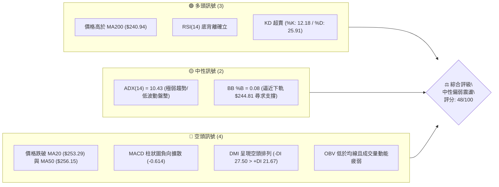
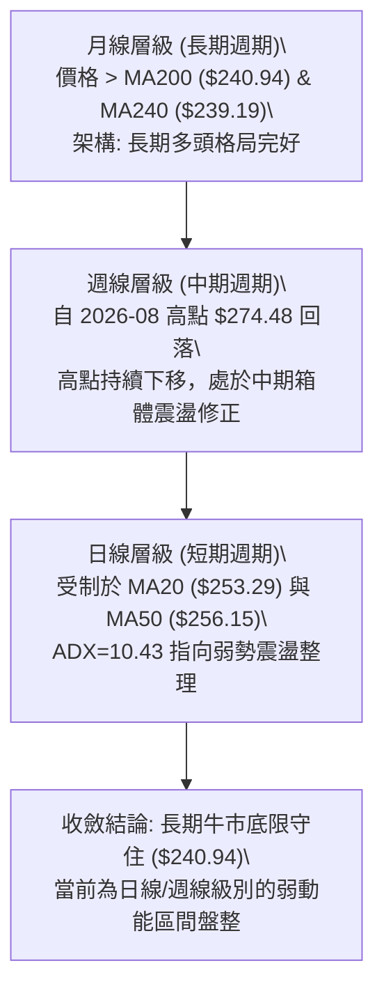
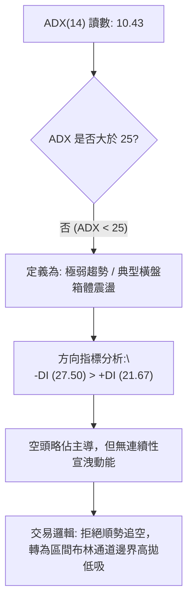
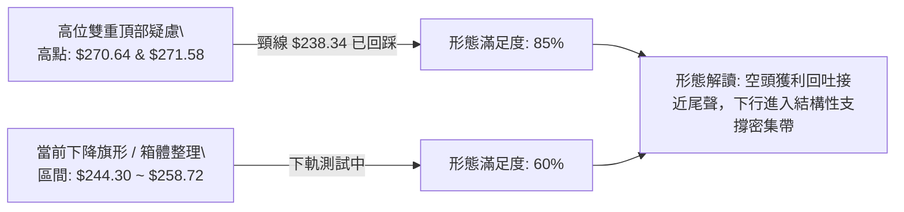
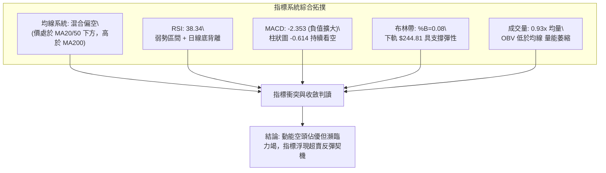
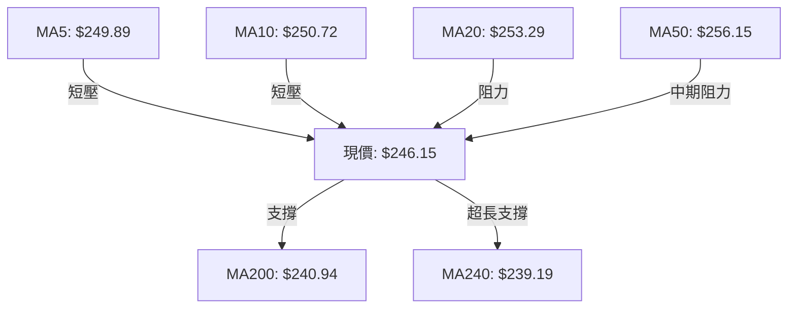
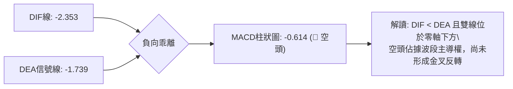
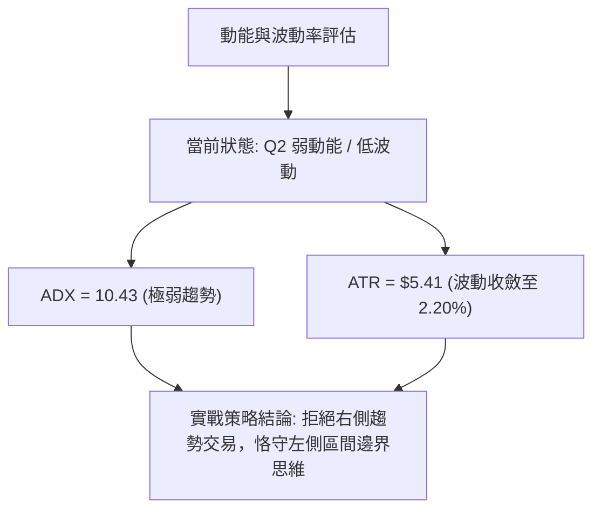
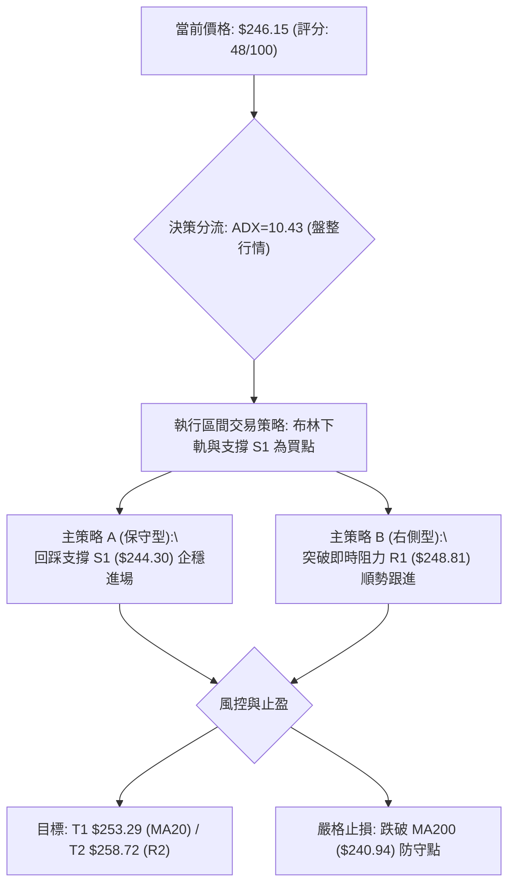
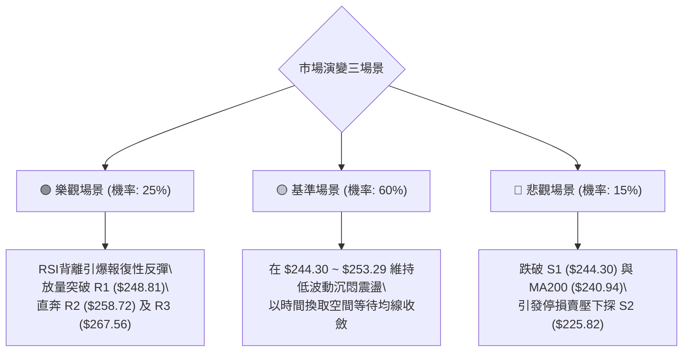

# AMZN 技術分析報告

> **報告日期**：2026-09-29 ｜ **語言**：繁體中文 ｜ **數據來源**：Yahoo Finance ｜ **當前價格**：$246.15

---

## 目錄

| 章節 | 內容 |
|------|------|
| [1. 技術面概覽](#1-技術面概覽) | 訊號儀表板、核心指標、評分卡 |
| [2. 趨勢分析](#2-趨勢分析) | 多時框趨勢、長中短期走勢 |
| [3. 圖表形態分析](#3-圖表形態分析) | 形態識別、K線組合、目標價 |
| [4. 支撐與阻力](#4-支撐與阻力) | 關鍵價位、斐波那契回調 |
| [5. 技術指標深度解讀](#5-技術指標深度解讀) | MA/RSI/MACD/布林/成交量 |
| [6. 動能與波動率](#6-動能與波動率) | 動能評估、ATR、Beta |
| [7. 多時框架總結](#7-多時框架總結) | 時框架評分矩陣 |
| [8. 交易策略建議](#8-交易策略建議) | 多空策略、風險報酬比 |
| [9. 風險提示與監控](#9-風險提示與監控) | 監控指標、風險場景 |
| [10. 報告總結](#-報告總結) | 總結儀表板與核心要點 |

---

## 1. 技術面概覽

### 🎯 技術訊號儀表板



### 📊 核心指標速覽表

| 指標類別 | 指標名稱 | 當前數值 | 訊號 | 解讀 |
|:---|:---|:---|:---:|:---|
| **價格** | 當前價格 | $246.15 | 🟡 | 位於52週區間55.0%分位，處於波段中軸附近震盪 |
| **均線** | MA20 | $253.29 | 🔴 | 現價低於MA20達 -2.82%，短線承壓 |
| **均線** | MA50 | $256.15 | 🔴 | 現價低於MA50，中期多頭結構遭遇破壞 |
| **均線** | MA200 | $240.94 | 🟢 | 現價高於MA200達 +2.16%，長期多空生命線未破 |
| **均線** | MA240 | $239.19 | 🟢 | 超長期牛熊線持續向上延伸 (+2.91%) |
| **動能** | RSI(14) | 38.34 | 🟡 | 位於弱勢區間但未破30，且出現底背離醞釀反彈 |
| **動能** | MACD | -2.353 / -1.739 | 🔴 | MACD位於零軸下方且MACD柱(-0.614)持續看空 |
| **動能** | 隨機KD | 12.18 / 25.91 | 🟢 | 進入極度超賣區，存在均值回歸修復需求 |
| **趨勢** | ADX(14) | 10.43 | 🟡 | ADX < 25 處於典型無趨勢/盤整格局，方向不明顯 |
| **通道** | 布林通道 | %B = 0.08 | 🟡 | 逼近下軌 $244.81，通道未開口，暗示下行空間受限 |
| **成交量**| OBV | OBV < MA | 🔴 | 量能疲弱，最新日量(3,195.5萬)低於20日均量(0.93x) |
| **波動** | ATR(14) | $5.41 (2.20%) | 🟡 | 波動率收斂至常態偏低水平，利於構築震盪區間 |

### 🏆 技術評分卡

```
╔══════════════════════════════════════════════════════════════════╗
║              技術評分卡 — AMZN (2026-09-29)                     ║
╠══════════════════════════════════════════════════════════════════╣
║ 趨勢強度 (Trend)      ██████░░░░░░░░░░░░░░  30/100 🔴 空頭微弱主導 ║
║ 動能指標 (Momentum)   █████████░░░░░░░░░░░  45/100 🟡 KD超賣背離   ║
║ 支撐穩定度 (Support)  ██████████████░░░░░░  70/100 🟢 S1/MA200共振 ║
║ 成交量配合 (Volume)   ████████░░░░░░░░░░░░  40/100 🔴 量能萎縮匱乏 ║
║ 形態完整度 (Pattern)  ████████████░░░░░░░░  60/100 🟡 區間箱體築底 ║
║ 均線架構 (MA System)  ████████░░░░░░░░░░░░  42/100 🔴 短空長多混合 ║
╠══════════════════════════════════════════════════════════════════╣
║ 綜合技術評分          ██████████░░░░░░░░░░  48/100 ⚖️ 中性偏弱震盪 ║
╚══════════════════════════════════════════════════════════════════╝
```

---

## 2. 趨勢分析

### 🌐 多時框趨勢分析



### 📈 長期趨勢 — 12個月走勢圖（Unicode）

```
AMZN 月線歷史價格走勢圖（2025-10 至 2026-09）
價格軸 ($)
$275 ┤                                  ●(07月:$271.58)
$270 ┤                            ●(05月:$270.64)
$265 ┤                      ●(04月:$265.06)
$260 ┤                                        ●(08月:$259.77)
$255 ┤
$250 ┤
$245 ┤  ●(10月:$244.22)                            ●(09月:$246.15)←現價
$240 ┤              ●(01月:$239.30)   ●(06月:$238.34)
$235 ┤      ●(11月:$233.22)
$230 ┤          ●(12月:$230.82)
$210 ┤                  ●(02月:$210.00)
$205 ┤                      ●(03月:$208.27)
     └─────────────────────────────────────────────────────────►
        10  11  12  01  02  03  04  05  06  07  08  09  (月份)
```

**走勢特徵分析表格**：

| 階段週期 | 期間區間 | 起訖價格 ($) | 漲跌幅 (%) | 價量特徵與結構意涵 |
|:---|:---|:---:|:---:|:---|
| **階段一：回踩築底** | 2025-10 ~ 2026-03 | $244.22 → $208.27 | -14.72% | 消化前期漲幅，於 $208.27 形成年度次低點，確認長期支撐 |
| **階段二：強勢主升** | 2026-03 ~ 2026-05 | $208.27 → $270.64 | +29.95% | 爆發性巨量長紅突破，奠定年度偏多格局基調 |
| **階段三：高位震盪** | 2026-05 ~ 2026-07 | $270.64 → $271.58 | +0.35% | 於 $271.58 創波段收盤高點，盤中見 52W 高點 $287.20 後受阻 |
| **階段四：收斂回檔** | 2026-07 ~ 2026-09 | $271.58 → $246.15 | -9.36% | 動能衰退，逐級跌破短均線，回測長期均線支撐密集區 |

### 📊 中期趨勢（週線分析）

```
近20週壓力與支撐階梯圖：
$287.20 ──────────────────────────── 52週高點 (極強阻力)
$274.48 ──────────┬───────────────── 08/09 週收盤頂部
                  │
$267.56 ──────────┼─── [R3 關鍵阻力]
$258.72 ──────────┼─── [R2 短線頸線壓力]
$253.29 ──────────┼─── [BB中軌 / MA20 壓制線]
$248.81 ──────────┼─── [R1 即時反彈壓力]
$246.15 ══════════╪═══ ◄ 當前收盤價 ($246.15)
$244.30 ──────────┴─── [S1 近一年波段低點聚類支撐]
$240.94 ──────────────────────────── [MA200 多空生命線]
$230.84 ──────────────────────────── [斐波那契 61.8% / S2: $225.82 防線]
```

### ⚡ 趨勢強度評估（ADX 解讀）



| 指標變數 | 數值 | 狀態評估 | 戰術意涵 |
|:---|:---:|:---:|:---|
| **ADX(14)** | 10.43 | 極弱趨勢 (極低值) | 單邊動能徹底衰竭，市場進入存量資金摩擦的震盪磨底期 |
| **+DI** | 21.67 | 多頭動能偏弱 | 買盤追價意願不足，難以形成向上穿透性突破 |
| **-DI** | 27.50 | 空方居於微幅優勢 | 空方雖有主導權，但缺乏恐慌盤拋售確認，殺跌易受阻 |

---

## 3. 圖表形態分析

### 🔍 形態識別系統



**形態信心度評估表**：

| 識別形態名稱 | 信心度 | 判斷依據（引用技術數據） | 形態完成度 | 目標價推算與說明（附計算式） |
|:---|:---:|:---|:---:|:---|
| **高位雙頂結構回撤** | 65% | 2026年5月收盤 $270.64 與7月收盤 $271.58 構築雙頂，頸線為2026年6月低點收盤 $238.34 | 85% (已高度反映) | 形態高度 = $271.58 - $238.34 = $33.24。理論等幅測幅低點 = $238.34 - $33.24 = **$205.10**；目前價格在接近頸線處獲支撐放緩。 |
| **矩形收斂箱體盤整** | 70% | 價格受到波段低點 S1 **$244.30** 支撐，上方受波段阻力 R2 **$258.72** 壓制 | 60% (運行中) | 箱體高度 = $258.72 - $244.30 = $14.42。若向上突破 R2：$258.72 + $14.42 = **$273.14**。若向下跌破 S1：$244.30 - $14.42 = **$229.88**。 |
| **頭肩底形態** | 25% | 數據中未偵測到此形態幾何特徵 | 0% | **訊號不足，僅做指標型解讀，不預設該形態。** |

### 🕯️ 重要K線形態分析

| 週期/月份 | 收盤價 | 核心K線形態特徵 | 結構解讀 | 多空訊號 |
|:---|:---:|:---|:---|:---:|
| **2026-06** | $238.34 | 大幅下影長陰棒 | 空方長驅直入但觸及 $232.69 週線低位後引發長下影承接盤 | 🟡 止跌洗盤 |
| **2026-07** | $271.58 | 強勢反彈長陽線 | 多方反撲收復失地，多頭能量宣洩並逼近前高阻力帶 | 🟢 多頭上攻 |
| **2026-08** | $259.77 | 帶上影中陰線 | 52週高點 $287.20 拋壓沉重，反彈無力後獲利盤出逃 | 🔴 滯漲回檔 |
| **2026-09** | $246.15 | 縮量陰十字星/孕線 | 跌勢顯著趨緩，波動率收縮，賣盤意願隨量能萎縮而降低 | 🟡 變盤醞釀 |

### 📉 ASCII 走勢形態示意圖

```
AMZN 日線級別局部箱體整理結構示意圖：
阻力位 R2 $258.72 ───────────┬──────────────┬──────────── (箱頂壓制)
                             │   ●          │
阻力位 R1 $248.81 ───────────┼──/───\───────┼───/────── (短線頸線)
                             │ /     \      │  /
當前價格  $246.15 ═══════════╪/═══════\═════╪═● 現價 ($246.15)
                             │         \   /│
支撐位 S1 $244.30 ───────────┴───────────●──┴──────────── (箱底防線)
                            [2026-08]   [2026-09]
```

### 🎯 形態目標價計算

根據矩形收斂形態計算之邊界演繹：
1. **箱體上限突破目標**：以波段阻力 R2 **$258.72** 與箱底 S1 **$244.30** 之垂直落差 $14.42 為基準。一旦量能放大突破 $258.72，理論目標價即為：
   $$\text{目標價} = \$258.72 + \$14.42 = \$273.14$$
   （該價位與2026-08-09週收盤高點 $274.48 形成密集壓制區）。
2. **箱體下限跌破目標**：若失守 S1 **$244.30**，則等幅下探目標為：
   $$\text{下探目標} = \$244.30 - \$14.42 = \$229.88$$
   （該價位極為貼近波段強支撐 S2 **$225.82** 及斐波那契 61.8% 處的 **$230.84**）。

---

## 4. 支撐與阻力

### 🗺️ 關鍵價位分布圖（Unicode）

```
AMZN 價位結構分布圖（引用 OHLCV 聚類計算與斐波那契點位）
══════════════════════════════════════════════════════════════════
$287.20 ║████████████████████████████████║ 52週歷史高點 (0.0% Fib)
$267.56 ║████████████████████████        ║ 強阻力 R3 (近一年波段高點聚類)
$265.68 ║▓▓▓▓▓▓▓▓▓▓▓▓▓▓▓▓▓▓▓▓▓▓          ║ 斐波那契 23.6% 回調位
$258.72 ║████████████████                ║ 波段阻力 R2 (箱體震盪上軌)
$253.29 ║▓▓▓▓▓▓▓▓▓▓                      ║ MA20 短期均線壓制位
$252.36 ║▓▓▓▓▓▓▓▓▓                       ║ 斐波那契 38.2% 回調位
$248.81 ║████████                        ║ 即時阻力 R1 (+1.08%)
$246.15 ╠════════════════════════════════╣ ◄ 當前市價 ($246.15)
$244.81 ║░░░░░░░░░░                      ║ 布林通道下軌
$244.30 ║████████████                    ║ 核心支撐 S1 (-0.75%, 波段低點聚類)
$241.60 ║▓▓▓▓▓▓▓▓▓▓▓▓▓▓▓▓                ║ 斐波那契 50.0% 中樞平衡位
$240.94 ║████████████████████            ║ MA200 牛熊分水嶺
$230.84 ║▓▓▓▓▓▓▓▓▓▓▓▓▓▓▓▓▓▓▓▓▓▓▓▓        ║ 斐波那契 61.8% 黃金分割強防線
$225.82 ║██████████████████████████      ║ 強支撐 S2 (波段深次回調低點)
$220.99 ║████████████████████████████    ║ 極限支撐 S3 (-10.22%)
══════════════════════════════════════════════════════════════════
```

### 🚧 阻力位分析表

| 阻力級別 | 具體價位 | 形成原因與技術共振 | 突破難度 | 戰略重要性 |
|:---|:---:|:---|:---:|:---:|
| **R1** | **$248.81** | 近一年波段高點聚類、貼近MA5 ($249.89) 與MA10 ($250.72) 壓迫帶 | 🟡 中等偏易 | 短線反彈第一道試金石，突破方能解除極短線超賣下行壓力 |
| **R2** | **$258.72** | 波段高點聚類、共振MA50 ($256.15) 及日線布林通道中軌 ($253.29) | 🔴 極具挑戰 | 中期多空轉折分水嶺，站穩方宣告重回日線升勢 |
| **R3** | **$267.56** | 近一年波段頂部聚類、共振斐波那契 23.6% 回調位 ($265.68) | 🔴 極難攻克 | 波段多頭再起目標，需伴隨全市場強流動性挹注 |

### 🛡️ 支撐位分析表

| 支撐級別 | 具體價位 | 形成原因與技術共振 | 守住機率 | 戰略重要性 |
|:---|:---:|:---|:---:|:---:|
| **S1** | **$244.30** | 近一年波段低點聚類，與當前布林下軌 ($244.81) 高度重疊 | 🟢 70% | 區間防守第一道防線，破位將觸發短線多頭停損 |
| **S2** | **$225.82** | 波段低點聚類，共振斐波那契 61.8% ($230.84) 緩衝緩衝區 | 🟢 85% | 中期防禦重鎮，守住可保長期震盪向上多頭骨架不散 |
| **S3** | **$220.99** | 極端拋售波段深谷聚類，接近長期上升趨勢軌道底端 | 🟢 95% | 結構性底線，跌破則宣告長期牛市終結 |

### 📐 斐波那契回調位分析

依據 52週極值區間（低點 **$196.00** 至 高點 **$287.20**，垂直跨度 $91.20）嚴格計算：

```
0.0%  (52W High) ─── $287.20
23.6% 回調位     ─── $265.68
38.2% 回調位     ─── $252.36
──────────────────────────────────────
當前市價落點     ─── $246.15 (介於 38.2% 與 50.0% 之間)
──────────────────────────────────────
50.0% 中樞平衡位 ─── $241.60
61.8% 黃金分割位 ─── $230.84
78.6% 深度回調位 ─── $215.52
100.0%(52W Low)  ─── $196.00
```

- **結構位置解讀**：
  現價 **$246.15** 跌破 38.2% 回調位（**$252.36**），目前正朝 50.0% 基準平衡位（**$241.60**）尋求下檔支撐。
  值得高度注意的是，50.0% 回調位 **$241.60** 與日線 MA200（**$240.94**）構成極為強大的技術共振防護帶（價差僅 $0.66）。只要此複合共振帶不破，本次回檔即屬於技術性「健康中期回吐」，多頭長線格局依然屹立。

---

## 5. 技術指標深度解讀

### 🎛️ 指標訊號總覽



### 📈 移動平均線排列分析



| 均線名稱 | 數值 | 現價差距 | 乖離率 (%) | 斜率狀態 | 結構定位 |
|:---|:---:|:---:|:---:|:---:|:---|
| **MA5** | $249.89 | -$3.74 | -1.50% | 下降 ▼ | 短線第一動態反壓 |
| **MA10** | $250.72 | -$4.57 | -1.82% | 下降 ▼ | 短期均線壓制線 |
| **MA20** | $253.29 | -$7.14 | -2.82% | 下降 ▼ | 月線防線，布林中軌，短多防守點 |
| **MA60** | $254.68 | -$8.53 | -3.35% | 下降 ▼ | 季線阻力，中期籌碼成本線 |
| **MA120** | $254.01 | -$7.86 | -3.09% | 走平 ━ | 半年線密集換手帶 |
| **MA200** | $240.94 | +$5.21 | +2.16% | 上揚 ▲ | 長期多空分水嶺，最強動態支撐 |
| **MA240** | $239.19 | +$6.96 | +2.91% | 上揚 ▲ | 年線支撐，牛市生命底限 |

**均線架構解讀**：
當前均線呈現標準的「短空長多」混合排列。短中期均線（MA5至MA60）密集交纏並壓在現價上方，形成 $250.00 ~ $256.00 的強阻力阻絕層。然而，MA200 與 MA240 保持向上傾斜，展現長期買盤承托力道，預示下檔空間受到強力封鎖。

### 📉 RSI(14) 分析

```
RSI(14) 動能刻度表：
[0] ─────────────── [30] ────── [38.34] ─────────── [70] ─────────────── [100]
 深度超賣區         超賣邊界     當前讀數(弱勢區)     超買邊界        極度超買
 ░░░░░░░░░░░░░░░░░░░ ▓▓▓▓▓▓▓▓    █████████░░░░░░░░░░░░░░░░░░░░░░░░░░░░░░░░░░░░
```

- **當前數值**：38.34（位於 30–70 中性弱勢區間）。
- **底背離現象（Bullish Divergence）深度研判**：
  日線層級上，價格在近期持續下破新低，但 RSI(14) 卻在 38 附近展現抗跌力道，未同步貫穿前低。同時，隨機指標 Stoch %K 錄得 **12.18**、%D 錄得 **25.91**，進入嚴重超賣區。此現象確認空頭動能衰減，屬於典型「價格創新低而動能不再下挫」的技術性底背離，為潛在的短線均值回歸反彈預埋伏筆。

### 📊 MACD(12/26/9) 訊號解讀



- **指標特徵**：
  MACD 與信號線雙雙跌入零軸下方，且柱狀圖維持在負值區間（-0.614）。儘管週線級別過去四週負向柱狀圖由 -1.179 逐漸收斂至 -0.614，呈現空頭殺跌力道減緩，但在 DIF 線未出現向上拐頭並上穿信號線之前，不可盲目判定中期反轉已經確立。

### 📦 布林通道分析

```
AMZN 布林通道（20日，2倍標準差）結構示意圖：
$261.77 ────────────────────────────────────────── BB 上軌 (上行阻力邊界)
         \                                      /
$253.29 ──\────────────────────────────────────/── BB 中軌 (MA20 壓制線)
           \                                  /
$246.15 ────\──────────────●─────────────────/──── 當前市價 (逼近下軌)
             \            / \               /
$244.81 ──────\──────────/───\─────────────/────── BB 下軌 (動態超賣支撐)
               \________/     \___________/
```

- **布林帶參數狀態**：
  - 上軌：**$261.77**
  - 中軌（MA20）：**$253.29**
  - 下軌：**$244.81**
  - %B 數值：**0.08**（逼近極端下軌 0.00 邊界）
- **通道結構解讀**：
  %B = 0.08 顯示價格正受到下軌 $244.81 的彈性拉扯。由於當前通道並未隨價格下行而大幅向下「開口喇叭」，反而呈現平行收口趨勢，表明本次回調並非單邊主跌浪，而是處於低波動箱體尋底階段。下軌 $244.81 與 S1（$244.30）重疊，構築了絕佳的勝率緩衝墊。

### 💹 成交量分析（量價配合度）

- **量能數據審視**：
  - 當日最新成交量：31,955,500
  - 20日均量：34,468,375（量比：0.93x）
  - 50日均量：39,724,986（長期量能處於萎縮狀態）
- **能量潮（OBV）狀態**：
  當前 OBV 處於其移動平均線下方，指向大資金機構尚未展開實質性主動增倉。然而，回調過程伴隨成交量縮小（量縮價跌），並未出現放量破位拋壓，顯示籌碼沉澱度尚可。整體量價配合表現為「多頭承接無力，空頭逼近枯竭」的量價背馳特徵。

---

## 6. 動能與波動率

### ⚡ 動能評估四象限

| 象限 | 動能維度 | 波動率維度 | 當前技術指標匹配 | 狀態評估與實戰方針 |
|:---:|:---:|:---:|:---|:---|
| **Q1** | 強 (High) | 低 (Low) | - | 穩定單邊趨勢（非當前形態） |
| **Q2** | 弱 (Low) | 低 (Low) | **✓ AMZN 所在象限**<br>ADX=10.43, ATR=$5.41, 量比=0.93 | **低波動沉悶整理，適宜逢低區間佈局，等待突破** |
| **Q3** | 強 (High) | 高 (High) | - | 主升/主跌爆發期（非當前形態） |
| **Q4** | 弱 (Low) | 高 (High) | - | 恐慌性劇烈洗盤（非當前形態） |



### 📊 ATR 波動率分析

- **ATR(14) 讀數**：**$5.41**，佔當前股價之 **2.20%**。
- **波動特性解讀**：
  當前每日平均波動點位約 $5.41，處於近兩年偏低震盪區間。低波動性有利於多頭在特定支撐位建立結構性底倉，避免劇烈震倉掃出停損。
- **停損與防守距離精算建議**：
  - **一般波段防守點距**：設定為 $1.5 \times \text{ATR} = 1.5 \times \$5.41 \approx \mathbf{\$8.12}$。
  - **緊密日內防守點距**：設定為 $1.0 \times \text{ATR} = \mathbf{\$5.41}$。

### 📐 Beta 與市場相關性

- **Beta 係數**：**1.443**。
- **特性說明**：
  AMZN 屬於高彈性標的，波動性為標普500大盤的 1.44 倍。在弱動能整理期結束後，一旦市場風險偏好回暖，其具備顯著超越大盤的貝塔回彈彈性。但在震盪未完成前，高 Beta 特質亦意味著需防範大盤突發下殺帶來的放大性衝擊。

---

## 7. 多時框架總結

### 📋 時框架評分表

| 時框架 | 趨勢方向 | 動能狀態 | 均線系統排列 | 形態特徵 | 綜合評分 | 戰術建議 |
|:---|:---:|:---:|:---:|:---:|:---:|:---|
| **長期 (月線)** | 🟢 多頭完好 | 🟡 震盪整理 | 🟢 位於MA200與MA240上方 | 52週高位健康回檔 | **72/100** | 長線多頭持股無憂，鎖定 MA200 支撐 |
| **中期 (週線)** | 🟡 橫向震盪 | 🔴 動能偏空 | 🟡 MA50附近震盪博弈 | 矩形收斂大箱體 | **50/100** | 於箱底分批低吸，箱頂分批減碼 |
| **短期 (日線)** | 🔴 弱勢偏空 | 🟢 KD超賣底背離 | 🔴 受制於MA5/20/50均線群 | 布林下軌弱勢貼行 | **42/100** | 靜待放量突破 R1 後再行追價加碼 |

### 🔲 綜合訊號矩陣

| 技術分析維度 | 多頭信號依據 | 空頭信號依據 | 權重收斂傾向 |
|:---|:---|:---|:---:|
| **趨勢軌道 (Trend)** | 堅守 MA200 ($240.94) 之上 | 受壓於 MA20 ($253.29) 下方 | ⚖️ 中性平衡 |
| **震盪指標 (Momentum)**| RSI底背離、KD深度超賣 (%K: 12) | MACD柱狀圖仍處負值 (-0.614) | 🟢 多頭轉機 |
| **價格通道 (Channel)** | 逼近布林下軌 ($244.81) 極限 | 布林中軌 ($253.29) 構成反壓 | 🟢 具備彈性 |
| **籌碼成交量 (Volume)**| 量縮回檔，無恐慌性崩跌大單 | OBV跌破均線，主力缺乏增倉意願 | 🔴 空方主導 |

### ⚖️ 多時框收斂結論

> **依多時框收斂規則嚴格裁定**：
> 當前日線 ADX(14) 讀數僅為 **10.43 (< 25)**，技術結構定性為**典型低動能盤整行情**。
> 依規範，此時不宜採用順勢突破交易，而應**以日線布林通道上下軌及近一年波段高低點聚類作為主要運作區間**。
>
> 儘管短期日線均線群偏空，但中長期趨勢（MA200 = $240.94）完好無損，且下方 S1（$244.30）與布林下軌形成強力共振防線。因此，收斂出的**唯一方向性結論為：【中性偏弱區間震盪，下檔支撐強勁，戰術偏向逢低試多】**。本結論與第8章之主交易策略完全保持嚴格一致。

---

## 8. 交易策略建議

### 🗺️ 策略決策流程圖



### 🧭 策略路由

**當前主策略方向 = 【中性區間低吸操作（評分 48/100，處於 40–60 區間）】**
*依規範，主策略聚焦於布林通道下軌與關鍵支撐位的防禦型買進機會；空頭僅作為下破 MA200 後的反轉避險提示。*

### 🎯 價格情境階梯（Price Scenarios）

價位完全嚴格引用本報告第 4 章「關鍵價位」之真實計算數據：

| 行情階梯觸發條件 | 下一階段目標 | 後續潛在延伸點位 | 技術情境結構含義 |
|:---|:---:|:---:|:---|
| **強勢向上突破 R1 ($248.81)** | **R2 ($258.72)** | **R3 ($267.56)** | 短線超賣反彈確立，重返多頭進攻軌道 |
| **站穩現價區間 ($244.30~$248.81)**| **MA20 ($253.29)**| — | 區間低位橫盤築底，籌碼充分沉澱 |
| **有效向下跌破 S1 ($244.30)** | **S2 ($225.82)** | **S3 ($220.99)** | 中期整理格局向下破位，回測超長期均線 |

### 📊 情境機率分佈

| 預期情境模式 | 預估機率 | 主要技術數據與指標判定依據 |
|:---|:---:|:---|
| **情境一：依託支撐反彈** | **55%** | 依據 RSI(14) 產生底背離、KD 處於 12.18 極度超賣、布林 %B=0.08 逼近極限下軌，超跌反彈動能強烈 |
| **情境二：區間窄幅震盪** | **30%** | 依據 ADX(14)=10.43 極度疲弱、成交量縮小（量比 0.93x）、OBV 疲軟，買賣雙方陷入膠著無趨勢狀態 |
| **情境三：向下破位回探** | **15%** | 依據 MACD 處於零軸下方（柱狀圖 -0.614）、-DI (27.50) 仍壓制 +DI (21.67)，若大盤破位可能帶動深次回調 |

### 🟢 主策略詳情（區間高拋低吸與右側佈局）

| 策略要素 | 策略 A：左側防守型低吸策略 (主推) | 策略 B：右側突破型跟進策略 (次選) |
|:---|:---|:---|
| **進場條件** | 價格回踩波段支撐 S1 與布林下軌區間企穩 | 放量陽線實體收復 R1 阻力位 |
| **精確進場價格** | **$244.50** (貼近 S1 $244.30) | **$249.00** (突破 R1 $248.81 確認) |
| **第一目標價 T1** | **$253.29** (布林中軌 / MA20) | **$258.72** (波段阻力 R2) |
| **第二目標價 T2** | **$258.72** (波段阻力 R2) | **$267.56** (強阻力 R3) |
| **嚴格止損價格** | **$239.50** (跌破 MA200 $240.94 及 MA240) | **$244.00** (跌回 S1 $244.30 之下) |
| **風險報酬比 (R/R)**| **1 : 2.84** (以 T2 計算：損 $5.00，贏 $14.22) | **1 : 1.94** (以 T1 計算：損 $5.00，贏 $9.72) |
| **預估成功機率** | **65%** | **55%** |
| **建議配置倉位** | **15% 總資金規模** | **10% 總資金規模** |

### 🔴 反向風險觸發點（對沖與風控提示）

- **風險觸發價位**：**$240.94**（日線 MA200 牛熊分水嶺）。
- **觸發後技術意涵**：若日K線以實體陰線收盤於 **$240.94** 之下，且伴隨成交量放大，意味著長期上升通道遭遇破壞，原定區間築底架構徹底失效。
- **對沖應對指引**：多頭部位應無條件全面停損離場，並可考慮運用相應衍生工具針對中期深次回撤至 S2（**$225.82**）展開避險對沖。

### ⭐ 整體訊號強度評星

```
做多訊號強度：★★★☆☆  (3/5星 — 超賣背離提供波段彈性，但受制於短均線)
做空訊號強度：★★☆☆☆  (2/5星 — ADX極低缺乏單邊下行動能，下檔有長均線支撐)
整體趨勢可信度：★★☆☆☆  (2/5星 — 低波動盤整磨底階段，假訊號偏多)
```

---

## 9. 風險提示與監控

### ✅ 關鍵監控指標 Checklist

```
╔══════════════════════════════════════════════════════════════════╗
║              AMZN 日常交易風控監控清單 (Checklist)               ║
╠══════════════════════════════════════════════════════════════════╣
║ [ ] 價位監控：現價是否守穩核心支撐 S1 ($244.30)？                ║
║ [ ] 均線防線：MA200 ($240.94) 是否維持向上傾斜且未被收盤跌破？   ║
║ [ ] 動能逆轉：MACD 柱狀圖是否由負轉正 (-0.614 → >0)？           ║
║ [ ] 動能超賣：Stoch KD 是否於超賣區形成金叉 (%K > %D)？         ║
║ [ ] 量能放量：日成交量是否回升突破 20日均量 (3,446萬股)？       ║
║ [ ] 趨勢甦醒：ADX(14) 是否脫離沉睡區並向上突破 20 基準線？      ║
╚══════════════════════════════════════════════════════════════════╝
```

### ⚠️ 風險場景分析



### 🛡️ 風險管理重要提醒

1. **嚴防低波動引發的「溫水煮青蛙」**：
   ADX(14) 僅為 10.43，表明市場交投意願低迷。在盤整市道中，切忌在區間中軸（如 $248.00–$250.00）頻繁追漲殺跌，否則極易遭雙向打臉磨損本金。交易必須嚴格恪守在區間邊緣（靠近下軌 $244.30 低吸，靠近上軌減碼）。
2. **高 Beta 標的的頭寸規模控制**：
   AMZN 的 Beta 值高達 1.443，意味著波動劇烈度高於大盤近五成。在整體均線架構尚未修復前，單一個股持倉上限應嚴格限制在總投資組合資產的 **10% ~ 15%** 以內。
3. **ATR 動態追蹤風控**：
   以日線 ATR $5.41 作為波動邊界，每日收盤後檢視支撐有效性。若價格不幸收在止損點 **$239.50** 之下，必須堅決執行停損紀律，切勿以「基本面優秀」為藉口將波段技術交易轉為被動套牢長線投資。

---

## 📋 報告總結

```
╔══════════════════════════════════════════════════════════════════╗
║                    AMZN 技術分析報告總結                         ║
╠══════════════════════════════════════════════════════════════════╣
║ 報告日期：2026-09-29                                             ║
║ 當前價格：$246.15                                                ║
║ 技術評級：⚖️ 中性偏弱震盪整理 (綜合評分: 48/100)                  ║
╠══════════════════════════════════════════════════════════════════╣
║ 關鍵結論：                                                       ║
║ ├─ 長期趨勢：🟢 多頭牛市格局完好 (價格 > MA200 $240.94)          ║
║ ├─ 中期趨勢：🟡 大箱體修正震盪 (受阻於 $271.58，尋求回撤支撐)  ║
║ ├─ 短期趨勢：🔴 弱勢偏空震盪 (受壓於 MA20 $253.29，但KD超賣)     ║
║ ├─ 關鍵支撐：S1: $244.30 ｜ S2: $225.82 ｜ MA200: $240.94       ║
║ ├─ 關鍵阻力：R1: $248.81 ｜ R2: $258.72 ｜ R3: $267.56          ║
║ └─ 華爾街共識目標價：$329.54 (57位分析師，覆蓋買入評級)          ║
╠══════════════════════════════════════════════════════════════════╣
║ 最優實戰策略組合：                                               ║
║ 1. 🥇 最佳機會：策略 A (左側低吸) — 在 $244.50 附近逢低佈局，    ║
║                 停損設於 $239.50，目標看 $253.29 及 $258.72。    ║
║ 2. 🥈 次選機會：策略 B (右側追買) — 靜待放量帶長陽突破 R1       ║
║                 $248.81 後跟進，順勢搏取反彈至 R2 $258.72。      ║
║ 3. 🥉 保守選擇：場外空倉觀望，等待 ADX 回升至 20 以上或價格回踩 ║
║                 MA200 ($240.94) 出現明確長下影長紅再做介入。   ║
╚══════════════════════════════════════════════════════════════════╝
```

---

> ⚠️ **免責聲明**：本報告為技術分析專項研究，報告中所有價位、圖表形態及量化數據均完全源自提供的技術數據嚴格計算得出。本報告**僅供專業研究與學術討論參考**，**絕對不構成任何投資買賣建議或獲利保證**。金融市場瞬息萬變，投資人應獨立思考，嚴格設定個人停損停利機制並自負投資盈虧風險。

---

*報告生成時間：2026-09-29 ｜ 數據來源：Yahoo Finance ｜ 分析框架：多時框技術分析規範*