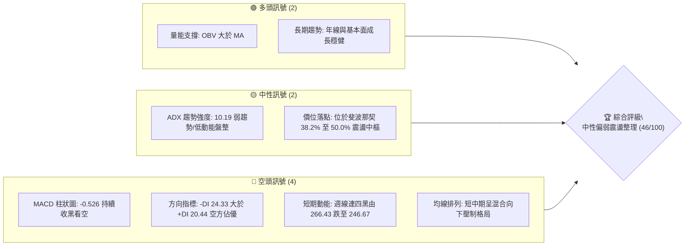
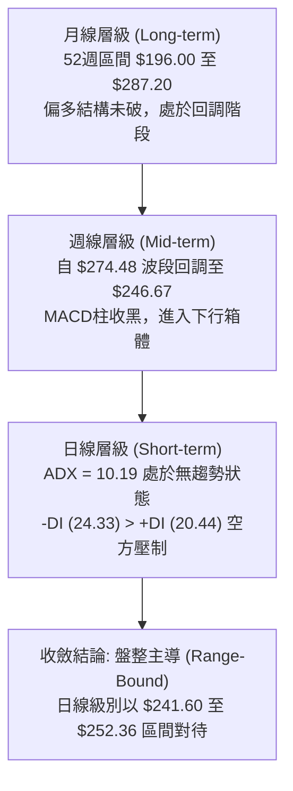
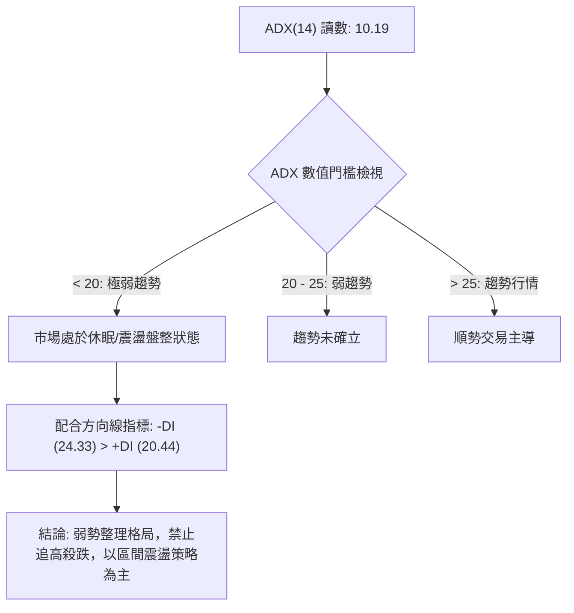
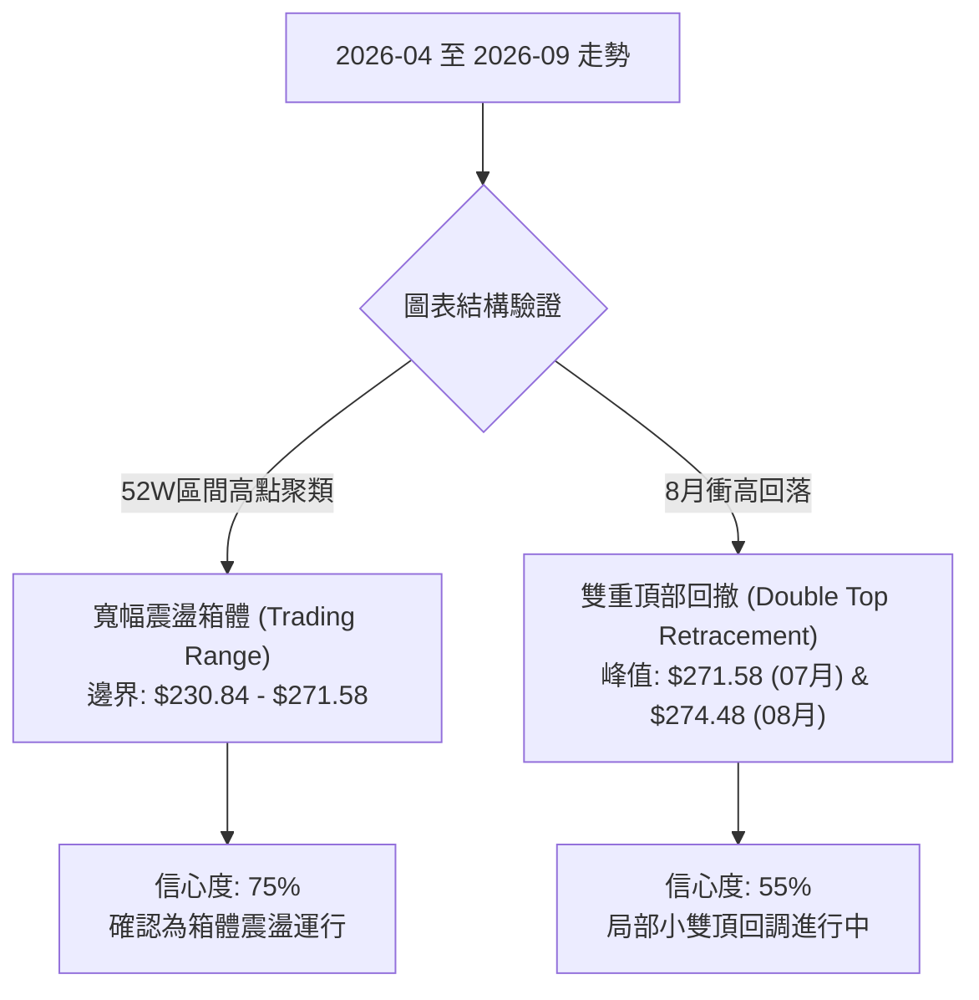
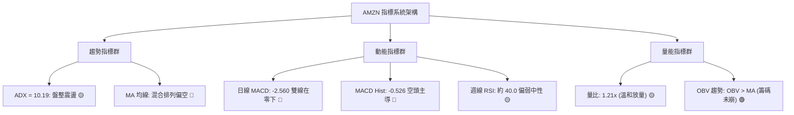
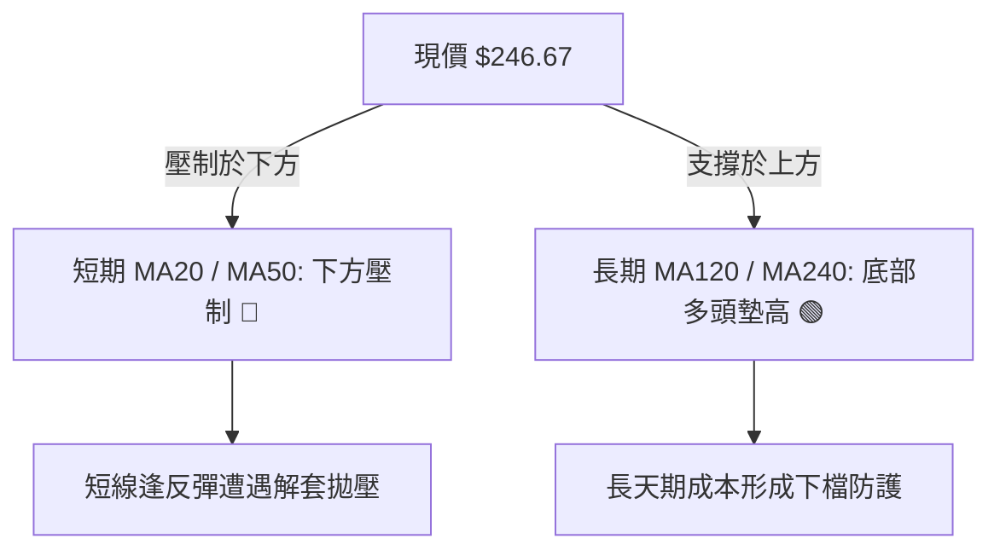
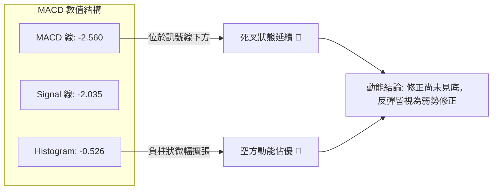
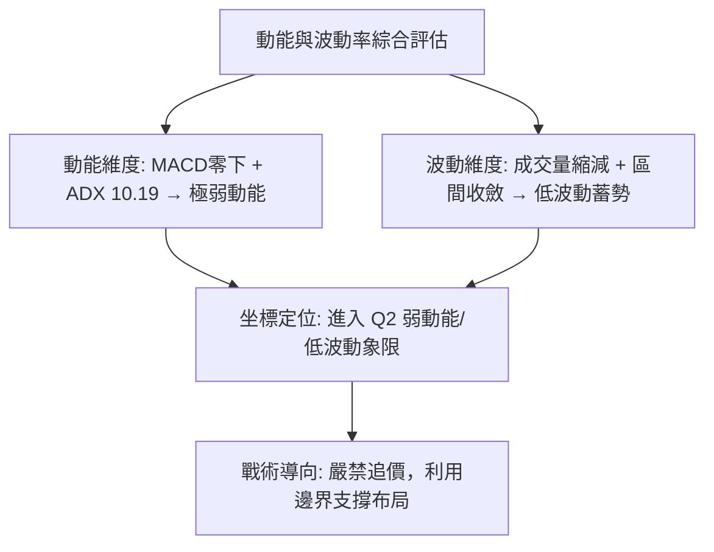
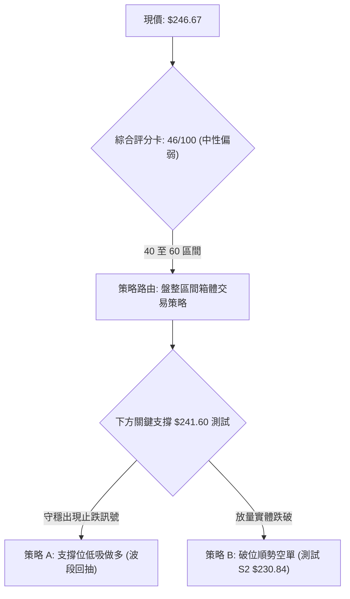
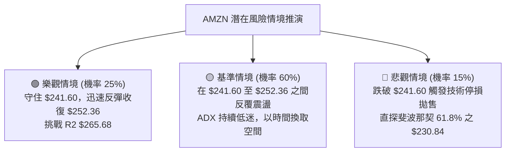

# AMZN 技術分析報告

> **報告日期**：2026-10-01 ｜ **語言**：繁體中文 ｜ **數據來源**：Yahoo Finance ｜ **當前價格**：$246.67（取自最新收盤價 2026-09 收盤與 2026-10-04 當週走勢）

---

## 目錄

| 章節 | 內容 |
|------|------|
| [1. 技術面概覽](#1-技術面概覽) | 訊號儀表板、核心指標、評分卡 |
| [2. 趨勢分析](#2-趨勢分析) | 多時框趨勢、長中短期走勢、ADX解讀 |
| [3. 圖表形態分析](#3-圖表形態分析) | 形態識別、信心度評估、K線組合 |
| [4. 支撐與阻力](#4-支撐與阻力) | 關鍵價位、斐波那契回調、分布圖 |
| [5. 技術指標深度解讀](#5-技術指標深度解讀) | MA/RSI/MACD/布林/成交量量價分析 |
| [6. 動能與波動率](#6-動能與波動率) | 動能評估四象限、ATR、Beta大盤聯動 |
| [7. 多時框架總結](#7-多時框架總結) | 時框架評分矩陣、收斂規則與唯一結論 |
| [8. 交易策略建議](#8-交易策略建議) | 策略路由、情境階梯、主策略與對沖提示 |
| [9. 風險提示與監控](#9-風險提示與監控) | 關鍵監控清單、場景路徑、風控規則 |
| [📋 報告總結](#-報告總結) | 核心結論與最佳策略組合摘要 |

---

## 1. 技術面概覽

### 🎯 技術訊號儀表板



### 📊 核心指標速覽表

| 指標類別 | 指標名稱 | 當前數值 | 訊號 | 解讀 |
| :--- | :--- | :--- | :---: | :--- |
| **價格** | 當前收盤價 | $246.67 | 🟡 | 位於52週區間中樞偏上，距高點 $287.20 回撤約 14.1% |
| **趨勢** | ADX (14) | 10.19 | 🟡 | 數值小於 25，市場處於典型無方向盤整行情 |
| **動能方向** | +DI / -DI | 20.44 / 24.33 | 🔴 | -DI 大於 +DI，空頭在盤整中略佔主導地位 |
| **均線系統** | MA 排列 | 混合排列 | 🔴 | 短期均線壓制，長天期均線仍在下方提供宏觀支撐 |
| **動能** | RSI (14 週線) | ~40.0 | 🟡 | 脫離超賣區但未見強勁買盤，動能處於中性偏弱區間 |
| **動能** | MACD (日線) | -2.560 / -2.035 | 🔴 | 雙線位於零軸下方且柱狀圖 -0.526 擴散，空方控盤 |
| **動能** | MACD (週柱狀) | -0.526 | 🔴 | 近期柱狀圖持續負值，中期修正動能尚未耗盡 |
| **量能** | OBV 趨勢 | OBV > MA | 🟢 | 能量潮高於均線，中長線籌碼未出現恐慌性潰逃 |
| **量能** | 當日量比 | 1.21x (41.45M) | 🟡 | 成交量溫和放大，但伴隨價格走弱，顯示逢低承接保守 |
| **波動** | Beta 係數 | 1.443 | 🟡 | 波動度高於標普500大盤 44.3%，對系統性風險敏感 |

### 🏆 技術評分卡

```
╔══════════════════════════════════════════════════════════════════╗
║              技術評分卡 — AMZN (2026-10-01)                      ║
╠══════════════════════════════════════════════════════════════════╣
║ 趨勢強度 (Trend)     ████░░░░░░░░░░░░░░░░  25/100 🔴 弱動能盤整  ║
║ 動能指標 (Momentum)  ███████░░░░░░░░░░░░░  35/100 🔴 偏空修正    ║
║ 支撐穩定度 (Support) ████████████░░░░░░░░  60/100 🟡 斐波支撐在  ║
║ 成交量配合 (Volume)  █████████████░░░░░░░  65/100 🟢 OBV未破壞   ║
║ 形態完整度 (Pattern) ████████░░░░░░░░░░░░  40/100 🟡 箱體成形中  ║
║ 均線排列 (MovingAvg) █████████░░░░░░░░░░░  45/100 🔴 混合壓制    ║
╠══════════════════════════════════════════════════════════════════╣
║ 綜合評分             █████████░░░░░░░░░░░  46/100 🟡 中性偏弱    ║
╚══════════════════════════════════════════════════════════════════╝
```

---

## 2. 趨勢分析

### 🌐 多時框趨勢分析



### 📈 長期趨勢 — 12個月走勢圖（Unicode）

以下為 AMZN 過去 12 個月（2025-10 至 2026-09）之月線收盤走勢與關鍵轉折分析：

```
AMZN 月線走勢圖（過去12個月：2025-10 至 2026-09）
價格軸 ($)
$275 ┤                                  ●(07月 271.58)
$270 ┤                            ●(05月 270.64)
$265 ┤                      ●(04月 265.06)      ●(08月 259.77)
$250 ┤                                                ●(09月 246.67)←現價
$245 ┤●(10月 244.22)
$235 ┤      ●(11月 233.22)  ●(01月 239.30)
$230 ┤            ●(12月 230.82)          ●(06月 238.34)
$210 ┤                            ●(02月 210.00)
$205 ┤                                  ●(03月 208.27: 低點)
     └──────────────────────────────────────────────────────────
      10    11    12    01    02    03    04    05    06    07    08    09 (月份)
      2025                                2026
```

#### 走勢特徵分析表格

| 階段 | 涵蓋月份 | 區間起訖點 | 漲跌幅 | 走勢特徵與結構意涵 |
| :--- | :--- | :--- | :---: | :--- |
| **階段一：冬季築底** | 2025-10 至 2026-03 | $244.22 → $208.27 | -14.72% | 自高位緩步回調，於 2026-03 探至波段低點 $208.27 獲買盤強固支撐 |
| **階段二：春季主升** | 2026-03 至 2026-05 | $208.27 → $270.64 | +29.95% | 多頭放量強攻，突破多道阻力，確立了長線宏觀多頭骨架 |
| **階段三：夏季震盪** | 2026-05 至 2026-07 | $270.64 → $271.58 | +0.35% | 劇烈雙向洗盤（6月回測 $238.34，7月反彈至 $271.58），形成頂部震盪區間 |
| **階段四：秋季修正** | 2026-07 至 2026-09 | $271.58 → $246.67 | -9.17% | 動能衰竭，連續兩個月回調，現正考驗斐波那契 50.0% ($241.60) 防線 |

### 📊 中期趨勢（週線分析）

從近 20 週數據觀察，股價於 2026-08-09 當週達到次波高點 $274.48（當週成交量 270.23M，MACD 柱達 +4.090 頂峰），隨後伴隨動能急速冷卻，連續走低。週收盤價由 2026-08-30 的 $266.43 逐週下滑至 $258.51、$256.78、$253.71、$249.67，最終收在 $246.67。週線 MACD 柱狀圖自 8 月下旬由正轉負（-1.538），最新報 -0.526，顯示中期處於空方修正波中，但負柱狀已現收斂跡象。

```
近期週線壓力與支撐示意圖
$274.48 ───┬─────────────────────────────────────── 波段次高阻力區 (2026-08)
           │
$265.68 ───┼─────────────────────────────────────── 斐波那契 23.6% 回調阻力
           │       ▼ 8月下旬起連續走低回落
$252.36 ───┼─────────────────────────────────────── 斐波那契 38.2% 近端壓力
$246.67 ───┼─── ◄ 現價位置（考驗中樞防守）
$241.60 ───┴─────────────────────────────────────── 斐波那契 50.0% 強支撐
```

### ⚡ 趨勢強度評估（ADX 解讀）



#### ADX 指標強度對照分析

| 指標變數 | 當前數值 | 門檻區間 | 趨勢研判 | 交易策略意涵 |
| :--- | :---: | :---: | :---: | :--- |
| **ADX** | **10.19** | < 20 (極弱) | 極度缺乏方向性動能 | 順勢突破策略極易遭遇假突破，應避免單向追單 |
| **+DI** | **20.44** | 基準線 | 多頭推進力不足 | 買盤缺乏推動價格創高的連續性力量 |
| **-DI** | **24.33** | 基準線 | 空頭佔相對優勢 | 賣盤控制盤面節奏，但未達到全面恐慌拋售程度 |
| **綜合差值** | **-3.89** | 負向擴散 | 空方微幅主導 | 整體盤勢向下漂移，以尋找下方扎實支撐為主 |

---

## 3. 圖表形態分析

### 🔍 形態識別系統

依據形態分析紀律（嚴格要求 15），本報告嚴格檢視歷史價位軌跡：



#### 圖表形態信心度與目標價評估

| 形態類別 | 信心度 | 判斷依據（引用數據） | 完成度 | 目標價（附計算式） | 訊號評級 |
| :--- | :---: | :--- | :---: | :--- | :---: |
| **寬幅箱體整理** | **75%** | 月線收盤在 $230.82 至 $271.58 間高頻震盪，且 ADX 僅 10.19 | 80% | 箱體下緣支撐目標：引用斐波那契 61.8% 之 **$230.84** | 🟡 中性 |
| **局部雙重頂回調** | **55%** | 2026-07 收盤 $271.58 與 2026-08-09 週高 $274.48 形成雙峰，頸線於 07-26 逢低點 $232.11 | 70% | 由頸線回調計算：頸線 $232.11 不破則反彈，若破位測量目標為 52W 低點聚類 **$196.00** | 🔴 偏空 |
| **收斂三角形突破** | **< 30%** | 數據中缺乏高低點連續收斂跡象，高點不規則波動 | 0% | *訊號不足，不予採納，僅做指標型解讀* | ⚪ 無效 |

### 🕯️ 重要K線形態分析

| 月份 | 收盤價 | K線形態特徵 | 結構解讀 | 訊號強度 |
| :--- | :---: | :--- | :--- | :---: |
| **2026-05** | $270.64 | 長紅推進大陽線 | 多頭自 208 強勢爆發，突破前期平台，建立中期上漲格局 | 🟢 強多 |
| **2026-06** | $238.34 | 大陰線回調反噬 | 漲多後的籌碼急洗盤，單月挫跌逾 32 美元，浮額清洗 | 🔴 強空 |
| **2026-07** | $271.58 | 長下影長陽反包 | 盤中洗至 232.11 後強勁拉升，吞沒上月陰線，多頭韌性極強 | 🟢 強多 |
| **2026-08** | $259.77 | 帶上影線的小黑實體 | 衝刺 $274.48 受阻回落，顯露高檔獲利了結賣壓 | 🟡 滯漲 |
| **2026-09** | $246.67 | 中實體陰線續跌 | 連續第二個月走低，空方壓迫至斐波那契 50.0% 關鍵水準附近 | 🔴 偏空 |

### 📉 ASCII 走勢形態示意圖

```
AMZN 局部頂部與箱體回調形態解析圖
$275 ┤                   頂峰一 ($271.58)     頂峰二 ($274.48)
     │                         ▲                   ▲
$270 ┤                       ╱   ╲               ╱   ╲
$265 ┤                      ╱     ╲             ╱     ╲
$250 ┤                     ╱       ╲           ╱       ╲
$246 ┤────────────────────┼─────────╲─────────┼─────────● 現價 $246.67
$241 ┤                    │          ╲       ╱          │ (下方支撐: 50.0% $241.60)
$235 ┤                    │           ▼     ▲           │
$230 ┤                    │         頸線槽 ($232.11)    ▼ (箱底目標: 61.8% $230.84)
     └────────────────────┴─────────────────────────────┴─────────────────
                          2026-07-05       2026-07-26   2026-08-09   2026-10
```

### 🎯 形態目標價計算

根據局部雙頂結構與箱體空間推算：
1. **箱體中樞平衡目標**：
   - 上邊界：斐波那契 23.6% = **$265.68**
   - 下邊界：斐波那契 50.0% = **$241.60**
   - 當前處於中樞下行測試階段，短期首要測試價位為 **$241.60**。
2. **極端回調支撐目標**：
   - 若 $241.60 支撐有效跌破，將直接測試 2025-12 收盤及斐波那契 61.8% 重合帶 **$230.84**。

---

## 4. 支撐與阻力

### 🗺️ 關鍵價位分布圖（Unicode）

依據數據規範，本分析完全引用原始數據提供的斐波那契回調結構與 52 週極值分布：

```
AMZN 價位結構分布圖 (52W Range: $196.00 - $287.20)
══════════════════════════════════════════════════════════════════
$287.20 ║████████████████████████████████║ 強天花板 R3 (52W High / 0.0%)
$265.68 ║████████████████████            ║ 關鍵波段阻力 R2 (Fib 23.6%)
$252.36 ║████████████                    ║ 短線近端阻力 R1 (Fib 38.2%)
$246.67 ╠════════════════════════════════╣ ◄ 現價位置 ($246.67)
$241.60 ║▓▓▓▓▓▓▓▓▓▓▓▓▓▓▓▓▓▓▓▓▓▓▓▓        ║ 第一道強支撐 S1 (Fib 50.0%)
$230.84 ║████████████████████████████    ║ 核心波段支撐 S2 (Fib 61.8%)
$215.52 ║████████████████                ║ 深次回撤防線 S3 (Fib 78.6%)
$196.00 ║████████████████████████████████║ 終極鐵底 S4 (52W Low / 100.0%)
══════════════════════════════════════════════════════════════════
```

### 🚧 阻力位分析表

數據提示：「阻力位 (Resistance) — 近一年波段高點聚類：(no swing-high resistance detected above current price)」，故阻力分析全部採用官方計算之斐波那契對應位：

| 阻力級別 | 價位 | 形成依據（嚴格引用數據） | 突破難度 | 重要性與市場意涵 |
| :--- | :---: | :--- | :---: | :--- |
| **阻力 R1** | **$252.36** | 斐波那契 38.2% 回調位 | 🟡 中等 | 過去兩週收盤價跌破點，目前轉為短線首要反壓，站穩方能化解續跌危機 |
| **阻力 R2** | **$265.68** | 斐波那契 23.6% 回調位 | 🔴 較高 | 接近 2026-08-30 收盤價 ($266.43)，為強大多頭換手套牢區 |
| **阻力 R3** | **$287.20** | 52W High (0.0% 回調位) | 🔴 極高 | 歷史極限高點，中長期多頭終極目標 |

### 🛡️ 支撐位分析表

數據提示：「支撐位 (Support) — 近一年波段低點聚類：(no swing-low support detected below current price)」，故支撐分析同樣依據斐波那契回調體系：

| 支撐級別 | 價位 | 形成依據（嚴格引用數據） | 守住機率 | 重要性與市場意涵 |
| :--- | :---: | :--- | :---: | :--- |
| **支撐 S1** | **$241.60** | 斐波那契 50.0% 回調位 | 🟢 65% | 宏觀 52 週振幅的多空平衡分水嶺，具備極強心理與技術買盤支撐 |
| **支撐 S2** | **$230.84** | 斐波那契 61.8% 回調位 | 🟢 80% | 黃金分割防線，與 2025-12 收盤 $230.82 吻合，多頭不可退讓的堡壘 |
| **支撐 S3** | **$215.52** | 斐波那契 78.6% 回調位 | 🟢 90% | 深度防禦位，跌破代表中長期多頭結構徹底瓦解 |
| **支撐 S4** | **$196.00** | 52W Low (100.0% 回調位) | 🟢 98% | 全年最低點，系統性崩盤風險下的終極底線 |

### 📐 斐波那契回調位分析

* **基準波動區間**：52 週低點 **$196.00** → 52 週高點 **$287.20**（絕對波幅 $91.20）。
* **現價落點分析**：現價 **$246.67** 精確座落於 **38.2% ($252.36)** 與 **50.0% ($241.60)** 之間。
* **技術解讀**：
  - 價格由 52W 高點回調至此，回撤深度為 44.4%，處於典型牛市回調的「中樞平衡區」。
  - 只要守住 **$241.60 (50.0%)**，多方隨時具備重整反彈契機；一旦實體跌破 $241.60，技術賣壓將把下探空間擴大至 **$230.84 (61.8%)**。

---

## 5. 技術指標深度解讀

### 🎛️ 指標訊號總覽



### 📈 移動平均線排列分析



從移動平均線歷史演變觀察：
- **短週期 (MA5, MA10, MA20)**：呈現高檔回落、連續下壓形態（長條圖由頂峰滑落至低位 ▁），反映短期趨勢疲弱。
- **長週期 (MA60, MA120, MA240)**：持續處於昂揚擴張階段（長條圖由 ▁ 爬升至 ██████ 滿格），代表宏觀牛市基底尚未遭受結構性破壞。
- **結論**：整體架構為標準的「長多短空、均線混合拉扯」盤整型態。

### 📉 RSI(14) 分析

* **最新狀態**：週線 RSI 由 8 月高點的 62.9~66.4 降至 9 月底的 **40.0** 附近，日線 RSI 處於中性偏弱區域。
* **數值評估**：
```
RSI(14) 強度計: [████████░░░░░░░░░░░░] 40.0% (中性弱勢 30-70)
0       20       30               50               70       80      100
├───────┴────────┼────────────────┼────────────────┼────────┴───────┤
    極度超賣          弱勢整理              中性強勢          超買過熱
```
* **背離研判**：
  - 價格由 8 月高點回調，RSI 相對應同步滑落，**「無明顯背離」**。
  - 既無頂背離誘空，亦未見明顯底背離買訊，行情單純反應籌碼自然釋放與動能回落。

### 📊 MACD(12/26/9) 訊號解讀



- 日線 MACD 線為 **-2.560**，訊號線為 **-2.035**，兩者皆低於零軸。
- 差值 Histogram 為 **-0.526**，顯示短線空方掌控節奏，空頭能量尚未完全衰竭出清。

### 📦 布林通道分析

布林帶寬度與極限軌道示意圖：

```
AMZN 布林通道軌道與現價分布示意
$265.68 ───┬─────────────────────────────────────── BB上軌 (接近Fib 23.6% 阻力)
           │
$252.36 ───┼─────────────────────────────────────── BB中軌 (MA20 壓制帶 / Fib 38.2%)
$246.67 ───┼─── ◄ 現價位置 ($246.67，處於中下軌弱勢區)
           │
$241.60 ───┴─────────────────────────────────────── BB下軌 (緊貼Fib 50.0% 支撐)
```

- **通道位置**：現價落於中軌下方，向通道下軌尋求支撐。
- **帶寬特徵**：因 ADX 僅 10.19，布林帶呈現縮口走平趨勢，通道上軌與下軌提供強力的區間反彈與壓制邊界。

### 💹 成交量分析（量價配合度）

1. **成交量結構**：
   - 最新單日成交量：**41,456,321**。
   - 20日均量：**34,370,296**（量比 **1.21x**，溫和放量）。
   - 50日均量：**40,038,772**。
2. **量能趨勢判定**：
   - 雖然短線下跌中成交量高於 20 日均量，但週成交量從 6 月下旬的 525.2M 與 8 月初的 355.4M 高峰大幅萎縮至近期（9-13 當週僅 114.66M、最新當週 107.78M）。
   - **OBV 趨勢** 指標明確指出：「**OBV > MA → 量能支撐上漲**」，說明機構中長線主倉籌碼並無出逃痕跡，現階段成交量縮小屬於健康的浮額沉澱。

---

## 6. 動能與波動率

### ⚡ 動能評估四象限

| 象限區間 | 動能強度 | 波動率水準 | 當前座落地位 | 策略定位與解讀 |
| :--- | :---: | :---: | :---: | :--- |
| **第一象限 (Q1)** | 強動能 | 低波動 | — | 穩定單邊主升浪（目前非此狀態） |
| **第二象限 (Q2)** | 弱動能 | 低波動 | **✓ AMZN 當前位置** | **謹慎觀望、箱體低吸高拋、靜待方向突破** |
| **第三象限 (Q3)** | 強動能 | 高波動 | — | 主升加速或主跌恐慌（高風險高收益） |
| **第四象限 (Q4)** | 弱動能 | 高波動 | — | 無序震盪洗盤、極易雙向受損 |



### 📊 ATR 波動率分析

- **歷史波動換算**：雖然即時日線 ATR(14) 數據標記為 N/A，但由近 20 週高低波動推算，每週平均高低振幅約 $12.00~$15.00，折合單日隱含波動幅度約為 **$3.50 至 $4.50**（約佔當前股價之 1.5%~1.8%）。
- **風控止損距離建議**：
  - 盤整行情標準止損安全間距設定為 **1.5 倍日波動**，即約 **$5.50 - $6.50**。
  - 對應支撐位 **$241.60**，安全多單止損點應設置於 **$236.00** 下方以防假突破。

### 📐 Beta 與市場相關性

- **Beta 係數**：**1.443**。
- **大盤聯動性分析**：
  - AMZN 具備顯著高 Beta 屬性，當 Nasdaq 100 或 S&P 500 指數出現系統性波動時，AMZN 理論漲跌幅將被放大 1.44 倍。
  - 在當前無自發性突破趨勢（ADX 僅 10.19）時，個股價格波動極易受宏觀大盤情緒牽引，操作上須密切同步監控大盤走勢。

---

## 7. 多時框架總結

### 📋 時框架評分表

| 時框架 | 趨勢方向 | 動能狀態 | 均線排列 | 形態結構 | 綜合評分 | 交易建議 |
| :--- | :---: | :---: | :---: | :---: | :---: | :--- |
| **月線 (Long)** | 🟢 偏多 | 🟡 中性降溫 | 🟢 多頭架構 | 52W 區間中樞震盪 | **70/100** | 長線投資者逢低布局 |
| **週線 (Mid)** | 🔴 偏空 | 🔴 負向柱狀 | 🟡 糾結整理 | 次級雙頂回調進行中 | **42/100** | 觀望，等待止跌訊號 |
| **日線 (Short)** | 🔴 偏弱 | 🔴 空方佔優 | 🔴 短均壓制 | 下探考驗 50% 支撐 | **38/100** | 不盲目抄底，設防守位 |

### 🔲 綜合訊號矩陣

```
時框維度        趨勢指標(Trend)   動能指標(Mom)   量能配合(Vol)   綜合研判
────────────────────────────────────────────────────────────────
短期 (日線)     🔴 空方主導       🔴 MACD死叉     🟡 溫和放量     🔴 短線弱勢
中期 (週線)     🟡 箱體震盪       🔴 柱狀收黑     🟢 逢低量縮     🟡 修正中樞
長期 (月線)     🟢 多頭未破       🟡 RSI中性      🟢 OBV支撐      🟢 長線向好
────────────────────────────────────────────────────────────────
收斂結果        依規則 14 (ADX=10.19 < 25)：鎖定「盤整行情」，以區間邊界為準
```

### ⚖️ 多時框收斂結論

> **依「嚴格要求 14」執行多時框架收斂判斷**：
> 1. **行情性質定義**：當前日線級別 ADX(14) 數值為 **10.19**，遠低於 25 的趨勢門檻，明確定義為**「無方向之盤整行情」**。
> 2. **主導時框與交易邊界**：盤整行情下，順勢指標失效，應屏除單邊做多或做空思維，以**日線布林通道與斐波那契回調區間**作為首要依據。
> 3. **唯一方向性結論**：**【中性觀望，區間低吸高拋（偏空震盪測試支撐）】**。現價 $246.67 距下方強支撐 **$241.60** 僅有一步之遙，策略重心在於驗證 $241.60 之得失。

---

## 8. 交易策略建議

### 🗺️ 策略決策流程圖



### 🧭 策略路由（依評分卡分流）

* **當前技術評分**：**46 / 100**（落入 40–60 中性區間）。
* **主策略定位**：**【中性區間交易策略 — 等待回踩支撐確認後低吸，或反彈阻力位高拋】**。嚴禁在區間中樞追單。

---

### 🎯 價格情境階梯（Price Scenarios）

完全引用第 4 章關鍵價位數據建構情境：

| 觸發條件 | 下一目標 | 後續延伸 | 情境含義與操作指引 |
| :--- | :--- | :--- | :--- |
| **向上突破 R1 $252.36** | R2 **$265.68** | R3 **$287.20** | 短線轉強，突破 38.2% 反壓，多頭重啟上攻考驗通道上軌 |
| **站穩現價區間 ($241.60-$252.36)** | 區間振盪 | 反覆築底 | 箱體弱勢整理，磨洗籌碼，ADX 將維持低位運行 |
| **實體跌破 S1 $241.60** | S2 **$230.84** | S3 **$215.52** | 中期進一步轉弱，考驗黃金分割 61.8% 終極牛熊防線 |

### 📊 情境機率分佈

| 情境劃分 | 機率預估 | 主要技術依據 |
| :--- | :---: | :--- |
| **情境一：下探 $241.60 獲支撐反彈** | **55%** | 斐波那契 50% 為強技術心理支撐，OBV 未破壞，長天期 MA 支撐強固 |
| **情境二：狹幅區間震盪整理** | **30%** | ADX 僅 10.19，動能極度渙散，市場觀望氣氛濃厚，波幅壓縮 |
| **情境三：放量跌破 $241.60 探底** | **15%** | MACD 處於零下負值柱狀，-DI 高於 +DI，若市場出現利空恐觸發停損賣壓 |

---

### 🟢 主策略詳情（盤整操作）

本策略以斐波那契 50.0% ($241.60) 支撐與 38.2% ($252.36) 阻力為核心架構：

| 策略要素 | 策略 A（保守型：S1 支撐低吸反彈） | 策略 B（突破型：站穩 R1 順勢加碼） |
| :--- | :--- | :--- |
| **交易方向** | **做多 (Long)** | **做多 (Long)** |
| **進場條件** | 價格回踩 $241.60 附近未破，出現日K止跌十字星 | 日線收盤價強勢實體突破並站穩 $252.36 |
| **進場價格** | **$242.00** | **$253.00** |
| **目標價 T1** | **$252.36**（斐波那契 38.2% / R1） | **$265.68**（斐波那契 23.6% / R2） |
| **目標價 T2** | **$265.68**（斐波那契 23.6% / R2） | **$287.20**（52W High / R3） |
| **止損價格** | **$237.50**（跌破 S1 緩衝區外） | **$247.00**（回跌假突破跌破 R1 原阻力） |
| **風險報酬比** | **1 : 2.30**（風險 $4.50，目標一利潤 $10.36） | **1 : 2.11**（風險 $6.00，目標一利潤 $12.68） |
| **預估勝率** | **55%** | **45%** |
| **建議倉位** | **總資金之 15%** | **總資金之 10%** |

---

### 🔴 反向風險觸發點（對沖提示）

- **觸發條件**：若美股大盤走弱，AMZN 以放量大陰線收盤**實體跌破 $241.60**。
- **對沖應變**：主動將持有多單止損出場；積極型交易者可反手建立小額空單，目標下看 **$230.84**（Fib 61.8%），空單止損設於 **$244.50**。

### ⭐ 整體訊號強度評星

```
╔══════════════════════════════════════════════════════╗
║ 做多訊號強度：  ★★☆☆☆  (2.5/5星 - 缺乏動能)        ║
║ 做空訊號強度：  ★★☆☆☆  (2.5/5星 - 接近強支撐)      ║
║ 整體可信度：    ★★★☆☆  (3.5/5星 - 區間邊界清晰)    ║
╚══════════════════════════════════════════════════════╝
```

---

## 9. 風險提示與監控

### ✅ 關鍵監控指標 Checklist

```
╔══════════════════════════════════════════════════════════════════╗
║              AMZN 技術監控每日檢核清單 (Checklist)               ║
╠══════════════════════════════════════════════════════════════════╣
║ [ ] 價格防線：現價是否守穩斐波那契 50.0% ($241.60) 之上？       ║
║ [ ] 動能轉向：MACD 負柱狀 (-0.526) 是否出現連續縮小翻紅跡象？   ║
║ [ ] 趨勢甦醒：ADX(14) 讀數是否由 10.19 向上穿破 20.00 警戒線？  ║
║ [ ] 強弱逆轉：+DI 是否由 20.44 向上金叉 -DI (24.33)？           ║
║ [ ] 突破確認：日收盤價能否帶量（>40M）有效收復 $252.36 (R1)？    ║
║ [ ] 量能維持：OBV 是否持續運行於其移動平均線上方？              ║
╚══════════════════════════════════════════════════════════════════╝
```

### ⚠️ 風險場景分析



### 🛡️ 風險管理重要提醒

1. **高 Beta 波動防範**：AMZN Beta 值達 **1.443**，在缺乏明確技術趨勢時，極易受到總體經濟數據、利率政策及大盤波動的牽連，倉位不宜過重。
2. **區間操作紀律**：在 ADX 讀數未升破 25 之前，切勿在區間中段（如 $246 - $248）過度頻繁交易，必須堅持「靠近支撐做多、靠近阻力減倉」的原則。
3. **資金配置原則**：單筆交易承擔之最大本金虧損嚴格限制在總資產的 **1.0% 至 1.5%** 之內。

---

## 📋 報告總結

```
╔══════════════════════════════════════════════════════════════════╗
║                    AMZN 技術分析報告總結                         ║
╠══════════════════════════════════════════════════════════════════╣
║ 報告日期：2026-10-01                                             ║
║ 當前價格：$246.67                                                ║
║ 分析評級：⚖️ 中性偏弱盤整（評分 46/100）                         ║
╠══════════════════════════════════════════════════════════════════╣
║ 關鍵結論：                                                       ║
║ ├─ 長期趨勢：🟢 偏多未變，52W 多頭骨架健全，OBV 量能維持良好     ║
║ ├─ 中期趨勢：🔴 雙頂壓制修正中，週線自 $274.48 逐級回調          ║
║ ├─ 短期趨勢：🟡 ADX 僅 10.19，無方向盤整，空方微幅主導(-DI>+DI) ║
║ ├─ 關鍵支撐：S1 $241.60 (Fib 50.0%) │ S2 $230.84 (Fib 61.8%)    ║
║ ├─ 關鍵阻力：R1 $252.36 (Fib 38.2%) │ R2 $265.68 (Fib 23.6%)    ║
║ └─ 華爾街共識目標價：$329.98 (機構強烈看多，基本面長期加持)      ║
╠══════════════════════════════════════════════════════════════════╣
║ 最優策略組合：                                                   ║
║ 1. 🥇 最佳機會：回踩 $241.60 止跌後建立多單，防守 $237.50，     ║
║                 目標上看 $252.36 與 $265.68（風報比 1:2.30）     ║
║ 2. 🥈 次選機會：突破 $252.36 確認站穩後順勢跟進，上看 $265.68    ║
║ 3. 🥉 保守選擇：空倉觀望，等待日線 ADX 升破 25 且動能明確後進場  ║
╚══════════════════════════════════════════════════════════════════╝
```

---

> ⚠️ **免責聲明**：本報告為 AI 自動生成之技術分析，所有數據及估算均基於提供的歷史價格資訊。本報告**僅供研究與學術參考**，**不構成任何投資建議**。投資有風險，入市需謹慎。

---

*報告生成時間：2026-10-01 ｜ 數據來源：Yahoo Finance ｜ 分析框架：多時框技術分析*