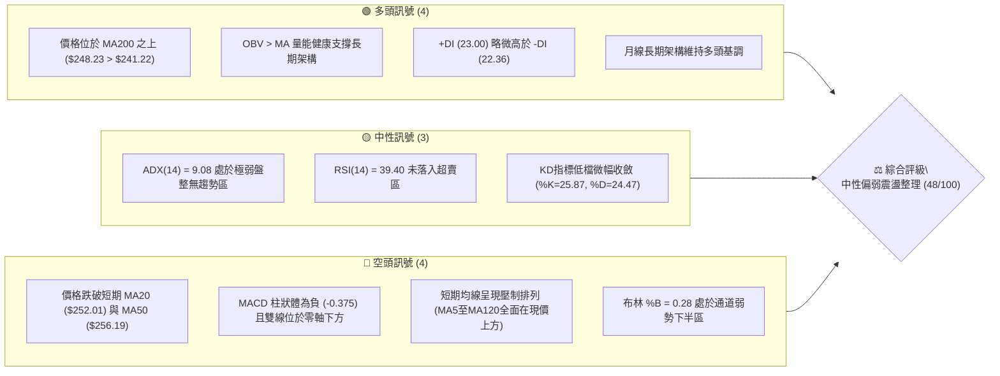
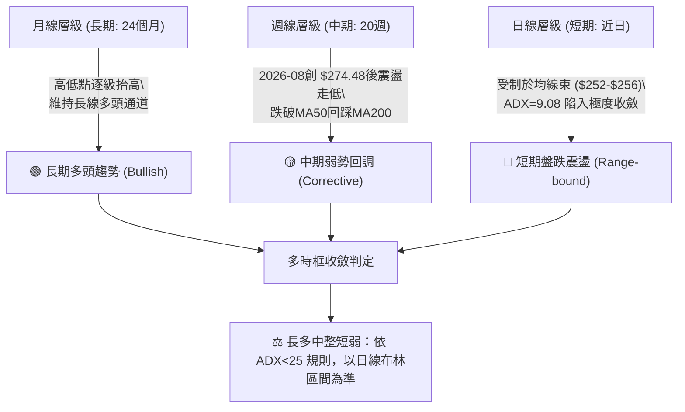
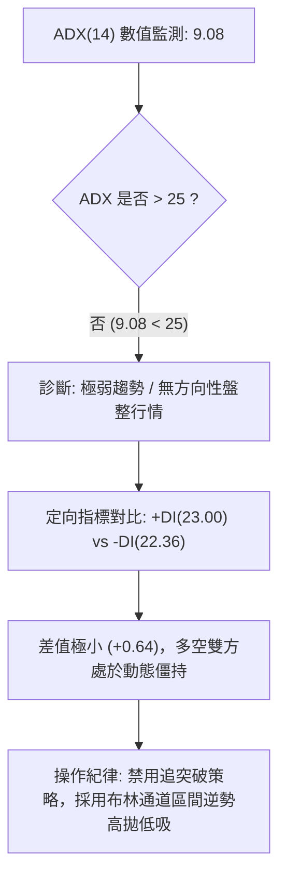
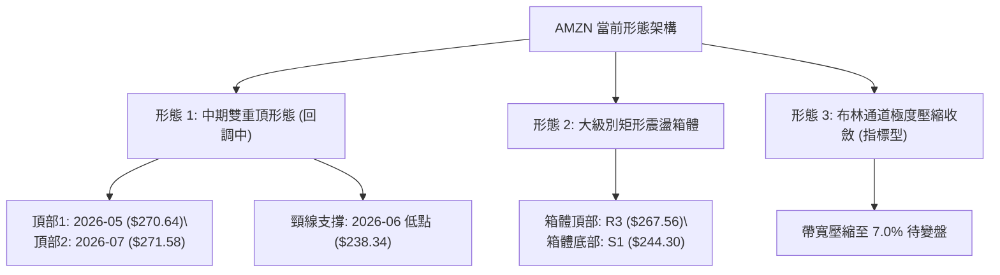
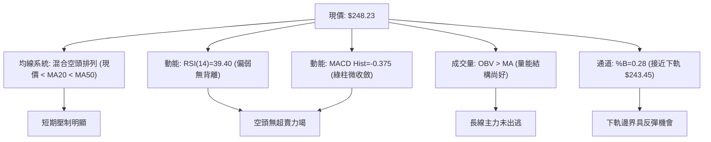
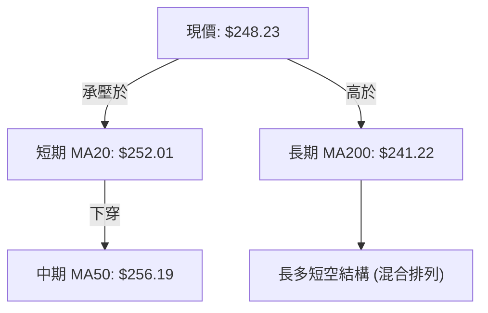
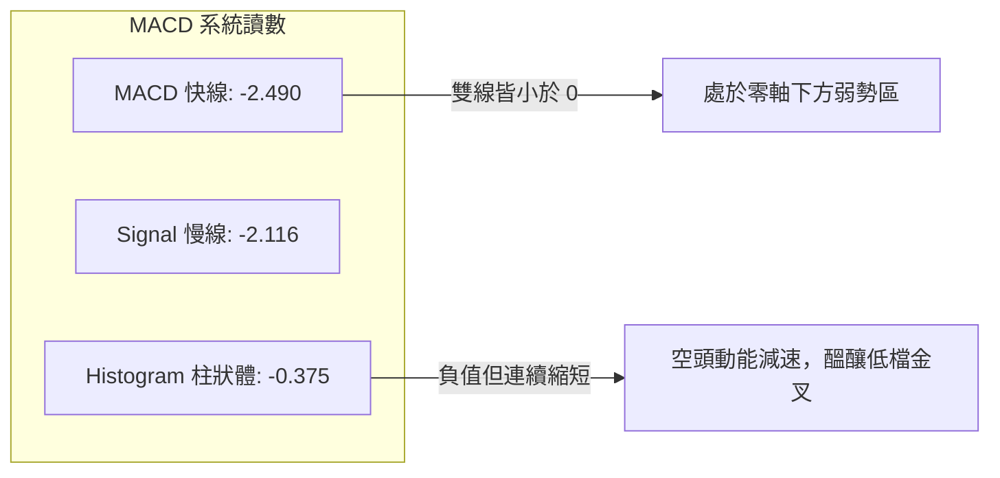
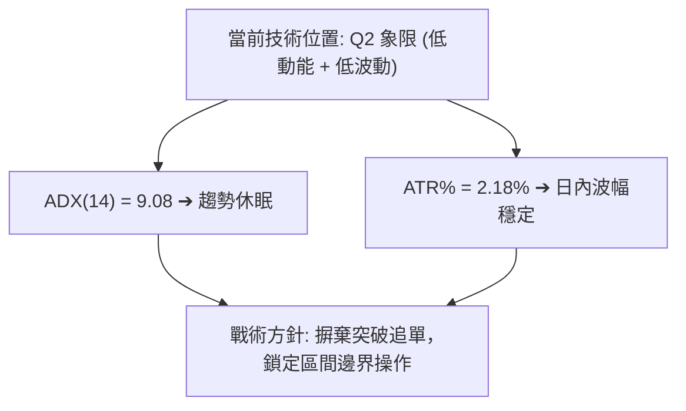
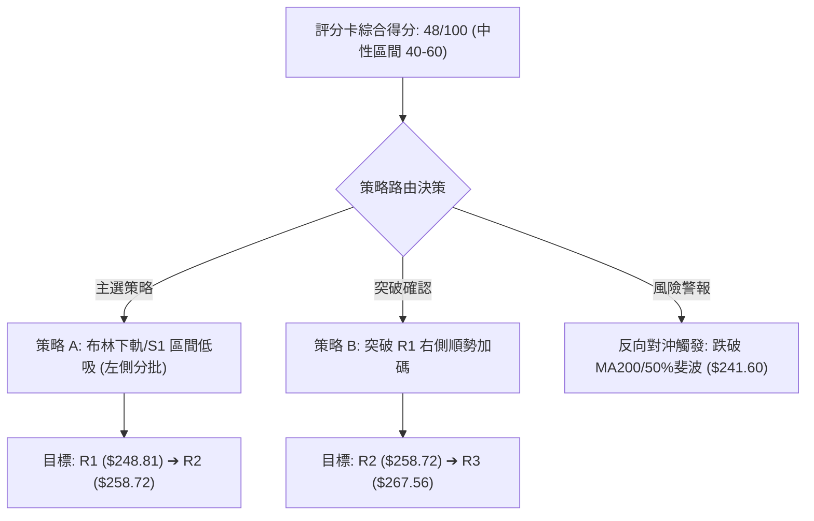
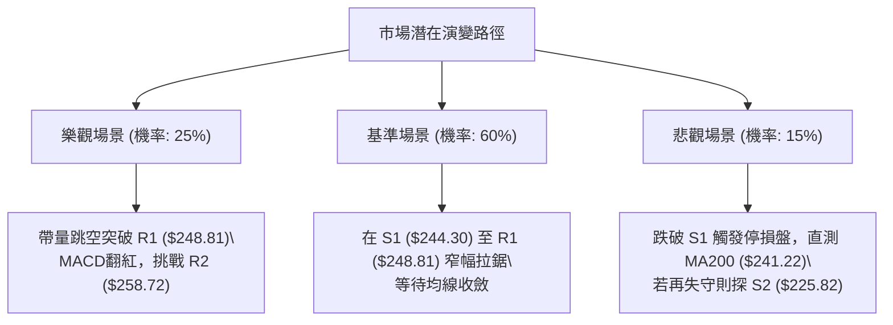

# AMZN 技術分析報告

> **報告日期**：2026-10-02 ｜ **語言**：繁體中文 ｜ **數據來源**：Yahoo Finance ｜ **當前價格**：$248.23

---

## 目錄

| 章節 | 內容 |
|------|------|
| [1. 技術面概覽](#1-技術面概覽) | 訊號儀表板、核心指標、評分卡 |
| [2. 趨勢分析](#2-趨勢分析) | 多時框趨勢、長中短期走勢、ADX解讀 |
| [3. 圖表形態分析](#3-圖表形態分析) | 形態識別、信心度評估、K線組合 |
| [4. 支撐與阻力](#4-支撐與阻力) | 關鍵價位、斐波那契回調結構 |
| [5. 技術指標深度解讀](#5-技術指標深度解讀) | MA/RSI/MACD/布林/量價配合 |
| [6. 動能與波動率](#6-動能與波動率) | 動能四象限、ATR、Beta係數分析 |
| [7. 多時框架總結](#7-多時框架總結) | 時框架評分矩陣、多時框收斂判定 |
| [8. 交易策略建議](#8-交易策略建議) | 策略路由、情境階梯、精確交易計劃 |
| [9. 風險提示與監控](#9-風險提示與監控) | 關鍵監控清單、情境分析、風控紀律 |
| [📋 報告總結](#-報告總結) | 核心總結儀表板與策略精華 |

---

## 1. 技術面概覽

### 🎯 技術訊號儀表板



### 📊 核心指標速覽表

| 指標類別 | 指標名稱 | 當前數值 | 訊號 | 解讀 |
|----------|----------|----------|------|------|
| **價格** | 當前收盤價 | $248.23 | 🟡 | 位於52週區間 57.3% 分位，處於波段回調震盪位 |
| **均線** | MA20 | $252.01 | 🔴 | 現價低於MA20 (-1.50%)，短線承壓 |
| **均線** | MA50 | $256.19 | 🔴 | 現價低於MA50 (-3.11%)，中期動能減弱 |
| **均線** | MA200 | $241.22 | 🟢 | 現價高於MA200 (+2.91%)，長期牛熊分界線未破 |
| **動能** | RSI(14) | 39.40 | 🟡 | 處於 30–70 中性弱勢區，尚未觸及超賣線 |
| **動能** | MACD | -2.490 / Sig: -2.116 | 🔴 | MACD Hist = -0.375，空頭佔據主導但柱狀微幅收斂 |
| **動能** | Stoch %K / %D | 25.87 / 24.47 | 🟡 | 接近超賣區（20），短線具備鈍化或弱反彈條件 |
| **趨勢** | ADX(14) | 9.08 | 🟡 | ADX < 25 極弱，顯示無方向性單邊趨勢，屬區間震盪 |
| **通道** | 布林通道下軌 | $243.45 | 🟢 | 距下軌僅 1.96%，具備下軌防禦支撐潛力 |
| **量能** | 20日均量比 | 0.95x (33.17M) | 🟡 | 量能略低於20日均量，追價意願低，盤跌量縮 |
| **波動** | ATR(14) | $5.42 (2.18%) | 🟡 | 每日平均波動幅度適中，有利於區間邊界設損 |

### 🏆 技術評分卡

```
╔══════════════════════════════════════════════════════════════╗
║              技術評分卡 — AMZN (2026-10-02)                  ║
╠══════════════════════════════════════════════════════════════╣
║ 趨勢強度 (ADX=9.08)   ████░░░░░░░░░░░░░░░░  20/100 🔴 盤整無勢║
║ 動能指標 (RSI/MACD)   ███████░░░░░░░░░░░░░  35/100 🔴 空方佔優║
║ 支撐穩定度 (S1/MA200) █████████████░░░░░░░  65/100 🟢 下檔堅固║
║ 成交量配合 (OBV/均量) ████████████░░░░░░░░  60/100 🟢 量能未潰║
║ 形態完整度 (箱型區間) ██████████░░░░░░░░░░  50/100 🟡 區間收斂║
║ 均線排列 (多空糾纏)   ██████████░░░░░░░░░░  50/100 🟡 長多短空║
╠══════════════════════════════════════════════════════════════╣
║ 綜合評分              ██████████░░░░░░░░░░  48/100 ⚖️ 中性觀望║
╚══════════════════════════════════════════════════════════════╝
```

---

## 2. 趨勢分析

### 🌐 多時框趨勢分析



### 📈 長期趨勢 — 12個月走勢圖（Unicode）

以下為 AMZN 過去 12 個月（2025-11 至 2026-10）之月線收盤價走勢軌跡。整體走勢在 2026 年初於 $208.27 築底後，爆發性推升至 $271.58，目前回落至 $248.23 尋求支撐。

```
AMZN 月線走勢圖（2025-11 至 2026-10）
價格軸 ($)
$275 ┤                                  ●(07: 271.58)
$270 ┤                          ●(05: 270.64)  
$265 ┤                      ●(04: 265.06)   ●(08: 259.77)
$250 ┤                                              ●(09: 249.15)
$245 ┤                                                  ●(10: 248.23) ◄現價
$240 ┤              ●(01: 239.30)       ●(06: 238.34)
$230 ┤ ●(11: 233.22)●(12: 230.82)
$210 ┤                  ●(02: 210.00)
$205 ┤                      ●(03: 208.27 低點)
     └────┬──────┬──────┬──────┬──────┬──────┬──────┬──────┬──────┬──────┬──────┬────
        25-11  25-12  26-01  26-02  26-03  26-04  26-05  26-06  26-07  26-08  26-09  26-10
```

#### 月線走勢特徵分析表

| 階段區間 | 時間跨度 | 起點/終點價格 | 累計漲跌幅 | 走勢特徵與量價行為 |
|----------|----------|----------------|------------|--------------------|
| **第1階段：高檔修正** | 2025-11 ~ 2026-03 | $233.22 → $208.27 | -10.70% | 自高位回撤，在 2026-03 觸及 $208.27 低點完成回調確認 |
| **第2階段：強勢爆發** | 2026-03 ~ 2026-05 | $208.27 → $270.64 | +29.95% | 多頭爆發性拉升，連續兩月大陽線突破所有中短期均線 |
| **第3階段：二次探底** | 2026-05 ~ 2026-06 | $270.64 → $238.34 | -11.93% | 獲利了結賣壓湧現，單月重挫回測 $240 支撐帶 |
| **第4階段：高檔衝頂** | 2026-06 ~ 2026-07 | $238.34 → $271.58 | +13.95% | 強勢V型反彈，創下月線收盤新高 $271.58 |
| **第5階段：回調收斂** | 2026-07 ~ 2026-10 | $271.58 → $248.23 | -8.60% | 連續三個月階梯式回落，成交量遞減，進入窄幅收斂 |

### 📊 中期趨勢（週線分析）

從近 20 週數據觀察，AMZN 在 2026-08-09 當週達到收盤高點 $274.48，MACD柱達到 +4.090 的峰值。隨後展開連續 8 週的陰跌走勢：
- 週收盤價由 $274.48 逐步下移至 $248.23，跌幅達 -9.56%。
- MACD週線柱狀體由 +4.090 迅速跌入負值區，最新一週為 -0.375，呈現負向收斂。
- 週成交量由 2026-08-02 的 355.37M 巨量逐步萎縮至 2026-10-04 的 141.41M，呈現標準的「量縮回洗」特徵。

```
近期週線壓力與支撐階梯圖：
$274.48 ───────────────────────────── 8月高點阻力
          \
           \
$258.72 ────\──────────────────────── 近期反彈受阻位 (R2)
             \
              \
$248.81 ───────●───────────────────── 短線波段高點阻力 (R1)
                 \
$248.23 ──────────●────────────────── 當前現價
                   \
$244.30 ────────────●──────────────── 近期波段支撐位 (S1) / 斐波 50% ($241.60)
                     \
$225.82 ──────────────●────────────── 中期強支撐位 (S2)
```

### ⚡ 趨勢強度評估（ADX 解讀）



#### ADX 強度對照表

| ADX 區間 | 趨勢強度定義 | 當前 AMZN 狀態 | 交易策略指導 |
|----------|--------------|----------------|--------------|
| 0 – 20 | 無趨勢 / 極度沉寂 | **✓ (9.08)** | **震盪策略**：布林下軌買入、上軌賣出，嚴格設損 |
| 20 – 25 | 趨勢萌芽 / 方向未明 | — | 觀望為主，等待均線糾纏後的方向突破 |
| 25 – 40 | 強趨勢建立 | — | 順勢交易，回調均線加碼 |
| 40 – 60 | 極強單邊趨勢 | — | 趨勢持倉，移動止損跟蹤 |

---

## 3. 圖表形態分析

### 🔍 形態識別系統

在多週期圖表架構下，AMZN 目前展現出兩個幾何形態與一個指標形態特徵：



#### 圖表形態信心度評估表

| 形態名稱 | 信心度 | 判斷依據（引用數據） | 完成度 | 目標價（附計算式） |
|----------|--------|----------------------|--------|--------------------|
| **雙重頂 (M頭) 雛形** | 68% | 2026-05 收盤 $270.64 與 2026-07 收盤 $271.58 形成雙頂；頸線為 2026-06 低點 $238.34 | 70% (尚未有效跌破頸線) | 若跌破頸線 $238.34：<br>形態高度 = $271.58 - $238.34 = $33.24<br>向下等幅目標 = $238.34 - $33.24 = **$205.10** |
| **短期箱型整理** | 75% | 價格在 S1 ($244.30) 與 R2 ($258.72) 之間反覆拉鋸震盪 | 85% (已震盪超過 4 週) | 若向上突破 R2 $258.72：<br>箱體高度 = $258.72 - $244.30 = $14.42<br>向上等幅目標 = $258.72 + $14.42 = **$273.14** |
| **頭肩底形態** | 25% | 數據中未偵測到對稱的左右肩結構，低點形態離散 | 0% | 訊號不足，不予計算幾何目標價 |

### 🕯️ 重要K線形態分析

| 週/月份 | 基準價格 | K線形態名稱 | 技術解讀 | 訊號 |
|---------|----------|-------------|----------|------|
| **2026-07** | $271.58 | 長陽突刺頂部 | 月線創收盤新高，但上影線逼近 52W 高點 $287.20 遇阻 | 🟡 多頭力竭 |
| **2026-08-09**| $274.48 | 衝高回落十字星 | 週線爆出 270.23M 巨量卻收於當週相對低檔，主力資金高位派發 | 🔴 短期見頂 |
| **2026-08-23**| $258.63 | 中黑下挫破位 | RSI 週線驟降至 24.5 超賣，確認回調確立 | 🔴 空方控盤 |
| **2026-09-27**| $249.67 | 下影小陰線 | 連續數週陰跌後實體收窄，賣壓逐步枯竭 | 🟡 止跌企穩 |
| **2026-10-04**| $248.23 | 縮量十字星 | 週成交量降至 141.41M（近20週最低），多空僵持待變 | 🟢 變盤訊號 |

### 📉 ASCII 走勢形態示意圖

```
雙重頂部與當前箱體震盪結構：
$275 ┤           頂部1              頂部2
$270 ┤          ●($270.64)         ●($271.58)
$265 ┤         / \                / \
$260 ┤        /   \              /   \      箱頂阻力 R2: $258.72
$255 ┤       /     \            /     \    ───┬───────────────
$250 ┤      /       \          /       \      ● $248.23 (當前現價)
$245 ┤     /         \        /         \  ───┴───────────────
$240 ┤    /           ●──────/           \  箱底支撐 S1: $244.30
$235 ┤   /          頸線位: $238.34        \
$230 ┤  /                                   \ (若跌破頸線則開啟破位行情)
     └──┴─────────────────────────────────────┴──────────────────
```

---

## 4. 支撐與阻力

### 🗺️ 關鍵價位分布圖（Unicode）

```
AMZN 價位結構分布圖 (由 OHLCV 與歷史波段計算)
═══════════════════════════════════════════════════════════════
$287.20 ║████████████████████████████████████║ 52週歷史高點 (斐波 0.0%)
$267.56 ║████████████████████████            ║ 強阻力 R3 / 密集高點
$265.68 ║▓▓▓▓▓▓▓▓▓▓▓▓▓▓▓▓▓▓▓▓                ║ 斐波那契 23.6% 回調阻力
$258.72 ║████████████████                    ║ 阻力 R2 / 波段反彈高點
$252.01 ║────────────────────────────────────║ MA20 動態均線阻力
$248.81 ║██████████                          ║ 關鍵阻力 R1 / 近期波段高點
$248.23 ╠════════════════════════════════════╣ ◄ 當前市價 ($248.23)
$244.30 ║██████████                          ║ 近期支撐 S1 / 近期波段低點
$241.60 ║▓▓▓▓▓▓▓▓▓▓▓▓▓▓▓▓▓▓▓▓                ║ 斐波那契 50.0% / MA200 ($241.22)
$230.84 ║▓▓▓▓▓▓▓▓▓▓▓▓▓▓▓▓▓▓▓▓▓▓▓▓            ║ 斐波那契 61.8% 黃金分割強支撐
$225.82 ║████████████████████                ║ 強支撐 S2 / 近一年波段密集低點
$220.99 ║████████████████████████            ║ 極強支撐 S3 / 長期築底區間
$196.00 ║████████████████████████████████████║ 52週歷史低點 (斐波 100.0%)
═══════════════════════════════════════════════════════════════
```

### 🚧 阻力位分析表

所有價位均嚴格取自數據模組已計算之波段高點聚類與斐波數值：

| 阻力級別 | 價位 | 距現價幅寬 | 形成原因與技術共振 | 突破難度 | 重要性評級 |
|----------|------|------------|--------------------|----------|------------|
| **R1** | **$248.81** | +0.23% | 近期日線反彈波段高點聚類，與 MA5 ($247.97) 緊密糾纏 | 🟡 低 | ★★★☆☆ |
| **R2** | **$258.72** | +4.23% | 8月下旬跌破之中期頸線、MA50 ($256.19) 與布林上軌 ($260.57) 共振帶 | 🔴 高 | ★★★★☆ |
| **R3** | **$267.56** | +7.79% | 2026年5月及8月密集成交區，接近斐波 23.6% ($265.68) | 🔴 極高 | ★★★★★ |

### 🛡️ 支撐位分析表

所有價位均嚴格取自數據模組已計算之波段低點聚類與均線支撐：

| 支撐級別 | 價位 | 距現價幅寬 | 形成原因與技術共振 | 守住機率 | 重要性評級 |
|----------|------|------------|--------------------|----------|------------|
| **S1** | **$244.30** | -1.58% | 近期日線回調低點聚類，與布林下軌 ($243.45) 形成第一道防禦網 | 70% | ★★★☆☆ |
| **S2** | **$225.82** | -9.03% | 2025年下半年多重波段築底平臺，具備強大籌碼沉澱 | 85% | ★★★★☆ |
| **S3** | **$220.99** | -10.97% | 近一年長期大型底部支撐，失守將宣告牛市格局逆轉 | 95% | ★★★★★ |

### 📐 斐波那契回調位分析

依據 52 週波動區間：**波段低點 $196.00 → 波段高點 $287.20**，垂直振幅達 $91.20：

```
斐波那契回調階梯深度：
0.0%  ($287.20) ──────────────────────────────── 52W 最高點
23.6% ($265.68) ──────────────────────────────── 淺度回調位 (強阻力)
38.2% ($252.36) ──────────────────────────────── 弱勢回調位 (共振 MA20: $252.01)
                 [當前現價: $248.23 處於 38.2% 與 50.0% 夾層]
50.0% ($241.60) ──────────────────────────────── 多空平衡中樞 (共振 MA200: $241.22)
61.8% ($230.84) ──────────────────────────────── 黃金分割極限防守位
78.6% ($215.52) ──────────────────────────────── 深度破位反轉位
100%  ($196.00) ──────────────────────────────── 52W 最低點
```

- **位置解讀**：現價 $248.23 精確運行於 **38.2% ($252.36)** 與 **50.0% ($241.60)** 之間。
- **技術意義**：
  1. 上方 38.2% 回調位 $252.36 與 20日均線 ($252.01) 形成極度狹窄的重疊阻力帶，成為多頭短線反彈的封頂線。
  2. 下方 50.0% 回調位 $241.60 與 長期年線 MA200 ($241.22) 形成雙重黃金共振支撐。只要該位置未有效跌破，AMZN 自 $196.00 以來的大級別牛市推升結構便保持完整。

---

## 5. 技術指標深度解讀

### 🎛️ 指標訊號總覽



### 📈 移動平均線排列分析



#### 完整均線系統數據檢驗

| 均線名稱 | 數值 | 距現價差距 (%) | 走勢方向 | 均線角色與訊號解讀 |
|----------|------|----------------|----------|--------------------|
| **MA 5** | $247.97 | +0.10% | ▲ 微升 | 超短期平底，現價微幅站上，短線跌勢有喘息跡象 |
| **MA 10** | $250.57 | -0.93% | ▼ 下行 | 短期動態下壓線，反彈首道心理關卡 |
| **MA 20** | $252.01 | -1.50% | ▼ 下行 | 20日布林中軌，短線強弱分水嶺，未突破前短線偏空 |
| **MA 60** | $254.85 | -2.60% | ▼ 下行 | 季線阻力，壓制中期波段走勢 |
| **MA 120** | $254.43 | -2.44% | ▼ 下行 | 半年線阻力，與 MA60 形成雙重阻力蓋頭 |
| **MA 200** | $241.22 | +2.91% | ▲ 上行 | 長期牛熊線，多頭最後防線，斜率向上提供實質支撐 |
| **MA 240** | $239.60 | +3.60% | ▲ 上行 | 年線基底，中長期趨勢向好 |

### 📉 RSI(14) 分析

當前 RSI(14) 數值為 **39.40**。

```
RSI(14) 水平儀：
0 ────── 超賣(30) ─────────── 中軸(50) ─────────── 超買(70) ────── 100
[░░░░░░░░░░░░░░█▓▓▓▓░░░░░░░░░░░░░░░░░░░░░░░░░░░░░░░░░░░░░░░░░░░░░░░]
               ▲ 39.40 (偏弱中性區)
```

- **背離檢驗結論**：**無明顯背離**。
  - 價格自 2026-08 高點 $274.48（RSI 約 62.9）滑落至目前 $248.23（RSI 為 39.40）。
  - 近三週價格微幅下移（$253.71 → $249.67 → $248.23），而週線 RSI 同期維持在 36.2 → 40.0 → 39.40，指標與價格變動基本同步，無頂背離或底背離跡象，顯示市場為正常空方控盤釋放賣壓。

### 📊 MACD(12/26/9) 訊號解讀



- **技術研判**：
  - 快線（-2.490）位於慢線（-2.116）下方，且均位於零軸之下，確立空方波段掌控權。
  - 然而，MACD 柱狀體收斂至 **-0.375**，較前幾週的 -1.538 大幅縮減，說明下行動能顯著放緩，空頭進入竭盡階段，短線隨時可能在零下出現交叉收斂。

### 📦 布林通道分析

當前布林參數（20, 2）：
- **上軌**：$260.57
- **中軌 (MA20)**：$252.01
- **下軌**：$243.45
- **帶寬**：($260.57 - $243.45) / $252.01 = **6.79%**（極度收斂）
- **%B 指標**：**0.28**（落於下半通道，接近下軌）

```
布林通道當前狀態截面：
$260.57 ┬──────────────────────────────────────── 上軌 (阻力 R2 上方)
        │
$252.01 ┼──────────────────────────────────────── 中軌 (MA20 阻力)
        │
$248.23 ┼┈┈┈┈┈┈┈┈┈┈┈┈┈● 現價 (%B = 0.28)
        │
$243.45 ┴──────────────────────────────────────── 下軌 (共振 S1 支撐 $244.30)
```

- **解析**：帶寬小於 10% 通常代表市場波動率降至極低水準，為典型「變盤前奏」。現價貼近下軌，在無單邊基本面利空下，下軌具備顯著彈性反彈效應。

### 💹 成交量分析（量價配合度）

- **量能規模**：最新單日成交量為 **33,173,500** 股，相較於 20日均量（34,851,145 股）之量比為 **0.95x**；相較於 50日均量（40,029,124 股）縮減幅度達 **17.1%**。
- **OBV 能量潮判斷**：系統數據顯示 **OBV > MA → 量能支撐上漲**。這表明在中長期視角下，雖然近期價格呈現回調，但總體累積能量潮未跌破其移動平均線，機構投資人並未出現無序撤資或恐慌拋售，此波下跌定性為「無量回撤洗盤」。

---

## 6. 動能與波動率

### ⚡ 動能評估四象限

將 AMZN 目前所處的技術狀態置於動能與波動率矩陣中分析：

| 象限 | 動能維度 | 波動維度 | 典型特徵 | 當前標的吻合度 |
|------|----------|----------|----------|----------------|
| **Q1：主升爆發區** | 強 (ADX>25, RSI>60) | 低 (ATR%<2%) | 趨勢穩健上行，最佳加碼點 | ✕ 不符合 |
| **Q2：區間沉寂區** | 弱 (ADX<25, RSI<45) | 低 (ATR%<2.5%) | 震盪收斂，追單易損，宜逆勢網格 | **✓ 完全符合 (ADX=9.08, ATR%=2.18%)** |
| **Q3：劇烈狂暴區** | 強 (ADX>35) | 高 (ATR%>3.5%) | 恐慌崩跌或主升趕頂 | ✕ 不符合 |
| **Q4：混亂發散區** | 弱 (無方向) | 高 (寬幅洗盤) | 上下洗刷，風險收益比極差 | ✕ 不符合 |



### 📊 ATR 波動率分析

- **當前 ATR(14)**：**$5.42**（佔現價比率為 **2.18%**）。
- **停損與風控距離測算**：
  - **保守型（波段持倉）**：建議給予 2.0 倍 ATR 作為緩衝空間：
    $$\text{止損距離} = 2.0 \times \$5.42 = \$10.84$$
  - **激進型（日內/超短線）**：建議給予 1.0 倍 ATR 作為緩衝空間：
    $$\text{止損距離} = 1.0 \times \$5.42 = \$5.42$$
- 考量到當前價格為 $248.23，下方最近技術波段支撐位為 S1 ($244.30)，距離僅 $3.93（約 0.72 倍 ATR），說明 S1 處於正常的日內波動覆蓋範圍內，若設定止損不可貼近 S1，而應置於 50% 斐波那契 / MA200 下方。

### 📐 Beta 與市場相關性

- **Beta 係數**：**1.443**。
- **解讀**：AMZN 具備顯著的高彈性特質（高於大盤 44.3% 的波動敏銳度）。在當前無趨勢盤整期，大盤標普500或那斯達克若出現 1% 的單日震盪，AMZN 預期將產生約 1.44% 的對應波動。在交易規劃上，多頭策略需要大盤指數的企穩配合。

---

## 7. 多時框架總結

### 📋 時框架評分表

| 時框架 | 趨勢方向 | 動能狀態 | 均線系統 | 關鍵支撐/阻力 | 評分 | 戰略建議 |
|--------|----------|----------|----------|---------------|------|----------|
| **月線 (長期)** | 🟢 偏多上升 | 中性平衡 (維持高位) | 多頭排列 (在年線上方) | 支撐: $208.27<br>阻力: $287.20 | **75/100** | 長期核心部位抱牢，回調至 $240 附近為加碼點 |
| **週線 (中期)** | 🟡 弱勢修正 | 偏空減速 (Hist微幅收斂) | 混合震盪 (回測MA50) | 支撐: $241.60<br>阻力: $258.72 | **45/100** | 不宜大舉建倉，等待週線出現翻揚陽線 |
| **日線 (短期)** | 🔴 盤跌收斂 | 偏弱中性 (RSI 39.40) | 短線空頭 (承壓MA20) | 支撐: $244.30<br>阻力: $248.81 | **40/100** | 嚴禁追高，僅可在布林下軌低吸做超跌反彈 |

### 🔲 綜合訊號矩陣

```
訊號維度矩陣：
╔══════════════╦══════════════╦══════════════╦══════════════╗
║ 週期 \ 指標  ║   均線系統   ║   動能指標   ║   型態/通道  ║
╠══════════════╬══════════════╬══════════════╬══════════════╣
║ 長期 (月線)  ║ 🟢 價格>MA200║ 🟢 OBV健康   ║ 🟢 底部墊高  ║
║ 中期 (週線)  ║ 🟡 糾纏震盪  ║ 🔴 MACD柱為負║ 🟡 雙頂回調  ║
║ 短期 (日線)  ║ 🔴 價格<MA20 ║ 🟡 RSI接近低檔║ 🟡 布林收窄  ║
╚══════════════╩══════════════╩══════════════╩══════════════╝
```

### ⚖️ 多時框收斂結論

> **依嚴格要求第 14 條收斂判定**：
> 1. **趨勢/盤整判定**：當前 ADX(14) 讀數為 **9.08**，遠低於 25 的趨勢門檻，因此當前市場被嚴格定性為**「低動能盤整行情」**。
> 2. **主導維度取捨**：依規則，盤整行情中應**以日線布林通道上下軌 ($243.45 ～ $260.57) 作為主要交易區間**。
> 3. **方向性唯一結論**：**中性偏空震盪整理（評分 48/100），操作上採取「區間下軌防禦型低吸，遇上軌果斷獲利」之區間策略**，此結論與第 8 章交易路由嚴格一致。

---

## 8. 交易策略建議

### 🗺️ 策略決策流程圖



### 🧭 策略路由

- **綜合評分判定**：技術評分卡得分為 **48/100**，落入 **40–60 中性震盪區間**。
- **當前主策略方向**：**區間震盪操作（Range-bound Strategy），以日線布林下軌 $243.45 與 S1 $244.30 區域為進場支撐依託，以 R1 $248.81 與 R2 $258.72 為分批止盈目標**。

### 🎯 價格情境階梯（Price Scenarios）

所有價位精確引用本報告第 4 章中之波段高低點與斐波回調位：

| 觸發條件 | 下一目標 | 後續延伸 | 情境含義與技術意涵 |
|----------|----------|----------|--------------------|
| **向上突破 R1 ($248.81)** | R2 ($258.72) | R3 ($267.56) | 短線扭轉日線下行趨勢，挑戰布林上軌與MA50 |
| **維持在 S1~R1 區間 ($244.30 - $248.81)** | — | — | 盤整蓄勢，ADX 繼續在 10 以下打底 |
| **跌破支撐 S1 ($244.30)** | 50%斐波 ($241.60) | S2 ($225.82) | 測試 MA200 牛熊分界線，若失守將引發中期深度回調 |

### 📊 情境機率分佈

| 情境劇本 | 發生機率 | 主要依據與技術支撐 |
|----------|----------|--------------------|
| **情境一：區間震盪築底** | **55%** | ADX(14) 僅 9.08 缺乏單邊動能；布林帶寬僅 6.79% 限制波幅；成交量縮減表明空方無力深砸。 |
| **情境二：超跌反彈向上** | **30%** | OBV 長期多頭未變；MACD 負向柱狀體持續縮窄 (-0.375)；KD 處於 25 低檔具備金叉潛力。 |
| **情境三：向下破位探底** | **15%** | 現價承壓於所有短期均線（MA5至MA60）；若大盤系統性下殺帶動高 Beta (1.443) 破位。 |

### 🟢 主策略詳情（區間與右側突破策略）

所有點位嚴格依據第 4 章之關鍵支撐/阻力及 1 倍 ATR ($5.42) 風險計算：

| 策略要素 | 策略 A（區間低吸 / 左側防禦型） | 策略 B（突破追蹤 / 右側確認型） |
|----------|---------------------------------|---------------------------------|
| **進場條件** | 價格拉回測試 S1 附近出現下影線止跌 | 日線收盤價帶量突破 R1 阻力 |
| **進場價格** | **$244.50** (貼近 S1 $244.30) | **$249.00** (確認站上 R1 $248.81) |
| **目標價 T1** | **$252.00** (測試 MA20 / 斐波 38.2%) | **$258.72** (波段阻力 R2) |
| **目標價 T2** | **$258.72** (波段阻力 R2) | **$267.56** (強阻力 R3) |
| **止損價格** | **$241.00** (跌破 MA200 $241.22 與 50%斐波) | **$244.30** (跌回支撐 S1 下方) |
| **止損距離** | $3.50 (1.43%) | $4.70 (1.89%) |
| **預期報酬 (T2)**| +$14.22 (+5.82%) | +$18.56 (+7.45%) |
| **風險報酬比** | **1 : 4.06** | **1 : 3.95** |
| **勝率預估** | 60% | 55% |
| **建議倉位** | 15% (基礎試探倉) | 20% (右側確認倉) |

### 🔴 反向風險觸發點（對沖提示）

- **多頭撤退/止損警戒線**：**$241.22（MA200）與 $241.60（斐波那契 50.0% 回調位）**。
  - 若日線實體陰線**跌破 $241.22**，代表 AMZN 自 2026 年以來的上升趨勢徹底遭到破壞，雙頂形態頸線確立失守。
  - **風控行動**：此時應立即將所有多頭倉位止損出場，不可盲目溝平，並可考慮買入價外 Put 選擇權對沖現貨下跌風險，下方中期目標將直接指向 **S2 ($225.82)**。

### ⭐ 整體訊號強度評星

```
╔═══════════════════════════════════════════╗
║ 做多訊號強度：★★☆☆☆  (2.5/5星) 短線壓制  ║
║ 做空訊號強度：★★☆☆☆  (2.5/5星) 跌勢減速  ║
║ 區間操作可信度：★★★★☆ (4.0/5星) 震盪明確  ║
║ 整體技術可信度：★★★☆☆ (3.5/5星) 盤整格局  ║
╚═══════════════════════════════════════════╝
```

---

## 9. 風險提示與監控

### ✅ 關鍵監控指標 Checklist

```
╔══════════════════════════════════════════════════════════════╗
║              AMZN 技術監控每日核查清單 (Checklist)           ║
╠══════════════════════════════════════════════════════════════╣
║ [ ] 價位維度：收盤價是否站上 R1 ($248.81) 或跌破 S1 ($244.30) ║
║ [ ] 均線維度：MA20 ($252.01) 是否由下行轉為走平                ║
║ [ ] 動能維度：MACD 柱狀體能否由負翻正 (當前 -0.375)           ║
║ [ ] 動能維度：RSI(14) 是否向上突破 50 中軸分水嶺              ║
║ [ ] 趨勢維度：ADX(14) 是否抬頭向上突破 20，宣告單邊行情啟動   ║
║ [ ] 量能維度：單日成交量能否放大至 20日均量 (34.85M) 之 1.2倍 ║
║ [ ] 終極防線：MA200 ($241.22) 是否維持穩固未被實體跌破        ║
╚══════════════════════════════════════════════════════════════╝
```

### ⚠️ 風險場景分析



### 🛡️ 風險管理重要提醒

1. **拒絕在區間中軸過度交易**：
   現價 $248.23 距離上方阻力 R1 ($248.81) 僅有 0.23% 的獲利空間，追價極易遭遇 MA5/MA10 下壓。交易者應展現耐心，唯有當價格回踩 **S1 ($244.30)** 或突破 **R1 ($248.81)** 確立後方可採取行動。
2. **波動率壓縮後的變盤防範**：
   布林帶寬已收斂至 6.79%，這往往預示著在未來 5 至 10 個交易日內將出現較大級別的方向選擇。若方向向下突破，切不可因「基本面優異」（如分析師共識高達 $329.98）而忽視止損紀律。
3. **高 Beta 倉位調整**：
   AMZN 的 Beta 為 1.443，在美股大盤動盪之際，單一標的倉位上限不宜超過總資金的 **15%–20%**，以避免市場系統性下挫導致保證金或帳戶淨值大幅回撤。

---

## 📋 報告總結

```
╔════════════════════════════════════════════════════════════════╗
║                AMZN 技術分析報告總結儀表板                     ║
╠════════════════════════════════════════════════════════════════╣
║ 報告日期：2026-10-02                                          ║
║ 當前價格：$248.23                                              ║
║ 分析評級：⚖️ 中性偏弱整理 (評分: 48/100)                      ║
║                                                                ║
║ 關鍵技術維度結論：                                             ║
║ ├─ 長期趨勢：🟢 偏多上升通道 (價格穩於 MA200 $241.22 之上)     ║
║ ├─ 中期趨勢：🟡 雙頂後震盪回調 (受制於 MA50 $256.19)           ║
║ ├─ 短期趨勢：🔴 盤跌收斂震盪 (ADX=9.08，動能沉寂)              ║
║ ├─ 核心支撐：第一支撐 S1 $244.30 ｜ 牛熊防線 MA200 $241.22    ║
║ ├─ 核心阻力：第一阻力 R1 $248.81 ｜ 箱頂阻力 R2 $258.72        ║
║ └─ 外部分析師共識：🟢 Strong Buy (57人，均價目標 $329.98)      ║
║                                                                ║
║ 最優交易策略組合：                                             ║
║ 1. 🥇 最佳機會 (策略 A - 區間低吸)：                           ║
║    於 $244.50 (S1附近) 低吸，止損設於 $241.00，目標 $258.72     ║
║    風報比高達 1:4.06，符合「盤整期高拋低吸」原則              ║
║ 2. 🥈 次選機會 (策略 B - 右側突破)：                           ║
║    突破 $248.81 後追多，進場 $249.00，止損 $244.30，目標 $258.72║
║ 3. 🥉 保守選擇：                                               ║
║    空手觀望，靜待日線 MACD 零下金叉或 ADX 突破 20 確立方向     ║
╚════════════════════════════════════════════════════════════════╝
```

---

> ⚠️ **免責聲明**：本報告為技術分析研究，所有數據、圖表及價位推演均基於歷史量價數據。本報告**僅供研究與學術參考**，**不構成任何投資建議**。市場具有高度不確定性，投資人應依個人風險承受能力嚴格執行風控紀律。

---

*報告生成時間：2026-10-02 ｜ 數據來源：Yahoo Finance ｜ 分析框架：多時框技術分析體系*