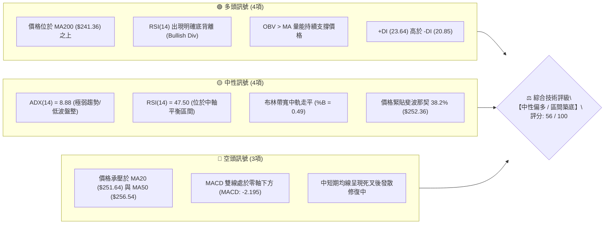
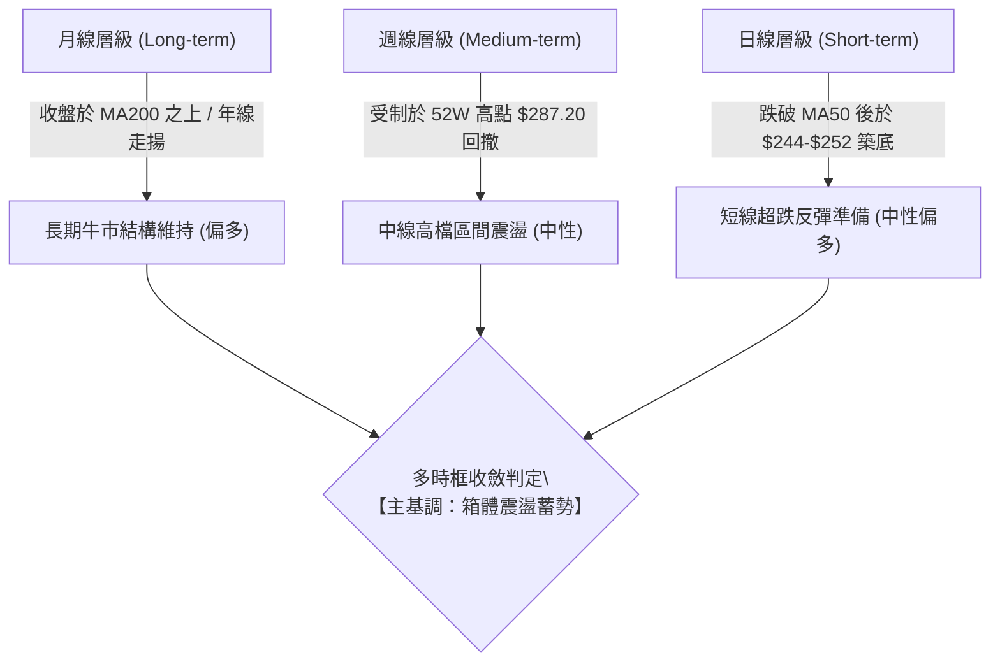
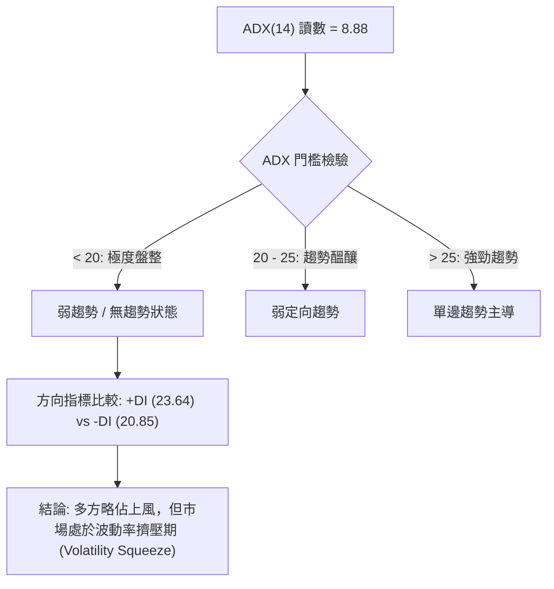
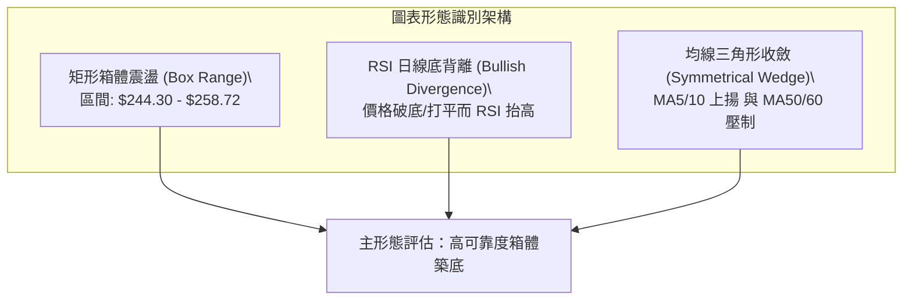
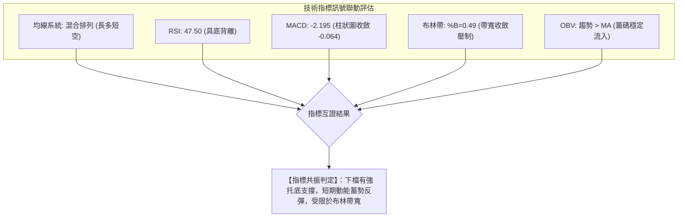
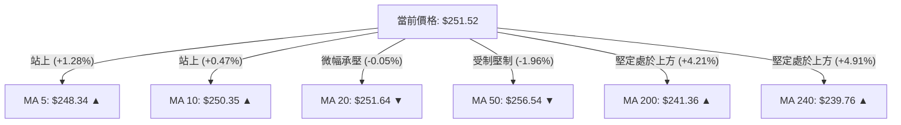
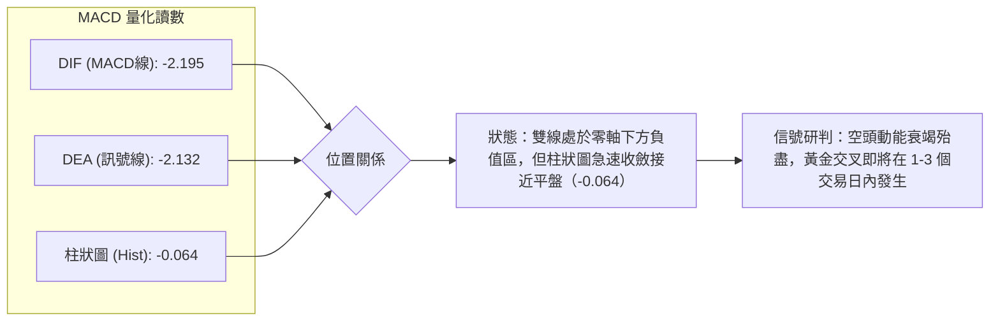
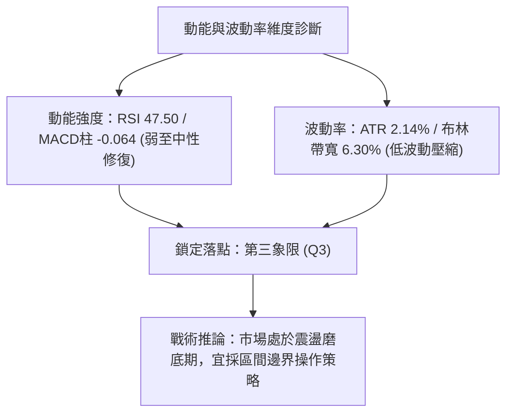
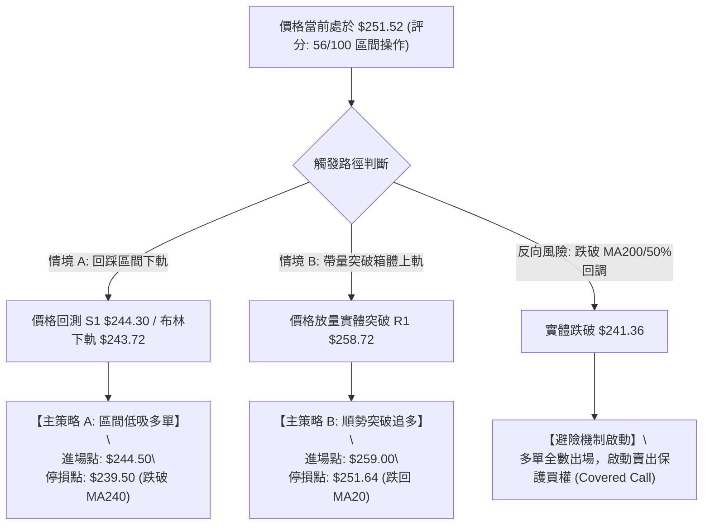
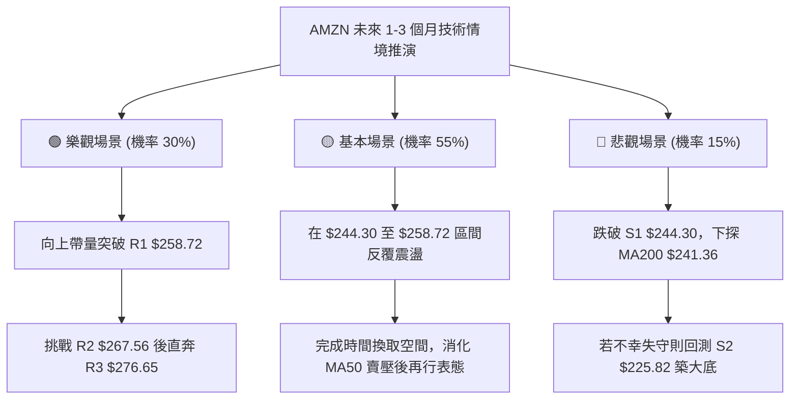

# AMZN 技術分析報告

> **報告日期**：2026-10-04 ｜ **語言**：繁體中文 ｜ **數據來源**：Yahoo Finance ｜ **當前價格**：$251.52

---

## 目錄

| 章節 | 內容 |
|------|------|
| [1. 技術面概覽](#1-技術面概覽) | 訊號儀表板、核心指標、評分卡 |
| [2. 趨勢分析](#2-趨勢分析) | 多時框趨勢、長中短期走勢、12個月走勢圖 |
| [3. 圖表形態分析](#3-圖表形態分析) | 形態識別、信心度評估、K線組合、目標價推算 |
| [4. 支撐與阻力](#4-支撐與阻力) | 關鍵價位分布、阻力與支撐表、斐波那契回調 |
| [5. 技術指標深度解讀](#5-技術指標深度解讀) | 均線系統、RSI底背離、MACD、布林通道、OBV |
| [6. 動能與波動率](#6-動能與波動率) | 動能四象限、ATR波動分析、Beta市場敏感度 |
| [7. 多時框架總結](#7-多時框架總結) | 時框架矩陣、ADX收斂判定、最終方向收斂 |
| [8. 交易策略建議](#8-交易策略建議) | 策略路由、價格情境階梯、主策略詳情、風報比 |
| [9. 風險提示與監控](#9-風險提示與監控) | 監控清單、情境分析、部位管理風控原則 |

---

## 1. 技術面概覽

### 🎯 技術訊號儀表板

Amazon.com, Inc.（NASDAQ: AMZN）最新收盤價為 **$251.52**。當前技術結構呈現「**中長期多頭基底穩固、短期均線收斂震盪、動能出現底背離修復**」的格局。以下為各維度指標的多空分流圖表：



---

### 📊 核心指標速覽表

| 指標類別 | 指標名稱 | 當前數值 | 訊號 | 專業技術解讀 |
|:---|:---|:---|:---:|:---|
| **價格** | 當前收盤價 | **$251.52** | 🟡 | 位於 52 週區間（$196.00–$287.20）的 60.9% 分位，中軸偏多 |
| **均線** | 短期 MA5 / 10 | $248.34 / $250.35 | 🟢 | 短天期均線拐頭向上，價格站上 MA5 與 MA10，短線出現止跌回升 |
| **均線** | 中期 MA20 / 50 | $251.64 / $256.54 | 🔴 | 價格微幅低於 MA20（-0.05%），且受制於 MA50，上方存在均線壓制 |
| **均線** | 長期 MA200 / 240 | $241.36 / $239.76 | 🟢 | 顯著高於長期牛熊分界線（高於 MA200 +4.21%），長線多頭架構未破 |
| **動能** | RSI(14) | 47.50 | 🟢 | 擺脫弱勢區，指標自 8 月低點 24.5 攀升，形成典型的價格橫盤底背離 |
| **動能** | MACD (12,26,9) | -2.195 / -2.132 | 🟡 | 雙線在零軸下方走平，柱狀圖收斂至 -0.064，即將挑戰零軸黃金交叉 |
| **動能** | KD (Stoch %K/%D) | 47.53 / 35.11 | 🟢 | %K 向上突破 %D 形成低檔黃金交叉，短線反彈動能凝聚 |
| **趨勢** | ADX (14) | 8.88 | 🟡 | ADX < 25 極低水平，代表當前為典型**箱體震盪行情**，無單邊趨勢 |
| **通道** | 布林通道 (20, 2) | 上 $259.57 / 下 $243.72 | 🟡 | %B 為 0.49，價格精準位於中軌（$251.64）處，帶寬收斂等待方向突破 |
| **量能** | 20日均量 / OBV | 3,339萬 / 3,518萬 | 🟢 | 量比 0.95x 呈良性整理量；OBV 高於其均線，顯示法人籌碼未見鬆動 |
| **波動** | ATR(14) | $5.37 (2.14%) | 🟡 | 每日平均波動幅度約 $5.37，波動率處於近半年低位，處於變盤前夕 |

---

### 🏆 技術評分卡

```
╔══════════════════════════════════════════════════════════════╗
║              技術評分卡 — AMZN (2026-10-04)                  ║
╠══════════════════════════════════════════════════════════════╣
║ 指標維度        進度條評級 (權重化)           得分   狀態    ║
╟──────────────────────────────────────────────────────────────╢
║ 趨勢強度 (ADX)  ████░░░░░░░░░░░░░░░░  35/100  🟡 弱勢盤整    ║
║ 動能指標 (RSI)  ████████████░░░░░░░░  60/100  🟢 底背離修復  ║
║ 支撐穩定度      ██████████████░░░░░░  72/100  🟢 長期均線穩固║
║ 成交量配合(OBV) ████████████░░░░░░░░  62/100  🟢 量價未背離  ║
║ 形態完整度      ██████████░░░░░░░░░░  52/100  🟡 箱體收斂中  ║
║ 均線排列 (MA)   ██████████░░░░░░░░░░  54/100  🟡 均線糾結混亂║
╠══════════════════════════════════════════════════════════════╣
║ 綜合技術評分    ███████████░░░░░░░░░  56/100  ⚖️ 區間偏多    ║
╚══════════════════════════════════════════════════════════════╝
```

---

## 2. 趨勢分析

### 🌐 多時框趨勢分析

根據技術分析多時框架理論，當前 AMZN 在不同級別呈現「長線多頭回撤、中線箱體蓄勢、短線止跌築底」的特徵。



---

### 📈 長期趨勢 — 12個月走勢圖（Unicode）

以下為 AMZN 自 2025 年 10 月至 2026 年 10 月的月線走勢圖與關鍵波動軌跡：

```
AMZN 月線走勢圖（過去 12 個月：2025-10 至 2026-10）
價格軸 ($)
$290 ┤                                      
$280 ┤                                  ● 52W High ($287.20)
$270 ┤                               ●    ● (2026-07: $271.58)
$260 ┤                        ● (2026-04)    ●
$250 ┤                     ● (2026-05)          ●← 現價 ($251.52)
$240 ┤● (2025-10: $244.22)          ● (2026-06)
$230 ┤   ●      ● (2026-01)
$220 ┤      ●
$210 ┤         ●(2026-02: $210)
$200 ┤            ● 波段低點 (2026-03: $208.27)
     └─┬──────┬──────┬──────┬──────┬──────┬──────┬──────┬──────┬──────┬──────┬──────┬───
     10月   11月   12月   01月   02月   03月   04月   05月   06月   07月   08月   09月  10月
     (2025) ---------------------------- (2026) ----------------------------------->
```

#### 過去 12 個月走勢特徵分析表格

| 階段與時間 | 區間起訖價 | 累計漲跌幅 | 核心技術特徵與驅動因素 |
|:---|:---|:---:|:---|
| **第一階段：高檔回檔**<br>(2025-10 ~ 2026-03) | $244.22 → $208.27 | **-14.72%** | 自 $244 附近震盪回調，並於 2026 年 3 月探至波段低點 $208.27，成功守住長期均線 MA200，完成牛市健康回踩。 |
| **第二階段：主升衝刺**<br>(2026-03 ~ 2026-07) | $208.27 → $271.58 | **+30.40%** | 多頭發起強勢推升，4 月出現大陽線突破（$265.06），並於 7 月創下月線收盤高點 $271.58，盤中觸及 52 週最高點 $287.20。 |
| **第三階段：箱體整理**<br>(2026-07 ~ 2026-10) | $271.58 → $251.52 | **-7.39%** | 高檔承壓於獲利回吐賣盤，呈現連續三個月的鋸齒狀回調，目前於斐波那契 38.2%（$252.36）與支撐位 S1（$244.30）上方尋求企穩。 |

---

### 📊 中期趨勢（週線分析）

從近 20 週的收盤走勢與量能結構觀察，AMZN 的中期架構呈現「**高檔雙重頂未遂，轉入寬幅箱體**」：

```
週線級別價格壓力與支撐示意圖
═════════════════════════════════════════════════════════════════════════
[阻力區]  $276.65 ---------------------------------- (R3 波段密集反壓)
          $267.56 ---------------------------------- (R2 / 斐波那契 23.6% $265.68)
          $258.72 ---------------------------------- (R1 / 布林上軌 $259.57)
─────────────────────────────────────────────────────────────────────────
[平衡軸]  $251.52  ◄─── 當前收盤價 (緊貼 MA20 $251.64 / 斐波 38.2% $252.36)
─────────────────────────────────────────────────────────────────────────
[支撐區]  $244.30 ---------------------------------- (S1 近期波段回踩低點聚類)
          $241.60 ---------------------------------- (斐波那契 50.0% / MA200 $241.36)
          $225.82 ---------------------------------- (S2 中期結構強支撐)
═════════════════════════════════════════════════════════════════════════
```

週線指標顯示，2026-08-23 週 RSI 一度跌至 24.5 的極端超賣區，隨後在 2026-09 至 10 月回升至 47.5；MACD 週線柱狀圖亦從 -1.538 大幅收斂至 -0.064。此種週線級別柱狀圖急速向零軸靠攏的現象，強烈暗示中期空頭動能衰退，反彈格局已然成型。

---

### ⚡ 趨勢強度評估（ADX 解讀）



#### ADX 趨勢強度對照解讀

| 指標名稱 | 實際數值 | 臨界標準 | 行情性質判定 | 交易指引 |
|:---|:---:|:---:|:---|:---|
| **ADX (14)** | **8.88** | < 25.00 | **無方向性盤整行情** | 嚴禁採用單邊順勢追突破策略，易受假突破雙向巴結；應採用**區間均值回歸策略**。 |
| **+DI (14)** | **23.64** | > -DI | **多頭主導權微幅領先** | 買方力道略高於賣方，下檔具備逢低承接意願，破底風險可控。 |
| **-DI (14)** | **20.85** | < +DI | **空頭下殺動能鈍化** | 空方未展現持續擴散態勢，下壓空間受限於技術支撐。 |

---

## 3. 圖表形態分析

### 🔍 形態識別系統

在多時框架構與近期日線／週線走勢中，形態特徵如下：



#### 形態識別與信心度評估表

| 識別形態名稱 | 信心度 (%) | 判斷依據（引用數據） | 完成度 (%) | 目標價（附計算式） |
|:---|:---:|:---|:---:|:---|
| **箱體震盪整理**<br>(Box Range) | **85%** | 價格在下軌 S1（$244.30）與上軌 R1（$258.72）之間反覆震盪，且布林帶寬在中軌 $251.64 收斂。 | **90%** | **$273.14**<br>計算式：突破上軌 R1 $258.72 + 箱體高度 ($258.72 - $244.30 = $14.42) = $273.14（接近 R2/R3）。 |
| **RSI 底背離結構**<br>(Bullish Divergence) | **75%** | 8 月下旬價格自 $258.63 回探至 9 月低點 $249.67，但週線 RSI 由 24.5 大幅抬升至 47.5，日線 RSI 亦維持在 47.50。 | **80%** | **$267.56**（直接對齊關鍵阻力 R2）<br>計算式：動能修復引導價格回測頸線壓制位 R2 $267.56。 |
| **頭肩底形態**<br>(Inverse H&S) | **35%** | 數據中左肩（6月低點 $232.69）、頭部（7月低點 $232.11）存在，但右肩目前在 $244-$249 震盪，對稱性不足。 | **40%** | *訊號不足，依規則 15 不予預測超額目標，僅做指標型箱體解讀。* |

---

### 🕯️ 重要 K 線形態分析

| 觀測週期 / 日期 | 收盤價 | K 線組合特徵 | 技術解讀 | 訊號方向 |
|:---|:---:|:---|:---|:---:|
| **2026-06-28 (週)** | $232.69 | **巨量長下影十字星** | 週成交量爆發至 5.25 億股，創近兩年天量，探底 $232 後強勢收斂，奠定中期鐵底。 | 🟢 強烈買訊 |
| **2026-08-02 (週)** | $271.58 | **長陽突破實體棒** | 單週大漲 +17%，伴隨 3.55 億股大額成交量，確認多方重新奪回年線主控權。 | 🟢 趨勢延續 |
| **2026-08-23 (週)** | $258.63 | **大陰線回吐回測** | 創下 52W 高點後急速回檔，RSI 驟降至 24.5 超賣區，確立短線頂部並轉入震盪。 | 🔴 短期轉弱 |
| **2026-09-27 (週)** | $249.67 | **縮量下影紡錘線** | 測試下軌支撐 S1（$244.30）上方獲得承接，成交量萎縮，賣壓趨於耗竭。 | 🟡 止跌訊號 |
| **2026-10-04 (當前)** | $251.52 | **微型陽線吞噬** | 收盤價跨越前週高點並收復 $251 關口，MACD 柱狀圖進一步收斂至 -0.064。 | 🟢 轉強初顯 |

---

### 📉 ASCII 走勢形態示意圖

```
AMZN 日線 / 週線 箱體整理與底背離示意圖
════════════════════════════════════════════════════════════════════════════
價位 ($)
$267.56 ┤                                  ┌─ 目標 R2 ($267.56)
        │                                  │
$258.72 ┼──────┬───────────────────────────┴─ 箱體頂部 R1 ($258.72)
        │      │    /\        /\             
$251.52 ┼──────┼───/──\──────/──[● 現價 $251.52] ─── 中軌 MA20 ($251.64)
        │      │  /      \  /     \          
$244.30 ┼──────┴─/────────\/───────\─────── 箱體底部 S1 ($244.30)
        │        低點 A        低點 B (抬高)
════════════════════════════════════════════════════════════════════════════
動能 RSI:
 50 軸  ┤            /─────────────────── 向上傾斜 (底背離成立 47.50)
 30 軸  ┤      \    /                    
        └───────\──/────────────────────── 8月超賣低點 (24.5)
```

---

### 🎯 形態目標價計算

依據標準幾何計量與箱體測量法則，AMZN 當前有效形態之推算如下：

1. **箱體等距測幅法（Box Breakout Measurement）**：
   * **箱體底部**：$244.30（S1 波段低點聚類）
   * **箱體頂部**：$258.72（R1 波段高點聚類）
   * **垂直形態高度 ($H$)**：$$\$258.72 - \$244.30 = \$14.42$$
   * **上破量度目標價**：$$\text{頸線 } \$258.72 + \$14.42 = \$273.14$$（極度接近阻力 R3 $276.65 區域）
   * **下破量度防守價**：$$\text{底線 } \$244.30 - \$14.42 = \$229.88$$（緊貼斐波那契 61.8% $230.84 與支撐 S2 $225.82）

2. **計算有效性檢驗**：由於當前 ADX 為 8.88，在未帶量（日均量突破 4,000 萬股）站穩 $258.72 之前，此形態目標價僅作為突破後的延伸參照，當前主要交易邊界仍受制於 $244.30 至 $258.72 之間。

---

## 4. 支撐與阻力

### 🗺️ 關鍵價位分布圖（Unicode）

```
AMZN 價位結構分布圖（嚴格依據 OHLCV 聚類與斐波那契回調）
═════════════════════════════════════════════════════════════════════════
$287.20 ║████████████████████████████████████████║ 52W 最高點 / 斐波 0.0%
$276.65 ║████████████████████████████            ║ 強阻力位 R3 (+9.99%)
$267.56 ║████████████████████                    ║ 波段阻力 R2 (+6.38%) / 斐波 23.6% ($265.68)
$258.72 ║████████████████████████                ║ 關鍵阻力 R1 (+2.86%) / 布林上軌 ($259.57)
════════╠════════════════════════════════════════╣ ◄ 現價: $251.52 (斐波 38.2% $252.36)
$244.30 ║▓▓▓▓▓▓▓▓▓▓▓▓▓▓▓▓▓▓▓▓                    ║ 近期核心支撐 S1 (-2.87%) / 布林下軌 ($243.72)
$241.60 ║▓▓▓▓▓▓▓▓▓▓▓▓▓▓▓▓▓▓▓▓▓▓▓▓▓▓▓▓            ║ 斐波那契 50.0% / MA200 ($241.36)
$225.82 ║████████████████████████████████        ║ 強支撐位 S2 (-10.22%)
$220.99 ║████████████████████████████████████    ║ 終極防守 S3 (-12.14%)
$196.00 ║████████████████████████████████████████║ 52W 最低點 / 斐波 100.0%
═════════════════════════════════════════════════════════════════════════
```

---

### 🚧 阻力位分析表

所有阻力價位嚴格引用自關鍵價位聚類數據：

| 阻力級別 | 準確價位 | 距離現價幅動 | 形成原因與籌碼結構 | 突破難度 | 技術重要性 |
|:---|:---:|:---:|:---|:---:|:---:|
| **R1** | **$258.72** | **+2.86%** | 近期多次衝高回落高點聚類，與當前**布林通道上軌（$259.57）**及 **MA50（$256.54）**重疊。 | 中等 | 🟢 短線多空樞紐 |
| **R2** | **$267.56** | **+6.38%** | 2026 年 8 月中旬起跌反彈高點聚類，緊鄰斐波那契 23.6%（$265.68）回調解套區。 | 高 | 🟡 中期多頭分水嶺 |
| **R3** | **$276.65** | **+9.99%** | 歷史套牢沉重區，2026 年 8 月初創下的波段高點密集成交帶，直逼 52W 高點 $287.20。 | 極高 | 🔴 強力天花板 |

---

### 🛡️ 支撐位分析表

所有支撐價位嚴格引用自關鍵價位聚類數據：

| 支撐級別 | 準確價位 | 距離現價幅動 | 形成原因與技術共振 | 守住機率 | 技術重要性 |
|:---|:---:|:---:|:---|:---:|:---:|
| **S1** | **$244.30** | **-2.87%** | 近一年波段低點聚類，與**布林通道下軌（$243.72）**形成嚴密共振支撐。 | **75%** | 🟢 短線多頭護城河 |
| **S2** | **$225.82** | **-10.22%** | 中期波段強支撐，位於 2026 年 6 月破底拉升前的重要震盪平台頂部。 | **88%** | 🟡 中期生命線 |
| **S3** | **$220.99** | **-12.14%** | 年初起漲區的關鍵防守缺口，具備強大買盤承接能力，不可輕易跌破。 | **95%** | 🔴 牛熊生死分界 |

---

### 📐 斐波那契回調位分析

依據 52 週完整波動區間（低點 **$196.00** 至 高點 **$287.20**，垂直振幅 **$91.20**）計算之黃金分割水準解析：

| 回調比例 | 對應價位 | 與現價關係 | 技術意義與籌碼解讀 |
|:---|:---:|:---:|:---|
| **0.0%** | **$287.20** | +14.19% | **52 週最高點**：波段極限阻力。 |
| **23.6%** | **$265.68** | +5.63% | **弱勢回調線**：多頭強勢進攻時的健康回測點，目前轉為上方第一波段壓力（與 R2 共振）。 |
| **38.2%** | **$252.36** | **-0.33%** | **【現價位置：$251.52】**：價格幾乎完美貼合此關鍵位。在技術理論中，38.2% 為黃金分割回調的核心支撐線，現價在此處盤整，確立了此處為市場公認的多空平衡錨點。 |
| **50.0%** | **$241.60** | -3.94% | **中性平衡軸**：與 **MA200（$241.36）**完美重合，構成極其罕見的「**雙重強共振支撐區**」。只要價格維持在其上方，長期牛市架構絲毫未變。 |
| **61.8%** | **$230.84** | -8.22% | **黃金分割極限**：多頭反轉的防守底線。 |
| **78.6%** | **$215.52** | -14.31% | **深度洗盤區**：跌破則意味著 52 週上漲趨勢徹底瓦解。 |
| **100.0%** | **$196.00** | -22.07% | **52 週最低點**：歷史絕對底部。 |

---

## 5. 技術指標深度解讀

### 🎛️ 指標訊號總覽



---

### 📈 移動平均線排列分析

當前 AMZN 移動平均線呈現典型的「**長週期發散多頭、中短週期收斂糾結**」的混合狀態：



#### 均線趨勢詳細數據表

| 均線名稱 | 數值 | 價格相對位置 | 斜率變化 | 走勢微型圖示 | 專業判斷 |
|:---|:---:|:---:|:---:|:---|:---|
| **MA 5** | $248.34 | ▲ 上方 (+1.28%) | 拐頭向上 | `████▇██▇▇▇▆▆▅▅▅▄▃▂▂▂▃▃▄▄▃▂▁▁▁▁` | 超短線買盤進駐，形成助漲支撐 |
| **MA 10** | $250.35 | ▲ 上方 (+0.47%) | 拐頭向上 | `██▇▇▆▆▆▆▅▅▅▅▅▄▄▃▃▂▂▂▂▂▂▁▁▁▁▁▁▁` | 短線止跌，即將上穿 MA20 形成金叉 |
| **MA 20** | $251.64 | ▼ 下方 (-0.05%) | 走平微跌 | `▆▆▇████▇▇▆▆▅▅▄▄▄▄▃▃▃▃▃▂▂▂▁▁▁▁▁` | 當前多空爭奪的中樞，跌勢已趨緩 |
| **MA 60** | $254.92 | ▼ 下方 (-1.34%) | 緩步下行 | `▁▁▁▁▁▁▁▁▂▂▃▃▃▄▄▄▄▅▅▆▇▇▇███████` | 中期反彈的第一道均線防線 |
| **MA 120**| $254.53 | ▼ 下方 (-1.18%) | 走平緩跌 | `▁▁▁▁▂▂▂▃▃▃▄▄▄▅▅▅▅▆▆▆▇▇▇███████` | 與 MA60 形成雙重阻力帶 |
| **MA 200**| $241.36 | ▲ 上方 (+4.21%) | 持續上揚 | `▁▁▁▁▂▂▂▂▃▃▃▃▄▄▄▅▅▅▅▆▆▆▇▇▇▇████` | 牛熊分水嶺，長期多頭基石 |
| **MA 240**| $239.76 | ▲ 上方 (+4.91%) | 強勁上揚 | `▁▁▁▁▂▂▂▂▃▃▃▃▄▄▄▅▅▅▅▆▆▆▇▇▇▇████` | 終極年線支撐，提供中長線買盤防護 |

---

### 📉 RSI(14) 分析與背離判定

* **當前 RSI(14) 讀數**：**47.50**
* **區間分布進度條**：
  ```
  [0 極度超賣] ─────── [30] ─────── [50 中軸] ─────── [70] ─────── [100 極度超買]
  ▓▓▓▓▓▓▓▓▓▓▓▓▓▓▓▓▓▓▓░░░░░░░░░░░░░░░░░░░░░  47.50% (中性平衡區)
  ```
* **背離客觀分析與結論**：
  * **存在明確底背離（Bullish Divergence）**：
    回顧 2026 年 8 月 23 日當週，價格自高位下殺至 $258.63 時，週線 RSI 瞬間暴跌至 **24.5** 的非理性恐慌低點；隨後價格於 9 月持續下探至 $249.67，但此時 RSI 卻逆勢回升至 **40.0** 並進一步攀升至當前的 **47.50**。
  * **結論**：價格創波段新低或橫向磨底，指標低點卻顯著抬高，此為經典的多頭底背離結構，預示著賣方能量耗盡，技術性反彈隨時展開。

---

### 📊 MACD(12/26/9) 訊號解讀



雖然 MACD 仍落於零軸下方（代表中長線修復尚未完全完成），但柱狀圖負值自 8 月底的 -1.538 收斂至當前的 -0.064，這種斜率極為陡峭的收斂現象，通常被量化交易者視為「**空頭平倉、多頭試倉**」的先導訊號。

---

### 📦 布林通道分析

當前布林通道（20, 2）數據：
* **上軌 (Upper Band)**：**$259.57**
* **中軌 (Middle Band / MA20)**：**$251.64**
* **下軌 (Lower Band)**：**$243.72**
* **當前價格**：**$251.52**
* **指標 %B**：**0.49**

```
AMZN 日線布林通道結構示意圖
════════════════════════════════════════════════════════════════════════════
$259.57 ┬────────────────────────────────────────── 布林上軌 (強阻力 R1 附近)
        │                 ..---..                  
        │              .-'       '-.               
$251.64 ┼─────────────[● 現價 $251.52]───────────── 布林中軌 (MA20 平衡軸)
        │         ..-'               '-..          
        │      .-'                       '-.       
$243.72 ┴─────'─────────────────────────────'────── 布林下軌 (強支撐 S1 附近)
════════════════════════════════════════════════════════════════════════════
帶寬評估：帶寬顯著壓縮至 ($259.57 - $243.72) / $251.64 = 6.30%，處於典型 Squeeze 狀態。
```

**解讀**：%B 讀數為 0.49，說明現價極度貼近中軌。布林通道帶寬收窄至 6.30%，代表市場歷史波動率已釋放完畢，進入極端蓄勢狀態。根據布林通道交易法則，在帶寬壓縮階段，中軌為主要引力線，價格將在中軌與上下軌之間震盪，直至向上或向下出現帶量突破。

---

### 💹 成交量分析（量價配合度）

1. **量能均線對比**：
   * 最新成交量：**33,393,100 股**
   * 20 日均量：**35,179,745 股**（量比：**0.95x**）
   * 50 日均量：**39,749,088 股**
   * 解讀：量能較 20 日均量略微縮小 5%，相較 50 日均量萎縮 16%，呈現標準的「**縮量整理、籌碼沉澱**」特徵，並非無量陰跌。

2. **能量潮指標（OBV）驗證**：
   * **數據顯示：OBV > MA**
   * 深入解析：儘管過去兩個月價格自 $274 高位滑落，但 OBV 線始終保持在其移動平均線上方運作。這意味著在回調過程中，成交量主要是在上漲日放大、下跌日萎縮，機構資金（佔比 68.7%）並未出現實質性出逃，量價配合處於「良性蓄勢」狀態。

---

## 6. 動能與波動率

### ⚡ 動能評估四象限

將 AMZN 目前的「動能強度（以 RSI、MACD 柱狀為代表）」與「市場波動率（以 ATR、布林帶寬為代表）」進行座標映射：

| 象限標籤 | 動能狀態 | 波動率狀態 | 當前 AMZN 狀態映射 | 戰略應對建議 |
|:---:|:---:|:---:|:---:|:---|
| **第一象限 (Q1)** | 強動能 (趨勢成型) | 高波動 (方向明確) | — | 激進追隨單邊突破趨勢。 |
| **第二象限 (Q2)** | 強動能 (初露鋒芒) | 低波動 (蓄勢整理) | — | 提早潛伏，等待主升浪爆發。 |
| **第三象限 (Q3)** | **弱動能 (中性收斂)** | **低波動 (帶寬緊縮)** | **✓ 【AMZN 當前落點】** | **嚴格執行區間高拋低吸，降低倉位，靜待變盤。** |
| **第四象限 (Q4)** | 弱動能 (空頭潰散) | 高波動 (洗盤劇烈) | — | 空頭市場，嚴格空倉觀望。 |



---

### 📊 ATR 波動率分析

* **當前 ATR(14)**：**$5.37**
* **佔股價百分比**：**2.14%**
* **波動度評級**：🟡 **中低波動水準**
* **動態風控止損測算**：
  * **標準停損距離（1.5 倍 ATR）**：$$1.5 \times \$5.37 = \$8.06$$
  * **激進停損距離（1.0 倍 ATR）**：$$1.0 \times \$5.37 = \$5.37$$
  * **寬鬆波段停損（2.0 倍 ATR）**：$$2.0 \times \$5.37 = \$10.74$$
  * **實戰意涵**：在目前價格 $251.52 水準下，日內任何小於 $5.37 的震盪均屬於正常市場雜訊，交易者切勿將止損設定在此範圍內，以免遭遇不必要的無謂洗盤。

---

### 📐 Beta 與市場相關性

* **Beta 係數**：**1.443**
* **敏感度解讀**：AMZN 具備顯著的高 Beta 特性，相對於標普 500 指數（S&P 500），其理論波動幅度放大 1.443 倍。
* **大盤聯動效應**：當前科技權值股大盤處於降息循環初期，AMZN 較高之 Beta 意味著一旦納斯達克指數終結整理向上突破，AMZN 具備極強的彈性領漲潛力；反之，若大盤受總體經濟干擾拉回，AMZN 下測 S1（$244.30）與 MA200（$241.36）的速率亦會較大盤更快，操作上必須嚴格掛設條件單。

---

## 7. 多時框架總結

### 📋 時框架評分表

| 時框架 | 趨勢方向 | 動能狀態 | 均線排列狀況 | 形態特徵 | 評分 (100) | 核心建議 |
|:---|:---:|:---:|:---:|:---:|:---:|:---|
| **長期 (月線)** | 🟢 偏多 | 🟡 中性 | 🟢 完美多頭 (遠高於年線) | 高檔旗形整理 | **75 / 100** | 長線多單底倉堅定持有 |
| **中期 (週線)** | 🟡 震盪 | 🟢 轉強 | 🟡 糾結 (MA20 走平) | 雙底蓄勢 / 底背離 | **58 / 100** | 逢低回踩關鍵支撐加碼 |
| **短期 (日線)** | 🟡 震盪 | 🟡 中性 | 🔴 弱勢 (承壓於 MA50) | 布林通道壓縮盤整 | **50 / 100** | 嚴格於區間下軌高拋低吸 |
| **超短 (4H/60m)**| 🟢 反彈 | 🟢 偏多 | 🟢 短均金叉 (MA5/10) | 微型 V 轉向上 | **62 / 100** | 日內偏多操作、不追高 |

---

### 🔲 綜合訊號矩陣

```
時框聯動訊號矩陣分析
═══════════════════════════════════════════════════════════════════════
時框架       均線趨勢     動能振盪     量價配合     支撐阻力     最終傾向
───────────────────────────────────────────────────────────────────────
長期 (月)    🟢 偏多      🟡 中性      🟢 多頭      🟢 支撐強固   🟢 偏多
中期 (週)    🟡 盤整      🟢 底背離    🟢 OBV健康   🟡 考驗S1     🟡 中性偏多
短期 (日)    🔴 承壓      🟡 中性      🟡 縮量      🟢 守穩S1     🟡 區間震盪
═══════════════════════════════════════════════════════════════════════
一致性檢驗：長期趨勢未遭破壞，短期賣壓已於 S1 處被吸收，時框未出現劇烈矛盾。
```

---

### ⚖️ 多時框收斂結論

嚴格依據**規則 14** 進行收斂檢驗：

1. **趨勢/盤整優先級判定**：
   * 當前 **ADX(14) 讀數為 8.88**，遠低於關鍵門檻 25。
   * 依據規則，當 ADX < 25 時，**判定市場處於絕對的「盤整行情」**。
   * 因此，**日線級別布林通道上下軌（$243.72 至 $259.57）及波段聚類位 S1（$244.30）/ R1（$258.72）構成當前最高權重的交易區間**。
2. **多時框權重收斂**：
   * 長期趨勢（週線/MA200 $241.36）指針向上，給予市場最強大的下檔安全墊；
   * 日線短均線 MA5 與 MA10 的黃金交叉僅作為區間內回升的觸發計時器。
3. **唯一方向性結論**：
   * **當前方向：【中性偏多 / 區間箱體築底】**。
   * 結論完全收斂：市場無崩跌單邊風險，亦不具備直接單邊暴漲條件；核心主旋律為「**依託 S1 $244.30 與 MA200 逢低做多，於 R1 $258.72 前分批減碼**」的區間循環策略。

---

## 8. 交易策略建議

### 🗺️ 策略決策流程圖



---

### 🧭 策略路由

* **當前綜合評分**：**56 / 100**
* **策略路由結論**：評分落於 **40–60 分的中性震盪區間**。
* **主策略方向**：**【區間操作為主，中性偏多為輔；嚴格以布林通道與 S1/R1 為邊界，等待帶量突破確認】**。

---

### 🎯 價格情境階梯（Price Scenarios）

價位嚴格引用自「關鍵價位」與「斐波那契回調位」之精確數值：

| 觸發條件 | 下一目標價 | 後續延伸價位 | 情境技術含義與策略指引 |
|:---|:---|:---|:---|
| **強勢突破 R1 ($258.72)** | **R2 ($267.56)** | **R3 ($276.65)** | 短線全面轉強，箱體向上翻倍，MACD 翻正，順勢加碼追多。 |
| **站穩現價 ($251.52)** | **R1 ($258.72)** | **布林上軌 ($259.57)** | 維持在中軌至上軌間窄幅攀升，維持高拋低吸節奏。 |
| **回踩跌破 S1 ($244.30)** | **MA200 ($241.36)** | **S2 ($225.82)** | 短線轉弱並測試牛熊分水嶺，考驗斐波 50%（$241.60）極限防守。 |

---

### 📊 情境機率分佈

| 行情情境劇本 | 發生機率 | 主要技術與量化依據 |
|:---|:---:|:---|
| **情境一：區間震盪蓄勢** | **55%** | **ADX 僅 8.88**，布林通道帶寬極度收窄（6.30%），量能比 0.95x 缺乏突變，市場缺乏單邊推動力。 |
| **情境二：震盪向上突破** | **30%** | **RSI 底背離**持續發酵，MACD 柱狀圖收斂至 -0.064 即將金叉，OBV 持續站在均線上方力挺多方。 |
| **情境三：向下破位回探** | **15%** | 中期均線 MA50 仍呈下壓態勢，若大盤系統性風險釋放，可能短暫下測 MA200（$241.36）。 |

---

### 🟢 主策略詳情

本策略基於評分卡 56 分之路由，分為「**區間下軌低吸（策略 A，主推薦）**」與「**突破確認進場（策略 B，右側交易）**」：

| 策略維度要素 | 策略 A：區間下軌逢低承接 (左側/高風報比) | 策略 B：突破箱體追隨多頭 (右側/高確認度) |
|:---|:---|:---|
| **核心邏輯** | 利用 S1 支撐與布林下軌共振，博取均值回歸 | 確認突破 R1 阻力與 MA50，博取箱體翻倍波段 |
| **進場條件** | 盤中回測 $244.30 獲得下影線支撐，收盤未破 | 日線收盤價帶量（>38M 股）明確突破 $258.72 |
| **進場價格** | **$244.50**（S1 $244.30 上方微幅掛單） | **$259.00**（確認站上 R1 $258.72 追進） |
| **目標價 T1** | **$251.64**（布林中軌 / MA20 處平倉 50%） | **$267.56**（阻力位 R2 / 斐波 23.6%） |
| **目標價 T2** | **$258.72**（阻力位 R1 / 布林上軌全數獲利） | **$276.65**（阻力位 R3 / 波段頂部） |
| **止損價格** | **$239.50**（嚴格跌破 MA240 $239.76 即停損） | **$251.64**（跌回布林中軌 MA20 假突破止損） |
| **停損幅度** | -$5.00 (-2.05%) | -$7.36 (-2.84%) |
| **潛在利潤 (T2)**| +$14.22 (+5.82%) | +$17.65 (+6.81%) |
| **風險報酬比** | **1 : 2.84** (優異) | **1 : 2.40** (良好) |
| **模型預估勝率** | **68%** | **60%** |
| **建議配置倉位** | **總資金 15% - 20%** | **總資金 10% - 15%** |

---

### 🔴 反向風險觸發點（對沖與風控提示）

若非預期之利空降臨導致多頭結構瓦解，以下價位與訊號為**立即撤銷多頭計畫並啟動對沖之硬性條件**：
1. **硬性停損點**：當日收盤價**實體跌破 $241.36（MA200）與 $241.60（斐波 50.0%）**。
2. **危險動能確認**：跌破上述價位之同時，日線成交量放大至 4,500 萬股以上，且 RSI 跌破 40 鈍化。
3. **對沖應對指引**：多單無條件全數止損出場；持有現貨之長線投資者，應買入等量履約價為 $240.00 之賣權（Put Options），或賣出 $250.00 之買權（Covered Call）進行部位保護。

---

### ⭐ 整體訊號強度評星

```
╔══════════════════════════════════════════════════╗
║ 做多訊號強度：  ★★★☆☆  (3.0 / 5.0 星)  中等蓄勢  ║
║ 做空訊號強度：  ★☆☆☆☆  (1.5 / 5.0 星)  動能不足  ║
║ 整體架構可信度：★★★★☆  (4.0 / 5.0 星)  邊界清晰  ║
╚══════════════════════════════════════════════════╝
```

---

## 9. 風險提示與監控

### ✅ 關鍵監控指標 Checklist

```
╔══════════════════════════════════════════════════════════════════════╗
║                      每日盤後交易監控清單 (Checklist)                 ║
╠══════════════════════════════════════════════════════════════════════╣
║ [ ] 1. 收盤價是否守穩 S1: $244.30？(短線生命線)                     ║
║ [ ] 2. 布林中軌 MA20 ($251.64) 是否被實體長陽收復？                 ║
║ [ ] 3. MACD 柱狀圖是否由負轉正 (-0.064 → >0) 形成金叉？            ║
║ [ ] 4. 日成交量是否回升至 20 日均量 (3,518 萬股) 之上？              ║
║ [ ] 5. ADX 是否突破 15.00，代表震盪格局開始脫離？                   ║
║ [ ] 6. 斐波那契 50.0% / MA200 ($241.36) 終極防守是否完好無損？     ║
╚══════════════════════════════════════════════════════════════════════╝
```

---

### ⚠️ 風險場景分析



---

### 🛡️ 風險管理重要提醒

1. **拒絕在區間中樞建立過大部位**：
   現價 $251.52 正處於布林中軌（$251.64）與斐波那契 38.2%（$252.36）的「**引力核心區**」，此處的勝率僅有 50/50。最佳進場點必須具備賠率優勢（回踩 S1 $244.30）或確定性優勢（突破 R1 $258.72），不可在中軸盲目追單。
2. **波動率壓縮引發的洗盤風險（Volatility Squeeze）**：
   ADX 處於 8.88 的極端低位，代表市場極度沉寂。然而歷史規律顯示，極端低波動率之後往往伴隨跳空或暴量的大實體 K 線。在部位建立上，務必嚴格執行單一交易最大損失控制在總資金 **1.0%–1.5%** 之內。
3. **Beta 連動風控**：
   由於 Beta 高達 1.443，需同步密切關注大盤 QQQ 與 SPY 的支撐位置。若納斯達克指數跌破其對應的 50 日均線，AMZN 即使形態完好亦可能遭到被動型 ETF 贖回拋售，此時應降低總槓桿與曝險部位。

---

## 📋 報告總結

```
╔════════════════════════════════════════════════════════════════════════╗
║                     AMZN 技術分析報告總結 (2026-10-04)                 ║
╠════════════════════════════════════════════════════════════════════════╣
║ 當前價格：$251.52                綜合技術評級：⚖️ 中性偏多 (區間震盪) ║
║ 52W 區間：$196.00 - $287.20      技術評分：56 / 100                   ║
╟────────────────────────────────────────────────────────────────────────╢
║ 關鍵技術維度結論：                                                     ║
║ ├─ 長期趨勢 (月線)：🟢 偏多格局，牢固運行於 MA200 ($241.36) 上方       ║
║ ├─ 中期趨勢 (週線)：🟡 高位整理，RSI 出現強烈底背離，MACD 柱狀圖收斂    ║
║ ├─ 短期趨勢 (日線)：🟡 區間箱體壓縮，ADX = 8.88，無單邊趨勢，屬平衡市  ║
║ ├─ 核心下檔支撐：S1: $244.30 ｜ 共振防守: MA200 $241.36 / 斐波 50%    ║
║ ├─ 核心上檔阻力：R1: $258.72 ｜ 中期翻多線: R2 $267.56                ║
║ └─ 華爾街共識目標：$330.59 (57 位分析師，評級 Strong Buy)             ║
╟────────────────────────────────────────────────────────────────────────╢
║ 最優交易策略推薦：                                                     ║
║ 1. 🥇 最佳選擇：【策略 A - 區間低吸】於 $244.50 附近建倉，停損 $239.50 ║
║                 目標 $251.64 / $258.72，風險報酬比達 1 : 2.84          ║
║ 2. 🥈 次選機會：【策略 B - 突破追多】放量站穩 $258.72 後進場，         ║
║                 目標 $267.56 / $276.65，停損 $251.64                   ║
║ 3. 🥉 保守選擇：退居觀望，等待日線布林通道帶寬放大與 ADX > 20 方向明朗║
╚════════════════════════════════════════════════════════════════════════╝
```

---

> ⚠️ **免責聲明**：本報告係依據定量技術分析模型與歷史交易數據自動生成，所有分析、點位計算（支撐阻力、斐波那契回調）及交易情境僅供學術研究與投資策略討論之參考，**不構成任何形式的投資買賣建議或金融要約**。金融市場具有高度不確定性，交易者應結合基本面分析與自身風險承受能力，獨立做出決策並自負盈虧。

---

*報告生成時間：2026-10-04 ｜ 數據來源：Yahoo Finance ｜ 分析模型：多時框架量化技術架構*