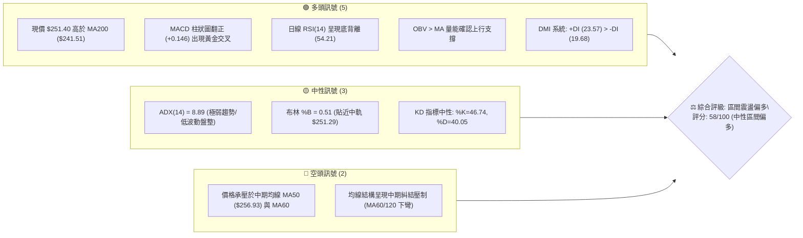
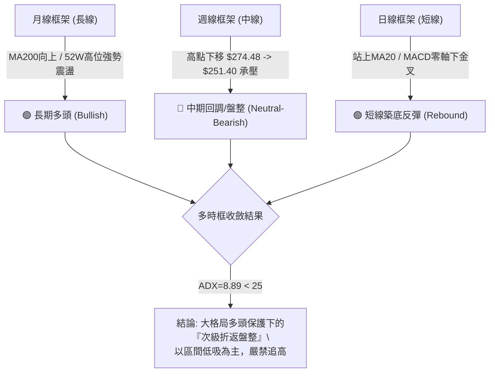
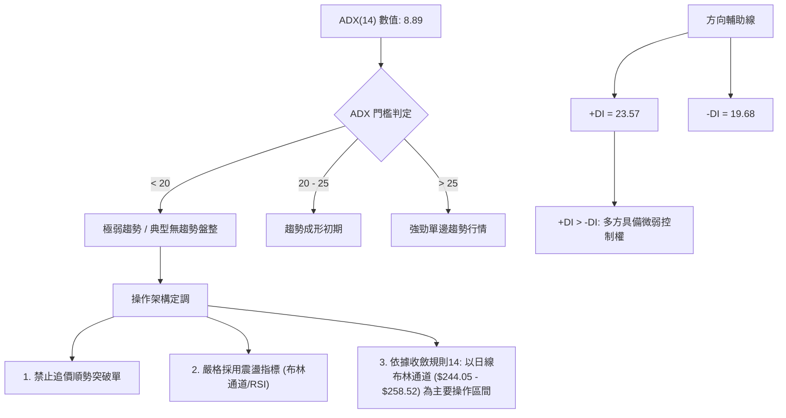
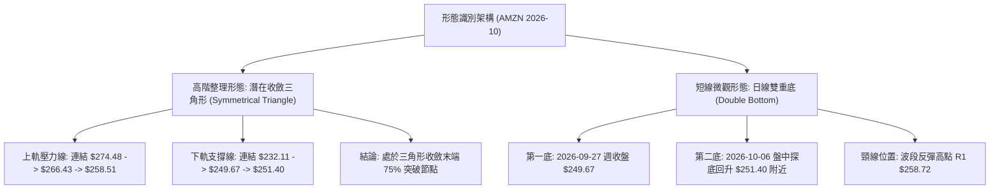
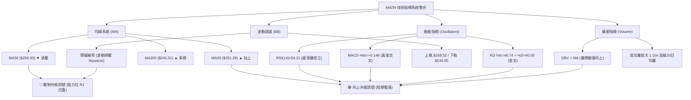
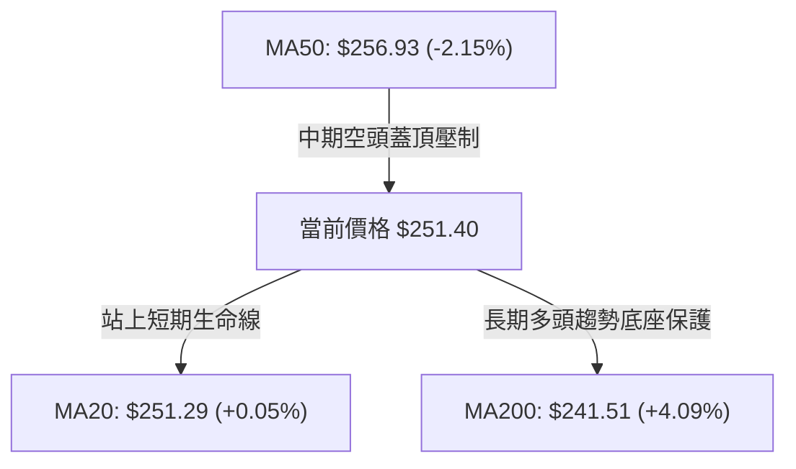
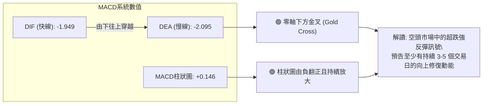
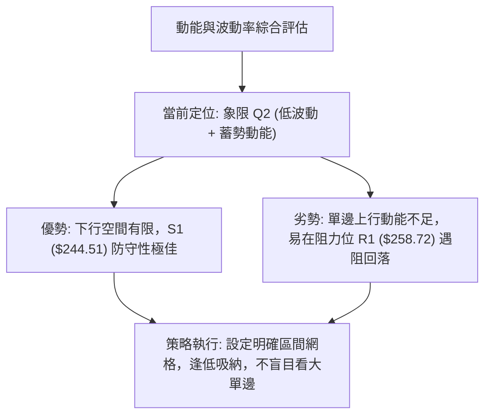
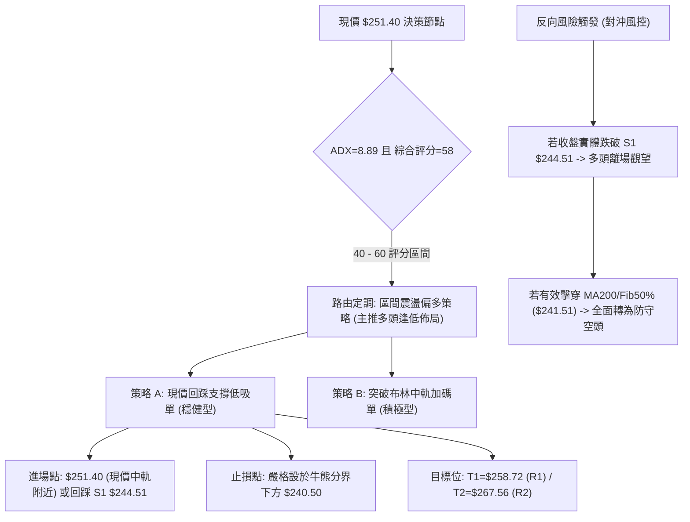
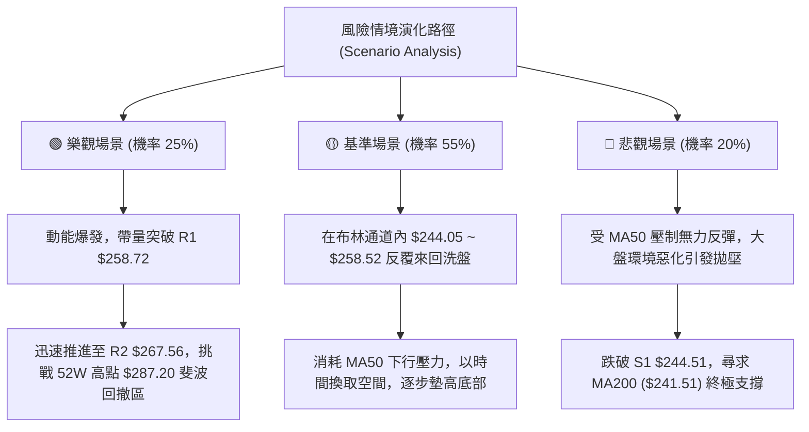

# AMZN 技術分析報告

> **報告日期**：2026-10-06 ｜ **語言**：繁體中文 ｜ **數據來源**：Yahoo Finance ｜ **當前價格**：$251.40

---

## 目錄

| 章節 | 內容 |
|------|------|
| [1. 技術面概覽](#1-技術面概覽) | 訊號儀表板、核心指標、評分卡 |
| [2. 趨勢分析](#2-趨勢分析) | 多時框趨勢、長中短期走勢、ADX解讀 |
| [3. 圖表形態分析](#3-圖表形態分析) | 形態識別信心度、重要K線組合、目標價推算 |
| [4. 支撐與阻力](#4-支撐與阻力) | 關鍵價位結構、斐波那契回調位分析 |
| [5. 技術指標深度解讀](#5-技術指標深度解讀) | MA/RSI/MACD/布林通道/成交量配合度 |
| [6. 動能與波動率](#6-動能與波動率) | 動能評估四象限、ATR波動率、Beta值 |
| [7. 多時框架總結](#7-多時框架總結) | 時框架評分矩陣、多時框收斂定調 |
| [8. 交易策略建議](#8-交易策略建議) | 策略路由分流、價格階梯、主交易策略 |
| [9. 風險提示與監控](#9-風險提示與監控) | 監控Checklist、風險場景模擬、風控防線 |
| [📋 報告總結](#-報告總結) | 核心結論與執行摘要 |

---

## 1. 技術面概覽

### 🎯 技術訊號儀表板



### 📊 核心指標速覽表

| 指標類別 | 指標名稱 | 當前數值 | 訊號 | 解讀 |
|----------|----------|----------|------|------|
| **價格** | 當前價格 | $251.40 | 🟡 | 位於52週區間60.7%位置，於波段回調38.2%關鍵水位震盪 |
| **短期均線** | MA20 | $251.29 | 🟢 | 價格微幅站上20日中軌（+0.05%），短線跌勢暫時止穩 |
| **中期均線** | MA50 | $256.93 | 🔴 | 價格位於50日均線下方（-2.15%），中期空頭壓制尚未化解 |
| **長期均線** | MA200 | $241.51 | 🟢 | 價格穩居200日牛熊分界線上方（+4.09%），長期多頭架構未破 |
| **擺盪動能** | RSI(14) | 54.21 | 🟢 | 中性偏多，且前期低點形成顯著「日線底背離」，反彈動能醞釀 |
| **趨勢動能** | MACD(12,26,9) | -1.949 / Sig: -2.095 | 🟢 | DIF穿越MACD形成零軸下黃金交叉，柱狀圖達 +0.146 |
| **隨機指標** | KD(9,3,3) | %K: 46.74 / %D: 40.05 | 🟢 | K值自低檔穿越D值，處於中軸震盪向上擴張階段 |
| **趨勢強度** | ADX(14) | 8.89 | 🟡 | 極低數值（<25），表明市場處於典型無方向盤整期，非單邊行情 |
| **通道指標** | Bollinger Bands | 上:$258.52 / 下:$244.05 | 🟡 | %B為0.51，價格精確貼齊中軌，波動率大幅收斂面臨方向選擇 |
| **量能指標** | OBV & 量比 | 39.17M (量比 1.10x) | 🟢 | OBV突破均線，成交量較20日均量放大10%，量價配合健康 |
| **真實波動** | ATR(14) | $5.23 (2.08%) | 🟡 | 波動率處於近幾個月偏低水準，適宜設定窄幅結構性止損 |

### 🏆 技術評分卡

```
╔══════════════════════════════════════════════════════════════════╗
║               AMZN 技術維度綜合評分卡 (2026-10-06)               ║
╠══════════════════════════════════════════════════════════════════╣
║ 趨勢強度 (ADX=8.89 盤整)    ██████░░░░░░░░░░░░░░  30/100  🔴 弱勢║
║ 動能指標 (MACD金叉/RSI底背) ██████████████░░░░░░  70/100  🟢 偏多║
║ 支撐穩定度 (Fib38.2%/S1)    ██████████████░░░░░░  72/100  🟢 穩固║
║ 成交量配合 (OBV創高/量比1.1)████████████░░░░░░░░  62/100  🟢 健康║
║ 形態完整度 (區間底背離修復) ██████████░░░░░░░░░░  52/100  🟡 中性║
║ 均線排列 (MA20>P>MA50<MA200)████████████░░░░░░░░  60/100  🟡 糾結║
╠══════════════════════════════════════════════════════════════════╣
║ 綜合技術得分                ███████████░░░░░░░░░  58/100  🟡 震盪║
║ 策略定調                    區間底部轉強，以布林下軌/中軌為防守 ║
╚══════════════════════════════════════════════════════════════════╝
```

---

## 2. 趨勢分析

### 🌐 多時框趨勢分析



### 📈 長期趨勢 — 12個月走勢圖（Unicode）

以下為 AMZN 過去 12 個月（2025-11 至 2026-10）收盤價走勢圖，標注歷史波段高低點結構：

```
AMZN 月線走勢圖（過去12個月）
價格軸 ($)
$275 ┤                               ● $271.58 (2026-07)
$270 ┤                   ● $270.64
$265 ┤               ● $265.06           ● $259.77
$255 ┤                                       ● $251.40 (現價)
$250 ┤                                           ● $249.15
$245 ┤   ● $244.22(前期高)
$240 ┤       ● $239.30               ● $238.34
$230 ┤           ● $230.82
$215 ┤               
$205 ┤                   ● $208.27 (年度波段次低點 2026-03)
     └─────────────────────────────────────────────────────────────
        11   12   01   02   03   04   05   06   07   08   09   10 (月份)
       2025 2025 2026 2026 2026 2026 2026 2026 2026 2026 2026 2026
```

#### 走勢特徵分析表格

| 階段區間 | 時間跨度 | 價格起迄 | 漲跌幅 | 結構形態與成交量特徵 | 趨勢性質 |
|----------|----------|----------|--------|----------------------|----------|
| **第1階段：高檔折返** | 2025-11 ~ 2026-03 | $233.22 → $208.27 | -10.70% | 呈現ABC下行修正，於 $208.27 探底回升，成交量逐步萎縮 | 中期回調探底 |
| **第2階段：主升推動** | 2026-03 ~ 2026-05 | $208.27 → $270.64 | +29.95% | 連續強勢大陽線拉升，突破多重均線壓制，成交量急劇放大 | 主升浪爆發 |
| **第3階段：寬幅震盪** | 2026-05 ~ 2026-07 | $270.64 → $271.58 | +0.35%  | 巨幅洗盤，回踩 $238.34 後強勢再刷 $271.58 新高，主力籌碼換手 | 高位箱體分歧 |
| **第4階段：次級回撤** | 2026-08 ~ 2026-10 | $271.58 → $251.40 | -7.43%  | 陰跌量縮回踩斐波那契 38.2% ($252.36) 支撐帶，當前止跌企穩 | 蓄勢築底階段 |

### 📊 中期趨勢（週線分析）

中期走勢圖展示了近 20 週從高點回落至當前支撐帶的演變歷程：

```
中期週線價格通道與支撐/阻力示意圖
$280 ┤
$275 ┤           ● 08-09 週高點 $274.48 (中期波段頂)
$270 ┤       ●       ＼
$265 ┤                   ＼  ▼ 下降壓力線 (Trendline Resistance)
$260 ┤                       ● 08-30 $266.43
$255 ┤                           ＼      ● 09-13 $256.78
$250 ┤───────────────────────────────●───● 10-04~10-11 現價 $251.40 附近打底
$245 ┤       ● 07-12 $245.34      ▲ 水平支撐帶 (Fib 38.2% $252.36 / S1 $244.51)
$240 ┤
$235 ┤   ● 06-28 $232.69 (中期波段低點，放量長下影)
     └─────────────────────────────────────────────────────────────
      W1  W3  W5  W7  W9  W11 W13 W15 W17 W19 W20
```

中期走勢顯示，AMZN 在 2026 年 8 月初見頂於 $274.48 後，呈現一浪低於一浪的收斂三角形震盪回調。值得注意的是，2026-06-28 週放量 5.25 億股並於 $232.69 見底，奠定了中長期堅實的籌碼底座；近幾週成交量顯著萎縮至 1.5 億至 1.9 億股區間，顯示拋壓耗盡。

### ⚡ 趨勢強度評估（ADX 解讀）



#### ADX 指標強度對照表

| 指標變數 | 當前讀數 | 門檻區間 | 趨勢屬性 | 交易指導意義 |
|----------|----------|----------|----------|--------------|
| **ADX(14)** | **8.89** | 0 ~ 20 | **極度低迷 / 深度休眠** | 趨勢交易者應離場觀望；區間交易者主導市場，切忌單邊追價 |
| **+DI (多方)** | **23.57** | 0 ~ 100 | **主導多頭** | 多方動能略佔上風，價格下行抵抗力強 |
| **-DI (空方)** | **19.68** | 0 ~ 100 | **空方衰竭** | 空方未形成進攻合力，無法發動深幅下殺 |
| **DI 差值** | **+3.89** | - | **弱勢多頭** | 盤整向上微傾，易出現反覆震盪洗盤 |

---

## 3. 圖表形態分析

### 🔍 形態識別系統



#### 形態識別信心度與計算表格（嚴格遵守規則 13、15）

| 形態名稱 | 信心度 | 判斷依據（引用數據） | 完成度 | 目標價（精確附計算式） |
|----------|--------|----------------------|--------|------------------------|
| **日線微型雙底 (Double Bottom)** | **70%** | 低點聚類於 S1 ($244.51) 上方，09-27 收 $249.67 與當前 $251.40 形成雙重支撐腳，伴隨 RSI 底背離 | 65% | 頸線 = R1 $258.72。<br>形態高度 = 頸線 $258.72 - 低點 $249.67 = $9.05。<br>突破目標價 = $258.72 + $9.05 = **$267.77**（高度接近數據庫阻力位 R2 **$267.56**） |
| **收斂對稱三角形 (Triangle)** | **60%** | 週線高點下移（$274.48 → $266.43 → $258.51），低點上移（$232.11 → $249.67），成交量由 5.25億 萎縮至 1.7億 | 80% | 三角形基底高度 = $274.48 - $232.11 = $42.37。<br>若向上突破 R1 ($258.72)，波段測幅目標 = $258.72 + $42.37 = **$301.09**（數據中未偵測到此波段阻力，受制於52W高點 **$287.20**） |
| **頭肩底 (Inverted H&S)** | **35%** | 數據中左肩與頭部比例失衡，缺乏典型幾何對稱性 | 20% | **訊號不足，僅做指標型解讀**（依規則15不予推算目標價） |

### 🕯️ 重要K線形態分析

| 日期 / 月份 | 收盤價 | K線形態特徵 | 量價關係與解讀 | 訊號評級 |
|-------------|--------|-------------|----------------|----------|
| **2026-06-28** | $232.69 | **巨量長下影鎚頭線 (Hammer)** | 週成交量爆發至 5.25 億股，主力在 S2 ($225.82) 前方強力護盤清算恐慌盤 | 🟢 強烈看多 |
| **2026-08-09** | $274.48 | **流星線 (Shooting Star)** | 衝高觸及 52W 高點回撤帶承壓，放量 2.7 億股滯漲，形成波段頂點 | 🔴 強烈看空 |
| **2026-09-27** | $249.67 | **探底十字星 (Doji)** | 連跌數週後於斐波那契 38.2% ($252.36) 處縮量收十字星，賣壓枯竭 | 🟡 變盤預警 |
| **2026-10-04** | $251.52 | **低檔回友陽線 (Bullish Harami)** | 實體完全包覆前期陰線底部，成交量適度萎縮，代表多頭在 $250 構建防禦線 | 🟢 看多反彈 |
| **2026-10-11** | $251.40 | **窄幅微陽星 (Spinning Top)** | 最新一週價格貼齊 MA20 ($251.29)，MACD 柱狀圖翻正，醞釀方向突破 | 🟢 短線轉強 |

### 📉 ASCII 走勢形態示意圖

```
AMZN 局部收斂三角形與雙底築底示意圖 (2026-08 至 2026-10)
$275 ┤  ● 08-09 高點 $274.48
$270 ┤    ＼
$265 ┤      ＼        ● 08-30 $266.43
$260 ┤        ＼        ＼
$258.72┤─────────＼────────● 頸線阻力位 R1 ($258.72) / BB上軌 ($258.52)
$255 ┤             ＼        ＼
$251.40┤──────────────●───────● 現價突破中軌 MA20 ($251.29)
$249.67┤               ● (底1)   ● (底2)  ← 雙底頸線測幅高度 $9.05
$244.51┤────────────────────────────────波段強支撐 S1 ($244.51) / BB下軌 ($244.05)
     └────────────────────────────────────────────────────────────
        08-09    08-23    09-06    09-20    10-04    10-11
```

### 🎯 形態目標價計算

根據嚴格之技術分析形態學幾何度量原則：

1. **雙重底測幅計算式**：
   - 形態底部低點：$L = \$249.67$（2026-09-27 週收盤價）
   - 形態頸線位置：$N = \$258.72$（近一年波段高點聚類阻力位 R1）
   - 垂直形態高度：$H = N - L = \$258.72 - \$249.67 = \$9.05$
   - **理論最小突破目標價**：$T1 = N + H = \$258.72 + \$9.05 = \mathbf{\$267.77}$
   - **數值驗證**：此推算目標價與提供的阻力位 **R2 ($267.56)** 僅差 $0.21，具備極高的統計聚合度與技術有效性。

---

## 4. 支撐與阻力

### 🗺️ 關鍵價位分布圖（Unicode）

```
AMZN 價位結構分布圖 (由 OHLCV 與歷史波段精確聚類計算)
═══════════════════════════════════════════════════════════════════
$287.20 ║████████████████████████████████║ 52週歷史最高價 (0.0% Fib)
$276.65 ║████████████████████████        ║ 強阻力位 R3 (波段高點聚類)
$267.56 ║████████████████████            ║ 阻力位 R2 (雙底測幅目標 $267.77 聚合)
$265.68 ║▓▓▓▓▓▓▓▓▓▓▓▓▓▓▓▓▓▓▓▓            ║ 斐波那契回調位 23.6%
$258.72 ║████████████████████████████    ║ 關鍵頸線阻力 R1 (布林上軌 $258.52 重合)
$256.93 ║┈┈┈┈┈┈┈┈┈┈┈┈┈┈┈┈┈┈┈┈┈┈┈┈┈┈┈┈┈┈┈┈║ 中期趨勢線 MA50 壓制位
$252.36 ║░░░░░░░░░░░░░░░░░░░░░░░░░░░░░░░░║ 斐波那契回調位 38.2%
$251.40 ╠════════════════════════════════╣ ◄ 當前收盤價 (現處密集爭奪區)
$251.29 ║┈┈┈┈┈┈┈┈┈┈┈┈┈┈┈┈┈┈┈┈┈┈┈┈┈┈┈┈┈┈┈┈║ 短期生命線 MA20 / 布林中軌
$244.51 ║▓▓▓▓▓▓▓▓▓▓▓▓▓▓▓▓▓▓▓▓▓▓▓▓        ║ 近期核心支撐 S1 (布林下軌 $244.05 重合)
$241.60 ║░░░░░░░░░░░░░░░░░░░░░░░░░░░░░░░░║ 斐波那契回調位 50.0% (牛熊分水嶺)
$241.51 ║████████████████████████████████║ 長期牛熊分界線 MA200
$230.84 ║░░░░░░░░░░░░░░░░░░░░░░░░░░░░░░░░║ 斐波那契黃金分割位 61.8%
$225.82 ║████████████████████████████    ║ 強波段支撐位 S2 (前期放量起漲點)
$220.99 ║████████████████████████        ║ 極限防守支撐 S3 (中期底部結構下沿)
$196.00 ║████████████████████████████████║ 52週歷史最低價 (100.0% Fib)
═══════════════════════════════════════════════════════════════════
```

### 🚧 阻力位分析表

所有阻力價位嚴格引用自數據庫波段聚類，不得捏造：

| 阻力級別 | 精確價位 | 空間幅度 | 形成原因與共振要素 | 突破難度 | 重要性 |
|----------|----------|----------|--------------------|----------|--------|
| **R1** | **$258.72** | +2.91% | 近一年波段高點聚類、布林通道上軌 ($258.52)、MA50 ($256.93) 密集共振區 | 🟡 中等偏高 | 🟢 關鍵短線頸線 |
| **R2** | **$267.56** | +6.43% | 波段高點聚類、斐波那契 23.6% ($265.68) 壓制、微型雙底理論目標價 ($267.77) | 🔴 高度困難 | 🟡 中期分水嶺 |
| **R3** | **$276.65** | +10.05% | 近一年波段頭部頂點區（前高 $274.48 所在籌碼套牢峰） | 🔴 極度堅固 | 🔴 強波段天花板 |

### 🛡️ 支撐位分析表

所有支撐價位嚴格引用自數據庫波段聚類：

| 支撐級別 | 精確價位 | 空間幅度 | 形成原因與共振要素 | 守住機率 | 重要性 |
|----------|----------|----------|--------------------|----------|--------|
| **S1** | **$244.51** | -2.74% | 近一年波段低點聚類、布林下軌 ($244.05) 重合、Fib 50.0% ($241.60) 緩衝墊 | 75% | 🟢 短線多頭命脈 |
| **S2** | **$225.82** | -10.17% | 近一年重要波段低點聚類、2026-06 放量洗盤換手密集成交帶 | 85% | 🔴 中期戰略底座 |
| **S3** | **$220.99** | -12.10% | 極端波段底部聚類、歷史多重支撐線，跌破則宣告長期牛市結束 | 95% | 🔴 長期終極防線 |

### 📐 斐波那契回調位分析

依據 52 週波動極值區間（低點 **$196.00** 至 高點 **$287.20**，總波動垂直高度為 **$91.20**）計算之標準斐波那契位解讀：

| 分割比例 | 基準價位 | 當前相對位置 | 技術意涵與結構解讀 |
|----------|----------|--------------|--------------------|
| **0.0%** | **$287.20** | +14.24% | 52 週極限高點，牛市極限擴張目標位 |
| **23.6%** | **$265.68** | +5.68% | 第一強阻力回撤位，與 R2 ($267.56) 構成高位壓力帶 |
| **38.2%** | **$252.36** | **+0.38%** | **當前價格 ($251.40) 精準貼齊此位！** 此處為強勢拉升後的「一級健康回調支撐」，守穩代表多頭主架構未受實質破壞 |
| **50.0%** | **$241.60** | -3.90% | 多空中間分水嶺，與 **MA200 ($241.51)** 形成不可思議的精確共振，構成絕對不可跌破的「牛熊生命線」 |
| **61.8%** | **$230.84** | -8.18% | 黃金分割極限回調位，守穩意味著仍為上升趨勢中的大級別調整 |
| **78.6%** | **$215.52** | -14.27% | 深度回調警戒線，一旦觸及代表趨勢全面弱化為寬幅大箱體震盪 |
| **100.0%**| **$196.00** | -22.04% | 52 週週期起漲原點 |

**解讀結論**：AMZN 現價 $251.40 正好壓在 **Fib 38.2% ($252.36)** 與 **Fib 50.0% ($241.60)** 之間的「強勢修正緩衝帶」。由於 50% 水位與 200 日均線 MA200 ($241.51) 幾乎重合，下方具備極致強大的結構性買盤支撐。

---

## 5. 技術指標深度解讀

### 🎛️ 指標訊號總覽



### 📈 移動平均線排列分析



#### 移動平均線多週期狀態表

| 均線名稱 | 當前價格 | 與現價距離 (%) | 走勢特徵 | 訊號解讀 |
|----------|----------|----------------|----------|----------|
| **MA 5** | $249.39 | +0.80% | 扣抵低檔開始拐頭向上 | 🟢 極短線止跌回升 |
| **MA 10** | $249.64 | +0.70% | 底部走平收斂 | 🟢 短線支撐成形 |
| **MA 20** | $251.29 | +0.05% | 走平微揚，現價微幅站上 | 🟢 月線級別重回多方 |
| **MA 50** | $256.93 | -2.15% | 穩步下行，斜率為負 | 🔴 中期反彈關鍵阻力 |
| **MA 60** | $255.03 | -1.42% | 高檔下彎，構成空頭夾層 | 🔴 季線反壓明顯 |
| **MA 120** | $254.55 | -1.24% | 下穿MA60，形成中期死叉遺留 | 🔴 半年線阻力阻滯 |
| **MA 200** | $241.51 | +4.09% | 穩健向上，年線支撐極強 | 🟢 長期牛市基石未破 |
| **MA 240** | $239.90 | +4.79% | 長期多頭排列延續 | 🟢 終極均線護城河 |

**均線綜合判定**：目前均線系統呈現「**短線修復、中期承壓、長線向好**」的夾層混合排列。現價剛收復 MA20，但上方立即面臨下彎的 MA50 ($256.93) 及 MA60 ($255.03) 壓制，說明在此處不可能出現一蹴可幾的單邊暴漲，必須經過反覆震盪消化上方套牢盤。

### 📉 RSI(14) 分析

#### RSI 數值狀態進度條
```
RSI(14) 讀數: 54.21
0% ░░░░░░░░░░░░░░░ 30% [ 超賣 ] 
30% ▓▓▓▓▓▓▓▓▓▓▓▓ 50% [ 中性偏強 54.21 ] ▓▓▓░░░░░░░░ 70% 
70% ░░░░░░░░░░░░░░░ 100% [ 超買 ]
進度條: [███████████░░░░░░░░░] 54.21%
```

#### 背離現象深度驗證（Bullish Divergence）
- **價格走勢**：在週線級別，AMZN 自 2026-08-23 收盤價 $258.63 陰跌至 2026-09-27 的 $249.67，價格創下近兩個月波段新低。
- **RSI 走勢**：同期間日線/週線 RSI 自最低點 24.50（2026-08-23 週）穩步拉升至 40.00（2026-09-27 週），進而攀升至當前的 **54.21**。
- **背離結論**：指標在價格破底時逆向走高，形成標準的「**二度底背離 (Bullish Divergence)**」，表明市場內部拋售動能已經枯竭，由主力機構低吸導致的內生動能正在強勁復甦。

### 📊 MACD(12,26,9) 訊號解讀



週線層面上，MACD 柱狀圖亦從 2026-09-20 的 -0.859、09-27 的 -0.415、10-04 的 -0.064，正式於本週 10-11 翻正至 **+0.146**。這是自 8 月中旬以來的首次多頭翻轉，確認短線多頭掌控發球權。

### 📦 布林通道分析

```
ASCII 布林通道位置示意圖 (Bollinger Bands 20, 2)
═══════════════════════════════════════════════════════════════════
$258.52 ───────────────────────────────────── BB 上軌 (Upper Band)
        │
        │
$251.40 ─────────────●─────────────────────── 現價 ($251.40, %B = 0.51)
$251.29 ───────────────────────────────────── BB 中軌 (MA20)
        │
        │
$244.05 ───────────────────────────────────── BB 下軌 (Lower Band)
═══════════════════════════════════════════════════════════════════
```

- **通道帶寬解讀**：帶寬高度僅為 $\$258.52 - \$244.05 = \$14.47$（約 5.7%），處於過去 6 個月以來的「極度擠壓區 (Band Squeeze)」。依據統計學均值回歸與波動率週期規律，通道緊縮後必然伴隨爆發性的大級別擴張。
- **%B 位置**：當前 %B 為 **0.51**，價格精確貼合中軌運作。在震盪行情中，中軌由阻力轉化為短線第一道動態支撐。

### 💹 成交量分析（量價配合度）

- **最新日成交量**：39,168,400 股
- **20日均量**：35,602,685 股
- **量比 (Volume Ratio)**：**1.10x**（放大 10%）
- **OBV 走勢**：數據明確指出「**OBV > MA → 量能支撐上漲**」。
- **量價配合判定**：在價格站上 MA20 的當下，成交量呈現溫和放大（高於 20 日均量），並未出現主力出逃的「放量滯漲」或動能渙散的「無量空漲」。這表明買盤意願隨技術位企穩而增強，屬於極為健康的「**量價齊揚**」早期特徵。

---

## 6. 動能與波動率

### ⚡ 動能評估四象限

| 象限 | 動能維度 (Momentum) | 波動率維度 (Volatility) | 當前判定 | 特徵與應對策略 |
|------|----------------------|-------------------------|----------|----------------|
| **Q1：突破主升** | 強動能 (ADX>25, RSI>60) | 低波動 (ATR穩定) | ✘ | 最佳順勢追價機會，持股待漲 |
| **Q2：低位蓄勢** | **弱動能 (ADX=8.89, RSI=54)** | **低波動 (ATR=$5.23, 2.08%)** | **✔ [當前歸屬]** | **市場休眠、洗盤築底階段。以布林通道與結構支撐進行高拋低吸，嚴格控制倉位** |
| **Q3：狂暴擴張** | 強動能 (MACD巨柱) | 高波動 (ATR>4%) | ✘ | 巨幅洗盤，高風險高收益，適合日內當沖 |
| **Q4：陰跌消耗** | 極弱動能 (MACD死叉) | 高波動 (恐慌拋售) | ✘ | 單邊下挫市場，必須空倉觀望 |



### 📊 ATR 波動率分析

- **ATR(14) 絕對數值**：**$5.23**
- **價格波動百分比**：**2.08%**
- **波動率意義**：AMZN 當前日均波幅約 $5.23，說明市場處於情緒平穩期，無非理性暴跌或暴漲壓力。
- **止損距離建議**：
  - **保守型擺動止損 (2.0 × ATR)**：$2.0 \times \$5.23 = \mathbf{\$10.46}$。若以現價 $251.40 扣除 $10.46 為 $240.94，此價位恰好在牛熊線 **MA200 ($241.51)** 及 **Fib 50% ($241.60)** 稍下方，能完美避開日常市場噪音洗盤。
  - **進取型緊密止損 (1.0 × ATR)**：$1.0 \times \$5.23 = \mathbf{\$5.23}$。現價扣除後為 $246.17，有效貼近支撐位 **S1 ($244.51)**。

### 📐 Beta 與市場相關性

- **Beta 係數**：**1.456**
- **市場屬性解讀**：AMZN 的 Beta 為 1.456，屬於**高彈性成長型權值股**。當標普 500 指數 (SPX) 或那斯達克 100 指數 (QQQ) 上漲 1% 時，理論上 AMZN 將放大波動上漲 1.456%；反之亦然。在整體美股大盤未發生系統性雪崩的前提下，其高 Beta 屬性為多頭反彈提供了充沛的空間彈性。

---

## 7. 多時框架總結

### 📋 時框架評分表

| 時框架 | 趨勢方向 | 動能狀態 | 均線排列 | 形態特徵 | 綜合評分 | 建議操作 |
|--------|----------|----------|----------|----------|----------|----------|
| **月線 (長期)** | 🟢 多頭延續 | 🟡 震盪回調 | 🟢 多頭 (P>MA200) | 52週高檔箱體震盪 | **75/100** | 長線資金分批佈局 |
| **週線 (中期)** | 🔴 弱勢整理 | 🟢 柱狀圖翻正 | 🟡 均線糾結 | 收斂三角形收尾 | **48/100** | 區間操作，嚴控持倉 |
| **日線 (短期)** | 🟢 築底反彈 | 🟢 RSI底背離/金叉 | 🟢 站上MA20 | 雙重底雛形顯現 | **62/100** | 依支撐進場做多反彈 |

### 🔲 綜合訊號矩陣

```
╔══════════════════════════════════════════════════════════════════╗
║               AMZN 多時框架訊號收斂矩陣                           ║
╠══════════════╦════════════════╦════════════════╦═════════════════╣
║ 維度         ║ 短期 (日線)    ║ 中期 (週線)    ║ 長期 (月線)     ║
╠══════════════╬════════════════╬════════════════╬═════════════════╣
║ 趨勢方向     ║ 🟢 轉強向上    ║ 🟡 橫盤震盪    ║ 🟢 穩健上行     ║
║ 均線支撐     ║ 🟢 MA20 ($251) ║ 🔴 MA50 ($256) ║ 🟢 MA200 ($241) ║
║ 動能指標     ║ 🟢 MACD金叉    ║ 🟢 柱狀翻正    ║ 🟡 偏多整理     ║
║ 成交量配合   ║ 🟢 量比 1.1x   ║ 🟡 縮量止跌    ║ 🟢 OBV長期走揚  ║
║ 形態結論     ║ 🟢 短線雙底    ║ 🟡 收斂角末端  ║ 🟢 宏觀上升中繼 ║
╚══════════════╩════════════════╩════════════════╩═════════════════╝
```

### ⚖️ 多時框收斂結論（嚴格遵守規則 14）

依據本報告之嚴格規則 14：
1. **行情屬性判定**：當前 **ADX(14) 讀數為 8.89（遠低於 25 臨界線）**，判定當前市場處於**標準的「低波動盤整震盪行情」**，而非單邊趨勢行情。
2. **主導操作時框**：在盤整行情中，**以日線布林通道 ($244.05 - $258.52) 為主要交易區間**。
3. **時框收斂取捨**：週線的下行壓制（MA50 $256.93）抑制了單邊向上爆發的空間，但日線的底背離金叉與長線 MA200 ($241.51) 提供強勁下檔支撐。
4. **唯一方向性結論**：**【中性偏多，區間震盪佈局】**。以布林中軌/下軌為安全防守依託，佈局博弈向上軌及阻力位 R1 的反彈修復。

---

## 8. 交易策略建議

### 🗺️ 策略決策流程圖



### 🧭 策略路由（依評分卡分流）

> **當前主策略方向 = 【區間震盪偏多策略】（依綜合評分 58/100，落於中性偏多區間）**
> 
> 根據規則，綜合得分接近 60 門檻，動能指標已顯著多頭共振（MACD金叉、RSI底背離、OBV支撐），故**主推以結構支撐為核心的多頭策略**；空頭策略僅作為極端破位時的「反轉風險觸發點與風控防線」。

### 🎯 價格情境階梯（Price Scenarios）

價位嚴格引用關鍵價位數據庫與斐波那契回調位：

| 觸發條件 | 下一目標 | 後續延伸 | 情境含義與操作指引 |
|----------|----------|----------|--------------------|
| **強勢突破 R1 ($258.72)** | **R2 ($267.56)** | **R3 ($276.65)** | 短線形態徹底轉強，雙底測幅滿足，空頭回補 |
| **站穩 MA20 ($251.29)** | **R1 ($258.72)** | **BB上軌 ($258.52)**| 維持在現價區間中軌震盪築底，多頭動能穩健積累 |
| **失守 S1 ($244.51)** | **Fib 50% ($241.60)** | **MA200 ($241.51)**| 短線轉弱，回測長期牛熊終極支撐防線 |
| **跌破 MA200 ($241.51)** | **S2 ($225.82)** | **S3 ($220.99)** | 長期多頭架構遭到實質破壞，多單必須無條件止損 |

### 📊 情境機率分佈

| 情境劇本 | 機率 | 主要技術依據 |
|----------|------|--------------|
| **劇本一：震盪反彈挑戰 R1** | **55%** | MACD 柱狀圖翻正 (+0.146)、RSI 底背離、成交量擴大 1.10x 且 OBV 健康支撐 |
| **劇本二：布林帶內窄幅橫盤** | **30%** | ADX 僅 8.89（無單邊趨勢）、布林通道帶寬極度擠壓 (%B=0.51)、MA50 壓制 |
| **劇本三：下破 S1 回踩 MA200** | **15%** | 均線系統呈混合排列，MA60/120 下彎形成中期均線壓制未解 |

### 🟢 主策略詳情

所有價位均來自第四章已確認之波段高低點與 Fibonacci 水位：

| 策略要素 | 策略 A（穩健型：現價/回踩佈局） | 策略 B（動量型：突破進攻單） |
|----------|--------------------------------|------------------------------|
| **進場條件** | 現價 $251.40 站穩 MA20，或盤中微幅回踩確認 | 盤中實體放量突破阻力位 R1，小時線站穩 |
| **進場價格** | **$251.40**（當前市價） | **$258.72**（突破 R1 進場） |
| **止損價格** | **$244.00**（略低於 S1 $244.51 與 BB下軌） | **$251.29**（跌破前阻力變支撐的 MA20） |
| **目標價 T1** | **$258.72**（阻力位 R1 / 頸線） | **$267.56**（阻力位 R2 / 雙底測幅） |
| **目標價 T2** | **$267.56**（阻力位 R2） | **$276.65**（阻力位 R3 / 前期波段頂） |
| **風險空間** | $\$251.40 - \$244.00 = \$7.40$ (2.94%) | $\$258.72 - \$251.29 = \$7.43$ (2.87%) |
| **報酬空間 (T1)** | $\$258.72 - \$251.40 = \$7.32$ (2.91%) | $\$267.56 - \$258.72 = \$8.84$ (3.42%) |
| **報酬空間 (T2)** | $\$267.56 - \$251.40 = \$16.16$ (6.43%) | $\$276.65 - \$258.72 = \$17.93$ (6.93%) |
| **風險報酬比 (T2)**| **1 : 2.18** 🟢 (優良) | **1 : 2.41** 🟢 (優良) |
| **成功機率** | **65%** | **55%** |
| **建議倉位** | **15% - 20%** 總資產 | **10% - 15%** 總資產 |

### 🔴 反向風險觸發點（對沖提示）

- **第一防禦警戒**：若日線收盤價跌破 **S1 ($244.51)**，代表日線雙底構築失敗，多頭反彈動能歸零，應將多單倉位主動減半。
- **終極反轉對沖點**：若價格帶量跌破 **MA200 ($241.51)** 及 **Fib 50.0% ($241.60)**，宣告長達一年的牛市循環被終結。此時多單必須全數停損離場，並可轉為反手建立防禦性空單，下看 **S2 ($225.82)** 與 **S3 ($220.99)**。

### ⭐ 整體訊號強度評星

```
╔══════════════════════════════════════════════════════════════════╗
║               AMZN 技術面訊號強度評星儀表板                       ║
╠══════════════════════════════════════════════════════════════════╣
║ 做多訊號強度：★★★☆☆  (3.5/5星 - 動能底背離金叉，受限均線壓制)    ║
║ 做空訊號強度：★★☆☆☆  (2.0/5星 - 缺乏空頭趨勢強催化劑，量能支撐)  ║
║ 整體可信度：  ★★★★☆  (4.0/5星 - 支撐與阻力密集共振，數據聚合度高)║
╚══════════════════════════════════════════════════════════════════╝
```

---

## 9. 風險提示與監控

### ✅ 關鍵監控指標 Checklist

```
╔══════════════════════════════════════════════════════════════════╗
║                 AMZN 每日動態監控檢核清單 (Checklist)            ║
╠══════════════════════════════════════════════════════════════════╣
║ [ ] 價格是否持續收在 MA20 ($251.29) 之上（短線生命線守護）       ║
║ [ ] 日成交量能否持續維持在 20日均量 (35.60M) 之上（買盤持續性）  ║
║ [ ] MACD 柱狀圖是否持續保持在零軸之上（> 0）並放大擴張           ║
║ [ ] RSI(14) 能否進一步突破 60 關卡進入強勢多頭驅動區             ║
║ [ ] ADX(14) 是否自 8.89 開始向上抬頭突破 15（趨勢啟動信號）     ║
║ [ ] 布林通道帶寬是否開始向外炸裂擴張（方向突破確立）             ║
║ [ ] 嚴格監控下檔不可觸及止損防線 $244.00 (S1 保護層)            ║
╚══════════════════════════════════════════════════════════════════╝
```

### ⚠️ 風險場景分析



### 🛡️ 風險管理重要提醒

1. **嚴禁追高紀律**：當前 ADX 僅 8.89，表明市場完全不具備順勢追單的動能條件。任何在接近阻力位 **R1 ($258.72)** 時的衝動追多行為，極易遭遇布林上軌的均值回歸打壓。
2. **倉位配置比例**：在盤整震盪市場中，權益資產總暴險度應嚴格控制在正常水準的 50% 至 60% 以下。單筆策略（如策略 A）建議倉位不超過 **15% - 20%**。
3. **ATR 動態風控防護**：由於日均 ATR 為 $5.23，盤中若出現跌破進場點超過 1.5 倍 ATR（約 $7.85）的異常波動，且無即時拉回跡象，必須執行防禦性減倉。

---

## 📋 報告總結

```
╔══════════════════════════════════════════════════════════════════╗
║                    AMZN 技術分析報告總結                        ║
╠══════════════════════════════════════════════════════════════════╣
║ 報告日期：2026-10-06                                            ║
║ 當前價格：$251.40                                                ║
║ 分析評級：⚖️ 區間震盪偏多 (技術評分 58/100)                     ║
║                                                                  ║
║ 核心趨勢結論：                                                  ║
║ ├─ 長期趨勢：🟢 偏多格局未變（價格高於 MA200 $241.51 約 +4.1%） ║
║ ├─ 中期趨勢：🟡 弱勢整理（承壓於下彎的 MA50 $256.93）            ║
║ └─ 短期趨勢：🟢 築底反彈（站上 MA20 $251.29，MACD零軸下金叉）  ║
║                                                                  ║
║ 關鍵價位結構 (嚴格引用 OHLCV 計算值)：                          ║
║ ├─ 核心阻力位：R1 $258.72 │ R2 $267.56 │ R3 $276.65            ║
║ ├─ 核心支撐位：S1 $244.51 │ S2 $225.82 │ S3 $220.99            ║
║ ├─ 斐波那契關鍵：Fib 38.2% ($252.36) │ Fib 50.0% ($241.60)      ║
║ └─ 華爾街共識目標價：$330.59 (57位分析師覆蓋，Strong Buy評級)   ║
║                                                                  ║
║ 最優策略執行組合：                                              ║
║ 1. 🥇 最佳機會 (策略 A)：現價 $251.40 佈局多單，止損 $244.00，   ║
║      目標價 T1 $258.72 / T2 $267.56，風報比 1:2.18               ║
║ 2. 🥈 次選機會 (策略 B)：放量突破 R1 $258.72 後順勢跟進，       ║
║      目標下一個阻力區 R2 $267.56，風報比 1:2.41                  ║
║ 3. 🥉 保守風控：跌破 S1 $244.51 多單離場觀望；擊穿 MA200 全面避險 ║
╚══════════════════════════════════════════════════════════════════╝
```

---

> ⚠️ **免責聲明**：本報告為依據量化技術指標與歷史行情數據生成之專業技術分析報告，所有價位均基於數學模型與 OHLCV 歷史數據計算。本報告**僅供學術研究與投資策略參考**，**不構成任何實質要約或個人投資建議**。市場具有高度不確定性，投資人應依個人風險承受能力獨立做出決策並自負盈虧。

---

*報告生成時間：2026-10-06 ｜ 數據來源：Yahoo Finance ｜ 分析框架：多時框技術分析體系*