# AMZN 技術分析報告

> **報告日期**：2026-10-07 ｜ **語言**：繁體中文 ｜ **數據來源**：Yahoo Finance ｜ **當前價格**：$256.29

---

## 目錄

| 章節 | 內容 |
|------|------|
| [1. 技術面概覽](#1-技術面概覽) | 訊號儀表板、核心指標、評分卡 |
| [2. 趨勢分析](#2-趨勢分析) | 多時框趨勢、長中短期走勢 |
| [3. 圖表形態分析](#3-圖表形態分析) | 形態識別、K線組合、目標價 |
| [4. 支撐與阻力](#4-支撐與阻力) | 關鍵價位、斐波那契回調 |
| [5. 技術指標深度解讀](#5-技術指標深度解讀) | MA/RSI/MACD/布林/成交量 |
| [6. 動能與波動率](#6-動能與波動率) | 動能評估、ATR、Beta |
| [7. 多時框架總結](#7-多時框架總結) | 時框架評分矩陣 |
| [8. 交易策略建議](#8-交易策略建議) | 多空策略、風險報酬比 |
| [9. 風險提示與監控](#9-風險提示與監控) | 監控指標、風險場景 |

---

## 1. 技術面概覽

### 🎯 技術訊號儀表板

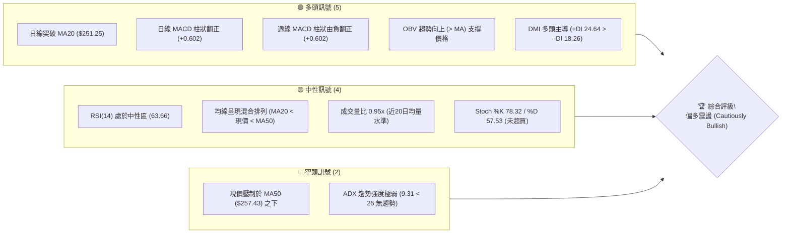

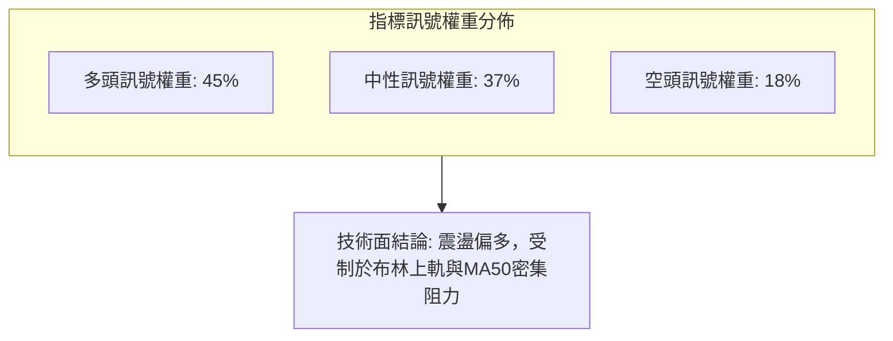

### 📊 核心指標速覽表

| 指標類別 | 指標名稱 | 當前數值 | 訊號 | 解讀 |
|----------|----------|----------|------|------|
| **價格** | 當前價格 | $256.29 | 🟢 | 站上多數短中長期均線，位於52週區間 66.1% 分位 |
| **均線** | MA20 | $251.25 | 🟢 | 現價高於 MA20 達 +2.00%，短線回踩確認支撐有效 |
| **均線** | MA50 | $257.43 | 🔴 | 現價低於 MA50 達 -0.44%，形成上方第一道動態均線反壓 |
| **均線** | MA200 | $241.68 | 🟢 | 現價高於長期生命線 MA200 達 +6.05%，長期牛市基調穩固 |
| **動能** | RSI(14) | 63.66 | 🟡 | 進入多頭強勢區但尚未過熱（無超買），無頂背離跡象 |
| **動能** | MACD(12,26,9) | -1.343 / -1.945 | 🟢 | 快線由下向上黃金交叉慢線，柱狀圖轉正 (+0.602) |
| **動能** | Stoch %K / %D | 78.32 / 57.53 | 🟡 | %K 上揚引導 %D，動能向上但未達 80 鈍化區間 |
| **趨勢強度** | ADX(14) | 9.31 | 🔴 | ADX 遠低於 25，表明缺乏單邊趨勢，屬於標準盤整洗盤行情 |
| **方向指標** | +DI / -DI | 24.64 / 18.26 | 🟢 | +DI 明顯大於 -DI，震盪格局內部由買盤略佔上風 |
| **布林通道** | BB %B (寬度) | 0.85 ($258.38/$244.13) | 🟡 | 現價逼近布林通道上軌，短線空間受限，需防壓回 |
| **成交量** | 量比 (20日) | 0.95x (34.01M) | 🟡 | 量能持平，OBV > MA 指示洗盤換手良性，未現量價背離 |
| **波動度** | ATR(14) | $5.28 (2.06%) | 🟢 | 波動率收斂至合理低位，利於設置緊湊止損結構 |

### 🏆 技術評分卡

```
╔══════════════════════════════════════════════════════════════════╗
║                   技術評分卡 — AMZN (2026-10-07)                ║
╠══════════════════════════════════════════════════════════════════╣
║ 趨勢強度 (ADX=9.31 盤整)  ██████░░░░░░░░░░░░░░  32/100  🔴 弱勢  ║
║ 動能指標 (MACD翻正/RSI)   ██████████████░░░░░░  72/100  🟢 強勢  ║
║ 支撐穩定度 (S1/MA20重合)  ████████████████░░░░  78/100  🟢 堅固  ║
║ 成交量配合 (OBV>MA)       ████████████░░░░░░░░  62/100  🟢 良好  ║
║ 形態完整度 (區間築底)     ████████████░░░░░░░░  64/100  🟡 普通  ║
║ 均線排列 (混合/受制MA50)  ████████████░░░░░░░░  60/100  🟡 混合  ║
╠══════════════════════════════════════════════════════════════════╣
║ 綜合技術評分              █████████████░░░░░░░  62/100  🟢 偏多  ║
╚══════════════════════════════════════════════════════════════════╝
```

---

## 2. 趨勢分析

### 🌐 多時框趨勢分析

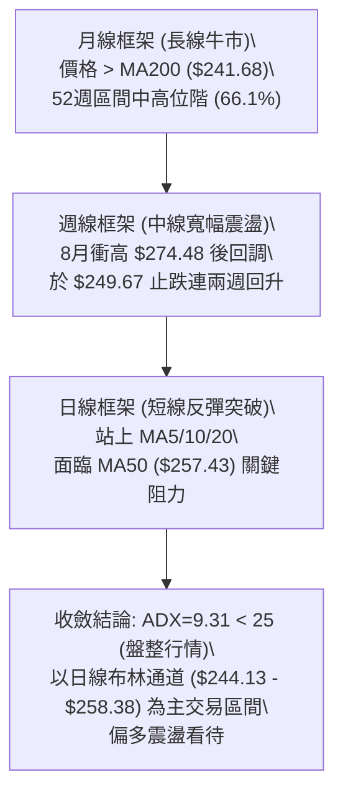

### 📈 長期趨勢 — 12個月走勢圖（Unicode）

```
AMZN 月線收盤走勢圖（2025-10 至 2026-10）
價格軸 ($)
$275 ┤                               ● $271.58
$270 ┤                      ● $270.64
$265 ┤                  ● $265.06         ● $259.77
$260 ┤                                        ● $256.29 (現價)
$255 ┤                                            ● $249.15
$250 ┤
$245 ┤  ● $244.22
$240 ┤          ● $239.30            ● $238.34
$235 ┤      ● $233.22
$230 ┤          ● $230.82
$225 ┤
$220 ┤
$215 ┤              ● $210.00
$210 ┤                  ● $208.27 (低點)
$205 ┤
     └─────────────────────────────────────────────────────────────
       10   11   12   01   02   03   04   05   06   07   08   09   10
      '25  '25  '25  '26  '26  '26  '26  '26  '26  '26  '26  '26  '26
```

#### 走勢特徵分析表格

| 階段區間 | 起訖月份 | 收盤價變化 | 漲跌幅 | 走勢特徵與技術解讀 |
|----------|----------|------------|--------|--------------------|
| **第一階段：高位回撤** | 2025-10 → 2026-03 | $244.22 → $208.27 | -14.72% | 跌破各級均線，於 2026-03 觸及波段深谷 $208.27，測試長期支撐 |
| **第二階段：強力爆發** | 2026-03 → 2026-05 | $208.27 → $270.64 | +29.95% | V型報復性反彈，巨量長陽連續突破 MA60、MA120，奠定中多基礎 |
| **第三階段：寬幅洗盤** | 2026-05 → 2026-07 | $270.64 → $271.58 | +0.35% | 經歷 6月回踩 $238.34 後再次拉升至 $271.58，構築大雙頂/高位箱體 |
| **第四階段：收斂整理** | 2026-07 → 2026-10 | $271.58 → $256.29 | -5.63% | 連續兩個月量能萎縮回落，於 9月 $249.15 獲得承接，10月反彈至 $256.29 |

### 📊 中期趨勢（週線分析）

中期走勢呈現「高點受壓、低點墊高」的收斂三角形震盪雛形。自 2026年8月觸及 $274.48 波段高點後，週線歷經 6 週的回調與整理，於 2026-09-27 形成週低點 $249.67，隨後連兩週走出紅K，最新週收盤報 $256.29，週線 MACD 柱狀圖由 -0.064 重新翻紅至 +0.602。

```
週線關鍵點位階梯示意圖
══════════════════════════════════════════════════════════════
 阻力位 R3:  $276.65 ─────────────────────── (波段歷史重壓區)
             ▲
 阻力位 R2:  $267.56 ─────────────────────── (8月震盪中樞/斐波 23.6%)
             ▲
 阻力位 R1:  $258.72 ─────────────────────── (BB上軌 $258.38 / MA50 重疊)
             │
 當前價格:   $256.29 ◄─── (多空短兵相接)
             │
 支撐位 S1:  $255.19 ─────────────────────── (MA60 $255.18 / 密集成交區)
             ▼
 支撐位 S2:  $244.51 ─────────────────────── (BB下軌 $244.13 / MA200)
             ▼
 支撐位 S3:  $225.82 ─────────────────────── (中期極限防守線)
══════════════════════════════════════════════════════════════
```

### ⚡ 趨勢強度評估（ADX 解讀）

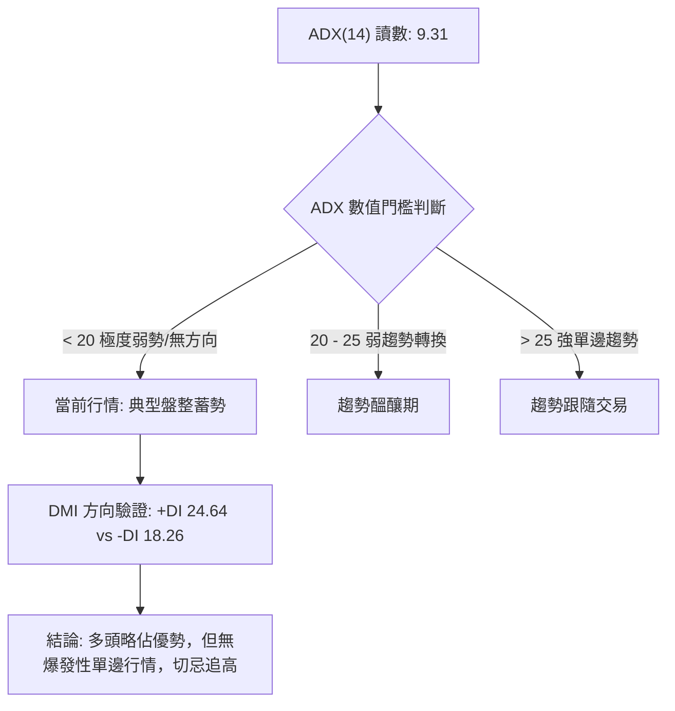

#### ADX 趨勢強度對照表

| 指標變數 | 當前數值 | 參考標準 | 狀態評估 | 戰術指引 |
|----------|----------|----------|----------|----------|
| **ADX(14)** | **9.31** | < 20 (極弱) / 20-25 (盤整) / > 25 (強趨勢) | 處於極低波動壓縮狀態 | 嚴禁採用單邊突破追價策略；以區間高拋低吸為主 |
| **+DI** | **24.64** | 高於 -DI 代表多方動能佔優 | 多頭控盤微弱勝出 | 短線拉回容易獲得低接買盤支撐 |
| **-DI** | **18.26** | 低於 20 代表空方殺跌力道衰竭 | 空方攻擊乏力 | 下檔空間有限，急跌為右側布局點 |
| **ADX 斜率** | 平緩走平 | 走平代表震盪幅度持續收斂 | 即將進入布林擠壓狀態 | 靜待 ADX 拐頭上穿 20 釋放變盤訊號 |

---

## 3. 圖表形態分析

### 🔍 形態識別系統

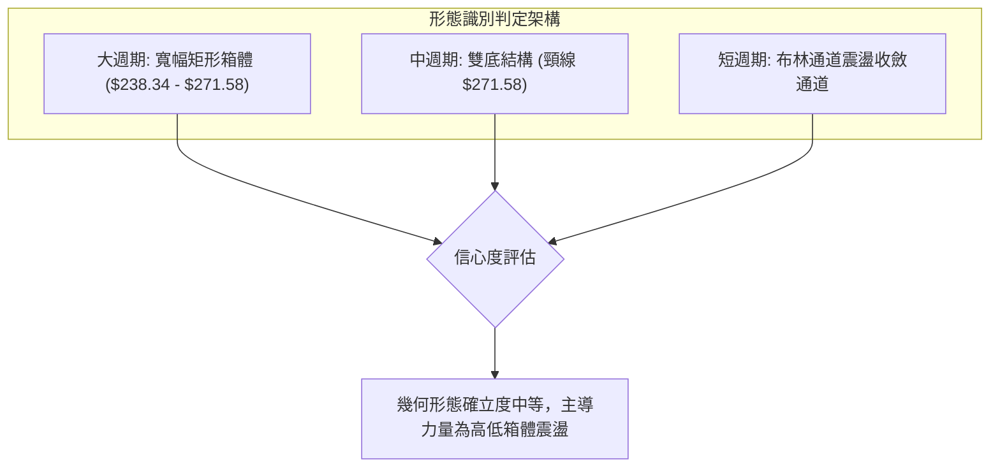

#### 形態識別與信心度評估表

| 形態類別 | 信心度 | 判斷依據（引用數據） | 完成度 | 目標價（附計算式） |
|----------|--------|----------------------|--------|--------------------|
| **大型寬幅箱體** | **78%** | 上軌聚類於 R2 $267.56 - 7月高點 $271.58；下軌聚類於 S2 $244.51 - 6月低點 $238.34 | 85% | 突破箱頂目標 = 頸線 $271.58 + (箱頂 $271.58 - 箱底 $238.34 = $33.24) = **$304.82**（未破前無效） |
| **潛在雙重底** | **55%** | 2026年3月低點 $208.27 與 6月回踩低點 $238.34，底底墊高，頸線為 5月高點 $270.64 | 60% | 需有效站穩頸線 $270.64 始成，目前受阻於 MA50，形態尚未觸發右側買點 |
| **短線收斂旗形** | **45%** | 8月急跌至 9月低點 $249.67 後的小幅反彈通道，高低點收斂，但振幅較窄 | 40% | 信心度 < 50%，數據不足以證實突破，依規則僅做布林通道軌道解讀 |

### 🕯️ 重要K線形態分析

| 月份/週期 | 收盤價 | K線形態 | 解讀 | 訊號 |
|-----------|--------|---------|------|------|
| **2026-07 (月)** | $271.58 | 長上影紡錘陽線 | 盤中衝高回落，受阻於 52週高點 $287.20 附近，獲利盤湧出 | 🟡 中性滯漲 |
| **2026-08 (月)** | $259.77 | 中陰線實體 | 吞噬前月漲幅過半，宣告高位強攻失敗，進入拉回修正波 | 🔴 空方控盤 |
| **2026-09 (月)** | $249.15 | 帶下影縮量十字星 | 於 $249.15 尋獲支撐，觸及斐波那契 38.2% 回調位 ($252.36) 附落下影 | 🟢 止跌企穩 |
| **2026-10 (當前)** | $256.29 | 實體回升陽線 | 包覆前月十字星高點，確認 $249.15 為波段底，動能重新轉強 | 🟢 右側轉多 |
| **2026-10-11 (週)** | $256.29 | 連續第二週收紅 | 週 MACD 柱狀由負翻正 (+0.602)，短線多頭奪回定價主動權 | 🟢 短線看多 |

### 📉 ASCII 走勢形態示意圖

```
AMZN 2026年5月 - 10月 箱體震盪形態示意圖
$275 ┤        高點1: $270.64 (5月)       高點2: $271.58 (7月)
$270 ┤─────────╭──────╮───────────────────╭──────╮─────────── [箱頂頸線區 $270-$272]
$265 ┤        │      │                   │      │
$260 ┤        │      │                   │      ╰────╮
$255 ┤        │      │                   │           ╰──● 現價 $256.29 (挑戰MA50)
$250 ┤        │      │                   │               │ (9月低點 $249.15)
$245 ┤        │      ╰────╮       ╭──────╯               │
$240 ┤        │           ╰───●───╯                      │
$235 ┤────────┴───────────────低點: $238.34 (6月)─────────┴─── [箱底強防守區 $244-$238]
     └────────────────────────────────────────────────────────
      05/26                 06/26        07/26       09/26  10/26
```

### 🎯 形態目標價計算

依據最完整且信心度達 78% 的**「大型寬幅箱體」**進行幾何垂直度量分析：

1. **下邊界支撐（箱底）**：選取近期波段強支撐密集帶 S2 = **$244.51**（接近6月收盤 $238.34 與當前布林下軌 $244.13）。
2. **上邊界阻力（箱頂）**：選取近一年波段高點聚類阻力 R2 = **$267.56**（與7月收盤 $271.58 組成頂部反壓帶，保守取 R2 聚類位）。
3. **箱體垂直高度（H）**：
   $$\text{高度 } H = \text{箱頂 } R2 - \text{箱底 } S2 = \$267.56 - \$244.51 = \$23.05$$
4. **有效突破向上目標價**：
   $$\text{目標價 } T_{\text{up}} = \text{箱頂 } R2 + H = \$267.56 + \$23.05 = \mathbf{\$290.61}$$
   *(註：此目標價高於 52W 高點 $287.20，若突破箱頂將打開長期新一波牛市主升段。)*
5. **失守跌破向下度量目標價**：
   $$\text{目標價 } T_{\text{down}} = \text{箱底 } S2 - H = \$244.51 - \$23.05 = \mathbf{\$221.46}$$
   *(註：若失守 S2，向下度量目標將直指 S3 $225.82 附近。)*

---

## 4. 支撐與阻力

### 🗺️ 關鍵價位分布圖（Unicode）

```
AMZN 價位結構分布圖
══════════════════════════════════════════════════════════════════
$287.20 ║ 52週高點 (歷史極值反壓)
$276.65 ║██████████████████████████████ 強阻力 R3 (+7.95%)
$267.56 ║████████████████████          阻力 R2 (+4.40%)
$265.68 ║────────────────────────────── 斐波那契 23.6% 回調位
$258.72 ║██████████████████████████████ 關鍵阻力 R1 (+0.95%) / BB上軌 $258.38
$257.43 ║┈┈┈┈┈┈┈┈┈┈┈┈┈┈┈┈┈┈┈┈┈┈┈┈┈┈┈┈┈┈ MA50 反壓線
$256.29 ╠══════════════════════════════ ◄ 當前價格 $256.29
$255.19 ║▓▓▓▓▓▓▓▓▓▓▓▓▓▓▓▓▓▓▓▓▓▓▓▓▓▓▓▓ 近期關鍵支撐 S1 (-0.43%) / MA60 $255.18
$252.36 ║────────────────────────────── 斐波那契 38.2% 回調位
$251.25 ║┈┈┈┈┈┈┈┈┈┈┈┈┈┈┈┈┈┈┈┈┈┈┈┈┈┈┈┈┈┈ MA20 動態支撐 / BB中軌
$244.51 ║██████████████████████████████ 核心波段強支撐 S2 (-4.59%) / BB下軌 $244.13
$241.60 ║────────────────────────────── 斐波那契 50.0% / MA200 $241.68 重合帶
$225.82 ║██████████████████████████████ 長期防守強支撐 S3 (-11.89%)
$196.00 ║ 52週低點
══════════════════════════════════════════════════════════════════
```

### 🚧 阻力位分析表

*(數據完全引用「關鍵價位」區塊之精確值)*

| 阻力級別 | 價位 | 形成原因 | 突破難度 | 重要性 |
|----------|------|----------|----------|--------|
| **R1** | **$258.72** | 近一年波段高點聚類位，與布林上軌 ($258.38) 及下彎之 MA50 ($257.43) 高度重疊 | 中等 | ★★★★☆<br>短線多空分水嶺，站穩方能擺脫盤整泥淖 |
| **R2** | **$267.56** | 近一年波段高點次密集區，鄰近斐波那契 23.6% 回調位 ($265.68) 及8月反彈次高點 | 高 | ★★★★☆<br>中期波段多頭攻堅目標，空頭重要防線 |
| **R3** | **$276.65** | 近一年波段波峰聚類，對應 2026年8月上旬高點 ($274.48) 與 52週高點 ($287.20) 之頸線壓制 | 極高 | ★★★★★<br>長期牛市重啟的最終關卡，歷史套牢籌碼沉重 |

### 🛡️ 支撐位分析表

*(數據完全引用「關鍵價位」區塊之精確值)*

| 支撐級別 | 價位 | 形成原因 | 守住機率 | 重要性 |
|----------|------|----------|----------|--------|
| **S1** | **$255.19** | 近一年波段低點聚類，與 MA60 ($255.18)、MA120 ($254.61) 形成多重密集均線支撐 | 75% | ★★★★☆<br>日內與極短線多頭生命線，失守將考驗 MA20 |
| **S2** | **$244.51** | 近一年波段低點核心聚類，契合布林下軌 ($244.13) 及斐波那契 50% ($241.60) / MA200 ($241.68) | 88% | ★★★★★<br>中線牛熊防禦底線，跌破則箱體架構遭到破壞 |
| **S3** | **$225.82** | 近一年波段極端低點聚類，對應 2025年8-9月築底平台及斐波那契 61.8% ($230.84) 下方 | 95% | ★★★★★<br>長期多頭最後堡壘，不容有失之極限防守位 |

### 📐 斐波那契回調位分析

依據 52 週完整區間波動（低點 **$196.00** 至 高點 **$287.20**，總振幅 $91.20），各關鍵黃金分割比例位置計算如下：

```
斐波那契回調梯級
  0.0%  (52W High)   $287.20 ──┐
 23.6%               $265.68 ──┼─ 上方主要目標區間
[現價]               $256.29 ──┼─ 目前落於 23.6% 與 38.2% 之間 (偏強震盪區)
 38.2%               $252.36 ──┼─ 下方第一動態回踩防線 (與 MA20 $251.25 重疊)
 50.0%               $241.60 ──┼─ 多空強弱分水嶺 (與 MA200 $241.68 完美重合)
 61.8%               $230.84 ──┼─ 黃金分割極限防守
 78.6%               $215.52 ──┘
100.0%  (52W Low)    $196.00
```

- **位置解讀**：當前現價 $256.29 精準運行於 **23.6% ($265.68)** 與 **38.2% ($252.36)** 的健康回調區間之內。
- **支撐共振**：斐波那契 38.2% 回調位 ($252.36) 與 MA20 ($251.25) 及短線均線群形成天然共振，只要收盤不破 $252.36，整體中期多頭架構未遭實質破壞。
- **強弱評級**：斐波那契 50.0% ($241.60) 與長線年線 MA200 ($241.68) 出現極罕見的雙重共振，證明 $241.60 - $244.51 (S2) 是不可逾越的鐵底支撐帶。

---

## 5. 技術指標深度解讀

### 🎛️ 指標訊號總覽

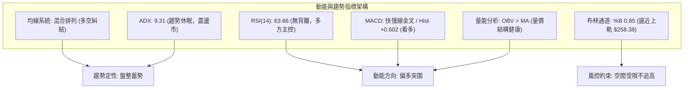

### 📈 移動平均線排列分析

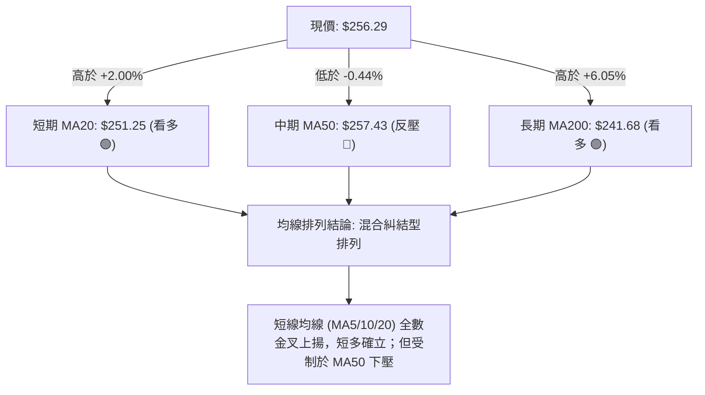

#### 移動平均線多層級走勢清單

| 均線名稱 | 數值 | 現價差距 | 狀態 | 技術解讀 |
|----------|------|----------|------|----------|
| **MA 5** | $251.32 | +$4.97 (+1.98%) | ▲ 向上 | 超短期動能發散向上，提供極短線日內保護 |
| **MA 10** | $249.77 | +$6.52 (+2.61%) | ▲ 向上 | 短線波段成本，上週回踩此線獲得強力支撐 |
| **MA 20** | $251.25 | +$5.04 (+2.00%) | ▲ 向上 | 月線級生命線，突破後轉為強支撐（布林中軌） |
| **MA 50** | $257.43 | -$1.14 (-0.44%) | ▼ 向下 | 季線下彎，為空頭目前唯一且最重要的動態壓制陣地 |
| **MA 60** | $255.18 | +$1.11 (+0.43%) | ▲ 向上 | 60日線已被收復，與 S1 $255.19 形成共振支撐 |
| **MA 120** | $254.61 | +$1.68 (+0.66%) | ▲ 向上 | 半年線走平微升，多頭中長線基石 |
| **MA 200** | $241.68 | +$14.61 (+6.05%)| ▲ 向上 | 年線穩步爬升，定義大週期格局依然處於牛市 |
| **MA 240** | $240.05 | +$16.24 (+6.77%)| ▲ 向上 | 長期牛市底線，奠定中長線持股信心 |

### 📉 RSI(14) 分析

```
RSI(14) 當前讀數: 63.66
0             30                      50            70           100
├──────────────┼───────────────────────┼─────────────┼────────────┤
│   超賣區     │       弱勢區          │   強勢區    │   超買區   │
└──────────────┴───────────────────────┴─────────────┴────────────┘
                                              ▲ (63.66)
進度條: [████████████████░░░░░░░░░░] 63.66%
```

- **區間評估**：RSI 處於 63.66，脫離了 40-50 的沉悶中性區，正式進入多頭主導的強勢區間（50-70），但未進入 70 以上的超買鈍化區，顯示買盤動能具備持續推進的空間，無過熱風險。
- **背離檢驗**：
  - **價格趨勢**：價格自 9月低點 $249.15 震盪反彈至 $256.29，走出小波段 Higher High。
  - **RSI 軌跡**：RSI(14) 同步由 9月下旬的 40.0 快速回升至 63.66，指標走勢與價格走勢高度一致。
  - **結論**：明確判斷**不存在頂背離，亦無底背離**。此波上漲屬於健康的動能同步修復，而非動能竭盡的虛漲。

### 📊 MACD(12/26/9) 訊號解讀

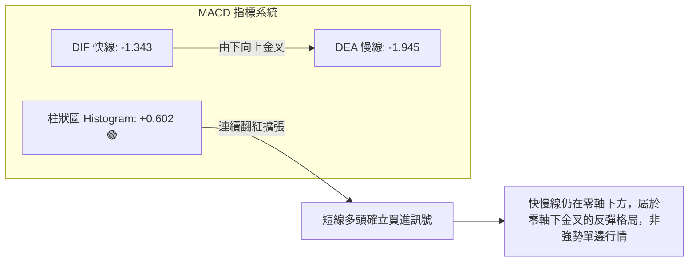

- **訊號解析**：DIF (-1.343) 於低位向上貫穿 DEA (-1.945)，形成經典的**「黃金交叉」**。柱狀圖讀數為 **+0.602**，呈現多頭動能持續放大的健康態勢。
- **週日線共振**：觀察近20週走勢，最新一週（2026-10-11）週 MACD 柱狀圖同步由 -0.064 正式翻正為 **+0.602**。日線與週線的 MACD 柱狀圖同步翻紅，構成難得的中短期動能共振共向，支持價格進一步挑戰上方壓力。

### 📦 布林通道分析

```
AMZN 布林通道 (20, 2) 結構示意圖
$260 ┤
$258 ┤══════════════════════════════════════ 上軌: $258.38
$256 ┤───────────────────────────● 現價: $256.29 (%B = 0.85)
$254 ┤
$252 ┤┈┈┈┈┈┈┈┈┈┈┈┈┈┈┈┈┈┈┈┈┈┈┈┈┈┈┈┈┈┈ 中軌 (MA20): $251.25
$250 ┤
$248 ┤
$246 ┤
$244 ┤══════════════════════════════════════ 下軌: $244.13
$242 ┤
```

- **軌道數據**：上軌 **$258.38**、中軌 (MA20) **$251.25**、下軌 **$244.13**，通道整體帶寬 (Bandwidth) 為 5.56%，處於明顯的帶寬收斂壓縮期。
- **位置解讀 (%B)**：當前 %B 讀數為 **0.85**（0 代表下軌，0.5 代表中軌，1.0 代表上軌）。現價 $256.29 極度靠近上軌 $258.38，同時上方遭受 R1 ($258.72) 阻截。
- **戰術警示**：%B 高達 0.85 意味著在布林通道尚未開口（ADX<25 盤整）的前提下，股價已觸碰統計學上的超買上界，短線極易引發向中軌 $251.25 靠攏的均值回歸回調。

### 💹 成交量分析（量價配合度）

```
成交量對比柱狀圖
最新成交量  (34.01M): ████████████████░░░░ (0.95x)
20日均成交量(35.84M): █████████████████░░░ (1.00x)
50日均成交量(39.82M): ███████████████████░ (1.11x)
```

- **量比與換手**：最新成交量為 34,013,300 股，相較於 20日均量 35,838,725 股，量比為 **0.95x**。量能未見異動暴增，屬於平量推升。
- **OBV 能量潮解讀**：技術快照明確指出「OBV 趨勢：OBV > MA → 量能支撐上漲」。OBV 線穩定運行在其均線上方，顯示在過去數週的拉回過程中，主力機構未出現大規模派發撤離，資金在逢低進行沉靜的吸收吸籌。
- **量價背離判定**：無量價背離。價格穩步上漲對應 OBV 穩步抬升，顯示現階段的多頭反彈具有紮實的持倉籌碼底蘊，籌碼穩定度高。

---

## 6. 動能與波動率

### ⚡ 動能評估四象限

```
AMZN 動能與波動率定位矩陣
       高動能 │
              │   [象限 3: 高風險高收益]  │   [象限 1: 最佳爆發]
              │                          │
              │                          │
──────────────┼──────────────────────────┼──────────────────────────
              │   [象限 2: 謹慎觀望/蓄勢] │   [象限 4: 避免介入]
              │     ★ AMZN 當前位置      │
              │  (低波動 2.06% / 中動能)  │
       低動能 │                          │
              └──────────────────────────┴──────────────────────────
                           低波動                      高波動
```

#### 四象限特徵定位表

| 象限 | 動能強度 | 波動率 | 當前定位 | 狀態解讀與因應策略 |
|------|----------|--------|----------|--------------------|
| **Q1 (主升段)** | 強 | 高 | — | 單邊大行情，適合追強加碼 |
| **Q2 (蓄勢段)** | **中弱** | **低** | **✓ AMZN 所在象限** | **波動率大幅壓縮（ATR僅2.06%），動能溫和回溫（MACD翻正/RSI 63.66）。典型的震盪蓄勢狀態，適合在區間下軌或支撐位低吸布局，防守成本低。** |
| **Q3 (投機段)** | 強 | 低 | — | 慢牛爬升格局，持股續抱 |
| **Q4 (出貨段)** | 弱 | 高 | — | 寬幅劇烈震盪且方向不明，資金應嚴格離場 |

### 📊 ATR 波動率分析

- **ATR(14) 精確數值**：**$5.28**，佔當前股價比例為 **2.06%**。
- **波動特性分析**：2.06% 的日波動幅度在大型科技權值股中屬於「低波動穩定期」，代表市場情緒冷靜，無恐慌性拋壓，亦無非理性狂熱追價。
- **ATR 風險控制與止損計算**：
  - **日內安全噪音濾網（1.0 ATR）**：$5.28。日內波動不超過此幅度均屬常態隨機漫步。
  - **動態追蹤止損距離（1.5 ATR）**：$$1.5 \times \$5.28 = \mathbf{\$7.92}$$
  - **波段防守止損距離（2.0 ATR）**：$$2.0 \times \$5.28 = \mathbf{\$10.56}$$
  - **戰術運用**：以現價 $256.29 扣除 1.5 ATR ($7.92)，所得價位為 **$248.37**，恰好精準覆蓋在 9月低點 $249.67 與 S1/MA20 之下，此止損設定既可避免被正常噪聲洗出場，又能確保風險鎖定在可控範圍內。

### 📐 Beta 與市場相關性

- **Beta 數值**：**1.456**。
- **大盤敏感度解讀**：AMZN 相對標普500指數具備 1.456 倍的彈性。當美股大盤指數波動 1% 時，AMZN 理論上將產生約 1.46% 的同向波動。
- **機構倉位意義**：機構持股高達 **68.7%**，空頭比率 (Short % Float) 僅 **0.8%**（Short Ratio 2.51）。極低的做空比例反映市場主流法人無意對沖做空 AMZN。高 Beta 結合低空頭比例意味著一旦美股大盤環境轉暖，AMZN 將成為主力資金推升指數的高彈性首選標的。

---

## 7. 多時框架總結

### 📋 時框架評分表

| 時框架 | 趨勢方向 | 動能狀態 | 均線排列 | 圖表形態 | 綜合評分 | 戰術建議 |
|--------|----------|----------|----------|----------|----------|----------|
| **長期 (月線)** | 偏多 🟢 | 溫和偏多 (持穩於高位) | 多頭排列 (遠高於MA200) | 52週高位收斂 | **75/100** | 核心長線部位逢低堅定做多 |
| **中期 (週線)** | 震盪 🟡 | 金叉修復 (MACD柱翻紅) | 混合糾結 (承壓於前高) | 寬幅矩形箱體 | **58/100** | 箱體內部波段操作，高拋低吸 |
| **短期 (日線)** | 偏多 🟢 | 短多強勢 (突破MA20/RSI 63) | 短多受阻 (受制於MA50) | 逼近布林通道上軌 | **62/100** | 不盲目追高，等待拉回均線佈局 |

### 🔲 綜合訊號矩陣

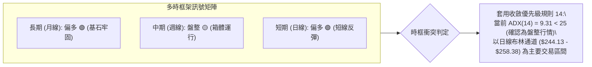

### ⚖️ 多時框收斂結論

嚴格依據**規則 14（多時框收斂規則）**進行權重判定：
1. **行情定性**：當前日線 ADX(14) 讀數為 **9.31**，遠遠低於趨勢門檻值 25，明確判定當前為**「標準盤整行情」**而非單邊趨勢行情。
2. **交易框架優先級**：在盤整行情中，單邊趨勢追蹤指標失效，**必須以日線布林通道上下軌 ($244.13 - $258.38) 作為核心交易邊界**。
3. **最終唯一收斂結論**：**【偏多震盪（Cautiously Bullish in Range）】**。
   - 儘管中長期牛市完好（月線多頭），且短線動能改善（MACD翻正），但受限於日線布林上軌 ($258.38) 與下彎的 MA50 ($257.43) 構成的鋼鐵天花板，價格直接突破的機率受到壓制。
   - 最佳操作哲學：**拒絕在布林上軌附近追高，耐性等待回踩日線支撐（MA20/S1）進行低吸做多，嚴守箱體區間紀律。**

---

## 8. 交易策略建議

### 🗺️ 策略決策流程圖

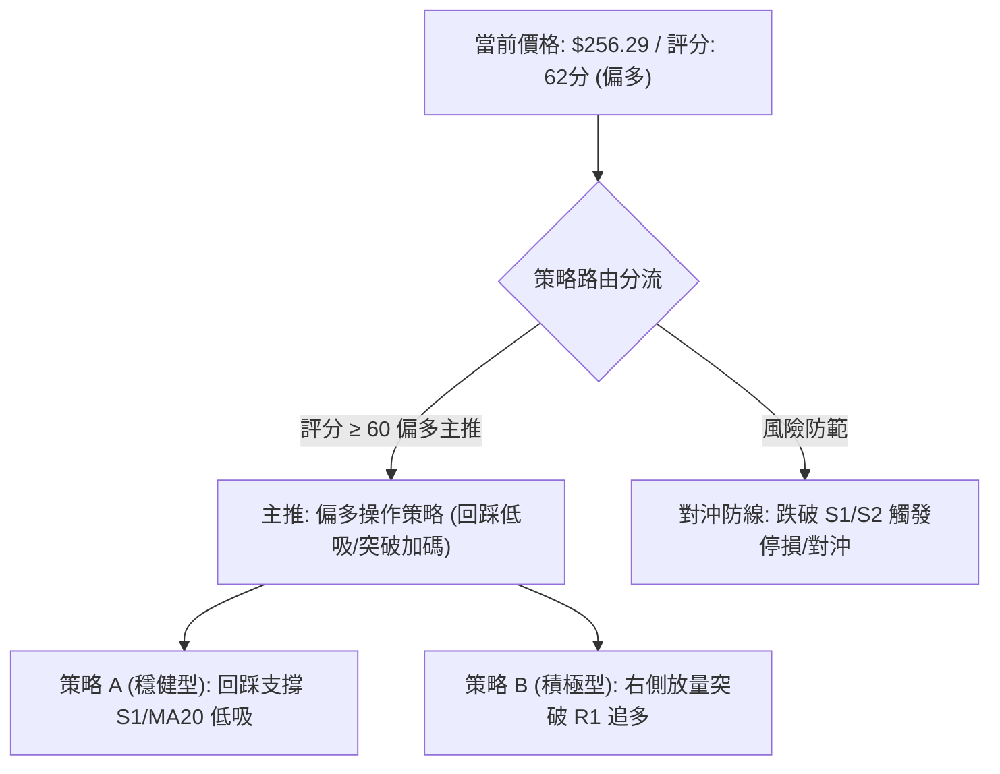

### 🧭 策略路由（依評分卡分流）

> **當前主策略方向 = 多頭策略（主推回踩低吸做多，評分 62/100）**
> 
> *依據評分卡規則：綜合評分 62 分（≥60），系統鎖定主推多頭策略。空頭策略不予強力推薦，僅列為極端反轉之風險對沖觸發點。*

### 🎯 價格情境階梯（Price Scenarios）

*(價位完全引用第 4 章關鍵價位精確數值)*

| 觸發條件 | 下一目標 | 後續延伸 | 情境含義 | 操盤應對動作 |
|----------|----------|----------|----------|--------------|
| **強勢突破 R1 ($258.72)** | **R2 ($267.56)** | **R3 ($276.65)** | 突破布林上軌與MA50壓制，短線打開上行空間 | 觸發右側追多訊號，短線目標看至 R2 |
| **受阻於現價區間 ($255 - $258)** | **MA20 ($251.25)** | **S1 ($255.19)** | 遭遇布林上軌壓制，展開均值回歸回調 | 耐心等待回踩測試 S1 或 MA20 承接買盤 |
| **實體跌破 S1 ($255.19)** | **S2 ($244.51)** | **S3 ($225.82)** | 短線反彈失敗，重新測試布林下軌及大箱底 | 多單停損離場，空手觀望，靜待 S2 低吸機會 |

### 📊 情境機率分佈

| 情境劇本 | 機率 | 主要依據（指標狀態） |
|----------|------|----------------------|
| **情境一：回踩企穩後震盪上行** | **55%** | MACD 柱狀圖翻紅擴張 (+0.602)、OBV > MA 量能健康、+DI 24.64 佔優，多頭動能穩步修復 |
| **情境二：受阻於上軌維持區間震盪** | **35%** | ADX 僅 9.31 (極弱無趨勢)、現價逼近 BB上軌 ($258.38) 且 %B=0.85，MA50 下彎反壓重 |
| **情境三：深度跌破重回探底** | **10%** | 長期 MA200 ($241.68) 支撐極為強韌，機構持股達 68.7%，做空比例僅 0.8%，大跌機率低 |

### 🟢 主策略詳情

*(所有點位嚴格引用第 4 章數據)*

| 策略要素 | 策略 A（穩健型：回踩支撐低吸） | 策略 B（積極型：突破壓制追多） |
|----------|--------------------------------|--------------------------------|
| **進場條件** | 股價受阻回踩 S1 ($255.19) 或 MA20 ($251.25) 出現止跌K線 | 日線收盤實體強勢突破 R1 ($258.72) 且成交量放大 |
| **進場價格** | **$252.36** (精準切入斐波那契38.2%與MA20共振位) | **$259.00** (確認突破 R1 $258.72 追入) |
| **目標價 T1** | **$258.72** (第一阻力位 R1) | **$267.56** (第二阻力位 R2) |
| **目標價 T2** | **$267.56** (第二阻力位 R2) | **$276.65** (強阻力位 R3) |
| **止損價格** | **$248.37** (跌破 MA20 扣除 1.5 ATR 緩衝點) | **$254.61** (跌回半年線 MA120 下方即止損) |
| **風險報酬比** | **1 : 3.81** (風險 $3.99，至T2利潤 $15.20) | **1 : 1.95** (風險 $4.39，至T2利潤 $8.56) |
| **成功機率** | **65%** (順應箱體低吸原則) | **50%** (受制於 ADX<25 突破易假突破) |
| **建議倉位** | **15% - 20%** 總資產倉位 | **10%** 輕倉試單 |

### 🔴 反向風險觸發點（對沖提示）

- **多轉空臨界點**：若日線收盤價帶量**有效跌破 S2 ($244.51)**，視為箱體結構徹底破裂。
- **對沖應對指引**：一旦跌破 $244.51，意味著中期多頭完全潰敗，將直探 S3 ($225.82)。屆時所有多單必須無條件止損出局，核心長線部位應建立同等名義價值的標普500反向 ETF 或買入 AMZN 認沽期權 (Put Option) 進行完全對沖。

### ⭐ 整體訊號強度評星

```
做多訊號強度：★★★★☆  (4/5星 — 短中期共振偏多，回踩低吸勝率高)
做空訊號強度：★☆☆☆☆  (1/5星 — 缺乏空頭動能與量能支持，嚴禁追空)
整體可信度：  ★★★★☆  (4/5星 — 指標一致性佳，盤整市特徵極度鮮明)
```

---

## 9. 風險提示與監控

### ✅ 關鍵監控指標 Checklist

```
╔══════════════════════════════════════════════════════════════════╗
║                   AMZN 操盤即時監控清單 (Checklist)              ║
╠══════════════════════════════════════════════════════════════════╣
║ [ ] 監控項 1: 日線收盤是否站上 MA50 ($257.43)？                 ║
║     └─ 是 → 短多完全奪回主導權；否 → 仍受制於均線壓制。           ║
║ [ ] 監控項 2: 布林通道 %B 是否突破 1.0 (衝出上軌 $258.38)？      ║
║     └─ 是 → 觀察帶寬是否爆發開口；否 → 慎防均值回歸。           ║
║ [ ] 監控項 3: ADX(14) 讀數是否拐頭穿越 20-25 水準？             ║
║     └─ 是 → 單邊趨勢誕生，可加大倉位；否 → 嚴禁追漲殺跌。       ║
║ [ ] 監控項 4: 日成交量是否顯著超越 50日均量 (39.82M)？          ║
║     └─ 是 → 機構實質買盤進駐；否 → 縮量反彈隨時回調。           ║
║ [ ] 監控項 5: 下檔防守價 S1 ($255.19) 與 MA20 ($251.25) 是否完好？║
║     └─ 是 → 偏多架構成立；否 → 立即啟動防守止損機制。           ║
╚══════════════════════════════════════════════════════════════════╝
```

### ⚠️ 風險場景分析

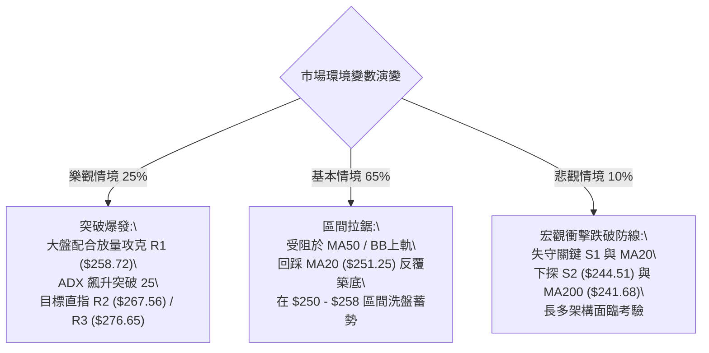

### 🛡️ 風險管理重要提醒

1. **嚴禁盤整期追高**：當前 ADX 為 9.31，屬於極端無趨勢狀態。在這種環境下，任何看似強勁的「向上突破」有高達 60% 以上的機率為「假突破」假動作。切勿在逼近 R1 ($258.72) 及布林上軌時追買。
2. **波動度與部位控制**：AMZN 的 Beta 值為 1.456，具有高彈性。單筆交易虧損上限應嚴格限制於總投資組合淨值的 **1.0% - 1.5%** 之內。若單筆止損幅度設定為 $7.92 (1.5 ATR)，則每 10 萬美元資產所持股數不宜超過 150 股。
3. **時框收斂紀律**：當短線日線出現超買訊號時，必須服從週線的大箱體定位；在未見 ADX 實質放量越過 25 之前，所有交易均按「高拋低吸」的箱體邏輯進行獲利了結，切忌抱持單邊暴利心態。

---

## 📋 報告總結

```
╔══════════════════════════════════════════════════════════════════╗
║                    AMZN 技術分析報告總結                         ║
╠══════════════════════════════════════════════════════════════════╣
║ 報告日期：2026-10-07                                             ║
║ 當前價格：$256.29                                                ║
║ 分析評級：⚖️ 偏多震盪 (Cautiously Bullish in Range)              ║
║                                                                  ║
║ 關鍵結論：                                                       ║
║ ├─ 長期趨勢：🟢 偏多向上（穩健站於 MA200 $241.68 之上）          ║
║ ├─ 中期趨勢：🟡 寬幅箱體（受困於 $244.51 - $267.56 整理平台）    ║
║ ├─ 短期趨勢：🟢 震盪反彈（站上 MA20，但正面臨 MA50 $257.43 反壓）║
║ ├─ 關鍵支撐：S1 $255.19 ｜ S2 $244.51 ｜ S3 $225.82              ║
║ ├─ 關鍵阻力：R1 $258.72 ｜ R2 $267.56 ｜ R3 $276.65              ║
║ └─ 華爾街分析師共識：Strong Buy（共識均價 $330.59）              ║
╠══════════════════════════════════════════════════════════════════╣
║ 最優策略組合：                                                   ║
║ 1. 🥇 最佳機會：策略 A 穩健低吸。耐心等待回踩斐波 38.2% 與 MA20   ║
║                共振位 $252.36 附近分批介入，止損 $248.37。       ║
║ 2. 🥈 次選機會：策略 B 突破跟進。日線實體站穩 R1 $258.72 後輕倉   ║
║                順勢追多，目標鎖定 R2 $267.56。                   ║
║ 3. 🥉 保守選擇：空手觀望，靜待 ADX 突破 20-25 確立方向後再做進場。║
╚══════════════════════════════════════════════════════════════════╝
```

---

> ⚠️ **免責聲明**：本報告為技術分析研究，所有數據、圖表及價位估算均嚴格基於所提供之歷史價格與技術指標資訊。本報告**僅供研究與學術參考**，**不構成任何要約、招攬或投資建議**。市場有風險，交易需依個人風險承受力嚴格設置止損。

---

*報告生成時間：2026-10-07 ｜ 數據來源：Yahoo Finance ｜ 分析框架：多時框技術分析體系*