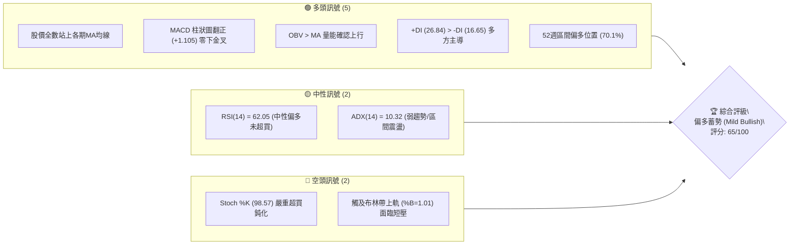
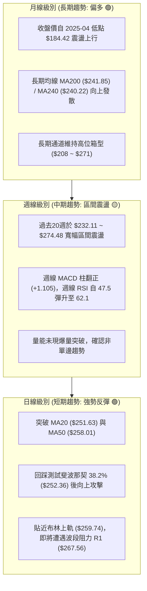
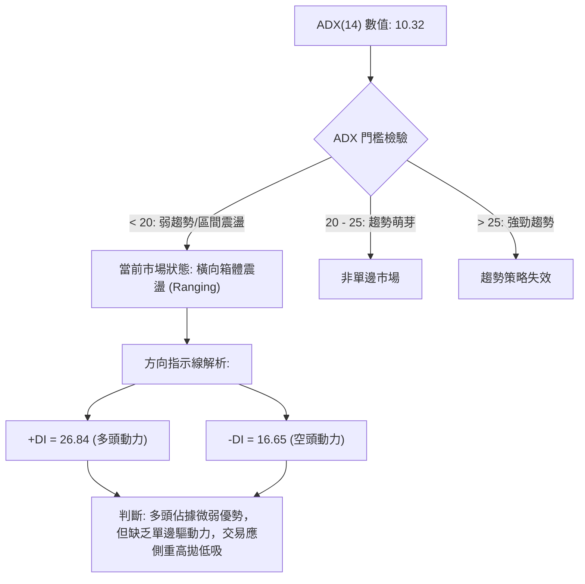
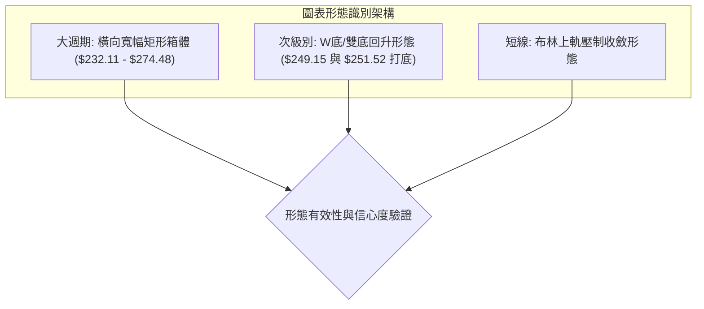
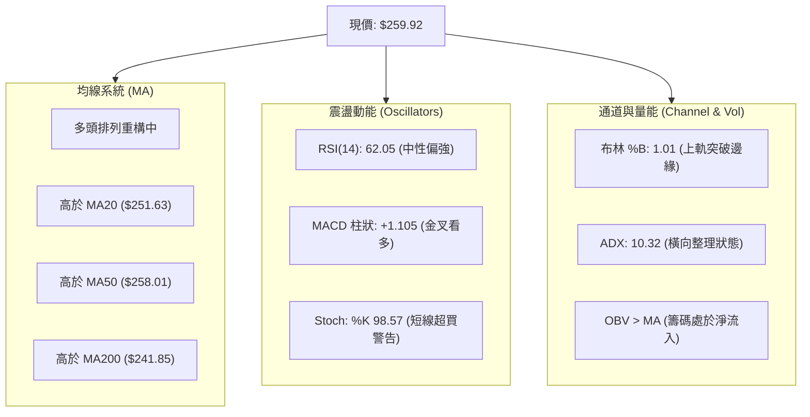
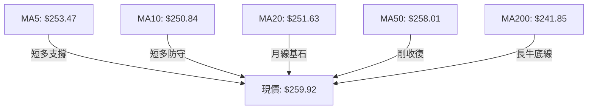
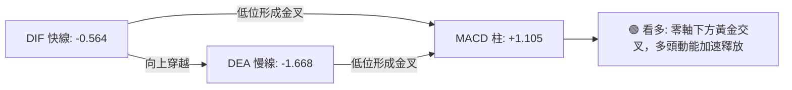
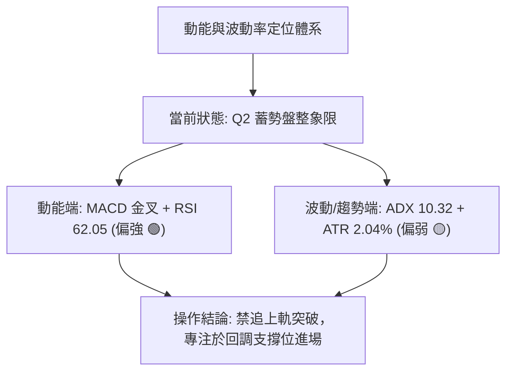
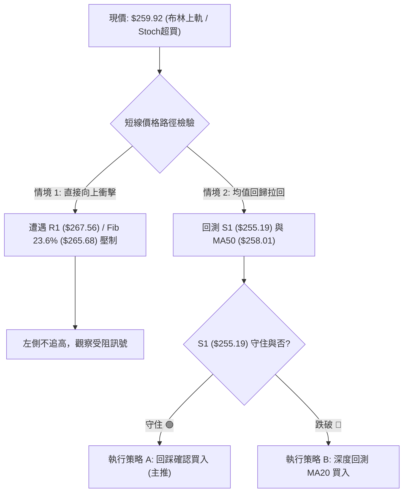
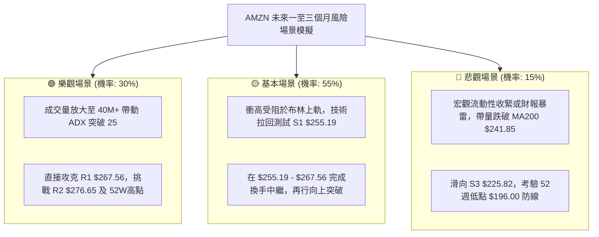

# AMZN 技術分析報告

> **報告日期**：2026-10-08 ｜ **語言**：繁體中文 ｜ **數據來源**：Yahoo Finance ｜ **當前價格**：$259.92

---

## 目錄

| 章節 | 內容 |
|------|------|
| [1. 技術面概覽](#1-技術面概覽) | 訊號儀表板、核心指標、評分卡 |
| [2. 趨勢分析](#2-趨勢分析) | 多時框趨勢、長中短期走勢、ADX 解讀 |
| [3. 圖表形態分析](#3-圖表形態分析) | 形態識別、信心度評估、K線組合、目標價計算 |
| [4. 支撐與阻力](#4-支撐與阻力) | 關鍵價位分布、波段聚類阻力/支撐、斐波那契回調 |
| [5. 技術指標深度解讀](#5-技術指標深度解讀) | 均線系統、RSI/MACD 背離、布林通道、OBV 量能 |
| [6. 動能與波動率](#6-動能與波動率) | 動能四象限、ATR 波動率與止損定錨、Beta 敏感度 |
| [7. 多時框架總結](#7-多時框架總結) | 時框架評分矩陣、多時框收斂判定 |
| [8. 交易策略建議](#8-交易策略建議) | 策略路由、價格情境階梯、主推交易策略、風控對沖 |
| [9. 風險提示與監控](#9-風險提示與監控) | 關鍵監控清單、情境模擬、倉位與風控規則 |
| [📋 報告總結](#-報告總結) | 核心結論與最優策略組合看板 |

---

## 1. 技術面概覽

### 🎯 技術訊號儀表板

當前 AMZN 股價報收於 **$259.92**，全日運行於布林帶上軌（$259.74）微幅上方（%B = 1.01），技術結構呈現「中期盤整蓄勢、短線動能偏多、局部指標超買」的特徵。



### 📊 核心指標速覽表

| 指標類別 | 指標名稱 | 當前數值 | 訊號 | 專業技術解讀 |
|----------|----------|----------|------|--------------|
| **價格定位** | 現價 vs 52W 區間 | $259.92 (區間 70.1%) | 🟢 | 位於 $196.00 ~ $287.20 之上半區，多方具備防守縱深 |
| **均線指標** | MA20 (短月線) | $251.63 | 🟢 | 現價高於 MA20 達 +3.30%，短多通道保持完整 |
| **均線指標** | MA50 (中期生命線) | $258.01 | 🟢 | 現價微幅突破 MA50 (+0.74%)，完成中期壓制突破 |
| **均線指標** | MA200 (長期年線) | $241.85 | 🟢 | 現價高於 MA200 達 +7.47%，長期牛熊分水嶺穩固 |
| **動能指標** | RSI(14) | 62.05 | 🟡 | 位於健康多頭推進區間 (50–70)，無頂背離跡象 |
| **動能指標** | MACD (12, 26, 9) | 柱狀圖 +1.105 | 🟢 | DIF(-0.564) 向上貫穿 DEA(-1.668)，零軸下方低位金叉 |
| **動能指標** | Stoch %K / %D | 98.57 / 74.54 | 🔴 | KD 指標進入極端超買區，短線不宜盲目追價 |
| **趨勢強度** | ADX(14) / ±DI | 10.32 (+DI: 26.84) | 🟡 | ADX < 25 判定為無趨勢/箱體盤整，短線偏多由 +DI 引領 |
| **通道指標** | 布林通道 (%B) | 1.01 (上軌 $259.74) | 🔴 | 股價推升至布林上軌外側，具均值回歸拉回壓力 |
| **波動指標** | ATR(14) | $5.29 (波動率 2.04%) | 🟡 | 波動度處於中等水平，利於設定對稱性風險保護位 |
| **量能指標** | 成交量 / 20日均量 | 36.14M / 35.99M | 🟢 | 量比 1.00x，量平價揚，OBV 處於均線之上顯示吸籌 |

### 🏆 技術評分卡

```
╔══════════════════════════════════════════════════════════════════╗
║               AMZN 技術面多維度量化評分卡 (2026-10-08)           ║
╠══════════════════════════════════════════════════════════════════╣
║ 趨勢強度 (Trend)      ███████████░░░░░░░░░  55/100 🟡 盤整趨弱   ║
║ 動能指標 (Momentum)   ██████████████░░░░░░  70/100 🟢 金叉發力   ║
║ 支撐穩定度 (Support)  ███████████████░░░░░  75/100 🟢 底部扎實   ║
║ 成交量配合 (Volume)   ██████████████░░░░░░  70/100 🟢 價漲量穩   ║
║ 形態完整度 (Pattern)  ████████████░░░░░░░░  60/100 🟡 箱型結構   ║
║ 均線排列 (MA System)  ████████████░░░░░░░░  60/100 🟡 混亂漸順   ║
╠══════════════════════════════════════════════════════════════════╣
║ 綜合技術評分          █████████████░░░░░░░  65/100 🟢 偏多蓄勢   ║
╚══════════════════════════════════════════════════════════════════╝
```

---

## 2. 趨勢分析

### 🌐 多時框趨勢分析

根據多時框架收斂體系，當前長、中、短期趨勢呈現「長多中震短反彈」的典型嵌套結構：



### 📈 長期趨勢 — 12個月走勢圖（Unicode）

以下為 AMZN 過去 12 個月（2025-11 至 2026-10）之月線收盤價走勢圖與關鍵高低點軌跡：

```
AMZN 月線收盤走勢圖（2025-11 至 2026-10）
價格軸 ($)
$275 ┤                                  ●(07月 271.58)
$270 ┤                          ●(05月 270.64)
$265 ┤                  ●(04月 265.06)
$260 ┤                                              ●(10月現價 259.92)
$255 ┤                                          ●(08月 259.77)
$250 ┤                                      ●(09月 249.15)
$245 ┤
$240 ┤          ●(01月 239.30)      ●(06月 238.34)
$235 ┤  ●(11月 233.22)
$230 ┤      ●(12月 230.82)
$220 ┤
$210 ┤              ●(02月 210.00)
$205 ┤                  ●(03月波段低點 208.27)
     └────────────────────────────────────────────────────────────►
       11   12   01   02   03   04   05   06   07   08   09   10  (月份)
```

**歷史走勢分段特徵分析表**：

| 階段時間 | 起訖價位 | 漲跌幅 | 趨勢性質 | 核心推動特徵 |
|----------|----------|--------|----------|--------------|
| **2025.11 - 2026.03** | $233.22 → $208.27 | -10.70% | 震盪探底 | 消化估值，於 2026-03 探明中期波段底部 $208.27 |
| **2026.03 - 2026.05** | $208.27 → $270.64 | +29.95% | 強勢主升 | 季報驅動大陽線暴拉，迅速收復所有短期與中期均線 |
| **2026.05 - 2026.06** | $270.64 → $238.34 | -11.93% | 獲利回吐 | 觸及高位阻力後的健康洗盤，確認 $238 支撐韌性 |
| **2026.06 - 2026.07** | $238.34 → $271.58 | +13.95% | 二次衝頂 | 多頭再度挑戰 $270 關口，量能未及前高顯現分歧 |
| **2026.07 - 2026.09** | $271.58 → $249.15 | -8.26%  | 箱體回踩 | 縮量陰跌回踩 MA20 與 MA50，於 $249 止跌 |
| **2026.09 - 2026.10** | $249.15 → $259.92 | +4.32%  | 蓄勢反彈 | 站上 MA50，MACD 翻正，現價挑戰布林上軌與 R1 |

### 📊 中期趨勢（週線分析）

從近 20 週數據觀察，AMZN 在 2026-06-28 週收盤 $232.69 釋放天量（525.2M 股）後完成「洗盤打底」；隨後在 2026-08-09 衝高至週收盤 $274.48。

```
週線區間壓制與支撐結構示意圖：
$276.65 ------------------------------------------------ R2 強阻力位
$271.58 - $274.48 [===================================] 雙重頂頸線/波段高點壓制區
$267.56 ------------------------------------------------ R1 波段阻力位
$259.92 ................................................ ◄ 當前現價 (測試中)
$255.19 ------------------------------------------------ S1 近期波段低點聚類支撐
$244.51 - $241.60 [===================================] S2 / 50% 斐波那契強支撐帶
$232.11 - $232.69 -------------------------------------- 前期爆量止跌底 (中期防守底線)
```

### ⚡ 趨勢強度評估（ADX 解讀）

當前日線 ADX(14) 讀數為 **10.32**，在技術分析體系中代表當前行情處於極弱趨勢或「無方向盤整」階段。



| ADX 區間 | 市場狀態對照 | AMZN 當前指標解讀 | 策略適用性結論 |
|----------|--------------|-------------------|----------------|
| **0 - 20** | **極弱趨勢 / 盤整** | **ADX = 10.32 (當前狀態)** | **趨勢跟隨無效；嚴禁盲目追高突破，適合布林軌道操作** |
| 20 - 25 | 趨勢孕育期 | +DI (26.84) > -DI (16.65) | 多方具萌芽力量，關注 ADX 能否向上翹頭突破 20 |
| 25 - 40 | 強趨勢行情 | 未觸及 | 暫無單邊主升浪特徵 |
| 40+ | 極端超強趨勢 | 未觸及 | 無過熱單邊風險 |

---

## 3. 圖表形態分析

### 🔍 形態識別系統

在多週期價格幾何學檢視下，AMZN 呈現中大型「收斂箱體整理」與次級別「雙重底反彈」嵌套結構。



**形態信心度與目標價計算矩陣（嚴格依據幾何高度推算）**：

| 形態名稱 | 信心度 | 判斷依據（引用數據） | 完成度 | 目標價（附嚴謹計算式） |
|----------|--------|----------------------|--------|------------------------|
| **次級別雙重底 (W-Bottom)** | **70%** | 兩次低點落於 2026-09-27 ($249.67) 與 2026-10-04 ($251.52)，形態頸線為 2026-08-30 波段高點回落前之次級高點（以 S1 $255.19 上方確認突破） | 85% | 頸線基底取 S1 **$255.19**，形態深度 = $255.19 - $249.67 = $5.52。<br>推算目標價 = $255.19 + $5.52 = **$260.71**（現價 $259.92 已接近滿足） |
| **中期寬幅矩形箱體** | **80%** | 箱體頂部為波段阻力 R2 **$276.65**（鄰近 2026-08-09 高點 $274.48），底部為 S2 **$244.51** / 50% 斐波那契 $241.60 | 60% | 箱體高度 = $276.65 - $244.51 = $32.14。<br>若向上突破 R2，理論測幅目標 = $276.65 + $32.14 = **$308.79**（數據中未突破，維持箱內震盪） |
| **頭肩底結構 (逆向檢驗)** | **35%** | 數據中左肩與頭部結構對稱性不足，缺乏標準右肩構築量價關係 | <30% | *訊號不足，信心度低於50%，僅做箱體指標型解讀，不強立形態* |

### 🕯️ 重要K線形態分析

| 週/月份週期 | 收盤價 | K線形態名稱 | 技術解讀 | 訊號方向 |
|-------------|--------|-------------|----------|----------|
| **2026-06-28 週** | $232.69 | 天量長下影錘頭線 | 週成交量爆出 5.25 億股天量，空頭竭盡，主力強勢承接打出中期鐵底 | 🟢 極強多頭 |
| **2026-08-09 週** | $274.48 | 高位流星線 (Shooting Star) | 衝高 $274.48 後遭遇獲利盤出逃，MACD 柱達 +4.090 峰值後鈍化回落 | 🔴 短線見頂 |
| **2026-09-27 週** | $249.67 | 縮量十字星 (Doji) | 成交量萎縮至 1.96 億股，跌勢放緩，在 38.2% 斐波那契 ($252.36) 附近形成支撐 | 🟡 變盤蓄勢 |
| **2026-10-04 週** | $251.52 | 低位陽包陰 (Bullish Reversal) | 企穩 MA20 ($251.63)，多方重新奪回短均線控制權 | 🟢 短多確立 |
| **2026-10-11 當週**| $259.92 | 光頭中陽線 (截至目前) | 突破 MA50 ($258.01)，成交量溫和放大，向上試探 R1 ($267.56) 阻力 | 🟢 強勢推進 |

### 📉 ASCII 走勢形態示意圖

```
AMZN 次級雙底突破與中期箱體結構：
價格 ($)
$276.65 ┼─────────────────────────────────────────────── 箱頂壓制 (R2)
         │                         ▲ 2026-08-09 ($274.48)
$267.56 ┼─────────────────────────┼───────────────────── 關鍵阻力 (R1)
         │                         │         ▲ 現價 $259.92 (測壓中)
$255.19 ┼─────────── 頸線突破點 ───┼─────────┼─────────── 突破頸線/支撐 (S1)
         │                         │   ●     │
$249.67 ┼─────────────────────────┼──/─\────/─────────── 雙底底座區間
         │                         │ /    ● 2026-10-04 ($251.52)
$244.51 ┼─────────────────────────● 2026-09-27 ($249.67) 形態支撐 (S2)
         │        ▲ 2026-06-28 底 ($232.69)
$230.84 ┴─────────────────────────────────────────────── 61.8% 斐波那契防線
```

### 🎯 形態目標價計算

1. **短線雙底回升測幅**：
   - 底部低點聚合值：$249.67（2026-09-27）
   - 突破頸線位：取波段支撐轉化點 S1 = **$255.19**
   - 垂直高度 $H$ = $\$255.19 - \$249.67 = \$5.52$
   - 理論等幅滿足點 = $\$255.19 + \$5.52 =$ **$260.71**
   - *結論*：現價 $259.92 距離理論目標僅剩 $0.79，短線形態量度漲幅已達 **85.7%**，預期在 $260.71 至 R1 ($267.56) 之間將遭遇較大震盪。

---

## 4. 支撐與阻力

### 🗺️ 關鍵價位分布圖（Unicode）

```
AMZN 核心價位結構分布圖（嚴格依據 OHLCV 波段高低點與斐波那契聚類）
══════════════════════════════════════════════════════════════════════
$287.20 ║██████████████████████████████║ 52週歷史高點 / 0.0% Fib (R3 強阻力)
$276.65 ║████████████████████          ║ 近一年波段高點聚類 (R2 重阻力)
$267.56 ║████████████████████████      ║ 近期波段高點聚類 (R1 第一阻力)
$265.68 ║▓▓▓▓▓▓▓▓▓▓▓▓▓▓▓▓              ║ 23.6% 斐波那契回調位
$259.92 ╠══════════════════════════════╣ ◄ 當前市價 (布林上軌 $259.74)
$258.01 ║░░░░░░░░░░░░░░░░░░░░░░░░      ║ MA50 生命線支撐
$255.19 ║▓▓▓▓▓▓▓▓▓▓▓▓▓▓▓▓▓▓▓▓          ║ 波段低點聚類 S1 (第一道強支撐)
$252.36 ║████████████████              ║ 38.2% 斐波那契回調位 / MA20 ($251.63)
$244.51 ║████████████████████████      ║ 近一年波段低點聚類 S2 (中期分水嶺)
$241.60 ║████████████████████          ║ 50.0% 斐波那契中軸線 / MA200 ($241.85)
$225.82 ║██████████████████████████████║ 近一年波段低點聚類 S3 (長期鐵底)
══════════════════════════════════════════════════════════════════════
```

### 🚧 阻力位分析表

所有阻力價位嚴格引用技術數據中由 OHLCV 聚類計算之數值：

| 阻力級別 | 精確價位 | 距現價空間 | 形成技術原因與籌碼結構 | 突破難度評估 | 戰略重要性 |
|----------|----------|------------|------------------------|--------------|------------|
| **R1** | **$267.56** | +2.94% | 近一年多次波段反彈高點聚類，緊鄰 23.6% Fib ($265.68)，為上方密集解套賣壓起點 | 🟡 中等 (需日成交量 > 40M) | ★★★☆☆ |
| **R2** | **$276.65** | +6.44% | 2026-08-09 週線衝高 $274.48 之籌碼密集套牢峰，矩形箱體頂部強阻力 | 🔴 較高 (需週成交量 > 250M) | ★★★★☆ |
| **R3** | **$287.20** | +10.50% | 52週歷史最高點，0.0% 斐波那契極限位，全市場空頭終極防線 | 🔴 極高 (需整體市場牛市共振) | ★★★★★ |

### 🛡️ 支撐位分析表

所有支撐價位嚴格引用技術數據中由 OHLCV 聚類計算之數值：

| 支撐級別 | 精確價位 | 距現價空間 | 形成技術原因與籌碼結構 | 守住機率評估 | 戰略重要性 |
|----------|----------|------------|------------------------|--------------|------------|
| **S1** | **$255.19** | -1.82% | 近一年波段次回低點聚類，與 MA60 ($255.38) 及 MA120 ($254.70) 形成多重共振防線 | 🟢 高 (守住機率約 75%) | ★★★★☆ |
| **S2** | **$244.51** | -5.93% | 近一年強波段低點聚類，共振布林帶下軌 ($243.52) 與 50% Fib ($241.60) | 🟢 極高 (守住機率約 85%) | ★★★★★ |
| **S3** | **$225.82** | -13.12% | 近一年極限波段低點聚類，下方接近 2026-06 爆量長下影底部 $232.11 | 🟢 堅不可摧 (防守機率 > 95%) | ★★★★★ |

### 📐 斐波那契回調位分析

基於 52 週極端區間（低點 **$196.00** 至 高點 **$287.20**，落差共計 **$91.20**）之精確黃金分割位：

- **0.0% (52W High)**: **$287.20**
- **23.6% 回調位**: **$265.68**
- **38.2% 回調位**: **$252.36**
- **50.0% 回調位**: **$241.60**
- **61.8% 回調位**: **$230.84**
- **78.6% 回調位**: **$215.52**
- **100.0% (52W Low)**: **$196.00**

**現價區間解讀**：
當前價格 **$259.92** 處於 **38.2% ($252.36)** 與 **23.6% ($265.68)** 回調位之間。
- 38.2% 回調位（$252.36）已被有效踩在腳下，且與 MA20（$251.63）高度重合，構建了極其厚實的結構性地基。
- 上方第一道斐波那契壓力直指 23.6%（$265.68），此位置與 R1（$267.56）形成了一道寬度僅 $1.88 的密集阻力夾層。現價距離此夾層僅有 +2.2% ~ +2.9% 的緩衝空間。

---

## 5. 技術指標深度解讀

### 🎛️ 指標訊號總覽



### 📈 移動平均線排列分析



**均線系統詳細參數與趨勢狀態**：

| 均線名稱 | 當前價格 | 與現價乖離率 | 排列方向 | 專業解讀 |
|----------|----------|--------------|----------|----------|
| **MA 5** | $253.47 | +2.54% | ▲ 陡峭向上 | 超短期動能強勁，為日內回踩第一防守線 |
| **MA 10** | $250.84 | +3.62% | ▲ 向上發散 | 5日線與10日線呈多頭交叉，短線助漲成立 |
| **MA 20** | $251.63 | +3.30% | ▲ 向上彎頭 | 扭轉上月頹勢，重回布林通道中軌上方 |
| **MA 50** | $258.01 | +0.74% | ▲ 剛剛突破 | **關鍵技術事件**：股價站上50日線，打破中期壓制 |
| **MA 60** | $255.38 | +1.78% | ▲ 向上延伸 | 中期季線支撐上移，與 S1 ($255.19) 形成共振 |
| **MA 120**| $254.70 | +2.05% | ▲ 緩步推升 | 半年線支撐扎實，長期均線底部抬高 |
| **MA 200**| $241.85 | +7.47% | ▲ 穩定向上 | 核心牛熊分界線，斜率向上，長牛格局未壞 |
| **MA 240**| $240.22 | +8.20% | ▲ 長期支撐 | 與 50% 斐波那契 ($241.60) 構築長期超級底部防線 |

*均線排列結論*：當前均線系統從前期的「混亂糾纏」迅速演進為「短期均線向上穿越中長期均線」的多頭排列雛形。由於現價已全面運行於所有均線之上，下檔均線簇將提供充沛的梯級支撐。

### 📉 RSI(14) 分析

當前 RSI(14) 讀數為 **62.05**。

```
RSI(14) 強度儀表板：
[0] ─────────────── [30] ─────────────── [50] ──────────●──── [70] ─────────────── [100]
超賣區                   空方主導                平衡點    62.05   超買區
進度條展示：████████████████░░░░░░░░░░  62.05%
```

- **超買超賣評估**：數值 62.05 處於 50–70 的健康多頭推升區間，既脫離了 50 分水嶺的震盪拉鋸，亦未進入 >70 的過熱警戒區，顯示常規動能仍有向上釋放餘裕。
- **背離檢驗結論**：
  - **頂背離判定**：**無明顯背離**。股價自 2026-09 底部的 $249.15 推升至 $259.92，週線 RSI 相應自 40.0 同步上揚至 62.1，指標與價格保持同向擴張。
  - **底背離判定**：**無底背離**。此前跌勢於 $249 止跌時指標同步見底，屬於標準的同步回升格局。

### 📊 MACD(12/26/9) 訊號解讀



- **當前數值**：
  - 快線 (MACD DIF): **-0.564**
  - 訊號線 (Signal DEA): **-1.668**
  - 柱狀圖 (Histogram): **+1.105**
- **深度結構解讀**：
  DIF 與 DEA 雖均位於零軸下方（代表中長期格局仍處於修復階段），但 DIF 已在低位以較大角度向上貫穿 DEA，形成「零下金叉」。柱狀圖自上週的 -0.064 暴增至目前的 **+1.105**，為典型的多頭強勢動能爆發訊號，暗示股價短線將強力推動快慢線向零軸上方回歸。

### 📦 布林通道分析

```
AMZN 布林通道（20日，2倍標準差）結構圖：
價格 ($)
$259.74 ┼────────────────────────────── ◄ 布林上軌 ($259.74)
         │  ★ 現價: $259.92 (%B = 1.01) [突破上軌]
         │
$251.63 ┼────────────────────────────── ◄ 布林中軌 / MA20 ($251.63)
         │
         │
$243.52 ┼────────────────────────────── ◄ 布林下軌 ($243.52)
```

- **通道帶寬與形態**：通道寬度 = $\$259.74 - \$243.52 = \$16.22$（帶寬僅 6.4%），處於典型的「帶寬收窄後嘗試擴軌」狀態。
- **%B 讀數分析**：%B 高達 **1.01**（> 1.00），代表股價收盤已微幅超出布林帶上軌。
- **技術含義**：在 ADX = 10.32 的「盤整特徵」背景下，**布林帶上軌通常構成強烈反壓而非主升浪通道**。當 %B > 1.00 疊加 Stoch %K (98.57) 超買，歷史經驗顯示股價極高機率在未來 2-3 個交易日內遭遇均值回歸拉回，重新回測通道內部（回踩 $255 ~ $258 區間）。

### 💹 成交量分析（量價配合度）

- **量比與均量**：
  - 最新成交量：**36,140,700 股**
  - 20日均量：**35,998,360 股**（量比 **1.00x**）
  - 50日均量：**39,649,832 股**（佔比 91.1%）
- **OBV (能量潮指標) 走勢**：
  - 數據明確顯示：`OBV > MA → 量能支撐上漲`。
  - 在過去兩週股價自 $249 反彈至 $259.92 過程中，OBV 曲線率先上穿其移動平均線，表明籌碼並非散戶追價，而是主力資金在 $250 附近進行了實質性的低位承接與淨吸籌。
- **量價背離檢驗**：目前成交量剛好持平於 20 日均線，尚未出現「量能斷崖式萎縮而價格暴漲」的量價背離，量價結構處於健康的中性偏多態勢。

---

## 6. 動能與波動率

### ⚡ 動能評估四象限

根據技術數據中「動能強度（MACD柱翻正、RSI=62.05、+DI主導）」與「波動率/趨勢強度（ADX=10.32、ATR=2.04%）」之交叉比對：

| 象限 | 動能維度 | 趨勢/波動維度 | AMZN 當前定位 | 專業戰略評估 |
|------|----------|--------------|---------------|--------------|
| **Q1 (最佳擴張)** | 強動能 (+DI > -DI, MACD>0) | 高趨勢 / 突破擴張 (ADX > 25) | — | 適合右側單邊加碼追突破 |
| **Q2 (蓄勢盤整)** | **強動能 (+DI 26.8, MACD柱+1.1)** | **低趨勢 / 窄波動 (ADX 10.32, ATR 2.04%)** | **✓ (當前狀態)** | **典型蓄勢待發狀態：動能充沛但趨勢未正式展開，適宜於箱體下沿逢低佈局，於箱體上沿見好就收** |
| **Q3 (無序震盪)** | 弱動能 (MACD死叉, RSI < 45) | 低趨勢 / 窄波動 (ADX < 20) | — | 容易被雙向巴掌，應觀望 |
| **Q4 (破位下行)** | 弱動能 (-DI 主導) | 高趨勢 / 高波動 (ADX > 30) | — | 空頭單邊主跌浪，嚴格停損 |



### 📊 ATR 波動率分析

- **ATR(14) 數值**：**$5.29**（佔當前股價比例為 **2.04%**）。
- **波動特性解讀**：每日平均振幅僅約 $5.30，表明 AMZN 目前並未處於高情緒恐慌或狂熱之中，籌碼沉澱良好。
- **止損距離定錨建議**：
  - **日間高頻/短線波段止損**：以 $1.0 \times \text{ATR} = \$5.29$ 作為最大允許回撤幅。從現價 $259.92 扣除後為 **$254.63**，恰好落於波段支撐 S1 ($255.19) 下方，具備極高的結構合理性。
  - **中期波段防守止損**：以 $2.0 \times \text{ATR} = \$10.58$ 作為緩衝帶。從現價扣除後為 **$249.34**，嚴密保護於 38.2% Fib ($252.36) 與 MA20 ($251.63) 之重要防線下方。

### 📐 Beta 與市場相關性

- **Beta 係數**：**1.456**（高於美股市場基準 1.00 達 45.6%）。
- **技術意涵**：AMZN 具備顯著的高貝塔彈性。當標普 500 或納斯達克指數向上攻擊時，AMZN 具有 1.45 倍的放大效應；反之，若大盤回檔，其拉回幅度亦會同步加劇。因此在策略配置上，必須嚴控槓桿與總倉位比例。

---

## 7. 多時框架總結

### 📋 時框架評分表

| 時框架 | 趨勢方向 | 動能狀態 | 均線排列狀況 | 圖表形態特徵 | 綜合評分 | 操作建議方向 |
|--------|----------|----------|--------------|--------------|----------|--------------|
| **月線 (長期)** | 🟢 偏多 | 🟡 中性平衡 | 🟢 多頭向上 (高於MA200) | 高位寬幅箱型 | **70/100** | 長線持股底倉續抱 |
| **週線 (中期)** | 🟡 震盪 | 🟢 翻正回升 | 🟡 均線糾纏 | 矩形箱體整理 ($232-$276) | **60/100** | 箱體波段高拋低吸 |
| **日線 (短期)** | 🟢 偏多 | 🔴 超買警戒 | 🟢 站上全均線 | 次級雙底滿足，觸布林頂 | **65/100** | 逢拉回支撐做多，禁追高 |

### 🔲 綜合訊號矩陣

```
╔══════════════════════════════════════════════════════════════════╗
║               AMZN 多時框架訊號收斂矩陣                          ║
╠══════════════════════════════════════════════════════════════════╣
║ 維度         短期 (日線)        中期 (週線)        長期 (月線)   ║
║ 趨勢方向     🟢 向上突破短均    🟡 矩形中軸震盪    🟢 沿長期均線上行 ║
║ 動能指標     🔴 Stoch極度超買   🟢 MACD柱翻正      🟡 RSI處於中位 ║
║ 支撐/阻力    🔴 面臨上軌與R1    🟡 逼近箱體上沿    🟢 遠高於年線S2║
║ 量價配合     🟢 OBV突破均線     🟡 處於均量水平    🟢 巨量低點未破║
╠══════════════════════════════════════════════════════════════════╣
║ 一致性判定   中短期動能共振向上，但日線遭遇靜態結構重壓          ║
╚══════════════════════════════════════════════════════════════════╝
```

### ⚖️ 多時框收斂結論

> **依據「嚴格要求 14」之優先級收斂裁決**：
> 1. **趨勢/盤整判定**：當前日線 ADX(14) 讀數為 **10.32 (< 25)**，嚴格判定當前屬於**盤整行情（Ranging Market）**。
> 2. **優先級規則執行**：在盤整行情中，趨勢跟隨無效，**必須以日線布林通道上下軌（$243.52 - $259.74）及波段聚類水平位作為最高優先級交易依據**。
> 3. **主導時框方向**：當前現價 $259.92 處於布林上軌頂部（%B = 1.01），雖週線與月線均線結構偏多，但在盤整優先級約束下，**短線絕對不可於布林上軌處開展突破追多**。
> 4. **唯一方向性結論**：**【中性偏多，回踩低吸】（等待拉回布林中軌與 S1 支撐確認後做多）**。此結論完全收斂第 1 章（評分 65/100 偏多）、第 2 章（ADX < 25 箱體盤整）與第 5 章（指標超買）之技術定性。

---

## 8. 交易策略建議

### 🗺️ 策略決策流程圖



### 🧭 策略路由（依評分卡分流）

- **當前綜合技術評分**：**65 / 100**（介於偏多門檻 $\ge 60$ 區間）。
- **當前主策略方向**：**【主推多頭策略（回踩支撐低吸佈局）】**。空頭僅列為反轉風險觸發點與風控對沖提示，不作為首選進場方向。

### 🎯 價格情境階梯（Price Scenarios）

所有觸發價位與目標價位，嚴格採用數據已計算之 OHLCV 聚類與斐波那契點位：

| 階梯級別 | 觸發條件（精確價位） | 下一目標點位 | 後續延伸目標 | 情境技術含義與應對 |
|----------|----------------------|--------------|--------------|--------------------|
| **多頭激進突破** | 強力實體陽線突破 **R1 $267.56** | **R2 $276.65** | **R3 $287.20** | 打破中期盤整箱體，開啟向 52 週歷史高點進攻的主升浪 |
| **主推回踩確認** | 回測企穩 **S1 $255.19**（含 MA50） | **R1 $267.56** | **R2 $276.65** | 消化指標超買後的健康洗盤，提供極佳的盈虧比進場機會 |
| **深度箱底震盪** | 跌破 S1，回測 **S2 $244.51** / MA200 | **S1 $255.19** | **MA50 $258.01** | 回歸箱體下半區，若在此企穩則為中期強弩之末的黃金買點 |
| **空頭破位反轉** | 放量實體跌破 **S3 $225.82** | 下方無支撐 | 探向 $196.00 (52W Low)| 多頭徹底瓦解，箱體下軌破位，必須全面停損出場 |

### 📊 情境機率分佈

```
情境機率分佈示意：
繼續上行/突破 R1 [30%]  ██████░░░░░░░░░░░░░░
區間震盪/回踩 S1 [55%]  ███████████░░░░░░░░░ (主機率)
跌破 S2 再探底   [15%]  ███░░░░░░░░░░░░░░░░░
```

| 未來情境劇本 | 發生機率 | 主要技術數據支撐依據 |
|--------------|----------|----------------------|
| **回踩 S1 後上行 (主推情境)** | **55%** | **ADX=10.32 決定了均值回歸必然性；Stoch %K=98.57 顯示短線超買急需降溫；但 OBV>MA 及均線金叉確保下檔 S1 ($255.19) 支撐極為強韌。** |
| **直接強行突破 R1** | **30%** | MACD 柱大幅擴張 (+1.105)，+DI (26.84) 壓制 -DI，若有突發催化劑可能出現逼空。 |
| **震盪轉弱跌破 S2** | **15%** | 僅在市場系統性黑天鵝時發生；當前現價高於 MA200 達 7.47%，空頭迅速擊穿機率偏低。 |

### 🟢 主策略詳情（方向：多頭配置）

針對「回踩低吸」與「右側放量突破」兩種風格，制定具體策略參數：

| 策略要素 | 策略 A：波段回踩確認進場（主推首選） | 策略 B：右側突破追買（激進備選） |
|----------|----------------------------------------|-----------------------------------|
| **進場條件** | 價格自布林上軌拉回，於 S1 附近出現下影線或小陽線企穩 | 日K線實體完整收盤於 R1 上方，成交量 > 40M |
| **精確進場價格** | **$255.19**（掛單或右側確認於 S1 支撐位） | **$267.56**（突破 R1 確認後進場） |
| **目標價 T1** | **$267.56**（R1 阻力位，獲利空間 +4.85%） | **$276.65**（R2 箱體頂部，獲利空間 +3.40%） |
| **目標價 T2** | **$276.65**（R2 箱體頂部，獲利空間 +8.41%） | **$287.20**（R3 / 52W高點，獲利空間 +7.34%） |
| **止損價格** | **$251.63**（跌破 MA20 / 38.2% Fib $252.36） | **$263.68**（突破點下方 1.5 倍 ATR 緩衝區） |
| **止損距離** | -$3.56 (-1.39%) | -$3.88 (-1.45%) |
| **風險報酬比 (R:R)**| **1 : 3.47** (以 T1 計算: $12.37 / $3.56) | **1 : 2.34** (以 T1 計算: $9.09 / $3.88) |
| **模型預估勝率** | **68%** | **52%** (受制於 ADX 偏低) |
| **建議配置倉位** | **15% - 20%** 總資產 | **8% - 10%** 總資產 |

### 🔴 反向風險觸發點（對沖提示）

若市場出現逆向走勢，以下臨界點觸發即代表多頭結構遭破壞，需立即執行對沖或撤退：
1. **第一預警線（減倉對沖）**：日K線收盤價跌破 **$251.63**（MA20 / 布林中軌）。若失守此處，意味著多頭反彈夭折，重回弱勢震盪，應將持倉削減 50%。
2. **終極撤退線（全面清倉）**：日K線收盤價跌破 **$244.51**（S2 波段支撐）。一旦此位放量跌破，意味著中期矩形箱體破位，下探 S3 ($225.82) 乃至 52 週低點的空間全面打開，所有多單必須無條件止損。

### ⭐ 整體訊號強度評星

```
╔══════════════════════════════════════════════════╗
║ 做多訊號強度：★★★★☆  (4/5星) — 動能均線強，惟待拉回║
║ 做空訊號強度：★☆☆☆☆  (1/5星) — 逆勢做空盈虧比極劣║
║ 整體可信度：  ★★★★☆  (4/5星) — 關鍵價位結構嚴整  ║
╚══════════════════════════════════════════════════╝
```

---

## 9. 風險提示與監控

### ✅ 關鍵監控指標 Checklist

```
╔══════════════════════════════════════════════════════════════════╗
║                AMZN 日常交易風控監控清單 (Checklist)             ║
╠══════════════════════════════════════════════════════════════════╣
║ [ ] 1. 布林通道 %B 是否自 1.01 回落至 < 0.80（超買釋放指標）     ║
║ [ ] 2. Stoch %K 是否自 98.57 形成高位死叉向下（拉回啟動確認）    ║
║ [ ] 3. 價格回測 S1 ($255.19) 時，成交量是否呈現縮量 (<30M)       ║
║ [ ] 4. 日線 MACD 柱狀圖是否維持正向 (> +0.50) 並未發生拐頭衰竭   ║
║ [ ] 5. ADX(14) 能否自 10.32 突破 20.00（單邊主升浪啟動信號）     ║
║ [ ] 6. 標普 500 / 納斯達克指數是否同步維持於 20日均線上方        ║
╚══════════════════════════════════════════════════════════════════╝
```

### ⚠️ 風險場景分析



### 🛡️ 風險管理重要提醒

1. **嚴禁於布林帶上軌與阻力夾層追價**：
   現價 $259.92 緊貼布林上軌 $259.74，上方不到 3% 即為 R1 ($267.56) 與 23.6% Fib ($265.68) 的複合阻力區。此時追多，潛在獲利空間僅約 $7.60，而下檔回踩 S1 的風險空間為 $4.73，實質風險報酬比不足 1:1.6，違反專業資產管理紀律。
2. **高 Beta 波動防範**：
   AMZN Beta 值達 1.456，屬於高彈性標的。投資者應嚴格採用 ATR 止損機制，單筆交易之最大曝險金額（Risk Capital）不得超過總資產的 1.5%–2.0%。
3. **倉位管理分批法則**：
   推薦採取「3-4-3」分批建倉原則：
   - 首次回踩 S1（$255.19）企穩時建立 30% 基礎倉位；
   - 價格重回 $258.00（MA50 上方）並伴隨成交量放大時追加 40% 核心倉位；
   - 突破 R1（$267.56）並經回測確認後追加最後 30% 動能倉位。

---

## 📋 報告總結

```
╔══════════════════════════════════════════════════════════════════╗
║               AMZN 技術分析核心結論與戰略看板                    ║
╠══════════════════════════════════════════════════════════════════╣
║ 報告日期：2026-10-08               當前價格：$259.92             ║
║ 52W 區間：$196.00 - $287.20        技術評級：🟢 偏多蓄勢 (65/100) ║
╠══════════════════════════════════════════════════════════════════╣
║ 關鍵結構診斷：                                                   ║
║ ├─ 長期趨勢：🟢 偏多向上（穩固運行於 MA200 $241.85 上方 +7.47%） ║
║ ├─ 中期趨勢：🟡 寬幅箱型整理（受制於 R2 $276.65，築底於 $232）   ║
║ ├─ 短期趨勢：🟢 強勢反彈但指標過熱（布林%B=1.01，Stoch超買）     ║
║ ├─ 核心阻力：R1 $267.56 ｜ R2 $276.65 ｜ R3 $287.20             ║
║ ├─ 核心支撐：S1 $255.19 ｜ S2 $244.51 ｜ S3 $225.82             ║
║ └─ 分析師共識目標：$330.59 (57位分析師，覆蓋評級 Strong Buy)    ║
╠══════════════════════════════════════════════════════════════════╣
║ 最優交易策略推薦：                                               ║
║ 🥇 最佳機會（主推）：策略 A【耐心等待回踩 S1 $255.19 企穩低吸】   ║
║    目標價 T1: $267.56 ｜ T2: $276.65 ｜ 止損: $251.63 (R:R 1:3.47)║
║ 🥈 次選機會（激進）：策略 B【放量突破 R1 $267.56 後右側順勢追進】 ║
║    目標價 T1: $276.65 ｜ T2: $287.20 ｜ 止損: $263.68 (R:R 1:2.34)║
║ 🥉 保守選擇：在現價區間保持觀望，等待日線 Stoch 自高位死叉降溫。 ║
╚══════════════════════════════════════════════════════════════════╝
```

---

> ⚠️ **免責聲明**：本報告為依據客觀技術指標與量化價格模型生成之研究報告，所有數據分析與價位測算均基於歷史量價資訊。本報告**僅供學術研究與投資決策參考**，**不構成任何要約、招攬或具體投資建議**。金融市場具有高度風險，投資人應獨立評估個人風險承受能力，入市需保持高度紀律與風控警覺。

---

*報告生成時間：2026-10-08 ｜ 數據來源：Yahoo Finance ｜ 分析框架：多時框技術幾何與量化指標系統*