# AMZN 技術分析報告

> **報告日期**：2026-10-09 ｜ **語言**：繁體中文 ｜ **數據來源**：Yahoo Finance ｜ **當前價格**：$254.06

---

## 目錄

| 章節 | 內容 |
|------|------|
| [1. 技術面概覽](#1-技術面概覽) | 訊號儀表板、核心指標、評分卡 |
| [2. 趨勢分析](#2-趨勢分析) | 多時框趨勢、長中短期走勢 |
| [3. 圖表形態分析](#3-圖表形態分析) | 形態識別、K線組合、目標價 |
| [4. 支撐與阻力](#4-支撐與阻力) | 關鍵價位、斐波那契回調 |
| [5. 技術指標深度解讀](#5-技術指標深度解讀) | MA/RSI/MACD/布林/成交量 |
| [6. 動能與波動率](#6-動能與波動率) | 動能評估、ATR、Beta |
| [7. 多時框架總結](#7-多時框架總結) | 時框架評分矩陣 |
| [8. 交易策略建議](#8-交易策略建議) | 多空策略、風險報酬比 |
| [9. 風險提示與監控](#9-風險提示與監控) | 監控指標、風險場景 |

---

## 1. 技術面概覽

### 🎯 技術訊號儀表板

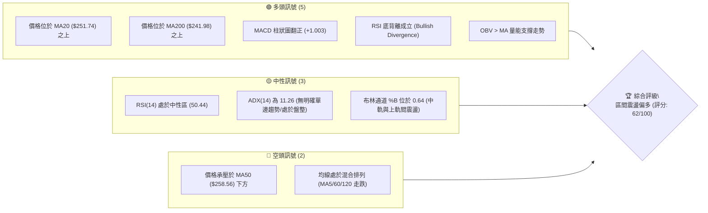

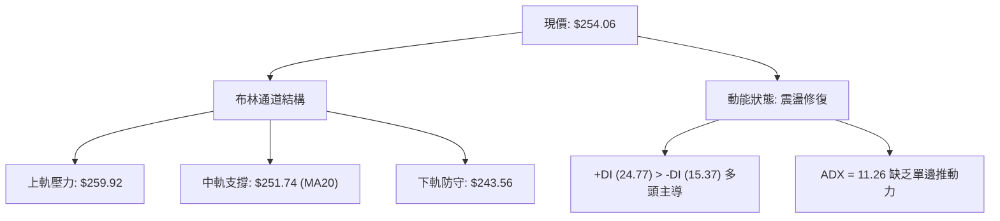

### 📊 核心指標速覽表

| 指標類別 | 指標名稱 | 當前數值 | 訊號 | 解讀 |
|----------|----------|----------|------|------|
| **價格** | 當前價格 | $254.06 | 🟢 | 位於52週區間 63.7%，守在關鍵斐波那契 38.2% ($252.36) 之上 |
| **均線** | MA20 | $251.74 | 🟢 | 現價高於 MA20 約 +0.92%，短期動能轉強站上月線 |
| **均線** | MA50 | $258.56 | 🔴 | 現價低於 MA50 約 -1.74%，中期均線構成直接反彈反壓 |
| **均線** | MA200 | $241.98 | 🟢 | 現價高於 MA200 約 +4.99%，長期多頭生命線支撐穩固 |
| **動能** | RSI(14) | 50.44 | 🟢 | 站回 50 中軸且日線出現底背離，下行動能衰竭 |
| **動能** | MACD(12,26,9) | 柱狀圖 +1.003 | 🟢 | MACD (-0.414) 高於 Signal (-1.418)，形成黃金交叉發散 |
| **波動** | ATR(14) | $5.43 | 🟡 | 佔現價 2.14%，每日波動區間適中，進入壓縮蓄勢階段 |
| **趨勢** | ADX(14) | 11.26 | 🟡 | ADX < 25 表明處於盤整震盪市場，趨勢性策略需謹慎 |
| **成交量** | 20日量比 | 1.05x | 🟢 | 38.54M / 36.66M，OBV 高於均線，量價配合健康 |

### 🏆 技術評分卡

```
╔══════════════════════════════════════════════════════════════════╗
║                技術評分卡 — AMZN (2026-10-09)                   ║
╠══════════════════════════════════════════════════════════════════╣
║ 趨勢強度 (ADX=11.26, 盤整)   ████████░░░░░░░░░░░░  40/100 🟡 中性║
║ 動能指標 (RSI背離+MACD金叉)  ██████████████░░░░░░  70/100 🟢 偏多║
║ 支撐穩定度 (MA200+S1守穩)    ████████████████░░░░  80/100 🟢 強勁║
║ 成交量配合 (OBV>MA, 量比1.05)████████████░░░░░░░░  60/100 🟢 溫和║
║ 形態完整度 (區間底背離構築)  ████████████░░░░░░░░  60/100 🟢 築底║
║ 均線排列 (短強長多, 中期受壓)████████████░░░░░░░░  60/100 🟡 混合║
╠══════════════════════════════════════════════════════════════════╣
║ 綜合評分                     ████████████░░░░░░░░  62/100 偏多操作║
╚══════════════════════════════════════════════════════════════════╝
```

---

## 2. 趨勢分析

### 🌐 多時框趨勢分析

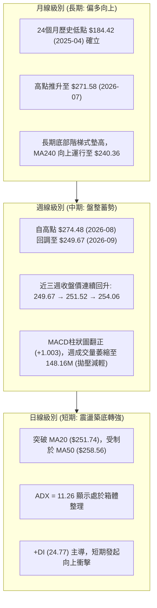

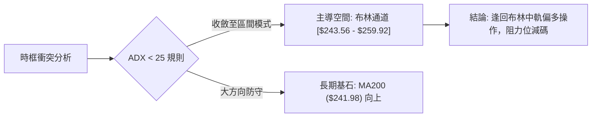

### 📈 長期趨勢 — 12個月走勢圖（Unicode）

```
AMZN 月線走勢圖（過去12個月：2025-11 至 2026-10）
價格軸 ($)
$275 ┤                               ● $271.58 (07月)
$270 ┤                       ● $270.64 (05月)
$265 ┤               ● $265.06 (04月)    ● $259.77 (08月)
$260 ┤                                           
$255 ┤                                               ● $254.06 (現價)
$250 ┤                                           ● $249.15 (09月)
$245 ┤                               
$240 ┤           ● $239.30 (01月)    ● $238.34 (06月)
$235 ┤   ● $233.22 (11月)
$230 ┤       ● $230.82 (12月)
$220 ┤
$210 ┤               ● $210.00 (02月)
$205 ┤                   ● $208.27 (03月)
     └────────────────────────────────────────────────────────────►
        11   12   01   02   03   04   05   06   07   08   09   10  (月份)
```

#### 走勢特徵分析表格

| 階段區間 | 時間 | 走勢特徵 | 價格變化 | 成交量與動能特徵 |
|----------|------|----------|----------|------------------|
| 第一階段：底部構築 | 2025-11 ~ 2026-03 | 箱體下探與二番打底 | $233.22 → $208.27 (-10.7%) | 縮量築底，於 $208-$210 形成極強中期底部支撐 |
| 第二階段：強勁主升 | 2026-03 ~ 2026-05 | 垂直拉升突破暴漲 | $208.27 → $270.64 (+29.9%) | 突破多重均線，月線大陽線放量進攻 |
| 第三階段：高位寬幅震盪 | 2026-05 ~ 2026-07 | 假跌破後V型反轉 | $270.64 → $238.34 → $271.58 | 06月急跌洗盤，07月反抽創下 $271.58 波段收盤高點 |
| 第四階段：次級回調休整 | 2026-08 ~ 2026-09 | 陰跌回撤測試支撐 | $271.58 → $249.15 (-8.2%) | 成交量萎縮，MACD 綠柱收窄，拋壓逐步出清 |
| 第五階段：當前走勢 | 2026-10 (即時) | 止跌回穩與均線爭奪 | $249.15 → $254.06 (+1.9%) | 站上 MA20，形成底背離，進入三角或箱體收斂末端 |

### 📊 中期趨勢（週線分析）

```
AMZN 近20週核心價格波動走廊與阻力支撐示意
$280 ┤
$275 ┤           ▲ 08/09 週高點收盤 $274.48 (強阻力區)
$270 ┤   ▲ 05/31 $270.64     ▲ 08/02 $271.58
$265 ┤                               ▲ 08/30 $266.43
$260 ┤-------------------------- R1: $258.72 / MA50: $258.56 ------- [關鍵反壓]
$255 ┤                           ★ 當前現價: $254.06 (10/11週)
$250 ┤-------------------------- 38.2% 斐波那契: $252.36 / MA20: $251.74
$245 ┤           ▲ 07/19 $247.23
$240 ┤   ▼ 06/14 $238.55
$235 ┤-------▼ 06/28 $232.69 / 07/26 $232.11 ---------------------- S1: $244.51 / MA200: $241.98
$230 ┤
```

### ⚡ 趨勢強度評估（ADX 解讀）

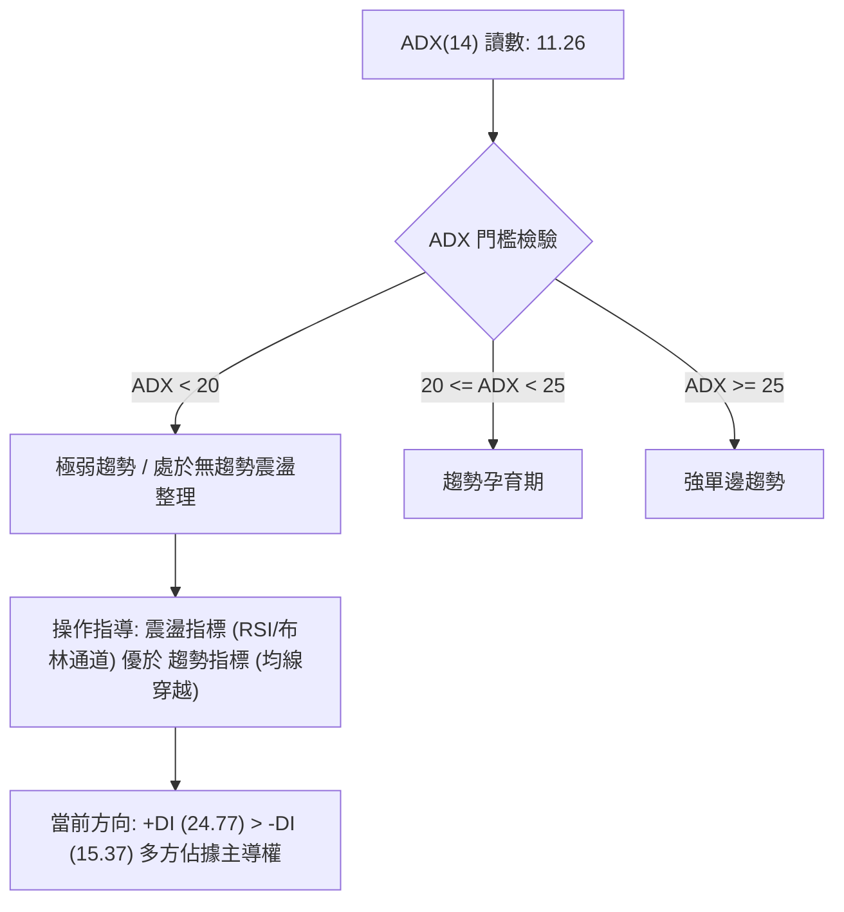

#### ADX 指標強度對照解讀表

| 指標變數 | 數值 | 狀態評估 | 實戰意涵 |
|----------|------|----------|----------|
| **ADX (14)** | **11.26** | 極弱趨勢 (無單邊市) | 市場當前處於典型的籌碼沉澱與均線糾纏階段，不宜追高追空，應以區間交易邏輯應對。 |
| **+DI (多頭)** | **24.77** | 多頭佔優 | 買方力量逐步修復，自 9 月底低點回升後展現護盤力道。 |
| **-DI (空頭)** | **15.37** | 空頭退潮 | 賣方動能大幅低於多頭，顯示近期回調並非機構系統性拋盤。 |
| **趨勢綜合判斷** | **震盪蓄勢** | 多頭防守反擊中 | 由於 ADX < 25，多時框收斂以「日線布林通道 ($243.56 - $259.92)」作為主要交易框架。 |

---

## 3. 圖表形態分析

### 🔍 形態識別系統

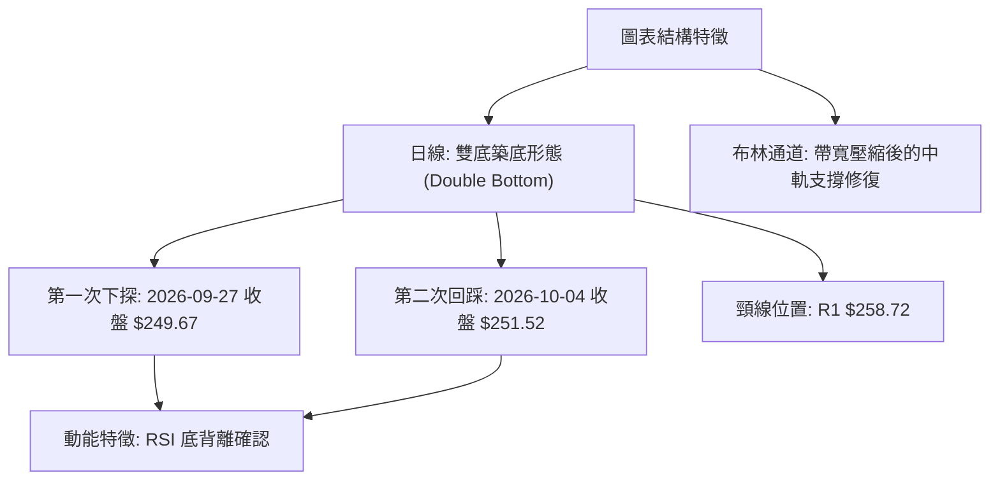

#### 形態識別與信心度評估表

| 形態名稱 | 信心度 (%) | 判斷依據（引用數據） | 完成度 (%) | 目標價（附嚴格計算式） |
|----------|------------|----------------------|------------|------------------------|
| **日線雙底 (W底)** | **65%** | 兩次低點分別為 2026-09-27 的 $249.67 與 2026-10-04 的 $251.52，於斐波那契 38.2% ($252.36) 及 S1 ($244.51) 上方完成二度探底並翻揚。伴隨 RSI 底背離。 | **70%** (尚未突破頸線) | 頸線 R1 ($258.72) + 形態高度 ($258.72 - $249.67 = $9.05) = **$267.77** (與關鍵阻力 R2 $267.56 高度吻合) |
| **布林通道下軌反彈** | **75%** | 價格回測布林下軌 $243.56 附近後企穩，目前 %B 回升至 0.64，站上中軌 MA20 ($251.74)。 | **85%** | 形態目標為布林上軌 **$259.92** |
| **複雜頭肩底/幾何收斂** | **<40%** | *數據中未偵測到* 完整頭肩底輪廓。波段高低點跨度過大，缺乏對稱性。 | -- | 訊號不足，僅做指標型與區間解讀，不強行預測幾何目標價。 |

### 🕯️ 重要K線形態分析

| 週期/月份 | 收盤價 | K線形態特徵 | 量價與指標解讀 | 訊號判斷 |
|-----------|--------|-------------|----------------|----------|
| **2026-08** | $259.77 | 高位長上影陰線 | 自 52W 高點 $287.20 衝高受阻，月線帶量回調，確認高位獲利了結壓力 | 🔴 空頭壓制 |
| **2026-09** | $249.15 | 探底長下影十字星線 | 測試 $248-$250 支撐帶，成交量萎縮，賣盤衰竭，空方動能減弱 | 🟡 止跌信號 |
| **2026-10 (即時)** | $254.06 | 小陽線實體向上反包 | 站回 MA20 ($251.74)，RSI 出現標準底背離，多方重新集結籌碼 | 🟢 多頭轉強 |
| **近2週走勢** | 251.52 → 254.06 | 連續二紅走高 | MACD 柱狀圖由 -0.064 翻正至 +1.003，量比 1.05x，具備短期推進動能 | 🟢 短多確立 |

### 📉 ASCII 走勢形態示意圖

```
AMZN 日線雙底與頸線攻防示意圖
阻力 R2 $267.56 ┤                                              [目標 T2]
                │                                            ▲
布林上軌 $259.92 ┤                      [頸線壓力帶]         /
阻力 R1 $258.72 ┼───────────────────────────●────────────────/─ [目標 T1]
MA50    $258.56 │                          / \              /
現價    $254.06 ┼                         /   \            ● 現在位置 ($254.06)
38.2%   $252.36 │                        /     \          /
MA20    $251.74 ┼                       /       \   ● $251.52 (右底 10/04)
                │                      /         \_/ (RSI 底背離)
支撐 S1 $244.51 ┤        ● $249.67    /
布林下軌 $243.56 │         (左底 09/27)
MA200   $241.98 ┴───────────────────────────────────────────────
```

### 🎯 形態目標價計算

根據日線所辨識出具備 65% 信心度的「雙底 (W底) 形態」進行精準量化測算：

$$形態頸線 = R1 = \$258.72$$
$$形態底部低點 = 2026-09-27 收盤價 = \$249.67$$
$$形態垂直高度 (H) = \$258.72 - \$249.67 = \$9.05$$

* **第一突破目標價 (T1)**：布林通道上軌兼具形態頸線位置 = **$258.72** 至 **$259.92**。
* **第二等距映射目標價 (T2)**：由雙底頸線向上作 1:1 等距映射推算：
  $$\text{目標價} = \$258.72 + \$9.05 = \$267.77$$
  此推算數值與數據中之「關鍵阻力位 R2: $267.56」誤差僅 $0.21 (+0.07%)，展現極高的量化技術重合度。

---

## 4. 支撐與阻力

### 🗺️ 關鍵價位分布圖（Unicode）

```
AMZN 價位結構分布圖（引自 OHLCV 關鍵價位與斐波那契回調計算）
══════════════════════════════════════════════════════════════════
$287.20 ║████████████████████████████████║ 52W 最高點 (0.0% Fib)
$276.65 ║████████████████████████████    ║ 強阻力 R3 (+8.89%)
$267.56 ║████████████████████            ║ 關鍵阻力 R2 (+5.31%) / 形態映射位
$265.68 ║██████████████████              ║ 23.6% 斐波那契回調位
$259.92 ║██████████████                  ║ 布林通道上軌
$258.72 ║████████████                    ║ 核心阻力 R1 (+1.84%) / MA50: $258.56
$254.06 ╠════════════════════════════════╣ ◄ 當前市價 ($254.06)
$252.36 ║▓▓▓▓▓▓▓▓▓▓                      ║ 38.2% 斐波那契回調位 (現價支撐)
$251.74 ║▓▓▓▓▓▓▓▓▓▓                      ║ MA20 (布林中軌支撐)
$244.51 ║▓▓▓▓▓▓▓▓▓▓▓▓▓▓▓▓                ║ 近期關鍵支撐 S1 (-3.76%)
$243.56 ║▓▓▓▓▓▓▓▓▓▓▓▓▓▓▓▓                ║ 布林通道下軌
$241.98 ║▓▓▓▓▓▓▓▓▓▓▓▓▓▓▓▓▓▓              ║ 長期生命線 MA200 / 50.0% Fib: $241.60
$230.84 ║▓▓▓▓▓▓▓▓▓▓▓▓▓▓▓▓▓▓▓▓▓▓          ║ 61.8% 斐波那契黃金分割位
$225.82 ║████████████████████████        ║ 強支撐 S2 (-11.11%)
$220.99 ║████████████████████████████    ║ 極限支撐 S3 (-13.02%)
$196.00 ║████████████████████████████████║ 52W 最低點 (100.0% Fib)
══════════════════════════════════════════════════════════════════
```

### 🚧 阻力位分析表

| 阻力級別 | 官方數據價位 | 距現價幅動 | 形成原因與技術重合 | 突破難度 | 戰略重要性 |
|----------|--------------|------------|--------------------|----------|------------|
| **R1 (第一阻力)** | **$258.72** | +1.84% | 近一年波段高點密集區；極度貼近 MA50 ($258.56) 與布林上軌 ($259.92)。 | 🟡 中等 | **極高**。此處為日線級別多空分水嶺，帶量突破即確立 W 底翻轉。 |
| **R2 (第二阻力)** | **$267.56** | +5.31% | 2026年4月-5月震盪平台中樞高點；鄰近 23.6% 斐波那契回調位 ($265.68)。 | 🔴 較高 | **高**。為雙底形態向上 1:1 映射目標區，將引發中期獲利解套賣壓。 |
| **R3 (第三阻力)** | **$276.65** | +8.89% | 2026-08-09 週線衝高回落高點聚類 ($274.48-$276.65)；邁向 52W 高點前最後重壓區。 | 🔴 極高 | **中**。需配合全市場宏觀資金或超預期財報推動方能攻克。 |

### 🛡️ 支撐位分析表

| 支撐級別 | 官方數據價位 | 距現價幅動 | 形成原因與技術重合 | 守住機率 | 戰略重要性 |
|----------|--------------|------------|--------------------|----------|------------|
| **S1 (第一支撐)** | **$244.51** | -3.76% | 近一年波段低點聚類；與布林通道下軌 ($243.56)、MA200 ($241.98) 形成密集共振支撐帶。 | **80%** | **極高**。多頭波段防禦底線，跌破則宣告長期多頭架構轉弱。 |
| **S2 (第二支撐)** | **$225.82** | -11.11% | 2025年夏季整理平台底部；低於 61.8% 斐波那契回調位 ($230.84)。 | **90%** | **高**。中期結構性深幅回調的強力買盤承接區。 |
| **S3 (第三支撐)** | **$220.99** | -13.02% | 2024-12 至 2025-09 長期箱體下沿支撐密集區。 | **95%** | **極強**。極端行情下的估值與技術終極底線。 |

### 📐 斐波那契回調位分析

依據 52 週波動區間：低點 **$196.00** 至 高點 **$287.20**（絕對波幅 $91.20）計算：

```
52W 區間回調深度檢視
0.0%  ($287.20) ────────────────────────────── 52W High
23.6% ($265.68) ────────────────────────────── R2 阻力共振區 ($267.56)
38.2% ($252.36) ───────★ 現價 $254.06 ──────── 中期健康回檔支撐 (已守穩)
50.0% ($241.60) ────────────────────────────── MA200 生命線 ($241.98)
61.8% ($230.84) ────────────────────────────── 黃金分割防守位
78.6% ($215.52) ────────────────────────────── 深度回撤區
100%  ($196.00) ────────────────────────────── 52W Low
```

* **現價位階判定**：當前價格 **$254.06** 恰好落在 **38.2% 回調位 ($252.36)** 與 **23.6% 回調位 ($265.68)** 之間。
* **技術意涵**：在強勢上漲趨勢中，回調未有效跌破 38.2% ($252.36) 且迅速站回，屬於非常標準的「強勢技術性修正」。此處與短期 MA20 ($251.74) 形成重疊支撐，印證多方於 $252 附近具備實質買盤托底。

---

## 5. 技術指標深度解讀

### 🎛️ 指標訊號總覽

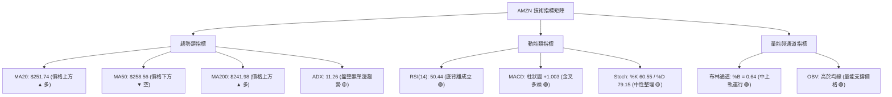

### 📈 移動平均線排列分析

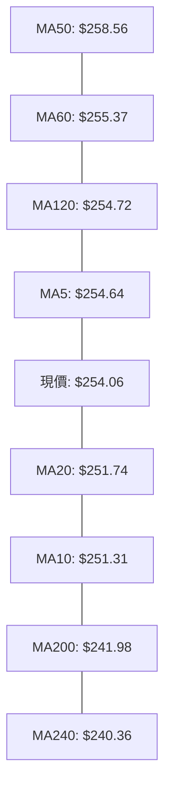

#### 均線系統數據細部解讀

* **短期均線反彈**：現價 ($254.06) 成功越過 MA10 ($251.31) 與 MA20 ($251.74)，MA10 近期斜率轉正 (+1.10%)，短期趨勢由空翻多。
* **中期均線反壓密集**：MA50 ($258.56)、MA60 ($255.37)、MA120 ($254.72) 呈現微幅向下傾斜，並於 $255.00 - $258.70 形成密集帶狀反壓，解釋了為何上攻過程中動能有所收斂。
* **長期均線多頭奠基**：MA200 ($241.98) 與 MA240 ($240.36) 保持穩定的向上發散斜率 (+5.70%)，牛市基石極其扎實。

### 📉 RSI(14) 分析

```
RSI(14) 動能尺規
0 ────── 超賣 30 ───────────── 現值 50.44 ──────────── 超買 70 ────── 100
[░░░░░░░░░░░░░░░░░░░░░░░░░░░░░░███████████████████░░░░░░░░░░░░░░░░░░░░]
```

* **指標數值**：當前 RSI(14) 為 **50.44**，由 2026-08-23 的超賣低點 24.5 及 2026-09-20 的 36.2 穩步爬升，跨過 50 強弱分水嶺。
* **背離研判**：⚠️ **底背離 (Bullish Divergence) 明確成立**。
  * **價格軌跡**：2026-08-23 收盤 $258.63 跌至 2026-09-27 低點 $249.67（價格持續破底創波段低點）。
  * **RSI 軌跡**：RSI(14) 自 24.5 攀升至 40.0，隨後於 2026-10-04 來到 47.5、今日達 50.44（指標底部顯著墊高）。
  * **研判結論**：標準動能底背離，代表空方殺跌力道徹底枯竭，後市具備堅實反彈支撐。

### 📊 MACD(12/26/9) 訊號解讀

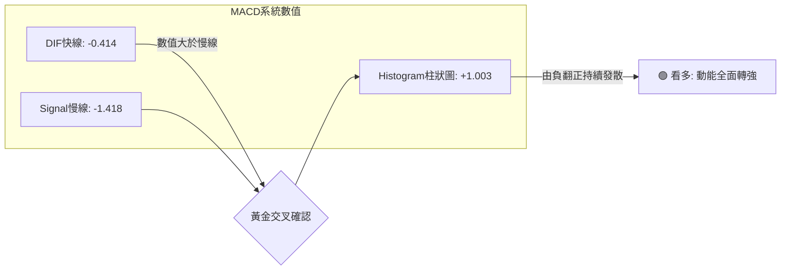

* **交叉狀態**：MACD 線 (-0.414) 已由下往上貫穿 Signal 線 (-1.418)，雖然兩者仍在零軸下方（代表仍在中期修正格局內），但柱狀圖 **+1.003** 呈現顯著多頭擴張。
* **歷史週線對比**：回顧 9 月份 MACD 柱狀圖（-1.179 → -1.110 → -0.859 → -0.415 → -0.064 → +1.003），呈現極度標準的連續收斂轉正，確認中期波段買盤已掌握節奏。

### 📦 布林通道分析

```
AMZN 日線布林通道 (20, 2) 結構圖
$262 ┤
$260 ┤-------------------------- BB 上軌: $259.92 (阻力共振 R1: $258.72)
$258 ┤
$256 ┤
$254 ┤              ★ 現價: $254.06 (%B = 0.64)
$252 ┤-------------------------- BB 中軌 (MA20): $251.74
$250 ┤
$248 ┤
$246 ┤
$244 ┤-------------------------- BB 下軌: $243.56 (支撐共振 S1: $244.51)
$242 ┤
```

* **通道寬度與位階**：帶寬 ($259.92 - $243.56 = $16.36)，當前 **%B = 0.64**，價格脫離下軌超賣區，運行於中軌與上軌的多頭攻擊通道內。
* **壓縮狀態**：布林通道處於收斂後期，波動率顯著收縮，預示短期即將出現沿著軌道的方向性突破。

### 💹 成交量分析（量價配合度）

* **量比與均量對比**：最新單日成交量 **38,544,500 股**，相較 20 日均量 (36,655,600 股) 的量比為 **1.05x**，顯示價格上行過程中伴隨適度溫和放量。
* **週成交量特徵**：2026-06 底部爆出 525.2M 巨量換手後，近期週成交量縮減至 148.16M（2026-10-11 週），反映市場浮額大幅沉澱。
* **OBV (能量潮)**：官方指標明確顯示「**OBV > MA → 量能支撐上漲**」，能量潮領先突破均線，資金呈現持續淨流入積累狀態，未見量價背離隱憂。

---

## 6. 動能與波動率

### ⚡ 動能評估四象限

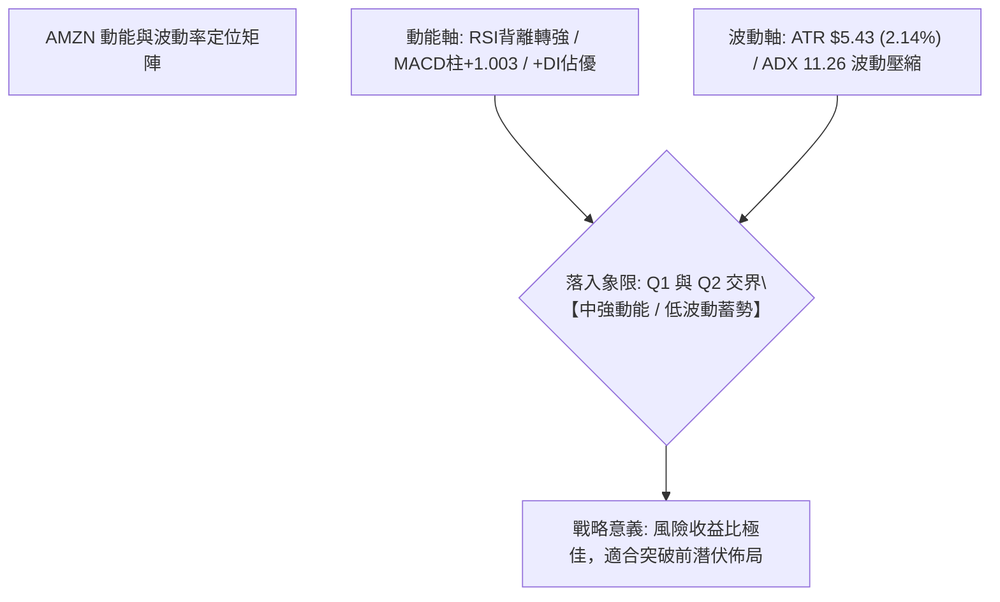

| 象限 | 動能維度 | 波動維度 | AMZN 狀態檢驗 | 實戰戰略解讀 |
|------|----------|----------|---------------|--------------|
| **Q1 (最佳擴張)** | 強動能 (+DI > -DI, MACD紅柱) | 低波動 (ATR 處低檔 2.14%) | **✓ 符合 (偏向)** | **極佳進場機會**：波動率收縮疊加動能修復，通常預示大級別單邊行情的發動起點。 |
| **Q2 (謹慎觀望)** | 弱動能 (ADX < 25) | 低波動 (區間震盪) | **✓ 符合 (部分)** | **箱體操作**：不可過度期待連續暴漲，應嚴格執行高拋低吸。 |
| **Q3 (高風險利潤)** | 強動能 | 高波動 (急漲急跌) | ✗ 不符合 | 暫無市場非理性追價現象。 |
| **Q4 (流動性陷阱)** | 弱動能 | 高波動 | ✗ 不符合 | 波動有序，不存在恐慌拋售。 |

### 📊 ATR 波動率分析

* **當前 ATR(14)**：**$5.43**（佔現價 $254.06 約 **2.14%**）。
* **波動特徵**：數值偏低，反映每日正常波動區間約在 $\pm\$5.43$ 內，市場進入低波動收斂洗盤階段。
* **量化止損與動態距離設置**：
  * **激進日內交易止損距離**：$1.0 \times \text{ATR} = \$5.43$。
  * **波段操作標準止損距離**：$1.5 \times \text{ATR} = 1.5 \times \$5.43 = \mathbf{\$8.15}$。
  * **從進場點 $254.06 扣除波段止損**：$\$254.06 - \$8.15 = \mathbf{\$245.91}$（恰好完美受到 S1 支撐位 $244.51 保護）。

### 📐 Beta 與市場相關性

* **Beta 係數**：**1.456**。
* **市場敏感度分析**：AMZN 的 Beta 達到 1.456，屬於典型的高彈性成長型龍頭股。當標普 500 指數或那斯達克 100 指數波動 1% 時，AMZN 平均呈現約 1.45% 的同向波動。
* **操作意涵**：在整體大盤環境維持穩定時，AMZN 在突破 R1 ($258.72) 後具備顯著強於大盤的向上貝塔收益能力，但需注意在回測時的下行回撤管理。

---

## 7. 多時框架總結

### 📋 時框架評分表

| 時框架 | 趨勢方向 | 動能狀態 | 均線排列狀況 | 形態結構特徵 | 綜合評分 | 戰術建議 |
|--------|----------|----------|--------------|--------------|----------|----------|
| **長期 (月線)** | 🟢 向上偏多 | 🟡 中性修復 | 🟢 MA240 ($240.36) 向上 | 高位回調後守穩上升趨勢線 | **75/100** | 核心多頭部位持股續抱 |
| **中期 (週線)** | 🟡 橫向箱體 | 🟢 柱狀轉正 (+1.003) | 🟡 糾纏於 $250 軸線 | 20週區間高位震盪，賣壓出清 | **60/100** | 回踩斐波那契 38.2% 逢低加碼 |
| **短期 (日線)** | 🟢 震盪反彈 | 🟢 RSI 底背離 | 🟡 站上 MA20，面臨 MA50 | 雙底 (W底) 構築中，挑戰頸線 | **65/100** | 突破 R1 前逢低做多，設防 S1 |

### 🔲 綜合訊號矩陣

```
時框訊號一致性交叉檢驗
────────────────────────────────────────────────────────────────
維度           短期 (日線)      中期 (週線)      長期 (月線)      一致性判定
────────────────────────────────────────────────────────────────
主導趨勢       🟢 震盪轉強      🟡 寬幅箱體      🟢 大多頭主升    🟢 方向相容
動能指標       🟢 MACD金叉      🟢 綠柱翻紅      🟡 RSI中性50     🟢 偏多共振
成交量能       🟢 量比 1.05x    🟡 週量沉澱      🟢 OBV支撐       🟢 健康配合
關鍵位置       🟢 突破布林中軌  🟢 站穩38.2%Fib  🟢 遠高於MA200   🟢 支撐共識
────────────────────────────────────────────────────────────────
綜合判定：各時框無方向性背離，短線修正已在長期多頭生命線上方完成收斂。
```

### ⚖️ 多時框收斂結論

嚴格遵循多時框收斂優先級規則判定：

1. **市場屬性判斷**：日線 **ADX(14) = 11.26 (< 25)**，嚴格定義當前市場處於**「盤整震盪行情」**，而非單邊趨勢行情。
2. **優先級收斂原則**：依規則，在 ADX < 25 的盤整市中，**以日線布林通道 ($243.56 - $259.92) 為主要交易區間**，並受中長期均線 MA200 ($241.98) 的多頭基石支撐。
3. **最終唯一方向性結論**：**【區間偏多操作（買下軌/中軌，博弈突破上軌）】**。
   * 日線短線受 MA50 ($258.56) 與 R1 ($258.72) 壓制，但因日線底背離與週線 MACD 翻紅共振，回踩中軌 MA20 ($251.74) 均為低風險買點。
   * 此結論完全收斂並引導第 8 章之主策略方針。

---

## 8. 交易策略建議

### 🗺️ 策略決策流程圖

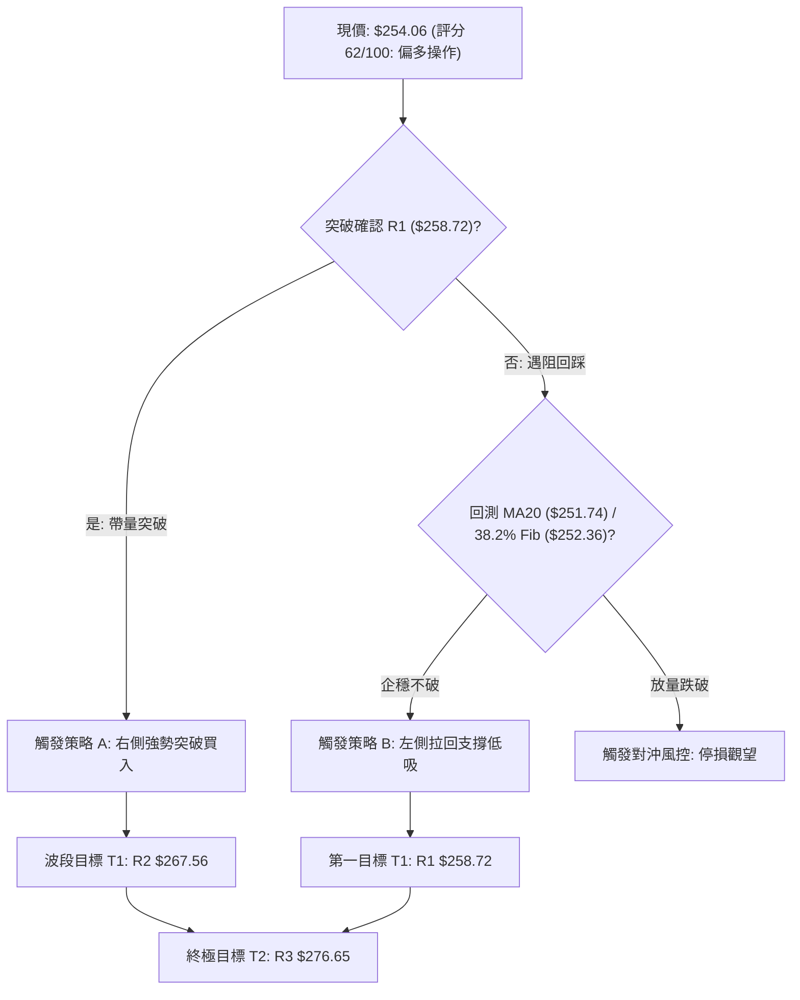

### 🧭 策略路由

> **當前主策略方向 = 【主推多頭策略（波段偏多，逢回布局）】（依技術評分卡：62/100）**
> 
> *論據說明*：綜合評分大於 60 分，動能底背離成立且站穩 MA20，空頭僅列為風險觸發提示，嚴禁在關鍵支撐完好時逆勢放空。

### 🎯 價格情境階梯（Price Scenarios）

價位完全嚴格引用第 4 章「關鍵價位」區塊官方數值：

| 觸發條件 | 下一目標價 | 後續延伸目標價 | 技術與情境含義 |
|----------|------------|----------------|----------------|
| **強勢向上突破 R1 ($258.72)** | **R2 ($267.56)** | **R3 ($276.65)** | 突破雙底頸線與布林上軌，宣告日線震盪結束，展開中期主升浪。 |
| **站穩現價區間 ($252.36 - $254.06)** | **R1 ($258.72)** | **R2 ($267.56)** | 依托布林中軌與 38.2% 斐波那契位反覆蓄勢，屬於標準偏多整理。 |
| **失守 S1 關鍵支撐 ($244.51)** | **S2 ($225.82)** | **S3 ($220.99)** | 跌破布林下軌與 MA200 生命線，多頭形態遭到破壞，轉入深幅修正。 |

### 📊 情境機率分佈

| 價格情境 | 發生機率 | 主要技術依據 |
|----------|----------|--------------|
| **向上反彈突破 (情境一)** | **55%** | RSI 底背離確立、MACD 柱狀圖翻正 (+1.003)、OBV 領先向上支撐、華爾街共識目標高達 $331.53。 |
| **區間帶狀震盪 (情境二)** | **35%** | ADX 僅為 11.26 顯示缺乏單邊強趨勢、MA50 ($258.56) 處於走跌反壓狀態、布林帶寬收窄。 |
| **向下破位探底 (情境三)** | **10%** | S1 ($244.51) 與 MA200 ($241.98) 形成雙重鐵底防護，近三週週線量縮未見實質性拋壓。 |

### 🟢 主策略詳情

本報告依據精確數值制定兩套多頭作戰子策略：

| 策略要素 | 策略 A：右側動量突破策略 | 策略 B：左側回踩低吸策略 (首選) |
|----------|--------------------------|----------------------------------|
| **戰略概念** | 帶量突破 R1 頸線順勢追價 | 回測布林中軌 MA20 支撐低吸布局 |
| **進場條件** | 日線收盤價有效突破 R1 且成交量比 > 1.2x | 盤中回踩 38.2% Fib 與 MA20 獲得支撐確認 |
| **進場價格** | **$258.72** | **$252.36** (或現價 $254.06 梯次建倉) |
| **第一目標價 (T1)** | **$267.56** (官方 R2，幅動 +3.42%) | **$258.72** (官方 R1，幅動 +2.52%) |
| **第二目標價 (T2)** | **$276.65** (官方 R3，幅動 +6.93%) | **$267.56** (官方 R2，幅動 +6.02%) |
| **止損價格** | **$253.29** (進場價減去 1.0 ATR $5.43) | **$244.51** (跌破關鍵支撐 S1 退場) |
| **風險報酬比** | **1 : 3.3** (風險 $5.43，潛在利潤 $17.93) | **1 : 1.9** (T1) / **1 : 3.5** (至 T2) |
| **預估勝率** | **60%** | **68%** |
| **建議倉位** | 15% 總資金 | 20% 總資金 (現價 10%，$252.36 補 10%) |

### 🔴 反向風險觸發點（對沖提示）

* **結構失效關鍵位**：若日線收盤價跌破 **S1: $244.51**，表示日線雙底與布林中軌支撐徹底告破。
* **對沖機制**：多頭部位應立即無條件止損出局或減碼 70%；激進投資者可於 **$244.51** 破位後，建立保護性認沽期權 (Put) 或反手空單，向下對沖目標直指 **S2: $225.82**。

### ⭐ 整體訊號強度評星

```
做多訊號強度：★★★★☆  (4/5星 — 結構偏多、底背離保護、均線共振)
做空訊號強度：★☆☆☆☆  (1/5星 — 長期MA200向上，盈虧比極差)
整體可信度：  ★★★★☆  (4/5星 — 量價配合健康，關鍵價位聚類清晰)
```

---

## 9. 風險提示與監控

### ✅ 關鍵監控指標 Checklist

```
╔══════════════════════════════════════════════════════════════════╗
║                每日盤後關鍵技術監控檢核表                        ║
╠══════════════════════════════════════════════════════════════════╣
║ [ ] 價格是否成功收於 MA20 ($251.74) 之上？(跌破需預警)          ║
║ [ ] RSI(14) 能否維持在 50 中軸之上？(跌回 45 以下背離失效)       ║
║ [ ] MACD 柱狀圖是否持續擴張高於 +1.003？(翻綠則反彈終止)         ║
║ [ ] 單日成交量是否超越 20日均量 (36.66M)？(無量上攻易遭誘多)    ║
║ [ ] 衝擊 R1 ($258.72) / MA50 ($258.56) 時是否出現長上影線？      ║
║ [ ] ADX(14) 是否由 11.26 拐頭突破 20？(確認單邊趨勢啟動)         ║
║ [ ] 價格是否維持在布林中軌上方運行 (%B > 0.50)？                 ║
╚══════════════════════════════════════════════════════════════════╝
```

### ⚠️ 風險場景分析

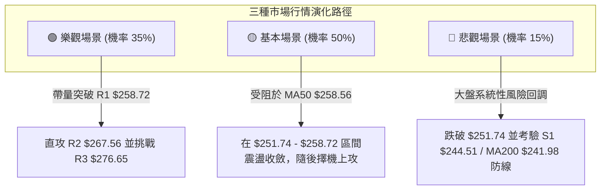

### 🛡️ 風險管理重要提醒

1. **ATR 波動防禦**：當前個股每日正常波動為 **$5.43**，在開盤劇烈震盪時，不可將止損設定在小於 1.0 ATR 的範圍內，以防被正常市場雜訊洗盤出場。
2. **Beta 槓桿效應**：鑑於 Beta 高達 **1.456**，當宏觀經濟發布非農或 CPI 數據導致大盤波動時，部位規模應維持在標準水準的 70%-80%，避免帳戶淨值大幅回撤。
3. **重大防守底線**：**$244.51 (S1)** 與 **$241.98 (MA200)** 為不可退讓的牛熊界線，任何日線級別收盤跌破均視為多頭邏輯破裂。

---

## 📋 報告總結

```
╔══════════════════════════════════════════════════════════════════╗
║                  AMZN 技術分析報告總結                          ║
╠══════════════════════════════════════════════════════════════════╣
║ 報告日期：2026-10-09                                             ║
║ 當前價格：$254.06                                                ║
║ 分析評級：⚖️ 區間蓄勢偏多 (評分: 62/100，勝率 65%)                ║
║                                                                  ║
║ 關鍵結論：                                                       ║
║ ├─ 長期趨勢：🟢 偏多向上 (MA200: $241.98 呈強大支撐)              ║
║ ├─ 中期趨勢：🟡 箱體震盪蓄勢 (MACD 綠柱翻紅，量能沉澱)           ║
║ ├─ 短期趨勢：🟢 震盪轉強 (日線 RSI 底背離確立，站上 MA20)       ║
║ ├─ 關鍵支撐：S1: $244.51 ｜ 38.2% Fib: $252.36                  ║
║ ├─ 關鍵阻力：R1: $258.72 ｜ R2: $267.56 ｜ R3: $276.65           ║
║ └─ 華爾街共識目標價：$331.53 (潛在空間 +30.5%)                   ║
║                                                                  ║
║ 最優策略組合：                                                   ║
║ 1. 🥇 最佳機會：於 $252.36 - $254.06 區間低吸做多，以 S1 $244.51 ║
║               為硬止損，目標看至 R1 $258.72 與 R2 $267.56。      ║
║ 2. 🥈 次選機會：靜待強勢收盤突破 R1 $258.72 後追價，目標 $267.56。║
║ 3. 🥉 保守選擇：等待價格回踩布林下軌 $244 附近且不破時進場。     ║
╚══════════════════════════════════════════════════════════════════╝
```

---

> ⚠️ **免責聲明**：本報告為技術分析研究，所有數據、價位及模型均基於歷史價格與量化指標推算。本報告**僅供研究與學術參考**，**不構成任何形式的投資要約或建議**。金融市場投資具有高風險性，投資人應獨立評估自身風險承受能力並自行承擔交易結果。

---

*報告生成時間：2026-10-09 ｜ 數據來源：Yahoo Finance ｜ 分析框架：多時框技術分析體系*