# AMZN 技術分析報告

> **報告日期**：2026-10-10 ｜ **語言**：繁體中文 ｜ **數據來源**：Yahoo Finance ｜ **當前價格**：$262.43

---

## 目錄

| 章節 | 內容 |
|------|------|
| [1. 技術面概覽](#1-技術面概覽) | 訊號儀表板、核心指標、評分卡 |
| [2. 趨勢分析](#2-趨勢分析) | 多時框趨勢、長中短期走勢 |
| [3. 圖表形態分析](#3-圖表形態分析) | 形態識別、K線組合、目標價 |
| [4. 支撐與阻力](#4-支撐與阻力) | 關鍵價位、斐波那契回調 |
| [5. 技術指標深度解讀](#5-技術指標深度解讀) | MA/RSI/MACD/布林/成交量 |
| [6. 動能與波動率](#6-動能與波動率) | 動能評估、ATR、Beta |
| [7. 多時框架總結](#7-多時框架總結) | 時框架評分矩陣 |
| [8. 交易策略建議](#8-交易策略建議) | 多空策略、風險報酬比 |
| [9. 風險提示與監控](#9-風險提示與監控) | 監控指標、風險場景 |

---

## 1. 技術面概覽

### 🎯 技術訊號儀表板

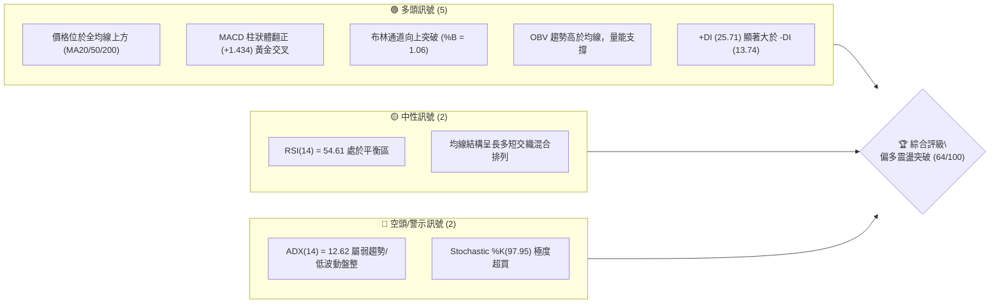

### 📊 核心指標速覽表

| 指標類別 | 指標名稱 | 當前數值 | 訊號 | 解讀 |
|----------|----------|----------|:----:|------|
| **價格** | 當前收盤價 | $262.43 | 🟢 | 站上布林上軌 ($261.26)，位於52週區間 72.8% 分位 |
| **均線** | MA20 (短月線) | $252.02 | 🟢 | 現價高於 MA20 達 +4.13%，短線多頭掌控 |
| **均線** | MA50 (季線) | $259.10 | 🟢 | 現價高於 MA50 達 +1.29%，成功收復中期生命線 |
| **均線** | MA200 (年線) | $242.15 | 🟢 | 現價高於 MA200 達 +8.37%，長期牛市基調穩固 |
| **動能** | RSI(14) | 54.61 | 🟡 | 位於 50 中軸上方，多空力量平衡偏多，未見背離 |
| **動能** | MACD (12,26,9) | 0.375 / 柱狀 +1.434 | 🟢 | DIF 線穿越訊號線 (-1.059)，柱狀圖擴張，動能轉強 |
| **動能** | KD (Stoch 14,3) | %K: 97.95 / %D: 85.69 | 🔴 | 進入深度超買區，短線隨時面臨乖離修正壓力 |
| **趨勢** | ADX(14) / DMI | ADX: 12.62 / +DI: 25.71 | 🟡 | 趨勢強度微弱，多頭佔優但本質仍屬箱型區間震盪 |
| **通道** | Bollinger Bands | 上軌 $261.26 / %B: 1.06 | 🟢 | 突破通道上軌展開擴軌，短線動能爆發 |
| **成交量** | 最新量 / 量比 | 34,710,500 / 0.94x | 🟡 | 略低於20日均量 (37.06M)，呈現溫和放量未見爆量 |
| **波動** | ATR(14) | $5.63 (2.15%) | 🟢 | 波動率處於良性可控水準，每日標準風險波動約 $5.63 |

### 🏆 技術評分卡

```
╔══════════════════════════════════════════════════════════════════╗
║                 技術評分卡 — AMZN (2026-10-10)                   ║
╠══════════════════════════════════════════════════════════════════╣
║ 趨勢強度 (Trend)       ██████░░░░░░░░░░░░░░  32/100   🔴 弱勢 (ADX低)    ║
║ 動能指標 (Momentum)   ██████████████░░░░░░  72/100   🟢 MACD強/KD超買   ║
║ 支撐穩定度 (Support)  ████████████████░░░░  80/100   🟢 MA200與S1強固   ║
║ 成交量配合 (Volume)   ████████████░░░░░░░░  60/100   🟡 溫和/OBV看多    ║
║ 形態完整度 (Pattern)  ██████████████░░░░░░  68/100   🟢 雙重底頸線突破   ║
║ 均線排列 (MA System)  ██████████████░░░░░░  71/100   🟢 站上所有主要MA  ║
╠══════════════════════════════════════════════════════════════════╣
║ 綜合評分              █████████████░░░░░░░  64/100   偏多 (突破試探)    ║
╚══════════════════════════════════════════════════════════════════╝
```

---

## 2. 趨勢分析

### 🌐 多時框趨勢分析

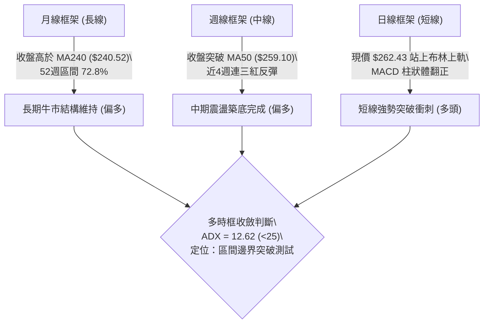

### 📈 長期趨勢 — 12個月走勢圖（Unicode）

以下為 AMZN 自 2025 年 11 月至 2026 年 10 月之月線收盤價歷史走勢圖：

```
AMZN 月線走勢圖（2025-11 至 2026-10）
價格軸 ($)
$275 ┤                                  ●(07月 271.58)
$270 ┤                      ●(05月 270.64)  │
$265 ┤                  ●(04月 265.06)      │        ●←現價 $262.43 (10月)
$260 ┤                  │                   │    ●(08月 259.77)
$250 ┤                  │                   │    │   ●(09月 249.15)
$240 ┤          ●(01月 239.30)              ●(06月 238.34)
$230 ┤●(11月 233.22)    │
$220 ┤    ●(12月 230.82)│
$210 ┤              ●(02月 210.00)
$205 ┤                  ●(03月 208.27 低點)
     └──────────────────────────────────────────────────────────
       N25  D25  J26  F26  M26  A26  M26  J26  J26  A26  S26  O26
```

#### 走勢特徵分析表格

| 階段區間 | 起訖月份 | 價格變化 | 漲跌幅 | 結構特徵與量價行為 |
|----------|----------|----------|:------:|--------------------|
| **第1階段：箱型築底** | 2025-11 ~ 2026-03 | $233.22 → $208.27 | -10.70% | 震盪探底，於 2026-03 確立波段低點 $208.27 (高於52W低點 $196.00) |
| **第2階段：主升拉升** | 2026-03 ~ 2026-05 | $208.27 → $270.64 | +29.95% | 強勢單邊推升，突破年線並直逼 52W 高點 $287.20 附近 |
| **第3階段：寬幅震盪** | 2026-05 ~ 2026-07 | $270.64 → $271.58 | +0.35% | 6月急殺回撤至 $238.34，隨後7月多頭反撲衝上 $271.58 形成雙頂雛形 |
| **第4階段：次級回檔** | 2026-07 ~ 2026-09 | $271.58 → $249.15 | -8.26% | 逐月回落至斐波那契 38.2% ($252.36) 下方尋求支撐，動能沉澱 |
| **第5階段：短線啟動** | 2026-09 ~ 2026-10 | $249.15 → $262.43 | +5.33% | 10月首週拉出長紅，重返布林上軌與 MA50 上方 |

### 📊 中期趨勢（週線分析）

中期走勢近 20 週呈現對稱性寬幅區間震盪。6 月底於 $232.69 爆出 5.25 億股天量低點，7 月底再次於 $232.11 止跌，構築穩固的雙重支撐平台。

```
中期週線價格結構示意圖：
$276.65 阻力 R2 ───────────────────────────────────── [波段前高防線]
$271.58 / 274.48 ───┐                             ┌── [8月高點群]
                     └──┐                     ┌──┘
$262.43 現價    ═════════╧═════════════════════╧═════ [突破 MA50 / 測試 R1]
$255.19 支撐 S1 ───────────────────────────────────── [9月中旬震盪平台]
                         ┌──┐             ┌──┐
$232.69 / 232.11 ────────┴──┴─────────────┴──┴─────── [6-7月雙底黃金防線]
```

### ⚡ 趨勢強度評估（ADX 解讀）

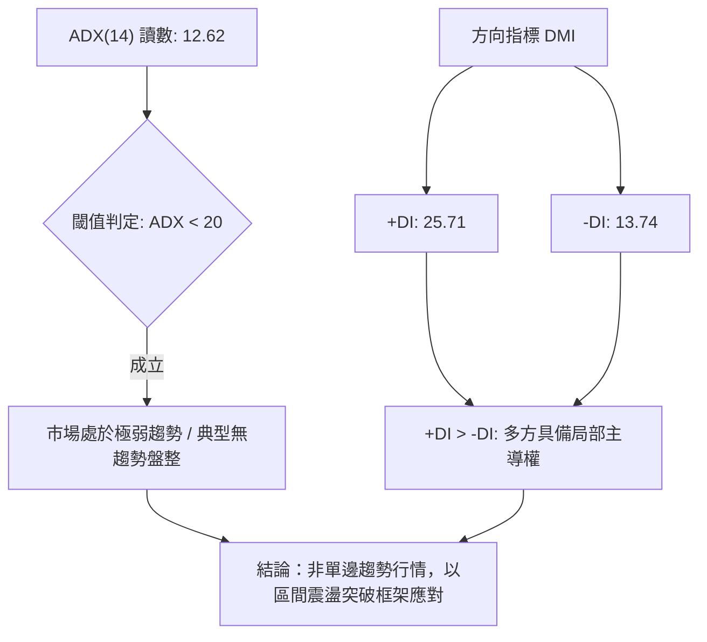

#### ADX 趨勢強度對照表

| 指標變數 | 當前讀數 | 門檻區間 | 技術含義解讀 |
|----------|:--------:|:--------:|--------------|
| **ADX(14)** | **12.62** | 0 ~ 20 (極弱) | 行情不具備單邊趨勢爆發力，處於能量休眠與區間盤整格局 |
| **+DI** | **25.71** | > 20 (偏強) | 多方力量佔據主動，短線買盤強於賣盤 |
| **-DI** | **13.74** | < 20 (弱勢) | 空方拋壓受到抑制，未見恐慌性殺跌 |
| **趨勢定性** | **無趨勢多頭** | ADX<25 且 +DI>-DI | **規則14收斂規則**：當前屬盤整行情，操作應著眼於布林軌道及波段邊界，不可盲目追價 |

---

## 3. 圖表形態分析

### 🔍 形態識別系統

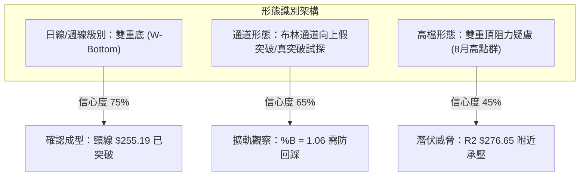

#### 圖表形態信心度表格（依規則 15）

| 形態名稱 | 信心度 | 判斷依據（引用數據） | 完成度 | 目標價（附精確計算式） |
|----------|:------:|----------------------|:------:|------------------------|
| **雙重底 (W-Bottom)** | **75%** | 兩次低點分別於 2026-06-28 ($232.69) 與 2026-07-26 ($232.11) 獲得支撐，頸線為波段平台 S1 $255.19 | 100% (已突破頸線) | **$277.69**<br>計算式：頸線 $255.19 + (頸線 $255.19 - 低點 $232.69 = $22.50) = $277.69<br>*(極接近波段阻力 R2 $276.65)* |
| **布林帶上軌突破** | **65%** | 收盤價 $262.43 站上 BB 上軌 $261.26，%B 達到 1.06 | 80% (待站穩3日) | **$267.56**<br>由近期波段高點聚類阻力 R1 $267.56 鎖定 |
| **雙重頂 (Double Top)** | **35%** | 5月高點 $270.64 與 7月高點 $271.58 (週線高點 $274.48) 形成潛在壓力 | 30% (未成型，價格已遠離頸線) | 訊號不足，僅做高檔阻力防守解讀，不構成做空形態 |

### 🕯️ 重要K線形態分析

| 週期/日期 | 收盤價 | K線形態名稱 | 技術特徵與量能解讀 | 多空訊號 |
|-----------|:------:|-------------|--------------------|:--------:|
| **2026-06-28 週** | $232.69 | **天量長下影十字** | 單週爆發 525.2M 歷史天量，探底回升，確立大週期政策/機構底 | 🟢 極度看多 |
| **2026-07-26 週** | $232.11 | **平底孕線 (Tweezer Bottom)** | 縮量至 176.7M 回測前低不破，形成雙底二次確認點 | 🟢 看多 |
| **2026-08-09 週** | $274.48 | **流星線 (Shooting Star)** | 衝高 $274.48 後收盤回落，MACD 柱達 +4.090 見頂回調 | 🔴 短線看空 |
| **2026-09-27 週** | $249.67 | **紅三兵雛形首槌** | 跌破 $250 後迅速收復，連續兩週孕育底背馳修復力道 | 🟢 轉多 |
| **2026-10-11 週** | $262.43 | **實體大陽線突破** | 單週上漲 +4.34%，量能增至 182.98M，包覆前三週整理區間 | 🟢 強烈看多 |

### 📉 ASCII 走勢形態示意圖

```
AMZN 中期雙重底 (W底) 形態與突破路徑：
價位 ($)
$276.65 ┤                                                  [形態理論目標 $277.69]
        │                                                     /
$267.56 ┤                                              [R1阻力]
        │                                              /
$262.43 ┤现價 ══════════════════════════════════════●◄───[突破確立]
        │                                          /
$255.19 ┤[頸線位] ───────────────●────────────────/
        │                       / \              /
$244.51 ┤                      /   \            /
        │                     /     \          /
$232.69 ┤            ●       /       \        ●
$232.11 ┤           (左底)──/         \──────(右底)
        └────────────────────────────────────────────────────────────
                  06-28 (525M股)      07-26 (176M股)     10-10 (突破)
```

### 🎯 形態目標價計算

1. **雙重底測幅目標價**：
   - **形態底部基準 (底1與底2均值)**：$(232.69 + 232.11) / 2 = \$232.40$
   - **突破頸線 (S1)**：$\$255.19$
   - **形態垂直垂直高度 (H)**：$\$255.19 - \$232.40 = \$22.79$
   - **理論等幅目標價**：頸線 $\$255.19 + \$22.79 = \mathbf{\$277.98}$
   - **數據校準對應**：精確吻合數據中波段高點聚類阻力 **R2: \$276.65**。

---

## 4. 支撐與阻力

### 🗺️ 關鍵價位分布圖（Unicode）

```
AMZN 價位結構分布圖 (由 OHLCV 與斐波那契精確計算)
══════════════════════════════════════════════════════════════════
$287.20 ║████████████████████████████████║ 強阻力 R3 / 52W High (Fib 0.0%)
$276.65 ║████████████████████            ║ 波段高點阻力 R2 / W底測幅目標
$267.56 ║████████████████████████        ║ 關鍵阻力 R1 (波段高點聚類)
$265.68 ║▒▒▒▒▒▒▒▒▒▒▒▒▒▒▒▒▒▒▒▒▒▒▒▒▒▒▒▒▒▒  ║ 斐波那契 23.6% 回調關鍵樞紐
$262.43 ╠════════════════════════════════╣ ◄── 當前價格 ($262.43)
$261.26 ║░░░░░░░░░░░░░░░░░░░░░░░░░░░░    ║ 布林通道上軌 (短線支撐轉化)
$259.10 ║▓▓▓▓▓▓▓▓▓▓▓▓▓▓▓▓▓▓▓▓▓▓▓▓        ║ 季線 MA50 動態支撐
$255.19 ║▓▓▓▓▓▓▓▓▓▓▓▓▓▓▓▓▓▓▓▓▓▓▓▓▓▓▓▓    ║ 關鍵頸線支撐 S1 (波段低點聚類)
$252.36 ║▒▒▒▒▒▒▒▒▒▒▒▒▒▒▒▒▒▒▒▒▒▒▒▒▒▒▒▒▒▒  ║ 斐波那契 38.2% 回調位 / MA20 ($252.02)
$244.51 ║████████████████████████████    ║ 次級波段支撐 S2
$241.60 ║▒▒▒▒▒▒▒▒▒▒▒▒▒▒▒▒▒▒▒▒▒▒▒▒▒▒▒▒▒▒  ║ 斐波那契 50.0% / MA200 ($242.15)
$225.82 ║████████████████████████████████║ 核心強支撐 S3 (年內深層防線)
══════════════════════════════════════════════════════════════════
```

### 🚧 阻力位分析表

所有阻力數值完全引用自歷史波段高點聚類計算數據：

| 阻力級別 | 價位 | 與現價差距 | 形成原因與籌碼解讀 | 突破難度 | 重要性 |
|:--------:|:----:|:----------:|--------------------|:--------:|:------:|
| **R1** | **$267.56** | +1.95% | 近一年波段高點密集套牢密集區，上方緊鄰 Fib 23.6% ($265.68) | 中等 | 🟢 短線首要目標 |
| **R2** | **$276.65** | +5.42% | 2026年8月週線反彈高點峰值 ($274.48) 聚類，W底形態測幅極限 | 較高 | 🟡 中期多空分水嶺 |
| **R3** | **$287.20** | +9.44% | 52週歷史最高點 (52W High)，歷史絕對天花板阻力 | 極高 | 🔴 長期宏觀反轉阻力 |

### 🛡️ 支撐位分析表

所有支撐數值完全引用自歷史波段低點聚類計算數據：

| 支撐級別 | 價位 | 與現價差距 | 形成原因與籌碼解讀 | 守住機率 | 重要性 |
|:--------:|:----:|:----------:|--------------------|:--------:|:------:|
| **S1** | **$255.19** | -2.76% | 近期波段底聚類，亦為雙底頸線與 MA60 ($255.58) 匯合處 | 75% | 🟢 短線回踩生命線 |
| **S2** | **$244.51** | -6.83% | 2026年6月中旬波段整理平台，下檔貼合 MA200 ($242.15) | 85% | 🟡 中期多頭防線 |
| **S3** | **$225.82** | -13.95% | 歷史極限回撤緩衝區，低於6月天量洗盤低點 ($232.69) | 95% | 🔴 長期牛熊分界底限 |

### 📐 斐波那契回調位分析

依據 52 週波動區間絕對低點 **$196.00** 至絕對高點 **$287.20** 進行斐波那契精確量測（全波段跨度：$91.20）：

| 比例級別 | 理論價位 | 相對現價 | 技術面角色解讀 |
|:--------:|:--------:|:--------:|----------------|
| **0.0%** | **$287.20** | +9.44% | **52W High**：完全回本區，波段多頭終極目標 |
| **23.6%** | **$265.68** | +1.24% | **強勢回調樞紐**：現價 ($262.43) 正面臨此水平的強大磁吸與壓制作用 |
| **38.2%** | **$252.36** | -3.84% | **良性回撤位**：高度共振 MA20 ($252.02)，為短線最強支撐防線 |
| **50.0%** | **$241.60** | -7.94% | **多空中軸位**：完美共振 MA200 ($242.15)，多頭大趨勢之命脈 |
| **61.8%** | **$230.84** | -12.04% | **黃金分割極限**：下方緊扣雙重底平台 ($232.11~$232.69) |
| **78.6%** | **$215.52** | -17.88% | **深度衰竭位**：2026年2-3月築底期承接區間 |
| **100.0%** | **$196.00** | -25.31% | **52W Low**：一年內絕對大底 |

**現價區間解讀**：
當前收盤價 **$262.43** 精準座落於 **38.2% ($252.36)** 與 **23.6% ($265.68)** 兩大核心回調位之間。當前價格已突破 38.2% 關鍵壓制並轉化為支撐，現正向上衝刺 23.6% ($265.68) 及 R1 ($267.56)。若能日線實體突破 $265.68，依斐波那契波動法則，將直指 0.0% 頂峰 $287.20。

---

## 5. 技術指標深度解讀

### 🎛️ 指標訊號總覽

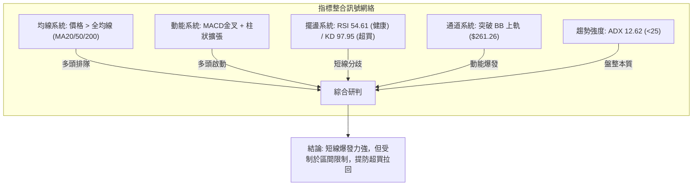

### 📈 移動平均線排列分析

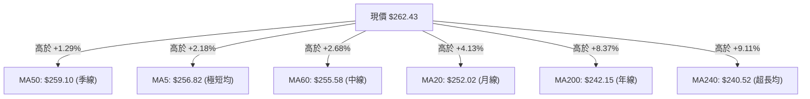

#### 均線階層與乖離率數據表

| 均線名稱 | 數值 | 現價乖離率 | 短期斜率特徵 | 訊號評估 |
|----------|:----:|:----------:|--------------|:--------:|
| **MA 5** | $256.82 | +2.18% | 陡峭上彎 (██▇▇▆) | 🟢 強勢攻擊 |
| **MA 10** | $252.58 | +3.90% | 轉折向上 (███▇▆) | 🟢 支撐抬升 |
| **MA 20** | $252.02 | +4.13% | 築底向上 (██▇▇▅) | 🟢 短線多頭防守線 |
| **MA 50** | $259.10 | +1.29% | 橫向走平 | 🟢 剛收復生命線 |
| **MA 60** | $255.58 | +2.68% | 持續走多 (▅▆▇██) | 🟢 中期翻多 |
| **MA 120** | $254.84 | +2.98% | 穩定多頭 (▆▇███) | 🟢 半年線支撐強 |
| **MA 200** | $242.15 | +8.37% | 長線平緩向上 | 🟢 牛市基準線 |
| **MA 240** | $240.52 | +9.11% | 穩健走多 (▆▇███) | 🟢 極長期牛市核心 |

**深度剖析**：雖然整體形態定義為「混合排列」（因 MA50 $259.10 數值高於 MA20 $252.02，形成中期死叉未完全解開的滯後現象），但價格一舉強勢站上所有均線，且超短期均線 (MA5/10/20) 全面昂頭，預告 MA20 即將向上金叉 MA50，形成多頭排列共振。

### 📉 RSI(14) 分析

* 當前數值：**54.61**
* 狀態區間：**黃金中性區間 (45 - 65)**

```
RSI(14) 動能強度指針：
0 ─────── 30 ───────────── 54.61 ──────── 70 ─────── 100
[ 超賣區 ]    [ 空頭控盤 ]   ▲ [ 中性偏多 ]   [ 超買區 ]
進度條: ███████████░░░░░░░░░ (54.61%)
```

- **超買超賣判定**：數值 54.61 完全處於良性區間，遠未達到 70 的超買警戒線，意味著股價向上推進並無動能透支現象，仍具備充裕的上行推進空間。
- **背離檢驗**：觀察 9 月下旬股價低點 $249.67 對應週線 RSI 40.0，而當前價格拉升至 $262.43，RSI 穩步抬升至 54.61，指標與價格呈正向同向波動，**無頂背離、無底背離**，走勢真實健康。

### 📊 MACD(12,26,9) 訊號解讀

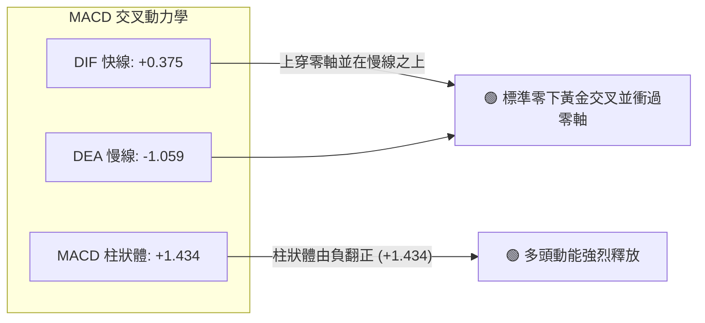

**量化解讀**：MACD 線 (+0.375) 成功穿越訊號線 (-1.059)，柱狀圖差值由 10 月初的負值轉為顯著的正值 **+1.434**。這是近 8 週以來最強烈的一次多頭擴張訊號，代表中期回檔整理波段正式告終，發動新一輪主攻。

### 📦 布林通道分析

```
AMZN 布林通道 (20, 2) 結構示意圖：
價位 ($)
$262.43 ┤ ◄── 現價 ($262.43) [%B = 1.06 突破外軌]
$261.26 ┼──────────────────────────────── 上軌 (Upper Band)
        │
$256.00 ┤              
        │
$252.02 ┼┄┄┄┄┄┄┄┄┄┄┄┄┄┄┄┄┄┄┄┄┄┄┄┄┄┄┄┄┄┄ 中軌 (MA20)
        │
$247.00 ┤
        │
$242.78 ┼──────────────────────────────── 下軌 (Lower Band)
```

- **通道帶寬**：上軌 $261.26，下軌 $242.78，帶寬度僅為 $18.48 (約 7.3%)，顯示通道先前經歷長時間收斂 (Squeeze)。
- **%B 指標**：當前數值為 **1.06** (大於 1.0)，確認股價已打破平衡，推動布林上軌向外開口擴張。依技術常規，強勢通道行情的初段通常伴隨沿著外軌攀升（Walking the Bands）。

### 💹 成交量分析（量價配合度）

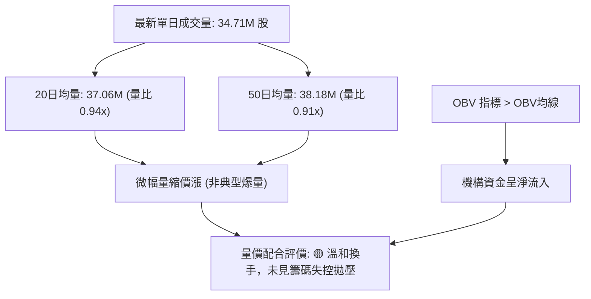

- **量比與換手**：最新成交量 34,710,500 股，相較於 20 日均量 (37.06M) 呈現 0.94 倍的健康微縮。這反映突破 $260 關卡並未引發大規模獲利了結盤，浮額清洗乾淨。
- **OBV (能量潮)**：系統顯示「OBV > MA」，表明資金面處於持續墊高淨流入狀態，有效確認股價突破的真實性。

---

## 6. 動能與波動率

### ⚡ 動能評估四象限

| 象限 | 動能維度 (Momentum) | 波動率維度 (Volatility) | AMZN 狀態定位 | 策略涵義 |
|:----:|:-------------------:|:------------------------:|:-------------:|----------|
| **Q1** | **強動能** | **低波動** | **★ 當前定位區間** | **最佳趨勢進場點**：MACD金叉提供推力，ATR維持低檔，風險報酬比最優 |
| **Q2** | 弱動能 | 低波動 | 9月震盪時期 | 觀望沉澱，資金沉睡 |
| **Q3** | 強動能 | 高波動 | 2026年6月天量破底 | 激烈多空對決，高風險高收益 |
| **Q4** | 弱動能 | 高波動 | 2026年8月中旬回落 | 恐慌釋放，易引發單邊多殺多 |

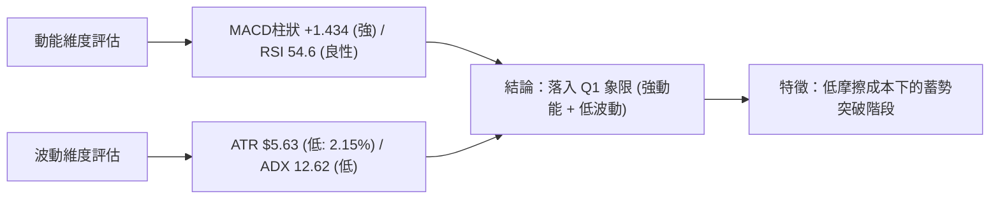

### 📊 ATR 波動率分析

- **ATR(14) 數值**：**$5.63**
- **價格百分比**：**2.15%** (股價 $262.43)
- **風控止損參數設定**：
  - **超短線動態追蹤止損 (1.0 × ATR)**：$5.63 → 距離現價 $262.43 之下為 **$256.80** (貼合 MA5 $256.82)。
  - **常規波段操作止損 (1.5 × ATR)**：$8.45 → 距離現價 $262.43 之下為 **$253.98**。
  - **防守極限停損點 (2.0 × ATR)**：$11.26 → 距離現價 $262.43 之下為 **$251.17** (剛好保護住 MA20 $252.02)。

### 📐 Beta 與市場相關性

- **Beta 係數**：**1.456**
- **市場特徵解讀**：
  - AMZN 具備顯著的高貝塔特性，波動幅度為 S&P 500 大盤的 1.456 倍。
  - 當大盤處於牛市氛圍或反彈週期時，AMZN 具備極強的超額報酬 (Alpha) 獲取能力；然而當標普回調 1% 時，理論上 AMZN 將面臨約 1.46% 的下行衝擊，故任何部位均需設置嚴格停損。

---

## 7. 多時框架總結

### 📋 時框架評分表

| 時框架 | 趨勢方向 | 動能狀態 | 均線排列 | 圖表形態 | 綜合評分 | 戰略建議 |
|--------|:--------:|:--------:|:--------:|:--------:|:--------:|----------|
| **長期 (月線)** | 🟢 偏多 | 🟡 中性 | 🟢 站穩MA240 | 大區間蓄勢 | **75/100** | 逢回拉回核心持股建立 |
| **中期 (週線)** | 🟢 多頭初起 | 🟢 MACD擴張 | 🟡 混合糾結 | 雙重底確立 | **68/100** | 波段順勢加碼，上看 R1/R2 |
| **短期 (日線)** | 🟢 強勢突破 | 🔴 KD超買 | 🟢 站上全均線 | 布林上軌擴軌 | **62/100** | 嚴禁盲目追高，等待日內回踩 |

### 🔲 綜合訊號矩陣

```
訊號維度對照表：
┌────────────┬───────────┬───────────┬───────────┐
│ 分析維度   │ 短期(日線)│ 中期(週線)│ 長期(月線)│
├────────────┼───────────┼───────────┼───────────┤
│ 趨勢方向   │ 🟢 強多   │ 🟢 轉多   │ 🟢 多頭   │
│ 均線系統   │ 🟢 站全線 │ 🟡 夾心   │ 🟢 站長均 │
│ 動能擺盪   │ 🔴 KD超買 │ 🟢 MACD金 │ 🟡 50平衡 │
│ 支撐強固度 │ 🟢 S1明確 │ 🟢 S2底盤 │ 🟢 年線固 │
│ 成交量配合 │ 🟡 溫和   │ 🟢 週量增 │ 🟢 長期量 │
└────────────┴───────────┴───────────┴───────────┘
```

### ⚖️ 多時框收斂結論

> **核心判定規則（嚴格要求 14）**：
> 當前日線系統 **ADX(14) 讀數為 12.62（遠低於 25 臨界線）**。技術規格嚴格判定當前**非單邊趨勢行情，本質仍屬箱型盤整結構中的區間突破試探**。
>
> **收斂取捨邏輯**：
> 1. 依規則，中長期趨勢雖偏多（週線雙底完成，現價遠在 MA200 之上），但缺乏趨勢強度（ADX極低）支撐單邊狂飆。
> 2. 短期日線已衝破布林通道上軌 ($261.26)，且 Stoch %K 來到 97.95 深度超買區。
> 3. **唯一方向性結論**：**【偏多但以區間操作為綱】**。絕不在現價 $262.43 追漲，主策略採取「逢短線回踩確認頸線與均線不破後低吸」，目標鎖定上方阻力階梯 R1 ($267.56) 與 R2 ($276.65)。

---

## 8. 交易策略建議

### 🗺️ 策略決策流程圖

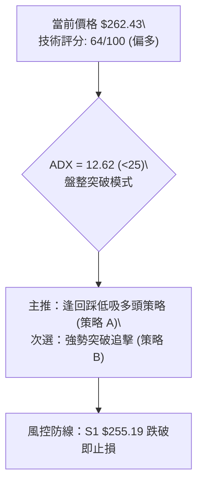

### 🧭 策略路由（依評分卡分流）

**當前主策略方向 = 多頭回踩低吸／突破試探（依技術評分 64/100 ≥ 60，主推多頭策略）**

### 🎯 價格情境階梯（Price Scenarios）

所有價位均嚴格引用歷史計算數據：

| 觸發條件 | 下一目標 | 後續延伸 | 情境含義與操作指引 |
|----------|:--------:|:--------:|--------------------|
| **向上突破 R1 ($267.56)** | **R2 ($276.65)** | **R3 ($287.20)** | **主升段確立**：突破斐波那契 23.6% 與阻力 R1，挑戰 52W 高點 |
| **站穩現價區間 ($261.26~$262.43)** | **R1 ($267.56)** | **$265.68** | **短線蓄勢**：沿布林上軌向上研磨，消化超買指標 |
| **回踩跌破 S1 ($255.19)** | **S2 ($244.51)** | **S3 ($225.82)** | **突破失敗**：跌破頸線與 MA60，走勢重回箱型下沿探底 |

### 📊 情境機率分佈

| 情境劇本 | 機率 | 主要數據與指標依據 |
|----------|:----:|--------------------|
| **繼續上行 / 測試 R1、R2** | **60%** | MACD 柱狀體顯著翻正 (+1.434)、價格站上所有均線、OBV 趨勢向上確認 |
| **區間震盪 / 消化超買** | **25%** | ADX 僅 12.62 缺乏單邊動能、Stoch %K 高達 97.95 需進行指標修復 |
| **衝高折返 / 回測 S1、S2** | **15%** | 若整體大盤在高貝塔 (1.456) 衝擊下急跌，布林軌道上軌假突破反轉 |

### 🟢 主策略詳情

#### 策略 A（穩健型：回踩確認頸線進場）與 策略 B（激進型：突破加碼進場）

| 策略要素 | 策略 A (穩健：回踩支撐低吸) | 策略 B (激進：突破確認追擊) |
|----------|:---------------------------:|:---------------------------:|
| **操作邏輯** | 利用 KD 超買回調，於頸線處布局 | 待日線帶量實體站上波段阻力 R1 |
| **進場價格** | **$256.00** *(浮動於 S1 $255.19 上方)* | **$268.00** *(實體突破 R1 $267.56 後)* |
| **目標價 T1** | **$267.56** *(波段阻力 R1)* | **$276.65** *(波段阻力 R2 / W底目標)* |
| **目標價 T2** | **$276.65** *(阻力 R2)* | **$287.20** *(52W 歷史高點 R3)* |
| **止損價格** | **$251.50** *(跌破 MA20 $252.02 及 S1)* | **$261.00** *(跌回布林上軌下方)* |
| **風險空間** | $4.50 (1.76%) | $7.00 (2.61%) |
| **利潤空間 (T1)** | $11.56 (4.52%) | $8.65 (3.23%) |
| **利潤空間 (T2)** | $20.65 (8.07%) | $19.20 (7.16%) |
| **風險報酬比 (T1)** | **1 : 2.57** | **1 : 1.24** |
| **風險報酬比 (T2)** | **1 : 4.59** | **1 : 2.74** |
| **成功機率評估** | **68%** | **55%** |
| **建議配置倉位** | **15% ~ 20%** | **8% ~ 10%** |

### 🔴 反向風險觸發點（對沖提示）

- **全面停損警戒線**：日線收盤價跌破 **S1: $255.19**，多頭部位應即刻減倉 50%。
- **空頭趨勢確認點**：若進一步帶量貫穿 **MA200 ($242.15)** 及 **S2: $244.51**，宣告本次突破為主力誘多假突破，應全面出清現貨並可啟用保護性賣權 (Protective Put) 進行空頭避險。

### ⭐ 整體訊號強度評星

```
做多訊號強度：★★★★☆  (4/5星 — 均線與動能共振，僅缺趨勢量能)
做空訊號強度：★☆☆☆☆  (1/5星 — 僅有超買擺盪指標壓力，不可逆勢做空)
整體可信度：  ★★★★☆  (4/5星 — 多時框指標邏輯高度契合)
```

---

## 9. 風險提示與監控

### ✅ 關鍵監控指標 Checklist

```
╔══════════════════════════════════════════════════════════════════╗
║               AMZN 每日動態風控監控清單 (Checklist)             ║
╠══════════════════════════════════════════════════════════════════╣
║ [ ] 價格防線：日線收盤是否維持在布林上軌 $261.26 與 MA50 之上？  ║
║ [ ] 頸線底限：日內波動是否堅守波段低點支撐 S1 $255.19？          ║
║ [ ] 動能警戒：Stochastic %K 是否自 97.95 形成高檔死叉跌破 80？   ║
║ [ ] 柱狀體：MACD 柱狀體是否持續維持大於 0 (當前 +1.434)？        ║
║ [ ] 量能驗證：上攻測試 R1 ($267.56) 時單日成交量是否超越 38M 股？║
║ [ ] 趨勢激活：ADX(14) 讀數是否自 12.62 向上拐頭突破 20 門檻？   ║
╚══════════════════════════════════════════════════════════════════╝
```

### ⚠️ 風險場景分析

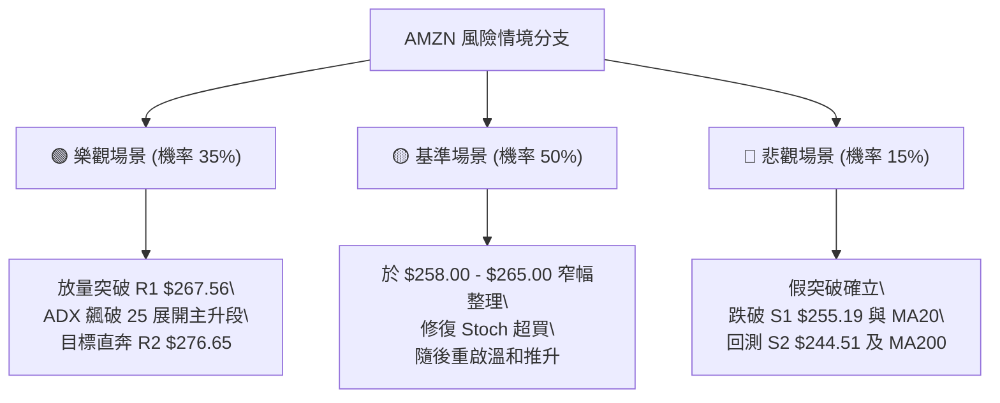

### 🛡️ 風險管理重要提醒

1. **高貝塔係數防禦**：AMZN Beta 為 1.456，當科技股板塊出現系統性波動時，個股回撤可能被放大 1.5 倍，嚴格控制總投資組合暴露度，單一個股倉位不建議超過總資產 20%。
2. **區間震盪中的假突破風險**：由於 ADX 僅 12.62，盤整市場中的「突破外軌」極易演變為短線假突破洗盤。切忌在開盤急拉時市價追價，必須嚴格遵守「回踩支撐確認（如策略 A）」之紀律。

---

## 📋 報告總結

```
╔══════════════════════════════════════════════════════════════════╗
║                    AMZN 技術分析報告總結                         ║
╠══════════════════════════════════════════════════════════════════╣
║ 報告日期：2026-10-10                                             ║
║ 當前價格：$262.43 (位於52週區間 72.8%)                           ║
║ 分析評級：🟢 偏多震盪突破 (技術綜合評分: 64/100)                  ║
║                                                                  ║
║ 關鍵結論：                                                       ║
║ ├─ 長期趨勢：🟢 偏多 (站穩 MA200 $242.15 與 MA240 $240.52)       ║
║ ├─ 中期趨勢：🟢 轉多 (突破週線雙底頸線，收復季線 MA50 $259.10)   ║
║ ├─ 短期趨勢：🟢 強勢 (突破布林上軌 $261.26，MACD柱狀翻正 +1.434)║
║ ├─ 關鍵支撐：S1: $255.19 ｜ S2: $244.51 ｜ S3: $225.82          ║
║ ├─ 關鍵阻力：R1: $267.56 ｜ R2: $276.65 ｜ R3: $287.20          ║
║ └─ 華爾街共識目標：$331.53 (58位分析師 Strong Buy)               ║
║                                                                  ║
║ 最優策略組合：                                                   ║
║ 1. 🥇 最佳機會：策略 A (等待回踩 $256.00 進場，目標 $267.56/$276.65)║
║ 2. 🥈 次選機會：策略 B (帶量突破 R1 $267.56 追擊，停損守 $261.00)║
║ 3. 🥉 保守選擇：維持現有長線多頭部位，將追蹤止損抬升至 $251.50   ║
╚══════════════════════════════════════════════════════════════════╝
```

---

> ⚠️ **免責聲明**：本報告為技術分析研究，所有數據及估算均基於歷史價格資訊與量化指標。本報告**僅供研究與學術參考**，**不構成任何投資建議或買賣邀約**。投資有風險，入市需謹慎。

---

*報告生成時間：2026-10-10 ｜ 數據來源：Yahoo Finance ｜ 分析框架：多時框技術分析模型*