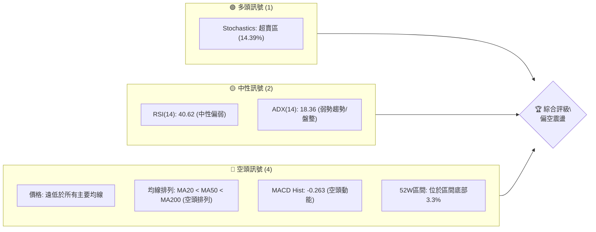
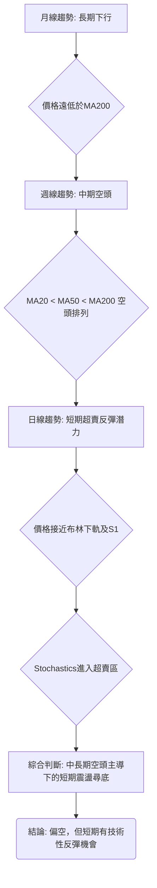
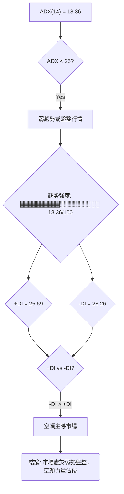
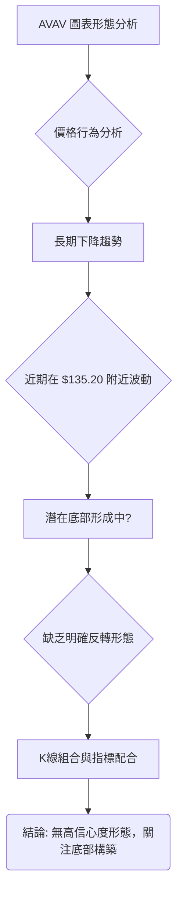
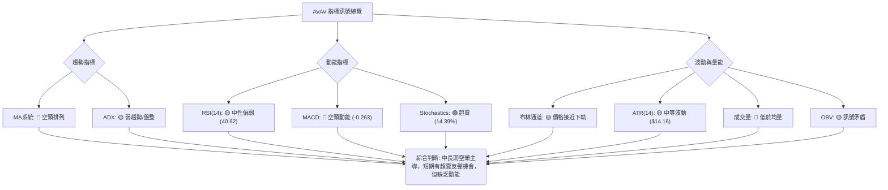
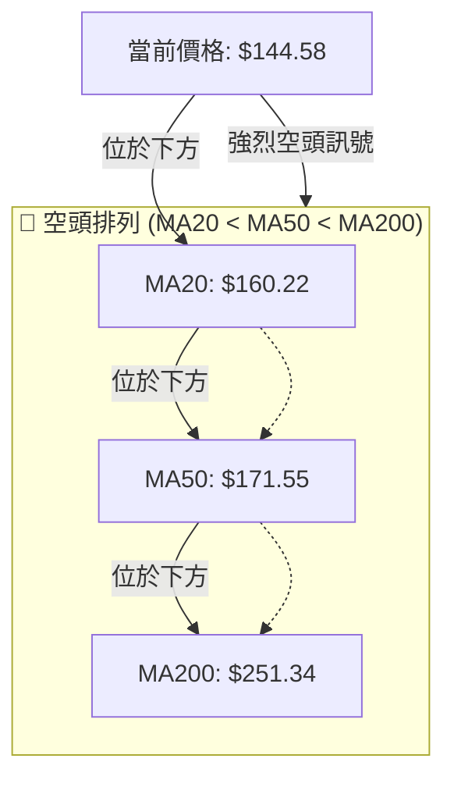
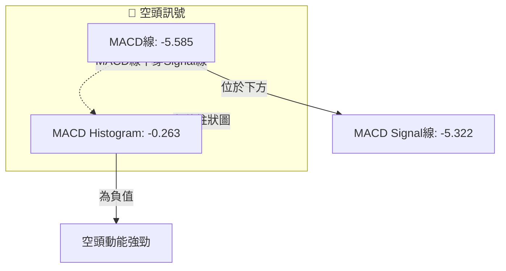
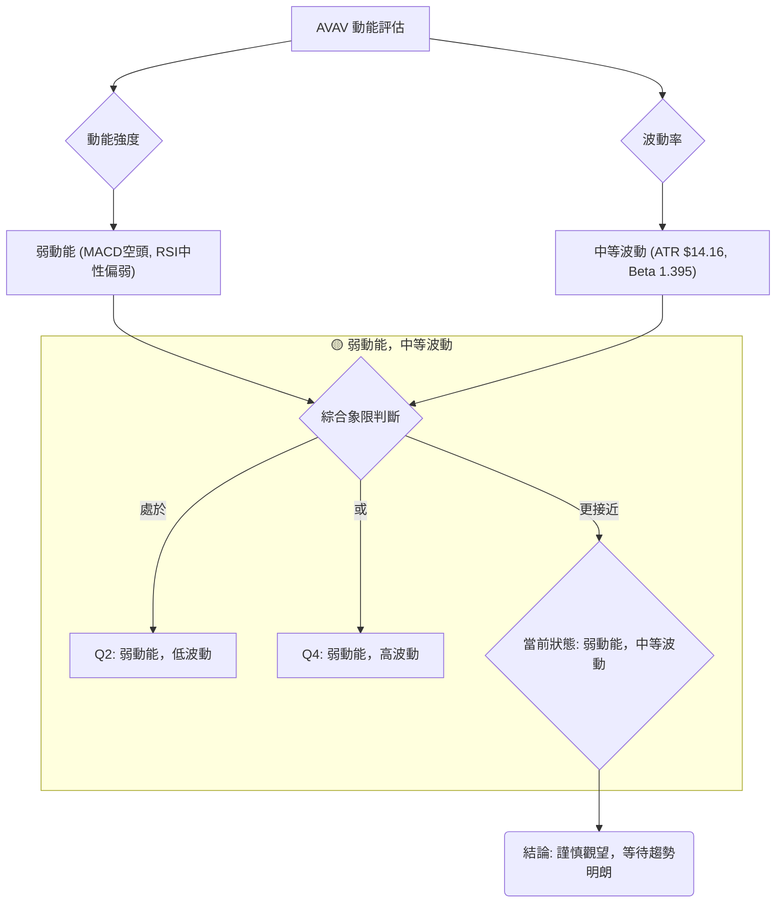
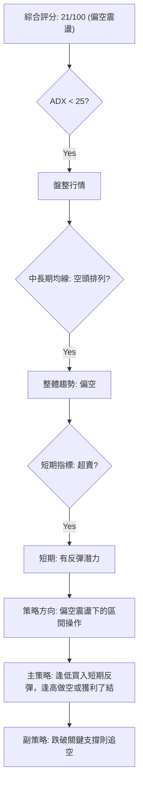
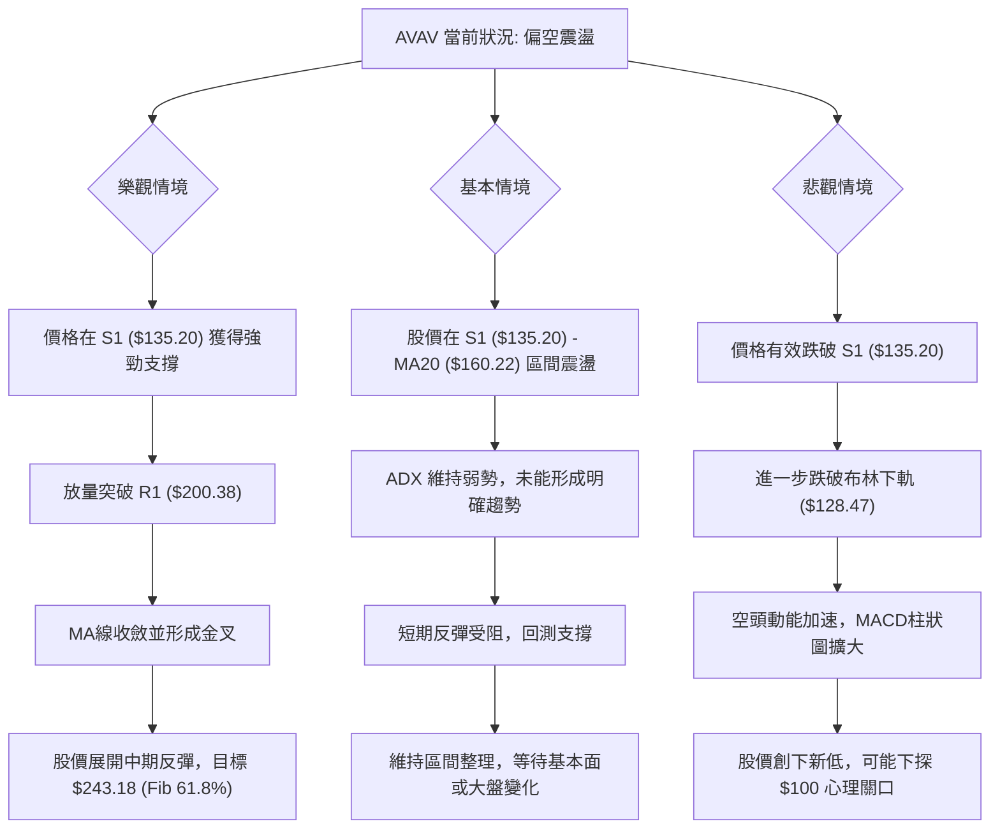

<details>
<summary>📊 靜態圖表 (點擊展開)</summary>

</details>

<html>
<head><meta charset="utf-8" /></head>
<body>
    <div style="height:500px; width:100%;">                        <script>window.PlotlyConfig = {MathJaxConfig: 'local'};</script>
        <script charset="utf-8" src="https://cdn.plot.ly/plotly-3.7.0.min.js" integrity="sha256-jvTGqxNp8AGWEcvNLVuKr+8j5dGe9Yw51LQkmDH+IYA=" crossorigin="anonymous"></script>                <div id="candlestick-chart" class="plotly-graph-div" style="height:100%; width:100%;"></div>            <script>                window.PLOTLYENV=window.PLOTLYENV || {};                                if (document.getElementById("candlestick-chart")) {                    Plotly.newPlot(                        "candlestick-chart",                        [{"close":{"dtype":"f8","bdata":"AAAAgMKpckAAAADgUdhyQAAAAOCj3HJAAAAAQDPTckAAAABACktzQAAAAIA9rnNAAAAAoEehdUAAAADgeoR2QAAAAIA9andAAAAAgBR+eEAAAACAFLJ4QAAAAAApeHlAAAAA4KPkeEAAAADgo4R4QAAAAKBHnXlAAAAAgBQaeUAAAABACgt4QAAAAKCZYXdAAAAAoHDpdUAAAADgo8B2QAAAAEDhkndAAAAAQOEydkAAAADgesR2QAAAAOCjqHdAAAAAgBTCd0AAAABA4b53QAAAAGBmyndAAAAAoEfddkAAAABgjx53QAAAAIAU\u002fnZAAAAAoEfRdkAAAABAM+t1QAAAACCug3RAAAAAYGaadEAAAACA6910QAAAAKBwgXRAAAAAwB41dEAAAAAA13dyQAAAACBcM3JAAAAAYI+6cUAAAABAM49xQAAAAEDhhnFAAAAAIK4fcUAAAADgowhxQAAAAADXT3FAAAAAIIVncUAAAABACnNxQAAAACBcd3FAAAAAwMwccEAAAABAM49wQAAAAOB6\u002fHBAAAAAQDP3cUAAAACAPWZxQAAAACCFp3FAAAAAYLiWcUAAAAAAAKhuQAAAAAAAOG9AAAAAAADgbUAAAACAPWptQAAAAMDMVG1AAAAAQDOjbEAAAACAFNZsQAAAAOBRYG5AAAAA4Hrsb0AAAABgZlJwQAAAAEAzS3BAAAAAAADgb0AAAADAzCRvQAAAAAAAgG5AAAAA4Ho8bkAAAABACgNwQAAAAGCPlnJAAAAA4HrQc0AAAAAgrudzQAAAACBcj3VAAAAAANfPdkAAAABA4Sp3QAAAAIDCvXZAAAAAwMzcd0AAAADAHql3QAAAAIDCjXhAAAAAgD2udEAAAACAFPpzQAAAAIDrgXNAAAAAAAA8c0AAAABguOpyQAAAAMAeWXNAAAAAQAovc0AAAAAghVNyQAAAAIA9ZnFAAAAAANffcEAAAABgj9ZxQAAAAMDMFHBAAAAAACmcbUAAAABAMxNwQAAAAKCZJXFAAAAAACl0cEAAAACgcG1uQAAAAADXY21AAAAAANd7bkAAAAAA129wQAAAACBcl3BAAAAAYLiacUAAAACAFIpwQAAAAKBHVXBAAAAAAABkcEAAAABACudvQAAAAIDrOXBAAAAAAACIb0AAAACAPQpqQAAAAKCZiWxAAAAAIFxPbEAAAACA65FrQAAAAKCZuWxAAAAAoEdpbEAAAACAPbJrQAAAACBc92lAAAAAACl8akAAAACAPeJpQAAAAAApfGpAAAAA4FHQa0AAAABAM\u002ftqQAAAAEAza2pAAAAAQAq3aEAAAADgo8hpQAAAAIDChWhAAAAA4KPgaEAAAADAHn1oQAAAAIDCDWdAAAAAQAofZkAAAACgmeFmQAAAAAAA8GZAAAAAIIULZ0AAAADgUahnQAAAAEAzW2dAAAAAgBReZ0AAAABgZjZmQAAAAEAKd2ZAAAAA4HpMaEAAAADgo1BoQAAAAKBwzWhAAAAAIK4\u002faUAAAACgcO1nQAAAACBcp2hAAAAAgD1CakAAAABAM0NqQAAAAMAePWlAAAAAwPWIaEAAAAAgrndoQAAAAEDhCmhAAAAAAADwZkAAAADgo2BoQAAAAEAKH2dAAAAA4FGIZkAAAACAFNZkQAAAAADXy2VAAAAAgMIFZUAAAACgRwllQAAAAGBmzmRAAAAAIIUbZUAAAAAgrh9kQAAAAOCjqGRAAAAAAADAY0AAAADgozBkQAAAACBcB2RAAAAAANd7ZEAAAABA4WJkQAAAACBcx2VAAAAA4FHIZkAAAADA9ahmQAAAAOB6zGpAAAAAIK7naUAAAABA4YJpQAAAAEAzi2lAAAAAQArvZ0AAAADAzIxpQAAAAKBwPWdAAAAAgMIVZ0AAAADgURBmQAAAAIDCnWVAAAAAgBT2ZkAAAABgj1JlQAAAAGBmfmVAAAAAYLjWZEAAAAAgheNkQAAAACCFM2VAAAAAYI\u002fqYkAAAABgj6JiQAAAAIDCxWFAAAAAgMIVYUAAAABgZj5hQAAAAAAAYGFAAAAAgD2iZEAAAACAFI5lQAAAAOB63GdAAAAAQOEaZkAAAADA9VBkQAAAAMD1uGNAAAAAwMyMYkAAAABgjxJiQA=="},"high":{"dtype":"f8","bdata":"AAAAgOvRckAAAACAwjFzQAAAACCu53JAAAAAACkQc0AAAACAwtFzQAAAAKCZyXNAAAAAANejdUAAAADgUbx2QAAAAMDM\u002fHdAAAAAwB6NeEAAAAAAKQB5QAAAAAAArHlAAAAAgMIdekAAAAAA1495QAAAAAAAsHlAAAAAYI+yeUAAAABgj5p5QAAAAAApNHhAAAAAIK4Ld0AAAABgZuJ2QAAAAGC4undAAAAA4KOkd0AAAAAAADB3QAAAAEAzw3dAAAAAYI9yeEAAAADAzCx4QAAAAMD1oHhAAAAAAACwd0AAAADAzHx3QAAAAAAAwHdAAAAAYI\u002f+dkAAAACgR5l2QAAAAMD17HVAAAAAYLjCdEAAAABA4VJ1QAAAAKCZ0XRAAAAAwPXodEAAAAAAKeBzQAAAACCFu3JAAAAAoJlFckAAAACgcAFyQAAAACBc43FAAAAAoJl5ckAAAADAzBhxQAAAAOB6oHFAAAAAAACAcUAAAABAM79xQAAAAAAAwHFAAAAAQAozcUAAAACAPaZwQAAAAGCPBnFAAAAAAABMckAAAABAM\u002fdxQAAAAOBR2HFAAAAAAAA4ckAAAAAgrttwQAAAAMD1mG9AAAAA4KMob0AAAABgZmZuQAAAAIDCtW1AAAAAoEcJbkAAAABguMZtQAAAAOB6pG5AAAAAANcfcEAAAACAwnVwQAAAAADXb3BAAAAAwB5dcEAAAAAAAOBvQAAAAEDhem9AAAAAYI+SbkAAAACAPR5wQAAAAADX53JAAAAAIK7jc0AAAAAAANB0QAAAAGBmNndAAAAAAAAod0AAAAAAAGh3QAAAAAAAcHdAAAAAIIXrd0AAAADAzPh3QAAAAAAAhHlAAAAA4KNgeEAAAACA66F1QAAAAEAKZ3RAAAAAAACsc0AAAABA4V5zQAAAAEAze3NAAAAA4KMQdEAAAAAAACBzQAAAAEAzS3JAAAAAAABQcUAAAACgcNlxQAAAAEAz93FAAAAAANcfcEAAAADgeixwQAAAAADXL3FAAAAAYLhecUAAAACgmb1wQAAAAMD1gG9AAAAAQDMTb0AAAAAgXKNwQAAAAOCj1HBAAAAA4FHccUAAAAAAANBxQAAAAAAAuHBAAAAAYGaecEAAAAAAAJBwQAAAACBcU3BAAAAAoJnBb0AAAAAAAPByQAAAAAAAoG1AAAAAgD3qbEAAAACgmWltQAAAACBcf21AAAAAAACwbEAAAADAzIxsQAAAAIDrsWpAAAAA4FFwa0AAAAAAAJhrQAAAAAAAAGtAAAAAwB7Va0AAAAAAAMBrQAAAAAAAwGpAAAAAIFw3akAAAAAAAHBqQAAAAKBwpWlAAAAAIIWTaUAAAACgmQlpQAAAAIDCPWhAAAAAwB5NZ0AAAAAAACBnQAAAAKCZ+WdAAAAAIK5HZ0AAAAAAAPhnQAAAAMD1eGdAAAAAoEehaEAAAAAAAHBnQAAAAOCjwGZAAAAAgD1aaEAAAAAgXD9pQAAAAOBRCGlAAAAAIFznaUAAAADAzBRqQAAAAEAz02hAAAAAwMzMa0AAAABgZmZrQAAAAADXK2pAAAAAQOF6aUAAAAAghRtpQAAAAOCjIGhAAAAAQAr3Z0AAAADgUXBoQAAAAEAze2hAAAAAIFw3Z0AAAAAAANBmQAAAAAAAQGZAAAAAwPXIZUAAAACgcD1lQAAAAEDhCmVAAAAAQAqvZUAAAACgcM1kQAAAACCu32RAAAAAYI9iZEAAAACA64lkQAAAAMD1QGRAAAAAACmMZEAAAADgo6hkQAAAAOBR0GVAAAAA4KNwZ0AAAAAAAOBmQAAAAOCjOGtAAAAAwPUIa0AAAACAFB5qQAAAAOBRkGlAAAAA4FEwaUAAAACgmbFpQAAAAADXG2lAAAAAQArHZ0AAAAAAKVxnQAAAAAAAMGZAAAAAoJkRZ0AAAAAA1\u002fNmQAAAAAAAAGZAAAAAQDNzZUAAAADAHoVlQAAAACCun2VAAAAAYI96ZEAAAACA6\u002fliQAAAAMAelWJAAAAAQDOjYUAAAAAA1+thQAAAAIAUXmJAAAAAAABQZkAAAADgo6hmQAAAAAApDGlAAAAAAAAAaEAAAABAMyNmQAAAAOB6HGVAAAAA4FEwY0AAAADAHo1iQA=="},"hovertemplate":"\u003cb\u003e%{x|%Y-%m-%d}\u003c\u002fb\u003e\u003cbr\u003e\u958b: $%{open:.2f}\u003cbr\u003e\u9ad8: $%{high:.2f}\u003cbr\u003e\u4f4e: $%{low:.2f}\u003cbr\u003e\u6536: $%{close:.2f}\u003cextra\u003e\u003c\u002fextra\u003e","low":{"dtype":"f8","bdata":"AAAA4Ho8ckAAAAAgXJdyQAAAAKCZYXFAAAAAAABgckAAAADA9RRzQAAAACCF+3JAAAAAAADgc0AAAAAgXNt1QAAAAMAe7XZAAAAA4HpQd0AAAAAAKSB4QAAAAADXX3hAAAAAAADAeEAAAACAFGJ4QAAAAAAp0HdAAAAAwPV4eEAAAAAAKZB3QAAAAMD1CHdAAAAAoHDRdUAAAAAAADB2QAAAAIDrkXZAAAAA4HqUdUAAAABAM392QAAAAIDrxXZAAAAAAABwd0AAAADAHrF3QAAAAAAAcHdAAAAAAACwdkAAAACgR3F2QAAAAKCZsXZAAAAAYGa+dUAAAADAzJx1QAAAACCuR3RAAAAAwB41c0AAAAAgrkd0QAAAAOCjQHRAAAAA4KMAdEAAAABAM1dyQAAAAOBRgHFAAAAAYLhqcUAAAACAPTpxQAAAAKBHTXFAAAAAANfvcEAAAADgekRwQAAAACCFA3FAAAAAQOHacEAAAADgURhxQAAAAIA9WnFAAAAAwPUUcEAAAADA9RxwQAAAAADXU3BAAAAAAADYcEAAAACA6xVxQAAAAKCZPXFAAAAAAABocUAAAABAM1tuQAAAAAAA8G1AAAAA4HpkbUAAAAAAKeRsQAAAAGBm\u002fmxAAAAAQApvbEAAAADgetRsQAAAAEAzA21AAAAAANfzbkAAAADgUYBvQAAAAAAAAHBAAAAAAACQb0AAAADAHvVuQAAAAAApVG5AAAAAoJn5bUAAAADAzDRuQAAAAAAAwHBAAAAAYI+WckAAAACA66VzQAAAAAAp8HRAAAAAAACgdUAAAAAgrpt2QAAAAOB6AHZAAAAAIIWndUAAAACgR912QAAAAAAA0HdAAAAAoHBRdEAAAAAAKeByQAAAAOB6SHNAAAAAAADAckAAAADgeqhyQAAAAAAAsHJAAAAAAADEckAAAADgowRyQAAAAAApTHFAAAAAAACYcEAAAADA9eBwQAAAAOCjwG5AAAAAAABAbUAAAAAAAEBuQAAAAAAAoG9AAAAA4FFYcEAAAAAghYttQAAAAMD1OG1AAAAAAABAbUAAAACgmYlvQAAAAIDCLXBAAAAAoEeNcEAAAABAM39wQAAAAOBR4G9AAAAAwMzEbkAAAACgmdFvQAAAAGC4Vm9AAAAAAABgbkAAAABACodoQAAAAIDrYWpAAAAAYGaua0AAAAAAAKBqQAAAACCFo2pAAAAAgOsRa0AAAADAzJxrQAAAAADX62hAAAAAIIWzaUAAAADgetRpQAAAAGCPymlAAAAAAClUakAAAACgR9FqQAAAAAAAoGlAAAAA4KMwaEAAAADgUZhoQAAAAKCZWWhAAAAAIIXLaEAAAACAwjVoQAAAAEAz+2ZAAAAAoHDtZUAAAABACgdmQAAAAGBmzmZAAAAAoEcJZkAAAADgehxnQAAAAEAzq2ZAAAAAQOH6ZkAAAAAA1\u002ftlQAAAACBc12VAAAAAAAAgZkAAAADgoxBoQAAAAIAURmhAAAAAYGa2aEAAAACAwkVnQAAAACCur2dAAAAAQAonaUAAAADA9chpQAAAACCul2hAAAAAgD1qaEAAAAAAKTRoQAAAAMD1MGdAAAAAYGa2ZkAAAADgUQhnQAAAAAAAAGdAAAAAoHA1ZkAAAAAAANBkQAAAAOCjwGRAAAAAAACwZEAAAAAghZNkQAAAAKCZyWNAAAAA4FGQZEAAAAAAAIBjQAAAAAAAAGRAAAAAIIWjY0AAAACAPcJjQAAAAOBRoGNAAAAAAACoY0AAAABAM9tjQAAAACCFg2RAAAAAAADwZUAAAACA6\u002fFlQAAAAKCZcWhAAAAAQAqHaEAAAADgesRoQAAAAEAzk2hAAAAAACmkZ0AAAAAA16NnQAAAAGBmpmZAAAAAgML9ZkAAAAAAACBlQAAAAAAAgGVAAAAAQDNDZUAAAACAwkVlQAAAAMDMLGVAAAAAgOuRZEAAAAAAAKBkQAAAAIAUfmRAAAAAIIXLYkAAAAAAAHhiQAAAACBct2FAAAAAYGbmYEAAAABACvdgQAAAAAAAYGFAAAAAoEe5Y0AAAAAAAIBkQAAAAEAzE2ZAAAAAIIULZkAAAADAzExkQAAAAOBRoGNAAAAAAClEYkAAAADgUeBhQA=="},"name":"\u50f9\u683c","open":{"dtype":"f8","bdata":"AAAAwB5VckAAAADgo+ByQAAAAKBHUXJAAAAAgML1ckAAAABguGZzQAAAAEDhOnNAAAAAYLjic0AAAABAMyd2QAAAAEDhZndAAAAAgD0WeEAAAAAgrmt4QAAAAOBR\u002fHhAAAAAYGaCeUAAAADAHt14QAAAAOCjhHhAAAAAACkYeUAAAAAAAGB5QAAAAAAAEHhAAAAAAADIdkAAAACAwpF2QAAAAIA98nZAAAAAwB5Zd0AAAAAAAOh2QAAAAEDhTndAAAAAANdLeEAAAABgZg54QAAAAKBwBXhAAAAAgMJ9d0AAAABAM0N3QAAAACCud3dAAAAAAAAkdkAAAAAAAFB2QAAAAMD17HVAAAAAYGb+c0AAAACAwiV1QAAAAEAKk3RAAAAAoJmBdEAAAABACs9zQAAAAOBRgHFAAAAA4FEwckAAAAAA179xQAAAAMDMfHFAAAAAYLhmckAAAADgo\u002fBwQAAAAOCjCHFAAAAAANdPcUAAAADgUbhxQAAAAEDhvnFAAAAAIK4vcUAAAADAzCxwQAAAAKBwqXBAAAAAAAAAcUAAAADgo+xxQAAAAEDhknFAAAAAgMLhcUAAAAAAAIRwQAAAAKBwbW5AAAAAAADobkAAAAAAABBuQAAAAMAeFW1AAAAAAABgbUAAAADgUShtQAAAAMDMBG1AAAAAAABAb0AAAADAHq1vQAAAACBcT3BAAAAAwB5dcEAAAABAM3tvQAAAAKBwXW9AAAAAYI+SbkAAAABgZg5vQAAAAMAeyXBAAAAA4KOcckAAAAAgru9zQAAAAAAp4HVAAAAAwB7xdUAAAABAMxt3QAAAAADXZ3dAAAAAQOFedkAAAACA65l3QAAAAOBR5HdAAAAAAAAgd0AAAACA66F1QAAAAOCjPHRAAAAA4HqYc0AAAADAHjFzQAAAACBc43JAAAAAwMzEc0AAAAAgrhNzQAAAAKCZ\u002fXFAAAAAIIX\u002fcEAAAADgoxhxQAAAAAAA4HFAAAAAACnkbkAAAAAgrtduQAAAAIDrCXBAAAAAgMItcUAAAABAM7twQAAAAMD1gG9AAAAAACmUbUAAAABgZt5vQAAAAEDhinBAAAAAYI\u002facEAAAACgR41xQAAAAIDrCXBAAAAAYGaGb0AAAACAwo1wQAAAAAApEHBAAAAAYGZ2b0AAAAAA18NxQAAAAKBw1WpAAAAAAAAAbEAAAACAFP5sQAAAAAAp1GpAAAAAAACwbEAAAACAwhVsQAAAAAAAkGlAAAAAYLiWakAAAACAPaJqQAAAAOCjkGpAAAAA4HqcakAAAAAAAIBrQAAAAEAzQ2pAAAAAwB7taUAAAACgcBVpQAAAAAAAgGlAAAAAgD0SaUAAAACgmWFoQAAAAAApBGhAAAAAwB5NZ0AAAAAA13tmQAAAAOB6lGdAAAAAANcTZkAAAAAAACBnQAAAAKCZUWdAAAAAIIVTaEAAAAAAAHBnQAAAAAAAOGZAAAAA4KMgZkAAAAAAAOBoQAAAAKBHqWhAAAAAgOtpaUAAAACAwpVpQAAAAIDr2WdAAAAAQDNzaUAAAADgURhrQAAAAOB6\u002fGlAAAAA4KN4aUAAAAAAAHBoQAAAAOCjIGhAAAAAoHD1Z0AAAABgZj5nQAAAAKCZYWhAAAAAIFw3Z0AAAACgmcFmQAAAAAAp3GRAAAAAwPXIZUAAAACA6\u002fFkQAAAAAAAmGRAAAAAAADgZEAAAACgcM1kQAAAAAAAAGRAAAAAgOtJZEAAAAAghcNjQAAAAAAAIGRAAAAAQDMrZEAAAADgoyBkQAAAAMAehWRAAAAAgOvZZkAAAAAAANBmQAAAAIAU\u002fmhAAAAAQOECa0AAAACAwlVpQAAAAMDMfGlAAAAA4FEwaUAAAABgZt5nQAAAAKBH6WhAAAAA4FFgZ0AAAADgowBnQAAAAOB6vGVAAAAAoHCFZUAAAAAA1\u002fNmQAAAAMAezWVAAAAAYI9KZUAAAAAAAMBkQAAAAKCZWWVAAAAAAAAYZEAAAADgo4BiQAAAAIDreWJAAAAAQDOjYUAAAABACvdgQAAAAEAz82FAAAAAAAAQZkAAAAAAAEBlQAAAAAAAiGZAAAAAYLjGZ0AAAAAAAOBlQAAAAKBwtWRAAAAAAAAgY0AAAADgo2BiQA=="},"x":["2025-09-23T00:00:00-04:00","2025-09-24T00:00:00-04:00","2025-09-25T00:00:00-04:00","2025-09-26T00:00:00-04:00","2025-09-29T00:00:00-04:00","2025-09-30T00:00:00-04:00","2025-10-01T00:00:00-04:00","2025-10-02T00:00:00-04:00","2025-10-03T00:00:00-04:00","2025-10-06T00:00:00-04:00","2025-10-07T00:00:00-04:00","2025-10-08T00:00:00-04:00","2025-10-09T00:00:00-04:00","2025-10-10T00:00:00-04:00","2025-10-13T00:00:00-04:00","2025-10-14T00:00:00-04:00","2025-10-15T00:00:00-04:00","2025-10-16T00:00:00-04:00","2025-10-17T00:00:00-04:00","2025-10-20T00:00:00-04:00","2025-10-21T00:00:00-04:00","2025-10-22T00:00:00-04:00","2025-10-23T00:00:00-04:00","2025-10-24T00:00:00-04:00","2025-10-27T00:00:00-04:00","2025-10-28T00:00:00-04:00","2025-10-29T00:00:00-04:00","2025-10-30T00:00:00-04:00","2025-10-31T00:00:00-04:00","2025-11-03T00:00:00-05:00","2025-11-04T00:00:00-05:00","2025-11-05T00:00:00-05:00","2025-11-06T00:00:00-05:00","2025-11-07T00:00:00-05:00","2025-11-10T00:00:00-05:00","2025-11-11T00:00:00-05:00","2025-11-12T00:00:00-05:00","2025-11-13T00:00:00-05:00","2025-11-14T00:00:00-05:00","2025-11-17T00:00:00-05:00","2025-11-18T00:00:00-05:00","2025-11-19T00:00:00-05:00","2025-11-20T00:00:00-05:00","2025-11-21T00:00:00-05:00","2025-11-24T00:00:00-05:00","2025-11-25T00:00:00-05:00","2025-11-26T00:00:00-05:00","2025-11-28T00:00:00-05:00","2025-12-01T00:00:00-05:00","2025-12-02T00:00:00-05:00","2025-12-03T00:00:00-05:00","2025-12-04T00:00:00-05:00","2025-12-05T00:00:00-05:00","2025-12-08T00:00:00-05:00","2025-12-09T00:00:00-05:00","2025-12-10T00:00:00-05:00","2025-12-11T00:00:00-05:00","2025-12-12T00:00:00-05:00","2025-12-15T00:00:00-05:00","2025-12-16T00:00:00-05:00","2025-12-17T00:00:00-05:00","2025-12-18T00:00:00-05:00","2025-12-19T00:00:00-05:00","2025-12-22T00:00:00-05:00","2025-12-23T00:00:00-05:00","2025-12-24T00:00:00-05:00","2025-12-26T00:00:00-05:00","2025-12-29T00:00:00-05:00","2025-12-30T00:00:00-05:00","2025-12-31T00:00:00-05:00","2026-01-02T00:00:00-05:00","2026-01-05T00:00:00-05:00","2026-01-06T00:00:00-05:00","2026-01-07T00:00:00-05:00","2026-01-08T00:00:00-05:00","2026-01-09T00:00:00-05:00","2026-01-12T00:00:00-05:00","2026-01-13T00:00:00-05:00","2026-01-14T00:00:00-05:00","2026-01-15T00:00:00-05:00","2026-01-16T00:00:00-05:00","2026-01-20T00:00:00-05:00","2026-01-21T00:00:00-05:00","2026-01-22T00:00:00-05:00","2026-01-23T00:00:00-05:00","2026-01-26T00:00:00-05:00","2026-01-27T00:00:00-05:00","2026-01-28T00:00:00-05:00","2026-01-29T00:00:00-05:00","2026-01-30T00:00:00-05:00","2026-02-02T00:00:00-05:00","2026-02-03T00:00:00-05:00","2026-02-04T00:00:00-05:00","2026-02-05T00:00:00-05:00","2026-02-06T00:00:00-05:00","2026-02-09T00:00:00-05:00","2026-02-10T00:00:00-05:00","2026-02-11T00:00:00-05:00","2026-02-12T00:00:00-05:00","2026-02-13T00:00:00-05:00","2026-02-17T00:00:00-05:00","2026-02-18T00:00:00-05:00","2026-02-19T00:00:00-05:00","2026-02-20T00:00:00-05:00","2026-02-23T00:00:00-05:00","2026-02-24T00:00:00-05:00","2026-02-25T00:00:00-05:00","2026-02-26T00:00:00-05:00","2026-02-27T00:00:00-05:00","2026-03-02T00:00:00-05:00","2026-03-03T00:00:00-05:00","2026-03-04T00:00:00-05:00","2026-03-05T00:00:00-05:00","2026-03-06T00:00:00-05:00","2026-03-09T00:00:00-04:00","2026-03-10T00:00:00-04:00","2026-03-11T00:00:00-04:00","2026-03-12T00:00:00-04:00","2026-03-13T00:00:00-04:00","2026-03-16T00:00:00-04:00","2026-03-17T00:00:00-04:00","2026-03-18T00:00:00-04:00","2026-03-19T00:00:00-04:00","2026-03-20T00:00:00-04:00","2026-03-23T00:00:00-04:00","2026-03-24T00:00:00-04:00","2026-03-25T00:00:00-04:00","2026-03-26T00:00:00-04:00","2026-03-27T00:00:00-04:00","2026-03-30T00:00:00-04:00","2026-03-31T00:00:00-04:00","2026-04-01T00:00:00-04:00","2026-04-02T00:00:00-04:00","2026-04-06T00:00:00-04:00","2026-04-07T00:00:00-04:00","2026-04-08T00:00:00-04:00","2026-04-09T00:00:00-04:00","2026-04-10T00:00:00-04:00","2026-04-13T00:00:00-04:00","2026-04-14T00:00:00-04:00","2026-04-15T00:00:00-04:00","2026-04-16T00:00:00-04:00","2026-04-17T00:00:00-04:00","2026-04-20T00:00:00-04:00","2026-04-21T00:00:00-04:00","2026-04-22T00:00:00-04:00","2026-04-23T00:00:00-04:00","2026-04-24T00:00:00-04:00","2026-04-27T00:00:00-04:00","2026-04-28T00:00:00-04:00","2026-04-29T00:00:00-04:00","2026-04-30T00:00:00-04:00","2026-05-01T00:00:00-04:00","2026-05-04T00:00:00-04:00","2026-05-05T00:00:00-04:00","2026-05-06T00:00:00-04:00","2026-05-07T00:00:00-04:00","2026-05-08T00:00:00-04:00","2026-05-11T00:00:00-04:00","2026-05-12T00:00:00-04:00","2026-05-13T00:00:00-04:00","2026-05-14T00:00:00-04:00","2026-05-15T00:00:00-04:00","2026-05-18T00:00:00-04:00","2026-05-19T00:00:00-04:00","2026-05-20T00:00:00-04:00","2026-05-21T00:00:00-04:00","2026-05-22T00:00:00-04:00","2026-05-26T00:00:00-04:00","2026-05-27T00:00:00-04:00","2026-05-28T00:00:00-04:00","2026-05-29T00:00:00-04:00","2026-06-01T00:00:00-04:00","2026-06-02T00:00:00-04:00","2026-06-03T00:00:00-04:00","2026-06-04T00:00:00-04:00","2026-06-05T00:00:00-04:00","2026-06-08T00:00:00-04:00","2026-06-09T00:00:00-04:00","2026-06-10T00:00:00-04:00","2026-06-11T00:00:00-04:00","2026-06-12T00:00:00-04:00","2026-06-15T00:00:00-04:00","2026-06-16T00:00:00-04:00","2026-06-17T00:00:00-04:00","2026-06-18T00:00:00-04:00","2026-06-22T00:00:00-04:00","2026-06-23T00:00:00-04:00","2026-06-24T00:00:00-04:00","2026-06-25T00:00:00-04:00","2026-06-26T00:00:00-04:00","2026-06-29T00:00:00-04:00","2026-06-30T00:00:00-04:00","2026-07-01T00:00:00-04:00","2026-07-02T00:00:00-04:00","2026-07-06T00:00:00-04:00","2026-07-07T00:00:00-04:00","2026-07-08T00:00:00-04:00","2026-07-09T00:00:00-04:00","2026-07-10T00:00:00-04:00"],"type":"candlestick"},{"hovertemplate":"MA30: $%{y:.2f}\u003cextra\u003e\u003c\u002fextra\u003e","line":{"color":"#2196F3","dash":"dash","width":2},"mode":"lines","name":"MA30","x":["2025-09-23T00:00:00-04:00","2025-09-24T00:00:00-04:00","2025-09-25T00:00:00-04:00","2025-09-26T00:00:00-04:00","2025-09-29T00:00:00-04:00","2025-09-30T00:00:00-04:00","2025-10-01T00:00:00-04:00","2025-10-02T00:00:00-04:00","2025-10-03T00:00:00-04:00","2025-10-06T00:00:00-04:00","2025-10-07T00:00:00-04:00","2025-10-08T00:00:00-04:00","2025-10-09T00:00:00-04:00","2025-10-10T00:00:00-04:00","2025-10-13T00:00:00-04:00","2025-10-14T00:00:00-04:00","2025-10-15T00:00:00-04:00","2025-10-16T00:00:00-04:00","2025-10-17T00:00:00-04:00","2025-10-20T00:00:00-04:00","2025-10-21T00:00:00-04:00","2025-10-22T00:00:00-04:00","2025-10-23T00:00:00-04:00","2025-10-24T00:00:00-04:00","2025-10-27T00:00:00-04:00","2025-10-28T00:00:00-04:00","2025-10-29T00:00:00-04:00","2025-10-30T00:00:00-04:00","2025-10-31T00:00:00-04:00","2025-11-03T00:00:00-05:00","2025-11-04T00:00:00-05:00","2025-11-05T00:00:00-05:00","2025-11-06T00:00:00-05:00","2025-11-07T00:00:00-05:00","2025-11-10T00:00:00-05:00","2025-11-11T00:00:00-05:00","2025-11-12T00:00:00-05:00","2025-11-13T00:00:00-05:00","2025-11-14T00:00:00-05:00","2025-11-17T00:00:00-05:00","2025-11-18T00:00:00-05:00","2025-11-19T00:00:00-05:00","2025-11-20T00:00:00-05:00","2025-11-21T00:00:00-05:00","2025-11-24T00:00:00-05:00","2025-11-25T00:00:00-05:00","2025-11-26T00:00:00-05:00","2025-11-28T00:00:00-05:00","2025-12-01T00:00:00-05:00","2025-12-02T00:00:00-05:00","2025-12-03T00:00:00-05:00","2025-12-04T00:00:00-05:00","2025-12-05T00:00:00-05:00","2025-12-08T00:00:00-05:00","2025-12-09T00:00:00-05:00","2025-12-10T00:00:00-05:00","2025-12-11T00:00:00-05:00","2025-12-12T00:00:00-05:00","2025-12-15T00:00:00-05:00","2025-12-16T00:00:00-05:00","2025-12-17T00:00:00-05:00","2025-12-18T00:00:00-05:00","2025-12-19T00:00:00-05:00","2025-12-22T00:00:00-05:00","2025-12-23T00:00:00-05:00","2025-12-24T00:00:00-05:00","2025-12-26T00:00:00-05:00","2025-12-29T00:00:00-05:00","2025-12-30T00:00:00-05:00","2025-12-31T00:00:00-05:00","2026-01-02T00:00:00-05:00","2026-01-05T00:00:00-05:00","2026-01-06T00:00:00-05:00","2026-01-07T00:00:00-05:00","2026-01-08T00:00:00-05:00","2026-01-09T00:00:00-05:00","2026-01-12T00:00:00-05:00","2026-01-13T00:00:00-05:00","2026-01-14T00:00:00-05:00","2026-01-15T00:00:00-05:00","2026-01-16T00:00:00-05:00","2026-01-20T00:00:00-05:00","2026-01-21T00:00:00-05:00","2026-01-22T00:00:00-05:00","2026-01-23T00:00:00-05:00","2026-01-26T00:00:00-05:00","2026-01-27T00:00:00-05:00","2026-01-28T00:00:00-05:00","2026-01-29T00:00:00-05:00","2026-01-30T00:00:00-05:00","2026-02-02T00:00:00-05:00","2026-02-03T00:00:00-05:00","2026-02-04T00:00:00-05:00","2026-02-05T00:00:00-05:00","2026-02-06T00:00:00-05:00","2026-02-09T00:00:00-05:00","2026-02-10T00:00:00-05:00","2026-02-11T00:00:00-05:00","2026-02-12T00:00:00-05:00","2026-02-13T00:00:00-05:00","2026-02-17T00:00:00-05:00","2026-02-18T00:00:00-05:00","2026-02-19T00:00:00-05:00","2026-02-20T00:00:00-05:00","2026-02-23T00:00:00-05:00","2026-02-24T00:00:00-05:00","2026-02-25T00:00:00-05:00","2026-02-26T00:00:00-05:00","2026-02-27T00:00:00-05:00","2026-03-02T00:00:00-05:00","2026-03-03T00:00:00-05:00","2026-03-04T00:00:00-05:00","2026-03-05T00:00:00-05:00","2026-03-06T00:00:00-05:00","2026-03-09T00:00:00-04:00","2026-03-10T00:00:00-04:00","2026-03-11T00:00:00-04:00","2026-03-12T00:00:00-04:00","2026-03-13T00:00:00-04:00","2026-03-16T00:00:00-04:00","2026-03-17T00:00:00-04:00","2026-03-18T00:00:00-04:00","2026-03-19T00:00:00-04:00","2026-03-20T00:00:00-04:00","2026-03-23T00:00:00-04:00","2026-03-24T00:00:00-04:00","2026-03-25T00:00:00-04:00","2026-03-26T00:00:00-04:00","2026-03-27T00:00:00-04:00","2026-03-30T00:00:00-04:00","2026-03-31T00:00:00-04:00","2026-04-01T00:00:00-04:00","2026-04-02T00:00:00-04:00","2026-04-06T00:00:00-04:00","2026-04-07T00:00:00-04:00","2026-04-08T00:00:00-04:00","2026-04-09T00:00:00-04:00","2026-04-10T00:00:00-04:00","2026-04-13T00:00:00-04:00","2026-04-14T00:00:00-04:00","2026-04-15T00:00:00-04:00","2026-04-16T00:00:00-04:00","2026-04-17T00:00:00-04:00","2026-04-20T00:00:00-04:00","2026-04-21T00:00:00-04:00","2026-04-22T00:00:00-04:00","2026-04-23T00:00:00-04:00","2026-04-24T00:00:00-04:00","2026-04-27T00:00:00-04:00","2026-04-28T00:00:00-04:00","2026-04-29T00:00:00-04:00","2026-04-30T00:00:00-04:00","2026-05-01T00:00:00-04:00","2026-05-04T00:00:00-04:00","2026-05-05T00:00:00-04:00","2026-05-06T00:00:00-04:00","2026-05-07T00:00:00-04:00","2026-05-08T00:00:00-04:00","2026-05-11T00:00:00-04:00","2026-05-12T00:00:00-04:00","2026-05-13T00:00:00-04:00","2026-05-14T00:00:00-04:00","2026-05-15T00:00:00-04:00","2026-05-18T00:00:00-04:00","2026-05-19T00:00:00-04:00","2026-05-20T00:00:00-04:00","2026-05-21T00:00:00-04:00","2026-05-22T00:00:00-04:00","2026-05-26T00:00:00-04:00","2026-05-27T00:00:00-04:00","2026-05-28T00:00:00-04:00","2026-05-29T00:00:00-04:00","2026-06-01T00:00:00-04:00","2026-06-02T00:00:00-04:00","2026-06-03T00:00:00-04:00","2026-06-04T00:00:00-04:00","2026-06-05T00:00:00-04:00","2026-06-08T00:00:00-04:00","2026-06-09T00:00:00-04:00","2026-06-10T00:00:00-04:00","2026-06-11T00:00:00-04:00","2026-06-12T00:00:00-04:00","2026-06-15T00:00:00-04:00","2026-06-16T00:00:00-04:00","2026-06-17T00:00:00-04:00","2026-06-18T00:00:00-04:00","2026-06-22T00:00:00-04:00","2026-06-23T00:00:00-04:00","2026-06-24T00:00:00-04:00","2026-06-25T00:00:00-04:00","2026-06-26T00:00:00-04:00","2026-06-29T00:00:00-04:00","2026-06-30T00:00:00-04:00","2026-07-01T00:00:00-04:00","2026-07-02T00:00:00-04:00","2026-07-06T00:00:00-04:00","2026-07-07T00:00:00-04:00","2026-07-08T00:00:00-04:00","2026-07-09T00:00:00-04:00","2026-07-10T00:00:00-04:00"],"y":{"dtype":"f8","bdata":"AAAAAAAA+H8AAAAAAAD4fwAAAAAAAPh\u002fAAAAAAAA+H8AAAAAAAD4fwAAAAAAAPh\u002fAAAAAAAA+H8AAAAAAAD4fwAAAAAAAPh\u002fAAAAAAAA+H8AAAAAAAD4fwAAAAAAAPh\u002fAAAAAAAA+H8AAAAAAAD4fwAAAAAAAPh\u002fAAAAAAAA+H8AAAAAAAD4fwAAAAAAAPh\u002fAAAAAAAA+H8AAAAAAAD4fwAAAAAAAPh\u002fAAAAAAAA+H8AAAAAAAD4fwAAAAAAAPh\u002fAAAAAAAA+H8AAAAAAAD4fwAAAAAAAPh\u002fAAAAAAAA+H8AAAAAAAD4f97d3a3Vs3ZAzczMDEnXdkAzMzPDg\u002fF2QERERLSd\u002f3ZAMzMzE8oOd0C8u7v7Nxx3QImIiDhCI3dAmpmZuR4Xd0Crqqq6kPR2QAAAAMARyHZAzczMHFqOdkDNzMy8dFF2QERERBSuDXZA7+7unmHLdUARERHBg4t1QKuqqqqqRHVAiYiIOPsCdUBERET0tsp0QAAAAHA9mHRAIiIigsBmdEC8u7tr5zF0QO\u002fu7s6w+XNAiYiIaJHVc0AAAACQwqdzQN7d3c2FdHNAmpmZmeA\u002fc0CrqqpKDPhyQERERBQ8snJA7+7ujpduckCamZmJzyZyQDMzMzPB33FAZmZmZjuXcUCJiIgIOldxQBEREanGKXFAIiIisisCcUDe3d39YttwQDMzMwNyt3BA3t3dDQKTcECamZkZS3pwQM3MzFwdYXBAVVVVXdZKcEBERETMoT1wQKuqqiKwRnBAzczM5KVdcEBEREQ8JnZwQAAAAGhmmnBAzczMRIvIcEC8u7uzVvlwQFVVVR1aJnFAd3d3P3xocUAiIiIqFaVxQGZmZp6o5XFAiYiIoNP8cUCrqqpC0hJyQBEREXmiInJAzczMZK0wckC8u7sjTU9yQImIiJA0b3JAvLu7o3CTckAzMzPrUbJyQLy7u+OlyXJAREREvHTfckDv7u7Wo\u002fxyQGZmZuZCBHNAMzMzq2P6ckBVVVVdSPhyQDMzMwuQ\u002f3JAd3d3z\u002fcDc0CamZl56QBzQO\u002fu7g4t\u002fHJAzczMZDv9ckCamZnR2wBzQLy7u5PR73JAq6qqwvXcckCJiIhwPcByQAAAACijk3JAERERuddcckDe3d2VQx9yQCIiIlqr53FA3t3ddZOicUARERGpxkdxQM3MzLwC8HBAIiIiSlO4cEBmZmbufINwQCIiIoKVV3BAERERCawscEBmZmYuawFwQAAAAEA1lm9AiYiIiM8wb0B3d3fX6tRuQM3MzCz5jW5AiYiI+FNbbkBERER0IRFuQLy7uwse4G1AERERwVi2bUB3d3d3BYBtQHd3d9ejLG1AmpmZCR7obEBERESkcLVsQERERORef2xAvLu7uwI4bECamZnJveJrQO\u002fu7j5Ri2tAAAAAIIUja0BmZmYWINNqQGZmZhaug2pAAAAAcFkzakDv7u5OqeBpQImIiEhvi2lAVVVVpbdNaUAzMzNT\u002fz5pQHd3dxcgH2lAERERsQAFaUB3d3eH6+VoQO\u002fu7r4tw2hAq6qqis+waEB3d3d3k6RoQImIiDhenmhAERERYbqNaECJiIiIpIFoQO\u002fu7s7MbGhAq6qqejBDaEAAAACA+CxoQAAAAADVEGhAERERQTX+Z0BmZmZG\u002fdNnQBEREbG5vGdAAAAAUNSbZ0BVVVU1Xn5nQImIiHgwa2dAZmZm5oliZ0DNzMwMAktnQLy7uwuQN2dAIiIiAnIbZ0BEREQk2\u002f1mQKuqqhp24WZAREREdNrIZkAzMzPzRLlmQAAAANBps2ZAMzMzg3mmZkC8u7sbWphmQLy7u\u002ftiqWZAVVVVlfyuZkBmZmZWgLxmQDMzM5MYxGZAiYiIiEGwZkDNzMwMLapmQGZmZrYemWZAMzMzI7+MZkAAAAAQPHhmQGZmZtaHY2ZAiYiIuLtjZkCJiIj4qUlmQERERKTGO2ZAd3d3l1ItZkB3d3dHxS1mQLy7u3uxKGZAAAAAULgWZkBERES0OgJmQAAAAGBX6GVAZmZmFgTGZUARERGhcK1lQKuqqiprkWVAAAAAwPWYZUAzMzOjm6RlQM3MzNxPxWVAmpmZiSXTZUDv7u6ejNJlQM3MzKwAwWVAMzMzo+KcZUB3d3cXvXVlQA=="},"type":"scatter"},{"hovertemplate":"MA60: $%{y:.2f}\u003cextra\u003e\u003c\u002fextra\u003e","line":{"color":"#9C27B0","dash":"dash","width":2},"mode":"lines","name":"MA60","x":["2025-09-23T00:00:00-04:00","2025-09-24T00:00:00-04:00","2025-09-25T00:00:00-04:00","2025-09-26T00:00:00-04:00","2025-09-29T00:00:00-04:00","2025-09-30T00:00:00-04:00","2025-10-01T00:00:00-04:00","2025-10-02T00:00:00-04:00","2025-10-03T00:00:00-04:00","2025-10-06T00:00:00-04:00","2025-10-07T00:00:00-04:00","2025-10-08T00:00:00-04:00","2025-10-09T00:00:00-04:00","2025-10-10T00:00:00-04:00","2025-10-13T00:00:00-04:00","2025-10-14T00:00:00-04:00","2025-10-15T00:00:00-04:00","2025-10-16T00:00:00-04:00","2025-10-17T00:00:00-04:00","2025-10-20T00:00:00-04:00","2025-10-21T00:00:00-04:00","2025-10-22T00:00:00-04:00","2025-10-23T00:00:00-04:00","2025-10-24T00:00:00-04:00","2025-10-27T00:00:00-04:00","2025-10-28T00:00:00-04:00","2025-10-29T00:00:00-04:00","2025-10-30T00:00:00-04:00","2025-10-31T00:00:00-04:00","2025-11-03T00:00:00-05:00","2025-11-04T00:00:00-05:00","2025-11-05T00:00:00-05:00","2025-11-06T00:00:00-05:00","2025-11-07T00:00:00-05:00","2025-11-10T00:00:00-05:00","2025-11-11T00:00:00-05:00","2025-11-12T00:00:00-05:00","2025-11-13T00:00:00-05:00","2025-11-14T00:00:00-05:00","2025-11-17T00:00:00-05:00","2025-11-18T00:00:00-05:00","2025-11-19T00:00:00-05:00","2025-11-20T00:00:00-05:00","2025-11-21T00:00:00-05:00","2025-11-24T00:00:00-05:00","2025-11-25T00:00:00-05:00","2025-11-26T00:00:00-05:00","2025-11-28T00:00:00-05:00","2025-12-01T00:00:00-05:00","2025-12-02T00:00:00-05:00","2025-12-03T00:00:00-05:00","2025-12-04T00:00:00-05:00","2025-12-05T00:00:00-05:00","2025-12-08T00:00:00-05:00","2025-12-09T00:00:00-05:00","2025-12-10T00:00:00-05:00","2025-12-11T00:00:00-05:00","2025-12-12T00:00:00-05:00","2025-12-15T00:00:00-05:00","2025-12-16T00:00:00-05:00","2025-12-17T00:00:00-05:00","2025-12-18T00:00:00-05:00","2025-12-19T00:00:00-05:00","2025-12-22T00:00:00-05:00","2025-12-23T00:00:00-05:00","2025-12-24T00:00:00-05:00","2025-12-26T00:00:00-05:00","2025-12-29T00:00:00-05:00","2025-12-30T00:00:00-05:00","2025-12-31T00:00:00-05:00","2026-01-02T00:00:00-05:00","2026-01-05T00:00:00-05:00","2026-01-06T00:00:00-05:00","2026-01-07T00:00:00-05:00","2026-01-08T00:00:00-05:00","2026-01-09T00:00:00-05:00","2026-01-12T00:00:00-05:00","2026-01-13T00:00:00-05:00","2026-01-14T00:00:00-05:00","2026-01-15T00:00:00-05:00","2026-01-16T00:00:00-05:00","2026-01-20T00:00:00-05:00","2026-01-21T00:00:00-05:00","2026-01-22T00:00:00-05:00","2026-01-23T00:00:00-05:00","2026-01-26T00:00:00-05:00","2026-01-27T00:00:00-05:00","2026-01-28T00:00:00-05:00","2026-01-29T00:00:00-05:00","2026-01-30T00:00:00-05:00","2026-02-02T00:00:00-05:00","2026-02-03T00:00:00-05:00","2026-02-04T00:00:00-05:00","2026-02-05T00:00:00-05:00","2026-02-06T00:00:00-05:00","2026-02-09T00:00:00-05:00","2026-02-10T00:00:00-05:00","2026-02-11T00:00:00-05:00","2026-02-12T00:00:00-05:00","2026-02-13T00:00:00-05:00","2026-02-17T00:00:00-05:00","2026-02-18T00:00:00-05:00","2026-02-19T00:00:00-05:00","2026-02-20T00:00:00-05:00","2026-02-23T00:00:00-05:00","2026-02-24T00:00:00-05:00","2026-02-25T00:00:00-05:00","2026-02-26T00:00:00-05:00","2026-02-27T00:00:00-05:00","2026-03-02T00:00:00-05:00","2026-03-03T00:00:00-05:00","2026-03-04T00:00:00-05:00","2026-03-05T00:00:00-05:00","2026-03-06T00:00:00-05:00","2026-03-09T00:00:00-04:00","2026-03-10T00:00:00-04:00","2026-03-11T00:00:00-04:00","2026-03-12T00:00:00-04:00","2026-03-13T00:00:00-04:00","2026-03-16T00:00:00-04:00","2026-03-17T00:00:00-04:00","2026-03-18T00:00:00-04:00","2026-03-19T00:00:00-04:00","2026-03-20T00:00:00-04:00","2026-03-23T00:00:00-04:00","2026-03-24T00:00:00-04:00","2026-03-25T00:00:00-04:00","2026-03-26T00:00:00-04:00","2026-03-27T00:00:00-04:00","2026-03-30T00:00:00-04:00","2026-03-31T00:00:00-04:00","2026-04-01T00:00:00-04:00","2026-04-02T00:00:00-04:00","2026-04-06T00:00:00-04:00","2026-04-07T00:00:00-04:00","2026-04-08T00:00:00-04:00","2026-04-09T00:00:00-04:00","2026-04-10T00:00:00-04:00","2026-04-13T00:00:00-04:00","2026-04-14T00:00:00-04:00","2026-04-15T00:00:00-04:00","2026-04-16T00:00:00-04:00","2026-04-17T00:00:00-04:00","2026-04-20T00:00:00-04:00","2026-04-21T00:00:00-04:00","2026-04-22T00:00:00-04:00","2026-04-23T00:00:00-04:00","2026-04-24T00:00:00-04:00","2026-04-27T00:00:00-04:00","2026-04-28T00:00:00-04:00","2026-04-29T00:00:00-04:00","2026-04-30T00:00:00-04:00","2026-05-01T00:00:00-04:00","2026-05-04T00:00:00-04:00","2026-05-05T00:00:00-04:00","2026-05-06T00:00:00-04:00","2026-05-07T00:00:00-04:00","2026-05-08T00:00:00-04:00","2026-05-11T00:00:00-04:00","2026-05-12T00:00:00-04:00","2026-05-13T00:00:00-04:00","2026-05-14T00:00:00-04:00","2026-05-15T00:00:00-04:00","2026-05-18T00:00:00-04:00","2026-05-19T00:00:00-04:00","2026-05-20T00:00:00-04:00","2026-05-21T00:00:00-04:00","2026-05-22T00:00:00-04:00","2026-05-26T00:00:00-04:00","2026-05-27T00:00:00-04:00","2026-05-28T00:00:00-04:00","2026-05-29T00:00:00-04:00","2026-06-01T00:00:00-04:00","2026-06-02T00:00:00-04:00","2026-06-03T00:00:00-04:00","2026-06-04T00:00:00-04:00","2026-06-05T00:00:00-04:00","2026-06-08T00:00:00-04:00","2026-06-09T00:00:00-04:00","2026-06-10T00:00:00-04:00","2026-06-11T00:00:00-04:00","2026-06-12T00:00:00-04:00","2026-06-15T00:00:00-04:00","2026-06-16T00:00:00-04:00","2026-06-17T00:00:00-04:00","2026-06-18T00:00:00-04:00","2026-06-22T00:00:00-04:00","2026-06-23T00:00:00-04:00","2026-06-24T00:00:00-04:00","2026-06-25T00:00:00-04:00","2026-06-26T00:00:00-04:00","2026-06-29T00:00:00-04:00","2026-06-30T00:00:00-04:00","2026-07-01T00:00:00-04:00","2026-07-02T00:00:00-04:00","2026-07-06T00:00:00-04:00","2026-07-07T00:00:00-04:00","2026-07-08T00:00:00-04:00","2026-07-09T00:00:00-04:00","2026-07-10T00:00:00-04:00"],"y":{"dtype":"f8","bdata":"AAAAAAAA+H8AAAAAAAD4fwAAAAAAAPh\u002fAAAAAAAA+H8AAAAAAAD4fwAAAAAAAPh\u002fAAAAAAAA+H8AAAAAAAD4fwAAAAAAAPh\u002fAAAAAAAA+H8AAAAAAAD4fwAAAAAAAPh\u002fAAAAAAAA+H8AAAAAAAD4fwAAAAAAAPh\u002fAAAAAAAA+H8AAAAAAAD4fwAAAAAAAPh\u002fAAAAAAAA+H8AAAAAAAD4fwAAAAAAAPh\u002fAAAAAAAA+H8AAAAAAAD4fwAAAAAAAPh\u002fAAAAAAAA+H8AAAAAAAD4fwAAAAAAAPh\u002fAAAAAAAA+H8AAAAAAAD4fwAAAAAAAPh\u002fAAAAAAAA+H8AAAAAAAD4fwAAAAAAAPh\u002fAAAAAAAA+H8AAAAAAAD4fwAAAAAAAPh\u002fAAAAAAAA+H8AAAAAAAD4fwAAAAAAAPh\u002fAAAAAAAA+H8AAAAAAAD4fwAAAAAAAPh\u002fAAAAAAAA+H8AAAAAAAD4fwAAAAAAAPh\u002fAAAAAAAA+H8AAAAAAAD4fwAAAAAAAPh\u002fAAAAAAAA+H8AAAAAAAD4fwAAAAAAAPh\u002fAAAAAAAA+H8AAAAAAAD4fwAAAAAAAPh\u002fAAAAAAAA+H8AAAAAAAD4fwAAAAAAAPh\u002fAAAAAAAA+H8AAAAAAAD4f4mIiHDLSXRAmpmZOUI3dEDe3d3lXiR0QKuqqi6yFHRAq6qq4noIdEDNzMx8zftzQN7d3R1a7XNAvLu7YxDVc0AiIiLqbbdzQGZmZo6XlHNAERERPZhsc0CJiIhEi0dzQHd3dxsvKnNA3t3dwYMUc0Crqqr+1ABzQFVVVYmI73JAq6qqPsPlckAAAADUBuJyQKuqqsZL33JAzczMYJ7nckDv7u5KfutyQKuqqras73JAiYiIhDLpckBVVVVpSt1yQHd3dyOUy3JAMzMz\u002f0a4ckAzMzO3rKNyQGZmZlK4kHJAVVVVGQSBckBmZma6kGxyQHd3d4uzVHJAVVVVEVg7ckC8u7vv7ilyQLy7u8cEF3JAq6qqrkf+cUCamZmt1elxQDMzMweB23FAq6qq7nzLcUCamZlJmr1xQN7d3TWlrnFAERER4QikcUDv7u7OPp9xQDMzM9tAm3FAvLu7002dcUBmZmbWMZtxQAAAAMgEl3FA7+7ufrGScUDNzMwkTYxxQLy7u7sCh3FAq6qq2oeFcUCamZnpbXZxQJqZma3VanFAVVVVdZNacUCJiIiYJ0txQJqZmf0bPXFA7+7utqwucUAREREpXChxQERERJgnHXFAAAAANOwVcUB3d3erYw5xQBERET1RCHFAREREXI8GcUCJiIhImgJxQCIiIvYo+nBA3t3dBcjqcECJiIiMJdxwQHd3d\u002fvwynBAIiIiagO8cEDe3d3l0K1wQImIiEDunXBAVVVVYZ6McEAzMzNbHXlwQJqZmRm9WnBAVVVVKVw3cEDe3d295hRwQDMzMzN61W9AERERcYR2b0BVVVU9mA9vQGZmZv5irW5AiYiISG9JbkCrqqpSRudtQImIiMiSf21Aq6qqotM6bUAiIiKycvZsQJqZmWEsuWxAZmZmzhOFbEAiIiLqtFNsQERERLxJGmxAzczM9ETfa0AAAACwR6trQN7d3f1ifWtAmpmZOUJPa0AiIiL6DB9rQN7d3YV5+GpAERERAUfaakDv7u5eAapqQERERMSudGpAzczMLPlBakDNzMxs5xlqQGZmZq5H9WlAERERUUbNaUAzMzPr35ZpQFVVVaVwYWlAERERkXsfaUBVVVWdfehoQImIiBiSsmhAIiIi8hl+aEAREREh90xoQERERIxsH2hARERElBj6Z0B3d3e3rOtnQJqZmYlB5GdAMzMzo\u002f7ZZ0Dv7u7uNdFnQBERESmjw2dAmpmZiYiwZ0AiIiJCYKdnQHd3d3e+m2dAIiIiwjyNZ0BERERM8HxnQKuqqlIqaGdAmpmZGXZTZ0BEREQ8UTtnQCIiItJNJmdARERE7MMVZ0Dv7u5G4QBnQGZmZpa18mZAAAAAUEbZZkDNzMx0TMBmQEREROzDqWZAZmZm\u002fkaUZkDv7u5WOXxmQDMzM5t9ZGZAERER4TNaZkC8u7tjO1FmQLy7u\u002ftiU2ZA7+7u\u002fv9NZkARERHJ6EVmQGZmZj41OmZAMzMzE64hZkCamZmZCwdmQA=="},"type":"scatter"},{"hovertemplate":"MA200: $%{y:.2f}\u003cextra\u003e\u003c\u002fextra\u003e","line":{"color":"#FF6F00","dash":"solid","width":2},"mode":"lines","name":"MA200","x":["2025-09-23T00:00:00-04:00","2025-09-24T00:00:00-04:00","2025-09-25T00:00:00-04:00","2025-09-26T00:00:00-04:00","2025-09-29T00:00:00-04:00","2025-09-30T00:00:00-04:00","2025-10-01T00:00:00-04:00","2025-10-02T00:00:00-04:00","2025-10-03T00:00:00-04:00","2025-10-06T00:00:00-04:00","2025-10-07T00:00:00-04:00","2025-10-08T00:00:00-04:00","2025-10-09T00:00:00-04:00","2025-10-10T00:00:00-04:00","2025-10-13T00:00:00-04:00","2025-10-14T00:00:00-04:00","2025-10-15T00:00:00-04:00","2025-10-16T00:00:00-04:00","2025-10-17T00:00:00-04:00","2025-10-20T00:00:00-04:00","2025-10-21T00:00:00-04:00","2025-10-22T00:00:00-04:00","2025-10-23T00:00:00-04:00","2025-10-24T00:00:00-04:00","2025-10-27T00:00:00-04:00","2025-10-28T00:00:00-04:00","2025-10-29T00:00:00-04:00","2025-10-30T00:00:00-04:00","2025-10-31T00:00:00-04:00","2025-11-03T00:00:00-05:00","2025-11-04T00:00:00-05:00","2025-11-05T00:00:00-05:00","2025-11-06T00:00:00-05:00","2025-11-07T00:00:00-05:00","2025-11-10T00:00:00-05:00","2025-11-11T00:00:00-05:00","2025-11-12T00:00:00-05:00","2025-11-13T00:00:00-05:00","2025-11-14T00:00:00-05:00","2025-11-17T00:00:00-05:00","2025-11-18T00:00:00-05:00","2025-11-19T00:00:00-05:00","2025-11-20T00:00:00-05:00","2025-11-21T00:00:00-05:00","2025-11-24T00:00:00-05:00","2025-11-25T00:00:00-05:00","2025-11-26T00:00:00-05:00","2025-11-28T00:00:00-05:00","2025-12-01T00:00:00-05:00","2025-12-02T00:00:00-05:00","2025-12-03T00:00:00-05:00","2025-12-04T00:00:00-05:00","2025-12-05T00:00:00-05:00","2025-12-08T00:00:00-05:00","2025-12-09T00:00:00-05:00","2025-12-10T00:00:00-05:00","2025-12-11T00:00:00-05:00","2025-12-12T00:00:00-05:00","2025-12-15T00:00:00-05:00","2025-12-16T00:00:00-05:00","2025-12-17T00:00:00-05:00","2025-12-18T00:00:00-05:00","2025-12-19T00:00:00-05:00","2025-12-22T00:00:00-05:00","2025-12-23T00:00:00-05:00","2025-12-24T00:00:00-05:00","2025-12-26T00:00:00-05:00","2025-12-29T00:00:00-05:00","2025-12-30T00:00:00-05:00","2025-12-31T00:00:00-05:00","2026-01-02T00:00:00-05:00","2026-01-05T00:00:00-05:00","2026-01-06T00:00:00-05:00","2026-01-07T00:00:00-05:00","2026-01-08T00:00:00-05:00","2026-01-09T00:00:00-05:00","2026-01-12T00:00:00-05:00","2026-01-13T00:00:00-05:00","2026-01-14T00:00:00-05:00","2026-01-15T00:00:00-05:00","2026-01-16T00:00:00-05:00","2026-01-20T00:00:00-05:00","2026-01-21T00:00:00-05:00","2026-01-22T00:00:00-05:00","2026-01-23T00:00:00-05:00","2026-01-26T00:00:00-05:00","2026-01-27T00:00:00-05:00","2026-01-28T00:00:00-05:00","2026-01-29T00:00:00-05:00","2026-01-30T00:00:00-05:00","2026-02-02T00:00:00-05:00","2026-02-03T00:00:00-05:00","2026-02-04T00:00:00-05:00","2026-02-05T00:00:00-05:00","2026-02-06T00:00:00-05:00","2026-02-09T00:00:00-05:00","2026-02-10T00:00:00-05:00","2026-02-11T00:00:00-05:00","2026-02-12T00:00:00-05:00","2026-02-13T00:00:00-05:00","2026-02-17T00:00:00-05:00","2026-02-18T00:00:00-05:00","2026-02-19T00:00:00-05:00","2026-02-20T00:00:00-05:00","2026-02-23T00:00:00-05:00","2026-02-24T00:00:00-05:00","2026-02-25T00:00:00-05:00","2026-02-26T00:00:00-05:00","2026-02-27T00:00:00-05:00","2026-03-02T00:00:00-05:00","2026-03-03T00:00:00-05:00","2026-03-04T00:00:00-05:00","2026-03-05T00:00:00-05:00","2026-03-06T00:00:00-05:00","2026-03-09T00:00:00-04:00","2026-03-10T00:00:00-04:00","2026-03-11T00:00:00-04:00","2026-03-12T00:00:00-04:00","2026-03-13T00:00:00-04:00","2026-03-16T00:00:00-04:00","2026-03-17T00:00:00-04:00","2026-03-18T00:00:00-04:00","2026-03-19T00:00:00-04:00","2026-03-20T00:00:00-04:00","2026-03-23T00:00:00-04:00","2026-03-24T00:00:00-04:00","2026-03-25T00:00:00-04:00","2026-03-26T00:00:00-04:00","2026-03-27T00:00:00-04:00","2026-03-30T00:00:00-04:00","2026-03-31T00:00:00-04:00","2026-04-01T00:00:00-04:00","2026-04-02T00:00:00-04:00","2026-04-06T00:00:00-04:00","2026-04-07T00:00:00-04:00","2026-04-08T00:00:00-04:00","2026-04-09T00:00:00-04:00","2026-04-10T00:00:00-04:00","2026-04-13T00:00:00-04:00","2026-04-14T00:00:00-04:00","2026-04-15T00:00:00-04:00","2026-04-16T00:00:00-04:00","2026-04-17T00:00:00-04:00","2026-04-20T00:00:00-04:00","2026-04-21T00:00:00-04:00","2026-04-22T00:00:00-04:00","2026-04-23T00:00:00-04:00","2026-04-24T00:00:00-04:00","2026-04-27T00:00:00-04:00","2026-04-28T00:00:00-04:00","2026-04-29T00:00:00-04:00","2026-04-30T00:00:00-04:00","2026-05-01T00:00:00-04:00","2026-05-04T00:00:00-04:00","2026-05-05T00:00:00-04:00","2026-05-06T00:00:00-04:00","2026-05-07T00:00:00-04:00","2026-05-08T00:00:00-04:00","2026-05-11T00:00:00-04:00","2026-05-12T00:00:00-04:00","2026-05-13T00:00:00-04:00","2026-05-14T00:00:00-04:00","2026-05-15T00:00:00-04:00","2026-05-18T00:00:00-04:00","2026-05-19T00:00:00-04:00","2026-05-20T00:00:00-04:00","2026-05-21T00:00:00-04:00","2026-05-22T00:00:00-04:00","2026-05-26T00:00:00-04:00","2026-05-27T00:00:00-04:00","2026-05-28T00:00:00-04:00","2026-05-29T00:00:00-04:00","2026-06-01T00:00:00-04:00","2026-06-02T00:00:00-04:00","2026-06-03T00:00:00-04:00","2026-06-04T00:00:00-04:00","2026-06-05T00:00:00-04:00","2026-06-08T00:00:00-04:00","2026-06-09T00:00:00-04:00","2026-06-10T00:00:00-04:00","2026-06-11T00:00:00-04:00","2026-06-12T00:00:00-04:00","2026-06-15T00:00:00-04:00","2026-06-16T00:00:00-04:00","2026-06-17T00:00:00-04:00","2026-06-18T00:00:00-04:00","2026-06-22T00:00:00-04:00","2026-06-23T00:00:00-04:00","2026-06-24T00:00:00-04:00","2026-06-25T00:00:00-04:00","2026-06-26T00:00:00-04:00","2026-06-29T00:00:00-04:00","2026-06-30T00:00:00-04:00","2026-07-01T00:00:00-04:00","2026-07-02T00:00:00-04:00","2026-07-06T00:00:00-04:00","2026-07-07T00:00:00-04:00","2026-07-08T00:00:00-04:00","2026-07-09T00:00:00-04:00","2026-07-10T00:00:00-04:00"],"y":{"dtype":"f8","bdata":"AAAAAAAA+H8AAAAAAAD4fwAAAAAAAPh\u002fAAAAAAAA+H8AAAAAAAD4fwAAAAAAAPh\u002fAAAAAAAA+H8AAAAAAAD4fwAAAAAAAPh\u002fAAAAAAAA+H8AAAAAAAD4fwAAAAAAAPh\u002fAAAAAAAA+H8AAAAAAAD4fwAAAAAAAPh\u002fAAAAAAAA+H8AAAAAAAD4fwAAAAAAAPh\u002fAAAAAAAA+H8AAAAAAAD4fwAAAAAAAPh\u002fAAAAAAAA+H8AAAAAAAD4fwAAAAAAAPh\u002fAAAAAAAA+H8AAAAAAAD4fwAAAAAAAPh\u002fAAAAAAAA+H8AAAAAAAD4fwAAAAAAAPh\u002fAAAAAAAA+H8AAAAAAAD4fwAAAAAAAPh\u002fAAAAAAAA+H8AAAAAAAD4fwAAAAAAAPh\u002fAAAAAAAA+H8AAAAAAAD4fwAAAAAAAPh\u002fAAAAAAAA+H8AAAAAAAD4fwAAAAAAAPh\u002fAAAAAAAA+H8AAAAAAAD4fwAAAAAAAPh\u002fAAAAAAAA+H8AAAAAAAD4fwAAAAAAAPh\u002fAAAAAAAA+H8AAAAAAAD4fwAAAAAAAPh\u002fAAAAAAAA+H8AAAAAAAD4fwAAAAAAAPh\u002fAAAAAAAA+H8AAAAAAAD4fwAAAAAAAPh\u002fAAAAAAAA+H8AAAAAAAD4fwAAAAAAAPh\u002fAAAAAAAA+H8AAAAAAAD4fwAAAAAAAPh\u002fAAAAAAAA+H8AAAAAAAD4fwAAAAAAAPh\u002fAAAAAAAA+H8AAAAAAAD4fwAAAAAAAPh\u002fAAAAAAAA+H8AAAAAAAD4fwAAAAAAAPh\u002fAAAAAAAA+H8AAAAAAAD4fwAAAAAAAPh\u002fAAAAAAAA+H8AAAAAAAD4fwAAAAAAAPh\u002fAAAAAAAA+H8AAAAAAAD4fwAAAAAAAPh\u002fAAAAAAAA+H8AAAAAAAD4fwAAAAAAAPh\u002fAAAAAAAA+H8AAAAAAAD4fwAAAAAAAPh\u002fAAAAAAAA+H8AAAAAAAD4fwAAAAAAAPh\u002fAAAAAAAA+H8AAAAAAAD4fwAAAAAAAPh\u002fAAAAAAAA+H8AAAAAAAD4fwAAAAAAAPh\u002fAAAAAAAA+H8AAAAAAAD4fwAAAAAAAPh\u002fAAAAAAAA+H8AAAAAAAD4fwAAAAAAAPh\u002fAAAAAAAA+H8AAAAAAAD4fwAAAAAAAPh\u002fAAAAAAAA+H8AAAAAAAD4fwAAAAAAAPh\u002fAAAAAAAA+H8AAAAAAAD4fwAAAAAAAPh\u002fAAAAAAAA+H8AAAAAAAD4fwAAAAAAAPh\u002fAAAAAAAA+H8AAAAAAAD4fwAAAAAAAPh\u002fAAAAAAAA+H8AAAAAAAD4fwAAAAAAAPh\u002fAAAAAAAA+H8AAAAAAAD4fwAAAAAAAPh\u002fAAAAAAAA+H8AAAAAAAD4fwAAAAAAAPh\u002fAAAAAAAA+H8AAAAAAAD4fwAAAAAAAPh\u002fAAAAAAAA+H8AAAAAAAD4fwAAAAAAAPh\u002fAAAAAAAA+H8AAAAAAAD4fwAAAAAAAPh\u002fAAAAAAAA+H8AAAAAAAD4fwAAAAAAAPh\u002fAAAAAAAA+H8AAAAAAAD4fwAAAAAAAPh\u002fAAAAAAAA+H8AAAAAAAD4fwAAAAAAAPh\u002fAAAAAAAA+H8AAAAAAAD4fwAAAAAAAPh\u002fAAAAAAAA+H8AAAAAAAD4fwAAAAAAAPh\u002fAAAAAAAA+H8AAAAAAAD4fwAAAAAAAPh\u002fAAAAAAAA+H8AAAAAAAD4fwAAAAAAAPh\u002fAAAAAAAA+H8AAAAAAAD4fwAAAAAAAPh\u002fAAAAAAAA+H8AAAAAAAD4fwAAAAAAAPh\u002fAAAAAAAA+H8AAAAAAAD4fwAAAAAAAPh\u002fAAAAAAAA+H8AAAAAAAD4fwAAAAAAAPh\u002fAAAAAAAA+H8AAAAAAAD4fwAAAAAAAPh\u002fAAAAAAAA+H8AAAAAAAD4fwAAAAAAAPh\u002fAAAAAAAA+H8AAAAAAAD4fwAAAAAAAPh\u002fAAAAAAAA+H8AAAAAAAD4fwAAAAAAAPh\u002fAAAAAAAA+H8AAAAAAAD4fwAAAAAAAPh\u002fAAAAAAAA+H8AAAAAAAD4fwAAAAAAAPh\u002fAAAAAAAA+H8AAAAAAAD4fwAAAAAAAPh\u002fAAAAAAAA+H8AAAAAAAD4fwAAAAAAAPh\u002fAAAAAAAA+H8AAAAAAAD4fwAAAAAAAPh\u002fAAAAAAAA+H8AAAAAAAD4fwAAAAAAAPh\u002fAAAAAAAA+H8K16Mg0mpvQA=="},"type":"scatter"}],                        {"template":{"data":{"barpolar":[{"marker":{"line":{"color":"rgb(17,17,17)","width":0.5},"pattern":{"fillmode":"overlay","size":10,"solidity":0.2}},"type":"barpolar"}],"bar":[{"error_x":{"color":"#f2f5fa"},"error_y":{"color":"#f2f5fa"},"marker":{"line":{"color":"rgb(17,17,17)","width":0.5},"pattern":{"fillmode":"overlay","size":10,"solidity":0.2}},"type":"bar"}],"carpet":[{"aaxis":{"endlinecolor":"#A2B1C6","gridcolor":"#506784","linecolor":"#506784","minorgridcolor":"#506784","startlinecolor":"#A2B1C6"},"baxis":{"endlinecolor":"#A2B1C6","gridcolor":"#506784","linecolor":"#506784","minorgridcolor":"#506784","startlinecolor":"#A2B1C6"},"type":"carpet"}],"choropleth":[{"colorbar":{"outlinewidth":0,"ticks":""},"type":"choropleth"}],"contourcarpet":[{"colorbar":{"outlinewidth":0,"ticks":""},"type":"contourcarpet"}],"contour":[{"colorbar":{"outlinewidth":0,"ticks":""},"colorscale":[[0.0,"#0d0887"],[0.1111111111111111,"#46039f"],[0.2222222222222222,"#7201a8"],[0.3333333333333333,"#9c179e"],[0.4444444444444444,"#bd3786"],[0.5555555555555556,"#d8576b"],[0.6666666666666666,"#ed7953"],[0.7777777777777778,"#fb9f3a"],[0.8888888888888888,"#fdca26"],[1.0,"#f0f921"]],"type":"contour"}],"heatmap":[{"colorbar":{"outlinewidth":0,"ticks":""},"colorscale":[[0.0,"#0d0887"],[0.1111111111111111,"#46039f"],[0.2222222222222222,"#7201a8"],[0.3333333333333333,"#9c179e"],[0.4444444444444444,"#bd3786"],[0.5555555555555556,"#d8576b"],[0.6666666666666666,"#ed7953"],[0.7777777777777778,"#fb9f3a"],[0.8888888888888888,"#fdca26"],[1.0,"#f0f921"]],"type":"heatmap"}],"histogram2dcontour":[{"colorbar":{"outlinewidth":0,"ticks":""},"colorscale":[[0.0,"#0d0887"],[0.1111111111111111,"#46039f"],[0.2222222222222222,"#7201a8"],[0.3333333333333333,"#9c179e"],[0.4444444444444444,"#bd3786"],[0.5555555555555556,"#d8576b"],[0.6666666666666666,"#ed7953"],[0.7777777777777778,"#fb9f3a"],[0.8888888888888888,"#fdca26"],[1.0,"#f0f921"]],"type":"histogram2dcontour"}],"histogram2d":[{"colorbar":{"outlinewidth":0,"ticks":""},"colorscale":[[0.0,"#0d0887"],[0.1111111111111111,"#46039f"],[0.2222222222222222,"#7201a8"],[0.3333333333333333,"#9c179e"],[0.4444444444444444,"#bd3786"],[0.5555555555555556,"#d8576b"],[0.6666666666666666,"#ed7953"],[0.7777777777777778,"#fb9f3a"],[0.8888888888888888,"#fdca26"],[1.0,"#f0f921"]],"type":"histogram2d"}],"histogram":[{"marker":{"pattern":{"fillmode":"overlay","size":10,"solidity":0.2}},"type":"histogram"}],"mesh3d":[{"colorbar":{"outlinewidth":0,"ticks":""},"type":"mesh3d"}],"parcoords":[{"line":{"colorbar":{"outlinewidth":0,"ticks":""}},"type":"parcoords"}],"pie":[{"automargin":true,"type":"pie"}],"scatter3d":[{"line":{"colorbar":{"outlinewidth":0,"ticks":""}},"marker":{"colorbar":{"outlinewidth":0,"ticks":""}},"type":"scatter3d"}],"scattercarpet":[{"marker":{"colorbar":{"outlinewidth":0,"ticks":""}},"type":"scattercarpet"}],"scattergeo":[{"marker":{"colorbar":{"outlinewidth":0,"ticks":""}},"type":"scattergeo"}],"scattergl":[{"marker":{"line":{"color":"#283442"}},"type":"scattergl"}],"scattermapbox":[{"marker":{"colorbar":{"outlinewidth":0,"ticks":""}},"type":"scattermapbox"}],"scattermap":[{"marker":{"colorbar":{"outlinewidth":0,"ticks":""}},"type":"scattermap"}],"scatterpolargl":[{"marker":{"colorbar":{"outlinewidth":0,"ticks":""}},"type":"scatterpolargl"}],"scatterpolar":[{"marker":{"colorbar":{"outlinewidth":0,"ticks":""}},"type":"scatterpolar"}],"scatter":[{"marker":{"line":{"color":"#283442"}},"type":"scatter"}],"scatterternary":[{"marker":{"colorbar":{"outlinewidth":0,"ticks":""}},"type":"scatterternary"}],"surface":[{"colorbar":{"outlinewidth":0,"ticks":""},"colorscale":[[0.0,"#0d0887"],[0.1111111111111111,"#46039f"],[0.2222222222222222,"#7201a8"],[0.3333333333333333,"#9c179e"],[0.4444444444444444,"#bd3786"],[0.5555555555555556,"#d8576b"],[0.6666666666666666,"#ed7953"],[0.7777777777777778,"#fb9f3a"],[0.8888888888888888,"#fdca26"],[1.0,"#f0f921"]],"type":"surface"}],"table":[{"cells":{"fill":{"color":"#506784"},"line":{"color":"rgb(17,17,17)"}},"header":{"fill":{"color":"#2a3f5f"},"line":{"color":"rgb(17,17,17)"}},"type":"table"}]},"layout":{"annotationdefaults":{"arrowcolor":"#f2f5fa","arrowhead":0,"arrowwidth":1},"autotypenumbers":"strict","coloraxis":{"colorbar":{"outlinewidth":0,"ticks":""}},"colorscale":{"diverging":[[0,"#8e0152"],[0.1,"#c51b7d"],[0.2,"#de77ae"],[0.3,"#f1b6da"],[0.4,"#fde0ef"],[0.5,"#f7f7f7"],[0.6,"#e6f5d0"],[0.7,"#b8e186"],[0.8,"#7fbc41"],[0.9,"#4d9221"],[1,"#276419"]],"sequential":[[0.0,"#0d0887"],[0.1111111111111111,"#46039f"],[0.2222222222222222,"#7201a8"],[0.3333333333333333,"#9c179e"],[0.4444444444444444,"#bd3786"],[0.5555555555555556,"#d8576b"],[0.6666666666666666,"#ed7953"],[0.7777777777777778,"#fb9f3a"],[0.8888888888888888,"#fdca26"],[1.0,"#f0f921"]],"sequentialminus":[[0.0,"#0d0887"],[0.1111111111111111,"#46039f"],[0.2222222222222222,"#7201a8"],[0.3333333333333333,"#9c179e"],[0.4444444444444444,"#bd3786"],[0.5555555555555556,"#d8576b"],[0.6666666666666666,"#ed7953"],[0.7777777777777778,"#fb9f3a"],[0.8888888888888888,"#fdca26"],[1.0,"#f0f921"]]},"colorway":["#636efa","#EF553B","#00cc96","#ab63fa","#FFA15A","#19d3f3","#FF6692","#B6E880","#FF97FF","#FECB52"],"font":{"color":"#f2f5fa"},"geo":{"bgcolor":"rgb(17,17,17)","lakecolor":"rgb(17,17,17)","landcolor":"rgb(17,17,17)","showlakes":true,"showland":true,"subunitcolor":"#506784"},"hoverlabel":{"align":"left"},"hovermode":"closest","mapbox":{"style":"dark"},"paper_bgcolor":"rgb(17,17,17)","plot_bgcolor":"rgb(17,17,17)","polar":{"angularaxis":{"gridcolor":"#506784","linecolor":"#506784","ticks":""},"bgcolor":"rgb(17,17,17)","radialaxis":{"gridcolor":"#506784","linecolor":"#506784","ticks":""}},"scene":{"xaxis":{"backgroundcolor":"rgb(17,17,17)","gridcolor":"#506784","gridwidth":2,"linecolor":"#506784","showbackground":true,"ticks":"","zerolinecolor":"#C8D4E3"},"yaxis":{"backgroundcolor":"rgb(17,17,17)","gridcolor":"#506784","gridwidth":2,"linecolor":"#506784","showbackground":true,"ticks":"","zerolinecolor":"#C8D4E3"},"zaxis":{"backgroundcolor":"rgb(17,17,17)","gridcolor":"#506784","gridwidth":2,"linecolor":"#506784","showbackground":true,"ticks":"","zerolinecolor":"#C8D4E3"}},"shapedefaults":{"line":{"color":"#f2f5fa"}},"sliderdefaults":{"bgcolor":"#C8D4E3","bordercolor":"rgb(17,17,17)","borderwidth":1,"tickwidth":0},"ternary":{"aaxis":{"gridcolor":"#506784","linecolor":"#506784","ticks":""},"baxis":{"gridcolor":"#506784","linecolor":"#506784","ticks":""},"bgcolor":"rgb(17,17,17)","caxis":{"gridcolor":"#506784","linecolor":"#506784","ticks":""}},"title":{"x":0.05},"updatemenudefaults":{"bgcolor":"#506784","borderwidth":0},"xaxis":{"automargin":true,"gridcolor":"#283442","linecolor":"#506784","ticks":"","title":{"standoff":15},"zerolinecolor":"#283442","zerolinewidth":2},"yaxis":{"automargin":true,"gridcolor":"#283442","linecolor":"#506784","ticks":"","title":{"standoff":15},"zerolinecolor":"#283442","zerolinewidth":2}}},"xaxis":{"rangeslider":{"visible":false},"title":{"text":"\u65e5\u671f"}},"font":{"size":11},"title":{"text":"AVAV  |  MA(30\u002f60\u002f200)  |  \u6700\u8fd1200\u4ea4\u6613\u65e5"},"yaxis":{"title":{"text":"\u80a1\u50f9 (USD)"}},"hovermode":"x unified","height":500},                        {"responsive": true}                    )                };            </script>        </div>
</body>
</html>

# AVAV 技術分析報告

> **報告日期**：2026-07-11 ｜ **語言**：繁體中文 ｜ **數據來源**：Yahoo Finance ｜ **當前價格**：$144.58

---

## 目錄

| 章節 | 內容 |
|------|------|
| [1. 技術面概覽](#1-技術面概覽) | 訊號儀表板、核心指標、評分卡 |
| [2. 趨勢分析](#2-趨勢分析) | 多時框趨勢、長中短期走勢 |
| [3. 圖表形態分析](#3-圖表形態分析) | 形態識別、K線組合、目標價 |
| [4. 支撐與阻力](#4-支撐與阻力) | 關鍵價位、斐波那契回調 |
| [5. 技術指標深度解讀](#5-技術指標深度解讀) | MA/RSI/MACD/布林/成交量 |
| [6. 動能與波動率](#6-動能與波動率) | 動能評估、ATR、Beta |
| [7. 多時框架總結](#7-多時框架總結) | 時框架評分矩陣 |
| [8. 交易策略建議](#8-交易策略建議) | 多空策略、風險報酬比 |
| [9. 風險提示與監控](#9-風險提示與監控) | 監控指標、風險場景 |

---

## 1. 技術面概覽

### 🎯 技術訊號儀表板

AVAV 目前的技術訊號呈現一個複雜的局面：中長期趨勢明顯偏空，但短期指標顯示超賣，暗示存在技術性反彈的可能性，整體市場處於弱勢盤整中。



### 📊 核心指標速覽表

| 指標類別 | 指標名稱 | 當前數值 | 訊號 | 解讀 |
|----------|----------|----------|------|------|
| **價格** | 當前價格 | $144.58 | 🔴 | 價格位於52週區間底部3.3%，顯示極度弱勢 |
| **均線** | MA20 | $160.22 | 🔴 | 價格位於MA20下方，短期趨勢承壓 |
| **均線** | MA50 | $171.55 | 🔴 | 價格位於MA50下方，中期趨勢下行 |
| **均線** | MA200 | $251.34 | 🔴 | 價格位於MA200下方，長期趨勢嚴重偏空 |
| **動能** | RSI(14) | 40.62 | 🟡 | 處於中性區間，但偏向超賣區邊緣，動能不足 |
| **動能** | MACD | -0.263 | 🔴 | MACD線在訊號線下方，柱狀圖為負，空頭動能強勁 |
| **波動** | ATR(14) | $14.16 | 🟡 | 每日波動約9.79%，波動性中等偏高 |

### 🏆 技術評分卡

AVAV 的綜合技術評分顯示當前市場處於一個顯著的空頭趨勢中，儘管短期有超賣反彈的潛力，但整體結構仍偏弱。

```
技術評分卡 — AVAV (2026-07-11)
════════════════════════════════════════════════════
趨勢強度      █████░░░░░░░░░░░░░░░░  25/100  🔴 (ADX弱，但均線空頭排列)
動能指標      ████░░░░░░░░░░░░░░░░░  20/100  🔴 (MACD空頭，RSI中性偏弱，Stoch超賣提供短期反彈可能)
支撐穩定度    ████████░░░░░░░░░░░░░  40/100  🟡 (接近52W低點及S1，支撐面臨考驗)
成交量配合    ████░░░░░░░░░░░░░░░░░  20/100  🔴 (近期下跌量能偏低，OBV訊號矛盾，缺乏買盤確認)
形態完整度    ███░░░░░░░░░░░░░░░░░░  15/100  🔴 (缺乏明確看漲形態，潛在底部形態信心度低)
均線排列      █░░░░░░░░░░░░░░░░░░░░  05/100  🔴 (MA20 < MA50 < MA200，典型空頭排列)
════════════════════════════════════════════════════
綜合評分      ████░░░░░░░░░░░░░░░░░  21/100  🔴 偏空震盪，中長期趨勢惡劣
════════════════════════════════════════════════════
```

---

## 2. 趨勢分析

### 🌐 多時框趨勢分析

AVAV 在各個時框架下呈現出一致的空頭趨勢，尤其在中長期表現更為顯著，短期雖有超賣跡象，但尚未出現趨勢反轉的明確訊號。



### 📈 長期趨勢 — 12個月走勢圖（Unicode）

AVAV 在過去12個月的走勢呈現顯著的跌勢，尤其從2025年10月的歷史高點 ($369.91) 後一路下行，目前已接近52週低點 ($135.20)。

```
AVAV 月線走勢圖（過去12個月）
價格軸 ($)
$400 ┤                                  ●(369.91, 25年10月高點)
$350 ┤
$300 ┤                     ●(314.89, 25年9月)
$250 ┤            ●(267.64, 25年7月)
$200 ┤●(195.02, 26年4月)       ●(207.24, 26年5月)
$150 ┤  ●(144.58, 26年7月)
$100 ┤                                        ●(135.20, 26年2月低點)
     └────────────────────────────────────────────────────────
      25/Jul 25/Aug 25/Sep 25/Oct 25/Nov 25/Dec 26/Jan 26/Feb 26/Mar 26/Apr 26/May 26/Jun 26/Jul
```

**走勢特徵分析表格**：

| 階段 | 時間區間 | 主要走勢 | 漲跌幅 (月收盤) | 特徵解讀 |
|------|----------|----------|-----------------|----------|
| **強勁上漲** | 2025年3月-10月 | 從低點$119.19飆升至$369.91 | +210.37% | 受利好消息或市場熱情推動，動能強勁。 |
| **急劇下跌** | 2025年10月-12月 | 從高點$369.91跌至$241.89 | -34.61% | 高位獲利了結與市場情緒轉變，跌幅深。 |
| **短期反彈** | 2026年1月 | 從$241.89反彈至$278.39 | +15.01% | 技術性反彈，未能改變中期趨勢。 |
| **持續下行** | 2026年2月-7月 | 從$278.39一路下跌至$144.58 | -48.06% | 趨勢進一步惡化，不斷創下新低，目前接近52週低點。 |

### 📊 中期趨勢（週線分析）

AVAV 的週線圖顯示自2025年10月高點以來，股價持續承壓，形成一系列的更低高點和更低低點，典型的下降趨勢。近期股價在 $135.20 附近尋求支撐，但反彈動能不足。

```
AVAV 週線壓力與支撐示意圖
════════════════════════════════════════════════════════
$222.40 ║═══════════════════════════════════════════════╗ R3 (長期壓力)
$217.77 ║                                                ║ R2 (中期壓力)
$200.38 ║═══════════════════════════════════════════════╗ R1 (短期壓力)
$191.97 ║                                                ║ BB上軌
$160.22 ║───────────────────────────────────────────────║ BB中軌 (MA20)
$144.58 ╠═══════════════════════════════════════════════╣ ◄ 現價
$135.20 ║▓▓▓▓▓▓▓▓▓▓▓▓▓▓▓▓▓▓▓▓▓▓▓▓▓▓▓▓▓▓▓▓▓▓▓▓▓▓▓▓▓▓▓▓▓▓▓▓▓▓║ S1 (關鍵支撐, 52W Low)
$128.47 ║                                                ║ BB下軌
════════════════════════════════════════════════════════
```

### ⚡ 趨勢強度評估（ADX 解讀）

ADX 指標用於衡量趨勢的強度，而非方向。AVAV 目前的 ADX 讀數明確指出市場處於弱趨勢或盤整狀態。



**ADX 強度對照表**：

| ADX 數值範圍 | 趨勢強度 | 建議解讀 |
|--------------|----------|----------|
| 0-25         | 弱趨勢/盤整 | 市場缺乏明確方向，價格可能在區間內震盪 |
| 25-50        | 中等趨勢 | 趨勢開始確立，可考慮順勢操作 |
| 50-75        | 強趨勢 | 趨勢明確且強勁，適合趨勢追蹤策略 |
| 75-100       | 極強趨勢 | 趨勢可能過熱，需警惕潛在的反轉 |

目前 AVAV 的 ADX 為 18.36，明確指向弱趨勢或盤整行情。同時，-DI (28.26) 高於 +DI (25.69)，表明儘管趨勢不強，但空頭力量在當前市場中仍佔據主導地位。這意味著股價在短期內可能在一個較寬的區間內震盪，但整體偏向下跌或築底。

---

## 3. 圖表形態分析

### 🔍 形態識別系統

根據提供的數據，AVAV 目前未能識別出具備高信心度的經典圖表形態（如頭肩頂/底、雙頂/底、旗形等）。市場處於一個顯著的長期下降趨勢中，近期價格在歷史低點附近波動，可能正在形成底部，但尚未有明確的形態確認。



**形態信心度表格**：

| 形態 | 信心度 | 判斷依據（引用數據） | 完成度 | 目標價（附計算式） |
|------|--------|----------------------|--------|--------------------|
| **潛在雙底** | 35% | 近期價格 $144.58 接近 52W Low $135.20，可能形成底部結構。但缺乏明確的第二個低點與頸線突破。 | 30% | 訊號不足，僅做指標型解讀 |
| **下跌旗形/楔形** | 20% | 長期下跌趨勢中，可能在底部形成整理形態，但數據不足以繪製。 | 10% | 訊號不足，僅做指標型解讀 |

**說明**：由於缺乏詳細的日線或週線K線圖，難以精確判斷複雜的圖表形態。目前僅能從價格行為推測可能存在底部構築的嘗試，但信心度較低。

### 🕯️ 重要K線形態分析

從近期的週收盤數據來看，可以觀察到一些重要的K線行為，這些行為在當前的下跌趨勢中具有一定的指示意義。

| 日期          | 收盤價 | K線形態 (週) | 解讀 | 訊號 |
|---------------|--------|--------------|------|------|
| 2026-06-28    | $137.95 | 長陰線 / 錘頭線 (待確認) | 價格跌至52W低點附近，成交量放大 (11.88M)，可能為恐慌性拋售或觸底買盤。若收盤價為低點，則為長陰線；若有長下影線，則為錘頭線。 | 🔴 (恐慌性拋售) / 🟢 (潛在反轉) |
| 2026-07-05    | $190.89 | 長陽線 / 看漲吞噬 (待確認) | 股價從低點強勁反彈，週漲幅顯著，成交量進一步放大 (18.31M)。若前一週為陰線，則可能構成看漲吞噬。 | 🟢 (強勁反彈) |
| 2026-07-12    | $144.58 | 長陰線 (待確認) | 反彈後再度大幅回落，回吐大部分漲幅，顯示反彈無力，空頭壓力巨大。成交量雖然仍高 (10.65M)，但價格下跌。 | 🔴 (反彈失敗，空頭主導) |

**綜合分析**：2026-06-28 至 2026-07-12 的三週走勢顯示了價格在 $135.20 附近經歷了劇烈波動。先是跌至低點附近，然後強勁反彈，隨後又被空頭打回。這表明多空雙方在此區間展開激烈爭奪，但目前看來空頭仍佔上風，反彈未能有效持續。這種震盪也印證了 ADX 所示的弱勢盤整行情。

### 📉 ASCII 走勢形態示意圖

以下示意圖展示了 AVAV 近期的價格走勢，特別關注在關鍵支撐位 S1 ($135.20) 附近的行為。

```
AVAV 近期走勢與潛在底部示意圖
════════════════════════════════════════════════════════
$200.00 ┤              ▲(反彈高點 $190.89)
$190.00 ┤            ╱
$180.00 ┤          ╱
$170.00 ┤        ╱
$160.00 ┤      ╱
$150.00 ┤─────●(現價 $144.58)
$140.00 ┤    ╱
$130.00 ┤───●(52W Low/S1 $135.20)
        └───────────────────────────
             低點1 反彈 跌回 現價
```
示意圖顯示，股價在觸及 $135.20 附近後曾有一次明顯的反彈，但隨後又回落至 $144.58，再次接近該關鍵支撐。這可能預示著在 $135.20 附近存在較強的買盤支撐，但空頭力量依然強大，導致反彈受阻。

### 🎯 形態目標價計算

由於目前缺乏清晰的圖表形態（如雙底、頭肩底等）來計算精確的形態目標價，我們無法提供基於形態的目標價。任何底部形態的目標價都需要在頸線被有效突破後才能計算。在當前情況下，我們將主要依賴斐波那契回調位和關鍵阻力位來設定潛在目標。

---

## 4. 支撐與阻力

### 🗺️ 關鍵價位分布圖（Unicode）

AVAV 的當前價格 $144.58 位於關鍵支撐 S1 ($135.20) 上方，但距離主要阻力位尚遠，顯示上方壓力沉重，下方支撐相對較近。

```
AVAV 價位結構分布圖
═══════════════════════════════════════════════════
$222.40 ║████████████████████████║ 強阻力 R3 (歷史高點聚類)
$217.77 ║████████████████████    ║ 阻力 R2 (中期反彈壓力)
$200.38 ║████████████████████████║ 關鍵阻力 R1 (短期反彈目標)
$191.97 ║▓▓▓▓▓▓▓▓▓▓▓▓▓▓▓▓▓▓▓▓▓▓▓▓║ 布林上軌 (短期波動上限)
$160.22 ║────────────────────────║ 布林中軌/MA20 (短期趨勢線)
$144.58 ╠════════════════════════╣ ◄ 現價
$135.20 ║▓▓▓▓▓▓▓▓▓▓▓▓▓▓▓▓        ║ 近期支撐 S1 (52週低點)
$128.47 ║████████████████████████║ 布林下軌 (短期波動下限)
═══════════════════════════════════════════════════
```

### 🚧 阻力位分析表

AVAV 的阻力位分佈較為密集，且距離當前價格較遠，這反映了其長期下跌趨勢中，上方賣壓沉重。

| 阻力級別 | 價位 | 形成原因 | 突破難度 | 重要性 |
|----------|------|----------|----------|--------|
| **R1**   | $200.38 | 近期波段高點聚類，同時接近斐波那契78.6%回調位 $195.69。 | 高 | 🟢 若能有效突破，將是短期反彈轉強的訊號。 |
| **R2**   | $217.77 | 歷史波段高點聚類，構成中期反彈的壓力。 | 較高 | 🟡 突破 R1 後的下一目標，考驗買盤持續性。 |
| **R3**   | $222.40 | 歷史波段高點聚類，與 R2 接近，形成強勁壓力區。 | 極高 | 🔴 突破此區間才能確認中期趨勢有逆轉可能。 |
| **斐波那契78.6%** | $195.69 | 52週高點到低點回調的關鍵點位，通常在下跌趨勢中構成反彈阻力。 | 高 | 🟢 與 R1 形成共振，短期反彈的重要考驗。 |

### 🛡️ 支撐位分析表

AVAV 目前的支撐位主要集中在 52 週低點附近，該位置的防守至關重要。

| 支撐級別 | 價位 | 形成原因 | 守住機率 | 重要性 |
|----------|------|----------|----------|--------|
| **S1**   | $135.20 | 52週低點，也是近期價格多次測試的底部。 | 中等 | 🔴 極為關鍵的心理和技術支撐，跌破將開啟新一輪跌勢。 |
| **布林下軌** | $128.47 | 布林通道的動態下限，通常在超賣時提供短期支撐。 | 較高 | 🟡 跌破 S1 後的潛在下一支撐，若能守住，可能形成短期反彈。 |
| **S2, S3** | 數據中未偵測到 | 數據中未提供更低層級的具體支撐位。 | N/A | N/A |

### 📐 斐波那契回調位分析

AVAV 目前的價格 $144.58 位於 52 週高點 ($417.86) 到低點 ($135.20) 的斐波那契回調區間中。

-   **0.0% (52W High)**: $417.86
-   **23.6%**: $351.15
-   **38.2%**: $309.88
-   **50.0%**: $276.53
-   **61.8%**: $243.18
-   **78.6%**: $195.69
-   **100.0% (52W Low)**: $135.20

當前價格 $144.58 位於斐波那契回調的 78.6% ($195.69) 和 100.0% ($135.20) 之間，且更接近 100.0% 的低點。這表明股價已經完成了絕大部分的回調，回到了其 52 週跌幅的深處。

**解讀**：
1.  **極度超跌**：價格跌至 78.6% 回調位下方，並接近 100% 回調位，顯示市場極度悲觀，股價處於嚴重超跌狀態。
2.  **潛在底部**：在 100% 回調位 $135.20 附近，可能形成重要的底部區域。任何有效的反彈都將需要突破 78.6% 回調位 $195.69 才能顯示出初步的止跌企穩跡象。
3.  **阻力重重**：若股價嘗試反彈，斐波那契 78.6% ($195.69) 將構成第一個重要的心理和技術阻力，與 R1 ($200.38) 形成一個強勁的阻力區間。

---

## 5. 技術指標深度解讀

### 🎛️ 指標訊號總覽

AVAV 的各項技術指標綜合來看，呈現出中長期空頭主導，短期超賣但缺乏強勁買盤動能的複雜局面。



### 📈 移動平均線排列分析

AVAV 的移動平均線（MA）系統清晰地呈現出強烈的空頭排列，這是一個典型的下跌趨勢訊號。



**均線排列狀態**：

| 均線類型 | 數值 | 價格相對位置 | 趨勢指示 | 訊號 |
|----------|------|--------------|----------|------|
| MA20     | $160.22 | 價格下方 | 短期下跌 | 🔴 |
| MA50     | $171.55 | 價格下方 | 中期下跌 | 🔴 |
| MA200    | $251.34 | 價格下方 | 長期下跌 | 🔴 |

**解讀**：目前 AVAV 的價格 ($144.58) 顯著低於所有主要移動平均線，且短期MA（MA20）低於中期MA（MA50），中期MA又低於長期MA（MA200），形成了典型的「空頭排列」。這是一個非常強烈的看空訊號，表明股價在中長期均處於下降趨勢中。任何向上的反彈都可能在這些移動平均線附近遇到強勁阻力。

### 📉 RSI(14) 分析

相對強弱指數 (RSI) 是衡量價格變動速度和變化的指標，用於識別超買或超賣狀況。

*   **RSI(14)**：40.62
*   **RSI 數值進度條**：▓▓▓▓▓▓▓▓░░░░░░░░░░░░ 40.62 (RSI 0-100)

**超買超賣區間分析**：
-   RSI 數值 40.62 位於 30-70 的中性區間內，但明顯偏向 30 的超賣區。
-   這表明股價雖然尚未達到傳統意義上的超賣區 (RSI < 30)，但其動能已經顯著減弱，賣方力量持續主導。
-   靠近超賣區也暗示，短期內股價有機會出現技術性反彈，但由於其未真正進入超賣區，反彈的強度和持續性仍需觀察。

**背離判斷**：
-   根據提供的數據，**無明顯背離**。
-   通常，底背離（價格創新低，RSI 不創新低）是看漲反轉訊號；頂背離（價格創新高，RSI 不創新高）是看跌反轉訊號。由於數據中未明確指出價格與 RSI 之間存在這種不一致性，因此不能判斷有背離現象發生。

### 📊 MACD(12/26/9) 訊號解讀

移動平均收斂/發散指標 (MACD) 用於識別趨勢的動能和方向。



**MACD 訊號分析**：
-   **MACD 線 (-5.585) 位於訊號線 (-5.322) 下方**：這是一個看跌的交叉訊號，表明短期動能弱於中期動能，確認了下降趨勢。
-   **MACD 柱狀圖 (-0.263) 為負值**：柱狀圖是 MACD 線與訊號線的差值，為負且持續，顯示空頭動能仍然強勁。儘管數值不大，但其負值狀態支持空頭主導。
-   **MACD 背離**：根據提供的數據，**無明顯背離**。若要判斷背離，需要查看股價與 MACD 線在低點或高點的走勢是否出現分歧。

**綜合解讀**：MACD 指標明確發出空頭訊號，與均線系統的判斷一致。這表明當前的下跌趨勢不僅是價格行為，也得到了動能指標的確認。

### 📦 布林通道分析

布林通道 (Bollinger Bands) 用於衡量價格的波動性以及價格相對於其平均值的相對位置。

*   **BB上軌**: $191.97
*   **BB中軌(MA20)**: $160.22
*   **BB下軌**: $128.47
*   **BB %B**: 0.25 (0=下軌, 0.5=中軌, 1=上軌)

```
AVAV 布林通道示意圖
════════════════════════════════════════════════════════
$200.00 ┤                                        BB上軌 ($191.97)
$190.00 ┤
$180.00 ┤
$170.00 ┤
$160.00 ┤────────────────────────────────────────BB中軌 ($160.22)
$150.00 ┤              ●(現價 $144.58)
$140.00 ┤            ╱
$130.00 ┤────────────────────────────────────────BB下軌 ($128.47)
$120.00 ┤
        └────────────────────────────────────────
```

**布林通道分析**：
-   **價格位置**：當前價格 $144.58 位於布林中軌 ($160.22) 和下軌 ($128.47) 之間，且更接近下軌。BB %B 為 0.25 也確認了這一點。這表明股價處於布林通道的下半區，趨勢偏弱。
-   **下軌支撐**：價格接近布林下軌，這通常是超賣的跡象，可能在下軌附近獲得短期支撐並出現反彈。布林下軌 $128.47 與 52 週低點 $135.20 形成一個潛在的支撐區域。
-   **通道寬度**：數據中未提供布林帶寬的明確數值，但從上中下軌的距離來看，通道仍有一定寬度，顯示市場波動性存在。

**綜合解讀**：布林通道顯示 AVAV 股價處於相對弱勢區域，但接近下軌也提供了短期技術性反彈的可能性。然而，若跌破布林下軌，則可能進一步加速下跌。

### 💹 成交量分析（量價配合度）

成交量是確認價格趨勢和形態的關鍵指標。

*   **最新成交量**: 1,335,317
*   **20日均量**: 2,346,461 (量比: 0.57x)
*   **50日均量**: 1,698,206
*   **OBV趨勢**: OBV > MA → 量能支撐上漲

**成交量分析**：
-   **量能萎縮**：最新成交量 (1.33M) 顯著低於 20 日均量 (2.34M) 和 50 日均量 (1.69M)，量比僅為 0.57x。這表明在當前價格區域，市場交投清淡，缺乏積極的買盤或賣盤。在下跌趨勢中，量能萎縮可能意味著拋壓暫時減輕，但也可能說明市場缺乏興趣，難以形成有效反彈。
-   **OBV 解讀**：提供的 OBV 趨勢為「OBV > MA → 量能支撐上漲」。這句話通常表示如果股票上漲，OBV能提供支持。然而，當前股價處於下跌趨勢，且量能萎縮。這句話可能是一種通用解讀，而非針對當前下跌的量價關係。若要符合當前價格下跌的情況，OBV應該同步下跌或橫盤。因此，此 OBV 陳述與當前價格下跌且量能萎縮的現象存在一定矛盾。我將其解讀為：若未來價格啟動反彈，OBV可能提供一定的量能支持，但目前下跌缺乏有效買盤量的支持。
-   **量價背離**：由於近期價格下跌，但量能萎縮，這通常被視為下跌動能減弱的跡象。如果價格在低位震盪，但成交量未能放大，則表示底部籌碼交換不充分，反彈可能缺乏持續性。

**綜合解讀**：當前成交量偏低，顯示市場觀望情緒濃厚，缺乏足夠的買盤來支撐股價反彈。儘管 OBV 的陳述略顯矛盾，但結合實際成交量萎縮的情況，量能並未為當前的價格下跌提供強勁的確認，也未為潛在的反彈提供堅實基礎。

---

## 6. 動能與波動率

### ⚡ 動能評估四象限

AVAV 目前的動能評估顯示其處於一個弱勢動能但波動性中等的狀態，這通常意味著市場處於盤整或尋底階段，交易機會需要謹慎選擇。



**動能評估四象限分析**：

| 象限 | 動能 | 波動 | 當前狀態 | 評估 |
|------|------|------|----------|------|
| Q1 | 強 | 低 | - | 最佳機會 (趨勢明確，風險相對可控) |
| Q2 | 弱 | 低 | - | 謹慎觀望 (市場缺乏方向，流動性可能不足) |
| Q3 | 強 | 高 | - | 高風險高收益 (趨勢強勁但波動劇烈，考驗風險承受能力) |
| Q4 | 弱 | 高 | ✓ | 避免進場 (市場混亂，方向不明且風險高) |

AVAV 目前的狀態為「弱動能，中等波動」。MACD 和 RSI 指示動能不足，但 ATR 和 Beta 顯示其波動性不低於市場平均，甚至更高。這使得 AVAV 處於 Q4（弱動能，高波動）的邊緣，或更精確地說，介於 Q2 和 Q4 之間，傾向於 Q4。這是一個需要高度謹慎的市場環境，意味著股價缺乏明確的趨勢方向，且價格波動可能較大，容易出現假突破或快速反轉。此時，等待趨勢明朗或在明確的支撐阻力區間內進行短線操作更為穩妥。

### 📊 ATR 波動率分析

平均真實波幅 (ATR) 衡量資產在特定時間段內的平均波動幅度。

*   **ATR(14)**: $14.16
*   **佔股價百分比**: 9.79% ($14.16 / $144.58)

**ATR 分析**：
-   AVAV 的 14 日 ATR 為 $14.16，相對於當前價格 $144.58 而言，每日波動幅度高達 9.79%。這表明 AVAV 是一隻波動性較高的股票，其價格在盤中或日線級別上可能出現劇烈變動。
-   高 ATR 意味著更高的交易風險，但也可能帶來更大的短線交易機會。對於趨勢追蹤者而言，高波動性在趨勢建立時有利，但在盤整期則會增加止損風險。

**止損距離建議**：
-   基於當前 ATR，建議將止損距離設定為 1-2 倍 ATR。
-   **短期止損**：1 倍 ATR，約 $14.16。若進場後價格下跌 $14.16，則考慮止損。
-   **中期止損**：1.5 倍 ATR，約 $21.24。
-   **考量**：由於 AVAV 波動性高，止損點應設定得相對寬鬆，以避免被正常波動洗出場。但同時，也需注意倉位控制，以管理單筆交易的潛在損失。

### 📐 Beta 與市場相關性

Beta 值衡量股票相對於整體市場（通常是 S&P 500 指數）的波動性。

*   **Beta**: 1.395

**Beta 分析**：
-   AVAV 的 Beta 值為 1.395，這意味著 AVAV 的股價波動性比市場平均水平高出 39.5%。
-   當市場上漲 1% 時，AVAV 理論上會上漲 1.395%；當市場下跌 1% 時，AVAV 理論上會下跌 1.395%。
-   **市場相關性**：AVAV 與市場呈正相關，且其波動幅度更大。在牛市中，它可能帶來更高的收益；但在熊市或市場回調時，其跌幅也可能更大。
-   **風險提示**：對於風險厭惡型投資者而言，高 Beta 股票的波動性可能帶來較大的心理壓力。在當前弱勢市場背景下，高 Beta 意味著 AVAV 在市場整體下跌時，可能會經歷更劇烈的跌幅。

---

## 7. 多時框架總結

### 📋 時框架評分表

| 時框架 | 趨勢方向 | 動能 | 均線排列 | 形態 | 綜合評分 | 建議 |
|--------|----------|------|----------|------|----------|------|
| **月線** | 🔴 下行 | 🔴 弱勢 | 🔴 空頭 | 🔴 無明確 | 20/100 | 長期觀望/偏空 |
| **週線** | 🔴 下行 | 🔴 弱勢 | 🔴 空頭 | 🟡 潛在築底 | 30/100 | 區間震盪偏空 |
| **日線** | 🟡 震盪 | 🟡 超賣 | 🔴 空頭 | 🟡 震盪築底 | 40/100 | 短線反彈機會 |

### 🔲 綜合訊號矩陣

AVAV 的多時框架分析顯示出中長期趨勢的明確空頭，但短期存在超賣反彈的潛在機會。

```mermaid
graph TD
    subgraph 短期 (日線) ["🟡 震盪偏多"]
        A["價格: 接近S1/BB下軌"]
        B["Stochastics: 超賣區"]
        C["RSI: 中性偏弱"]
        D["MACD: 空頭動能減弱"]
    end

    subgraph 中期 (週線) ["🔴 空頭主導"]
        E["均線: MA20 < MA50 (空頭排列)"]
        F["價格: 遠低於MA50"]
        G["ADX: 弱趨勢"]
    end

    subgraph 長期 (月線) ["🔴 強烈空頭"]
        H["價格: 遠低於MA200"]
        I["52W區間: 底部3.3%"]
    end

    A -- 短期反彈潛力 --> J{"訊號一致性分析"}
    B -- 短期反彈潛力 --> J
    E -- 中期壓力 --> J
    H -- 長期阻力 --> J

    J --> K("結論: 中長期空頭主導，短期有超賣反彈機會，但整體仍是偏空震盪格局")
```

**訊號一致性分析**：
-   **長期與中期**：月線和週線趨勢均指向強烈的空頭市場，均線系統呈現完美的空頭排列，價格遠低於所有長期和中期均線。這是非常一致且強勁的空頭訊號。
-   **短期**：日線級別雖然仍處於空頭排列，但價格已接近關鍵支撐 S1 ($135.20) 和布林下軌 ($128.47)，且 Stochastics 進入超賣區，RSI 也偏向超賣。這提供了一個短期技術性反彈的潛在機會。
-   **矛盾點**：長期空頭與短期超賣反彈潛力存在一定矛盾。ADX 指示的弱趨勢/盤整行情，意味著即使有反彈，也可能只是在一個較大的下跌區間內的震盪，而非趨勢反轉。

### ⚖️ 多時框收斂結論

根據多時框架分析，AVAV 目前的 ADX(14) 為 18.36，明確指示市場處於**弱趨勢或盤整行情**。在此前提下，**日線布林通道上下軌將成為主要的交易區間參考。**

然而，我們必須注意到，儘管 ADX 顯示為盤整，但其背後的均線系統（MA20 < MA50 < MA200）卻呈現了極其強烈的**空頭排列**，且當前價格 $144.58 遠低於所有關鍵移動平均線，同時位於 52 週區間的底部 3.3%。這表明 AVAV 的**中長期趨勢無疑是顯著的空頭趨勢**。

短期動能指標，如 Stochastics 進入超賣區，RSI 偏向超賣，確實提供了技術性反彈的可能性。然而，在一個弱趨勢且空頭主導的市場中，任何反彈都應被視為下跌途中的修正或在底部區域的震盪，其持續性和強度將受到上方巨大阻力的限制。

**最終收斂結論**：
AVAV 目前處於一個**中長期空頭趨勢主導下的弱勢盤整格局**。短期內，由於股價接近關鍵支撐位 S1 ($135.20) 和布林下軌 ($128.47)，且動能指標超賣，存在技術性反彈的潛力。然而，這種反彈預計會受到上方移動平均線和關鍵阻力位（如 R1 $200.38）的壓制。因此，主要策略應為**在偏空環境下進行區間操作，或等待更明確的底部形成訊號。**

---

## 8. 交易策略建議

### 🗺️ 策略決策流程圖

基於 AVAV 的技術評分卡和多時框架收斂結論，當前市場環境偏空震盪，因此我們將主要側重於區間操作策略，並密切關注關鍵支撐位的防守。



### 🧭 策略路由（依評分卡分流，不得兩頭下注）

**當前主策略方向 = 偏空震盪下的區間操作 （依評分 21/100）**

AVAV 的技術評分卡顯示綜合評分僅為 21/100，屬於偏空震盪格局。因此，主策略將以**區間操作**為主，並傾向於在反彈至阻力位時建立空頭部位，或在關鍵支撐位尋找短期反彈機會。

### 🎯 價格情境階梯（Price Scenarios）

| 觸發條件 | 下一目標 | 後續延伸 | 情境含義 |
|----------|----------|----------|----------|
| **突破 R1 $200.38** | R2 $217.77 | R3 $222.40 | 短線轉強，有望挑戰中期阻力，但仍需突破MA200才能確認趨勢反轉。 |
| **站穩現價區間** ($135.20-$160.22) | — | — | 區間震盪，股價在布林下軌與中軌之間來回，等待方向選擇。 |
| **跌破 S1 $135.20** | 布林下軌 $128.47 | 新低點 | 中期轉弱，將開啟新一輪跌勢，尋找更低支撐。 |

### 📊 情境機率分佈

| 情境 | 機率 | 主要依據 |
|------|------|----------|
| **繼續上行 / 反彈** | 30% | Stochastics 超賣 (14.39%)，價格接近S1 ($135.20) 和布林下軌 ($128.47)，存在技術性反彈需求。 |
| **區間震盪** | 50% | ADX (18.36) 顯示弱趨勢/盤整，價格在長期空頭趨勢中尋找底部，多空在此區間拉鋸。 |
| **回落 / 再探底** | 20% | 均線空頭排列 (MA20<MA50<MA200)，MACD 負值，整體空頭趨勢強勁，反彈無力可能再次測試 $135.20 或跌破。 |

### 🟢 主策略詳情（方向依上方路由）

**主策略：在偏空震盪格局下進行區間操作**

| 策略要素 | 策略 A: 短線反彈買入 (基於超賣) | 策略 B: 逢高做空 (基於空頭趨勢與阻力) |
|----------|--------------------------------|--------------------------------|
| 進場條件 | 價格回測 S1 ($135.20) 或布林下軌 ($128.47) 附近，並出現K線止跌訊號。 | 價格反彈至 R1 ($200.38) 或 MA20 ($160.22) 附近，並出現K線受阻訊號。 |
| 進場價格 | $135.20 - $138.00 區間 | $160.00 - $165.00 區間 (接近MA20) 或 $195.00 - $200.00 區間 (接近R1/Fib 78.6%) |
| 目標價 T1 | $160.22 (MA20 / 布林中軌) | $135.20 (S1) |
| 目標價 T2 | $195.69 (Fib 78.6%) | $128.47 (布林下軌) |
| 止損價格 | $125.00 (跌破布林下軌 $128.47 後約 1 倍 ATR 距離) | $205.00 (突破 R1 $200.38 上方) 或 $170.00 (突破MA20上方) |
| 風險報酬比 | 策略A (進場 $135.20, T1 $160.22, 止損 $125.00): (160.22-135.20) : (135.20-125.00) = 25.02 : 10.20 ≈ 2.45:1 | 策略B (進場 $160.00, T1 $135.20, 止損 $170.00): (160.00-135.20) : (170.00-160.00) = 24.80 : 10.00 ≈ 2.48:1 |
| 成功機率 | 45% | 55% |
| 建議倉位 | 輕倉 (5-10%) | 輕-中倉 (10-15%) |

### 🔴 反向風險觸發點（對沖提示）

以下情況可能推翻上述主策略，投資者應密切監控：
1.  **價格有效站穩 R1 ($200.38) 上方**：若股價能夠放量突破並站穩 R1，將是短期趨勢轉強的明確訊號，可能預示著更大幅度的反彈。
2.  **MACD 向上金叉且柱狀圖轉正**：若 MACD 線上穿訊號線，且柱狀圖由負轉正，則動能指標將發出看漲訊號。
3.  **ADX 突破 25 且 +DI 向上突破 -DI**：若 ADX 轉強並指示趨勢建立，且多頭力量 (+DI) 佔優，則可能預示趨勢反轉。

### ⭐ 整體訊號強度評星

```
做多訊號強度：★★☆☆☆  (2/5星) (短期超賣反彈機會，但受制於整體空頭趨勢)
做空訊號強度：★★★★☆  (4/5星) (中長期趨勢強烈空頭，反彈受阻後仍有下跌空間)
整體可信度：  ★★★☆☆  (3/5星) (市場處於弱勢盤整，交易需謹慎，區間操作策略可信度較高)
```

---

## 9. 風險提示與監控

### ✅ 關鍵監控指標 Checklist

投資者應定期監控以下指標，以評估 AVAV 的市場狀況和交易策略的有效性。

```
AVAV 關鍵監控指標 Checklist
════════════════════════════════════════════════════
├─ 價格走勢：
│  ├─ 是否跌破 S1 ($135.20)？                     [ ] 否
│  └─ 是否突破 R1 ($200.38)？                     [ ] 否
├─ 均線系統：
│  ├─ MA20, MA50, MA200 是否仍維持空頭排列？      [√] 是
│  └─ 價格是否站上 MA20 ($160.22)？               [ ] 否
├─ 動能指標：
│  ├─ RSI 是否進入超賣區 (<30) 或超買區 (>70)？   [ ] 否 (RSI 40.62)
│  ├─ MACD 是否形成金叉或死叉？                   [ ] 否 (MACD已死叉)
│  └─ Stochastics 是否脫離超賣區？                [ ] 否 (14.39%仍超賣)
├─ 趨勢強度：
│  └─ ADX 是否突破 25，指示趨勢建立？             [ ] 否 (ADX 18.36)
├─ 成交量：
│  └─ 價格異動時是否有伴隨量能放大？              [ ] 否 (近期下跌量能萎縮)
════════════════════════════════════════════════════
```

### ⚠️ 風險場景分析

AVAV 目前的技術面存在多種情境發展可能，投資者需做好應對不同場景的準備。



### 🛡️ 風險管理重要提醒

1.  **倉位管理**：鑑於 AVAV 的高 Beta 值 (1.395) 和中等偏高的 ATR ($14.16)，其波動性較大。建議採用較輕的倉位進行操作，特別是對於短線交易，應嚴格控制單筆虧損金額。
2.  **嚴格止損**：在偏空震盪的市場中，價格方向不確定性高。務必為每筆交易設定明確的止損點，並嚴格執行。避免因一時的猶豫而導致損失擴大。
3.  **多空平衡**：在區間震盪行情中，可考慮結合多空策略，在支撐位附近輕倉做多反彈，在阻力位附近輕倉做空，以平衡風險並捕捉雙向機會。
4.  **耐心等待**：當前市場缺乏明確趨勢，盲目追漲殺跌容易造成損失。建議投資者保持耐心，等待更明確的趨勢訊號或圖表形態的形成，例如底部形態的確認突破，或趨勢反轉的均線交叉。
5.  **基本面配合**：技術分析應與基本面分析相結合。如果公司基本面出現惡化或產業前景不明，即使技術面出現反彈訊號，也應謹慎對待。反之，若有基本面利好支撐，技術面反彈的可靠性會增加。

---

## 📋 報告總結

```
AVAV 技術分析報告總結
════════════════════════════════════════════════════════
報告日期：2026-07-11
當前價格：$144.58
分析評級：⚖️ 偏空震盪 (綜合評分 21/100)

關鍵結論：
├─ 長期趨勢：🔴 強烈空頭，價格遠低於MA200。
├─ 中期趨勢：🔴 空頭主導，MA20 < MA50 < MA200 空頭排列。
├─ 短期趨勢：🟡 弱勢盤整，動能指標超賣，存在技術性反彈潛力。
├─ 關鍵支撐：$135.20 (52週低點 S1)
├─ 關鍵阻力：$200.38 (R1 / 斐波那契78.6%回調位 $195.69)
└─ 分析師目標 (平均)：$254.27 (與技術面嚴重背離，需謹慎)

最優策略組合：
1. 🥇 **最佳機會 (逢高做空)**：在價格反彈至 MA20 ($160.22) 或 R1 ($200.38) 附近，且出現受阻訊號時，建立空頭部位，目標 S1 ($135.20) 或布林下軌 ($128.47)。
2. 🥈 **次選機會 (短線反彈)**：在價格回測 S1 ($135.20) 或布林下軌 ($128.47) 附近，並出現明確止跌K線訊號時，輕倉買入，目標 MA20 ($160.22) 或 R1 ($200.38)。
3. 🥉 **保守選擇 (觀望)**：當前市場趨勢不明朗，波動性高。對於風險厭惡型投資者，建議保持觀望，等待更明確的底部形成或趨勢反轉訊號出現。
════════════════════════════════════════════════════════
```

---

> ⚠️ **免責聲明**：本報告為 AI 自動生成之技術分析，所有數據及估算均基於提供的歷史價格資訊。本報告**僅供研究與學術參考**，**不構成任何投資建議**。投資有風險，入市需謹慎。

---

*報告生成時間：2026-07-11 ｜ 數據來源：Yahoo Finance ｜ 分析框架：多時框技術分析*