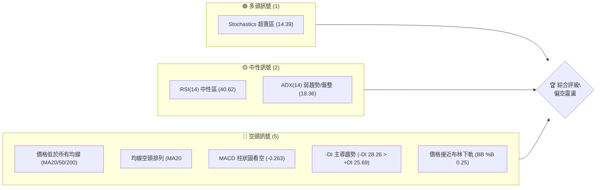
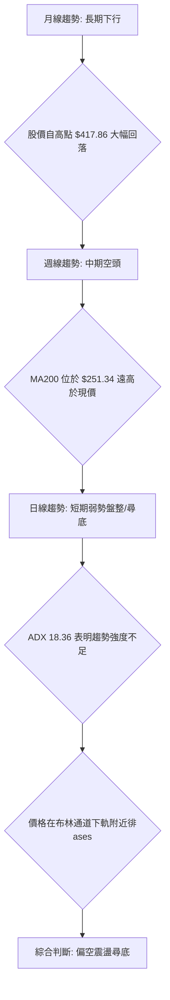
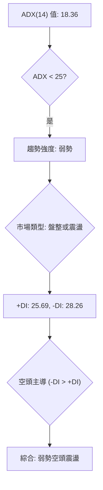
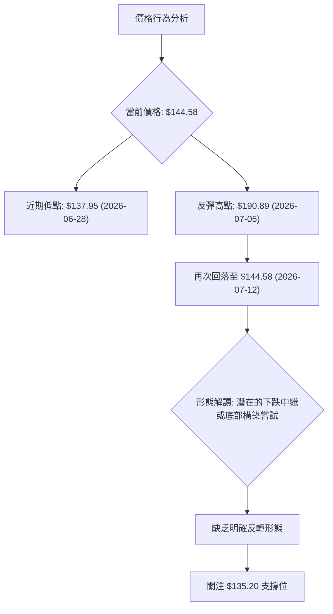
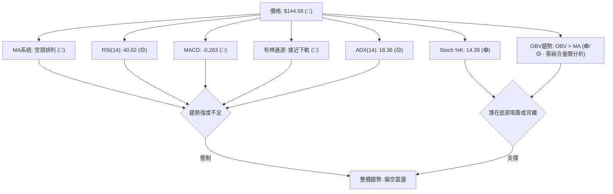
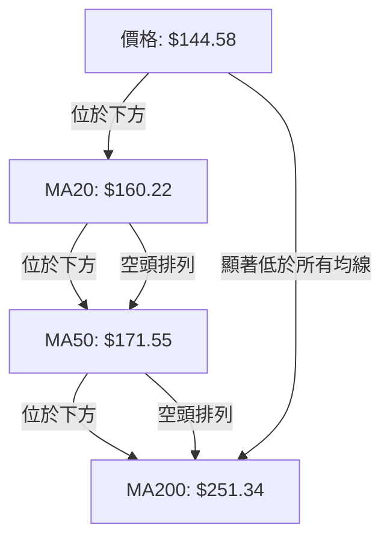
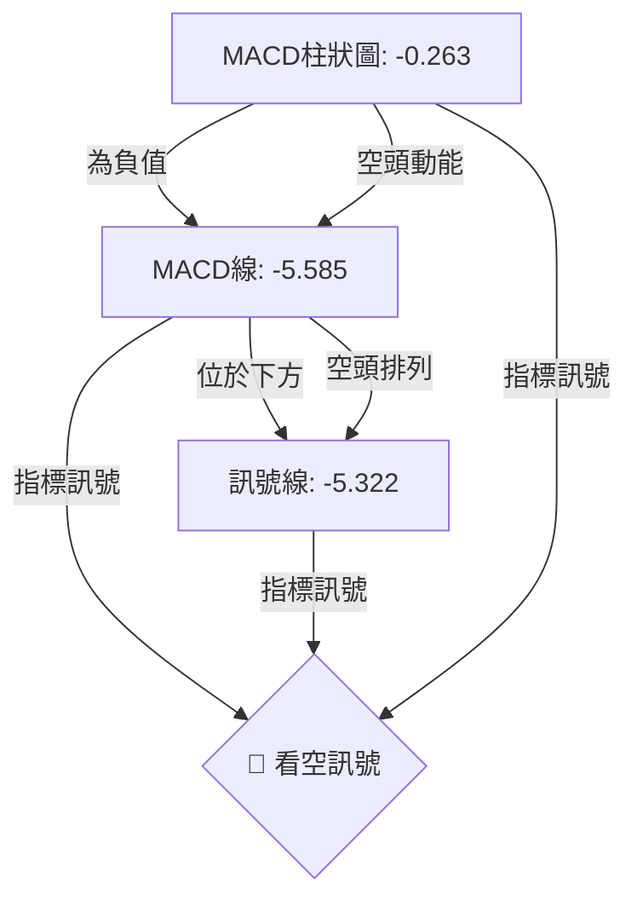
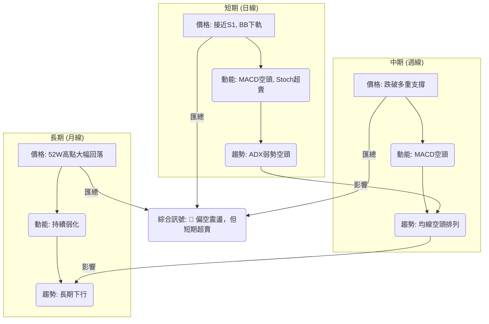
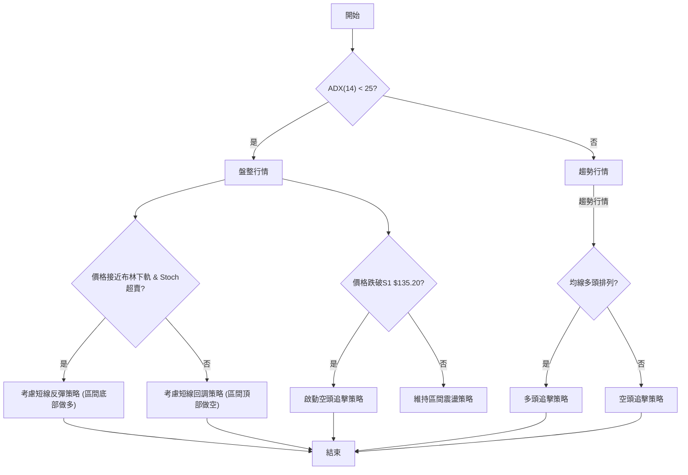
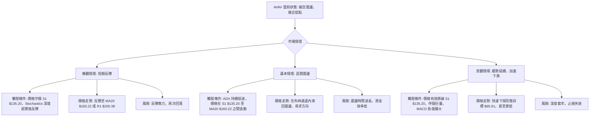

<details>
<summary>📊 靜態圖表 (點擊展開)</summary>

</details>

<html>
<head><meta charset="utf-8" /></head>
<body>
    <div style="height:500px; width:100%;">                        <script>window.PlotlyConfig = {MathJaxConfig: 'local'};</script>
        <script charset="utf-8" src="https://cdn.plot.ly/plotly-3.7.0.min.js" integrity="sha256-jvTGqxNp8AGWEcvNLVuKr+8j5dGe9Yw51LQkmDH+IYA=" crossorigin="anonymous"></script>                <div id="candlestick-chart" class="plotly-graph-div" style="height:100%; width:100%;"></div>            <script>                window.PLOTLYENV=window.PLOTLYENV || {};                                if (document.getElementById("candlestick-chart")) {                    Plotly.newPlot(                        "candlestick-chart",                        [{"close":{"dtype":"f8","bdata":"AAAAgMKpckAAAADgUdhyQAAAAOCj3HJAAAAAQDPTckAAAABACktzQAAAAIA9rnNAAAAAoEehdUAAAADgeoR2QAAAAIA9andAAAAAgBR+eEAAAACAFLJ4QAAAAAApeHlAAAAA4KPkeEAAAADgo4R4QAAAAKBHnXlAAAAAgBQaeUAAAABACgt4QAAAAKCZYXdAAAAAoHDpdUAAAADgo8B2QAAAAEDhkndAAAAAQOEydkAAAADgesR2QAAAAOCjqHdAAAAAgBTCd0AAAABA4b53QAAAAGBmyndAAAAAoEfddkAAAABgjx53QAAAAIAU\u002fnZAAAAAoEfRdkAAAABAM+t1QAAAACCug3RAAAAAYGaadEAAAACA6910QAAAAKBwgXRAAAAAwB41dEAAAAAA13dyQAAAACBcM3JAAAAAYI+6cUAAAABAM49xQAAAAEDhhnFAAAAAIK4fcUAAAADgowhxQAAAAADXT3FAAAAAIIVncUAAAABACnNxQAAAACBcd3FAAAAAwMwccEAAAABAM49wQAAAAOB6\u002fHBAAAAAQDP3cUAAAACAPWZxQAAAACCFp3FAAAAAYLiWcUAAAAAAAKhuQAAAAAAAOG9AAAAAAADgbUAAAACAPWptQAAAAMDMVG1AAAAAQDOjbEAAAACAFNZsQAAAAOBRYG5AAAAA4Hrsb0AAAABgZlJwQAAAAEAzS3BAAAAAAADgb0AAAADAzCRvQAAAAAAAgG5AAAAA4Ho8bkAAAABACgNwQAAAAGCPlnJAAAAA4HrQc0AAAAAgrudzQAAAACBcj3VAAAAAANfPdkAAAABA4Sp3QAAAAIDCvXZAAAAAwMzcd0AAAADAHql3QAAAAIDCjXhAAAAAgD2udEAAAACAFPpzQAAAAIDrgXNAAAAAAAA8c0AAAABguOpyQAAAAMAeWXNAAAAAQAovc0AAAAAghVNyQAAAAIA9ZnFAAAAAANffcEAAAABgj9ZxQAAAAMDMFHBAAAAAACmcbUAAAABAMxNwQAAAAKCZJXFAAAAAACl0cEAAAACgcG1uQAAAAADXY21AAAAAANd7bkAAAAAA129wQAAAACBcl3BAAAAAYLiacUAAAACAFIpwQAAAAKBHVXBAAAAAAABkcEAAAABACudvQAAAAIDrOXBAAAAAAACIb0AAAACAPQpqQAAAAKCZiWxAAAAAIFxPbEAAAACA65FrQAAAAKCZuWxAAAAAoEdpbEAAAACAPbJrQAAAACBc92lAAAAAACl8akAAAACAPeJpQAAAAAApfGpAAAAA4FHQa0AAAABAM\u002ftqQAAAAEAza2pAAAAAQAq3aEAAAADgo8hpQAAAAIDChWhAAAAA4KPgaEAAAADAHn1oQAAAAIDCDWdAAAAAQAofZkAAAACgmeFmQAAAAAAA8GZAAAAAIIULZ0AAAADgUahnQAAAAEAzW2dAAAAAgBReZ0AAAABgZjZmQAAAAEAKd2ZAAAAA4HpMaEAAAADgo1BoQAAAAKBwzWhAAAAAIK4\u002faUAAAACgcO1nQAAAACBcp2hAAAAAgD1CakAAAABAM0NqQAAAAMAePWlAAAAAwPWIaEAAAAAgrndoQAAAAEDhCmhAAAAAAADwZkAAAADgo2BoQAAAAEAKH2dAAAAA4FGIZkAAAACAFNZkQAAAAADXy2VAAAAAgMIFZUAAAACgRwllQAAAAGBmzmRAAAAAIIUbZUAAAAAgrh9kQAAAAOCjqGRAAAAAAADAY0AAAADgozBkQAAAACBcB2RAAAAAANd7ZEAAAABA4WJkQAAAACBcx2VAAAAA4FHIZkAAAADA9ahmQAAAAOB6zGpAAAAAIK7naUAAAABA4YJpQAAAAEAzi2lAAAAAQArvZ0AAAADAzIxpQAAAAKBwPWdAAAAAgMIVZ0AAAADgURBmQAAAAIDCnWVAAAAAgBT2ZkAAAABgj1JlQAAAAGBmfmVAAAAAYLjWZEAAAAAgheNkQAAAACCFM2VAAAAAYI\u002fqYkAAAABgj6JiQAAAAIDCxWFAAAAAgMIVYUAAAABgZj5hQAAAAAAAYGFAAAAAgD2iZEAAAACAFI5lQAAAAOB63GdAAAAAQOEaZkAAAADA9VBkQAAAAMD1uGNAAAAAwMyMYkAAAABgjxJiQA=="},"high":{"dtype":"f8","bdata":"AAAAgOvRckAAAACAwjFzQAAAACCu53JAAAAAACkQc0AAAACAwtFzQAAAAKCZyXNAAAAAANejdUAAAADgUbx2QAAAAMDM\u002fHdAAAAAwB6NeEAAAAAAKQB5QAAAAAAArHlAAAAAgMIdekAAAAAA1495QAAAAAAAsHlAAAAAYI+yeUAAAABgj5p5QAAAAAApNHhAAAAAIK4Ld0AAAABgZuJ2QAAAAGC4undAAAAA4KOkd0AAAAAAADB3QAAAAEAzw3dAAAAAYI9yeEAAAADAzCx4QAAAAMD1oHhAAAAAAACwd0AAAADAzHx3QAAAAAAAwHdAAAAAYI\u002f+dkAAAACgR5l2QAAAAMD17HVAAAAAYLjCdEAAAABA4VJ1QAAAAKCZ0XRAAAAAwPXodEAAAAAAKeBzQAAAACCFu3JAAAAAoJlFckAAAACgcAFyQAAAACBc43FAAAAAoJl5ckAAAADAzBhxQAAAAOB6oHFAAAAAAACAcUAAAABAM79xQAAAAAAAwHFAAAAAQAozcUAAAACAPaZwQAAAAGCPBnFAAAAAAABMckAAAABAM\u002fdxQAAAAOBR2HFAAAAAAAA4ckAAAAAgrttwQAAAAMD1mG9AAAAA4KMob0AAAABgZmZuQAAAAIDCtW1AAAAAoEcJbkAAAABguMZtQAAAAOB6pG5AAAAAANcfcEAAAACAwnVwQAAAAADXb3BAAAAAwB5dcEAAAAAAAOBvQAAAAEDhem9AAAAAYI+SbkAAAACAPR5wQAAAAADX53JAAAAAIK7jc0AAAAAAANB0QAAAAGBmNndAAAAAAAAod0AAAAAAAGh3QAAAAAAAcHdAAAAAIIXrd0AAAADAzPh3QAAAAAAAhHlAAAAA4KNgeEAAAACA66F1QAAAAEAKZ3RAAAAAAACsc0AAAABA4V5zQAAAAEAze3NAAAAA4KMQdEAAAAAAACBzQAAAAEAzS3JAAAAAAABQcUAAAACgcNlxQAAAAEAz93FAAAAAANcfcEAAAADgeixwQAAAAADXL3FAAAAAYLhecUAAAACgmb1wQAAAAMD1gG9AAAAAQDMTb0AAAAAgXKNwQAAAAOCj1HBAAAAA4FHccUAAAAAAANBxQAAAAAAAuHBAAAAAYGaecEAAAAAAAJBwQAAAACBcU3BAAAAAoJnBb0AAAAAAAPByQAAAAAAAoG1AAAAAgD3qbEAAAACgmWltQAAAACBcf21AAAAAAACwbEAAAADAzIxsQAAAAIDrsWpAAAAA4FFwa0AAAAAAAJhrQAAAAAAAAGtAAAAAwB7Va0AAAAAAAMBrQAAAAAAAwGpAAAAAIFw3akAAAAAAAHBqQAAAAKBwpWlAAAAAIIWTaUAAAACgmQlpQAAAAIDCPWhAAAAAwB5NZ0AAAAAAACBnQAAAAKCZ+WdAAAAAIK5HZ0AAAAAAAPhnQAAAAMD1eGdAAAAAoEehaEAAAAAAAHBnQAAAAOCjwGZAAAAAgD1aaEAAAAAgXD9pQAAAAOBRCGlAAAAAIFznaUAAAADAzBRqQAAAAEAz02hAAAAAwMzMa0AAAABgZmZrQAAAAADXK2pAAAAAQOF6aUAAAAAghRtpQAAAAOCjIGhAAAAAQAr3Z0AAAADgUXBoQAAAAEAze2hAAAAAIFw3Z0AAAAAAANBmQAAAAAAAQGZAAAAAwPXIZUAAAACgcD1lQAAAAEDhCmVAAAAAQAqvZUAAAACgcM1kQAAAACCu32RAAAAAYI9iZEAAAACA64lkQAAAAMD1QGRAAAAAACmMZEAAAADgo6hkQAAAAOBR0GVAAAAA4KNwZ0AAAAAAAOBmQAAAAOCjOGtAAAAAwPUIa0AAAACAFB5qQAAAAOBRkGlAAAAA4FEwaUAAAACgmbFpQAAAAADXG2lAAAAAQArHZ0AAAAAAKVxnQAAAAAAAMGZAAAAAoJkRZ0AAAAAA1\u002fNmQAAAAAAAAGZAAAAAQDNzZUAAAADAHoVlQAAAACCun2VAAAAAYI96ZEAAAACA6\u002fliQAAAAMAelWJAAAAAQDOjYUAAAAAA1+thQAAAAIAUXmJAAAAAAABQZkAAAADgo6hmQAAAAAApDGlAAAAAAAAAaEAAAABAMyNmQAAAAOB6HGVAAAAA4FEwY0AAAADAHo1iQA=="},"hovertemplate":"\u003cb\u003e%{x|%Y-%m-%d}\u003c\u002fb\u003e\u003cbr\u003e\u958b: $%{open:.2f}\u003cbr\u003e\u9ad8: $%{high:.2f}\u003cbr\u003e\u4f4e: $%{low:.2f}\u003cbr\u003e\u6536: $%{close:.2f}\u003cextra\u003e\u003c\u002fextra\u003e","low":{"dtype":"f8","bdata":"AAAA4Ho8ckAAAAAgXJdyQAAAAKCZYXFAAAAAAABgckAAAADA9RRzQAAAACCF+3JAAAAAAADgc0AAAAAgXNt1QAAAAMAe7XZAAAAA4HpQd0AAAAAAKSB4QAAAAADXX3hAAAAAAADAeEAAAACAFGJ4QAAAAAAp0HdAAAAAwPV4eEAAAAAAKZB3QAAAAMD1CHdAAAAAoHDRdUAAAAAAADB2QAAAAIDrkXZAAAAA4HqUdUAAAABAM392QAAAAIDrxXZAAAAAAABwd0AAAADAHrF3QAAAAAAAcHdAAAAAAACwdkAAAACgR3F2QAAAAKCZsXZAAAAAYGa+dUAAAADAzJx1QAAAACCuR3RAAAAAwB41c0AAAAAgrkd0QAAAAOCjQHRAAAAA4KMAdEAAAABAM1dyQAAAAOBRgHFAAAAAYLhqcUAAAACAPTpxQAAAAKBHTXFAAAAAANfvcEAAAADgekRwQAAAACCFA3FAAAAAQOHacEAAAADgURhxQAAAAIA9WnFAAAAAwPUUcEAAAADA9RxwQAAAAADXU3BAAAAAAADYcEAAAACA6xVxQAAAAKCZPXFAAAAAAABocUAAAABAM1tuQAAAAAAA8G1AAAAA4HpkbUAAAAAAKeRsQAAAAGBm\u002fmxAAAAAQApvbEAAAADgetRsQAAAAEAzA21AAAAAANfzbkAAAADgUYBvQAAAAAAAAHBAAAAAAACQb0AAAADAHvVuQAAAAAApVG5AAAAAoJn5bUAAAADAzDRuQAAAAAAAwHBAAAAAYI+WckAAAACA66VzQAAAAAAp8HRAAAAAAACgdUAAAAAgrpt2QAAAAOB6AHZAAAAAIIWndUAAAACgR912QAAAAAAA0HdAAAAAoHBRdEAAAAAAKeByQAAAAOB6SHNAAAAAAADAckAAAADgeqhyQAAAAAAAsHJAAAAAAADEckAAAADgowRyQAAAAAApTHFAAAAAAACYcEAAAADA9eBwQAAAAOCjwG5AAAAAAABAbUAAAAAAAEBuQAAAAAAAoG9AAAAA4FFYcEAAAAAghYttQAAAAMD1OG1AAAAAAABAbUAAAACgmYlvQAAAAIDCLXBAAAAAoEeNcEAAAABAM39wQAAAAOBR4G9AAAAAwMzEbkAAAACgmdFvQAAAAGC4Vm9AAAAAAABgbkAAAABACodoQAAAAIDrYWpAAAAAYGaua0AAAAAAAKBqQAAAACCFo2pAAAAAgOsRa0AAAADAzJxrQAAAAADX62hAAAAAIIWzaUAAAADgetRpQAAAAGCPymlAAAAAAClUakAAAACgR9FqQAAAAAAAoGlAAAAA4KMwaEAAAADgUZhoQAAAAKCZWWhAAAAAIIXLaEAAAACAwjVoQAAAAEAz+2ZAAAAAoHDtZUAAAABACgdmQAAAAGBmzmZAAAAAoEcJZkAAAADgehxnQAAAAEAzq2ZAAAAAQOH6ZkAAAAAA1\u002ftlQAAAACBc12VAAAAAAAAgZkAAAADgoxBoQAAAAIAURmhAAAAAYGa2aEAAAACAwkVnQAAAACCur2dAAAAAQAonaUAAAADA9chpQAAAACCul2hAAAAAgD1qaEAAAAAAKTRoQAAAAMD1MGdAAAAAYGa2ZkAAAADgUQhnQAAAAAAAAGdAAAAAoHA1ZkAAAAAAANBkQAAAAOCjwGRAAAAAAACwZEAAAAAghZNkQAAAAKCZyWNAAAAA4FGQZEAAAAAAAIBjQAAAAAAAAGRAAAAAIIWjY0AAAACAPcJjQAAAAOBRoGNAAAAAAACoY0AAAABAM9tjQAAAACCFg2RAAAAAAADwZUAAAACA6\u002fFlQAAAAKCZcWhAAAAAQAqHaEAAAADgesRoQAAAAEAzk2hAAAAAACmkZ0AAAAAA16NnQAAAAGBmpmZAAAAAgML9ZkAAAAAAACBlQAAAAAAAgGVAAAAAQDNDZUAAAACAwkVlQAAAAMDMLGVAAAAAgOuRZEAAAAAAAKBkQAAAAIAUfmRAAAAAIIXLYkAAAAAAAHhiQAAAACBct2FAAAAAYGbmYEAAAABACvdgQAAAAAAAYGFAAAAAoEe5Y0AAAAAAAIBkQAAAAEAzE2ZAAAAAIIULZkAAAADAzExkQAAAAOBRoGNAAAAAAClEYkAAAADgUeBhQA=="},"name":"\u50f9\u683c","open":{"dtype":"f8","bdata":"AAAAwB5VckAAAADgo+ByQAAAAKBHUXJAAAAAgML1ckAAAABguGZzQAAAAEDhOnNAAAAAYLjic0AAAABAMyd2QAAAAEDhZndAAAAAgD0WeEAAAAAgrmt4QAAAAOBR\u002fHhAAAAAYGaCeUAAAADAHt14QAAAAOCjhHhAAAAAACkYeUAAAAAAAGB5QAAAAAAAEHhAAAAAAADIdkAAAACAwpF2QAAAAIA98nZAAAAAwB5Zd0AAAAAAAOh2QAAAAEDhTndAAAAAANdLeEAAAABgZg54QAAAAKBwBXhAAAAAgMJ9d0AAAABAM0N3QAAAACCud3dAAAAAAAAkdkAAAAAAAFB2QAAAAMD17HVAAAAAYGb+c0AAAACAwiV1QAAAAEAKk3RAAAAAoJmBdEAAAABACs9zQAAAAOBRgHFAAAAA4FEwckAAAAAA179xQAAAAMDMfHFAAAAAYLhmckAAAADgo\u002fBwQAAAAOCjCHFAAAAAANdPcUAAAADgUbhxQAAAAEDhvnFAAAAAIK4vcUAAAADAzCxwQAAAAKBwqXBAAAAAAAAAcUAAAADgo+xxQAAAAEDhknFAAAAAgMLhcUAAAAAAAIRwQAAAAKBwbW5AAAAAAADobkAAAAAAABBuQAAAAMAeFW1AAAAAAABgbUAAAADgUShtQAAAAMDMBG1AAAAAAABAb0AAAADAHq1vQAAAACBcT3BAAAAAwB5dcEAAAABAM3tvQAAAAKBwXW9AAAAAYI+SbkAAAABgZg5vQAAAAMAeyXBAAAAA4KOcckAAAAAgru9zQAAAAAAp4HVAAAAAwB7xdUAAAABAMxt3QAAAAADXZ3dAAAAAQOFedkAAAACA65l3QAAAAOBR5HdAAAAAAAAgd0AAAACA66F1QAAAAOCjPHRAAAAA4HqYc0AAAADAHjFzQAAAACBc43JAAAAAwMzEc0AAAAAgrhNzQAAAAKCZ\u002fXFAAAAAIIX\u002fcEAAAADgoxhxQAAAAAAA4HFAAAAAACnkbkAAAAAgrtduQAAAAIDrCXBAAAAAgMItcUAAAABAM7twQAAAAMD1gG9AAAAAACmUbUAAAABgZt5vQAAAAEDhinBAAAAAYI\u002facEAAAACgR41xQAAAAIDrCXBAAAAAYGaGb0AAAACAwo1wQAAAAAApEHBAAAAAYGZ2b0AAAAAA18NxQAAAAKBw1WpAAAAAAAAAbEAAAACAFP5sQAAAAAAp1GpAAAAAAACwbEAAAACAwhVsQAAAAAAAkGlAAAAAYLiWakAAAACAPaJqQAAAAOCjkGpAAAAA4HqcakAAAAAAAIBrQAAAAEAzQ2pAAAAAwB7taUAAAACgcBVpQAAAAAAAgGlAAAAAgD0SaUAAAACgmWFoQAAAAAApBGhAAAAAwB5NZ0AAAAAA13tmQAAAAOB6lGdAAAAAANcTZkAAAAAAACBnQAAAAKCZUWdAAAAAIIVTaEAAAAAAAHBnQAAAAAAAOGZAAAAA4KMgZkAAAAAAAOBoQAAAAKBHqWhAAAAAgOtpaUAAAACAwpVpQAAAAIDr2WdAAAAAQDNzaUAAAADgURhrQAAAAOB6\u002fGlAAAAA4KN4aUAAAAAAAHBoQAAAAOCjIGhAAAAAoHD1Z0AAAABgZj5nQAAAAKCZYWhAAAAAIFw3Z0AAAACgmcFmQAAAAAAp3GRAAAAAwPXIZUAAAACA6\u002fFkQAAAAAAAmGRAAAAAAADgZEAAAACgcM1kQAAAAAAAAGRAAAAAgOtJZEAAAAAghcNjQAAAAAAAIGRAAAAAQDMrZEAAAADgoyBkQAAAAMAehWRAAAAAgOvZZkAAAAAAANBmQAAAAIAU\u002fmhAAAAAQOECa0AAAACAwlVpQAAAAMDMfGlAAAAA4FEwaUAAAABgZt5nQAAAAKBH6WhAAAAA4FFgZ0AAAADgowBnQAAAAOB6vGVAAAAAoHCFZUAAAAAA1\u002fNmQAAAAMAezWVAAAAAYI9KZUAAAAAAAMBkQAAAAKCZWWVAAAAAAAAYZEAAAADgo4BiQAAAAIDreWJAAAAAQDOjYUAAAABACvdgQAAAAEAz82FAAAAAAAAQZkAAAAAAAEBlQAAAAAAAiGZAAAAAYLjGZ0AAAAAAAOBlQAAAAKBwtWRAAAAAAAAgY0AAAADgo2BiQA=="},"x":["2025-09-23T00:00:00-04:00","2025-09-24T00:00:00-04:00","2025-09-25T00:00:00-04:00","2025-09-26T00:00:00-04:00","2025-09-29T00:00:00-04:00","2025-09-30T00:00:00-04:00","2025-10-01T00:00:00-04:00","2025-10-02T00:00:00-04:00","2025-10-03T00:00:00-04:00","2025-10-06T00:00:00-04:00","2025-10-07T00:00:00-04:00","2025-10-08T00:00:00-04:00","2025-10-09T00:00:00-04:00","2025-10-10T00:00:00-04:00","2025-10-13T00:00:00-04:00","2025-10-14T00:00:00-04:00","2025-10-15T00:00:00-04:00","2025-10-16T00:00:00-04:00","2025-10-17T00:00:00-04:00","2025-10-20T00:00:00-04:00","2025-10-21T00:00:00-04:00","2025-10-22T00:00:00-04:00","2025-10-23T00:00:00-04:00","2025-10-24T00:00:00-04:00","2025-10-27T00:00:00-04:00","2025-10-28T00:00:00-04:00","2025-10-29T00:00:00-04:00","2025-10-30T00:00:00-04:00","2025-10-31T00:00:00-04:00","2025-11-03T00:00:00-05:00","2025-11-04T00:00:00-05:00","2025-11-05T00:00:00-05:00","2025-11-06T00:00:00-05:00","2025-11-07T00:00:00-05:00","2025-11-10T00:00:00-05:00","2025-11-11T00:00:00-05:00","2025-11-12T00:00:00-05:00","2025-11-13T00:00:00-05:00","2025-11-14T00:00:00-05:00","2025-11-17T00:00:00-05:00","2025-11-18T00:00:00-05:00","2025-11-19T00:00:00-05:00","2025-11-20T00:00:00-05:00","2025-11-21T00:00:00-05:00","2025-11-24T00:00:00-05:00","2025-11-25T00:00:00-05:00","2025-11-26T00:00:00-05:00","2025-11-28T00:00:00-05:00","2025-12-01T00:00:00-05:00","2025-12-02T00:00:00-05:00","2025-12-03T00:00:00-05:00","2025-12-04T00:00:00-05:00","2025-12-05T00:00:00-05:00","2025-12-08T00:00:00-05:00","2025-12-09T00:00:00-05:00","2025-12-10T00:00:00-05:00","2025-12-11T00:00:00-05:00","2025-12-12T00:00:00-05:00","2025-12-15T00:00:00-05:00","2025-12-16T00:00:00-05:00","2025-12-17T00:00:00-05:00","2025-12-18T00:00:00-05:00","2025-12-19T00:00:00-05:00","2025-12-22T00:00:00-05:00","2025-12-23T00:00:00-05:00","2025-12-24T00:00:00-05:00","2025-12-26T00:00:00-05:00","2025-12-29T00:00:00-05:00","2025-12-30T00:00:00-05:00","2025-12-31T00:00:00-05:00","2026-01-02T00:00:00-05:00","2026-01-05T00:00:00-05:00","2026-01-06T00:00:00-05:00","2026-01-07T00:00:00-05:00","2026-01-08T00:00:00-05:00","2026-01-09T00:00:00-05:00","2026-01-12T00:00:00-05:00","2026-01-13T00:00:00-05:00","2026-01-14T00:00:00-05:00","2026-01-15T00:00:00-05:00","2026-01-16T00:00:00-05:00","2026-01-20T00:00:00-05:00","2026-01-21T00:00:00-05:00","2026-01-22T00:00:00-05:00","2026-01-23T00:00:00-05:00","2026-01-26T00:00:00-05:00","2026-01-27T00:00:00-05:00","2026-01-28T00:00:00-05:00","2026-01-29T00:00:00-05:00","2026-01-30T00:00:00-05:00","2026-02-02T00:00:00-05:00","2026-02-03T00:00:00-05:00","2026-02-04T00:00:00-05:00","2026-02-05T00:00:00-05:00","2026-02-06T00:00:00-05:00","2026-02-09T00:00:00-05:00","2026-02-10T00:00:00-05:00","2026-02-11T00:00:00-05:00","2026-02-12T00:00:00-05:00","2026-02-13T00:00:00-05:00","2026-02-17T00:00:00-05:00","2026-02-18T00:00:00-05:00","2026-02-19T00:00:00-05:00","2026-02-20T00:00:00-05:00","2026-02-23T00:00:00-05:00","2026-02-24T00:00:00-05:00","2026-02-25T00:00:00-05:00","2026-02-26T00:00:00-05:00","2026-02-27T00:00:00-05:00","2026-03-02T00:00:00-05:00","2026-03-03T00:00:00-05:00","2026-03-04T00:00:00-05:00","2026-03-05T00:00:00-05:00","2026-03-06T00:00:00-05:00","2026-03-09T00:00:00-04:00","2026-03-10T00:00:00-04:00","2026-03-11T00:00:00-04:00","2026-03-12T00:00:00-04:00","2026-03-13T00:00:00-04:00","2026-03-16T00:00:00-04:00","2026-03-17T00:00:00-04:00","2026-03-18T00:00:00-04:00","2026-03-19T00:00:00-04:00","2026-03-20T00:00:00-04:00","2026-03-23T00:00:00-04:00","2026-03-24T00:00:00-04:00","2026-03-25T00:00:00-04:00","2026-03-26T00:00:00-04:00","2026-03-27T00:00:00-04:00","2026-03-30T00:00:00-04:00","2026-03-31T00:00:00-04:00","2026-04-01T00:00:00-04:00","2026-04-02T00:00:00-04:00","2026-04-06T00:00:00-04:00","2026-04-07T00:00:00-04:00","2026-04-08T00:00:00-04:00","2026-04-09T00:00:00-04:00","2026-04-10T00:00:00-04:00","2026-04-13T00:00:00-04:00","2026-04-14T00:00:00-04:00","2026-04-15T00:00:00-04:00","2026-04-16T00:00:00-04:00","2026-04-17T00:00:00-04:00","2026-04-20T00:00:00-04:00","2026-04-21T00:00:00-04:00","2026-04-22T00:00:00-04:00","2026-04-23T00:00:00-04:00","2026-04-24T00:00:00-04:00","2026-04-27T00:00:00-04:00","2026-04-28T00:00:00-04:00","2026-04-29T00:00:00-04:00","2026-04-30T00:00:00-04:00","2026-05-01T00:00:00-04:00","2026-05-04T00:00:00-04:00","2026-05-05T00:00:00-04:00","2026-05-06T00:00:00-04:00","2026-05-07T00:00:00-04:00","2026-05-08T00:00:00-04:00","2026-05-11T00:00:00-04:00","2026-05-12T00:00:00-04:00","2026-05-13T00:00:00-04:00","2026-05-14T00:00:00-04:00","2026-05-15T00:00:00-04:00","2026-05-18T00:00:00-04:00","2026-05-19T00:00:00-04:00","2026-05-20T00:00:00-04:00","2026-05-21T00:00:00-04:00","2026-05-22T00:00:00-04:00","2026-05-26T00:00:00-04:00","2026-05-27T00:00:00-04:00","2026-05-28T00:00:00-04:00","2026-05-29T00:00:00-04:00","2026-06-01T00:00:00-04:00","2026-06-02T00:00:00-04:00","2026-06-03T00:00:00-04:00","2026-06-04T00:00:00-04:00","2026-06-05T00:00:00-04:00","2026-06-08T00:00:00-04:00","2026-06-09T00:00:00-04:00","2026-06-10T00:00:00-04:00","2026-06-11T00:00:00-04:00","2026-06-12T00:00:00-04:00","2026-06-15T00:00:00-04:00","2026-06-16T00:00:00-04:00","2026-06-17T00:00:00-04:00","2026-06-18T00:00:00-04:00","2026-06-22T00:00:00-04:00","2026-06-23T00:00:00-04:00","2026-06-24T00:00:00-04:00","2026-06-25T00:00:00-04:00","2026-06-26T00:00:00-04:00","2026-06-29T00:00:00-04:00","2026-06-30T00:00:00-04:00","2026-07-01T00:00:00-04:00","2026-07-02T00:00:00-04:00","2026-07-06T00:00:00-04:00","2026-07-07T00:00:00-04:00","2026-07-08T00:00:00-04:00","2026-07-09T00:00:00-04:00","2026-07-10T00:00:00-04:00"],"type":"candlestick"},{"hovertemplate":"MA30: $%{y:.2f}\u003cextra\u003e\u003c\u002fextra\u003e","line":{"color":"#2196F3","dash":"dash","width":2},"mode":"lines","name":"MA30","x":["2025-09-23T00:00:00-04:00","2025-09-24T00:00:00-04:00","2025-09-25T00:00:00-04:00","2025-09-26T00:00:00-04:00","2025-09-29T00:00:00-04:00","2025-09-30T00:00:00-04:00","2025-10-01T00:00:00-04:00","2025-10-02T00:00:00-04:00","2025-10-03T00:00:00-04:00","2025-10-06T00:00:00-04:00","2025-10-07T00:00:00-04:00","2025-10-08T00:00:00-04:00","2025-10-09T00:00:00-04:00","2025-10-10T00:00:00-04:00","2025-10-13T00:00:00-04:00","2025-10-14T00:00:00-04:00","2025-10-15T00:00:00-04:00","2025-10-16T00:00:00-04:00","2025-10-17T00:00:00-04:00","2025-10-20T00:00:00-04:00","2025-10-21T00:00:00-04:00","2025-10-22T00:00:00-04:00","2025-10-23T00:00:00-04:00","2025-10-24T00:00:00-04:00","2025-10-27T00:00:00-04:00","2025-10-28T00:00:00-04:00","2025-10-29T00:00:00-04:00","2025-10-30T00:00:00-04:00","2025-10-31T00:00:00-04:00","2025-11-03T00:00:00-05:00","2025-11-04T00:00:00-05:00","2025-11-05T00:00:00-05:00","2025-11-06T00:00:00-05:00","2025-11-07T00:00:00-05:00","2025-11-10T00:00:00-05:00","2025-11-11T00:00:00-05:00","2025-11-12T00:00:00-05:00","2025-11-13T00:00:00-05:00","2025-11-14T00:00:00-05:00","2025-11-17T00:00:00-05:00","2025-11-18T00:00:00-05:00","2025-11-19T00:00:00-05:00","2025-11-20T00:00:00-05:00","2025-11-21T00:00:00-05:00","2025-11-24T00:00:00-05:00","2025-11-25T00:00:00-05:00","2025-11-26T00:00:00-05:00","2025-11-28T00:00:00-05:00","2025-12-01T00:00:00-05:00","2025-12-02T00:00:00-05:00","2025-12-03T00:00:00-05:00","2025-12-04T00:00:00-05:00","2025-12-05T00:00:00-05:00","2025-12-08T00:00:00-05:00","2025-12-09T00:00:00-05:00","2025-12-10T00:00:00-05:00","2025-12-11T00:00:00-05:00","2025-12-12T00:00:00-05:00","2025-12-15T00:00:00-05:00","2025-12-16T00:00:00-05:00","2025-12-17T00:00:00-05:00","2025-12-18T00:00:00-05:00","2025-12-19T00:00:00-05:00","2025-12-22T00:00:00-05:00","2025-12-23T00:00:00-05:00","2025-12-24T00:00:00-05:00","2025-12-26T00:00:00-05:00","2025-12-29T00:00:00-05:00","2025-12-30T00:00:00-05:00","2025-12-31T00:00:00-05:00","2026-01-02T00:00:00-05:00","2026-01-05T00:00:00-05:00","2026-01-06T00:00:00-05:00","2026-01-07T00:00:00-05:00","2026-01-08T00:00:00-05:00","2026-01-09T00:00:00-05:00","2026-01-12T00:00:00-05:00","2026-01-13T00:00:00-05:00","2026-01-14T00:00:00-05:00","2026-01-15T00:00:00-05:00","2026-01-16T00:00:00-05:00","2026-01-20T00:00:00-05:00","2026-01-21T00:00:00-05:00","2026-01-22T00:00:00-05:00","2026-01-23T00:00:00-05:00","2026-01-26T00:00:00-05:00","2026-01-27T00:00:00-05:00","2026-01-28T00:00:00-05:00","2026-01-29T00:00:00-05:00","2026-01-30T00:00:00-05:00","2026-02-02T00:00:00-05:00","2026-02-03T00:00:00-05:00","2026-02-04T00:00:00-05:00","2026-02-05T00:00:00-05:00","2026-02-06T00:00:00-05:00","2026-02-09T00:00:00-05:00","2026-02-10T00:00:00-05:00","2026-02-11T00:00:00-05:00","2026-02-12T00:00:00-05:00","2026-02-13T00:00:00-05:00","2026-02-17T00:00:00-05:00","2026-02-18T00:00:00-05:00","2026-02-19T00:00:00-05:00","2026-02-20T00:00:00-05:00","2026-02-23T00:00:00-05:00","2026-02-24T00:00:00-05:00","2026-02-25T00:00:00-05:00","2026-02-26T00:00:00-05:00","2026-02-27T00:00:00-05:00","2026-03-02T00:00:00-05:00","2026-03-03T00:00:00-05:00","2026-03-04T00:00:00-05:00","2026-03-05T00:00:00-05:00","2026-03-06T00:00:00-05:00","2026-03-09T00:00:00-04:00","2026-03-10T00:00:00-04:00","2026-03-11T00:00:00-04:00","2026-03-12T00:00:00-04:00","2026-03-13T00:00:00-04:00","2026-03-16T00:00:00-04:00","2026-03-17T00:00:00-04:00","2026-03-18T00:00:00-04:00","2026-03-19T00:00:00-04:00","2026-03-20T00:00:00-04:00","2026-03-23T00:00:00-04:00","2026-03-24T00:00:00-04:00","2026-03-25T00:00:00-04:00","2026-03-26T00:00:00-04:00","2026-03-27T00:00:00-04:00","2026-03-30T00:00:00-04:00","2026-03-31T00:00:00-04:00","2026-04-01T00:00:00-04:00","2026-04-02T00:00:00-04:00","2026-04-06T00:00:00-04:00","2026-04-07T00:00:00-04:00","2026-04-08T00:00:00-04:00","2026-04-09T00:00:00-04:00","2026-04-10T00:00:00-04:00","2026-04-13T00:00:00-04:00","2026-04-14T00:00:00-04:00","2026-04-15T00:00:00-04:00","2026-04-16T00:00:00-04:00","2026-04-17T00:00:00-04:00","2026-04-20T00:00:00-04:00","2026-04-21T00:00:00-04:00","2026-04-22T00:00:00-04:00","2026-04-23T00:00:00-04:00","2026-04-24T00:00:00-04:00","2026-04-27T00:00:00-04:00","2026-04-28T00:00:00-04:00","2026-04-29T00:00:00-04:00","2026-04-30T00:00:00-04:00","2026-05-01T00:00:00-04:00","2026-05-04T00:00:00-04:00","2026-05-05T00:00:00-04:00","2026-05-06T00:00:00-04:00","2026-05-07T00:00:00-04:00","2026-05-08T00:00:00-04:00","2026-05-11T00:00:00-04:00","2026-05-12T00:00:00-04:00","2026-05-13T00:00:00-04:00","2026-05-14T00:00:00-04:00","2026-05-15T00:00:00-04:00","2026-05-18T00:00:00-04:00","2026-05-19T00:00:00-04:00","2026-05-20T00:00:00-04:00","2026-05-21T00:00:00-04:00","2026-05-22T00:00:00-04:00","2026-05-26T00:00:00-04:00","2026-05-27T00:00:00-04:00","2026-05-28T00:00:00-04:00","2026-05-29T00:00:00-04:00","2026-06-01T00:00:00-04:00","2026-06-02T00:00:00-04:00","2026-06-03T00:00:00-04:00","2026-06-04T00:00:00-04:00","2026-06-05T00:00:00-04:00","2026-06-08T00:00:00-04:00","2026-06-09T00:00:00-04:00","2026-06-10T00:00:00-04:00","2026-06-11T00:00:00-04:00","2026-06-12T00:00:00-04:00","2026-06-15T00:00:00-04:00","2026-06-16T00:00:00-04:00","2026-06-17T00:00:00-04:00","2026-06-18T00:00:00-04:00","2026-06-22T00:00:00-04:00","2026-06-23T00:00:00-04:00","2026-06-24T00:00:00-04:00","2026-06-25T00:00:00-04:00","2026-06-26T00:00:00-04:00","2026-06-29T00:00:00-04:00","2026-06-30T00:00:00-04:00","2026-07-01T00:00:00-04:00","2026-07-02T00:00:00-04:00","2026-07-06T00:00:00-04:00","2026-07-07T00:00:00-04:00","2026-07-08T00:00:00-04:00","2026-07-09T00:00:00-04:00","2026-07-10T00:00:00-04:00"],"y":{"dtype":"f8","bdata":"AAAAAAAA+H8AAAAAAAD4fwAAAAAAAPh\u002fAAAAAAAA+H8AAAAAAAD4fwAAAAAAAPh\u002fAAAAAAAA+H8AAAAAAAD4fwAAAAAAAPh\u002fAAAAAAAA+H8AAAAAAAD4fwAAAAAAAPh\u002fAAAAAAAA+H8AAAAAAAD4fwAAAAAAAPh\u002fAAAAAAAA+H8AAAAAAAD4fwAAAAAAAPh\u002fAAAAAAAA+H8AAAAAAAD4fwAAAAAAAPh\u002fAAAAAAAA+H8AAAAAAAD4fwAAAAAAAPh\u002fAAAAAAAA+H8AAAAAAAD4fwAAAAAAAPh\u002fAAAAAAAA+H8AAAAAAAD4f97d3a3Vs3ZAzczMDEnXdkAzMzPDg\u002fF2QERERLSd\u002f3ZAMzMzE8oOd0C8u7v7Nxx3QImIiDhCI3dAmpmZuR4Xd0Crqqq6kPR2QAAAAMARyHZAzczMHFqOdkDNzMy8dFF2QERERBSuDXZA7+7unmHLdUARERHBg4t1QKuqqqqqRHVAiYiIOPsCdUBERET0tsp0QAAAAHA9mHRAIiIigsBmdEC8u7tr5zF0QO\u002fu7s6w+XNAiYiIaJHVc0AAAACQwqdzQN7d3c2FdHNAmpmZmeA\u002fc0CrqqpKDPhyQERERBQ8snJA7+7ujpduckCamZmJzyZyQDMzMzPB33FAZmZmZjuXcUCJiIgIOldxQBEREanGKXFAIiIisisCcUDe3d39YttwQDMzMwNyt3BA3t3dDQKTcECamZkZS3pwQM3MzFwdYXBAVVVVXdZKcEBERETMoT1wQKuqqiKwRnBAzczM5KVdcEBEREQ8JnZwQAAAAGhmmnBAzczMRIvIcEC8u7uzVvlwQFVVVR1aJnFAd3d3P3xocUAiIiIqFaVxQGZmZp6o5XFAiYiIoNP8cUCrqqpC0hJyQBEREXmiInJAzczMZK0wckC8u7sjTU9yQImIiJA0b3JAvLu7o3CTckAzMzPrUbJyQLy7u+OlyXJAREREvHTfckDv7u7Wo\u002fxyQGZmZuZCBHNAMzMzq2P6ckBVVVVdSPhyQDMzMwuQ\u002f3JAd3d3z\u002fcDc0CamZl56QBzQO\u002fu7g4t\u002fHJAzczMZDv9ckCamZnR2wBzQLy7u5PR73JAq6qqwvXcckCJiIhwPcByQAAAACijk3JAERERuddcckDe3d2VQx9yQCIiIlqr53FA3t3ddZOicUARERGpxkdxQM3MzLwC8HBAIiIiSlO4cEBmZmbufINwQCIiIoKVV3BAERERCawscEBmZmYuawFwQAAAAEA1lm9AiYiIiM8wb0B3d3fX6tRuQM3MzCz5jW5AiYiI+FNbbkBERER0IRFuQLy7uwse4G1AERERwVi2bUB3d3d3BYBtQHd3d9ejLG1AmpmZCR7obEBERESkcLVsQERERORef2xAvLu7uwI4bECamZnJveJrQO\u002fu7j5Ri2tAAAAAIIUja0BmZmYWINNqQGZmZhaug2pAAAAAcFkzakDv7u5OqeBpQImIiEhvi2lAVVVVpbdNaUAzMzNT\u002fz5pQHd3dxcgH2lAERERsQAFaUB3d3eH6+VoQO\u002fu7r4tw2hAq6qqis+waEB3d3d3k6RoQImIiDhenmhAERERYbqNaECJiIiIpIFoQO\u002fu7s7MbGhAq6qqejBDaEAAAACA+CxoQAAAAADVEGhAERERQTX+Z0BmZmZG\u002fdNnQBEREbG5vGdAAAAAUNSbZ0BVVVU1Xn5nQImIiHgwa2dAZmZm5oliZ0DNzMwMAktnQLy7uwuQN2dAIiIiAnIbZ0BEREQk2\u002f1mQKuqqhp24WZAREREdNrIZkAzMzPzRLlmQAAAANBps2ZAMzMzg3mmZkC8u7sbWphmQLy7u\u002ftiqWZAVVVVlfyuZkBmZmZWgLxmQDMzM5MYxGZAiYiIiEGwZkDNzMwMLapmQGZmZrYemWZAMzMzI7+MZkAAAAAQPHhmQGZmZtaHY2ZAiYiIuLtjZkCJiIj4qUlmQERERKTGO2ZAd3d3l1ItZkB3d3dHxS1mQLy7u3uxKGZAAAAAULgWZkBERES0OgJmQAAAAGBX6GVAZmZmFgTGZUARERGhcK1lQKuqqiprkWVAAAAAwPWYZUAzMzOjm6RlQM3MzNxPxWVAmpmZiSXTZUDv7u6ejNJlQM3MzKwAwWVAMzMzo+KcZUB3d3cXvXVlQA=="},"type":"scatter"},{"hovertemplate":"MA60: $%{y:.2f}\u003cextra\u003e\u003c\u002fextra\u003e","line":{"color":"#9C27B0","dash":"dash","width":2},"mode":"lines","name":"MA60","x":["2025-09-23T00:00:00-04:00","2025-09-24T00:00:00-04:00","2025-09-25T00:00:00-04:00","2025-09-26T00:00:00-04:00","2025-09-29T00:00:00-04:00","2025-09-30T00:00:00-04:00","2025-10-01T00:00:00-04:00","2025-10-02T00:00:00-04:00","2025-10-03T00:00:00-04:00","2025-10-06T00:00:00-04:00","2025-10-07T00:00:00-04:00","2025-10-08T00:00:00-04:00","2025-10-09T00:00:00-04:00","2025-10-10T00:00:00-04:00","2025-10-13T00:00:00-04:00","2025-10-14T00:00:00-04:00","2025-10-15T00:00:00-04:00","2025-10-16T00:00:00-04:00","2025-10-17T00:00:00-04:00","2025-10-20T00:00:00-04:00","2025-10-21T00:00:00-04:00","2025-10-22T00:00:00-04:00","2025-10-23T00:00:00-04:00","2025-10-24T00:00:00-04:00","2025-10-27T00:00:00-04:00","2025-10-28T00:00:00-04:00","2025-10-29T00:00:00-04:00","2025-10-30T00:00:00-04:00","2025-10-31T00:00:00-04:00","2025-11-03T00:00:00-05:00","2025-11-04T00:00:00-05:00","2025-11-05T00:00:00-05:00","2025-11-06T00:00:00-05:00","2025-11-07T00:00:00-05:00","2025-11-10T00:00:00-05:00","2025-11-11T00:00:00-05:00","2025-11-12T00:00:00-05:00","2025-11-13T00:00:00-05:00","2025-11-14T00:00:00-05:00","2025-11-17T00:00:00-05:00","2025-11-18T00:00:00-05:00","2025-11-19T00:00:00-05:00","2025-11-20T00:00:00-05:00","2025-11-21T00:00:00-05:00","2025-11-24T00:00:00-05:00","2025-11-25T00:00:00-05:00","2025-11-26T00:00:00-05:00","2025-11-28T00:00:00-05:00","2025-12-01T00:00:00-05:00","2025-12-02T00:00:00-05:00","2025-12-03T00:00:00-05:00","2025-12-04T00:00:00-05:00","2025-12-05T00:00:00-05:00","2025-12-08T00:00:00-05:00","2025-12-09T00:00:00-05:00","2025-12-10T00:00:00-05:00","2025-12-11T00:00:00-05:00","2025-12-12T00:00:00-05:00","2025-12-15T00:00:00-05:00","2025-12-16T00:00:00-05:00","2025-12-17T00:00:00-05:00","2025-12-18T00:00:00-05:00","2025-12-19T00:00:00-05:00","2025-12-22T00:00:00-05:00","2025-12-23T00:00:00-05:00","2025-12-24T00:00:00-05:00","2025-12-26T00:00:00-05:00","2025-12-29T00:00:00-05:00","2025-12-30T00:00:00-05:00","2025-12-31T00:00:00-05:00","2026-01-02T00:00:00-05:00","2026-01-05T00:00:00-05:00","2026-01-06T00:00:00-05:00","2026-01-07T00:00:00-05:00","2026-01-08T00:00:00-05:00","2026-01-09T00:00:00-05:00","2026-01-12T00:00:00-05:00","2026-01-13T00:00:00-05:00","2026-01-14T00:00:00-05:00","2026-01-15T00:00:00-05:00","2026-01-16T00:00:00-05:00","2026-01-20T00:00:00-05:00","2026-01-21T00:00:00-05:00","2026-01-22T00:00:00-05:00","2026-01-23T00:00:00-05:00","2026-01-26T00:00:00-05:00","2026-01-27T00:00:00-05:00","2026-01-28T00:00:00-05:00","2026-01-29T00:00:00-05:00","2026-01-30T00:00:00-05:00","2026-02-02T00:00:00-05:00","2026-02-03T00:00:00-05:00","2026-02-04T00:00:00-05:00","2026-02-05T00:00:00-05:00","2026-02-06T00:00:00-05:00","2026-02-09T00:00:00-05:00","2026-02-10T00:00:00-05:00","2026-02-11T00:00:00-05:00","2026-02-12T00:00:00-05:00","2026-02-13T00:00:00-05:00","2026-02-17T00:00:00-05:00","2026-02-18T00:00:00-05:00","2026-02-19T00:00:00-05:00","2026-02-20T00:00:00-05:00","2026-02-23T00:00:00-05:00","2026-02-24T00:00:00-05:00","2026-02-25T00:00:00-05:00","2026-02-26T00:00:00-05:00","2026-02-27T00:00:00-05:00","2026-03-02T00:00:00-05:00","2026-03-03T00:00:00-05:00","2026-03-04T00:00:00-05:00","2026-03-05T00:00:00-05:00","2026-03-06T00:00:00-05:00","2026-03-09T00:00:00-04:00","2026-03-10T00:00:00-04:00","2026-03-11T00:00:00-04:00","2026-03-12T00:00:00-04:00","2026-03-13T00:00:00-04:00","2026-03-16T00:00:00-04:00","2026-03-17T00:00:00-04:00","2026-03-18T00:00:00-04:00","2026-03-19T00:00:00-04:00","2026-03-20T00:00:00-04:00","2026-03-23T00:00:00-04:00","2026-03-24T00:00:00-04:00","2026-03-25T00:00:00-04:00","2026-03-26T00:00:00-04:00","2026-03-27T00:00:00-04:00","2026-03-30T00:00:00-04:00","2026-03-31T00:00:00-04:00","2026-04-01T00:00:00-04:00","2026-04-02T00:00:00-04:00","2026-04-06T00:00:00-04:00","2026-04-07T00:00:00-04:00","2026-04-08T00:00:00-04:00","2026-04-09T00:00:00-04:00","2026-04-10T00:00:00-04:00","2026-04-13T00:00:00-04:00","2026-04-14T00:00:00-04:00","2026-04-15T00:00:00-04:00","2026-04-16T00:00:00-04:00","2026-04-17T00:00:00-04:00","2026-04-20T00:00:00-04:00","2026-04-21T00:00:00-04:00","2026-04-22T00:00:00-04:00","2026-04-23T00:00:00-04:00","2026-04-24T00:00:00-04:00","2026-04-27T00:00:00-04:00","2026-04-28T00:00:00-04:00","2026-04-29T00:00:00-04:00","2026-04-30T00:00:00-04:00","2026-05-01T00:00:00-04:00","2026-05-04T00:00:00-04:00","2026-05-05T00:00:00-04:00","2026-05-06T00:00:00-04:00","2026-05-07T00:00:00-04:00","2026-05-08T00:00:00-04:00","2026-05-11T00:00:00-04:00","2026-05-12T00:00:00-04:00","2026-05-13T00:00:00-04:00","2026-05-14T00:00:00-04:00","2026-05-15T00:00:00-04:00","2026-05-18T00:00:00-04:00","2026-05-19T00:00:00-04:00","2026-05-20T00:00:00-04:00","2026-05-21T00:00:00-04:00","2026-05-22T00:00:00-04:00","2026-05-26T00:00:00-04:00","2026-05-27T00:00:00-04:00","2026-05-28T00:00:00-04:00","2026-05-29T00:00:00-04:00","2026-06-01T00:00:00-04:00","2026-06-02T00:00:00-04:00","2026-06-03T00:00:00-04:00","2026-06-04T00:00:00-04:00","2026-06-05T00:00:00-04:00","2026-06-08T00:00:00-04:00","2026-06-09T00:00:00-04:00","2026-06-10T00:00:00-04:00","2026-06-11T00:00:00-04:00","2026-06-12T00:00:00-04:00","2026-06-15T00:00:00-04:00","2026-06-16T00:00:00-04:00","2026-06-17T00:00:00-04:00","2026-06-18T00:00:00-04:00","2026-06-22T00:00:00-04:00","2026-06-23T00:00:00-04:00","2026-06-24T00:00:00-04:00","2026-06-25T00:00:00-04:00","2026-06-26T00:00:00-04:00","2026-06-29T00:00:00-04:00","2026-06-30T00:00:00-04:00","2026-07-01T00:00:00-04:00","2026-07-02T00:00:00-04:00","2026-07-06T00:00:00-04:00","2026-07-07T00:00:00-04:00","2026-07-08T00:00:00-04:00","2026-07-09T00:00:00-04:00","2026-07-10T00:00:00-04:00"],"y":{"dtype":"f8","bdata":"AAAAAAAA+H8AAAAAAAD4fwAAAAAAAPh\u002fAAAAAAAA+H8AAAAAAAD4fwAAAAAAAPh\u002fAAAAAAAA+H8AAAAAAAD4fwAAAAAAAPh\u002fAAAAAAAA+H8AAAAAAAD4fwAAAAAAAPh\u002fAAAAAAAA+H8AAAAAAAD4fwAAAAAAAPh\u002fAAAAAAAA+H8AAAAAAAD4fwAAAAAAAPh\u002fAAAAAAAA+H8AAAAAAAD4fwAAAAAAAPh\u002fAAAAAAAA+H8AAAAAAAD4fwAAAAAAAPh\u002fAAAAAAAA+H8AAAAAAAD4fwAAAAAAAPh\u002fAAAAAAAA+H8AAAAAAAD4fwAAAAAAAPh\u002fAAAAAAAA+H8AAAAAAAD4fwAAAAAAAPh\u002fAAAAAAAA+H8AAAAAAAD4fwAAAAAAAPh\u002fAAAAAAAA+H8AAAAAAAD4fwAAAAAAAPh\u002fAAAAAAAA+H8AAAAAAAD4fwAAAAAAAPh\u002fAAAAAAAA+H8AAAAAAAD4fwAAAAAAAPh\u002fAAAAAAAA+H8AAAAAAAD4fwAAAAAAAPh\u002fAAAAAAAA+H8AAAAAAAD4fwAAAAAAAPh\u002fAAAAAAAA+H8AAAAAAAD4fwAAAAAAAPh\u002fAAAAAAAA+H8AAAAAAAD4fwAAAAAAAPh\u002fAAAAAAAA+H8AAAAAAAD4f4mIiHDLSXRAmpmZOUI3dEDe3d3lXiR0QKuqqi6yFHRAq6qq4noIdEDNzMx8zftzQN7d3R1a7XNAvLu7YxDVc0AiIiLqbbdzQGZmZo6XlHNAERERPZhsc0CJiIhEi0dzQHd3dxsvKnNA3t3dwYMUc0Crqqr+1ABzQFVVVYmI73JAq6qqPsPlckAAAADUBuJyQKuqqsZL33JAzczMYJ7nckDv7u5KfutyQKuqqras73JAiYiIhDLpckBVVVVpSt1yQHd3dyOUy3JAMzMz\u002f0a4ckAzMzO3rKNyQGZmZlK4kHJAVVVVGQSBckBmZma6kGxyQHd3d4uzVHJAVVVVEVg7ckC8u7vv7ilyQLy7u8cEF3JAq6qqrkf+cUCamZmt1elxQDMzMweB23FAq6qq7nzLcUCamZlJmr1xQN7d3TWlrnFAERER4QikcUDv7u7OPp9xQDMzM9tAm3FAvLu7002dcUBmZmbWMZtxQAAAAMgEl3FA7+7ufrGScUDNzMwkTYxxQLy7u7sCh3FAq6qq2oeFcUCamZnpbXZxQJqZma3VanFAVVVVdZNacUCJiIiYJ0txQJqZmf0bPXFA7+7utqwucUAREREpXChxQERERJgnHXFAAAAANOwVcUB3d3erYw5xQBERET1RCHFAREREXI8GcUCJiIhImgJxQCIiIvYo+nBA3t3dBcjqcECJiIiMJdxwQHd3d\u002fvwynBAIiIiagO8cEDe3d3l0K1wQImIiEDunXBAVVVVYZ6McEAzMzNbHXlwQJqZmRm9WnBAVVVVKVw3cEDe3d295hRwQDMzMzN61W9AERERcYR2b0BVVVU9mA9vQGZmZv5irW5AiYiISG9JbkCrqqpSRudtQImIiMiSf21Aq6qqotM6bUAiIiKycvZsQJqZmWEsuWxAZmZmzhOFbEAiIiLqtFNsQERERLxJGmxAzczM9ETfa0AAAACwR6trQN7d3f1ifWtAmpmZOUJPa0AiIiL6DB9rQN7d3YV5+GpAERERAUfaakDv7u5eAapqQERERMSudGpAzczMLPlBakDNzMxs5xlqQGZmZq5H9WlAERERUUbNaUAzMzPr35ZpQFVVVaVwYWlAERERkXsfaUBVVVWdfehoQImIiBiSsmhAIiIi8hl+aEAREREh90xoQERERIxsH2hARERElBj6Z0B3d3e3rOtnQJqZmYlB5GdAMzMzo\u002f7ZZ0Dv7u7uNdFnQBERESmjw2dAmpmZiYiwZ0AiIiJCYKdnQHd3d3e+m2dAIiIiwjyNZ0BERERM8HxnQKuqqlIqaGdAmpmZGXZTZ0BEREQ8UTtnQCIiItJNJmdARERE7MMVZ0Dv7u5G4QBnQGZmZpa18mZAAAAAUEbZZkDNzMx0TMBmQEREROzDqWZAZmZm\u002fkaUZkDv7u5WOXxmQDMzM5t9ZGZAERER4TNaZkC8u7tjO1FmQLy7u\u002ftiU2ZA7+7u\u002fv9NZkARERHJ6EVmQGZmZj41OmZAMzMzE64hZkCamZmZCwdmQA=="},"type":"scatter"},{"hovertemplate":"MA200: $%{y:.2f}\u003cextra\u003e\u003c\u002fextra\u003e","line":{"color":"#FF6F00","dash":"solid","width":2},"mode":"lines","name":"MA200","x":["2025-09-23T00:00:00-04:00","2025-09-24T00:00:00-04:00","2025-09-25T00:00:00-04:00","2025-09-26T00:00:00-04:00","2025-09-29T00:00:00-04:00","2025-09-30T00:00:00-04:00","2025-10-01T00:00:00-04:00","2025-10-02T00:00:00-04:00","2025-10-03T00:00:00-04:00","2025-10-06T00:00:00-04:00","2025-10-07T00:00:00-04:00","2025-10-08T00:00:00-04:00","2025-10-09T00:00:00-04:00","2025-10-10T00:00:00-04:00","2025-10-13T00:00:00-04:00","2025-10-14T00:00:00-04:00","2025-10-15T00:00:00-04:00","2025-10-16T00:00:00-04:00","2025-10-17T00:00:00-04:00","2025-10-20T00:00:00-04:00","2025-10-21T00:00:00-04:00","2025-10-22T00:00:00-04:00","2025-10-23T00:00:00-04:00","2025-10-24T00:00:00-04:00","2025-10-27T00:00:00-04:00","2025-10-28T00:00:00-04:00","2025-10-29T00:00:00-04:00","2025-10-30T00:00:00-04:00","2025-10-31T00:00:00-04:00","2025-11-03T00:00:00-05:00","2025-11-04T00:00:00-05:00","2025-11-05T00:00:00-05:00","2025-11-06T00:00:00-05:00","2025-11-07T00:00:00-05:00","2025-11-10T00:00:00-05:00","2025-11-11T00:00:00-05:00","2025-11-12T00:00:00-05:00","2025-11-13T00:00:00-05:00","2025-11-14T00:00:00-05:00","2025-11-17T00:00:00-05:00","2025-11-18T00:00:00-05:00","2025-11-19T00:00:00-05:00","2025-11-20T00:00:00-05:00","2025-11-21T00:00:00-05:00","2025-11-24T00:00:00-05:00","2025-11-25T00:00:00-05:00","2025-11-26T00:00:00-05:00","2025-11-28T00:00:00-05:00","2025-12-01T00:00:00-05:00","2025-12-02T00:00:00-05:00","2025-12-03T00:00:00-05:00","2025-12-04T00:00:00-05:00","2025-12-05T00:00:00-05:00","2025-12-08T00:00:00-05:00","2025-12-09T00:00:00-05:00","2025-12-10T00:00:00-05:00","2025-12-11T00:00:00-05:00","2025-12-12T00:00:00-05:00","2025-12-15T00:00:00-05:00","2025-12-16T00:00:00-05:00","2025-12-17T00:00:00-05:00","2025-12-18T00:00:00-05:00","2025-12-19T00:00:00-05:00","2025-12-22T00:00:00-05:00","2025-12-23T00:00:00-05:00","2025-12-24T00:00:00-05:00","2025-12-26T00:00:00-05:00","2025-12-29T00:00:00-05:00","2025-12-30T00:00:00-05:00","2025-12-31T00:00:00-05:00","2026-01-02T00:00:00-05:00","2026-01-05T00:00:00-05:00","2026-01-06T00:00:00-05:00","2026-01-07T00:00:00-05:00","2026-01-08T00:00:00-05:00","2026-01-09T00:00:00-05:00","2026-01-12T00:00:00-05:00","2026-01-13T00:00:00-05:00","2026-01-14T00:00:00-05:00","2026-01-15T00:00:00-05:00","2026-01-16T00:00:00-05:00","2026-01-20T00:00:00-05:00","2026-01-21T00:00:00-05:00","2026-01-22T00:00:00-05:00","2026-01-23T00:00:00-05:00","2026-01-26T00:00:00-05:00","2026-01-27T00:00:00-05:00","2026-01-28T00:00:00-05:00","2026-01-29T00:00:00-05:00","2026-01-30T00:00:00-05:00","2026-02-02T00:00:00-05:00","2026-02-03T00:00:00-05:00","2026-02-04T00:00:00-05:00","2026-02-05T00:00:00-05:00","2026-02-06T00:00:00-05:00","2026-02-09T00:00:00-05:00","2026-02-10T00:00:00-05:00","2026-02-11T00:00:00-05:00","2026-02-12T00:00:00-05:00","2026-02-13T00:00:00-05:00","2026-02-17T00:00:00-05:00","2026-02-18T00:00:00-05:00","2026-02-19T00:00:00-05:00","2026-02-20T00:00:00-05:00","2026-02-23T00:00:00-05:00","2026-02-24T00:00:00-05:00","2026-02-25T00:00:00-05:00","2026-02-26T00:00:00-05:00","2026-02-27T00:00:00-05:00","2026-03-02T00:00:00-05:00","2026-03-03T00:00:00-05:00","2026-03-04T00:00:00-05:00","2026-03-05T00:00:00-05:00","2026-03-06T00:00:00-05:00","2026-03-09T00:00:00-04:00","2026-03-10T00:00:00-04:00","2026-03-11T00:00:00-04:00","2026-03-12T00:00:00-04:00","2026-03-13T00:00:00-04:00","2026-03-16T00:00:00-04:00","2026-03-17T00:00:00-04:00","2026-03-18T00:00:00-04:00","2026-03-19T00:00:00-04:00","2026-03-20T00:00:00-04:00","2026-03-23T00:00:00-04:00","2026-03-24T00:00:00-04:00","2026-03-25T00:00:00-04:00","2026-03-26T00:00:00-04:00","2026-03-27T00:00:00-04:00","2026-03-30T00:00:00-04:00","2026-03-31T00:00:00-04:00","2026-04-01T00:00:00-04:00","2026-04-02T00:00:00-04:00","2026-04-06T00:00:00-04:00","2026-04-07T00:00:00-04:00","2026-04-08T00:00:00-04:00","2026-04-09T00:00:00-04:00","2026-04-10T00:00:00-04:00","2026-04-13T00:00:00-04:00","2026-04-14T00:00:00-04:00","2026-04-15T00:00:00-04:00","2026-04-16T00:00:00-04:00","2026-04-17T00:00:00-04:00","2026-04-20T00:00:00-04:00","2026-04-21T00:00:00-04:00","2026-04-22T00:00:00-04:00","2026-04-23T00:00:00-04:00","2026-04-24T00:00:00-04:00","2026-04-27T00:00:00-04:00","2026-04-28T00:00:00-04:00","2026-04-29T00:00:00-04:00","2026-04-30T00:00:00-04:00","2026-05-01T00:00:00-04:00","2026-05-04T00:00:00-04:00","2026-05-05T00:00:00-04:00","2026-05-06T00:00:00-04:00","2026-05-07T00:00:00-04:00","2026-05-08T00:00:00-04:00","2026-05-11T00:00:00-04:00","2026-05-12T00:00:00-04:00","2026-05-13T00:00:00-04:00","2026-05-14T00:00:00-04:00","2026-05-15T00:00:00-04:00","2026-05-18T00:00:00-04:00","2026-05-19T00:00:00-04:00","2026-05-20T00:00:00-04:00","2026-05-21T00:00:00-04:00","2026-05-22T00:00:00-04:00","2026-05-26T00:00:00-04:00","2026-05-27T00:00:00-04:00","2026-05-28T00:00:00-04:00","2026-05-29T00:00:00-04:00","2026-06-01T00:00:00-04:00","2026-06-02T00:00:00-04:00","2026-06-03T00:00:00-04:00","2026-06-04T00:00:00-04:00","2026-06-05T00:00:00-04:00","2026-06-08T00:00:00-04:00","2026-06-09T00:00:00-04:00","2026-06-10T00:00:00-04:00","2026-06-11T00:00:00-04:00","2026-06-12T00:00:00-04:00","2026-06-15T00:00:00-04:00","2026-06-16T00:00:00-04:00","2026-06-17T00:00:00-04:00","2026-06-18T00:00:00-04:00","2026-06-22T00:00:00-04:00","2026-06-23T00:00:00-04:00","2026-06-24T00:00:00-04:00","2026-06-25T00:00:00-04:00","2026-06-26T00:00:00-04:00","2026-06-29T00:00:00-04:00","2026-06-30T00:00:00-04:00","2026-07-01T00:00:00-04:00","2026-07-02T00:00:00-04:00","2026-07-06T00:00:00-04:00","2026-07-07T00:00:00-04:00","2026-07-08T00:00:00-04:00","2026-07-09T00:00:00-04:00","2026-07-10T00:00:00-04:00"],"y":{"dtype":"f8","bdata":"AAAAAAAA+H8AAAAAAAD4fwAAAAAAAPh\u002fAAAAAAAA+H8AAAAAAAD4fwAAAAAAAPh\u002fAAAAAAAA+H8AAAAAAAD4fwAAAAAAAPh\u002fAAAAAAAA+H8AAAAAAAD4fwAAAAAAAPh\u002fAAAAAAAA+H8AAAAAAAD4fwAAAAAAAPh\u002fAAAAAAAA+H8AAAAAAAD4fwAAAAAAAPh\u002fAAAAAAAA+H8AAAAAAAD4fwAAAAAAAPh\u002fAAAAAAAA+H8AAAAAAAD4fwAAAAAAAPh\u002fAAAAAAAA+H8AAAAAAAD4fwAAAAAAAPh\u002fAAAAAAAA+H8AAAAAAAD4fwAAAAAAAPh\u002fAAAAAAAA+H8AAAAAAAD4fwAAAAAAAPh\u002fAAAAAAAA+H8AAAAAAAD4fwAAAAAAAPh\u002fAAAAAAAA+H8AAAAAAAD4fwAAAAAAAPh\u002fAAAAAAAA+H8AAAAAAAD4fwAAAAAAAPh\u002fAAAAAAAA+H8AAAAAAAD4fwAAAAAAAPh\u002fAAAAAAAA+H8AAAAAAAD4fwAAAAAAAPh\u002fAAAAAAAA+H8AAAAAAAD4fwAAAAAAAPh\u002fAAAAAAAA+H8AAAAAAAD4fwAAAAAAAPh\u002fAAAAAAAA+H8AAAAAAAD4fwAAAAAAAPh\u002fAAAAAAAA+H8AAAAAAAD4fwAAAAAAAPh\u002fAAAAAAAA+H8AAAAAAAD4fwAAAAAAAPh\u002fAAAAAAAA+H8AAAAAAAD4fwAAAAAAAPh\u002fAAAAAAAA+H8AAAAAAAD4fwAAAAAAAPh\u002fAAAAAAAA+H8AAAAAAAD4fwAAAAAAAPh\u002fAAAAAAAA+H8AAAAAAAD4fwAAAAAAAPh\u002fAAAAAAAA+H8AAAAAAAD4fwAAAAAAAPh\u002fAAAAAAAA+H8AAAAAAAD4fwAAAAAAAPh\u002fAAAAAAAA+H8AAAAAAAD4fwAAAAAAAPh\u002fAAAAAAAA+H8AAAAAAAD4fwAAAAAAAPh\u002fAAAAAAAA+H8AAAAAAAD4fwAAAAAAAPh\u002fAAAAAAAA+H8AAAAAAAD4fwAAAAAAAPh\u002fAAAAAAAA+H8AAAAAAAD4fwAAAAAAAPh\u002fAAAAAAAA+H8AAAAAAAD4fwAAAAAAAPh\u002fAAAAAAAA+H8AAAAAAAD4fwAAAAAAAPh\u002fAAAAAAAA+H8AAAAAAAD4fwAAAAAAAPh\u002fAAAAAAAA+H8AAAAAAAD4fwAAAAAAAPh\u002fAAAAAAAA+H8AAAAAAAD4fwAAAAAAAPh\u002fAAAAAAAA+H8AAAAAAAD4fwAAAAAAAPh\u002fAAAAAAAA+H8AAAAAAAD4fwAAAAAAAPh\u002fAAAAAAAA+H8AAAAAAAD4fwAAAAAAAPh\u002fAAAAAAAA+H8AAAAAAAD4fwAAAAAAAPh\u002fAAAAAAAA+H8AAAAAAAD4fwAAAAAAAPh\u002fAAAAAAAA+H8AAAAAAAD4fwAAAAAAAPh\u002fAAAAAAAA+H8AAAAAAAD4fwAAAAAAAPh\u002fAAAAAAAA+H8AAAAAAAD4fwAAAAAAAPh\u002fAAAAAAAA+H8AAAAAAAD4fwAAAAAAAPh\u002fAAAAAAAA+H8AAAAAAAD4fwAAAAAAAPh\u002fAAAAAAAA+H8AAAAAAAD4fwAAAAAAAPh\u002fAAAAAAAA+H8AAAAAAAD4fwAAAAAAAPh\u002fAAAAAAAA+H8AAAAAAAD4fwAAAAAAAPh\u002fAAAAAAAA+H8AAAAAAAD4fwAAAAAAAPh\u002fAAAAAAAA+H8AAAAAAAD4fwAAAAAAAPh\u002fAAAAAAAA+H8AAAAAAAD4fwAAAAAAAPh\u002fAAAAAAAA+H8AAAAAAAD4fwAAAAAAAPh\u002fAAAAAAAA+H8AAAAAAAD4fwAAAAAAAPh\u002fAAAAAAAA+H8AAAAAAAD4fwAAAAAAAPh\u002fAAAAAAAA+H8AAAAAAAD4fwAAAAAAAPh\u002fAAAAAAAA+H8AAAAAAAD4fwAAAAAAAPh\u002fAAAAAAAA+H8AAAAAAAD4fwAAAAAAAPh\u002fAAAAAAAA+H8AAAAAAAD4fwAAAAAAAPh\u002fAAAAAAAA+H8AAAAAAAD4fwAAAAAAAPh\u002fAAAAAAAA+H8AAAAAAAD4fwAAAAAAAPh\u002fAAAAAAAA+H8AAAAAAAD4fwAAAAAAAPh\u002fAAAAAAAA+H8AAAAAAAD4fwAAAAAAAPh\u002fAAAAAAAA+H8AAAAAAAD4fwAAAAAAAPh\u002fAAAAAAAA+H8AAAAAAAD4fwAAAAAAAPh\u002fAAAAAAAA+H8K16Mg0mpvQA=="},"type":"scatter"}],                        {"template":{"data":{"barpolar":[{"marker":{"line":{"color":"rgb(17,17,17)","width":0.5},"pattern":{"fillmode":"overlay","size":10,"solidity":0.2}},"type":"barpolar"}],"bar":[{"error_x":{"color":"#f2f5fa"},"error_y":{"color":"#f2f5fa"},"marker":{"line":{"color":"rgb(17,17,17)","width":0.5},"pattern":{"fillmode":"overlay","size":10,"solidity":0.2}},"type":"bar"}],"carpet":[{"aaxis":{"endlinecolor":"#A2B1C6","gridcolor":"#506784","linecolor":"#506784","minorgridcolor":"#506784","startlinecolor":"#A2B1C6"},"baxis":{"endlinecolor":"#A2B1C6","gridcolor":"#506784","linecolor":"#506784","minorgridcolor":"#506784","startlinecolor":"#A2B1C6"},"type":"carpet"}],"choropleth":[{"colorbar":{"outlinewidth":0,"ticks":""},"type":"choropleth"}],"contourcarpet":[{"colorbar":{"outlinewidth":0,"ticks":""},"type":"contourcarpet"}],"contour":[{"colorbar":{"outlinewidth":0,"ticks":""},"colorscale":[[0.0,"#0d0887"],[0.1111111111111111,"#46039f"],[0.2222222222222222,"#7201a8"],[0.3333333333333333,"#9c179e"],[0.4444444444444444,"#bd3786"],[0.5555555555555556,"#d8576b"],[0.6666666666666666,"#ed7953"],[0.7777777777777778,"#fb9f3a"],[0.8888888888888888,"#fdca26"],[1.0,"#f0f921"]],"type":"contour"}],"heatmap":[{"colorbar":{"outlinewidth":0,"ticks":""},"colorscale":[[0.0,"#0d0887"],[0.1111111111111111,"#46039f"],[0.2222222222222222,"#7201a8"],[0.3333333333333333,"#9c179e"],[0.4444444444444444,"#bd3786"],[0.5555555555555556,"#d8576b"],[0.6666666666666666,"#ed7953"],[0.7777777777777778,"#fb9f3a"],[0.8888888888888888,"#fdca26"],[1.0,"#f0f921"]],"type":"heatmap"}],"histogram2dcontour":[{"colorbar":{"outlinewidth":0,"ticks":""},"colorscale":[[0.0,"#0d0887"],[0.1111111111111111,"#46039f"],[0.2222222222222222,"#7201a8"],[0.3333333333333333,"#9c179e"],[0.4444444444444444,"#bd3786"],[0.5555555555555556,"#d8576b"],[0.6666666666666666,"#ed7953"],[0.7777777777777778,"#fb9f3a"],[0.8888888888888888,"#fdca26"],[1.0,"#f0f921"]],"type":"histogram2dcontour"}],"histogram2d":[{"colorbar":{"outlinewidth":0,"ticks":""},"colorscale":[[0.0,"#0d0887"],[0.1111111111111111,"#46039f"],[0.2222222222222222,"#7201a8"],[0.3333333333333333,"#9c179e"],[0.4444444444444444,"#bd3786"],[0.5555555555555556,"#d8576b"],[0.6666666666666666,"#ed7953"],[0.7777777777777778,"#fb9f3a"],[0.8888888888888888,"#fdca26"],[1.0,"#f0f921"]],"type":"histogram2d"}],"histogram":[{"marker":{"pattern":{"fillmode":"overlay","size":10,"solidity":0.2}},"type":"histogram"}],"mesh3d":[{"colorbar":{"outlinewidth":0,"ticks":""},"type":"mesh3d"}],"parcoords":[{"line":{"colorbar":{"outlinewidth":0,"ticks":""}},"type":"parcoords"}],"pie":[{"automargin":true,"type":"pie"}],"scatter3d":[{"line":{"colorbar":{"outlinewidth":0,"ticks":""}},"marker":{"colorbar":{"outlinewidth":0,"ticks":""}},"type":"scatter3d"}],"scattercarpet":[{"marker":{"colorbar":{"outlinewidth":0,"ticks":""}},"type":"scattercarpet"}],"scattergeo":[{"marker":{"colorbar":{"outlinewidth":0,"ticks":""}},"type":"scattergeo"}],"scattergl":[{"marker":{"line":{"color":"#283442"}},"type":"scattergl"}],"scattermapbox":[{"marker":{"colorbar":{"outlinewidth":0,"ticks":""}},"type":"scattermapbox"}],"scattermap":[{"marker":{"colorbar":{"outlinewidth":0,"ticks":""}},"type":"scattermap"}],"scatterpolargl":[{"marker":{"colorbar":{"outlinewidth":0,"ticks":""}},"type":"scatterpolargl"}],"scatterpolar":[{"marker":{"colorbar":{"outlinewidth":0,"ticks":""}},"type":"scatterpolar"}],"scatter":[{"marker":{"line":{"color":"#283442"}},"type":"scatter"}],"scatterternary":[{"marker":{"colorbar":{"outlinewidth":0,"ticks":""}},"type":"scatterternary"}],"surface":[{"colorbar":{"outlinewidth":0,"ticks":""},"colorscale":[[0.0,"#0d0887"],[0.1111111111111111,"#46039f"],[0.2222222222222222,"#7201a8"],[0.3333333333333333,"#9c179e"],[0.4444444444444444,"#bd3786"],[0.5555555555555556,"#d8576b"],[0.6666666666666666,"#ed7953"],[0.7777777777777778,"#fb9f3a"],[0.8888888888888888,"#fdca26"],[1.0,"#f0f921"]],"type":"surface"}],"table":[{"cells":{"fill":{"color":"#506784"},"line":{"color":"rgb(17,17,17)"}},"header":{"fill":{"color":"#2a3f5f"},"line":{"color":"rgb(17,17,17)"}},"type":"table"}]},"layout":{"annotationdefaults":{"arrowcolor":"#f2f5fa","arrowhead":0,"arrowwidth":1},"autotypenumbers":"strict","coloraxis":{"colorbar":{"outlinewidth":0,"ticks":""}},"colorscale":{"diverging":[[0,"#8e0152"],[0.1,"#c51b7d"],[0.2,"#de77ae"],[0.3,"#f1b6da"],[0.4,"#fde0ef"],[0.5,"#f7f7f7"],[0.6,"#e6f5d0"],[0.7,"#b8e186"],[0.8,"#7fbc41"],[0.9,"#4d9221"],[1,"#276419"]],"sequential":[[0.0,"#0d0887"],[0.1111111111111111,"#46039f"],[0.2222222222222222,"#7201a8"],[0.3333333333333333,"#9c179e"],[0.4444444444444444,"#bd3786"],[0.5555555555555556,"#d8576b"],[0.6666666666666666,"#ed7953"],[0.7777777777777778,"#fb9f3a"],[0.8888888888888888,"#fdca26"],[1.0,"#f0f921"]],"sequentialminus":[[0.0,"#0d0887"],[0.1111111111111111,"#46039f"],[0.2222222222222222,"#7201a8"],[0.3333333333333333,"#9c179e"],[0.4444444444444444,"#bd3786"],[0.5555555555555556,"#d8576b"],[0.6666666666666666,"#ed7953"],[0.7777777777777778,"#fb9f3a"],[0.8888888888888888,"#fdca26"],[1.0,"#f0f921"]]},"colorway":["#636efa","#EF553B","#00cc96","#ab63fa","#FFA15A","#19d3f3","#FF6692","#B6E880","#FF97FF","#FECB52"],"font":{"color":"#f2f5fa"},"geo":{"bgcolor":"rgb(17,17,17)","lakecolor":"rgb(17,17,17)","landcolor":"rgb(17,17,17)","showlakes":true,"showland":true,"subunitcolor":"#506784"},"hoverlabel":{"align":"left"},"hovermode":"closest","mapbox":{"style":"dark"},"paper_bgcolor":"rgb(17,17,17)","plot_bgcolor":"rgb(17,17,17)","polar":{"angularaxis":{"gridcolor":"#506784","linecolor":"#506784","ticks":""},"bgcolor":"rgb(17,17,17)","radialaxis":{"gridcolor":"#506784","linecolor":"#506784","ticks":""}},"scene":{"xaxis":{"backgroundcolor":"rgb(17,17,17)","gridcolor":"#506784","gridwidth":2,"linecolor":"#506784","showbackground":true,"ticks":"","zerolinecolor":"#C8D4E3"},"yaxis":{"backgroundcolor":"rgb(17,17,17)","gridcolor":"#506784","gridwidth":2,"linecolor":"#506784","showbackground":true,"ticks":"","zerolinecolor":"#C8D4E3"},"zaxis":{"backgroundcolor":"rgb(17,17,17)","gridcolor":"#506784","gridwidth":2,"linecolor":"#506784","showbackground":true,"ticks":"","zerolinecolor":"#C8D4E3"}},"shapedefaults":{"line":{"color":"#f2f5fa"}},"sliderdefaults":{"bgcolor":"#C8D4E3","bordercolor":"rgb(17,17,17)","borderwidth":1,"tickwidth":0},"ternary":{"aaxis":{"gridcolor":"#506784","linecolor":"#506784","ticks":""},"baxis":{"gridcolor":"#506784","linecolor":"#506784","ticks":""},"bgcolor":"rgb(17,17,17)","caxis":{"gridcolor":"#506784","linecolor":"#506784","ticks":""}},"title":{"x":0.05},"updatemenudefaults":{"bgcolor":"#506784","borderwidth":0},"xaxis":{"automargin":true,"gridcolor":"#283442","linecolor":"#506784","ticks":"","title":{"standoff":15},"zerolinecolor":"#283442","zerolinewidth":2},"yaxis":{"automargin":true,"gridcolor":"#283442","linecolor":"#506784","ticks":"","title":{"standoff":15},"zerolinecolor":"#283442","zerolinewidth":2}}},"xaxis":{"rangeslider":{"visible":false},"title":{"text":"\u65e5\u671f"}},"font":{"size":11},"title":{"text":"AVAV  |  MA(30\u002f60\u002f200)  |  \u6700\u8fd1200\u4ea4\u6613\u65e5"},"yaxis":{"title":{"text":"\u80a1\u50f9 (USD)"}},"hovermode":"x unified","height":500},                        {"responsive": true}                    )                };            </script>        </div>
</body>
</html>

# AVAV 技術分析報告

> **報告日期**：2026-07-12 ｜ **語言**：繁體中文 ｜ **數據來源**：Yahoo Finance ｜ **當前價格**：$144.58

---

## 目錄

| 章節 | 內容 |
|------|------|
| [1. 技術面概覽](#1-技術面概覽) | 訊號儀表板、核心指標、評分卡 |
| [2. 趨勢分析](#2-趨勢分析) | 多時框趨勢、長中短期走勢 |
| [3. 圖表形態分析](#3-圖表形態分析) | 形態識別、K線組合、目標價 |
| [4. 支撐與阻力](#4-支撐與阻力) | 關鍵價位、斐波那契回調 |
| [5. 技術指標深度解讀](#5-技術指標深度解讀) | MA/RSI/MACD/布林/成交量 |
| [6. 動能與波動率](#6-動能與波動率) | 動能評估、ATR、Beta |
| [7. 多時框架總結](#7-多時框架總結) | 時框架評分矩陣 |
| [8. 交易策略建議](#8-交易策略建議) | 多空策略、風險報酬比 |
| [9. 風險提示與監控](#9-風險提示與監控) | 監控指標、風險場景 |

---

## 1. 技術面概覽

AVAV 目前股價 $144.58，位於 52 週低點 $135.20 附近，並顯著低於所有主要移動平均線，呈現明顯的空頭排列。雖然短期動能指標顯示超賣，但趨勢強度 ADX 低於 25，表明當前處於弱勢趨勢或盤整行情。

### 🎯 技術訊號儀表板



### 📊 核心指標速覽表

| 指標類別 | 指標名稱 | 當前數值 | 訊號 | 解讀 |
|----------|----------|----------|------|------|
| **價格** | 當前價格 | $144.58 | 🔴 | 價格顯著低於所有主要均線 |
| **均線** | MA20 | $160.22 | 🔴 | 價格位於 MA20 下方 (-9.76%) |
| **均線** | MA50 | $171.55 | 🔴 | 價格位於 MA50 下方 (-17.95%) |
| **均線** | MA200 | $251.34 | 🔴 | 價格位於 MA200 下方 (-42.49%) |
| **動能** | RSI(14) | 40.62 | 🟡 | 中性區間，無超買超賣壓力 |
| **動能** | MACD | -5.585 | 🔴 | MACD 線在訊號線下方，柱狀圖為負 |
| **波動** | ATR(14) | $14.16 | 🟡 | 相對於價格 9.79%，波動性中等偏高 |

### 🏆 技術評分卡

AVAV (2026-07-12)
╔══════════════════════════════════════════════════════════════╗
║                    技術評分卡 — AVAV (2026-07-12)              ║
╠══════════════════════════════════════════════════════════════╣
║ 趨勢強度      ███░░░░░░░░░░░░░░░░░  15/100  🔴 (ADX 18.36, 弱勢空頭)       ║
║ 動能指標      ████░░░░░░░░░░░░░░░░  20/100  🔴 (MACD空頭，RSI中性，Stoch超賣)║
║ 支撐穩定度    ████████░░░░░░░░░░░░  40/100  🟡 (接近52W低點，但未有效跌破)  ║
║ 成交量配合    ████░░░░░░░░░░░░░░░░  20/100  🔴 (下跌量能不足，但反彈量能更弱)║
║ 形態完整度    ████░░░░░░░░░░░░░░░░  20/100  🔴 (短期未見明確反轉形態)      ║
║ 均線排列      ██░░░░░░░░░░░░░░░░░░  10/100  🔴 (所有均線空頭排列)          ║
╠══════════════════════════════════════════════════════════════╣
║ 綜合評分      ████░░░░░░░░░░░░░░░░  22/100  🔴 偏空震盪                     ║
╚══════════════════════════════════════════════════════════════╝

---

## 2. 趨勢分析

### 🌐 多時框趨勢分析

AVAV 在所有可觀察的時框架內均呈現弱勢或下行趨勢。長期來看，股價自高點顯著回落，中期趨勢受空頭均線壓制，短期則在低位徘徊。



### 📈 長期趨勢 — 12個月走勢圖（Unicode）

AVAV 過去 12 個月的月線走勢圖顯示，股價經歷了從高點大幅回落的過程，目前位於相對低位。

```
AVAV 月線走勢圖（過去12個月）
價格軸 ($)
$400 ┤                                  ●(369.91)
$350 ┤
$300 ┤            ●(314.89)
$250 ┤●(267.64)       ●(279.46)   ●(278.39)
$200 ┤        ●(241.35) ●(241.89) ●(252.25) ●(195.02) ●(207.24)
$150 ┤                                        ●(183.05) ●(165.07) ●(144.58)←現在
$100 ┤
     └────────────────────────────────────────────────────────────
      2025-07 08  09  10  11  12  2026-01 02  03  04  05  06  07
```

**走勢特徵分析表格**

| 階段 | 時間區間 | 主要特徵 | 價格區間 | 漲跌幅 |
|------|----------|----------|----------|--------|
| **上漲階段** | 2025-07 至 2025-10 | 股價強勁上漲，創下年度高點 | $267.64 → $369.91 | +38.21% |
| **回調階段** | 2025-10 至 2026-03 | 高點回落，初步跌破部分均線 | $369.91 → $183.05 | -50.49% |
| **震盪反彈** | 2026-03 至 2026-05 | 嘗試反彈，但未能突破關鍵阻力 | $183.05 → $207.24 | +13.21% |
| **再次下跌** | 2026-05 至 2026-07 | 跌破反彈低點，接近 52 週低點 | $207.24 → $144.58 | -30.23% |

長期來看，AVAV 自 2025 年 10 月達到 $369.91 的高峰後，便進入了顯著的下跌趨勢。儘管在 2026 年初有過幾次反彈嘗試，但均未能有效改變整體空頭格局，近期更是跌破 $165.07 等關鍵支撐，目前股價 $144.58 逼近 52 週低點 $135.20，顯示長期下行壓力巨大。

### 📊 中期趨勢（週線分析）

中期週線圖顯示，AVAV 股價在經歷 2026 年 5 月底至 6 月初的短暫反彈後，未能站穩 $207.24 的高點，隨後快速回落。目前股價已位於所有中期移動平均線下方，且 MA20 位於 MA50 之下，形成中期空頭排列，趨勢向下。

```
AVAV 週線壓力與支撐示意圖
價格軸 ($)
$220 ┤                     R3 ($222.40)
$210 ┤                     R2 ($217.77)
$200 ┤ ┌─R1 ($200.38)
$190 ┤ │
$180 ┤ │
$170 ┤ │
$160 ┤ │
$150 ┤ █ 現價 ($144.58)
$140 ┤ █ S1 ($135.20)
$130 ┤ █
     └──────────────────────
      時間軸
```
圖中可見，現價 $144.58 已經跌破了多個前期支撐，目前正考驗 $135.20 的 52 週低點支撐。上方最近的阻力位於 $200.38。

### ⚡ 趨勢強度評估（ADX 解讀）

ADX 指標用於衡量趨勢的強度，而非方向。當前 AVAV 的 ADX(14) 值為 18.36，明顯低於 25 的閾值，這表明市場目前處於弱趨勢或盤整狀態。



**ADX 強度對照表**

| ADX 值 | 趨勢強度 | 市場解讀 |
|--------|----------|----------|
| 0-25   | 弱勢     | 盤整、震盪，無明顯趨勢 |
| 25-50  | 中度     | 有明顯趨勢，方向明確 |
| 50-75  | 強勢     | 趨勢非常明顯且穩定 |
| 75-100 | 極強     | 極端強勢趨勢，動能充沛 |

當前 ADX 為 18.36，確認了 AVAV 處於弱勢趨勢或盤整行情。儘管整體價格走勢向下，但 ADX 顯示這種下行並非由強勁的趨勢動能推動，而更像是弱勢空頭主導下的震盪下行。同時，-DI (28.26) 高於 +DI (25.69)，進一步確認了空頭在當前弱勢市場中佔據主導地位。

---

## 3. 圖表形態分析

### 🔍 形態識別系統

根據提供的數據，AVAV 近期走勢主要表現為下跌後的低位震盪，並未形成教科書般的複雜反轉或持續形態，如頭肩頂、雙底、旗形等。然而，我們可以觀察到一些價格行為模式。



**已識別形態及信心度**

| 形態 | 信心度 | 判斷依據（引用數據） | 完成度 | 目標價（附計算式） |
|------|--------|----------------------|--------|--------------------|
| **潛在的下跌中繼形態** | 60% | 價格自 2026-05-31 的 $207.24 高點回落，並在 $137.95 附近獲得短暫支撐後反彈至 $190.89，隨後再次回落。這可能形成一個「下降旗形」或「熊市矩形」的初步結構。 | 50% | 形態高度 $207.24 - $137.95 = $69.29。若跌破 $135.20，則潛在目標為 $135.20 - $69.29 = $65.91。 |
| **潛在的雙底形態 (未確認)** | 35% | 2026-06-28 錄得 $137.95 低點，與 52 週低點 $135.20 接近。若現價 $144.58 能守穩 $135.20 且再次反彈，並突破 $190.89 頸線，則可能形成雙底。 | 20% | 頸線 $190.89 + 形態高度 ($190.89 - $135.20) = $190.89 + $55.69 = $246.58。 |

**結論：** 目前數據不足以確認任何複雜的反轉形態。雖然存在潛在的下跌中繼形態，但其目標價位較低，反映了當前的空頭趨勢。同時，潛在的雙底形態仍處於早期階段，需要更多確認訊號。當前應以指標型解讀為主，關注關鍵支撐阻力。

### 🕯️ 重要K線形態分析

根據提供的週收盤數據，我們可以觀察到一些重要的 K 線行為：

| 月份 | 收盤價 | K線形態 (週線) | 解讀 | 訊號 |
|------|--------|-----------------|------|------|
| 2026-06-28 | $137.95 | 長下影線或錘子線 (假設當週最低價遠低於收盤價) | 價格在低位獲得支撐，買盤介入，但未能形成強勢反轉。 | 🟡 |
| 2026-07-05 | $190.89 | 長陽線 (週成交量 18.3M 較大) | 價格從低點強勢反彈，顯示買盤短期活躍，但未能持續。 | 🟢 |
| 2026-07-12 | $144.58 | 長陰線 (週成交量 10.6M 較大) | 反彈失敗後快速回落，空頭力量再次主導，吞噬前週部分漲幅。 | 🔴 |

**分析：** 2026-06-28 接近 52 週低點的長下影線（或錘子線）顯示了空頭力量的衰竭和多頭的嘗試性介入。隨後的 2026-07-05 大陽線確認了短期反彈動能。然而，本週 2026-07-12 的長陰線，且伴隨較大成交量（儘管較前週有所縮減），表明反彈動能耗盡，空頭再次佔據上風，形成「看跌吞噬」或「烏雲罩頂」的潛在反轉形態，確認了短期反彈的失敗。

### 📉 ASCII 走勢形態示意圖

以下是 AVAV 近期價格走勢的簡化示意圖，展示了潛在的下跌中繼模式。

```
AVAV 近期走勢形態示意圖
價格軸 ($)
$210 ┤           ┌─────────┐ (207.24, 2026-05-31)
$200 ┤           │         │ R1 ($200.38)
$190 ┤           │   ●     ├───────┐ (190.89, 2026-07-05)
$180 ┤           │   │     │       │
$170 ┤           │   │     │       │
$160 ┤           │   │     │       │
$150 ┤           │   │     │   ●   │ 現價 ($144.58)
$140 ┤           │   │     │   │   │ S1 ($135.20)
$130 ┤ ──────────┴──────●──┴───────┘ (137.95, 2026-06-28)
     └───────────────────────────────────
      時間軸 (約 2026-05-31 ~ 2026-07-12)

圖示：
- 高點 $207.24 (2026-05-31)
- 低點 $137.95 (2026-06-28)
- 反彈高點 $190.89 (2026-07-05)
- 當前價格 $144.58 (2026-07-12)
- 構成一個潛在的下降通道或下跌中繼形態。
```

### 🎯 形態目標價計算

基於上述「潛在的下跌中繼形態」的分析，若股價有效跌破 $135.20 的關鍵支撐，則可推算出以下目標價：

*   **形態高度計算：**
    *   形態頂部 (前波高點) = $207.24 (2026-05-31)
    *   形態底部 (前波低點) = $137.95 (2026-06-28)
    *   形態高度 = $207.24 - $137.95 = $69.29

*   **下跌目標價計算：**
    *   若股價跌破關鍵支撐位 S1 ($135.20)，則根據形態等幅測量原則，下跌目標價為：
    *   目標價 T1 = 支撐位 S1 - 形態高度 = $135.20 - $69.29 = **$65.91**

**重要提示：** 此目標價是基於潛在形態的推算，且需要股價有效跌破關鍵支撐 $135.20 才能成立。在實際操作中，應密切關注價格行為和成交量變化。

---

## 4. 支撐與阻力

### 🗺️ 關鍵價位分布圖（Unicode）

AVAV 價位結構分布圖
╔══════════════════════════════════════════════════════════════╗
║ $222.40 ║████████████████████████║ 強阻力 R3 (波段高點聚類)
║ $217.77 ║████████████████████    ║ 阻力 R2 (波段高點聚類)
║ $200.38 ║████████████████████████║ 關鍵阻力 R1 (波段高點聚類)
║ $195.69 ║▓▓▓▓▓▓▓▓▓▓▓▓▓▓▓▓▓▓▓▓▓▓▓▓║ 斐波那契 78.6% 回調
║ $160.22 ║▓▓▓▓▓▓▓▓▓▓▓▓▓▓▓▓▓▓▓▓▓▓▓▓║ MA20 (短期壓力)
║ $144.58 ╠════════════════════════╣ ◄ 現價
║ $135.20 ║▓▓▓▓▓▓▓▓▓▓▓▓▓▓▓▓        ║ 近期強支撐 S1 (52週低點)
╚══════════════════════════════════════════════════════════════╝

### 🚧 阻力位分析表

當前 AVAV 股價 $144.58 距離其主要阻力位有相當大的距離，這凸顯了當前市場的弱勢。

| 阻力級別 | 價位 | 形成原因 | 突破難度 | 重要性 |
|----------|------|----------|----------|--------|
| **R1** | $200.38 | 近一年波段高點聚類，也是短期反彈的潛在上限。 | 較高 | 🟡 中期多空分水嶺，突破方能扭轉短期頹勢。 |
| **R2** | $217.77 | 近一年波段高點聚類，若突破 R1，將面臨此處阻力。 | 高 | 🟡 測試中期反彈強度，突破意味著更強勢的反彈。 |
| **R3** | $222.40 | 近一年波段高點聚類，與 R2 接近，構成一個較強的阻力區間。 | 很高 | 🔴 長期趨勢扭轉的關鍵門檻，需要強勁動能突破。 |

**分析：** AVAV 目前股價 $144.58 距離最近的 R1 阻力位 $200.38 有約 38.59% 的距離。這表明股價在經歷大幅下跌後，上方套牢籌碼沉重，任何反彈都可能在這些阻力位遇到強大的賣壓。R1 是短期反彈能否持續的關鍵，而 R2 和 R3 則代表了中期反彈的挑戰。

### 🛡️ 支撐位分析表

AVAV 目前股價 $144.58 正處於關鍵支撐位 S1 的上方，該支撐位的得失將對短期走勢產生決定性影響。

| 支撐級別 | 價位 | 形成原因 | 守住機率 | 重要性 |
|----------|------|----------|----------|--------|
| **S1** | $135.20 | 52 週低點，也是近期多次測試的波段低點聚類。 | 中等 | 🟢 短期及中期走勢的生命線，跌破則開啟新一輪下跌空間。 |

**分析：** S1 ($135.20) 是 AVAV 在過去 52 週內的最低點，也是當前股價 $144.58 最近且最重要的支撐。歷史數據顯示，該價位附近曾多次出現買盤介入。如果該支撐被有效跌破，將可能引發止損賣盤，導致股價進一步探底，並開啟潛在的下跌中繼形態目標 $65.91。因此，S1 的得失是判斷 AVAV 短期方向的關鍵。目前股價在 S1 上方約 6.94%，仍有緩衝空間。

### 📐 斐波那契回調位分析

我們以過去 52 週的高點 $417.86 和低點 $135.20 作為斐波那契回調的基準。

| 斐波那契回調位 | 價位 | 相對於 52W 高點/低點 | 意義 |
|----------------|------|----------------------|------|
| 0.0% (52W High)| $417.86 | 52 週高點 | 長期上漲趨勢的頂部 |
| 23.6%          | $351.15 | 回調幅度 23.6% | 輕微回調後的潛在支撐/阻力 |
| 38.2%          | $309.88 | 回調幅度 38.2% | 重要支撐/阻力，反彈或下跌的關鍵位 |
| 50.0%          | $276.53 | 回調幅度 50.0% | 心理關卡，通常是修正走勢的目標 |
| 61.8%          | $243.18 | 回調幅度 61.8% | 黃金分割點，極為重要的支撐/阻力 |
| 78.6%          | $195.69 | 回調幅度 78.6% | 深度回調後的最後一道防線 |
| 100.0% (52W Low)| $135.20 | 52 週低點 | 長期下跌趨勢的底部 |

**分析：** 當前股價 $144.58 位於 52 週低點 $135.20 和 78.6% 斐波那契回調位 $195.69 之間。這表示股價已經經歷了非常深度的回調，幾乎回到了 52 週的最低點。從斐波那契回調的角度來看，股價已經跌破了所有重要的回調支撐位（如 61.8%、50% 等），這是一個極度疲軟的訊號。

*   **下方支撐：** 股價當前最直接的支撐就是 52 週低點 $135.20 (即 100% 回調位)。
*   **上方阻力：** 若股價嘗試反彈，78.6% 回調位 $195.69 將構成一個重要的阻力位。此價位與 R1 阻力位 $200.38 形成一個緊密的阻力區間，共同壓制股價的反彈。

整體而言，斐波那契回調分析強化了 AVAV 處於長期弱勢的判斷，當前價位接近歷史低點，上方的阻力重重。

---

## 5. 技術指標深度解讀

### 🎛️ 指標訊號總覽



### 📈 移動平均線排列分析

AVAV 的移動平均線系統呈現典型的空頭排列，顯示股價長期、中期和短期均處於下行趨勢中。



**均線排列狀態：**

| 均線 | 數值 | 價格相對位置 | 走勢 | 訊號 |
|------|------|--------------|------|------|
| MA20 | $160.22 | 價格在其下方 | 下降 | 🔴 |
| MA50 | $171.55 | 價格在其下方 | 下降 | 🔴 |
| MA200 | $251.34 | 價格在其下方 | 下降 | 🔴 |
| **排列** | MA20 < MA50 < MA200 | 空頭排列 | 強烈空頭 | 🔴 |

**分析：** 當前 AVAV 的 MA20 ($160.22)、MA50 ($171.55) 和 MA200 ($251.34) 形成了完美的空頭排列，即短期均線在最下方，長期均線在最上方，且所有均線均指向下方。股價 $144.58 遠低於所有這些均線，這是一個極其強烈的看空訊號，表明市場的長期、中期和短期趨勢均處於下行狀態。這些均線現在構成股價反彈的強力阻力。

### 📉 RSI(14) 分析

*   **RSI 數值：** 40.62
*   **RSI 強度進度條：** ▓▓▓▓▓▓▓▓░░░░░░░░░░░░ 40.62%
*   **超買超賣區間分析：** RSI(14) 數值為 40.62，位於 30-70 的中性區間內。這表明股價既沒有處於超買狀態，也沒有達到傳統意義上的超賣區 (通常指 30 以下)。然而，考慮到股價已接近 52 週低點，RSI 雖然在中性區，但卻是從高位快速下跌後的回落，顯示賣壓仍存，但短期內沒有極端超賣導致的強烈反彈需求。
*   **背離判斷：** 根據提供的數據「RSI 背離: 無明顯背離」，目前未觀察到 RSI 與價格走勢之間存在明顯的頂背離或底背離現象。價格下跌伴隨 RSI 下跌，符合趨勢。

**結論：** RSI 40.62 處於中性區間，但結合價格接近低點的事實，可以解讀為短期賣壓雖大，但尚未達到極度恐慌的超賣狀態。無背離訊號意味著趨勢的延續性較強，短期內難以期待 RSI 提供強烈的反轉訊號。

### 📊 MACD(12/26/9) 訊號解讀

MACD 指標由 MACD 線、訊號線和柱狀圖組成，用於判斷趨勢的動能和方向。



*   **MACD 線：** -5.585
*   **MACD 訊號線：** -5.322
*   **MACD 柱狀圖：** -0.263

**分析：**
1.  **MACD 線與訊號線：** MACD 線 (-5.585) 位於訊號線 (-5.322) 的下方，這是一個看跌的交叉訊號，表明短期動能弱於中期動能。
2.  **MACD 柱狀圖：** 柱狀圖為負值 (-0.263)，這進一步確認了空頭動能正在主導市場。雖然絕對值不大，但它表明空頭壓力仍在持續。
3.  **背離判斷：** 根據提供的數據「RSI 背離: 無明顯背離」，我們可以推斷 MACD 也沒有明顯的背離。

**結論：** MACD 指標清晰地發出看空訊號，MACD 線下穿訊號線，且柱狀圖為負，表明空頭動能佔據主導，短期內價格可能繼續承壓。

### 📦 布林通道分析

布林通道 (Bollinger Bands) 用於衡量股價的波動範圍和相對位置。

*   **BB 上軌：** $191.97
*   **BB 中軌 (MA20)：** $160.22
*   **BB 下軌：** $128.47
*   **BB %B：** 0.25 (0=下軌, 0.5=中軌, 1=上軌)

```
AVAV 布林通道示意圖
價格軸 ($)
$200 ┤              BB上軌 ($191.97)
$190 ┤
$180 ┤
$170 ┤
$160 ┤    ────────── BB中軌(MA20) ($160.22)
$150 ┤
$140 ┤     ●  現價 ($144.58)
$130 ┤ ────────── BB下軌 ($128.47)
$120 ┤
     └──────────────────────
      時間軸
```

**分析：**
1.  **價格位置：** 當前股價 $144.58 位於布林通道中軌 ($160.22) 和下軌 ($128.47) 之間，並且非常接近下軌 (BB %B = 0.25)。這表明股價目前處於其波動範圍的下半部分，顯示出弱勢。
2.  **通道走勢：** 由於 MA20 (中軌) 正在下降，且價格在其中軌下方運行，布林通道整體傾向於向下擴張或收縮，這通常預示著趨勢的延續或在低位徘徊。
3.  **潛在反彈：** 價格觸及或接近布林下軌通常被視為潛在的超賣區域，可能引發短期反彈。然而，在下降趨勢中，股價可能會沿著下軌運行，甚至跌破下軌，表明極度弱勢。

**結論：** AVAV 股價接近布林通道下軌，暗示短期內存在超賣壓力，可能會有技術性反彈。但由於整體趨勢偏空且中軌向下，任何反彈都可能在中軌 $160.22 附近遇到阻力。

### 💹 成交量分析（量價配合度）

成交量是確認價格走勢的重要指標。

*   **最新成交量：** 1,340,700
*   **20 日均量：** 2,346,730 (量比: 0.57x)
*   **50 日均量：** 1,698,314
*   **OBV 趨勢：** OBV > MA → 量能支撐上漲 (來自數據提供)

**分析：**
1.  **當前成交量：** 最新成交量 1,340,700 顯著低於 20 日均量 (2,346,730) 和 50 日均量 (1,698,314)。量比僅為 0.57x，表明當前交易日的成交量非常萎縮。
2.  **量價關係：** 股價在 2026-07-05 曾反彈至 $190.89，伴隨 18,317,500 的較大週成交量。然而，本週股價回落至 $144.58，成交量為 10,664,400，雖然仍高於長期平均，但較反彈高點的成交量有所萎縮。當日成交量萎縮，且價格下跌，這通常被解讀為下跌動能減弱，或市場缺乏方向性。
3.  **OBV 解讀：** 數據中提到「OBV 趨勢: OBV > MA → 量能支撐上漲」。這是一個有趣的訊號，因為它暗示了儘管股價下跌，但累積買盤（或至少是缺乏大規模拋售）在 OBV 指標上顯示出一定的支撐。這可能構成一個潛在的「隱性底背離」或「吸籌」訊號，即在價格下跌的過程中，OBV 並未同步創出新低，甚至保持在均線上方。這表明有部分資金在低位進行吸籌，為未來的反彈積蓄力量。然而，當前價格和均線的表現仍然偏空，OBV 的這一訊號需要結合其他指標進行驗證，不應單獨作為反轉的依據。它可能解釋了為什麼在接近 52W 低點時，市場並沒有出現崩潰式的下跌。

**結論：** 最新成交量萎縮，顯示市場參與度不高。但 OBV 的「量能支撐上漲」訊號提供了一絲多頭的希望，暗示在低位可能存在買盤。這使得當前量價關係呈現一定的矛盾性：短期下跌量能不足，但反彈也未見持續強勁放量。

---

## 6. 動能與波動率

### ⚡ 動能評估四象限

AVAV 當前處於「弱動能、中高波動」的象限。

| 象限 | 動能 | 波動 | 當前狀態 | 評估 |
|------|------|------|----------|------|
| Q1   | 強   | 低   | -        | 最佳機會 (趨勢明確，風險可控) |
| Q2   | 弱   | 低   | -        | 謹慎觀望 (缺乏方向，波動小) |
| Q3   | 強   | 高   | -        | 高風險高收益 (趨勢明確，但波動大，止損難設) |
| Q4   | 弱   | 高   | ✓        | 避免進場 / 區間操作 (缺乏方向，波動大，易假突破) |

**分析：**
*   **動能：** MACD 柱狀圖為負，MA 均線空頭排列，RSI 位於中性區，ADX 顯示弱趨勢。這些指標共同指向動能偏弱，且為空頭動能主導。
*   **波動：** ATR 為 $14.16，佔當前價格 $144.58 的 9.79%，這是一個相對較高的百分比，表明 AVAV 具有中高波動性。Beta 值 1.395 也證實了其高於市場平均的波動。

**結論：** AVAV 目前處於「弱動能、中高波動」的第四象限。這表示股價缺乏明確的方向性（ADX < 25），但日常波動劇烈（ATR 較高，Beta > 1）。在這種市場環境下，交易難度較大，容易出現假突破或快速反轉。對於趨勢交易者而言，應避免進場；對於短線交易者，可考慮在布林通道上下軌之間進行區間操作，但需嚴格控制風險。

### 📊 ATR 波動率分析

*   **ATR(14)：** $14.16
*   **佔股價百分比：** 9.79%

**分析：**
ATR (Average True Range) 指標衡量資產價格的平均真實波動幅度。AVAV 的 ATR(14) 為 $14.16，佔當前價格 $144.58 的 9.79%。這表示在過去 14 天內，AVAV 的平均每日價格波動範圍接近 10%。

*   **波動性評估：** 9.79% 的 ATR 佔比屬於相對較高的波動性。與一般大型藍籌股相比，AVAV 的每日價格波動幅度更大，這意味著其潛在的風險和收益也更高。
*   **止損距離建議：** 由於 ATR 較高，在設置止損時需要預留足夠的空間，以避免被正常波動洗出。一般建議將止損設置在 1.5 到 3 倍 ATR 之外。
    *   1.5 倍 ATR = 1.5 * $14.16 = $21.24
    *   2 倍 ATR = 2 * $14.16 = $28.32
    *   3 倍 ATR = 3 * $14.16 = $42.48
    這意味著，如果從當前價格 $144.58 考慮，止損點可能需要設置在 $123.34 (144.58 - 21.24) 甚至更低。

**結論：** AVAV 波動率較高，投資者在制定交易策略時必須充分考慮這一點，並設定相對較寬的止損範圍，以適應其固有的價格波動。

### 📐 Beta 與市場相關性

*   **Beta：** 1.395

**分析：**
Beta 值衡量個股相對於整體市場（通常是 S&P 500 指數）的波動性。AVAV 的 Beta 值為 1.395。

*   **市場相關性：** Beta 大於 1 表示 AVAV 的波動性高於市場平均水平。具體來說，1.395 意味著當市場上漲 1% 時，AVAV 理論上會上漲 1.395%；而當市場下跌 1% 時，AVAV 理論上會下跌 1.395%。
*   **風險屬性：** 較高的 Beta 值表明 AVAV 是一隻更具攻擊性和風險性的股票。在牛市中，它可能帶來更高的回報；但在熊市或市場調整時，其跌幅也可能大於市場。

**結論：** AVAV 具有較高的 Beta 值，表明其與市場的相關性較強且波動性更高。投資者在持有 AVAV 時，需要密切關注大盤走勢，並準備承受高於市場平均水平的價格波動。在高 Beta 且市場偏弱的環境下，AVAV 的下行風險被放大。

---

## 7. 多時框架總結

### 📋 時框架評分表

| 時框架 | 趨勢方向 | 動能 | 均線排列 | 形態 | 綜合評分 | 建議 |
|--------|----------|------|----------|------|----------|------|
| **日線** | 弱勢下行 | 🔴 偏空 | 🔴 空頭 | 🟡 震盪尋底 | 2.5/10 | 區間操作/觀望 |
| **週線** | 下行     | 🔴 偏空 | 🔴 空頭 | 🔴 下跌中繼 | 2.0/10 | 偏空操作/觀望 |
| **月線** | 顯著下行 | 🔴 偏空 | 🔴 空頭 | 🔴 空頭主導 | 1.5/10 | 長期觀望/避險 |

### 🔲 綜合訊號矩陣



**一致性分析：**
*   **趨勢方向：** 所有時框架 (日、週、月) 均指向下行或弱勢下行，趨勢方向一致性極高，為空頭主導。
*   **動能：** 日線和週線 MACD 均為空頭動能，RSI 雖在中性區但呈弱勢。Stochastics 的日線超賣是唯一的短期多頭動能訊號。
*   **均線排列：** 所有時框架的均線均呈現空頭排列，且價格遠低於均線，這是強烈的空頭訊號。
*   **形態：** 短期形態顯示震盪尋底或下跌中繼，中期和長期則為空頭主導。

### ⚖️ 多時框收斂結論

**當前市場判斷：** 根據 ADX(14) = 18.36 (小於 25)，AVAV 目前處於**弱勢趨勢或盤整行情**。

**多時框收斂：**
在盤整行情中，依據嚴格要求 14，我們將以日線布林通道上下軌作為主要交易區間。儘管長期和中期趨勢均為顯著空頭，但 ADX 顯示當前缺乏強勁的趨勢動能。日線 Stochastics 處於超賣區，且價格接近布林通道下軌及 52 週低點 S1 ($135.20)，這暗示短期存在技術性反彈的可能性。

因此，最終的收斂結論是：**AVAV 處於一個由空頭主導的弱勢震盪區間，雖然長期和中期趨勢極為看空，但短期內因超賣和接近關鍵支撐，存在技術性反彈的需求。**

**主導時框：** 日線布林通道區間操作。
**方向性結論：** 🔴 偏空震盪，但需留意短期超賣後的技術性反彈。

---

## 8. 交易策略建議

### 🗺️ 策略決策流程圖



### 🧭 策略路由

**當前主策略方向 = 🔴 偏空震盪，但短期超賣後存在技術性反彈機會 (依評分 22/100)**

根據綜合評分卡 (22/100)，AVAV 屬於偏空震盪格局。因此，主策略將側重於區間操作，並在關鍵支撐位附近尋找短期反彈機會，同時警惕跌破支撐後的空頭追擊。

### 🎯 價格情境階梯（Price Scenarios）

| 觸發條件 | 下一目標 | 後續延伸 | 情境含義 |
|----------|----------|----------|----------|
| **突破 R1 $200.38** | R2 $217.77 | R3 $222.40 | 短線轉強，有望形成中期反彈，但需大量能配合。 |
| **站穩現價區間** (S1 $135.20 ~ MA20 $160.22) | — | — | 區間震盪，等待方向選擇，短期可能在布林通道內波動。 |
| **跌破 S1 $135.20** | 形態目標 $65.91 | 長期尋底 | 中期轉弱，開啟新一輪下跌空間，風險急劇升高。 |

### 📊 情境機率分佈

| 情境 | 機率 | 主要依據 |
|------|------|----------|
| 繼續上行 / 反彈 | 30% | Stochastics 超賣 (14.39)、價格接近布林下軌 ($128.47)、OBV 顯示潛在吸籌。 |
| 區間震盪 | 50% | ADX 弱趨勢/盤整 (18.36)、RSI 中性 (40.62)、價格在 S1 ($135.20) 上方波動。 |
| 回落 / 再探底 | 20% | 均線空頭排列、MACD 柱狀圖看空 (-0.263)、當前成交量萎縮且價格下跌、形態有下跌中繼可能。 |

**分析：** 鑑於 ADX 表明市場處於盤整狀態，區間震盪的機率最高。短期超賣狀況可能引發技術性反彈，但由於整體空頭趨勢強勁，反彈空間有限。跌破 S1 的風險雖然存在，但考慮到已是 52 週低點，短期內可能會有抵抗。

### 🟢 主策略詳情（區間操作為主，警惕突破）

**策略類型：** 短線技術性反彈 (Counter-trend Long) / 區間震盪操作

| 策略要素 | 策略 A：短線反彈 (區間底部做多) | 策略 B：跌破追空 (趨勢延續) |
|----------|--------------------------------|----------------------------|
| 進場條件 | 價格在 S1 支撐位 $135.20 附近企穩，並出現小陽線或吞噬形態，且 Stochastics 仍處超賣區。 | 價格有效跌破 S1 支撐位 $135.20，且伴隨放量。 |
| 進場價格 | $136.00 – $138.00 | $134.00 (確認跌破 $135.20) |
| 目標價 T1 | $155.00 (布林中軌 $160.22 附近，考慮MA20壓力) | $128.47 (布林下軌，作為短期目標) |
| 目標價 T2 | $160.22 (MA20/布林中軌，強阻力位) | 形態目標 $65.91 (若趨勢明確) |
| 止損價格 | $132.00 (略低於 S1 $135.20，約 1.5 倍 ATR 波動空間) | $138.00 (跌破點上方，作為回補止損位) |
| 風險報酬比 | 1:4.7 (以進場 $137, 止損 $132, T1 $160.22 計算) | 1:17.3 (以進場 $134, 止損 $138, T2 $65.91 計算) |
| 成功機率 | 55% | 40% |
| 建議倉位 | 小倉位 (5-10%) | 中倉位 (10-15%) |

**風險提示：** 策略 A 為逆勢操作，成功機率較高但盈利空間有限，需嚴格止損。策略 B 為順勢操作，一旦觸發，潛在盈利空間巨大，但需要密切監控量價配合。

### 🔴 反向風險觸發點（對沖提示）

以下是可能推翻主策略 (區間震盪，短期反彈) 的關鍵訊號：

*   **多頭策略反轉點：** 若股價有效站穩 $160.22 (MA20/布林中軌) 並突破 R1 $200.38，且伴隨成交量顯著放大，則可能宣告短期底部形成，並轉為中期反彈。
*   **空頭策略強化點：** 若股價有效跌破 S1 $135.20，且日線收盤價連續兩日位於其下方，並伴隨放量，則確認下跌趨勢延續，應立即執行空頭追擊策略或止損。

### ⭐ 整體訊號強度評星

```
做多訊號強度：★★☆☆☆  (2/5星) (短期超賣，但趨勢偏空)
做空訊號強度：★★★★☆  (4/5星) (均線空頭，MACD看空，ADX弱勢空頭)
整體可信度：  ★★★☆☆  (3/5星) (偏空震盪格局，策略需靈活應對)
```

---

## 9. 風險提示與監控

### ✅ 關鍵監控指標 Checklist

AVAV 交易監控清單
╔══════════════════════════════════════════════════════════════╗
║ [ ] 價格是否有效跌破 S1 ($135.20) 或站穩？                     ║
║ [ ] 價格是否能突破 MA20 ($160.22) 或 R1 ($200.38)？           ║
║ [ ] RSI(14) 是否進入超賣區 (<30) 或超買區 (>70)？             ║
║ [ ] MACD 線是否上穿/下穿訊號線？ MACD 柱狀圖動能變化？         ║
║ [ ] ADX(14) 是否突破 25，指示趨勢形成？ +DI/-DI 誰佔優勢？     ║
║ [ ] 成交量是否異常放大或萎縮？量價關係是否配合？              ║
║ [ ] 布林通道是否收窄或擴張？價格是否觸及上下軌？              ║
║ [ ] 是否有新的圖表形態出現 (如雙底、頭肩底等)？               ║
╚══════════════════════════════════════════════════════════════╝

### ⚠️ 風險場景分析



### 🛡️ 風險管理重要提醒

1.  **倉位管理：** 鑑於 AVAV 的高 Beta (1.395) 和高 ATR (9.79%)，其價格波動劇烈，單筆交易的倉位應嚴格控制在總資金的較小比例 (建議不超過 5-10%)，以防止因劇烈波動造成的過度損失。
2.  **嚴格止損：** 無論採取何種策略，都必須設定明確且嚴格的止損點。尤其在目前偏空震盪的格局下，一旦跌破關鍵支撐 S1 $135.20，應果斷止損，避免更大的虧損。止損點的設置應考慮 ATR 因素，預留足夠的波動空間。
3.  **避免追漲殺跌：** 在 ADX < 25 的盤整行情中，追漲殺跌往往容易被套。應耐心等待價格到達布林通道邊緣或關鍵支撐/阻力位時再進行操作。
4.  **多指標確認：** 不應依賴單一指標進行決策。在執行交易策略前，務必確認多個技術指標 (如價格行為、均線、RSI、MACD、成交量) 是否相互印證。例如，反彈需要成交量配合，跌破支撐也需要放量確認。
5.  **關注基本面：** 儘管本報告為技術分析，但 AVAV 的基本面 (EPS TTM 為負、FCF Yield 為負) 顯示其盈利能力存在挑戰。基本面的惡化可能會加劇技術面的下行壓力，應綜合考慮。
6.  **市場情緒：** 當前市場普遍偏空，尤其對於高 Beta 股票，市場情緒的變化可能迅速影響股價。保持對整體市場情緒的敏感度。

---

## 📋 報告總結

```
AVAV 技術分析報告總結
════════════════════════════════════════════════════════
報告日期：2026-07-12
當前價格：$144.58
分析評級：⚖️ 偏空震盪 (ADX 18.36，但短期超賣)

關鍵結論：
├─ 長期趨勢：🔴 顯著下行，所有主要均線呈空頭排列，價格遠低於 MA200。
├─ 中期趨勢：🔴 空頭主導，價格跌破多重支撐，缺乏反彈動能。
├─ 短期趨勢：🟡 弱勢震盪，ADX 表明趨勢強度不足，但 Stochastics 超賣，價格接近布林下軌。
├─ 關鍵支撐：$135.20 (52週低點 S1)
├─ 關鍵阻力：$200.38 (R1，同時接近斐波那契 78.6% 回調 $195.69)
└─ 分析師目標：$254.27 (與技術面嚴重背離，僅供參考)

最優策略組合：
1. 🥇 最佳機會：**短線技術性反彈** - 在 $135.20 附近觀察止跌訊號，進場做多至布林中軌 $160.22。止損設於 $132.00。
2. 🥈 次選機會：**區間震盪操作** - 在 $135.20 至 $160.22 區間內高拋低吸，但需密切關注區間突破。
3. 🥉 保守選擇：**跌破追空** - 若股價有效跌破 S1 $135.20 並放量，可考慮追空，目標看向形態推算目標 $65.91。止損設於 $138.00。
════════════════════════════════════════════════════════
```

---

> ⚠️ **免責聲明**：本報告為 AI 自動生成之技術分析，所有數據及估算均基於提供的歷史價格資訊。本報告**僅供研究與學術參考**，**不構成任何投資建議**。投資有風險，入市需謹慎。

---

*報告生成時間：2026-07-12 ｜ 數據來源：Yahoo Finance ｜ 分析框架：多時框技術分析*