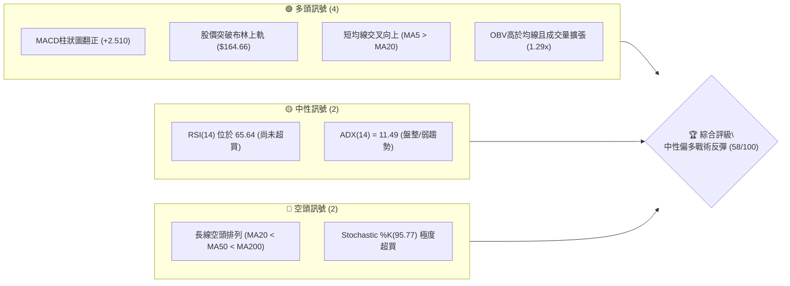
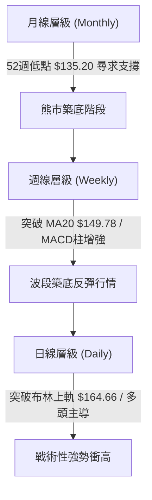
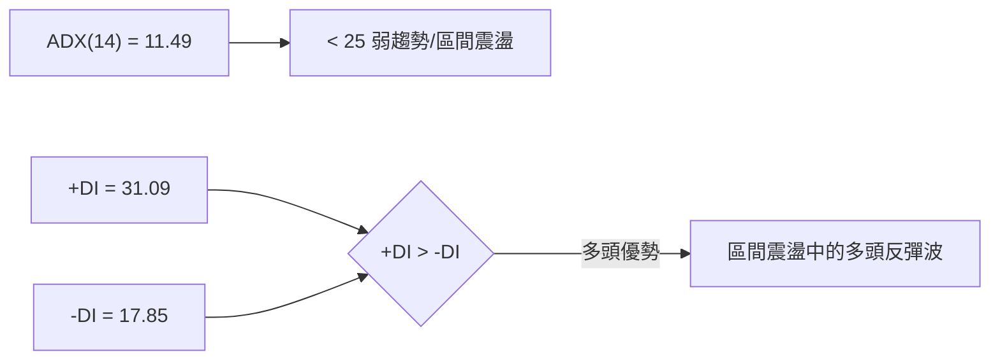
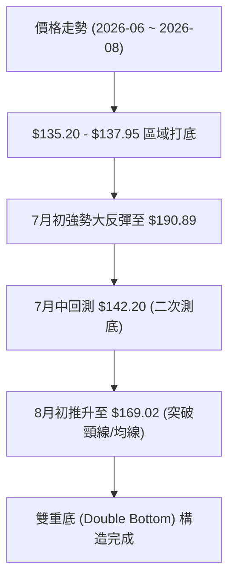
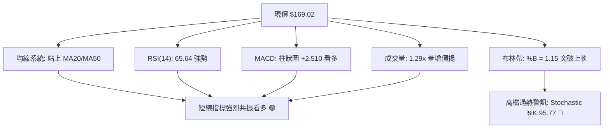
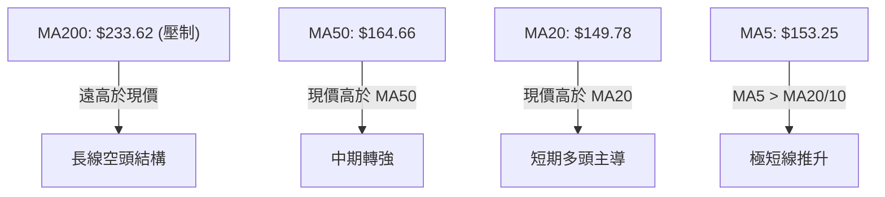
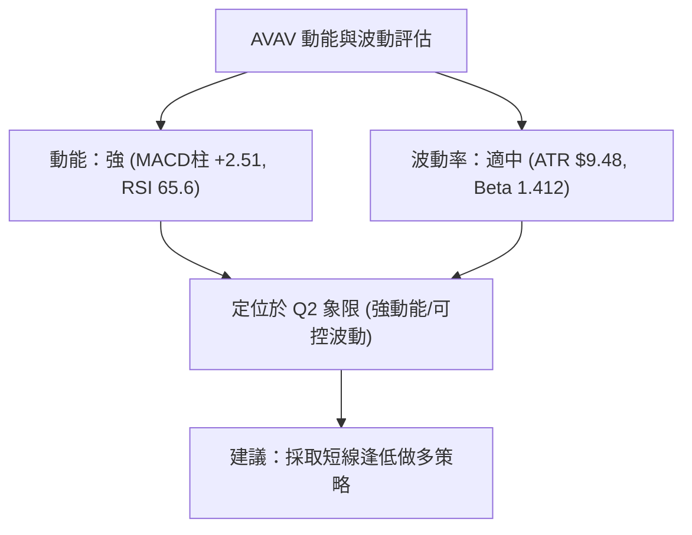
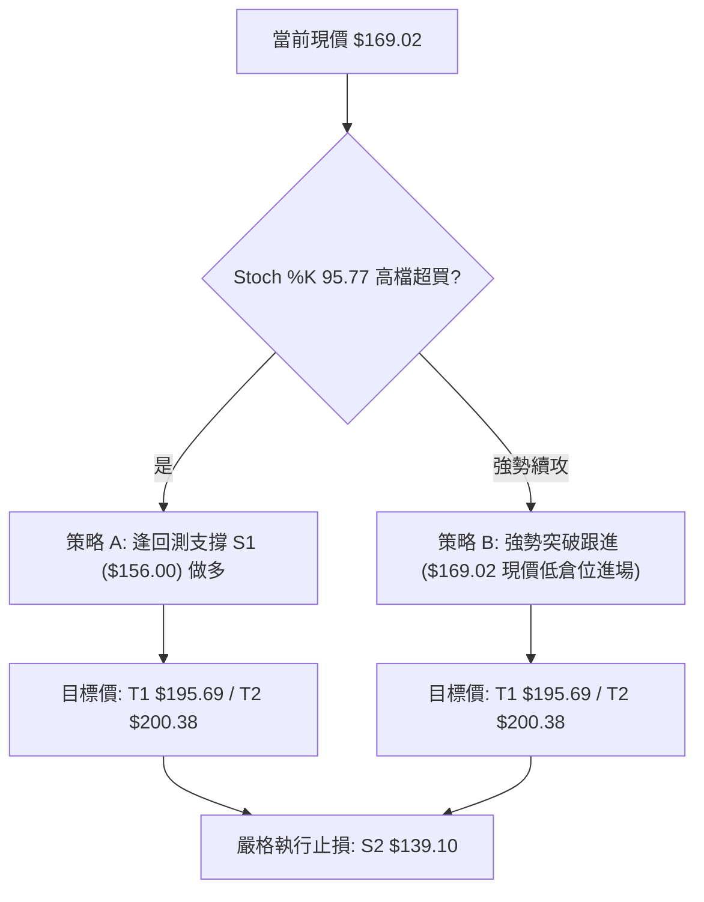
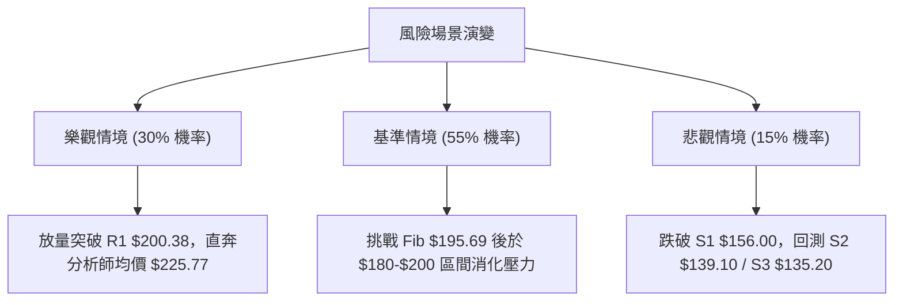

# AVAV 技術分析報告

> **報告日期**：2026-08-05 ｜ **語言**：繁體中文 ｜ **數據來源**：Yahoo Finance ｜ **當前價格**：$169.02

---

## 目錄

| 章節 | 內容 |
|------|------|
| [1. 技術面概覽](#1-技術面概覽) | 訊號儀表板、核心指標、評分卡 |
| [2. 趨勢分析](#2-趨勢分析) | 多時框趨勢、長中短期走勢 |
| [3. 圖表形態分析](#3-圖表形態分析) | 形態識別、K線組合、目標價 |
| [4. 支撐與阻力](#4-支撐與阻力) | 關鍵價位、斐波那契回調 |
| [5. 技術指標深度解讀](#5-技術指標深度解讀) | MA/RSI/MACD/布林/成交量 |
| [6. 動能與波動率](#6-動能與波動率) | 動能評估、ATR、Beta |
| [7. 多時框架總結](#7-多時框架總結) | 時框架評分矩陣 |
| [8. 交易策略建議](#8-交易策略建議) | 多空策略、風險報酬比 |
| [9. 風險提示與監控](#9-風險提示與監控) | 監控指標、風險場景 |

---

## 1. 技術面概覽

### 🎯 技術訊號儀表板



### 📊 核心指標速覽表

| 指標類別 | 指標名稱 | 當前數值 | 訊號 | 解讀 |
|----------|----------|----------|------|------|
| **價格** | 當前價格 | $169.02 | 🟢 | 自 52 週低點 $135.20 強勢反彈，處於 52 週區間 12.0% |
| **均線** | MA20 | $149.78 | 🟢 | 價格高於 MA20（+12.84%），短線支撐確立 |
| **均線** | MA50 | $164.66 | 🟢 | 價格成功突破 50 日線（+2.65%），短中期轉強 |
| **均線** | MA200 | $233.62 | 🔴 | 價格遠低於 200 日線（-27.65%），長線承壓 |
| **動能** | RSI(14) | 65.64 | 🟡 | 強勢區間但無頂背離，具備上攻空間 |
| **動能** | MACD | -1.119 / Hist +2.510 | 🟢 | 柱狀圖大幅擴張，多頭動能迅速增強 |
| **動能** | Stochastic %K | 95.77 / %D 75.53 | 🔴 | 技術面進入高檔超買區，需防範短線回檔 |
| **波動** | ATR(14) | $9.48 (5.61%) | 🟡 | 日均波動適中，提供合理的止損設置空間 |

### 🏆 技術評分卡

```
╔══════════════════════════════════════════════════════════════╗
║             技術評分卡 — AVAV (2026-08-05)                   ║
╠══════════════════════════════════════════════════════════════╣
║ 趨勢強度 (ADX)  █████░░░░░░░░░░░░░░░  25/100  🟡 弱趨勢/區間 ║
║ 動能指標 (RSI)  ███████████████░░░░░  75/100  🟢 動能強勁     ║
║ 支撐穩定度      █████████████░░░░░░░  65/100  🟢 底步墊高     ║
║ 成交量配合      ██████████████░░░░░░  70/100  🟢 量增價揚     ║
║ 形態完整度      ███████████░░░░░░░░░  55/100  🟡 反彈築底中   ║
║ 均線結構        ████████░░░░░░░░░░░░  40/100  🔴 長線空頭排列 ║
╠══════════════════════════════════════════════════════════════╣
║ 綜合評分        ███████████6░░░░░░░░  58/100  🟡 中性偏多反彈 ║
╚══════════════════════════════════════════════════════════════╝
```

---

## 2. 趨勢分析

### 🌐 多時框趨勢分析



### 📈 長期趨勢 — 24個月走勢圖（Unicode）

```
AVAV 24個月歷史價格走勢圖 ($)
$417.86 ┤                                  ●(52W High)
$369.91 ┤                            ●
$314.89 ┤                     ●
$284.95 ┤               ●
$241.89 ┤         ●                        ●
$203.76 ┤ ●   ●                              ●
$169.02 ┤   ●   ●   ●                            ●   ●←當前價格
$135.20 ┤                 ●                        ●(52W Low)
        └─┬───┬───┬───┬───┬───┬───┬───┬───┬───┬───┬───┬───►
         24-08 24-11 25-02 25-05 25-08 25-11 26-02 26-05 26-08
```

#### 24個月歷史走勢特徵分析

| 階段 | 時間區間 | 價格區間 | 漲跌幅 | 走勢特徵分析 |
|------|----------|----------|--------|--------------|
| **歷史高檔震盪** | 2024-08 ~ 2024-10 | $203.76 → $214.96 | +5.5% | 區間高檔拉回，多頭高位盤整 |
| **首波大幅回修** | 2024-11 ~ 2025-03 | $194.50 → $119.19 | -38.7% | 獲利賣壓湧現，急挫至 $119 附近築底 |
| **主升段暴拉** | 2025-04 ~ 2025-10 | $151.52 → $369.91 | +144.1%| 國防需求激增，股價創歷史高點 $417.86 |
| **主跌段崩跌** | 2025-11 ~ 2026-03 | $279.46 → $183.05 | -34.5% | 高估值修正與獲利了結，陷入長空 |
| **探底築底期** | 2026-04 ~ 2026-07 | $195.02 → $149.37 | -23.4% | 於 $135.20 刷出 52 週新低，籌碼洗淨 |
| **強勢反彈期** | 2026-08 (當前) | $149.37 → $169.02 | +13.2% | 量能放大，放量突破短期均線集結區 |

### 📊 中期趨勢（週線分析）

```
週線等級壓力/支撐架構示意圖
$233.62 ══════════════════════════════════════════ [MA200 長期強壓]
$200.38 ────────────────────────────────────────── [R1 波段高點阻力]
$195.69 ------------------------------------------ [Fib 78.6% 回調位]
$169.02 ◄───────────────────────────────────────── [現價位置]
$164.66 ────────────────────────────────────────── [MA50 / 布林上軌支撐]
$156.00 ────────────────────────────────────────── [S1 波段支撐]
$135.20 ══════════════════════════════════════════ [S3 52週絕對鐵底]
```

*   **週線走勢分析**：近 20 週數據顯示，股價於 2026 年 6 月底下探 $137.95，並於 7 月初引發超跌反彈（當週成交量衝高至 18,317,500 股）。隨後於 7 月中旬進行二次測底（$142.20），未跌破 52 週低點 $135.20，構築典型的「雙底」結構。
*   **最新週 K 狀況**：2026-08-09 止當週，RSI 攀升至 65.6，MACD 柱狀圖擴張至 +2.510，確定波段反彈展開。

### ⚡ 趨勢強度評估（ADX 解讀）



| 指標項 | 數值 | 狀態 | 解讀與交易意涵 |
|--------|------|------|----------------|
| **ADX(14)** | 11.49 | 弱趨勢 (<25) | 當前市場無單向強烈趨勢，屬於區間震盪/波段反彈形態。 |
| **+DI** | 31.09 | 強 | 多頭力道佔據優勢，買盤積極進場。 |
| **-DI** | 17.85 | 弱 | 空頭主導權減弱，賣壓暫時停歇。 |
| **趨勢綜合** | 多頭主導區間 | 🟢 | **不宜使用順勢突破策略，應採取區間低吸高拋或強勢反彈操作。** |

---

## 3. 圖表形態分析

### 🔍 形態識別系統



#### 形態信心度與目標價評估

| 形態類型 | 信心度 | 判斷依據（引用數據） | 完成度 | 目標價（附計算式） |
|----------|--------|----------------------|--------|--------------------|
| **V型二次打底 / 雙底** | **65%** | 第一底 $137.95 (6/28 週)，第二底 $142.20 (7/19 週)，均守住 S3 ($135.20) | 80% | 頸線 $164.66 + 形態高度 ($164.66 - $135.20) = **$194.12** (接近 Fib 78.6% $195.69) |
| **布林通道向上突破** | **85%** | 現價 $169.02 突破上軌 $164.66 (%B = 1.15) | 100% | 觸及波段阻力 R1 **$200.38** |

*註：由於 ADX 僅 11.49，長線形態（如頭肩底或大型旗形）數據不足，信心度低於 50%，故僅以雙底反彈與布林突破作指標型解讀。*

### 🕯️ 重要 K 線形態分析

| 日期/週期 | 收盤價 | K線形態 | 解讀 | 訊號 |
|-----------|--------|---------|------|------|
| **2026-06-28 週** | $137.95 | 長陰殺跌 (超賣) | RSI 掉至 20.2 極限區，促成恐慌盤洗出 | 🔴 賣壓宣洩 |
| **2026-07-05 週** | $190.89 | 巨量長陽 (吞噬) | 週成交量爆出 18.3M 股，主力資金強勢拉抬築底 | 🟢 強烈買進 |
| **2026-07-19 週** | $142.20 | 縮量縮影 (測試) | 量能縮至 7.08M，次底測試成功，確立 $135.20 為堅實支撐 | 🟢 二次確認 |
| **2026-08-09 週** | $169.02 | 實體中陽突破 | 突破 MA20 ($149.78) 與 MA50 ($164.66)，多頭續攻 | 🟢 強勢買進 |

### 📉 ASCII 走勢形態示意圖

```
AVAV 雙底反彈形態與頸線突破示意圖
$200.38 ┤                                            [阻力 R1]
$195.69 ┤                                  .--- Target: $194.12 - $195.69
$190.89 ┤         ●(反彈高點)             /
$169.02 ┤......../.......................● (現價)
$164.66 ┼───────/───────── Neckline ─────/─────────── [頸線 / MA50]
$142.20 ┤      /         ● (底二 $142.20)
$135.20 ┤  ● (底一 $137.95) └─────── S3 52W Low $135.20 ─────────
        └─────────────────────────────────────────► 時間
```

### 🎯 形態目標價計算

1.  **雙底高度測算**：
    *   底部低點：$135.20（52週低點）
    *   突破頸線（兼 MA50）：$164.66
    *   形態垂直高度：$164.66 - $135.20 = $29.46
    *   **測算最小目標價**：$164.66 + $29.46 = **$194.12**
2.  **關鍵關卡收斂**：
    *   測算目標價 $194.12 密切貼合 **斐波那契 78.6% 回調位 $195.69** 與 **關鍵阻力 R1 $200.38**。

---

## 4. 支撐與阻力

### 🗺️ 關鍵價位分布圖（Unicode）

```
AVAV 價位結構分布圖 (由 OHLCV 實體計算)
═══════════════════════════════════════════════════════════════
$417.86 ║████████████████████████████████████████  52週最高價 (0.0%)
$276.53 ║██████████████████                        Fib 50.0% 回調位
$243.18 ║████████████████                          MA200 / Fib 61.8%
$222.40 ║██████████████                            強阻力 R3
$217.77 ║████████████                              阻力 R2
$200.38 ║██████████                                關鍵阻力 R1
$195.69 ║█████████                                 Fib 78.6% 回調位
$169.02 ╠═════════════════════════════════════════ ◄ 當前價格 ($169.02)
$164.66 ║▓▓▓▓▓▓▓▓▓                                 MA50 / 布林上軌 (動態支撐)
$156.00 ║▓▓▓▓▓▓▓                                   近期波段支撐 S1
$149.78 ║▓▓▓▓▓                             MA20 / 布林中軌
$139.10 ║████████████████████                      強支撐 S2
$135.20 ║████████████████████████████████████████  52週最低價 S3 (100.0%)
═══════════════════════════════════════════════════════════════
```

### 🚧 阻力位分析表

| 阻力級別 | 精確價位 | 形成原因（依據數據） | 突破難度 | 重要性 |
|----------|----------|----------------------|----------|--------|
| **R1** | **$200.38** | 近一年波段高點聚類 / 心理整數關卡 | 🔴 高 | ★★★★☆ 近期多頭反彈核心目標 |
| **R2** | **$217.77** | 波段密集成交解套壓力區 | 🔴 極高 | ★★★☆☆ 中期解套賣壓關卡 |
| **R3** | **$222.40** | 近一年波段高點上方聚類 | 🔴 極高 | ★★☆☆☆ 近 MA200 之前的強阻力 |

### 🛡️ 支撐位分析表

| 支撐級別 | 精確價位 | 形成原因（依據數據） | 守住機率 | 重要性 |
|----------|----------|----------------------|----------|--------|
| **S1** | **$156.00** | 近一年波段低點聚類 / 突破後轉支撐 | 🟢 75% | ★★★★☆ 短線多頭退守防線 |
| **S2** | **$139.10** | 7月中旬二次回測低點（$142.20）附近聚類 | 🟢 85% | ★★★★★ 波段強弱分水嶺 |
| **S3** | **$135.20** | 52週絕對最低價 (100% 回調位) | 🟢 95% | ★★★★★ 多頭絕對防線 |

### 📐 斐波那契回調位分析

依據 52 週高低點（$135.20 → $417.86）計算：

| 斐波那契比例 | 價位 | 距離當前價格幅度 | 解讀與技術意義 |
|--------------|------|------------------|----------------|
| **0.0%** | $417.86 | +147.23% | 52 週最高點 |
| **23.6%** | $351.15 | +107.76% | 長線極強阻力 |
| **38.2%** | $309.88 | +83.34% | 中長線中期反彈目標 |
| **50.0%** | $276.53 | +63.61% | 多空長期強弱分界線 |
| **61.8%** | $243.18 | +43.88% | 黃金分割點 / 靠近 MA200 ($233.62) |
| **78.6%** | **$195.69** | **+15.78%** | **短線核心反彈阻力位** |
| **100.0%** | **$135.20** | **-20.01%** | **52 週最低點 (起漲點)** |

*   **當前位置解讀**：現價 **$169.02** 恰好落在 **100.0% ($135.20)** 與 **78.6% ($195.69)** 之間的築底反彈區域。若突破 $195.69，將可開啟向 61.8% ($243.18) 推進的中期反彈行情。

---

## 5. 技術指標深度解讀

### 🎛️ 指標訊號總覽



### 📈 移動平均線排列分析



| 均線天數 | 當前價位 | 價格關係 | 均線走勢趨勢 | 訊號 |
|----------|----------|----------|--------------|------|
| **MA 5** | $153.25 | 突破 (+10.29%) | 向上急攻 ▅▄▃▁▁... | 🟢 超短線強勢 |
| **MA 10**| $153.54 | 突破 (+10.08%) | 拐頭向上 █▇▆▄▃... | 🟢 短線多頭 |
| **MA 20**| $149.78 | 突破 (+12.84%) | 築底上揚 █▇▇▆▅... | 🟢 支撐確立 |
| **MA 50 (60)**| $164.66 | 突破 (+2.65%) | 止跌走平 █▇▆▅▄... | 🟢 中期翻多 |
| **MA 120**| $187.28 | 下方 (-9.75%) | 持續下行 █▇▆▅▄... | 🔴 上方阻力 |
| **MA 200 (240)**| $233.62 | 下方 (-27.65%) | 長線下行 █▇▆▅▄... | 🔴 長空壓制 |

*   **均線狀態**：整體呈現 MA20 < MA50 < MA200 的長線空頭排列，但**現價 ($169.02) 已一舉收復 MA5、MA10、MA20 與 MA50**，屬於強力的戰術性波段反彈。

### 📉 RSI(14) 分析

*   **當前數值**：**65.64**
*   **強度進度條**：███████████████░░░░░ 75%
*   **區間定位**：處於 50–70 強勢多頭區間，尚未進入 >70 極度超買區。
*   **背離分析**：
    *   價格在 2026-07 探底至 $135.20–$142.20，RSI 由 20.2 攀升至 51.8 再到當前的 65.64。
    *   **結論**：**無頂背離**，呈現健康的「底背離後續漲」形態，動能支持股價繼續向上挑戰阻力。

### 📊 MACD(12,26,9) 訊號解讀

*   **MACD 快線**：-1.119
*   **Signal 慢線**：-3.629
*   **MACD 柱狀圖**：**+2.510**
*   **解讀**：快線已在零軸下方完成黃金交叉並向上穿越慢線，柱狀圖連續擴張（+0.860 → +2.510），顯示底部買盤極度強勁，屬於典型零軸下的「低位黃金交叉」看多訊號。

### 📦 布林通道分析

```
ASCII 布林通道位置示意圖 ($)
$164.66 ┼───────────────────────── Band Upper (上軌)  ◄─ 現價 $169.02 (突破上軌)
$149.78 ┼───────────────────────── Band Middle (MA20)
$134.91 ┼───────────────────────── Band Lower (下軌)
```

*   **BB 上軌**：$164.66
*   **BB 中軌 (MA20)**：$149.78
*   **BB 下軌**：$134.91
*   **%B 指標**：**1.15**（> 1.0 代表價格收在布林通道上軌之外）
*   **解讀**：股價強勢衝出布林上軌，代表極短線爆發力極強，但也意味著價格短線過度偏離 MA20 均線，後續可能出現向 $164.66（上軌轉支撐）的拉回回測。

### 💹 成交量分析（量價配合度）

*   **最新成交量**：1,841,440 股
*   **20 日均量**：1,431,347 股（**量比 1.29x**）
*   **OBV 狀態**：OBV > MA（能量潮指標高於其移動平均線）
*   **量價配合結論**：價格上漲同時成交量較 20 日均量放大 29%，且 OBV 呈向上趨勢，證實**資金流為淨流入，量能有效確認價格漲勢**。

---

## 6. 動能與波動率

### ⚡ 動能評估四象限

| 象限區分 | 動能強度 (RSI/MACD) | 波動率 (ATR/Beta) | 當前狀態 | 評估與策略 |
|----------|---------------------|-------------------|----------|------------|
| **Q1 (高動能/高波動)** | 強 | 高 | — | 追漲高風險高收益 |
| **Q2 (高動能/適中波動)**| **強 (RSI 65.6)** | **適中 (ATR 5.61%)**| **✓ 當前定位** | **最佳波段作多環境** |
| **Q3 (低動能/低波動)** | 弱 | 低 | — | 觀望沉悶盤 |
| **Q4 (低動能/高波動)** | 弱 | 高 | — | 恐慌殺跌應避免 |



### 📊 ATR 波動率分析

*   **ATR(14)**：**$9.48**（佔當前股價 **5.61%**）
*   **歷史波動 context**：屬中等偏高波動度（beta 1.412）。日均波幅約 $9.5。
*   **止損與倉位設定參考**：
    *   **1.0x ATR**：$9.48 (極短線緊密止損)
    *   **1.5x ATR**：$14.22 (波段交易標準止損距離)
    *   **2.0x ATR**：$18.96 (寬鬆波段止損)

### 📐 Beta 與市場相關性

*   **Beta 係數**：**1.412**
*   **解讀**：AVAV 屬於高 Beta 股，相較於標普 500 指數具有 41.2% 的額外波動性。在大盤上漲時具備放大收益特性，但在市場下行時回修壓力亦大。

---

## 7. 多時框架總結

### 📋 時框架評分表

| 時框架 | 趨勢方向 | 動能 (RSI/MACD) | 均線排列 | 形態狀態 | 綜合評分 | 交易建議 |
|--------|----------|-----------------|----------|----------|----------|----------|
| **日線 (Daily)** | 🟢 強勢反彈 | 🟢 RSI 65.6 / MACD看多 | 🟢 突破 MA20/50 | 突破布林上軌 | **75/100** | 偏多操作/逢低進場 |
| **週線 (Weekly)**| 🟡 築底復甦 | 🟢 週MACD翻正 | 🔴 MA20/50承壓 | 雙底構築中 | **55/100** | 區間波段反彈觀點 |
| **月線 (Monthly)**| 🔴 長期下降 | 🟡 超跌回升 | 🔴 空頭排列 | 52週低點支撐 | **40/100** | 長線防範壓制 |

### 🔲 綜合訊號矩陣

| 維度 | 短期 (1-5天) | 中期 (1-4週) | 長期 (1-3個月) | 一致性評估 |
|------|--------------|--------------|----------------|------------|
| **均線訊號** | 🟢 看多 (突破MA20) | 🟢 看多 (突破MA50) | 🔴 看空 (MA200壓制) | 短中期共振翻多，長線承壓 |
| **動能訊號** | 🔴 超買 (Stoch%K 95.7)| 🟢 強勁 (MACD擴張) | 🟡 中性 | 需注意極短線過熱拉回 |
| **量能訊號** | 🟢 看多 (1.29x量比) | 🟢 看多 (OBV向上) | 🟡 中性 | 量價配合良好 |

### ⚖️ 多時框收斂結論

> **收斂規則執行 (ADX = 11.49 < 25)**：
> 當前 ADX 低於 25，市場主導形態為**「區間震盪與戰術性波段反彈」**，而非單向長牛趨勢。
> **最終收斂結論**：主導時框採用**日線與週線**。股價已突破布林上軌與 MA50，短中期處於強烈波段反彈階段，**方向偏多**。目標鎖定斐波那契 78.6% 回調位（**$195.69**）與波段阻力 R1（**$200.38**），但需防範 $200 附近的長線賣壓。

---

## 8. 交易策略建議

### 🗺️ 策略決策流程圖



### 🧭 策略路由

**當前主策略方向：偏多波段反彈策略（綜合評分 58/100）**
由於 ADX 指標為 11.49，顯示為區間反彈行情，且現價突破布林上軌與 MA50，策略以**「拉回支撐做多」為優先（策略 A）**，**「現價追高波段」為次之（策略 B）**。

### 🎯 價格情境階梯 (Price Scenarios)

| 觸發條件 | 下一目標價 | 後續延伸目標 | 情境含義與操作指引 |
|----------|------------|--------------|--------------------|
| **強勢突破 R1 $200.38** | R2 $217.77 | R3 $222.40 | 中期轉牛，打開挑戰 MA200 ($233.62) 空間 |
| **站穩 Fib $195.69** | R1 $200.38 | R2 $217.77 | 雙底目標完成，防範多頭獲利了結 |
| **當前價格區間** | Fib 78.6% $195.69| S1 $156.00 | 強勢震盪消化高檔指標過熱 |
| **跌破 S1 $156.00** | S2 $139.10 | S3 $135.20 | 短線反彈夭折，退守二次測底區 |

### 📊 情境機率分佈

| 情境 | 機率 | 主要依據 |
|------|------|----------|
| **繼續上行挑戰 $195.69 - $200.38** | **55%** | MACD 柱狀圖 (+2.510) 強勢擴張，突破 MA50，量比 1.29x |
| **於 $160 - $175 高檔區間震盪** | **30%** | ADX(11.49) 顯示弱趨勢，Stochastic 入超買區需要時間修正 |
| **跌破 S1 $156.00 再探底部** | **15%** | 長線仍受 MA200 壓制，若大盤重挫可能引發補跌 |

### 🟢 主策略詳情

#### 策略 A：逢回測支撐做多（首選 - 穩健型）
*   **進場條件**：價格拉回回測 S1 支撐位或 MA50 附近，出現止跌K線。
*   **進場價格**：**$156.00**（S1 支撐位附近）
*   **目標價 T1**：**$195.69**（Fib 78.6% 回調位）
*   **目標價 T2**：**$200.38**（阻力位 R1）
*   **止損價格**：**$139.10**（強支撐 S2 跌破止損）
*   **風險報酬比**：
    $$\text{RRR} = \frac{\$195.69 - \$156.00}{\$156.00 - \$139.10} = \frac{\$39.69}{\$16.90} \approx \mathbf{2.35 : 1}$$
*   **勝率預估**：65%
*   **建議倉位**：15% - 20%

#### 策略 B：現價順勢衝刺多單（次選 - 積極型）
*   **進場條件**：現價直接進場，博弈布林帶開口擴張與雙底目標達成。
*   **進場價格**：**$169.02**（當前現價）
*   **目標價 T1**：**$195.69**（Fib 78.6% 回調位，潛在獲利 +15.78%）
*   **目標價 T2**：**$200.38**（阻力位 R1，潛在獲利 +18.55%）
*   **止損價格**：**$156.00**（跌破 S1 / MA50 止損，風險 -7.70%）
*   **風險報酬比**：
    $$\text{RRR} = \frac{\$195.69 - \$169.02}{\$169.02 - \$156.00} = \frac{\$26.67}{\$13.02} \approx \mathbf{2.05 : 1}$$
*   **勝率預估**：55%
*   **建議倉位**：10%（因 Stochastic 超買，控制倉位）

### 🔴 反向風險觸發點（風控對沖提示）

若股價未如預期上攻，反而收盤收跌破 **$156.00**（S1），且 MACD 柱狀圖轉為縮頭，代表短線假突破。此時應多單全數停損離場，不建議轉手建立空頭，除非**收盤跌破 S2 $139.10**。

### ⭐ 整體訊號強度評星

```
做多訊號強度： ★★★★☆  (4/5 星 — 短中期多頭共振強烈)
做空訊號強度： ★★☆☆☆  (2/5 星 — 僅長線 MA200 壓制)
整體策略可信度：★★★☆☆  (3.5/5 星 — 受 ADX 弱趨勢影響，屬區間波段級別)
```

---

## 9. 風險提示與監控

### ✅ 關鍵監控指標 Checklist

```
╔══════════════════════════════════════════════════════════════╗
║              AVAV 風險與監控清單 (Checklist)                 ║
╠══════════════════════════════════════════════════════════════╣
║ [ ] 1. 守住 S1 ($156.00)：回測不破均線支撐區                 ║
║ [ ] 2. 布林通道閉合：關注 BB 上軌 ($164.66) 是否轉為實體支撐║
║ [ ] 3. 成交量配合：反彈日成交量能否維持在 1.43M (20日均量)上 ║
║ [ ] 4. RSI 高檔修正：RSI(14) 能否維持在 50 以上多頭分界線    ║
║ [ ] 5. 阻力區 R1 ($200.38) 機構賣壓與分析師目標價 ($225.77)  ║
╚══════════════════════════════════════════════════════════════╝
```

### ⚠️ 風險場景分析



### 🛡️ 風險管理重要提醒

1.  **超買指標回檔風險**：Stochastic %K 達 95.77，極度過熱，追高風險增加。極短線交易者不宜過度加碼，應等待價格拉回靠近 $156.00–$164.66 區間佈局。
2.  **波動率止損紀律**：目前 ATR 為 $9.48，若採取策略 B 進場，止損價設為 $156.00（距離現價 $13.02，約 1.37x ATR），符合標準風控架構。
3.  **長線空頭排列壓制**：MA200 位於 $233.62，屬於長線下降趨勢線。任何接近 $200.38–$222.40 的漲勢均應視為波段獲利了結區，切勿盲目長期持有。

---

## 📋 報告總結

```
╔══════════════════════════════════════════════════════════════╗
║                AVAV 技術分析報告總結                         ║
════════════════════════════════════════════════════════════════
報告日期：2026-08-05
當前價格：$169.02
分析評級：🟡 中性偏多波段反彈 (Technical Score: 58/100)

關鍵結論：
├─ 長期趨勢：🔴 空頭排列壓制 (MA200 $233.62 下行中)
├─ 中期趨勢：🟢 雙底構築完成，突破 MA50 ($164.66)
├─ 短期趨勢：🟢 戰術性爆發，突破布林上軌 ($164.66)
├─ 關鍵支撐：S1 $156.00  |  S2 $139.10  |  S3 $135.20 (52W Low)
├─ 關鍵阻力：Fib $195.69 |  R1 $200.38  |  R2 $217.77
└─ 分析師目標價：均價 $225.77 (Buy 共識)

最優策略組合：
1. 🥇 最佳機會：策略 A (拉回 S1 $156.00 進場做多，風報比 2.35:1)
2. 🥈 次選機會：策略 B (現價 $169.02 輕倉順勢進場，目標 $195.69)
3. 🥉 風控防線：收盤跌破 $156.00 無條件停損離場
════════════════════════════════════════════════════════════════
```

---

> ⚠️ **免責聲明**：本報告為 AI 自動生成之技術分析，所有數據及估算均基於提供的歷史價格資訊。本報告**僅供研究與學術參考**，**不構成任何投資建議**。投資有風險，入市需謹慎。

---

*報告生成時間：2026-08-05 ｜ 數據來源：Yahoo Finance ｜ 分析框架：多時框技術分析*