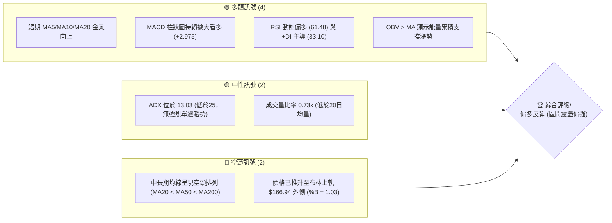
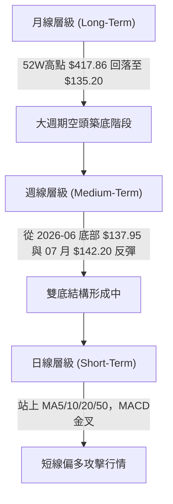
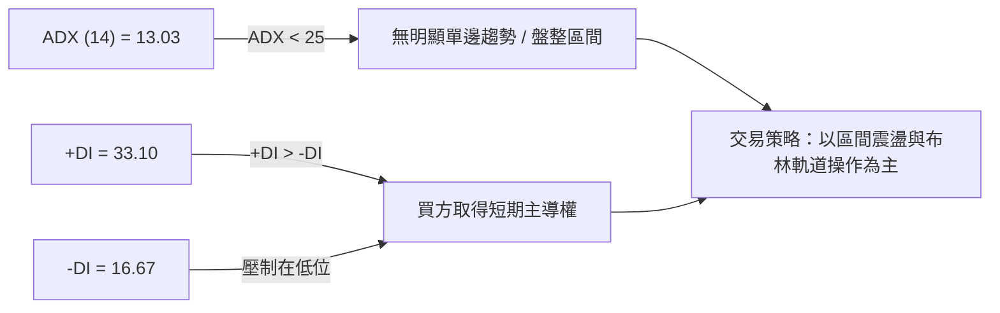
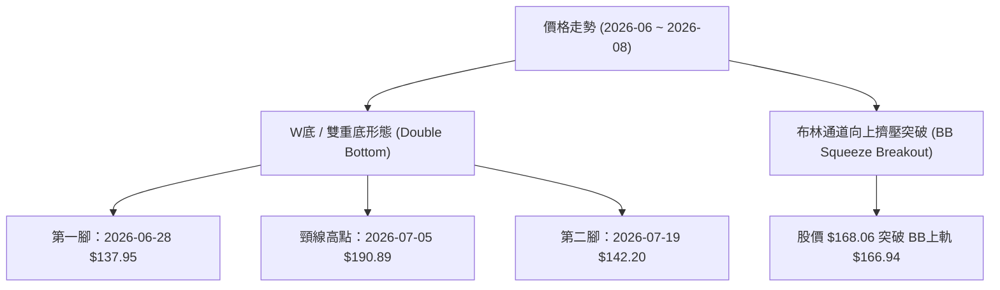
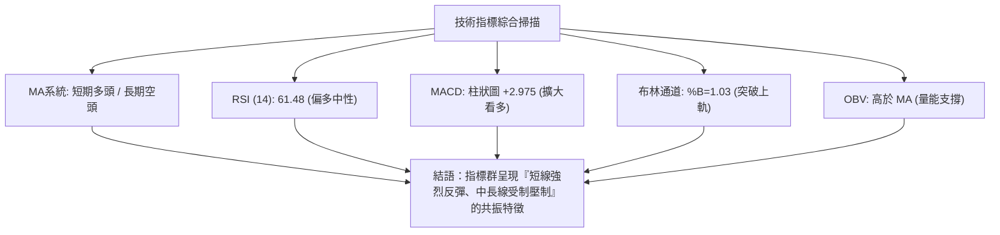
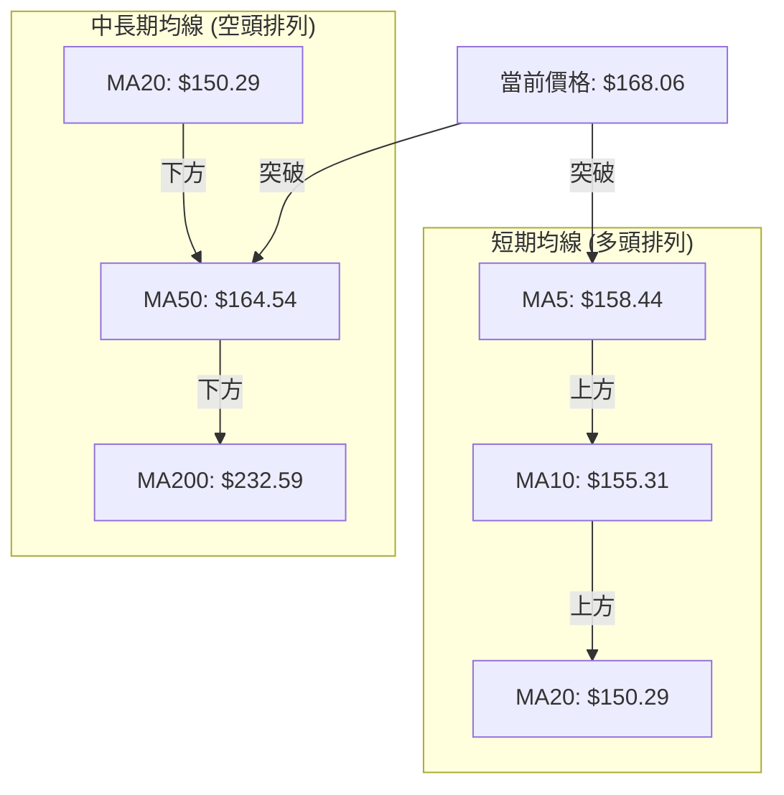
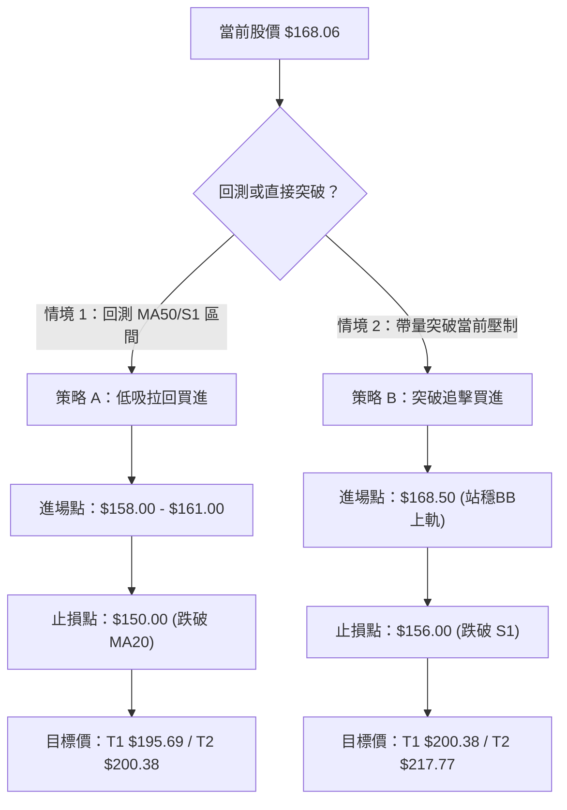
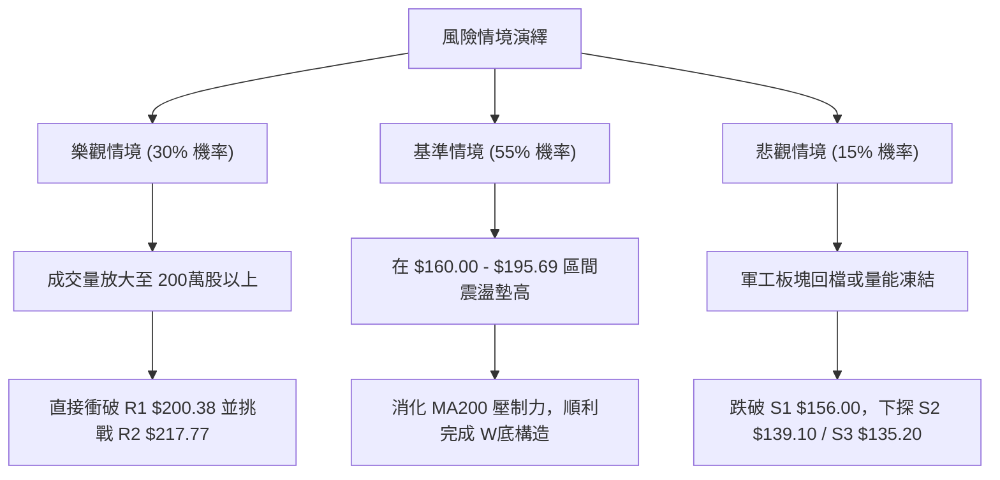

# AVAV 技術分析報告

> **報告日期**：2026-08-06 ｜ **語言**：繁體中文 ｜ **數據來源**：Yahoo Finance ｜ **當前價格**：$168.06

---

## 目錄

| 章節 | 內容 |
|------|------|
| [1. 技術面概覽](#1-技術面概覽) | 訊號儀表板、核心指標、評分卡 |
| [2. 趨勢分析](#2-趨勢分析) | 多時框趨勢、長中短期走勢 |
| [3. 圖表形態分析](#3-圖表形態分析) | 形態識別、K線組合、目標價 |
| [4. 支撐與阻力](#4-支撐與阻力) | 關鍵價位、斐波那契回調 |
| [5. 技術指標深度解讀](#5-技術指標深度解讀) | MA/RSI/MACD/布林/成交量 |
| [6. 動能與波動率](#6-動能與波動率) | 動能評估、ATR、Beta |
| [7. 多時框架總結](#7-多時框架總結) | 時框架評分矩陣 |
| [8. 交易策略建議](#8-交易策略建議) | 多空策略、風險報酬比 |
| [9. 風險提示與監控](#9-風險提示與監控) | 監控指標、風險場景 |

---

## 1. 技術面概覽

### 🎯 技術訊號儀表板



### 📊 核心指標速覽表

| 指標類別 | 指標名稱 | 當前數值 | 訊號 | 解讀 |
|----------|----------|----------|------|------|
| **價格** | 當前價格 | $168.06 | 🟢 看多 | 站上 MA50 ($164.54) 與布林中軌 ($150.29) |
| **均線** | MA20 | $150.29 | 🟢 看多 | 價格在 MA20 上方 (+11.82%)，短期均線向上翻揚 |
| **均線** | MA50 | $164.54 | 🟢 看多 | 價格突破 MA50 (+2.14%)，短線扭轉中期劣勢 |
| **均線** | MA200 | $232.59 | 🔴 看空 | 價格位於 MA200 下方 (-27.74%)，長期趨勢仍屬空頭 |
| **動能** | RSI(14) | 61.48 | 🟢 看多 | 位於 50–70 強勢多頭區間，無超買過熱 |
| **動能** | MACD | 0.090 | 🟢 看多 | MACD 穿越 Signal (-2.885)，柱狀圖 +2.975 多頭擴展 |
| **波動** | ATR(14) | $9.40 | 🟡 中性 | 日波動率 5.60%，屬中等偏高波動，建議嚴格設定止損 |

### 🏆 技術評分卡

```
╔══════════════════════════════════════════════════════════════════╗
║              技術評分卡 — AVAV (2026-08-06)                      ║
╠══════════════════════════════════════════════════════════════════╣
║ 趨勢強度      ████████░░░░░░░░░░░░  40/100  🟡 弱趨勢/區間震盪  ║
║ 動能指標      ██████████████░░░░░░  70/100  🟢 強勁反彈動能    ║
║ 支撐穩定度    █████████████░░░░░░░  65/100  🟢 135.20二度築底    ║
║ 成交量配合    ██████████░░░░░░░░░░  50/100  🟡 上漲追價量不足  ║
║ 形態完整度    █████████████░░░░░░░  65/100  🟢 雙底打底形態    ║
║ 均線排列      ████████░░░░░░░░░░░░  40/100  🔴 中長期空頭排列  ║
╠══════════════════════════════════════════════════════════════════╣
║ 綜合評分      ███████████▓░░░░░░░░  58/100  🟡 偏多區間反彈    ║
╚══════════════════════════════════════════════════════════════════╝
```

---

## 2. 趨勢分析

### 🌐 多時框趨勢分析



### 📈 長期趨勢 — 12個月走勢圖（Unicode）

```
AVAV 月線走勢圖（2025-08 至 2026-08）
價格軸 ($)
$370 ┤                               ● (2025-10 高點 $369.91)
$330 ┤                        ●
$290 ┤                  ●           ●
$250 ┤    ●                               ●                             
$210 ┤          ●                             ●     ●
$170 ┤                                                    ●           ● (現在 $168.06)
$130 ┤                                                          ●
     └────┬─────┬─────┬─────┬─────┬─────┬─────┬─────┬─────┬─────┬─────┬─────
        25-08 25-09 25-10 25-11 25-12 26-01 26-02 26-03 26-04 26-05 26-06 26-07 26-08
```

#### 走勢特徵分析表

| 階段 | 時間區間 | 收盤價範圍 | 漲跌幅 | 走勢特徵 |
|------|----------|------------|--------|----------|
| **衝頂期** | 2025-08 ~ 2025-10 | $241.35 → $369.91 | +53.27% | 強勢多頭攻擊，創出波段高點 |
| **主跌段** | 2025-10 ~ 2026-03 | $369.91 → $183.05 | -50.51% | 高檔獲利結算，連續跌破多條均線 |
| **築底期** | 2026-04 ~ 2026-07 | $195.02 → $149.37 | -23.41% | 下探 52週低點 $135.20 後出現二次打底 |
| **反彈期** | 2026-07 ~ 2026-08 | $149.37 → $168.06 | +12.51% | 站回 MA20/MA50，進入區間反彈 |

### 📊 中期趨勢（週線分析）

近 20 週數據顯示，AVAV 在 2026-06-28 探底至 $137.95（成交量爆量至 1,188 萬股），隨後在 2026-07-05 快速強彈至 $190.89（成交量 1,831 萬股）；7月中旬進行二次回測（2026-07-19 低點 $142.20，量能顯著萎縮至 708 萬股），形成了典型的**量銳減之二次回測**，隨後連續三週收紅，目前推升至 $168.06。

### ⚡ 趨勢強度評估（ADX 解讀）



| ADX 數值區間 | 當前讀數 | 趨勢狀態 | 交易含意 |
|--------------|----------|----------|----------|
| 0 – 20 | **13.03** | 弱趨勢 / 無趨勢 | 嚴禁盲目追突破，宜採低買高賣區間策略 |
| 25 – 50 | -- | 強趨勢 | 順勢操作 |
| 50 – 100 | -- | 極強趨勢 | 告警超買/超賣 |

---

## 3. 圖表形態分析

### 🔍 形態識別系統



#### 形態信心度與目標價評估

| 形態名稱 | 信心度 | 判斷依據（引用數據） | 完成度 | 目標價（附計算式） |
|----------|--------|----------------------|--------|--------------------|
| **W底 (雙底)** | **65%** | 兩次落腳點位於 $137.95 與 $142.20（接近 S3 $135.20）；頸線位於 2026-07-05 高點 $190.89。 | 60% (尚未突破頸線) | **由形態高度推算**：$190.89 + ($190.89 - $137.95) = **$243.83**（貼近 61.8% 斐波那契位 $243.18） |
| **布林上軌突破** | **75%** | 現價 $168.06 已站上布林上軌 $166.94，%B 為 1.03。 | 90% (已觸發) | **短線目標**：阻力位 R1 **$200.38** |

### 🕯️ 重要K線形態分析

| 月份/週別 | 收盤價 | K線形態 | 解讀 | 訊號 |
|-----------|--------|---------|------|------|
| 2026-06-28 | $137.95 | 長下影爆量黑K | 恐慌盤宣洩，1188萬股換手，奠定波段底部 | 🟡 止跌訊號 |
| 2026-07-05 | $190.89 | 巨量長紅K | 買盤強勢V型反彈，成交量1831萬股，確立 $137 支撐 | 🟢 強勢買訊 |
| 2026-07-19 | $142.20 | 縮量築底小陰K | 測試底部未破，成交量銳減至708萬股，籌碼穩定 | 🟢 二度確認 |
| 2026-08-09 | $168.06 | 帶量突破紅K | 連三週上揚，站穩 MA50，短線多頭主導 | 🟢 延續反彈 |

### 📉 ASCII 走勢形態示意圖

```
AVAV 日/週線 W底與阻力結構示意圖
─────────────────────────────────────────────────────────────
$200.38 ┤─────────────────────────────────────[R1 強阻力區]
        │                                   
$190.89 ┤               ● (頸線高點)         
        │              ╱ ╲                  
$168.06 ┤─────────────┼───● (當前價格 $168.06 - 嘗試向上突破)
        │            ╱     ╲       ╱
$156.00 ┤───────────┼───────┼─────┼───────────[S1 支撐位]
        │          ╱         ╲   ╱ 
$137-142┤────────● (底1)──────● (底2)─────────[S2/S3 雙底打底區]
        └────────────────────────────────────────────────────
                 2026-06-28  2026-07-05  2026-07-19  2026-08-06
```

### 🎯 形態目標價計算

1. **W底第一目標價（頸線處）**：$190.89（接近阻力 R1 $200.38）
2. **W底測量目標價（完全突破頸線後）**：
   $$\text{目標價} = \text{頸線價位} + (\text{頸線價位} - \text{最低價})$$
   $$\text{目標價} = 190.89 + (190.89 - 137.95) = 243.83$$
   *(註：此推算價位 $243.83 與斐波那契 61.8% 回調位 $243.18 及 MA240 $243.54 高度重合，具極強技術共振性)*

---

## 4. 支撐與阻力

### 🗺️ 關鍵價位分布圖（Unicode）

```
AVAV 價位結構分布圖
═════════════════════════════════════════════════════════════
$417.86 ║████████████████████████████████████║ 52W 最高點 / Fib 0.0%
$243.18 ║██████████████████                  ║ Fib 61.8% / MA240 ($243.54)
$222.40 ║████████████████                    ║ 阻力 R3
$217.77 ║██████████████                      ║ 阻力 R2
$200.38 ║████████████                        ║ 阻力 R1 / Fib 78.6% ($195.69)
$168.06 ╠════════════════════════════════════╣ ◄ 現價 ($168.06)
$156.00 ║▓▓▓▓▓▓▓▓▓▓                          ║ 關鍵支撐 S1 / MA20 ($150.29)
$139.10 ║████████                            ║ 強支撐 S2
$135.20 ║████████████████████████████████████║ 強支撐 S3 / 52W 最低點
═════════════════════════════════════════════════════════════
```

### 🚧 阻力位分析表

| 阻力級別 | 價位 | 形成原因 | 突破難度 | 重要性 |
|----------|------|----------|----------|--------|
| **R1** | **$200.38** | 近一年波段高點聚類、接近 78.6% 斐波那契位 ($195.69) | 🟡 中等 | 🟢 關鍵心理關卡與頸線測試區 |
| **R2** | **$217.77** | 近一年波段高點聚類 | 🔴 較高 | 🟡 中期多空分水嶺 |
| **R3** | **$222.40** | 近一年波段高點聚類、靠近 MA200 ($232.59) | 🔴 極高 | 🔴 長期下降趨勢壓制線 |

### 🛡️ 支撐位分析表

| 支撐級別 | 價位 | 形成原因 | 守住機率 | 重要性 |
|----------|------|----------|----------|--------|
| **S1** | **$156.00** | 近一年波段低點聚類、上方貼近 MA50 ($164.54) 與 MA20 ($150.29) | 🟢 高 (75%) | 🟢 短線防守第一道防線 |
| **S2** | **$139.10** | 近一年波段低點聚類、2026-06 底點 ($137.95) 區域 | 🟢 極高 (85%) | 🟡 中期 W底左腳關鍵支撐 |
| **S3** | **$135.20** | 52週最低點 (52W Low) | 🟢 極高 (90%) | 🔴 長期絕對防守底線 |

### 📐 斐波那契回調位分析

依據 52週區間（高點 $417.86，低點 $135.20）計算之回調位如下：

| 斐波那契層級 | 精確價位 | 與當前價格 ($168.06) 關係 | 技術意義 |
|--------------|----------|---------------------------|----------|
| **0.0%** | $417.86 | 上方 +148.64% | 52週最高點 |
| **23.6%** | $351.15 | 上方 +108.94% | 長期強壓位 |
| **38.2%** | $309.88 | 上方 +84.39% | 中長期回測目標 |
| **50.0%** | $276.53 | 上方 +64.54% | 中期多空中樞 |
| **61.8%** | $243.18 | 上方 +44.70% | 黃金分割強壓位（重合 MA240 $243.54） |
| **78.6%** | $195.69 | 上方 +16.44% | **短線首要斐波那契壓制（重合 R1 $200.38）** |
| **100.0%** | $135.20 | 下方 -19.55% | 52週最低點（絕對基底） |

👉 **當前位置解讀**：現價 $168.06 正處於 **78.6% ($195.69)** 與 **100.0% ($135.20)** 之區間。股價從 100% 底角向上彈升，下一階段磁吸目標位即為 78.6% 回調位 $195.69。

---

## 5. 技術指標深度解讀

### 🎛️ 指標訊號總覽



### 📈 移動平均線排列分析



- **均線現況**：價格 $168.06 已同時站上 MA5 ($158.44)、MA10 ($155.31)、MA20 ($150.29) 及 MA50 ($164.54)。
- **乖離率分析**：離 MA20 乖離率為 +11.82%，離 MA200 乖離率為 -27.74%。短線離 MA20 略顯拉開，需防範回測 MA50 ($164.54) 或 MA20 的技術性修復。

### 📉 RSI(14) 分析

```
RSI(14) 動能進度條
0            30                  61.48         70           100
├────────────┼─────────────────────█────────────┼────────────┤
  超賣區       弱勢區               當前區間(看多)   超買區
```

- **RSI 數值**：**61.48**，位於 50-70 強勢多頭區間。
- **背離檢測**：RSI 與價格走勢保持一致，7月低點 $142.20 時 RSI 為 32.9，當前價格 $168.06 時 RSI 升至 61.5，未發現頂背離或底背離跡象，動能健康度良好。

### 📊 MACD(12/26/9) 訊號解讀

- **MACD 線**：0.090
- **Signal 線**：-2.885
- **柱狀圖 (Histogram)**：**+2.975** 🟢
- **分析**：MACD 線已由負轉正穿越 Signal 線形成零軸附近的「黃金交叉」，柱狀圖連續數日呈現正向擴展，代表短期上漲動能持續加速。

### 📦 布林通道分析

```
布林通道現況 ($133.65 - $166.94)
上軌  $166.94  ───────┐
                     ├─► 當前價格 $168.06 (外側突破, %B = 1.03)
中軌  $150.29  ───────┤
下軌  $133.65  ───────┘
```

- **BB %B 數值**：**1.03**（超過 1.0 代表價格已短暫穿透布林帶上軌）。
- **帶寬與訊號**：布林帶中軌（MA20）為 $150.29，下軌為 $133.65（極為接近 S3 $135.20）。股價突破上軌屬於「擠壓後突破」訊號，若能連續2日收在 $166.94 上方，將開啟沿上軌爬升的波段行情。

### 💹 成交量分析（量價配合度）

- **最新成交量**：993,156 股，相較於 20日均量（1,362,283 股）的量比為 **0.73x**。
- **OBV 觀察**：OBV > MA，顯示整體能量線維持向上趨勢，籌碼並未在大跌中潰散。
- **量價警告**：雖然 OBV 支撐上漲，但當前突破 $168.06 之際日成交量低於均量，呈現「價漲量縮」的輕微背離現象，意味著此處直接強攻 R1 ($200.38) 的動能可能受限，較大概率以「震盪換手」方式墊高底部。

---

## 6. 動能與波動率

### ⚡ 動能評估

| 象限區分 | 動能強度 | 波動率 | 當前狀態評估 |
|----------|----------|--------|--------------|
| **Quadrant 1** | 強動能 (RSI 61.5, MACD +2.98) | 低波動/中波動 (ATR $9.40) | **✓ AVAV 當前定位（區間反彈突破）** |
| **Quadrant 2** | 弱動能 | 低波動 | 觀望期 |
| **Quadrant 3** | 強動能 | 極高波動 | 高風險高收益階段 |
| **Quadrant 4** | 弱動能 | 極高波動 | 避免進場（恐慌主跌段） |

### 📊 ATR 波動率分析

- **ATR(14)**：**$9.40**（占當前股價 5.60%）。
- **止損距離建議**：
  - 緊密止損（1.0x ATR）：$9.40 $\rightarrow$ 離進場點約 5.6%
  - 標準風控止損（1.5x ATR）：$14.10 $\rightarrow$ 離進場點約 8.4%
  - 寬鬆結構止損（2.0x ATR）：$18.80 $\rightarrow$ 可設於關鍵支撐位 S1 ($156.00) 下方。

### 📐 Beta 與市場相關性

- **Beta**：**1.412**。
- **分析**：AVAV 屬於高 Beta 國防科技/軍用無人機個股，波動度比大盤高出 41.2%。當大盤反彈時其彈幅更大，但在市場下修時回檔壓力亦較重。

---

## 7. 多時框架總結

### 📋 時框架評分表

| 時框架 | 趨勢方向 | 動能 | 均線排列 | 形態 | 綜合評分 | 建議 |
|--------|----------|------|----------|------|----------|------|
| **日線 (Short)** | 🟢 多頭反彈 | 🟢 MACD擴大 | 🟢 MA5/10/20金叉 | 🟢 突破BB上軌 | **70/100** | 逢回測買進 |
| **週線 (Medium)**| 🟡 區間築底 | 🟢 RSI > 50 | 🟡 MA20翻揚未過MA50 | 🟢 W底二腳打底 | **60/100** | 區間操作/波段持有 |
| **月線 (Long)**  | 🔴 下降趨勢 | 🟡 中性 | 🔴 空頭排列 | 🟡 高檔大幅回落 | **45/100** | 長線需待突破MA200 |

### 🔲 綜合訊號矩陣

```
╔══════════════════════════════════════════════════════════════════╗
║                    多時框架訊號矩陣                              ║
╠══════════════════╦══════════════╦══════════════╦═════════════════╣
║ 維度             ║ 短期 (日線)  ║ 中期 (週線)  ║ 長期 (月線)     ║
╠══════════════════╬══════════════╬══════════════╬═════════════════╣
║ 趨勢方向         ║ 🟢 偏多      ║ 🟡 震盪築底  ║ 🔴 偏空         ║
║ 關鍵技術關卡     ║ 站上 MA50    ║ 測試 W底頸線 ║ 低於 MA200      ║
║ 支撐/阻力參考    ║ S1 $156.00   ║ R1 $200.38   ║ 52W高 $417.86   ║
╚══════════════════╩══════════════╩══════════════╩═════════════════╝
```

### ⚖️ 多時框收斂結論

依據多時框收斂規則：
1. **行情性質**：ADX(14) 為 13.03（< 25），明確判定當前市場處於**「區間震盪/築底反彈行情」**，而非單邊強趨勢。
2. **主導時框**：以**日線與週線之區間軌道**（S1 $156.00 ~ R1 $200.38）為主要交易依據。
3. **最終收斂結論**：**偏多區間反彈**。日線層級動能強勁（突破 MA50 與 BB上軌），主導短線向上挑戰 R1 ($200.38) 與斐波那契 78.6% ($195.69) 區域；然而受限於中長期 MA200 空頭壓制，此波段定位為「W底構造中的右腳反彈行情」，策略上以**低吸高拋、防守止損設於 S1 ($156.00)** 為核心原則。

---

## 8. 交易策略建議

### 🗺️ 策略決策流程圖



### 🧭 策略路由

> **當前主策略方向 = 偏多區間反彈 (綜合評分 58/100)**

### 🎯 價格情境階梯 (Price Scenarios)

| 觸發條件 | 下一目標 | 後續延伸 | 情境含義 |
|----------|----------|----------|----------|
| **突破 R1 $200.38** | R2 $217.77 | R3 $222.40 | W底頸線完全突破，中線轉強 |
| **站穩現價區間 ($160–$170)** | R1 $200.38 | Fib 78.6% $195.69 | 震盪消化賣壓，維持反彈格局 |
| **跌破 S1 $156.00** | S2 $139.10 | S3 $135.20 | 反彈夭折，重回 52週低點二次測試 |

### 📊 情境機率分佈

```
情境機率分佈
 Continuation / Rebound ($195.69-$200.38)  ████████████████████ 50%
 Consolidation ($156.00-$170.00)          ██████████████       35%
 Pullback / Retest S2/S3 ($135.20-$139.10) ██████               15%
```

| 情境 | 機率 | 主要依據 |
|------|------|----------|
| **區間上行反彈** | **50%** | MACD 柱狀圖 +2.975、+DI 33.10 主導、股價站上 MA50 |
| **高檔區間震盪** | **35%** | ADX 13.03 弱趨勢、成交量僅 0.73x 未見大爆量 |
| **回落再探底** | **15%** | 中長期均線 MA200 仍呈空頭排列之壓制 |

### 🟢 主策略詳情

| 策略要素 | 策略 A（低吸拉回策略 - 首選） | 策略 B（突破追擊策略） |
|----------|──────────────────────────────|─────────────────────────|
| **進場條件** | 股價回測 MA5/MA50 尋求支撐不破 | 股價放量突破並站穩 $168.50 上方 |
| **進場價格** | **$158.00 – $161.00** | **$168.50** |
| **目標價 T1** | **$195.69** (Fib 78.6%) | **$200.38** (阻力 R1) |
| **目標價 T2** | **$200.38** (阻力 R1) | **$217.77** (阻力 R2) |
| **止損價格** | **$150.00** (跌破 S1 與 MA20 $150.29) | **$156.00** (跌破 S1) |
| **風險報酬比** | **1 : 3.87** *(風險 $9.00 / 報酬 $34.88)* | **1 : 2.55** *(風險 $12.50 / 報酬 $31.88)* |
| **估計成功率** | **65%** | **55%** |
| **建議倉位** | **10% – 15%** (總資產) | **5% – 8%** (輕倉試探) |

### 🔴 反向風險觸發點（對沖提示）

- 若價格無預警跌破 **S1 $156.00** 且日成交量放大至 **200萬股以上（>1.5x 均量）**，宣告短線反彈結束。多頭頭寸應立即清場，可採取適度賣出對沖或觀望至 S3 $135.20 附近。

### ⭐ 整體訊號強度評星

```
做多訊號強度：★★★☆☆  (3.5/5星)  — 動能良好但受限於量能
做空訊號強度：★★☆☆☆  (2.0/5星)  — 短線指標偏多，放空勝率低
整體可信度：  ★★★☆☆  (3.5/5星)  — 區間震盪屬性明確
```

---

## 9. 風險提示與監控

### ✅ 關鍵監控指標 Checklist

```
╔══════════════════════════════════════════════════════════════════╗
║                   每日交易監控 Checklist                         ║
╠══════════════════════════════════════════════════════════════════╣
║ [ ] 價格是否維持在 MA50 ($164.54) 之上                             ║
║ [ ] RSI(14) 是否持續維持在 50 – 70 多頭區間                       ║
║ [ ] MACD 柱狀圖是否保持正向擴展 (當前 +2.975)                      ║
║ [ ] 日成交量是否回升至 136萬股 (20日均量) 以上                    ║
║ [ ] 價格靠近 $195.69 - $200.38 (R1) 時是否有高檔背離訊號           ║
║ [ ] 下方關鍵止損位 $156.00 (S1) 與 $150.29 (MA20) 是否完好        ║
╚══════════════════════════════════════════════════════════════════╝
```

### ⚠️ 風險場景分析



### 🛡️ 風險管理重要提醒

1. **ATR 動態止損策略**：依據當前 ATR $9.40，多頭持倉的動態移動止損（Trailing Stop）建議設定為 **1.5 x ATR = $14.10**。若從高點拉回超過 $14.10，應部分獲利了結。
2. **法說會與財報風險**：AVAV 屬於高成長高倍數估值標的（Forward P/E 38.16），財報公佈前後波動劇烈，進場前須確認財報日日程以防範跳空風險。
3. **倉位管理紀律**：在 ADX < 25 的震盪行情中，總股票部位建議控制在 20% 以內，避免過度槓桿。

---

## 📋 報告總結

```
╔══════════════════════════════════════════════════════════════════╗
║                   AVAV 技術分析報告總結                          ║
════════════════════════════════════════════════════════════════════
報告日期：2026-08-06
當前價格：$168.06
分析評級：🟡 偏多區間反彈 (Technical Score: 58/100)

關鍵結論：
├─ 長期趨勢：🔴 偏空 (位於 MA200 $232.59 下方 -27.74%)
├─ 中期趨勢：🟢 築底 (W底第二腳築底完成，$137.95 / $142.20)
├─ 短期趨勢：🟢 偏多 (站上 MA5/10/20/50，MACD 柱狀圖 +2.975)
├─ 關鍵支撐：S1 $156.00 ｜ S2 $139.10 ｜ S3 $135.20 (52W Low)
├─ 關鍵阻力：R1 $200.38 ｜ R2 $217.77 ║ Fib 78.6% $195.69
└─ 分析師共識目標價：$225.77 (Mean) ｜ 最高 $326.00

最優策略組合：
1. 🥇 最佳機會（策略A）：等待回測 $158.00–$161.00 買進，止損 $150.00，目標 $195.69 / $200.38 (風報比 1:3.87)
2. 🥈 次選機會（策略B）：確認突破 $168.50 追擊，止損 $156.00，目標 $200.38 / $217.77 (風報比 1:2.55)
3. 🥉 保守選擇：待股價真正帶量突破 R1 $200.38 頸線後，再行卡位中期趨勢行情。
════════════════════════════════════════════════════════════════════
```

---

> ⚠️ **免責聲明**：本報告為 AI 自動生成之技術分析，所有數據及估算均基於提供的歷史價格資訊。本報告**僅供研究與學術參考**，**不構成任何投資建議**。投資有風險，入市需謹慎。

*報告生成時間：2026-08-06 ｜ 數據來源：Yahoo Finance ｜ 分析框架：多時框技術分析*