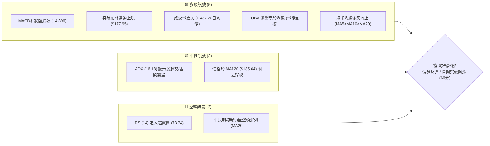
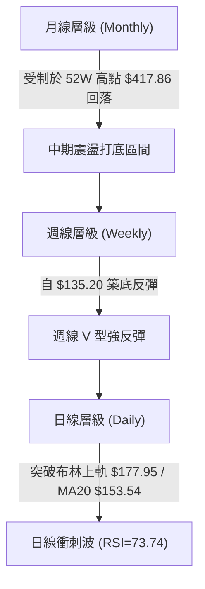
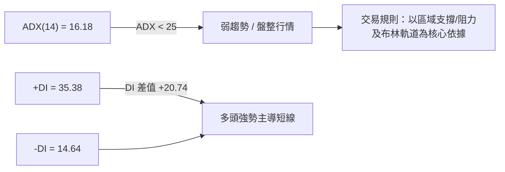
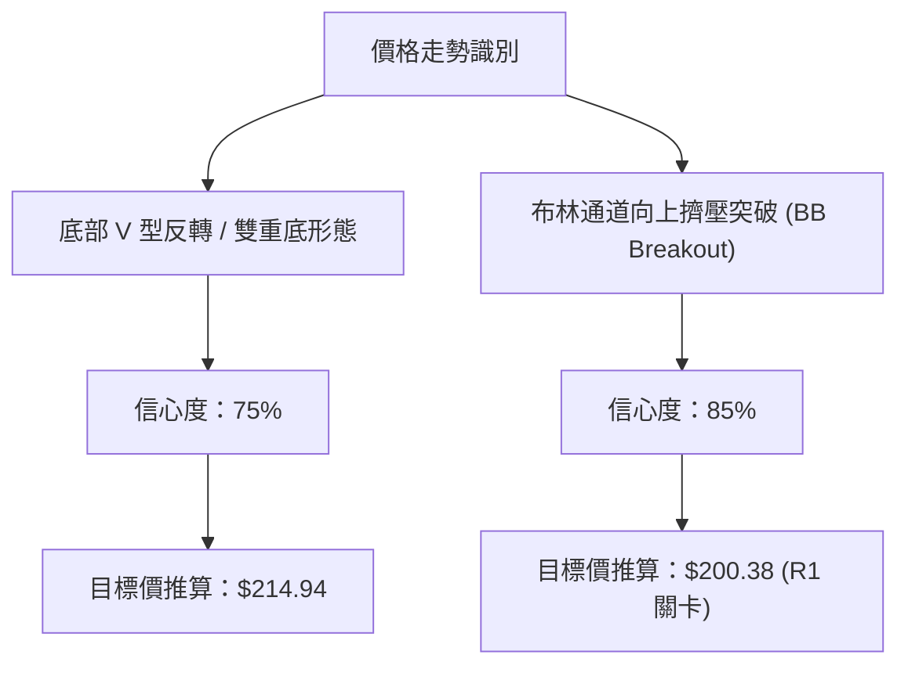
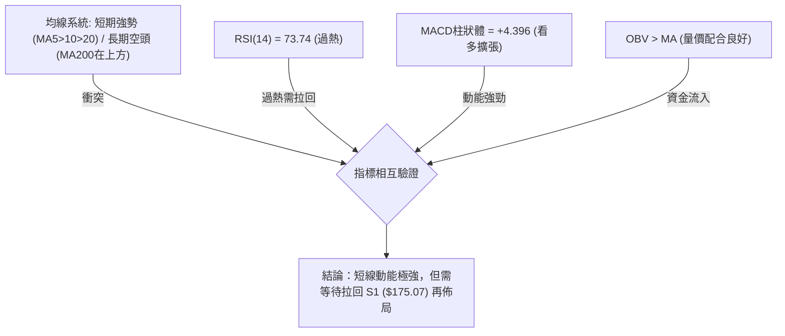
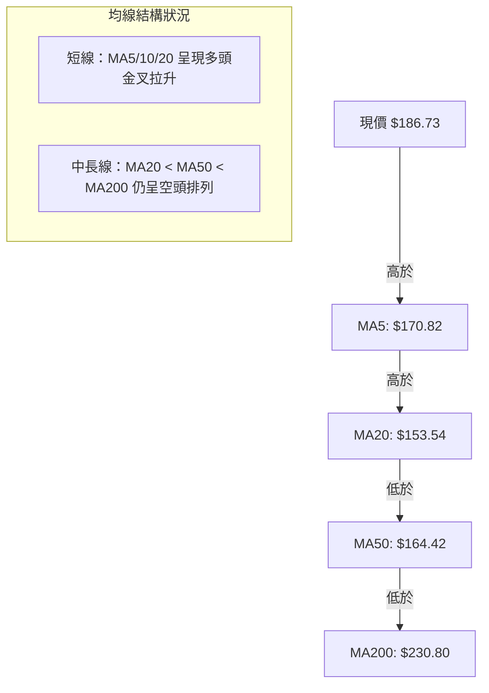
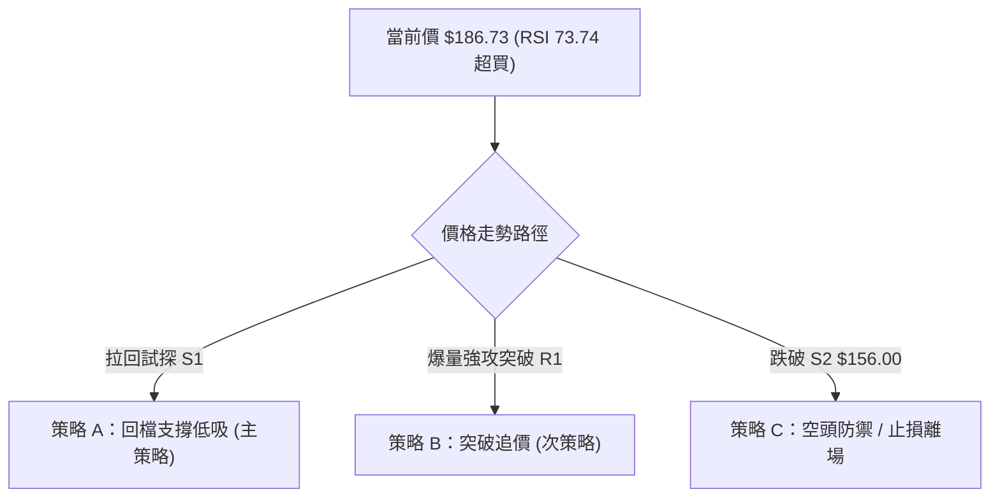
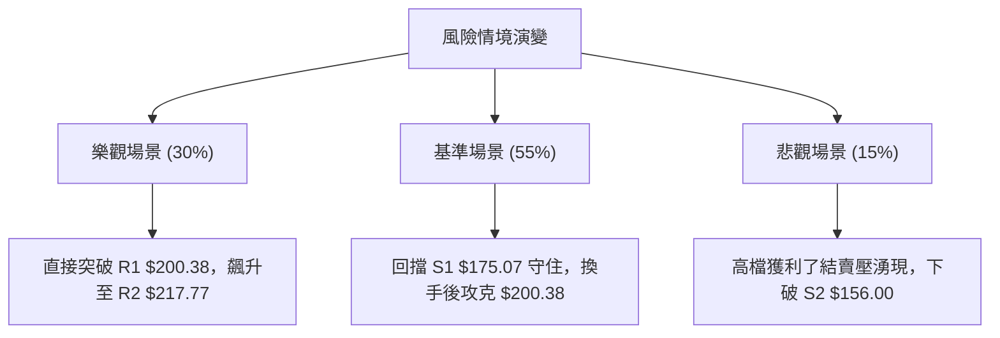

# AVAV 技術分析報告

> **報告日期**：2026-08-08 ｜ **語言**：繁體中文 ｜ **數據來源**：Yahoo Finance ｜ **當前價格**：$186.73

---

## 目錄

| 章節 | 內容 |
|------|------|
| [1. 技術面概覽](#1-技術面概覽) | 訊號儀表板、核心指標、評分卡 |
| [2. 趨勢分析](#2-趨勢分析) | 多時框趨勢、長中短期走勢、ADX強弱判斷 |
| [3. 圖表形態分析](#3-圖表形態分析) | 形態識別信心度、K線組合、目標價計算 |
| [4. 支撐與阻力](#4-支撐與阻力) | 關鍵價位圖、阻力支撐表、斐波那契回調 |
| [5. 技術指標深度解讀](#5-技術指標深度解讀) | MA/RSI/MACD/布林/量價配合與背離分析 |
| [6. 動能與波動率](#6-動能與波動率) | 動能四象限、ATR風控、Beta與市場相關性 |
| [7. 多時框架總結](#7-多時框架總結) | 時框架評分矩陣與多時框收斂結論 |
| [8. 交易策略建議](#8-交易策略建議) | 策略分流、價格階梯、情境機率、多空交易計劃 |
| [9. 風險提示與監控](#9-風險提示與監控) | 監控指標清單、三情境風險場景 |

---

## 1. 技術面概覽

### 🎯 技術訊號儀表板



### 📊 核心指標速覽表

| 指標類別 | 指標名稱 | 當前數值 | 訊號 | 解讀 |
|----------|----------|----------|------|------|
| **價格** | 當前價格 | $186.73 | 🟢 多頭 | 站上 52 週區間 18.2% 位置，自低點強勁反彈 |
| **均線** | MA20 | $153.54 | 🟢 多頭 | 價格位於 MA20 上方 (+21.62%)，短線呈急漲態勢 |
| **均線** | MA50 | $164.42 | 🟢 多頭 | 價格已收復 MA50 上方 (+13.57%) |
| **均線** | MA200 | $230.80 | 🔴 空頭 | 價格仍受制於 MA200 下方 (-19.09%)，長期趨勢未改 |
| **動能** | RSI(14) | 73.74 | 🔴 超買 | 進入高檔超買區，短線留意回檔拉回過熱壓力 |
| **動能** | MACD | +4.396 (Hist) | 🟢 看多 | MACD線(3.443)快叉信號線(-0.953)，柱狀圖持續擴張 |
| **波動** | ATR(14) | $10.51 | 🟡 中性 | 日波幅達 5.63%，屬於中高波動狀態 |

### 🏆 技術評分卡

```
╔══════════════════════════════════════════════════════════════╗
║              技術評分卡 — AVAV (2026-08-08)                  ║
╠══════════════════════════════════════════════════════════════╣
║ 趨勢強度      ▓▓▓▓▓▓▓▓░░░░░░░░░░░░  40/100  🟡 中性 (ADX<25)║
║ 動能指標      ▓▓▓▓▓▓▓▓▓▓▓▓▓▓░░░░░░  70/100  🟢 強勁 (MACD擴張)║
║ 支撐穩定度    ▓▓▓▓▓▓▓▓▓▓▓▓▓▓▓░░░░░  75/100  🟢 良好 (底部確立)║
║ 成交量配合    ▓▓▓▓▓▓▓▓▓▓▓▓▓▓▓▓░░░░  80/100  🟢 充沛 (1.43x均量)║
║ 形態完整度    ▓▓▓▓▓▓▓▓▓▓▓▓▓░░░░░░░  65/100  🟡 中性 (築底反彈)║
║ 均線排列      ▓▓▓▓▓▓▓▓▓▓░░░░░░░░░░  50/100  🟡 中性 (長空短多)║
╠══════════════════════════════════════════════════════════════╣
║ 綜合評分      ▓▓▓▓▓▓▓▓▓▓▓▓▓░░░░░░░  66/100  🟢 偏多反彈       ║
╚══════════════════════════════════════════════════════════════╝
```

---

## 2. 趨勢分析

### 🌐 多時框趨勢分析



### 📈 長期趨勢 — 24個月走勢圖（Unicode）

```
AVAV 24個月歷史價格走勢圖（2024-08 至 2026-08）
價格軸 ($)
$400 ┤                                 ● $369.91
$350 ┤                             ●
$300 ┤                     ●
$250 ┤ ●               ●               ●
$200 ┤   ●   ●   ●   ●                   ●                 ● $186.73 (現價)
$150 ┤         ●   ●                           ●   ●   ●
$100 ┤                                               ● $135.20 (52W低點)
     └─┬───┬───┬───┬───┬───┬───┬───┬───┬───┬───┬───┬───┬───┬───
       24-08  24-12  25-04  25-08  25-12  26-04  26-08
```

#### 走勢特徵分析表

| 階段 | 時間區間 | 收盤價區間 | 漲跌特徵 | 技術意涵 |
|------|----------|------------|----------|----------|
| **高檔震盪** | 2024-08 ~ 2025-02 | $203.76 → $149.62 | 階段性拉回洗盤 | 第一次下探築底 |
| **主升段暴拉**| 2025-03 ~ 2025-10 | $119.19 → $369.91 | 強勁單邊多頭漲勢 | 創下近兩年波段極致高點 |
| **主降段重挫**| 2025-11 ~ 2026-07 | $369.91 → $137.95 | 多頭踩踏流失，持續探底 | 形成 52 週低點 $135.20 |
| **急促強反彈**| 2026-07 ~ 2026-08 | $137.95 → $186.73 | 底部放量包覆，強力叩關 | 突破短中期均線，挑戰 R1 $200.38 |

### 📊 中期趨勢（週線分析）

從近 20 週數據觀察，AVAV 在 2026 年 6 月底至 7 月底於 **$135.20 - $142.20** 區間完成了二次打底，成交量在 2026-07-05 放大至 1,831 萬股（極致換手量）。隨後在 2026-08-09 當週以大陽線爆發，單週收盤衝上 **$186.73**，一舉站上 20 週均線（$153.54）與 50 週均線（$164.42）。

### ⚡ 趨勢強度評估（ADX 解讀）



#### ADX 指標強度對照

- **當前 ADX(14)**：`16.18` ▓▓▓▓▓░░░░░░░░░░░░░░░ (弱趨勢/區間架構)
- **分析結論**：雖然價格單週大漲，但 ADX 尚未升破 25，說明**整體格局仍屬於大範圍區間震盪中的急漲波**，而非單邊趨勢主升段。操作上不可盲目追高，需防範過熱拉回。

---

## 3. 圖表形態分析

### 🔍 形態識別系統



#### 形態評估與信心度表

| 形態名稱 | 信心度 | 判斷依據（引用數據） | 完成度 | 目標價（附計算式） |
|----------|--------|----------------------|--------|--------------------|
| **V型急反轉/雙底** | 75% | 7月波段低點 $137.95 與 $142.20 形成雙底，攻破頸線 S1 $175.07 | 85% | 頸線 $175.07 + (頸線 $175.07 - 低點 $135.20) = **$214.94** |
| **布林上軌突破** | 85% | 現價 $186.73 突破 BB 上軌 $177.95，%B 達到 1.18 | 100% | 第一目標直指阻力位 **R1 $200.38** |

### 🕯️ 重要 K 線形態分析（近 5 週）

| 週別 | 收盤價 | K線形態 | 解讀 | 訊號 |
|------|--------|---------|------|------|
| 2026-07-12 | $144.58 | 長下影陰線 | 探底測試 $135.20 支撐，吸引買盤進場 | 🟡 止跌訊號 |
| 2026-07-19 | $142.20 | 磨底十字星 | 成交量縮至 708 萬，拋壓衰竭 | 🟡 沉澱打底 |
| 2026-07-26 | $149.51 | 小陽線突圍 | MACD 柱狀體翻紅 (+1.248) | 🟢 預備反攻 |
| 2026-08-02 | $149.37 | 窄幅整理星 | 蓄勢打底，主力籌碼鎖定 | 🟡 中繼整理 |
| 2026-08-09 | $186.73 | 爆量大長紅 | 一棒突破 MA20/MA50，RSI 急升至 73.74 | 🟢 強勢攻擊 |

### 📉 ASCII 形態示意圖

```
AVAV 底部 V 型反轉與布林突破示意圖
價位 ($)
$217.77 ┤                                            [阻力 R2]
$200.38 ┤                                    ▲       [阻力 R1]
$186.73 ┤                                  ● [現價突破上軌]
$177.95 ┼ - - - - - - - - - - - - - - - - ╔═ [BB 上軌] - - - -
$175.07 ┤                     ▲ (頸線突破)║
$153.54 ┼ - - - - - - - - - - ║ - - - - - ╠═ [BB 中軌/MA20] - -
$135.20 ┤   ● (V底二腳) ──────╝           ╚═ [BB 下軌 $129.13]
```

### 🎯 形態目標價計算

1. **V 型底形態推算目標價**：
   - 底部支撐 Zone = $135.20
   - 突破頸線 Zone = $175.07 (S1)
   - 形態垂直高度 $H = $175.07 - $135.20 = $39.87$
   - 最小測量目標價 = $175.07 + $39.87 = **$214.94** (落於 R1 $200.38 與 R2 $217.77 之間)

---

## 4. 支撐與阻力

### 🗺️ 關鍵價位分布圖（Unicode）

```
AVAV 價位結構與關鍵密積區分布圖
═══════════════════════════════════════════════════════════════
$243.18 ║████████████████████████████████║ 斐波那契 61.8% 回調位
$230.80 ║████████████████████████        ║ 扣押重壓 MA200 均線
$222.40 ║████████████████████            ║ 強波段阻力 R3
$217.77 ║████████████████                ║ 近一年高點聚類阻力 R2
$200.38 ║████████████████████████████    ║ 心理關卡與波段阻力 R1
$195.69 ║██████████████                  ║ 斐波那契 78.6% 回調位
$186.73 ╠════════════════════════════════╣ ◄ 現價 (BB Upper 上方)
$175.07 ║▓▓▓▓▓▓▓▓▓▓▓▓▓▓▓▓▓▓▓▓▓▓▓▓▓▓▓▓    ║ 頸線轉換近端支撐 S1
$164.42 ║▓▓▓▓▓▓▓▓▓▓▓▓▓▓                  ║ 中期均線支撐 MA50
$156.00 ║▓▓▓▓▓▓▓▓▓▓▓▓▓▓▓▓▓▓▓▓            ║ 關鍵波段低點支撐 S2
$139.76 ║▓▓▓▓▓▓▓▓▓▓▓▓▓▓▓▓                ║ 密積防守底線 S3
$135.20 ║▓▓▓▓▓▓▓▓▓▓▓▓▓▓▓▓▓▓▓▓▓▓▓▓▓▓▓▓▓▓▓▓║ 52 週極致低點 (100.0%)
═══════════════════════════════════════════════════════════════
```

### 🚧 阻力位分析表

| 阻力級別 | 價位 | 數據來源 / 形成原因 | 突破難度 | 重要性 |
|----------|------|---------------------|----------|--------|
| **R1** | **$200.38** | 近一年波段高點聚類 / $200 心理大關 | 🟡 中等 | ★★★★☆ |
| **R2** | **$217.77** | 近一年波段高點聚類 / V底測量目標延伸 | 🔴 偏高 | ★★★★☆ |
| **R3** | **$222.40** | 近一年波段高點聚類 / 接近 MA200 壓力區 | 🔴 極高 | ★★★★★ |

### 🛡️ 支撐位分析表

| 支撐級別 | 價位 | 數據來源 / 形成原因 | 守住機率 | 重要性 |
|----------|------|---------------------|----------|--------|
| **S1** | **$175.07** | 近一年波段低點聚類 / 原阻力轉為極佳支撐 | 🟢 80% | ★★★★★ |
| **S2** | **$156.00** | 近一年波段低點聚類 / 接近 MA20 ($153.54) | 🟢 85% | ★★★★☆ |
| **S3** | **$139.76** | 近一年波段低點聚類 / 近 52 週底部防守帶 | 🟢 90% | ★★★★★ |

### 📐 斐波那契回調位分析（52週區間 $135.20 → $417.86）

| 回調比例 | 價位 | 當前相對位置與解讀 |
|----------|------|--------------------|
| **0.0% (52W High)** | $417.86 | 歷史高點，遠端目標 |
| **23.6%** | $351.15 | 超強長線牛熊分界點 |
| **38.2%** | $309.88 | 中長期多頭強勢回檔區 |
| **50.0%** | $276.53 | 中長線中軸價值區間 |
| **61.8%** | $243.18 | 強壓力區，接近 MA200 ($230.80) |
| **78.6%** | **$195.69** | **短線直接解套壓力位**（現價 $186.73 正逼近此區） |
| **100.0% (52W Low)**| $135.20 | 堅不可摧的底部基石 |

---

## 5. 技術指標深度解讀

### 🎛️ 指標訊號總覽



### 📈 移動平均線排列分析



- **均線分析**：雖然長線 MA200 ($230.80) 仍呈壓制，但短線價格已突破 MA5, MA10, MA20, MA50 與 MA120 ($185.64)，顯示強烈的波段反彈動能。

### 📉 RSI(14) 分析

- **當前數值**：`73.74` ▓▓▓▓▓▓▓▓▓▓▓▓▓▓▓▓▓▓░░ [🔴 超買 > 70]
- **背離判斷**：目前價格與 RSI 同步創近期新高，**無明顯頂背離現象**，顯示買盤純度高，但由於數值 > 70，短線不宜追高。

### 📊 MACD (12, 26, 9) 訊號解讀

- **MACD 線**：`3.443`
- **Signal 線**：`-0.953`
- **MACD 柱狀體**：`+4.396` 🟢 看多
- **解讀**：MACD 已於零軸下方完成黃金交叉，且柱狀圖強勢擴張至 +4.396，說明中短線買盤力量充沛，多頭掌控市場主導權。

### 📦 布林通道分析

```
布林通道現狀示意圖 (Bollinger Bands)
┌────────────────────────────────────────────────────────┐
│ Upper Band (上軌): $177.95                             │
│ Mid Band (MA20):   $153.54                             │
│ Lower Band (下軌): $129.13                             │
├────────────────────────────────────────────────────────┤
│ 現價: $186.73  (突破上軌，%B = 1.18)                    │
└────────────────────────────────────────────────────────┘
```
- **解讀**：價格噴出上軌（$177.95），%B 達到 1.18。在 ADX < 25 的盤整結構中，價格噴出布林上軌通常會引發**向中軌或上軌邊緣（$175-$178）的均值回歸拉回**。

### 💹 成交量分析（量價配合度）

- **最新成交量**：1,902,532 股
- **20 日均量**：1,327,887 股（**量比 1.43x**）
- **OBV 趨勢**：`OBV > MA`，量能確實支撐價格上漲，籌碼向法人與主力集中（機構持股高達 90.7%）。

---

## 6. 動能與波動率

### ⚡ 動能評估象限

| 象限 | 動能強度 | 波動率 | 當前狀態 | 評估與策略 |
|------|----------|--------|----------|------------|
| Q1 | 強動能 | 低波動 | - | 穩定上升趨勢 |
| Q2 | 弱動能 | 低波動 | - | 沉悶盤整整理 |
| **Q3** | **強動能** | **高波動** | **✓ (AVAV當前位置)** | **急漲噴發段，適合尋求拉回支撐點進場** |
| Q4 | 弱動能 | 高波動 | - | 恐慌殺盤階段 |

### 📊 ATR 波動率分析

- **ATR(14)**：`$10.51`（占股價 `5.63%`）
- **風控考量**：日均波幅約 $10.51，意味著進場止損距離至少需設定在 **1.5x - 2.0x ATR**（即 **$15.77 - $21.02**）之外，以避免被正常日內噪音掃出場。

### 📐 Beta 與市場相關性

- **Beta 係數**：`1.412`（屬於高 Beta 國防科技成長股）
- **解讀**：波動度高於大盤 41.2%，當美股大盤走強時，AVAV 具備更高的反彈彈性。

---

## 7. 多時框架總結

### 📋 時框架評分表

| 時框架 | 趨勢方向 | 動能 | 均線排列 | 形態 | 綜合評分 | 建議 |
|--------|----------|------|----------|------|----------|------|
| **日線 (Daily)** | 🟢 多頭強反彈 | 🟢 RSI 73.74 / MACD擴張 | 🟡 短多長空 | 🟢 布林突破 | **80/100** | 待回檔支撐做多 |
| **週線 (Weekly)**| 🟢 底部突破 | 🟢 MACD綠柱翻紅 | 🟡 收復MA20/50 | 🟢 雙底完成 | **65/100** | 中線分批佈局 |
| **月線 (Monthly)**| 🔴 長期下行 | 🟡 RSI 恢復中性 | 🔴 偏空排列 | 🟡 止跌回升 | **50/100** | 長線築底階段 |

### 🔲 綜合訊號矩陣

```
       日線 (Daily)    週線 (Weekly)   月線 (Monthly)
動能:     🟢 強勁          🟢 轉強         🟡 平淡
均線:     🟢 突破          🟡 站上         🔴 受制
形態:     🟢 突破          🟢 雙底         🟡 打底
```

### ⚖️ 多時框收斂結論

根據規則 14：當前 ADX = 16.18（< 25，屬於盤整與築底結構）。雖然日線出現爆量強漲，但長期均線（MA200 $230.80）仍於上方形成壓制。因此，**收斂後的最終唯一結論為：偏多反彈（波段操作），以日線回擋 S1 支撐 ($175.07) 作為主要買點，第一目標鎖定 R1 ($200.38)，第二目標鎖定 R2 ($217.77)**。

---

## 8. 交易策略建議

### 🗺️ 策略決策流程圖



### 🧭 策略路由

> **當前主策略方向：🟢 多頭拉回買進策略（綜合評分 66/100）**

### 🎯 價格情境階梯 (Price Scenarios)

| 觸發條件 | 下一目標 | 後續延伸 | 情境含義 |
|----------|----------|----------|----------|
| **突破 R1 $200.38** | R2 $217.77 | R3 $222.40 | 多頭主升段延續，挑戰 MA200 |
| **站穩 S1 $175.07** | $186.73 (現價) | R1 $200.38 | 健康回檔築底，準備二次上攻 |
| **跌破 S1 $175.07** | S2 $156.00 | S3 $139.76 | 短線反彈結束，重回震盪區間 |

### 📊 情境機率分佈

| 情境 | 機率 | 主要依據 |
|------|------|----------|
| **回檔 S1 後繼續上行** | **55%** | MACD 柱狀體強勢 (+4.396)、量能 1.43x 支撐、V型底完成 |
| **高位區間震盪消化過熱**| **30%** | RSI = 73.74 需時間拉回修復、ADX = 16.18 顯現無單邊趨勢 |
| **回落跌破 S2 探底** | **15%** | MA200 長線空頭頭頂壓制、總體經濟防衛預算變數 |

### 🟢 主策略詳情

#### 策略 A：回檔支撐低吸（主推策略）
- **進場條件**：價格順利拉回至 **$175.07 (S1)** 附近，且日線收長下影線或止跌 K 線。
- **進場價格**：`$175.07 - $178.00`
- **止損價格**：`$164.42`（MA50 均線位置，跌破即代表反彈力道衰竭）
- **目標價 T1**：`$200.38` (R1 阻力位)
- **目標價 T2**：`$217.77` (R2 阻力位)
- **風險報酬比**：
  - 風險額 = $175.07 - $164.42 = $10.65
  - 報酬額 (T1) = $200.38 - $175.07 = $25.31
  - **風報比 R:R = 2.38 : 1** 🟢 良好
- **建議倉位**：`15% - 20%`

#### 策略 B：突破追價（次要策略）
- **進場條件**：日線帶量（>1.5x 均量）實體陽線強勢突破並收高於 **$200.38 (R1)**。
- **進場價格**：`$200.50 - $202.00`
- **止損價格**：`$186.73`（即當前價格/突破前低點）
- **目標價 T1**：`$217.77` (R2)
- **目標價 T2**：`$222.40` (R3)
- **風險報酬比**：
  - 風險額 = $200.50 - $186.73 = $13.77
  - 報酬額 (T1) = $217.77 - $200.50 = $17.27
  - **風報比 R:R = 1.25 : 1** 🟡 偏低，需嚴格控管倉位
- **建議倉位**：`5% - 10%`

### 🔴 反向風險觸發點（對沖與風控提示）

若價格未給予拉回買點，反而直接**跌破 S2 ($156.00)**，代表短線多頭結構破壞，應立即停止所有多頭操作並進行部位對沖或清倉觀望。

### ⭐ 整體訊號強度評星

```
做多訊號強度：★★██☆  (4/5星)  - 底部確立，爆量突破
做空訊號強度：★████  (1/5星)  - 動能強勁，不宜盲目做空
整體可信度：  ★★██☆  (4/5星)  - 多指標相互印證
```

---

## 9. 風險提示與監控

### ✅ 關鍵監控指標 Checklist

```
╔══════════════════════════════════════════════════════════════╗
║                AVAV 風險監控指標 CHECKLIST                    ║
╠══════════════════════════════════════════════════════════════╣
║ [ ] 價格是否維持在 S1 ($175.07) 上方？                      ║
║ [ ] RSI(14) 是否順利自 73.74 回落至 50-60 中性區間？         ║
║ [ ] MACD 柱狀體是否持續維持在 零軸上方擴張？                ║
║ [ ] 成交量在拉回時是否呈縮量狀態（<1,327,887 股）？          ║
║ [ ] 價格逼近 R1 ($200.38) 時是否有法人買盤接力？             ║
╚══════════════════════════════════════════════════════════════╝
```

### ⚠️ 風險場景分析



### 🛡️ 風險管理重要提醒

1. **過熱修正風險**：當前 RSI 73.74 處於超買狀態，追高勝率較低，**務必等待拉回 S1 ($175.07) 再進行佈局**。
2. **波動度防護**：ATR 為 $10.51，單日震盪較大，嚴禁使用過高槓桿。
3. **長期均線壓制**：MA200 ($230.80) 仍具強烈解套賣壓，接近 $217 - $222 區域應分批獲利結案。

---

## 📋 報告總結

```
╔══════════════════════════════════════════════════════════════╗
║                 AVAV 技術分析報告總結                        ║
════════════════════════════════════════════════════════════════
 報告日期：2026-08-08
 當前價格：$186.73
 分析評級：🟢 偏多反彈 (區間突破試探)

 關鍵價位速查：
 ├─ 長期趨勢：🔴 空頭控盤 (受制於 MA200 $230.80)
 ├─ 中短期趨勢：🟢 強勢反彈 (突破 MA20/MA50 與布林上軌)
 ├─ 關鍵支撐：S1 $175.07 ｜ S2 $156.00 ｜ S3 $139.76
 ├─ 關鍵阻力：R1 $200.38 ｜ R2 $217.77 ｜ R3 $222.40
 └─ 分析師目標價：$225.77 (均值)

 最優策略組合：
 1. 🥇 最佳機會：等待價格拉回 $175.07 - $178.00 建立多頭部位
 2. 🥈 止損位置：設定於 MA50 ($164.42)
 3. 🥉 目標位置：第一目標 $200.38，第二目標 $217.77
════════════════════════════════════════════════════════════════
```

---

> ⚠️ **免責聲明**：本報告為 AI 自動生成之技術分析，所有數據及估算均基於提供的歷史價格資訊。本報告**僅供研究與學術參考**，**不構成任何投資建議**。投資有風險，入市需謹慎。

*報告生成時間：2026-08-08 ｜ 數據來源：Yahoo Finance ｜ 分析框架：多時框技術分析*