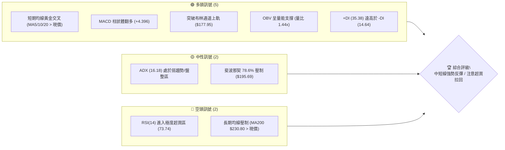
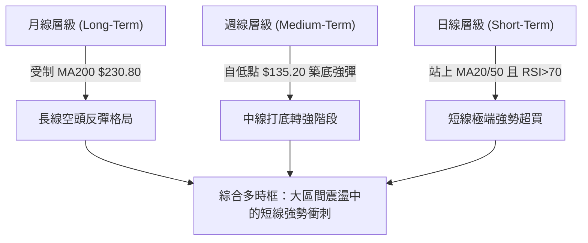
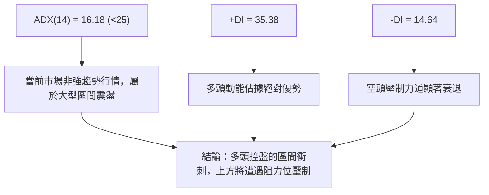
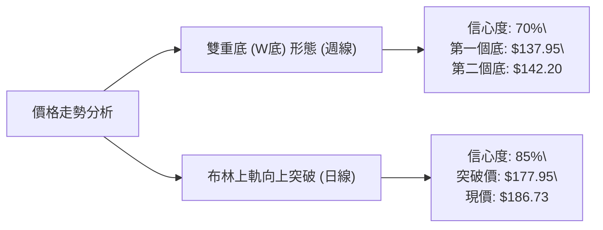
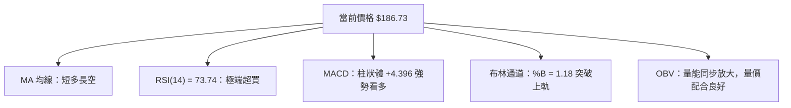
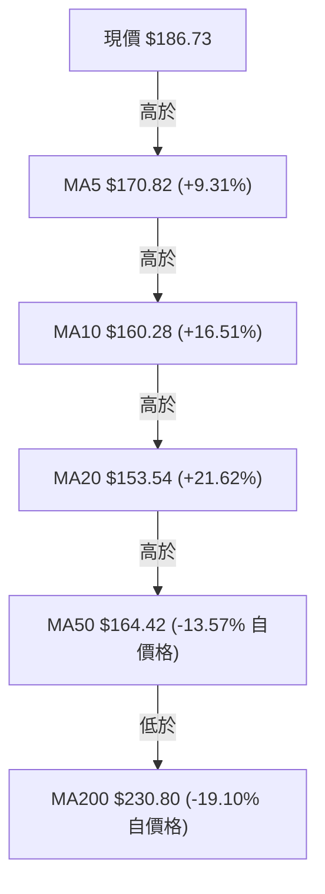
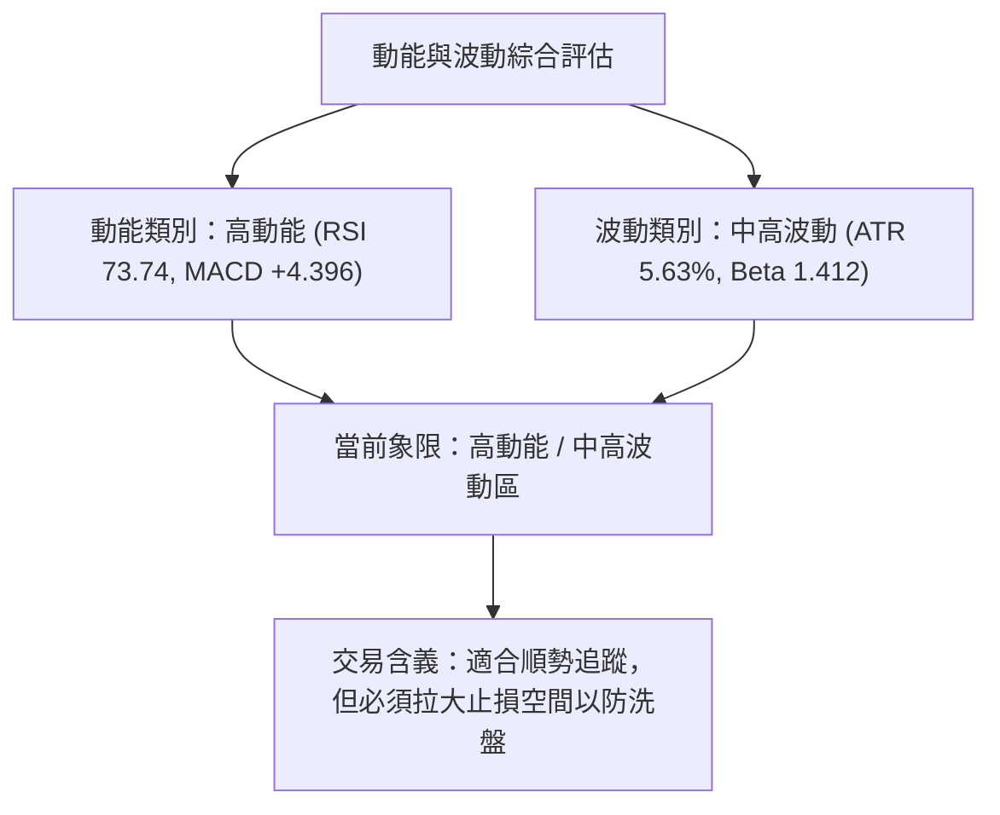
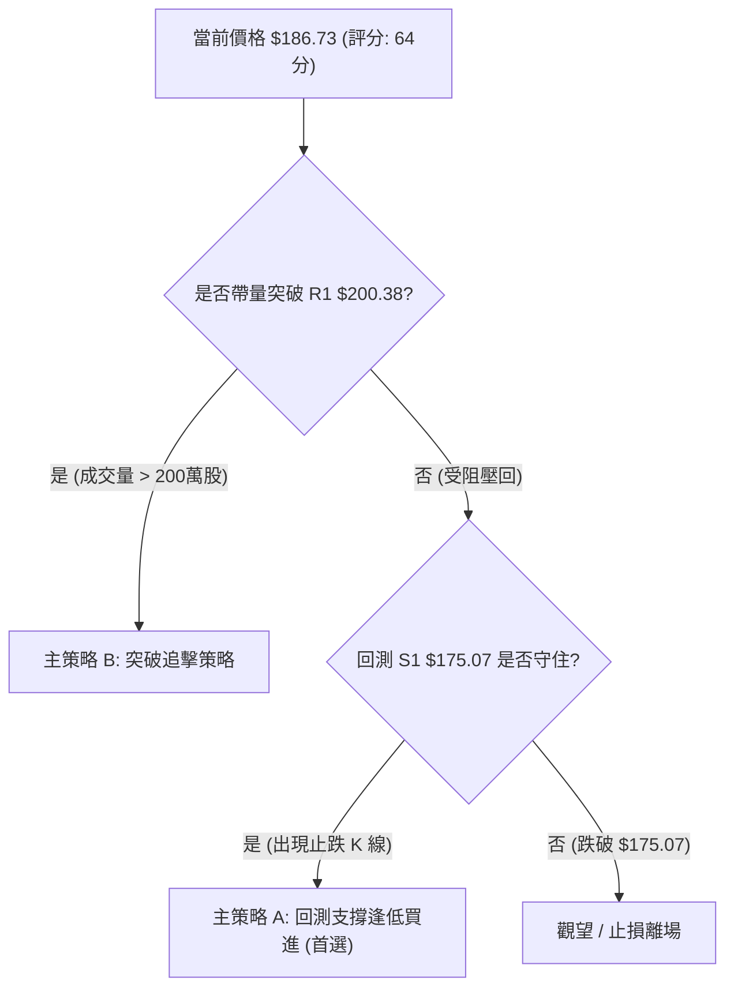
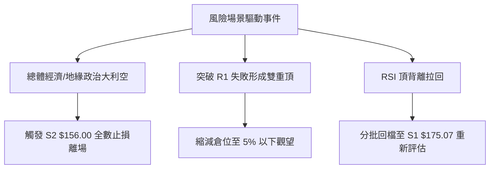

# AVAV 技術分析報告

> **報告日期**：2026-08-09 ｜ **語言**：繁體中文 ｜ **數據來源**：Yahoo Finance ｜ **當前價格**：$186.73

---

## 目錄

| 章節 | 內容 |
|------|------|
| [1. 技術面概覽](#1-技術面概覽) | 訊號儀表板、核心指標、評分卡 |
| [2. 趨勢分析](#2-趨勢分析) | 多時框趨勢、長中短期走勢 |
| [3. 圖表形態分析](#3-圖表形態分析) | 形態識別、K線組合、目標價 |
| [4. 支撐與阻力](#4-支撐與阻力) | 關鍵價位、斐波那契回調 |
| [5. 技術指標深度解讀](#5-技術指標深度解讀) | MA/RSI/MACD/布林/成交量 |
| [6. 動能與波動率](#6-動能與波動率) | 動能評估、ATR、Beta |
| [7. 多時框架總結](#7-多時框架總結) | 時框架評分矩陣 |
| [8. 交易策略建議](#8-交易策略建議) | 多空策略、風險報酬比 |
| [9. 風險提示與監控](#9-風險提示與監控) | 監控指標、風險場景 |

---

## 1. 技術面概覽

### 🎯 技術訊號儀表板



### 📊 核心指標速覽表

| 指標類別 | 指標名稱 | 當前數值 | 訊號 | 解讀 |
|----------|----------|----------|------|------|
| **價格** | 當前價格 | $186.73 | 🟢 多頭 | 站上 MA5/10/20/50/120，強勢反彈 |
| **均線** | MA20 | $153.54 | 🟢 多頭 | 價格高於 MA20 +21.62%，短期支撐強勁 |
| **均線** | MA50 | $164.42 | 🟢 多頭 | 價格高於 MA50 +13.57%，中期趨勢轉強 |
| **均線** | MA200 | $230.80 | 🔴 空頭 | 價格位於 MA200 下方 -19.10%，長線仍受壓 |
| **動能** | RSI(14) | 73.74 | 🔴 超買 | 突破 70 臨界點，短線有過熱拉回風險 |
| **動能** | MACD | +4.396 (柱狀) | 🟢 多頭 | DIF 上穿 DEA，多頭動能極度強勁 |
| **波動** | ATR(14) | $10.51 | 🟡 中性 | 佔股價 5.63%，日振幅維持中高水平 |
| **趨勢** | ADX(14) | 16.18 | 🟡 盤整 | 低於 25，顯示屬無趨勢盤整中的強彈 |
| **通道** | BB %B | 1.18 | 🔴 漲過頭 | 突破布林上軌 ($177.95)，呈極端超買 |

### 🏆 技術評分卡

```
╔══════════════════════════════════════════════════════════════╗
║                技術評分卡 — AVAV (2026-08-09)                 ║
╠══════════════════════════════════════════════════════════════╣
║ 趨勢強度 (ADX)     ███████░░░░░░░░░░░░░  35/100  🟡 弱趨勢   ║
║ 動能指標 (RSI/MACD) █████████████████░░░  85/100  🟢 強勁動能 ║
║ 支撐穩定度 (S1/S2) ██████████████░░░░░░  70/100  🟢 底部紮實 ║
║ 成交量配合 (OBV)   ███████████████░░░░░  75/100  🟢 量增價揚 ║
║ 形態完整度 (V型彈) ██████████████░░░░░░  70/100  🟢 彈幅顯著 ║
║ 均線排列 (MA系統)  ██████████░░░░░░░░░░  50/100  🟡 短多長空 ║
╠══════════════════════════════════════════════════════════════╣
║ 綜合評分           █████████████░░░░░░░  64/100  🟢 中性偏多 ║
╚══════════════════════════════════════════════════════════════╝
```

---

## 2. 趨勢分析

### 🌐 多時框趨勢分析



### 📈 長期趨勢 — 24個月走勢圖（Unicode）

```
AVAV 24個月收盤價走勢圖（2024-08 至 2026-08）
價格軸 ($)
$417.86 ┤                                  ● (52W High)
$369.91 ┤                          ●
$314.89 ┤                      ●
$284.95 ┤              ●
$241.89 ┤  ●       ●       ●       ●
$186.73 ┤  │   ●   │   ●   │   ●   │   ●               ●← (現價 $186.73)
$135.20 ┤──┴───┴───┴───┴───┴───┴───┴───┴───●───────────┴── (52W Low $135.20)
         24-08  24-12  25-04  25-08  25-12  26-04  26-07  26-08
```

**走勢特徵分析表格**：

| 階段 | 時間區間 | 價格區間 | 漲跌幅 | 走勢特徵描述 |
|------|----------|----------|--------|--------------|
| 1. 高位震盪 | 2024-08 ~ 2025-02 | $203.76 → $149.62 | -26.57% | 震盪回檔，跌破 $200 支撐位 |
| 2. 強勢主升 | 2025-03 ~ 2025-10 | $119.19 → $369.91 | +210.35%| 創下歷史級主升段，多頭極度強勢 |
| 3. 深度修正 | 2025-11 ~ 2026-03 | $279.46 → $183.05 | -34.50% | 高位賣壓湧現，均線呈死亡交叉 |
| 4. 探底築底 | 2026-04 ~ 2026-07 | $195.02 → $135.20 | -30.67% | 刷出 52 週新低 $135.20，爆量甩轎 |
| 5. 暴力反彈 | 2026-07 ~ 2026-08 | $135.20 → $186.73 | +38.11% | 單月暴力 V 型反轉，直逼 $190 |

### 📊 中期趨勢（週線分析）

從 2026 年近 20 週數據觀察，AVAV 在 2026-06-28 觸及週低點 $137.95，隨後在 2026-07-05 伴隨 **18,317,500** 的超大成交量拉出巨陽線，週收盤大漲至 $190.89。經過兩週的二次探底壓低（在 $142.20 - $149.51 獲得二次支撐）後，最新一週（2026-08-09）再次以 **6,772,400** 成交量大漲至 $186.73，週 RSI 飆升至 73.7，週 MACD 柱狀體擴大至 +4.396，確立了中期二次底部支撐（W底雛形）。

### ⚡ 趨勢強度評估（ADX 解讀）



| 指標名稱 | 數值 | 門檻基準 | 趨勢狀態解讀 |
|----------|------|----------|--------------|
| **ADX(14)** | 16.18 | < 25 (弱趨勢) | 市場缺乏單向持續性趨勢，操作宜採區間高拋低吸策略 |
| **+DI(14)** | 35.38 | > 20 (多頭強) |買盤力量強勁，短線多頭掌控發球權 |
| **-DI(14)** | 14.64 | < 20 (空頭弱) | 賣壓暫時退潮，空頭無力反擊 |

---

## 3. 圖表形態分析

### 🔍 形態識別系統



**形態信心度評估表**：

| 形態類別 | 信心度 | 判斷依據（引用數據） | 完成度 | 目標價（附計算式） |
|----------|--------|----------------------|--------|--------------------|
| **雙重底 (W底)** | 70% | 第一次低點 $137.95，第二次低點 $142.20，頸線區間位於 R1 $200.38 | 75% | 頸線 $200.38 + (頸線 $200.38 - 低點 $135.20) = **$265.56**（由形態高度推算） |
| **布林上軌突破**| 85% | 現價 $186.73 突破 BB 上軌 $177.95，成交量 1.44x 放大 | 100% | 第一阻力位 **$200.38** (R1) |

### 🕯️ 重要 K 線形態分析

| 月/週日期 | 收盤價 | K 線形態 | 解讀 | 訊號 |
|-----------|--------|----------|------|------|
| 2026-06-28 | $137.95 | 長黑甩轎 (恐慌殺盤) | 跌破所有均線，爆出 1,188 萬股量，形成 52W 最終底部 | 🔴 恐慌極限 |
| 2026-07-05 | $190.89 | 巨量長紅 (吞噬反轉) | 爆出 1,831 萬股天量，單週包覆前一週陰線，確立底部 | 🟢 強烈買進 |
| 2026-07-19 | $142.20 | 縮量二次測底 | 價格回撤但未破前低，量能縮至 708 萬股，買盤托底 | 🟢 測試支撐成功 |
| 2026-08-09 | $186.73 | 攻擊型大陽線 | 量能放大至 677 萬股，RSI 衝破 70，向上突破突破點 | 🟢 多頭攻擊 |

### 📉 ASCII 走勢形態示意圖

```
AVAV 週線雙底 (W-Bottom) 與突破示意圖
價位 ($)
$200.38 ┤───────────────────────預估頸線 R1──────────────────────── (關鍵突破點)
        │                       /  \
$186.73 ┤                      /    ● (當前價格)
        │       ● (反彈高點)  /
$160.00 ┤──────/─\───────────/─────────────────────────────────
        │     /   \         /
        │    /     \       /
$135.20 ┤───●───────\─────●──────────────────────────────────── (52W Low 支撐區)
         第一底      低點  第二底
       (06/28)     (07/19) (08/09)
```

---

## 4. 支撐與阻力

### 🗺️ 關鍵價位分布圖（Unicode）

```
AVAV 價位結構分布圖
═══════════════════════════════════════════════════════════════
$222.40 ║████████████████████████████████████║ 強阻力 R3 (+19.10%)
$217.77 ║████████████████████████            ║ 阻力 R2   (+16.62%)
$200.38 ║████████████████████████████████████║ 關鍵阻力 R1 (+7.31%)
$195.69 ║▓▓▓▓▓▓▓▓▓▓▓▓▓▓▓▓▓▓▓▓▓▓▓▓▓▓▓▓        ║ 斐波 78.6% 回調位
$186.73 ╠════════════════════════════════════╣ ◄ 當前價格 $186.73
$175.07 ║▓▓▓▓▓▓▓▓▓▓▓▓▓▓▓▓                    ║ 近期關鍵支撐 S1 (-6.24%)
$156.00 ║████████████████████████████████████║ 強支撐 S2 (-16.46%)
$139.76 ║████████████████████                ║ 極限支撐 S3 (-25.15%)
═══════════════════════════════════════════════════════════════
```

### 🚧 阻力位分析表

| 阻力級別 | 價位 | 形成原因（引用 OHLCV 數據） | 突破難度 | 重要性 |
|----------|------|----------------─────────────|----------|--------|
| **R1** | **$200.38** | 近一年波段高點聚類；整數心理關卡 | 🟡 中等 | 🟢 頸線關鍵位，突破則 W 底確立 |
| **R2** | **$217.77** | 波段密集成交解套區；前波反彈高點 | 🔴 偏高 | 🟡 中期多空分水嶺 |
| **R3** | **$222.40** | 近一年強阻力聚類點；接近 MA200 ($230.80) | 🔴 極高 | 🔴 長期下降趨勢線頂部 |

### 🛡️ 支撐位分析表

| 支撐級別 | 價位 | 形成原因（引用 OHLCV 數據） | 守住機率 | 重要性 |
|----------|------|----------------─────────────|----------|--------|
| **S1** | **$175.07** | 近一年波段低點聚類；接近布林上軌 $177.95 | 🟢 高 | 🟢 短線多頭防守第一線 |
| **S2** | **$156.00** | 密集成交區底端；接近 MA20 ($153.54) | 🟢 極高 | 🟢 中線多空強弱支撐線 |
| **S3** | **$139.76** | 52 週波段低點聚類（$135.20-$137.95 區間）| 🟢 極高 | 🔴 絕對防線，破則創新低 |

### 📐 斐波那契回調位分析

依據 52 週高低點區間（高點 **$417.86** → 低點 **$135.20**，總波幅 **$282.66**）：

| 回調比例 | 價位 | 與當前價格 ($186.73) 之關係與解讀 |
|----------|------|------------------------------------|
| **0.0% (52W High)** | $417.86 | 歷史天價區 |
| **23.6%** | $351.15 | 遠期超強阻力區 |
| **38.2%** | $309.88 | 中遠期目標位 |
| **50.0%** | $276.53 | 中期牛熊分界線 |
| **61.8%** | $243.18 | 接近 MA240 ($243.05) 重疊阻力 |
| **78.6%** | **$195.69** | **當前價格直逼之第一道斐波那契反彈阻力** |
| **100.0% (52W Low)**| $135.20 | 本輪循環之絕對大底 |

**解讀**：當前價 $186.73 介於 100.0% ($135.20) 與 78.6% ($195.69) 之間。若能有效帶量突破 **$195.69**，將打開通往 61.8% ($243.18) 的強烈反彈空間。

---

## 5. 技術指標深度解讀

### 🎛️ 指標訊號總覽



### 📈 移動平均線排列分析



*   **短期排列**：MA5 ($170.82) > MA10 ($160.28) > MA20 ($153.54)，呈現標準多頭發散，短線動能極度充沛。
*   **長期排列**：MA20 ($153.54) < MA50 ($164.42) < MA200 ($230.80)，整體大結構仍為空頭排列。現價已突破 MA50 及 MA120 ($185.64)，正試圖展開對長期空頭頭寸的修正。

### 📉 RSI(14) 分析

*   **當前數值**：**73.74**
*   **進度條**：`███████████████░░░░░ 73.74%` 🔴 **超買 (>70)**
*   **狀態評估**：RSI 突破 70 警戒線，顯示短線買盤過熱。
*   **背離判斷**：檢視近期走勢，價格自 $135.20 猛烈拉升至 $186.73，RSI 同步創近期新高，**「無明顯背離」**現象。過熱屬於多頭強勢推升之特徵，但隨時可能引發技術性乖離修正。

### 📊 MACD(12,26,9) 訊號解讀

*   **DIF (MACD Line)**: **3.443**
*   **DEA (Signal Line)**: **-0.953**
*   **MACD Histogram**: **+4.396** 🟢 **看多**
*   **解讀**：DIF 線已強勢穿越零軸與訊號線，柱狀體呈大幅正向擴展 (+4.396)。此為典型的多頭強勢訊號，顯示反彈波段正處於加速度發酵期。

### 📦 布林通道分析

```
ASCII 布林通道與現價相對位置
$177.95 ┤────────────────────────────── 布林上軌 (BB Upper)
        │                          ● $186.73 (現價突破上軌，%B=1.18)
$153.54 ┤────────────────────────────── 布林中軌 (MA20)
        │
$129.13 ┤────────────────────────────── 布林下軌 (BB Lower)
```

*   **上軌**：$177.95 ｜ **中軌 (MA20)**：$153.54 ｜ **下軌**：$129.13
*   **BB %B**：**1.18**（高於 1.0 代表價格已噴出布林通道上軌）。
*   **解讀**：股價噴出布林上軌常伴隨兩種情境：（1）進入極端強勢的「抓軌」主升段；（2）短線技術指標過熱拉回軌道內（向中軌 $153.54 或 S1 $175.07 靠攏）。

### 💹 成交量分析（量價配合度）

*   **最新日成交量**：1,909,900 股
*   **20 日均量**：1,328,255 股 (量比：**1.44x**)
*   **OBV 趨勢**：OBV > MA，量能指標呈現穩定向上，與價格漲幅形成良好的**「量增價揚」**互相確認關係，未見量價背離危訊。

---

## 6. 動能與波動率

### ⚡ 動能評估



| 評估維度 | 當前狀態 | 數據依據 | 對交易之影響 |
|----------|----------|----------|--------------|
| **動能強度** | 🟢 極強 | RSI=73.74, MACD柱=+4.396 | 短線具推升慣性，不宜盲目逆勢做空 |
| **波動強度** | 🟡 中高 | ATR=$10.51 (5.63%), Beta=1.412 | 日均波幅達 $10 美元，進場點需精密計算 |

### 📊 ATR 波動率分析

*   **ATR(14)**：**$10.51**（佔當前股價 5.63%）
*   **風控應用建議**：
    *   **短線止損距離 (1.5x ATR)**：1.5 × $10.51 = **$15.77**（進場點下方需給予約 $15.77 之緩衝）。
    *   **波段止損距離 (2.0x ATR)**：2.0 × $10.51 = **$21.02**。

### 📐 Beta 與市場相關性

*   **Beta 係數**：**1.412**
*   **解讀**：AVAV 之波動度較標普 500 大盤高出 41.2%。在大盤多頭環境下具備更高彈性，但在市場大幅拉回時，其下跌風險亦相對放大。

---

## 7. 多時框架總結

### 📋 時框架評分表

| 時框架 | 趨勢方向 | 動能指標 | 均線排列 | 形態結構 | 綜合評分 | 交易建議 |
|--------|----------|----------|----------|----------|----------|----------|
| **日線 (Short)** | 🟢 強勢上漲 | 🔴 超買 (RSI 73.7) | 🟢 短期多頭發散 | 突破布林上軌 | **75/100** | 逢回拉回防守位佈局 |
| **週線 (Medium)**| 🟢 底層強彈 | 🟢 MACD 翻多 | 🟡 MA20/50 整理 | 雙底 W 底成形中 | **65/100** | 偏多操作，探討頸線突破 |
| **月線 (Long)**  | 🔴 下降通道 | 🟡 中性平穩 | 🔴 受制 MA200 | 深幅回調後反彈 | **45/100** | 長線警惕 $200-$230 壓制 |

### 🔲 綜合訊號矩陣

```
╔══════════════════════════════════════════════════════════════╗
║                AVAV 多時框架訊號收斂矩陣                     ║
╠══════════════════════════════════════════════════════════════╣
║ 時框架     趨勢     動能     均線     成交量   綜合訊號      ║
║ 日線 (D)   🟢 多頭  🔴 超買  🟢 看多  🟢 放大  🟢 偏多(急彈)  ║
║ 週線 (W)   🟡 築底  🟢 看多  🟡 中性  🟢 爆量  🟢 偏多(打底)  ║
║ 月線 (M)   🔴 空頭  🟡 中性  🔴 看空  🟡 縮量  🔴 偏空(反彈)  ║
╚══════════════════════════════════════════════════════════════╝
```

### ⚖️ 多時框收斂結論

依據多時框收斂規則（ADX = 16.18 < 25），當前市場屬於**「大區間震盪中的短期強勁反彈行情」**：
1. **主導層級**：以日線與週線區間高低點為主要操作邊界。
2. **方向收斂**：日線強勢反彈力道將引導股價挑戰阻力位 R1 ($200.38) 及斐波 78.6% ($195.69)。但因日線 RSI (73.74) 極度超買，直接向上暴衝空間有限，**短線大概率在 $175.07 - $200.38 進行高位消化洗盤**。
3. **最終結論**：**中短線偏多，但避開追高，採取「等候回測支撐入場」之策略**。

---

## 8. 交易策略建議

### 🗺️ 策略決策流程圖



### 🧭 策略路由

**當前主策略方向 = 🟢 中短線逢低做多 (綜合評分 64/100)**

由於綜合評分達 64 分，且 MACD 與成交量同步看多，核心交易路線應以**「多頭策略」**為主。但鑑於 RSI 超買，**「主策略 A（回測做多）」**為極佳盈虧比首選。

### 🎯 價格情境階梯（Price Scenarios）

| 觸發條件 | 下一目標 | 後續延伸 | 情境含義 |
|----------|----------|----------|----------|
| **帶量突破 R1 $200.38** | R2 $217.77 | R3 $222.40 / 分析師均價 $225.77 | 雙底頸線成形，開啟中線主升段 |
| **維持於現價與 S1 間震盪** | $186.73 | S1 $175.07 | 日線超買過熱修正，區間積蓄動能 |
| **跌破 S1 $175.07** | S2 $156.00 | S3 $139.76 | 反彈宣告結束，再次探底 |

### 📊 情境機率分佈

```
╔══════════════════════════════════════════════════════════════╗
║ 情境機率估計                                                 ║
╠══════════════════════════════════════════════════════════════╣
║ 情境 1: 震盪回測 S1 後向上攻克 R1 (55%) █████████████░░░░░░░ ║
║ 情境 2: 直接帶量突破 R1 衝向 R2   (30%) ███████░░░░░░░░░░░░░ ║
║ 情境 3: 假突破跌破 S1 轉為探底     (15%) ████░░░░░░░░░░░░░░░ ║
╚══════════════════════════════════════════════════════════════╝
```

### 🟢 主策略詳情

| 策略要素 | 策略 A（低吸型 - 首選） | 策略 B（突破型 - 次選） |
|----------|─────────────────────────|─────────────────────────|
| **策略邏輯** | 等候日線超買修正，回測 S1 支撐佈局 | 確定帶量攻克 W 底頸線 R1 後順勢追擊 |
| **進場條件** | 價格回測 $175.07 - $177.95 區間且止跌 | 突破 $200.38 且日成交量 > 200萬股 |
| **進場價格** | **$176.50** | **$201.00** |
| **止損價格** | **$164.42** (MA50 防守線，跌幅 6.8%) | **$186.73** (當前價格位，跌幅 7.1%) |
| **目標價 T1** | **$200.38** (R1 阻力位) | **$217.77** (R2 阻力位) |
| **目標價 T2** | **$217.77** (R2 阻力位) | **$225.77** (分析師目標均價) |
| **風險報酬比**| **1 : 1.98** (以 T1 計算) / **1 : 3.41** (以 T2 計算) | **1 : 1.18** (以 T1 計算) / **1 : 1.74** (以 T2 計算) |
| **建議倉位** | **15% - 20%** | **10% - 15%** |

### 🔴 反向風險觸發點（對沖與止損提示）

若持有多頭部位，當出現以下訊號時代表多頭邏輯失效，應嚴格執行對沖或止損出場：
1. **收盤價跌破 S2 ($156.00)**：代表 V 型反彈完全夭折，價格將重回跌勢。
2. **日線 MACD 柱狀體由正轉負**：代表短線動能消耗殆盡。

### ⭐ 整體訊號強度評星

```
做多訊號強度：★★★★☆  (4/5星 - 動能強勁，唯需擇機進場)
做空訊號強度：★☆☆☆☆  (1/5星 - 逆勢做空風險極高)
整體可信度：  ★★██☆  (4/5星 - 多指標互相印證)
```

---

## 9. 風險提示與監控

### ✅ 關鍵監控指標 Checklist

```
╔══════════════════════════════════════════════════════════════╗
║                   每日交易前 Check List                       ║
╠══════════════════════════════════════════════════════════════╣
║ [ ] 1. RSI(14) 是否由超買區 (>70) 拐頭跌破 65？              ║
║ [ ] 2. 每日成交量是否能維持在 133 萬股 (20日均量) 以上？     ║
║ [ ] 3. 股價回測 $175.07 (S1) 時，收盤是否守住？              ║
║ [ ] 4. 價格向上挑戰 $195.69 (斐波 78.6%) 時有無長上影線？   ║
║ [ ] 5. MACD 柱狀體 (+4.396) 是否開始縮減？                   ║
╚══════════════════════════════════════════════════════════════╝
```

### ⚠️ 風險場景分析



### 🛡️ 風險管理重要提醒

1. **ATR 波動風險**：AVAV 目前 ATR 為 **$10.51**，代表每日價格正常波動即達 5% 以上。槓桿交易者應特別注意倉位管控，單筆交易虧損額不應超過總資產的 **1.5% - 2.0%**。
2. **阻力集群壓制**：上方 **$195.69 - $200.38** 為斐波那契回調與一年波段高點之強力重疊阻力區，追高極易受套。

---

## 📋 報告總結

```
╔══════════════════════════════════════════════════════════════╗
║                  AVAV 技術分析報告總結                       ║
════════════════════════════════════════════════════════════════
 報告日期：2026-08-09
 當前價格：$186.73
 分析評級：🟢 中短線偏多 / 建議等待回測佈局

 關鍵價位速查：
 ├─ 長期趨勢：🔴 下降通道反彈期 (受制 MA200 $230.80)
 ├─ 中期趨勢：🟢 築底完成，挑戰頸線 (W 底構造)
 ├─ 短期趨勢：🟢 強勢衝刺 (RSI 73.74 超買警告)
 ├─ 關鍵阻力：R1 $200.38  │  R2 $217.77  │  R3 $222.40
 ├─ 關鍵支撐：S1 $175.07  │  S2 $156.00  │  S3 $139.76
 └─ 分析師目標價：Mean $225.77 (High $326.00 / Low $148.57)

 最優策略路線：
 1. 🥇 最佳機會：等待股價回測 S1 $175.07 - $177.95 區間，
                出現止跌訊號後分批進場，目標看至 $200.38 / $217.77。
 2. 🥈 次選機會：若股價直接強勢帶量突破 R1 $200.38，
                可輕倉追擊，目標看至 $225.77。
════════════════════════════════════════════════════════════════
```

---

> ⚠️ **免責聲明**：本報告為 AI 自動生成之技術分析，所有數據及估算均基於提供的歷史價格資訊。本報告**僅供研究與學術參考**，**不構成任何投資建議**。投資有風險，入市需謹慎。

---

*報告生成時間：2026-08-09 ｜ 數據來源：Yahoo Finance ｜ 分析框架：多時框技術分析*