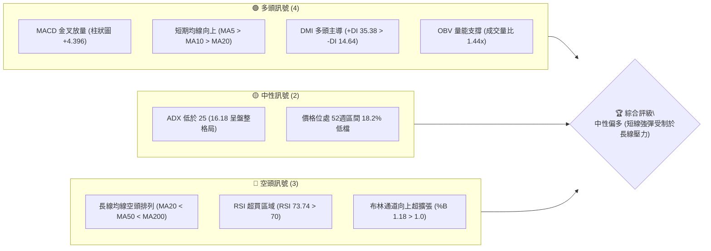
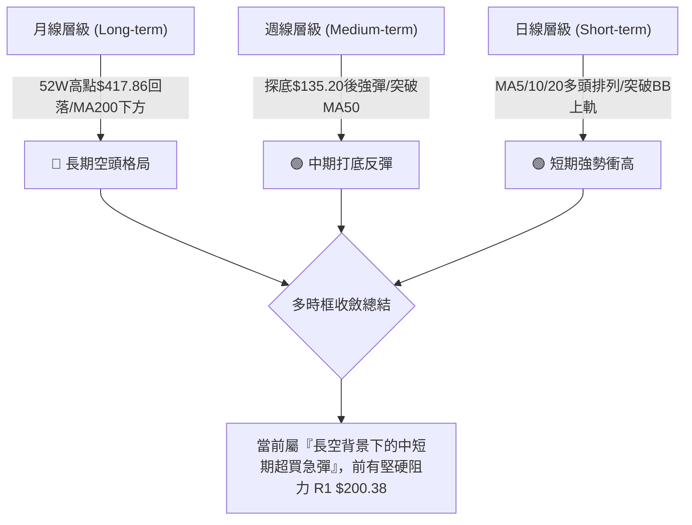
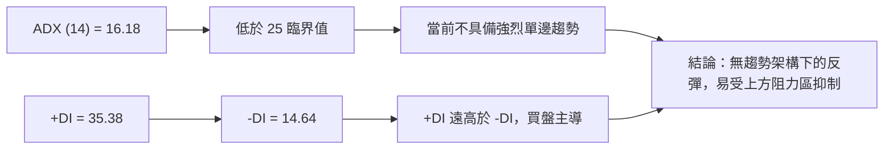
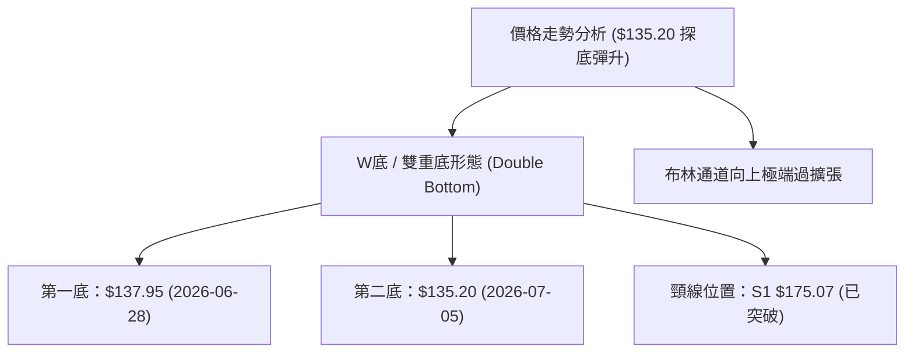
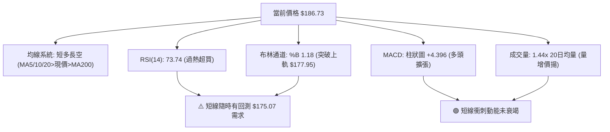
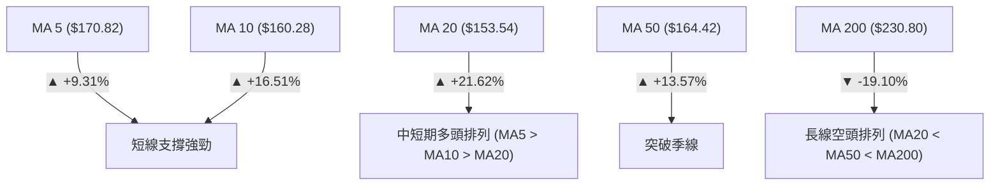
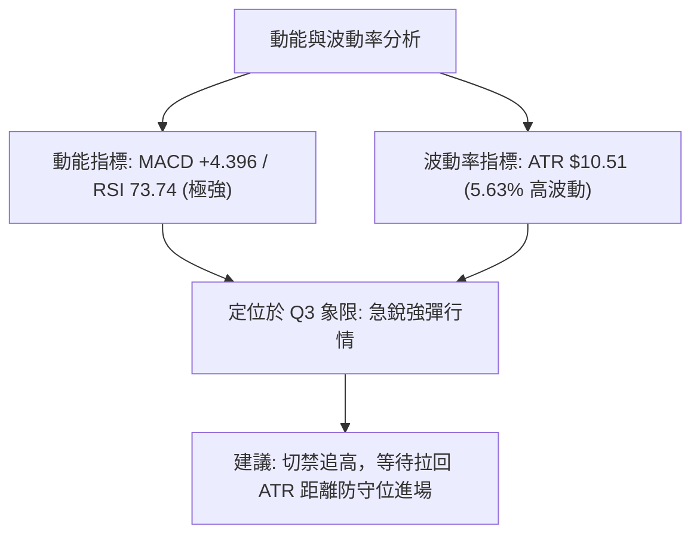
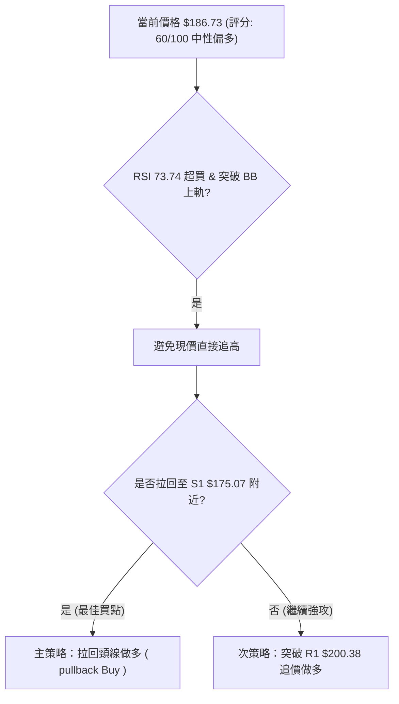
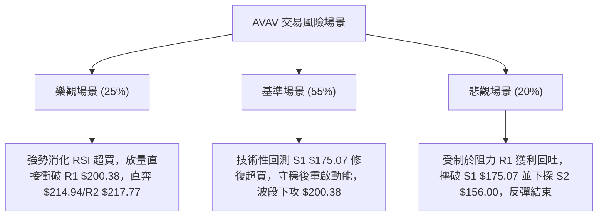

# AVAV 技術分析報告

> **報告日期**：2026-08-10 ｜ **語言**：繁體中文 ｜ **數據來源**：Yahoo Finance ｜ **當前價格**：$186.73

---

## 目錄

| 章節 | 內容 |
|------|------|
| [1. 技術面概覽](#1-技術面概覽) | 訊號儀表板、核心指標、評分卡 |
| [2. 趨勢分析](#2-趨勢分析) | 多時框趨勢、長中短期走勢 |
| [3. 圖表形態分析](#3-圖表形態分析) | 形態識別、K線組合、目標價 |
| [4. 支撐與阻力](#4-支撐與阻力) | 關鍵價位、斐波那契回調 |
| [5. 技術指標深度解讀](#5-技術指標深度解讀) | MA/RSI/MACD/布林/成交量 |
| [6. 動能與波動率](#6-動能與波動率) | 動能評估、ATR、Beta |
| [7. 多時框架總結](#7-多時框架總結) | 時框架評分矩陣 |
| [8. 交易策略建議](#8-交易策略建議) | 多空策略、風險報酬比 |
| [9. 風險提示與監控](#9-風險提示與監控) | 監控指標、風險場景 |

---

## 1. 技術面概覽

### 🎯 技術訊號儀表板



### 📊 核心指標速覽表

| 指標類別 | 指標名稱 | 當前數值 | 訊號 | 解讀 |
|----------|----------|----------|------|------|
| **價格** | 當前價格 | $186.73 | 🟢 | 站上 MA120 ($185.64)，短線動能強勁 |
| **均線** | MA20 | $153.54 | 🟢 | 價格遠高於 MA20 (+21.62%)，短線呈急漲態勢 |
| **均線** | MA50 | $164.42 | 🟢 | 突破 MA50 (+13.57%)，中線扭轉劣勢 |
| **均線** | MA200 | $230.80 | 🔴 | 遠低於 MA200 (-19.10%)，長線維持空頭排列 |
| **動能** | RSI(14) | 73.74 | 🔴 | 進入 >70 超買區，需提防短線拉回修復 |
| **動能** | MACD | 3.443 | 🟢 | MACD 線與柱狀圖 (+4.396) 呈強勢多頭擴張 |
| **趨勢** | ADX(14) | 16.18 | 🟡 | 數值 < 25，顯示當前為無明確長趨勢的區間強彈 |
| **波動** | ATR(14) | $10.51 | 🟡 | 佔股價 5.63%，每日價格波動顯著，風險偏高 |
| **通道** | 布林 %B | 1.18 | 🔴 | 股價突破布林上軌 ($177.95)，呈極端超買 |

### 🏆 技術評分卡

```
╔══════════════════════════════════════════════════════════════╗
║              技術評分卡 — AVAV (2026-08-10)                   ║
╠══════════════════════════════════════════════════════════════╣
║ 趨勢強度      ████████░░░░░░░░░░░░  40/100  🟡 中性 (ADX=16.18)║
║ 動能指標      ████████████████░░░░  80/100  🟢 強勁 (MACD擴張) ║
║ 支撐穩定度    ████████████░░░░░░░░  60/100  🟡 中等 (S1=$175) ║
║ 成交量配合    ████████████████░░░░  80/100  🟢 良好 (1.44x均量)║
║ 形態完整度    ████████████░░░░░░░░  60/100  🟡 築底急彈形態    ║
║ 均線排列      ████████░░░░░░░░░░░░  40/100  🔴 短多長空        ║
╠══════════════════════════════════════════════════════════════╣
║ 綜合評分      ████████████░░░░░░░░  60/100  ⚖️ 中性偏多        ║
╚══════════════════════════════════════════════════════════════╝
```

---

## 2. 趨勢分析

### 🌐 多時框趨勢分析



### 📈 長期趨勢 — 12個月走勢圖（Unicode）

```
AVAV 月線走勢圖（2025-09 至 2026-08）
價格軸 ($)
$420 ┤                             ● (52W 高點 $417.86)
$370 ┤                       ●
$320 ┤                 ●
$270 ┤           ●                 ●
$220 ┤     ●                                   ● (現在 $186.73)
$170 ┤                                   ●  ●
$120 ┤                                   (低點 $135.20)
     └─────────────────────────────────────────────────────
       09   10    11  12   01   02  03   04  05   06   07   08 (月份)
```

**走勢特徵分析表格**：

| 時間階段 | 價格區間 | 變動幅度 | 趨勢特徵分析 |
|----------|----------|----------|--------------|
| **2025-09 至 2025-10** | $314.89 → $369.91 | +17.47% | 多頭極盛期，刷新歷史波段高點 |
| **2025-11 至 2026-03** | $279.46 → $183.05 | -34.50% | 頂部破位，長期均線轉為下彎，賣壓湧現 |
| **2026-04 至 2026-07** | $195.02 → $149.37 | -23.41% | 持續探底，於 2026-07 創下 52週新低 $135.20 |
| **2026-08（至今）** | $149.37 → $186.73 | +25.01% | 止跌大幅強彈，連續突破 MA20、MA50 與 MA120 |

### 📊 中期趨勢（週線分析）

在過去 20 週的觀察期中，AVAV 於 2026-06-28 當週破底探至 $137.95，隨後於 7 月初觸及 52 週低點 $135.20。然而，2026-08-09 最新週報顯示收盤飆升至 $186.73，單週成交量高達 6,772,400 股，週 RSI 從極端超賣（20.2）急劇逆轉至超買區（73.7），週 MACD 柱狀圖同步由負轉正至 +4.396，確立了強烈的中期 V 型反彈結構。

### ⚡ 趨勢強度評估（ADX 解讀）



| 指標名稱 | 當前數值 | 趨勢門檻 | 行情型態判斷 |
|----------|----------|----------|--------------|
| **ADX(14)** | 16.18 | < 25 (弱趨勢/盤整) | 盤整/無單邊強趨勢 |
| **+DI** | 35.38 | > -DI (多方勝出) | 短線多頭掌控方向 |
| **-DI** | 14.64 | < +DI (空方退縮) | 賣壓暫時退潮 |

---

## 3. 圖表形態分析

### 🔍 形態識別系統



**形態信心度與目標價評估**：

| 形態類別 | 信心度 | 判斷依據（引用數據） | 完成度 | 目標價（附計算式） |
|----------|--------|----------------------|--------|--------------------|
| **W底 (雙重底)** | **65%** | 兩次下探 $135.20-$137.95 築底，並已收復頸線 $175.07 | 85% | **$214.94**（頸線 $175.07 + [頸線 $175.07 - 底點 $135.20] = $214.94，鄰近阻力 R2 $217.77） |
| **布林向上突破** | **80%** | 收盤價 $186.73 突破 BB 上軌 $177.95，%B達 1.18 | 100% | 短線超買，技術性回測上軌 $177.95 或中軌 $153.54 |

### 🕯️ 重要K線形態分析

| 日期/週次 | 收盤價 | K線形態 | 解讀 | 訊號 |
|-----------|--------|---------|------|------|
| **2026-06-28 週** | $137.95 | 長陰殺多棒 | 伴隨 1,188 萬股大量恐慌拋售，完成最後趕底 | 🔴 極端超賣 |
| **2026-07-05 週** | $190.89 | 長陽吞噬棒 | 爆出 1,831 萬股歷史巨量，一舉吞噬前週陰線 | 🟢 強烈止跌 |
| **2026-08-09 週** | $186.73 | 大陽線帶量突破 | 單週量增，收盤攻克 MA120 ($185.64)，短多極盛 | 🟢 短線強攻 |

### 📉 ASCII 走勢形態示意圖

```
AVAV W底（雙重底）與突破示意圖
價位 ($)
$217.77 ┤                                            [目標價 R2/形態推算]
$200.38 ┤                                    ▲ (強阻力 R1)
$186.73 ┤                                  ● (現價突破頸線)
$175.07 ┤------------★ (頸線 S1) -----------
$156.00 ┤        ●                   ●
$135.20 ┤────────┴───●───────────────┴──────── (W底雙腳: $137.95 / $135.20)
         2026-06-28  2026-07-05  2026-08-10
```

### 🎯 形態目標價計算

1. **W底形態高度計算**：
   $$\text{形態高度} = \text{頸線價位 (S1)} - \text{雙底低點} = \$175.07 - \$135.20 = \$39.87$$
2. **形態最小測量目標價**：
   $$\text{突破目標價} = \text{頸線價位 (S1)} + \text{形態高度} = \$175.07 + \$39.87 = \$214.94$$
   *註：該目標價落於阻力區 R1 ($200.38) 與 R2 ($217.77) 之間。*

---

## 4. 支撐與阻力

### 🗺️ 關鍵價位分布圖（Unicode）

```
AVAV 價位結構分布圖 (2026-08-10)
═══════════════════════════════════════════════════════════════
$417.86 ║████████████████████████████████████████║ 52週高點 / Fib 0.0%
$309.88 ║████████████████████                    ║ Fib 38.2%
$243.18 ║████████████████████████                ║ Fib 61.8% / MA240 ($243.05)
$230.80 ║████████████████████                    ║ 長線均線 MA200
$222.40 ║████████████████████████                ║ 強阻力 R3
$217.77 ║██████████████████                      ║ 阻力 R2 / W底目標價 ($214.94)
$200.38 ║████████████████████████                ║ 關鍵阻力 R1
$195.69 ║██████████████                          ║ Fib 78.6% 回調壓力位
$186.73 ╠════════════════════════════════════════╣ ◄ 當前價格 ($186.73)
$175.07 ║▓▓▓▓▓▓▓▓▓▓▓▓▓▓▓▓▓▓▓▓                    ║ 第一支撐 S1 (頸線位置)
$164.42 ║▓▓▓▓▓▓▓▓▓▓▓▓                            ║ MA50 ($164.42) / MA60 ($164.86)
$156.00 ║████████████████████████                ║ 第二支撐 S2
$153.54 ║▓▓▓▓▓▓▓▓                                ║ MA20 / 布林中軌
$139.76 ║████████████████                        ║ 第三支撐 S3
$135.20 ║████████████████████████████████████████║ 52週低點 / Fib 100.0%
═══════════════════════════════════════════════════════════════
```

### 🚧 阻力位分析表

| 阻力級別 | 精確價位 | 數據形成依據 | 突破難度 | 戰略重要性 |
|----------|----------|--------------|----------|------------|
| **R1** | **$200.38** | 近一年波段高點聚類 / 心理關卡 | 🔴 高 | 極高（突破此處將挑戰 Fib 61.8%） |
| **R2** | **$217.77** | 近一年波段高點聚類 / W底估算位 | 🔴 很高 | 中高（接近 MA200 壓力區） |
| **R3** | **$222.40** | 近一年波段高點聚類 | 🔴 極高 | 高（強阻力帶頂端） |

### 🛡️ 支撐位分析表

| 支撐級別 | 精確價位 | 數據形成依據 | 守住機率 | 戰略重要性 |
|----------|----------|--------------|----------|------------|
| **S1** | **$175.07** | 近一年波段低點聚類 / W底頸線 | 🟢 高 (70%) | 極高（多頭防守第一線，跌破則反彈夭折） |
| **S2** | **$156.00** | 近一年波段低點聚類 / 接近 MA20 | 🟢 中高 (80%) | 高（中期多空分水嶺） |
| **S3** | **$139.76** | 近一年波段低點聚類 / 接近前低 | 🟢 高 (90%) | 極高（若破將下探 52W 低點 $135.20） |

### 📐 斐波那契回調位分析

依據 52 週區間最高點 **$417.86** 與最低點 **$135.20** 計算：

| 斐波那契位 | 算定價位 | 當前相對位置與技術意義 |
|------------|----------|------------------------|
| **0.0%** | $417.86 | 52 週歷史高點 |
| **23.6%** | $351.15 | 超長線反彈遠期目標 |
| **38.2%** | $309.88 | 長線空頭修正關鍵位 |
| **50.0%** | $276.53 | 中長線多空對峙中軸 |
| **61.8%** | $243.18 | 強壓力區，同 MA240 ($243.05) 重合 |
| **78.6%** | $195.69 | **當前直接壓力**（現價 $186.73 介於 78.6% 與 100% 之間） |
| **100.0%**| $135.20 | 52 週歷史低點（本輪強彈起漲點） |

*解讀：現價 $186.73 已從 100% ($135.20) 反彈並即將測試 78.6% ($195.69)。由於 78.6% 與 R1 ($200.38) 距離極近，該區間 ($195.69–$200.38) 為短線最密集解套賣壓帶。*

---

## 5. 技術指標深度解讀

### 🎛️ 指標訊號總覽



### 📈 移動平均線排列分析



| 均線名稱 | 當前價位 | 價格相對位置 | 趨勢方向 | 技術意涵 |
|----------|----------|--------------|----------|----------|
| **MA5** | $170.82 | +9.31% | ▲ 上升 | 極短期助漲支撐 |
| **MA10** | $160.28 | +16.51% | ▲ 上升 | 短線乖離已大 |
| **MA20** | $153.54 | +21.62% | ▲ 上升 | 月線轉銳利向上 |
| **MA50** | $164.42 | +13.57% | ▲ 上升 | 季線攻克，中線轉佳 |
| **MA120**| $185.64 | +0.59% | ▲ 上升 | 半年線剛好踩在腳下 |
| **MA200**| $230.80 | -19.10% | ▼ 下降 | 年線下彎，長線仍面臨壓力 |

### 📉 RSI(14) 分析

*   **當前數值**：**73.74**
*   **強弱進度條**：`██████████████████████████████████████████████████████████████████████████░░░░░░░░░░░░░░░░░░░░░░░░░░░░░░` (73.74%)
*   **超買/超賣判定**：🔴 **超買 (>70)**
*   **背離分析**：日線與週線 RSI 目前呈現同步衝高，**無明顯背離現象**，顯示買盤為真實資金推升非指標鈍化誘多。但由於數值達 73.74，歷史經驗顯示股價極易在 1-3 個交易日內出現技術性拉回修復。

### 📊 MACD(12/26/9) 訊號解讀

*   **MACD 快線**：3.443
*   **Signal 慢線**：-0.953
*   **MACD 柱狀圖**：**+4.396** 🟢 **看多**
*   **解讀**：MACD 快線已強勢突破零軸並穿越 Signal 線，柱狀圖持續擴張至 +4.396，顯示短期多頭動能非常充沛，尚無走弱頂背離跡象。

### 📦 布林通道分析

```
AVAV 布林通道現況示意圖
價位 ($)
$186.73 ┤ ------------------------ ● (現價突破上軌，%B = 1.18)
$177.95 ┤ ======================== (BB 上軌)
$153.54 ┤ ------------------------ (BB 中軌 / MA20)
$129.13 ┤ ======================== (BB 下軌)
```

*   **通道寬度**：上軌 $177.95 ~ 下軌 $129.13，通道急劇張口。
*   **%B 指標**：**1.18**（%B > 1.0 代表股價已運行於布林上軌之外）。
*   **解讀**：股價強行推升至上軌上方，屬於強烈乖離過大現象，通常隨後會伴隨獲利回吐，價格將回測上軌 $177.95 或進一步拉回至 S1 $175.07 尋求支撐。

### 💹 成交量分析（量價配合度）

*   **最新成交量**：1,909,900 股
*   **20日均量**：1,328,255 股（**量比 1.44x**）
*   **OBV 趨勢**：OBV 線高於其移動平均線，呈向上突破走勢。
*   **量價配合度**：🟢 **價漲量增**，此輪反彈伴隨成交量放大至 20日均量的 1.44 倍，量能結構完好，無量價背離危險。

---

## 6. 動能與波動率

### ⚡ 動能評估四象限

| 象限 | 動能強度 | 波動率 (ATR%) | 當前狀態 | 評估與策略 |
|------|----------|---------------|----------|------------|
| **Q1 (高動能/低波動)** | 強 | 低 | — | 最佳趨勢持有區 |
| **Q2 (低動能/低波動)** | 弱 | 低 | — | 沉悶盤整區 |
| **Q3 (高動能/高波動)** | **強** | **高 (5.63%)** | **✓ AVAV** | **高動能高波動區：急彈強勁但甩轎風險大，嚴格控管倉位** |
| **Q4 (低動能/高波動)** | 弱 | 高 | — | 避開區 |



### 📊 ATR 波動率分析

*   **ATR(14)**：**$10.51**
*   **價格百分比**：**5.63%**（以當前價格 $186.73 計算）
*   **止損與風控設置建議**：
    *   **短線交易止損距離**：$1.0 \times \text{ATR} = \$10.51$
    *   **波段交易止損距離**：$1.5 \times \text{ATR} = \$15.77$
    *   **動態追蹤止損**：當前價 $186.73 - 1.5\text{ATR} (\$15.77) = \$170.96$（恰位於 MA5 $170.82 附近）

### 📐 Beta 與市場相關性

*   **Beta 係數**：**1.412**（高於大盤 1.0）
*   **市場相關性解讀**：AVAV 的波動幅度比 S&P 500 指數高出約 41.2%。在大盤上揚時具備較高的彈性，但在市場回檔時亦承受較大的下行壓力。

---

## 7. 多時框架總結

### 📋 時框架評分表

| 時框架 | 趨勢方向 | 動能 | 均線排列 | 形態 | 綜合評分 | 戰略建議 |
|--------|----------|------|----------|------|----------|----------|
| **日線 (Short)** | 🟢 看多 | 🔴 超買 | 🟢 多頭排列 | 🟢 W底突破 | **75/100** | 提防短過熱，尋求拉回買點 |
| **週線 (Medium)**| 🟢 看多 | 🟢 強勁 | 🟡 交叉築底 | 🟢 V型急彈 | **65/100** | 中線轉佳，目標 R1 $200.38 |
| **月線 (Long)**  | 🔴 看空 | 🟡 中性 | 🔴 空頭排列 | 🔴 高檔回落 | **35/100** | 長線受制於 MA200 $230.80 |

### 🔲 綜合訊號矩陣

| 維度 | 短期 (1-5日) | 中期 (1-4週) | 長期 (1-6個月) |
|------|--------------|--------------|----------------|
| **主導因子** | RSI 73.74 超買 / BB 突破 | W底形態完成 / MACD 金叉 | MA200 下彎 / 52W 高點反壓 |
| **多空偏向** | 🟡 震盪洗盤 | 🟢 震盪偏多 | 🔴 承壓觀望 |
| **關鍵轉折點**| $177.95 (BB上軌) | $175.07 (S1 頸線) | $200.38 (R1 阻力) |

### ⚖️ 多時框收斂結論

> **依多時框收斂規則（ADX = 16.18 < 25，屬盤整/無單邊趨勢行情）**：
> 雖然日線與週線展現極強動能，但 long-term（MA200 $230.80）仍呈空頭排列。由於 ADX 低於 25，本輪反彈應定位為**「中短期區間波段反彈」**而非全新牛市起飛。日線 RSI (73.74) 處於超買，價格突破布林上軌，**短線隨時面臨回測 S1 $175.07 (W底頸線) 的需求**。交易應依據區間與波段邏輯，恪守「拉回低吸」而非「追高破位」。

---

## 8. 交易策略建議

### 🗺️ 策略決策流程圖



### 🧭 策略路由

*   **當前主策略方向**：**多頭波段拉回佈局（綜合評分 60/100）**
*   **策略說明**：因技術評分卡得出 60/100（中性偏多），且短線指標嚴重超買（RSI 73.74），不宜在接近阻力 R1 $200.38 處追買。最佳策略為**等待股價技術性回測 W 底頸線 S1 $175.07 守穩後逢低佈局**。

### 🎯 價格情境階梯（Price Scenarios）

| 觸發條件 | 下一目標 | 後續延伸 | 情境含義 |
|----------|----------|----------|----------|
| **突破 R1 $200.38** | R2 $217.77 | R3 $222.40 | 短線強勢延續，挑戰 W底測量目標 $214.94 |
| **回測 S1 $175.07 守穩** |現價區間 $186.73 | R1 $200.38 | 健全的技術性回測，提供最佳風險報酬買點 |
| **跌破 S1 $175.07** | S2 $156.00 | S3 $139.76 | W底反彈失敗，回歸長期空頭下降軌道 |

### 📊 情境機率分佈

| 情境劇本 | 機率估計 | 主要技術依據 |
|----------|----------|--------------|
| **劇本一：拉回 S1 $175.07 尋求支撐後再上攻** | **55%** | RSI(73.74) 過熱需修復，成交量放大（1.44x）顯示下方有買盤接力 |
| **劇本二：直接強攻突破 R1 $200.38** | **25%** | MACD 柱狀圖 (+4.396) 與 +DI (35.38) 強勢動能慣性 |
| **劇本三：跌破 S1 $175.07 回測 S2 $156.00** | **20%** | 長期均線空頭排列，高位獲利回吐賣壓湧現 |

### 🟢 主策略詳情

| 策略要素 | 策略 A：頸線拉回低吸（主推） | 策略 B：突破 R1 追價（備選） |
|----------|------------------------------|------------------------------|
| **進場條件** | 股價回測 S1 $175.07 止跌出現陽線 | 日線收盤價強勢突破阻力 R1 $200.38 |
| **進場價格** | **$175.07**（S1 頸線支撐點） | **$201.00**（突破 R1 確認點） |
| **目標價 T1**| **$200.38**（阻力 R1，預期獲利 +14.45%） | **$217.77**（阻力 R2，預期獲利 +8.34%） |
| **目標價 T2**| **$214.94**（W底測量目標，獲利 +22.77%）| **$222.40**（阻力 R3，預期獲利 +10.65%）|
| **止損價格** | **$164.42**（跌破 MA50 季線止損，虧損 -6.08%）| **$195.69**（跌破 Fib 78.6% 止損，虧損 -2.64%）|
| **風險報酬比**| **2.38 : 1**（目標T1計算） | **3.16 : 1**（目標T1計算） |
| **勝率評估** | **65%** | **50%** |
| **建議倉位** | **15% - 20%** 總資產 | **10%** 總資產 |

### 🔴 反向風險觸發點（對沖提示）

若股價未能在 S1 **$175.07** 獲得支撐，且日線大陰線跌破 S2 **$156.00**，則宣告 W 底反彈結構瓦解。多頭應立即清倉退場，空頭可於跌破 $156.00 時順勢避險做空，目標下看 S3 **$139.76**，止損設於 $164.42。

### ⭐ 整體訊號強度評星

```
做多訊號強度：★★★☆☆  (3/5星 — 動能強勁但短線超買，需等拉回)
做空訊號強度：★★☆☆☆  (2/5星 — 短線量價均優，逆勢做空風險大)
整體可信度：  ★★██☆  (3.5/5星 — 支撐阻力明確，ADX偏低示警)
```

---

## 9. 風險提示與監控

### ✅ 關鍵監控指標 Checklist

```
╔══════════════════════════════════════════════════════════════╗
║                AVAV 技術面每日監控清單 (Checklist)           ║
╠══════════════════════════════════════════════════════════════╣
║ [ ] 價格是否回測 S1 $175.07 且出現量縮止跌訊號               ║
║ [ ] RSI(14) 是否順利從 73.74 超買區降至 50-60 中性區         ║
║ [ ] 成交量是否維持於 20日均量 (132,8255 股) 以上             ║
║ [ ] MACD 柱狀圖 (+4.396) 是否出現高位縮頭現象                ║
║ [ ] 向上衝刺時能否有效突破 R1 $200.38 阻力帶                ║
╚══════════════════════════════════════════════════════════════╝
```

### ⚠️ 風險場景分析



### 🛡️ 風險管理重要提醒

1. **嚴防短線過熱追高風險**：當前 RSI 達到 73.74，%B 為 1.18，股價高出 BB 上軌。歷史數據顯示在該位置直接追高風險極大，獲利空間有限，務必等待拉回。
2. **ATR 動態止損控管**：AVAV 的 ATR 為 $10.51（高達 5.63%），屬於高波動股票。單次交易止損距離至少需保留 $10.51–$15.77，避免因正常日內噪音被甩轎出場。
3. **長線均線壓頂風險**：MA200 位於 $230.80 且持續下彎，即便短線突破 R1 $200.38，上行至 $217.77–$230.80 區間將面臨極其沉重的長線解套賣壓。

---

## 📋 報告總結

```
╔══════════════════════════════════════════════════════════════╗
║                  AVAV 技術分析報告總結                        ║
════════════════════════════════════════════════════════════════
報告日期：2026-08-10
當前價格：$186.73
分析評級：⚖️ 中性偏多 (短線過熱，等待拉回佈局)

關鍵結論：
├─ 長期趨勢：🔴 空頭 (受制於 MA200 $230.80)
├─ 中期趨勢：🟢 多頭 (突破 W底頸線 $175.07，築底完成)
├─ 短期趨勢：🔴 超買 (RSI 73.74，股價突破布林上軌 $177.95)
├─ 關鍵支撐：S1 $175.07 / S2 $156.00
├─ 關鍵阻力：R1 $200.38 / R2 $217.77
└─ 分析師目標價：均價 $225.77 (高 $326.00 / 低 $148.57)

最優策略組合：
1. 🥇 最佳機會：等待股價拉回 S1 $175.07 守穩時做多，目標 $200.38 / $214.94，止損 $164.42。
2. 🥈 次選機會：若強勢突破 R1 $200.38 追價做多，目標 $217.77，止損 $195.69。
3. 🥉 保守選擇：待 RSI(14) 降至 50 附近且價格收復 MA120 後，再行建倉。
════════════════════════════════════════════════════════════════
```

---

> ⚠️ **免責聲明**：本報告為 AI 自動生成之技術分析，所有數據及估算均基於提供的歷史價格資訊。本報告**僅供研究與學術參考**，**不構成任何投資建議**。投資有風險，入市需謹慎。

*報告生成時間：2026-08-10 ｜ 數據來源：Yahoo Finance ｜ 分析框架：多時框技術分析*