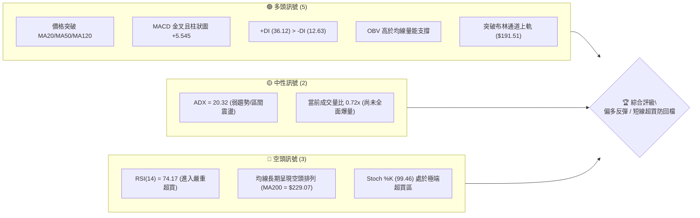
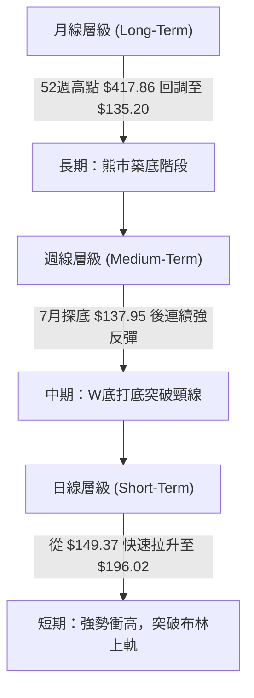
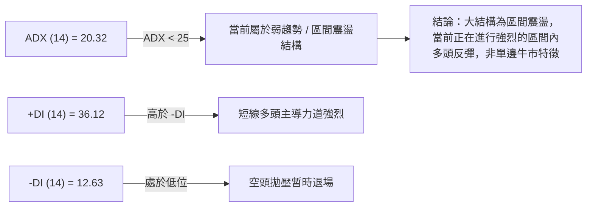
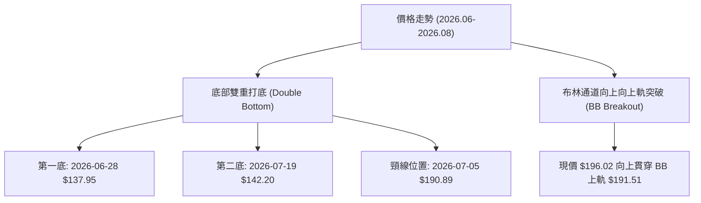
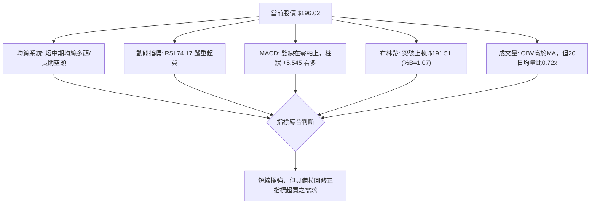
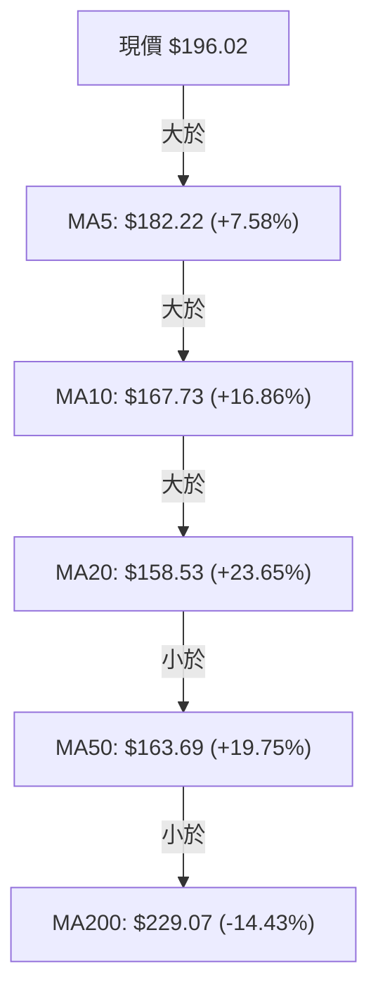
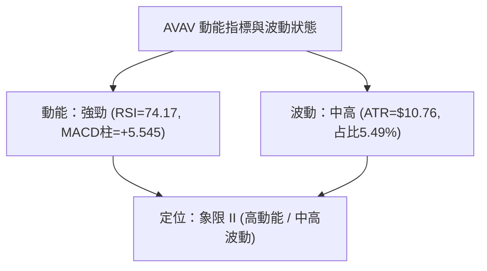
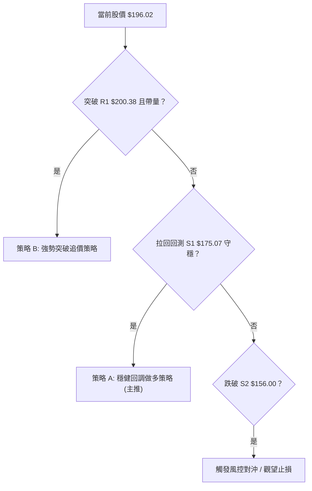
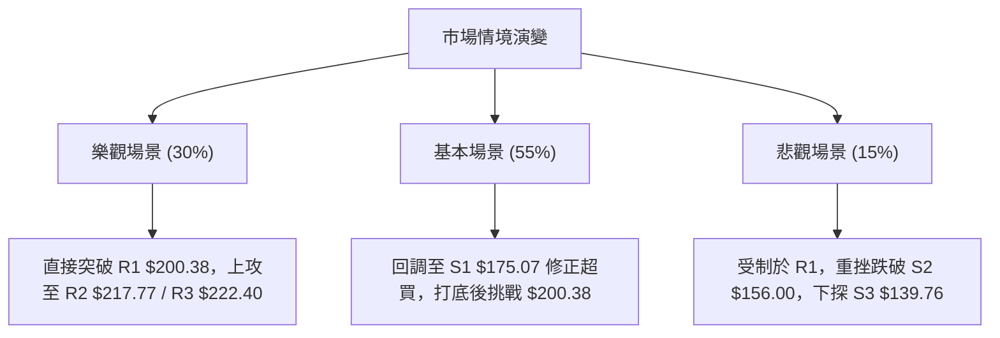

# AVAV 技術分析報告

> **報告日期**：2026-08-12 ｜ **語言**：繁體中文 ｜ **數據來源**：Yahoo Finance ｜ **當前價格**：$196.02

---

## 目錄

| 章節 | 內容 |
|------|------|
| [1. 技術面概覽](#1-技術面概覽) | 訊號儀表板、核心指標、評分卡 |
| [2. 趨勢分析](#2-趨勢分析) | 多時框趨勢、長中短期走勢 |
| [3. 圖表形態分析](#3-圖表形態分析) | 形態識別、K線組合、目標價 |
| [4. 支撐與阻力](#4-支撐與阻力) | 關鍵價位、斐波那契回調 |
| [5. 技術指標深度解讀](#5-技術指標深度解讀) | MA/RSI/MACD/布林/成交量 |
| [6. 動能與波動率](#6-動能與波動率) | 動能評估、ATR、Beta |
| [7. 多時框架總結](#7-多時框架總結) | 時框架評分矩陣 |
| [8. 交易策略建議](#8-交易策略建議) | 多空策略、風險報酬比 |
| [9. 風險提示與監控](#9-風險提示與監控) | 監控指標、風險場景 |

---

## 1. 技術面概覽

### 🎯 技術訊號儀表板



### 📊 核心指標速覽表

| 指標類別 | 指標名稱 | 當前數值 | 訊號 | 解讀 |
|----------|----------|----------|------|------|
| **價格** | 當前價格 | $196.02 | 🟢 多頭 | 強勢反彈，站上布林上軌與短中期均線 |
| **均線** | MA20 | $158.53 | 🟢 多頭 | 價格高於 MA20 (+23.65%)，月線拐頭向上 |
| **均線** | MA50 | $163.69 | 🟢 多頭 | 價格高於 MA50 (+19.75%)，季線支撐重建 |
| **均線** | MA200 | $229.07 | 🔴 空頭 | 價格低於 MA200 (-14.43%)，長期年線反壓著 |
| **動能** | RSI(14) | 74.17 | 🔴 超買 | 極端超買區，隨時有獲利回吐拉回壓力 |
| **動能** | MACD | 7.227 | 🟢 多頭 | 雙線位於零軸上方，柱狀圖 (+5.545) 強勢擴張 |
| **動能** | Stoch %K/%D| 99.46 / 98.08 | 🔴 超買 | 隨機指標極端超買，預示短線衝高後需震盪 |
| **趨勢** | ADX(14) | 20.32 | 🟡 盤整 | ADX < 25，屬於大結構區間震盪中的強反彈 |
| **波動** | ATR(14) | $10.76 | 🟡 中高 | 波動率佔股價 5.49%，每日震盪幅度較大 |
| **通道** | 布林 %B | 1.07 | 🔴 超買 | 突破上軌 $191.51，呈現乖離過大特徵 |

### 🏆 技術評分卡

```
╔══════════════════════════════════════════════════════════════╗
║                技術評分卡 — AVAV (2026-08-12)                ║
╠══════════════════════════════════════════════════════════════╣
║ 趨勢強度      ████████████░░░░░░░░  60/100  🟡 中性偏多     ║
║ 動能指標      ████████████████░░░░  80/100  🟢 強勁衝高     ║
║ 支撐穩定度    ████████████░░░░░░░░  60/100  🟡 逐步築底     ║
║ 成交量配合    ██████████░░░░░░░░░░  50/100  🟡 量能溫和     ║
║ 形態完整度    ██████████████░░░░░░  70/100  🟢 雙底打底成型 ║
║ 均線排列      ████████░░░░░░░░░░░░  40/100  🔴 空頭尚未扭轉 ║
╠══════════════════════════════════════════════════════════════╣
║ 綜合評分      █████████████░░░░░░░  62/100  🟢 偏多（強反彈）║
╚══════════════════════════════════════════════════════════════╝
```

---

## 2. 趨勢分析

### 🌐 多時框趨勢分析



### 📈 長期趨勢 — 24個月走勢圖（Unicode）

```
AVAV 24個月歷史價格走勢圖（2024-08 至 2026-08）
價格軸 ($)
$420 ┤                                      ● (52W High $417.86)
$370 ┤                                  ●
$320 ┤                          ●
$270 ┤                  ●   ●               ●
$220 ┤  ●   ●                                   ●
$170 ┤          ●   ●                               ●   ●←當前 $196.02
$120 ┤                  ●                               ● (52W Low $135.20)
     └─────────────────────────────────────────────────────────────
       24/08 24/11 25/02 25/05 25/08 25/11 26/02 26/05 26/08
```

#### 走勢特徵分析表格

| 階段歷史 | 價格區間 | 漲跌幅 | 結構特徵與驅動因素 |
|----------|----------|--------|--------------------|
| **2024.08 - 2025.03** | $203.76 → $119.19 | -41.50% | 第一波中期修整，回撤打底 |
| **2025.04 - 2025.10** | $119.19 → $369.91 | +210.35% | 主升段暴漲，創下近兩年最高點（52週高點 $417.86） |
| **2025.11 - 2026.07** | $369.91 → $135.20 | -63.45% | 長期空頭修正，於 2026年7月初見 52週低點 $135.20 |
| **2026.07 - 2026.08** | $135.20 → $196.02 | +45.00% | 強烈 V 轉與雙底彈升，短線急擴拉升至斐波 78.6% 回調位 |

### 📊 中期趨勢（週線分析）

```
週線等級關鍵阻力與支撐結構
═══════════════════════════════════════════════════════════════
 $242.63 ─── MA240 年線大反壓 (偏空界線)
 $229.07 ─── MA200 反壓 (中期目標 R3 $222.40 附近)
 $217.77 ─── 阻力 R2 (中期波段高點)
 $200.38 ─── 近期關卡 R1 (正進行挑戰)
 $196.02 ─── ◄ 當前收盤價 (攻入斐波 78.6% $195.69 區域)
 $175.07 ─── 短期第一支撐 S1 (回調買盤守備區)
 $156.00 ─── 中期強支撐 S2 (MA20 / MA50 均線防禦帶)
 $139.76 ─── 長期底部 S3 (52W 低點保護區 $135.20)
═══════════════════════════════════════════════════════════════
```

### ⚡ 趨勢強度評估（ADX 解讀）



| ADX 區間 | 趨勢狀態 | AVAV 當前狀態 | 交易對策 |
|----------|----------|---------------|----------|
| **0 - 20** | 極弱 / 無趨勢 | ✕ | 適合網格或區間震盪高拋低吸 |
| **20 - 25** | **弱趨勢 / 盤整突破中** | **✓ (20.32)** | **以布林軌道與水平支撐阻力為核心，防範追高風險** |
| **25 - 50** | 強勁趨勢 | ✕ | 順勢加碼，趨勢追蹤 |
| **> 50** | 極端單邊趨勢 | ✕ | 注意反轉背離風險 |

---

## 3. 圖表形態分析

### 🔍 形態識別系統



#### 形態信心度評估表

| 形態類型 | 信心度 | 判斷依據（引用數據） | 完成度 | 目標價計算與推論 |
|----------|--------|----------------------|--------|------------------|
| **W底 (雙底)** | **75%** | 第一底 $137.95、第二底 $142.20，兩次守穩 $135.20-140 區間，週線收盤突破頸線 $190.89 | 90% | 頸線 $190.89 + (頸線 $190.89 - 低點 $137.95 = 52.94) = **$243.83**（貼近 61.8% 斐波位 $243.18） |
| **布林上軌向上突破** | **85%** | 當前收盤價 $196.02 突破 BB 上軌 $191.51 (%B = 1.07) | 100% | 短線擴張目標指向阻力位 **R1 $200.38** 及 **R2 $217.77** |
| **頭肩底形態** | **30%** | 左肩 $165.07、頭部 $137.95，右肩特徵不明顯 | 30% | 訊號不足，僅做指標型解讀，不強制計算目標價 |

### 🕯️ 重要 K 線形態分析

| 日期/週 | 收盤價 | K 線形態 | 解讀 | 多空訊號 |
|---------|--------|----------|------|----------|
| **2026-06-28** | $137.95 | 長下影陰線 (底部長針) | 探低 52週低點 $135.20 附近獲得極強恐慌盤承接 | 🟢 底態浮現 |
| **2026-07-05** | $190.89 | 巨量長陽線 (突破棒) | 成交量放大至 1,831萬股，一舉扭轉短期空頭 | 🟢 多頭確立 |
| **2026-07-12** | $144.58 | 長陰線回測 (二次測底) | 急漲後快速洗盤，無量回測不破前低 | 🟡 中性洗盤 |
| **2026-08-09** | $186.73 | 大陽線實體 | 強勢吃掉過去一個月的震盪區間，重新啟動升勢 | 🟢 多頭續攻 |
| **2026-08-16** | $196.02 | 突破長陽 (逼近關卡) | 價格一舉貫穿 $190 阻力，直逼 R1 $200.38 | 🟢 短線極強 |

### 📉 ASCII 走勢形態示意圖

```
AVAV W底（雙底）突破與關鍵價位示意圖
─────────────────────────────────────────────────────────────
$243.18 ┤                                    [形態理論目標價區間]
$222.40 ┤                                    [阻力 R3]
$217.77 ┤                                    [阻力 R2]
$200.38 ┤                              R1 ─── [阻力 R1]
$190.89 ┤               頸線 (Neckline) ───●── [突破點 $196.02]
$175.07 ┤         ●                        /   [支撐 S1]
$156.00 ┤        / \      ●               /    [支撐 S2]
$137.95 ┤───●───/   \────/ \─────────────/     [第一底 $137.95 / 第二底 $142.20]
─────────────────────────────────────────────────────────────
```

---

## 4. 支撐與阻力

### 🗺️ 關鍵價位分布圖（Unicode）

```
AVAV 價位結構分布圖 (以當前價格 $196.02 為中心)
═══════════════════════════════════════════════════════════════
$222.40 ║██████████████████████████████║ 強阻力 R3 (一年波段高點聚類)
$217.77 ║████████████████████████      ║ 阻力 R2 (中期反彈高點聚類)
$200.38 ║██████████████████████████████║ 關鍵阻力 R1 (心理整數關卡/近角反壓)
$196.02 ╠══════════════════════════════╣ ◄ 當前收盤價 (斐波 78.6% $195.69)
$175.07 ║▓▓▓▓▓▓▓▓▓▓▓▓▓▓▓▓▓▓            ║ 近期第一支撐 S1 (突破點回測守備區)
$156.00 ║██████████████████████████████║ 強支撐 S2 (MA20/MA50 均線重疊帶)
$139.76 ║██████████████████████████████║ 鐵板底 S3 (52週低點 $135.20 聚類區)
═══════════════════════════════════════════════════════════════
```

### 🚧 阻力位分析表

| 阻力級別 | 精確價位 | 形成原因 | 突破難度 | 重要性 |
|----------|----------|----------|----------|--------|
| **R1** | **$200.38** | 近一年波段高點聚類與 $200 心理整數關卡 | 🟡 中等 (短線超買需消化) | ★★★★☆ |
| **R2** | **$217.77** | 近一年中期波段反彈高點聚類區 | 🔴 較高 (密集解套套牢盤) | ★★★★☆ |
| **R3** | **$222.40** | 近一年波段高點聚類，接近 MA200 ($229.07) | 🔴 極高 (長線牛熊分水嶺) | ★★★★★ |

### 🛡️ 支撐位分析表

| 支撐級別 | 精確價位 | 形成原因 | 守住機率 | 重要性 |
|----------|----------|----------|----------|--------|
| **S1** | **$175.07** | 近一年波段低點聚類，前波回調低點防線 | 🟢 高 (70%) | ★★★★☆ |
| **S2** | **$156.00** | 波段低點聚類，接近 MA20 ($158.53) 與 MA50 ($163.69) | 🟢 極高 (85%) | ★★★★★ |
| **S3** | **$139.76** | 近一年波段最低點聚類 (貼近 52W Low $135.20) | 🟢 鋼鐵支撐 (95%) | ★★★★★ |

### 📐 斐波那契回調位分析

針對 52週區間（高點 **$417.86** → 低點 **$135.20**，總波幅 **$282.66**）進行回調位定位：

| 斐波比例 | 計算價位 | 當前相對位置與意義 |
|----------|----------|--------------------|
| **0.0%** (52W High) | **$417.86** | 歷史高點反壓極遙遠 |
| **23.6%** | **$351.15** | 長期牛市恢復位 |
| **38.2%** | **$309.88** | 強勢中繼目標 |
| **50.0%** | **$276.53** | 多空中樞分水嶺 |
| **61.8%** | **$243.18** | 中長線黃金切割阻力位 (貼近 W底目標價 $243.83) |
| **78.6%** | **$195.69** | **◄ 現價 $196.02 正位於此位！** 首要多空卡位點 |
| **100.0%** (52W Low) | **$135.20** | 絕對底部鐵板 |

**解讀**：當前股價 $196.02 精準踩在 78.6% 回調位 ($195.69) 上方。若能有效收復此位置，上方技術空間將順暢打開至 61.8% ($243.18) 及 R2/R3 ($217.77 - $222.40) 區間；若未能站穩，則容易誘發拉回回測 S1 ($175.07)。

---

## 5. 技術指標深度解讀

### 🎛️ 指標訊號總覽



### 📈 移動平均線排列分析



*   **短中期格局**：MA5 ($182.22) > MA10 ($167.73) > MA20 ($158.53)，短期均線呈多頭強勢噴發排列，且 MA20 快速拐頭向上。
*   **長期格局**：MA20 ($158.53) < MA50 ($163.69) < MA200 ($229.07)，大結構仍為死亡交叉後的反彈波，MA200 ($229.07) 為最主要長期反壓。

### 📉 RSI(14) 分析

*   **當前數值**：**74.17**（進入 > 70 嚴重超買區）
*   **進度條**：`███████████████░░░░░ 74.17%`
*   **背離狀態**：**無明顯背離**。RSI 隨著價格強勢上攻同步創出新高，顯示價格上漲是由實質動能推動，而非指標衰竭。然而，>70 的超買數值警告技術面乖離過大，隨時可能觸發 3-5 天的洗盤拉回。

### 📊 MACD(12/26/9) 訊號解讀

*   **DIF (MACD線)**：7.227
*   **DEA (Signal線)**：1.682
*   **MACD 柱狀圖**：**+5.545** 🟢
*   **解讀**：MACD 線向上快速穿越 Signal 線且拉開差距，柱狀圖持續擴大（自 0.860 飆升至 5.545），顯示短期多頭控盤力道極為強勁，多頭動能正處於主升段發酵期。

### 📦 布林通道分析

```
布林通道現狀 (20日標準差)
─────────────────────────────────────────────────────────────
 $191.51 ─── 布林上軌 (Upper Band)
 $196.02 ─── ◄ 當前價格 (高於上軌！%B = 1.07)
 $158.53 ─── 布林中軌 (MA20)
 $125.56 ─── 布林下軌 (Lower Band)
─────────────────────────────────────────────────────────────
```

*   **現狀**：股價 $196.02 穿出上軌 $191.51，%B 指標達 1.07。
*   **意涵**：極端強勢的「通道開啟（Band Walk）」特徵。若成交量無法持續放大，價格通常會在 1-3 天內拉回至上軌 $191.51 之內進行修正，回測中軌 $158.53 或 S1 $175.07 為常見的技術演變。

### 💹 成交量分析（量價配合度）

*   **最新成交量**：963,191 股
*   **20日均量**：1,333,530 股（量比：**0.72x**）
*   **週成交量**：2,415,991 股
*   **OBV 趨勢**：OBV > MA，呈現震盪上行。
*   **量價解讀**：7月初突破時週成交量高達 1,831萬股（主力資金建倉），近期推升至 $196.02 過程中日成交量略微萎縮（0.72x），顯示籌碼已被鎖定、賣壓輕微，但同時也暗示追高意願在 $200 關卡前開始謹慎，需要量能補足才能一舉突破 R1 $200.38。

---

## 6. 動能與波動率

### ⚡ 動能評估四象限

| 象限分區 | 動能強度 | 波動率 | 當前狀態區位 | 交易建議對策 |
|----------|----------|--------|--------------|--------------|
| **象限 I** | 強勁 | 低波動 | — | 最佳波段持股區 |
| **象限 II** | **強勁** | **高波動** | **✓ (AVAV 當前點位)** | **高風險高收益，適合拉回定點佈局，防範回檔風險** |
| **象限 III** | 疲弱 | 高波動 | — | 避開，空頭殺跌區 |
| **象限 IV** | 疲弱 | 低波動 | — | 觀望，沉悶盤整區 |



### 📊 ATR 波動率分析

*   **ATR(14)**：**$10.76**（占當前股價 **5.49%**）
*   **風控應用建議**：
    *   **緊密止損距離 (1.5x ATR)**：$10.76 × 1.5 = **$16.14**
    *   **寬鬆止損距離 (2.0x ATR)**：$10.76 × 2.0 = **$21.52**
    *   **建議交易防守區**：進場後止損應設於當前價位向下至少 $16.14 之外，以避開每日 5.4% 的正常市場噪訊。

### 📐 Beta 與市場相關性

*   **Beta 係數**：**1.412**
*   **解讀**：AVAV 屬於高 Beta 成長型/國防科技股。當大盤（如 S&P 500 或大盤軍工板塊）波動 1% 時，AVAV 平均波動約 1.41%。在高 Beta 環境下，強勢反彈行情具備爆發力，但若大盤回檔，拉回幅度亦會放大。

---

## 7. 多時框架總結

### 📋 時框架評分表

| 時框架 | 趨勢方向 | 動能指標 | 均線排列 | 形態結構 | 綜合評分 | 交易建議 |
|--------|----------|----------|----------|----------|----------|----------|
| **週線 (長期)** | 🟡 震盪打底 | 🟢 金叉拉升 | 🔴 空頭未扭轉 | 🟢 W底突破 | **58/100** | 逢低布局 |
| **日線 (中期)** | 🟢 多頭反彈 | 🔴 進入超買 | 🟡 短期多頭 | 🟢 突破上軌 | **65/100** | 待回調買進 |
| **短線 (14-30天)**| 🟢 強勢噴發 | 🟢 柱狀擴張 | 🟢 金叉向上 | 🟢 上升通道 | **62/100** | 不盲目追高 |

### 🔲 綜合訊號矩陣

```
╔══════════════════════════════════════════════════════════════╗
║                     AVAV 多時框訊號矩陣                      ║
╠═════════════════════╦══════════════╦══════════════╦══════════╣
║ 時框架              ║ 趨勢訊號     ║ 動能狀態     ║ 建議行動 ║
╠═════════════════════╬══════════════╬══════════════╬══════════╣
║ 長期 (週線 MA200)   ║ 🔴 偏空      ║ 🟡 中性      ║ 觀望/防禦║
║ 中期 (日線 MA20/50) ║ 🟢 看多      ║ 🟢 強勁      ║ 回調做多 ║
║ 短期 (日線 BB/RSI)  ║ 🟢 看多      ║ 🔴 極端超買  ║ 嚴防拉回 ║
╚═════════════════════╩══════════════╩══════════════╩══════════╝
```

### ⚖️ 多時框收斂結論

依據多時框收斂規則：當前 **ADX(14) = 20.32 (<25)**，明確指示當前市場屬於**區間震盪與打底結構**，而非單邊狂暴牛市。

1. **主導時框**：大結構受制於週線與年線 MA200 ($229.07) 的壓制；日線與短線暴漲突破布林上軌 ($191.51) 並使 RSI 達 74.17 超買。
2. **收斂結論**：**整體評級為 🟢 62/100（偏多強反彈）**。行情當前為「W底突破後的初升段」，但由於短線指標嚴重超買，**不宜在 R1 $200.38 關卡前直接追高**，最佳策略為等待股價回測 S1 $175.07 或布林上軌/5日線區域再行低吸。

---

## 8. 交易策略建議

### 🗺️ 策略決策流程圖



### 🧭 策略路由

**當前主策略方向：偏多（低吸為主） — 評分 62/100**
由於 ADX 指標指示盤整反彈行情，且 RSI(14) = 74.17 處於超買，**主力推薦「策略 A：回調承接做多」**；突破追高（策略 B）風險報酬比較低，僅作為備案。

### 🎯 價格情境階梯（Price Scenarios）

| 觸發條件 | 下一目標 | 後續延伸 | 情境含義 |
|----------|----------|----------|----------|
| **帶量突破 R1 $200.38** | R2 $217.77 | R3 $222.40 / MA200 $229.07 | 突破超買，直接向上打開至年線空間 |
| **於 $185 - $196 震盪** | — | — | 高位消化超買指標，時間換取空間 |
| **回檔跌破 $190.00** | S1 $175.07 | S2 $156.00 | 健康技術性拉回，尋求均線支撐 |

### 📊 情境機率分佈

| 情境劇本 | 機率估計 | 主要依據 |
|----------|----------|----------|
| **1. 震盪回調至 S1 後再上攻** | **55%** | RSI 74.17 需拉回修復，MACD 柱狀圖良好，W底頸線已突破 |
| **2. 直接帶量強攻突破 R1/R2** | **30%** | 多頭動能強勁 (+DI 36.12)，國防板塊避險買盤推升 |
| **3. 深度拉回跌破 S2 $156.00** | **15%** | 均線長期仍為空頭排列，若大盤重挫可能引發高 Beta 股票拋售 |

### 🟢 主策略詳情

```
╔══════════════════════════════════════════════════════════════╗
║               交易策略參數表 (精確價位執行)                   ║
╠═══════════════════╦══════════════════════╦═══════════════════╣
║ 策略要素          ║ 策略 A (主推: 低吸)  ║ 策略 B (備案:突破)║
╠═══════════════════╬══════════════════════╬═══════════════════╣
║ 進場條件          ║ 回測 S1/MA5 獲支撐   ║ 帶量收高於 R1 上  ║
║ 精確進場價位      ║ $180.00 - $185.00    ║ $201.50          ║
║ 目標價 T1         ║ $200.38 (阻力 R1)    ║ $217.77 (阻力 R2) ║
║ 目標價 T2         ║ $217.77 (阻力 R2)    ║ $222.40 (阻力 R3) ║
║ 止損價位          ║ $172.00 (跌破 S1)    ║ $191.00 (跌破上軌)║
║ 風險報酬比 (To T1)║ 1 : 2.0  (風險$8/獲利$16) 1 : 1.55 (風險$10.5/獲利$16.27)║
║ 勝率估算          ║ 65%                  ║ 45%               ║
║ 建議倉位比例      ║ 10% - 15%            ║ 5% - 8%           ║
╚═══════════════════╩══════════════════════╩═══════════════════╝
```

### 🔴 反向風險觸發點（對沖提示）

*   **多頭撤退/空頭觸發訊號**：若日線收盤價強烈跌破 **S2 $156.00**（意味著一口氣跌破 MA20 與 MA50 均線防禦區），宣告此波 W 底反彈失敗，應立即清倉多頭，或轉為輕倉避險對沖。

### ⭐ 整體訊號強度評星

```
做多訊號強度：★★★☆☆  (3.5/5星 - 動能強但超買)
做空訊號強度：★★☆☆☆  (2.0/5星 - 順應大趨勢但短動能太強)
整體可信度：  ★★★★☆  (4.0/5星 - 價位與形態結構明確)
```

---

## 9. 風險提示與監控

### ✅ 關鍵監控指標 Checklist

```
╔══════════════════════════════════════════════════════════════╗
║                   每日交易監控 Checklist                     ║
╠══════════════════════════════════════════════════════════════╣
║ [ ] 1. 價格是否順利回測 $180.00 - $185.00 區域並止跌？      ║
║ [ ] 2. RSI(14) 是否由 74.17 回落至 50-60 的健康中性區？     ║
║ [ ] 3. 日成交量能否放大至 20日均量 (133萬股) 以上？          ║
║ [ ] 4. MACD 柱狀圖 (+5.545) 是否出現高位縮頭（動能減弱）？   ║
║ [ ] 5. 是否有突破阻力位 R1 $200.38 的日線實體收盤？          ║
╚══════════════════════════════════════════════════════════════╝
```

### ⚠️ 風險場景分析



### 🛡️ 風險管理重要提醒

1.  **超買修復風險**：RSI 指標 74.17 與 Stoch %K 99.46 均位於極端超買區，此類技術特徵極易引發「閃拉後快速下洗」的走勢，切忌於 $196-$200 追高。
2.  **波動率風控**：ATR 高達 $10.76，意味著每日正常波動即達 5.5%。請嚴格按照每筆交易損失不超過總資本 1%-2% 的原則設定倉位（如 10% 總資金倉位）。
3.  **長期年線壓制**：上方 MA200 在 $229.07，接近阻力 R3 $222.40 與分析師平均目標價 **$225.77**。該區域解套賣壓將極為沈重，獲利達到 T2 時應積極進行分批止盈。

---

## 📋 報告總結

```
╔══════════════════════════════════════════════════════════════╗
║                 AVAV 技術分析報告總結                        ║
════════════════════════════════════════════════════════════════
 報告日期：2026-08-12
 當前價格：$196.02
 分析評級：🟢 62/100 (中性偏多 / 強烈築底反彈行情)

 關鍵價位結構：
 ├─ 長期趨勢：🟡 熊市底層修復中 (受制於年線 MA200 $229.07)
 ├─ 中期趨勢：🟢 W底打底完成，貫穿頸線 $190.89
 ├─ 短期趨勢：🔴 RSI 74.17 嚴重超買，短線有拉回需求
 ├─ 關鍵支撐：S1 $175.07 ｜ S2 $156.00 ｜ S3 $139.76
 ├─ 關鍵阻力：R1 $200.38 ｜ R2 $217.77 ｜ R3 $222.40
 └─ 分析師目標價：Mean $225.77 (Low $148.57 / High $326.00)

 最優執行策略組合：
 1. 🥇 最佳機會（策略 A）：等待股價拉回 $180.00 - $185.00 逢低布局做多，
    止損設於 $172.00，目標價 T1 $200.38 / T2 $217.77。
 2. 🥈 次選機會（策略 B）：待帶量收高突破 R1 $200.38 後順勢追價，
    目標價 $217.77 - $222.40。
 3. 🥉 風控提醒：跌破 S2 $156.00 宣告此波反彈結束，應全面執行避險止損。
════════════════════════════════════════════════════════════════
```

---

> ⚠️ **免責聲明**：本報告為 AI 自動生成之技術分析，所有數據及估算均基於提供的歷史價格資訊。本報告**僅供研究與學術參考**，**不構成任何投資建議**。投資有風險，入市需謹慎。

---

*報告生成時間：2026-08-12 ｜ 數據來源：Yahoo Finance ｜ 分析框架：多時框技術分析*