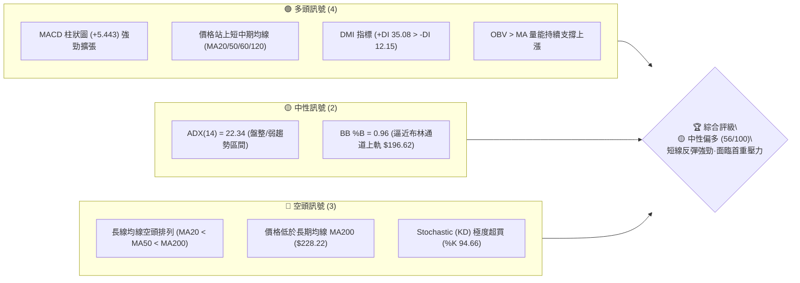
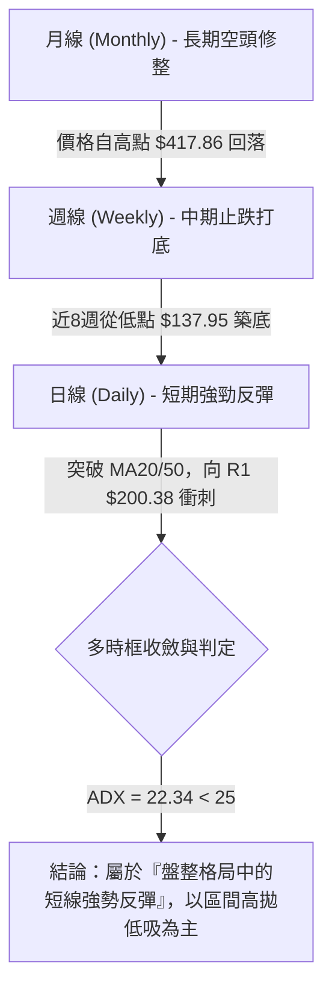
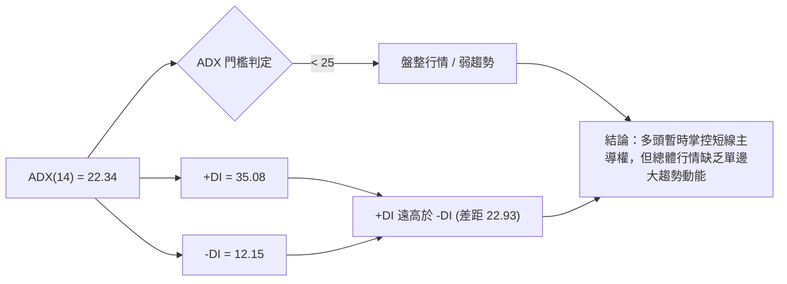
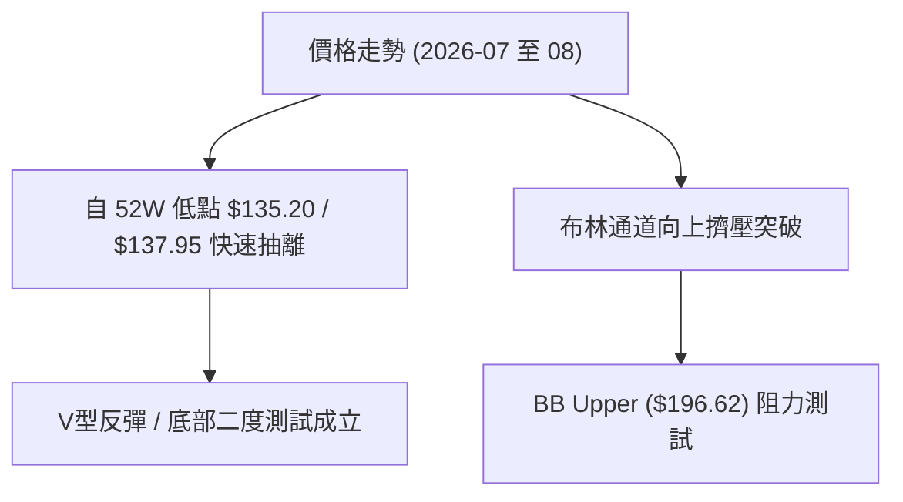
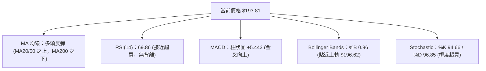
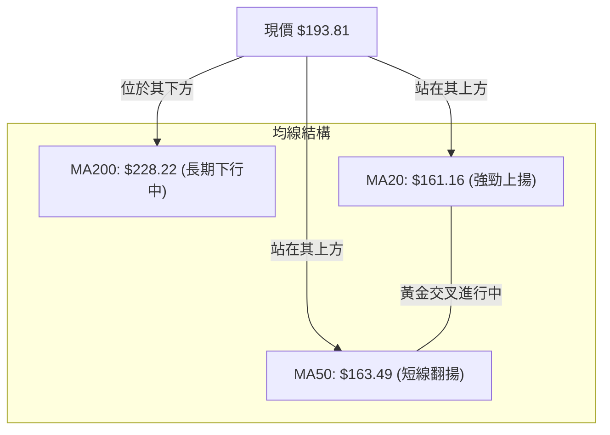
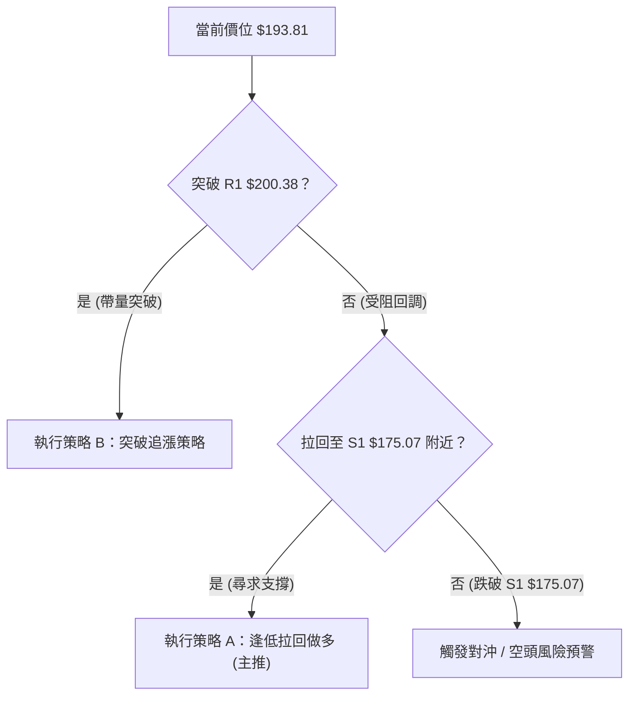
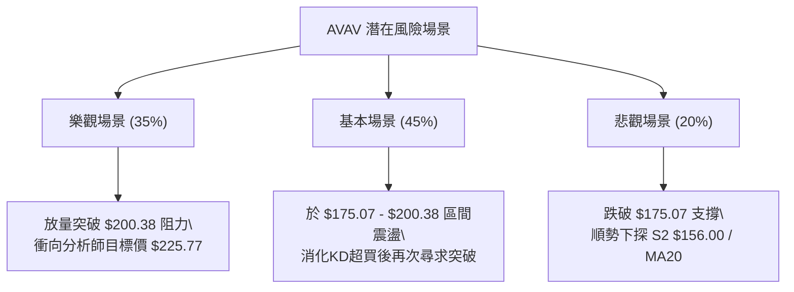

# AVAV 技術分析報告

> **報告日期**：2026-08-13 ｜ **語言**：繁體中文 ｜ **數據來源**：Yahoo Finance ｜ **當前價格**：$193.81

---

## 目錄

| 章節 | 內容 |
|------|------|
| [1. 技術面概覽](#1-技術面概覽) | 訊號儀表板、核心指標、評分卡 |
| [2. 趨勢分析](#2-趨勢分析) | 多時框趨勢、長中短期走勢 |
| [3. 圖表形態分析](#3-圖表形態分析) | 形態識別、K線組合、目標價 |
| [4. 支撐與阻力](#4-支撐與阻力) | 關鍵價位、斐波那契回調 |
| [5. 技術指標深度解讀](#5-技術指標深度解讀) | MA/RSI/MACD/布林/成交量 |
| [6. 動能與波動率](#6-動能與波動率) | 動能評估、ATR、Beta |
| [7. 多時框架總結](#7-多時框架總結) | 時框架評分矩陣 |
| [8. 交易策略建議](#8-交易策略建議) | 多空策略、風險報酬比 |
| [9. 風險提示與監控](#9-風險提示與監控) | 監控指標、風險場景 |

---

## 1. 技術面概覽

### 🎯 技術訊號儀表板



### 📊 核心指標速覽表

| 指標類別 | 指標名稱 | 當前數值 | 訊號 | 解讀 |
|----------|----------|----------|------|------|
| **價格** | 當前價格 | $193.81 | 🟢 多頭 | 近20週自低點強勁反彈，位於52週區間 20.7% 位置 |
| **均線** | MA20 | $161.16 | 🟢 多頭 | 價格高於MA20 (+20.26%)，短線提供強支撐 |
| **均線** | MA50 | $163.49 | 🟢 多頭 | 價格高於MA50 (+18.55%)，5日與10日均線向上穿過 |
| **均線** | MA200 | $228.22 | 🔴 空頭 | 價格低於MA200 (-15.08%)，整體均線呈空頭排列 |
| **動能** | RSI(14) | 69.86 | 🟡 中性 | 接近超買區 (70)，動能旺盛但需警惕短線修整 |
| **動能** | MACD | +5.443 (柱) | 🟢 多頭 | MACD 線 (8.486) 高於 Signal (3.043)，多頭主導 |
| **波動** | ATR(14) | $10.31 | 🟡 中性 | 日波動率 5.32%，屬於中等偏高波動幅度 |

### 🏆 技術評分卡

```
╔══════════════════════════════════════════════════════════════════╗
║              技術評分卡 — AVAV (2026-08-13)                     ║
╠══════════════════════════════════════════════════════════════════╣
║  趨勢強度 (ADX=22.34)   █████████░░░░░░░░░░░  45/100  🟡 弱趨勢/盤整║
║  動能指標 (MACD/RSI)    ███████████████░░░░░  75/100  🟢 動能強勁   ║
║  支撐穩定度 (S1-S3)     █████████████░░░░░░░  65/100  🟢 底層支撐穩 ║
║  成交量配合 (OBV/20MA)  ████████████░░░░░░░░  60/100  🟡 量能適中   ║
║  形態完整度 (V型/反彈)   ██████████░░░░░░░░░░  50/100  🟡 震盪築底中 ║
║  均線排列 (MA20<50<200) ████████░░░░░░░░░░░░  40/100  🔴 長線仍屬空 ║
╠══════════════════════════════════════════════════════════════════╣
║  綜合技術評分           ███████████░░░░░░░░░  56/100  🟡 中性偏多   ║
╚══════════════════════════════════════════════════════════════════╝
```

---

## 2. 趨勢分析

### 🌐 多時框趨勢分析



### 📈 長期趨勢 — 12個月走勢圖（Unicode）

```
AVAV 月線走勢圖（2025-09 至 2026-08）
價格軸 ($)
$400 ┤              ● (2025-10 高點 $369.91)
$350 ┤        ●
$300 ┤  ●           ●               ●
$250 ┤                      ●
$200 ┤                                      ● (現價 $193.81)
$150 ┤                                  ●
     └──────────────────────────────────────────────
       09  10  11  12  01  02  03  04  05  06  07  08  (月份)
```

#### 走勢特徵分析表

| 階段 | 時間區間 | 起始價 ➔ 結束價 | 漲跌幅 | 走勢特徵與市場行為解讀 |
|------|----------|------------------|--------|------------------------|
| **衝頂期** | 2025-08 ~ 2025-10 | $203.76 ➔ $369.91 | +81.54% | 主升段行情，成交量劇增，多頭極度強勢 |
| **回落期** | 2025-11 ~ 2026-03 | $279.46 ➔ $183.05 | -34.49% | 獲利了結賣壓湧現，長線均線高位死叉 |
| **二次下探**| 2026-04 ~ 2026-07 | $195.02 ➔ $149.37 | -23.41% | 探尋 52 週低點 $135.20 附近支撐，殺跌量能釋放 |
| **強彈期** | 2026-08 (至今)   | $149.37 ➔ $193.81 | +29.75% | 短線V型強勁反彈，連續穿過 MA20/50 均線 |

### 📊 中期趨勢（週線分析）

```
週線壓力與支撐結構示意圖：
$228.22 ───────────────────────────────────── [MA200 長期強壓 / Analyst Target $225.77]
$217.77 ───────────────────────────────────── [R2 波段阻力]
$200.38 ───────────────────────────────────── [R1 第一阻力位 / 心理關卡]
$193.81 ◄──────────────────────────────────── [當前價格]
$175.07 ───────────────────────────────────── [S1 近期首重支撐]
$156.00 ───────────────────────────────────── [S2 中期關鍵支撐 / MA20 $161.16 護盤區]
```

### ⚡ 趨勢強度評估（ADX 解讀）



#### ADX 強度對照表

| ADX 數值範圍 | 當前狀態 | 行情性質 | 交易策略原則 |
|--------------|----------|----------|--------------|
| **0 - 20**   | ✕        | 無趨勢 / 極度停滯 | 避免突破交易，僅做極窄區間 |
| **20 - 25**  | **✓ (22.34)** | **弱趨勢 / 區間震盪** | **以布林通道與支撐阻力進行波段操作** |
| **25 - 50**  | ✕        | 強趨勢           | 順勢追價 / 回檔加碼 |
| **50 +**     | ✕        | 極端單邊行情     | 緊盯止損 / 提防反轉 |

---

## 3. 圖表形態分析

### 🔍 形態識別系統



#### 形態信心度與目標價評估表

| 形態名稱 | 信心度 (%) | 判斷依據（引用數據） | 完成度 | 目標價計算式與精確數值 |
|----------|------------|----------------------|--------|------------------------|
| **V型雙底反彈** | 65% | 2026-07-05 打出 $137.95 低點後強彈，8月再次自 $149.37 向上發動 | 85% | 頸線 $190.89 + (頸線 $190.89 - 低點 $137.95 = $52.94) = **$243.83** (高於 MA200) |
| **布林上軌向上突破** | 80% | %B 達 0.96，收盤價 $193.81 逼近 BB 上軌 $196.62 | 90% | 直接考驗阻力位 **R1 $200.38** |
| **長線頭肩頂 (月線層級)** | 40% | 訊號不足（歷史數據不完整），僅做指標型解讀 | -- | 不適用（信心度 < 50%，不予採用） |

### 🕯️ 重要 K 線形態分析

| 月份/日期 | 收盤價 | K線形態 | 技術解讀 | 訊號評級 |
|-----------|--------|---------|----------|----------|
| 2026-06-28 | $137.95 | 長下影長陰線 | 恐慌盤湧出後買盤逢低接手，打出 52 週次低點 | 🟡 止跌訊號 |
| 2026-07-05 | $190.89 | 大陽線突破 (成交量 18.3M) | 巨量強彈，確認 $137.95 為階段性底部 | 🟢 強勢反轉 |
| 2026-08-09 | $186.73 | 長陽實體突破 | 吞噬前三週停滯區間，突破 MA50 ($163.49) | 🟢 多頭續攻 |
| 2026-08-16 | $193.81 | 中陽線續揚 | 呈現高位震盪，多頭控盤但面臨 $200 整數關卡 | 🟢 多頭佔優 |

### 📉 ASCII 走勢形態示意圖

```
AVAV 2026年7月-8月 雙底/V型反彈示意圖：

$200.38 ─────────────────────────────────────── R1 阻力線
            ▲
           ╱ ╲       ● $193.81 (現價攻頂中)
          ╱   ╲     ╱
$175.07 ─┼─────╲───┼────────────────────────── S1 頸線支撐位
        ╱       ╲ ╱
       ╱         ● $149.37 (二腳築底)
      ● $137.95 (一腳落底)
```

### 🎯 形態目標價計算

1. **V型底部形態推算**：
   - 形態底部：$137.95（2026-06-28 週收盤）
   - 形態頸線：$190.89（2026-07-05 週高點收盤）
   - 垂直高度：$190.89 - $137.95 = $52.94
   - 形態推算目標價：$190.89 + $52.94 = **$243.83**
   - *註：該目標價與 61.8% 斐波那契回調位 $243.18 極為接近。*

---

## 4. 支撐與阻力

### 🗺️ 關鍵價位分布圖（Unicode）

```
AVAV 價位結構分布圖 (當前價格 $193.81)
════════════════════════════════════════════════════════════
$222.40 ║████████████████████████████████║ 強阻力 R3 (+14.75%)
$217.77 ║███████████████████████████     ║ 阻力 R2   (+12.36%)
$200.38 ║████████████████████████████████║ 關鍵阻力 R1 (+3.39%)
$193.81 ╠════════════════════════════════╣ ◄ 當前價格 (現價)
$175.07 ║▓▓▓▓▓▓▓▓▓▓▓▓▓▓▓▓▓▓▓▓▓▓▓▓        ║ 近期支撐 S1 (-9.67%)
$156.00 ║████████████████████████████████║ 強支撐 S2   (-19.51%)
$139.76 ║████████████████████████████████║ 極限支撐 S3 (-27.89%)
════════════════════════════════════════════════════════════
```

### 🚧 阻力位分析表

| 阻力級別 | 精確價位 | 形成原因與數據來源 | 突破難度 | 技術重要性 |
|----------|----------|--------------------|----------|------------|
| **R1**   | **$200.38** | 近一年波段高點聚類 / $200 整數心理關卡 (+3.39%) | 🟡 中等 | 短線多空分水嶺，突破則打開上行空間 |
| **R2**   | **$217.77** | 近一年波段高點聚類 (+12.36%) | 🔴 偏高 | 解套賣壓重區 |
| **R3**   | **$222.40** | 波段高點聚類 (+14.75%)，靠近 MA200 ($228.22) | 🔴 極高 | 長線牛熊轉換關鍵位 |

### 🛡️ 支撐位分析表

| 支撐級別 | 精確價位 | 形成原因與數據來源 | 守住機率 | 技術重要性 |
|----------|----------|--------------------|----------|------------|
| **S1**   | **$175.07** | 近一年波段低點聚類 / 7月回檔支撐位 (-9.67%) | 🟢 80% | 短線回檔首要防線，跌破則轉弱 |
| **S2**   | **$156.00** | 波段低點聚類 (-19.51%)，靠近 MA20 ($161.16) | 🟢 85% | 中期生命線，多頭防禦核心 |
| **S3**   | **$139.76** | 近一年低點聚類 (-27.89%)，接近 52W 低點 $135.20 | 🟢 95% | 長線底線，破位將引發恐慌性拋售 |

### 📐 斐波那契回調位分析

*以 52 週高點 $417.86 與 52 週低點 $135.20 計算：*

```
0.0%  (52W High)  $417.86 ─────────────────────────────────────────────
23.6%             $351.15 ─────────────────────────────────────────────
38.2%             $309.88 ─────────────────────────────────────────────
50.0%             $276.53 ─────────────────────────────────────────────
61.8%             $243.18 ─────────────────────────────────────────────
78.6%             $195.69 ───────────────────────── ◄ 現價 $193.81 逼近此處
100.0% (52W Low)  $135.20 ─────────────────────────────────────────────
```

#### 斐波那契層級解讀

當前價格 **$193.81** 剛好落在 **78.6% 回調位 ($195.69)** 的下方附近：
- **78.6% ($195.69)** 是極其關鍵的壓力壓制線，與 **R1 ($200.38)** 形成強大的壓力帶 ($195.69 - $200.38)。
- 若能有效收復 $195.69 並突破 $200.38，下一階段技術目標將直接指向 **61.8% 回調位 ($243.18)**。

---

## 5. 技術指標深度解讀

### 🎛️ 指標訊號總覽



### 📈 移動平均線排列分析



#### 移動平均線狀態表

| 均線名稱 | 當前價位 | 與現價距離 (%) | 均線方向 | 訊號解讀 |
|----------|----------|----------------|----------|----------|
| **MA5**  | $187.37  | +3.44%         | 向上     | 極短期攻堅支撐 |
| **MA10** | $172.90  | +12.09%        | 向上     | 短線急升防守位 |
| **MA20** | $161.16  | +20.26%        | 向上     | 短期多空分界線 |
| **MA50** | $163.49  | +18.55%        | 向上     | 中期趨勢支撐 |
| **MA120**| $183.71  | +5.50%         | 向上     | 中長期牛熊臨界線（已被突破） |
| **MA200**| $228.22  | -15.08%        | 向下     | 長期主要阻力區 |

### 📉 RSI(14) 分析

```
RSI(14) 強度進度條：
0                30        50        70       100
├────────────────┼─────────┼─────────┼────────┤
▓▓▓▓▓▓▓▓▓▓▓▓▓▓▓▓▓▓▓▓▓▓▓▓▓▓▓▓▓▓▓▓▓▓▓▓█░░░░░  69.86 (接近超買區 70)
```

- **當前數值**：69.86（接近超買閾值 70）。
- **背離判斷**：無明顯頂背離或底背離。價格創近期新高（$193.81），RSI 同步創近期新高（69.86），顯示**動能與價格走勢配合良好**。
- **操作含義**：短線衝高速度過快，RSI 逼近 70，隨時可能出現 1-3 天的指標修復抽回。

### 📊 MACD(12/26/9) 訊號解讀

- **MACD 快線**：8.486
- **MACD 慢線 (Signal)**：3.043
- **MACD 柱狀圖 (Histogram)**：+5.443 🟢
- **分析**：快線在零軸上方持續拉開與慢線的差距，柱狀圖呈現持續擴張狀態（+4.396 ➔ +5.443），表明**中短期買盤動能極其強勁**，尚未出現動能衰竭現象。

### 📦 布林通道分析

```
ASCII 布林通道示意圖 ($193.81)

$196.62 ─────────────────────────────────────── BB 上軌 (現價 $193.81 逼近此處, %B = 0.96)
          ● $193.81 (現價)
$161.16 ─────────────────────────────────────── BB 中軌 (MA20)

$125.71 ─────────────────────────────────────── BB 下軌
```

- **%B 指標**：0.96（0 代表下軌，0.5 代表中軌，1.0 代表上軌）。
- **通道狀態**：價格緊貼布林通道上軌（$196.62）運行，這是典型的**強勢攻擊形態**，但也代表短線價格相對於 20 日均線（$161.16）拉得過開，存在向中軌回歸的技術面需求。

### 💹 成交量分析（量價配合度）

- **最新成交量**：991,174
- **20 日均量**：1,318,749（量比：0.75x）
- **OBV 趨勢**：OBV 指標高於其移動平均線，呈上升趨勢。
- **量價解讀**：雖然當日成交量稍放緩（0.75x 20MA），但觀察週線層級，7月上旬強彈時週成交量高達 18,317,500 股，顯示**主力資金在底部進場跡象明確**，當前上漲屬於「籌碼鎖定良好」的惜售推升。

---

## 6. 動能與波動率

### ⚡ 動能評估四象限

| 象限區塊 | 動能強度 | 波動率 | AVAV 當前位置 | 技術面意涵與建議 |
|----------|----------|--------|---------------|------------------|
| **Q1 (高動能·低波動)** | 強 | 低 | -- | 最佳突破買點 |
| **Q2 (強動能·高波動)** | **強** | **高** | **✓ (當前象限)** | **短線爆發力強，但甩轎風險大，需適度放寬止損距離** |
| **Q3 (弱動能·高波動)** | 弱 | 高 | -- | 高風險洗盤，應避免持有 |
| **Q4 (弱動能·低波動)** | 弱 | 低 | -- | 停滯盤整，資金效率低 |

### 📊 ATR 波動率分析

- **ATR(14) 數值**：**$10.31**
- **價格百分比**：5.32%（$10.31 / $193.81）
- **風控指引**：
  - 日內正常波動區間為 ±$10.31。
  - **短線止損距離建議**：1.5 × ATR = **$15.47**
  - **波段止損距離建議**：2.0 × ATR = **$20.62**

### 📐 Beta 與市場相關性

- **Beta 係數**：**1.412**
- **市場屬性**：高 Beta 成長型/軍工科技股，波動度比標普 500 指數高出 41.2%。在大盤上漲時具備放大收益的特性，但在大盤回調時下撤風險亦相對較大。

---

## 7. 多時框架總結

### 📋 時框架評分表

| 時框架 | 趨勢方向 | 動能 (RSI/MACD) | 均線排列 | 形態結構 | 綜合評分 | 策略建議 |
|--------|----------|-----------------|----------|----------|----------|----------|
| **日線 (Daily)** | 🟢 多頭 | 78/100 (極強)   | 🟢 多頭 (站上MA20/50) | 🟢 破位大彈 | **72/100** | 順勢偏多 / 逢低佈局 |
| **週線 (Weekly)**| 🟡 中性 | 62/100 (回升)   | 🟡 纏繞打底 | 🟢 雙底完成 | **60/100** | 中線築底完成，看震盪 |
| **月線 (Monthly)**| 🔴 空頭 | 40/100 (低位)   | 🔴 空頭 (低於MA200) | 🔴 高位拉回 | **38/100** | 長線受壓於 $228-$243 |

### 🔲 綜合訊號矩陣

```
           短期動能 (RSI/MACD)
              強  │  弱
          ┌───────┼───────┐
       強 │ 日線  │       │
長期趨勢  ├───────┼───────┤
       弱 │       │ 月線  │
          └───────┴───────┘
```

### ⚖️ 多時框收斂結論

依據多時框收斂規則：
1. 當前 **ADX = 22.34 (< 25)**，技術面屬於 **「盤整/弱趨勢格局」**。
2. 日線雖然衝勁十足（RSI 69.86, MACD 強勁），但上方立即面臨 **78.6% 斐波那契回調位 $195.69** 與 **阻力位 R1 $200.38** 的壓制；且月線層級受制於 **MA200 ($228.22)**。
3. **收斂方向**：**「短線偏多，但接近波段阻力區，切勿在高位追漲，宜等回檔至 S1 ($175.07) 或突破 R1 ($200.38) 後再行操作。」**

---

## 8. 交易策略建議

### 🗺️ 策略決策流程圖



### 🧭 策略路由

**當前主策略方向 = 偏多 (依技術綜合評分 56/100 偏多，日線動能強勁)**

### 🎯 價格情境階梯 (Price Scenarios)

| 觸發條件 | 下一目標價 | 後續延伸目標 | 技術情境含義 |
|----------|------------|--------------|--------------|
| **帶量突破 R1 $200.38** | R2 $217.77 | R3 $222.40 / MA200 $228.22 | 短線強勢中繼，打開衝向 MA200 空間 |
| **於 $175.07 - $200.38 震盪** | -- | -- | 區間整理，消化超買指標（KD %K 94.66） |
| **跌破 S1 $175.07** | S2 $156.00 | S3 $139.76 | 短線反彈宣告結束，二次測試底部 |

### 📊 情境機率分佈

```
情境機率分佈：
[1] 區間震盪後拉回尋求支撐 (45%)  █████████████████████████
[2] 直接帶量突破 R1 續攻 (35%)    ███████████████████
[3] 反彈夭折並跌破 S1 (20%)       ███████████
```

### 🟢 主策略詳情

根據綜合評分與 ADX 盤整屬性，提供兩套操作方案：

| 策略要素 | 策略 A：逢低拉回做多 (主推 - 安全性高) | 策略 B：突破 R1 順勢追多 (動能型) |
|----------|────────────────────────────────────────|───────────────────────────────────|
| **進場條件** | 價格拉回至 S1 附近獲得支撐彈起 | 每日收盤價強勢突破阻力 R1 $200.38 |
| **進場價格** | **$175.07** (S1 支撐位) | **$200.38** (突破 R1 買進) |
| **目標價 T1**| **$200.38** (R1 阻力位) | **$217.77** (R2 阻力位) |
| **目標價 T2**| **$225.77** (分析師平均目標價) | **$243.18** (61.8% 斐波那契回調位) |
| **止損價格** | **$161.16** (跌破 MA20 / BB 中軌) | **$187.37** (跌破 MA5 支撐) |
| **風險報酬比** | **1.81 : 1** (風險 $13.91 / 收益 $25.31) | **1.34 : 1** (風險 $13.01 / 收益 $17.39) |
| **估計成功率** | **65%** | **50%** |
| **建議倉位** | **15% - 20%** | **10% - 15%** |

### 🔴 反向風險觸發點（對沖提示）

- **觸發條件**：日線收盤價跌破 **S1 $175.07** 且成交量放大至 20 日均量 1.5 倍以上。
- **風險處置**：多頭部位應即刻停損離場；高階交易者可考慮建立輕倉空頭部位，目標看至 **S2 $156.00**。

### ⭐ 整體訊號強度評星

```
做多訊號強度：★★★☆☆  (3/5星 - 短線強勁但接近壓力)
做空訊號強度：★★☆☆☆  (2/5星 - 順勢做空風險較高)
整體可信度：  ★★★☆☆  (3/5星 - ADX 偏低，屬震盪格局)
```

---

## 9. 風險提示與監控

### ✅ 關鍵監控指標 Checklist

```
╔══════════════════════════════════════════════════════════════════╗
║                   每日交易監控清單 (Checklist)                    ║
╠══════════════════════════════════════════════════════════════════╣
║ [ ] 1. R1 $200.38 阻力攻防：觀察是否出現長上影線或爆量滯漲      ║
║ [ ] 2. Stochastic KD 指標：%K (94.66) 是否於高位形成死叉        ║
║ [ ] 3. RSI(14) 變動：是否突破 70 進入極端超買或出現頂背離        ║
║ [ ] 4. S1 $175.07 支撐力道：回檔時成交量是否急縮 (惜售訊號)     ║
║ [ ] 5. MA20 ($161.16) 扣抵位置：確保短期均線維持向上趨勢        ║
╚══════════════════════════════════════════════════════════════════╝
```

### ⚠️ 風險場景分析



### 🛡️ 風險管理重要提醒

1. **極端超買風險**：Stochastic (%K 94.66, %D 96.85) 已進入極度超買區，短線追高風險極大，**嚴禁在接近 R1 $200.38 時使用槓桿追漲**。
2. **波動度防範**：ATR 高達 **$10.31 (5.32%)**，意味著單日價格波動經常超過 10 美元。止損單設置不可過密，建議至少保留 1.5 倍 ATR（約 $15.47）的緩衝空間。
3. **大盤連動**：Beta 達 **1.412**，需密切注意標普 500 與納斯達克指數的整體修正風險。

---

## 📋 報告總結

```
╔══════════════════════════════════════════════════════════════════╗
║               AVAV 技術分析報告總結 (2026-08-13)                  ║
╠══════════════════════════════════════════════════════════════════╣
║ 當前價格：$193.81   ｜   52週區間：$135.20 - $417.86 (20.7%)     ║
║ 綜合技術評分：56/100 ｜   技術評級：🟡 中性偏多 (短勢強·臨壓力)    ║
╠══════════════════════════════════════════════════════════════════╣
║ 關鍵結論：                                                       ║
║ ├─ 長期趨勢 (月線)：🔴 空頭修整 (低於 MA200 $228.22)              ║
║ ├─ 中期趨勢 (週線)：🟢 築底完成 (自 $137.95 打出雙底強彈)        ║
║ ├─ 短期趨勢 (日線)：🟢 多頭主導 (站在 MA20/50 之上，MACD擴張)     ║
║ ├─ 關鍵支撐位：S1 $175.07  │  S2 $156.00                         ║
║ ├─ 關鍵阻力位：R1 $200.38  │  R2 $217.77                         ║
║ └─ 分析師目標價：均值 $225.77 (最高 $326.00 / 最低 $148.57)      ║
╠══════════════════════════════════════════════════════════════════╣
║ 最優策略組合：                                                   ║
║ 1. 🥇 最佳機會 (策略 A)：等待價格拉回至 S1 $175.07 逢低做多      ║
║    ▸ 止損：$161.16  │  目標 1：$200.38  │  風報比：1.81 : 1     ║
║ 2. 🥈 次選機會 (策略 B)：強勢帶量突破 R1 $200.38 後順勢追多     ║
║    ▸ 止損：$187.37  │  目標 1：$217.77  │  風報比：1.34 : 1     ║
╚══════════════════════════════════════════════════════════════════╝
```

---

> ⚠️ **免責聲明**：本報告為 AI 自動生成之技術分析，所有數據與價位推算均基於提供之歷史價格與指標資訊。本報告**僅供研究與學術參考**，**不構成任何投資建議或買賣邀約**。投資具有風險，入市請務必獨立思考並謹慎評估。

---

*報告生成時間：2026-08-13 ｜ 數據來源：Yahoo Finance ｜ 分析框架：多時框技術分析與動能模型*