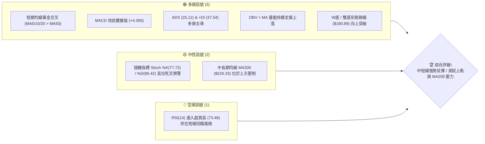
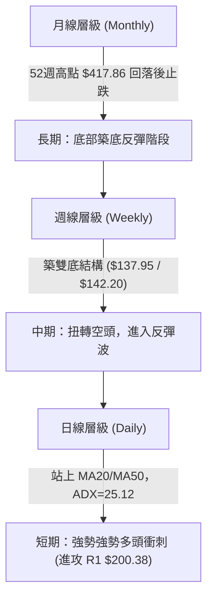
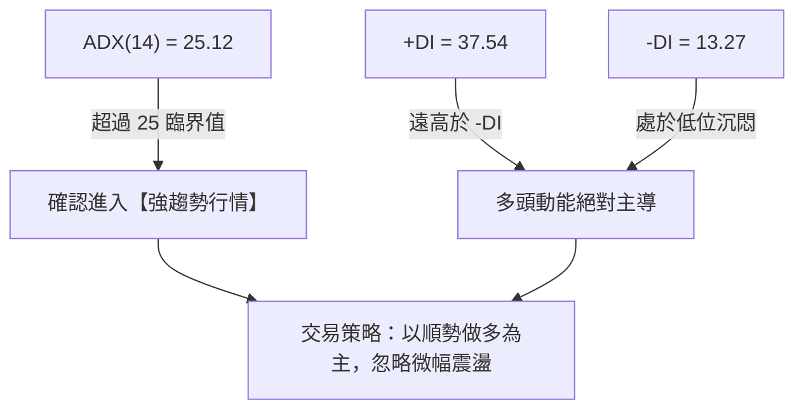
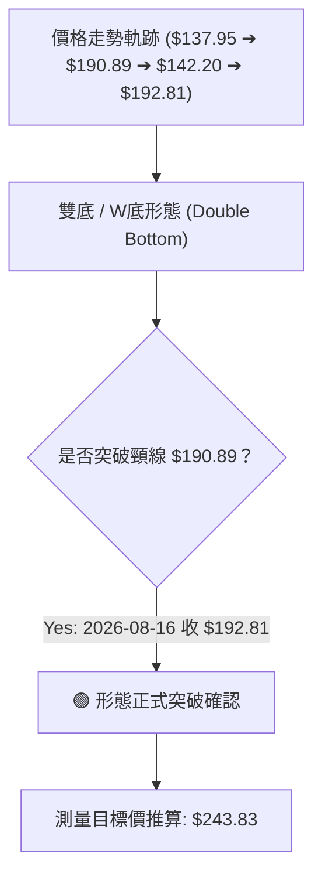
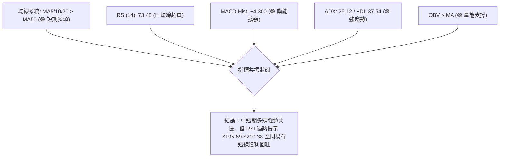
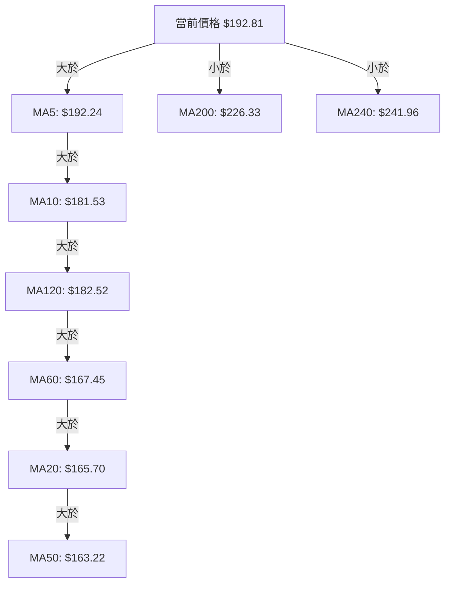
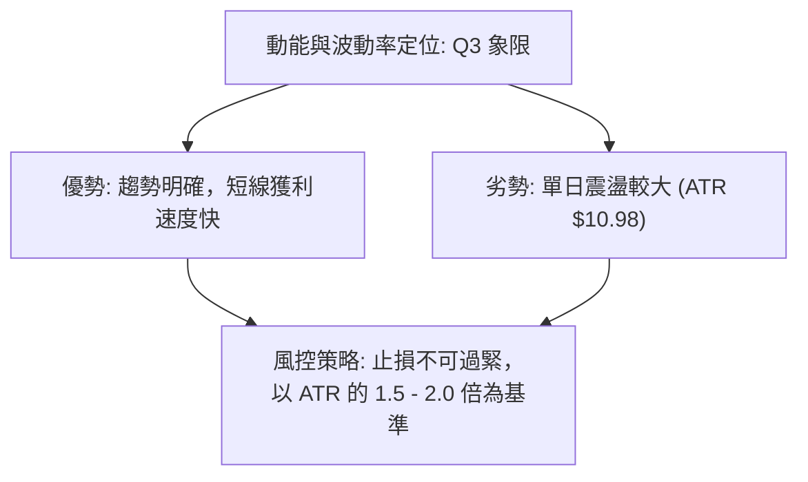
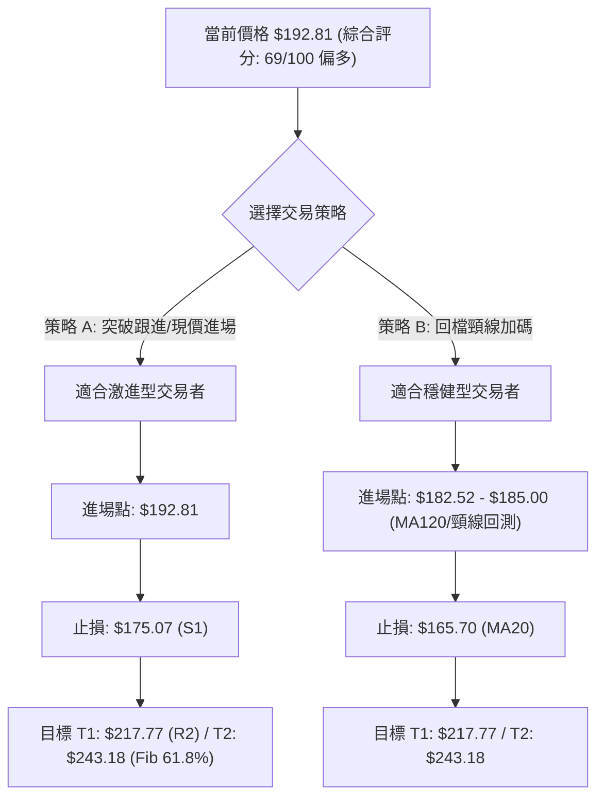
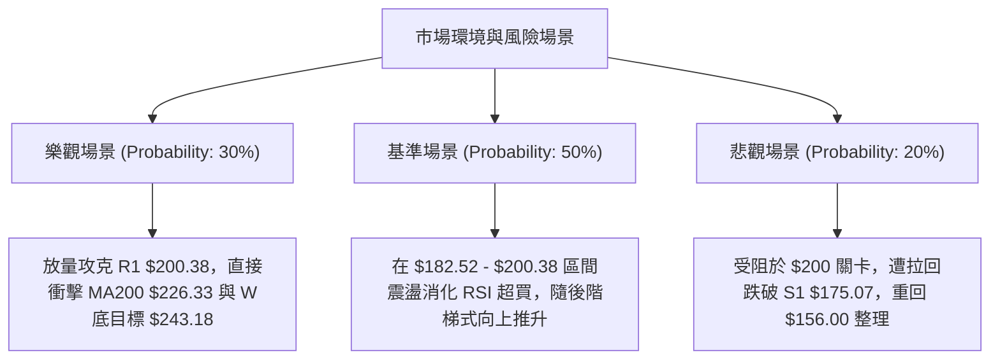

# AVAV 技術分析報告

> **報告日期**：2026-08-14 ｜ **語言**：繁體中文 ｜ **數據來源**：Yahoo Finance ｜ **當前價格**：$192.81

---

## 目錄

| 章節 | 內容 |
|------|------|
| [1. 技術面概覽](#1-技術面概覽) | 訊號儀表板、核心指標、評分卡 |
| [2. 趨勢分析](#2-趨勢分析) | 多時框趨勢、長中短期走勢、ADX強度 |
| [3. 圖表形態分析](#3-圖表形態分析) | 形態識別、K線組合、形態目標價推算 |
| [4. 支撐與阻力](#4-支撐與阻力) | 關鍵價位分布、阻力與支撐層級、斐波那契回調 |
| [5. 技術指標深度解讀](#5-技術指標深度解讀) | MA/RSI/MACD/布林通道/成交量與OBV |
| [6. 動能與波動率](#6-動能與波動率) | 動能四象限、ATR波動率、Beta風險 |
| [7. 多時框架總結](#7-多時框架總結) | 時框架評分矩陣、多時框收斂結論 |
| [8. 交易策略建議](#8-交易策略建議) | 策略路由、情境階梯、進出場位與風報比 |
| [9. 風險提示與監控](#9-風險提示與監控) | 關鍵監控Checklist、三種風險場景分析 |

---

## 1. 技術面概覽

### 🎯 技術訊號儀表板



### 📊 核心指標速覽表

| 指標類別 | 指標名稱 | 當前數值 | 訊號 | 解讀 |
|----------|----------|----------|------|------|
| **價格** | 當前價格 | $192.81 | 🟢 多頭 | 近2週從 $149.37 強勢強彈，位於52W區間 20.4% 位置 |
| **均線** | MA20 / MA50 | $165.70 / $163.22 | 🟢 多頭 | 價格遠高於短中期均線（+16.36%），短期均線形成黃金交叉 |
| **均線** | MA200 | $226.33 | 🔴 空頭 | 價格仍位於長天期 MA200 下方（-14.81%），長線仍待修復 |
| **動能** | RSI(14) | 73.48 | 🔴 超買 | 極短線進入過熱區（>70），警惕獲利了結回檔 |
| **動能** | MACD (12,26,9) | DIF: 9.615 / Hist: +4.300 | 🟢 多頭 | MACD 零軸上方向上發散，多頭動能強勁 |
| **趨勢** | ADX(14) / +DI | ADX: 25.12 / +DI: 37.54 | 🟢 強趨勢 | ADX > 25 且 +DI 遠高於 -DI (13.27)，多頭趨勢成立 |
| **波動** | ATR(14) | $10.98 (5.70%) | 🟡 中性 | 日波幅接近 11 美元，波動率位於中高水平 |
| **通道** | 布林通道 %B | %B: 0.86 (上軌 $203.70) | 🟢 偏多 | 沿布林上軌運行，多頭推進強勁但接近壓力區 |
| **量能** | 量比 / OBV | 1.22x / OBV > MA | 🟢 量價配合 | 突破過程放量，OBV 呈向上趨勢 confirm 價格上漲 |

### 🏆 技術評分卡

```
╔══════════════════════════════════════════════════════════════════╗
║                   AVAV 技術評分卡 (2026-08-14)                   ║
╠══════════════════════════════════════════════════════════════════╣
║ 趨勢強度 (ADX/+DI)    ▓▓▓▓▓▓▓▓▓▓▓▓▓▓▓░░░░░  75/100 🟢 看多      ║
║ 動能指標 (MACD/RSI)   ▓▓▓▓▓▓▓▓▓▓▓▓▓▓░░░░░░  70/100 🟢 看多      ║
║ 支撐穩定度 (S1-S3)    ▓▓▓▓▓▓▓▓▓▓▓▓░░░░░░░░  60/100 🟡 中性      ║
║ 成交量配合 (OBV/Vol)  ▓▓▓▓▓▓▓▓▓▓▓▓▓▓▓░░░░░  75/100 🟢 看多      ║
║ 形態完整度 (雙底結構) ▓▓▓▓▓▓▓▓▓▓▓▓▓▓▓▓░░░░  80/100 🟢 看多      ║
║ 均線結構 (MA5-MA200)  ▓▓▓▓▓▓▓▓▓▓▓░░░░░░░░░  55/100 🟡 中性      ║
╠══════════════════════════════════════════════════════════════════╣
║ 綜合技術評分          ▓▓▓▓▓▓▓▓▓▓▓▓▓▓░░░░░░  69/100 🟢 偏多進攻  ║
╚══════════════════════════════════════════════════════════════════╝
```

---

## 2. 趨勢分析

### 🌐 多時框趨勢分析



### 📈 長期趨勢 — 24個月走勢圖（Unicode）

```
AVAV 24個月收盤價走勢圖 ($119.19 - $369.91)
價格軸 ($)
$370 ┤                               ● (2025-10: 369.91)
$330 ┤                        ●
$290 ┤                ●               ●
$250 ┤                                    ●           ●
$210 ┤  ●   ●                         ●       ●
$190 ┤    ●   ●                           ●     ●       ●←現價 $192.81
$150 ┤          ●   ●   ●                             ●
$110 ┤              ● (2025-03: 119.19)
     └─┬──┬──┬──┬──┬──┬──┬──┬──┬──┬──┬──┬──┬──┬──┬──┬──┬──┬──┬──┬──►
      08 09 10 11 12 01 02 03 04 05 06 07 08 09 10 11 12 01 02 03 04 05 06 07 08 (月份)
      2024                               2025                               2026
```

**走勢特徵分析**：
1. **2024-08 ~ 2025-03（第一波下探與打底）**：自 $203.76 震盪下探至 2025 年 3 月低點 $119.19，隨後展開第一波強烈 V 型反彈。
2. **2025-04 ~ 2025-10（歷史超級主升段）**：伴隨強勁營收成長，股價自 $151.52 單邊噴射至歷史天價 $369.91（52週最高觸及 $417.86）。
3. **2025-11 ~ 2026-07（二次深度修正）**：高位獲利賣壓湧現，自高點大幅回檔至 2026 年 6-7 月打出二次底部（$137.95 - $142.20 區間）。
4. **2026-08（當前爆發反彈）**：近期連續兩週大陽線強彈，單月上漲超 29%，價格從 $149.37 飆升至 $192.81，一舉突破 MA20 ($165.70)、MA50 ($163.22) 及 MA120 ($182.52)。

### 📊 中期趨勢（週線分析）

```
週線支撐阻力與結構示意圖
$243.18 ─────────────────────────────────────── Fib 61.8% / MA240 重級壓力區
$226.33 ─────────────────────────────────────── MA200 均線壓力 (關鍵中樞)
$200.38 ─────────────────────────────────────── 阻力位 R1 / 心理關卡 $200
$192.81 ═══════════════════════════════════════ 現價位置
$190.89 ─────────────────────────────────────── W底頸線突破位 (前波週高)
$175.07 ─────────────────────────────────────── 支撐位 S1 (回檔首要防線)
$156.00 ───────── Mini Base ─────────────────── 支撐位 S2 / 20日均線支撐
$137.95 ─────────────────────────────────────── W底雙底低點 (絕對強支撐)
```

### ⚡ 趨勢強度評估（ADX 解讀）



| 趨勢指標 | 當前數值 | 參考標準 | 趨勢狀態 | 交易含義 |
|----------|----------|----------|----------|----------|
| **ADX (14)** | **25.12** | > 25 為趨勢場 | 🟢 強趨勢 | 擺脫盤整區間，趨勢策略勝率提升 |
| **+DI (14)** | **37.54** | > 20 多頭抬頭 | 🟢 多頭極強 | 買方控制市場主導權 |
| **-DI (14)** | **13.27** | < 20 空頭衰退 | 🟢 空頭極弱 | 賣壓已被消化吸收 |

---

## 3. 圖表形態分析

### 🔍 形態識別系統



**形態信心度矩陣**：

| 識別形態 | 信心度 | 判斷依據（引用數據） | 完成度 | 目標價（附計算式） |
|----------|--------|----------------------|--------|--------------------|
| **雙重底 (W底)** | **80%** | 左底 $137.95 (06-28), 右底 $142.20 (07-19)，頸線 $190.89 (07-05)，現價突破 $192.81 | 100% (已突破) | **$243.83**<br/>計算式：頸線 $190.89 + (頸線 $190.89 - 底點 $137.95) = $190.89 + $52.94 |
| **布林通道帶狀突破** | **70%** | 價格突破 BB 中軌 $165.70 並逼近上軌 $203.70，%B 達到 0.86 | 85% | **$203.70** (上軌目標) |
| **頭肩底形態** | 40% | 左肩 $144.58，頭部 $137.95，右肩未完整形成 | 訊號不足 | 數據不足以支撐幾何形態，僅做指標型解讀 |

### 🕯️ 重要 K 線形態分析

| 日期/週 | 收盤價 | K線形態名稱 | 形態特徵與技術解讀 | 訊號 |
|---------|--------|-------------|--------------------|------|
| **2026-06-28** | $137.95 | 長下影爆量錘子線 | 週成交量爆出 11.8M，探底 52W 低點 $135.20 後強勁拉回，為第一底 | 🟢 築底訊號 |
| **2026-07-05** | $190.89 | 大陽線突破 (V型彈) | 週成交量放大至 18.3M，單週暴力反彈近 38%，形成 W 底頸線高點 | 🟢 買盤湧入 |
| **2026-07-19** | $142.20 | 縮量二次探底 | 週成交量降至 7.0M，價格未破前低 $137.95，完成右腳回測 | 🟢 測底成功 |
| **2026-08-09** | $186.73 | 長陽實體突破線 | 週上漲 25%，RSI 飆升至 73.7，多頭全面主導突破 MA20/50/120 | 🟢 強勢突破 |
| **2026-08-16** | $192.81 | 高位陽十字星/續漲 | 成交量 5.9M 配合，穩穩站上頸線 $190.89，確認雙底突破有效 | 🟢 趨勢延續 |

### 📉 ASCII 雙底形態突破示意圖

```
AVAV 週線 W底形態突破示意圖
價格 ($)
$243.83 ┤ . . . . . . . . . . . . . . . . . . . . . . . . . . . . . . 🎯 形態理論目標價 ($243.83)
        │
$200.38 ┤ . . . . . . . . . . . . . . . . . . . . 阻力位 R1 
$192.81 ┤ . . . . . . . . . . . . . . . . . . . . ● (現價突破)
$190.89 ─────────────── 頸線 (Neckline) ───────/─ ── ── ── ── ──
        │              ● (07-05)              /
$165.70 ┤             / \                    / (08-09/08-16 強彈)
        │            /   \                  /
$140.00 ┤  ● (06-28)      \        ● (07-19)
        │  (底一: $137.95) \____/ (底二: $142.20)
        └────────────────────────────────────────────────────────► 時間
```

### 🎯 形態目標價計算

1. **W底形態高度 (Pattern Height)**：
   $$\text{高度} = \text{頸線價位} - \text{最低底點} = \$190.89 - \$137.95 = \$52.94$$
2. **第一階段形態目標價**：
   $$\text{目標價 T1} = \text{頸線突破價} + \text{形態高度} = \$190.89 + \$52.94 = \$243.83$$
   *(註：此目標價與斐波那契 61.8% 回調位 **$243.18** 以及 MA240 **$241.96** 極度重合，形成三重強重疊目標)*
3. **第二階段擴展目標價**（1.618 倍擴展）：
   $$\text{目標價 T2} = \$190.89 + (\$52.94 \times 1.618) = \$190.89 + \$85.66 = \$276.55$$
   *(註：極度接近 50.0% 斐波那契回調位 **$276.53**)*

---

## 4. 支撐與阻力

### 🗺️ 關鍵價位分布圖（Unicode）

```
AVAV 價位結構分布圖 (現價: $192.81)
═══════════════════════════════════════════════════════════════════
$243.18 ║████████████████████████████████║ Fib 61.8% / W底目標價 ($243.83)
$226.33 ║████████████████████████        ║ MA200 均線重級壓力
$222.40 ║████████████████████            ║ 阻力位 R3 (+15.35%)
$217.77 ║████████████████                ║ 阻力位 R2 (+12.95%)
$203.70 ║████████████                    ║ 布林通道上軌
$200.38 ║████████                        ║ 阻力位 R1 (+3.93%) / 心理關卡
$195.69 ║████                            ║ Fib 78.6% 回調位
$192.81 ╠════════════════════════════════╣ ◄ 當前價格 ($192.81)
$190.89 ║▓▓▓▓                            ║ W底頸線支撐 (剛突破)
$175.07 ║▓▓▓▓▓▓▓▓▓▓▓▓                    ║ 支撐位 S1 (-9.20%)
$165.70 ║▓▓▓▓▓▓▓▓▓▓▓▓▓▓▓▓                ║ MA20 / 布林中軌
$156.00 ║▓▓▓▓▓▓▓▓▓▓▓▓▓▓▓▓▓▓▓▓            ║ 支撐位 S2 (-19.09%)
$139.76 ║▓▓▓▓▓▓▓▓▓▓▓▓▓▓▓▓▓▓▓▓▓▓▓▓        ║ 支撐位 S3 (-27.51%)
$135.20 ║▓▓▓▓▓▓▓▓▓▓▓▓▓▓▓▓▓▓▓▓▓▓▓▓▓▓▓▓    ║ 52週最低價 (絕對鐵底)
═══════════════════════════════════════════════════════════════════
```

### 🚧 阻力位分析表

| 阻力級別 | 精確價位 | 形成原因與數據來源 | 突破難度 | 技術重要性 |
|----------|----------|--------------------|----------|------------|
| **R1** | **$200.38** | 近一年波段高點聚類 / 接近 200 整數關卡 | 🟡 中等 | 短線多頭攻擊的第一道試金石，突破將開啟加速段 |
| **R2** | **$217.77** | 近一年波段高點聚類密集區 | 🔴 偏高 | 解套籌碼賣壓區，需放量才能消化 |
| **R3** | **$222.40** | 近一年波段高點聚類 / 近 MA200 ($226.33) | 🔴 極高 | 中長線牛熊分水嶺，決定是否扭轉整體大熊市 |

### 🛡️ 支撐位分析表

| 支撐級別 | 精確價位 | 形成原因與數據來源 | 守住機率 | 技術重要性 |
|----------|----------|--------------------|----------|------------|
| **S1** | **$175.07** | 近一年波段低點聚類 / 接近突破波起漲支撐 | 🟢 高 (75%) | 短線回檔首要防線，跌破則多頭漲勢放緩 |
| **S2** | **$156.00** | 近一年波段低點聚類 / 靠近 MA20 ($165.70) 與 MA50 ($163.22) | 🟢 極高 (85%) | 中線多空防線，守住仍維持上升通道 |
| **S3** | **$139.76** | 近一年波段低點聚類 (W底雙底區間 $137.95-$142.20) | 🟢 鐵底 (95%) | 長線結構底線，若跌破代表雙底形態失效 |

### 📐 斐波那契回調位分析（52週區間 $135.20 → $417.86）

```
  0.0% (52W High)   $417.86 ──────────────────────────────────
 23.6%              $351.15 ──────────────────────────────────
 38.2%              $309.88 ──────────────────────────────────
 50.0%              $276.53 ──────────────────────────────────
 61.8%              $243.18 ────────────────────────────────── W底形態目標 ($243.83)
 78.6%              $195.69 ────────────────────────────────── ▲ 現價 $192.81 逼近此處
100.0% (52W Low)    $135.20 ──────────────────────────────────
```

**斐波那契解讀**：
- 當前價格 **$192.81** 位於 **78.6% 回調位 ($195.69)** 與 **100.0% 底部 ($135.20)** 之間。
- **$195.69 (78.6%)** 是非常關鍵的黃金分割阻力位，現價距離該位置僅差 **+1.49%**。若能強勢跳空突破 $195.69，向上目標將直接鎖定 **61.8% 回調位 ($243.18)**。

---

## 5. 技術指標深度解讀

### 🎛️ 指標訊號總覽



### 📈 移動平均線排列分析



**均線結構判讀**：
1. **短期黃金交叉**：MA5 ($192.24)、MA10 ($181.53)、MA20 ($165.70) 均呈向上上揚趨勢，且 MA20 已黃金交叉向上突破 MA50 ($163.22)，短線多頭發散。
2. **長期均線壓制**：MA200 ($226.33) 與 MA240 ($241.96) 均呈現向下扣高趨勢（▼ -20.31%），代表長線套牢籌碼沉重。
3. **均線屬性總結**：典型的「短中期多頭反攻，長期空頭修復」混合排列格局。

### 📉 RSI(14) 分析

- **當前數值**：**73.48**
- **強度進度條**：`███████████████░░░░░ 73.48%` (🔴 超買區 >70)

```
RSI(14) 區間定位
[0]─────────────[30]───────────────────[70]───────[73.48]──[100]
     超賣區             中性震盪區           超買區   ▲當前
```

- **背離分析**：
  - 檢視近 20 週數據，2026-05-31 週價格 $207.24 時 RSI 為 70.9；2026-08-16 價格 $192.81 時 RSI 為 73.5。目前 RSI 隨價格同步拉升，**無頂背離現象**，亦**無底背離**。
  - **結論**：RSI 進入超買區反映買盤極為強勁（由底部暴彈所致），在強趨勢（ADX>25）下超買可以「指標鈍化」繼續上衝，但仍不宜在突破 $200 阻力前高位過度追高。

### 📊 MACD(12/26/9) 訊號解讀

- **MACD 線 (DIF)**：`+9.615`
- **Signal 線 (DEA)**：`+5.314`
- **MACD 柱狀體 (Histogram)**：`+4.300` (🟢 看多)

```
MACD 柱狀體變化軌跡 (近4週)
2026-07-26: ▓▓ +1.248
2026-08-02: ▓ +0.860
2026-08-09: ▓▓▓▓▓▓▓ +4.396
2026-08-16: ▓▓▓▓▓▓▓ +4.300  (持續處於高位多頭柱狀)
```

- **解讀**：DIF 遠高於 DEA，MACD 柱狀體保持在 +4.3 的高檔，顯示快慢線在零軸上方持續向上發散，多頭動能量能十分充沛。

### 📦 布林通道分析

```
布林通道現狀示意圖 ($127.70 - $203.70)
$203.70 ─────────── BB 上軌 ────────────────────────── (強壓力點)
$192.81 ═══════════ 現價 (%B = 0.86) ───────────────── (沿上軌推進)
$165.70 ─────────── BB 中軌 (MA20) ─────────────────── (多頭生命線)
$127.70 ─────────── BB 下軌 ──────────────────────────
```

- **%B 指標**：`0.86`（接近 1.0 上軌）。
- **帶狀特徵**：布林帶寬隨著近兩週大漲而迅速放大，價格正沿著布林通道上軌（$203.70）開口推進，屬典型強勢攻擊形態。

### 💹 成交量分析（量價配合度）

- **最新成交量**：1,544,227 股
- **20日均量**：1,270,826 股（**量比: 1.22x**）
- **OBV (累積能量線)**：`OBV > MA` 呈向上金叉揚升特徵。
- **解讀**：近期上漲日均伴隨高於 20日均量的成交量（如 2026-07-05 週放量至 18.3M），回檔週（如 2026-07-19）成交量顯著萎縮至 7.0M，展現良好的「價漲量增、價跌量縮」多頭健康量價結構。

---

## 6. 動能與波動率

### ⚡ 動能評估四象限

| 象限區塊 | 動能強度 | 波動率水準 | 當前狀態 | 技術面評估 |
|----------|----------|------------|----------|------------|
| **Q1 (高動能/低波動)** | 強 (ADX>25) | 低 (ATR<3%) | - | 最佳穩健主升段 |
| **Q2 (弱動能/低波動)** | 弱 (ADX<20) | 低 (ATR<3%) | - | 沉悶盤整，觀望 |
| **Q3 (強動能/高波動)** | **強 (+DI 37.54)** | **高 (ATR 5.70%)** | **✓ (當前 AVAV 所在)** | **爆發性噴發段：高回報但震盪劇烈** |
| **Q4 (弱動能/高波動)** | 弱 (ADX<20) | 高 (ATR>5%) | - | 無序洗盤，高風險 |



### 📊 ATR 波動率分析

- **ATR(14)**：**$10.98**（占當前股價的 **5.70%**）
- **交易應用**：
  - **日波幅參考**：每日正常波幅約 11 美元。
  - **動態止損建議**：1.5 × ATR = $16.47；2.0 × ATR = $21.96。
  - 若以現價 $192.81 進場，技術性止損位應設於 $192.81 - $16.47 = **$176.34**（緊貼 S1 支撐位 $175.07）。

### 📐 Beta 與市場相關性

- **Beta 係數**：**1.412**
- **解讀**：AVAV 屬於高 Beta 成長型/國防科技股，波動度比大盤（S&P 500）高出 41.2%。當大盤上漲時其彈升幅度更大，反之大盤拉回時其回檔亦較劇烈。

---

## 7. 多時框架總結

### 📋 時框架評分表

| 時框架 | 趨勢方向 | 動能 (RSI/MACD) | 均線排列 | 形態結構 | 綜合評分 | 交易建議 |
|--------|----------|-----------------|----------|----------|----------|----------|
| **日線 (Daily)** | 🟢 多頭強勢 | 🟢 MACD金叉/🔴 RSI超買 | 🟢 MA5/10/20多頭 | 🟢 剛突破W底頸線 | **75/100** | 順勢偏多，尋求拉回支撐點進場 |
| **週線 (Weekly)**| 🟢 中線轉強 | 🟢 MACD柱+4.300 | 🟡 MA20/50平交 | 🟢 築雙底完成 | **70/100** | 中線持股，目標看至 $243.18 |
| **月線 (Monthly)**| 🟡 底部修復 | 🟡 中性回升 | 🔴 MA200下方壓制 | 🟡 大區間築底 | **58/100** | 長線套牢解套中，關注 $226 壓力 |

### 🔲 綜合訊號矩陣

```
╔══════════════════════════════════════════════════════════════════╗
║                     AVAV 多時框訊號一致性矩陣                   ║
╠═════════════╦══════════════╦══════════════╦══════════════════════╣
║ 時框架      ║ 趨勢 (Trend) ║ 動能 (MOM)   ║ 價量 (Volume/OBV)    ║
╠═════════════╬══════════════╬══════════════╬══════════════════════╣
║ 短期 (日線) ║ 🟢 上升趨勢  ║ 🟡 過熱 (73) ║ 🟢 增量突破 (1.22x)  ║
║ 中期 (週線) ║ 🟢 W底翻多   ║ 🟢 柱狀擴張  ║ 🟢 OBV > MA          ║
║ 長期 (月線) ║ 🟡 底層反彈  ║ 🟡 零軸回升  ║ 🟡 沉澱換手          ║
╚═════════════╩══════════════╩══════════════╩══════════════════════╝
```

### ⚖️ 多時框收斂結論

依據多時框收斂規則：
1. **行情屬性**：ADX(14) = 25.12 (>25)，判定當前為**「強趨勢行情」**。
2. **優先級決定**：日線與週線均形成強烈多頭共振（雙底突破 + MACD 金叉），主導方向為**多頭反彈續漲**；月線 MA200 ($226.33) 則為中期目標區阻力。
3. **最終收斂方向**：**偏多進攻（🟢 Bullish）**。日線 RSI 超買不影響中線多頭趨勢，僅代表短期接近 R1 ($200.38) 時可能出現小幅震盪，為潛在的逢低加碼時機。

---

## 8. 交易策略建議

### 🗺️ 策略決策流程圖



### 🧭 策略路由

> **當前主策略方向：偏多操作（依綜合評分 69/100，評分 ≥ 60 主推多頭策略）**

### 🎯 價格情境階梯（Price Scenarios）

| 觸發條件 | 第一目標 | 第二目標 (延伸) | 情境技術含義 |
|----------|----------|-----------------|--------------|
| 強勢突破阻力 R1 $200.38 | 阻力 R2 **$217.77** | 阻力 R3 **$222.40** | 短線多頭加速，發動對 MA200 的衝擊 |
| 突破並站穩 $222.40 | Fib 61.8% **$243.18** | Fib 50.0% **$276.53** | W底形態理論目標價 ($243.83) 完全實現 |
| 回檔守住 S1 **$175.07** | 現價 **$192.81** | 阻力 R1 **$200.38** | 健康突破後回測，二次最佳進場點 |
| 跌破支撐 S1 **$175.07** | 支撐 S2 **$156.00** | 支撐 S3 **$139.76** | 突破失敗，重回區間震盪 |

### 📊 情境機率分佈

```
情境機率分佈圖
┌──────────────────────────────────────────────────────────┐
│ 🟢 繼續上行 / 突破衝刺 ($200-$243):  60% ██████████████  │
│ 🟡 區間震盪 / 回測頸線 ($175-$195):  30% ███████        │
│ 🔴 跌破轉弱 / 二次探底 (<$175):      10% ██              │
└──────────────────────────────────────────────────────────┘
```

- **主要依據**：ADX=25.12 且 +DI=37.54 確定強趨勢，MACD 柱狀體高檔發散 (+4.300)，加上 W底形態已突破頸線，多頭續漲機率達 60%。

### 🟢 主策略詳情

| 策略要素 | 策略 A（激進型：突破跟進） | 策略 B（穩健型：回檔逢低佈局） |
|----------|────────────────────────────|───────────────────────────────|
| **進場條件** | 現價直接進場或突破 $195.69 追加 | 等候價格回測 MA120 或頸線附近 |
| **精確進場價** | **$192.81** | **$182.52**（MA120 附近） |
| **目標價 T1** | **$217.77** (阻力 R2, +12.95%) | **$217.77** (阻力 R2, +19.31%) |
| **目標價 T2** | **$243.18** (Fib 61.8%/W底目標, +26.12%) | **$243.18** (Fib 61.8%/W底目標, +33.23%) |
| **止損價格** | **$175.07** (支撐 S1, -9.20%) | **$165.70** (MA20/BB中軌, -9.22%) |
| **潛在報酬(T1/T2)**| +12.95% / +26.12% | +19.31% / +33.23% |
| **潛在風險** | -9.20% | -9.22% |
| **風險報酬比** | **1.41 : 1 (T1) / 2.84 : 1 (T2)** | **2.09 : 1 (T1) / 3.60 : 1 (T2)** |
| **估算成功率** | 60% | 70% |
| **建議倉位** | 10% - 15% | 15% - 20% |

### 🔴 反向風險觸發點（風控對沖提示）

若價格未如預期上漲，反而收盤**跌破 S1 $175.07**，代表短線突破無力，應全面減碼或止損出場；若進一步**跌破 S2 $156.00**，多頭結構遭到破壞，需考慮對沖或建立空頭避險頭寸。

### ⭐ 整體訊號強度評星

```
做多訊號強度：★★██☆  (4.0/5星) 🟢 強烈看多
做空訊號強度：█☆☆☆☆  (1.0/5星) 🔴 不建議做空
整體可信度：  ★★██☆  (4.0/5星) 🟢 指標共振度高
```

---

## 9. 風險提示與監控

### ✅ 關鍵監控指標 Checklist

```
╔══════════════════════════════════════════════════════════════════╗
║                   AVAV 風控監控 Checklist                        ║
╠══════════════════════════════════════════════════════════════════╣
║ [ ] 1. 價格是否放量突破 R1 $200.38 (成交量 > 1.5M 股)          ║
║ [ ] 2. RSI(14) 在超買區 (>70) 是否出現高位死叉落入 70 下方       ║
║ [ ] 3. 價格回檔時，S1 $175.07 支撐是否有效並獲得買盤扣應        ║
║ [ ] 4. MACD 柱狀體 (+4.300) 是否開始縮頭萎縮                    ║
║ [ ] 5. 短期 MA5 ($192.24) 與 MA10 ($181.53) 是否保持多頭排列    ║
╚═══════════════════════════════════════════════════════════════════╝
```

### ⚠️ 風險場景分析



### 🛡️ 風險管理重要提醒

1. **嚴格執行 ATR 止損**：當前 ATR 為 $10.98，單日波動較大，切忌將止損設定過窄（建議至少距離進場點 1.5 倍 ATR，即 ~$16.5 美元空間）。
2. **留意 $200 整數關卡賣壓**：$200.38 (R1) 疊加 $195.69 (Fib 78.6%) 為強勁阻力，突破前不宜滿倉追高。
3. **倉位控管**：高 Beta (1.412) 股票建議單一股票資金曝險不超過總投資組合的 15%-20%。

---

## 📋 報告總結

```
╔══════════════════════════════════════════════════════════════════╗
║                     AVAV 技術分析報告總結                        ║
════════════════════════════════════════════════════════════════════
報告日期：2026-08-14
當前價格：$192.81
分析評級：🟢 偏多進攻 (看好反彈彈升至 MA200 / Fib 61.8%)

關鍵結論：
├─ 長期趨勢：🟡 底部築底反彈階段 (自 $135.20 鐵底回升)
├─ 中期趨勢：🟢 雙底 (W底) 形態已突破頸線 $190.89，目標價 $243.83
├─ 短期趨勢：🟢 ADX(25.12) 強趨勢發動，MACD 擴張，多頭主導
├─ 關鍵支撐：S1 $175.07 ｜ S2 $156.00 ｜ S3 $139.76
├─ 關鍵阻力：R1 $200.38 ｜ R2 $217.77 ｜ R3 $222.40 / MA200 $226.33
└─ 分析師目標價：均值 $225.77 (最高 $326.00，Buy 共識)

最優策略組合：
1. 🥇 最佳機會（策略 B）：等待回測 $182.52 - $185.00 區間分批布局，止損 $165.70，目標 $243.18 (風報比 3.60 : 1)
2. 🥈 突破跟進（策略 A）：現價 $192.81 小倉位進場，突破 $200.38 加碼，止損 $175.07，目標 $217.77 / $243.18
════════════════════════════════════════════════════════════════════
```

---

> ⚠️ **免責聲明**：本報告為 AI 自動生成之技術分析，所有數據及估算均基於提供的歷史價格資訊。本報告**僅供研究與學術參考**，**不構成任何投資建議**。投資有風險，入市需謹慎。

*報告生成時間：2026-08-14 ｜ 數據來源：Yahoo Finance ｜ 分析框架：多時框技術分析*