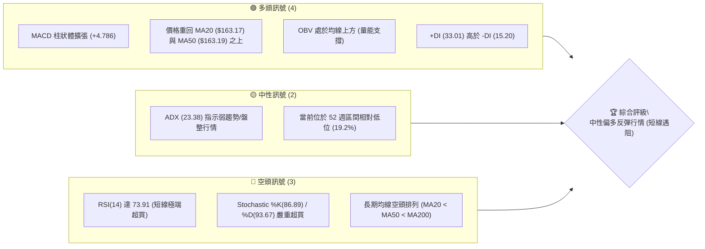
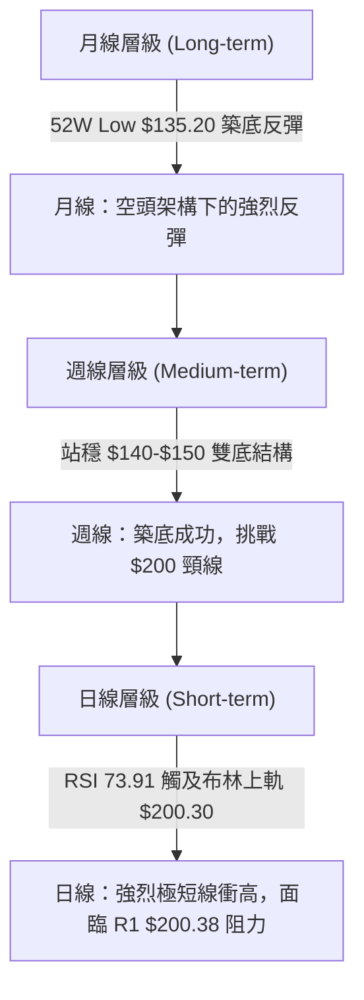
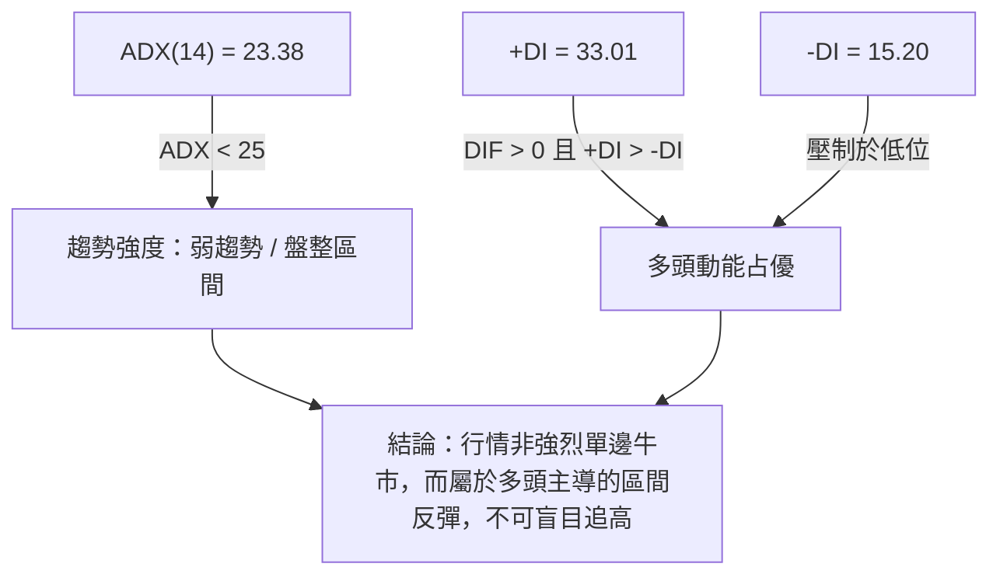
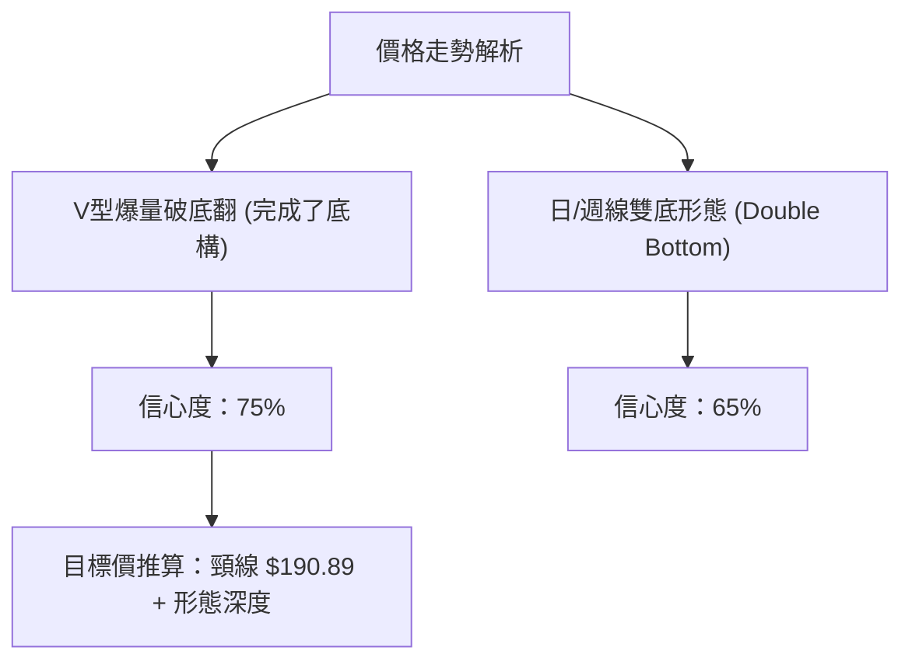
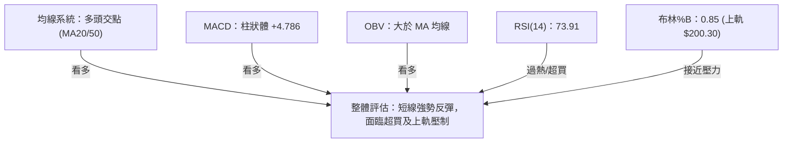
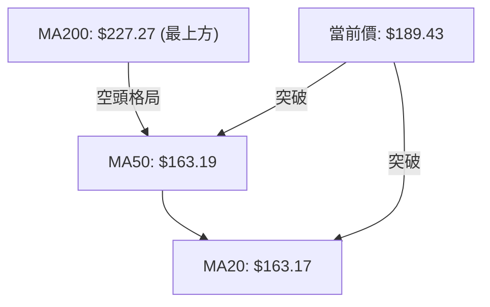
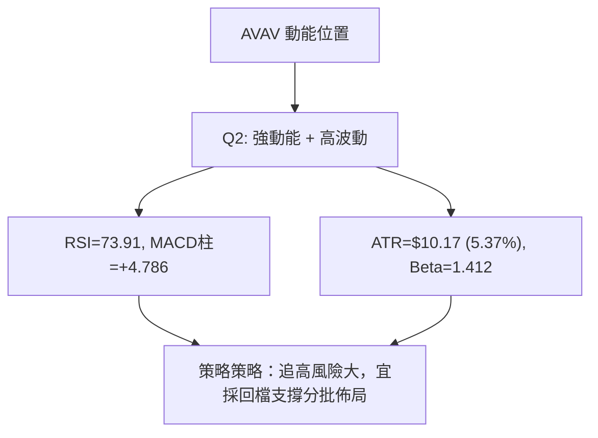
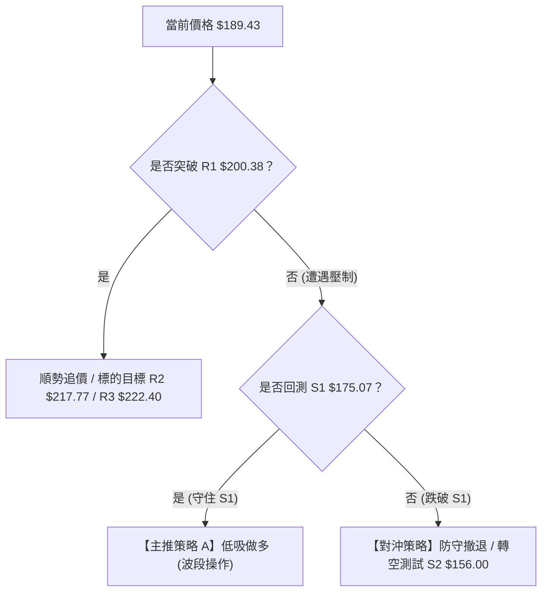
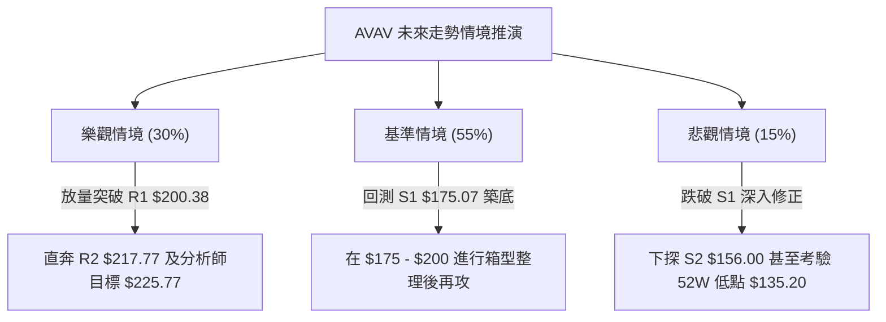

# AVAV 技術分析報告

> **報告日期**：2026-08-14 ｜ **語言**：繁體中文 ｜ **數據來源**：Yahoo Finance ｜ **當前價格**：$189.43

---

## 目錄

| 章節 | 內容 |
|------|------|
| [1. 技術面概覽](#1-技術面概覽) | 訊號儀表板、核心指標、評分卡 |
| [2. 趨勢分析](#2-趨勢分析) | 多時框趨勢、長中短期走勢 |
| [3. 圖表形態分析](#3-圖表形態分析) | 形態識別、K線組合、目標價 |
| [4. 支撐與阻力](#4-支撐與阻力) | 關鍵價位、斐波那契回調 |
| [5. 技術指標深度解讀](#5-技術指標深度解讀) | MA/RSI/MACD/布林/成交量 |
| [6. 動能與波動率](#6-動能與波動率) | 動能評估、ATR、Beta |
| [7. 多時框架總結](#7-多時框架總結) | 時框架評分矩陣 |
| [8. 交易策略建議](#8-交易策略建議) | 多空策略、風險報酬比 |
| [9. 風險提示與監控](#9-風險提示與監控) | 監控指標、風險場景 |

---

## 1. 技術面概覽

### 🎯 技術訊號儀表板



### 📊 核心指標速覽表

| 指標類別 | 指標名稱 | 當前數值 | 訊號 | 解讀 |
|----------|----------|----------|------|------|
| **價格** | 當前價格 | $189.43 | 🟡 中性 | 處於 52 週區間 $135.20–$417.86 之 19.2% 位階 |
| **均線** | MA20 | $163.17 | 🟢 看多 | 價格在 MA20 上方 (+16.09%)，短線呈急漲態勢 |
| **均線** | MA50 | $163.19 | 🟢 看多 | 價格成功站上 MA50 (+16.08%)，扭轉短期劣勢 |
| **均線** | MA200 | $227.27 | 🔴 看空 | 價格遠低於 MA200 (-16.65%)，長期空頭結構未變 |
| **動能** | RSI(14) | 73.91 | 🔴 超買 | 突破 70 警戒線，極度超買，短線有拉回整理壓力 |
| **動能** | MACD(12,26,9) | Hist: +4.786 | 🟢 看多 | DIF(9.025) 向上穿過 DEA(4.239)，柱狀體持續擴張 |
| **動能** | Stochastic | %K: 86.89 / %D: 93.67 | 🔴 超買 | 雙線高位死叉臨界，過熱訊號顯著 |
| **趨勢** | ADX(14) | 23.38 | 🟡 弱趨勢 | < 25 表明為震盪反彈行情，非強勢單邊大趨勢 |
| **波動** | ATR(14) | $10.17 | 🟡 中等 | 占價格 5.37%，提供日內與波段止損參考空間 |
| **通道** | BB %B | 0.85 | 🟡 接近上軌 | 接近布林通道上軌 ($200.30)，壓制逐漸增強 |

### 🏆 技術評分卡

```
╔══════════════════════════════════════════════════════════════╗
║              技術評分卡 — AVAV (2026-08-14)                  ║
╠══════════════════════════════════════════════════════════════╣
║ 趨勢強度      ▓▓▓▓▓▓▓▓▓▓░░░░░░░░░░  50/100  🟡 中性震盪      ║
║ 動能指標      ▓▓▓▓▓▓▓▓▓▓▓▓▓▓▓░░░░░  75/100  🟢 動能強勁      ║
║ 支撐穩定度    ▓▓▓▓▓▓▓▓▓▓▓▓▓░░░░░░░  65/100  🟢 底態堅實      ║
║ 成交量配合    ▓▓▓▓▓▓▓▓▓▓▓░░░░░░░░░  55/100  🟡 量能溫和      ║
║ 形態完整度    ▓▓▓▓▓▓▓▓▓▓▓▓░░░░░░░░  60/100  🟡 V型築底      ║
║ 均線排列      ▓▓▓▓▓▓▓░░░░░░░░░░░░░  35/100  🔴 空頭防線      ║
╠══════════════════════════════════════════════════════════════╣
║ 綜合評分      ▓▓▓▓▓▓▓▓▓▓▓▓░░░░░░░░  58/100  🟡 中性偏多(反彈) ║
╚══════════════════════════════════════════════════════════════╝
```

---

## 2. 趨勢分析

### 🌐 多時框趨勢分析



### 📈 長期趨勢 — 12個月走勢圖（Unicode）

AVAV 股價在 2025 年 10 月達到歷史高點（約 $369.91，52 週高點 $417.86）後經歷深度修正，一路下滑至 2026 年 7 月低點（月收盤 $149.37，最低跌至 $135.20），降幅超過 67%。2026 年 8 月出現強勁的 V 型強彈。

```
AVAV 月線走勢圖（2025-09 至 2026-08）
價格軸 ($)
$400 ┼                        ● $369.91 (高點聚類)
$350 ┼                  ●
$300 ┼            ●           ● $279.46
$250 ┼                        ● $241.89  ● $278.39  ● $252.25
$200 ┼  ● $207.24                                         ● $189.43 (現在)
$150 ┼                                        ● $183.05  ● $165.07  ● $149.37 (低點 $135.20)
     └─┬─────────┬─────────┬─────────┬─────────┬─────────┬─────────┬─────────
      2025-09   2025-10   2025-11   2025-12   2026-03   2026-06   2026-07   2026-08
```

#### 走勢特徵分析表

| 階段 | 時間區間 | 價格變動 | 幅度 | 趨勢特徵與成交量解讀 |
|------|----------|----------|------|----------------------|
| **1. 高位急挫** | 2025-10 ～ 2025-12 | $369.91 → $241.89 | -34.61% | 籌碼在高位崩解，呈現單邊無支撐下殺 |
| **2. 低位震盪** | 2026-01 ～ 2026-02 | $278.39 → $252.25 | -9.39% | 嘗試反彈但受制於 MA200，形成二次壓制 |
| **3. 二次探底** | 2026-03 ～ 2026-07 | $252.25 → $135.20 | -46.40% | 恐慌性拋售，於 2026-06/07 爆出天量 (週量 >11.8M) 築底 |
| **4. 破底翻反彈**| 2026-07 ～ 2026-08 | $135.20 → $189.43 | +40.11% | 近兩週主力資金顯著回流，週 RSI 快速拉回至 73.9 |

### 📊 中期趨勢（週線分析）

從近 20 週數據觀察，週線在 2026 年 6 月底（2026-06-28）下探至 $137.95 爆出 1,188 萬股巨量，隨後於 2026-07-05 錄得 1,831 萬股之歷史天量反彈至 $190.89，確定了 **$135.20–$137.95 為中期強鐵底**。目前週線 MACD 柱狀體轉正至 +4.786，週 RSI 上升至 73.9，顯示中期築底已完成，轉入反彈與震盪打底階段。

```
週線壓力與支撐階梯結構：
阻力 R3: $222.40  ════════════════════════════════ (近一年高點重壓區)
阻力 R2: $217.77  ──────────────────────────────── (波段反彈壓力)
阻力 R1: $200.38  ──────────────────────────────── (布林上軌與短線壓力)
現價   : $189.43  ◄◄◄ 目前位置 (短線超買急漲中)
支撐 S1: $175.07  ──────────────────────────────── (月線與波段回檔支撐)
支撐 S2: $156.00  ──────────────────────────────── (MA20/MA50 支撐區)
支撐 S3: $139.76  ════════════════════════════════ (52週極限鐵底區)
```

### ⚡ 趨勢強度評估（ADX 解讀）



#### ADX 強度與行情對照表

| 指標 | 當前數值 | 參考標準 | 當前市場狀態解讀 |
|------|----------|----------|------------------|
| **ADX** | 23.38 | < 25 盤整/弱趨勢 | 市場尚未形成強烈單邊大趨勢，價格波動受限於上下軌 |
| **+DI** | 33.01 | > 25 強勢 | 多頭買盤力道強勁，主導短期行情 |
| **-DI** | 15.20 | < 20 弱勢 | 空頭賣壓顯著退場，未對短線造成強烈打壓 |
| **DI差值**| +17.81 | > 0 多頭 | 短期多頭絕對占優，但需 ADX 突破 25 方能轉為趨勢行情 |

---

## 3. 圖表形態分析

### 🔍 形態識別系統



#### 形態信心度評估表（依規則 15）

| 形態名稱 | 信心度 | 判斷依據（引用歷史 OHLCV 數據） | 完成度 | 形態推算目標價（附計算式） |
|----------|--------|----------------------------------|--------|----------------------------|
| **V型爆量破底翻** | 75% | 2026-06-28 至 2026-07-05 爆出 1,831 萬股天量，強攻至 $190.89 | 90% | 由低點 $135.20 反彈，第1目標價考量 R1 $200.38 |
| **W底 (雙底構造)** | 65% | 第一底 $137.95 (06-28)，第二底 $142.20 (07-19)，頸線 $190.89 | 80% | 頸線 $190.89 + (頸線 $190.89 - 低點 $137.95 = $52.94) = **$243.83**（唯受制於 R3 $222.40 與 61.8% 斐波位 $243.18） |
| **上升旗形** | 40% | 數據不足以確認狹幅旗形，僅做指標型解讀 | 30% | 訊號不足，不予預測高階旗形目標 |

### 🕯️ 重要 K 線形態分析

| 日期/月份 | 收盤價 | K線形態 | 解讀 | 訊號 |
|-----------|--------|---------|------|------|
| **2026-06** | $165.07 | 長下影陰線 | 下探 52 週低點附近引發強烈停損賣壓 | 🔴 恐慌拋售 |
| **2026-07** | $149.37 | 長下影十字星 | 買盤爆天量卡位，$135.20 形成極強支撐 | 🟢 築底訊號 |
| **2026-08 (至今)**| $189.43 | 大陽棒強攻 | 一舉吃掉前月失地，站上 MA20 與 MA50 | 🟢 多頭反撲 |

### 📉 ASCII 走勢形態示意圖（W底與頸線攻防）

```
W底形態與頸線突破示意圖 ($)
$220 ┤                                  [R2: $217.77]
$200 ┤              頸線 $190.89 ──┐  ● (當前 $189.43 攻防)
$180 ┤              ┌───●───┐     │ /
$160 ┤             /         \    │/
$140 ┤  ● (底1)   /           ● (底2)
$120 ┴──$137.95───             $142.20───────────────────
        2026-06-28             2026-07-19      2026-08-14
```

### 🎯 形態目標價計算

1. **W底頸線位置**：$190.89 (取 2026-07-05 週收盤高點)
2. **W底最低點**：$137.95 (取 2026-06-28 週收盤低點)
3. **形態高度**：$190.89 - $137.95 = **$52.94**
4. **理論突破目標價**：$190.89 + $52.94 = **$243.83**
   - *註：受限於數據紀律，實務上方強阻力精確鎖定於阻力群 **R2 $217.77**、**R3 $222.40** 以及斐波那契 61.8% 重合位 **$243.18**。*

---

## 4. 支撐與阻力

### 🗺️ 關鍵價位分布圖（Unicode）

```
AVAV 價位結構分布圖
═══════════════════════════════════════════════════════════════
$417.86 ║████████████████████████████████████║ 52W 歷史最高點
$351.15 ║██████████████████          ║ 斐波那契 23.6% 回調位
$309.88 ║██████████████              ║ 斐波那契 38.2% 回調位
$276.53 ║████████████                ║ 斐波那契 50.0% 中軸位
$243.18 ║██████████                  ║ 斐波那契 61.8% 重要黃金位
$222.40 ║████████                    ║ 波段強阻力 R3
$217.77 ║███████                     ║ 波段阻力 R2
$200.38 ║██████                      ║ 關鍵阻力 R1 / BB 上軌 $200.30
$189.43 ╠════════════════════════════║ ◄ 當前價格 $189.43
$175.07 ║▓▓▓▓▓                       ║ 近期支撐 S1
$156.00 ║▓▓▓▓▓▓▓▓                    ║ 強支撐 S2 / MA20&50 區間
$139.76 ║▓▓▓▓▓▓▓▓▓▓▓                 ║ 極限鐵底 S3
$135.20 ║▓▓▓▓▓▓▓▓▓▓▓▓▓▓▓▓▓▓▓▓▓▓▓▓▓▓▓▓║ 52W 歷史最低點 (100.0%)
═══════════════════════════════════════════════════════════════
```

### 🚧 阻力位分析表

阻力價位嚴格引用自「關鍵價位」區塊，不憑空捏造：

| 阻力級別 | 精確價位 | 距現價增幅 | 形成原因與籌碼解讀 | 突破難度 | 重要性 |
|----------|----------|------------|--------------------|----------|--------|
| **阻力 R1** | **$200.38** | +5.78% | 近一年波段高點聚類、布林通道上軌 ($200.30) 疊加，整數心理關卡 | 🔴 極高 | 🟢 關鍵 |
| **阻力 R2** | **$217.77** | +14.96% | 波段反彈高點聚類，前波成交密集套牢區 | 🟡 中高 | 🟡 中等 |
| **阻力 R3** | **$222.40** | +17.40% | 年線 MA200 ($227.27) 下方之強籌碼反彈反壓牆 | 🔴 極高 | 🔴 主要 |

### 🛡️ 支撐位分析表

支撐價位嚴格引用自「關鍵價位」區塊：

| 支撐級別 | 精確價位 | 距現價跌幅 | 形成原因與防守解讀 | 守住機率 | 重要性 |
|----------|----------|------------|--------------------|----------|--------|
| **支撐 S1** | **$175.07** | -7.58% | 近期反彈震盪支撐點、MA10 ($177.19) 附近防線 | 🟢 高 | 🟢 關鍵 |
| **支撐 S2** | **$156.00** | -17.65% | MA20 ($163.17) 與 MA50 ($163.19) 下方之波段低點聚類 | 🟢 極高 | 🔴 主要 |
| **支撐 S3** | **$139.76** | -26.22% | 52 週最低點 $135.20 區域之強烈買盤築底聚類 | 🟢 極高 | 🔴 終極防線 |

### 📐 斐波那契回調位分析

依據 52 週高低點區間（高點 **$417.86** → 低點 **$135.20**，落差 $282.66）：

```
斐波那契位階落點解讀：
0.0%   (52W High) : $417.86 ── 歷史高點
23.6%              : $351.15 ── 長期修復壓力位
38.2%              : $309.88 ── 中長期牛熊分界線
50.0%              : $276.53 ── 中樞回檔位
61.8%              : $243.18 ── 黃金反彈強壓位 (接近 MA240 $242.16)
78.6%              : $195.69 ── 當前攻防核心位 ◄◄◄ 現價 $189.43 處於 78.6%~100% 區間
100.0% (52W Low)  : $135.20 ── 歷史低點區
```

**解讀**：當前價格 $189.43 位於 **78.6% ($195.69)** 與 **100.0% ($135.20)** 回調位之間。現價正強勢挑戰 78.6% 回調位 ($195.69)，若能有效收復 $195.69，上方空間將向 61.8% 黃金回調位 **$243.18** 打開。

---

## 5. 技術指標深度解讀

### 🎛️ 指標訊號總覽



### 📈 移動平均線排列分析



| 均線名稱 | 精確價位 | 價格與均線關係 | 趨勢意涵 |
|----------|----------|----------------|----------|
| **MA 5** | $191.03 | 價格下方 (-0.84%) | 5日線貼近現價，短線呈回檔扣抵壓力 |
| **MA 10** | $177.19 | 價格上方 (+6.91%) | 短期多頭防線，回檔第一支撐 |
| **MA 20** | $163.17 | 價格上方 (+16.09%) | 月線轉銳利向上，支撐力道強勁 |
| **MA 50** | $163.19 | 價格上方 (+16.08%) | 季線平平，MA20即將金叉MA50 |
| **MA 120**| $183.09 | 價格上方 (+3.46%) | 半年線已一舉站上，扭轉中期劣勢 |
| **MA 200**| $227.27 | 價格下方 (-16.65%) | 年線扣抵高價，長期空頭總壓 |

### 📉 RSI(14) 分析

- **當前 RSI**：**73.91**（進入 > 70 🔴 超買區域）
- **過熱指標強度**：███████████████░░░░░ (73.91%)
- **背離判斷**：日線與週線 **無明顯頂背離**。RSI 隨著價格強攻而急速走高，屬典型的「動能強勁型超買」，但因逼近上軌，隨時可能觸發 3–5 日的技術性指標修復（拉回震盪）。

### 📊 MACD(12,26,9) 訊號解讀

- **MACD DIF**：**9.025**
- **MACD Signal (DEA)**：**4.239**
- **MACD Hist (柱狀圖)**：**+4.786** 🟢（持續擴張）

```
MACD 柱狀體走向示意：
+6.0 ┼               █
+4.0 ┼             █ █
+2.0 ┼           █ █ █
 0.0 ┼─────────█─█─█─█────────
-2.0 ┼       █
-4.0 ┼ █ █ █
       (前週)         (當前 +4.786)
```
DIF 遠高於 DEA，雙線在零軸上方快速拉升，顯示多頭控盤意願強烈。

### 📦 布林通道分析

```
布林通道現況 ($)
$200.30 ┤ --------------------------------- BB 上軌 (現價逼近)
$189.43 ┤ ═════════════════════════════════ 當前價格 (%B = 0.85)
$163.17 ┤ --------------------------------- BB 中軌 (MA20)
$126.04 ┤ --------------------------------- BB 下軌
```
- **BB %B 指標**：0.85（高於 0.80，代表價格已進入極端強勢區）。布林帶寬開口放大，屬短線突破走勢，但上軌 **$200.30** 與阻力 **R1 $200.38** 形成強烈共振壓制。

### 💹 成交量分析（量價配合度）

- **最新日成交量**：880,780 股
- **20日均量**：1,255,319 股（量比：0.70x）
- **OBV 趨勢**：**OBV > MA** 🟢，顯示主力資金在 $140–$160 區間建立之多頭部位並未撤出，上漲過程無異常失控爆量放量倒貨現象，屬相對健康的「價漲量溫」模式。

---

## 6. 動能與波動率

### ⚡ 動能評估四象限

| 象限分區 | 動能強度 | 波動率 | 當前狀態區分 | 分析解讀 |
|----------|----------|--------|--------------|----------|
| **象限一 (Q1)** | 強動能 | 低波動 | — | 最佳趨勢續航區 |
| **象限二 (Q2)** | 強動能 | 高波動 | **AVAV 落在此區** 🟢 | **高動能/高波動**：由低點拉升暴漲，短線動能極強，但 ATR 達 5.37%，操作需嚴控止損 |
| **象限三 (Q3)** | 弱動能 | 低波動 | — | 底部盤整觀望區 |
| **象限四 (Q4)** | 弱動能 | 高波動 | — | 恐慌殺盤區 |



### 📊 ATR 波動率分析

- **ATR(14)**：**$10.17**（占當前股價 5.37%）
- **波段止損參考距離**：
  - 保守型止損（1.5x ATR）：$189.43 - ($10.17 × 1.5) = **$174.18**（恰與 S1 $175.07 重合）
  - 激進型止損（1.0x ATR）：$189.43 - $10.17 = **$179.26**

### 📐 Beta 與市場相關性

- **Beta 係數**：**1.412**（高高波動股票，大盤上漲時彈幅更大，大盤修正時跌幅顯著）
- **Short Float**：11.3%（借券賣出比例偏高，近期的強彈有部分源於空頭回補/軋空效應）

---

## 7. 多時框架總結

### 📋 時框架評分表

| 時框架 | 趨勢方向 | 動能指標 | 均線排列 | 形態結構 | 綜合評分 | 交易建議 |
|--------|----------|----------|----------|----------|----------|----------|
| **日線 (Short)** | 🟢 偏多反彈 | 🔴 RSI超買 | 🟢 MA20/50突破| 🟢 V型走高 | **65 / 100** | 待回檔逢低佈局 |
| **週線 (Medium)**| 🟢 築底完成 | 🟢 MACD轉正| 🟡 震盪整理 | 🟢 W雙底成形 | **60 / 100** | 中線偏多分批卡位 |
| **月線 (Long)**  | 🔴 長期偏空 | 🟡 底位止跌| 🔴 MA200壓制 | 🟡 空頭回修 | **45 / 100** | 逢高減碼過度樂觀倉位 |

### 🔲 綜合訊號矩陣

```
           日線 (Short)    週線 (Medium)   月線 (Long)
動能指標    🟢 看多        🟢 看多         🟡 中性
均線結構    🟢 短多        🟡 交叉中       🔴 偏空
形態位階    🟡 逼近壓力    🟢 築底成功     🔴 深度回檔後
```

### ⚖️ 多時框收斂結論（依規則 14）

由於 **ADX(14) = 23.38 (< 25)**，當前市場定性為**「盤整與區間反彈行情」**，而非單邊強趨勢。雖然日線動能強勁（RSI 73.91, MACD 柱 +4.786），但長期均線（MA200 $227.27）仍呈下行壓制，且日線已逼近布林通道上軌（$200.30）與關鍵阻力 **R1 $200.38**。

**最終收斂結論**：**中性偏多（短線面臨 R1 $200.38 回檔修復，中線向上看至 R2 $217.77）**。

---

## 8. 交易策略建議

### 🗺️ 策略決策流程圖



### 🧭 策略路由

**當前主策略方向 = 偏多回檔低吸（綜合評分 58/100，屬偏多反彈行情）**
由於 RSI(73.91) 極度超買且逼近 R1 $200.38，直接追高風險回報比不佳。主推「回測 S1 逢低做多策略」。

### 🎯 價格情境階梯（Price Scenarios）

價位嚴格引用自關鍵價位與斐波那契計算結果：

| 觸發條件 | 第一目標 | 後續延伸目標 | 情境含義 |
|----------|----------|--------------|----------|
| **強勢突破 R1 $200.38** | R2 $217.77 | R3 $222.40 / 斐波 61.8% $243.18 | 中期軋空行情展開，挑戰年線 |
| **在 $175.07–$200.38 區間震盪** | $189.43 | — | 指標過熱修正，時間換取空間 |
| **跌破 S1 $175.07** | S2 $156.00 | S3 $139.76 | 反彈宣告結束，二次探底考驗 |

### 📊 情境機率分佈

| 情境 | 機率 | 主要依據 |
|------|------|----------|
| **回測 S1 後再度上行** | **55%** | MACD 柱狀體擴張 (+4.786)，OBV > MA，主力資金卡位明確 |
| **於 $175–$200 區間震盪** | **30%** | ADX 僅 23.38 (<25)，RSI(73.91) 過熱需要時間修復 |
| **直接跌破 S1 深入回檔** | **15%** | MA200 ($227.27) 長期空頭反壓，短線軋空動能竭盡 |

### 🟢 主策略詳情

所有價格嚴格引用數據：支撐 S1 **$175.07**、S2 **$156.00**，阻力 R1 **$200.38**、R2 **$217.77**、R3 **$222.40**，分析師目標 **$225.77**。

| 策略要素 | 策略 A：波段逢低做多（首選 🥇） | 策略 B：突破順勢追多（次選 🥈） |
|----------|----------------------------------|----------------------------------|
| **進場條件** | 股價拉回至 S1 $175.07 附近獲得支撐訊號 | 日K線實體強勢收盤突破 R1 $200.38 |
| **進場價格** | **$176.50**（S1 $175.07 上方布局） | **$201.50**（突破 R1 確認後） |
| **目標價 T1**| **$200.38** (R1 壓力位) | **$217.77** (R2 壓力位) |
| **目標價 T2**| **$217.77** (R2 壓力位) | **$225.77** (分析師均價目標) |
| **止損價格** | **$163.00**（跌破 MA20 $163.17 與 S2 前緣）| **$191.00**（假突破落回 MA5 $191.03 下）|
| **風險報酬比**| **1 : 3.06**（風險 $13.50，報酬 $41.27） | **1 : 2.31**（風險 $10.50，報酬 $24.27） |
| **成功機率** | **65%** | **50%** |
| **建議倉位** | **15% - 20%** | **10% - 15%** |

### 🔴 反向風險觸發點（對沖與風控提示）

若持有多單，當價格跌破 **S1 $175.07** 且 MACD 柱狀圖高位轉折向下，應立即執行止損或採取對沖保護，防止股價進一步下探至 **S2 $156.00**。

### ⭐ 整體訊號強度評星

```
做多訊號強度：★★★☆☆  (3/5星) — 動能強但短線過熱，需待拉回
做空訊號強度：★★☆☆☆  (2/5星) — 順應長期空勢但遭遇強烈底部反彈
整體可信度：  ████████████░░░  (3.8/5星)
```

---

## 9. 風險提示與監控

### ✅ 關鍵監控指標 Checklist

```
╔══════════════════════════════════════════════════════════════╗
║              AVAV 日常交易風控監控清單                      ║
╠══════════════════════════════════════════════════════════════╣
║ [ ] 1. RSI(14) 能否順利降至 50–60 區間完成冷卻             ║
║ [ ] 2. 股價回測能否守住 S1 $175.07 (或 MA10 $177.19)         ║
║ [ ] 3. 成交量是否在回檔時縮量 (需 < 20日均量 1,255,319)      ║
║ [ ] 4. MACD 柱狀圖是否出現高位衰退 (小於 +4.786)             ║
║ [ ] 5. 布林通道上軌 $200.30 突破之有效性                     ║
╚══════════════════════════════════════════════════════════════╝
```

### ⚠️ 風險場景分析



### 🛡️ 風險管理重要提醒

1. **過熱拉回風險**：RSI 達 73.91，Stochastic %D 達 93.67，追高極易買在極短線高點。
2. **財報與基本面黑天鵝**：EPS (TTM) 為 **$-5.41**，自由現金流為 **$-251.39M**，公司基本面仍處於虧損狀態，反彈主要建立於營收成長 (+133.3%) 及轉盈預期 (Forward EPS $4.40)。
3. **高 Beta 波動性**：Beta 為 1.412，單日波幅大，務必嚴格執行單筆交易虧損不超過總資產 2% 之風控紀律。

---

## 📋 報告總結

```
AVAV 技術分析報告總結
════════════════════════════════════════════════════════
報告日期：2026-08-14
當前價格：$189.43
分析評級：🟡 中性偏多（波段築底反彈，短線過熱）

關鍵價位速查：
├─ 阻力 R3：$222.40 (年線前強壓)
├─ 阻力 R2：$217.77 (波段高點)
├─ 阻力 R1：$200.38 (布林上軌與近關壓力)
├─ 當前價： $189.43
├─ 支撐 S1：$175.07 (回檔布局關鍵位)
├─ 支撐 S2：$156.00 (MA20/50 強支撐區)
└─ 分析師目標價：$225.77 (均價)

最優策略組合：
1. 🥇 首選策略：回測 $176.50 附近分批做多，止損設 $163.00，目標 $200.38 / $217.77
2. 🥈 次選策略：若強勢突破 $200.38 順勢輕倉追多，目標 $217.77
3. 🥉 嚴格風控：若有效跌破 $175.07 應多單離場觀望
════════════════════════════════════════════════════════
```

---

> ⚠️ **免責聲明**：本報告為 AI 自動生成之技術分析，所有數據及估算均嚴格基於提供之歷史價格與指標資訊。本報告**僅供研究與學術參考**，**不構成任何投資建議或買賣邀約**。投資有風險，入市需謹慎並自行承擔風險。

---

*報告生成時間：2026-08-14 ｜ 數據來源：Yahoo Finance ｜ 分析框架：多時框技術分析*