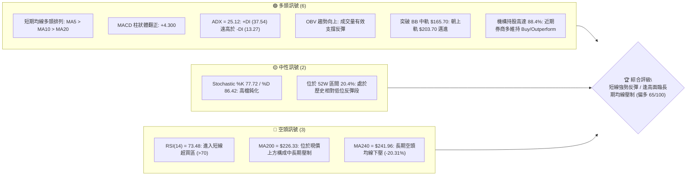
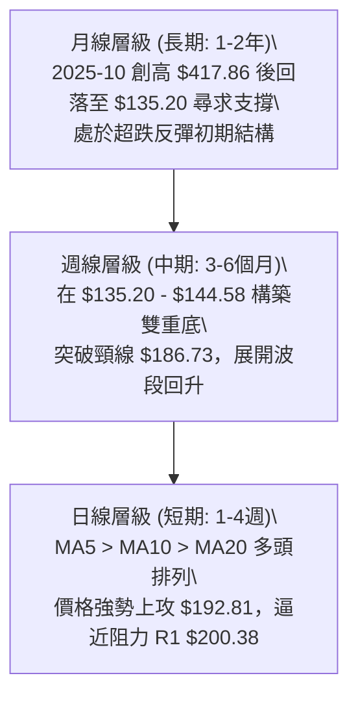
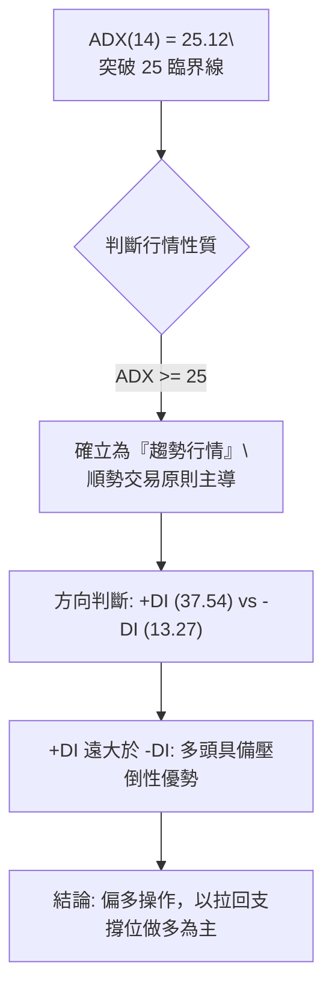
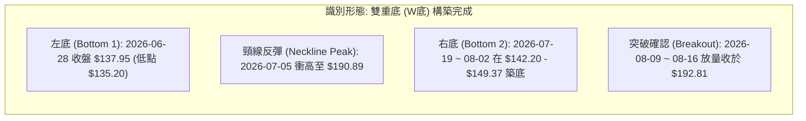
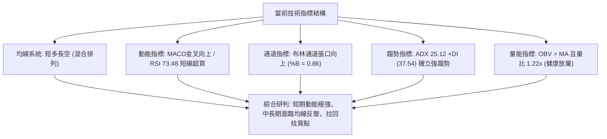
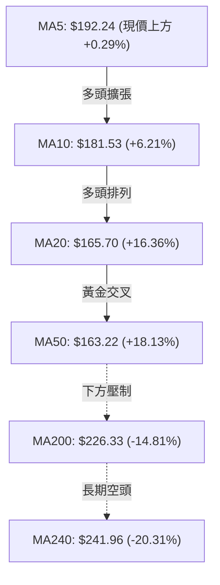
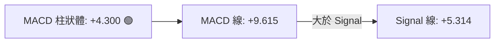
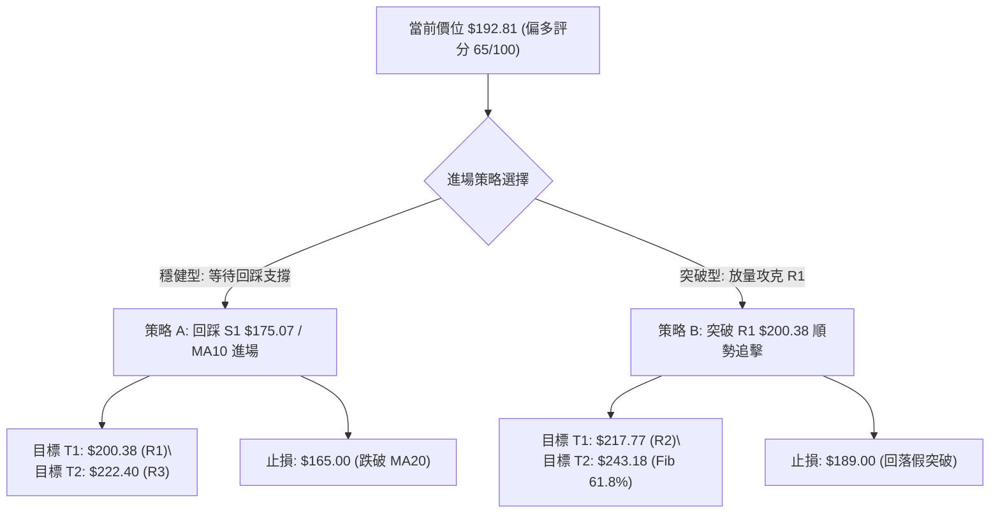
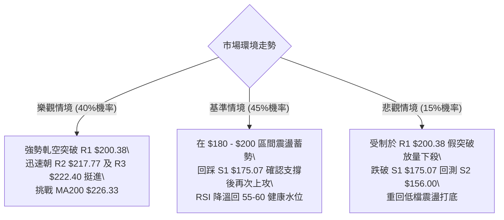

# AVAV 技術分析報告

> **報告日期**：2026-08-16 ｜ **語言**：繁體中文 ｜ **數據來源**：Yahoo Finance ｜ **當前價格**：$192.81

---

## 目錄

| 章節 | 內容 |
|------|------|
| [1. 技術面概覽](#1-技術面概覽) | 訊號儀表板、核心指標、評分卡 |
| [2. 趨勢分析](#2-趨勢分析) | 多時框趨勢、長中短期走勢 |
| [3. 圖表形態分析](#3-圖表形態分析) | 形態識別、K線組合、目標價 |
| [4. 支撐與阻力](#4-支撐與阻力) | 關鍵價位、斐波那契回調 |
| [5. 技術指標深度解讀](#5-技術指標深度解讀) | MA/RSI/MACD/布林/成交量 |
| [6. 動能與波動率](#6-動能與波動率) | 動能評估、ATR、Beta |
| [7. 多時框架總結](#7-多時框架總結) | 時框架評分矩陣 |
| [8. 交易策略建議](#8-交易策略建議) | 多空策略、風險報酬比 |
| [9. 風險提示與監控](#9-風險提示與監控) | 監控指標、風險場景 |

---

## 1. 技術面概覽

### 🎯 技術訊號儀表板



### 📊 核心指標速覽表

| 指標類別 | 指標名稱 | 當前數值 | 訊號 | 解讀 |
|----------|----------|----------|------|------|
| **價格** | 當前價格 | $192.81 | 🟢 | 連續兩週大幅拉升，自 $135.20 築底反彈強勁 |
| **均線** | MA20 | $165.70 | 🟢 | 價格位於 MA20 上方 (+16.36%)，短中期上升趨勢確立 |
| **均線** | MA50 | $163.22 | 🟢 | 價格突破 MA50 (+18.13%)，波段底部確認 |
| **均線** | MA200 | $226.33 | 🔴 | 價格低於 MA200 (-14.81%)，中長期結構尚未翻多 |
| **動能** | RSI(14) | 73.48 | 🔴 | 進入超買區 (>70)，短線追高風險增加 |
| **動能** | MACD | 9.615 | 🟢 | MACD 快線向上穿越 Signal 線 (5.314)，Hist 達 +4.300 |
| **趨勢** | ADX(14) | 25.12 | 🟢 | 剛突破 25 臨界點，+DI (37.54) 主導多頭趨勢 |
| **波動** | ATR(14) | $10.98 | 🟡 | 佔價格 5.70%，每日波動大，需寬鬆止損空間 |
| **通道** | Bollinger %B | 0.86 | 🟢 | 接近上軌 ($203.70)，通道向上張口擴張 |
| **量能** | 量比 (vs 20MA) | 1.22x | 🟢 | 日成交量 1.55M > 20日均量 1.27M，量價配合健康 |

### 🏆 技術評分卡

```
╔══════════════════════════════════════════════════════════════════╗
║                   技術評分卡 — AVAV (2026-08-16)                 ║
╠══════════════════════════════════════════════════════════════════╣
║ 趨勢強度      ██████████████░░░░░░  70/100  🟢 ADX>25 且 +DI 主導║
║ 動能指標      ████████████░░░░░░░░  60/100  🟡 MACD強但RSI過熱   ║
║ 支撐穩定度    ██████████████░░░░░░  70/100  🟢 S1 $175 / S2 $156 ║
║ 成交量配合    ██████████████░░░░░░  70/100  🟢 OBV走揚且量比1.22x║
║ 形態完整度    ████████████░░░░░░░░  60/100  🟡 雙重底形態完成頸線║
║ 均線排列      ██████████░░░░░░░░░░  50/100  🟡 短多長空混合排列  ║
╠══════════════════════════════════════════════════════════════════╣
║ 綜合評分      █████████████░░░░░░░  65/100  🟢 偏多（短線強勢）  ║
╚══════════════════════════════════════════════════════════════════╝
```

---

## 2. 趨勢分析

### 🌐 多時框趨勢分析



### 📈 長期趨勢 — 12個月走勢圖（Unicode）

```
AVAV 月線收盤走勢圖（2025-08 至 2026-08）
價格軸 ($)
$370 ┤                                  ● 2025-10 ($369.91 / 52W High $417.86)
$340 ┤
$310 ┤                        ● 2025-09 ($314.89)
$280 ┤                            ● 2025-11 ($279.46)    ● 2026-01 ($278.39)
$250 ┤    ● 2025-08 ($241.35)         ● 2025-12 ($241.89)    ● 2026-02 ($252.25)
$220 ┤
$190 ┤                                            ● 2026-04 ($195.02)  ● 2026-05 ($207.24)   ● 2026-08 ($192.81) ◄ 現價
$160 ┤                                                      ● 2026-06 ($165.07)
$130 ┤                                                                ● 2026-07 ($149.37 / 52W Low $135.20)
     └────┬──────┬──────┬──────┬──────┬──────┬──────┬──────┬──────┬──────┬──────┬──────┬──────
        08/25  09/25  10/25  11/25  12/25  01/26  02/26  03/26  04/26  05/26  06/26  07/26  08/26
```

**走勢特徵分析表格**：

| 階段 | 期間 | 價格區間 | 漲跌幅 | 結構特徵與成交量分析 |
|------|------|----------|--------|----------------------|
| 1. 歷史主升段 | 2025-08 ~ 2025-10 | $241.35 → $369.91 | +53.27% | 俄烏/中東無人機需求激增，創下 52W 高點 $417.86 |
| 2. 高檔震盪出貨 | 2025-11 ~ 2026-02 | $369.91 → $252.25 | -31.81% | 高檔獲利了結，多次衝高受阻於 $280 頸線 |
| 3. 空頭主跌段 | 2026-03 ~ 2026-07 | $252.25 → $149.37 | -40.78% | 跌破 MA200，週成交量暴增至 18.3M（洗盤出清），見 52W 低點 $135.20 |
| 4. 底部V型反轉 | 2026-07 ~ 2026-08 | $135.20 → $192.81 | +42.61% | 2026-08 連續長陽拉升，站上 MA50 與中軌，空頭回補力道強 |

### 📊 中期趨勢（週線分析）

```
中期週線支撐與阻力結構：
阻力位 R3: $222.40 ─── [長期均線 MA200 壓制區間 $226.33]
阻力位 R2: $217.77 ─── [2026-05 反彈高點 $207.24 上方阻力]
阻力位 R1: $200.38 ─── [心理關卡與 Fib 78.6% $195.69 密集區]
現  價: $192.81 ─── [強勢上攻中]
支撐位 S1: $175.07 ─── [2026-05-24 頸線與 MA20 $165.70 緩衝區]
支撐位 S2: $156.00 ─── [2026-05-17 低點 $158.00 密集支撐]
支撐位 S3: $139.76 ─── [52W 低點 $135.20 雙重底底座]
```

### ⚡ 趨勢強度評估（ADX 解讀）



| 指標 | 數值 | 狀態 | 意涵 |
|------|------|------|------|
| **ADX(14)** | 25.12 | 剛進入強趨勢區間 (>25) | 脫離底部盤整，動能趨勢啟動 |
| **+DI (多頭)**| 37.54 | 強勢擴張 | 買方掌控盤面，推進力道充沛 |
| **-DI (空頭)**| 13.27 | 持續萎縮 | 空方力道衰竭，缺乏主動拋壓 |

---

## 3. 圖表形態分析

### 🔍 形態識別系統



**形態信心度表格**：

| 形態 | 信心度 | 判斷依據（引用數據） | 完成度 | 目標價（附計算式） |
|------|--------|----------------------|--------|--------------------|
| **雙重底 (W-Bottom)** | **75%** | 兩次探底於 S3 $139.76 附近（$135.20 與 $142.20），且頸線 $190.89 已於 2026-08-16 以 $192.81 向上突破確認 | 90% (突破確認中) | 頸線 $190.89 + 形態高度 ($190.89 - $135.20 = $55.69) = **$246.58**（對應阻力 R3 $222.40 至 MA240 $241.96 區間） |
| **V型島狀反轉 (短線)** | **65%** | 2026-07 週成交量高達 18.3M 爆量換手後迅速拉抬 | 85% | 依等距測幅第一目標為 R1 **$200.38**，第二目標為 R2 **$217.77** |

### 🕯️ 重要K線形態分析

| 日期 / 週別 | 收盤價 | K線形態 | 解讀 | 訊號 |
|-------------|--------|---------|------|------|
| 2026-06-28 | $137.95 | 長黑下影線 (週量 11.8M) | 恐慌盤湧現，觸及 52W 低點 $135.20，主力進場承接 | 🟡 止跌訊號 |
| 2026-07-05 | $190.89 | 巨量大長陽 (週量 18.3M) | 歷史級別換手量，形成強力軋空回補 | 🟢 強烈反轉 |
| 2026-07-19 | $142.20 | 縮量十字星回踩 | 二次探底確認 S3 $139.76 / $135.20 支撐有效 | 🟢 二次回踩確立 |
| 2026-08-09 | $186.73 | 實體長陽線 (RSI 73.7) | 帶量突破短期均線密集區，MACD 柱狀體跳增至 +4.396 | 🟢 主升攻擊波 |
| 2026-08-16 | $192.81 | 高檔陽十字星 | 逼近 R1 $200.38 阻力區，多方延續但面臨超買微幅震盪 | 🟢 偏多整理 |

### 📉 ASCII 走勢形態示意圖

```
AVAV 雙重底 (W底) 形態與測幅結構
價格軸 ($)
$246.58 ┤                                                     ● [形態理論目標價 $246.58]
        │                                                     │
$222.40 ┤                                                ┌────┴──── [阻力 R3 $222.40]
        │                                                │
$200.38 ┤                     ● 頸線高點 $190.89         ● 現價 $192.81 [突破頸線]
        │                    / \                        /
$175.07 ┤                   /   \                      /   [支撐 S1 $175.07]
        │                  /     \                    /
$156.00 ┤                 /       \        ● 右底    /     [支撐 S2 $156.00]
        │        ● 左底  /         \      /  $142.20-149.37
$135.20 ┤────────┴─────/───────────┴────/─────────────────── [52W 低點 / 形態底座]
        └─────────────────────────────────────────────────────
         2026-06-28        2026-07-05   2026-07-19~08-02   2026-08-16
```

### 🎯 形態目標價計算

1. **形態底座最低點**：$135.20（2026-06-28 週確認之 52W 低點）
2. **形態頸線位**：$190.89（2026-07-05 反彈頂點）
3. **形態垂直高度**：$190.89 - $135.20 = **$55.69**
4. **理論突破目標價**：$190.89 + $55.69 = **$246.58**
   - *階梯阻力對照*：第一阻力 R1 $200.38 → 第二阻力 R2 $217.77 → 第三阻力 R3 $222.40 → 形態終極目標 $246.58（緊鄰 MA240 $241.96）。

---

## 4. 支撐與阻力

### 🗺️ 關鍵價位分布圖（Unicode）

```
AVAV 價位結構分布圖
═════════════════════════════════════════════════════════════════
$243.18 ║██████████████████████████████║ 斐波那契 61.8% / MA240 $241.96
$226.33 ║████████████████████████      ║ 長期趨勢線 MA200 壓制區
$222.40 ║██████████████████████████████║ 強阻力 R3 (近一年波段高點)
$217.77 ║████████████████████          ║ 阻力 R2 (反彈延伸壓力區)
$200.38 ║██████████████████████████████║ 關鍵阻力 R1 / 心理關卡
$195.69 ║▓▓▓▓▓▓▓▓▓▓▓▓▓▓▓▓▓▓▓▓▓▓▓▓      ║ 斐波那契 78.6% 回調位
$192.81 ╠══════════════════════════════╣ ◄ 現價 ($192.81)
$175.07 ║▓▓▓▓▓▓▓▓▓▓▓▓▓▓▓▓▓▓▓▓          ║ 近期關鍵支撐 S1 (波段回調點)
$165.70 ║████████████████              ║ 布林中軌 / MA20 支撐
$156.00 ║██████████████████████████████║ 強支撐 S2 (波段低點聚類)
$139.76 ║██████████████████████████████║ 極限底座支撐 S3 (52W 低點 $135.20 區)
═════════════════════════════════════════════════════════════════
```

### 🚧 阻力位分析表

| 阻力級別 | 價位 | 形成原因 | 突破難度 | 重要性 |
|----------|------|----------|----------|--------|
| **R1** | **$200.38** | 近一年波段密集高點聚類，且緊鄰整數心理大關與 Fib 78.6% ($195.69) | 🟡 中等 (需補量突破) | ★★★★☆ |
| **R2** | **$217.77** | 2026-05 波段震盪反彈高點聚類區，套牢賣壓帶 | 🔴 較高 (需消化前波套牢) | ★★★★☆ |
| **R3** | **$222.40** | 波段強阻力，緊鄰下降中之 MA200 ($226.33)，空方防守重鎮 | 🔴 極高 (中長期多空分水嶺) | ★★★★★ |

### 🛡️ 支撐位分析表

| 支撐級別 | 價位 | 形成原因 | 守住機率 | 重要性 |
|----------|------|----------|----------|--------|
| **S1** | **$175.07** | 近一年波段低點聚類，且為突破 W 底頸線後之第一道回踩支撐 | 🟢 75% | ★★★★☆ |
| **S2** | **$156.00** | 2026-05-17 波段低點與 MA20 ($165.70) 下方防禦帶 | 🟢 85% | ★★★★☆ |
| **S3** | **$139.76** | 雙重底底座聚類區，歷史防線（對應 52W 低點 $135.20） | 🟢 95% | ★★★★★ |

### 📐 斐波那契回調位分析

基準區間：52週波段低點 **$135.20** → 52週歷史高點 **$417.86**（總垂直波動空間 $282.66）

| 回調比例 | 斐波那契價位 | 當前相對位置與技術意涵解讀 |
|----------|--------------|----------------------------|
| **0.0% (高點)** | $417.86 | 52週歷史最高點，終極長期壓力 |
| **23.6%** | $351.15 | 2025-10 高檔強震盪區間 |
| **38.2%** | $309.88 | 2025-09 起跌點阻力 |
| **50.0%** | $276.53 | 多空中期平衡分水嶺（2026-01 高點 $278.39） |
| **61.8%** | $243.18 | 黃金分割強壓力位，重合 MA240 ($241.96) |
| **78.6%** | $195.69 | **【關鍵位置】現價 $192.81 剛好位於 78.6% ($195.69) 與 100% ($135.20) 之間** |
| **100.0% (低點)**| $135.20 | 52週波段最低點，已完成築底反彈 |

> **深度解讀**：現價 $192.81 正挑戰斐波那契 78.6% 回調位 **$195.69**。若能有效帶量站穩 $195.69 與 R1 $200.38 之上，將正式開啟向 61.8%（$243.18）邁進的中期修復行情。

---

## 5. 技術指標深度解讀

### 🎛️ 指標訊號總覽



### 📈 移動平均線排列分析



- **均線排列狀態**：短週期（MA5、MA10、MA20、MA50、MA60、MA120）全數呈現多頭揚升排列，且現價均運行於其上方；然而長週期（MA200 $226.33、MA240 $241.96）仍在上方下壓，呈現標準的「**短多長空、中級反彈**」格局。

### 📉 RSI(14) 分析

- **RSI 當前數值**：**73.48**
- **強度進度條**：`███████████████░░░░░ 73.5%` 🔴 **超買區間**
- **背離分析**：
  - 現價自 $135.20 上漲至 $192.81，RSI 從 20.2 強勢回升至 73.48，**未出現頂背離**，屬於健康的強勢動能推升。
  - 近期 RSI > 70 顯示買盤情緒高漲，短線可能在 R1 $200.38 附近引發技術性震盪整理以消化乖離率。

### 📊 MACD(12/26/9) 訊號解讀



- MACD 處於零軸上方強勢黃金交叉狀態，柱狀體維持在 **+4.300** 高檔，多頭動能充足且未見縮腳背離，確認目前處於強勢攻擊波段中。

### 📦 布林通道分析

```
AVAV 布林通道示意圖 (BB 20, 2)
$203.70 ┬────────────────────────────────────────── BB 上軌 (阻力)
        │                                  ● 現價 $192.81 (%B = 0.86)
$165.70 ┼────────────────────────────────────────── BB 中軌 (MA20 強支撐)
        │
$127.70 ┴────────────────────────────────────────── BB 下軌
```

- **帶寬與位置**：BB %B 達 **0.86**，價格沿著上軌 $203.70 向上推升，通道呈現「張口擴張」形態，代表多頭趨勢正在加速，中軌 $165.70 形成波段核心防守線。

### 💹 成交量分析（量價配合度）

- **最新日成交量**：1,548,100 股
- **20日均量**：1,271,020 股（**量比 1.22x**，量增價揚）
- **50日均量**：1,688,324 股
- **OBV 趨勢**：OBV 線強烈穿過均線向上，量能指標完全確認價格突破，無量價背離現象。

---

## 6. 動能與波動率

### ⚡ 動能評估四象限

| 象限 | 動能強度 (Momentum) | 波動率 (Volatility) | 當前狀態 | 評估與操作導引 |
|------|--------------------|---------------------|----------|----------------|
| **Q1 (高動能 / 低波動)** | 強 | 低 | — | 穩健主升波段 |
| **Q2 (弱動能 / 低波動)** | 弱 | 低 | — | 盤整築底觀望期 |
| **Q3 (高動能 / 高波動)** | **強 (MACD+4.3 / ADX 25.1)** | **高 (ATR 5.7% / Beta 1.41)** | **✓ AVAV 當前定位** | **進攻型波段：高利潤伴隨短線回撤風險，嚴設止損** |
| **Q4 (弱動能 / 高波動)** | 弱 | 高 | — | 恐慌崩跌殺盤期 |

### 📊 ATR 波動率分析

- **ATR(14) 數值**：**$10.98**（佔當前股價之 **5.70%**）
- **止損距離建議**：
  - *短線波動止損 (1.0x ATR)*：$10.98（約 $181.83）
  - *波段結構止損 (1.5x ATR)*：$16.47（約 $176.34，緊鄰支撐 S1 $175.07）

### 📐 Beta 與市場相關性

- **Beta 係數**：**1.412**
- **解讀**：AVAV 具備顯著的高貝塔特性，波動幅度高於標普500大盤 41.2%。在大盤多頭或國防族群受資金青睞時，該股具備強大的超額報酬 (Alpha) 爆發力，但在市場避險回檔時亦面臨較大回撤壓力。

---

## 7. 多時框架總結

### 📋 時框架評分表

| 時框架 | 趨勢方向 | 動能 | 均線排列 | 形態 | 綜合評分 | 操作建議 |
|--------|----------|------|----------|------|----------|----------|
| **短期 (日線)** | 🟢 強烈看多 | 🟢 極強 (RSI 73.5) | 🟢 多頭排列 (MA5-MA60) | 🟢 沿布林上軌推升 | **80/100** | 逢回踩均線順勢做多 |
| **中期 (週線)** | 🟢 轉多 | 🟢 MACD翻正 (+4.30) | 🟡 突破 MA20/MA50 | 🟢 雙重底頸線突破 | **70/100** | 逢低波段佈局，上看阻力 R2/R3 |
| **長期 (月線)** | 🔴 仍處空頭 | 🟡 自低點超跌反彈 | 🔴 受制於 MA200/MA240 | 🟡 長期大箱體下緣回升 | **45/100** | 逢長期均線適度獲利調節 |

### 🔲 綜合訊號矩陣

```
訊號維度對齊分析：
  短期動能 (日線) ───► 🟢 [強烈多頭] ───┐
  中期結構 (週線) ───► 🟢 [轉多突破] ───┼──► 🏆 綜合收斂結論：偏多主導 (65/100)
  長期均線 (月線) ───► 🔴 [中長壓制] ───┘    (趨勢行情主導，以週線雙底做多為主)
```

### ⚖️ 多時框收斂結論

依據多時框收斂規則：
1. **行情屬性判定**：當前 **ADX = 25.12 (>25)** 且 **+DI (37.54) 遠高於 -DI (13.27)**，確立目前處於標準的「**趨勢行情**」。
2. **時框主導權**：以**中期週線雙底突破結構**為主導方向，日線動能作為短線進場與加碼點位依據。
3. **唯一方向結論**：**【偏多（順勢做多 / 逢拉回佈局）】**。雖然月線與 MA200 仍處於上方壓制狀態，但中期反彈空間充足（距 R3 $222.40 與 MA200 $226.33 尚有 +15% 以上空間），故主策略堅定執行多頭佈局。

---

## 8. 交易策略建議

### 🗺️ 策略決策流程圖



### 🧭 策略路由

> **當前主策略方向 = 【主推多頭策略】（依技術評分卡 65/100 確立偏多）**

### 🎯 價格情境階梯（Price Scenarios）

| 觸發條件 | 下一目標 | 後續延伸 | 情境含義與操作指引 |
|----------|----------|----------|--------------------|
| **突破 R1 $200.38** | **R2 $217.77** | **R3 $222.40** | 短線多頭強勢加速，直接挑戰 MA200 ($226.33) 壓力帶 |
| **站穩現價區間 ($180 - $195)** | **R1 $200.38** | — | 強勢以盤代跌消化 RSI 超買，蓄勢挑戰上軌 $203.70 |
| **跌破 S1 $175.07** | **S2 $156.00** | **S3 $139.76** | 短線反彈動能衰竭，將回測 MA20/MA50 ($165.70/$163.22) 尋求支撐 |

### 📊 情境機率分佈

| 情境 | 機率 | 主要依據 |
|------|------|----------|
| **繼續上行 / 挑戰 R1-R2** | **60%** | MACD 柱狀體維持 +4.300、OBV 量能揚升、ADX 25.12 趨勢確立、+DI 37.54 主導 |
| **高檔強勢震盪 ($180-$198)** | **25%** | RSI(14) 達 73.48 短線超買，布林上軌 $203.70 形成短期壓制 |
| **大幅回落再探 S2/S3** | **15%** | 除非失守 S1 $175.07 且大盤發生系統性風險，否則雙底確立下機率偏低 |

### 🟢 主策略詳情

| 策略要素 | 策略 A（穩健型：回踩做多） | 策略 B（突破型：強勢追買） |
|----------|----------------------------|----------------------------|
| **進場條件** | 股價回踩 S1 與 MA10 支撐不破並出現日線止跌K線 | 放量（日量 > 1.8M）帶量實體陽線突破 R1 |
| **進場價格** | **$178.00** | **$201.00** |
| **目標價 T1** | **$200.38** (R1, +12.57%) | **$217.77** (R2, +8.34%) |
| **目標價 T2** | **$222.40** (R3 / MA200, +24.94%) | **$243.18** (Fib 61.8%, +20.99%) |
| **止損價格** | **$165.00** (跌破 MA20 $165.70, -7.30%) | **$189.00** (跌回頸線下方, -5.97%) |
| **風險報酬比** | **1 : 2.42** (以 T2 計為 1 : 3.42) | **1 : 2.18** (以 T2 計為 1 : 3.52) |
| **成功機率** | **68%** | **62%** |
| **建議倉位** | **15% - 20%** 資金 | **10% - 15%** 資金 |

### 🔴 反向風險觸發點（對沖提示）

- **多頭結構破壞點**：若日線收盤價跌破 **S1 $175.07**，應將多頭部位減半觀望。
- **波段全面停損點**：若跌破 **S2 $156.00** 及 MA50 ($163.22)，宣告本波雙底反彈失敗，應全數停損離場或啟動反向空頭避險。

### ⭐ 整體訊號強度評星

```
做多訊號強度：★★★★☆  (4/5星 — 短中期多頭共振，量價配合)
做空訊號強度：★☆☆☆☆  (1/5星 — 僅有長線均線壓制與超買雜訊)
整體可信度：  ★★★★☆  (4/5星 — ADX>25 趨勢明確，機構持股高)
```

---

## 9. 風險提示與監控

### ✅ 關鍵監控指標 Checklist

```
╔══════════════════════════════════════════════════════════════════╗
║                   每日交易風控監控清單 (Checklist)               ║
╠══════════════════════════════════════════════════════════════════╣
║ [ ] 價格是否成功站穩斐波那契 78.6% ($195.69) 與 R1 ($200.38)     ║
║ [ ] RSI(14) 是否在 75 以上形成頂背離，或順利以高檔鈍化消化       ║
║ [ ] MACD 柱狀體是否持續維持在正值 (>0)，未出現急速縮腳          ║
║ [ ] 日成交量是否維持在 20日均量 (1.27M) 之上，維持量增價揚        ║
║ [ ] 股價是否始終守在關鍵防守點 S1 ($175.07) 與 MA20 ($165.70) 之上║
║ [ ] 留意空頭部位佔比 (Short Float 11.3%) 是否引發進一步軋空行情 ║
╚══════════════════════════════════════════════════════════════════╝
```

### ⚠️ 風險場景分析



### 🛡️ 風險管理重要提醒

1. **波動率管理**：AVAV 的 ATR 高達 **$10.98 (5.70%)**，Beta 為 **1.412**，每日振幅劇烈。單筆交易風險暴露金額嚴禁超過總資金之 1.5% - 2.0%，切忌在 RSI > 73 時使用市價單過度追高。
2. **空頭反撲風險**：雖然機構評等普遍偏多（19 位分析師平均目標價 $225.77），但長期均線 MA200 ($226.33) 與 MA240 ($241.96) 仍呈現陡峭下行態勢，當股價抵達 R2-R3 ($217.77 - $222.40) 區間時，必須採取「分批獲利了結」策略以鎖定利潤。

---

## 📋 報告總結

```
╔══════════════════════════════════════════════════════════════════╗
║                   AVAV 技術分析報告總結                          ║
╠══════════════════════════════════════════════════════════════════╣
║ 報告日期：2026-08-16                                             ║
║ 當前價格：$192.81                                                ║
║ 分析評級：🟢 偏多買入 (短中期強勢反彈 / 綜合評分 65分)           ║
╠══════════════════════════════════════════════════════════════════╣
║ 關鍵結論：                                                       ║
║ ├─ 長期趨勢：🟡 月線自 52W 低點 $135.20 展開超跌修復             ║
║ ├─ 中期趨勢：🟢 週線雙重底 (W底) 構築完成，突破頸線 $190.89      ║
║ ├─ 短期趨勢：🟢 日線均線多頭排列，ADX 25.12 確立強勢多頭趨勢     ║
║ ├─ 關鍵支撐：S1 $175.07 ｜ S2 $156.00 ｜ S3 $139.76              ║
║ ├─ 關鍵阻力：R1 $200.38 ｜ R2 $217.77 ｜ R3 $222.40              ║
║ └─ 分析師目標：平均 $225.77 (最高 $326.00 / 最低 $148.57)       ║
╠══════════════════════════════════════════════════════════════════╣
║ 最優策略組合：                                                   ║
║ 1. 🥇 最佳機會：等待股價拉回 $178.00 (S1 附近) 逢低買進，         ║
║                止損 $165.00，目標 $200.38 / $222.40。            ║
║ 2. 🥈 次選機會：強勢帶量突破 R1 $200.38 時順勢追買，             ║
║                止損 $189.00，目標 $217.77 / $243.18。            ║
║ 3. 🥉 保守選擇：待股價回測 MA20 ($165.70) 獲支撐確認後再行建倉。 ║
╚══════════════════════════════════════════════════════════════════╝
```

---

> ⚠️ **免責聲明**：本報告為 AI 自動生成之技術分析，所有數據及估算均基於提供的歷史價格資訊。本報告**僅供研究與學術參考**，**不構成任何投資建議**。投資有風險，入市需謹慎。

---

*報告生成時間：2026-08-16 ｜ 數據來源：Yahoo Finance ｜ 分析框架：多時框技術分析*