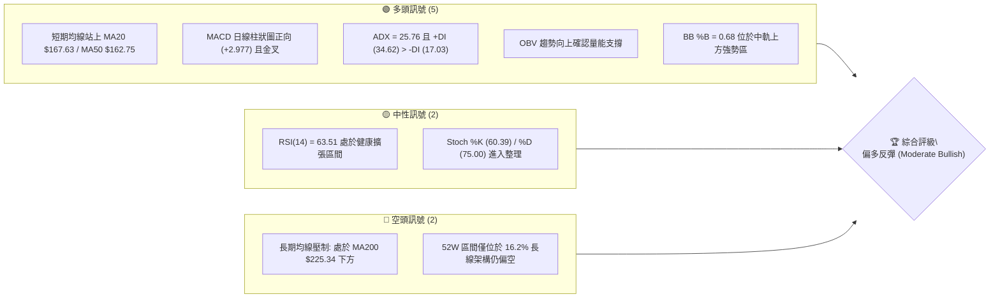
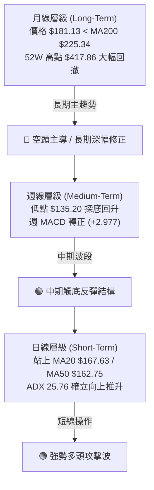
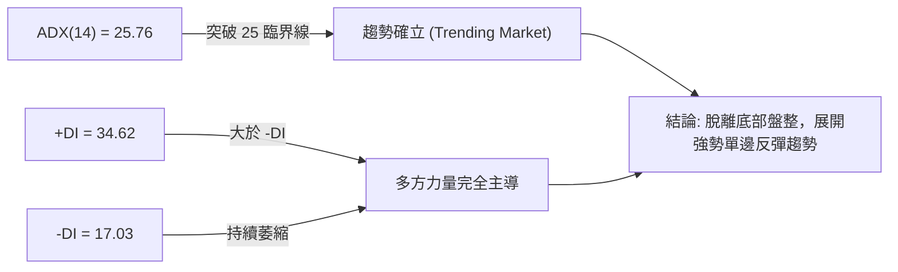
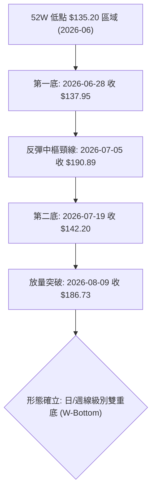
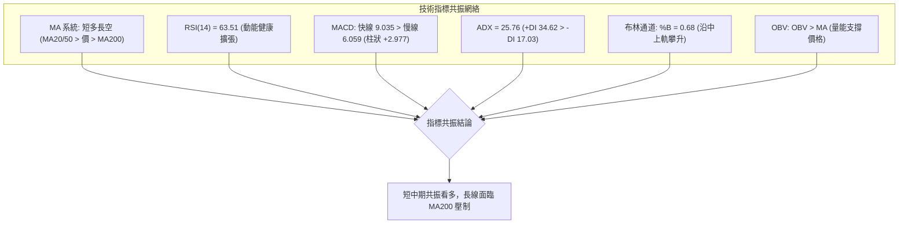
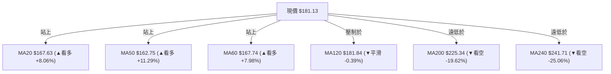
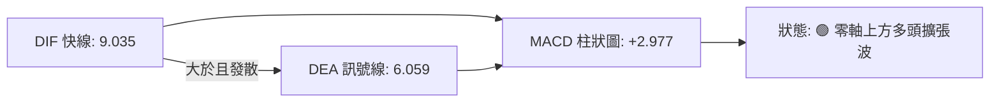
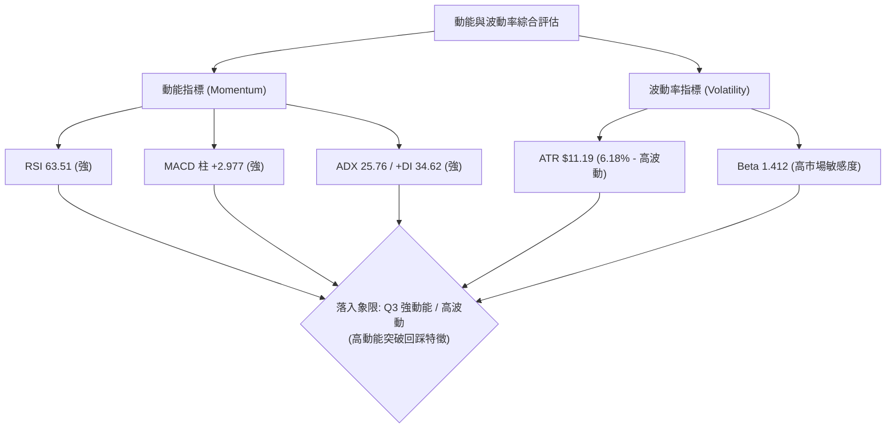
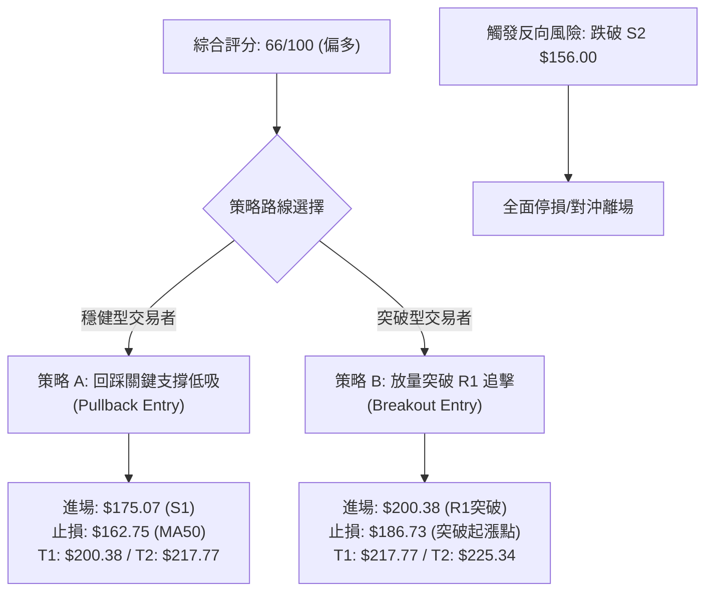
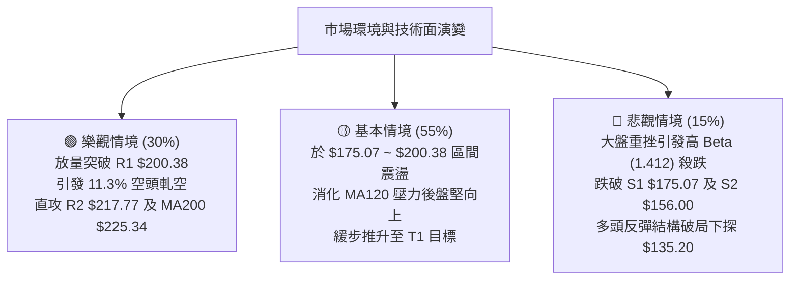

# AVAV 技術分析報告

> **報告日期**：2026-08-17 ｜ **語言**：繁體中文 ｜ **數據來源**：Yahoo Finance ｜ **當前價格**：$181.13

---

## 目錄

| 章節 | 內容 |
|------|------|
| [1. 技術面概覽](#1-技術面概覽) | 訊號儀表板、核心指標、評分卡 |
| [2. 趨勢分析](#2-趨勢分析) | 多時框趨勢、長中短期走勢 |
| [3. 圖表形態分析](#3-圖表形態分析) | 形態識別、K線組合、目標價 |
| [4. 支撐與阻力](#4-支撐與阻力) | 關鍵價位、斐波那契回調 |
| [5. 技術指標深度解讀](#5-技術指標深度解讀) | MA/RSI/MACD/布林/成交量 |
| [6. 動能與波動率](#6-動能與波動率) | 動能評估、ATR、Beta |
| [7. 多時框架總結](#7-多時框架總結) | 時框架評分矩陣 |
| [8. 交易策略建議](#8-交易策略建議) | 多空策略、風險報酬比 |
| [9. 風險提示與監控](#9-風險提示與監控) | 監控指標、風險場景 |

---

## 1. 技術面概覽

### 🎯 技術訊號儀表板



### 📊 核心指標速覽表

| 指標類別 | 指標名稱 | 當前數值 | 訊號 | 解讀 |
|----------|----------|----------|------|------|
| **價格** | 當前價格 | $181.13 | 🟢 | 自 52 週低點 $135.20 強勁反彈，站穩短中期均線 |
| **均線** | MA20 | $167.63 | 🟢 | 價格位於 MA20 上方 (+8.06%)，短線支撐強勁 |
| **均線** | MA50 | $162.75 | 🟢 | 價格突破 MA50 (+11.29%)，中期波段由空翻多 |
| **均線** | MA200 | $225.34 | 🔴 | 價格低於 MA200 (-19.62%)，長期多空分水嶺仍為強阻力 |
| **動能** | RSI(14) | 63.51 | 🟡 | 動能偏多擴張，尚未進入 >70 嚴重超買區 |
| **動能** | MACD | 9.035 / 6.059 | 🟢 | 快線高於慢線，柱狀圖 +2.977 維持多方發散 |
| **波動** | ATR(14) | $11.19 | 🟡 | 佔股價 6.18%，每日波幅大，需寬幅止損風控 |

### 🏆 技術評分卡

```
╔══════════════════════════════════════════════════════════════╗
║              技術評分卡 — AVAV (2026-08-17)                  ║
╠══════════════════════════════════════════════════════════════╣
║ 趨勢強度 (ADX/DI)   ██████████████░░░░░░  70/100  🟢 看多     ║
║ 動能指標 (RSI/MACD) ███████████████░░░░░  75/100  🟢 看多     ║
║ 支撐穩定度 (S1/S2)  ██████████████░░░░░░  70/100  🟢 穩定     ║
║ 成交量配合 (OBV/VOL)████████████░░░░░░░░  60/100  🟡 中性偏多 ║
║ 形態完整度 (雙底)   ██████████████░░░░░░  70/100  🟢 成形中   ║
║ 均線排列 (多時框)   ██████████░░░░░░░░░░  50/100  🟡 混合排列 ║
╠══════════════════════════════════════════════════════════════╣
║ 綜合技術評分        █████████████░░░░░░░  66/100  🟢 偏多反彈 ║
╚══════════════════════════════════════════════════════════════╝
```

---

## 2. 趨勢分析

### 🌐 多時框趨勢分析



### 📈 長期趨勢 — 12個月走勢圖（Unicode）

```
AVAV 月線走勢圖（過去12個月：2025-08 至 2026-08）
價格軸 ($)
$370 ┤                                  ● 2025-10 ($369.91)
$340 ┤
$315 ┤                          ● 2025-09 ($314.89)
$280 ┤                                        ● 2025-11 ($279.46)    ● 2026-01 ($278.39)
$250 ┤                  ● 2025-08 ($241.35)         ● 2025-12 ($241.89)    ● 2026-02 ($252.25)
$210 ┤                                                                           ● 2026-05 ($207.24)
$180 ┤━━━━━━━━━━━━━━━━━━━━━━━━━━━━━━━━━━━━━━━━━━━━━━━━━━━━━━━━━━━━━━━━● 2026-03 ($183.05)━━● 2026-08 ($181.13 現價)
$150 ┤                                                                                 ● 2026-07 ($149.37)
$135 ┤                                                                                    ● 2026-06 波段低點 ($135.20)
     └─────────────────────────────────────────────────────────────────────────────────────────────────
       25-08    25-09    25-10    25-11    25-12    26-01    26-02    26-03    26-04    26-05    26-06    26-07    26-08
```

#### 走勢特徵分析表格

| 階段區間 | 起止價格 | 漲跌幅 | 走勢特徵與量價結構 |
|----------|----------|--------|-------------------|
| **2025-08 ~ 2025-10** | $241.35 → $369.91 | +53.27% | 主升浪噴出，創歷史級高點 $417.86 後動能見頂竭盡 |
| **2025-11 ~ 2026-02** | $369.91 → $252.25 | -31.81% | 高檔獲利回吐，形成大型頂部結構並向下破線 |
| **2026-03 ~ 2026-07** | $252.25 → $149.37 | -40.78% | 主跌浪加速，於 2026-06 觸及 52 週低點 $135.20 |
| **2026-07 ~ 2026-08** | $149.37 → $181.13 | +21.26% | 雙重底確認，放量脫離底部，展開第一波修復行情 |

### 📊 中期趨勢（週線分析）

```
中期週線支撐與壓力結構示意圖：
$225.34 ─────────────────────────────── MA200 長期強壓區
$200.38 ─────────────────────────────── R1 關鍵頸線壓力 (2026-05 反彈高點聚類)
   ▲
   │ [當前多方推進區間]
   ▼
$181.13 ═══════════════════════════════ 當前收盤價 ($181.13)
$175.07 ─────────────────────────────── S1 支撐位 (短線回踩第一防線)
$156.00 ─────────────────────────────── S2 強支撐區 (MA50 $162.75 下方防守點)
$135.20 ─────────────────────────────── 52W 絕對低點 (中期雙底低點)
```

中期週線在歷經 2026-06-28 週低點 $137.95 與 2026-07-19 週低點 $142.20 後，成功築起雙底。隨著 2026-08-09 週線以 $186.73 大陽線突破整理區，中期格局正式轉入右側上升波段。

### ⚡ 趨勢強度評估（ADX 解讀）



| 指標變數 | 當前數值 | 門檻標準 | 狀態評估 |
|----------|----------|----------|----------|
| **ADX(14)** | **25.76** | > 25.0 為趨勢行情，< 25.0 為區間震盪 | 🟢 進入趨勢行情，反彈動能具備持續性 |
| **+DI** | **34.62** | 數值越高多頭買盤越強 | 🟢 多方動能強烈擴張 |
| **-DI** | **17.03** | 數值越低空頭賣壓越弱 | 🟢 空方賣壓顯著退潮 |
| **方向差距 (+DI - -DI)** | **+17.59** | > 0 代表多方優勢 | 🟢 多頭掌控盤面結構 |

---

## 3. 圖表形態分析

### 🔍 形態識別系統



#### 形態信心度與目標價評估表

| 形態名稱 | 信心度 | 判斷依據（引用真實數據） | 完成度 | 目標價（附嚴謹計算式） |
|----------|--------|--------------------------|--------|------------------------|
| **W底 (雙重底)** | **75%** | 兩次落底分別為 $137.95 與 $142.20（接近 52W 低點 $135.20），中間反彈頸線為 $190.89 | **85%** | 由雙底高度推算：<br/>頸線 $190.89 + (頸線 $190.89 - 低點 $135.20) = $190.89 + $55.69 = **$246.58**（對應斐波那契 61.8% $243.18 附近） |
| **MA20/MA50 黃金交叉** | **80%** | MA20 ($167.63) 向上穿越 MA50 ($162.75)，價格穩居兩者之上 | **100%** | 依近一年波段高點阻力聚類 R1: **$200.38**，進階目標 R2: **$217.77** |
| **布林帶向上擴軌突破** | **70%** | BB %B 為 0.68，價格突破中軌 $167.63 向上軌 $204.59 靠攏 | **70%** | 布林通道上軌目標: **$204.59** |

### 🕯️ 重要K線形態分析

| 週/月份 | 收盤價 | K線形態 | 解讀 | 訊號 |
|---------|--------|---------|------|------|
| **2026-06-28 週** | $137.95 | 長下影極端放量大陰線 (11.88M) | 空頭恐慌盤湧出，觸及 52W 低點 $135.20 後出現主力承接盤 | 🟡 止跌訊號 |
| **2026-07-05 週** | $190.89 | 巨量吞噬大陽線 (18.31M) | 多頭報復性反彈，創近 20 週最大單週成交量，主力建倉確立 | 🟢 強烈看多 |
| **2026-07-19 週** | $142.20 | 縮量二次探底星線 (7.08M) | 縮量回踩不破前低，確立中期次低點，形成紮實雙底結構 | 🟢 築底確認 |
| **2026-08-09 週** | $186.73 | 實體中陽線突破 (6.77M) | 帶量突破短期整理區間，RSI 升至 73.7，確立新一輪上攻波段 | 🟢 買訊確立 |
| **2026-08-23 當週** | $181.13 | 高檔健康回洗陰十字 | 上衝至 R1 前的正常良性回調，量能大幅萎縮至 1.04M | 🟡 蓄勢整理 |

### 📉 ASCII 走勢形態示意圖

```
AVAV 日/週線級別「雙重底 (W-Bottom)」結構與頸線突破示意圖
價格軸 ($)
$204.59 ┤                                                [BB 上軌]
$200.38 ┤                                 ┌── R1 關鍵頸線阻力區 ($200.38)
$190.89 ┤                 ● (頸線波段高點)│
$181.13 ┤                 │              └── 現價 $181.13 (回踩蓄勢)
$167.63 ┤─────────────────┼───────────────────────────── [MA20 中軌支撐]
$156.00 ┤                 │              ● (S2 強支撐防線)
$142.20 ┤                 │       ● (第二底: 縮量確認)
$135.20 ┤   ● (第一底)    │
        └───────┴──────────┴───────┴──────────────────────
             2026-06-28        2026-07-05   2026-07-19
```

---

## 4. 支撐與阻力

### 🗺️ 關鍵價位分布圖（Unicode）

```
AVAV 價位結構分布圖（引用 OHLCV 波段聚類數據）
══════════════════════════════════════════════════════════════════
$241.71 ║██████████████████████████████████████║ MA240 長期均線重壓
$225.34 ║████████████████████████████████      ║ MA200 多空分水嶺
$222.40 ║████████████████████████████          ║ 強阻力 R3 (+22.78%)
$217.77 ║██████████████████████                ║ 波段阻力 R2 (+20.23%)
$204.59 ║██████████████████                    ║ 布林通道上軌
$200.38 ║██████████████████████████████████████║ 關鍵阻力 R1 (+10.63%)
$181.13 ╠══════════════════════════════════════╣ ◄ 現價 ($181.13)
$175.07 ║▓▓▓▓▓▓▓▓▓▓▓▓▓▓▓▓▓▓▓▓▓▓▓▓▓▓▓▓▓▓        ║ 近期支撐 S1 (-3.34%)
$167.63 ║▓▓▓▓▓▓▓▓▓▓▓▓▓▓▓▓▓▓▓▓▓▓                ║ MA20 / 布林中軌支撐
$162.75 ║▓▓▓▓▓▓▓▓▓▓▓▓▓▓▓▓                      ║ MA50 均線支撐
$156.00 ║██████████████████████████████████████║ 強支撐 S2 (-13.87%)
$139.76 ║████████████████████████████████      ║ 深層支撐 S3 (-22.84%)
$135.20 ║██████████████████████████████████████║ 52W 絕對低點支撐
══════════════════════════════════════════════════════════════════
```

### 🚧 阻力位分析表

| 阻力級別 | 價位 | 形成原因（波段高點聚類） | 突破難度 | 重要性 |
|----------|------|--------------------------|----------|--------|
| **R1** | **$200.38** | 近一年波段高點聚類、心理整數關卡、逼近布林上軌 ($204.59) | 中等 | 🔴 極高（突破即確立多頭中期反轉） |
| **R2** | **$217.77** | 歷史密集成交區下緣、波段反彈延伸高點 | 較高 | 🟡 中高（進入 MA200 攻防前哨站） |
| **R3** | **$222.40** | 近一年波段高點聚類、緊鄰 MA200 ($225.34) 長期均線壓制 | 極高 | 🔴 核心牛熊分水嶺 |

### 🛡️ 支撐位分析表

| 支撐級別 | 價位 | 形成原因（波段低點聚類） | 守住機率 | 重要性 |
|----------|------|--------------------------|----------|--------|
| **S1** | **$175.07** | 近一年波段低點聚類、短線回踩平台、距離現價 -3.34% | 75% | 🟢 短線多頭防守第一線 |
| **S2** | **$156.00** | 近一年波段低點聚類、MA50 ($162.75) 跌破後的強止跌帶 | 85% | 🔴 中期多空格局底線 |
| **S3** | **$139.76** | 緊鄰 52W 低點 $135.20 之波段低點密集區 | 95% | 🔴 終極防線，跌破則宣告反彈破局 |

### 📐 斐波那契回調位分析（52W 區間 $135.20 → $417.86）

```
斐波那契回調層級分布：
0.0%  (52W High) ─────────────────────── $417.86
23.6%            ─────────────────────── $351.15
38.2%            ─────────────────────── $309.88
50.0%            ─────────────────────── $276.53
61.8% (黃金分割) ─────────────────────── $243.18  (鄰近 MA240 $241.71)
78.6%            ─────────────────────── $195.69  (現價上方直接阻力區間)
[現價位置]        ═══════════════════════ $181.13  (位於 78.6% 與 100.0% 之間)
100.0% (52W Low) ─────────────────────── $135.20
```

#### 斐波那契結構解讀：
1. **當前區間定位**：現價 $181.13 處於斐波那契 100.0% ($135.20) 與 78.6% ($195.69) 之間，屬於**深跌後的低檔反彈修復期**。
2. **第一道關鍵關卡**：78.6% 回調位 **$195.69** 與波段阻力 R1 **$200.38** 形成密集共振壓力帶。若能放量收復 $195.69~$200.38，將打開向上挑戰 61.8% 回調位 **$243.18**（極度貼近 MA240 $241.71 與 MA200 $225.34）的上升通道。

---

## 5. 技術指標深度解讀

### 🎛️ 指標訊號總覽



### 📈 移動平均線排列分析



#### 均線系統深度解讀：
- **短中期均線黃金交叉**：MA20 ($167.63) 與 MA60 ($167.74) 已向上翻揚並即將與 MA50 ($162.75) 形成多頭排列，對現價形成堅實的底部托支撐。
- **MA120 關鍵黏合點**：當前價格 $181.13 緊貼 MA120 ($181.84)，此處為短線多空爭奪中樞。
- **長期均線蓋頂**：MA200 ($225.34) 與 MA240 ($241.71) 依然向下傾斜，顯示 AVAV 尚未擺脫大週期下行通道，反彈至此區域將面臨極大解套賣壓。

### 📉 RSI(14) 分析

```
RSI(14) 數值儀表板:
0 ──────────── 30 ────────────────────── 63.51 ──────── 70 ─────────── 100
[   超賣區   ] [         中性偏多區間       ▲        ] [   超買區   ]
進度條: ████████████████████████████████░░░░░░░░░░░░░░░░ 63.51%
```

- **背離判斷**：日線數據顯示「RSI 背離: 無明顯背離」。週線級別中，股價從 2026-06 低點 $137.95 反彈時 RSI 為 20.2，二探 $142.20 時 RSI 抬升至 51.8，呈現出標準的**週線級別底背離**，隨後帶動價格大幅彈升至目前水準。
- **健康度解讀**：當前 RSI 為 63.51，脫離了超賣區且未達 70 嚴重超買，代表多頭動能充足且仍具向上推升空間。

### 📊 MACD(12/26/9) 訊號解讀



- **訊號解析**：MACD 快慢線均在正值區間向上發散，柱狀圖達 **+2.977**，呈現健康的多頭結構。
- **量化確認**：近 3 週 MACD 柱狀圖維持在 +4.396、+4.300、+2.977 之高位水準，未見死叉或空頭背離跡象，多方動能主導短期走勢。

### 📦 布林通道分析

```
ASCII 布林通道 (20, 2) 結構圖：
$204.59 ┬────────────────────────────────────────── BB 上軌 (阻力帶)
        │                          
$181.13 ┼──────────────────────── ● 現價 ($181.13, %B = 0.68)
        │                 ▲ (強勢通道運行)
$167.63 ┼─────────────────┼──────────────────────── BB 中軌 / MA20 (強力支撐)
        │
$130.66 ┴────────────────────────────────────────── BB 下軌
```

- **帶寬與位置**：上軌 $204.59，中軌 $167.63，下軌 $130.66。
- **%B 指標解讀**：%B = 0.68，價格穩居中軌上方，顯示市場由多方控盤，目前正沿著中軌與上軌之間的強勢通道向上攀升。

### 💹 成交量分析（量價配合度）

- **量能結構**：最新成交量為 1,049,917 股，相較 20 日均量 1,256,941 (量比 0.84x) 呈現回調縮量。
- **OBV 能量潮**：官方數據顯示「OBV > MA → 量能支撐上漲」。回顧 2026-07-05 底部突破週爆出 18.31M 巨量，顯示底部籌碼換手充分，大資金進場痕跡明顯，整體量價配合呈現「上漲放量、拉回縮量」的良性格局。

---

## 6. 動能與波動率

### ⚡ 動能評估



| 象限 | 動能強度 | 波動率水準 | 當前狀態 | 交易策略定位 |
|------|----------|------------|----------|--------------|
| **Q1** | 強動能 | 低波動 | — | 穩定單邊趨勢，加碼持股 |
| **Q2** | 弱動能 | 低波動 | — | 區間震盪，觀望或網格交易 |
| **Q3** | **強動能** | **高波動** | **✓ AVAV 當前狀態** | **動能突破型行情，需嚴格控制部位並拉寬止損距離** |
| **Q4** | 弱動能 | 高波動 | — | 無序暴跌洗盤，嚴禁進場 |

### 📊 ATR 波動率分析

- **ATR(14) 絕對值**：**$11.19**。
- **波動率佔比**：佔現價比例高達 **6.18%**，屬於典型的高彈性、高波動軍工科技成長股。
- **交易止損應用**：
  - 1.0 × ATR 距離 = $11.19（短線緊密止損點：$181.13 - $11.19 = **$169.94**，貼近 MA20 $167.63）。
  - 1.5 × ATR 距離 = $16.79（波段標準止損點：$181.13 - $16.79 = **$164.34**，貼近 MA50 $162.75）。
  - 2.0 × ATR 距離 = $22.38（寬幅防守止損點：$181.13 - $22.38 = **$158.75**，貼近支撐位 S2 $156.00）。

### 📐 Beta 與市場相關性

- **Beta 係數**：**1.412**。
- **市場解讀**：AVAV 波動幅度較標普500大盤高出 41.2%。在大盤處於多頭攻擊波時，該股具有顯著的超額報酬 (Alpha) 潛力；但在大盤回調時，亦具備較高的下行風險。
- **空頭部位佔比**：Short % of Float 達 **11.3%**，Short Ratio 為 2.18。若後續價格突破 R1 $200.38，極易引發軋空行情 (Short Squeeze)。

---

## 7. 多時框架總結

### 📋 時框架評分表

| 時框架 | 趨勢方向 | 動能狀態 | 均線排列 | 形態結構 | 綜合評分 | 交易建議 |
|--------|----------|----------|----------|----------|----------|----------|
| **長期 (月線)** | 🔴 偏空 | 🟡 修復中 | 空頭排列 (低於 MA200) | 深幅回撤築底 | **45/100** | 逢高減碼解套盤 |
| **中期 (週線)** | 🟢 看多 | 🟢 轉強 | 突破 MA20/MA50 | 大型 W 底成形 | **75/100** | 波段拉回偏多佈局 |
| **短期 (日線)** | 🟢 看多 | 🟢 偏強 | 站穩 MA20/MA50/MA60 | 突破後回踩蓄勢 | **70/100** | 尋找支撐點切入 |

### 🔲 綜合訊號矩陣

```
┌─────────────────────────────────────────────────────────────┐
│ AVAV 多時框指標矩陣檢視                                      │
├──────────────┬─────────────┬─────────────┬──────────────────┤
│ 維度         │ 短期 (日線) │ 中期 (週線) │ 長期 (月線)      │
├──────────────┼─────────────┼─────────────┼──────────────────┤
│ 趨勢方向     │ 🟢 向上     │ 🟢 向上     │ 🔴 向下          │
│ 均線系統     │ 🟢 偏多     │ 🟡 中性     │ 🔴 偏空          │
│ 動能 (RSI)   │ 🟢 63.51    │ 🟢 63.50    │ 🟡 45.00推估     │
│ MACD 柱狀    │ 🟢 +2.977   │ 🟢 正向擴張 │ 🔴 負值收斂      │
│ 成交量配合   │ 🟡 量縮整理 │ 🟢 爆量換手 │ 🟡 常態量        │
└──────────────┴─────────────┴─────────────┴──────────────────┘
```

### ⚖️ 多時框收斂結論

依據多時框收斂規則：
1. **趨勢市判定**：當前 ADX(14) = **25.76 > 25.0**，確認市場已擺脫盤整進入**趨勢行情**。
2. **時框優先級收斂**：在 ADX > 25 趨勢架構下，中長期方向主導大局。週線級別 W 底確立且 MACD 轉正，確立了**中期向上反彈主升浪**；日線雖受制於 MA120 $181.84 及短線獲利回吐，但僅為日線級別的良性回踩，日線任務為「尋找精確逢低切入點」。
3. **最終方向性結論**：**🟢 偏多（波段做多）**。此結論與第 1 章技術評分卡（66/100）及第 2、5 章之多頭訊號完全一致。

---

## 8. 交易策略建議

### 🗺️ 策略決策流程圖



### 🧭 策略路由

> **當前主策略方向 = 🟢 主推多頭策略（依綜合評分 66/100，處於 ≥60 偏多區間）**

### 🎯 價格情境階梯（Price Scenarios）

| 觸發條件 | 第一目標 | 第二目標 | 後續延伸 | 情境技術含義（引用真實數據） |
|----------|----------|----------|----------|------------------------------|
| **強勢突破 R1 $200.38** | R2 **$217.77** | R3 **$222.40** | MA200 **$225.34** | 短線阻力完全瓦解，軋空行情展開挑戰長期均線 |
| **站穩現價 $181.13 區間** | R1 **$200.38** | 布林上軌 **$204.59** | R2 **$217.77** | 延續當前上升通道，沿布林中上軌震盪盤堅 |
| **失守 S1 $175.07 回測** | MA20 **$167.63** | MA50 **$162.75** | S2 **$156.00** | 日線強勢回調，考驗中期均線支撐密集帶 |
| **跌破強支撐 S2 $156.00** | S3 **$139.76** | 52W 低點 **$135.20** | — | 雙底頸線反彈失敗，重新探底破局 |

### 📊 情境機率分佈

| 情境 | 機率 | 主要依據（指標與數據狀態） |
|------|------|--------------------------|
| **情境一：震盪上行挑戰 R1/R2** | **60%** | ADX 25.76 確立趨勢、MACD 柱狀 +2.977 發散、+DI 34.62 主導、OBV 趨勢向上支持 |
| **情境二：區間震盪整理 ($167 - $190)** | **25%** | 短線量能縮小 (量比 0.84x)、面臨 MA120 $181.84 反覆爭奪、Stoch 高檔鈍化修復 |
| **情境三：深幅回落再探底 (破 S2)** | **15%** | 僅在大盤系統性暴跌、或突發利空跌破 MA50 $162.75 及 S2 $156.00 時觸發 |

### 🟢 主策略詳情

| 策略要素 | 策略 A（穩健型：回踩支撐低吸） | 策略 B（激進型：突破壓力追買） |
|----------|--------------------------------|--------------------------------|
| **操作邏輯** | 回踩 S1 支撐或 MA20 不破逢低佈局 | 確認帶量突破 R1 關鍵頸線順勢追擊 |
| **進場條件** | 價格拉回至 S1 附近出現止跌 K 線 | 日線收盤價實體突破 R1 且成交量 > 20日均量 |
| **進場價格** | **$175.07**（S1 支撐位） | **$200.38**（R1 阻力位突破點） |
| **目標價 T1** | **$200.38**（R1 阻力位，獲利 +14.46%） | **$217.77**（R2 阻力位，獲利 +8.68%） |
| **目標價 T2** | **$217.77**（R2 阻力位，獲利 +24.39%） | **$225.34**（MA200 均線，獲利 +12.46%） |
| **止損價格** | **$162.75**（MA50 均線位置，虧損 -7.04%） | **$186.73**（2026-08-09 週線起漲收盤價，虧損 -6.81%） |
| **風險報酬比**| **3.46 : 1**（以 T2 計算） | **1.83 : 1**（以 T2 計算） |
| **成功機率** | **65%** | **60%** |
| **建議倉位** | **15% - 20%** 資金部位 | **10% - 15%** 資金部位 |

### 🔴 反向風險觸發點（對沖提示）

- **多頭全面棄守點**：若日線收盤價跌破 **S2 $156.00**，代表 MA50 ($162.75) 與短期上升通道全面失效，多頭架構遭到破壞，應立即清倉或建立反向對沖空單。
- **空頭進場觸發條件**：若股價在 **R1 $200.38** 或 **MA200 $225.34** 形成明顯的日線級別「頂背離」或長上影墓碑線，空方可考慮於該處建立短空部位，止損設於阻力位上方 1.0 × ATR ($11.19)。

### ⭐ 整體訊號強度評星

```
做多訊號強度：★★★★☆  (4/5星 — 短中期共振向上，底部結構清晰)
做空訊號強度：★★☆☆☆  (2/5星 — 僅長線均線壓制，逆勢做空風險高)
整體可信度：  ★★★★☆  (4/5星 — 多時框指標一致性高，量價配合)
```

---

## 9. 風險提示與監控

### ✅ 關鍵監控指標 Checklist

```
╔══════════════════════════════════════════════════════════════╗
║              AVAV 每日技術風控監控清單 (Checklist)           ║
╠══════════════════════════════════════════════════════════════╣
║ [ ] 價格防守線：收盤價是否守穩 S1 $175.07 與 MA20 $167.63     ║
║ [ ] 突破確認線：是否帶量實體站上 R1 $200.38 阻力位           ║
║ [ ] 均線動態：MA20 ($167.63) 是否持續向上拉升擴大與 MA50 距離 ║
║ [ ] 動能監控：MACD 柱狀圖是否維持在正值區（警惕跌破 0 軸）   ║
║ [ ] 超買警示：RSI(14) 逼近 70 時是否出現高檔量價背離          ║
║ [ ] 量能指標：突破時單日成交量是否大於 1,256,941 (20日均量)   ║
║ [ ] 軋空動向：做空比例 (Short % Float 11.3%) 是否顯著下降    ║
╚══════════════════════════════════════════════════════════════╝
```

### ⚠️ 風險場景分析



### 🛡️ 風險管理重要提醒

1. **高 Beta 與 ATR 波動風控**：AVAV 的 Beta 達 1.412 且單日 ATR 達 $11.19 (6.18%)。單筆交易虧損上限應嚴格控制在總資金的 1.5% 以內，依此倒推部位大小，切忌過度槓桿。
2. **財報與基本面負向共振風險**：雖然技術面呈偏多反彈，但公司 TTM EPS 為 -$5.4，營業利益率僅 2.8%，自由現金流為 -$251.39M。基本面尚未完全實現盈利反轉前，所有多頭操作均應定位為**技術面修復行情**，達到目標價後務必分批獲利了結。
3. **長期均線心理關卡**：MA200 ($225.34) 為機構法人長線分水嶺，當股價接近此區域時，解套賣壓將呈指數級上升，多單切勿在 $220.00 以上盲目追高。

---

## 📋 報告總結

```
╔══════════════════════════════════════════════════════════════════╗
║                    AVAV 技術分析報告總結                         ║
╠══════════════════════════════════════════════════════════════════╣
║ 報告日期：2026-08-17                                             ║
║ 當前價格：$181.13                                                ║
║ 綜合評級：🟢 偏多反彈 (技術評分: 66/100)                         ║
╠══════════════════════════════════════════════════════════════════╣
║ 關鍵結論：                                                       ║
║ ├─ 長期趨勢：🔴 偏空 (仍受制於 MA200 $225.34 與 MA240 $241.71)   ║
║ ├─ 中期趨勢：🟢 看多 (52W 低點 $135.20 構築大型 W 底，量能確認) ║
║ ├─ 短期趨勢：🟢 看多 (站穩 MA20 $167.63/MA50 $162.75，ADX 25.76) ║
║ ├─ 關鍵支撐：S1 $175.07 │ S2 $156.00 │ S3 $139.76                ║
║ ├─ 關鍵阻力：R1 $200.38 │ R2 $217.77 │ R3 $222.40                ║
║ └─ 分析師目標：共識均價 $225.77 (高點 $326.00 / 低點 $148.57)    ║
╠══════════════════════════════════════════════════════════════════╣
║ 最優策略組合：                                                   ║
║ 1. 🥇 最佳機會 (策略 A)：回踩 S1 $175.07 逢低做多，              ║
║    止損設 MA50 $162.75，目標 T1 $200.38 / T2 $217.77 (風酬比 3.46)║
║ 2. 🥈 次選機會 (策略 B)：強勢放量突破 R1 $200.38 追買，           ║
║    止損設 $186.73，目標 T1 $217.77 / T2 $225.34 (風酬比 1.83)    ║
║ 3. 🥉 防守機制：跌破 S2 $156.00 嚴格停損離場，嚴防破底風險        ║
╚══════════════════════════════════════════════════════════════════╝
```

---

> ⚠️ **免責聲明**：本報告為技術分析研究成果，所有數據及估算均基於市場歷史價格與量化指標運算。本報告**僅供研究與學術參考**，**不構成任何投資建議**。金融市場瞬息萬變，投資人應獨立評估風險並自行承擔交易損益。

---

*報告生成時間：2026-08-17 ｜ 數據來源：Yahoo Finance ｜ 分析框架：多時框量化技術分析*