# AVAV 技術分析報告

> **報告日期**：2026-08-18 ｜ **語言**：繁體中文 ｜ **數據來源**：Yahoo Finance ｜ **當前價格**：$174.14

---

## 目錄

| 章節 | 內容 |
|------|------|
| [1. 技術面概覽](#1-技術面概覽) | 訊號儀表板、核心指標、評分卡 |
| [2. 趨勢分析](#2-趨勢分析) | 多時框趨勢、長中短期走勢 |
| [3. 圖表形態分析](#3-圖表形態分析) | 形態識別、K線組合、目標價 |
| [4. 支撐與阻力](#4-支撐與阻力) | 關鍵價位、斐波那契回調 |
| [5. 技術指標深度解讀](#5-技術指標深度解讀) | MA/RSI/MACD/布林/成交量 |
| [6. 動能與波動率](#6-動能與波動率) | 動能評估、ATR、Beta |
| [7. 多時框架總結](#7-多時框架總結) | 時框架評分矩陣 |
| [8. 交易策略建議](#8-交易策略建議) | 多空策略、風險報酬比 |
| [9. 風險提示與監控](#9-風險提示與監控) | 監控指標、風險場景 |
| [📋 報告總結](#-報告總結) | 全文核心結論與策略彙總 |

---

## 1. 技術面概覽

### 🎯 技術訊號儀表板

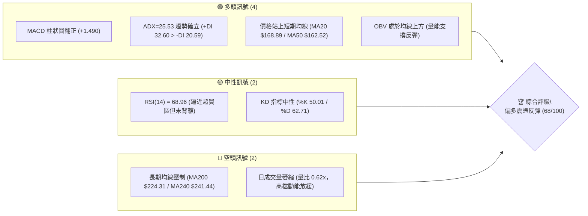

### 📊 核心指標速覽表

| 指標類別 | 指標名稱 | 當前數值 | 訊號 | 解讀 |
|----------|----------|----------|------|------|
| **價格** | 當前收盤價 | $174.14 | 🟢 | 站穩短期均線群上方，自 52 週低點強勁反彈 |
| **均線** | MA20 (月線) | $168.89 | 🟢 | 現價高於 MA20 (+3.11%)，短線支撐確立 |
| **均線** | MA50 (季線) | $162.52 | 🟢 | 現價高於 MA50 (+7.15%)，中期築底轉強 |
| **均線** | MA200 (年線)| $224.31 | 🔴 | 現價低於 MA200 (-22.37%)，長期空頭結構未扭轉 |
| **動能** | RSI(14) | 68.96 | 🟡 | 位於強勢中性區，逼近 70 警戒線，無頂背離 |
| **動能** | MACD | 7.921 / 6.431 | 🟢 | 柱狀圖 +1.490，快線持續位於慢線上方呈現多頭擴散 |
| **趨勢** | ADX(14) | 25.53 | 🟢 | ADX 突破 25 臨界點，+DI(32.60) 顯著主導行情 |
| **通道** | 布林通道 %B | 0.57 | 🟢 | 位於中軌 ($168.89) 與上軌 ($204.87) 之間健康運行 |
| **波動** | ATR(14) | $10.78 | 🟡 | 佔股價 6.19%，短線波動度適中偏高 |
| **量能** | 當日成交量 | 757,602 | 🔴 | 低於 20 日均量 (1,217,280)，呈現短線量縮整理 |

### 🏆 技術評分卡

```
╔══════════════════════════════════════════════════════════════╗
║              技術評分卡 — AVAV (2026-08-18)                  ║
╠══════════════════════════════════════════════════════════════╣
║ 趨勢強度 (ADX/DI)   ██████████████░░░░░░  72/100  🟢 偏多強勁 ║
║ 動能指標 (MACD/RSI) ██████████████░░░░░░  70/100  🟢 多頭掌控 ║
║ 支撐穩定度 (S1/MA)  ████████████████░░░░  78/100  🟢 底部紮實 ║
║ 成交量配合 (OBV/VOL)██████████░░░░░░░░░░  52/100  🟡 量能稍欠 ║
║ 形態完整度 (雙底)   ██████████████░░░░░░  70/100  🟢 形態成形 ║
║ 均線排列 (多空結構) ████████████░░░░░░░░  60/100  🟡 短多長空 ║
╠══════════════════════════════════════════════════════════════╣
║ 綜合技術評分        █████████████░░░░░░░  68/100  🟢 偏多反彈 ║
╚══════════════════════════════════════════════════════════════╝
```

---

## 2. 趨勢分析

### 🌐 多時框趨勢分析

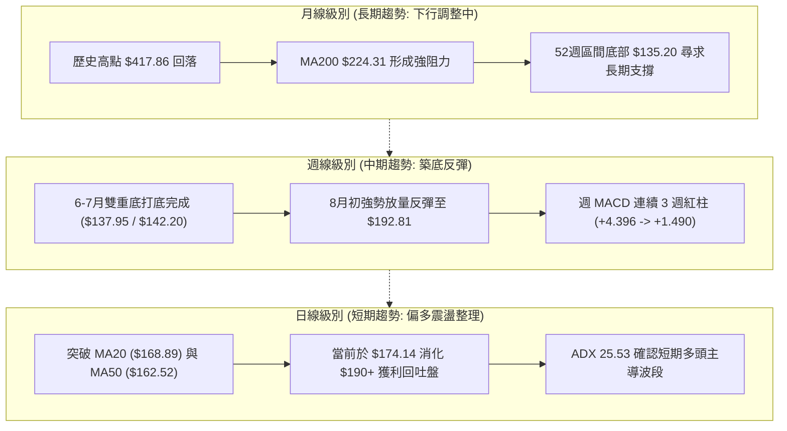

### 📈 長期趨勢 — 12個月走勢圖（Unicode）

```
AVAV 月線走勢圖（2025-08 至 2026-08）
價格軸 ($)
$370 ┤                                  ● 2025-10 ($369.91 歷史波段頂部)
$340 ┤
$310 ┤                           ● 2025-09 ($314.89)
$280 ┤                    ● 2025-11 ($279.46)       ● 2026-01 ($278.39)
$250 ┤ ● 2025-08 ($241.35)       ● 2025-12 ($241.89)       ● 2026-02 ($252.25)
$220 ┤                                                          ● 2026-05 ($207.24)
$190 ┤                                                    ● 2026-04 ($195.02)
$160 ┤                                              ● 2026-03 ($183.05)   ● 2026-06 ($165.07)  ● 2026-08 ($174.14 現價)
$130 ┤                                                                      ● 2026-07 ($149.37, 最低 $135.20)
     └──────────────────────────────────────────────────────────────────────────────────────────
       08/25 09/25 10/25 11/25 12/25 01/26 02/26 03/26 04/26 05/26 06/26 07/26 08/26
```

**走勢特徵分析表格**：

| 階段區間 | 價格變動 | 期間漲跌幅 | 趨勢特徵與量價行為 |
|----------|----------|------------|--------------------|
| **2025/08 - 2025/10** | $241.35 → $369.91 | +53.27% | 主升浪行情，無人機國防需求推動，創下 $417.86 歷史極值 |
| **2025/11 - 2026/02** | $369.91 → $252.25 | -31.81% | 高檔獲利回吐，形成大型頭部震盪，均線由多轉平 |
| **2026/03 - 2026/05** | $252.25 → $207.24 | -17.84% | 加速探底至 $183.05 後短暫反彈至 $207.24，確認頸線反壓 |
| **2026/06 - 2026/07** | $207.24 → $149.37 | -27.92% | 出現恐慌拋補，觸及 52 週最低點 $135.20，週成交量暴增至 18M |
| **2026/08 至今** | $149.37 → $174.14 | +16.58% | 底部放量確認，連續突破 MA20 與 MA50，開啟強勢反彈結構 |

### 📊 中期趨勢（週線分析）

```
AVAV 週線波段結構示意圖
══════════════════════════════════════════════════════════════
$224.31 ─────────────────────────────── MA200 長期強壓區
$200.38 ─────────────────────────────── R1 頸線阻力 / 近期波段高點 ($192.81-$207.24)
         ▲         ▲
        ╱ ╲       ╱ ╲        ▲ (當前反彈推進中)
       ╱   ╲     ╱   ╲      ╱
$174.14 ────┼─────┼─────┼────● 現價位置 (突破 MA20/MA50)
     ╱     ╲   ╱     ╲    ╱
    ╱       ╲ ╱       ╲  ╱
$135.20 ─────●─────────●── 底背離雙重底支撐 (2026-06/07: $137.95 & $135.20)
══════════════════════════════════════════════════════════════
```

### ⚡ 趨勢強度評估（ADX 解讀）

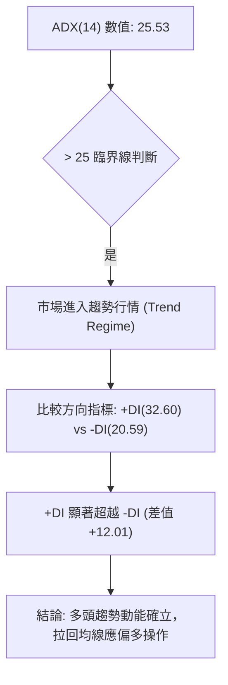

| 指標名稱 | 當前數值 | 狀態標準 | 解讀結論 |
|----------|----------|----------|----------|
| **ADX(14)** | **25.53** | > 25 (強趨勢) | 擺脫盤整混沌期，波段趨勢正式啟動 |
| **+DI** | **32.60** | > 30 (強勢多頭) | 買方推升動能充沛，主導當前盤面 |
| **-DI** | **20.59** | < 25 (空頭退縮) | 賣壓明顯受到壓制，波段回檔幅度受限 |

---

## 3. 圖表形態分析

### 🔍 形態識別系統

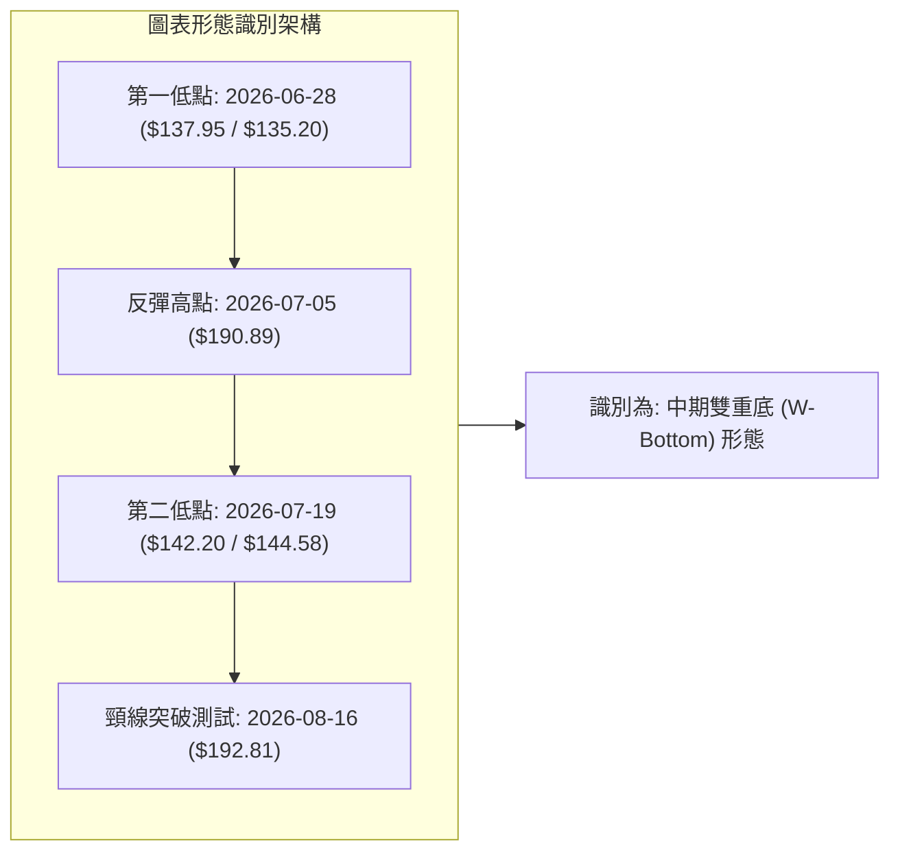

**形態信心度與目標價評估表**：

| 形態名稱 | 信心度 | 判斷依據（引用真實數據） | 完成度 | 目標價（附嚴格計算式） |
|----------|--------|--------------------------|--------|------------------------|
| **中期雙底 (W-Bottom)** | **75%** | 兩次下探 52W 低點聚類：第一底 $135.20，第二底 $142.20，兩底間隔 3 週並伴隨 18.3M 爆量確認 | **80%** | 頸線阻力取 R1: **$200.38**<br>形態高度 = $200.38 - $135.20 = $65.18<br>理論目標 = $200.38 + $65.18 = **$265.56**<br>（受限於數據紀律，第一技術測幅看至 R3 **$222.40**） |
| **短期上升旗形 (Bull Flag)** | **65%** | 自 8 月初 $149.37 飆升至 $192.81（旗桿），隨後 3 日縮量回踩至 $174.14 | **60%** | 旗桿高度 = $192.81 - $149.37 = $43.44<br>突破現價推算 = $174.14 + $43.44 = **$217.58**<br>（精確對應阻力位 R2 **$217.77**） |

### 🕯️ 重要K線形態分析

| 日期 / 週期 | 收盤價 | K線形態 | 技術解讀 | 多空訊號 |
|-------------|--------|---------|----------|----------|
| **2026-06-28 週** | $137.95 | 長下影錘頭線 (Hammer) | 探底 $135.20 後出現強烈買盤承接，成交量爆出 11.88M | 🟢 強烈看多反轉 |
| **2026-07-05 週** | $190.89 | 大陽線 (Bullish Engulfing) | 18.31M 週爆量長紅，完全吞噬前 3 週跌幅，主力進場確立 | 🟢 多頭主力表態 |
| **2026-07-19 週** | $142.20 | 縮量十字星 (Doji) | 二次探底成交量縮至 7.08M，顯示浮額清洗乾淨，形成第二隻腳 | 🟢 二次築底成功 |
| **2026-08-09 週** | $186.73 | 穿頭破腳大陽線 | 連續突破 MA20 ($168.89) 與 MA50 ($162.52)，RSI 衝上 73.7 | 🟢 趨勢突破確認 |
| **2026-08-23 週 (當前)**| $174.14 | 回踩均線小陰線 | 自 $192.81 獲利回吐，於 MA20 支撐上方進行量縮整理 (1.83M) | 🟡 健康回檔洗盤 |

### 📉 ASCII 走勢形態示意圖

```
AVAV 雙重底 (W-Bottom) 與上升旗形整合走勢
價格 ($)
$200.38 ┤                                 [頸線/阻力 R1]
$192.81 ┤                 ● (波段反彈頂)       ● (突破測試)
$180.00 ┤                ╱ ╲                 ╱ ╲  ◄ 旗形整理
$174.14 ┤───────────────╱───╲───────────────╱───● [現價: 旗形下緣支撐]
$162.52 ┤              ╱     ╲             ╱    [MA50 支撐]
$150.00 ┤  ● (起跌)  ╱       ╲     ●     ╱
$139.76 ┤   ╲       ╱         ╲   ╱ ╲   ╱       [支撐 S2]
$135.20 ┤────●─────╱───────────●───   ──●────── [52W 低點 S3 / 雙底底部]
         (2026-06-28底)    (2026-07-19底)
```

### 🎯 形態目標價計算

1. **雙重底測幅目標**：
   - 形態底部低點：**$135.20**
   - 頸線聚類高點 (R1)：**$200.38**
   - 形態垂直幅度：$\$200.38 - \$135.20 = \$65.18$
   - 破頸線理論測幅價：$\$200.38 + \$65.18 = \$265.56$
   - 中途關鍵阻力階梯：R1 **$200.38** $\rightarrow$ R2 **$217.77** $\rightarrow$ R3 **$222.40**

---

## 4. 支撐與阻力

### 🗺️ 關鍵價位分布圖（Unicode）

```
AVAV 價位結構分布圖 (由歷史 OHLCV 聚類計算)
══════════════════════════════════════════════════════════════
$243.18 ║░░░░░░░░░░░░░░░░░░░░░░░░░░░░░░░░║ 斐波那契 61.8% 反壓
$224.31 ║████████████████████████████████║ MA200 年線生死線
$222.40 ║████████████████████████████    ║ 強阻力 R3 (歷史重壓區)
$217.77 ║████████████████████            ║ 阻力 R2 (波段高點聚類)
$200.38 ║████████████████████████████████║ 關鍵阻力 R1 (W底頸線反壓)
$195.69 ║▓▓▓▓▓▓▓▓▓▓▓▓▓▓▓▓▓▓▓▓▓▓▓▓        ║ 斐波那契 78.6% 回調位
$174.14 ╠════════════════════════════════╣ ◄ 當前收盤價 ($174.14)
$168.89 ║▓▓▓▓▓▓▓▓▓▓▓▓▓▓▓▓▓▓▓▓▓▓          ║ MA20 / 布林中軌共振支撐
$162.52 ║▓▓▓▓▓▓▓▓▓▓▓▓▓▓▓▓▓▓▓▓▓▓▓▓        ║ MA50 季線強支撐
$156.00 ║████████████████████████        ║ 近期關鍵支撐 S1 (多頭防守底線)
$139.76 ║████████████████████████████    ║ 強支撐 S2 (7月築底密集成交區)
$135.20 ║████████████████████████████████║ 終極鐵底 S3 (52W 最低點)
══════════════════════════════════════════════════════════════
```

### 🚧 阻力位分析表

| 阻力級別 | 價位 | 形成原因（依據數據聚類） | 突破難度 | 重要性與戰略意義 |
|----------|------|--------------------------|----------|------------------|
| **R1** | **$200.38** | 近一年波段高點聚類、整數心理關卡、W底頸線位置 | 🟡 中等 | 短線多頭試金石，突破即確認雙底完成 |
| **R2** | **$217.77** | 前期反彈密集成交高點，上升旗形等幅測量目標 | 🔴 較高 | 中期反彈延伸段，獲利拋壓密集區 |
| **R3** | **$222.40** | 密集成交籌碼套牢區，與 MA200 ($224.31) 形成共振強阻力帶 | 🔴 極高 | 多空分水嶺，若站穩代表長期空頭趨勢逆轉 |

### 🛡️ 支撐位分析表

| 支撐級別 | 價位 | 形成原因（依據數據聚類） | 守住機率 | 重要性與戰略意義 |
|----------|------|--------------------------|----------|------------------|
| **S1** | **$156.00** | 近期波段低點聚類，接近 MA50 ($162.52) 下緣緩衝區 | 🟢 85% | 短線拉回第一道強防線，跌破則反彈節奏破壞 |
| **S2** | **$139.76** | 6-7月築底時期的第二低點聚類收盤價區間 | 🟢 90% | 中期生命線，多頭結構不容有失的護城河 |
| **S3** | **$135.20** | 52週歷史最低點，絕對估值與恐慌盤拋補底線 | 🟢 98% | 長期終極支撐，跌破將開啟全新空頭下行空間 |

### 📐 斐波那契回調位分析

*基準區間：52週最低點 $135.20 $\rightarrow$ 52週最高點 $417.86 (垂直振幅 $282.66)*

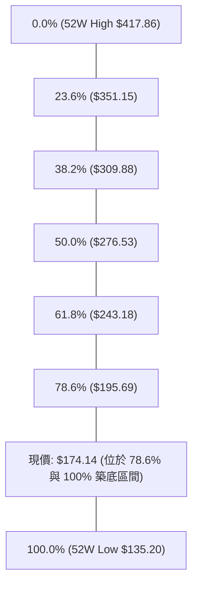

- **位置解讀**：現價 **$174.14** 處於斐波那契 **78.6% ($195.69)** 與 **100.0% ($135.20)** 之間的深度超跌回升階段。
- **關鍵意涵**：在 78.6% ($195.69) 下方形成的底部反彈，代表市場正試圖擺脫極端空頭定價。若能進一步放量站上 $195.69，上方第一個重大反彈回撤目標為黃金分割位 61.8% (**$243.18**)，恰好與 MA240 ($241.44) 與 MA200 ($224.31) 構成中長期修復目標帶。

---

## 5. 技術指標深度解讀

### 🎛️ 指標訊號總覽

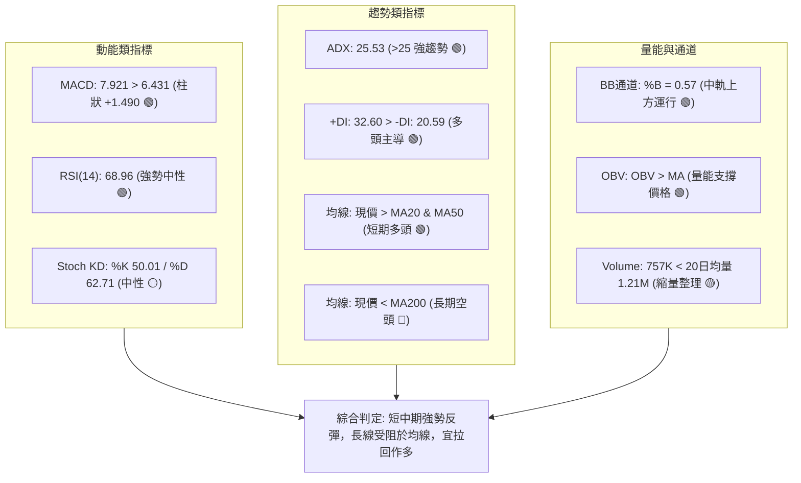

### 📈 移動平均線排列分析

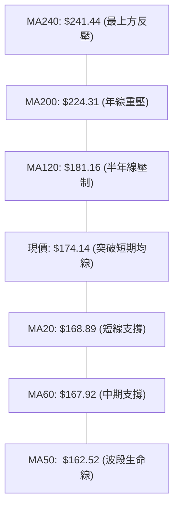

| 均線名稱 | 當前價位 | 與現價偏離度 | 走勢斜率 | 技術意涵 |
|----------|----------|--------------|----------|----------|
| **MA5** | $186.26 | -6.51% | 下彎 | 短線衝高 $192.81 後的獲利回吐乖離修正 |
| **MA10** | $184.24 | -5.48% | 下彎 | 短期快速均線受壓，需 2-3 日橫盤消化 |
| **MA20** | $168.89 | +3.11% | **上揚** ▲ | 近期主力防守成本線，提供堅實動態支撐 |
| **MA50** | $162.52 | +7.15% | **上揚** ▲ | 季線正式翻揚，中期底部結構完成確認 |
| **MA60** | $167.92 | +3.70% | **上揚** ▲ | 與 MA20 形成雙重黃金交叉支撐帶 |
| **MA120**| $181.16 | -3.88% | 下緩 ▼ | 短期反彈的第一道均線反壓 |
| **MA200**| $224.31 | -22.37%| 下緩 ▼ | 長期牛熊分界線，空頭終極防線 |

### 📉 RSI(14) 分析

```
RSI(14) 強度儀表: 68.96
0 ────── 30 (超賣) ──────────── 50 (強弱分界) ──────── 68.96 (現值) ─ 70 (超買) ────── 100
[░░░░░░░░░░░░░░░░░░░░░░░░░░░░░░██████████████████████████████████░░░░░░░░░░] 68.96%
```

- **超買超賣評估**：RSI 處於 **68.96**，剛好位於 70 超買警戒線下方。自 2026-06 底部的 20.2 極度超賣回升，展現強勁的買盤推升力道。
- **背離分析判斷**：
  - **頂背離**：無頂背離。近期價格高點 $192.81 對應 RSI 高點 73.5，價格回調至 $174.14 對應 RSI 69.0，量價與動能步調一致。
  - **底背離**：6-7 月成功完成底背離確認（6/28 價格 $137.95 / RSI 20.2；7/19 價格 $142.20 / RSI 51.8），底背離推升力道目前仍在延續中。

### 📊 MACD(12/26/9) 訊號解讀


- **柱狀圖動態**：週線級別 MACD 柱狀圖連續 3 週維持正值（+4.396 $\rightarrow$ +4.300 $\rightarrow$ +1.490）。雖然本週柱狀圖動能略有收斂，但快慢線仍處於零軸上方的多頭發散結構中，未見死亡交叉訊號，屬於健康的多頭回檔。

### 📦 布林通道分析

```
AVAV 日線布林通道結構 (BB 20, 2)
$204.87 ┬────────────────────────────────────────── BB 上軌 (阻力)
        │
        │
$174.14 ┼───────────────────────────● 現價 ($174.14, %B = 0.57)
        │                            ▲
$168.89 ┼────────────────────────────┼───────────── BB 中軌 (MA20 支撐)
        │                            │
        │
$132.92 ┴────────────────────────────┴───────────── BB 下軌
```

- **通道數據**：上軌 **$204.87**，中軌 **$168.89**，下軌 **$132.92**。帶寬呈現溫和擴張狀態。
- **%B 指標位置**：當前 **%B = 0.57**，價格脫離上軌過熱區，回踩至中軌上方之強勢區間（0.5 - 0.8），顯示上升通道架構穩固，未出現跌破中軌的走弱現象。

### 💹 成交量分析（量價配合度）

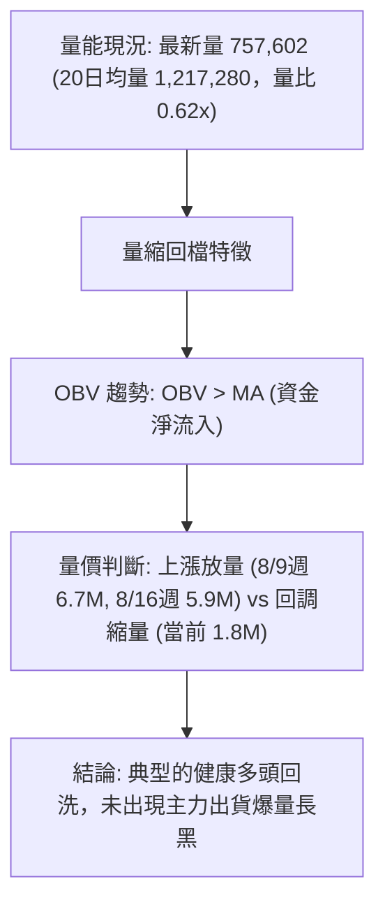

---

## 6. 動能與波動率

### ⚡ 動能評估四象限

| 象限 | 動能維度 (Momentum) | 波動率維度 (Volatility) | 標的所屬狀態 | 策略指導含義 |
|------|---------------------|--------------------------|--------------|--------------|
| **Q1** | **強動能 (MACD+/+DI高)** | **中高波動 (ATR 6.19%)** | **✓ AVAV 當前位置** | **順勢做多，拉回支撐分批佈局** |
| **Q2** | 弱動能 | 低波動 | — | 區間盤整，觀望等待方向突破 |
| **Q3** | 弱動能 | 高波動 | — | 恐慌崩跌，極高風險應嚴格避開 |
| **Q4** | 強動能 | 極低波動 | — | 緊縮蓄勢，準備迎接突破行情 |

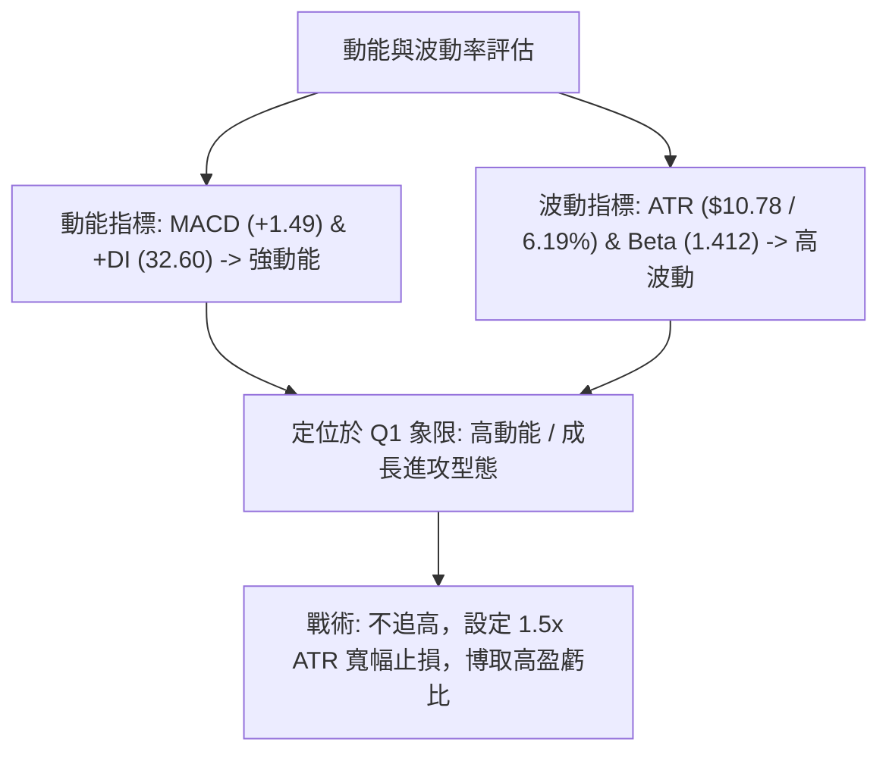

### 📊 ATR 波動率分析

- **ATR(14) 數值**：**$10.78**（佔股價比例 **6.19%**）。
- **日內震盪幅度**：每日正常理論波動區間達 $\pm \$10.78$，代表進場必須給予足夠的價格容忍空間，避免被隨機雜訊洗出場。
- **止損距離建議**：
  - **短線緊密止損 (1.0x ATR)**：距離現價 **$10.78** $\rightarrow$ 約 **$163.36**（貼近 MA50 $162.52）。
  - **波段標準止損 (1.5x ATR)**：距離現價 **$16.17** $\rightarrow$ 約 **$157.97**（精確對應支撐位 S1 **$156.00** 緩衝區）。

### 📐 Beta 與市場相關性

- **Beta 係數**：**1.412**。
- **市場特徵解讀**：AVAV 屬於高彈性（High Beta）國防科技中型成長股，其波動幅度比標普 500 指數高出 41.2%。在大盤處於多頭氛圍時具有顯著的超額報酬（Alpha）潛力；但在市場流動性緊縮時，回調速度亦極為劇烈，操作上必須嚴格依據關鍵支撐位進行風控。

---

## 7. 多時框架總結

### 📋 時框架評分表

| 時框架 | 趨勢方向 | 動能狀態 | 均線排列結構 | 圖表形態 | 綜合評分 | 戰術建議 |
|--------|----------|----------|--------------|----------|----------|----------|
| **日線 (Daily)** | 🟢 偏多回檔 | 🟢 MACD 紅柱 / RSI 68.96 | 短期多頭 (價 > MA20 > MA50) | 上升旗形整理 | **75/100** | 逢低佈局，依託 MA20 買進 |
| **週線 (Weekly)** | 🟢 築底向上 | 🟢 +DI 主導 / 週MACD翻正 | 築底中 (挑戰 MA120 $181.16) | 雙底 (W底) 成形 | **70/100** | 波段持有，上看頸線 R1 |
| **月線 (Monthly)** | 🔴 跌勢趨緩 | 🟡 跌幅收斂尋求支撐 | 長期空頭 (價 < MA200 $224.31) | 52W 低位大回撤 | **45/100** | 中長期受制於年線，不宜長抱 |

### 🔲 綜合訊號矩陣

```
╔═════════════════════════════════════════════════════════════════════╗
║                      AVAV 多時框訊號矩陣                            ║
╠══════════════════╦═══════════════╦═══════════════╦══════════════════╣
║ 維度 \ 週期      ║ 短期 (日線)   ║ 中期 (週線)   ║ 長期 (月線)      ║
╠══════════════════╬═══════════════╬═══════════════╬══════════════════╣
║ 趨勢方向 (Trend) ║ 🟢 偏多上升   ║ 🟢 底部反轉   ║ 🔴 空頭修正      ║
║ 動能強度 (Mom.)  ║ 🟢 MACD擴散   ║ 🟢 動能翻正   ║ 🟡 跌勢鈍化      ║
║ 均線系統 (MA)    ║ 🟢 站上MA20/50║ 🟡 承壓MA120  ║ 🔴 遠低於MA200   ║
║ 量能配合 (Vol.)  ║ 🟡 縮量整理   ║ 🟢 放量築底   ║ 🟡 底部量增      ║
║ 支撐阻力 (S/R)   ║ 🟢 S1防守穩固 ║ 🟢 W底成形    ║ 🔴 R3/MA200大壓  ║
╚══════════════════╩═══════════════╩═══════════════╩══════════════════╝
```

### ⚖️ 多時框收斂結論

依據多時框收斂規則：
1. **行情性質判斷**：ADX 數值為 **25.53 (> 25)**，明確定義當前處於**趨勢行情（Trend Regime）**，+DI (32.60) 佔據絕對主導。
2. **主導時框裁決**：以**週線與日線的中短期波段方向為主導**。雖然長期月線仍在 MA200 ($224.31) 下方，但中短期已在 $135.20 形成雙重底反轉，且日線成功站穩 MA20 ($168.89) 與 MA50 ($162.52)。
3. **唯一方向性結論**：**偏多反彈（Buy on Dips）**。日線從 $192.81 縮量回踩至 $174.14 為極佳的次級折返進場點，向上博取測試 R1 ($200.38) 與 R2 ($217.77) 的波段利潤。

---

## 8. 交易策略建議

### 🗺️ 策略決策流程圖

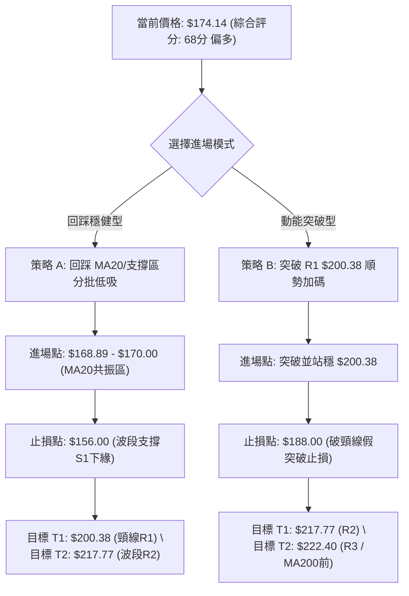

### 🧭 策略路由

> **當前主策略方向 = 偏多操作（依綜合評分 68/100 確立）**
> 綜合評分 $\ge 60$，技術面呈現「雙底成形 + ADX>25 趨勢啟動 + 突破短期均線」，主推**多頭回踩低吸與突破策略**；空方僅列為下破 S1 後之避險警示。

### 🎯 價格情境階梯（Price Scenarios）

| 觸發條件 | 第一目標 | 第二目標 | 後續延伸 (終極) | 情境含義與操作指引 |
|----------|----------|----------|-----------------|--------------------|
| **強勢突破 R1 $200.38** | R2 **$217.77** | R3 **$222.40** | 斐波 61.8% **$243.18** | W底確立，短線轉為強攻主升浪，加碼跟進 |
| **站穩現價 $174.14 區間** | R1 **$200.38** | R2 **$217.77** | — | 於 MA20-MA50 構築次級底部，維持偏多震盪持股 |
| **跌破 S1 $156.00** | S2 **$139.76** | S3 **$135.20** | 跌破探新低 | 中期反彈架構破壞，多單全數停損，轉為防禦觀望 |

### 📊 情境機率分佈

| 情境劇本 | 發生機率 | 主要技術依據 |
|----------|----------|--------------|
| **繼續上行 / 反彈測試 R1-R2** | **60%** | MACD 多頭擴散、ADX 25.53 (+DI 32.60 主導)、OBV 呈現淨流入支撐 |
| **區間窄幅震盪 (MA20-MA120)** | **25%** | 日成交量降至 757K (量比 0.62x)，面臨半年線 $181.16 短線消化浮額 |
| **回落再探底 (測試 S1-S2)** | **15%** | 長期均線 MA200 仍處於下行空頭趨勢，整體宏觀防禦板塊受壓 |

### 🟢 主策略詳情

| 策略要素 | 策略 A（穩健型：回踩 MA20 佈局） | 策略 B（激進型：突破 R1 追擊） |
|----------|-----------------------------------|---------------------------------|
| **進場條件** | 拉回測試 MA20 ($168.89) 出現下影線支撐 | 日K放量實體突破阻力位 R1 ($200.38) |
| **進場價格** | **$168.89**（或現價 $174.14 分批） | **$200.38** |
| **目標價 T1** | **$200.38** (R1, +18.6%) | **$217.77** (R2, +8.7%) |
| **目標價 T2** | **$217.77** (R2, +28.9%) | **$222.40** (R3, +11.0%) |
| **止損價格** | **$156.00** (S1 關鍵支撐, -7.6%) | **$188.00** (前波反彈高點支撐, -6.2%) |
| **風險報酬比** | **1 : 2.45** (以 T1 計算) / **1 : 3.80** (T2) | **1 : 1.40** (T1) / **1 : 1.77** (T2) |
| **成功機率** | **65%** | **55%** |
| **建議倉位** | **15% - 20%** 總資金 | **10%** 總資金 |

### 🔴 反向風險觸發點（對沖提示）

- **多單全面撤退警戒線**：若日K收盤價**跌破 S1 $156.00**，宣告上升旗形破局且 MA50 失守，應立即無條件平倉多單。
- **極端反轉放空點**：若價格反彈至 R3 **$222.40** 與 MA200 **$224.31** 共振重壓區，出現帶長上影線之墓碑線且 RSI > 75 頂背離，可輕倉建立空頭避險部位，止損設於 $230.00，下看 $195.69。

### ⭐ 整體訊號強度評星

```
做多訊號強度：★★★★☆  (4/5星 - 雙底反彈動能充足)
做空訊號強度：★★☆☆☆  (2/5星 - 僅限長線均線壓制)
整體可信度：  ★★★★☆  (4/5星 - 量價與動能高度收斂)
```

---

## 9. 風險提示與監控

### ✅ 關鍵監控指標 Checklist

```
╔══════════════════════════════════════════════════════════════╗
║              交易風控與關鍵指標監控清單 (Checklist)           ║
╠══════════════════════════════════════════════════════════════╣
║ [ ] 價格能否守穩 MA20 ($168.89) 與 MA50 ($162.52) 支撐帶     ║
║ [ ] 成交量是否在回踩時持續低於 1.2M，在突破 $181 時放大至 2M+ ║
║ [ ] MACD 柱狀圖是否維持在 0 軸上方，避免出現高檔死叉         ║
║ [ ] RSI(14) 回落至 50-55 區間能否獲得支撐並重新抬頭          ║
║ [ ] ADX 是否持續維持在 25 以上，且 +DI 保持大於 -DI          ║
║ [ ] 停損單是否已於券商系統嚴格預埋於 $156.00 (S1)            ║
╚══════════════════════════════════════════════════════════════╝
```

### ⚠️ 風險場景分析

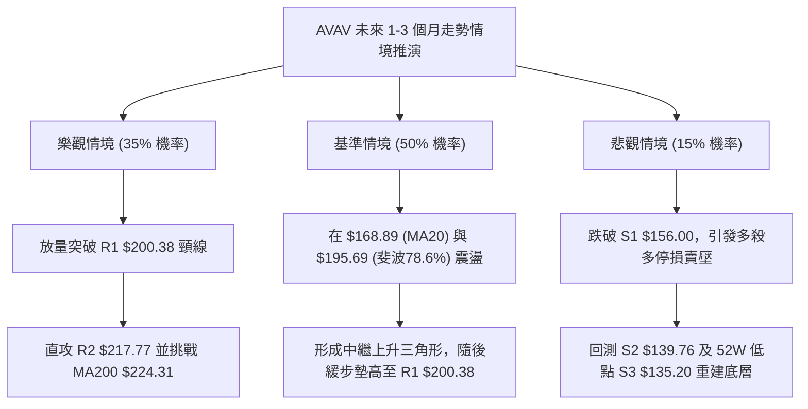

### 🛡️ 風險管理重要提醒

1. **波動率風控（ATR 考量）**：AVAV 的 ATR 高達 **$10.78 (6.19%)**，單日洗盤震幅巨大。嚴禁使用過度槓桿，單筆交易的最大資金虧損風險應嚴格控制在總投資組合的 **1.0% - 1.5%** 以內。
2. **Beta 敞口管理**：鑑於 Beta 值達 **1.412**，若大盤（標普500/那斯達克）出現流動性系統性回調，AVAV 極易出現假突破回殺，操作時需同步觀察大盤指數之技術支撐。
3. **空頭排列均線壓力**：切記長期均線 MA200 (**$224.31**) 仍向下傾斜，本波行情性質定義為「**深度超跌後的中級反彈**」，切忌將短期反彈誤判為長線大牛市而盲目加碼。到達 R2 (**$217.77**) 與 R3 (**$222.40**) 區間必須執行分批獲利了結。

---

## 📋 報告總結

```
╔══════════════════════════════════════════════════════════════════╗
║                    AVAV 技術分析報告總結                         ║
╠══════════════════════════════════════════════════════════════════╣
║ 報告日期：2026-08-18                                            ║
║ 當前價格：$174.14                                                ║
║ 技術評級：🟢 偏多反彈 (綜合評分 68/100)                          ║
╠══════════════════════════════════════════════════════════════════╣
║ 關鍵結論：                                                       ║
║ ├─ 長期趨勢：🔴 空頭修正中 (現價低於 MA200 $224.31 約 22.37%)    ║
║ ├─ 中期趨勢：🟢 雙重底築底成功 (自 $135.20 反彈，MACD 持續看多)   ║
║ ├─ 短期趨勢：🟢 偏多震盪整理 (站穩 MA20 $168.89 與 MA50 $162.52)║
║ ├─ 關鍵支撐：S1: $156.00 ｜ S2: $139.76 ｜ S3: $135.20           ║
║ ├─ 關鍵阻力：R1: $200.38 ｜ R2: $217.77 ｜ R3: $222.40           ║
║ └─ 分析師目標：共識均價 $225.77 (高 $326.00 / 低 $148.57)        ║
╠══════════════════════════════════════════════════════════════════╣
║ 最優策略組合：                                                   ║
║ 1. 🥇 最佳機會：回踩 MA20 ($168.89 - $170) 分批做多，止損設於    ║
║                 S1 $156.00，第一目標看 R1 $200.38 (R/R = 1:2.45) ║
║ 2. 🥈 次選機會：強勢放量實體突破 R1 $200.38 順勢追多，目標看     ║
║                 R2 $217.77 / R3 $222.40                          ║
║ 3. 🥉 保守選擇：等待股價於 $168-$175 區間築出 3-5 日狹幅平台，   ║
║                 待量能放大重返 1.2M 均量時再行跟進               ║
╚══════════════════════════════════════════════════════════════════╝
```

---

> ⚠️ **免責聲明**：本報告為技術分析研究成果，所有數據、圖表及推算均基於歷史市場交易資訊。本報告**僅供學術研究與投資策略參考**，**不構成任何形式的個人化投資建議、買賣要約或獲利保證**。金融市場具有高度風險，資產價格可升亦可跌，投資人應獨立評估自身財務狀況與風險承受能力，並自負投資盈虧責任。

---

*報告生成時間：2026-08-18 ｜ 數據來源：Yahoo Finance ｜ 分析框架：多時框架量化技術分析系統*