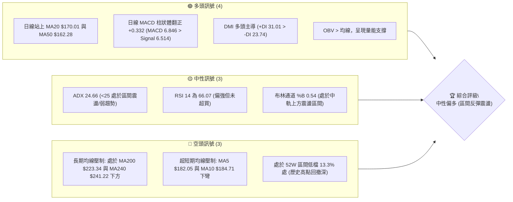
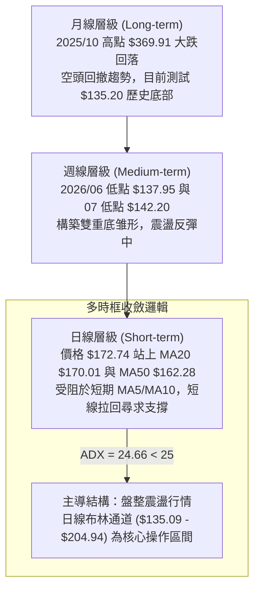
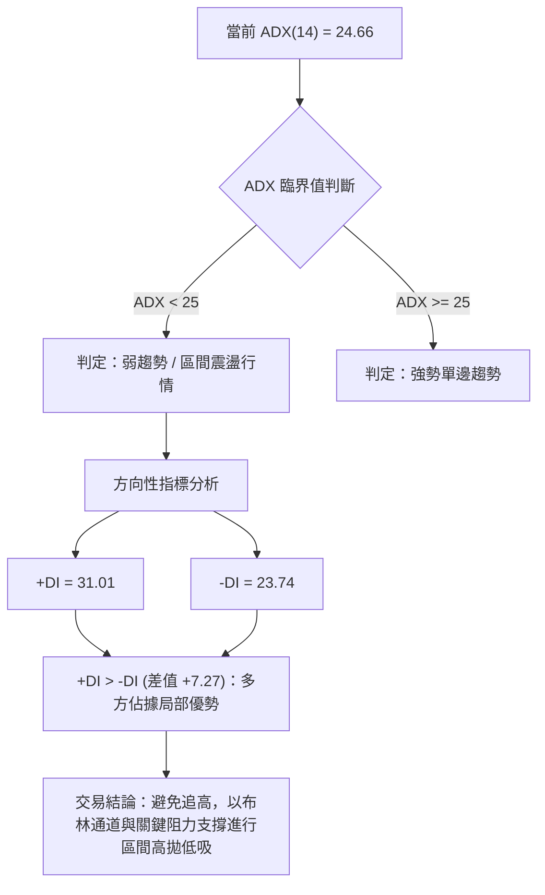
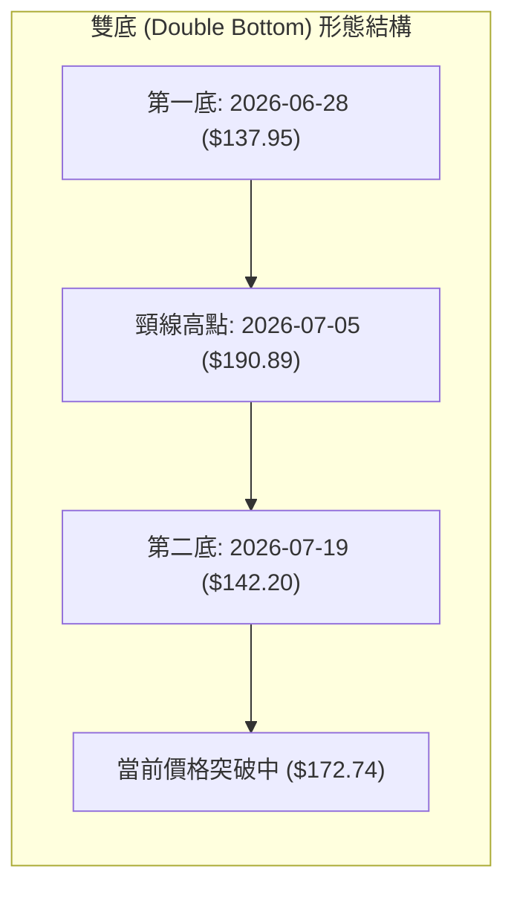
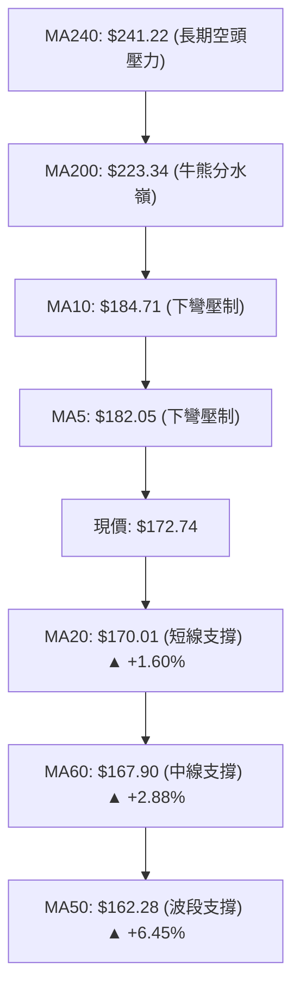
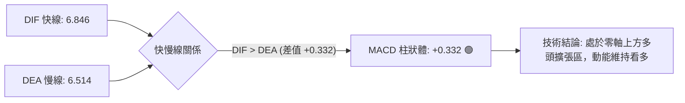
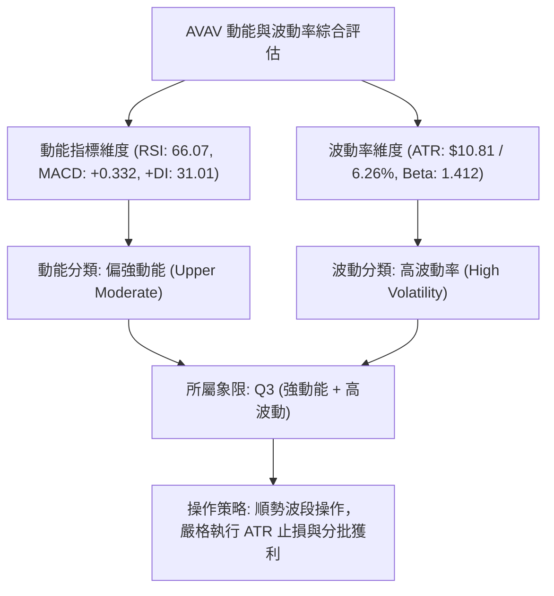
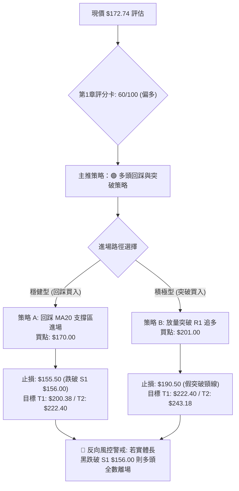
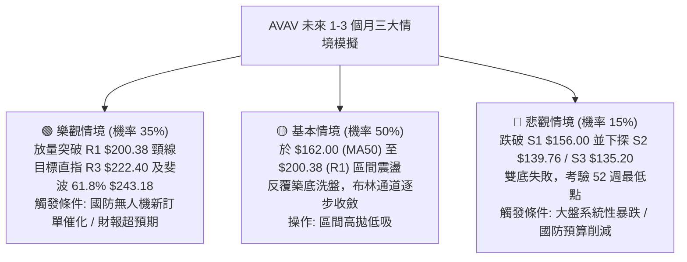

# AVAV 技術分析報告

> **報告日期**：2026-08-19 ｜ **語言**：繁體中文 ｜ **數據來源**：Yahoo Finance ｜ **當前價格**：$172.74

---

## 目錄

| 章節 | 內容 |
|------|------|
| [1. 技術面概覽](#1-技術面概覽) | 訊號儀表板、核心指標、評分卡 |
| [2. 趨勢分析](#2-趨勢分析) | 多時框趨勢、長中短期走勢 |
| [3. 圖表形態分析](#3-圖表形態分析) | 形態識別、K線組合、目標價 |
| [4. 支撐與阻力](#4-支撐與阻力) | 關鍵價位、斐波那契回調 |
| [5. 技術指標深度解讀](#5-技術指標深度解讀) | MA/RSI/MACD/布林/成交量 |
| [6. 動能與波動率](#6-動能與波動率) | 動能評估、ATR、Beta |
| [7. 多時框架總結](#7-多時框架總結) | 時框架評分矩陣 |
| [8. 交易策略建議](#8-交易策略建議) | 多空策略、風險報酬比 |
| [9. 風險提示與監控](#9-風險提示與監控) | 監控指標、風險場景 |

---

## 1. 技術面概覽

### 🎯 技術訊號儀表板



### 📊 核心指標速覽表

| 指標類別 | 指標名稱 | 當前數值 | 訊號 | 解讀 |
|----------|----------|----------|------|------|
| **價格** | 當前價格 | $172.74 | 🟡 中性 | 位於 52W 區間 ($135.20 - $417.86) 的 13.3% 分位，處於底部反彈修復期 |
| **均線** | MA20 | $170.01 | 🟢 看多 | 現價位於 MA20 上方 (+1.60%)，短期生命線轉為支撐 |
| **均線** | MA50 | $162.28 | 🟢 看多 | 現價位於 MA50 上方 (+6.45%)，中期築底初具成效 |
| **均線** | MA200 | $223.34 | 🔴 看空 | 現價遠低於 MA200 (-22.65%)，長期空頭排列壓力仍重 |
| **動能** | RSI(14) | 66.07 | 🟡 中性偏多 | 處於 50-70 強勢擴張區間，無頂背離現象，動能平穩 |
| **動能** | MACD | 6.846 (柱: +0.332) | 🟢 看多 | 快線高於慢線 (6.514)，柱狀體維持正值，多頭掌控短線動能 |
| **趨勢** | ADX(14) | 24.66 | 🟡 弱趨勢 | ADX < 25 表明處於箱體整理行情，+DI (31.01) > -DI (23.74) 偏多 |
| **波動** | ATR(14) | $10.81 | 🔴 高波動 | 佔股價 6.26%，單日波動幅度較大，需設置寬幅止損 |
| **量能** | OBV | OBV > MA | 🟢 看多 | 能量潮指標高於均線，資金流入支撐價格回升 |

### 🏆 技術評分卡

```
╔══════════════════════════════════════════════════════════════════╗
║                   技術評分卡 — AVAV (2026-08-19)                 ║
╠══════════════════════════════════════════════════════════════════╣
║ 趨勢強度 (ADX/DMI)  ██████████░░░░░░░░░░  52/100  🟡 弱勢震盪    ║
║ 動能指標 (RSI/MACD) ██████████████░░░░░░  70/100  🟢 動能偏多    ║
║ 支撐穩定度 (S1-S3)  ██████████████░░░░░░  72/100  🟢 底部支撐紮實 ║
║ 成交量配合 (OBV/VOL)████████████░░░░░░░░  60/100  🟢 能量潮支撐  ║
║ 形態完整度 (雙底型) ████████████░░░░░░░░  58/100  🟡 構築反彈中  ║
║ 均線排列 (多空結構) ██████████░░░░░░░░░░  48/100  🟡 混亂需修復  ║
╠══════════════════════════════════════════════════════════════════╣
║ 綜合評分            ████████████░░░░░░░░  60/100  🟢 中性偏多    ║
╚══════════════════════════════════════════════════════════════════╝
```

---

## 2. 趨勢分析

### 🌐 多時框趨勢分析



### 📈 長期趨勢 — 12個月走勢圖（Unicode）

```
AVAV 月線收盤走勢圖（2025-08 至 2026-08）
價格軸 ($)
$370 ┤                                  ● 2025-10 ($369.91)
$340 ┤
$310 ┤                          ● 2025-09 ($314.89)
$280 ┤                                      ● 2025-11 ($279.46)   ● 2026-01 ($278.39)
$250 ┤          ● 2025-08 ($241.35)             ● 2025-12 ($241.89)   ● 2026-02 ($252.25)
$220 ┤                                                                      ● 2026-05 ($207.24)
$190 ┤                                                                ● 2026-04 ($195.02)
$160 ┤                                                          ● 2026-03 ($183.05)   ● 2026-06 ($165.07)  ● 現價 $172.74
$130 ┤                                                                                      ● 2026-07 ($149.37)
     └─────────────────────────────────────────────────────────────────────────────────────────────►
      月份:  2025-08  2025-09  2025-10  2025-11  2025-12  2026-01  2026-02  2026-03  2026-04  2026-05  2026-06  2026-07  2026-08
```

#### 走勢特徵分析表格

| 階段 | 時間區間 | 起始/結束價 | 漲跌幅 | 趨勢特徵與量價解讀 |
|------|----------|-------------|--------|--------------------|
| **巔峰衝頂** | 2025-08 ~ 2025-10 | $241.35 → $369.91 | +53.27% | 爆發性主升段，創下波段收盤歷史高點 $369.91，多頭動能極致釋放。 |
| **高檔崩落** | 2025-11 ~ 2026-03 | $279.46 → $183.05 | -34.50% | 頂部破位，失守 $250 關卡，均線開始糾結並轉為空頭排列。 |
| **反彈受阻** | 2026-04 ~ 2026-05 | $195.02 → $207.24 | +6.27% | 弱勢反抽至 $207.24，未能有效挑戰 MA200 均線，多頭乏力。 |
| **深幅下探** | 2026-06 ~ 2026-07 | $165.07 → $149.37 | -9.51% | 殺出 52 週最低點 $135.20（收盤 $149.37），爆量換手完成初步落底。 |
| **底部反彈** | 2026-08 (至今) | $149.37 → $172.74 | +15.65% | 站回 MA20 及 MA50，MACD 翻紅，展現底部反彈行情。 |

### 📊 中期趨勢（週線分析）

```
中期週線阻力與支撐結構示意圖
─────────────────────────────────────────────────────────────────
[強阻力區]  R2 $217.77 / R3 $222.40 (MA200 壓力聚類區 $223.34)
                    ▲
[關鍵頸線]  R1 $200.38 (2026-05-31 週線高點 $207.24 聚類阻力)
                    ▲
[當前價格]  $172.74 (於 MA20 $170.01 與 MA50 $162.28 上方運作)
                    ▼
[波段支撐]  S1 $156.00 (多空轉換樞紐)
                    ▼
[築底低點]  S2 $139.76 / S3 $135.20 (52W 最低點，雙底支撐帶)
─────────────────────────────────────────────────────────────────
```

### ⚡ 趨勢強度評估（ADX 解讀）



#### ADX 強度對照表

| 指標變量 | 數值 | 狀態區間 | 技術意義 |
|----------|------|----------|----------|
| **ADX(14)** | 24.66 | 20–25 (弱趨勢/轉換期) | 價格脫離單邊暴跌階段，進入大箱體底部震盪築底結構。 |
| **+DI** | 31.01 | > 30 (強勢多頭動能) | 短線多頭買盤意願增強，主導近期反彈波段。 |
| **-DI** | 23.74 | 20–25 (空頭動能衰退) | 空方打壓力道顯著弱於 6-7 月份。 |

---

## 3. 圖表形態分析

### 🔍 形態識別系統



#### 形態信心度與參數評估表

| 形態名稱 | 信心度 | 判斷依據（引用實際數據） | 完成度 | 目標價（附嚴謹計算式） |
|----------|--------|--------------------------|--------|------------------------|
| **雙重底 (W底)** | 68% | 2026-06-28 低點 $137.95 與 2026-07-19 低點 $142.20 構成雙底，守住 52W 低點 $135.20；中間頸線為 2026-07-05 收盤價 $190.89。 | 75% | 形態高度 = $190.89 - $137.95 = $52.94。<br>量測目標價 = 頸線 $190.89 + 高度 $52.94 = **$243.83**（逼近斐波那契 61.8% $243.18 與 MA240 $241.22）。 |
| **布林通道中軌突破** | 80% | 價格 $172.74 實質站上布林中軌 (MA20) $170.01，%B 達到 0.54。 | 100% | 通道理論目標 = BB上軌 **$204.94**。 |

### 🕯️ 重要K線形態分析

| 週/月份 | 收盤價 | K線形態特徵 | 量價與心理層面解讀 | 訊號 |
|---------|--------|-------------|--------------------|------|
| **2026-06-28** | $137.95 | 破位長黑貫穿K線 | 週成交量爆出 1,188.7 萬股，RSI 跌至 20.2 極度超賣，恐慌盤全面湧出。 | 🔴 恐慌拋售 |
| **2026-07-05** | $190.89 | 巨量吞噬大陽線 | 週成交量放大至 1,831.7 萬股（20週天量），長陽包覆前陰，主力資金強力進場抄底。 | 🟢 強烈買進 |
| **2026-07-19** | $142.20 | 縮量二次探底星線 | 週成交量萎縮至 708.7 萬股，低點不破 $135.20，形成縮量回踩確認底。 | 🟢 築底確認 |
| **2026-08-09** | $186.73 | 實體大陽線放量突破 | RSI 飆升至 73.7，MACD 柱狀體翻正至 +4.396，確立波段反彈動能。 | 🟢 多頭表態 |
| **2026-08-23** | $172.74 | 上影回調陰線 (當前) | 受阻於阻力區 R1 $200.38 前緣，縮量回調至 MA20 $170.01 尋求支撐。 | 🟡 正常回踩 |

### 📉 ASCII 走勢形態示意圖

```
AVAV 雙底構築與回踩示意圖
價格 ($)
$200.38 ┤                     [頸線聚類阻力 R1] 
$190.89 ┤        ●(頸線頂部 07-05)            ●(反彈高點 08-16 $192.81)
$180.00 ┤       / \                          / \
$172.74 ┤      /   \                        /   ●◄─── [現價 $172.74 測試 MA20 支撐]
$160.00 ┤     /     \                      /
$150.00 ┤    /       \                    ●(次低點 07-19 $142.20)
$137.95 ┤   ●(初底 06-28)
$135.20 ┴───┴─────────────────────────────┴─────────────────────────► 時間
            【第 1 底】                   【第 2 底】
```

### 🎯 形態目標價計算

```
╔══════════════════════════════════════════════════════════════════╗
║                     形態目標價量化計算推演                       ║
╠══════════════════════════════════════════════════════════════════╣
║ 基礎數據：                                                       ║
║ ├─ 形態底部基準 (L_base) = $137.95 (2026-06-28 確立)              ║
║ ├─ 形態頸線基準 (Neckline)= $190.89 (2026-07-05 確立)              ║
║ └─ 垂直形態高度 (Height)  = $190.89 - $137.95 = $52.94           ║
║                                                                  ║
║ 目標價推導：                                                     ║
║ ├─ 第一步 (布林軌道滿足點) = 布林上軌 = $204.94                   ║
║ ├─ 第二步 (頸線完全突破點) = 突破 R1 $200.38                      ║
║ └─ 第三步 (形態等距量測點) = $190.89 + $52.94 = $243.83           ║
║    (精確對應斐波那契 61.8% 回調位 $243.18 與 MA240 $241.22 阻力區) ║
╚══════════════════════════════════════════════════════════════════╝
```

---

## 4. 支撐與阻力

### 🗺️ 關鍵價位分布圖（Unicode）

```
AVAV 價位結構分布圖 (OHLCV 計算與斐波那契疊加)
══════════════════════════════════════════════════════════════════
$243.18 ║██████████████████████████████║ 斐波那契 61.8% / MA240 ($241.22)
$222.40 ║██████████████████████████    ║ 強阻力 R3 / MA200 ($223.34)
$217.77 ║██████████████████████        ║ 波段阻力 R2
$204.94 ║██████████████████            ║ 布林通道上軌
$200.38 ║██████████████████████████████║ 關鍵阻力 R1 (波段高點聚類)
$195.69 ║████████████████              ║ 斐波那契 78.6% 回調位
$172.74 ╠══════════════════════════════╣ ◄ 現價 ($172.74)
$170.01 ║▓▓▓▓▓▓▓▓▓▓▓▓▓▓▓▓▓▓▓▓▓▓▓▓▓▓▓▓▓▓║ 動態支撐: MA20 / 布林中軌
$162.28 ║▓▓▓▓▓▓▓▓▓▓▓▓▓▓▓▓▓▓▓▓▓▓        ║ 動態支撐: MA50
$156.00 ║██████████████████████████████║ 近期關鍵支撐 S1 (多空防線)
$139.76 ║████████████████████████      ║ 波段支撐 S2 (雙底低點聚類)
$135.20 ║██████████████████████████████║ 52W 歷史底部 S3 / 斐波那契 100%
══════════════════════════════════════════════════════════════════
```

### 🚧 阻力位分析表

| 阻力級別 | 價位 | 形成原因（OHLCV 數據） | 突破難度 | 重要性 |
|----------|------|------------------------|----------|--------|
| **R1** | **$200.38** | 近一年波段高點聚類位，整數心理大關，接近 2026-05 收盤高點 ($207.24)。 | 🟡 中等 | ★★★★☆<br>短線多空分水嶺，突破將打開上升空間。 |
| **R2** | **$217.77** | 波段反彈密集套牢區高點，獲利回吐盤聚集群。 | 🔴 較難 | ★★★☆☆<br>中期波段目標位。 |
| **R3** | **$222.40** | 近一年波段強阻力聚類，緊鄰 MA200 ($223.34)，牛熊分界線。 | 🔴 極高 | ★★★★★<br>長期空頭防線，需超級量能方可越過。 |

### 🛡️ 支撐位分析表

| 支撐級別 | 價位 | 形成原因（OHLCV 數據） | 守住機率 | 重要性 |
|----------|------|------------------------|----------|--------|
| **S1** | **$156.00** | 近一年波段低點聚類位，2026-05-17 週線低點 ($158.00) 支撐帶，MA50 ($162.28) 下方防禦層。 | 🟢 75% | ★★★★☆<br>短線回調極限位，守住維持偏多震盪。 |
| **S2** | **$139.76** | 近一年波段低點聚類，雙底形態頸線低點結構 ($137.95-$142.20)。 | 🟢 85% | ★★★★★<br>中期底部護城河，跌破則雙底宣告失敗。 |
| **S3** | **$135.20** | 52 週最低點 (52W Low)，斐波那契 100.0% 終極支撐。 | 🟢 95% | ★★★★★<br>長期生命線底線，不可跌破之絕對底。 |

### 📐 斐波那契回調位分析

依據 52 週波動區間（高點 **$417.86** → 低點 **$135.20**，總跨度 $282.66）計算之精確回調位：

```
╔══════════════════════════════════════════════════════════════════╗
║                斐波那契回調位與現價位置解讀                      ║
╠══════════════════════════════════════════════════════════════════╣
║ 0.0%  (52W High)   $417.86                                       ║
║ 23.6%              $351.15                                       ║
║ 38.2%              $309.88                                       ║
║ 50.0%              $276.53                                       ║
║ 61.8%              $243.18 ── 雙底形態理論目標區 ($243.83)       ║
║ 78.6%              $195.69 ── 上方第一重要斐波那契壓制層         ║
║ ─────────────────── $172.74 (現價落於 78.6% 與 100.0% 之間) ─────║
║ 100.0% (52W Low)   $135.20 ── 歷史絕對底部支撐                   ║
╚══════════════════════════════════════════════════════════════════╝
```

**解讀**：現價 $172.74 處於 78.6% ($195.69) 與 100.0% ($135.20) 之間的深幅回撤修復帶。此區間為歷史籌碼沉澱區，上方 $195.69-$200.38 為密集成交壓力帶，一旦有效放量突破 78.6% 回調位 ($195.69)，下一站將直指 61.8% 黃金分割位 $243.18。

---

## 5. 技術指標深度解讀

### 🎛️ 指標訊號總覽

```mermaid
graph TD
    PRICE["現價: $172.74"] --> MA{"均線系統"}
    PRICE --> OSC{"震盪動能"}
    PRICE --> VOL{"量能指標"}
    
    MA -->|"高於 MA20 $170.01 & MA50 $162.28"| MA_BULL["🟢 中短期均線偏多"]
    MA -->|"低於 MA200 $223.34"| MA_BEAR["🔴 長期均線偏空"]
    
    OSC -->|"RSI("14") = 66.07"| RSI_SIG["🟡 強勢中性 (無背離)"]
    OSC -->|"MACD 柱 = +0.332"| MACD_SIG["🟢 多頭維持掌控"]
    OSC -->|"Stoch %K 46.04 < %D 52.15"| STOCH_SIG["🟡 短線死叉拉回"]
    
    VOL -->|"OBV > 均線"| OBV_SIG["🟢 能量潮支撐"]
    VOL -->|"量比 0.85x"| VOL_SIG["🟡 短線量能微幅萎縮"]
```

### 📈 移動平均線排列分析



#### 均線矩陣詳細狀態表

| 均線名稱 | 數值 | 現價差距 (%) | 走勢方向 | 排列狀態與技術解讀 |
|----------|------|--------------|----------|--------------------|
| **MA5** | $182.05 | -5.11% | ▼ 下彎 | 超短期受阻，價格自 $192.81 高點拉回跌破 MA5。 |
| **MA10** | $184.71 | -6.48% | ▼ 下彎 | 短期均線壓制，需等待日線重新收復 $185。 |
| **MA20** | $170.01 | +1.60% | ▲ 走平上揚 | 短期多頭生命線，提供即時回踩動態支撐。 |
| **MA50** | $162.28 | +6.45% | ▲ 上揚 | 中期底部支撐確立，MA20/MA50 構成下方雙重保護。 |
| **MA60** | $167.90 | +2.88% | ▲ 上揚 | 季線轉為平緩向上，中期多頭逐步收復失地。 |
| **MA120** | $180.44 | -4.27% | ▼ 下彎 | 半年線壓制，與 MA5/MA10 形成 $180-$185 短期阻力密集區。 |
| **MA200** | $223.34 | -22.65% | ▼ 下行 | 長期熊市壓制線，長期趨勢逆轉之關鍵考驗。 |
| **MA240** | $241.22 | -28.39% | ▼ 下行 | 年線壓制，與斐波那契 61.8% ($243.18) 形成重疊壓力帶。 |

### 📉 RSI(14) 分析

```
RSI(14) 當前數值進度條:
0 ──────────── 30 ────────────────────── 50 ────────────── 66.07 ──── 70 ────────── 100
[  極度超賣區  ] [       弱勢區間       ] [    中性強勢    █████████░░ ] [  超買過熱區  ]
```

- **當前數值**：**66.07**（處於中性偏多強勢區間 50–70）。
- **超買超賣評估**：未進入 >70 極度超買區，尚有進一步上行空間。
- **背離分析判斷**：
  - 價格自 2026-07 低點 $137.95 回升至現價 $172.74，RSI 同步自 20.2 谷底回升至 66.07。
  - 近三週高點 ($186.73 / RSI 73.7 → $192.81 / RSI 73.5 → $172.74 / RSI 66.1)，指標隨價格同步回落。
  - **明確結論：當前 RSI 無明顯頂背離，亦無底背離，指標表現與價格運動高度一致，反映正常的反彈與良性拉回。**

### 📊 MACD(12/26/9) 訊號解讀



- **MACD 快線**：6.846
- **訊號線 (Signal)**：6.514
- **MACD 柱狀圖 (Histogram)**：**+0.332**
- **動能解讀**：MACD 線持續維持在信號線上方，柱狀體維持正值。雖然柱狀體由前期的 +4.300 縮小至 +0.332，顯示超買動能有所趨緩，但多頭架構未遭破壞。
- **背離判斷**：日線與週線 MACD 均自零軸下方翻揚，無頂背離現象。

### 📦 布林通道分析

```
AVAV 日線布林通道結構示意圖
─────────────────────────────────────────────────────────────────
$204.94 ┬────────────────────────────────────────── 上軌 (BB Upper)
        │
$185.00 ┤                   ● 前高拉回 ($192.81)
$172.74 ┤             ● 現價 ($172.74, %B = 0.54)
$170.01 ┼───────────────────▲────────────────────── 中軌 (BB Middle / MA20)
        │                   └─ 獲得中軌即時支撐
$150.00 ┤
$135.09 ┴────────────────────────────────────────── 下軌 (BB Lower)
─────────────────────────────────────────────────────────────────
```

- **布林帶寬度**：上軌 $204.94 - 下軌 $135.09 = $69.85（帶寬相對擴張）。
- **%B 指標**：**0.54**（大於 0.50，處於中軌與上軌之間的多方通道）。
- **走勢意涵**：價格自上軌附近回落至中軌 $170.01 獲得支撐。在 ADX < 25 的盤整震盪市場中，布林中軌為極佳低吸點，上軌 $204.94 則為短線第一獲利了結目標。

### 💹 成交量分析（量價配合度）

```
成交量與均量對比 (單位: 股)
最新成交量:   1,001,091  [████████░░░░] (量比: 0.85x)
20日均量:     1,176,940  [██████████░░]
50日均量:     1,684,544  [██████████████]
```

- **量價健康度**：
  - 最新單日成交量為 1,001,091 股，相對 20 日均量 (1,176,940) 量比為 **0.85x**，呈現「**回調縮量**」的健康整理格局。
  - 回顧 2026-07-05 底部爆出 1,831.7 萬週成交天量，表明大資金已在 $140-$150 帶完成巨量換手。
- **OBV (能量潮指標)**：
  - **狀態：OBV > MA**。
  - **技術意義**：OBV 維持在均線上方昂頭向上，確認資金呈淨流入態勢，量能充分支撐價格上漲。無「價漲量縮」或「量增價跌」之嚴重量價背離問題。

---

## 6. 動能與波動率

### ⚡ 動能評估四象限



#### 動能評估四象限對照表

| 象限 | 動能強度 | 波動率水準 | 當前狀態 | 交易環境評估與應對 |
|------|----------|------------|----------|--------------------|
| **Q1** | 強動能 | 低波動 | — | 穩定單邊牛皮走勢，適合穩健加碼。 |
| **Q2** | 弱動能 | 低波動 | — | 沉悶牛皮盤整，資金效率低。 |
| **Q3** | **強動能** | **高波動** | **✓ (AVAV 目前所屬)** | **爆發性波段行情，短線收益率高但洗盤劇烈，必須嚴控部位與止損。** |
| **Q4** | 弱動能 | 高波動 | — | 無序暴跌或恐慌震盪，應全面空倉觀望。 |

### 📊 ATR 波動率分析

```
ATR(14) 波動率與風控距離參數
══════════════════════════════════════════════════════════════════
當前 ATR(14) 數值:         $10.81
ATR 佔股價百分比:          6.26%  (高波動特性)
1.0x ATR 短線止損安全距離: $10.81 (對應價格 $161.93)
1.5x ATR 波段止損安全距離: $16.22 (對應價格 $156.52，精確契合 S1 $156.00)
2.0x ATR 寬幅止損安全距離: $21.62 (對應價格 $151.12)
══════════════════════════════════════════════════════════════════
```

- **解讀**：AVAV 每日平均波動達 $10.81，在建倉時止損位不可過窄（建議至少給予 1.5x ATR 即約 $16 緩衝空間），以防在正常的日內高波動中被雜訊掃出場。

### 📐 Beta 與市場相關性

- **Beta 係數**：**1.412**
- **市場屬性解讀**：
  - AVAV 屬於典型**高彈性成長/國防科技股**，波動幅度為標普 500 指數的 1.412 倍。
  - 當大盤走強時，AVAV 具備顯著超額 Alpha 潛力；反之當大盤回調時，其下行波動亦較為劇烈。
  - 機構持股比例高達 **88.1%**，且放空比率 (Short % Float) 為 **11.3%**（空頭回補天數 2.18 天），具備中等程度的潛在軋空 (Short Squeeze) 爆發力。

---

## 7. 多時框架總結

### 📋 時框架評分表

| 時框架 | 趨勢方向 | 動能狀態 | 均線排列 | 形態結構 | 綜合評分 | 操作建議 |
|--------|----------|----------|----------|----------|----------|----------|
| **月線 (長期)** | 🔴 空頭修復 | 🟡 中性 (RSI 45) | 空頭排列 (位於 MA200 下) | 大跌後於 $135.20 尋底 | 38/100 | 長期投資者僅宜少量分批定投，不可重押。 |
| **週線 (中期)** | 🟢 築底反彈 | 🟢 偏多 (MACD 翻紅) | 混合排列 (站上 MA20) | 雙重底 (W底) 構築完成 75% | 68/100 | 波段交易者回踩頸線或均線逢低做多。 |
| **日線 (短期)** | 🟢 偏多震盪 | 🟢 強勢 (RSI 66.07) | 短期多頭 (MA20/50 交叉) | 布林中軌支撐確認，受阻前高 | 65/100 | 區間操作，拉回 $170 附近低吸，短打目標 $200。 |

### 🔲 綜合訊號矩陣

```
時框架訊號矩陣收斂圖
─────────────────────────────────────────────────────────────────
維度          短期 (日線)          中期 (週線)          長期 (月線)
─────────────────────────────────────────────────────────────────
趨勢訊號      🟢 偏多 (+DI> -DI)   🟢 偏多 (雙底成形)   🔴 空頭 (MA200下)
動能訊號      🟢 看多 (MACD>0)     🟢 看多 (柱狀轉正)   🟡 中性 (超賣回升)
均線支撐      🟢 站穩 MA20/50      🟡 測試週 MA20       🔴 遠離 MA240
量能確認      🟢 OBV > MA          🟢 週巨量換手底      🟡 長期量能平平
─────────────────────────────────────────────────────────────────
收斂權重      40% (時機點)         40% (方向主導)       20% (空間天花板)
─────────────────────────────────────────────────────────────────
```

### ⚖️ 多時框收斂結論

依據多時框收斂規則（嚴格要求 14）：
1. **行情性質判定**：當前 ADX(14) 為 **24.66 (< 25)**，嚴格定義為**「震盪/盤整行情」**，而非單邊趨勢行情。
2. **主導時框與空間**：以**日線布林通道 ($135.09 - $204.94)** 與 **週線雙底震盪區間 ($135.20 - $200.38)** 為主要交易核心。
3. **唯一方向性結論**：**【中性偏多（區間震盪反彈）】**。
   - 長期月線雖受制於 MA200 ($223.34)，但週線與日線已在 $135-$140 構築堅實雙底，且日線站穩 MA20 ($170.01) 與 MA50 ($162.28)。
   - 因此，日線的拉回為逢低做多的買點，而非做空起點。上方第一波段阻力鎖定 R1 **$200.38** 與布林上軌 **$204.94**。

---

## 8. 交易策略建議

### 🗺️ 策略決策流程圖



### 🧭 策略路由

**當前主策略方向 = 【主推多頭震盪逢低做多策略】（依評分卡 60/100 判定）**

由於綜合評分達 60 分（偏多），且價格守穩布林中軌 MA20，策略全面聚焦多頭佈局；空方僅設為破位對沖風控提示。

### 🎯 價格情境階梯（Price Scenarios）

| 觸發條件 | 第一目標 | 第二延伸目標 | 情境含義與技術應對 |
|----------|----------|--------------|--------------------|
| **放量突破 R1 $200.38** | R2 **$217.77** | R3 **$222.40** / 斐波 61.8% **$243.18** | **短線轉強主升段**：雙底頸線徹底破位向上，挑戰 MA200 壓力區。 |
| **守住 MA20 現價區間 ($170.00-$172.74)** | 布林上軌 **$204.94** | R1 **$200.38** | **良性震盪盤升**：沿布林通道中上軌震盪推升，適合區間持股。 |
| **失守 S1 $156.00** | S2 **$139.76** | S3 **$135.20** | **築底失敗轉弱**：反彈動能衰竭，回測前低雙底支撐帶，需強制停損。 |

### 📊 情境機率分佈

| 情境劇本 | 機率預估 | 主要依據與指標支撐 |
|----------|----------|--------------------|
| **情境一：震盪上行挑戰 R1/R2** | **55%** | 日線站穩 MA20/MA50，MACD 柱維持正值 (+0.332)，OBV 能量潮持續高於均線，+DI (31.01) 主導動能。 |
| **情境二：箱體窄幅震盪 ($162-$185)** | **30%** | ADX 數值 24.66 (< 25)，短期受制於下彎之 MA5 ($182.05) 與 MA10 ($184.71)，需時間消化籌碼。 |
| **情境三：深度跌破 S1 再探底** | **15%** | 52 週低點 $135.20 曾經受 1,831 萬週巨量支撐，跌破機率偏低，除非遭遇重大系統性風險。 |

### 🟢 主策略詳情

```
╔══════════════════════════════════════════════════════════════════╗
║                     AVAV 具體交易執行策略表                      ║
╠══════════════════════════════════════════════════════════════════╣
║ 策略要素         策略 A：穩健低吸策略        策略 B：動能突破策略  ║
╠══════════════════════════════════════════════════════════════════╣
║ 策略屬性         回踩布林中軌/MA20           放量突破頸線聚類 R1   ║
║ 進場條件         回踩 $170.00 獲得支撐       日K實體收盤突破 $200.38║
║ 精確進場價       $170.00                    $201.00              ║
║ 目標價 T1        $200.38 (R1 關鍵阻力)       $222.40 (R3 / MA200) ║
║ 目標價 T2        $222.40 (R3 強阻力區)       $243.18 (斐波那契61.8%)║
║ 嚴格止損價       $155.50 (跌破 S1 $156.00)  $190.50 (跌回頸線下方)║
║ 風險空間 ($)     $14.50                     $10.50               ║
║ 獲利空間 T1 ($)  $30.38                     $21.40               ║
║ 獲利空間 T2 ($)  $52.40                     $42.18               ║
║ 風險報酬比 (T1)  1 : 2.10                   1 : 2.04             ║
║ 風險報酬比 (T2)  1 : 3.61                   1 : 4.02             ║
║ 預估成功勝率     65%                        55%                  ║
║ 建議配置倉位     10% - 15%                  8% - 10%             ║
╚══════════════════════════════════════════════════════════════════╝
```

### 🔴 反向風險觸發點（對沖提示）

若出現以下極端技術訊號，代表多頭策略失效，需無條件執行空頭對沖或清倉觀望：
1. **關鍵支撐失守**：日K收盤價跌破 **S1 $156.00**，意味著跌破 MA50 ($162.28) 且創波段新低。
2. **動能全面轉空**：MACD 柱狀體翻負且 DIF 線向下穿過零軸，同時 RSI 跌破 40。
3. **對沖操作建議**：若跌破 $156.00，應立即止損多單，可少量買入看跌期權 (Put) 或逢高於反抽 $156-$160 處建立空頭對沖倉位，目標下看 S2 **$139.76** 及 S3 **$135.20**。

### ⭐ 整體訊號強度評星

```
做多訊號強度：★★★★☆  (4/5星) ── 底部支撐紮實，動能修復良好
做空訊號強度：★★☆☆☆  (2/5星) ── 僅剩長期均線壓制，下行空間受限
整體可信度：  ★★★★☆  (4/5星) ── 量價與雙底形態相互確認
```

---

## 9. 風險提示與監控

### ✅ 關鍵監控指標 Checklist

```
╔══════════════════════════════════════════════════════════════════╗
║                   每日交易風控監控清單 (Checklist)               ║
╠══════════════════════════════════════════════════════════════════╣
║ [ ] 1. MA20 ($170.01) 防守：收盤價是否連續 2 日維持其上方？       ║
║ [ ] 2. MA50 ($162.28) 趨勢：中期均線是否維持昂頭向上發散？       ║
║ [ ] 3. 成交量配合度：反彈時單日成交量是否放大至 120 萬股以上？    ║
║ [ ] 4. MACD 柱狀體狀態：柱狀體是否維持在 0 軸上方 (> 0)？        ║
║ [ ] 5. RSI(14) 區間監控：是否維持在 50-70 強勢區間，有無背離？    ║
║ [ ] 6. 阻力位 R1 ($200.38) 攻防：接近時是否有長上影線滯漲訊號？   ║
║ [ ] 7. S1 ($156.00) 風控防線：盤中若觸及是否立即啟動減倉應變？   ║
╚══════════════════════════════════════════════════════════════════╝
```

### ⚠️ 風險場景分析



### 🛡️ 風險管理重要提醒

1. **ATR 波動風險控管**：
   - AVAV ATR 達 **$10.81 (6.26%)**，單日振幅劇烈。單筆交易承擔之風險金額切勿超過總投資帳戶淨值的 **1.5% - 2.0%**。
   - 倉位計算公式：`最大允許股數 = (帳戶總資金 × 2%) ÷ (進場價 $170.00 - 止損價 $155.50)`。
2. **Beta 與大盤聯動風險**：
   - Beta 值高達 **1.412**，大盤弱勢時切忌盲目左側重倉抄底，必須等待大盤指數（如 SPX / QQQ）同步企穩。
3. **空頭回補與突破陷阱**：
   - 空頭比例佔浮動股 **11.3%**，在突破 R1 **$200.38** 時可能伴隨急促軋空，但若量能未能持續放大（需 > 150 萬股/日），需提防「假突破、真誘多」之拉回走勢。

---

## 📋 報告總結

```
╔══════════════════════════════════════════════════════════════════╗
║                     AVAV 技術分析報告總結                        ║
╠══════════════════════════════════════════════════════════════════╣
║ 報告日期：2026-08-19                                             ║
║ 當前價格：$172.74                                                ║
║ 分析評級：🟢 中性偏多 (Neutral Bullish) — 底部震盪反彈修復期       ║
║                                                                  ║
║ 關鍵結論：                                                       ║
║ ├─ 長期趨勢：🔴 處於 MA200 ($223.34) 下方，大級別熊市修復期        ║
║ ├─ 中期趨勢：🟢 雙重底 (W底) 構築完畢，週線 MACD 翻紅，震盪盤升    ║
║ ├─ 短期趨勢：🟢 站穩 MA20 ($170.01) 與 MA50 ($162.28)，回調縮量    ║
║ ├─ 關鍵支撐：S1 $156.00 ｜ S2 $139.76 ｜ S3 $135.20 (52W Low)    ║
║ ├─ 關鍵阻力：R1 $200.38 ｜ R2 $217.77 ｜ R3 $222.40 (MA200)       ║
║ └─ 分析師共識目標：$225.77 (19 位分析師綜合評級: Buy)              ║
║                                                                  ║
║ 最優策略組合：                                                   ║
║ 1. 🥇 最佳機會 (穩健低吸)：回踩 MA20 價位 $170.00 進場，         ║
║    止損設於 $155.50 (S1下方)，目標 T1 $200.38 / T2 $222.40，      ║
║    風報酬比達 1 : 3.61。                                         ║
║ 2. 🥈 次選機會 (動能追買)：放量實體突破 R1 $200.38 時追買，       ║
║    止損設於 $190.50，目標直指 $222.40 及斐波 61.8% $243.18。     ║
║ 3. 🥉 保守選擇：空倉等待日線布林通道進一步收斂，並站穩 $185 後再行║
║    順勢進場。                                                    ║
╚══════════════════════════════════════════════════════════════════╝
```

---

> ⚠️ **免責聲明**：本報告為 AI 自動生成之技術分析，所有數據及估算均基於提供的歷史價格資訊。本報告**僅供研究與學術參考**，**不構成任何投資建議**。投資有風險，入市需謹慎。

---

*報告生成時間：2026-08-19 ｜ 數據來源：Yahoo Finance ｜ 分析框架：多時框技術分析*