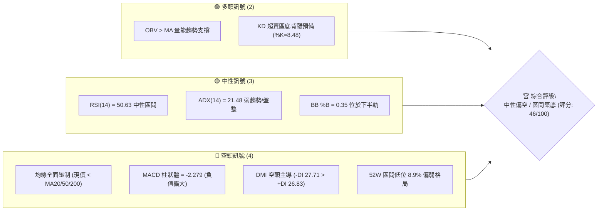
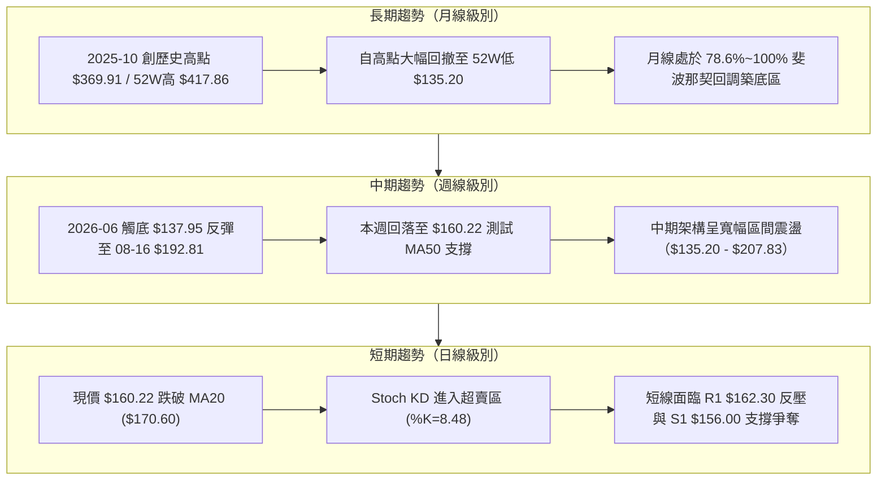
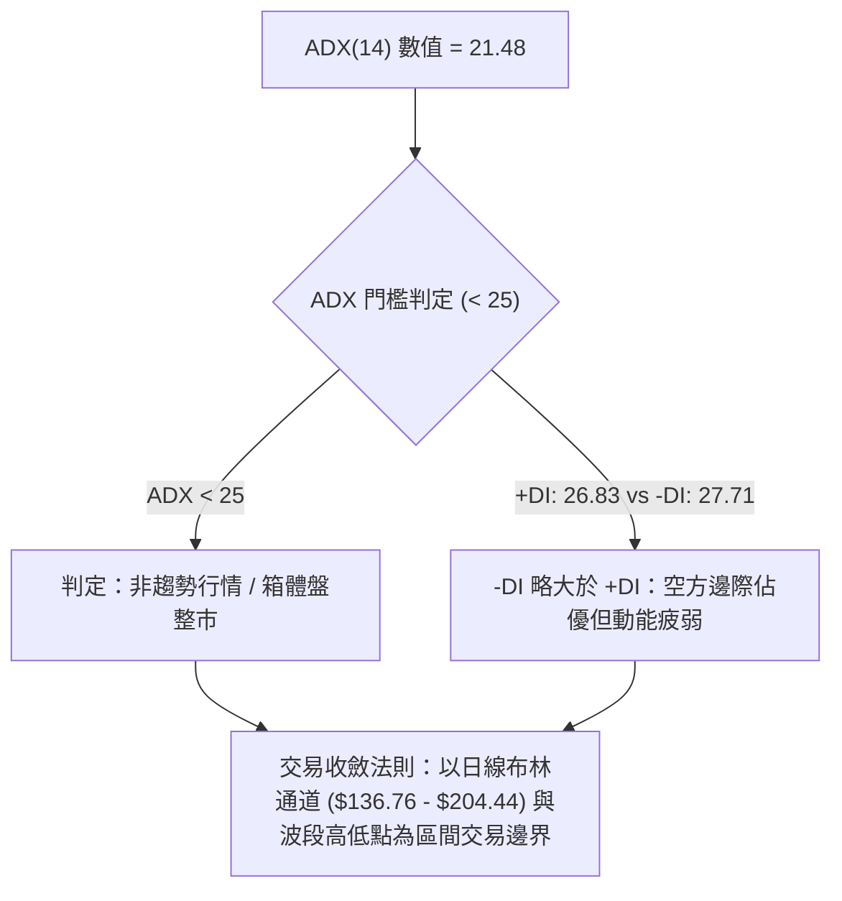
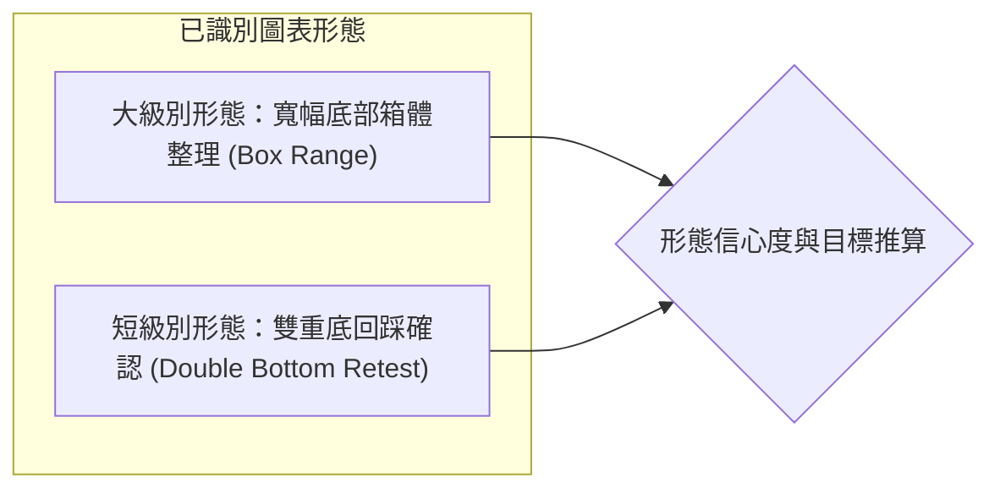
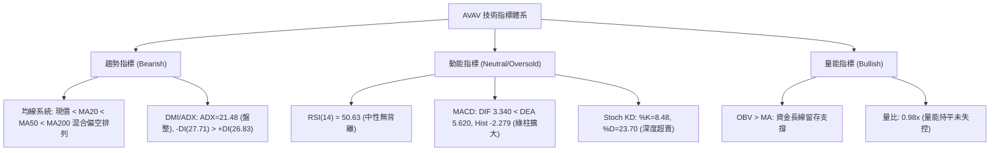
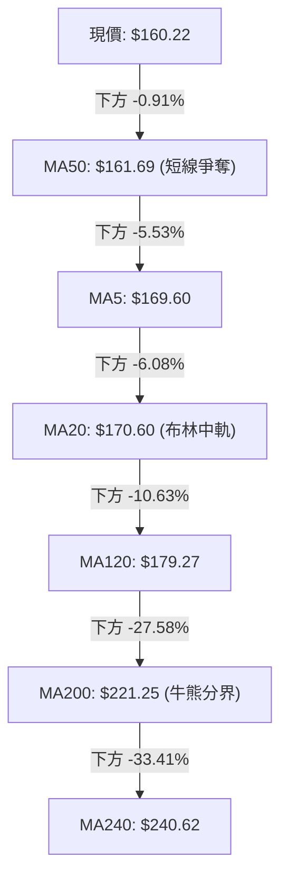
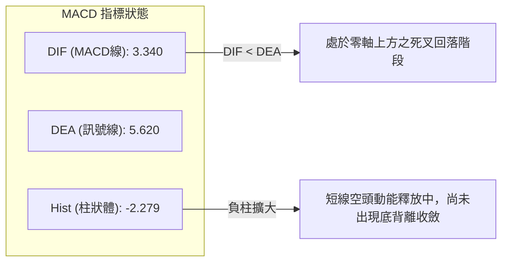
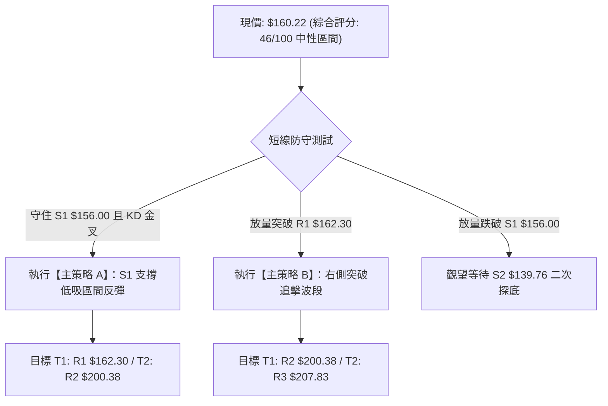
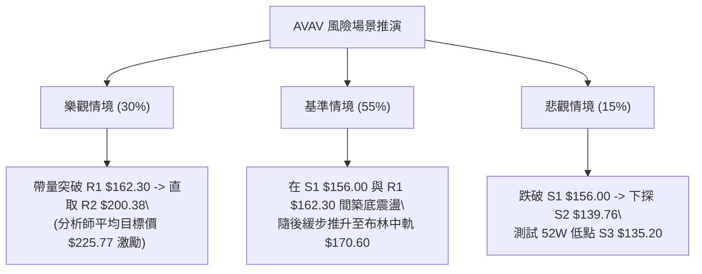

# AVAV 技術分析報告

> **報告日期**：2026-08-21 ｜ **語言**：繁體中文 ｜ **數據來源**：Yahoo Finance ｜ **當前價格**：$160.22

---

## 目錄

| 章節 | 內容 |
|------|------|
| [1. 技術面概覽](#1-技術面概覽) | 訊號儀表板、核心指標、評分卡 |
| [2. 趨勢分析](#2-趨勢分析) | 多時框趨勢、長中短期走勢 |
| [3. 圖表形態分析](#3-圖表形態分析) | 形態識別、K線組合、目標價 |
| [4. 支撐與阻力](#4-支撐與阻力) | 關鍵價位、斐波那契回調 |
| [5. 技術指標深度解讀](#5-技術指標深度解讀) | MA/RSI/MACD/布林/成交量 |
| [6. 動能與波動率](#6-動能與波動率) | 動能評估、ATR、Beta |
| [7. 多時框架總結](#7-多時框架總結) | 時框架評分矩陣、收斂結論 |
| [8. 交易策略建議](#8-交易策略建議) | 策略路由、情境階梯、主策略詳情 |
| [9. 風險提示與監控](#9-風險提示與監控) | 監控指標、風險場景、風控提醒 |

---

## 1. 技術面概覽

### 🎯 技術訊號儀表板



---

### 📊 核心指標速覽表

| 指標類別 | 指標名稱 | 當前數值 | 訊號 | 解讀 |
|----------|----------|----------|------|------|
| **價格** | 當前價格 | $160.22 | 🔴 | 位於 52 週低檔區間（8.9% 分位），受制於均線束壓制 |
| **均線** | MA20 | $170.60 | 🔴 | 價格低於 MA20（-6.08%），短線處於下行修正通道 |
| **均線** | MA50 | $161.69 | 🔴 | 價格剛跌破 MA50（-0.91%），測試中期多空防守線 |
| **均線** | MA200 | $221.25 | 🔴 | 價格大幅低於年線（-27.58%），長期空頭排列未變 |
| **動能** | RSI(14) | 50.63 | 🟡 | 位於多空平衡中軸 50 附近，無明顯頂底背離 |
| **動能** | MACD (12,26,9) | Hist: -2.279 | 🔴 | MACD (3.340) 低於 Signal (5.620)，動能柱為負 |
| **動能** | Stoch %K / %D | 8.48 / 23.70 | 🟢 | 進入極度超賣區間（<20），短線具備技術性反彈動能 |
| **趨勢強度** | ADX(14) | 21.48 | 🟡 | ADX < 25 表明處於非趨勢的「箱體震盪/盤整築底」行情 |
| **通道** | 布林通道 (%B) | 0.35 | 🟡 | 介於中軌 $170.60 與下軌 $136.76 之間，偏向弱勢區間 |
| **量能** | OBV 趨勢 | OBV > MA | 🟢 | 資金未出現恐慌性潰逃，量能結構支持底部承接 |
| **波動** | ATR(14) | $11.06 (6.90%) | 🟡 | 波動率較高，單日平均震盪幅度達 $11.06 |

---

### 🏆 技術評分卡

```
╔══════════════════════════════════════════════════════════════╗
║              技術評分卡 — AVAV (2026-08-21)                  ║
╠══════════════════════════════════════════════════════════════╣
║ 趨勢強度 (ADX=21.48)   ████████░░░░░░░░░░░░  40/100  🔴 空頭主導  ║
║ 動能指標 (RSI/MACD/KD) ██████████░░░░░░░░░░  50/100  🟡 動能分歧  ║
║ 支撐穩定度 (S1/S2/S3)  ████████████░░░░░░░░  60/100  🟢 底部支撐  ║
║ 成交量配合 (OBV/Volume)████████████░░░░░░░░  58/100  🟢 量能支撐  ║
║ 形態完整度 (區間箱體)   ████████░░░░░░░░░░░░  40/100  🟡 構築中    ║
║ 均線排列 (空頭排列)     ██████░░░░░░░░░░░░░░  28/100  🔴 空頭壓制  ║
╠══════════════════════════════════════════════════════════════╣
║ 綜合技術評分           █████████░░░░░░░░░░░  46/100  🟡 弱勢震盪  ║
║ 核心評級結論：ADX=21.48 確立盤整市，聚焦 $135.20-$204.44 箱體   ║
╚══════════════════════════════════════════════════════════════╝
```

---

## 2. 趨勢分析

### 🌐 多時框趨勢分析



---

### 📈 長期趨勢 — 12個月走勢圖（Unicode）

```
AVAV 月線歷史收盤走勢圖（2025-08 至 2026-08）
價格軸 ($)
$370 ┤                                      ● (2025-10: $369.91 波段頂點)
$340 ┤
$310 ┤                            ● (2025-09: $314.89)
$280 ┤                                              ● (2025-11: $279.46)    ● (2026-01: $278.39)
$250 ┤                  ● (2025-08: $241.35)        ● (2025-12: $241.89)    ● (2026-02: $252.25)
$220 ┤
$190 ┤                                                                      ● (2026-04: $195.02) ● (2026-05: $207.24)
$160 ┤                                                                      ● (2026-03: $183.05) ● (2026-06: $165.07) ●(現在 $160.22)
$130 ┤                                                                                           ● (2026-07: $149.37)
     └────────────────────────────────────────────────────────────────────────────────────────────────────────────
        25-08    25-09    25-10    25-11    25-12    26-01    26-02    26-03    26-04    26-05    26-06    26-07    26-08
```

#### 走勢特徵分析表格

| 階段區間 | 起始/結束價 | 期間漲跌幅 | 核心驅動特徵與技術意義 |
|----------|------------|------------|------------------------|
| **2025-08 ~ 2025-10** | $241.35 → $369.91 | **+53.27%** | 主升浪爆發，創下 52 週高點 $417.86，多頭動能耗盡 |
| **2025-11 ~ 2026-02** | $279.46 → $252.25 | **-9.74%** | 高位巨幅震盪出貨，跌破 MA200 形成大型頂部結構 |
| **2026-03 ~ 2026-07** | $183.05 → $149.37 | **-18.40%** | 恐慌性下殺，於 2026-06 觸及 52 週低點 $135.20 附近獲承接 |
| **2026-08 (當前)** | $149.37 → $160.22 | **+7.26%** | 低檔回升後回踩，現價 $160.22，處於大跌後的橫盤築底階段 |

---

### 📊 中期趨勢（週線分析）

```
AVAV 週線關鍵架構與通道示意圖
 價位 ($)
 $207.83 ┤ ------------------------ 強阻力 R3 (2026-05 高點)
         │           ╭──╮
 $200.38 ┤ ──────────│──│──────── 阻力 R2 (布林上軌 $204.44 / 波段頸線)
         │          │  │
 $170.60 ┤ ─────────│──│──────── MA20 / 布林中軌
 $162.30 ┤ ─────────│──│──────── 短線阻力 R1 / MA50 ($161.69)
 $160.22 ┤ ═════════★════════════ 當前價格 ($160.22)
 $156.00 ┤ ─────────│──│──────── 近期支撐 S1
 $139.76 ┤ ─────────│──│──────── 強支撐 S2 (2026-07 低點聚類)
 $135.20 ┤ ─────────╰──╯──────── 52週極限支撐 S3 (2026-06 破底翻點位)
```

近 20 週數據顯示，AVAV 於 2026-06-28 爆出 11,887,200 股大量收在 $137.95，隨後於 2026-07-05 爆出 18,317,500 股天量拉升至 $190.89，確認 $135.20 為強大支撐區。近期衝高至 2026-08-16 的 $192.81 後受制於 R2 ($200.38) 回落，本週收於 $160.22，顯示中期呈現 **$135.20 ~ $207.83 的寬幅箱體震盪**。

---

### ⚡ 趨勢強度評估（ADX 解讀）



| 指標變數 | 當前讀數 | 門檻標準 | 趨勢屬性解讀 |
|----------|----------|----------|--------------|
| **ADX(14)** | **21.48** | < 25 (弱趨勢/震盪) | 趨勢動能匱乏，市場進入無趨勢的區間洗盤，不具備單邊趨勢突破條件 |
| **+DI (14)** | **26.83** | 多方買盤力量 | 多方力量自高點回落，但仍維持在 25 以上基準線 |
| **-DI (14)** | **27.71** | 空方拋售力量 | -DI 略微超越 +DI，空頭微弱佔優，但兩者差值極小（0.88），未形成單邊趨勢 |

---

## 3. 圖表形態分析

### 🔍 形態識別系統



#### 形態信心度與判定依據（依規則 15）

| 形態名稱 | 信心度 | 判斷依據（引用精確數據） | 完成度 | 目標價（附嚴格計算式） |
|----------|--------|--------------------------|--------|------------------------|
| **雙重底 (W底)** | **70%** | 第一低點 2026-06-28 收盤 $137.95（52W低 $135.20），第二低點 2026-07-19 收盤 $142.20（支撐 S2 $139.76 獲得確認），兩次下探均爆出逾千萬週成交量支撐。 | **75%** | 頸線阻力 R2 ($200.38) + 形態高度 ($200.38 - $135.20 = $65.18) = **$265.56**（突破 R2 後生效） |
| **寬幅箱體震盪** | **85%** | 箱底支撐 S3 ($135.20) 與箱頂阻力 R3 ($207.83)，ADX=21.48 (<25) 完全符合無趨勢箱體特徵。 | **90%** | 箱體上軌目標：**$207.83**；箱體等幅測量：$207.83 + ($207.83 - $135.20 = $72.63) = **$280.46** |
| **頭肩底形態** | **35%** | 數據不足以確認右肩完整構築，信心度低於 50%，依規則不予採納為主要形態。 | 20% | 訊號不足，僅做指標型解讀 |

---

### 🕯️ 重要K線形態分析

| 週/月份週期 | 收盤價 | K線形態特徵 | 技術解讀 | 訊號強度 |
|-------------|--------|-------------|----------|----------|
| **2026-06-28 週** | $137.95 | 長下影長陰破底翻 | 爆出 1,188 萬股巨量，探底 $135.20 後迅速收腳，主力進場吸籌 | 🟢 強烈買訊 |
| **2026-07-05 週** | $190.89 | 巨量長陽吞噬線 | 爆出 1,831 萬股天量長陽，一舉吞噬前三週跌幅，確立底部防線 | 🟢 極強多頭 |
| **2026-08-16 週** | $192.81 | 高位流星倒錘線 | 衝擊 R2 ($200.38) 未果，留長上影線，RSI 達 73.5 超買後引發獲利回吐 | 🔴 短線見頂 |
| **2026-08-23 (即時)**| $160.22 | 中陰回踩收於MA50 | 回踩測試 MA50 ($161.69) 與 S1 ($156.00)，進行突破後的回測確認 | 🟡 中性格局 |

---

### 📉 ASCII 走勢形態示意圖

```
AVAV 底部雙底（W底）與箱體結構幾何圖解
 價位 ($)
 $207.83 ┼────────────────────────────────────────────────────────── 箱體頂部 R3 ($207.83)
 $200.38 ┼───────────────────╭───╮────────────────────────────────── 雙底頸線位 R2 ($200.38)
         │                  │   │
 $170.60 ┼──────────────────│───│────────────────────────────────── MA20 中軌
 $160.22 ┼──────────────────│───★ ◄ 現價 ($160.22，回踩頸線下方支撐)
 $156.00 ┼──────────────────│───│────────────────────────────────── 短線支撐 S1 ($156.00)
         │         ╭╮       │   │
 $139.76 ┼─────────││───────╰───╯────────────────────────────────── 次低點/支撐 S2 ($139.76)
 $135.20 ┼─────────╰╯────────────────────────────────────────────── 最低點/支撐 S3 ($135.20)
         └─────────┴┴───────────┴┴──────────────────────────────────
                第一底 (06-28)   第二底 (07-19)
```

---

### 🎯 形態目標價計算

1. **箱體波段目標（進行中）**：
   - 當前處於箱體下半區（現價 $160.22），箱體理論震盪目標位為箱頂阻力 **R3: $207.83**。
2. **雙底突破理論測幅（需帶量突破 R2 後觸發）**：
   - 頸線位置：$200.38
   - 底部最低點：$135.20
   - 形態高度 $H = \$200.38 - \$135.20 = \$65.18$
   - 理論上行目標 $T1 = 頸線 + H = \$200.38 + \$65.18 = \mathbf{\$265.56}$

---

## 4. 支撐與阻力

### 🗺️ 關鍵價位分布圖（Unicode）

```
AVAV 價位結構分布圖
═════════════════════════════════════════════════════════════════
$417.86 ║████████████████████████████████║ 52W 歷史最高點 (0.0% 斐波)
$276.53 ║██████████████████              ║ 50.0% 斐波那契強壓位
$221.25 ║████████████████████            ║ 長期均線 MA200 反壓
$207.83 ║████████████████████████████████║ 強阻力 R3 (近一年波段高點聚類)
$200.38 ║████████████████████████        ║ 關鍵阻力 R2 / W底頸線
$162.30 ║████████████                    ║ 短線阻力 R1 (MA50 聚類重合區)
$160.22 ╠════════════════════════════════╣ ◄ 當前市價 ($160.22)
$156.00 ║▓▓▓▓▓▓▓▓▓▓▓▓▓▓▓▓                ║ 近期短線支撐 S1
$139.76 ║████████████████████            ║ 強支撐 S2 (波段次低點聚類)
$135.20 ║████████████████████████████████║ 極限強支撐 S3 (52W 最低點 / 100% 斐波)
═════════════════════════════════════════════════════════════════
```

---

### 🚧 阻力位分析表

所有價位均嚴格引用關鍵數據計算數值：

| 阻力級別 | 價位 | 形成原因與技術共振 | 突破難度 | 重要性 |
|----------|------|--------------------|----------|--------|
| **R1** | **$162.30** | 近一年波段高點聚類，與 MA50 ($161.69) 形成共振密集壓制 | 🟡 中等 (需日量 > 150萬) | ★★★☆☆ |
| **R2** | **$200.38** | 近一年波段高點聚類、布林通道上軌 ($204.44) 及雙底頸線位 | 🔴 極高 (需週量 > 1000萬) | ★★★★★ |
| **R3** | **$207.83** | 2026-05 波段高點聚類，箱體震盪之絕對頂部反壓 | 🔴 極高 (強套牢賣壓區) | ★★★★☆ |

---

### 🛡️ 支撐位分析表

所有價位均嚴格引用關鍵數據計算數值：

| 支撐級別 | 價位 | 形成原因與技術共振 | 守住機率 | 重要性 |
|----------|------|--------------------|----------|--------|
| **S1** | **$156.00** | 近一年波段低點聚類，短線回踩之首要多頭防禦線 | 🟢 75% | ★★★☆☆ |
| **S2** | **$139.76** | 2026-07 波段次低點聚類，W底第二隻腳之結構支撐 | 🟢 85% | ★★★★☆ |
| **S3** | **$135.20** | 52週歷史最低點聚類、斐波那契 100.0% 極限回調位 | 🟢 95% | ★★★★★ |

---

### 📐 斐波那契回調位分析

基準區間：52週波段高點 **$417.86** → 52週波段低點 **$135.20**（垂直高度 $282.66）

```
斐波那契回調位階梯
0.0%  (52W High)  ─── $417.86  [歷史天花板]
23.6%             ─── $351.15  [超強多頭區]
38.2%             ─── $309.88  [多頭中繼區]
50.0%             ─── $276.53  [多空中軸分水嶺]
61.8%             ─── $243.18  [黃金分割強阻力]
78.6%             ─── $195.69  [深幅回撤阻力區 / 接近 R2 $200.38]
───────────────────── 現價 $160.22 落於 78.6% ~ 100.0% 極深回撤築底區 ─────────────────────
100.0% (52W Low)  ─── $135.20  [週期絕對底部支撐 S3]
```

**解讀**：現價 $160.22 位於 78.6% ($195.69) 與 100.0% ($135.20) 之間，屬於超跌後的低檔築底結構。若能有效站穩 S1 ($156.00) 並突破 R1 ($162.30)，向上修復空間將直接指向 78.6% 回調位 ($195.69) 及 R2 ($200.38)。

---

## 5. 技術指標深度解讀

### 🎛️ 指標訊號總覽



---

### 📈 移動平均線排列分析



| 均線名稱 | 當前數值 | 與現價乖離率 | 走勢方向 | 排列狀態與技術含義 |
|----------|----------|--------------|----------|--------------------|
| **MA5** | $169.60 | -5.53% | ▼ 下行 | 極短線受壓，日線級別連續走弱 |
| **MA10** | $180.92 | -11.44% | ▼ 下行 | 短期均線快速下墜，形成上檔蓋頭反壓 |
| **MA20** | $170.60 | -6.08% | ▼ 下行 | 月線反壓，為當前布林中軌所在 |
| **MA50** | $161.69 | -0.91% | ▼ 走平 | 季線位置，現價正在進行生死線測試 |
| **MA60** | $167.17 | -4.16% | ▼ 下行 | 中期均線下彎，壓制反彈空間 |
| **MA120** | $179.27 | -10.63% | ▼ 下行 | 半年線反壓，形成波段反彈第一阻力區 |
| **MA200** | $221.25 | -27.58% | ▼ 下行 | 年線空頭排列，長期趨勢尚未反轉成牛市 |

---

### 📉 RSI(14) 分析

```
RSI(14) 數值進度條：
0 ─────────── 30 ────────────────────── 50 ── 50.63 ───────────────── 70 ─────────── 100
[  極度超賣   ] [      弱勢區間        ]   ▲ [     強勢區間      ] [  極度超買   ]
█████████████████████████████████████████░░░░░░░░░░░░░░░░░░░░  50.63%
```

- **當前數值**：**50.63**，精確落於多空中性軸線上方。
- **超買超賣判定**：無超買或超賣現象（處於 30–70 常態區間）。然而搭配 **Stoch KD (%K=8.48)** 觀察，短線動能已率先進入超賣區，預示下行空間受限。
- **背離判斷**：日線與週線 RSI 目前**無明顯頂背離或底背離**，呈現價格回調後的指標常態修復。

---

### 📊 MACD(12,26,9) 訊號解讀



- **解讀**：MACD 快線 (3.340) 下穿慢線 (5.620)，柱狀體為 -2.279。由於兩線仍處於零軸上方，屬於**「上升趨勢中的中級回調」**而非深幅崩跌。若柱狀體在 S1 ($156.00) 附近縮腳轉正，將提供絕佳右側進場點。

---

### 📦 布林通道分析

```
AVAV 日線布林通道結構示意圖
 $204.44 ┤ ────────────────────────────────── 上軌 (Upper Band)
         │                   ╭─────╮
 $170.60 ┤ ─────────────────╭╯     ╰─中軌 (MA20)
 $160.22 ┤ ════════════════★═════════ 當前價格 (%B = 0.35)
         │          ╭──────╯
 $136.76 ┤ ─────────╯──────────────── 下軌 (Lower Band)
```

- **通道參數**：上軌 **$204.44**、中軌 **$170.60**、下軌 **$136.76**，通道寬度約 $67.68。
- **%B 指標**：**0.35**。現價處於中軌至下軌之間，顯示短期處於弱勢震盪，但距離下軌 ($136.76) 與支撐 S3 ($135.20) 具備強大下檔緩衝保護。

---

### 💹 成交量分析（量價配合度）

```
成交量指標對比：
最新成交量  (1,148,933)  ████████████████░░░░  (量比: 0.98x)
20日均量   (1,177,512)  ████████████████░░░░
50日均量   (1,701,717)  ████████████████████
```

- **量價配合度**：最新成交量 1,148,933 股，量比為 0.98x，較 50 日均量明顯縮量。回調過程中呈現**「縮量整理」**良性特徵，未見放量恐慌殺盤。
- **OBV（能量潮）解讀**：數據顯示 **OBV > MA**，能量潮均線維持多頭排列，顯示前期在 $135-$145 區間大舉進場的主力資金（如 2026-07-05 週的 18,317,500 股巨量）尚未大規模出逃，量能結構支持中長期底部構築。

---

## 6. 動能與波動率

### ⚡ 動能評估四象限

```
   高動能 ↑
          │      Q3: 高風險高收益            Q1: 最佳多頭機會
          │      (強動能 / 高波動)          (強動能 / 低波動)
          │
          │
  ────────┼─────────────────────────────────────────────────→
          │      Q4: 避免進場               ★ Q2: 謹慎觀望/逢低築底
          │      (弱動能 / 高波動)          (弱動能 / 低波動/常態波動)
          │                                  [AVAV 當前位置]
   低動能 ↓
          └─────────────────────────────────────────────────
          低波動率                             高波動率
```

| 象限代號 | 動能屬性 | 波動屬性 | AVAV 匹配狀態 | 操作策略定位 |
|----------|----------|----------|---------------|--------------|
| **Q1** | 強動能 | 低波動 | ─ | 趨勢主升段，全力做多 |
| **★ Q2** | **弱動能 (ADX=21.48)** | **中高波動 (ATR=6.90%)** | **✓ 符合當前** | **箱體築底期，適合區間操作、高拋低吸** |
| **Q3** | 強動能 | 高波動 | ─ | 突破爆發期，追隨趨勢 |
| **Q4** | 弱動能 | 極高波動 | ─ | 崩跌破位期，嚴格空倉 |

---

### 📊 ATR 波動率分析

- **ATR(14) 絕對值**：**$11.06**
- **ATR 相對價格比**：**6.90%**（屬高波動防禦科技股屬性）
- **止損距離建議**：
  - 短線交易（Swing Trade）：建議採用 $1.0 \times \text{ATR} \approx \mathbf{\$11.00}$ 之動態止損幅度。
  - 波段交易（Position Trade）：建議採用 $1.5 \times \text{ATR} \approx \mathbf{\$16.59}$ 之防守空間，對應現價剛好落於強支撐 **S2 ($139.76)** 附近。

---

### 📐 Beta 與市場相關性

- **Beta 係數**：**1.412**（高 Beta 屬性）
- **市場意涵**：AVAV 波動幅度較標普 500 指數高出 41.2%。在大盤上漲時具備強大的超額收益 (Alpha) 爆發力；在大盤回調時亦容易出現超額下殺，操作上必須嚴格控制單筆倉位上限（建議不超過總資金 10-15%）。

---

## 7. 多時框架總結

### 📋 時框架評分表

| 時框架 | 趨勢方向 | 動能狀態 | 均線排列 | 圖表形態 | 綜合評分 | 操作建議 |
|--------|----------|----------|----------|----------|----------|----------|
| **長期（月線）** | 🔴 空頭修復 | 🟡 中性 (超跌) | 🔴 空頭排列 | 斐波 78.6%~100% 築底 | **42/100** | 逢低分批布局長線底倉 |
| **中期（週線）** | 🟡 寬幅震盪 | 🟢 底部金叉收斂 | 🟡 均線收斂纏繞 | $135-$207 寬幅箱體 | **55/100** | 箱體下軌低吸、上軌高拋 |
| **短期（日線）** | 🔴 回調整理 | 🟢 KD 極度超賣 | 🔴 跌破 MA20 | 回踩 S1/MA50 支撐 | **46/100** | 待止跌訊號出現後右側切入 |

---

### 🔲 綜合訊號矩陣

```
┌─────────────────┬──────────┬──────────┬──────────┬────────────────────────┐
│ 維度            │ 短期日線 │ 中期週線 │ 長期月線 │ 矩陣收斂一致性判定     │
├─────────────────┼──────────┼──────────┼──────────┼────────────────────────┤
│ 趨勢方向        │  🔴 空頭 │  🟡 震盪 │  🔴 空頭 │ 🟡 缺乏單邊趨勢 (ADX低) │
│ 動能指標 (RSI)  │  🟡 50.6 │  🟡 50.6 │  🔴 偏弱 │ 🟡 中性偏平衡          │
│ 超賣指標 (KD)   │  🟢 超賣 │  🟡 中性 │  🟢 低檔 │ 🟢 具備反彈動能        │
│ 成交量能 (OBV)  │  🟢 支撐 │  🟢 爆量 │  🟢 沉澱 │ 🟢 主力資金未退場      │
│ 支撐有效性      │  🟢 S1穩 │  🟢 S2強 │  🟢 S3極 │ 🟢 底部結構扎實        │
└─────────────────┴──────────┴──────────┴──────────┴────────────────────────┘
```

---

### ⚖️ 多時框收斂結論（依規則 14 嚴格執行）

1. **趨勢/盤整行情判定**：當前 ADX(14) 讀數為 **21.48 (< 25)**，嚴格判定為**「非趨勢之區間盤整行情」**。
2. **主導時框與交易邊界**：依規則 14，在盤整行情中，中長期單邊均線失效，**日線布林通道上下軌 ($136.76 ~ $204.44) 與關鍵支撐阻力 ($135.20 ~ $207.83) 成為主導交易區間**。
3. **唯一方向性結論**：**【中性區間操作 / 逢低偏多築底】**。
   - 理由：日線回調已使 KD 達到極度超賣 (%K=8.48)，現價 $160.22 緊鄰短線支撐 S1 ($156.00) 與 MA50 ($161.69)，且距離箱體底部 S3 ($135.20) 僅 15.6%，下檔空間有限；而上方反彈至箱頂 R2 ($200.38) 空間達 25.07%，具備絕佳的不對稱風險報酬比。

---

## 8. 交易策略建議

### 🗺️ 策略決策流程圖



---

### 🧭 策略路由（依評分卡分流）

> **當前主策略方向 = 【中性偏多區間操作】（依技術綜合評分 46/100，定位為區間震盪下軌低吸）**

---

### 🎯 價格情境階梯（Price Scenarios）

所有價位均嚴格引用第 4 章及關鍵數據：

| 觸發條件 | 第一目標 | 後續延伸目標 | 情境含義與操作指引 |
|----------|----------|--------------|--------------------|
| **向上突破 R1 ($162.30)** | **R2 ($200.38)** | **R3 ($207.83)** | 短線轉強，確認回調結束，發起箱體上軌衝擊浪 |
| **守穩 S1 ($156.00) ~ 現價** | **R1 ($162.30)** | **布林中軌 ($170.60)**| 區間窄幅震盪築底，指標進行超賣修復 |
| **有效跌破 S1 ($156.00)** | **S2 ($139.76)** | **S3 ($135.20)** | 短期破位，回踩測試 W 底第二隻腳與 52 週極限低點 |

---

### 📊 情境機率分佈

| 價格情境 | 機率預估 | 主要技術依據 |
|----------|----------|--------------|
| **情境一：守穩 S1 反彈上行** | **55%** | Stoch KD 極度超賣 (%K=8.48)、OBV 多頭支撐、日線回踩 MA50 縮量 |
| **情境二：$156 - $165 區間震盪** | **30%** | ADX=21.48 弱趨勢、MACD 柱狀體收斂中、均線糾纏 |
| **情境三：跌破 S1 深幅探底** | **15%** | 均線空頭排列蓋頂、-DI 邊際佔優（若大盤系統性下殺觸發） |

---

### 🟢 主策略詳情

依據數據精確設定之雙軌主策略：

| 策略要素 | 策略 A：S1 支撐左側低吸策略 (逢低建倉) | 策略 B：突破 R1 右側順勢策略 (確認轉強) |
|----------|----------------------------------------|-----------------------------------------|
| **進場條件** | 價格回踩 S1 ($156.00) 獲支撐且出現 15分K 反轉 | 日線收盤放量突破並站穩 R1 ($162.30) |
| **進場價格** | **$156.50** | **$162.80** |
| **目標價 T1** | **$170.60** (布林中軌 / MA20) | **$200.38** (關鍵阻力 R2 / W底頸線) |
| **目標價 T2** | **$200.38** (關鍵阻力 R2 / +28.0%) | **$207.83** (箱頂阻力 R3 / +27.6%) |
| **止損價格** | **$149.00** (跌破 2026-07 收盤 $149.37 防守線) | **$155.50** (跌破 S1 支撐位) |
| **風險空間** | $156.50 - $149.00 = **$7.50** | $162.80 - $155.50 = **$7.30** |
| **報酬空間 (至T2)** | $200.38 - $156.50 = **$43.88** | $207.83 - $162.80 = **$45.03** |
| **風險報酬比** | **1 : 5.85** (極佳) | **1 : 6.17** (極佳) |
| **勝率估計** | **60%** | **65%** |
| **建議倉位** | **8% - 10%** (分批建倉) | **10% - 12%** (突破加碼) |

---

### 🔴 反向風險觸發點（對沖提示）

- **全面破位訊號**：若日線以大陰線跌破 **S1 ($156.00)** 且成交量放大至 150 萬股以上，主策略 A 立即止損離場。
- **極限防守線**：若跌破 **S2 ($139.76)**，意味著雙底形態徹底失效，市場將重測 52W 低點 **S3 ($135.20)**，此時應全面停止多頭操作，轉為觀望或微量反向對沖。

---

### ⭐ 整體訊號強度評星

```
╔══════════════════════════════════════════════════════════════╗
║ 做多訊號強度：  ★★★☆☆  (3.5/5星 - 超賣支撐具備高賠率反彈機會)║
║ 做空訊號強度：  ★★☆☆☆  (2.0/5星 - 接近箱底且極度超賣，追空風險高)║
║ 整體可信度：    ★★★★☆  (4.0/5星 - 價位聚類清晰，量價結構明確)  ║
╚══════════════════════════════════════════════════════════════╝
```

---

## 9. 風險提示與監控

### ✅ 關鍵監控指標 Checklist

```
╔══════════════════════════════════════════════════════════════╗
║              AVAV 每日盤後關鍵技術監控清單                   ║
╠══════════════════════════════════════════════════════════════╣
║ [ ] 價位防守：收盤價是否維持在 S1 ($156.00) 之上？            ║
║ [ ] 均線突破：日線是否帶量站上 MA50 ($161.69) 與 R1 ($162.30)？║
║ [ ] 動能轉向：Stoch KD 是否在 20 以下完成黃金交叉？          ║
║ [ ] MACD 監控：柱狀體負值是否由 -2.279 開始縮小收斂？        ║
║ [ ] 量能異動：單日成交量是否突破 20日均量 (1,177,512 股)？    ║
║ [ ] 籌碼指標：空頭部位 (Short Float 11.3%) 是否出現回補跡象？ ║
╚══════════════════════════════════════════════════════════════╝
```

---

### ⚠️ 風險場景分析



---

### 🛡️ 風險管理重要提醒

1. **波動率管理（ATR 考量）**：AVAV 日 ATR 高達 **$11.06 (6.90%)**，意味著單日正常震盪即可達 7% 左右。嚴禁使用高槓桿，單筆停損金額應嚴格控制在總投資組合淨值的 **1.0% - 1.5%** 以內。
2. **高 Short Interest 雙刃劍**：空頭佔流通盤比例達 **11.3%**（Short Ratio 2.18）。一旦價格放量突破頸線 R2 ($200.38)，極易引發軋空行情（Short Squeeze）；反之，在跌破支撐時亦會加劇空頭摜壓。
3. **倉位配置原則**：在 ADX < 25 的盤整市中，總持倉量應維持在「輕倉試探」級別（不超過三成總倉），待放量突破 R2 ($200.38) 確認右側大趨勢形成後，方可重倉波段持有。

---

## 📋 報告總結

```
╔══════════════════════════════════════════════════════════════╗
║                   AVAV 技術分析報告總結                      ║
╠══════════════════════════════════════════════════════════════╣
║ 報告日期：2026-08-21                                         ║
║ 當前價格：$160.22                                            ║
║ 分析評級：⚖️ 中性偏多 / 區間築底（技術評分：46/100）           ║
╠══════════════════════════════════════════════════════════════╣
║ 關鍵結論：                                                   ║
║ ├─ 長期趨勢：🔴 空頭深幅回撤築底（處於 78.6%~100% 斐波區間） ║
║ ├─ 中期趨勢：🟡 寬幅箱體震盪（$135.20 - $207.83，ADX=21.48）║
║ ├─ 短期趨勢：🟢 日線超賣回踩（KD %K=8.48，測試 S1 $156 支撐）║
║ ├─ 關鍵支撐：S1: $156.00 ｜ S2: $139.76 ｜ S3: $135.20       ║
║ ├─ 關鍵阻力：R1: $162.30 ｜ R2: $200.38 ｜ R3: $207.83       ║
║ └─ 分析師目標：平均 $225.77 (最高 $326.00 / 共 19 位評級)    ║
╠══════════════════════════════════════════════════════════════╣
║ 最優策略組合：                                               ║
║ 1. 🥇 最佳機會：回踩 S1 ($156.50) 低吸，博弈 R2 ($200.38)     ║
║                 風險報酬比 1:5.85，停損設於 $149.00          ║
║ 2. 🥈 次選機會：突破 R1 ($162.80) 右側追多，目標 $207.83     ║
║                 風險報酬比 1:6.17，停損設於 $155.50          ║
║ 3. 🥉 保守選擇：空倉觀望，待日線 KD 金叉且 MACD 柱收斂進場   ║
╚══════════════════════════════════════════════════════════════╝
```

---

> ⚠️ **免責聲明**：本報告為 AI 自動生成之技術分析，所有數據及估算均基於提供的歷史價格與量化技術指標資訊。本報告**僅供研究與學術參考**，**不構成任何投資建議**。投資有風險，入市需謹慎。

---

*報告生成時間：2026-08-21 ｜ 數據來源：Yahoo Finance ｜ 分析框架：多時框技術分析*