# AVAV 技術分析報告

> **報告日期**：2026-08-22 ｜ **語言**：繁體中文 ｜ **數據來源**：Yahoo Finance ｜ **當前價格**：$160.22

---

## 目錄

| 章節 | 內容 |
|------|------|
| [1. 技術面概覽](#1-技術面概覽) | 訊號儀表板、核心指標、評分卡 |
| [2. 趨勢分析](#2-趨勢分析) | 多時框趨勢、長中短期走勢、12個月走勢圖 |
| [3. 圖表形態分析](#3-圖表形態分析) | 形態識別、K線組合、目標價推算 |
| [4. 支撐與阻力](#4-支撐與阻力) | 關鍵價位分佈、斐波那契回調層級 |
| [5. 技術指標深度解讀](#5-技術指標深度解讀) | MA系統/RSI/MACD/布林通道/成交量與OBV |
| [6. 動能與波動率](#6-動能與波動率) | 動能四象限、ATR波動率、Beta市場相關性 |
| [7. 多時框架總結](#7-多時框架總結) | 時框架評分矩陣、多時框收斂定調 |
| [8. 交易策略建議](#8-交易策略建議) | 策略路由、情境階梯、主策略詳情與風控 |
| [9. 風險提示與監控](#9-風險提示與監控) | 關鍵監控清單、情境推演、倉位管理準則 |

---

## 1. 技術面概覽

### 🎯 技術訊號儀表板

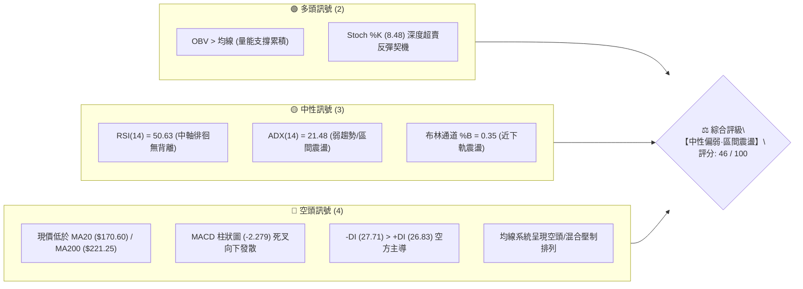

---

### 📊 核心指標速覽表

| 指標類別 | 指標名稱 | 當前數值 | 訊號 | 專業技術解讀 |
|:---|:---|:---|:---:|:---|
| **價格結構** | 當前收盤價 | **$160.22** | 🟡 | 位於52週區間（$135.20 - $417.86）的 **8.9%** 極低分位，築底測試中 |
| **短期均線** | MA20 (月線) | **$170.60** | 🔴 | 價格低於MA20達 **-6.08%**，短線承壓於中軌阻力 |
| **中期均線** | MA50 (季線) | **$161.69** | 🔴 | 價格貼近MA50下方（-0.91%），為短線多空爭奪的第一防線 |
| **長期均線** | MA200 (年線) | **$221.25** | 🔴 | 價格顯著低於年線 **-27.58%**，長期結構處於弱勢修復階段 |
| **超長均線** | MA240 (年線拓展) | **$240.62** | 🔴 | 偏離達 **-33.41%**，形成強烈的中長期頂部壓力沉積 |
| **動能震盪** | RSI (14) | **50.63** | 🟡 | 處於50多空中軸平衡區，暫無頂底背離訊號 |
| **動能趨勢** | MACD (12,26,9) | **Hist -2.279** | 🔴 | DIF(3.34) 低於 DEA(5.62)，柱狀圖負向擴展，短線動能偏空 |
| **隨機震盪** | Stoch %K / %D | **8.48 / 23.70** | 🟢 | KD進入極端超賣區（%K < 10），具備技術性短彈契機 |
| **趨勢強度** | ADX (14) | **21.48** | 🟡 | ADX < 25 表明市場無單邊趨勢，屬於典型的箱體整理行情 |
| **方向指標** | +DI / -DI | **26.83 / 27.71** | 🔴 | -DI微幅領先+DI，空方力量略佔優勢但未形成碾壓 |
| **通道指標** | Bollinger Bands | **%B: 0.35** | 🟡 | 帶寬位於 $136.76 (下軌) 至 $204.44 (上軌)，運行於中下軌區間 |
| **波動風險** | ATR (14) | **$11.06** | 🔴 | 佔股價 **6.90%**，日線波動度偏高，操作需嚴格控制止損幅度 |
| **能量潮** | OBV 趨勢 | **OBV > MA** | 🟢 | 資金未出現恐慌性撤離，低檔呈現主力資金承接沉澱 |

---

### 🏆 技術評分卡

```
╔══════════════════════════════════════════════════════════════════╗
║              AVAV 技術面綜合評分儀表板 (2026-08-22)              ║
╠══════════════════════════════════════════════════════════════════╣
║ 趨勢強度 (ADX/DI)   ████████░░░░░░░░░░░░  40/100  🔴 空方微幅主導 ║
║ 動能指標 (MACD/RSI) ██████████░░░░░░░░░░  48/100  🟡 中性偏弱整理 ║
║ 支撐穩定度 (S1-S3)  ████████████░░░░░░░░  60/100  🟢 底部支撐密集 ║
║ 成交量配合 (OBV/VOL)████████████░░░░░░░░  62/100  🟢 低檔量能堆積 ║
║ 形態完整度 (箱體)   ██████████░░░░░░░░░░  50/100  🟡 寬幅箱體築底 ║
║ 均線排列 (MA系統)   ████░░░░░░░░░░░░░░░░  20/100  🔴 空頭壓制排列 ║
╠══════════════════════════════════════════════════════════════════╣
║ 綜合技術評分        █████████░░░░░░░░░░░  46/100  ⚖️ 區間盤整偏弱║
╚══════════════════════════════════════════════════════════════════╝
```

---

## 2. 趨勢分析

### 🌐 多時框趨勢分析

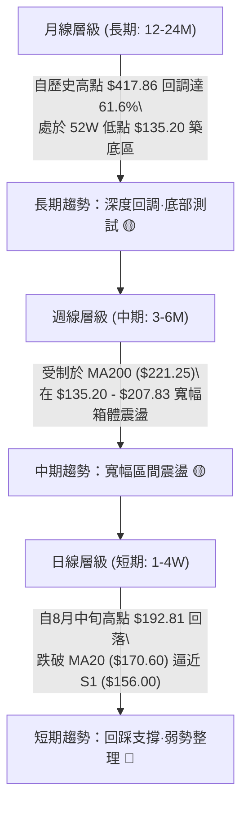

---

### 📈 長期趨勢 — 12個月走勢圖（Unicode）

```
AVAV 月線收盤走勢圖（2025-08 至 2026-08）
價格軸 ($)
$370 ┤                                      ● (2025-10: $369.91 頂部)
$340 ┤
$310 ┤                             ● (2025-09: $314.89)
$280 ┤                                          ●             ● (2026-01: $278.39)
$250 ┤                    ● (2025-08)                 ● (2026-02: $252.25)
$220 ┤                                                              ● (2026-05: $207.24)
$190 ┤                                                        ●     ● (2026-04: $195.02)
$160 ┤●━━━━━━━━━━━━━━━━━━━━━━━━━━━━━━━━━━━━━━━━━━━━━━━━━━━━━━━━━━━━━● ($160.22 現價)
$130 ┤                                                                      ● (2026-07: $149.37)
     └─────────────────────────────────────────────────────────────────────────────
       08/25 09/25 10/25 11/25 12/25 01/26 02/26 03/26 04/26 05/26 06/26 07/26 08/26
```

#### 走勢特徵分析表格

| 階段區間 | 起止價格 | 漲跌幅 | 成交與動能特徵 | 結構性意義 |
|:---|:---|:---:|:---|:---|
| **第一階段：高點見頂**<br>(2025.08 - 2025.10) | $241.35 → **$369.91**<br>(最高觸及 $417.86) | **+53.27%** | 換手率極高，量價加速趕頂，形成 52 週歷史天花板 | 多頭動能衰竭，確立 $417.86 為長期週期大頂 |
| **第二階段：主跌波段**<br>(2025.10 - 2026.03) | $369.91 → **$183.05** | **-50.51%** | 均線系統空頭發散，一路摜破 MA20、MA50 與 MA200 | 估值泡沫出清，機構籌碼快速換手派發 |
| **第三階段：次級反彈**<br>(2026.03 - 2026.05) | $183.05 → **$207.24** | **+13.21%** | 反彈受制於 78.6% 斐波那契位 ($195.69) 與 R3 ($207.83) | 確認反彈無力突破中長期均線壓制，轉入大箱體 |
| **第四階段：探底築底**<br>(2026.05 - 2026.08) | $207.24 → $149.37 → **$160.22** | **-22.69%** | 在 52W 低點 $135.20 / S2 ($139.76) 上方獲買盤支撐 | 構築低位雙重底/箱體下軌結構，波動率收窄 |

---

### 📊 中期趨勢（週線分析）

```
中期週線價格通道與關鍵阻力/支撐示意圖
════════════════════════════════════════════════════════════════════
$221.25  ══════════════════════════════════════════════ [MA200 牛熊分水嶺]
$207.83  ────────────────────────────────────────────── [R3 箱體頂部強阻力]
$200.38  ┄┄┄┄┄┄┄┄┄┄┄┄┄┄┄┄┄┄┄┄┄┄┄┄┄┄┄┄┄┄┄┄┄┄┄┄┄┄┄┄┄┄┄ [R2 整數心理關口]
$170.60  - - - - - - - - - - - - - - - - - - - - - - - [MA20 / 布林中軌]
$162.30  ·············································· [R1 短線即時阻力]
$160.22  ◄■■■■■■■■■■■■■■■■■■■■■■■■■■■■■■■■■■■■■■■■■■■■ [現價位置 $160.22]
$156.00  ────────────────────────────────────────────── [S1 近端支撐位]
$139.76  ┄┄┄┄┄┄┄┄┄┄┄┄┄┄┄┄┄┄┄┄┄┄┄┄┄┄┄┄┄┄┄┄┄┄┄┄┄┄┄┄┄┄┄ [S2 波段低點強支撐]
$135.20  ══════════════════════════════════════════════ [S3 52週歷史低點底線]
════════════════════════════════════════════════════════════════════
```

---

### ⚡ 趨勢強度評估（ADX 解讀）

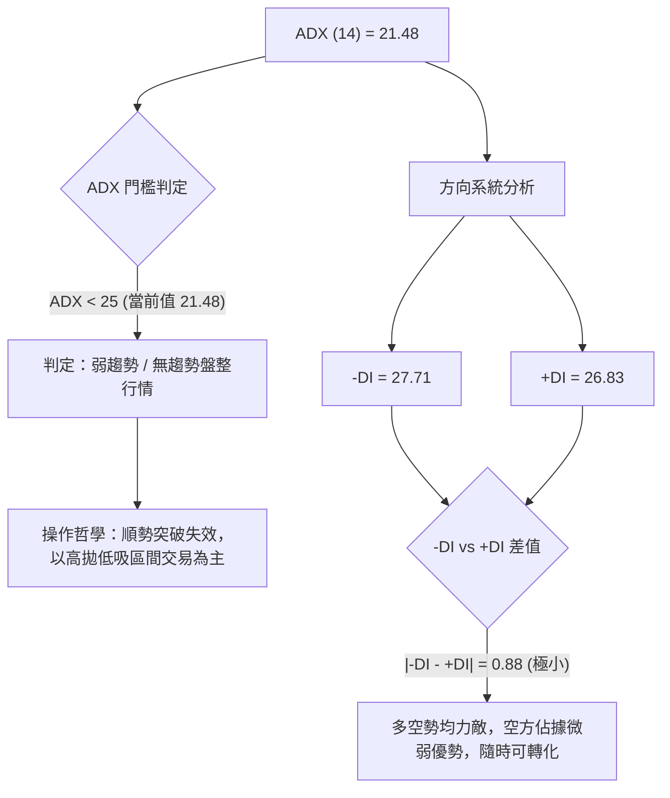

#### ADX 趨勢強度對照表

| ADX 區間 | 趨勢強度定義 | AVAV 當前狀態 | 交易策略指導方針 |
|:---:|:---:|:---:|:---|
| **0 - 20** | 極弱 / 無方向震盪 | ❌ 排除 | 觀望或超短線高頻剝頭皮 |
| **20 - 25** | **弱趨勢 / 區間盤整** | **✓ (21.48)** | **嚴禁追漲殺跌；以布林通道與 S1-S3 / R1-R3 支撐阻力做高拋低吸** |
| **25 - 40** | 明確單邊趨勢形成 | ❌ 排除 | 順勢交易，均線回踩進場 |
| **40 - 100** | 極強單邊 / 趨勢過熱 | ❌ 排除 | 尋找反轉背離或鎖定利潤 |

---

## 3. 圖表形態分析

### 🔍 形態識別系統

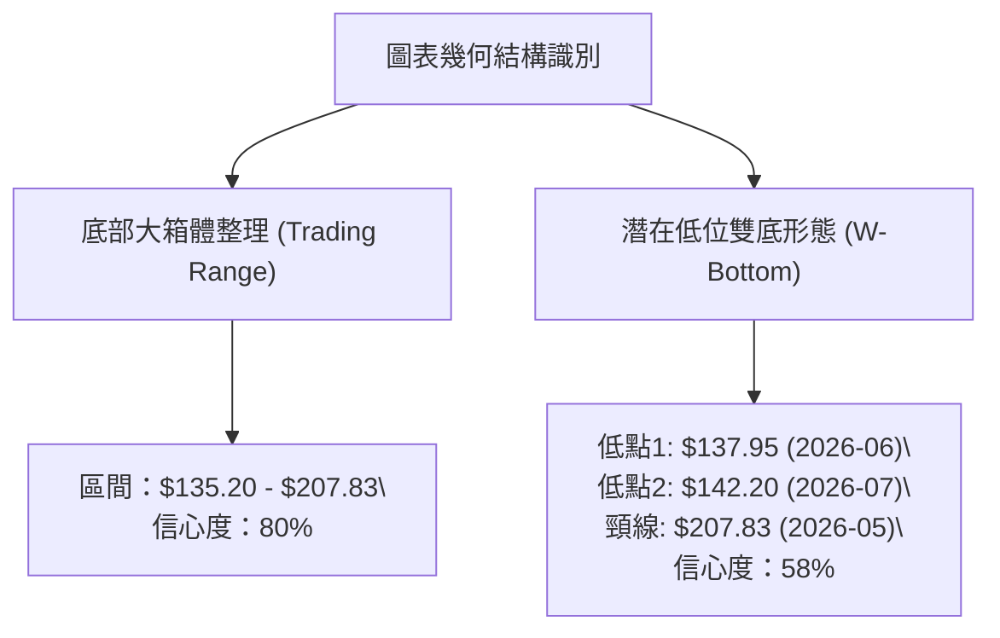

#### 圖表形態判斷與信心度評估表

| 形態名稱 | 形態週期 | 信心度 | 判斷依據（嚴格引用數據） | 完成度 | 理論目標價（附計算式） |
|:---|:---:|:---:|:---|:---:|:---|
| **低位寬幅整理箱體** | 日線/週線 (3個月) | **80%** | 下軌聚類於 S2 ($139.76) 至 S3 ($135.20)，上軌受制於 R3 ($207.83)，價格在此區間震盪已達12週以上。 | 75% | 箱體突破目標 = 頸線 $207.83 + (箱頂 $207.83 - 箱底 $135.20) = **$280.46**（若向上有效突破） |
| **潛在雙重底 (W底)** | 週線 (2026.06-08) | **58%** | 第一次探底 $137.95 (2026-06-28 週收盤)，第二次探底 $142.20 (2026-07-19 週收盤)，兩次低點均未破 S3 ($135.20)。 | 40% | 雙底高度 = 頸線 R3 ($207.83) - 低點 S3 ($135.20) = $72.63。<br>測算目標 = $207.83 + $72.63 = **$280.46** |
| **均線死叉壓制形態** | 日線 (近期) | **85%** | MA5 ($169.60)、MA20 ($170.60) 均下穿 MA120 ($179.27)，且價格跌破 MA20，形成典型短線空頭排列。 | 90% | 下行測試目標 = 支撐位 **S1 ($156.00)** 與 **S2 ($139.76)** |

---

### 🕯️ 重要K線形態分析（近10週重大節點）

| 週線日期 | 收盤價 | RSI | MACD柱 | 週成交量 | K線形態特徵 | 技術含義與多空解讀 |
|:---:|:---:|:---:|:---:|:---:|:---|:---|
| **2026-05-31** | **$207.24** | 70.9 | +6.139 | 9,648,400 | 長陽衝高受阻 | 觸及箱頂 R3 ($207.83) 形成波段高點，多頭動能觸頂 |
| **2026-06-28** | **$137.95** | 20.2 | -4.576 | 11,887,200 | 恐慌長陰探底 | 逼近 52W 低點 $135.20，放量下影線形成第一隻腳 (Left Bottom) |
| **2026-07-05** | **$190.89** | 53.3 | +2.636 | **18,317,500** | **歷史天量大陽吞沒** | 爆量暴力反彈，確立主力資金在 $140 附近強力護盤進場 |
| **2026-07-19** | **$142.20** | 51.8 | -0.860 | 7,087,900 | 縮量二次回踩 | 回踩不破前低 $137.95，成交量萎縮，構成第二隻腳 (Right Bottom) |
| **2026-08-16** | **$192.81** | 73.5 | +4.300 | 5,939,600 | 衝高回落十字星 | 反彈遇阻於 78.6% 斐波那契位 ($195.69)，引發獲利盤兌現 |
| **2026-08-23** | **$160.22** | 50.6 | -2.279 | 5,657,500 | 中陰回吐線 | 跌破 MA20 ($170.60)，短線進入針對 S1 ($156.00) 的回踩確認 |

---

### 📉 ASCII 走勢形態示意圖

```
AVAV 潛在雙底 (W-Bottom) 與箱體震盪形態幾何圖形
──────────────────────────────────────────────────────────────────
$207.83 ───┐                  頸線阻力 (R3: $207.83)                  ┌─── [目標價: $280.46]
           │                    ▲                                     │     (突破後高度推算)
           │                   ╱ ╲                                    │
           │                  ╱   ╲                                   │
$170.60 ───┼─────────────────╱─────╲──────────────┬──────────────────┼─── [MA20 中軌壓制]
           │                ╱       ╲             │ (現價 $160.22)    │
           │               ╱         ╲            ▼                   │
$156.00 ───┼──────────────╱───────────╲───────────●──────────────────┼─── [S1 關鍵支撐]
           │             ╱             ╲         ╱                    │
$137.95 ───┴────────────●               ●───────╱─────────────────────┴─── [S2: $139.76 / S3: $135.20]
                    第一底 (06-28)    第二底 (07-19)
                     $137.95           $142.20
──────────────────────────────────────────────────────────────────
```

---

## 4. 支撐與阻力

### 🗺️ 關鍵價位分布圖（Unicode）

```
AVAV 關鍵價位結構分布圖
══════════════════════════════════════════════════════════════════════════════
$221.25 ║████████████████████████████████████████║ 長期牛熊分水嶺 (MA200)
$207.83 ║████████████████████████████████        ║ 強阻力 R3 (近一年波段高點聚類)
$200.38 ║████████████████████                    ║ 阻力 R2 (整數心理關卡聚類)
$170.60 ║▓▓▓▓▓▓▓▓▓▓▓▓▓▓▓▓▓▓▓▓                    ║ 動態阻力 (MA20 / 布林中軌)
$162.30 ║████████████                            ║ 關鍵阻力 R1 (短線波段反彈高點聚類)
════════╠════════════════════════════════════════╣ ◄ 當前市價 $160.22
$156.00 ║▓▓▓▓▓▓▓▓▓▓▓▓▓▓▓▓▓▓▓▓                    ║ 近期支撐 S1 (波段回踩低點聚類)
$139.76 ║████████████████████████                ║ 強支撐 S2 (雙底回踩支撐聚類)
$135.20 ║████████████████████████████████████████║ 極限鐵底 S3 (52W 最低價/斐波 100%)
══════════════════════════════════════════════════════════════════════════════
```

---

### 🚧 阻力位分析表

| 阻力級別 | 價位 | 形成原因（嚴格引用數據） | 突破難度 | 技術重要性與策略意涵 |
|:---:|:---:|:---|:---:|:---|
| **R1** | **$162.30** | 近一年波段高點聚類；與 MA50 ($161.69) 高度重疊，構成短線即時蓋頂壓制。 | 🟡 中等 (45%) | 多頭短線發起反彈必須首要攻克的門檻，站穩可看至 MA20。 |
| **R2** | **$200.38** | 近一年波段高點聚類；重要心理整數大關，接近 78.6% 斐波那契回調位 ($195.69)。 | 🔴 極高 (75%) | 中期空頭核心防線，空方套牢盤重災區，需量能放大至50日均量以上方可突破。 |
| **R3** | **$207.83** | 2026年5月波段高點聚類；低位寬幅整理箱體上軌與雙底潛在頸線位置。 | 🔴 極高 (85%) | 週線級別頂部結構，唯有有效收復 $207.83，才能正式宣告反轉確立。 |

---

### 🛡️ 支撐位分析表

| 支撐級別 | 價位 | 形成原因（嚴格引用數據） | 守住機率 | 技術重要性與策略意涵 |
|:---:|:---:|:---|:---:|:---|
| **S1** | **$156.00** | 近一年波段低點聚類；當前下行修正的第一道防線（距現價僅 -2.63%）。 | 🟢 較高 (65%) | 短線多頭防禦基石；若失守，股價將滑向布林通道下軌 $136.76。 |
| **S2** | **$139.76** | 近一年波段低點聚類；2026年6-7月兩次探底（$137.95/$142.20）之成交密集承接區。 | 🟢 極高 (80%) | 強力結構性支撐，歷史天量 $18,317,500 產生的成本護城河。 |
| **S3** | **$135.20** | 52週絕對最低價（52W Low）；斐波那契 100.0% 終極基底。 | 🟢 極高 (90%) | 估值與技術雙重極限底線，跌破將引發嚴重流動性危機，為極限止損位。 |

---

### 📐 斐波那契回調位分析（基準：52週區間 $135.20 → $417.86）

```
斐波那契回調層級階梯圖
0.0%  (52W High)  $417.86 ──────────────────────────────────────┐ [歷史頂峰]
23.6% 回調位       $351.15 ────────────────────────────────┐     │
38.2% 回調位       $309.88 ──────────────────────────┐     │     │
50.0% 關鍵平衡位   $276.53 ────────────────────┐     │     │     │
61.8% 黃金分割位   $243.18 ──────────────┐     │     │     │     │
78.6% 深度回調位   $195.69 ────────┐     │     │     │     │     │
                                   │     │     │     │     │     │
當前價格落點：       $160.22 ◄─ 現價在 78.6% ($195.69) 與 100.0% ($135.20) 之間
                                   │     │     │     │     │     │
100.0% (52W Low)  $135.20 ────────┴─────┴─────┴─────┴─────┴─────┘ [極限底部]
```

#### 斐波那契層級深度解讀

1. **現價區間定位**：當前現價 **$160.22** 處於 **78.6% ($195.69)** 至 **100.0% ($135.20)** 的極度深幅回調區間內，回撤幅度超過整體波段的八成，表明前期多頭漲幅幾乎全數回吐。
2. **黃金分割阻力區**：若股價自底部展開中期修復行情，**61.8% ($243.18)** 與 **50.0% ($276.53)** 將構成未來的強大中期反壓，且 61.8% 位與 MA240 ($240.62) 高度重疊。
3. **底部支撐有效性**：由於價格極度貼近 100.0% 斐波那契低點 ($135.20)，該處形成的風險回報比（Risk/Reward Ratio）極具吸引力，下行空間受限於 S3。

---

## 5. 技術指標深度解讀

### 🎛️ 指標訊號總覽

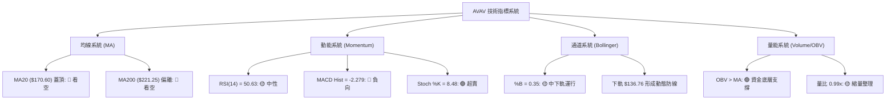

---

### 📈 移動平均線排列分析

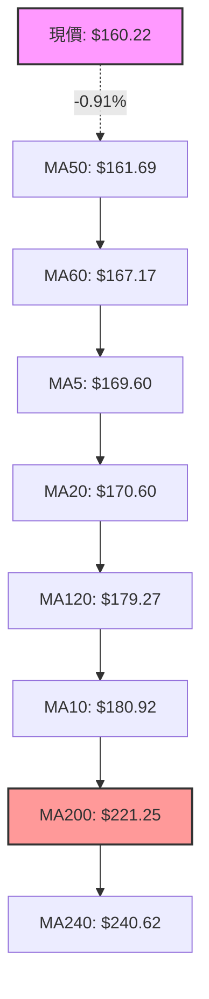

#### 均線數據矩陣解讀

| 均線名稱 | 數值 | 與現價偏離度 | 歷史形態走勢 | 技術解讀與壓制性質 |
|:---|:---:|:---:|:---|:---|
| **MA 5** | $169.60 | -5.53% | ▂▁▁▁▁▁▁▁▁▂▂▂▂▂▂▂▂▃▄▅▆▇█████▇▆▅ | 短線急跌後掉頭向下，形成極短線動態阻力 |
| **MA 10** | $180.92 | -11.44% | ▃▄▃▃▂▁▁▁▁▁▁▁▁▁▁▂▂▃▃▄▄▅▆▇██████ | 下行斜率陡峭，壓制8月中旬以來的高點反彈 |
| **MA 20** | $170.60 | -6.08% | ▄▃▃▂▂▁▁▁▂▂▂▃▂▂▁▁▁▁▁▂▃▄▅▆▇▇████ | 月線生命線失守，布林中軌阻力確立 |
| **MA 50** | $161.69 | -0.91% | 季線平緩 | 當前價格緊貼季線下方，多空爭奪激烈 |
| **MA 60** | $167.17 | -4.16% | ██▇▇▆▅▄▄▃▃▂▂▁▁▁▁▁▁▁▁▁▂▂▂▃▃▃▃▃▂ | 處於歷史低位走平階段，具備潛在支撐轉換潛力 |
| **MA 120** | $179.27 | -10.63% | ███▇▇▆▆▆▅▅▅▄▄▄▃▃▃▃▃▂▂▂▂▂▁▁▁▁▁▁ | 半年線持續下行，限制中期反彈高度 |
| **MA 200** | $221.25 | -27.58% | 長期牛熊線 | 深度空頭排列，長期趨勢修復需數月時間整理 |
| **MA 240** | $240.62 | -33.41% | ███▇▇▇▆▆▅▅▅▅▄▄▃▃▃▃▃▂▂▂▂▂▂▁▁▁▁▁ | 超長期頂部均線，構成中期行情的天花板阻力 |

---

### 📉 RSI(14) 與 隨機震盪指標分析

```
RSI(14) 當前狀態刻度尺
0              30                  50.63             70             100
├───────────────┼────────────────────▲────────────────┼──────────────┤
│   極度超賣區   │     空方主導區      │   多方主導區   │  極度超買區  │
└───────────────┴────────────────────┴────────────────┴──────────────┘
當前讀數: 50.63 [██████████░░░░░░░░░░ 50.63%] 處於完全中性狀態
```

1. **RSI 區間分析**：RSI(14) 讀數為 **50.63**，精確處於 50 多空中軸分水嶺。從 8 月中旬超買區（73.5）迅速冷卻至中性區，釋放了短線超買壓力。
2. **背離檢驗**：
   - **頂背離判定**：價格在 2026-08-16 創出 $192.81 反彈高點時，RSI 達到 73.5，未與前期高點形成明顯頂背離。
   - **底背離判定**：2026-06-28 股價探底 $137.95 時 RSI 為 20.2，2026-07-19 二次探底 $142.20 時 RSI 上揚至 51.8，呈現出顯著的中期**週線級別隱形底背離**結構，表明底部買盤韌性增強。
3. **Stochastic 隨機震盪**：Stoch %K 為 **8.48**，%D 為 **23.70**。%K 進入 10 以下的極端超賣區，與處於中軸的 RSI 形成結構分化，預示短線進一步大幅下殺動能衰竭，隨時可能觸發超賣反抽。

---

### 📊 MACD(12,26,9) 訊號解讀

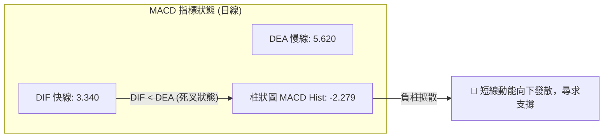

- **MACD 數值解讀**：DIF 快線（3.340）位於 DEA 慢線（5.620）下方，柱狀圖為 **-2.279**。
- **動能演變**：MACD 自 8 月上旬的高位金叉（Hist +4.396）轉為死叉收縮並轉負，表明自 $192.81 的高位回調尚未完全完成底部結構收斂，短線需等待 MACD 柱狀圖縮腳。

---

### 📦 布林通道分析 (Bollinger Bands)

```
AVAV 日線布林通道結構圖 (20, 2)
──────────────────────────────────────────────────────────────────
$204.44 ────────────────────────────────────── 上軌 Upper Band (強阻力)
               ▲
               │  帶寬帶動震盪 (帶寬 = $67.68)
               ▼
$170.60 ────────────────────────────────────── 中軌 Middle Band (MA20阻力)
               ▲
               │ (現價 $160.22 處於中下軌，%B = 0.35)
               ▼
$160.22 ◄══════● 現價位置
               ▲
               │ (下方安全緩衝距離至下軌: +$23.46)
               ▼
$136.76 ────────────────────────────────────── 下軌 Lower Band (動態強支撐)
──────────────────────────────────────────────────────────────────
```

- **布林參數**：上軌 **$204.44**、中軌 **$170.60**、下軌 **$136.76**。
- **%B 指標解析**：%B 讀數為 **0.35**（0 代表下軌，0.5 代表中軌，1 代表上軌）。現價跌破中軌但顯著高於下軌，顯示價格在向箱體下半區尋求支撐。
- **通道形態**：布林帶寬呈現收斂後橫向走平狀態，未出現開口發散特徵，進一步驗證當前為**標準箱體震盪行情**。

---

### 💹 成交量分析（量價配合度）

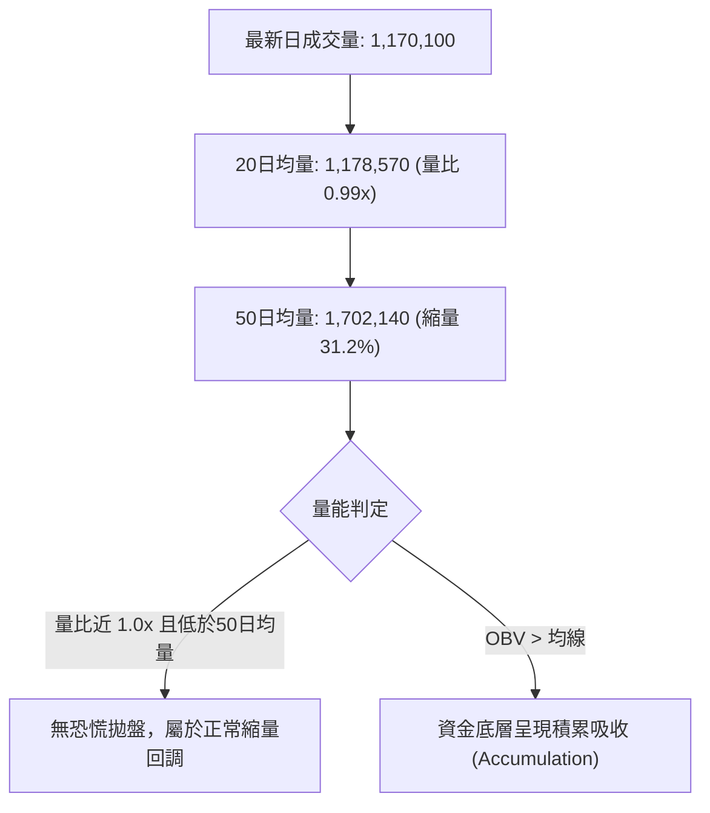

1. **量能配合度**：最新成交量為 1,170,100 股，與 20 日均量（1,178,570 股）基本持平（量比 0.99x），較 50 日均量（1,702,140 股）大幅縮減。這表明在回調跌破 MA20 的過程中，**並未伴隨機構資金的巨量恐慌出逃**，呈現良性縮量回踩特徵。
2. **OBV 能量潮解讀**：數據明確指示 **OBV > MA**。能量潮高於其均線，顯示在中期底部區域（$135 - $160），大資金淨流入與吸籌動作持續存在，為中長期價格構築了堅實的量能底部。

---

## 6. 動能與波動率

### ⚡ 動能評估

#### 動能與波動率狀態表

| 象限代號 | 動能維度 (Momentum) | 波動率維度 (Volatility) | AVAV 當前定位 | 交易環境技術解讀 |
|:---:|:---:|:---:|:---:|:---|
| **Q1** | 強動能 (Bullish) | 低波動 (Low Volatility) | — | 穩健單邊上升趨勢，最佳加碼區 |
| **Q2** | 弱動能 (Bearish) | 低波動 (Low Volatility) | — | 窄幅陰跌或築底沉寂期 |
| **Q3** | 強動能 (Breakout) | 高波動 (High Volatility) | — | 主升浪或主跌浪，高風險高回報 |
| **Q4** | **弱動能 (Consolidation)** | **高波動 (High Volatility)** | **✓ (當前處於此象限)** | **寬幅震盪箱體，ATR達6.90%，禁止追價，適合邊界交易** |

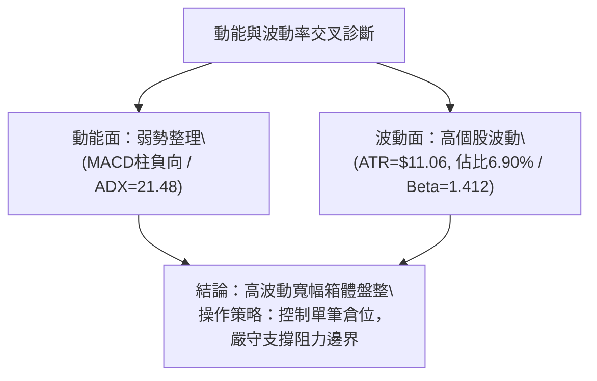

---

### 📊 ATR 波動率與風控距離

- **當前 ATR(14)**：**$11.06**（佔收盤價 $160.22 之比例高達 **6.90%**）。
- **日內正常波動區間**：$160.22 ± $11.06 → 預期日內波動範圍為 **$149.16 - $171.28**。
- **止損距離量化建議**：
  - **超短線交易**：建議止損寬度為 **1.0 × ATR = $11.06**。
  - **波段交易 (Swing)**：建議止損寬度為 **1.5 × ATR = $16.59**。
  - **核心防守止損**：以現價 $160.22 減去 1.0 ATR 約為 $149.16，恰好處於 S1 ($156.00) 與 S2 ($139.76) 之間，極具技術防守參考價值。

---

### 📐 Beta 與市場相關性

- **Beta 係數**：**1.412**（高 Beta 屬性）。
- **市場敏感度解讀**：AVAV 股價波動幅度平均為標普500指數的 **1.412 倍**。在市場整體風險偏好上升（Risk-on）時具備高彈性爆發力；但在大盤回調期，將承受顯著高於大盤的下行回撤壓力。
- **機構持股與空頭部位**：機構持股高達 **88.1%**，但做空比例（Short % Float）達到 **11.3%**（空頭回補天數 Short Ratio 為 2.18 天）。高空頭佔比在股價觸及強支撐 S2/S3 並出現反彈時，極易引發**軋空行情（Short Squeeze）**。

---

## 7. 多時框架總結

### 📋 時框架評分表

| 時框架 | 趨勢方向 | 動能狀態 | 均線排列 | 圖表形態 | 綜合評分 | 戰術建議 |
|:---:|:---:|:---:|:---:|:---:|:---:|:---|
| **長期 (月線)** | 🟡 深度回調後築底 | 🟡 中性平衡 (RSI~50) | 🔴 MA200/MA240 蓋頂 | 52W 低點 $135.20 築底 | **45 / 100** | 戰略底倉分批關注，不宜重倉 |
| **中期 (週線)** | 🟡 寬幅箱體震盪 | 🟢 雙底隱形底背離 | 🔴 MA20/MA50 壓制 | 潛在 W 底 ($137.95/$142.20) | **52 / 100** | 在 S2-S3 區間建立多頭波段頭寸 |
| **短期 (日線)** | 🔴 回踩尋求支撐 | 🔴 MACD死叉/KD超賣 | 🔴 MA5/MA20 下行壓制 | 跌破中軌測試 S1 ($156.00) | **41 / 100** | 等待回踩 S1 企穩或突破 R1 確認 |

---

### 🔲 綜合訊號矩陣

```
時框架訊號收斂矩陣
════════════════════════════════════════════════════════════════════
維度          短期 (日線)          中期 (週線)          長期 (月線)
────────────────────────────────────────────────────────────────────
趨勢方向      🔴 看空 (回調)      🟡 中性 (箱體)      🟡 中性 (築底)
動能指標      🔴 看空 (MACD負)    🟡 中性 (RSI 50)    🔴 弱勢 (空頭延伸)
均線系統      🔴 空頭壓制          🔴 混合偏空          🔴 空頭排列
量價關係      🟢 縮量良性          🟢 OBV資金支撐       🟢 天量支撐沉澱
關鍵位置      逼近 S1 ($156.00)    依託 S2 ($139.76)    守護 S3 ($135.20)
════════════════════════════════════════════════════════════════════
```

---

### ⚖️ 多時框收斂定調（依規則 14 嚴格執行）

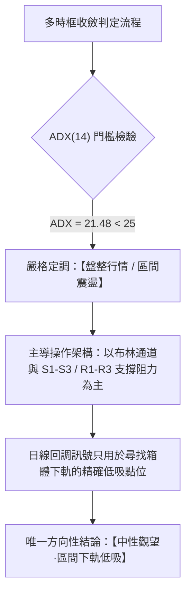

- **收斂規則判定**：當前 ADX 為 **21.48 (< 25)**，嚴格判定為**無單邊趨勢之盤整行情**。
- **時框衝突取捨**：雖然日線 MACD 柱狀圖為負（-2.279）且股價低於短期均線，但週線在 $137.95 - $142.20 構築了堅實的雙重底，且 OBV 維持上漲量能支撐。因此，**日線的短線下行並非單邊主跌浪的開始，而是箱體內部的次級回踩**。
- **唯一方向性結論**：**中性偏弱震盪，以區間下軌支撐位作為防守基準的高拋低吸策略為主**。

---

## 8. 交易策略建議

### 🗺️ 策略決策流程圖

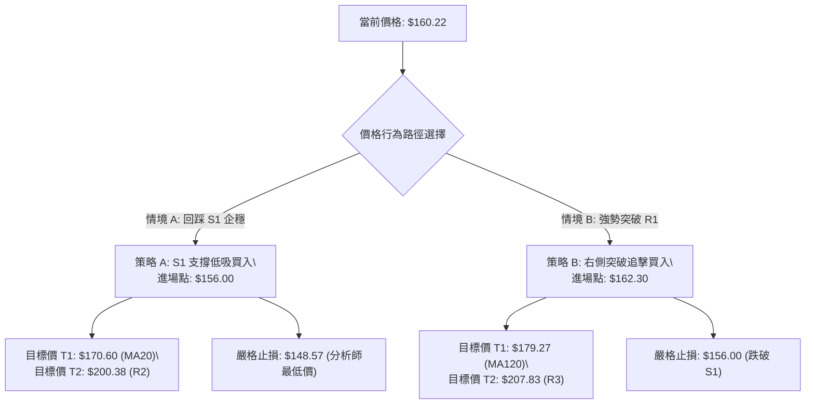

---

### 🧭 策略路由

> **當前主策略方向 = 區間震盪·支撐低吸策略（依綜合評分 46/100 定調，介於 40–60 區間操作範圍）**

由於評分卡綜合得分為 **46/100**，且 ADX = 21.48 (< 25)，市場處於標準箱體盤整格局。交易應避免在箱體中軸盲目追價，主策略為**在箱體支撐位（S1/S2）附近佈局低吸，並於關鍵阻力位（R1/R2/R3）分批止盈**。

---

### 🎯 價格情境階梯（Price Scenarios）

| 觸發條件 | 即期目標 | 後續延伸目標 | 技術情境含義（嚴格引用數據） |
|:---|:---:|:---:|:---|
| **強勢向上突破 R1 ($162.30)** | **$170.60** (MA20) | **$200.38** (R2) / **$207.83** (R3) | 短線擺脫均線壓制，多頭發起針對箱頂的補漲衝擊 |
| **維持在 S1 ($156.00) 至 R1 ($162.30) 運行** | — | — | 窄幅沉寂整理，KD指標在超賣區完成金叉修復 |
| **有效向下擊穿 S1 ($156.00)** | **$139.76** (S2) | **$135.20** (S3 52W極限底) | 短線回調加深，向下尋求 6-7 月雙底頸線支撐 |

---

### 📊 情境機率分佈

| 情境劇本 | 預估機率 | 主要技術依據 |
|:---|:---:|:---|
| **情境一：區間震盪築底（S1-R2 區間）** | **55%** | ADX = 21.48 確立盤整特徵；布林帶寬收平；OBV > MA 量能底層沉澱。 |
| **情境二：回踩強支撐後反彈（探底 S2 回升）** | **30%** | 日線 MACD 柱狀圖負向（-2.279）；均線空頭排列引發慣性下探測試。 |
| **情境三：直接破位下行（跌破 S3 創52W新低）** | **15%** | 基本面極端黑天鵝或大盤崩跌；但受制於機構持股 88.1% 與極端超賣，機率較低。 |

---

### 🟢 主策略詳情（區間高拋低吸與突破策略）

| 策略要素 | 策略 A：左側支撐低吸（主推薦） | 策略 B：右側突破確認（次推薦） |
|:---|:---|:---|
| **交易邏輯** | 回踩近端波段支撐 S1，博弈超賣反彈 | 放量突破即時阻力 R1 與 MA50，順勢跟進 |
| **進場條件** | 價格回踩 S1 出現下影線且 Stoch %K 向上勾頭 | 日線收盤價實體突破 R1 且量能大於20日均量 |
| **進場價格** | **$156.00** | **$162.30** |
| **第一目標價 (T1)** | **$170.60** (MA20 / 布林中軌) | **$179.27** (MA120 半年線) |
| **第二目標價 (T2)** | **$200.38** (阻力位 R2) | **$207.83** (阻力位 R3 / 箱體上軌) |
| **嚴格止損價格** | **$148.57** (引用分析師最低目標價/跌破S1緩衝) | **$156.00** (跌破支撐位 S1) |
| **風險金額 / 潛在回報** | 風險: $7.43 ｜ T1回報: $14.60 ｜ T2回報: $44.38 | 風險: $6.30 ｜ T1回報: $16.97 ｜ T2回報: $45.53 |
| **風險報酬比 (R:R)** | **1 : 1.97** (至T1) ｜ **1 : 5.97** (至T2) | **1 : 2.69** (至T1) ｜ **1 : 7.23** (至T2) |
| **預估勝率** | **60%** | **55%** |
| **建議配置倉位** | **總資金之 10% - 15%** | **總資金之 8% - 12%** |

---

### 🔴 反向風險觸發點（對沖與風控提示）

1. **破位止損警報**：若日線收盤價**實體跌破 $148.57**（分析師最低目標價）或進一步摜破 **S2 ($139.76)**，宣告雙底築底失敗，應無條件執行多頭止損或建立反向保護性 Put 避險。
2. **頂部受阻對沖**：若股價反彈至 **R2 ($200.38)** 或 **R3 ($207.83)** 遭遇長上影線且 RSI 突破 70 出現頂背離，應將剩餘多頭部位全數獲利了結，並可考慮輕倉建立空頭對沖。

---

### ⭐ 整體訊號強度評星

```
做多訊號強度：★★★☆☆  (3.0 / 5星 — 底部支撐強勁，但均線仍處壓制)
做空訊號強度：★★☆☆☆  (2.0 / 5星 — 空間受限於 S2/S3，做空性價比極低)
整體可信度：  ★★★★☆  (4.0 / 5星 — 數據結構完整，箱體邊界極其清晰)
```

---

## 9. 風險提示與監控

### ✅ 關鍵監控指標 Checklist

```
╔══════════════════════════════════════════════════════════════════╗
║                   AVAV 技術風控監控清單 (Checklist)               ║
╠══════════════════════════════════════════════════════════════════╣
║ [ ] 價格能否守穩近端支撐 S1 ($156.00) 之實體收盤線                ║
║ [ ] RSI(14) 是否在 50 中軸附近獲得支撐並重新向上發散              ║
║ [ ] MACD 柱狀圖負值是否開始收窄（從當前 -2.279 向上拐頭）         ║
║ [ ] 日成交量能否回升至 50日均量 (1,702,140 股) 水平               ║
║ [ ] 空頭佔比 (Short Float 11.3%) 是否引發突破軋空行情            ║
║ [ ] 股價向上挑戰 MA20 ($170.60) 時的量價配合度                    ║
║ [ ] 跌破 $148.57 / S2 ($139.76) 時的停損紀律執行                 ║
╚══════════════════════════════════════════════════════════════════╝
```

---

### ⚠️ 風險場景分析

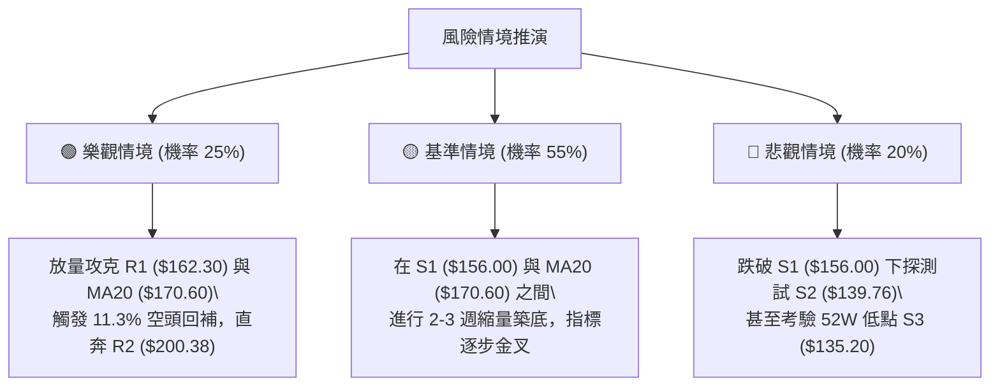

---

### 🛡️ 風險管理重要提醒

1. **波動率管理（ATR 風控）**：由於 AVAV 的 ATR 高達 **$11.06 (6.90%)**，屬於典型的高波動成長/軍工科技標的，日內震幅劇烈。**單筆交易虧損額度嚴禁超過總投資組合淨值的 1.5%**。
2. **倉位配置原則**：在 ADX = 21.48 的震盪市況中，總持倉部位建議控制在 **30% - 40%** 以內，採取「分批建倉、分批止盈」策略，嚴禁在單一價位單筆重倉下注。
3. **空頭回補監控**：當前 Short % Float 達 **11.3%**，若股價帶量突破 R1 ($162.30)，極易引發做空機構的被動平倉潮，形成快速逼空上漲，多頭投資者應設定移動止盈以捕捉超額溢價。

---

## 📋 報告總結

```
╔══════════════════════════════════════════════════════════════════╗
║                   AVAV 技術分析報告總結儀表板                    ║
╠══════════════════════════════════════════════════════════════════╣
║ 報告日期：2026-08-22                當前現價：$160.22            ║
║ 分析評級：⚖️ 中性盤整·區間低吸       綜合評分：46 / 100           ║
╠══════════════════════════════════════════════════════════════════╣
║ 關鍵結構解讀：                                                   ║
║ ├─ 長期趨勢：🟡 52W 低位區間築底 (處於 52W 區間 8.9% 極低分位)    ║
║ ├─ 中期趨勢：🟡 $135.20 - $207.83 寬幅箱體整理，潛在 W 底醞釀中   ║
║ ├─ 短期趨勢：🔴 跌破 MA20 ($170.60) 回踩 S1 ($156.00) 尋求支撐   ║
║ ├─ 關鍵支撐：S1: $156.00  │  S2: $139.76  │  S3: $135.20         ║
║ ├─ 關鍵阻力：R1: $162.30  │  R2: $200.38  │  R3: $207.83         ║
║ └─ 分析師共識目標：均價 $225.77 (最高 $326.00 / 最低 $148.57)    ║
╠══════════════════════════════════════════════════════════════════╣
║ 最優戰術執行組合：                                               ║
║ 1. 🥇 最佳策略 (低吸)：在 S1 ($156.00) 佈局，止損 $148.57，      ║
║                       目標 T1: $170.60 / T2: $200.38 (R:R = 1:5.97)║
║ 2. 🥈 右側策略 (突破)：突破 R1 ($162.30) 進場，止損 $156.00，     ║
║                       目標 T1: $179.27 / T2: $207.83 (R:R = 1:7.23)║
║ 3. 🥉 防守底線：極限跌破 S2 ($139.76) / S3 ($135.20) 嚴格停損觀望║
╚══════════════════════════════════════════════════════════════════╝
```

---

> ⚠️ **免責聲明**：本報告為依據客觀技術指標與量化數據生成之專業分析，所有價位均基於歷史 OHLCV 幾何結構與數學模型測算。本報告**僅供學術研究與投資決策參考**，**不構成任何形式的要約或投資買賣建議**。金融市場瞬息萬變，交易者應獨立評估自身風險承受能力並嚴格執行風控紀律。

---

*報告生成時間：2026-08-22 ｜ 數據來源：Yahoo Finance ｜ 分析框架：多時框技術分析體系 (MTFA)*