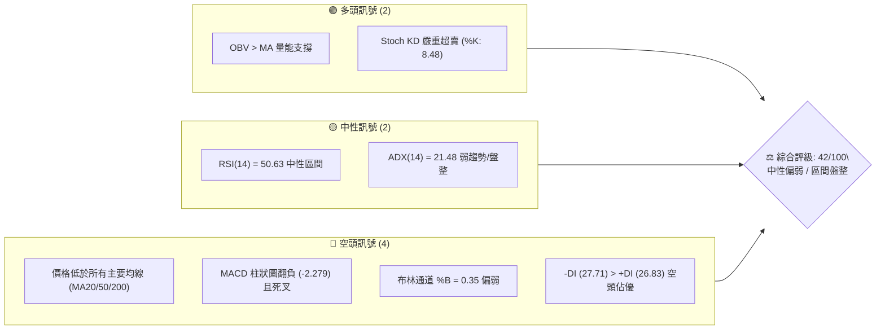
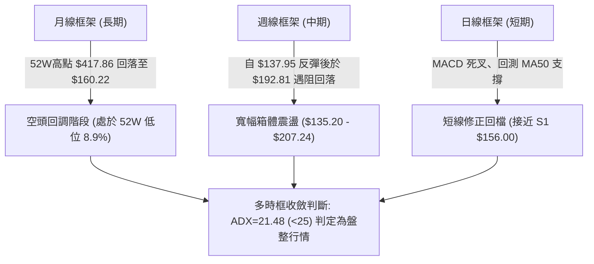
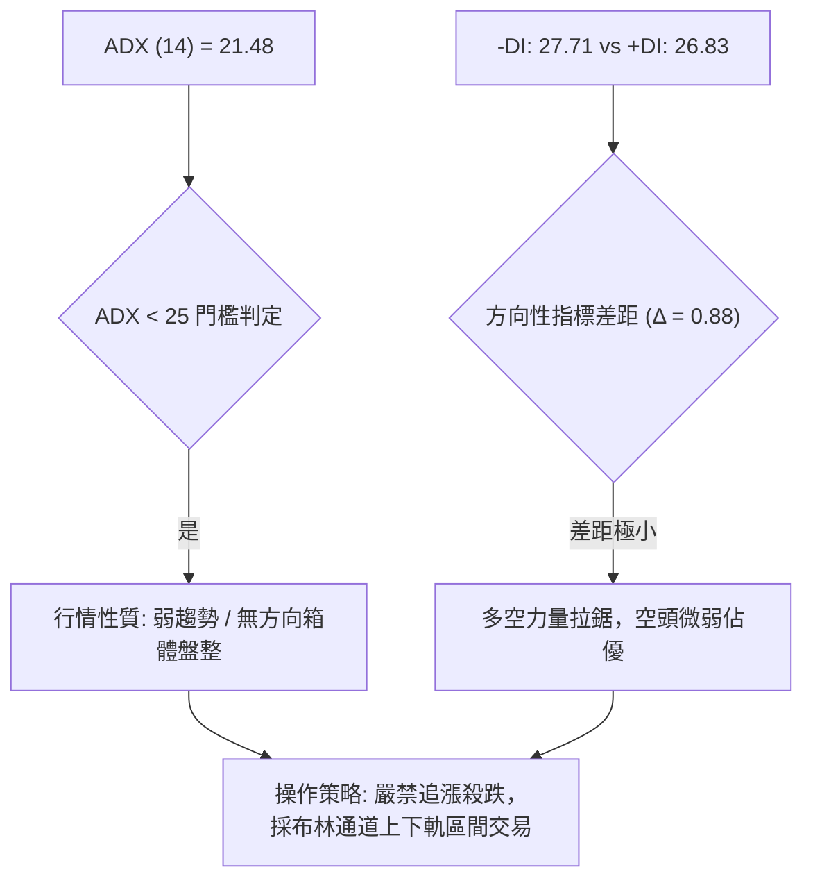
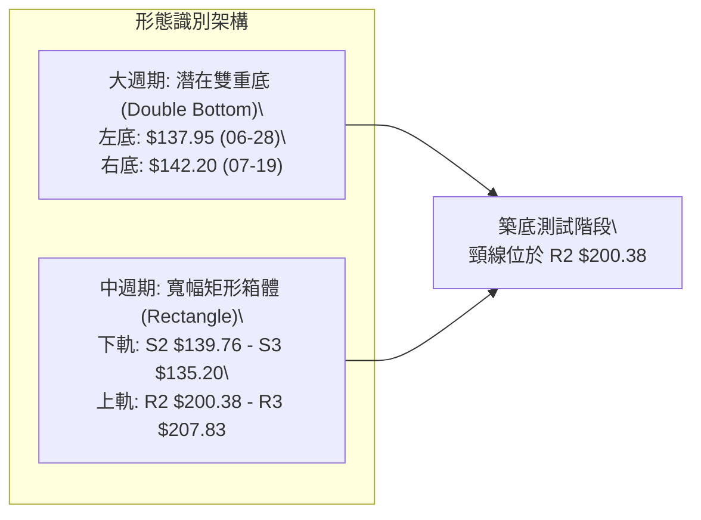
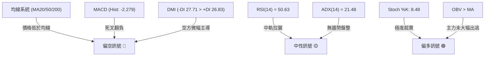
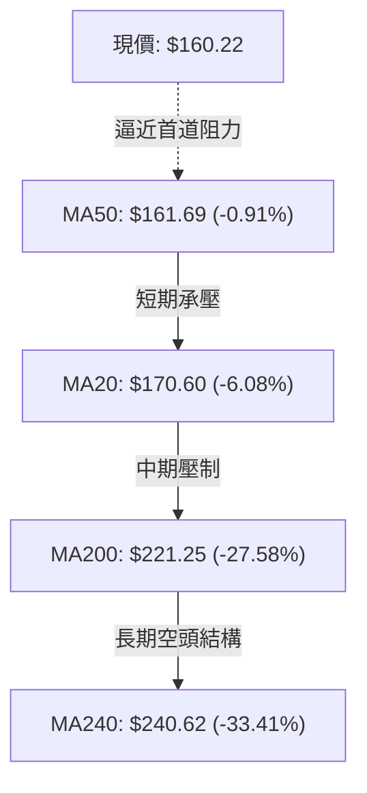
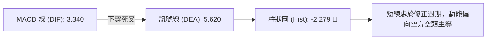
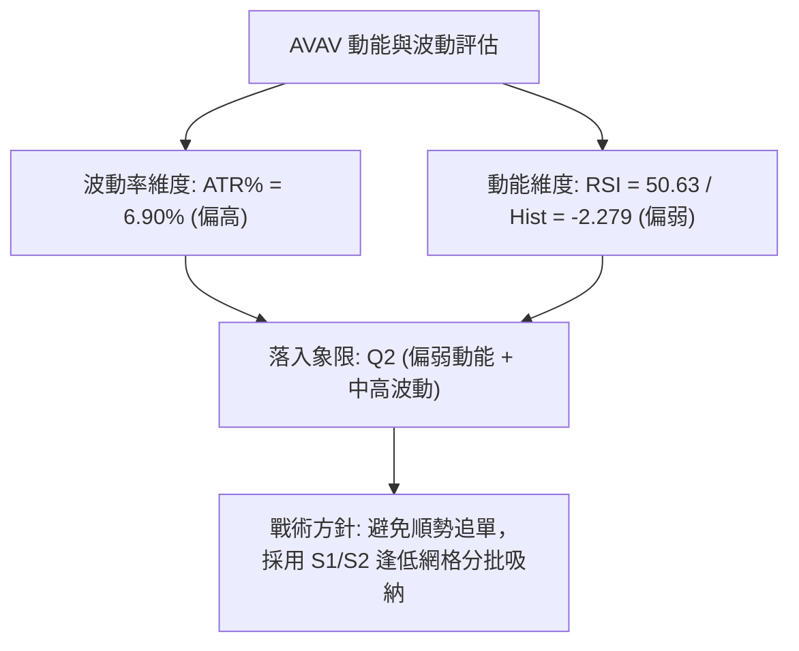
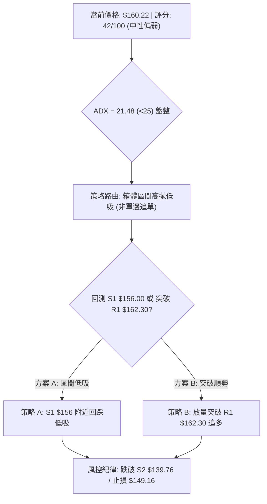
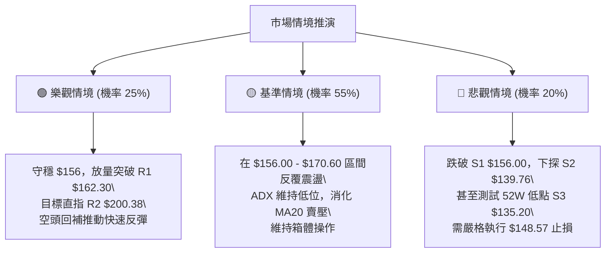

# AVAV 技術分析報告

> **報告日期**：2026-08-23 ｜ **語言**：繁體中文 ｜ **數據來源**：Yahoo Finance ｜ **當前價格**：$160.22

---

## 目錄

| 章節 | 內容 |
|------|------|
| [1. 技術面概覽](#1-技術面概覽) | 訊號儀表板、核心指標、評分卡 |
| [2. 趨勢分析](#2-趨勢分析) | 多時框趨勢、長中短期走勢、ADX解讀 |
| [3. 圖表形態分析](#3-圖表形態分析) | 形態識別、信心度評估、目標價推算 |
| [4. 支撐與阻力](#4-支撐與阻力) | 關鍵價位結構、斐波那契回調位分析 |
| [5. 技術指標深度解讀](#5-技術指標深度解讀) | MA/RSI/MACD/布林/量能OBV |
| [6. 動能與波動率](#6-動能與波動率) | 動能四象限、ATR止損計算、Beta分析 |
| [7. 多時框架總結](#7-多時框架總結) | 時框矩陣、優先級收斂原則與結論 |
| [8. 交易策略建議](#8-交易策略建議) | 策略路由、區間操作、風險報酬比 |
| [9. 風險提示與監控](#9-風險提示與監控) | 監控清單、情境推演、倉位管理建議 |

---

## 1. 技術面概覽

### 🎯 技術訊號儀表板



### 📊 核心指標速覽表

| 指標類別 | 指標名稱 | 當前數值 | 訊號 | 解讀 |
|----------|----------|----------|------|------|
| **價格** | 當前價格 | $160.22 | 🟡 | 位於52週區間 8.9% 底部區域，受制於短期均線 |
| **均線** | MA20 | $170.60 | 🔴 | 價格低於 MA20 (-6.08%)，短線承壓 |
| **均線** | MA50 | $161.69 | 🔴 | 價格低於 MA50 (-0.91%)，中期偏弱但貼近中軌 |
| **均線** | MA200 | $221.25 | 🔴 | 價格遠低於長期牛熊線 (-27.58%)，長期空頭結構 |
| **動能** | RSI(14) | 50.63 | 🟡 | 位於中性平衡區，無超買超賣，多空拉鋸 |
| **動能** | MACD(12,26,9) | 3.340 / 5.620 | 🔴 | MACD 線低於 Signal 線，Hist 負值 (-2.279)，短線下行修正 |
| **動能** | Stoch %K / %D | 8.48 / 23.70 | 🟢 | 進入極度超賣區，短線具備技術性反彈動能 |
| **趨勢** | ADX(14) | 21.48 | 🟡 | ADX < 25 表明趨勢動能偏弱，市場進入箱體盤整 |
| **通道** | 布林通道 %B | 0.35 | 🔴 | 價格運行於中軌 ($170.60) 與下軌 ($136.76) 之間 |
| **量能** | OBV 趨勢 | OBV > MA | 🟢 | 資金流向呈積累特徵，量能未隨價格破底下挫 |
| **波動** | ATR(14) | $11.06 (6.90%) | 🟡 | 日間波動幅度較大，需設置寬幅止損保護 |

### 🏆 技術評分卡

```
╔══════════════════════════════════════════════════════════════╗
║              技術評分卡 — AVAV (2026-08-23)                 ║
╠══════════════════════════════════════════════════════════════╣
║ 趨勢強度      █████░░░░░░░░░░░░░░░  28/100  🔴 空頭排列/弱勢 ║
║ 動能指標      ████████░░░░░░░░░░░░  40/100  🟡 KD超賣但MACD偏弱║
║ 支撐穩定度    ███████████░░░░░░░░░  55/100  🟡 S1 $156 具防守力║
║ 成交量配合    ████████████░░░░░░░░  60/100  🟢 OBV維持正向支撐 ║
║ 形態完整度    ████████░░░░░░░░░░░░  42/100  🟡 寬幅箱體底部構築 ║
║ 均線排列      █████░░░░░░░░░░░░░░░  25/100  🔴 價格在所有MA下方 ║
╠══════════════════════════════════════════════════════════════╣
║ 綜合評分      ████████░░░░░░░░░░░░  42/100  🟡 中性偏弱(區間) ║
╚══════════════════════════════════════════════════════════════╝
```

---

## 2. 趨勢分析

### 🌐 多時框趨勢分析



### 📈 長期趨勢 — 12個月走勢圖（Unicode）

```
AVAV 月線走勢圖（過去12個月：2025-08 至 2026-08）
價格 ($)
$420 ┤
$370 ┤                               ●(2025-10 頂部 $369.91)
$320 ┤                      ●
$270 ┤             ●        │        ●
$220 ┤   ●         │        │        │        ●
$170 ┤───┼─────────┼────────┼────────┼────────┼────────●(現價 $160.22)
$120 ┤   │         │        │        │        │   ●(2026-07 探底 $149.37)
     └──────────────────────────────────────────────────────────
        08/25    10/25    12/25    02/26    04/26    06/26    08/26
```

**走勢特徵分析表格**：

| 階段 | 期間 | 價格區間 | 累積漲跌幅 | 走勢特徵與量價行為 |
|------|------|----------|------------|-------------------|
| **主升攻頂段** | 2025-08 ~ 2025-10 | $241.35 → $369.91 | +53.27% | 爆發性多頭上攻，創下歷史次高與波段頂部 |
| **頭部派發段** | 2025-11 ~ 2026-02 | $369.91 → $252.25 | -31.81% | 均線高檔死叉，量能逐步萎縮，震盪下挫 |
| **主跌尋底段** | 2026-03 ~ 2026-07 | $252.25 → $149.37 | -40.78% | 跌破 MA200 關鍵牛熊線，於 2026-06 觸及 $137.95 低點 |
| **築底修復段** | 2026-07 ~ 2026-08 | $149.37 → $160.22 | +7.26% | 探底 $135.20 附近支撐後反彈，目前於 $160 附近打底 |

### 📊 中期趨勢（週線分析）

從近 20 週數據觀察，價格在 2026-06-28 達到波段低點收盤 $137.95（成交量爆發至 1,188 萬股），隨後於 2026-07-05 出現 1,831 萬股天量反彈至 $190.89。此後價格在 2026-08-16 衝高至 $192.81 後，本週（2026-08-23）回落至 $160.22，週 MACD 柱狀圖轉為 -2.279，顯示中期走勢處於大型築底箱體（$135.20 至 $207.24）的下半區震盪。

```
中期阻力與支撐示意圖：
阻力區 [R3: $207.83] ═════════════════════════════ (箱體頂部 / 斐波那契 78.6% $195.69 上方)
阻力區 [R2: $200.38] ───────────────────────────── (2026-05月高點聚類)
阻力區 [R1: $162.30] ┄┄┄┄┄┄┄┄┄┄┄┄┄┄┄┄┄┄┄┄┄┄┄┄┄┄ (MA50 $161.69 / 短線反彈第一關)
現  價 [$160.22]     ◄── 目前位置
支撐區 [S1: $156.00] ┄┄┄┄┄┄┄┄┄┄┄┄┄┄┄┄┄┄┄┄┄┄┄┄┄┄ (近一年波段低點第一道防線)
支撐區 [S2: $139.76] ───────────────────────────── (2026-06至07月收盤低點密集區)
支撐區 [S3: $135.20] ═════════════════════════════ (52週最低價 / 箱體底部強支撐)
```

### ⚡ 趨勢強度評估（ADX 解讀）



| 指標名稱 | 數值 | 狀態 | 趨勢強度解讀 |
|----------|------|------|--------------|
| **ADX(14)** | 21.48 | 弱趨勢 (<25) | 市場缺乏單邊推動動能，處於非趨勢性整理行情 |
| **+DI(14)** | 26.83 | 買盤力道 | 經歷 8 月初反彈後買盤動能有所維持，但尚未佔據壓倒優勢 |
| **-DI(14)** | 27.71 | 賣盤力道 | 空方略高於多方 0.88，顯示回調壓力仍在但未失控 |

---

## 3. 圖表形態分析

### 🔍 形態識別系統

依據形態學原則與歷史高低點數據，目前圖表呈現兩大潛在結構：



**形態信心度與目標價評估表**：

| 形態名稱 | 信心度 | 完成度 | 判斷依據（引用數據） | 目標價計算式與數值 |
|----------|--------|--------|----------------------|--------------------|
| **潛在雙重底 (W底)** | 55% | 60% | 2026-06-28 低點收盤 $137.95（天量 1,188萬股）與 2026-07-19 低點 $142.20 形成雙底雛形；但目前價格尚未突破頸線。 | 頸線 R2 ($200.38) + 形態高度 ($200.38 - S3 $135.20 = $65.18) = **$265.56**（形態未突破前僅供參考） |
| **寬幅矩形盤整** | 75% | 85% | 價格在 2026-05 至 2026-08 期間多次受阻於 R2 $200.38 / R3 $207.83，並在 S2 $139.76 / S3 $135.20 獲得承接。 | 區間震盪交易：下軌支撐 **$136.76~$139.76**，上軌阻力 **$200.38~$204.44** |

### 🕯️ 重要K線形態分析

| 週/月份 | 收盤價 | K線形態 | 解讀 | 訊號 |
|---------|--------|---------|------|------|
| **2026-06-28** | $137.95 | 長下影放量大陰線 | 恐慌盤湧出（成交量 1,188 萬股），確立 52 週底部區域 $135.20 附近支撐 | 🟢 賣壓耗盡 |
| **2026-07-05** | $190.89 | 巨量吞噬長陽線 | 爆出 1,831 萬股歷史天量強力反包，機構資金進場抄底訊號明確 | 🟢 多頭反轉 |
| **2026-08-16** | $192.81 | 上影線陽線 | 衝擊頸線與阻力位 R2 ($200.38) 未果，高檔遭遇獲利了結賣壓 | 🟡 動能衰竭 |
| **2026-08-23** | $160.22 | 實體中陰線回調 | 跌破 MA20 ($170.60)，向下測試 MA50 ($161.69) 與 S1 ($156.00) 支撐 | 🔴 短線修正 |

### 📉 ASCII 走勢形態示意圖

```
AVAV 潛在雙底與箱體形態示意圖
價格 ($)
$210 ┤                                  [頸線阻力 R3: $207.83 / R2: $200.38]
$200 ┤                     ▲            ▲ (08-16 觸及 $192.81)
$190 ┤                    ╱ ╲          ╱ ╲
$180 ┤                   ╱   ╲        ╱   ╲
$170 ┤                  ╱     ╲      ╱     ▼ 現價 $160.22 (回踩MA50)
$160 ┤                 ╱       ╲    ╱
$150 ┤                ╱         ╲  ╱
$140 ┤   ●───────────┘           ▼ (右底 07-19: $142.20)
$130 ┤   (左底 06-28: $137.95)
     └────────────────────────────────────────────────────────────
          2026-06                 2026-07                 2026-08
```

---

## 4. 支撐與阻力

### 🗺️ 關鍵價位分布圖（Unicode）

```
AVAV 價位結構分布圖 (依據 OHLCV 計算與斐波那契位)
═════════════════════════════════════════════════════════════════
$417.86 ║██████████████████████████████║ 52W High (0.0% 回調位)
$351.15 ║██████████████████            ║ 斐波那契 23.6% 回調位
$309.88 ║████████████████              ║ 斐波那契 38.2% 回調位
$276.53 ║████████████████████          ║ 斐波那契 50.0% 中樞平衡位
$243.18 ║██████████████████████        ║ 斐波那契 61.8% 黃金分割位 / MA240 ($240.62)
$221.25 ║████████████████████████      ║ 長期牛熊線 MA200
$207.83 ║██████████████████████████████║ 強阻力 R3 (近一年波段高點)
$204.44 ║██████████████████████        ║ 布林通道上軌 (BB Upper)
$200.38 ║████████████████████          ║ 阻力 R2 (箱體頸線)
$195.69 ║████████████████              ║ 斐波那契 78.6% 回調位
$170.60 ║██████████████████            ║ 布林中軌 / MA20
$162.30 ║████████████████████████      ║ 關鍵阻力 R1 / MA50 ($161.69)
$160.22 ╠══════════════════════════════╣ ◄── 現價 ($160.22)
$156.00 ║▓▓▓▓▓▓▓▓▓▓▓▓▓▓▓▓▓▓            ║ 近期第一支撐 S1 (-2.63%)
$139.76 ║████████████████████          ║ 強支撐 S2 (-12.77%)
$136.76 ║██████████████████████        ║ 布林通道下軌 (BB Lower)
$135.20 ║██████████████████████████████║ 極限強支撐 S3 / 52W Low (100.0%)
═════════════════════════════════════════════════════════════════
```

### 🚧 阻力位分析表

| 阻力級別 | 價位 | 距現價幅幅 | 形成原因與技術共振 | 突破難度 | 重要性 |
|----------|------|------------|--------------------|----------|--------|
| **R1** | **$162.30** | +1.30% | 近一年波段密集高點聚類，與 MA50 ($161.69) 形成共振壓制 | 🟡 中等 | 短線轉強樞紐 |
| **R2** | **$200.38** | +25.07% | 2026-05月與08月中旬波段反彈高點聚類，整數心理關卡 | 🔴 極高 | 中期箱體頂部頸線 |
| **R3** | **$207.83** | +29.72% | 2026-05-31 收盤高點，布林上軌 ($204.44) 外圍強壓區 | 🔴 極高 | 多頭波段反轉確認點 |

### 🛡️ 支撐位分析表

| 支撐級別 | 價位 | 距現價幅幅 | 形成原因與技術共振 | 守住機率 | 重要性 |
|----------|------|------------|--------------------|----------|--------|
| **S1** | **$156.00** | -2.63% | 近一年波段低點聚類，短線回踩第一道防守緩衝帶 | 70% | 短線多頭最後防線 |
| **S2** | **$139.76** | -12.77% | 2026-07月雙底回測低點聚類，靠近布林下軌 ($136.76) | 85% | 中期強支撐平台 |
| **S3** | **$135.20** | -15.62% | 52週歷史最低點（斐波那契 100.0% 回調位） | 95% | 終極多頭防線 / 止損基準 |

### 📐 斐波那契回調位分析

依據 52 週極值區間（低點 $135.20 至 高點 $417.86，總跨度 $282.66）計算之標準斐波那契回調位如下：

| 斐波那契層級 | 精確價位 | 相對現價 ($160.22) 狀態 | 技術解讀與意義 |
|--------------|----------|-------------------------|----------------|
| **0.0% (52W High)** | $417.86 | 上方 +160.80% | 歷史高點牛市頂部 |
| **23.6%** | $351.15 | 上方 +119.17% | 超強多頭回調極限位 |
| **38.2%** | $309.88 | 上方 +93.41% | 經典牛市回撤位 |
| **50.0%** | $276.53 | 上方 +72.59% | 多空長期平衡中軸 |
| **61.8%** | $243.18 | 上方 +51.78% | 黃金分割強壓力位（貼近 MA240 $240.62） |
| **78.6%** | $195.69 | 上方 +22.14% | 深度回調壓制位（貼近阻力 R2 $200.38） |
| **100.0% (52W Low)**| $135.20 | 下方 -15.62% | 52週絕對底部，現價落於 78.6% ($195.69) 與 100.0% ($135.20) 之間 |

**意義解讀**：現價落於深度的 78.6% 至 100.0% 回調區間內，表示長期趨勢經歷了嚴重的擠泡沫與殺跌過程。當前價格距離 100.0% 底部 ($135.20) 僅有 15.62% 空間，風險溢價已大幅釋放，具備築底反彈的潛在空間。

---

## 5. 技術指標深度解讀

### 🎛️ 指標訊號總覽



### 📈 移動平均線排列分析



| 均線名稱 | 當前數值 | 偏離度 | 斜率與形態特徵 | 訊號意涵 |
|----------|----------|--------|----------------|----------|
| **MA5** | $169.60 | -5.53% | 短線向下勾頭 | 🔴 超短線回調未止 |
| **MA10** | $180.92 | -11.44% | 高檔下彎 | 🔴 短線賣壓沉重 |
| **MA20** | $170.60 | -6.08% | 走平略微下傾 | 🔴 布林中軌阻力 |
| **MA50** | $161.69 | -0.91% | 底部走平 | 🟡 現價貼近，關鍵攻防 |
| **MA60** | $167.17 | -4.16% | 走平 | 🟡 中期震盪中樞 |
| **MA120** | $179.27 | -10.63% | 下行 | 🔴 半年線反壓 |
| **MA200** | $221.25 | -27.58% | 穩定下行 | 🔴 長期牛熊分水嶺 |
| **MA240** | $240.62 | -33.41% | 下行 | 🔴 年線重壓 |

### 📉 RSI(14) 分析

```
RSI(14) 數值儀表板：50.63
0 ─────── 30 ────────────────── 50 ────────────────── 70 ─────── 100
[  超賣區  ]                     ▲                     [  超買區  ]
                              當前位置 (50.63)
進度條：██████████░░░░░░░░░░ 50.63%
```

- **超買超賣分析**：RSI 目前精確位於 50.63，處於極為標準的強弱中軸位置。既無 70 以上的超買風險，亦無 30 以下的超賣優勢。
- **背離檢驗**：
  - **日線背離**：無明顯背離跡象。
  - **週線背離**：2026-06-28 價格創低點 $137.95 時 RSI 為 20.2；而 2026-07-26 價格次低點 $149.51 時 RSI 為 32.9，呈現隱性週線底背離跡象，支持底部支撐有效性。

### 📊 MACD(12/26/9) 訊號解讀



當前 MACD 線 ($3.340$) 跌破 Signal 線 ($5.620$)，柱狀圖為 $-2.279$。這表明從 2026-08-09（Hist: $+4.396$）以來的反彈波段告一段落，目前進入日線級別的良性回踩或二次探底過程。

### 📦 布林通道分析

```
AVAV 布林通道 (BB 20, 2) 結構圖
價格 ($)
$204.44 ┤ ━━━━━━━━━━━━━━━━━━━━━━━━━━━━━━━━ 上軌 (BB Upper)
        │
$170.60 ┤ ─ ─ ─ ─ ─ ─ ─ ─ ─ ─ ─ ─ ─ ─ ─ ─ ─ 中軌 (MA20)
        │                 ● 現價 $160.22 (%B = 0.35)
$136.76 ┤ ━━━━━━━━━━━━━━━━━━━━━━━━━━━━━━━━ 下軌 (BB Lower)
        └───────────────────────────────────
```

- **通道帶寬與形態**：通道上下軌寬度為 $67.68 美元，帶寬適中。
- **%B 位置**：當前 %B 為 **0.35**，價格運行於中軌（$170.60）與下軌（$136.76）之間的偏弱區域，短線下軌具備磁吸與支撐效應。

### 💹 成交量分析（量價配合度）

- **量比檢驗**：最新日成交量為 1,170,100 股，與 20 日均量（1,178,570 股）相比量比為 **0.99x**，呈現標準的量平整理狀態。
- **量能萎縮**：相較於 50 日均量（1,702,140 股），量能收縮約 31%，顯示回調過程中賣壓並未失控，非恐慌性拋售。
- **OBV（能量潮）分析**：OBV 線目前維持在 OBV 均線之上（`OBV > MA`），這是一個關鍵的積極訊號，表明主力機構在 7 月份巨量（單週 1,831 萬股）進場後，籌碼結構相對鎖定，量能持續支撐潛在中期底部。

---

## 6. 動能與波動率

### ⚡ 動能評估四象限

| 象限代號 | 動能狀態 | 波動率狀態 | 當前符合標記 | 戰術意義與操作指引 |
|----------|----------|------------|--------------|--------------------|
| **Q1 (最佳爆發)** | 強 (RSI>60, MACD>0) | 低 (ATR% < 4%) | — | 趨勢突破，主升段加碼 |
| **Q2 (盤整打底)** | **弱 (RSI 50, Hist<0)** | **中高 (ATR% 6.90%)** | **✓ 當前狀態** | **箱體震盪，嚴控倉位，逢低佈局** |
| **Q3 (高危博弈)** | 強 (超買背離) | 高 (ATR% > 8%) | — | 劇烈震盪，易出頂部，高拋保護 |
| **Q4 (加速趕底)** | 弱 (極度空頭) | 高 (放量破位) | — | 空頭主跌段，全面觀望避險 |



### 📊 ATR 波動率分析

- **ATR(14) 數值**：**$11.06**，佔現價比例為 **6.90%**。
- **每日波動幅度**：代表 AVAV 平均每日正常波動區間高達 ±$11.06 美元，屬於高 Beta/高波動標的。
- **止損距離建議**：
  - **短線交易止損距離**：$1.0 \times \text{ATR} = \$11.06$（現價下方約 $149.16）。
  - **波段交易止損距離**：$1.5 \times \text{ATR} = \$16.59$（現價下方約 $143.63，與 S2 $139.76 形成多重保護）。

### 📐 Beta 與市場相關性

- **Beta 係數**：**1.412**。
- **市場敏感度解讀**：AVAV 相較於標普 500 指數具備 1.41 倍的波動彈性。在大盤走強時具備顯著超額收益潛力（Alpha），但在市場回調時亦會放大下行波動。當前機構持股比例高達 **88.1%**，空頭部位佔流通盤比例（Short % Float）達 **11.3%**（空頭回補天數 Short Ratio 2.18 天），具備潛在的空頭回補（Short Squeeze）反彈動力。

---

## 7. 多時框架總結

### 📋 時框架評分表

| 時框架 | 趨勢方向 | 動能狀態 | 均線排列 | 形態結構 | 綜合評分 | 操作建議 |
|--------|----------|----------|----------|----------|----------|----------|
| **長期 (月線)** | 🔴 下行修復 | 🟡 中性平衡 | 🔴 價格 < MA200 | 52W 底部測試 | 35/100 | 長期建倉需耐心分批 |
| **中期 (週線)** | 🟡 箱體震盪 | 🟡 死叉修正中 | 🟡 價格夾於 MA50/200 | 潛在雙底打底中 | 48/100 | 箱體下軌逢低承接 |
| **短期 (日線)** | 🔴 短線回檔 | 🟢 KD超賣/MACD負 | 🔴 價格跌破 MA20 | 回測 S1 $156 支撐 | 43/100 | 等待止跌訊號出現 |

### 🔲 綜合訊號矩陣

```
時框一致性矩陣分析：
┌──────────────┬──────────────┬──────────────┬──────────────┐
│   分析維度   │  短期 (日線) │  中期 (週線) │  長期 (月線) │
├──────────────┼──────────────┼──────────────┼──────────────┤
│ 均線方向     │ 🔴 空頭承壓  │ 🟡 混合糾結  │ 🔴 空頭排列  │
│ 動能方向     │ 🟢 超賣反彈  │ 🔴 柱狀圖負值│ 🟡 中性平衡  │
│ 量能配合     │ 🟡 縮量回調  │ 🟢 底部放巨量│ 🟡 常態換手  │
│ 支撐有效性   │ 🟢 S1 逼近   │ 🟢 S2 穩固   │ 🟢 S3 歷史底 │
└──────────────┴──────────────┴──────────────┴──────────────┘
```

### ⚖️ 多時框收斂結論

> **依據多時框收斂規則（規則 14）**：
> 當前 ADX(14) 數值為 **21.48 (< 25)**，嚴格界定為**「盤整行情」**。
> 
> **主導時框**：以**日線至週線布林通道上下軌（$136.76 至 $204.44）**為核心交易區間。
> 
> **唯一方向性結論**：**【中性觀望 / 區間下軌高勝率低吸】**。
> 長期空頭趨勢限制了向上追價空間，但中期 $135.20 至 $139.76 底部經過巨量考驗極為扎實。短期價格回落至 $160.22 逼近 S1 ($156.00)，策略應鎖定「區間震盪、下軌分批低吸、拒絕追高」。

---

## 8. 交易策略建議

### 🗺️ 策略決策流程圖



### 🧭 策略路由

**當前主策略方向 = 【中性區間操作（以布林下軌及 S1/S2 支撐為主的逢低佈局）】（依技術評分卡 42/100 判定）**

### 🎯 價格情境階梯（Price Scenarios）

| 觸發條件 | 第一目標 (T1) | 第二目標 (T2) | 後續延伸 | 情境含義與操作指引 |
|----------|---------------|---------------|----------|--------------------|
| **強勢突破 R1 ($162.30)** | **R2 ($200.38)** | **R3 ($207.83)** | 斐波那契 $243.18 | 短線築底成功，發動向箱體頂部之波段反彈 |
| **守穩現價至 S1 ($156.00)**| **R1 ($162.30)** | **MA20 ($170.60)**| R2 ($200.38) | 箱體中下軌築底蓄勢，適合分批低吸 |
| **跌破 S1 ($156.00)** | **S2 ($139.76)** | **S3 ($135.20)** | 探新低 (破位) | 短線回調加深，向下尋求 52 週雙底支撐 |

### 📊 情境機率分佈

| 情境劇本 | 發生機率 | 主要技術依據 |
|----------|----------|--------------|
| **區間震盪（S1 $156.00 ~ R2 $200.38）** | **55%** | ADX=21.48 確立盤整；OBV 量能維持；均線纏繞缺乏單邊推力 |
| **反彈上行（突破 R1 並挑戰 R2）** | **25%** | Stoch KD 嚴重超賣（%K: 8.48）；機構持股高且具備空頭回補動能 |
| **深度探底（跌破 S1 測試 S2/S3）** | **20%** | MACD 柱狀圖負值發散；價格低於 MA20；整體處於長期 MA200 下方 |

### 🟢 主策略詳情

依據評分卡路由，推薦以下兩套具備嚴格風險報酬比的區間操作策略：

| 策略要素 | 策略 A（S1 支撐低吸策略 - 首選） | 策略 B（R1 右側突破確認策略 - 次選） |
|----------|----------------------------------|--------------------------------------|
| **適用時機** | 價格回踩 S1 支撐確認企穩時 | 價格放量突破並站穩 MA50 / R1 時 |
| **進場價格** | **$156.00**（掛單或回踩確認進場） | **$163.00**（突破 R1 $162.30 確認後進場）|
| **目標價 T1** | **$170.60**（布林中軌 / MA20） | **$195.69**（斐波那契 78.6% 回調位） |
| **目標價 T2** | **$200.38**（阻力位 R2 / 箱體頸線） | **$207.83**（阻力位 R3 / 箱體上軌） |
| **止損價格** | **$148.57**（分析師最低目標 / 跌破 S1 緩衝）| **$156.00**（跌破 S1 關鍵支撐） |
| **風險空間** | $156.00 - $148.57 = **$7.43** | $163.00 - $156.00 = **$7.00** |
| **報酬空間 (T2)**| $200.38 - $156.00 = **$44.38** | $207.83 - $163.00 = **$44.83** |
| **風險報酬比 (R:R)**| **1 : 5.97**（極佳） | **1 : 6.40**（極佳） |
| **估計成功率** | **65%** | **55%** |
| **建議倉位** | **15% - 20%**（分兩批進場） | **10% - 15%** |

### 🔴 反向風險觸發點（對沖提示）

若發生以下任一技術破位事件，必須全面暫停多頭策略並啟動避險：
1. **收盤價有效跌破 S1 ($156.00)**：短線轉為弱勢探底，多單應立即減半，等待 S2 ($139.76) 附近再行評估。
2. **週線收盤跌破 S3 ($135.20)**：宣告 52 週底部徹底失守，雙底形態失敗，下行空間開啟，所有多單無條件嚴格止損離場。

### ⭐ 整體訊號強度評星

```
╔═══════════════════════════════════════════╗
║ 做多訊號強度：  ★★★☆☆  (3.0/5星) 底部支撐 ║
║ 做空訊號強度：  ★★☆☆☆  (2.5/5星) 空間有限 ║
║ 整體訊號可信度：★★★☆☆  (3.5/5星) 區間震盪 ║
╚═══════════════════════════════════════════╝
```

---

## 9. 風險提示與監控

### ✅ 關鍵監控指標 Checklist

```
╔══════════════════════════════════════════════════════════════╗
║                AVAV 每日技術監控 Checklist                    ║
╠══════════════════════════════════════════════════════════════╣
║ [ ] 價格是否守穩 S1 ($156.00) 支撐之上                       ║
║ [ ] 日線 RSI(14) 能否在 45-50 獲得支撐並重新拐頭向上         ║
║ [ ] 日線 MACD 柱狀圖負值是否收斂 (向 0 軸靠攏)               ║
║ [ ] 成交量是否在回踩時縮量、在反彈時大於 20日均量 (1.18M)    ║
║ [ ] 日線收盤價是否成功收復 MA20 ($170.60)                    ║
║ [ ] DMI 指標中 +DI 是否重新上穿 -DI                          ║
╚══════════════════════════════════════════════════════════════╝
```

### ⚠️ 風險場景分析



### 🛡️ 風險管理重要提醒

1. **波動率風控（ATR 考量）**：AVAV 每日 ATR 高達 $11.06（佔比 6.90%），單日上下洗盤劇烈。切忌在盤中急拉時追高，必須採取**限價單（Limit Order）在關鍵支撐位（S1 $156.00）掛單進場**。
2. **總倉位限制**：由於當前長期趨勢（MA200）仍處於下行階段，且財報淨利為負，總持倉部位建議嚴格控制在總投資組合的 **10% 至 20%** 以內，避免單一標的高波動侵蝕本金。
3. **分批止盈紀律**：當價格反彈觸及第一目標 T1 ($170.60 / MA20) 時，建議減倉 1/3 並將剩餘部位之止損價上移至損益兩平點（進場價），鎖定基本獲利。

---

## 📋 報告總結

```
╔══════════════════════════════════════════════════════════════════╗
║                  AVAV 技術分析報告總結                          ║
╠══════════════════════════════════════════════════════════════════╣
║ 報告日期：2026-08-23                                             ║
║ 當前價格：$160.22                                                ║
║ 分析評級：⚖️ 中性觀望 / 箱體下軌逢低佈局 (評分: 42/100)          ║
╠══════════════════════════════════════════════════════════════════╣
║ 關鍵結論：                                                       ║
║ ├─ 長期趨勢：🔴 處於 52W 低位 ($135.20-$160) 修復期，MA200 反壓   ║
║ ├─ 中期趨勢：🟡 $135.20 - $207.83 寬幅箱體築底，巨量沉澱        ║
║ ├─ 短期趨勢：🔴 MACD死叉修正中，但 Stoch KD (8.48) 嚴重超賣      ║
║ ├─ 關鍵支撐：S1: $156.00 ｜ S2: $139.76 ｜ S3: $135.20           ║
║ ├─ 關鍵阻力：R1: $162.30 ｜ R2: $200.38 ｜ R3: $207.83           ║
║ └─ 分析師目標：均價 $225.77 ｜ 最高 $326.00 ｜ 最低 $148.57      ║
╠══════════════════════════════════════════════════════════════════╣
║ 最優策略組合：                                                   ║
║ 1. 🥇 最佳機會：策略 A (回踩 S1 $156.00 低吸，止損 $148.57，     ║
║                 目標 R2 $200.38，風險報酬比 1:5.97)              ║
║ 2. 🥈 次選機會：策略 B (突破 R1 $162.30 追多，目標 R3 $207.83)   ║
║ 3. 🥉 保守選擇：等待 ADX 回升至 25 以上且站穩 MA20 ($170.60) 再進 ║
╚══════════════════════════════════════════════════════════════════╝
```

---

> ⚠️ **免責聲明**：本報告為 AI 自動生成之技術分析，所有數據及估算均基於提供的歷史價格資訊。本報告**僅供研究與學術參考**，**不構成任何投資建議**。投資有風險，入市需謹慎。

---

*報告生成時間：2026-08-23 ｜ 數據來源：Yahoo Finance ｜ 分析框架：多時框技術分析*