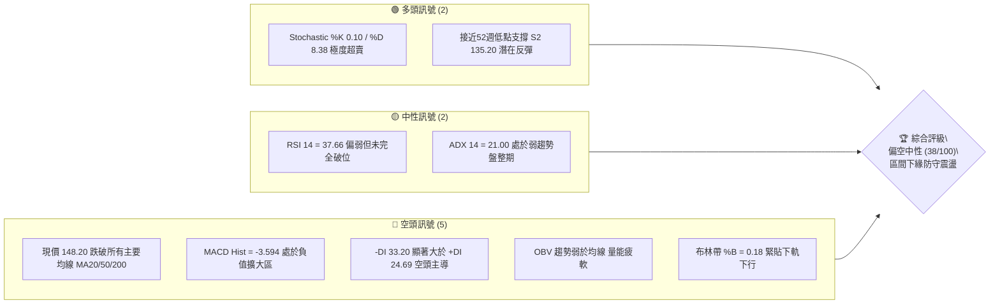
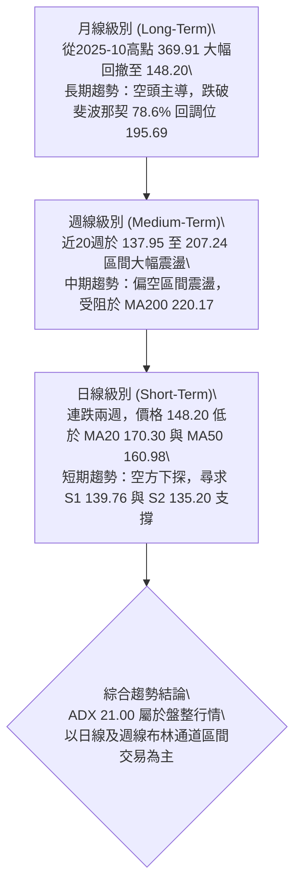
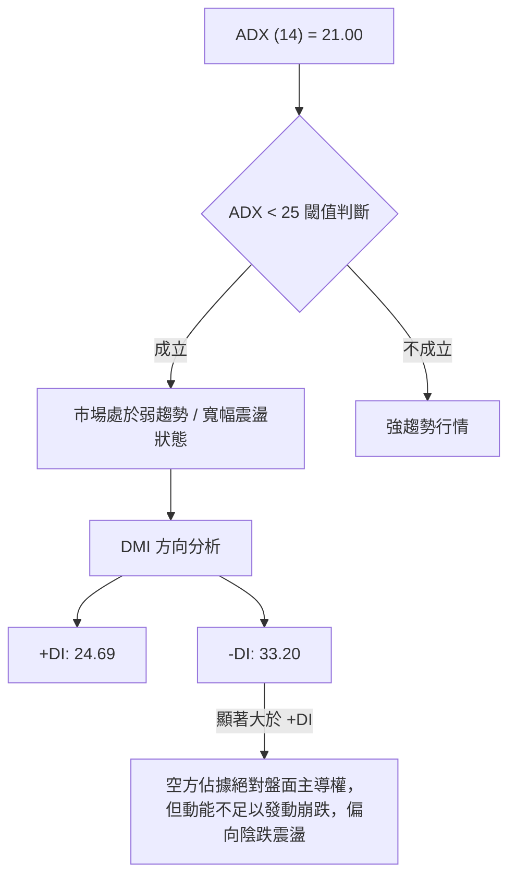
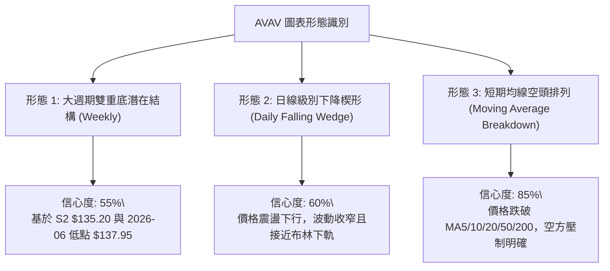
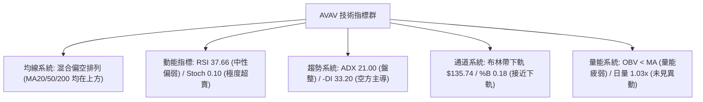
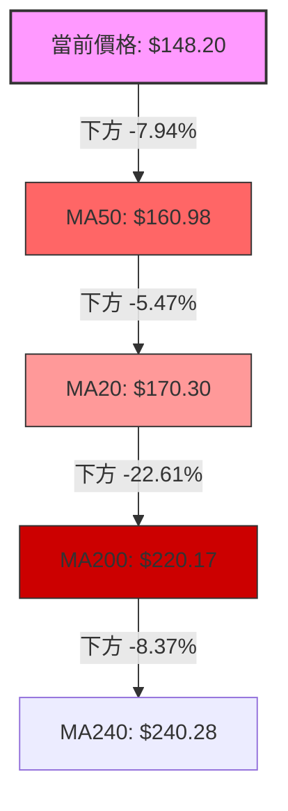
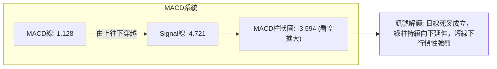
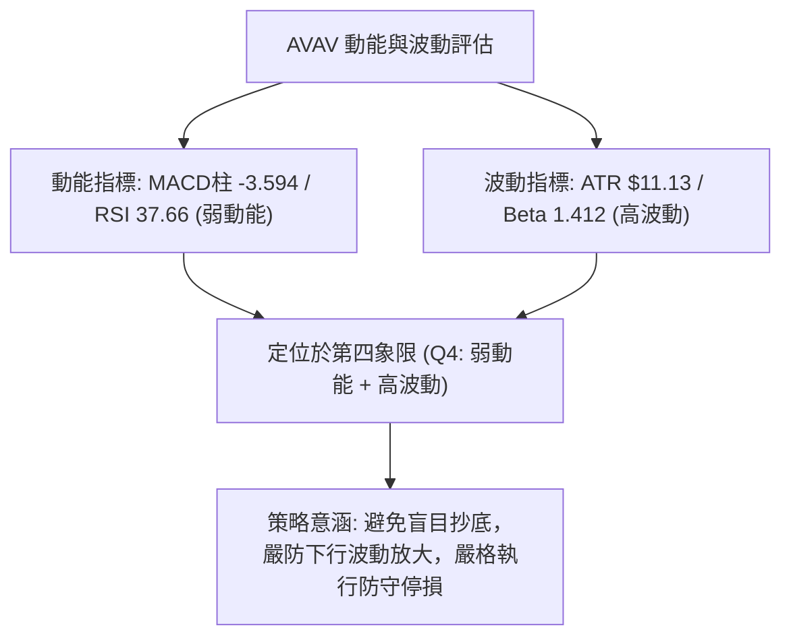
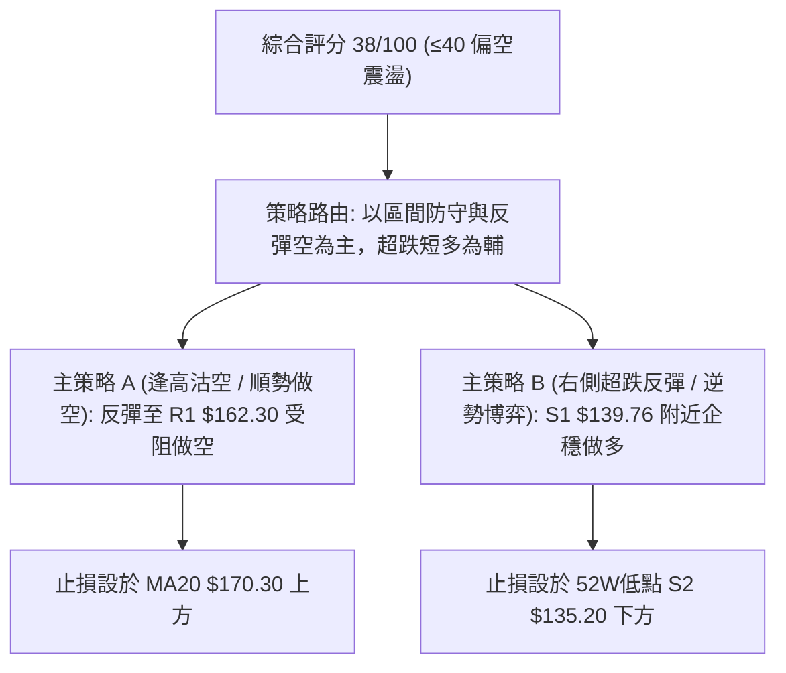
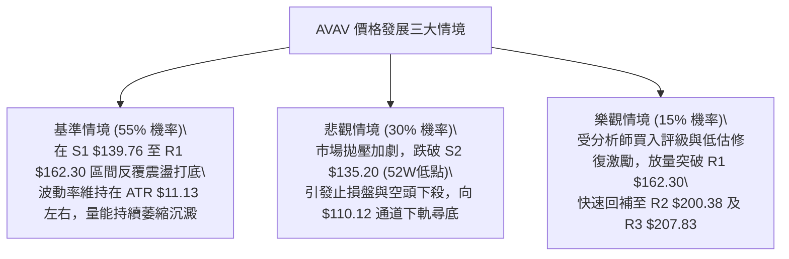

# AVAV 技術分析報告

> **報告日期**：2026-08-24 ｜ **語言**：繁體中文 ｜ **數據來源**：Yahoo Finance ｜ **當前價格**：$148.20

---

## 目錄

| 章節 | 內容 |
|------|------|
| [1. 技術面概覽](#1-技術面概覽) | 訊號儀表板、核心指標、評分卡 |
| [2. 趨勢分析](#2-趨勢分析) | 多時框趨勢、長中短期走勢、ADX解讀 |
| [3. 圖表形態分析](#3-圖表形態分析) | 形態識別、K線組合、目標價計算 |
| [4. 支撐與阻力](#4-支撐與阻力) | 關鍵價位、斐波那契回調 |
| [5. 技術指標深度解讀](#5-技術指標深度解讀) | MA/RSI/MACD/布林/成交量 |
| [6. 動能與波動率](#6-動能與波動率) | 動能評估、ATR、Beta |
| [7. 多時框架總結](#7-多時框架總結) | 時框架評分矩陣、收斂結論 |
| [8. 交易策略建議](#8-交易策略建議) | 策略路由、主策略、風報比 |
| [9. 風險提示與監控](#9-風險提示與監控) | 監控指標、風險場景、報告總結 |

---

## 1. 技術面概覽

### 🎯 技術訊號儀表板



### 📊 核心指標速覽表

| 指標類別 | 指標名稱 | 當前數值 | 訊號 | 解讀 |
|----------|----------|----------|------|------|
| **價格** | 當前價格 | $148.20 | 🔴 | 位於52週區間 4.6% 位置，極度貼近年度底部 |
| **均線** | MA20 | $170.30 | 🔴 | 價格低於MA20達 -12.98%，短線承壓嚴重 |
| **均線** | MA50 | $160.98 | 🔴 | 價格低於MA50達 -7.94%，中期走勢偏空 |
| **均線** | MA200 | $220.17 | 🔴 | 價格遠低於MA200達 -32.69%，長期處於空頭格局 |
| **動能** | RSI(14) | 37.66 | 🟡 | 位於30-40弱勢區間，無底背離，下行動能仍存 |
| **動能** | MACD Hist | -3.594 | 🔴 | MACD (1.128) 跌破 Signal (4.721)，綠柱持續放大 |
| **動能** | Stoch %K/%D | 0.10 / 8.38 | 🟢 | 進入極度超賣區，具備技術性跌深反彈動能 |
| **趨勢** | ADX / DMI | ADX 21.00 / -DI 33.20 | 🔴 | 弱趨勢盤整（ADX<25），但方向由空方絕對主導 |
| **通道** | 布林通道 | 下軌 $135.74 / %B 0.18 | 🟡 | 價格逼近布林下軌，通道寬度擴張，短線具支撐力 |
| **量能** | 成交量 / OBV | 量比 1.03x / OBV<MA | 🔴 | 量能未能放大確認反轉，OBV走弱顯示主力資金觀望 |
| **波動** | ATR(14) | $11.13 (7.51%) | 🔴 | 日內波動幅度大，操作風險較高 |

### 🏆 技術評分卡

```
╔══════════════════════════════════════════════════════════════╗
║              技術評分卡 — AVAV (2026-08-24)                 ║
╠══════════════════════════════════════════════════════════════╣
║ 趨勢強度 (Trend)     ███████░░░░░░░░░░░░░  35/100  🔴 空頭主導║
║ 動能指標 (Momentum)  ██████░░░░░░░░░░░░░░  30/100  🔴 動能疲弱║
║ 支撐穩定度 (Support) ██████████░░░░░░░░░░  50/100  🟡 考驗低點║
║ 成交量配合 (Volume)  ████████░░░░░░░░░░░░  40/100  🟡 量能不足║
║ 形態完整度 (Pattern) ████████░░░░░░░░░░░░  40/100  🟡 弱勢築底║
║ 均線排列 (MA System) █████░░░░░░░░░░░░░░░  25/100  🔴 空頭壓制║
╠══════════════════════════════════════════════════════════════╣
║ 綜合技術評分         ████████░░░░░░░░░░░░  38/100  🔴 偏空震盪║
╚══════════════════════════════════════════════════════════════╝
```

---

## 2. 趨勢分析

### 🌐 多時框趨勢分析



### 📈 長期趨勢 — 12個月走勢圖（Unicode）

```
AVAV 月線走勢圖（2025-09 至 2026-08）
價格軸 ($)
$370 ┤                    ● (2025-10: $369.91 歷史波段高點)
$340 ┤
$310 ┤              ● (2025-09: $314.89)
$280 ┤                                  ● (2025-11: $279.46 / 2026-01: $278.39)
$250 ┤        ● (2025-08: $241.35)            ● (2025-12: $241.89 / 2026-02: $252.25)
$220 ┤
$190 ┤                                              ● (2026-04: $195.02 / 05: $207.24)
$160 ┤                                                    ● (2026-06: $165.07)
$130 ┤                                                          ● (2026-07: $149.37)
$100 ┤                                                          ● (2026-08: $148.20 現價)
     └────────────────────────────────────────────────────────────────────────────
        08   09   10   11   12   01   02   03   04   05   06   07   08 (月份)
```

#### 走勢特徵分析表格

| 階段 | 時間區間 | 起止價格 | 漲跌幅 | 走勢特徵與量價結構 |
|------|----------|----------|--------|-------------------|
| **第一階段：高空見頂** | 2025-08 ~ 2025-10 | $241.35 → $369.91 | +53.27% | 爆發性多頭主升浪，觸及 52W 高點 $417.86 後快速見頂回落 |
| **第二階段：急速回撤** | 2025-10 ~ 2026-03 | $369.91 → $183.05 | -50.52% | 跌破各級上升均線，形成標準下降通道，籌碼高位套牢 |
| **第三階段：波段反彈** | 2026-03 ~ 2026-05 | $183.05 → $207.24 | +13.22% | 築出短期雙底反彈，但受阻於 $207.83 (R3) 關鍵阻力 |
| **第四階段：次級探底** | 2026-05 ~ 2026-08 | $207.24 → $148.20 | -28.49% | 弱勢下探，跌破 MA20/50，逼近 52W 低點 $135.20 (S2) |

### 📊 中期趨勢（週線分析）

```
中期關鍵壓力與支撐示意圖
═════════════════════════════════════════════════════════════════
 [強阻力 R3]   $207.83  ════════════════════════ (2026-05 反彈頂部)
 [阻力位 R2]   $200.38  ------------------------ (整數關卡/波段高點)
 [關鍵阻力 R1] $162.30  ························ (MA50 $160.98 重合區)
 [現價水平]   $148.20  ◄─── 當前震盪中樞 (逼近S1)
 [近期支撐 S1] $139.76  ························ (2026-06 波段低點 $137.95 聚類)
 [強支撐位 S2] $135.20  ════════════════════════ (52週低點 / 斐波 100%)
═════════════════════════════════════════════════════════════════
```

### ⚡ 趨勢強度評估（ADX 解讀）



#### ADX 強度對照表

| 指標項 | 當前數值 | 參考標準 | 結論與市場意涵 |
|--------|----------|----------|----------------|
| **ADX(14)** | 21.00 | < 20 極弱 / 20-25 弱趨勢 / > 25 強趨勢 | 處於弱趨勢盤整，不宜使用單邊追價系統，應以區間交易為主 |
| **+DI** | 24.69 | > 25 偏多 | 多頭買盤力道偏弱，難以發動持續性攻勢 |
| **-DI** | 33.20 | > 25 偏空 | 空方主導當前日線波段，壓制反彈空間 |
| **DI差值** | -8.51 | 正值看多 / 負值看空 | 負差擴大，顯示短線賣壓仍未完全消化完畢 |

---

## 3. 圖表形態分析

### 🔍 形態識別系統



#### 圖表形態信心度評估表

| 形態名稱 | 信心度 | 判斷依據（引用數據） | 完成度 | 目標價（附精確計算式） |
|----------|--------|----------------------|--------|------------------------|
| **潛在雙重底 (Double Bottom)** | 55% | 第一次低點為 52W 低點 $135.20，第二次低點為 2026-06 低點 $137.95 (聚類為 S1 $139.76)，現價 $148.20 尋求支撐 | 45% | 頸線阻力 R3 $207.83 - 底部低點 S2 $135.20 = 高度 $72.63。<br>突破頸線後目標價 = $207.83 + $72.63 = **$280.46** |
| **日線下降通道 (Falling Channel)** | 65% | 受制於 2026-05 反彈頂點 $207.83 (R3) 及 2026-08 反彈高點 $192.81，下軌貼近 S1 $139.76 | 75% | 跌破通道下軌量度跌幅：現價 $148.20 - (通道寬度 $200.38 - $162.30 = $38.08) = **$110.12** |
| **布林下軌鈍化超賣** | 70% | 布林帶 %B = 0.18，Stoch %K = 0.10，價格貼近布林下軌 $135.74 | 80% | 均值回歸目標價為布林中軌 MA20 = **$170.30** |

### 🕯️ 重要K線形態分析

| 日期 / 月份 | 收盤價 | K線形態 | 量價結構解讀 | 訊號 |
|-------------|--------|---------|--------------|------|
| **2026-06-28** | $137.95 | 長陰下影線 (Hammer) | 探底爆出 1,188 萬股巨量，形成第一隻腳，確立 S1/S2 支撐 | 🟢 止跌 |
| **2026-07-05** | $190.89 | 大陽突破線 (Bullish Marubozu) | 週成交量激增至 1,831 萬股，強力反彈突破 MA20 | 🟢 強多 |
| **2026-08-16** | $192.81 | 高位十字星 (Doji Star) | 量能萎縮至 593 萬股，反彈力竭，受阻於 R2 $200.38 關卡 | 🔴 反轉 |
| **2026-08-23** | $160.22 | 實體大陰線 (Bearish Candle) | 跌破 MA50 $160.98，MACD 柱轉負 (-2.279)，空頭重啟跌勢 | 🔴 破位 |
| **2026-08-30** | $148.20 | 弱勢下探收小陰 (Spinning Top) | 縮量至 123 萬股，賣壓減緩，進入 S1 $139.76 緩衝區 | 🟡 觀望 |

### 📉 ASCII 走勢形態示意圖

```
AVAV 近期日/週線走勢與雙底形態結構圖
價格 ($)
$210 ┤                      [頸線阻力 R3: $207.83]
     │                      ╭───● (2026-05-31: $207.24)
$190 ┤      ● (07-05: $190.89)     ● (08-16: $192.81)
     │     ╱ ╲                    ╱ ╲
$170 ┤────╱───╲──────────────────╱───╲──── [MA20: $170.30]
     │   ╱     ╲                ╱     ╲
$150 ┤  ╱       ╲              ╱       ● [現價: $148.20]
     │ ╱         ╲            ╱         
$135 ┤●───────────●──────────●────────── [底1: $135.20 / 底2: $137.95 (S1/S2)]
     └─────────────────────────────────────────────────────────────
       2026-03    2026-06    2026-07    2026-08
```

---

## 4. 支撐與阻力

### 🗺️ 關鍵價位分布圖（Unicode）

```
AVAV 價位結構分布圖
═══════════════════════════════════════════════════════════════
$207.83 ║████████████████████████║ 強阻力 R3 (2026-05 波段高點聚類)
$200.38 ║████████████████████    ║ 阻力 R2 (整數心理大關 / 反彈高點)
$162.30 ║████████████████████████║ 關鍵阻力 R1 (MA50 $160.98 重合壓力)
$148.20 ╠════════════════════════╣ ◄ 當前價格現價
$139.76 ║▓▓▓▓▓▓▓▓▓▓▓▓▓▓▓▓        ║ 近期支撐 S1 (近一年波段低點聚類)
$135.20 ║████████████████████████║ 強支撐 S2 (52週最低點 / 斐波 100%)
═══════════════════════════════════════════════════════════════
```

### 🚧 阻力位分析表

| 阻力級別 | 價位 | 形成原因（波段高點聚類） | 突破難度 | 重要性評級 |
|----------|------|--------------------------|----------|------------|
| **強阻力 R3** | **$207.83** | 2026-05 月線高點與波段雙頂高頸線聚類 | ★★★★★ (極高) | 🔴 長期多空分水嶺，站上才宣告中期反轉 |
| **阻力位 R2** | **$200.38** | 200 整數關卡，2026-08 反彈高點密集套牢區 | ★★★★☆ (高) | 🔴 中期波段反彈目標，解套賣壓沉重 |
| **關鍵阻力 R1** | **$162.30** | 近期波段高點聚類，與 MA50 ($160.98) 形成共振壓制 | ★★★☆☆ (中等) | 🟡 短線多頭反彈第一道天花板 |

### 🛡️ 支撐位分析表

| 支撐級別 | 價位 | 形成原因（波段低點聚類） | 守住機率 | 重要性評級 |
|----------|------|--------------------------|----------|------------|
| **近期支撐 S1** | **$139.76** | 近一年波段低點聚類（2026-06 低點 $137.95 密集成交區） | 65% | 🟢 短線防守第一道防線，跌破將加速探底 |
| **強支撐 S2** | **$135.20** | 52 週最低點，斐波那契 100.0% 絕對底部，布林下軌 $135.74 | 80% | 🟢 年度關鍵鐵底，多頭最後生命線 |

### 📐 斐波那契回調位分析

依據 52 週波動區間（高點 **$417.86** → 低點 **$135.20**，落差 $282.66）計算之精確回調位：

```
斐波那契回調位分布圖
0.0%  (52W High) ────────────────────────────── $417.86
23.6%            ────────────────────────────── $351.15
38.2%            ────────────────────────────── $309.88
50.0%            ────────────────────────────── $276.53
61.8%            ────────────────────────────── $243.18
78.6%            ────────────────────────────── $195.69 ◄── R2 $200.38 附近
[現價 $148.20]   ┈┈┈┈┈┈┈┈┈┈┈┈┈┈┈┈┈┈┈┈┈┈┈┈┈┈┈┈┈┈ (位於 78.6% 至 100.0% 極弱勢區間)
100.0% (52W Low) ────────────────────────────── $135.20 ◄── S2 強支撐
```

- **位置解讀**：現價 $148.20 處於 78.6% 回調位 ($195.69) 與 100.0% ($135.20) 之間，距離 52W 低點僅剩 4.6% 緩衝空間。
- **技術意義**：股票已完全回吐前波所有漲幅，進入長期價值重估與籌碼洗盤階段，下檔 $135.20 若失守將開啟無支撐的破底走勢。

---

## 5. 技術指標深度解讀

### 🎛️ 指標訊號總覽



### 📈 移動平均線排列分析



#### 均線狀態明細表

| 均線名稱 | 當前價格 | 與現價乖離率 | 走勢方向 | 角色與意義 |
|----------|----------|--------------|----------|------------|
| **MA 5** | $163.02 | -9.09% | 陡峭向下 | 短線第一道動態壓制線 |
| **MA 10** | $176.83 | -16.19% | 快速下行 | 短線反彈重大阻力 |
| **MA 20** | $170.30 | -12.98% | 下彎走平 | 月線生命線，布林中軌，短線多空分水嶺 |
| **MA 50** | $160.98 | -7.94% | 緩步下行 | 中期均線，與 R1 $162.30 形成強阻力帶 |
| **MA 200** | $220.17 | -32.69% | 走平下彎 | 牛熊分界線，宣告股票處於中長期空頭市場 |

### 📉 RSI(14) 分析

- **當前數值**：**37.66**（弱勢區間，但未跌破 30 超賣線）
- **進度條展示**：`[███████░░░░░░░░░░░░░] 37.66%`
- **背離判斷**：
  - **結論**：**無明顯頂背離或底背離**。
  - **解讀**：價格自 2026-08-16 的 $192.81 (RSI 73.5) 下跌至目前 $148.20 (RSI 37.7)，RSI 同步大幅回落，屬於標準的價格動能順向釋放，未出現指標不跌反漲的底背離特徵，顯示空方動能尚未衰竭。

### 📊 MACD(12/26/9) 訊號解讀



### 📦 布林通道分析

```
布林通道結構示意圖 (帶寬: $69.11)
═══════════════════════════════════════════════════════════════
$204.85 ──────────────────────────────────── 布林上軌 (Upper Band)
        │
$170.30 ──────────────────────────────────── 布林中軌 (MA20 / Middle Band)
        │
$148.20 ◄── 現價位置 (%B = 0.18，緊貼下軌下行)
        │
$135.74 ──────────────────────────────────── 布林下軌 (Lower Band / 與 S2 $135.20 重合)
═══════════════════════════════════════════════════════════════
```

- **%B 指標分析**：當前 %B 為 **0.18**，處於下軌 (0.0) 至中軌 (0.5) 之間的低位區。
- **通道狀態**：通道呈現向下傾斜擴張態勢，現價受壓於中軌 $170.30 下方，正往布林下軌 $135.74 尋求支撐。

### 💹 成交量分析（量價配合度）

- **量能數據**：最新日成交量 **1,231,715** 股，20日均量 **1,191,536** 股（量比 1.03x），50日均量 **1,713,092** 股。
- **OBV 能量潮解讀**：OBV 趨勢低於其移動平均線（OBV < MA），量能疲弱。
- **量價背離分析**：在過去兩週的下跌過程中，成交量未見恐慌性爆量拋售（維持在 120 萬股左右），但同時反彈缺乏買盤量能支撐（縮量陰跌）。量能萎縮顯示多頭資金進場意願低落，籌碼沉澱仍需時間。

---

## 6. 動能與波動率

### ⚡ 動能評估四象限

| 象限 | 動能維度 (Momentum) | 波動維度 (Volatility) | 當前狀態 | 戰略評估 |
|------|---------------------|-----------------------|----------|----------|
| **Q1** | 強動能 (Bullish) | 低波動 (Low Vol) | — | 穩定多頭趨勢，最佳順勢做多機會 |
| **Q2** | 弱動能 (Bearish) | 低波動 (Low Vol) | — | 低波盤整，等待方向選擇 |
| **Q3** | 強動能 (Bullish) | 高波動 (High Vol) | — | 高風險高回報，波段強攻 |
| **Q4** | **弱動能 (Bearish)** | **高波動 (High Vol)** | **✓ (AVAV 當前)** | **下行風險較高，波動劇烈，需嚴控停損** |



### 📊 ATR 波動率分析

- **當前數值**：**ATR(14) = $11.13**（佔股價比例高達 **7.51%**）。
- **止損距離建議**：
  - **日內交易 / 短線波段**：建議止損寬度至少為 **1.0 ~ 1.5 倍 ATR**（約 **$11.13 ~ $16.70**），避免因日常雜訊被震盪出場。
  - **中長線建倉**：建議止損寬度設在 **2.0 倍 ATR**（約 **$22.26**），或直接依據關鍵支撐位 S2 $135.20 下方作為硬性止損點。

### 📐 Beta 與市場相關性

- **Beta 係數**：**1.412**（高 Beta 股票）。
- **市場意涵**：AVAV 的波動幅度比標普 500 指數高出 41.2%。在大盤下跌時，該股面臨更強烈的拋售壓力；若大盤回暖，其反彈彈性亦顯著高於平均。在多頭訊號未明朗前，高 Beta 特性會放大持倉下行風險。

---

## 7. 多時框架總結

### 📋 時框架評分表

| 時框架 | 趨勢方向 | 動能指標 | 均線排列 | 形態結構 | 綜合評分 | 戰術建議 |
|--------|----------|----------|----------|----------|----------|----------|
| **月線 (Long-Term)** | 🔴 空頭下行 | 🔴 RSI 下行 | 🔴 跌破MA200 | 雙頂回撤中 | **30/100** | 長期投資者保持觀望 |
| **週線 (Medium-Term)**| 🟡 寬幅震盪 | 🔴 MACD柱轉負 | 🟡 跌破MA50 | 潛在雙底打底 | **40/100** | 區間操作，下軌附近低吸 |
| **日線 (Short-Term)** | 🔴 短線下探 | 🟢 Stoch超賣 | 🔴 全面空頭排列 | 貼近布林下軌 | **45/100** | 尋求 S1 支撐之短線搏反彈 |

### 🔲 綜合訊號矩陣

```
時框架訊號矩陣
┌──────────────┬──────────────┬──────────────┬──────────────┐
│ 時框架       │ 趨勢方向     │ 均線支持     │ 動能狀態     │
├──────────────┼──────────────┼──────────────┼──────────────┤
│ 長期 (月線)  │ 🔴 空頭 (Bear)│ 🔴 MA200下方 │ 🔴 動能疲弱  │
│ 中期 (週線)  │ 🟡 盤整 (Neut)│ 🔴 MA50下方  │ 🔴 MACD轉負  │
│ 短期 (日線)  │ 🔴 下探 (Bear)│ 🔴 MA20下方  │ 🟢 超賣鈍化  │
└──────────────┴──────────────┴──────────────┴──────────────┘
```

### ⚖️ 多時框收斂結論

依據多時框收斂規則：
1. **趨勢/盤整判定**：當前 ADX(14) 為 **21.00**（小於 25 門檻），確定目前市場處於**「盤整行情」**而非單邊強趨勢行情。
2. **主導時框與交易區間**：盤整行情以**日線布林通道上下軌 ($135.74 ~ $204.85)** 及波段支撐/阻力 (S1 $139.76 / R1 $162.30) 為主要交易區間。
3. **唯一方向性結論**：**中性偏空，區間下緣防守震盪（偏空中性，評分 38/100）**。
   - 價格受阻於中長期均線，但在 S1 ($139.76) 與 S2 ($135.20) 具備強力技術支撐與超賣反彈動能。

---

## 8. 交易策略建議

### 🗺️ 策略決策流程圖



### 🧭 策略路由

> **當前主策略方向 = 偏空震盪，以反彈受阻沽空為主、區間下緣超跌短多為輔（依綜合評分 38/100）**

### 🎯 價格情境階梯（Price Scenarios）

| 觸發條件 | 第一目標 (T1) | 後續延伸 (T2) | 情境含義與操作指引 |
|----------|---------------|---------------|-------------------|
| **強勢突破 R1 $162.30** | R2 $200.38 | R3 $207.83 | 短線轉強，突破 MA50 壓制，空單全面止損離場 |
| **受阻於現價至 R1 區間** | S1 $139.76 | S2 $135.20 | 維持弱勢震盪下探，順勢做空目標直指前低 |
| **跌破 S1 $139.76** | S2 $135.20 | 布林下軌 $135.74 | 下行趨勢延續，測試年度大底 |
| **跌破 S2 $135.20 鐵底** | 斐波擴展 | $110.12 (通道延伸)| 形態全面破位崩跌，啟動無支撐探底 |

### 📊 情境機率分佈

| 情境劇本 | 發生機率 | 主要依據與指標支持 |
|----------|----------|-------------------|
| **區間震盪探底 (S1~R1)** | **55%** | ADX 21.00 顯示無單邊趨勢，Stoch %K (0.10) 超賣限制下行空間，量能萎縮進入洗盤 |
| **反彈受阻後回落破底** | **30%** | MACD Hist (-3.594) 綠柱放大，-DI (33.20) 主導，價格受 MA20/50 壓制重重 |
| **強勢反轉向上突破 R1** | **15%** | OBV 仍低於均線，缺乏大額主力買盤進場確認，反轉難度極高 |

### 🟢 主策略詳情

本報告依據評分卡 38/100 偏空格局，提供順勢做空策略（策略 A）與超跌反彈策略（策略 B）：

| 策略要素 | 策略 A：反彈受阻順勢沽空 (主推) | 策略 B：S1/S2 超跌波段反彈 (次選) |
|----------|----------------------------------|-----------------------------------|
| **交易方向** | **做空 (Short)** | **做多 (Long)** |
| **進場條件** | 股價反彈至 R1 附近出現長上影線/滯漲訊號 | 價格回測 S1 止跌，或 Stoch 出現底背離金叉 |
| **進場價格** | **$162.30** (R1 阻力位) | **$139.76** (S1 支撐位) |
| **目標價 T1** | **$148.20** (現價水平) | **$162.30** (R1 阻力位) |
| **目標價 T2** | **$135.20** (S2 強支撐位) | **$170.30** (MA20 / 布林中軌) |
| **止損價格** | **$170.30** (突破 MA20 嚴格止損) | **$133.00** (跌破 52W 低點 S2 $135.20) |
| **風險報酬比** | **3.39 : 1** <br>*(風險 $8.00 / 獲利空間 $27.10)* | **3.33 : 1** <br>*(風險 $6.76 / 獲利空間 $22.54)* |
| **成功機率** | **65%** | **50%** |
| **建議倉位** | **10% ~ 15%** | **5% ~ 8%** (輕倉試單) |

### 🔴 反向風險觸發點（對沖與風控提示）

1. **多頭反轉觸發**：若日線放量收盤**實體站上 $162.30 (R1)** 且 MACD 柱翻紅，做空策略必須立即止損，並可反手輕倉做多看至 $200.38 (R2)。
2. **空頭破位加速**：若日線跌破 **$135.20 (S2)**，超跌抄底策略全數失效，嚴禁盲目加碼。

### ⭐ 整體訊號強度評星

```
做多訊號強度：★★☆☆☆  (2.0/5星 - 僅具備超賣反彈機會)
做空訊號強度：★★★☆☆  (3.5/5星 - 順應各級均線空頭排列)
整體可信度：  ★★★★☆  (4.0/5星 - 價位聚類與指標共振度高)
```

---

## 9. 風險提示與監控

### ✅ 關鍵監控指標 Checklist

```
╔══════════════════════════════════════════════════════════════╗
║                每日技術監控清單 (Checklist)                  ║
╠══════════════════════════════════════════════════════════════╣
║ [ ] 價格是否跌破 S1 $139.76 或 S2 $135.20 關鍵支撐           ║
║ [ ] 價格能否放量突破 R1 $162.30 (MA50 壓力線)                ║
║ [ ] MACD 柱狀圖是否由綠翻紅 (當前 -3.594)                    ║
║ [ ] RSI(14) 是否跌破 30 進入深度超賣或形成底背離             ║
║ [ ] ADX(14) 是否突破 25 (由盤整進入強趨勢行情)              ║
║ [ ] 成交量是否放大至 50日均量 (171萬股) 以上                 ║
║ [ ] 布林通道帶寬是否收窄後再度向下開口                       ║
╚══════════════════════════════════════════════════════════════╝
```

### ⚠️ 風險場景分析



### 🛡️ 風險管理重要提醒

1. **波動管理**：AVAV 的 ATR 高達 **$11.13 (7.51%)**，Beta 為 **1.412**，屬於高彈性標的。持倉規模應控制在總資金的 **10%** 以內，避免單一標的過度波動損害整體投資組合。
2. **財報與基本面風險**：當前淨利率為 -13.4%、FCF 為負，基本面尚未轉正，技術面反彈容易受到基本面雜訊干擾，嚴格以技術價位（S2 $135.20 / R1 $162.30）作為進出場紀律，切忌「套牢變存股」。

---

## 📋 報告總結

```
╔══════════════════════════════════════════════════════════════╗
║                 AVAV 技術分析報告總結                        ║
╠══════════════════════════════════════════════════════════════╣
║ 報告日期：2026-08-24                                         ║
║ 當前價格：$148.20                                            ║
║ 分析評級：🔴 偏空震盪 / 區間弱勢打底 (綜合評分: 38/100)      ║
╠══════════════════════════════════════════════════════════════╣
║ 關鍵結論：                                                   ║
║ ├─ 長期趨勢：🔴 空頭主導 (自 $369.91 高點回撤，跌破MA200)    ║
║ ├─ 中期趨勢：🟡 寬幅震盪 (受阻於 R3 $207.83，尋求雙底支撐)  ║
║ ├─ 短期趨勢：🔴 弱勢下探 (均線空頭排列，逼近布林下軌 $135.74)║
║ ├─ 關鍵支撐：S1 $139.76 / S2 $135.20 (52W最低點)             ║
║ ├─ 關鍵阻力：R1 $162.30 (MA50) / R2 $200.38 / R3 $207.83     ║
║ └─ 分析師目標：平均 $225.77 (高 $326.00 / 低 $148.57)        ║
╠══════════════════════════════════════════════════════════════╣
║ 最優策略組合：                                               ║
║ 1. 🥇 最佳機會：反彈至 R1 $162.30 受阻順勢做空 (風報比 3.39) ║
║ 2. 🥈 次選機會：回測 S1 $139.76 輕倉博弈超跌反彈 (風報比 3.33)║
║ 3. 🥉 保守選擇：完全空倉觀望，等待突破 R1 或跌破 S2 後順勢介入║
╚══════════════════════════════════════════════════════════════╝
```

---

> ⚠️ **免責聲明**：本報告為技術分析研究，所有數據及推算均基於歷史價格與指標資訊。本報告**僅供學術交流與研究參考**，**不構成任何要約、招攬或投資建議**。金融市場具有高度風險，交易者應獨立判斷並自負盈虧。

---

*報告生成時間：2026-08-24 ｜ 數據來源：Yahoo Finance ｜ 分析框架：多時框技術分析模型*