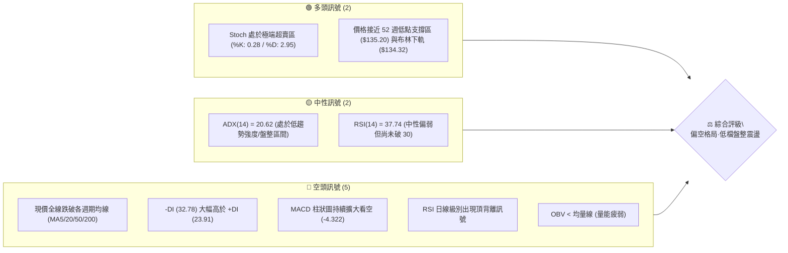
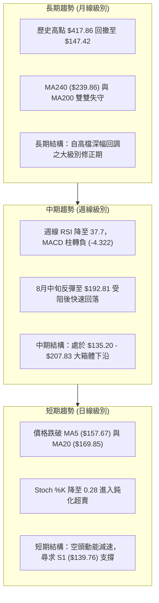
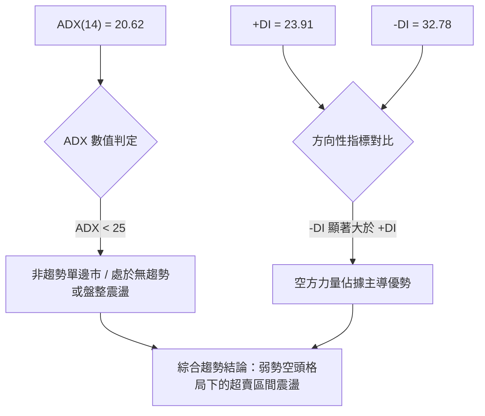
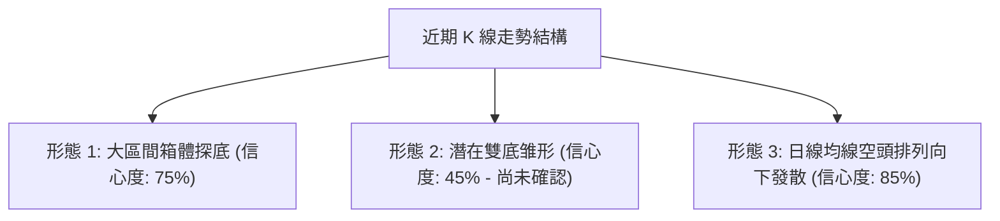
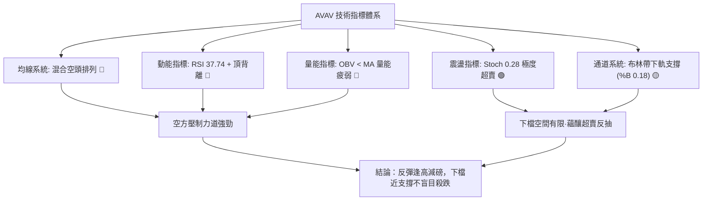
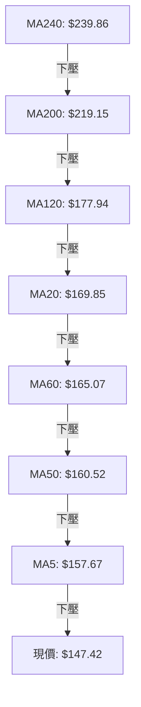
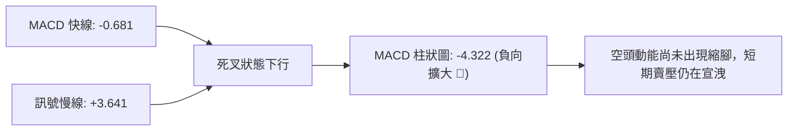
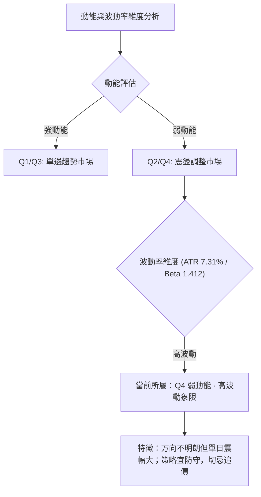
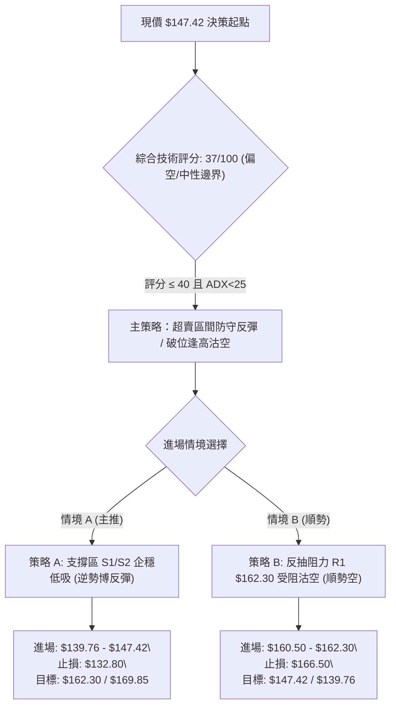
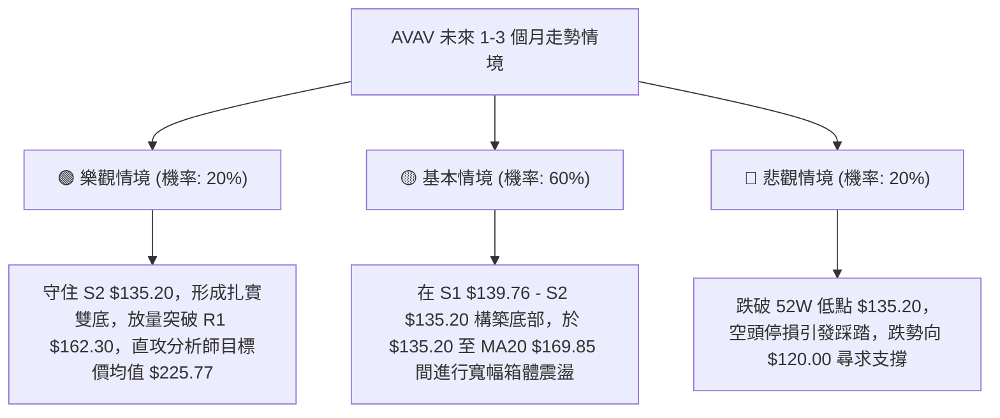

# AVAV 技術分析報告

> **報告日期**：2026-08-25 ｜ **語言**：繁體中文 ｜ **數據來源**：Yahoo Finance ｜ **當前價格**：$147.42

---

## 目錄

| 章節 | 內容 |
|------|------|
| [1. 技術面概覽](#1-技術面概覽) | 訊號儀表板、核心指標、評分卡 |
| [2. 趨勢分析](#2-趨勢分析) | 多時框趨勢、長中短期走勢 |
| [3. 圖表形態分析](#3-圖表形態分析) | 形態識別、K線組合、目標價 |
| [4. 支撐與阻力](#4-支撐與阻力) | 關鍵價位、斐波那契回調 |
| [5. 技術指標深度解讀](#5-技術指標深度解讀) | MA/RSI/MACD/布林/成交量 |
| [6. 動能與波動率](#6-動能與波動率) | 動能評估、ATR、Beta |
| [7. 多時框架總結](#7-多時框架總結) | 時框架評分矩陣 |
| [8. 交易策略建議](#8-交易策略建議) | 多空策略、風險報酬比 |
| [9. 風險提示與監控](#9-風險提示與監控) | 監控指標、風險場景 |
| [10. 報告總結](#-報告總結) | 核心結論與策略彙整 |

---

## 1. 技術面概覽

### 🎯 技術訊號儀表板



### 📊 核心指標速覽表

| 指標類別 | 指標名稱 | 當前數值 | 訊號 | 解讀 |
|----------|----------|----------|------|------|
| **價格** | 當前價格 | $147.42 | 🔴 | 位於 52 週區間僅 4.3% 分位，處於極低位階 |
| **均線** | MA20 (月線) | $169.85 | 🔴 | 現價低於 MA20 達 -13.21%，短中期承壓 |
| **均線** | MA50 (季線) | $160.52 | 🔴 | 現價低於 MA50 達 -8.16%，中期趨勢偏空 |
| **均線** | MA200 (年線) | $219.15 | 🔴 | 現價遠低於 MA200 達 -32.73%，長期處於空頭修正 |
| **動能** | RSI(14) | 37.74 | 🟡 | 弱勢中性區，伴隨頂背離修正壓力 |
| **動能** | MACD (12,26,9) | -0.681 / 3.641 | 🔴 | 柱狀圖 -4.322，快線下穿慢線，空頭動能主導 |
| **動能** | Stoch %K / %D | 0.28 / 2.95 | 🟢 | 極度超賣，隨時存在短線技術性抽頭反彈契機 |
| **趨勢** | ADX(14) / DMI | 20.62 (-DI 32.78) | 🟡 | ADX < 25 表明非單邊強趨勢，主為空頭壓制之區間盤跌 |
| **通道** | 布林通道 %B | 0.18 | 🟡 | 緊貼布林下軌 ($134.32)，下軌具備一定彈性防守 |
| **波動** | ATR(14) | $10.77 | 🔴 | 佔股價 7.31%，日均震幅劇烈，風控距離需拉寬 |

### 🏆 技術評分卡

```
╔══════════════════════════════════════════════════════════════════╗
║                   技術評分卡 — AVAV (2026-08-25)                 ║
╠══════════════════════════════════════════════════════════════════╣
║ 趨勢強度 (Trend)      ██████░░░░░░░░░░░░░░  30/100  🔴 空頭壓制  ║
║ 動能指標 (Momentum)   ████████░░░░░░░░░░░░  40/100  🟡 超賣弱反  ║
║ 支撐穩定度 (Support)  ████████████░░░░░░░░  60/100  🟡 接近前低  ║
║ 成交量配合 (Volume)   ██████░░░░░░░░░░░░░░  30/100  🔴 量能疲弱  ║
║ 形態完整度 (Pattern)  ████████░░░░░░░░░░░░  40/100  🟡 弱勢區間  ║
║ 均線排列 (MA System)  ████░░░░░░░░░░░░░░░░  20/100  🔴 空頭排列  ║
╠══════════════════════════════════════════════════════════════════╣
║ 綜合評分 (Composite)  ███████░░░░░░░░░░░░░  37/100  🔴 偏空震盪  ║
╚══════════════════════════════════════════════════════════════════╝
```

---

## 2. 趨勢分析

### 🌐 多時框趨勢分析



### 📈 長期趨勢 — 12個月走勢圖（Unicode）

```
AVAV 月線收盤走勢圖（2025-08 至 2026-08）
價格軸 ($)
$370 ┤                                  ● 2025-10 ($369.91)
$340 ┤
$310 ┤                           ● 2025-09 ($314.89)
$280 ┤                                        ● 2025-11 ($279.46)     ● 2026-01 ($278.39)
$250 ┤       ● 2025-08 ($241.35)                    ● 2025-12 ($241.89)     ● 2026-02 ($252.25)
$220 ┤                                                                              ● 2026-05 ($207.24)
$190 ┤                                                                  ● 2026-04 ($195.02)
$160 ┤                                                            ● 2026-03 ($183.05)   ● 2026-06 ($165.07)
$140 ┤                                                                                      ● 2026-07 ($149.37)
$130 ┤                                                                                            ● 現價 $147.42
     └─────────────────────────────────────────────────────────────────────────────────────────────
        25-08 25-09 25-10 25-11 25-12 26-01 26-02 26-03 26-04 26-05 26-06 26-07 26-08 (月份)
```

#### 走勢特徵分析表格

| 階段區間 | 起止價格 | 漲跌幅 | 結構特徵與量價行為 |
|----------|----------|--------|--------------------|
| **2025-08 ~ 2025-10** | $241.35 → $369.91 | +53.27% | 主升浪爆發，國防自主系統題材推動股價逼近歷史天花板 $417.86 |
| **2025-11 ~ 2026-02** | $369.91 → $252.25 | -31.81% | 高檔獲利了結，形成 $240 - $280 雙頂寬幅震盪平台 |
| **2026-03 ~ 2026-05** | $183.05 → $207.24 | +13.22% | 跌破年線後的技術性抵抗反彈，受阻於 R3 ($207.83) 阻力 |
| **2026-06 ~ 2026-08** | $207.24 → $147.42 | -28.86% | 陰跌探底，成交量收縮，全面下探 52 週低點 $135.20 附近支撐 |

### 📊 中期趨勢（週線分析）

```
中期壓力與支撐階梯圖 ($)
$210 ┤──────────────────────────────────────── R3: $207.83 (2026-05 波段高點)
$200 ┤─────────────────────────────────── R2: $200.38 (阻力聚類帶)
$190 ┤              ● 2026-08-16 ($192.81 反彈頂部)
$170 ┤─────────────────────────────── MA20 中軌: $169.85
$160 ┤─────────────────────────── R1: $162.30 / MA50: $160.52 (多空轉換分水嶺)
$147 ┤   ▲ 現價 $147.42 (落於弱勢盤整區間)
$140 ┤────────────────────── S1: $139.76 (近期低點緩衝帶)
$135 ┤────────────────── S2: $135.20 (52週低點 / 強力防守底線)
```

### ⚡ 趨勢強度評估（ADX 解讀）



#### ADX 強度對照表

| 指標名稱 | 當前數值 | 參考臨界值 | 狀態評估 | 實戰交易指引 |
|----------|----------|------------|----------|--------------|
| **ADX (14)** | **20.62** | 25.00 | 弱趨勢 / 盤整區間 | 不宜追空；以通道邊界與高拋低吸為主 |
| **+DI (14)** | **23.91** | - | 多頭動能衰弱 | 多方缺乏突破阻力 R1 ($162.30) 的連續買盤 |
| **-DI (14)** | **32.78** | - | 空頭主導壓制 | 賣壓依然充斥於均線反壓處，反彈高度受限 |

---

## 3. 圖表形態分析

### 🔍 形態識別系統



#### 形態識別與信心度評估表

| 形態名稱 | 信心度 | 判斷依據（引用數據） | 完成度 | 目標價（附計算式） |
|----------|--------|----------------------|--------|--------------------|
| **大型箱體下沿測試** | **75%** | 價格回測 2026-06 低點及 52 週低點 S2 ($135.20)，頂部受制於 R3 ($207.83) | 85% | 箱體震盪目標：回測下軌 $135.20 後反彈至中軌 $169.85 |
| **潛在雙重底 (W底)** | **45%** | 2026-06-28 低點 $137.95 與目前現價 $147.42 接近，但未突破頸線 | 30% | 訊號不足，僅做指標型解讀。若確認突破頸線 R1 ($162.30)，推算高度 = $162.30 + ($162.30 - $135.20) = **$189.40** |
| **均線空頭壓制** | **85%** | MA5 ($157.67) < MA50 ($160.52) < MA20 ($169.85) < MA200 ($219.15) | 100% | 下方第一目標支撐 S1 ($139.76)，第二目標 S2 ($135.20) |

### 🕯️ 重要K線形態分析

| 週/月份 | 收盤價 | K線形態 | 解讀 | 訊號 |
|---------|--------|---------|------|------|
| **2026-06-28** | $137.95 | 長下影大陰線 (週成交 11.88M) | 恐慌盤湧出觸及年度低點，低檔出現承接買盤 | 🟡 探底初現 |
| **2026-07-05** | $190.89 | 巨量大陽線 (週成交 18.31M) | 暴量暴力反彈，但未有效站穩 R2 ($200.38) | 🟢 強勁反抽 |
| **2026-08-16** | $192.81 | 上影流星線 (RSI: 73.5) | 反彈觸及阻力區，多頭力竭，RSI 出現頂背離跡象 | 🔴 衝高受阻 |
| **2026-08-23** | $160.22 | 連續長陰破位 (MACD柱轉負) | 失守 MA50 ($160.52)，空方重新奪回主導權 | 🔴 空頭吞噬 |
| **2026-08-30** | $147.42 | 弱勢下探收斂線 (量能縮減) | 逼近布林下軌 $134.32 與 S1 $139.76，賣壓收斂 | 🟡 尋求支撐 |

### 📉 ASCII 走勢形態示意圖

```
AVAV 走勢形態結構圖 (雙重底測試 vs 箱體下軌)
$210 ┤                      [頂部 R3: $207.83 (2026-05-31)]
$200 ┤                          ▲
$190 ┤             [反抽高點 $190.89]         [次高點 $192.81 (2026-08-16)]
$180 ┤               /      \                    /      \
$170 ┤              /        \                  /        \
$160 ┤─────────────/──────────\────────────────/──────────\─── [頸線/阻力 R1: $162.30]
$150 ┤            /            \              /            ▼ [現價: $147.42]
$140 ┤           /              \            /              ? [潛在右底 S1: $139.76]
$135 ┤ [左底 $137.95 (2026-06-28)]───────────┴──────────────── [支撐基準 S2: $135.20]
     └─────────────────────────────────────────────────────────────
```

---

## 4. 支撐與阻力

### 🗺️ 關鍵價位分布圖（Unicode）

```
AVAV 價位結構分布圖
══════════════════════════════════════════════════════════════════
$207.83 ║████████████████████████████████████║ 強阻力 R3 (5月波段頂部)
$205.38 ║▓▓▓▓▓▓▓▓▓▓▓▓▓▓▓▓▓▓▓▓▓▓▓▓▓▓▓▓        ║ 布林上軌 (BB Upper)
$200.38 ║████████████████████████            ║ 阻力 R2 (波段高點聚類)
$195.69 ║▒▒▒▒▒▒▒▒▒▒▒▒▒▒▒▒▒▒                  ║ 斐波那契 78.6% 回調位
$169.85 ║▓▓▓▓▓▓▓▓▓▓▓▓▓▓                      ║ 布林中軌 / MA20
$162.30 ║████████████████                    ║ 關鍵阻力 R1 (突破轉強點)
$160.52 ║░░░░░░░░░░░░                        ║ 均線季線 MA50
$147.42 ╠════════════════════════════════════╣ ◄ 當前收盤價 ($147.42)
$139.76 ║▓▓▓▓▓▓▓▓▓▓▓▓                        ║ 近期關鍵支撐 S1
$135.20 ║████████████████████████████████████║ 核心防守強支撐 S2 (52W Low / 斐波 100%)
$134.32 ║░░░░░░░░░░░░░░░░                    ║ 布林下軌 (BB Lower)
══════════════════════════════════════════════════════════════════
```

### 🚧 阻力位分析表

| 阻力級別 | 精確價位 | 形成原因 | 突破難度 | 重要性評級 |
|----------|----------|----------|----------|------------|
| **R1** | **$162.30** | 近一年波段密集籌碼聚類區、緊鄰 MA50 ($160.52) | 中等 | 🟢 短線多空轉換分水嶺，站穩方能扭轉弱勢 |
| **R2** | **$200.38** | 近一年重要整數反壓聚類、7月與8月反彈密集套牢區 | 極高 | 🔴 中期反轉關鍵頸線，累積大量套牢籌碼 |
| **R3** | **$207.83** | 2026年5月波段最高收盤價、接近布林通道上軌 ($205.38) | 極高 | 🔴 強阻力天花板，需基本面重大催化方可攻克 |

### 🛡️ 支撐位分析表

| 支撐級別 | 精確價位 | 形成原因 | 守住機率 | 重要性評級 |
|----------|----------|----------|----------|------------|
| **S1** | **$139.76** | 近一年波段次低點聚類、6月恐慌拋售後之密集成交區 | 65% | 🟡 短線第一道防線，跌破將加速探尋年度低點 |
| **S2** | **$135.20** | 52週歷史低點 (52W Low)、斐波那契 100% 終極支撐位 | 80% | 🟢 終極生命線，若跌破將觸發技術性停損並開啟新跌浪 |

### 📐 斐波那契回調位分析

依據 52 週波動區間（高點 **$417.86** → 低點 **$135.20**，總跨度 **$282.66**）之嚴格計算：

```
斐波那契回調分佈階梯
0.0%  (52W High) ── $417.86  [歷史天花板]
23.6% ───────────── $351.15  [極強多頭區]
38.2% ───────────── $309.88  [強勢平衡區]
50.0% ───────────── $276.53  [多空中樞線]
61.8% ───────────── $243.18  [黃金分割位 / 接近 MA240 $239.86]
78.6% ───────────── $195.69  [弱勢反彈極限 / 接近 R2 $200.38]
════════════════════════════════════════════════════════════════
現價位階 ────────── $147.42  (落於 78.6% 與 100.0% 之間極弱區間)
════════════════════════════════════════════════════════════════
100.0%(52W Low)  ── $135.20  [基底支撐 S2]
```

**深度解讀**：
當前價格 **$147.42** 處於 78.6% 回調位 ($195.69) 至 100.0% 回調位 ($135.20) 之間的**極度深幅修正區間**。當前股價距離 100.0% 低點僅有 **+9.04%** 的空間，表明空頭動能已釋放逾九成；此區間多空博弈劇烈，屬於潛在的長週期價值沉澱與築底區域。

---

## 5. 技術指標深度解讀

### 🎛️ 指標訊號總覽



### 📈 移動平均線排列分析



#### 均線數據偏離度分析表

| 均線名稱 | 當前價格 | 與現價差距 ($) | 偏離幅度 (%) | 走勢狀態與解讀 |
|----------|----------|----------------|--------------|----------------|
| **MA 5** | $157.67 | -$10.25 | -6.50% | 短線極速下殺，均線向下扣抵 |
| **MA 10** | $171.97 | -$24.55 | -14.28% | 短線負乖離顯著擴大 |
| **MA 20** | $169.85 | -$22.43 | -13.21% | 中短期月線向下穿頭，形成反彈第一反壓 |
| **MA 50** | $160.52 | -$13.10 | -8.16% | 季線下彎，壓制波段動能 |
| **MA 60** | $165.07 | -$17.65 | -10.69% | 季線群聚反壓帶 |
| **MA 120** | $177.94 | -$30.52 | -17.15% | 半年線持續下滑 |
| **MA 200** | $219.15 | -$71.73 | -32.73% | 處於長期空頭熊市界定線下方 |
| **MA 240** | $239.86 | -$92.44 | -38.54% | 年線大幅下壓，上方套牢籌碼沉重 |

### 📉 RSI(14) 分析

- **RSI(14) 當前數值**：**37.74** 
  ```
  0 ─────────────[ 30 ]──────●──────[ 70 ]───────────── 100
  超賣區          超賣線     37.74   超買線          超買區
  進度條: ███████████████░░░░░░░░░░░░░░░ 37.74%
  ```
- **背離判斷**：數據明確提示 **⚠️ 頂背離 (Bearish Divergence)**。
  - **背離解析**：在 2026-08-09 至 2026-08-16 期間，股價自 $186.73 攀升至 $192.81（創波段新高），然而 RSI 卻由 73.7 微降至 73.5，隨後一週（08-23）股價暴跌至 $160.22 伴隨 RSI 直墜 50.6。此頂背離結構已完全確立並引發了當前的深幅回調。目前數值已降至 37.74，正快速趨近超賣區間。

### 📊 MACD(12,26,9) 訊號解讀



- **MACD 快線**：`-0.681` 已由正轉負，跌破零軸。
- **訊號慢線 (Signal)**：`+3.641`，快線自上方跌破慢線形成死叉。
- **MACD 柱狀圖 (Histogram)**：`-4.322`，較前期（-2.279）負值進一步放大，顯示空方動能目前佔據絕對上風，尚未出現底背離或動能衰減的拐點訊號。

### 📦 布林通道分析

```
AVAV 布林通道 (BB 20, 2) 結構圖
$205.38 ┬──────────────────────────────────────── 布林上軌 (BB Upper)
        │
$169.85 ┼──────────────────────────────────────── 中軌 (MA20)
        │
$147.42 ┼─ 現價 ($147.42, %B = 0.18)
$134.32 ┴──────────────────────────────────────── 布林下軌 (BB Lower)
```

- **上軌**：`$205.38`
- **中軌 (MA20)**：`$169.85`
- **下軌**：`$134.32`
- **通道指標 (%B)**：`0.18`（價格處於下軌上方 18% 位置，極度逼近下軌）。
- **解讀**：通道開口處於擴張狀態，價格緊貼下軌下行。通常當 %B 跌破 0.20 且 Stoch 進入超賣時，下軌具備動態支撐效應，空頭繼續向下宣洩的斜率將逐步放緩。

### 💹 成交量分析（量價配合度）

- **最新日成交量**：`1,220,357` 股
- **20日均量**：`1,200,513` 股（量比：**1.02x**，量能持平）
- **50日均量**：`1,716,593` 股（萎縮約 28.9%）
- **OBV 趨勢**：**OBV < MA**，指標確認量能疲弱。
- **量價綜合解讀**：近兩週下跌過程中，成交量由 8 月中旬的 5.9M 週量縮減至 2.45M（08-30 週），表明此波下跌屬於縮量盤跌，並非主力機構踩踏出逃，而是買盤承接意願薄弱導致的陰跌走勢。一旦在 S1 ($139.76) 或 S2 ($135.20) 出現放量陽線，極易形成技術性反抽。

---

## 6. 動能與波動率

### ⚡ 動能評估四象限



| 象限 | 動能強度 | 波動率 | 當前狀態 | 評估與應對指引 |
|------|----------|--------|----------|----------------|
| **Q1** | 強 (多頭) | 低波動 | ─ | 穩定上行趨勢（最佳持股期） |
| **Q2** | 弱 (中性) | 低波動 | ─ | 窄幅盤整（等待突破） |
| **Q3** | 強 (單邊) | 高波動 | ─ | 爆發性行情（追隨趨勢） |
| **Q4** | **弱 (偏空)** | **高波動** | **✓ (AVAV)** | **高風險弱勢震盪：日震幅大但缺乏持續動能，適合極限點位短線操作** |

### 📊 ATR 波動率分析

- **ATR(14) 絕對數值**：**$10.77**
- **ATR 相對股價百分比**：**7.31%**
- **風控指引**：
  - AVAV 日均波動超過 $10 美元，屬於極高波動性標的。
  - 止損點設置至少需給予 **1.5 倍 ATR**（約 **$16.15**）或緊貼關鍵幾何結構點（如 S2 $135.20 之下方），避免被日常技術性雜訊震盪洗出場。

### 📐 Beta 與市場相關性

- **Beta 係數**：**1.412**（高 Beta 股票，波動幅度為標普500指數的 1.41 倍）。
- **機構持股與放空比**：
  - 機構持股比例高達 **88.1%**，籌碼高度集中於法人手中。
  - 放空比例 (Short % Float) 達 **11.3%**，Short Ratio 為 **2.18** 天。
  - **解讀**：較高的空頭部位與高 Beta 屬性，使該股在遭遇利多消息或觸及 S2 ($135.20) 強支撐時，具備潛在的空頭回補（Short Squeeze）彈升爆發力。

---

## 7. 多時框架總結

### 📋 時框架評分表

| 時框架 | 趨勢方向 | 動能狀態 | 均線排列 | 圖表形態 | 綜合評分 | 交易建議 |
|--------|----------|----------|----------|----------|----------|----------|
| **月線 (長期)** | 🔴 空頭修正 | 弱勢回調 | 破 MA200 | 深幅回調 (回撤 64%) | 35/100 | 長線分批定投觀察 |
| **週線 (中期)** | 🔴 弱勢震盪 | MACD轉負 | 空頭下壓 | 大箱體下沿測試 | 38/100 | 依箱體邊界低吸高拋 |
| **日線 (短期)** | 🟡 超賣醞釀 | Stoch<5 | 破 MA5/20 | 貼布林下軌震盪 | 42/100 | 等待企穩訊號右側進場 |

### 🔲 綜合訊號矩陣

```
訊號維度矩陣分析：
┌─────────────────┬──────────┬──────────┬──────────┐
│   維度 / 時框   │   日線   │   週線   │   月線   │
├─────────────────┼──────────┼──────────┼──────────┤
│ 趨勢方向 (Trend)│  🔴 偏空 │  🔴 空頭 │  🔴 修正 │
│ 動能指標 (Mom)  │  🟢 超賣 │  🔴 轉弱 │  🟡 中性 │
│ 均線系統 (MA)   │  🔴 壓制 │  🔴 下彎 │  🔴 跌破 │
│ 支撐阻力 (S/R)  │  🟢 臨近 │  🟡 考驗 │  🟢 52W低│
│ 成交量能 (Vol)  │  🟡 縮量 │  🔴 疲弱 │  🟡 常態 │
└─────────────────┴──────────┴──────────┴──────────┘
整體收斂方向：多時框均線一致處於空頭壓制，但短線日線級別進入極限超賣區。
```

### ⚖️ 多時框收斂結論

> **依據規則 14 嚴格收斂判定**：
> 1. **行情屬性判定**：當前 ADX(14) 數值為 **20.62 (< 25)**，明確定義當前市場處於**「弱趨勢 / 箱體盤整行情」**。
> 2. **主導規則應用**：在 ADX < 25 的盤整環境下，交易邊界應以**「布林通道上下軌 ($134.32 ~ $205.38) 與關鍵支撐阻力 (S2 $135.20 / R1 $162.30)」**為主要操作區間，日線短期超賣訊號具備較高參考價值。
> 3. **唯一方向性結論**：**【偏空震盪·下軌防守】**。中期均線雖全面看空，但股價已極度逼近 52 週低點 S2 ($135.20) 及布林下軌 ($134.32)，下方下跌空間受限，當前禁止盲目追空，策略重心轉為**「等待支撐確認後的超賣防守型反彈機會」**。

---

## 8. 交易策略建議

### 🗺️ 策略決策流程圖



### 🧭 策略路由

**當前主策略方向 = 偏空震盪下的區間防守與超賣博弈（依評分 37/100）**

### 🎯 價格情境階梯（Price Scenarios）

| 觸發條件 | 下一目標 | 後續延伸 | 情境含義與操作指引 |
|----------|----------|----------|--------------------|
| **向上突破 R1 $162.30** | R2 **$200.38** | R3 **$207.83** | **短線強勢反轉**：突破季線與日線頸線，空頭回補開啟中期修復行情 |
| **守穩現價至 S1 $139.76** | MA20 **$169.85** | R1 **$162.30** | **區間築底震盪**：於布林下軌與前低間形成右底，維持箱體內高拋低吸 |
| **有效跌破 S2 $135.20** | 斐波擴展下探 | 下方無歷史數據 | **破位加速下行**：跌破 52 週絕對低點，引發停損賣盤，全面離場觀望 |

### 📊 情境機率分佈

| 情境類別 | 發生機率 | 主要技術依據 |
|----------|----------|--------------|
| **下檔獲支撐，超賣反彈** | **55%** | Stoch K值 0.28 極度超賣、%B 0.18 貼近下軌、接近 52W 低點 S2 ($135.20) |
| **維持 $139.76 - $162.30 窄幅震盪** | **30%** | ADX 20.62 趨勢動能不足、OBV 萎縮成交清淡、多空力量暫時平衡 |
| **跌破 S2 $135.20 展開新一輪重挫** | **15%** | 均線系統全線空頭壓制、-DI 32.78 依然高於 +DI、MACD 負向柱狀放大 |

### 🟢 主策略詳情

| 策略要素 | 策略 A（下檔超賣低吸 · 逆勢波段） | 策略 B（反抽阻力沽空 · 順勢波段） |
|----------|-----------------------------------|-----------------------------------|
| **適用時機** | 價格在 S1 $139.76 附近縮量企穩 | 價格反抽至 R1 $162.30 遇阻回落 |
| **進場價格** | **$142.00**（回踩 S1 $139.76 緩衝區） | **$161.50**（逼近 MA50 / R1 阻力帶） |
| **目標價 T1** | **$162.30** (阻力位 R1，獲利 +14.30%) | **$147.42** (當前價格位，獲利 +8.72%) |
| **目標價 T2** | **$169.85** (布林中軌 MA20，獲利 +19.61%) | **$139.76** (支撐位 S1，獲利 +13.46%) |
| **止損價格** | **$134.00** (跌破 52W 低點 S2 $135.20) | **$166.50** (突破 MA60 $165.07 反壓) |
| **風險報酬比** | **1 : 2.54** (風險 $8.00 : 報酬 $20.30) | **1 : 2.82** (風險 $5.00 : 報酬 $14.08) |
| **成功機率** | **55%** | **60%** |
| **建議倉位** | **10% - 15%** (嚴格控制輕倉試單) | **15% - 20%** (順應大週期均線方向) |

### 🔴 反向風險觸發點（對沖提示）

1. **多頭止損與風控線**：若日線收盤價跌破 **$135.20 (S2)**，表明 52 週雙底構建失敗，所有多頭多單必須無條件止損離場，不得向下攤平。
2. **空頭止損與反轉線**：若日線放量突破 **$162.30 (R1)** 且 MACD 形成金叉，表明空頭結構被破壞，空單必須立即平倉，並可反手順勢輕倉追多至 R2 **$200.38**。

### ⭐ 整體訊號強度評星

```
做多訊號強度：★★☆☆☆  (2.5/5星 - 超賣反抽性質，勝在風報比優異)
做空訊號強度：★★★☆☆  (3.5/5星 - 順應中長均線，但需提防下檔超賣反撲)
整體可信度：  ★★★☆☆  (3.0/5星 - 處於低 ADX 盤整期，形態確認度中等)
```

---

## 9. 風險提示與監控

### ✅ 關鍵監控指標 Checklist

```
╔══════════════════════════════════════════════════════════════════╗
║                   AVAV 每日盤後關鍵監控清單                      ║
╠══════════════════════════════════════════════════════════════════╣
║ [ ] 價格是否跌破 S2 ($135.20) 52週歷史新低防線                   ║
║ [ ] RSI(14) 是否跌入 30 以下極度超賣區或形成底背離              ║
║ [ ] MACD 負向柱狀圖是否縮小（由 -4.322 向上收斂至 0 軸）         ║
║ [ ] 日成交量是否放大至 50日均量 (1.71M 股) 以上確認反轉買盤      ║
║ [ ] Stoch %K 是否自超賣區由下往上穿越 %D 形成黃金交叉            ║
║ [ ] 價格能否有效收復 MA5 ($157.67) 與 MA50 ($160.52)             ║
╚══════════════════════════════════════════════════════════════════╝
```

### ⚠️ 風險場景分析



### 🛡️ 風險管理重要提醒

1. **波動率極高防範**：AVAV 之 ATR 達 **$10.77 (7.31%)**，單日上下震幅可能超過 8-10%。進場前務必計算單筆最大可承受虧損（建議不超過總資產 1.5%），倒推計算持股股數，切忌重倉滿倉。
2. **財報與基本面負向拖累**：目前公司 TTM EPS 為 **$-5.39**，營業利益率僅 **2.8%**，自由現金流為負（-251.39M）。基本面財務指標欠佳是壓制股價跌破年線的根本主因，技術面反彈均應視為「修復性行情」，未見營運拐點前不宜進行長期無避險之持股。
3. **分析師目標價落差**：華爾街分析師平均目標價為 **$225.77**（高於現價 +53.15%），但最低目標價為 **$148.57**（基本與現價重合）。技術面在跌破所有均線時，應以價格實際走勢為主，切勿單憑目標價盲目死守。

---

## 📋 報告總結

```
╔══════════════════════════════════════════════════════════════════╗
║                      AVAV 技術分析報告總結                       ║
╠══════════════════════════════════════════════════════════════════╣
║ 報告日期：2026-08-25                                             ║
║ 當前價格：$147.42                                                ║
║ 分析評級：⚖️ 偏空震盪 · 關注超賣防守 (Score: 37/100)              ║
╠══════════════════════════════════════════════════════════════════╣
║ 關鍵結論：                                                       ║
║ ├─ 長期趨勢：🔴 處於自 $417.86 回落之空頭修正期 (破 MA200)       ║
║ ├─ 中期趨勢：🔴 弱勢震盪，受制於 R1 $162.30 與 MA20 $169.85      ║
║ ├─ 短期趨勢：🟡 極度超賣 (Stoch %K 0.28)，下檔逼近 52W 低點支撐  ║
║ ├─ 關鍵支撐：S1: $139.76  ｜  S2: $135.20 (52週極限生命線)       ║
║ ├─ 關鍵阻力：R1: $162.30  ｜  R2: $200.38  ｜  R3: $207.83       ║
║ └─ 分析師目標：均值 $225.77 (最低 $148.57 / 最高 $326.00)        ║
╠══════════════════════════════════════════════════════════════════╣
║ 最優策略組合：                                                   ║
║ 1. 🥇 最佳機會（區間低吸）：回踩 S1 $139.76 企穩輕倉佈局，       ║
║    止損設於 $134.00，第一目標看 R1 $162.30 (風報比 1:2.54)       ║
║ 2. 🥈 次選機會（順勢逢高沽空）：反彈至 R1 $162.30 遇阻做空，     ║
║    止損設於 $166.50，目標看 $147.42 / $139.76 (風報比 1:2.82)   ║
║ 3. 🥉 保守選擇（觀望等待）：空倉者等待股價放量突破 R1 $162.30   ║
║    或於 S2 $135.20 出現明顯日線雙底結構後再行介入。              ║
╚══════════════════════════════════════════════════════════════════╝
```

---

> ⚠️ **免責聲明**：本報告為依據客觀量化技術指標與歷史行情數據生成之專業技術分析，所有數據及估算均嚴格基於提供之 OHLCV 歷史價格資訊。本報告**僅供研究與學術參考**，**不構成任何形式之投資建議或買賣邀約**。金融市場投資具有高風險性，操作前請務必獨立思考、做好嚴格資金管理與止損風控。

---

*報告生成時間：2026-08-25 ｜ 數據來源：Yahoo Finance ｜ 分析框架：多時框技術分析體系*