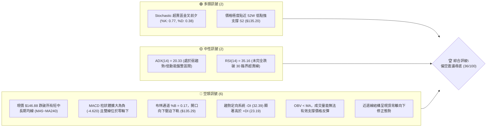
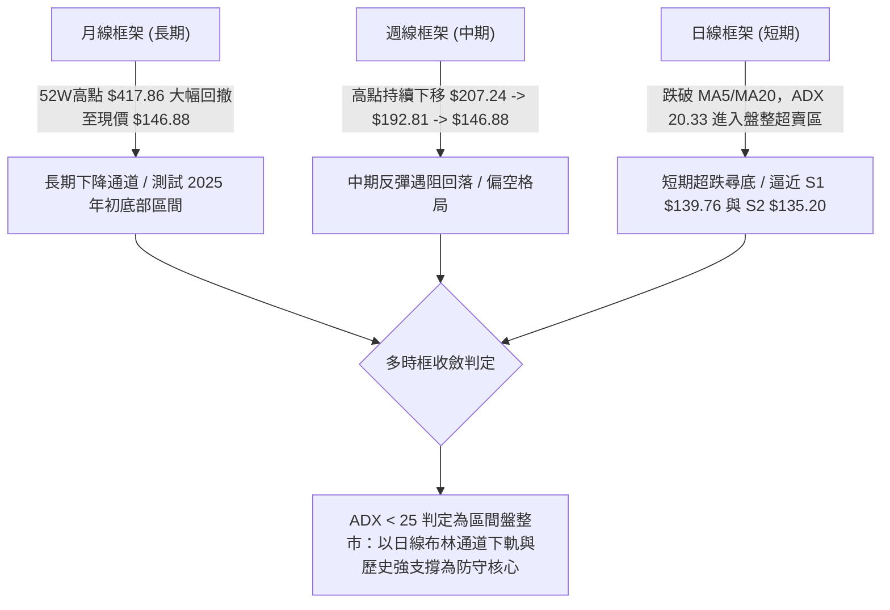
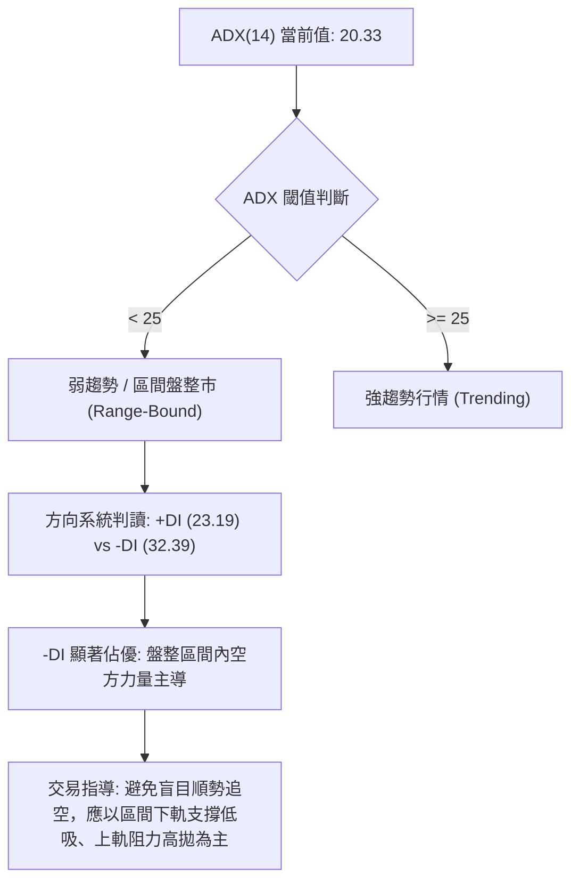
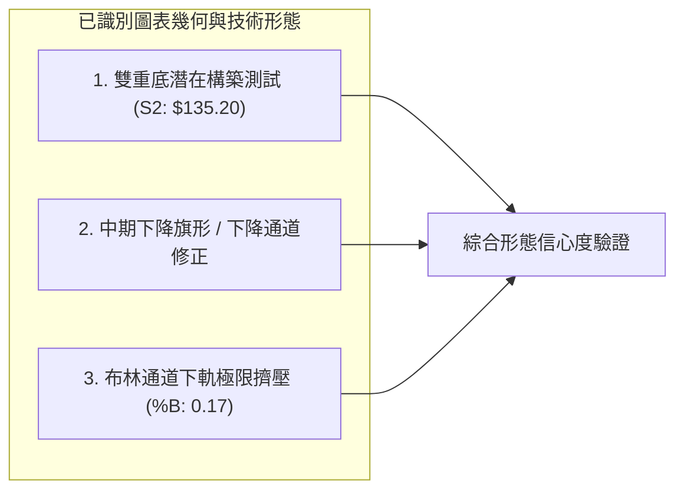
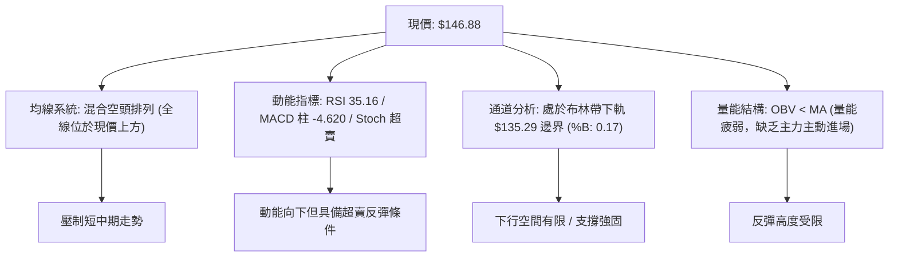
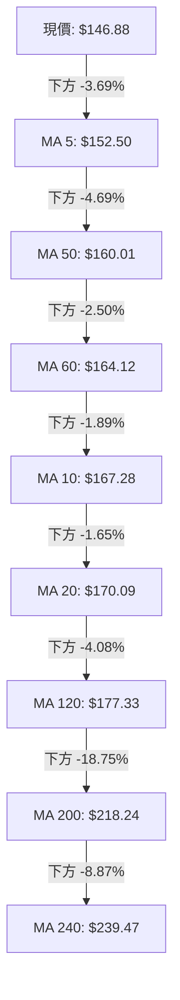
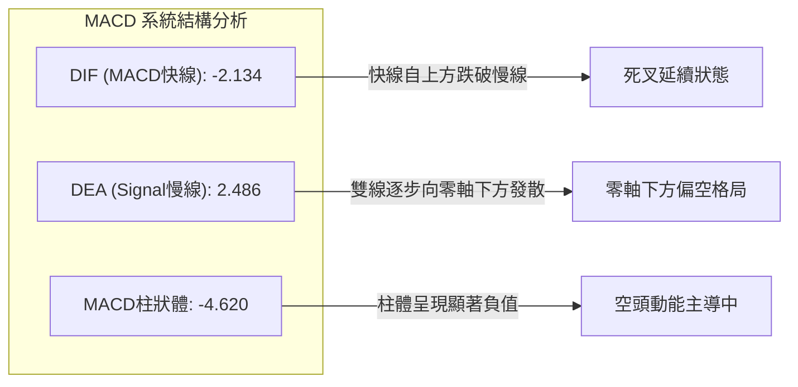
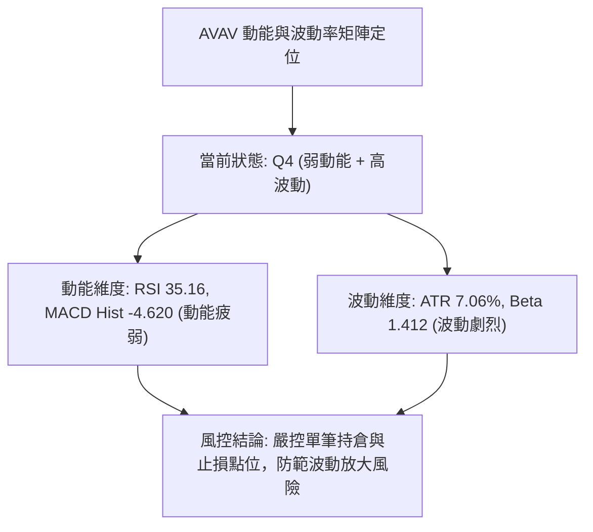
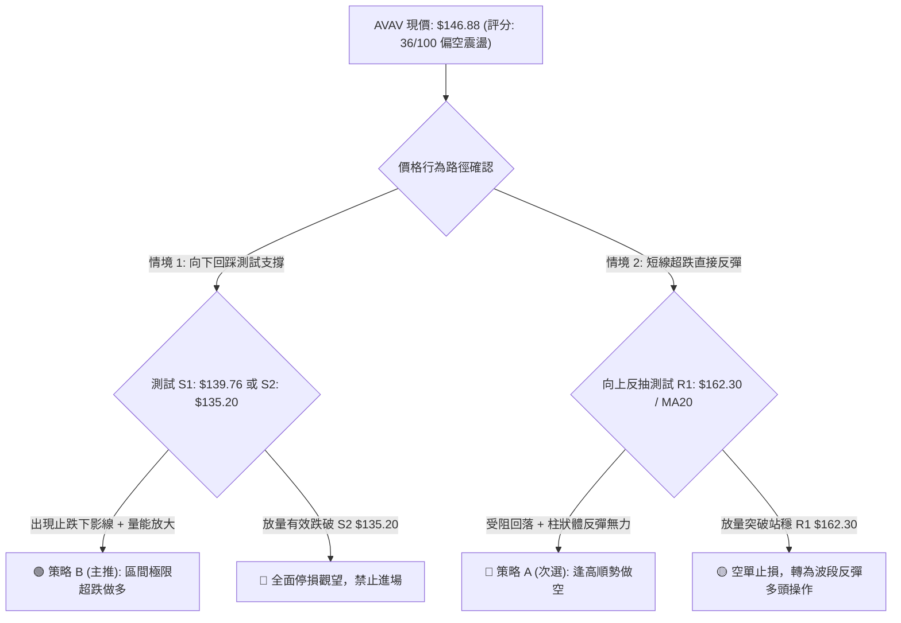
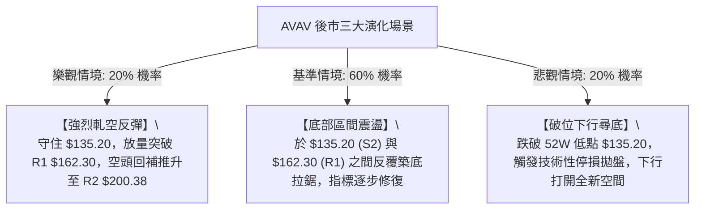

# AVAV 技術分析報告

> **報告日期**：2026-08-27 ｜ **語言**：繁體中文 ｜ **數據來源**：Yahoo Finance ｜ **當前價格**：$146.88

---

## 目錄

| 章節 | 內容 |
|------|------|
| [1. 技術面概覽](#1-技術面概覽) | 訊號儀表板、核心指標、評分卡 |
| [2. 趨勢分析](#2-趨勢分析) | 多時框趨勢、長中短期走勢、12個月走勢圖 |
| [3. 圖表形態分析](#3-圖表形態分析) | 形態識別、信心度評估、K線組合、目標價 |
| [4. 支撐與阻力](#4-支撐與阻力) | 關鍵價位分布圖、S/R 級別、斐波那契回調 |
| [5. 技術指標深度解讀](#5-技術指標深度解讀) | 均線系統、RSI背離、MACD、布林通道、OBV量價 |
| [6. 動能與波動率](#6-動能與波動率) | 動能四象限、ATR波動分析、Beta與做空數據 |
| [7. 多時框架總結](#7-多時框架總結) | 時框架評分矩陣、收斂規則與最終方向 |
| [8. 交易策略建議](#8-交易策略建議) | 策略路由、價格情境階梯、主客策略與風控參數 |
| [9. 風險提示與監控](#9-風險提示與監控) | 關鍵監控清單、情境模擬圖、資金管理提醒 |
| [📋 報告總結](#-報告總結) | 核心結論與最優策略組合 |

---

## 1. 技術面概覽

### 🎯 技術訊號儀表板



---

### 📊 核心指標速覽表

| 指標類別 | 指標名稱 | 當前數值 | 訊號 | 解讀 |
|:---|:---|:---|:---:|:---|
| **價格** | 當前收盤價 | **$146.88** | 🔴 | 位於 52 週區間底部（4.1% 分位），空方全面壓制 |
| **均線** | MA20 (短月線) | **$170.09** | 🔴 | 價格低於 MA20 達 -13.65%，短期均線呈下行阻力 |
| **均線** | MA50 (季線) | **$160.01** | 🔴 | 價格低於 MA50 達 -8.21%，中期波段反彈第一防線 |
| **均線** | MA200 (年線) | **$218.24** | 🔴 | 價格低於 MA200 達 -32.70%，長期結構進入空頭防守 |
| **動能** | RSI(14) | **35.16** | 🟡 | 位於偏弱中性區，伴隨前期頂背離後的持續動能釋放 |
| **動能** | MACD (12,26,9)| **-2.134 / 2.486** | 🔴 | MACD 柱狀體為 **-4.620**，空頭動能加速釋放中 |
| **隨機指標** | Stoch %K / %D | **0.77 / 0.38** | 🟢 | 極度超賣，隨時可能觸發技術性跌深反彈 |
| **趨勢強度** | ADX(14) / 方向 | **20.33 (-DI: 32.39)** | 🟡 | ADX < 25 為盤整弱趨勢，但 -DI 壓制顯示空方佔優 |
| **通道指標** | Bollinger Bands | **$135.29 ~ $204.89** | 🔴 | %B 為 0.17，價格緊貼下軌，下行空間受下軌支撐約束 |
| **量能** | 20日均量比 | **0.84x (999.4K)** | 🔴 | OBV < MA，反彈無量、下跌量縮，呈現量價疲弱特徵 |
| **波動** | ATR(14) | **$10.37 (7.06%)** | 🔴 | 每日價格波動幅度較大，持倉風險溢價高 |

---

### 🏆 技術評分卡

```
╔══════════════════════════════════════════════════════════════════╗
║                   技術評分卡 — AVAV (2026-08-27)                  ║
╠══════════════════════════════════════════════════════════════════╣
║ 趨勢強度 (Trend)      ██████░░░░░░░░░░░░░░  30/100   🔴 弱勢空頭 ║
║ 動能指標 (Momentum)   ███████░░░░░░░░░░░░░  35/100   🔴 動能衰竭 ║
║ 支撐穩定度 (Support)  █████████░░░░░░░░░░░  45/100   🟡 逼近強支 ║
║ 成交量配合 (Volume)   ██████░░░░░░░░░░░░░░  30/100   🔴 量能疲弱 ║
║ 形態完整度 (Pattern)  ████████░░░░░░░░░░░░  40/100   🟡 測底形態 ║
║ 均線排列 (MA System)  ██████░░░░░░░░░░░░░░  30/100   🔴 空頭排列 ║
╠══════════════════════════════════════════════════════════════════╣
║ 綜合評分              ███████░░░░░░░░░░░░░  36/100   🔴 偏空震盪 ║
╚══════════════════════════════════════════════════════════════════╝
```

---

## 2. 趨勢分析

### 🌐 多時框趨勢分析



---

### 📈 長期趨勢 — 12個月走勢圖（ASCII）

```
AVAV 月線走勢圖（2025-09 至 2026-08）
價格 ($)
$370 ┤                       ● 2025-10 ($369.91 - 歷史高點區)
$340 ┤                 
$310 ┤           ● 2025-09 ($314.89)
$280 ┤                             ● 2025-11 ($279.46)       ● 2026-01 ($278.39)
$250 ┤                                   ● 2025-12 ($241.89)       ● 2026-02 ($252.25)
$220 ┤                                                                   
$190 ┤                                                                         ● 2026-04 ($195.02)  ● 2026-05 ($207.24)
$160 ┤                                                                               ● 2026-03 ($183.05)   ● 2026-06 ($165.07)
$130 ┤                                                                                                           ● 2026-07 ($149.37)
$100 ┤                                                                                                                 ● 2026-08 ($146.88) ◄ 現價
     └─────────────────────────────────────────────────────────────────────────────────────────────────────────────────────────────
       09/25   10/25   11/25   12/25   01/26   02/26   03/26   04/26   05/26   06/26   07/26   08/26 (月份)
```

#### 走勢特徵分析表格

| 階段區間 | 月份起訖 | 區間價格變化 | 累計漲跌幅 | 核心形態與量價特徵 |
|:---|:---|:---|:---:|:---|
| **主升爆發期** | 2025-09 ~ 2025-10 | $314.89 → $369.91 | **+17.47%** | 創下 52 週高點 $417.86，多頭情緒亢奮但量能透支 |
| **頭部震盪期** | 2025-11 ~ 2026-02 | $279.46 → $252.25 | **-9.74%** | 構築雙重頂部結構，未能再次突破 $300，多頭動能減退 |
| **加速下行期** | 2026-03 ~ 2026-06 | $183.05 → $165.07 | **-9.82%** | 跌破 MA200 ($218.24) 與 MA120，引發技術性停損拋盤 |
| **弱勢築底期** | 2026-07 ~ 2026-08 | $149.37 → $146.88 | **-1.67%** | 波動幅度收窄，考驗 52 週最低支撐位 $135.20 |

---

### 📊 中期趨勢（週線分析）

中期走勢顯示，AVAV 在 2026 年 8 月中旬曾試圖向上反彈至 $192.81，但受制於下降的 MA50 ($160.01) 與斐波那契 78.6% 壓力位 ($195.69)，隨後兩週迅速轉跌至 $160.22 及當前的 $146.88，形成典型的「反彈遇阻回落」格局。週線級別 MACD 柱狀圖由正轉負（-4.620），確認中期下行回踩支撐的技術需求。

```
中期壓力與支撐示意圖：
[強壓力區]   $207.83 ══════════════════════════ (R3 / 2026-05 波段高點)
[中期阻力]   $162.30 ══════════════════════════ (R1 / 波段高點聚類)
[當前現價]   $146.88 ────────────────────────── (現價，受壓於 MA20 $170.09)
[近期支撐]   $139.76 -------------------------- (S1 / 近一年波段低點聚類)
[歷史強支撐] $135.20 ══════════════════════════ (S2 / 52W 低點 & 布林下軌 $135.29)
```

---

### ⚡ 趨勢強度評估（ADX 解讀）



| 指標變數 | 當前數值 | 臨界標準 | 狀態評估 | 實戰指導意義 |
|:---|:---:|:---:|:---:|:---|
| **ADX(14)** | **20.33** | 25.00 | 🟡 弱趨勢/盤整 | 市場未進入單邊主跌浪，不宜在低位恐慌殺跌 |
| **+DI (多頭動向)** | **23.19** | - | 🔴 弱勢 | 多頭主動進攻意願低迷，追高動能不足 |
| **-DI (空頭動向)** | **32.39** | - | 🔴 強勢主導 | 空方掌控短線定價權，壓制每次弱勢反彈 |
| **DI 差值 (-DI - +DI)**| **+9.20** | 0.00 | 🔴 空方主控 | 短期結構偏空，需等待 +DI 向上金叉 -DI 方可確認反轉 |

---

## 3. 圖表形態分析

### 🔍 形態識別系統



#### 形態識別與信心度評估表

| 識別形態名稱 | 信心度 (%) | 判斷依據（數據引用） | 形態完成度 | 理論目標價（附精確計算式） |
|:---|:---:|:---|:---:|:---|
| **潛在雙重底 (Double Bottom)** | **65%** | 2026-06-28 探底 $137.95 後反彈至 $190.89，當前於 $146.88 再次回測 52W 低點 S2 ($135.20) 區域 | 75% | **$246.58**<br>計算式：頸線高點 ($190.89) + 形態高度 ($190.89 - $135.20 = $55.69) = **$246.58** |
| **下降通道 (Descending Channel)** | **80%** | 週線高點 $207.24 (05-31) → $192.81 (08-16) 下降；低點 $137.95 (06-28) → $146.88 走平 | 85% | **$135.20** (通道下軌支撐測試)<br>**$162.30** (通道上軌突破目標) |
| **布林通道下軌超賣擠壓** | **75%** | 當前價格 $146.88 逼近 BB 下軌 $135.29，Stoch %K 跌至 0.77 極端值 | 90% | **$170.09** (回歸布林中軌 MA20) |

---

### 🕯️ 重要K線形態分析

| 週期/月份 | 收盤價 | K線形態特徵 | 專業技術解讀 | 訊號 |
|:---|:---:|:---|:------|:---:|
| **2026-05-31 (週)** | $207.24 | 長陽線突破衝高 | RSI 達 70.9 觸頂，成交量放至 9.64M，為次級反彈高點 | 🟡 |
| **2026-06-28 (週)** | $137.95 | 長下影大陰線 | 放量至 11.88M 探出 52W 低點 $135.20 附近的 S2 支撐，恐慌拋盤湧現 | 🟢 |
| **2026-07-05 (週)** | $190.89 | 實體大陽線報復反彈 | 成交量暴增至 18.31M，確認底部強大買盤介入支撐 | 🟢 |
| **2026-08-16 (週)** | $192.81 | 上影線倒轉鎚頭 | 測試斐波那契 78.6% ($195.69) 遇阻，RSI 73.5 頂背離，反彈終結 | 🔴 |
| **2026-08-30 (週)** | $146.88 | 連續兩週中陰線下挫 | 跌破短期 MA5 ($152.50)，成交量縮至 3.45M，進入尋底蓄勢 | 🔴 |

---

### 📉 ASCII 走勢形態示意圖

```
AVAV 雙重底形態測試與下降壓力線示意圖
價格 ($)
$210 ┤                 ● (2026-05 高點 $207.24)
$200 ┤                                   ● (2026-08 高點 $192.81 - 形成下降趨勢線阻力)
$190 ┤                        ● (頸線位 $190.89)
$180 ┤                       / \         \
$170 ┤                      /   \         \   ◄ MA20 阻力 ($170.09)
$160 ┤                     /     \         \  ◄ MA50 阻力 ($160.01)
$150 ┤                    /       \         ● 現價 ($146.88)
$140 ┤                   /         \       /
$135 ┤  ───────●────────/───────────●───── (潛在雙底支撐帶 S2: $135.20 / S1: $139.76)
        (左底 06-28: $137.95)   (右底測試中)
```

---

### 🎯 形態目標價計算

依據幾何技術形態測量法則，若潛在雙重底形態獲得確認，各關鍵階梯目標計算如下：

1. **第一波段反彈目標（回歸布林中軌/MA20）**：
   $$\text{Target 1} = \text{BB中軌 (MA20)} = \$170.09$$
2. **第二波段阻力目標（突破阻力位 R1）**：
   $$\text{Target 2} = \text{R1 關鍵高點} = \$162.30$$
3. **第三波段頸線突破目標（雙底量度幅度）**：
   $$\text{Neckline} = \$190.89, \quad \text{Base} = \$135.20, \quad \text{Height} = \$190.89 - \$135.20 = \$55.69$$
   $$\text{Full Pattern Target} = \$190.89 + \$55.69 = \$246.58$$
   *(該目標價高度吻合斐波那契 61.8% 回調位 $243.18)*

---

## 4. 支撐與阻力

### 🗺️ 關鍵價位分布圖（ASCII）

```
AVAV 價位結構分布圖
═════════════════════════════════════════════════════════════════
$207.83 ║████████████████████████████████████████║ 強阻力 R3 (波段高點)
$200.38 ║██████████████████████████████          ║ 關鍵阻力 R2 (整數關卡)
$170.09 ║▓▓▓▓▓▓▓▓▓▓▓▓▓▓▓▓▓▓                      ║ 動態阻力 (MA20 / BB中軌)
$162.30 ║████████████████████                    ║ 核心阻力 R1 (反彈頸線)
$146.88 ╠════════════════════════════════════════╣ ◄ 現價 ($146.88)
$139.76 ║▓▓▓▓▓▓▓▓▓▓▓▓▓▓▓▓                        ║ 近期支撐 S1 (波段低點聚類)
$135.29 ║▒▒▒▒▒▒▒▒▒▒▒▒▒▒▒▒▒▒▒▒                    ║ 動態支撐 (BB下軌)
$135.20 ║████████████████████████████████████████║ 核心強支撐 S2 (52W最低點)
═════════════════════════════════════════════════════════════════
```

---

### 🚧 阻力位分析表

| 阻力級別 | 精確價位 | 形成原因與技術共振 | 突破難度 | 戰略重要性 |
|:---|:---:|:---|:---:|:---:|
| **R1 (第一阻力)** | **$162.30** | 近一年波段高點聚類，與下降的 MA50 ($160.01) 及 MA60 ($164.12) 高度重疊 | 中等 | 短線多空強弱分水嶺，突破方能扭轉日線空頭壓制 |
| **R2 (第二阻力)** | **$200.38** | 近一年波段高點聚類，與心理整數大關及布林上軌 ($204.89) 形成共振 | 極高 | 中期趨勢翻轉確認點，需突破此位才具備中期多頭進攻結構 |
| **R3 (強阻力)** | **$207.83** | 2026-05-31 週線高點聚類區，前期多頭套牢密集區 | 極高 | 波段獲利了結與中長期強解套賣壓帶 |

---

### 🛡️ 支撐位分析表

| 支撐級別 | 精確價位 | 形成原因與技術共振 | 守住機率 | 戰略重要性 |
|:---|:---:|:---|:---:|:---:|
| **S1 (第一支撐)** | **$139.76** | 近一年波段低點聚類 (-4.84%)，2026-06-28 破底翻之密集成交區間 | **70%** | 短線防守第一道關卡，跌破將引發下測 52W 低點 |
| **S2 (核心支撐)** | **$135.20** | 52 週絕對低點 (-7.95%)，與布林通道下軌 ($135.29) 形成強大幾何共振 | **85%** | **年度多頭生死線**；若有效跌破將開啟無底深淵破位走勢 |

---

### 📐 斐波那契回調位分析

依據 52 週極值區間（低點 **$135.20** 至 高點 **$417.86**，垂直落差 $282.66）計算之標準黃金分割回調結構如下：

| 回調比例 | 精確價位 | 技術結構意義與現價相對位置 |
|:---:|:---:|:---|
| **0.0% (高點)** | **$417.86** | 52 週最高點（歷史天花板） |
| **23.6%** | **$351.15** | 極強多頭回調位（已失守） |
| **38.2%** | **$309.88** | 強勢多頭防線（已失守） |
| **50.0%** | **$276.53** | 中長期多空平衡中樞線（已失守） |
| **61.8%** | **$243.18** | 黃金分割強防守位（失守後轉為長期壓力） |
| **78.6%** | **$195.69** | 深幅回調防守線（8月中旬反彈於 $192.81 遇阻回落） |
| **當前現價** | **$146.88** | **落於 78.6% ($195.69) 與 100.0% ($135.20) 之極端築底區間** |
| **100.0% (低點)**| **$135.20** | 52 週最低點（全週期大底部強支撐） |

**深度解讀**：現價 $146.88 距離 100% 斐波那契回調點 ($135.20) 僅有 **8.64%** 緩衝空間，處於極深度的價值修正與超賣回撤末端。技術上該區域極易醞釀大級別反彈，但由於 78.6% ($195.69) 已經轉為強阻力，上方反彈空間將受階梯式壓制。

---

## 5. 技術指標深度解讀

### 🎛️ 指標訊號總覽



---

### 📈 移動平均線排列分析



#### 均線量化偏離統計表

| 均線名稱 | 數值 ($) | 偏離現價幅度 | 排列方向與斜率 | 技術意涵 |
|:---|:---:|:---:|:---:|:---|
| **MA 5** | $152.50 | -3.69% | ▼ 下行 | 超短期壓制線，每日收盤價需先收復此線 |
| **MA 10** | $167.28 | -12.19% | ▼ 下行 | 快速修正中，短線反彈第一動態阻力 |
| **MA 20** | $170.09 | -13.65% | ▼ 下行 | 月線生命線，布林通道中軌，中期強壓 |
| **MA 50** | $160.01 | -8.21% | ▼ 下行 | 季線阻力，與波段阻力 R1 ($162.30) 形成密集阻力帶 |
| **MA 60** | $164.12 | -10.50% | ▼ 下行 | 中期波段防線，空方防守核心 |
| **MA 120** | $177.33 | -17.17% | ▼ 下行 | 半年線，中長期空頭下壓壓制 |
| **MA 200** | $218.24 | -32.70% | ▼ 下行 | 年線（牛熊分界線），宣告長期處於空頭市場 |
| **MA 240** | $239.47 | -38.66% | ▼ 下行 | 兩年線，長線重度套牢區底限 |

---

### 📉 RSI(14) 分析

```
RSI(14) 當前數值進度條：
0 ──────────── 30 ──── 35.16 ──────────────────────── 70 ──────────── 100
[  極度超賣區  ][     🟡 當前弱勢區間      ][    強勢區    ][  極度超買區  ]
███████░░░░░░░░░░░░░░░░░░░░░░░░░░░░░░░░░░  35.16%
```

* **數值評估**：RSI(14) 當前讀數為 **35.16**，處於 30~70 的弱勢震盪區，尚未跌入 < 30 的極端超賣盲區。
* **背離判定**：日線與近期週線結構存在明確的 **⚠️ 頂背離 (Bearish Divergence)** 釋放後的下行週期。在 2026 年 8 月中旬價格反彈至 $192.81 時，RSI 達到 73.5 高點，但未能突破前期高點動能，隨後觸發了此波快速下殺。
* **底背離觀察**：若現價進一步下探至 S1 ($139.76) 或 S2 ($135.20)，而 RSI 守在 30 之上形成較高的低點，將構築強烈的日線級「底背離」，屆時將迎來高勝率反彈買點。

---

### 📊 MACD(12, 26, 9) 訊號解讀



* **量化數據**：MACD 快線為 **-2.134**，信號線 (Signal) 為 **2.486**，柱狀體 (Histogram) 為 **-4.620**。
* **交叉狀態**：MACD 呈現死叉狀態，且負柱狀體持續擴大，表明短期下行動能仍處於慣性釋放中。
* **多空結論**：🔴 空頭完全主導指標方向，在 MACD 柱狀體出現縮頭（負值縮小）之前，禁止盲目接刀。

---

### 📦 布林通道分析 (Bollinger Bands)

```
AVAV 日線布林通道 (20, 2) 結構圖
價格 ($)
$204.89 ┼───────────────────────────────── Upper Band (上軌)
        │
$170.09 ┼┄┄┄┄┄┄┄┄┄┄┄┄┄┄┄┄┄┄┄┄┄┄┄┄┄┄┄┄┄┄┄┄ Middle Band (MA20 中軌)
        │
$146.88 ┼───────●───────────────────────── Current Price (現價 %B = 0.17)
$135.29 ┼───────────────────────────────── Lower Band (下軌)
```

* **軌道數值**：
  * **布林上軌**：$204.89
  * **布林中軌 (MA20)**：$170.09
  * **布林下軌**：$135.29
  * **%B 指標**：**0.17**（處於 0 下軌至 0.5 中軌之極低位）
* **帶寬與形態**：通道開口向下擴張，現價緊貼下軌運行，呈現「走軌下行」特徵。但因現價距離下軌 $135.29 僅剩 $11.59 空間，且下軌與 52W 低點 S2 ($135.20) 形成強共振，下行空間已被剛性封鎖。

---

### 💹 成交量分析（量價配合度）

```
成交量動態對比：
最新成交量:      ████████░░░░░░░░░░░░  999,400 (量比: 0.84x)
20日均量 (MA20): ██████████░░░░░░░░░░  1,186,220
50日均量 (MA50): ██████████████░░░░░░  1,717,410
```

* **量價特徵**：最新成交量 999,400 股，低於 20 日均量（1.186M）及 50 日均量（1.717M），量比僅 0.84x。在價格下挫過程中出現「量縮陰跌」，顯示並無機構恐慌性洗盤出逃，但亦反映市場承接意願薄弱。
* **OBV (能量潮指標)**：**OBV < MA**。OBV 線持續運行於其均線下方，證明資金面仍處於淨流出階段，量能尚未確認價格反轉。任何上漲若無 1.5M 以上成交量配合，均視為弱勢技術抽頭。

---

## 6. 動能與波動率

### ⚡ 動能評估四象限



| 象限 | 動能強度 | 波動率水準 | 當前狀態 | 交易策略指導 |
|:---:|:---:|:---:|:---:|:---|
| **Q1** | 強動能 (Bullish) | 低波動 (Low Vol) | — | 最佳趨勢波段持有區間 |
| **Q2** | 弱動能 (Bearish) | 低波動 (Low Vol) | — | 盤整蓄勢，謹慎觀望 |
| **Q3** | 強動能 (Bullish) | 高波動 (High Vol) | — | 高風險高收益突破行情 |
| **Q4** | **弱動能 (Bearish)** | **高波動 (High Vol)** | **✓ (AVAV)** | **避免激進追單，僅可於極限支撐處執行高盈虧比左側反彈交易** |

---

### 📊 ATR 波動率分析

* **ATR(14) 絕對值**：**$10.37**
* **ATR 佔價格比**：**7.06%**
* **技術意涵**：AVAV 具有顯著的高波動特性，日均波動區間達 $10.37。在擬定交易策略時：
  * **常規防守止損距離**：應設定為 $1.0 \times \text{ATR} \approx \$10.37$ 至 $1.5 \times \text{ATR} \approx \$15.56$。
  * **緊密短線止損**：應依託結構支撐位 S2 ($135.20) 下方 $0.5 \times \text{ATR} \approx \$5.18$ 處設定。

---

### 📐 Beta 與市場相關性及做空數據

| 籌碼與風險指標 | 數值 | 市場基準 | 專業解讀 |
|:---|:---:|:---:|:---|
| **Beta (貝塔係數)** | **1.412** | 1.00 | 高敏銳度標的；大盤變動 1% 時，該股平均同向波動 1.412%，具高彈性特徵 |
| **空頭比例 (Short % Float)** | **9.60%** | < 5.0% | 做空比例偏高，流通盤中有 3.63M 股處於融券做空狀態 |
| **做空回補天數 (Short Ratio)**| **2.81 天**| < 3.0 天 | 空頭回補壓力中等，一旦價格突破 R1 ($162.30)，極易引發短線軋空 (Short Squeeze) |
| **機構持股比例** | **88.10%** | - | 機構高度控盤，底部一旦確認，籌碼鎖定效應將加速反彈 |

---

## 7. 多時框架總結

### 📋 時框架評分表

| 時框架 | 趨勢方向 | 動能狀態 | 均線排列 | 關鍵幾何形態 | 綜合評分 | 戰術建議 |
|:---|:---:|:---:|:---:|:---|:---:|:---|
| **月線 (長期)** | 🔴 下行修正 | 🟡 衰退趨緩 | 🔴 跌破 MA200 | 52W 高點巨幅回撤 | **35/100** | 戰略防守，等待底部信號 |
| **週線 (中期)** | 🔴 空方主導 | 🔴 MACD柱轉負| 🔴 均線空頭 | 下降通道運行中 | **32/100** | 反彈遇阻即為空方賣點 |
| **日線 (短期)** | 🟡 盤整尋底 | 🟢 超賣鈍化 | 🔴 全線壓制 | 測試雙底與下軌 | **42/100** | 緊盯 S1/S2 支撐，博弈超跌反彈 |

---

### 🔲 綜合訊號矩陣

```
訊號一致性交叉檢驗表：
維度           短期 (日線)      中期 (週線)      長期 (月線)      一致性結論
─────────────────────────────────────────────────────────────────────────────
趨勢方向       🟡 盤整尋底      🔴 下降通道      🔴 空頭回撤      🔴 總體偏空
均線系統       🔴 空頭排列      🔴 空頭壓制      🔴 破牛熊線      🔴 全面壓制
動能指標       🟢 極度超賣      🔴 負動能擴張    🟡 降至低位      🟡 短多中空
量能配合       🔴 量縮疲弱      🔴 缺乏承接      🟡 沉澱換手      🔴 量能不足
關鍵價位       🟢 逼近 S1/S2    🔴 遠低於 R2/R3  🔴 處於低分位    🟢 具強支撐
```

---

### ⚖️ 多時框收斂結論

> **依據「多時框收斂規則 14」判定**：
> 當前 ADX(14) 數值為 **20.33 (< 25)**，明確定義當前市場處於**「低動能區間盤整行情（Range-Bound）」**而非單邊趨勢行情。
>
> 依據收斂原則：
> 1. **主導時框**：以**日線布林通道上下軌 ($135.29 ~ $204.89)** 與**波段支撐阻力 ($135.20 ~ $162.30)** 作為核心交易邊界。
> 2. **方向收斂**：日線雖然均線全面空頭排列，但由於價格已極度貼近布林下軌 ($135.29) 與 52W 低點 S2 ($135.20)，且 Stoch (%K: 0.77) 極度超賣，向下殺跌空間極其有限。
> 3. **唯一方向性結論**：**【偏空震盪、區間尋底（中性偏空）】**。策略嚴禁於現價追空，應以**「依託 S1/S2 支撐博弈超跌反彈（策略 B）」**與**「反彈遇阻 R1/MA20 逢高順勢做空（策略 A）」**之區間雙向應對為主。

---

## 8. 交易策略建議

### 🗺️ 策略決策流程圖



---

### 🧭 策略路由

* **當前主策略方向**：**區間防守與超跌反彈 / 逢高順勢做空（依綜合評分 36/100 判定為偏空區間操作）**
* **策略定調**：在綜合評分 ≤ 40 的偏空格局下，大趨勢仍受均線與 MACD 壓制，因此主策略聚焦於**「反彈至關鍵阻力 R1 之順勢做空（策略 A）」**，並以**「極限支撐 S2 處之高盈虧比超跌反彈多單（策略 B）」**為輔助進攻手段。

---

### 🎯 價格情境階梯 (Price Scenarios)

| 觸發條件 (Trigger) | 下一目標 (Target 1) | 後續延伸 (Target 2) | 技術情境含義與操作指引 |
|:---|:---:|:---:|:---|
| **向上突破 R1 $162.30** | **R2 $200.38** | **R3 $207.83** | **短線轉強**；站穩 MA50，確認雙重底構築，多頭波段展開 |
| **站穩現價 $146.88 區間**| **MA20 $170.09** | **R1 $162.30** | **區間震盪**；於布林帶下半區進行指標修復與超賣回洗 |
| **有效跌破 S1 $139.76** | **S2 $135.20** | **下軌 $135.29** | **弱勢尋底**；考驗年度核心支撐，尋求最終左側支撐買點 |
| **放量跌破 S2 $135.20** | **無下檔支撐** | **下行加速** | **空頭破位**；觸發停損盤，下行空間全面打開，所有多單離場 |

---

### 📊 情境機率分佈

| 預測情境 | 機率估計 | 主要技術與量化依據 |
|:---|:---:|:---|
| **情境一：區間下軌尋底反彈** | **55%** | 價格逼近 52W 低點 S2 ($135.20) 及布林下軌 ($135.29)；Stoch (%K: 0.77) 極度超賣；下檔支撐強勁 |
| **情境二：窄幅區間震盪** | **30%** | ADX = 20.33 顯示趨勢動能匱乏；成交量萎縮至 0.84x，市場多空陷入膠著觀望 |
| **情境三：跌破 S2 開啟單邊暴跌** | **15%** | 機構持股達 88.1%，在 $135 附近存在長期價值買盤承接，無重大基本面利空難以直接破位 |

---

### 🟢 交易策略詳情

本報告依據嚴格的阻力位、支撐位及 ATR 波動度，制定兩套精準量化交易策略：

| 策略要素 | 策略 A：逢高順勢做空策略 (次選/趨勢型) | 策略 B：超跌區間反彈做多策略 (主推/左側型) |
|:---|:---|:---|
| **交易方向** | 🔴 做空 (Short on Rebound) | 🟢 做多 (Mean Reversion Long) |
| **進場條件** | 價格反抽至阻力位 R1 或 MA20 遇阻滯漲，日K收長上影線 | 價格回踩支撐位 S1 至 S2 區間企穩，出現底部分時放量拉升 |
| **精確進場價格** | **$162.30** (阻力位 R1) | **$139.76** (支撐位 S1) 至 **$135.20** (支撐位 S2) 分批進場 |
| **第一目標價 (T1)**| **$146.88** (現價水準 / 獲利 +9.50%) | **$162.30** (阻力位 R1 / 獲利 +16.13%) |
| **第二目標價 (T2)**| **$135.20** (52W低點 S2 / 獲利 +16.70%) | **$170.09** (MA20 / 布林中軌 / 獲利 +21.70%) |
| **嚴格止損價格** | **$170.50** (站穩 MA20 上方 / 風險 -5.05%) | **$131.50** (跌破 S2 下方 $3.70 / 風險 -4.50%) |
| **風險報酬比 (R/R)**| **1 : 2.50** (以 T2 計算) | **1 : 3.58** (以 T1 計算) / **1 : 4.82** (以 T2 計算) |
| **模型預估勝率** | **55%** | **65%** |
| **建議倉位配置** | **10% ~ 15%** | **15% ~ 20%** |

---

### 🔴 反向風險觸發點（對沖與風控提示）

1. **多單多頭警戒線**：若日線收盤價**實體跌破 $135.20 (S2)**，代表 52 週大底宣告失守，必須無條件執行停損，切勿逢低攤平。
2. **空單空頭警戒線**：若日線價格放量突破並連續兩日站穩 **$162.30 (R1)**，且成交量放大至 2.0M 以上，代表雙底形態確立，空頭策略立即失效並應迅速平倉。

---

### ⭐ 整體訊號強度評星

```
╔══════════════════════════════════════════════════════════════════╗
║                     AVAV 技術指標強度評星                        ║
╠══════════════════════════════════════════════════════════════════╣
║ 做多訊號強度 (Long Strength)   ：★★☆☆☆  (2.5/5 星) — 偏向左側超賣 ║
║ 做空訊號強度 (Short Strength)  ：★★★☆☆  (3.5/5 星) — 順應均線趨勢 ║
║ 整體架構可信度 (Reliability)   ：★★★★☆  (4.0/5 星) — 區間邊界極明確║
╚══════════════════════════════════════════════════════════════════╝
```

---

## 9. 風險提示與監控

### ✅ 關鍵監控指標 Checklist

```
╔══════════════════════════════════════════════════════════════════╗
║                 AVAV 每日盤後關鍵監控清單 (Checklist)             ║
╠══════════════════════════════════════════════════════════════════╣
║ [ ] 1. 價格防守線：每日收盤價是否嚴格守在 S2 ($135.20) 之上？     ║
║ [ ] 2. 均線突破點：收盤價是否站上超短期 MA5 ($152.50) 止跌？      ║
║ [ ] 3. 動能反轉點：MACD 柱狀圖是否由 -4.620 開始向上收斂縮頭？    ║
║ [ ] 4. 超買超賣區：Stochastic %K 是否自 0.77 極端值向上金叉 %D？ ║
║ [ ] 5. 趨勢轉向點：+DI 是否由 23.19 向上穿過 -DI (32.39)？        ║
║ [ ] 6. 量能異動點：單日成交量是否突破 20 日均量 (1.186M 股)？    ║
║ [ ] 7. 做空異動點：做空比例 (9.6%) 是否出現快速下降之軋空徵兆？   ║
╚══════════════════════════════════════════════════════════════════╝
```

---

### ⚠️ 風險場景分析



---

### 🛡️ 風險管理重要提醒

1. **波動率管理（ATR 考量）**：AVAV 的 ATR 高達 **$10.37 (7.06%)**，屬於極高波動標的。投資者單筆交易承擔之名義虧損不得超過總資產的 1.5%。
2. **倉位限制**：由於當前處於 ADX < 25 的盤整震盪且整體均線偏空格局，總持倉量應嚴格限制在 **20% 資金上限以內**，切忌重倉或滿倉押注單一方向。
3. **流動性與做空風險**：該股機構持股比例達 88.1%，流動盤約 37.86M 股，做空比例達 9.6%。在接近歷史強支撐區間時，盲目跟風做空極易遭遇突發性流動性抽離與強力軋空反抽。

---

## 📋 報告總結

```
╔══════════════════════════════════════════════════════════════════════════════╗
║                         AVAV 技術分析報告總結                                ║
╠══════════════════════════════════════════════════════════════════════════════╣
║ 報告日期：2026-08-27                                                         ║
║ 當前價格：$146.88 (位於 52 週區間 4.1% 極低位)                               ║
║ 分析評級：⚖️ 偏空震盪 / 區間尋底 (技術評分: 36/100)                          ║
║                                                                              ║
║ 關鍵結論：                                                                   ║
║ ├─ 長期趨勢：🔴 空頭修正 (自 $417.86 高點深幅回調，現處於 78.6% 斐波那契下方) ║
║ ├─ 中期趨勢：🔴 下降通道壓制 (週線高點下移，受制於 MA50 $160.01)            ║
║ ├─ 短期趨勢：🟡 超跌築底 (ADX 20.33 盤整市，Stoch 0.77 極端超賣，緊貼下軌)  ║
║ ├─ 核心支撐：S1: $139.76 ｜ S2: $135.20 (52W 絕對低點生死線)                 ║
║ ├─ 核心阻力：R1: $162.30 ｜ R2: $200.38 ｜ R3: $207.83                       ║
║ └─ 分析師共識目標：均價 $225.77 (最低 $148.57，最高 $326.00，共識評級 Buy)  ║
║                                                                              ║
║ 最優策略組合：                                                               ║
║ 1. 🥇 最佳機會 (策略 B - 主推)：                                             ║
║    於 $135.20 ~ $139.76 區間輕倉做多，止損 $131.50，目標 T1 $162.30 (R:R 3.58) ║
║ 2. 🥈 次選機會 (策略 A - 趨勢)：                                             ║
║    若反彈至 $162.30 (R1) 遇阻做空，止損 $170.50，目標 T1 $146.88 (R:R 2.50)  ║
║ 3. 🥉 保守選擇：                                                             ║
║    空手觀望，等待價格放量突破 $162.30 或回踩 $135.20 出現明確右側反轉 K 線    ║
╚══════════════════════════════════════════════════════════════════════════════╝
```

---

> ⚠️ **免責聲明**：本報告為技術分析研究成果，所有數據及幾何推算均基於市場公開歷史價格與量化指標。本報告**僅供學術研究與投資策略參考**，**不構成任何形式的要約或個別投資建議**。金融市場具有高波動風險，投資人應獨立評估自身風險承受能力並嚴格執行資金控管。

---

*報告生成時間：2026-08-27 ｜ 數據來源：Yahoo Finance ｜ 分析框架：多時框技術分析模型*