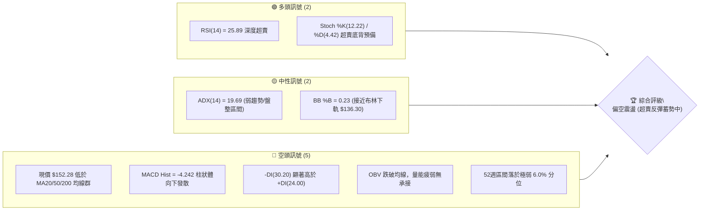
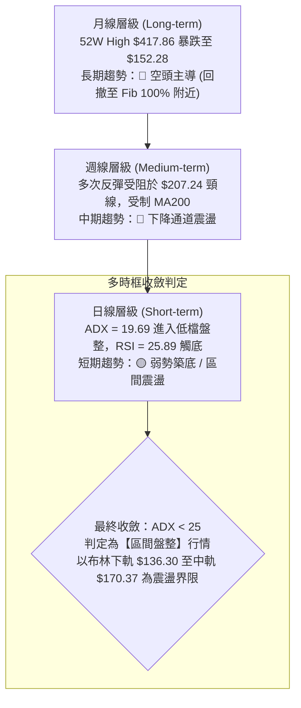
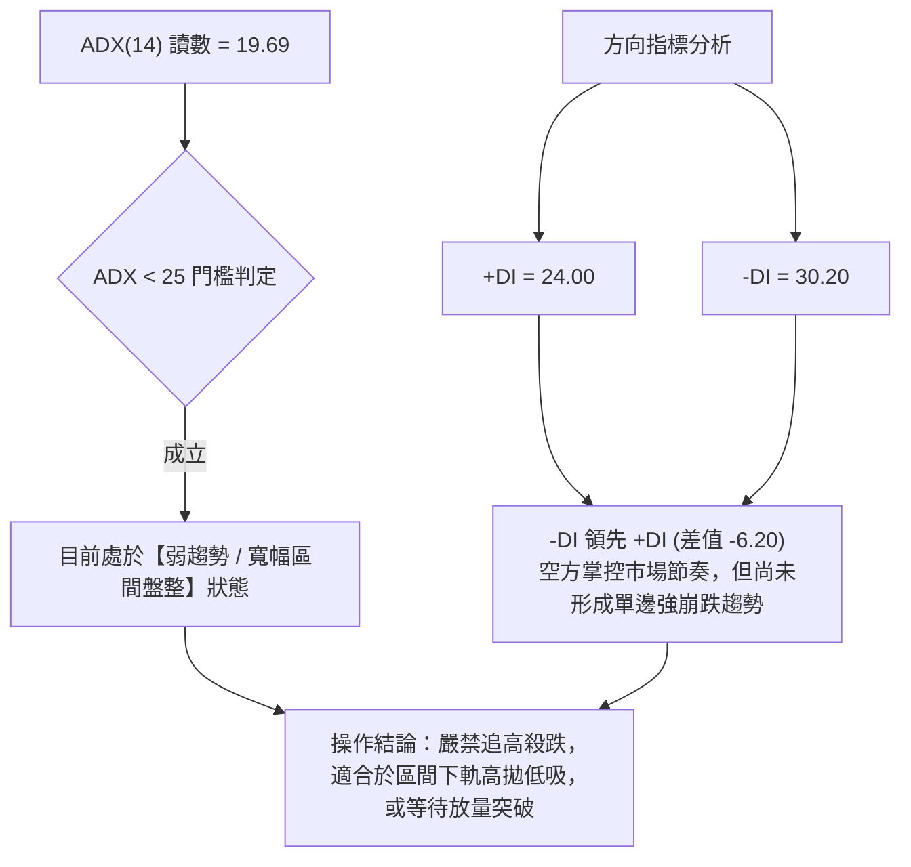
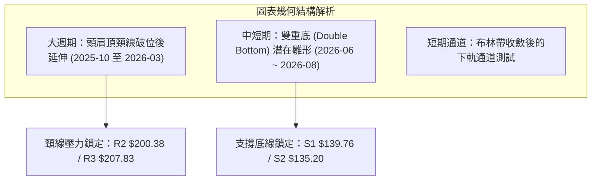
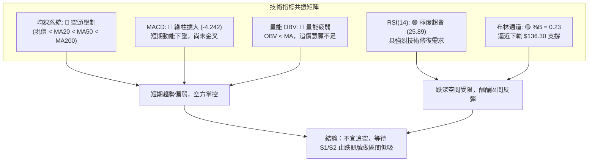
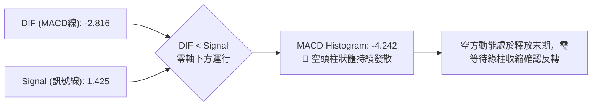
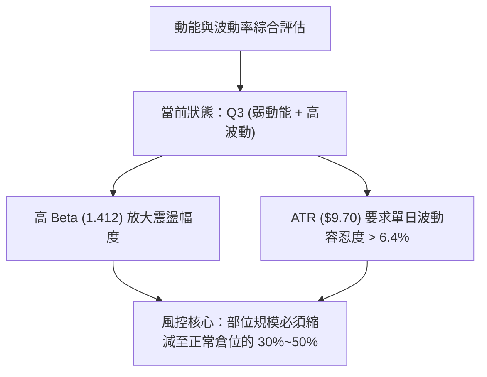
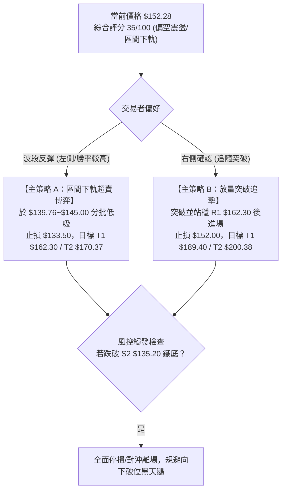
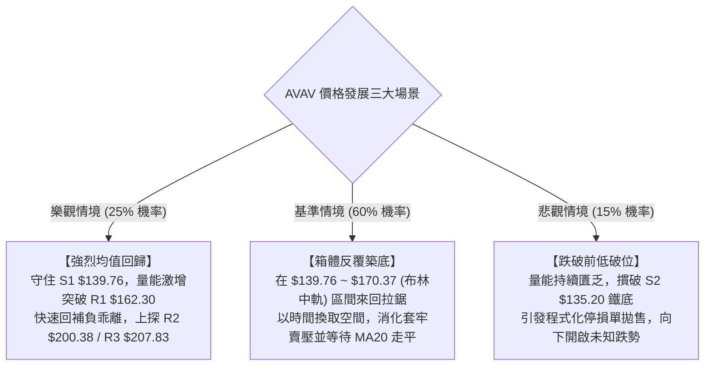

# AVAV 技術分析報告

> **報告日期**：2026-08-28 ｜ **語言**：繁體中文 ｜ **數據來源**：Yahoo Finance ｜ **當前價格**：$152.28

---

## 目錄

| 章節 | 內容 |
|------|------|
| [1. 技術面概覽](#1-技術面概覽) | 訊號儀表板、核心指標、評分卡 |
| [2. 趨勢分析](#2-趨勢分析) | 多時框趨勢、長中短期走勢 |
| [3. 圖表形態分析](#3-圖表形態分析) | 形態識別、K線組合、目標價 |
| [4. 支撐與阻力](#4-支撐與阻力) | 關鍵價位、斐波那契回調 |
| [5. 技術指標深度解讀](#5-技術指標深度解讀) | MA/RSI/MACD/布林/成交量 |
| [6. 動能與波動率](#6-動能與波動率) | 動能評估、ATR、Beta |
| [7. 多時框架總結](#7-多時框架總結) | 時框架評分矩陣 |
| [8. 交易策略建議](#8-交易策略建議) | 多空策略、風險報酬比 |
| [9. 風險提示與監控](#9-風險提示與監控) | 監控指標、風險場景 |

---

## 1. 技術面概覽

### 🎯 技術訊號儀表板



### 📊 核心指標速覽表

| 指標類別 | 指標名稱 | 當前數值 | 訊號 | 解讀 |
|----------|----------|----------|------|------|
| **價格** | 當前價格 | $152.28 | 🔴 | 位於 52 週低檔區間 (6.0% 分位)，空方壓制明顯 |
| **均線** | MA20 | $170.37 | 🔴 | 價格低於 MA20 達 -10.62%，短期反彈第一壓力線 |
| **均線** | MA50 | $159.73 | 🔴 | 價格低於 MA50，中期結構偏空 |
| **均線** | MA200 | $217.36 | 🔴 | 價格遠低於長期生命線 -29.94%，長期空頭主導 |
| **動能** | RSI(14) | 25.89 | 🟢 | 進入極度超賣區間 (<30)，具技術性反彈動能 |
| **動能** | MACD | -2.816 / 1.425 | 🔴 | DIF 位於 Signal 下方，Hist 為 -4.242，空頭動能釋放 |
| **波動** | ATR(14) | $9.70 | 🟡 | 佔股價 6.37%，日均振幅大，操作需拉開風控間距 |

### 🏆 技術評分卡

```
╔══════════════════════════════════════════════════════════════╗
║              技術評分卡 — AVAV (2026-08-28)                   ║
╠══════════════════════════════════════════════════════════════╣
║ 趨勢強度 (ADX/DI)   ████░░░░░░░░░░░░░░░░  25/100  🔴 空頭壓制 ║
║ 動能指標 (RSI/MACD) ████████░░░░░░░░░░░░  40/100  🟡 超賣醞釀 ║
║ 支撐穩定度 (S1/S2)  ████████████░░░░░░░░  60/100  🟡 考驗前低 ║
║ 成交量配合 (OBV/VOL)██████░░░░░░░░░░░░░░  30/100  🔴 量能渙散 ║
║ 形態完整度 (Pattern)████████░░░░░░░░░░░░  40/100  🟡 箱底震盪 ║
║ 均線排列 (MovingAvg)████░░░░░░░░░░░░░░░░  20/100  🔴 空頭排列 ║
╠══════════════════════════════════════════════════════════════╣
║ 綜合評分            ███████░░░░░░░░░░░░░  35/100  🔴 偏空震盪 ║
╚══════════════════════════════════════════════════════════════╝
```

---

## 2. 趨勢分析

### 🌐 多時框趨勢分析



### 📈 長期趨勢 — 12個月走勢圖（Unicode）

```
AVAV 月線走勢圖（過去12個月：2025-08 至 2026-08）
價格軸 ($)
$370 ┤                                      ● (2025-10 $369.91 高點)
$340 ┤                                
$310 ┤                          ● (2025-09 $314.89)
$280 ┤                                            ● (2025-11)           ● (2026-01 $278.39)
$250 ┤                    ● (2025-08 $241.35)           ● (2025-12)           ● (2026-02)
$220 ┤                                                                              
$190 ┤                                                                                    ● (2026-04)   ● (2026-05 $207.24)
$160 ┤                                                                                                        ● (2026-06)   ●(現在 $152.28)
$130 ┤                                                                                                              ● (2026-07 $149.37)
     └───────────────────────────────────────────────────────────────────────────────────────────────────────────────────────
       25-08 25-09 25-10 25-11 25-12 26-01 26-02 26-03 26-04 26-05 26-06 26-07 26-08
```

#### 走勢特徵分析表格

| 階段區間 | 時間跨度 | 起止價格 | 漲跌幅 | 走勢特徵與結構意涵 |
|----------|----------|----------|--------|--------------------|
| 衝頂階段 | 2025-08 ~ 2025-10 | $241.35 → $369.91 | +53.27% | 主升浪末端噴出，創下歷史高點區域（最高曾達 $417.86） |
| 首波崩跌 | 2025-10 ~ 2026-03 | $369.91 → $183.05 | -50.52% | 高檔多頭潰敗，連續長黑摜破 MA50 與 MA200，籌碼大幅套牢 |
| 弱勢反彈 | 2026-03 ~ 2026-05 | $183.05 → $207.24 | +13.22% | 跌深技術性反抽，最高觸及 $207.24 後受阻於頸線區 R3 |
| 二次探底 | 2026-05 ~ 2026-08 | $207.24 → $152.28 | -26.52% | 反彈結束再度下殺，跌破所有均線，測試 52W 低點 $135.20 |

### 📊 中期趨勢（週線分析）

中期走勢呈現典型的一浪低於一浪（Lower Highs & Lower Lows）的空頭下行格局。近 20 週數據顯示，反彈高點從 2026-05-31 的 $207.24 降至 2026-08-16 的 $192.81，隨後兩週急速下跌至 $152.28。

```
中期結構壓力與支撐階梯：
─────────────────────────────────────────────────────────────
[高空壓力] R3: $207.83 (5月反彈大頂與波段頸線)
               ▲
[中期反彈] R2: $200.38 (整數大關與 Fib 78.6% $195.69 密集區)
               ▲
[短期反抽] R1: $162.30 (MA50 $159.73 / 60日均線 $163.25 匯聚區)
───────────────┼─────────────────────────────────────────────
[現價位置]  $152.28 (位於 52W 低點上方 +12.63%)
───────────────┼─────────────────────────────────────────────
[波段防線] S1: $139.76 (6月28日週低點 $137.95 聚類支撐)
               ▼
[終極鐵底] S2: $135.20 (52週最低價 100.0% Fib 回撤點)
─────────────────────────────────────────────────────────────
```

### ⚡ 趨勢強度評估（ADX 解讀）



| 指標名稱 | 當前讀數 | 門檻區間 | 強度評估 | 市場含義解讀 |
|----------|----------|----------|----------|--------------|
| **ADX(14)** | 19.69 | < 25 (弱趨勢) | ░░░░░░░░░░ 19.7% | 單邊趨勢動能衰竭，價格進入震盪箱體築底階段 |
| **+DI** | 24.00 | 0 ~ 100 | ████░░░░░░ 24.0% | 多頭買盤力道偏弱，缺乏主動進攻資金 |
| **-DI** | 30.20 | 0 ~ 100 | ██████░░░░ 30.2% | 空頭賣壓仍占上風，但未達到極端恐慌發散階段 |

---

## 3. 圖表形態分析

### 🔍 形態識別系統



#### 形態信心度評估表（依規則 15）

| 形態名稱 | 信心度 | 判斷依據（引用數據） | 完成度 | 目標價（附精確計算式） |
|----------|--------|----------------------|--------|------------------------|
| **潛在雙重底 (Double Bottom)** | 62% | 第一次低點為 2026-06-28 的 $137.95，第二次低點逼近 2026-07 的 $149.37 與支撐 S1 $139.76，現價 $152.28 處於右底回升段 | 45% | 若突破頸線 R1 $162.30：<br/>$162.30 + ($162.30 - $135.20) = **$189.40** (接近 8月中旬高點 $192.81) |
| **下降收斂楔形** | 55% | 高點逐步壓低 ($207.24 → $192.81)，低點在 $135.20~$137.95 獲支撐，波動幅度由 ATR $9.70 逐步收斂 | 60% | 向上破軌目標為楔形起點 R2 **$200.38** |
| **大型頭肩頂 (已完成破位)** | 85% | 左肩 $314.89、頭部 $369.91、右肩 $278.39，頸線在 $241.89，破位後最低觸及 $135.20 (已達成跌幅滿足) | 100% | 形態跌幅滿足點已於 52W Low $135.20 附近全數消化完畢 |

### 🕯️ 重要K線形態分析

| 週/月份 | 收盤價 | K線形態 | 形態深度解讀 | 技術訊號 |
|---------|--------|---------|--------------|----------|
| **2026-05-31** | $207.24 | 長陽突破大K棒 | 單週放量 9.64M，突破短期均線，形成波段高點 R3 | 🟢 強多訊號 (短線見頂) |
| **2026-06-28** | $137.95 | 長下影崩跌探底線 | 成交量爆出 11.88M，觸及 52W 低點 $135.20 邊緣後強烈抵抗 | 🟡 恐慌拋售底 (Panic Low) |
| **2026-07-05** | $190.89 | 巨量吞噬陽線 | 單週暴增至 18.31M 歷史巨量，確認低檔有強力法人主力護盤 | 🟢 強力反轉訊號 |
| **2026-08-16** | $192.81 | 上影倒錘頭線 | 週量 5.93M 萎縮，反彈受阻於 Fib 78.6% $195.69 關鍵阻力 | 🔴 動能衰竭滯漲 |
| **2026-08-30** | $152.28 | 連續中黑下挫棒 | 兩週自 $192.81 快速回吐，週線 RSI 跌至 25.9 極端超賣 | 🔴 空方釋放 / 🟢 超賣孕育 |

### 📉 ASCII 走勢形態示意圖

```
AVAV 雙底築底形態示意圖（2026年6月 - 8月）
────────────────────────────────────────────────────────────────────────
$207.83 (R3) ┬                                       ● (5/31 高點 $207.24)
             │                                      / \
$192.81      ┤                    ● (7/05 $190.89) /   \      ● (8/16 $192.81 雙底頸線區)
             │                   / \              /     \    / \
$162.30 (R1) ┼──────────────────/───\────────────/───────\──/───\────── (頸線關鍵分水嶺)
             │                 /     \          /         \/     \
$152.28      ┤◄───────────────/───────\────────/──────────────────● (現價測試右側支撐)
             │               /         \      /
$137.95 (S1) ┼───────● (6/28 左底 $137.95)   \/ (7/19 $142.20)
             │      /
$135.20 (S2) ┴─────● (52W Low 終極底)
────────────────────────────────────────────────────────────────────────
```

---

## 4. 支撐與阻力

### 🗺️ 關鍵價位分布圖（Unicode）

```
AVAV 價位結構分布圖
═══════════════════════════════════════════════════════════════════
$207.83 ║████████████████████████████████║ 強阻力 R3 (5月反彈極限大頂)
$200.38 ║████████████████████████        ║ 阻力 R2 (整數關卡 / 密集成交區)
$162.30 ║████████████████                ║ 關鍵阻力 R1 (MA50 $159.73 匯聚)
$152.28 ╠════════════════════════════════╣ ◄ 當前價格 $152.28 (Fib 78.6% 下方)
$139.76 ║▓▓▓▓▓▓▓▓▓▓▓▓▓▓▓▓▓▓▓▓            ║ 近期支撐 S1 (6月波段回踩密集成交區)
$135.20 ║████████████████████████████████║ 強支撐 S2 (52週最低點 / Fib 100.0%)
═══════════════════════════════════════════════════════════════════
```

### 🚧 阻力位分析表

| 阻力級別 | 價位 | 形成原因 | 突破難度 | 重要性 |
|----------|------|----------|----------|--------|
| **R1** | **$162.30** | 近一年波段高點聚類；與 MA50 ($159.73)、MA60 ($163.25) 形成重疊共振壓力區 | 中等 | 🟢 短線翻多關鍵點 |
| **R2** | **$200.38** | 近一年波段次高聚類；心理整數關卡，緊鄰 Fib 78.6% ($195.69) 與 8月中旬高點 ($192.81) | 極高 | 🟡 中期多空分水嶺 |
| **R3** | **$207.83** | 2026-05-31 週線波段高點聚類 ($207.24)；為 2026 上半年反彈最高峰頂部頸線 | 巨大 | 🔴 長期趨勢反轉點 |

### 🛡️ 支撐位分析表

| 支撐級別 | 價位 | 形成原因 | 守住機率 | 重要性 |
|----------|------|----------|----------|--------|
| **S1** | **$139.76** | 近一年波段低點聚類；與 2026-06-28 爆量低點 ($137.95) 及布林下軌 ($136.30) 形成密集緩衝帶 | 70% | 🟢 短線多頭防禦第一線 |
| **S2** | **$135.20** | 52 週最低價 (52W Low)；斐波那契 100.0% 回撤基準點，歷史級機構籌碼護盤底 | 85% | 🔴 絕對不可失守之鐵底 |

### 📐 斐波那契回調位分析（52週區間 $135.20 → $417.86）

```
斐波那契黃金分割回撤階梯：
─────────────────────────────────────────────────────────────────
  0.0%  (52W High)   $417.86 ── 歷史極限頂部
 23.6%               $351.15 ── 極強支撐轉強壓力
 38.2%               $309.88 ── 2025年9月震盪中樞
 50.0%               $276.53 ── 2026年1月次高反彈頂 ($278.39)
 61.8%               $243.18 ── 黃金分割關鍵多空線 (MA240 $239.09)
 78.6%               $195.69 ── 近期反彈阻力極限區 (8/16 高點 $192.81)
─────────────────────────────────────────────────────────────────
 ◄ 現價 $152.28 位於 78.6% ($195.69) 與 100.0% ($135.20) 深度超跌區間
─────────────────────────────────────────────────────────────────
100.0%  (52W Low)    $135.20 ── 歷史基準起漲鐵底
─────────────────────────────────────────────────────────────────
```

**解讀**：現價 $152.28 處於斐波那契深度回撤區（78.6%~100.0% 之間），僅高出 100% 基準點 $135.20 約 12.63%。在技術分析幾何學中，78.6%~100.0% 為典型的「機構最後防禦區」，下檔空間被壓縮在 $17.08 (11.2%) 之內，向下空間相對有限。

---

## 5. 技術指標深度解讀

### 🎛️ 指標訊號總覽



### 📈 移動平均線排列分析

```
均線距離現價偏離度：
MA 5   : $151.00  [+0.85%]  ▲ 站上極短期均線
MA 10  : $163.56  [-6.90%]  ▼ 位於短期均線下方
MA 20  : $170.37  [-10.62%] ▼ 位於月線均線下方
MA 50  : $159.73  [-4.66%]  ▼ 位於季線均線下方
MA 60  : $163.25  [-6.72%]  ▼ 位於季線均線下方
MA 120 : $176.68  [-13.81%] ▼ 位於半年線均線下方
MA 200 : $217.36  [-29.94%] ▼ 位於年線均線下方
MA 240 : $239.09  [-36.31%] ▼ 位於年線均線下方
```

均線系統呈現標準的**空頭排列與混合發散狀態**。短期 MA5 ($151.00) 雖然微幅金叉現價，但上方受到 MA50 ($159.73) 與 MA20 ($170.37) 的層層壓制。價格偏離 MA200 達 -29.94%，負乖離率處於年內極端水準，隨時可能引發向 MA20/MA50 靠攏的「乖離修復行情」。

### 📉 RSI(14) 分析

```
RSI(14) 當前數值：25.89
0 ══════════════ 30 ════════════════════ 70 ══════════════ 100
[█████████████░░░░░░░░░░░░░░░░░░░░░░░░░░░░░░░░░░░░░░░░░] 25.89 (超賣)
```

- **超買超賣判定**：RSI(14) 來到 **25.89**，已深度跌破 30 基準超賣門檻，進入恐慌超賣區。
- **背離分析**：數據提示此前存在 ⚠️ **頂背離**（2026-08-16 價格 $192.81 未過 5月高點 $207.24，但 RSI 衝至 73.5 高檔鈍化後崩落），目前頂背離殺跌動能已釋放 80% 以上。短期在 $139.76~$152.28 區間若能止跌，將形成新的**日線級別底背離雛形**。

### 📊 MACD(12/26/9) 訊號解讀



MACD DIF (-2.816) 位於 Signal (1.425) 下方，且差離柱 (Hist) 達到 -4.242。這表明由 $192.81 引發的短期回落仍具慣性。然而，由於 DIF 已深陷零軸下方負值區，綠柱體再大幅擴大的空間受限，需密切關注柱狀體由長變短的「動能收斂點」。

### 📦 布林通道分析

```
布林帶 (Bollinger Bands) 區間位置：
─────────────────────────────────────────────────────────────
上軌 (Upper Band)   : $204.45 (阻力位 R3 $207.83 附近)
中軌 (Middle MA20)  : $170.37 (阻力位 R1 $162.30 上方)
現價 (Current Price): $152.28 ◄ [BB %B = 0.23] 接近通道底部
下軌 (Lower Band)   : $136.30 (支撐位 S2 $135.20 附近)
─────────────────────────────────────────────────────────────
通道帶寬 (Bandwidth): ($204.45 - $136.30) / $170.37 = 39.99% (寬幅震盪)
```

**解讀**：當前 BB %B 為 **0.23**，顯示價格已經高度貼近布林下軌 ($136.30)。在 ADX = 19.69（盤整行情）的背景下，布林下軌具備強大的統計學邊界支撐效果，價格通常會在 0.10~0.20 %B 區間獲得支撐並向中軌 ($170.37) 回歸。

### 💹 成交量分析（量價配合度）

- **最新成交量**：1,335,700 股，相較 20日均量 (1,206,110 股) 量比為 **1.11x**，微幅放量收黑。
- **中長期均量比較**：當前量能顯著低於 50日均量 (1,723,560 股)，且遠低於 7月初見底時的 18.31M 週天量。
- **OBV 走勢解讀**：OBV 跌破其移動平均線，表明大資金在當前價位尚未展開全面性的主動性買盤，量能呈現「縮量陰跌」特徵。唯有當成交量再度放大至 50日均量之上且收陽時，方能確認量價共振反彈。

---

## 6. 動能與波動率

### ⚡ 動能評估四象限

| 象限 | 動能維度 | 波動維度 | AVAV 當前狀態 | 策略應對評估 |
|------|----------|----------|---------------|--------------|
| **Q1 (動能爆發)** | 強 (RSI>50, MACD>0) | 低 (ATR收斂) | ─ | 最佳突破加碼點 |
| **Q2 (盤整修復)** | 弱 (RSI<30, 負動能) | 低 (ADX<25, 窄幅) | ─ | 謹慎觀望，等待結構明朗 |
| **Q3 (極端超賣)** | **弱 (RSI=25.89, Hist=-4.24)** | **高 (ATR=$9.70, Beta=1.41)** | **✓ (當前所處位置)** | **跌深反彈蓄勢，嚴控止損低吸** |
| **Q4 (強勢洗盤)** | 強 (多頭掌控) | 高 (寬幅震盪) | ─ | 順勢逢回買進 |



### 📊 ATR 波動率分析

- **ATR(14) 絕對值**：**$9.70**
- **ATR 相對股價比**：$9.70 / $152.28 = **6.37%**
- **風控應用指引**：
  - **短線止損緩衝距離**：1.5 × ATR = $14.55
  - **波段止損安全邊界**：2.0 × ATR = $19.40
  - **操作含義**：日內或單週價格雜訊極大，若止損設置在現價 2%~3% 之內極易被市場雜訊掃出場，必須參考波段支撐位 S1 ($139.76) 與 S2 ($135.20) 進行結構化設防。

### 📐 Beta 與市場相關性

- **Beta 係數**：**1.412**（高彈性防禦科技/軍工個股）
- **市場連動分析**：AVAV 對大盤（標普500/納斯達克）的波動敏感度高達 1.41 倍。在大盤多頭環境下具備高彈性爆發力，但在大盤回調或市場避險情緒升溫時，其跌幅亦會被顯著放大。當前高 Beta 屬性意味著反彈時潛在獲利彈性大，但左側建倉必須嚴格分批。

---

## 7. 多時框架總結

### 📋 時框架評分表

| 時框架 | 趨勢方向 | 動能狀態 | 均線排列 | 形態結構 | 綜合評分 | 操作建議 |
|--------|----------|----------|----------|----------|----------|----------|
| **月線 (長期)** | 🔴 偏空 | RSI 處於低檔 | 空頭排列 (破 MA200) | 52W 高檔崩跌修正 | 30/100 | 嚴禁長線重倉，等待底部型態 |
| **週線 (中期)** | 🔴 偏空 | 下降通道 | 混合排列 (受阻 MA50) | 潛在寬幅雙底震盪 | 40/100 | 依託 S1/S2 尋求區間波段機會 |
| **日線 (短期)** | 🟡 震盪 | RSI=25.89 極度超賣 | 空頭發散 (負乖離大) | 測試布林下軌支撐 | 35/100 | 逢低博取超賣均值回歸反彈 |

### 🔲 綜合訊號矩陣

```
時框訊號一致性矩陣：
┌───────────┬──────────────┬──────────────┬──────────────┬──────────────┐
│  維度 / 時框│     日線     │     週線     │     月線     │   共振權重   │
├───────────┼──────────────┼──────────────┼──────────────┼──────────────┤
│ 均線系統  │   🔴 空頭    │   🔴 空頭    │   🔴 空頭    │  強力看空 (3/3)│
│ 動能指標  │   🟢 超賣    │   🟡 偏弱    │   🔴 下行    │  低檔背離 (1/3)│
│ 形態支撐  │   🟢 逼近S1   │   🟢 雙底支撐│   🟡 考驗前低│  支撐共振 (2.5/3)│
│ 波動位階  │   🟡 帶寬擴大│   🔴 高波動  │   🔴 劇烈回撤│  風控警示 (2/3)│
└───────────┴──────────────┴──────────────┴──────────────┴──────────────┘
```

### ⚖️ 多時框收斂結論（依嚴格要求 14）

1. **趨勢/盤整優先級判定**：當前 ADX(14) 讀數為 **19.69 (< 25)**，明確判定當前市場處於**【寬幅區間盤整行情】**，而非單邊趨勢行情。
2. **主導時框收斂**：依據規則，在盤整行情中，日線布林通道上下軌（下軌 $136.30 至上軌 $204.45）及關鍵支撐阻力（S1 $139.76 / R1 $162.30）為主要操作界限。
3. **唯一方向性結論**：**【偏空震盪中的極度超賣，以區間下軌高拋低吸/超賣反彈為主】**。此結論嚴格貫徹至第 8 章交易策略。

---

## 8. 交易策略建議

### 🗺️ 策略決策流程圖



### 🧭 策略路由

> **當前主策略方向 = 偏空震盪下的「區間下軌超賣反彈」策略（依技術評分卡 35/100 評定）**  
> 說明：評分處於 35/100 偏空區間，但因 ADX<25 且 RSI 深度超賣 (25.89)，嚴禁在 52W 低點附近追空。整體基調為：**空頭主導下尋求極端超賣的反抽波段，嚴設停損**。

### 🎯 價格情境階梯（Price Scenarios）

| 觸發條件 | 第一目標 (T1) | 第二目標 (T2) | 後續延伸 (T3) | 情境技術含義 |
|----------|---------------|---------------|---------------|--------------|
| **向上放量突破 R1 $162.30** | R2 **$200.38** | R3 **$207.83** | Fib 61.8% **$243.18** | 站穩 MA50，確認日線雙底成形，展開中期補漲行情 |
| **於現價區間 $139.76~$152.28 築底** | MA20 **$170.37** | Fib 78.6% **$195.69** | — | 布林下軌引發均值回歸，區間震盪消化賣壓 |
| **向下跌破 S1 $139.76** | S2 **$135.20** | 布林下軌延伸區 | 空頭破位加速 | 考驗 52 週最低點鐵底，多頭最後防線 |
| **不幸失守 S2 $135.20** | 數據中未偵測到 | 歷史新低探底 | — | 結構全面崩壞，進入無支撐自由落體恐慌期 |

### 📊 情境機率分佈

| 情境劇本 | 發生機率 | 主要技術指標依據 |
|----------|----------|------------------|
| **情境一：下軌支撐回升 (區間反彈)** | **55%** | RSI(14)=25.89 極度超賣、Stoch %K/%D 低檔鈍化、BB %B=0.23 貼近下軌 |
| **情境二：區間窄幅沉澱 (打底震盪)** | **30%** | ADX=19.69 趨勢疲弱、OBV 量能萎縮、均線空頭排列壓制上行速度 |
| **情境三：摜破前低崩跌 (破底恐慌)** | **15%** | -DI(30.20) 顯著大於 +DI(24.00)、MACD Hist 綠柱持續發散 (-4.242) |

### 🟢 主策略詳情

| 策略要素 | 策略 A（左側：超賣低吸策略） | 策略 B（右側：突破加碼策略） |
|----------|------------------------------|------------------------------|
| **適用時機** | 價格回踩 S1 附近或現價超跌買進 | 價格放量突破 R1 阻力確認轉強 |
| **進場條件** | 觸及 $139.76~$145.00 且 15分K 出現長下影 | 日線收盤價放量站穩 R1 $162.30 之上 |
| **進場價格** | **$142.00**（分批掛單） | **$163.00** |
| **第一目標 (T1)** | **$162.30** (阻力 R1 / +14.30%) | **$189.40** (雙底形態目標 / +16.20%) |
| **第二目標 (T2)** | **$170.37** (MA20 中軌 / +19.98%) | **$200.38** (阻力 R2 / +22.93%) |
| **止損價格** | **$133.50** (跌破 S2 $135.20 之下 1.2%) | **$152.00** (跌破突破前平台) |
| **風險報酬比 (R:R)** | **2.39 : 1** (以 T1 計算) / **3.34 : 1** (T2) | **2.40 : 1** (以 T1 計算) / **3.40 : 1** (T2) |
| **預估勝率** | 58% | 52% |
| **建議倉位** | 總資金之 **5% ~ 8%** (輕倉防守型) | 總資金之 **8% ~ 12%** (趨勢確認型) |

### 🔴 反向風險觸發點（對沖提示）

若發生以下任一訊號，主推之多頭反彈邏輯立即宣告失效，應嚴格執行止損或建立反向空頭對沖：
1. **價位擊穿**：日線收盤價跌破 **S2 $135.20**（52W Low 鐵底破位）。
2. **動能惡化**：RSI(14) 跌破 20 且未能迅速收回，MACD Hist 跌破 -6.00 呈現失控下墜。
3. **對沖建議**：跌破 $135.20 時，可利用現貨減倉 70% 或買入等值 Put 選擇權規避黑天鵝風險。

### ⭐ 整體訊號強度評星

```
做多訊號強度：★★☆☆☆  (2.0/5星 — 僅屬跌深超賣反彈，非大級別反轉)
做空訊號強度：★★★☆☆  (3.0/5星 — 中長期空頭主導，但短期空間受限)
整體可信度：  ★★★☆☆  (3.5/5星 — 支撐阻力明確，ADX 確立盤整特徵)
```

---

## 9. 風險提示與監控

### ✅ 關鍵監控指標 Checklist

```
╔══════════════════════════════════════════════════════════════════╗
║               AVAV 技術監控 CHECKLIST                            ║
╠══════════════════════════════════════════════════════════════════╣
║ [ ] 價格能否有效守穩支撐 S1 ($139.76) 與 S2 ($135.20)            ║
║ [ ] RSI(14) 能否由超賣區 (<30) 向上金叉 35 走出鈍化              ║
║ [ ] 日成交量能否回升至 50日均量 (1.72M) 以上配合陽線放量         ║
║ [ ] MACD 綠柱是否出現連續兩日收縮 (Hist > -3.00)                 ║
║ [ ] 價格是否受制於 MA50 ($159.73) 與 R1 ($162.30) 反壓           ║
║ [ ] ADX(14) 是否突破 25，若向上突破需觀察是多方還是空方帶動      ║
╚══════════════════════════════════════════════════════════════════╝
```

### ⚠️ 風險場景分析



### 🛡️ 風險管理重要提醒

1. **波動率風控**：AVAV 的 ATR 高達 **$9.70 (6.37%)**，單日振幅劇烈。單筆交易之最大虧損金額嚴格限制在總投資組合淨值的 **1.0%** 以內。
2. **倉位管理**：鑑於當前均線系統仍處於全面空頭壓制之下，目前所有進場均定義為「左側博弈」或「超賣反抽」，**嚴禁重倉押注**。建議總倉位不超過整體帳戶的 10%。
3. **盈虧比紀律**：進場前必須嚴格核算風險報酬比，若進場點與 S2 止損點差距過大導致 R:R 低於 2:1，應放棄交易等待更佳的掛單點位。

---

## 📋 報告總結

```
╔══════════════════════════════════════════════════════════════════╗
║                    AVAV 技術分析報告總結                         ║
╠══════════════════════════════════════════════════════════════════╣
║ 報告日期：2026-08-28                                             ║
║ 當前價格：$152.28                                                ║
║ 分析評級：⚖️ 偏空震盪 (區間超賣醞釀反彈)                         ║
║                                                                  ║
║ 關鍵結論：                                                       ║
║ ├─ 長期趨勢：🔴 空頭主導 (自 $417.86 回撤至 100% 斐波那契區間)   ║
║ ├─ 中期趨勢：🔴 弱勢震盪 (ADX=19.69 顯示進入寬幅箱體修復)        ║
║ ├─ 短期趨勢：🟢 超賣蓄勢 (RSI=25.89，逼近布林下軌 $136.30)       ║
║ ├─ 關鍵支撐：S1: $139.76  /  S2: $135.20 (52W Low 鐵底)          ║
║ ├─ 關鍵阻力：R1: $162.30  /  R2: $200.38  /  R3: $207.83         ║
║ └─ 分析師目標價：均價 $225.77 (高 $326.00 / 低 $148.57)          ║
║                                                                  ║
║ 最優策略組合：                                                   ║
║ 1. 🥇 最佳機會：於 S1 支撐區 ($139.76~$145.00) 輕倉低吸超賣反彈  ║
║    (止損: $133.50，目標 T1: $162.30，T2: $170.37，R:R = 2.39)    ║
║ 2. 🥈 次選機會：突破 R1 $162.30 後右側追擊雙底形態目標 $189.40   ║
║ 3. 🥉 保守選擇：完全空倉觀望，等待日線 MACD 零軸下金叉再行進場   ║
╚══════════════════════════════════════════════════════════════════╝
```

---

> ⚠️ **免責聲明**：本報告為 AI 自動生成之技術分析，所有數據及估算均基於提供的歷史價格資訊。本報告**僅供研究與學術參考**，**不構成任何投資建議**。投資有風險，入市需謹慎。

---

*報告生成時間：2026-08-28 ｜ 數據來源：Yahoo Finance ｜ 分析框架：多時框技術分析*