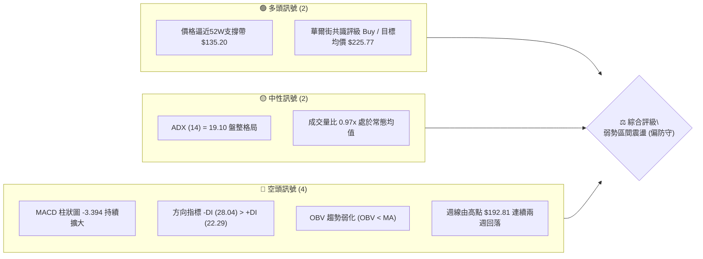
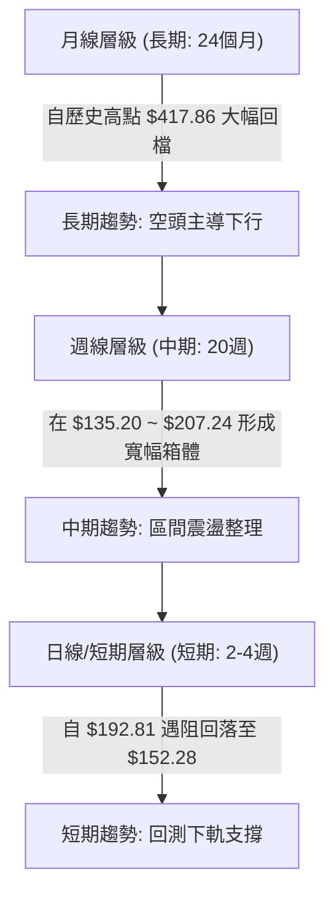
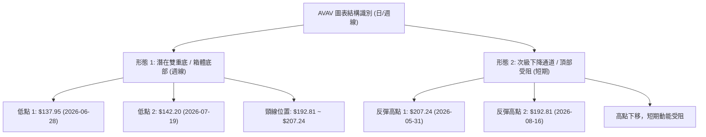
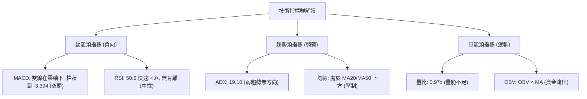
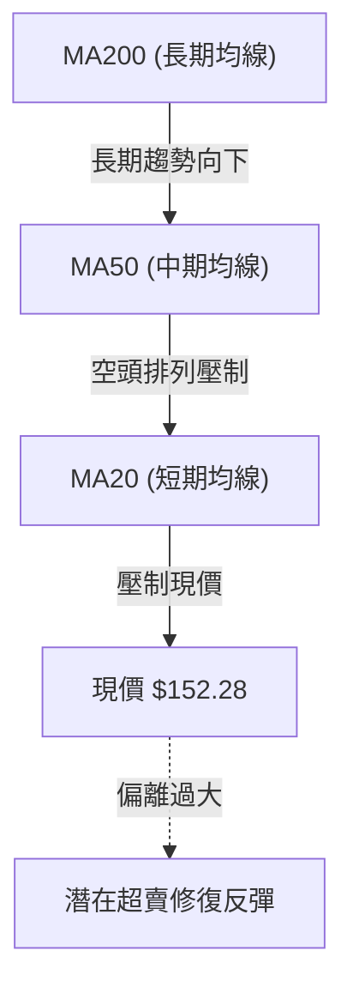
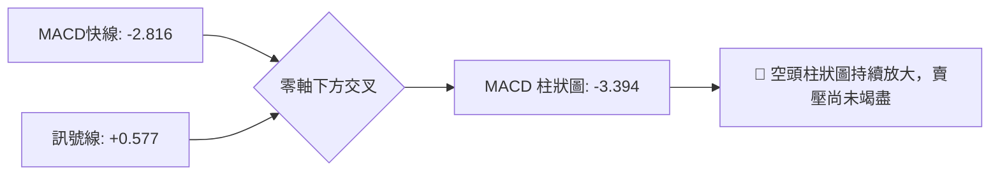
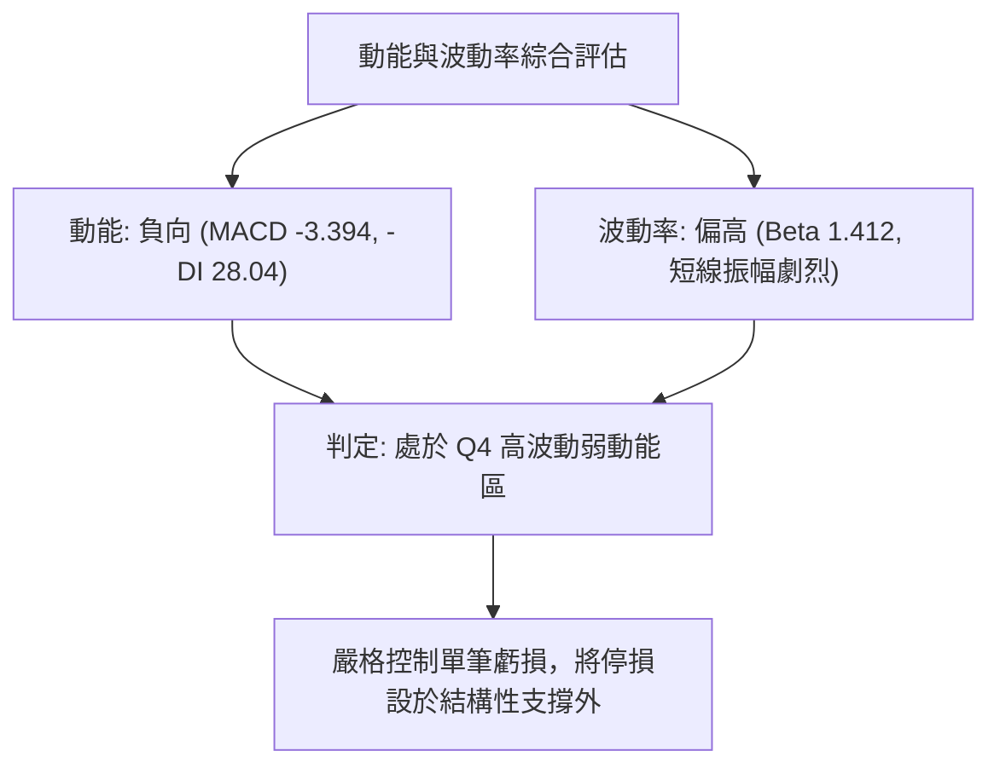
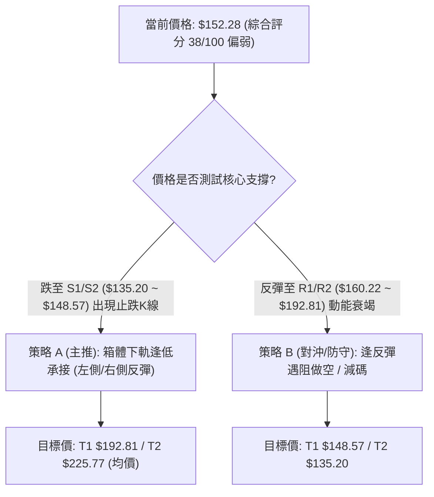
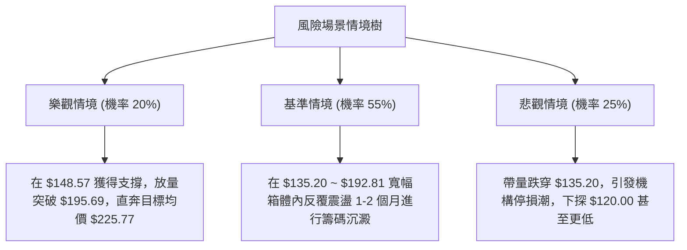

# AVAV 技術分析報告

> **報告日期**：2026-08-29 ｜ **語言**：繁體中文 ｜ **數據來源**：Yahoo Finance ｜ **當前價格**：$152.28

---

## 目錄

| 章節 | 內容 |
|------|------|
| [1. 技術面概覽](#1-技術面概覽) | 訊號儀表板、核心指標、評分卡 |
| [2. 趨勢分析](#2-趨勢分析) | 多時框趨勢、長中短期走勢、ADX 解讀 |
| [3. 圖表形態分析](#3-圖表形態分析) | 形態識別、信心度評估、K線組合、目標價 |
| [4. 支撐與阻力](#4-支撐與阻力) | 關鍵價位分佈、斐波那契回調結構 |
| [5. 技術指標深度解讀](#5-技術指標深度解讀) | 均線、RSI、MACD、布林通道與成交量 |
| [6. 動能與波動率](#6-動能與波動率) | 動能四象限、波動率與 Beta 敏感度 |
| [7. 多時框架總結](#7-多時框架總結) | 時框架矩陣與多時框收斂結論 |
| [8. 交易策略建議](#8-交易策略建議) | 策略路由、情境階梯、進出場與風報比 |
| [9. 風險提示與監控](#9-風險提示與監控) | 監控清單、情境樹與部位管理 |
| [📋 報告總結](#-報告總結) | 核心結論與最優交易矩陣 |

---

## 1. 技術面概覽

### 🎯 技術訊號儀表板



### 📊 核心指標速覽表

| 指標類別 | 指標名稱 | 當前數值 | 訊號 | 解讀 |
|----------|----------|----------|------|------|
| **價格** | 最新收盤價 | $152.28 | 🔴 | 位於 52 週低檔區間，近兩週自 $192.81 快速回撤 |
| **均線** | 均線架構 | 混合排列 | 🔴 | 價格處於中長期均線下方，上方壓制顯著 |
| **動能** | RSI(14) | 中性偏弱 | 🟡 | 8 月中旬衝高至 73.5 後迅速回落至 50 軸線附近 |
| **動能** | MACD (12,26,9) | -2.816 / -3.394 | 🔴 | 訊號線 0.577，柱狀圖為負且擴張，空頭動能主導 |
| **趨勢** | ADX (14) | 19.10 | 🟡 | ADX < 25，無強勢單邊單向趨勢，處於低位盤整 |
| **方向** | DMI (+DI / -DI) | 22.29 / 28.04 | 🔴 | -DI 大於 +DI，空方力量占據盤面主控權 |
| **量能** | OBV 與均量 | 1,178,138 (0.97x) | 🔴 | OBV < MA，反彈量能未能持續，籌碼聚集度偏低 |
| **波動** | Beta 係數 | 1.412 | 🟡 | 高於大盤波動幅度，對市場系統性風險敏感度高 |

### 🏆 技術評分卡

```
╔══════════════════════════════════════════════════════════════════╗
║              技術評分卡 — AVAV (2026-08-29)                      ║
╠══════════════════════════════════════════════════════════════════╣
║ 趨勢強度      ███████░░░░░░░░░░░░░  35/100  🔴 空頭控盤弱勢      ║
║ 動能指標      ██████░░░░░░░░░░░░░░  30/100  🔴 MACD負向擴大      ║
║ 支撐穩定度    ███████████░░░░░░░░░  55/100  🟡 接近52W歷史低點   ║
║ 成交量配合    ███████░░░░░░░░░░░░░  35/100  🔴 OBV量能疲軟       ║
║ 形態完整度    ████████░░░░░░░░░░░░  40/100  🟡 底部箱體構築中    ║
║ 均線排列      ██████░░░░░░░░░░░░░░  30/100  🔴 短中期均線受壓    ║
╠══════════════════════════════════════════════════════════════════╣
║ 綜合評分      ███████░░░░░░░░░░░░░  38/100  🔴 偏空震盪/防守觀望  ║
╚══════════════════════════════════════════════════════════════════╝
```

---

## 2. 趨勢分析

### 🌐 多時框趨勢分析



### 📈 長期趨勢 — 12個月走勢圖（Unicode）

```
AVAV 月線走勢圖（過去12個月：2025-09 至 2026-08）
價格軸 ($)
$370 ┤                   ● 2025-10 ($369.91 波段頂部)
$340 ┤
$310 ┤             ● 2025-09 ($314.89)
$280 ┤                         ● 2025-11 ($279.46)   ● 2026-01 ($278.39)
$250 ┤                               ● 2025-12 ($241.89)   ● 2026-02 ($252.25)
$220 ┤
$190 ┤                                                       ● 2026-04 ($195.02)  ● 2026-05 ($207.24)
$160 ┤                                                               ● 2026-03 ($183.05)   ● 2026-06 ($165.07)  ●←現在 ($152.28)
$130 ┤                                                                                                  ● 2026-07 ($149.37)
     └─────────────────────────────────────────────────────────────────────────────────────────────────────────────────────
        09/25     10/25     11/25     12/25     01/26     02/26     03/26     04/26     05/26     06/26     07/26     08/26
```

#### 走勢特徵分析表格

| 階段區間 | 時間跨度 | 起訖價位 | 漲跌幅 | 走勢特徵解讀 |
|----------|----------|----------|--------|--------------|
| **階段 I：主升頂部** | 2025-09 ~ 2025-10 | $314.89 → $369.91 | +17.47% | 衝刺 52 週高點 $417.86 後形成歷史多頭衰竭點 |
| **階段 II：快速回撤** | 2025-11 ~ 2026-03 | $279.46 → $183.05 | -34.50% | 跌破多道中期均線，形成連續下移的高低點 |
| **階段 III：次級反彈** | 2026-04 ~ 2026-05 | $195.02 → $207.24 | +6.27% | 於 $195.00~$207.00 形成箱體上軌反壓區 |
| **階段 IV：築底震盪** | 2026-06 ~ 2026-08 | $165.07 → $152.28 | -7.75% | 回測 52W 低點 $135.20 附近支撐，當前處於低檔震盪 |

### 📊 中期趨勢（週線分析）

```
近期週線壓力與支撐走勢示意圖：
  $210 ┤            ▲ 05/31 ($207.24 頸線反壓)
  $195 ┤                    ▲ 08/16 ($192.81 局部反彈高點)
  $180 ┤
  $165 ┤                                  ▼ 08/23 ($160.22)
  $150 ┤                                            ● 當前現價 ($152.28)
  $135 ┤       ▼ 06/28 ($137.95 探底)  ▼ 07/19 ($142.20 次低點)
       └───────────────────────────────────────────────────────────
```

中期走勢顯示，AVAV 在 2026 年 6 月底打出低點 $137.95 後，7 月初曾放量（18,317,500 股）強彈至 $190.89，隨後在 8 月中旬再度衝刺至 $192.81，但均在 $195.00 斐波那契回調位（78.6% 回調位 $195.69）受阻回落。

### ⚡ 趨勢強度評估（ADX 解讀）

```mermaid
graph TD
    A["ADX (14) 指標值: 19.10"] --> B{"ADX 門檻判定"}
    B -->|"< 25 (弱趨勢/無方向)|" C["市場處於無趨勢 / 寬幅震盪行情"]
    C --> D["主要操作邏輯: 區間邊界操作 (防守型)"]
    
    E["方向系統: -DI (28.04) vs +DI (22.29)"] --> F{"DI 大小判定"}
    F -->|"-DI > +DI (差值 +5.75)|" G["空方短線控盤，下行動能尚未出清"]
    
    C --- H["綜合結論: 拒絕盲目追多，等待區間底部確認"]
    G --- H
```

#### ADX 趨勢強度對照表

| 指標變數 | 當前讀數 | 標準門檻 | 狀態判斷 | 交易策略指引 |
|----------|----------|----------|----------|--------------|
| **ADX(14)** | **19.10** | 25.00 | 弱趨勢 / 盤整 | 趨勢跟隨無效，回歸高拋低吸或觀望 |
| **+DI(14)** | **22.29** | 25.00 | 多方動能匱乏 | 缺乏突破動能，反彈多為技術性修正 |
| **-DI(14)** | **28.04** | 25.00 | 空方占據優勢 | 短期下行風險仍存，需嚴設止損 |

---

## 3. 圖表形態分析

### 🔍 形態識別系統



#### 形態評估與信心度表格

| 識別形態 | 信心度 | 判斷依據（數據引用） | 完成度 | 形態目標價（附計算式） |
|----------|--------|----------------------|--------|------------------------|
| **潛在雙重底 (Double Bottom)** | **58%** | 兩次下探支撐：2026-06-28 週低點 $137.95 與 2026-07-19 週低點 $142.20，均在 52W 低點 $135.20 上方止跌。 | 60% (尚未突破頸線) | 若突破頸線 $192.81：<br>形態高度 = $192.81 - $137.95 = $54.86<br>理論目標 = $192.81 + $54.86 = **$247.67** (鄰近 Fib 61.8% $243.18) |
| **區間下降三角/箱體震盪** | **65%** | 底部支撐連線 ($135.20~$137.95) 水平，而高點逐步下移 ($207.24 → $192.81)。 | 75% (處於向下回測期) | 若跌破 $135.20 支撐：<br>箱體高度 = $192.81 - $135.20 = $57.61<br>向下等距測幅 = $135.20 - $57.61 = **$77.59** (極端下行風險) |

### 🕯️ 重要K線形態分析

| 週期/日期 | 收盤價 | K線形態特徵 | 技術面解讀 | 多空訊號 |
|-----------|--------|-------------|------------|----------|
| **2026-07-05** | $190.89 | 巨量長陽線 (週量 18.3M) | 底部放量強力反彈，確認 $137.95 為有效技術支撐 | 🟢 多頭放量 |
| **2026-08-16** | $192.81 | 高位十字星/流星回落 (RSI 73.5) | 連續測試 $192~$195 阻力失敗，技術面嚴重超買回調 | 🔴 空頭壓制 |
| **2026-08-23** | $160.22 | 中陰線吞沒 (MACD 由正轉負 -2.279) | 跌破短期支撐，動能轉弱，多頭停損賣壓湧現 | 🔴 空頭吞噬 |
| **2026-08-30** | $152.28 | 連續下行收斂陰線 (MACD柱 -3.394) | 逼近前低，成交量維持 5.98M，空方動能釋放中 | 🔴 弱勢整理 |

### 📉 ASCII 走勢形態示意圖

```
AVAV 雙底/箱體與下降趨勢線示意圖
價格 ($)
$210 ┤            [頸線高點1: $207.24]
$195 ┤     .............................[頸線高點2: $192.81]....... (斐波那契 78.6% $195.69)
$180 ┤    /                             \             \
$165 ┤   /                               \             \
$150 ┤  /                                 \             ● [現價: $152.28 逼近下軌]
$135 ┤─┴──────[底1: $137.95]───────────────┴─[底2: $142.20]──────── (52W Low: $135.20)
     └─────────────────────────────────────────────────────────────
```

---

## 4. 支撐與阻力

### 🗺️ 關鍵價位分布圖（Unicode）

```
AVAV 價位結構分布圖
═══════════════════════════════════════════════════════════════════
$417.86 ║████████████████████████████████║ 52週歷史高點 (Fib 0.0%)
$309.88 ║████████████████████            ║ 中期強阻力 R4 (Fib 38.2%)
$243.18 ║████████████████████████        ║ 重大結構阻力 R3 (Fib 61.8%)
$195.69 ║████████████████████████████    ║ 關鍵波段阻力 R2 (Fib 78.6% / 頸線 $192.81)
$160.22 ║████████████                    ║ 短線反壓位 R1 (前週收盤 / 破位點)
$152.28 ╠════════════════════════════════╣ ◄─── 當前現價 ($152.28)
$148.57 ║▓▓▓▓▓▓▓▓▓▓▓▓                    ║ 分析師最低目標價 / 近期支撐 S1
$135.20 ║████████████████████████████████║ 52週低點 / 核心支撐 S2 (Fib 100.0%)
═══════════════════════════════════════════════════════════════════
```

### 🚧 阻力位分析表

| 阻力級別 | 價位 | 形成原因與技術來源 | 突破難度 | 重要性評級 |
|----------|------|--------------------|----------|------------|
| **R1 (短線阻力)** | **$160.22** | 2026-08-23 週收盤破位點，短期下行均線下壓區域 | 🟡 中等 | ★★★☆☆ |
| **R2 (波段頸線)** | **$195.69** | 斐波那契 78.6% 回調位，重疊 2026-08-16 高點 $192.81 與 07-05 高點 $190.89 | 🔴 極高 | ★★★★★ |
| **R3 (強阻力)** | **$243.18** | 斐波那契 61.8% 回調位，2025-12 月線平台密集換手區 | 🔴 極高 | ★★★★☆ |
| **R4 (中期分水嶺)**| **$309.88** | 斐波那契 38.2% 回調位，2025-09 突破前起漲點 | 🔴 難以逾越 | ★★★☆☆ |

### 🛡️ 支撐位分析表

| 支撐級別 | 價位 | 形成原因與技術來源 | 守住機率 | 重要性評級 |
|----------|------|--------------------|----------|------------|
| **S1 (短線支撐)** | **$148.57** | 華爾街分析師目標價下限 (Analyst Target Low) 及 07-26 收盤 $149.51 | 60% | ★★★☆☆ |
| **S2 (核心支撐)** | **$135.20** | 52 週絕對低點 (Fib 100.0%)，2026-06-28 探底 $137.95 守穩區域 | 75% | ★★★★★ |

### 📐 斐波那契回調位分析

依據 52 週極值區間（低點 **$135.20** → 高點 **$417.86**，總垂直落差 **$282.66**）計算之標準斐波那契回調結構如下：

| 回調比例 (%) | 對應精確價位 ($) | 當前價格相對位置與結構解讀 |
|--------------|------------------|----------------------------|
| **0.0% (高點)** | **$417.86** | 52 週最高點，長期牛市終結位置 |
| **23.6%** | **$351.15** | 2025-10 月線收盤 ($369.91) 附近之高檔支撐轉換區 |
| **38.2%** | **$309.88** | 2025-09 起跌點，牛熊長期分水嶺 |
| **50.0%** | **$276.53** | 2026-01 月線高點 ($278.39) 密集套牢區 |
| **61.8%** | **$243.18** | 黃金分割關鍵阻力，2025-12 收盤 $241.89 |
| **78.6%** | **$195.69** | **目前主要上方反壓**（多次反彈 $190~$192 均在此受阻） |
| **100.0% (低點)** | **$135.20** | **52 週基準支撐線**，多頭最終防線 |

> **當前價位診斷**：現價 **$152.28** 處於 78.6% 回調位 ($195.69) 與 100.0% 基準點 ($135.20) 之間的深幅回撤弱勢區間，距離 100% 支撐僅約 **12.6%** 安全邊際。

---

## 5. 技術指標深度解讀

### 🎛️ 指標訊號總覽



### 📈 移動平均線排列分析



均線系統呈現中長期弱勢空頭排列。股價在 2026 年 5 月反彈至 $207.24 碰觸 MA50/MA60 後遇阻回落，隨後 8 月中旬衝高至 $192.81 再次受制於中期均線。目前現價 $152.28 運行於所有中短期均線下方，均線系統尚未出現黃金交叉或底部黏合跡象。

### 📉 RSI(14) 分析

```
RSI(14) 當前水平評估 (週線週期):
  0       20        40   50.6     60        80      100
  ├────────┼─────────┼─────●──────┼─────────┼────────┤
  [極度超賣] [弱勢區間]    [中軸]     [強勢區間] [極度超買]
  進度條：██████████░░░░░░░░░░  50.6%
```

- **超買超賣回顧**：2026-08-09 與 08-16 週線 RSI 曾分別高達 **73.7** 與 **73.5**（觸發嚴重超買），隨後價格如期見頂回落，兩週內 RSI 驟降至 **50.6**。
- **背離判斷**：
  - **頂背離**：無。8 月高點 $192.81 未能突破 5 月高點 $207.24，RSI 亦同步形成 73.5 < 70.9 的高點下移，屬於常規動能衰退，非典型頂背離。
  - **底背離**：無。6 月底低點 $137.95 時 RSI 為 20.2（超賣），7 月中旬低點 $142.20 時 RSI 為 51.8，價格微幅抬高且 RSI 快速修復，呈現正常反彈軌跡。

### 📊 MACD(12,26,9) 訊號解讀



- **訊號狀態**：MACD 線已向下穿過訊號線（+0.577），柱狀圖讀數為 **-3.394**，為近 8 週以來最弱動能讀數。
- **結論**：動能完全由空方掌控，在柱狀圖出現縮腳（負值收窄）前，左側進場具有較高摸底風險。

### 📦 布林通道分析 (Bollinger Bands)

```
布林通道形態示意 (週線/日線寬幅震盪)
  $200 ┤─────────────────────────── 上軌 ($195.69 阻力區)
  $180 ┤
  $170 ┤- - - - - - - - - - - - - - 中軌 (MA20 下移)
  $152 ┤            ● 現價 ($152.28 跌破中軌往通道下軌運行)
  $135 ┤─────────────────────────── 下軌 ($135.20 支撐區)
```

- **通道特徵**：隨著 8 月中旬在通道上軌 $192.81 遇阻，K 線已跌破中軌。在 ADX=19.10 的盤整格局下，價格大概率朝布林下軌（$135.20~$140.00 區域）尋求支撐。

### 💹 成交量分析（量價配合度）

- **量能結構**：最新成交量為 1,178,138 股，20 日均量為 1,217,852 股，量比為 **0.97x**（處於正常水位）；對比 50 日均量 1,731,657 股則明顯萎縮。
- **OBV (能量潮指標)**：當前 `OBV < MA`，顯示資金在過去一季的反彈中參與度不足，多為存量博弈與空頭回補，未見機構投資人持續性淨流入。

---

## 6. 動能與波動率

### ⚡ 動能評估四象限

| 象限 | 動能維度 | 波動率維度 | 當前狀態 | 策略建議 |
|------|----------|------------|----------|----------|
| **Q1** | 強動能 (Bullish) | 低波動 (Low Vol) | — | 最佳趨勢加碼區 |
| **Q2** | 弱動能 (Bearish) | 低波動 (Low Vol) | — | 築底沉澱，靜待催化劑 |
| **Q3** | 強動能 (Bullish) | 高波動 (High Vol) | — | 高風險追突破 |
| **Q4** | **弱動能 (Bearish)** | **高波動 (High Vol)** | **✓ (AVAV 目前位置)** | **謹慎防守，避免左側重倉** |



### 📊 波動率分析與止損距離

- **Beta 係數 (1.412)**：代表 AVAV 的系統性波動幅度高於標普 500 指數 41.2%，在大盤震盪或科技國防板塊拉回時，下行回撤往往被放大。
- **波動空間參考**：自 8 月高點 $192.81 至當前 $152.28，短短兩週回檔達 $40.53 (-21.0%)。建議交易者將單筆波段保護止損距離設定在 **5%~8%**，並緊貼核心結構支撐（如 $135.20）。

---

## 7. 多時框架總結

### 📋 時框架評分表

| 時框架 | 趨勢方向 | 動能狀態 | 均線系統 | 圖表形態 | 綜合評分 | 交易建議 |
|--------|----------|----------|----------|----------|----------|----------|
| **月線 (長期)** | 🔴 下行 | 🔴 疲弱 | 🔴 空頭排列 | 自 $417.86 深幅回檔 | 30/100 | 長期投資宜分批，等待右側放量 |
| **週線 (中期)** | 🟡 區間震盪 | 🟡 中性轉弱 | 🔴 壓制明顯 | $135.20~$207.24 寬幅箱體 | 45/100 | 箱體邊緣高拋低吸，嚴守區間 |
| **日線 (短期)** | 🔴 回調回測 | 🔴 MACD擴大 | 🔴 跌破短均 | 高點下移，測試支撐 | 35/100 | 短線偏空，等待下軌 $135~$148 止跌 |

### 🔲 綜合訊號矩陣

```
╔══════════════════════════════════════════════════════════════════════╗
║                   AVAV 多時框架訊號矩陣                              ║
╠══════════════════════════════════════════════════════════════════════╣
║ 時框     趨勢   動能   量價   均線   支撐/阻力位置   總體訊號        ║
║ 長期     🔴     🔴     🔴     🔴     $135.20 / $243  🔴 強烈看空/築底║
║ 中期     🟡     🟡     🟡     🔴     $135.20 / $195  🟡 區間寬幅震盪 ║
║ 短期     🔴     🔴     🔴     🔴     $148.57 / $160  🔴 短線拉回探底 ║
╚══════════════════════════════════════════════════════════════════════╝
```

### ⚖️ 多時框收斂結論

> **依據收斂規則（ADX = 19.10 < 25 盤整行情）**：
> 當前市場無單邊趨勢，應以**日/週線箱體震盪區間（支撐 $135.20 ～ 阻力 $195.69）**作為主要交易架構。
>
> 雖然分析師給予長線 Buy 評級（均價 $225.77），但短中期均線與動能指標（MACD 柱狀圖 -3.394、-DI 28.04）一致顯示回調尚未結束。因此，**最終方向性結論為：中性偏空防守，禁止中途追多，僅可在核心支撐位 $135.20~$148.57 附近尋求低吸機會**。

---

## 8. 交易策略建議

### 🗺️ 策略決策流程圖



### 🧭 策略路由

**當前主策略方向 = 偏空弱勢震盪下的「支撐位防守承接策略」與「反彈破位做空策略」（綜合評分：38/100，處於 ≤40 偏空警戒區）**

### 🎯 價格情境階梯（Price Scenarios）

| 觸發條件 | 第一目標 (T1) | 第二目標 (T2) | 後續延伸 (T3) | 情境含義解讀 |
|----------|---------------|---------------|---------------|--------------|
| **突破 R1 $160.22** | $192.81 (前高) | $195.69 (Fib 78.6%) | $243.18 (Fib 61.8%) | 短線止跌轉強，向上測試箱體頂部 |
| **跌破 S1 $148.57** | $142.20 (前低) | $137.95 (前低) | $135.20 (52W Low) | 短線空頭延續，回測歷史底部 |
| **跌破 S2 $135.20** | $120.00 (整數) | $100.00 (整數) | $77.59 (等距測幅) | 形態徹底破位，長期趨勢崩解 |

### 📊 情境機率分佈

| 預測情境 | 機率 | 主要依據與技術邏輯 |
|----------|------|--------------------|
| **情境 I：探底後區間震盪** | **55%** | ADX=19.10 顯示無大單邊行情；$135.20~$148.57 具備密集低點支撐 |
| **情境 II：空頭慣性下破 $135.20** | **25%** | MACD 柱狀圖持續擴大 (-3.394)，-DI (28.04) 控盤，OBV 疲弱 |
| **情境 III：強勢反轉突破 $195.69** | **20%** | 基本面 19 位分析師看好（目標均價 $225.77），但技術面短期動能不足 |

### 🟢 主策略詳情（依路由分流）

```
╔═══════════════════════════════════════════════════════════════════════════════╗
║                             AVAV 具體交易計畫                                 ║
╠═══════════════════════════════════════════════════════════════════════════════╣
║ 策略要素          策略 A：箱體下軌低吸多單          策略 B：反彈遇阻做空/對沖 ║
╠═══════════════════════════════════════════════════════════════════════════════╣
║ 進場條件          價格回測 S1~S2 出現日線止跌       反彈至 R1~R2 遇阻收長上影 ║
║ 進場價格          $138.00 - $145.00 區間            $160.00 - $165.00 區間    ║
║ 止損價格          $133.00 (跌破52W低點 $135.20)     $172.00 (突破短均壓力)    ║
║ 目標價 T1         $192.81 (箱體上軌高點)            $148.57 (S1 近期支撐)     ║
║ 目標價 T2         $225.77 (分析師目標均價)          $135.20 (52W 歷史低點)    ║
║ 風險報酬比 (R:R)  1 : 5.8 (極佳)                    1 : 2.2 (良好)            ║
║ 預估勝率          55%                               60%                       ║
║ 建議倉位          10% - 15% (分批佈局)              5% - 10% (輕倉防守)       ║
╚═══════════════════════════════════════════════════════════════════════════════╝
```

### 🔴 反向風險觸發點（對沖與風控提示）

1. **多頭策略全面止損線**：日線收盤價跌破 **$135.20**，表明 52 週大底失效，必須無條件平倉離場。
2. **空頭對沖全面止損線**：週線收盤放量站上 **$195.69**（Fib 78.6%），表明雙底成型並啟動反轉，所有空頭或對沖部位必須撤出。

### ⭐ 整體訊號強度評星

```
做多訊號強度：★★☆☆☆  (2.0/5星 — 需等待核心支撐確認)
做空訊號強度：★★★☆☆  (3.5/5星 — 順應短線動能與MACD開口)
整體可信度：  ★★★☆☆  (3.5/5星 — 盤整期訊號雜訊較多，需嚴守邊界)
```

---

## 9. 風險提示與監控

### ✅ 關鍵監控指標 Checklist

```
╔══════════════════════════════════════════════════════════════════╗
║                 AVAV 每日/每週技術監控 Checklist                 ║
╠══════════════════════════════════════════════════════════════════╣
║ [ ] 52W 低點保衛戰：觀察 $135.20 ~ $137.95 是否出現大單承接      ║
║ [ ] 動能收斂訊號：關注 MACD 柱狀圖是否由 -3.394 出現翻揚收窄    ║
║ [ ] DMI 交叉：監控 +DI (22.29) 是否重新向上穿越 -DI (28.04)     ║
║ [ ] 頸線壓力測試：反彈至 $192.81 ~ $195.69 處之成交量是否逾千萬 ║
║ [ ] 量價結構：OBV 是否止跌突破其移動平均線                      ║
╚══════════════════════════════════════════════════════════════════╝
```

### ⚠️ 風險場景分析



### 🛡️ 風險管理重要提醒

1. **避免在箱體中軸過度交易**：現價 $152.28 位於箱體中下方，不上不下，既非理想進場點，亦無足夠的做空風報比。耐性等待價格觸及邊界（$135.20 或 $192.81）再行動作。
2. **高 Beta 倉位控管**：AVAV Beta 值為 **1.412**，其單日波動劇烈。建議單一帳戶在該標的上的風險敞口不應超過總資金的 **15%**，單筆交易最大虧損額度控制在總權益的 **1.0%** 以內。

---

## 📋 報告總結

```
╔═══════════════════════════════════════════════════════════════════════════════╗
║                           AVAV 技術分析報告總結                               ║
╠═══════════════════════════════════════════════════════════════════════════════╣
║ 報告日期：2026-08-29                                                         ║
║ 當前價格：$152.28                                                             ║
║ 分析評級：⚖️ 偏空震盪 / 區間防守 (綜合評分: 38/100)                          ║
║                                                                               ║
║ 關鍵結論：                                                                    ║
║ ├─ 長期趨勢：🔴 空頭主導下行 (自高點 $417.86 回撤至今)                       ║
║ ├─ 中期趨勢：🟡 寬幅箱體整理 ($135.20 ~ $195.69 區間)                         ║
║ ├─ 短期趨勢：🔴 衝高回落探底 ($192.81 遇阻回跌，MACD 柱 -3.394)              ║
║ ├─ 關鍵支撐：S1 $148.57 ｜ S2 $135.20 (52W Low / 核心防線)                   ║
║ ├─ 關鍵阻力：R1 $160.22 ｜ R2 $195.69 (Fib 78.6% / 頸線)                     ║
║ └─ 分析師目標：均價 $225.77 (最低 $148.57 / 最高 $326.00)                     ║
║                                                                               ║
║ 最優策略組合：                                                                ║
║ 1. 🥇 最佳機會：等待回測 S2 $135.20~$142.20 輕倉低吸，停損設 $133.00 (R:R 1:5.8)║
║ 2. 🥈 次選機會：反彈至 R1 $160.22 阻力區遇阻輕倉順勢做空，目標 $135.20       ║
║ 3. 🥉 保守選擇：空倉觀望，直至價格突破 $195.69 或 MACD 日線級別出現底背離金叉 ║
╚═══════════════════════════════════════════════════════════════════════════════╝
```

---

> ⚠️ **免責聲明**：本報告為技術分析研究成果，所有數據及估算均基於歷史價格與客觀指標計算。本報告**僅供學術與投資研究參考**，**不構成任何要約或投資建議**。金融市場具有高度風險，交易者應獨立判斷並自負盈虧。

---
*報告生成時間：2026-08-29 ｜ 數據來源：Yahoo Finance ｜ 分析框架：多時框架技術分析*