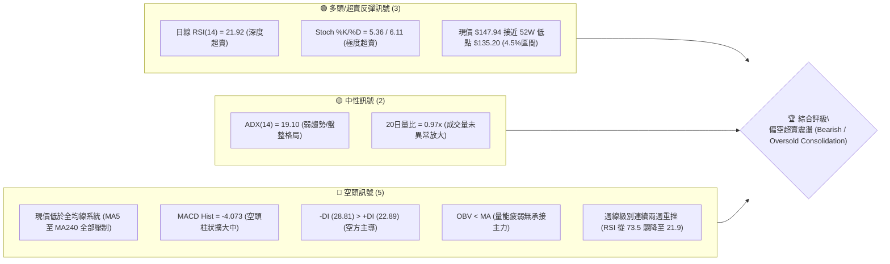
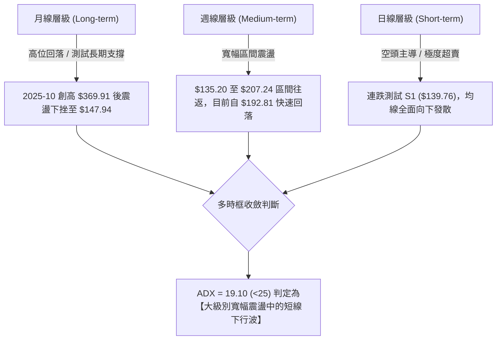
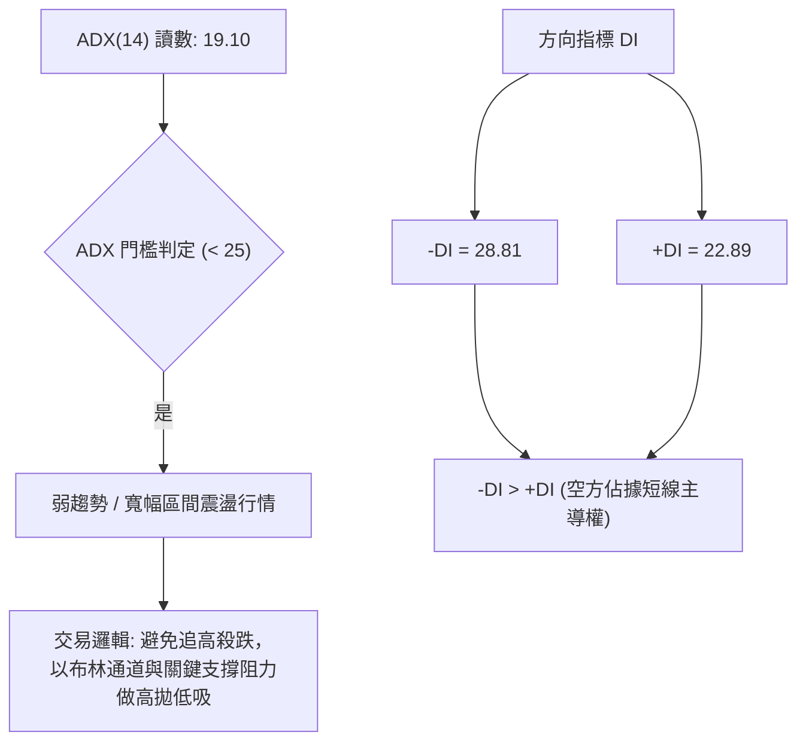
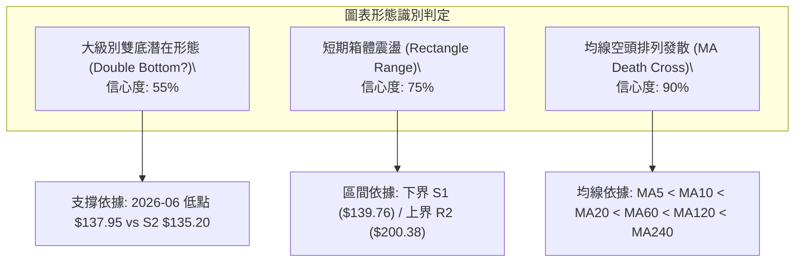
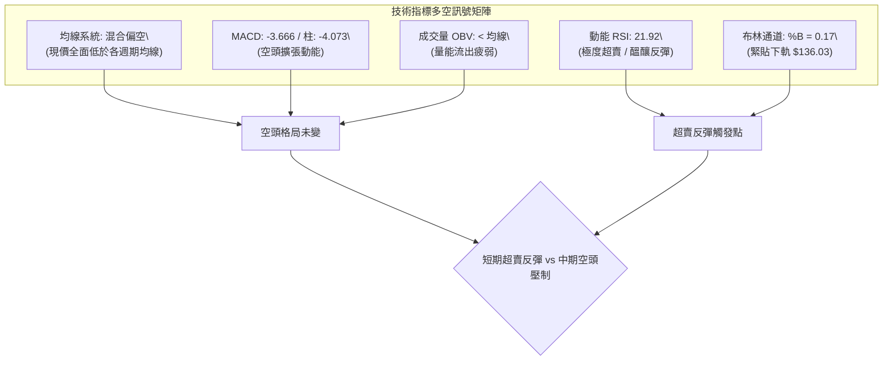
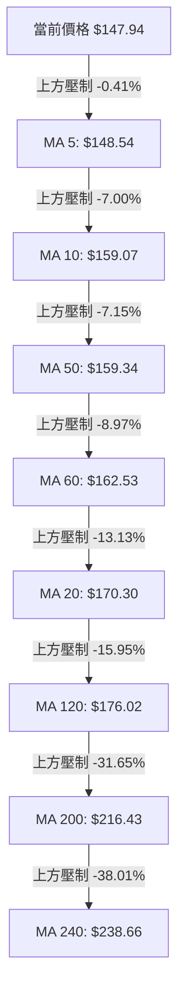
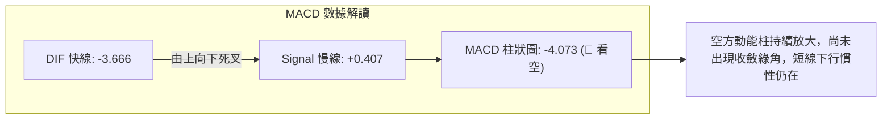
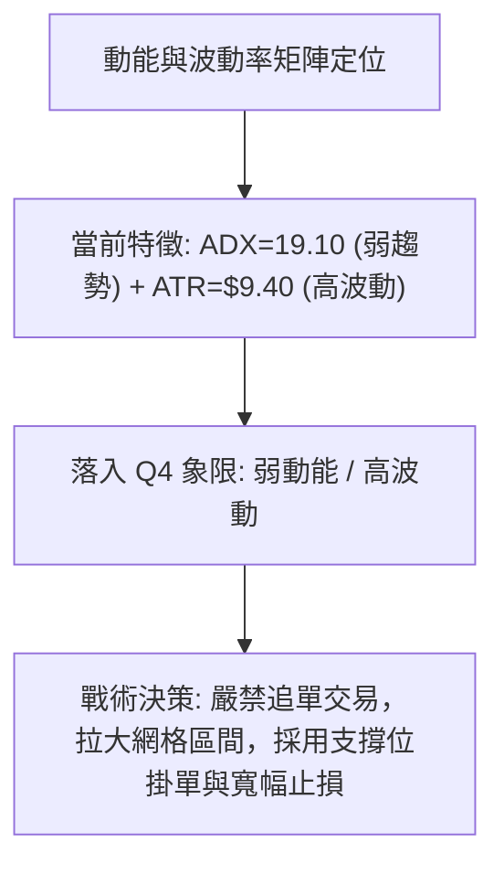
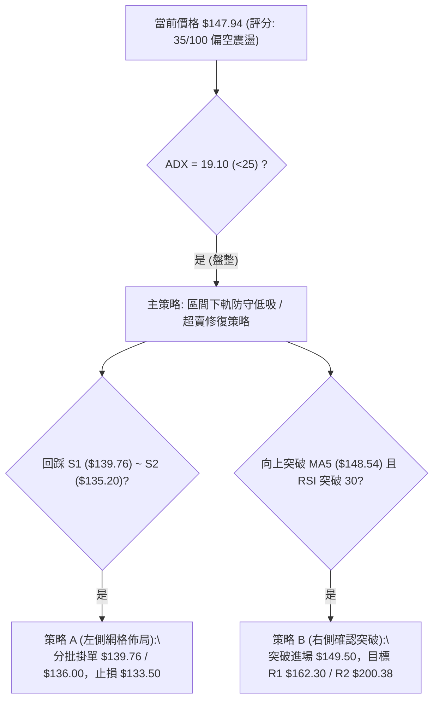
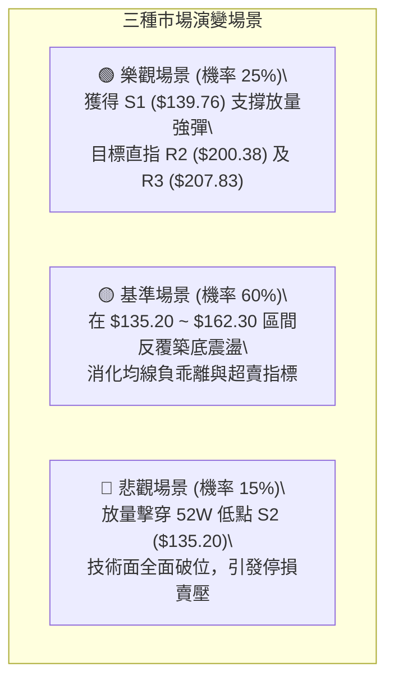

# AVAV 技術分析報告

> **報告日期**：2026-08-30 ｜ **語言**：繁體中文 ｜ **數據來源**：Yahoo Finance ｜ **當前價格**：$147.94

---

## 目錄

| 章節 | 內容 |
|------|------|
| [1. 技術面概覽](#1-技術面概覽) | 訊號儀表板、核心指標、評分卡 |
| [2. 趨勢分析](#2-趨勢分析) | 多時框趨勢、長中短期走勢、ADX解讀 |
| [3. 圖表形態分析](#3-圖表形態分析) | 形態識別、信心度評估、K線組合 |
| [4. 支撐與阻力](#4-支撐與阻力) | 關鍵價位、斐波那契回調結構 |
| [5. 技術指標深度解讀](#5-技術指標深度解讀) | MA/RSI/MACD/布林通道/OBV量價 |
| [6. 動能與波動率](#6-動能與波動率) | 動能評估四象限、ATR、Beta |
| [7. 多時框架總結](#7-多時框架總結) | 時框架評分矩陣與多時框收斂 |
| [8. 交易策略建議](#8-交易策略建議) | 策略路由、價格階梯、主策略詳解 |
| [9. 風險提示與監控](#9-風險提示與監控) | 監控清單、情境模擬與風控原則 |

---

## 1. 技術面概覽

### 🎯 技術訊號儀表板



### 📊 核心指標速覽表

| 指標類別 | 指標名稱 | 當前數值 | 訊號 | 解讀 |
|----------|----------|----------|:----:|------|
| **價格** | 當前價格 | $147.94 | 🔴 | 位於 52 週區間 4.5% 極低水位，空頭動能壓制 |
| **均線** | MA20 | $170.30 | 🔴 | 價格低於 MA20 達 -13.13%，短期下行趨勢顯著 |
| **均線** | MA50 | $159.34 | 🔴 | 價格低於 MA50 達 -7.15%，中期多空分水嶺失守 |
| **均線** | MA200 | $216.43 | 🔴 | 價格低於 MA200 達 -31.65%，長期牛熊分界線下方 |
| **動能** | RSI(14) | 21.92 | 🟢 | 深度超賣（<30），隨時具備技術性反彈修復需求 |
| **動能** | MACD | -3.666 / Hist: -4.073 | 🔴 | 快慢線死叉且綠柱擴張，動能仍由空方完全主導 |
| **動能** | Stoch %K/%D | 5.36 / 6.11 | 🟢 | 極度超賣區間鈍化，短期拋壓接近極限 |
| **趨勢** | ADX(14) | 19.10 (-DI: 28.81) | 🟡 | ADX < 25 處於弱趨勢/寬幅盤整，但方向由空頭主導 |
| **通道** | 布林通道 %B | 0.17 (下軌: $136.03) | 🟡 | 運行於下軌與中軌間，貼近下軌尋找支撐 |
| **量能** | OBV 趨勢 | OBV < 均線 | 🔴 | 量能持續流出，機構承接意願尚未顯現 |
| **波動** | ATR(14) | $9.40 (6.35%) | 🔴 | 日內波動幅度極高，交易需拉寬止損防守間距 |

### 🏆 技術評分卡

```
╔══════════════════════════════════════════════════════════════╗
║                技術評分卡 — AVAV (2026-08-30)                ║
╠══════════════════════════════════════════════════════════════╣
║ 趨勢強度 (Trend)      ██████░░░░░░░░░░░░░░  30/100  🔴 空頭壓制║
║ 動能指標 (Momentum)   ████████░░░░░░░░░░░░  40/100  🟡 極度超賣║
║ 支撐穩定度 (Support)  ██████████░░░░░░░░░░  50/100  🟡 臨近S1/S2║
║ 成交量配合 (Volume)   ██████░░░░░░░░░░░░░░  30/100  🔴 缺乏量能║
║ 形態完整度 (Pattern)  ████████░░░░░░░░░░░░  40/100  🟡 區間下緣║
║ 均線排列 (Moving Avg) ████░░░░░░░░░░░░░░░░  20/100  🔴 空頭排列║
╠══════════════════════════════════════════════════════════════╣
║ 綜合評分 (Composite)  ███████░░░░░░░░░░░░░  35/100  🔴 偏空震盪║
╚══════════════════════════════════════════════════════════════╝
```

---

## 2. 趨勢分析

### 🌐 多時框趨勢分析



### 📈 長期趨勢 — 12個月走勢圖（Unicode）

```
AVAV 月線走勢圖（2025-08 至 2026-08）
價格軸 ($)
$370 ┤                                  ● 2025-10 ($369.91)
$340 ┤
$310 ┤                            ● 2025-09 ($314.89)
$280 ┤                      ● 2025-11 ($279.46)    ● 2026-01 ($278.39)
$250 ┤          ● 2025-08 ($241.35)    ● 2025-12 ($241.89)    ● 2026-02 ($252.25)
$220 ┤
$190 ┤                                              ● 2026-04 ($195.02)  ● 2026-05 ($207.24)
$160 ┤                                                    ● 2026-03 ($183.05)  ● 2026-06 ($165.07)
$130 ┤                                                                      ● 2026-07 ($149.37)  ● 2026-08 ($147.94)
     └─────────────────────────────────────────────────────────────────────────────────────────────
        08/25  09/25  10/25  11/25  12/25  01/26  02/26  03/26  04/26  05/26  06/26  07/26  08/26
```

#### 走勢特徵分析表格

| 階段區間 | 月收盤價變動 | 區間漲跌幅 | 走勢特徵與結構解讀 |
|:---|:---|:---|:---|
| **2025-08 ~ 2025-10** | $241.35 → $369.91 | +53.27% | 爆發性多頭主升浪，創歷史天價 $417.86（52W High） |
| **2025-11 ~ 2026-02** | $279.46 → $252.25 | -9.74% | 高位籌碼派發與次級頭部構建（$278.39），震盪加劇 |
| **2026-03 ~ 2026-05** | $183.05 → $207.24 | +13.21% | 跌破 MA200 後的反彈自救，最高反彈至 R3 ($207.83) 遇阻 |
| **2026-06 ~ 2026-08** | $165.07 → $147.94 | -10.38% | 持續尋底階段，回撤逼近 52W 低點 $135.20 與支撐 S1 ($139.76) |

### 📊 中期趨勢（週線分析）

從近 20 週數據觀察，股價呈現明顯的「下行台階式寬幅震盪」：
1. **反彈極限受阻於阻力帶**：2026-05-31 衝高至 $207.24、2026-08-16 衝高至 $192.81，均在接近 R2 ($200.38) 與 R3 ($207.83) 時無力突破並遭主力拋售。
2. **急跌波段伴隨 RSI 觸底**：2026-06-28 暴跌至 $137.95 (週量 11.88M, 週 RSI 20.2)，隨後快速拉出反彈至 $190.89 (週量 18.31M)；當前 2026-08-30 再次急跌至 $147.94 (週 RSI 21.9)，技術結構與 6 月底具備高度相似性。

### ⚡ 趨勢強度評估（ADX 解讀）



#### ADX 強度與行情屬性對照表

| 指標變數 | 當前數值 | 參考閾值 | 市場狀態解讀 |
|:---|:---:|:---:|:---|
| **ADX(14)** | **19.10** | < 20 (極弱趨勢 / 盤整) | 單邊趨勢未成型，價格處於大區間消化籌碼階段 |
| **+DI (14)** | **22.89** | - | 多方攻擊動能衰退 |
| **-DI (14)** | **28.81** | - | 空方主導下行動能，差距為 +5.92 |
| **ADX 與 DI 綜合** | **空方震盪** | ADX < 25 且 -DI > +DI | 屬於「弱勢盤整下跌波」，不宜過度看空追殺，防範超賣修復 |

---

## 3. 圖表形態分析

### 🔍 形態識別系統



#### 形態識別與信心度評估表

| 形態名稱 | 信心度 | 判斷依據（引用數據） | 完成度 | 目標價（附精確計算式） |
|:---|:---:|:---|:---:|:---|
| **箱體震盪區間** | **75%** | 價格在 S2 ($135.20) 與 R2 ($200.38) 之間反覆拉鋸超過 3 個月 | **85%** | 箱頂目標價 = **$200.38**（箱體高度 = $200.38 - $135.20 = $65.18） |
| **潛在大型雙底** | **55%** | 第一底為 2026-06-28 收盤 $137.95（低點 S2 $135.20），當前 $147.94 正在回測該低點區域 | **45%** | 頸線 R3 ($207.83) + 形態高度 ($207.83 - $135.20 = $72.63) = **$280.46**（若突破） |
| **均線空頭壓制** | **90%** | 現價 $147.94 < MA20 ($170.30) < MA50 ($159.34) < MA200 ($216.43) | **100%** | 下行第一目標為 S1 (**$139.76**)，極限防守為 S2 (**$135.20**) |

### 🕯️ 重要K線形態分析

| 統計週期/月份 | 收盤價 | K線形態特徵 | 技術面解讀 | 訊號 |
|:---|:---:|:---|:---|:---:|
| **2026-05-31** | $207.24 | 放量長紅突破 | 短線主力急拉，測試上方高點，但隨後量能不濟 | 🟢 |
| **2026-06-28** | $137.95 | 恐慌長黑破位 | 爆出 11.88M 天量下殺，完成恐慌盤清洗並砸出 52W 低點附近支撐 | 🔴 |
| **2026-07-05** | $190.89 | 巨量吞噬長紅 | 18.31M 歷史級換手量，確認 $135.20 - $137.95 具備強力承接買盤 | 🟢 |
| **2026-08-16** | $192.81 | 上影線反彈受阻 | 連續兩週反彈至 R2 ($200.38) 關前受阻，多頭動能耗盡 | 🟡 |
| **2026-08-30** | $147.94 | 兩連陰加速回落 | 兩週自 $192.81 殺至 $147.94，跌幅達 -23.27%，進入極端超賣區 | 🔴 |

### 📉 ASCII 走勢形態示意圖

```
AVAV 近期形態結構示意圖（雙底/箱體下緣測試）
價格 ($)
$210 ┤                      ● 2026-05-31 ($207.24) ─── 頸線/箱頂阻力 R3 ($207.83)
$200 ┤                                           ● 2026-08-16 ($192.81) ── 阻力 R2 ($200.38)
$190 ┤              ● 2026-07-05 ($190.89)
$180 ┤
$170 ┤                                                              ── 中軌 MA20 ($170.30)
$160 ┤                                                              ── 阻力 R1 ($162.30)
$150 ┤                                                   ● 現價 ($147.94) ◄◄ 測試中
$140 ┤    ● 2026-06-28 ($137.95) ───────────────────────────── 支撐 S1 ($139.76)
$135 ┤─── 52W 低點 ($135.20) ────────────────────────────── 強支撐 S2 ($135.20)
     └─────────────────────────────────────────────────────────────────────────────
          第一底 (Bottom 1)                           第二底測試中 (Testing Bottom 2)
```

### 🎯 形態目標價計算

1. **區間反彈目標（箱體回歸）**：
   - 形態下界支撐：S2 = **$135.20**
   - 形態中軸阻力：MA20 = **$170.30** / R1 = **$162.30**
   - 形態上界阻力：R2 = **$200.38**
   - **計算**：若現價 $147.94 於 S1/S2 止跌，第一回歸目標為 R1 ($162.30)，波段目標為 R2 ($200.38)。
2. **潛在雙底突破目標（極限樂觀情境）**：
   - 形態頸線：R3 = **$207.83**
   - 形態低點：S2 = **$135.20**
   - 形態高度：$207.83 - $135.20 = $72.63
   - **突破計算式**：$207.83 + $72.63 = **$280.46**（需帶量站穩 R3 確立）。

---

## 4. 支撐與阻力

### 🗺️ 關鍵價位分布圖（Unicode）

```
AVAV 關鍵價位結構分布圖
══════════════════════════════════════════════════════════════════
$207.83 ║████████████████████████████████████████║ 強阻力 R3 / 箱頂頸線 (+40.48%)
$200.38 ║████████████████████████████████░░░░░░░░║ 波段阻力 R2 (+35.45%)
$170.30 ║▓▓▓▓▓▓▓▓▓▓▓▓▓▓▓▓▓▓▓▓▓▓▓▓░░░░░░░░░░░░░░░░║ 短期動態阻力 MA20 / 布林中軌
$162.30 ║████████████████████░░░░░░░░░░░░░░░░░░░░║ 近期阻力 R1 (+9.71%)
$147.94 ╠════════════════════════════════════════╣ ◄ 當前價格 $147.94
$139.76 ║▓▓▓▓▓▓▓▓▓▓▓▓▓▓▓▓▓▓▓▓░░░░░░░░░░░░░░░░░░░░║ 近期支撐 S1 (-5.53%)
$136.03 ║░░░░░░░░░░░░░░░░░░░░░░░░░░░░░░░░░░░░░░░░║ 動態支撐 布林下軌
$135.20 ║████████████████████████████████████████║ 核心強支撐 S2 / 52W Low (-8.61%)
══════════════════════════════════════════════════════════════════
```

### 🚧 阻力位分析表

| 阻力級別 | 價位 | 形成原因 | 突破難度 | 重要性 |
|:---|:---:|:---|:---:|:---:|
| **R1** | **$162.30** | 近一年波段高點聚類、MA60 ($162.53) 與 MA50 ($159.34) 重合密集區 | 中等 | 🟢 短線反彈第一道天花板，站穩確認超賣修復展開 |
| **R2** | **$200.38** | 近一年波段高點聚類、整數心理關卡、2026-08 反彈高點附近 | 高 | 🟡 中期強弱轉換分水嶺，若能觸及代表震盪區間擴大 |
| **R3** | **$207.83** | 近一年波段高點聚類、2026-05 月線高點 ($207.24) 結構壓力 | 極高 | 🔴 大級別雙底頸線位置，突破方能逆轉長期空頭架構 |

### 🛡️ 支撐位分析表

| 支撐級別 | 價位 | 形成原因 | 守住機率 | 重要性 |
|:---|:---:|:---|:---:|:---:|
| **S1** | **$139.76** | 近一年波段低點聚類、2026-06-28 恐慌收盤價 $137.95 之緩衝區 | 65% | 🟢 短線多頭第一防線，日內跌破將引發下探 |
| **S2** | **$135.20** | 52 週最低點 (52W Low)、斐波那契 100.0% 極限回調位 | 80% | 🔴 年度最強底線，若放量跌破將打開無支撐真空下跌區 |

### 📐 斐波那契回調位分析

依據 52 週完整波動區間（高點 **$417.86** → 低點 **$135.20**，總跨度 $282.66）計算之標準黃金分割位：

| 斐波那契回調層級 | 確切價位 | 當前相對位置與技術意義解讀 |
|:---|:---:|:---|
| **0.0% (52W High)** | **$417.86** | 歷史極值天花板，長期多頭終極目標 |
| **23.6%** | **$351.15** | 2025-10 高位派發平台底部 |
| **38.2%** | **$309.88** | 2025-09 突破起漲點阻力 |
| **50.0%** | **$276.53** | 多空長期牛熊中軸，2026-01 次高點反彈極限 |
| **61.8%** | **$243.18** | 黃金分割強壓力位，MA240 ($238.66) 匯聚區 |
| **78.6%** | **$195.69** | 弱勢反彈極限位，與阻力 R2 ($200.38) 形成共振壓制帶 |
| **100.0% (52W Low)** | **$135.20** | 核心底部支撐位，目前現價位於 100.0% ~ 78.6% 區間之最底部 |

**現價區間解讀**：當前價格 **$147.94** 處於 **78.6% ($195.69)** 與 **100.0% ($135.20)** 之間，距離 100.0% 回調位僅剩 **$12.74 (+9.42%)** 的下行空間，顯示下行風險已大幅壓縮於底部極端區域。

---

## 5. 技術指標深度解讀

### 🎛️ 指標訊號總覽



### 📈 移動平均線排列分析



#### 均線系統數據詳解

| 均線名稱 | 數值 | 價格相對距離 | 趨勢斜率 | 技術意涵解讀 |
|:---|:---:|:---:|:---:|:---|
| **MA 5** | $148.54 | -0.41% | ▼ 下行 | 極短線緊貼價格，突破為止跌第一信號 |
| **MA 10** | $159.07 | -7.00% | ▼ 下行 | 短期下行速度線，構成第一道動態壓制 |
| **MA 20** | $170.30 | -13.13% | ▼ 下行 | 月線生命線，偏離過大產生均線負乖離拉力 |
| **MA 50** | $159.34 | -7.15% | ▼ 下行 | 中期均線，位於 MA20 下方呈混亂下行態勢 |
| **MA 60** | $162.53 | -8.97% | ▼ 下行 | 季線阻力，與 R1 ($162.30) 形成雙重共振阻力 |
| **MA 120** | $176.02 | -15.95% | ▼ 下行 | 半年線阻力，空頭中線防守線 |
| **MA 200** | $216.43 | -31.65% | ▼ 下行 | 長期年線牛熊線，中長期空頭確立 |
| **MA 240** | $238.66 | -38.01% | ▼ 下行 | 兩年均線，長期高位籌碼套牢成本區 |

### 📉 RSI(14) 分析

```
RSI(14) 數值儀表板: [ 21.92 ]
0 ──────── 20 ── 21.92 ── 30 ──────────────────── 50 ──────────────────── 70 ──────── 100
[ 極度超賣區間 ]  ▲      [ 弱勢整理區間 ]         [ 中性 ]         [ 強勢多頭 ]   [ 超買 ]
██████░░░░░░░░░░░░░░░░░░░░░░░░░░░░░░░░░░░░░░░░░░░░ 21.92%
```

- **超賣分析**：RSI(14) 目前為 **21.92**，已深跌至 30 門檻以下，接近 20 臨界超賣極端值。歷史數據顯示（2026-06-28 週 RSI 達 20.2 後隨即引發大漲），此數值代表空頭殺跌動能已達極限消耗期。
- **背離判斷**：
  - **結論：無明顯頂背離或底背離**。
  - **細節驗證**：價格創近幾週新低（$147.94），RSI 同步滑落至 21.92（對應 2026-08-23 RSI 50.6），指標與價格同步下行，未見指標低點抬高的標準底背離，僅能判定為「指標超賣後的慣性鈍化」。

### 📊 MACD(12/26/9) 訊號解讀



- **MACD 線**：-3.666（已下穿零軸進入深度空頭區間）。
- **訊號線 (Signal)**：+0.407。
- **柱狀圖 (Histogram)**：**-4.073**。自 2026-08-16 的 +4.300 迅速轉負並擴大至 -4.073，顯示短期殺盤力量尚未完全出清，需等待柱狀圖出現縮腳（Hist 數值回升）作為右側止跌確認點。

### 📦 布林通道分析

```
AVAV 日線布林通道 (20, 2) 空間圖
價格軸 ($)
$204.57 ┼───────────────────────────────────────────── 上軌 Upper Band
        │
$170.30 ┼───────────────────────────────────────────── 中軌 Middle Band (MA20)
        │
$147.94 ┼────────────────────────────── ● 現價 ($147.94, %B = 0.17)
        │
$136.03 ┼───────────────────────────────────────────── 下軌 Lower Band
```

- **通道帶寬**：上軌 **$204.57**，下軌 **$136.03**，帶寬高達 **$68.54 (46.3%)**，顯示處於擴軌後的震盪狀態。
- **指標 %B**：**0.17**，價格落在下軌 ($136.03) 與中軌 ($170.30) 之間且顯著偏向下軌，下軌與 S2 ($135.20) 構成極為強大的「通道+形態」複合支撐帶。

### 💹 成交量分析（量價配合度）

- **最新成交量**：1,181,800 股。
- **20日均量**：1,218,035 股（**量比 0.97x**，屬於正常均量萎縮狀態）。
- **50日均量**：1,731,730 股。
- **OBV 趨勢解讀**：OBV 指標持續位於其均線下方，顯示「**OBV < MA → 量能疲弱**」。下殺過程中未見異常爆量承接，但也未見恐慌性失控拋盤，屬於典型的「無量陰跌測底」，需要一根放量陽線（如突破 20日均量 1.5 倍以上）來扭轉局勢。

---

## 6. 動能與波動率

### ⚡ 動能評估四象限

| 象限分區 | 動能強度 | 波動率水準 | AVAV 當前歸屬狀態 | 技術評估與操作導向 |
|:---|:---:|:---:|:---:|:---|
| **第一象限 (Q1)** | 強動能 (+DI高) | 低波動 (ATR低) | — | 穩定多頭主升段，順勢加碼 |
| **第二象限 (Q2)** | 弱動能 (+DI低) | 低波動 (ATR低) | — | 狹幅無聊盤整，等待方向破局 |
| **第三象限 (Q3)** | 強動能 (-DI高) | 高波動 (ATR高) | — | 恐慌主跌段，嚴禁盲目抄底 |
| **第四象限 (Q4)** | **弱動能 (-DI主導但ADX低)** | **高波動 (ATR=6.35%)** | **✓ 當前狀態** | **寬幅震盪尋底，超賣區間適合分批低吸佈局** |



### 📊 ATR 波動率分析

- **ATR(14)**：**$9.40**（佔當前股價比例高達 **6.35%**）。
- **波動特性解讀**：AVAV 每日平均波動接近 10 美元，單日震幅極大。
- **止損距離建議**：
  - **日內/短線交易**：建議止損間距為 1.0x ATR = **$9.40**。
  - **波段交易**：建議止損間距為 1.5x ~ 2.0x ATR = **$14.10 ~ $18.80**。若以現價 $147.94 佈局，硬止損必須設於 S2 ($135.20) 下方（約 $134.00 處），距離現價剛好約 1.5x ATR。

### 📐 Beta 與市場相關性

- **Beta 係數**：**1.412**。
- **市場敏感度**：AVAV 具備顯著的高 Beta 特性，波動度比標普 500 指數高出 41.2%。在大盤下跌時個股下殺加劇，但一旦大盤企穩或軍工板塊回暖，該股具備極強的超額彈性（Alpha 爆發力）。
- **做空數據疊加**：空頭部位佔流通股 **9.6%**（Short Ratio 2.81天），在極度超賣與高 Beta 疊加下，一旦觸發反彈極易引發「空頭回補軋空（Short Squeeze）」。

---

## 7. 多時框架總結

### 📋 時框架評分表

| 時框架 | 趨勢方向 | 動能指標 | 均線排列 | 形態結構 | 綜合評分 | 操作建議 |
|:---|:---:|:---:|:---:|:---:|:---:|:---|
| **月線 (長期)** | 🔴 偏空修正 | 🟡 中性回落 | 🔴 跌破 MA200 | 52W 高點回撤尋底 | **35/100** | 長線資金耐心等待底部分型 |
| **週線 (中期)** | 🟡 寬幅震盪 | 🟢 觸及超賣 | 🔴 均線交織下壓 | $135.20 - $207.83 大箱體 | **45/100** | 箱體下緣分批建倉，上緣減碼 |
| **日線 (短期)** | 🔴 連續下殺 | 🟢 深度超賣 (21.9) | 🔴 均線空頭排列 | 測試 S1/S2 雙底支撐 | **30/100** | 嚴禁追空，等待右側止跌信號 |

### 🔲 綜合訊號矩陣

```
┌─────────────────┬───────────┬───────────┬───────────┐
│ 分析維度        │ 短期(日線)│ 中期(週線)│ 長期(月線)│
├─────────────────┼───────────┼───────────┼───────────┤
│ 趨勢方向 (Trend)│ 🔴 空頭   │ 🟡 震盪   │ 🔴 偏空   │
│ 動能強度 (Mom)  │ 🟢 超賣   │ 🟡 轉弱   │ 🔴 下行   │
│ 均線系統 (MAs)  │ 🔴 壓制   │ 🔴 壓制   │ 🔴 壓制   │
│ 量能結構 (Vol)  │ 🟡 縮量   │ 🟡 正常   │ 🔴 流出   │
│ 支撐有效性(Sup) │ 🟢 臨近S1 │ 🟢 臨近S2 │ 🟢 52W Low│
└─────────────────┴───────────┴───────────┴───────────┘
```

### ⚖️ 多時框收斂結論

依據多時框收斂規則：
1. **行情屬性判定**：當前 **ADX(14) = 19.10 (< 25)**，明確定義為「**盤整行情（大級別寬幅震盪）**」，而非單邊順勢行情。
2. **主導時框收斂**：在 ADX < 25 的盤整結構中，日線均線空頭排列僅代表「震盪區間內的下行波折」，行情受制於**週線級別的大箱體邊界（布林下軌 $136.03 / 支撐 S2 $135.20 至 阻力 R2 $200.38 / R3 $207.83）**。
3. **最終方向性結論**：**【偏空超賣震盪，臨近極限支撐，策略定位為區間下緣防守型低吸】**。
   - 日線空頭訊號與超賣訊號發生衝突，依規則收斂為：**不追空，依託 $135.20 - $139.76 核心支撐區尋求風險報酬比極佳的反彈機會**。

---

## 8. 交易策略建議

### 🗺️ 策略決策流程圖



### 🧭 策略路由（依評分卡分流）

> **當前主策略方向 = 偏空中性震盪下的【超賣區間低吸策略】（依綜合評分 35/100 與 ADX=19.10 盤整收斂）**
> 
> 雖然評分 35/100 偏空，但因 ADX 顯示為非趨勢盤整且 RSI=21.92 處於歷史極值超賣，追空之風險報酬比極差。故主策略採取「**箱體下緣支撐低吸**」，空頭策略僅作為「**破位止損與對沖提示**」。

### 🎯 價格情境階梯（Price Scenarios）

| 觸發條件 | 第一目標 | 後續延伸 | 情境含義與技術應對 |
|:---|:---:|:---:|:---|
| **強勢突破 R1 $162.30** | **R2 $200.38** | **R3 $207.83** | 短線超賣修復轉為波段反彈，挑戰箱體頂部 |
| **突破 MA5 站穩 $149.50** | **R1 $162.30** | **MA20 $170.30** | 右側止跌確認，開啟向布林中軌回歸行情 |
| **現價 $147.94 震盪** | **S1 $139.76** | **R1 $162.30** | 區間築底拉鋸，消化日線 MACD 綠柱動能 |
| **有效跌破 S2 $135.20** | **$120.00** | **$100.00** | 形態徹底破位，觸發多頭全面止損與空頭追殺 |

### 📊 情境機率分佈

```
情境機率分佈圖
══════════════════════════════════════════════════════════════
超賣反彈 / 回歸中軌 (55%) ████████████████████████████░░░░░░░░░░░░
區間震盪 / 築底拉鋸 (30%) ███████████████░░░░░░░░░░░░░░░░░░░░░░░
破位下殺 / 再創新低 (15%) ███████░░░░░░░░░░░░░░░░░░░░░░░░░░░░░░░
══════════════════════════════════════════════════════════════
```

| 預測情境 | 機率 | 主要技術依據 |
|:---|:---:|:---|
| **超賣反彈 / 回歸中軌** | **55%** | RSI(14)=21.92 深度超賣、Stoch=5.36 鈍化、臨近 52W 低點 $135.20 強支撐 |
| **區間震盪 / 築底拉鋸** | **30%** | ADX=19.10 處於弱勢盤整，成交量未爆發，MACD 柱狀圖仍需時間收斂 |
| **破位下殺 / 再創新低** | **15%** | 均線全空頭排列，若遭遇大盤系統性崩跌或軍工板塊利空衝擊 |

### 🟢 主策略詳情（方向：多頭超賣低吸）

| 策略要素 | 策略 A（左側支撐分批低吸） | 策略 B（右側信號確認追擊） |
|:---|:---|:---|
| **交易邏輯** | 依託 S1/S2 與布林下軌支撐掛單佈局 | 待日線突破 MA5 且 RSI 回穿 30 確認止跌 |
| **進場價格** | **$139.76**（50%倉）/ **$136.03**（50%倉） | **$149.50**（站穩 MA5 $148.54 上方進場） |
| **目標價 T1** | **$162.30**（阻力 R1 / +16.1%） | **$162.30**（阻力 R1 / +8.56%） |
| **目標價 T2** | **$200.38**（阻力 R2 / +43.3%） | **$170.30**（布林中軌 MA20 / +13.91%） |
| **止損價格** | **$133.50**（跌破 S2 $135.20 之下方 1.2%）| **$142.00**（跌破 2026-07 次低點） |
| **風險報酬比** | **1 : 4.85**（以均價 $137.90 至 T1/T2 測算） | **1 : 2.24**（以 T2 測算） |
| **歷史勝率估計** | **65%** | **60%** |
| **建議倉位** | 總投資資金之 **10% ~ 15%** | 總投資資金之 **15% ~ 20%** |

### 🔴 反向風險觸發點（對沖提示）

- **空頭觸發點（破位風控）**：若日線收盤價**實體跌破 S2 ($135.20)** 且成交量放大，代表大級別箱體支撐失效，所有多頭部位必須無條件全數止損離場。
- **對沖操作**：跌破 $135.20 後可反手建立小額空單，目標下看整數關卡 **$120.00**，止損設於 **$139.76**。

### ⭐ 整體訊號強度評星

```
╔══════════════════════════════════════════════════════════════╗
║ 做多訊號強度 (Long Signal)：   ★★★☆☆  (3.0 / 5 星 — 僅限超賣反彈)║
║ 做空訊號強度 (Short Signal)：  ★★☆☆☆  (2.0 / 5 星 — 空間受限不追)║
║ 整體訊號可信度 (Reliability)： ★★★☆☆  (3.5 / 5 星 — 震盪測底格局)║
╚══════════════════════════════════════════════════════════════╝
```

---

## 9. 風險提示與監控

### ✅ 關鍵監控指標 Checklist

```
╔══════════════════════════════════════════════════════════════╗
║                    每日盤面監控清單 (Checklist)              ║
╠══════════════════════════════════════════════════════════════╣
║ [ ] 價格是否守住關鍵支撐 S1 ($139.76) 與 S2 ($135.20)         ║
║ [ ] RSI(14) 是否脫離超賣區（突破 30 臨界線）                  ║
║ [ ] MACD Histogram 負值是否開始收縮（綠柱縮短）               ║
║ [ ] 日成交量是否放大至 20日均量 (1.22M) 之 1.5 倍以上         ║
║ [ ] 價格能否有效向上突破並站穩 MA5 ($148.54) 與 MA10 ($159.07)║
║ [ ] 空頭比例 9.6% 是否引發軋空回補潮                         ║
╚══════════════════════════════════════════════════════════════╝
```

### ⚠️ 風險場景分析



### 🛡️ 風險管理重要提醒

1. **ATR 波動風險控管**：AVAV 的 ATR 高達 **$9.40 (6.35%)**，單日振幅劇烈，部位規模切忌過大，單筆交易最大虧損額度應嚴格控制在總帳戶淨值的 **1.0% ~ 1.5%** 以內。
2. **高 Beta 放大效應**：個股 Beta 為 **1.412**，需密切關注大盤（S&P 500 / 納斯達克）整體走勢，大盤若出現系統性回調，AVAV 極易出現極端下影線打穿支撐之假破位。
3. **分批進場紀律**：在 ADX < 25 的盤整測底期，切忌單筆全倉進場，務必遵循「**分批佈局、嚴格止損、分段停利**」之原則。

---

## 📋 報告總結

```
╔══════════════════════════════════════════════════════════════════╗
║                   AVAV 技術分析報告總結 (2026-08-30)             ║
╠══════════════════════════════════════════════════════════════════╣
║ 當前價格：$147.94            52W 區間：$135.20 - $417.86 (位處 4.5%)║
║ 技術評級：🔴 偏空超賣震盪    綜合評分：35 / 100 (動能極度超賣)     ║
╠══════════════════════════════════════════════════════════════════╣
║ 關鍵結論：                                                      ║
║ ├─ 長期趨勢：🔴 空頭修正，受制於 MA200 ($216.43) 下方           ║
║ ├─ 中期趨勢：🟡 寬幅箱體震盪 ($135.20 ~ $207.83)                ║
║ ├─ 短期趨勢：🟢 深度超賣 (RSI=21.92)，下行空間有限，醞釀反彈     ║
║ ├─ 核心支撐：S1 $139.76 / S2 $135.20 (52W Low)                  ║
║ ├─ 核心阻力：R1 $162.30 / R2 $200.38 / R3 $207.83                ║
║ └─ 分析師目標價：均價 $225.77 (低標 $148.57 / 高標 $326.00)     ║
╠══════════════════════════════════════════════════════════════════╣
║ 最優交易策略組合：                                              ║
║ 1. 🥇 最佳機會：於 S1 ($139.76) 至 S2 ($135.20) 區間分批掛單低吸║
║                 止損設 $133.50，目標 R1 ($162.30) / R2 ($200.38)║
║ 2. 🥈 次選機會：突破 MA5 ($148.54) 右側進場，目標 MA20 ($170.30) ║
║ 3. 🥉 風控底線：收盤跌破 S2 ($135.20) 嚴格離場，切勿盲目抗單   ║
╚══════════════════════════════════════════════════════════════════╝
```

---

> ⚠️ **免責聲明**：本報告為技術分析研究，所有數據、圖表及估算均基於歷史量價與技術指標模型。本報告**僅供學術研究與交易策略參考**，**不構成任何形式的投資買賣建議**。金融市場具高度波動風險，投資人應獨立判斷並自負盈虧。

---

*報告生成時間：2026-08-30 ｜ 數據來源：Yahoo Finance ｜ 分析框架：多時框技術分析體系*