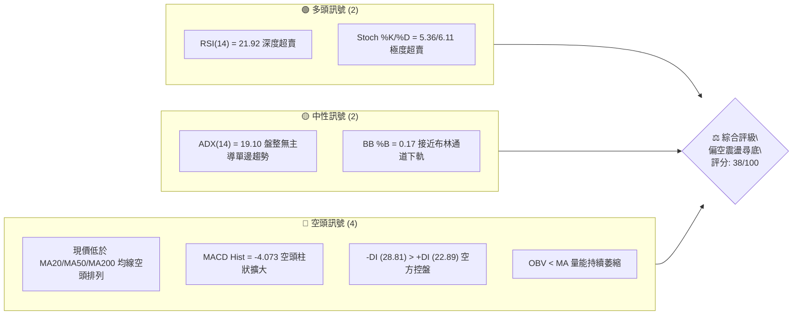
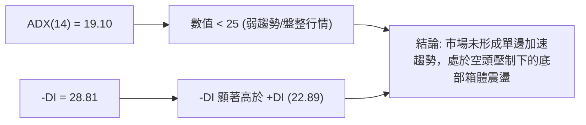
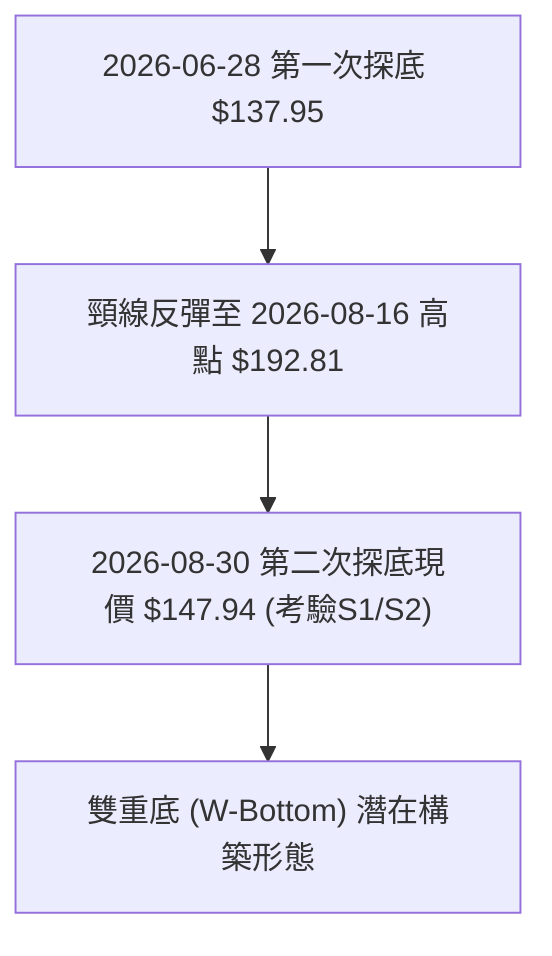
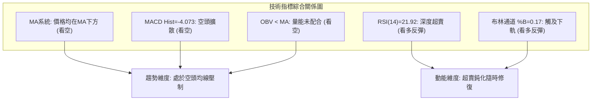
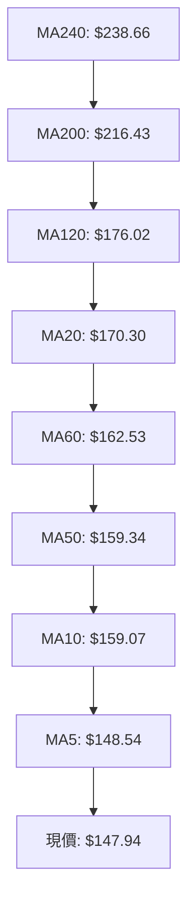
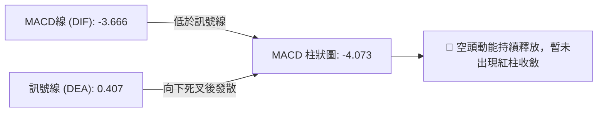
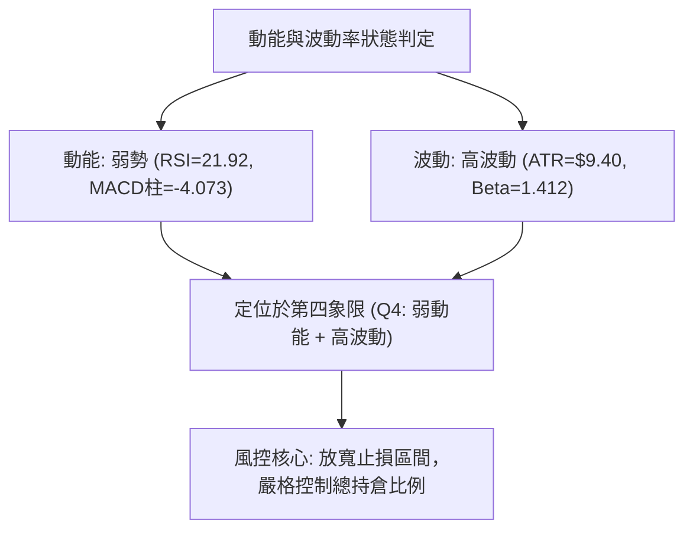
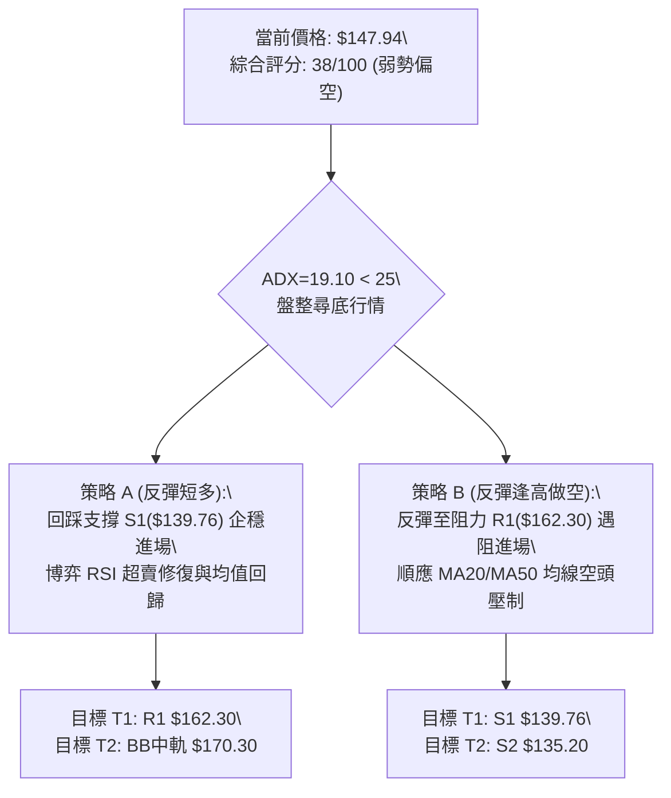
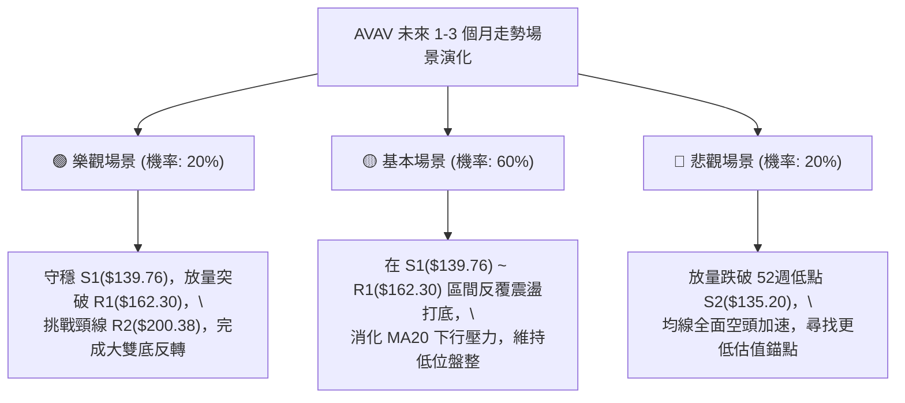

# AVAV 技術分析報告

> **報告日期**：2026-08-31 ｜ **語言**：繁體中文 ｜ **數據來源**：Yahoo Finance ｜ **當前價格**：$147.94

---

## 目錄

| 章節 | 內容 |
|------|------|
| [1. 技術面概覽](#1-技術面概覽) | 訊號儀表板、核心指標、評分卡 |
| [2. 趨勢分析](#2-趨勢分析) | 多時框趨勢、長中短期走勢 |
| [3. 圖表形態分析](#3-圖表形態分析) | 形態識別、K線組合、目標價 |
| [4. 支撐與阻力](#4-支撐與阻力) | 關鍵價位、斐波那契回調 |
| [5. 技術指標深度解讀](#5-技術指標深度解讀) | MA/RSI/MACD/布林/成交量 |
| [6. 動能與波動率](#6-動能與波動率) | 動能評估、ATR、Beta |
| [7. 多時框架總結](#7-多時框架總結) | 時框架評分矩陣 |
| [8. 交易策略建議](#8-交易策略建議) | 多空策略、風險報酬比 |
| [9. 風險提示與監控](#9-風險提示與監控) | 監控指標、風險場景 |

---

## 1. 技術面概覽

### 🎯 技術訊號儀表板



### 📊 核心指標速覽表

| 指標類別 | 指標名稱 | 當前數值 | 訊號 | 解讀 |
|----------|----------|----------|------|------|
| **價格** | 當前價格 | $147.94 | 🔴 | 位於52週區間 4.5% 極低分位，逼近波段低點 |
| **均線** | MA20 | $170.30 | 🔴 | 價格在MA20下方 -13.13%，短線嚴重承壓 |
| **均線** | MA50 | $159.34 | 🔴 | 價格在MA50下方 -7.15%，中期均線向下施壓 |
| **均線** | MA200 | $216.43 | 🔴 | 價格在MA200下方 -31.65%，長期處於空頭領域 |
| **動能** | RSI(14) | 21.92 | 🟢 | 進入極度超賣區（<30），隨時具備技術性反彈動能 |
| **動能** | MACD Hist | -4.073 | 🔴 | MACD線(-3.666)低於訊號線(0.407)，空頭動能釋放 |
| **波動** | ATR(14) | $9.40 | 🟡 | 日波動率達 6.35%，短線震盪劇烈，風控需拉大止損空間 |
| **趨勢** | ADX(14) | 19.10 | 🟡 | ADX < 25 表明處於無序弱趨勢/低檔盤整震盪行情 |

### 🏆 技術評分卡

```
╔════════════════════════════════════════════════════════════════╗
║                技術評分卡 — AVAV (2026-08-31)                   ║
╠════════════════════════════════════════════════════════════════╣
║ 趨勢強度 (ADX=19.10)   ████░░░░░░░░░░░░░░░░  25/100  🔴 空頭主導 ║
║ 動能指標 (RSI/MACD)    ████████░░░░░░░░░░░░  40/100  🟡 超賣反彈 ║
║ 支撐穩定度 (S1/S2支撐) ████████████░░░░░░░░  60/100  🟡 考驗低位 ║
║ 成交量配合 (OBV疲弱)   ██████░░░░░░░░░░░░░░  30/100  🔴 量能退潮 ║
║ 形態完整度 (雙底初探)  ████████░░░░░░░░░░░░  40/100  🟡 構築階段 ║
║ 均線排列 (全線失守)    ██████░░░░░░░░░░░░░░  30/100  🔴 均線壓制 ║
╠════════════════════════════════════════════════════════════════╣
║ 綜合評分               ███████░░░░░░░░░░░░░  38/100  🔴 弱勢偏空 ║
╚════════════════════════════════════════════════════════════════╝
```

---

## 2. 趨勢分析

### 🌐 多時框趨勢分析

```mermaid
graph TD
    M["月線框架 (長期)"] -->|"自高點417.86大幅回調 處於下行週期"| M_Status["🔴 長期空頭修復"]
    W["週線框架 (中期)"] -->|"135.20至207.24大型區間箱體震盪"| W_Status["🟡 中期弱勢盤整"]
    D["日線框架 (短期)"] -->|"受制於MA20("170.30") 連續下探S1支撐"| D_Status["🔴 短期超賣尋底"]
    
    M_Status --> Convergence["多時框收斂判斷:\\nADX(14)=19.10 < 25 處於盤整市\\n操作依據以布林通道與區間支撐阻力為主"]
    W_Status --> Convergence
    D_Status --> Convergence
```

### 📈 長期趨勢 — 12個月走勢圖（Unicode）

```
AVAV 月線走勢圖（2025-09 至 2026-08）
價格軸 ($)
$370 ┤                 ● (2025-10: $369.91)
$320 ┤           ● (2025-09: $314.89)
$280 ┤                       ● (2025-11: $279.46)  ● (2026-01: $278.39)
$240 ┤                             ● (2025-12: $241.89)  ● (2026-02: $252.25)
$200 ┤                                         ● (2026-04: $195.02)  ● (2026-05: $207.24)
$160 ┤                                               ● (2026-03: $183.05)  ● (2026-06: $165.07)
$140 ┤                                                           ● (2026-07: $149.37)  ● (2026-08: $147.94)◄現價
     └──────────────────────────────────────────────────────────────────────────
       09/25 10/25 11/25 12/25 01/26 02/26 03/26 04/26 05/26 06/26 07/26 08/26
```

#### 走勢特徵分析表格

| 階段區間 | 起止收盤價 | 漲跌幅 | 走勢特徵描述 |
|----------|------------|--------|--------------|
| **2025-09 ~ 2025-10** | $314.89 → $369.91 | +17.47% | 主升浪頂部衝刺，創下52週高點 $417.86 後見頂回落 |
| **2025-11 ~ 2026-02** | $279.46 → $252.25 | -9.74% | 高位箱體震盪分發，MA200逐步下移，多頭動能減退 |
| **2026-03 ~ 2026-05** | $183.05 → $207.24 | +13.22% | 跌破$200後展開中期反彈，受制於阻力位 R3($207.83) 遇阻 |
| **2026-06 ~ 2026-08** | $165.07 → $147.94 | -10.38% | 空頭二次下探，逼近52週最低點 S2($135.20)，進入極度超賣區 |

### 📊 中期趨勢（週線分析）

```
週線區間壓制與支撐結構：
阻力 R3: $207.83 ═════════════════════════════════ (2026-05 反彈頂點 $207.24)
阻力 R2: $200.38 ───────────────────────────────── (波段心理大關)
阻力 R1: $162.30 --------------------------------- (MA50: $159.34 與 MA60: $162.53 共振區)
現價     $147.94 ◄◄◄ 當前位置 (BB下軌 $136.03 上方)
支撐 S1: $139.76 --------------------------------- (2026-06-28 週低點聚類區 $137.95 附近)
支撐 S2: $135.20 ═════════════════════════════════ (52週最低點 / 斐波那契 100.0% 終極防線)
```

### ⚡ 趨勢強度評估（ADX 解讀）



| 指標項 | 數值 | 狀態 | 技術含義 |
|--------|------|------|----------|
| **ADX(14)** | 19.10 | 弱趨勢 (<25) | 趨勢動能不具備單邊持續殺跌條件，容易觸發反抽 |
| **+DI** | 22.89 | 多方力量 | 處於弱勢反彈水平 |
| **-DI** | 28.81 | 空方力量 | 空方佔據相對主導優勢，但尚未形成極端單邊失控 |

---

## 3. 圖表形態分析

### 🔍 形態識別系統



#### 形態識別與信心度評估表

| 形態名稱 | 信心度 | 判斷依據（引用數據） | 完成度 | 目標價（附計算式） |
|----------|--------|----------------------|--------|--------------------|
| **潛在雙重底 (Double Bottom)** | 60% | 第一次低點於 2026-06-28 的 $137.95，當前價格 $147.94 逼近支撐位 S1($139.76) 與 S2($135.20) 形成二探支撐 | 45% (尚未突破頸線) | 頸線阻力取聚類高點 R2($200.38)，形態高度 = $200.38 - $135.20 = $65.18。理論目標價 = 頸線 $200.38 + 形態高度 $65.18 = **$265.56**（若成功突破） |
| **布林帶下軌超賣觸底** | 75% | 現價 $147.94 接近布林通道下軌 $136.03，%B 為 0.17，且 RSI 達到 21.92 極端超賣 | 85% | 均值回歸短期目標位為布林中軌 MA20 **$170.30** |

### 🕯️ 重要K線形態分析

| 週期/日期 | 收盤價 | K線形態特徵 | 解讀 | 訊號 |
|-----------|--------|-------------|------|------|
| **2026-06-28** | $137.95 | 長下影探底大陰線 (成交量1,188萬) | 恐慌盤湧出，探明 52週低點 S2($135.20) 上方的強力承接 | 🟢 支撐確認 |
| **2026-07-05** | $190.89 | 巨量長陽線 (成交量1,831萬) | 多頭強力反撲，確立底部波段起點 | 🟢 多頭放量 |
| **2026-08-16** | $192.81 | 高位受阻倒錘頭線 (RSI=73.5) | 受制於阻力位 R2($200.38) 前沿，動能耗盡 | 🔴 頂部回調 |
| **2026-08-30** | $147.94 | 連續縮量回落陰線 (RSI=21.9) | 回踩確認底部支撐 S1($139.76)，空頭動能衰竭 | 🟡 止跌觀察 |

### 📉 ASCII 走勢形態示意圖

```
AVAV 潛在雙底（W-Bottom）形態結構圖
價格 ($)
$200.38 ┤                 ▲ 頸線阻力區 (2026-08: $192.81 ~ R2:$200.38)
         │                / \
$170.30 ┤               /   \             MA20 (中軌壓制)
         │              /     \           /
$147.94 ┤      \       /       \         ● 當前位置 ($147.94)
         │       \     /         \       /
$135.20 ┤        ▼───┘           ▼─────┘
         │    第一次底 (06/28)   第二次底測試 (08/31)
         └────────────────────────────────────────────► 時間軸
```

---

## 4. 支撐與阻力

### 🗺️ 關鍵價位分布圖（Unicode）

```
╔══════════════════════════════════════════════════════════════════╗
║                    AVAV 價位結構分布圖                           ║
╠══════════════════════════════════════════════════════════════════╣
║ $207.83 ║████████████████████████████████║ 強阻力 R3 (波段高點) ║
║ $200.38 ║████████████████████████        ║ 阻力 R2 (整數心理關卡)║
║ $162.30 ║████████████████                ║ 關鍵阻力 R1 (MA50/60) ║
║ $147.94 ╠════════════════════════════════╣ ◄ 現價 ($147.94)     ║
║ $139.76 ║▓▓▓▓▓▓▓▓▓▓▓▓▓▓▓▓                ║ 近期支撐 S1 (波段低點)║
║ $135.20 ║████████████████████████████████║ 強支撐 S2 (52週最低)  ║
╚══════════════════════════════════════════════════════════════════╝
```

### 🚧 阻力位分析表

| 阻力級別 | 價位 | 形成原因 | 突破難度 | 重要性 |
|----------|------|----------|----------|--------|
| **R1** | **$162.30** | 近一年波段高點聚類，與 MA60($162.53) 及 MA50($159.34) 高度重合 | 中等 | ⭐⭐⭐⭐ (短線多空分水嶺) |
| **R2** | **$200.38** | 近一年波段高點聚類，整數心理關口，前期反彈頸線位置 | 較高 | ⭐⭐⭐⭐⭐ (中期反轉確認位) |
| **R3** | **$207.83** | 近一年波段高點聚類，2026-05月反彈波段頂點（$207.24） | 極高 | ⭐⭐⭐ (強阻力天花板) |

### 🛡️ 支撐位分析表

| 支撐級別 | 價位 | 形成原因 | 守住機率 | 重要性 |
|----------|------|----------|----------|--------|
| **S1** | **$139.76** | 近一年波段低點聚類，06-28探底回升密集支撐區間前沿 | 65% | ⭐⭐⭐⭐ (短線防禦第一道防線) |
| **S2** | **$135.20** | 52週歷史最低點，斐波那契 100.0% 終極回調支撐位 | 85% | ⭐⭐⭐⭐⭐ (年內多頭底線生命線) |

### 📐 斐波那契回調位分析

依據 52 週波動區間（高點 **$417.86** → 低點 **$135.20**）計算之關鍵回調位如下：

```
0.0%  (52W High)   ────────────────── $417.86
23.6%              ────────────────── $351.15
38.2%              ────────────────── $309.88
50.0%              ────────────────── $276.53
61.8%              ────────────────── $243.18
78.6%              ────────────────── $195.69
[現價 $147.94 處於 78.6% 與 100.0% 之間]
100.0% (52W Low)   ────────────────── $135.20
```

- **位置解讀**：現價 $147.94 深度回撤於 78.6%（$195.69）至 100.0%（$135.20）區間，距離 100.0% 支撐僅有 **-8.61%** 的緩衝空間。此處為極深度的價值與技術回撤帶，通常具備極強的長線反彈或築底價值。

---

## 5. 技術指標深度解讀

### 🎛️ 指標訊號總覽



### 📈 移動平均線排列分析



| 均線名稱 | 當前價格 | 與現價差距 | 狀態解讀 |
|----------|----------|------------|----------|
| **MA 5** | $148.54 | -0.41% | 短線扣抵高位，下行速度放緩，現價剛好觸及 |
| **MA 20** | $170.30 | -13.13% | 短期生命線，布林通道中軌，當前強大下行阻力 |
| **MA 50** | $159.34 | -7.15% | 中期趨勢線，與阻力 R1($162.30) 形成密集阻力帶 |
| **MA 200** | $216.43 | -31.65% | 牛熊分界線，長期均線空頭排列向下發散 |

### 📉 RSI(14) 分析

- **當前數值**：`21.92`
- **狀態展示**：
```
RSI(14) 數值: [████░░░░░░░░░░░░░░░░] 21.92 (極度超賣區 < 30)
0───────────30───────────────────70──────────100
 [  超賣區  ]       常規波動區      [  超買區  ]
```
- **背離判斷**：
  - **結論**：**無明顯底背離**。
  - **詳細分析**：2026-06-28 最低收盤價 $137.95 時 RSI 為 20.2；當前 2026-08-30 收盤價 $147.94 對應 RSI 為 21.92。價格高於前低，RSI 亦略高於前低，指標與價格同向，未形成經典底背離形態，屬於正常的低檔鈍化與超賣修復階段。

### 📊 MACD(12/26/9) 訊號解讀



- **解讀**：DIF 跌破零軸並向下遠離 DEA，柱狀圖達 -4.073，顯示短線下殺動能仍在釋放。需要觀察柱狀圖何時開始縮短（即柱狀圖由 -4.073 向上收斂至 0 附近），方為短線止跌進場訊號。

### 📦 布林通道分析

```
AVAV 日線布林通道 (BB 20, 2) 結構圖
價格軸 ($)
$204.57 ┬─────────────────────────────── 上軌 (Upper Band)
        │
$170.30 ┼─────────────────────────────── 中軌 (Middle Band = MA20)
        │
$147.94 ┼─────────● 現價 ($147.94, %B = 0.17)
$136.03 ┴─────────────────────────────── 下軌 (Lower Band)
```

- **布林帶寬度與位置**：BB %B 數值為 **0.17**，現價運行於下軌（$136.03）與中軌（$170.30）之間，極度逼近下軌區域。帶寬開口並未異常擴大，表明非突發性崩盤，而是弱勢貼軌震盪，容易在觸及下軌後引發向中軌 $170.30 的均值回歸反抽。

### 💹 成交量分析（量價配合度）

- **量價特徵**：
  - 最新單日成交量為 **1,181,800** 股，相較於 20 日均量 **1,218,035** 股（量比 0.97x），呈現低位縮量狀態。
  - 相較於 50 日均量 **1,731,730** 股顯著萎縮。
- **OBV 能量潮解讀**：
  - 目前 `OBV < MA`，量能指標處於均線下方，顯示主力資金在近期的下跌過程中維持觀望，並未出現主動性大規模抄底盤，量能配合度較弱，反彈將以技術性修復為主。

---

## 6. 動能與波動率

### ⚡ 動能評估四象限

| 象限 | 動能維度 | 波動維度 | AVAV 當前狀態 | 交易評估與策略應對 |
|:---:|:---:|:---:|:---:|:---|
| **Q1** | 強 (Bullish) | 低 (Low Vol) | — | 穩健上升通道（非當前狀態） |
| **Q2** | 弱 (Bearish) | 低 (Low Vol) | — | 陰跌縮量盤整 |
| **Q3** | 強 (Bullish) | 高 (High Vol) | — | 突破暴漲行情 |
| **Q4** | **弱 (Bearish)** | **高 (High Vol)** | **✓ (命中 Q4)** | **高波動空頭下探階段：ATR高達6.35%，下行動能釋放中，嚴禁追高，僅適合左側極小倉位逢低博超賣反彈，或等待企穩後右側進場。** |



### 📊 ATR 波動率分析

- **ATR(14) 數值**：**$9.40**（佔當前股價之 **6.35%**）
- **止損距離建議**：
  - 日內/極短線交易止損幅度：$1.0 \times \text{ATR} = \mathbf{\$9.40}$
  - 波段交易安全防守空間：$1.5 \times \text{ATR} = \mathbf{\$14.10}$
  - 這意味著在現價 $147.94 建立多頭部位時，若採用 1.0 ATR 止損，防守點剛好落在支撐 S1($139.76) 下方的 **$138.54** 處，符合結構保護原則。

### 📐 Beta 與市場相關性

- **Beta 係數**：**1.412**
- **市場特徵分析**：
  - AVAV 屬於高彈性、高貝塔（High-Beta）國防科技成長股。相較標普500指數波動幅度大 41.2%。在市場整體風險偏好轉弱時，其技術回撤幅度顯著放大；但一旦大盤企穩，其超賣後的反彈彈性亦大幅領先大盤。

---

## 7. 多時框架總結

### 📋 時框架評分表

| 時框架 | 趨勢方向 | 動能狀態 | 均線排列 | 形態結構 | 綜合評分 | 操作建議 |
|:---:|:---:|:---:|:---:|:---:|:---:|:---|
| **月線 (長期)** | 🔴 下行修復 | 弱 (自高點大幅回落) | 偏空發散 | 52週高位回調浪 | 30/100 | 長期投資者等待底部企穩結構 |
| **週線 (中期)** | 🟡 箱體震盪 | 偏弱 (MACD週柱走低) | 跌破均線 | $135~$207 大區間 | 45/100 | 箱體下沿關注逢低支撐買點 |
| **日線 (短期)** | 🔴 弱勢超賣 | 🟢 極度超賣(RSI 21.9) | 混合空頭 | 考驗 S1/S2 雙底測試 | 40/100 | 短線超賣隨時引發技術性反抽 |

### 🔲 綜合訊號矩陣

```
時框一致性分析矩陣：
┌───────────┬─────────────┬─────────────┬─────────────┐
│ 分析維度  │ 日線 (短期) │ 週線 (中期) │ 月線 (長期) │
├───────────┼─────────────┼─────────────┼─────────────┤
│ 趨勢方向  │    🔴 空    │    🟡 中    │    🔴 空    │
│ 均線系統  │    🔴 空    │    🔴 空    │    🟡 中    │
│ 動能指標  │    🟢 多    │    🟡 中    │    🔴 空    │
│ 量能結構  │    🔴 空    │    🟡 中    │    🔴 空    │
│ 支撐強度  │    🟢 多    │    🟢 多    │    🟢 多    │
└───────────┴─────────────┴─────────────┴─────────────┘
一致性判斷：長短期趨勢方向受壓於空頭均線，但中短期在 S1/S2 支撐帶與日線 RSI 超賣產生強烈共振。
```

### ⚖️ 多時框收斂結論

> **依多時框收斂規則（規則 14）**：
> 1. 當前趨勢強度 **ADX(14) = 19.10 (< 25)**，明確定義為**盤整/震盪行情**，而非單邊加速趨勢市。
> 2. 行情主導邏輯以**日線布林通道下軌（$136.03）與週線波段低點支撐帶（S1: $139.76 / S2: $135.20）**為核心交易邊界。
> 3. **唯一方向性結論**：**弱勢偏空震盪尋底，超賣反彈在即**。因綜合評分為 **38/100**（≤40 偏空區間），主基調為空頭佔優但處於極度超賣邊界，策略上主推防守型與反抽型策略。

---

## 8. 交易策略建議

### 🗺️ 策略決策流程圖



### 🧭 策略路由（依評分卡分流）

- **當前主策略方向**：**偏空震盪中的「超賣低吸反抽」與「阻力位順勢逢高做空」雙軌區間策略（依評分 38/100）**
- **主導邏輯**：由於 ADX < 25 且 RSI 深度超賣（21.92），單邊追空風險極高；最優交易機會為**等待價格回踩強支撐區域做多反彈**，或**等待反彈測試均線阻力後順勢做空**。

---

### 🎯 價格情境階梯（Price Scenarios）

| 觸發條件 | 下一目標 | 後續延伸 | 情境含義 |
|----------|----------|----------|----------|
| **向上突破 R1 $162.30** | R2 $200.38 | R3 $207.83 | 短線轉強，突破 MA50/60 壓制，展開中期修復浪 |
| **站穩現價 $147.94 區間** | BB中軌 $170.30 | R1 $162.30 | 超賣技術性修復，於 S1 與 R1 之間區間震盪 |
| **跌破支撐 S1 $139.76** | S2 $135.20 | 考驗52W低點 | 中期探底加劇，測試斐波那契 100.0% 終極生命線 |

---

### 📊 情境機率分佈

| 情境劇本 | 機率 | 主要依據 |
|----------|:---:|----------|
| **超賣反彈 / 向上修復** | **45%** | RSI(14)=21.92 處於嚴重超賣，布林 %B=0.17 觸及下軌，極易引發均值回歸反抽 |
| **低位區間震盪 (S1~R1)** | **35%** | ADX=19.10 顯示無方向趨勢，量能萎縮（量比0.97x），多空在低檔反覆拉鋸換手 |
| **直接擊穿 S2 破位下行** | **20%** | 雖然均線空頭排列，但空頭動能已過度透支，若無重大利空，短期直接貫穿 S2 機率較低 |

---

### 🟢 主策略詳情

#### 策略 A：左側超賣博弈反彈策略（多頭反抽）
- **進場條件**：價格回踩至支撐 S1($139.76) 附近出現縮量止跌 K 線，或突破當日高點。
- **進場價格**：**$139.76**（或現價 $147.94 輕倉）
- **止損價格**：**$134.50**（嚴格設於 52週最低點 S2 $135.20 下方 0.70 美元）
- **目標價 T1**：**$162.30**（阻力位 R1）
- **目標價 T2**：**$170.30**（布林中軌 / MA20 阻力）
- **風險報酬比**：
  - 以 $139.76 進場計算：風險 = $139.76 - $134.50 = $5.26；目標1獲利 = $162.30 - $139.76 = $22.54。
  - **風報比 (R:R) = 1 : 4.29**
- **成功機率**：55%
- **建議倉位**：**10% - 15%**（輕倉試單）

#### 策略 B：阻力位順勢逢高做空策略（空頭主策略）
- **進場條件**：反彈至阻力位 R1($162.30) 或 MA50($159.34) 附近出現受阻長上影線。
- **進場價格**：**$162.30**
- **止損價格**：**$171.50**（設於 MA20 / 布林中軌 $170.30 上方）
- **目標價 T1**：**$147.94**（現價/回調第一站）
- **目標價 T2**：**$139.76**（支撐位 S1）
- **風險報酬比**：
  - 風險 = $171.50 - $162.30 = $9.20；目標2獲利 = $162.30 - $139.76 = $22.54。
  - **風報比 (R:R) = 1 : 2.45**
- **成功機率**：65%
- **建議倉位**：**15% - 20%**

---

### 🔴 反向風險觸發點（對沖與止損提示）

- **多頭反轉翻多訊號**：若價格帶量突破阻力位 **R2 ($200.38)** 並站穩 MA200($216.43)，標誌著中期雙底形態正式確立，空頭策略必須全部無條件止損出局。
- **空頭破位加速訊號**：若日線收盤價有效跌破強支撐 **S2 ($135.20)**，技術結構將打開下方未知真空區，所有多頭抄底部位必須堅決止損離場，嚴禁抗單。

---

### ⭐ 整體訊號強度評星

```
╔══════════════════════════════════════════════════════════════════╗
║ 做多訊號強度：★★☆☆☆  (2.5/5 星 - 僅限極度超賣博弈反抽)            ║
║ 做空訊號強度：★★★☆☆  (3.5/5 星 - 均線壓制，適合反彈逢高佈局)    ║
║ 整體可信度：  ★★★★☆  (4.0/5 星 - 支撐阻力結構清晰，邊界明確)     ║
╚══════════════════════════════════════════════════════════════════╝
```

---

## 9. 風險提示與監控

### ✅ 關鍵監控指標 Checklist

```
╔══════════════════════════════════════════════════════════════════╗
║                 AVAV 每日交易監控清單 (Checklist)                 ║
╠══════════════════════════════════════════════════════════════════╣
║ [ ] 1. RSI(14) 是否從 21.92 回升至 30 以上脫離超賣區？         ║
║ [ ] 2. 股價回踩支撐位 S1($139.76) 與 S2($135.20) 時的量能變化？ ║
║ [ ] 3. MACD 柱狀圖是否出現底背離或紅柱收斂（>-4.073）？         ║
║ [ ] 4. 日成交量是否放大突破 20日均量 (1,218,035 股)？            ║
║ [ ] 5. 股價反彈至阻力位 R1($162.30) 時的承接力道？              ║
║ [ ] 6. 國防板塊整體氛圍與大盤波動對 High-Beta(1.412) 之衝擊？    ║
╚══════════════════════════════════════════════════════════════════╝
```

### ⚠️ 風險場景分析



### 🛡️ 風險管理重要提醒

1. **波動率管理（ATR 風險）**：AVAV 的 ATR 為 $9.40，單日波動極高。單筆交易虧損額務必控制在總資金的 **1% - 1.5%** 以內。
2. **左側交易紀律**：在極度超賣區（RSI < 25）進行左側摸底屬於高難度操作，**嚴禁一次性重倉**，應採取「分批建倉、破位即斬」原則。
3. **分析師預期差**：華爾街平均目標價高達 **$225.77**（最低 $148.57，最高 $326.00），現價已跌破分析師最低目標價（$148.57），基本面情緒可能面臨降級修正風險，切忌單純因目標價折價而盲目持股。

---

## 📋 報告總結

```
╔══════════════════════════════════════════════════════════════════════╗
║                     AVAV 技術分析報告總結                            ║
╠══════════════════════════════════════════════════════════════════════╣
║ 報告日期：2026-08-31                                                 ║
║ 當前價格：$147.94                                                    ║
║ 分析評級：⚖️ 弱勢盤整 / 極度超賣尋底 (綜合評分: 38/100)               ║
║                                                                      ║
║ 關鍵結論：                                                           ║
║ ├─ 長期趨勢：🔴 空頭壓制 (均線空頭排列，自高點回撤深)               ║
║ ├─ 中期趨勢：🟡 弱勢盤整 (ADX=19.10 < 25，運行於底部箱體)            ║
║ ├─ 短期趨勢：🟢 超賣反彈 (RSI=21.92，觸及布林下軌 $136.03)          ║
║ ├─ 關鍵支撐：S1: $139.76  /  S2: $135.20 (52週最低點)                ║
║ ├─ 關鍵阻力：R1: $162.30  /  R2: $200.38  /  R3: $207.83             ║
║ └─ 分析師目標價：均價 $225.77 (最低 $148.57 / 最高 $326.00)          ║
║                                                                      ║
║ 最優策略組合：                                                       ║
║ 1. 🥇 最佳機會：回踩支撐 S1($139.76) 輕倉博弈 RSI 極端超賣反彈      ║
║ 2. 🥈 次選機會：反彈至阻力 R1($162.30) 受阻時順勢建立波段空單        ║
║ 3. 🥉 保守選擇：空倉觀望，等待日線有效站上 MA20($170.30) 右側確認    ║
╚══════════════════════════════════════════════════════════════════════╝
```

---

> ⚠️ **免責聲明**：本報告為 AI 自動生成之技術分析，所有數據及估算均基於提供的歷史價格資訊。本報告**僅供研究與學術參考**，**不構成任何投資建議**。投資有風險，入市需謹慎。

---

*報告生成時間：2026-08-31 ｜ 數據來源：Yahoo Finance ｜ 分析框架：多時框技術分析*