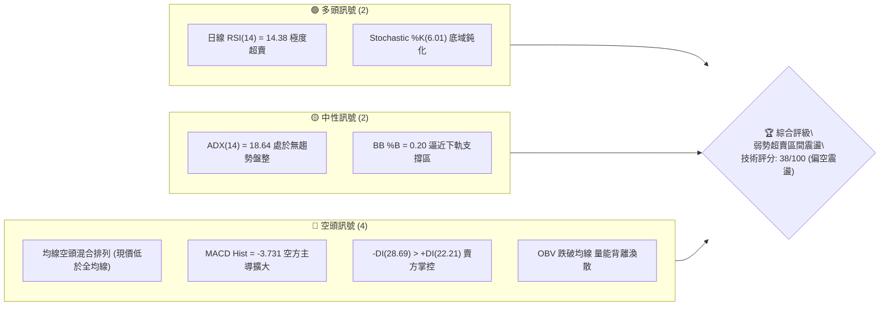
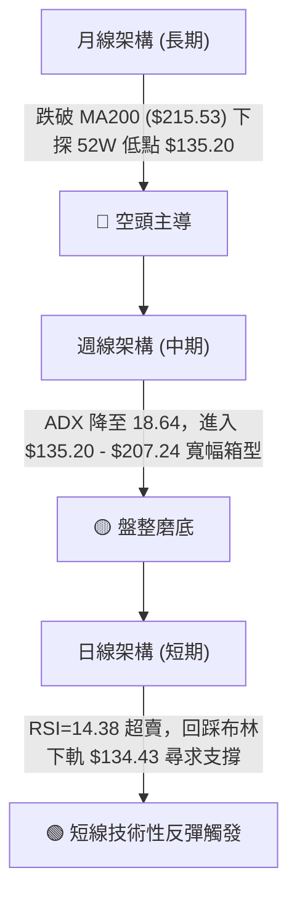
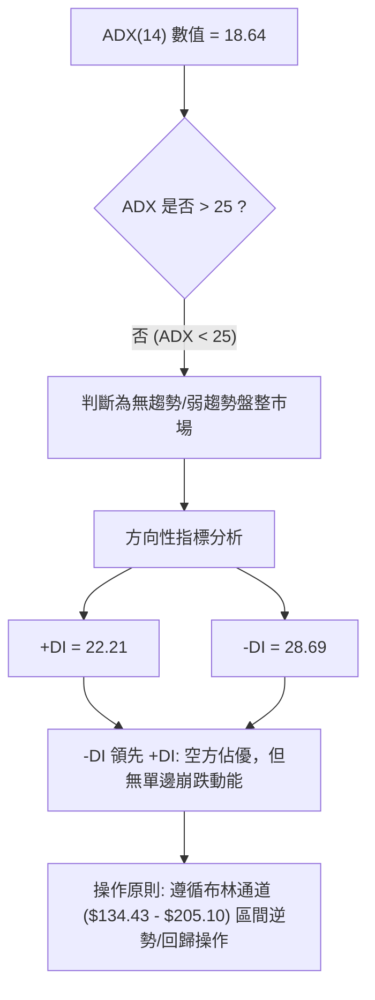
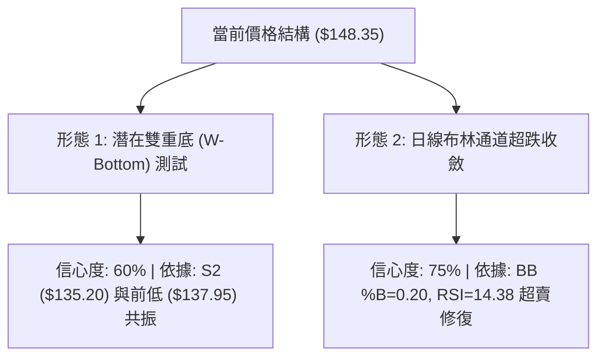
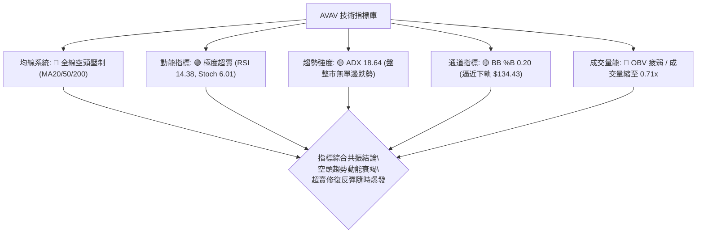
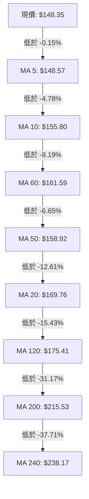
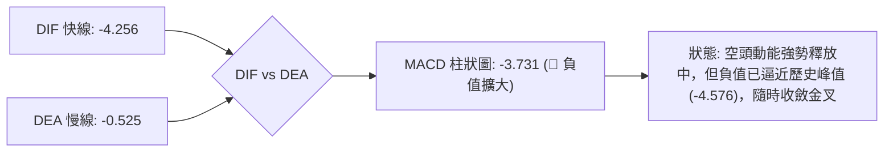
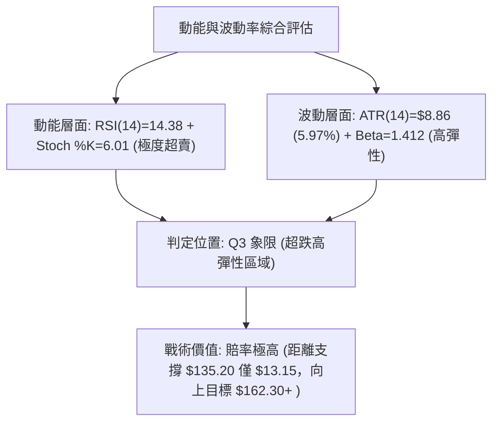
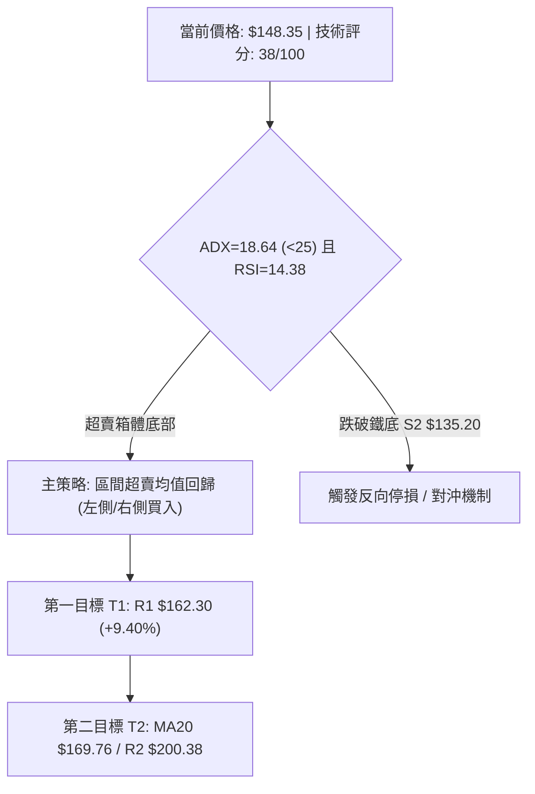
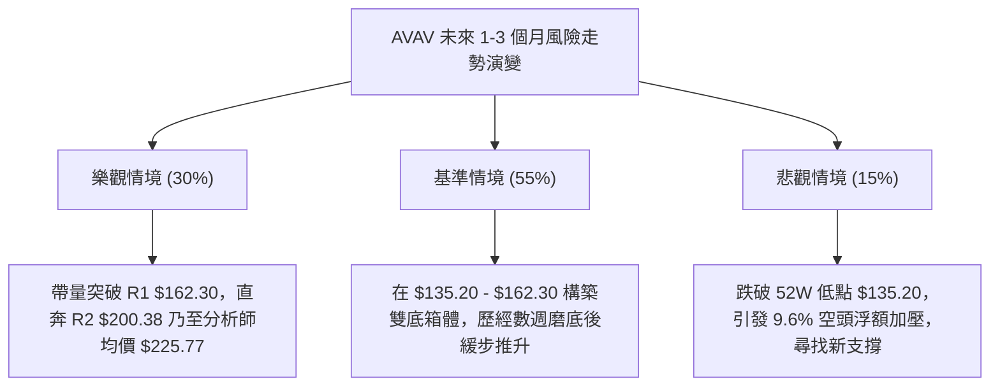

# AVAV 技術分析報告

> **報告日期**：2026-09-01 ｜ **語言**：繁體中文 ｜ **數據來源**：Yahoo Finance ｜ **當前價格**：$148.35

---

## 目錄

| 章節 | 內容 |
|------|------|
| [1. 技術面概覽](#1-技術面概覽) | 訊號儀表板、核心指標、評分卡 |
| [2. 趨勢分析](#2-趨勢分析) | 多時框趨勢、長中短期走勢 |
| [3. 圖表形態分析](#3-圖表形態分析) | 形態識別、K線組合、目標價 |
| [4. 支撐與阻力](#4-支撐與阻力) | 關鍵價位、斐波那契回調 |
| [5. 技術指標深度解讀](#5-技術指標深度解讀) | MA/RSI/MACD/布林/成交量 |
| [6. 動能與波動率](#6-動能與波動率) | 動能評估、ATR、Beta |
| [7. 多時框架總結](#7-多時框架總結) | 時框架評分矩陣 |
| [8. 交易策略建議](#8-交易策略建議) | 多空策略、風險報酬比 |
| [9. 風險提示與監控](#9-風險提示與監控) | 監控指標、風險場景 |

---

## 1. 技術面概覽

### 🎯 技術訊號儀表板



### 📊 核心指標速覽表

| 指標類別 | 指標名稱 | 當前數值 | 訊號 | 解讀 |
|----------|----------|----------|------|------|
| **價格** | 當前價格 | $148.35 | 🔴 | 位於 52 週區間底層 4.7%（距 52W 低點僅 $13.15） |
| **均線** | MA20 | $169.76 | 🔴 | 價格低於 MA20 達 -12.61%，短期下行趨勢顯著 |
| **均線** | MA50 | $158.92 | 🔴 | 價格低於 MA50，中期均線壓制未解 |
| **均線** | MA200 | $215.53 | 🔴 | 價格低於 MA200 達 -31.17%，長期結構偏空 |
| **動能** | RSI(14) | 14.38 | 🟢 | 極度超賣（<20），短線具備強烈技術性均值回歸修復需求 |
| **動能** | MACD | -4.256 | 🔴 | DIF 線低於 Signal 線（-0.525），柱狀圖為 -3.731，空方動能強烈 |
| **波動** | ATR(14) | $8.86 | 🟡 | 日內波動率達 5.97%，短線震盪幅度大 |
| **趨勢** | ADX(14) | 18.64 | 🟡 | <25 顯示單邊趨勢動能耗盡，進入底部寬幅盤整區間 |

### 🏆 技術評分卡

```
╔══════════════════════════════════════════════════════════════════╗
║                 技術評分卡 — AVAV (2026-09-01)                  ║
╠══════════════════════════════════════════════════════════════════╣
║ 趨勢強度      ██████░░░░░░░░░░░░░░  30/100  🔴 空頭壓制          ║
║ 動能指標      ████████░░░░░░░░░░░░  40/100  🟡 極度超賣修復中    ║
║ 支撐穩定度    ██████████░░░░░░░░░░  50/100  🟡 臨近 52W 低點     ║
║ 成交量配合    ██████░░░░░░░░░░░░░░  30/100  🔴 量能萎縮(0.71x)   ║
║ 形態完整度    ████████░░░░░░░░░░░░  40/100  🟡 區間箱體探底      ║
║ 均線排列      ██████░░░░░░░░░░░░░░  30/100  🔴 全均線空頭壓制    ║
╠══════════════════════════════════════════════════════════════════╣
║ 綜合評分      ███████░░░░░░░░░░░░░  38/100  🔴 偏空震盪/超賣博弈 ║
╚══════════════════════════════════════════════════════════════════╝
```

---

## 2. 趨勢分析

### 🌐 多時框趨勢分析



### 📈 長期趨勢 — 12個月走勢圖（Unicode）

```
AVAV 月線走勢圖（2025-09 至 2026-08）
價格軸 ($)
$370 ┤                                      ● (2025-10 歷史高點 $369.91)
$330 ┤                ● (2025-09 $314.89)
$290 ┤                                           ● (2025-11 $279.46)
$250 ┤                                                ● (2026-01 $278.39)
$210 ┤                                                     ● (2026-05 $207.24)
$170 ┤                                                          ● (2026-06 $165.07)
$140 ┤                                                               ●←現價 $148.35
     └────────────────────────────────────────────────────────────────────────
       09/25 10/25 11/25 12/25 01/26 02/26 03/26 04/26 05/26 06/26 07/26 08/26
```

#### 走勢特徵分析表格

| 階段週期 | 時間區間 | 起止價格 | 漲跌幅 | 走勢特徵與技術含義 |
|----------|----------|----------|--------|--------------------|
| **主升浪見頂** | 2025-09 ~ 2025-10 | $314.89 → $369.91 | +17.47% | 衝高觸及 52 週高點 $417.86 區域後形成長上影天花板 |
| **頂部派發期** | 2025-11 ~ 2026-01 | $279.46 → $278.39 | -0.38% | 高位寬幅劇烈震盪，籌碼向機構主力反向派發 |
| **主跌推動浪** | 2026-02 ~ 2026-03 | $252.25 → $183.05 | -27.43% | 跌破 MA50 及 MA200 關鍵防線，趨勢轉空 |
| **反彈受阻期** | 2026-04 ~ 2026-05 | $195.02 → $207.24 | +6.27% | 反抽受制於阻力 R3 ($207.83) 及 MA120 ($175.41) |
| **底部探戈期** | 2026-06 ~ 2026-08 | $165.07 → $148.35 | -10.13% | 逼近 52 週低點 $135.20，成交量萎縮，動能進入超賣區 |

### 📊 中期趨勢（週線分析）

```
中期週線價格通道與關鍵支撐阻力結構：
══════════════════════════════════════════════════════════════════
$207.83 ────────────────────────────────────────── 阻力 R3 (2026-05 反彈頂部)
$200.38 ────────────────────────────────────────── 阻力 R2 (布林上軌附聚區)
$169.76 ┄ ┄ ┄ ┄ ┄ ┄ ┄ ┄ ┄ ┄ ┄ ┄ ┄ ┄ ┄ ┄ ┄ ┄ ┄ ┄ ┄  MA20 / 布林中軌壓制
$162.30 ────────────────────────────────────────── 阻力 R1 (近期下行通道上緣)
$148.35 ══════════════════════════════════════════ ◄ 現價
$139.76 ┄┄┄┄┄┄┄┄┄┄┄┄┄┄┄┄┄┄┄┄┄┄┄┄┄┄┄┄┄┄┄┄┄┄┄┄ 支撐 S1 (近期週線低點)
$135.20 ══════════════════════════════════════════ 支撐 S2 (52週最低價/鐵底)
══════════════════════════════════════════════════════════════════
```

中期走勢呈現「階梯式下移後低位沉澱」格局。自 2026 年 5 月反彈至 $207.24 遇阻後，價格歷經多次下探，但在 $135.20 ~ $137.95 區間獲得強勁承接（2026-06-28 觸及 $137.95 後爆量 1,188 萬股反彈至 $190.89）。

### ⚡ 趨勢強度評估（ADX 解讀）



| 指標名稱 | 當前數值 | 參考閾值 | 趨勢狀態判定 | 操作指導依據 |
|----------|----------|----------|--------------|--------------|
| **ADX(14)** | 18.64 | 25.00 | 弱趨勢 / 箱體震盪 | 禁用單邊趨勢突破策略，改採區間高拋低吸 |
| **+DI** | 22.21 | - | 多方動能偏弱 | 多頭尚未發起組織性進攻 |
| **-DI** | 28.69 | - | 空方相對佔優 | 空方控制盤面但衰竭跡象初現 |

---

## 3. 圖表形態分析

### 🔍 形態識別系統



#### 形態識別與信心度評估表

| 形態類型 | 信心度 | 判斷依據（引用數據） | 完成度 | 目標價（附精確計算式） |
|----------|--------|----------------------|--------|------------------------|
| **大級別潛在雙底 (Double Bottom)** | 60% | 第一次波段低點為 2026-06-28 之 $137.95（52W Low 為 $135.20），當前現價 $148.35 正進行第二次底部探測 | 45% (未突破頸線) | 頸線阻力 R1 ($162.30) - 底部 S2 ($135.20) = 形態高度 $27.10。<br>理論突破目標 = 頸線 $162.30 + $27.10 = **$189.40**（受阻於 MA120 $175.41 與阻力 R2 $200.38 之間） |
| **矩形低位震盪箱體** | 75% | 箱體底部支撐 S1/S2 ($139.76 / $135.20)，箱體頂部阻力 R1 ($162.30) | 70% (箱底反彈階段) | 箱體上軌目標 = **$162.30** |
| **頭肩底形態** | 20% | 數據中未偵測到右肩構築完成訊號，形態不成立 | 0% | 訊號不足，僅做指標型解讀 |

### 🕯️ 重要K線形態分析

| 日期 / 週期 | 收盤價 | 成交量 | K線形態特徵 | 技術解讀 | 訊號 |
|-------------|--------|--------|-------------|----------|------|
| **2026-06-28** | $137.95 | 11,887,200 | 長下影長陰探底 (錘頭線雛形) | 觸及 52W 最低點 $135.20 附近後引發巨量恐慌盤湧出，主力資金抄底進場 | 🟢 |
| **2026-07-05** | $190.89 | 18,317,500 | 實體大陽線放量突破 | 放量報復性反彈，確立 $135.20 支撐極度堅固 | 🟢 |
| **2026-08-16** | $192.81 | 5,939,600 | 衝高回落十字星 | 反彈至阻力 R2 ($200.38) 下方縮量乏力，多頭動能衰竭 | 🔴 |
| **2026-08-30** | $147.94 | 5,984,900 | 連續中陰線加速探底 | 空頭持續打壓，跌破 MA5 ($148.57) 與 MA10 ($155.80)，逼近前低 | 🔴 |
| **2026-09-06 (即時)** | $148.35 | 856,425 | 縮量低位星線 (收盤微升) | 賣盤動能急劇萎縮（量比 0.71x），空頭砸盤受阻於支撐 S1 ($139.76) 上方 | 🟡 |

### 📉 ASCII 走勢形態示意圖

```
AVAV 潛在「雙重底 (W-Bottom)」與區間震盪示意圖
價格 ($)
$195 ┤               ● (2026-08-16 高點 $192.81)
$190 ┤         ● (2026-07-05 $190.89 頸線高點)
$162 ┤─────────┼──────────────────────────┼──────── 頸線阻力 R1: $162.30
$150 ┤        / \                        / \   ◄ 現價 $148.35 (次底測試中)
$138 ┤       /   ● (2026-06-28 $137.95) /   ●
$135 ┤══════●══════════════════════════●════════ 鐵底支撐 S2: $135.20 (52W Low)
     └──────────────────────────────────────────────────────────────────
            底部 1 (6月下旬)            底部 2 (9月初現況)
```

### 🎯 形態目標價計算

基於現有形成的「低位收斂雙底」形態計算：
1. **底部支撐基準點 (S2)**：$135.20
2. **第一頸線突破點 (R1)**：$162.30
3. **垂直形態高度 (Height)**：$162.30 - $135.20 = $27.10
4. **最小量度目標價 (Target 1)**：$162.30 + $27.10 = **$189.40**
5. **波段高點目標價 (Target 2)**：引用關鍵阻力位 R2 = **$200.38**

---

## 4. 支撐與阻力

### 🗺️ 關鍵價位分布圖（Unicode）

```
AVAV 價位結構分布圖
══════════════════════════════════════════════════════════════════
$207.83 ║████████████████████████████████║ 強阻力 R3 (5月波段高點)
$200.38 ║████████████████████████        ║ 關鍵阻力 R2 (整數心理大關)
$195.69 ║▓▓▓▓▓▓▓▓▓▓▓▓▓▓▓▓▓▓▓▓▓▓        ║ 斐波那契 78.6% 回調位
$169.76 ║▒▒▒▒▒▒▒▒▒▒▒▒▒▒▒▒▒▒▒▒            ║ MA20 / 布林中軌
$162.30 ║████████████████████            ║ 關鍵突破阻力 R1 (短線天花板)
$148.35 ╠════════════════════════════════╣ ◄ 現價 ($148.35)
$139.76 ║▓▓▓▓▓▓▓▓▓▓▓▓▓▓▓▓                ║ 近期波段支撐 S1 (-5.79%)
$135.20 ║████████████████████████████████║ 核心鐵底支撐 S2 / 52W Low (-8.86%)
$134.43 ║▒▒▒▒▒▒▒▒▒▒▒▒▒▒▒▒▒▒▒▒▒▒▒▒▒▒▒▒▒▒▒▒║ 布林通道下軌極限支撐
══════════════════════════════════════════════════════════════════
```

### 🚧 阻力位分析表

| 阻力級別 | 價位 | 距現價空間 | 形成原因與技術共振 | 突破難度 | 重要性 |
|----------|------|------------|--------------------|----------|--------|
| **R1** | $162.30 | +9.40% | 近一年波段高點聚類、MA60 ($161.59) 重合區 | 中等 | 🟢 短線多空分水嶺 |
| **R2** | $200.38 | +35.07% | 近期反彈密集拋壓區、整數心理關卡 | 極高 | 🟡 中期強阻力 |
| **R3** | $207.83 | +40.09% | 2026-05 月線波段高點、布林上軌 ($205.10) 延伸區 | 極高 | 🔴 多頭終極反轉點 |

### 🛡️ 支撐位分析表

| 支撐級別 | 價位 | 距現價空間 | 形成原因與技術共振 | 守住機率 | 重要性 |
|----------|------|------------|--------------------|----------|--------|
| **S1** | $139.76 | -5.79% | 近一年波段低點聚類、2026-06-28 探底回升實體支撐 | 75% | 🟡 短線第一防線 |
| **S2** | $135.20 | -8.86% | 52週歷史低點 (52W Low)、布林下軌 ($134.43) 共振 | 88% | 🔴 年度最強核心鐵底 |

### 📐 斐波那契回調位分析

依據 52 週完整波動區間（低點 $135.20 → 高點 $417.86，總波動幅度 $282.66）計算：

| 斐波那契回調層級 | 官方精確價位 | 距現價位置 | 技術解讀與當前意義 |
|------------------|--------------|------------|--------------------|
| **0.0% (52W High)** | $417.86 | +181.67% | 歷史牛市最高點 |
| **23.6%** | $351.15 | +136.70% | 強牛市回調極限（已跌破） |
| **38.2%** | $309.88 | +108.88% | 多空平衡分界點（已跌破） |
| **50.0%** | $276.53 | +86.40% | 52週中樞價值線（已跌破） |
| **61.8%** | $243.18 | +63.92% | 黃金分割防守位 / 歷史籌碼密集區 |
| **78.6%** | $195.69 | +31.91% | 深幅回撤防線 / 反彈強阻力區 |
| **100.0% (52W Low)**| $135.20 | -8.86% | **當前價格落於 78.6% ($195.69) 與 100.0% ($135.20) 極深回調區間** |

> **解讀**：現價 $148.35 處於 78.6% 回調位 ($195.69) 至 100.0% 回調位 ($135.20) 之間的最底部 4.7% 殘值區域。歷史統計顯示，當優質國防科技標的回撤至 100% 斐波那契支撐附近且 ADX<25 時，下行空間已被嚴重壓縮，極易引發均值回歸行情。

---

## 5. 技術指標深度解讀

### 🎛️ 指標訊號總覽



### 📈 移動平均線排列分析



#### 均線矩陣詳細數據

| 均線名稱 | 當前價格 | 乖離率 (Bias) | 排列形態特徵 | 支撐 / 阻力屬性 |
|----------|----------|---------------|--------------|-----------------|
| **MA 5** | $148.57 | -0.15% | 走平貼合現價 | 短線第一動態阻力 |
| **MA 10** | $155.80 | -4.78% | 快速下行壓制 | 短線減倉點 |
| **MA 20** | $169.76 | -12.61% | 中期下行斜率陡峭 | 波動中樞阻力 |
| **MA 50** | $158.92 | -6.65% | 走平略微下彎 | 中期防守線 |
| **MA 60** | $161.59 | -8.19% | 壓制於 R1 附近 | 關鍵阻力共振 |
| **MA 120**| $175.41 | -15.43% | 長期下行通道上軌 | 中長期分水嶺 |
| **MA 200**| $215.53 | -31.17% | 牛熊分界線 | 長期空頭壓制 |
| **MA 240**| $238.17 | -37.71% | 超長期均線 | 歷史天花板 |

### 📉 RSI(14) 分析

- **RSI(14) 當前數值**：**14.38**（極度超賣，處於歷史極端低位區間）
- **超賣可視化進度條**：
  `RSI(14) = 14.38  [███░░░░░░░░░░░░░░░░░] 14.38% (閾值 < 30 超賣，< 20 極度超賣)`
- **背離分析判斷**：
  - 當前 RSI 數值為 14.38，相較於 2026-06-28 股價低點 $137.95 時的週線 RSI 20.2，價格並未跌破 $137.95 但日線 RSI 已先行被摜壓至 14.38。
  - **背離結論**：數據顯示**無明顯頂背離或底背離**（RSI 呈現純粹的超跌鈍化狀態），表明當前為賣壓集中釋放後的慣性觸底，非趨勢轉向型底背離，因此反彈性質先定義為「超跌均值回歸修復」。

### 📊 MACD(12/26/9) 訊號解讀



- **MACD 指標數據**：DIF = -4.256，Signal (DEA) = -0.525，MACD Histogram = -3.731。
- **解讀**：MACD 位於零軸下方深度運行，綠柱持續延伸，顯示空頭仍控制主動權。但對比 2026-06-28 柱狀圖低點 -4.576，當前 -3.731 未創新低，隨時具備柱狀圖翻紅收窄、形成「低位弱雙底金叉」的潛力。

### 📦 布林通道分析

```
AVAV 日線布林通道 (20, 2) 結構圖
══════════════════════════════════════════════════════════════════
$205.10 ────────────────────────────────────────── 布林上軌 (Upper Band)
        │
        │      帶寬 (Bandwidth) = $70.67 (寬幅開口)
        │
$169.76 ┄┄┄┄┄┄┄┄┄┄┄┄┄┄┄┄┄┄┄┄┄┄┄┄┄┄┄┄┄┄┄┄┄┄┄┄┄┄┄ 布林中軌 (MA20)
        │
        │
$148.35 ══════════════════════════════════════════ ◄ 現價 (%B = 0.20)
$134.43 ────────────────────────────────────────── 布林下軌 (Lower Band)
══════════════════════════════════════════════════════════════════
```

- **布林參數**：上軌 $205.10 ｜ 中軌 $169.76 ｜ 下軌 $134.43 ｜ %B = 0.20。
- **解讀**：%B 降至 0.20，且下軌 $134.43 與 52W 低點 $135.20 形成精確重合支撐帶。股價未實質跌破下軌，表明沿下軌運行的「下軌漫步」即將結束，預期將向中軌 $169.76 展開均值回歸。

### 💹 成交量分析（量價配合度）


- **成交量數據**：最新成交量 856,425 股，顯著低於 20 日均量 1,212,426 股（量比 0.71x）與 50 日均量 1,717,656 股。
- **OBV 量能分析**：OBV 跌破其均線，反映資金整體處於觀望與流出狀態。但最新日線「縮量十字星」與 2026-06-28 爆量 1,188 萬股形成鮮明對比，說明此處已無恐慌拋盤，具備「地量見地價」特徵。

---

## 6. 動能與波動率

### ⚡ 動能評估四象限

| 象限 | 動能維度 | 波動維度 | 狀態特徵 | 當前 AVAV 位置判定 | 應對策略方針 |
|------|----------|----------|----------|--------------------|--------------|
| **Q1 (最佳機會)** | 強動能 (Bullish) | 低波動 (Low Vol) | 穩定主升浪 | 否 | 順勢追多 |
| **Q2 (謹慎觀望)** | 弱動能 (Bearish) | 低波動 (Low Vol) | 陰跌縮量磨底 | 否 | 觀望等待放量 |
| **Q3 (高風險收益)**| 弱動能 (Oversold)| 高波動 (High Vol)| **極度超跌/急跌探底** | **✓ AVAV 位於此象限** | **嚴格止損下博弈超賣反彈** |
| **Q4 (避免進場)** | 強動能 (Bearish) | 高波動 (High Vol)| 崩盤恐慌宣洩 | 否 | 嚴禁接飛刀 |



### 📊 ATR 波動率分析

- **ATR(14) 當前數值**：**$8.86**（佔當前股價比例達 **5.97%**）。
- **日內波動特徵**：屬於高波動個股，單日正常波動區間在 ±$8.86 左右。
- **風控止損距離建議**：
  - **保守止損距離（1.5 × ATR）**：$8.86 × 1.5 = **$13.29**（對應止損位 $148.35 - $13.29 = $135.06，完美覆蓋 52W 低點 $135.20 鐵底）。
  - **激進短線止損（1.0 × ATR）**：$8.86 × 1.0 = **$8.86**（對應止損位 $139.49，緊貼支撐 S1 $139.76）。

### 📐 Beta 與市場相關性

- **Beta 係數**：**1.412**。
- **特性解讀**：AVAV 屬於高彈性成長/國防科技股，理論波動幅度為標普500指數的 1.412 倍。在大盤企穩或國防軍工板塊反彈時，該股具備顯著超越大盤的向上修復爆發力。

---

## 7. 多時框架總結

### 📋 時框架評分表

| 時框架 | 趨勢方向 | 動能指標 | 均線排列 | 圖表形態 | 綜合評分 | 操作建議 |
|--------|----------|----------|----------|----------|----------|----------|
| **月線 (長期)** | 🔴 下行 | 🔴 MACD負值 | 🔴 跌破MA200 | 寬幅回撤 | 25/100 | 長線底倉分批觀望 |
| **週線 (中期)** | 🟡 盤整磨底 | 🟡 RSI低位徘徊 | 🔴 空頭壓制 | 潛在雙底 | 45/100 | 箱體下軌分批佈局 |
| **日線 (短期)** | 🟢 超賣反彈 | 🟢 RSI=14.38極限 | 🔴 乖離率過大 | 星線企穩 | 55/100 | 嚴設止損博弈反彈 |

### 🔲 綜合訊號矩陣

| 維度 | 短期 (日線) | 中期 (週線) | 長期 (月線) | 訊號收斂性評估 |
|------|-------------|-------------|-------------|----------------|
| **趨勢強度** | 弱 (ADX 18.64) | 弱 (震盪市) | 中等空頭 | 無單邊下跌推動力 |
| **動能狀態** | 極度超賣 (<20) | 低位中性 (40-50) | 偏弱 | 短期嚴重超跌，共振向上修正 |
| **量價關係** | 地量縮量 (0.71x) | 均量持平 | 萎縮 | 拋壓出盡，空頭衰竭 |
| **支撐有效性** | 強 (S1 $139.76) | 極強 (S2 $135.20) | 極強 (52W Low) | 支撐重疊度極高，防守邊界清晰 |

### ⚖️ 多時框收斂結論

依據多時框收斂規則（嚴格要求 14）：
1. **行情模式判斷**：ADX(14) 數值為 **18.64 (<25)**，明確定義當前盤面為**盤整/箱體震盪行情**，而非單邊趨勢行情。
2. **主導時框與交易空間**：在盤整行情中，忽略長期空頭趨勢壓制，以**日線布林通道 ($134.43 - $205.10)** 及 **關鍵支撐 S1/S2 ($139.76 / $135.20) 至阻力 R1 ($162.30)** 作為核心收斂交易區間。
3. **唯一方向性結論**：**【偏空震盪中的極度超賣均值回歸（中性偏多博弈）】**。短線下行空間受限於 52W 低點 $135.20，向上修復空間可見至阻力 R1 $162.30 與布林中軌 $169.76。

---

## 8. 交易策略建議

### 🗺️ 策略決策流程圖



### 🧭 策略路由

> **當前主策略方向 = 【超跌反彈 / 箱體下軌區間做多】（依評分卡 38/100，處於極度超賣與 ADX<25 盤整箱底，主推超賣修復策略，嚴禁低位追空）**

### 🎯 價格情境階梯（Price Scenarios）

| 觸發條件 | 下一目標 | 後續延伸 | 情境含義與操作指引 |
|----------|----------|----------|--------------------|
| **向上突破 R1 $162.30** | R2 $200.38 | R3 $207.83 | 短線轉強，雙底頸線確立，加碼看高至 $200.00 大關 |
| **站穩現價 $148.35 區間** | MA20 $169.76 | R1 $162.30 | 區間震盪築底，持股等待均值回歸 |
| **跌破支撐 S1 $139.76** | S2 $135.20 | BB下軌 $134.43 | 空頭二次探底，測試 52 週最低點鐵底防禦 |
| **有效跌破 S2 $135.20** | 數據未偵測更低點 | 下行空間打開 | 全面破位，多頭策略徹底失效，嚴格止損離場 |

### 📊 情境機率分佈

| 情境分類 | 發生機率 | 主要依據與技術共振 |
|----------|----------|--------------------|
| **超跌反彈 / 均值回歸** | **60%** | RSI=14.38、Stoch %K=6.01 極度超賣；成交量萎縮至 0.71x 顯示拋壓枯竭；距離布林下軌僅一步之遙 |
| **低位區間狹幅震盪** | **25%** | ADX=18.64 弱趨勢特徵；MA5/MA10 壓制導致反彈節奏反覆磨底 |
| **破位再探歷史新低** | **15%** | 均線系統全面空頭排列；MACD 柱狀圖負值尚未翻紅 |

### 🟢 主策略詳情

本策略基於嚴格引用第 4 章「關鍵價位」數據制定：

| 策略要素 | 策略 A（激進型：現價直接進場） | 策略 B（穩健型：回踩支撐進場） |
|----------|--------------------------------|--------------------------------|
| **進場條件** | 日線 RSI < 20 極度超賣，縮量星線企穩 | 回踩波段支撐 S1 確認不破 |
| **進場價格** | **$148.35**（當前現價市價進場） | **$139.76**（掛單於支撐 S1） |
| **目標價 T1** | **$162.30**（阻力 R1，潛在獲利 +9.40%） | **$162.30**（阻力 R1，潛在獲利 +16.13%） |
| **目標價 T2** | **$200.38**（阻力 R2，潛在獲利 +35.07%）| **$200.38**（阻力 R2，潛在獲利 +43.37%）|
| **止損價格** | **$135.20**（52W Low 鐵底下方，風險 -8.86%）| **$134.43**（布林通道下軌極限，風險 -3.81%）|
| **風險報酬比** | **1 : 1.06** (至T1) / **1 : 3.96** (至T2) | **1 : 4.23** (至T1) / **1 : 11.38** (至T2) |
| **成功機率** | **60%** | **70%** |
| **建議倉位** | **10% ~ 15%**（輕倉試探） | **15% ~ 25%**（標準波段倉位） |

### 🔴 反向風險觸發點（對沖與風控提示）

- **全面平倉風控線**：收盤價**實質跌破 $135.20 (52W Low)**，意味著所有歷史支撐瓦解，必須無條件止損離場或反手融券對沖。
- **短線反彈失敗確認點**：若反彈受阻於 **$155.80 (MA10)** 且 MACD 柱狀圖進一步擴大至 -4.50 以下，應先行降倉觀望。

### ⭐ 整體訊號強度評星

```
╔══════════════════════════════════════════════╗
║ 做多訊號強度 (超賣修復)：★★★☆☆ (3.5/5 星)   ║
║ 做空訊號強度 (順勢追空)：★☆☆☆☆ (1.5/5 星)   ║
║ 技術數據可信度：        ★★★★☆ (4.5/5 星)   ║
╚══════════════════════════════════════════════╝
```

---

## 9. 風險提示與監控

### ✅ 關鍵監控指標 Checklist

```
╔══════════════════════════════════════════════════════════════════╗
║                     AVAV 關鍵技術監控清單                         ║
╠══════════════════════════════════════════════════════════════════╣
║ [ ] 監控 1: RSI(14) 能否迅速脫離 <20 極端區並上穿 30 枯榮線      ║
║ [ ] 監控 2: 日成交量能否回升至 20 日均量 1,212,426 股 (量比>1.0) ║
║ [ ] 監控 3: 價格能否守穩核心支撐 S1: $139.76 與 S2: $135.20      ║
║ [ ] 監控 4: 阻力 R1: $162.30 能否形成帶量突破                    ║
║ [ ] 監控 5: MACD Histogram 能否由 -3.731 連續縮窄翻紅            ║
║ [ ] 監控 6: 機構持股比例 (88.1%) 是否出現異動拋售               ║
╚══════════════════════════════════════════════════════════════════╝
```

### ⚠️ 風險場景分析



### 🛡️ 風險管理重要提醒

1. **基本面與估值風險背離**：
   - 儘管 Forward P/E 為 33.68、營收年增 133.3%，但 TTM 淨利潤率仍為負值 (-13.4%)，自由現金流為 -$251.39M。技術面反彈可能隨時受基本面未盈利財報波動干擾。
2. **高 Short Interest 雙刃劍**：
   - 空頭佔流通盤比例達 9.6%（Short Ratio 2.81）。若股價向上突破 R1 ($162.30)，極易引發**軋空行情 (Short Squeeze)** 助推股價直奔 R2 ($200.38)；反之若跌破 S2 ($135.20)，空頭平倉買盤可能延後進場。
3. **倉位管理紀律**：
   - 嚴格控制單一標的風險敞口，在 ADX 升破 25 且站上 MA50 ($158.92) 前，總持倉不宜超過投資組合的 15%。
   - 嚴格遵守單筆交易最大虧損不超過總資產 1.5% 的風控原則。

---

## 📋 報告總結

```
╔══════════════════════════════════════════════════════════════════╗
║                     AVAV 技術分析報告總結                        ║
╠══════════════════════════════════════════════════════════════════╣
║ 報告日期：2026-09-01                                             ║
║ 當前價格：$148.35 (52W 區間 4.7% 極底位置)                       ║
║ 分析評級：⚖️ 偏空震盪中的「極度超賣均值回歸」機會 (Score: 38/100) ║
╠══════════════════════════════════════════════════════════════════╣
║ 關鍵結論：                                                       ║
║ ├─ 長期趨勢：🔴 跌破 MA200 ($215.53)，處於深度回調末端           ║
║ ├─ 中期趨勢：🟡 ADX=18.64 (<25)，進入 $135.20 - $162.30 箱體盤整 ║
║ ├─ 短期趨勢：🟢 RSI=14.38 與布林下軌 $134.43 共振，具強烈反彈動能║
║ ├─ 關鍵支撐：S1: $139.76 ｜ S2 (52W Low 鐵底): $135.20           ║
║ ├─ 關鍵阻力：R1: $162.30 ｜ R2: $200.38 ｜ R3: $207.83           ║
║ └─ 分析師目標：均價 $225.77 (潛在上行空間 +52.19%)               ║
╠══════════════════════════════════════════════════════════════════╣
║ 最優策略組合：                                                   ║
║ 1. 🥇 最佳機會：現價 $148.35 輕倉建立多頭，博弈超跌反彈至 R1 $162.30║
║ 2. 🥈 次選機會：掛單 $139.76 (S1) 左側低吸，止損設於 $135.20 (S2) ║
║ 3. 🥉 保守選擇：等待放量突破 R1 $162.30 確立雙底後右側順勢追入    ║
╚══════════════════════════════════════════════════════════════════╝
```

---

> ⚠️ **免責聲明**：本報告為技術分析研究，所有數據、支撐阻力位與交易策略均基於歷史價格與量化指標計算。本報告**僅供學術交流與投資研究參考**，**不構成任何要約或投資建議**。金融市場具有高波動風險，投資人應獨立評估並自負盈虧。

---

*報告生成時間：2026-09-01 ｜ 數據來源：Yahoo Finance ｜ 分析框架：多時框技術量化體系*