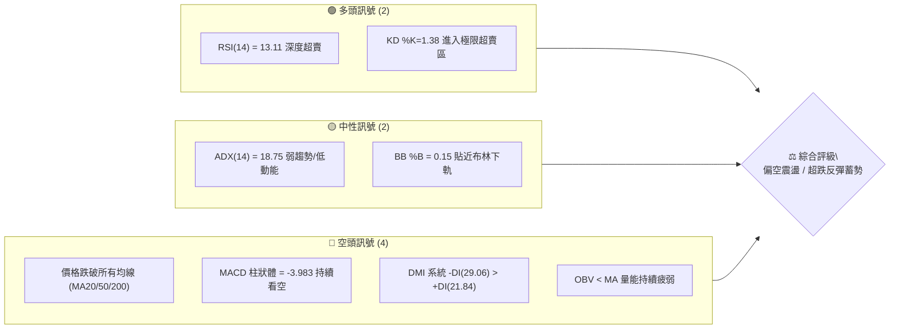
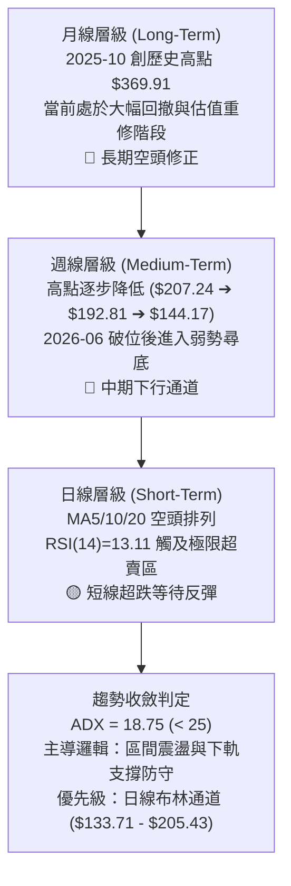
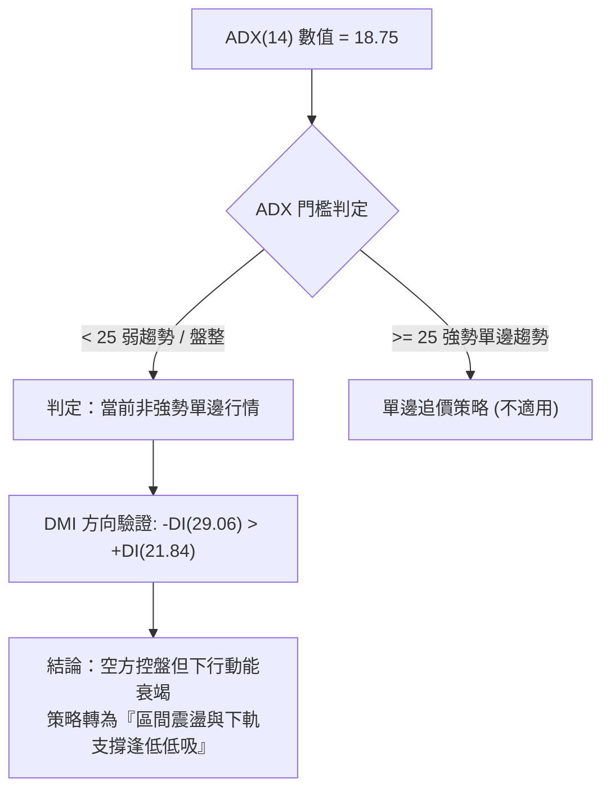
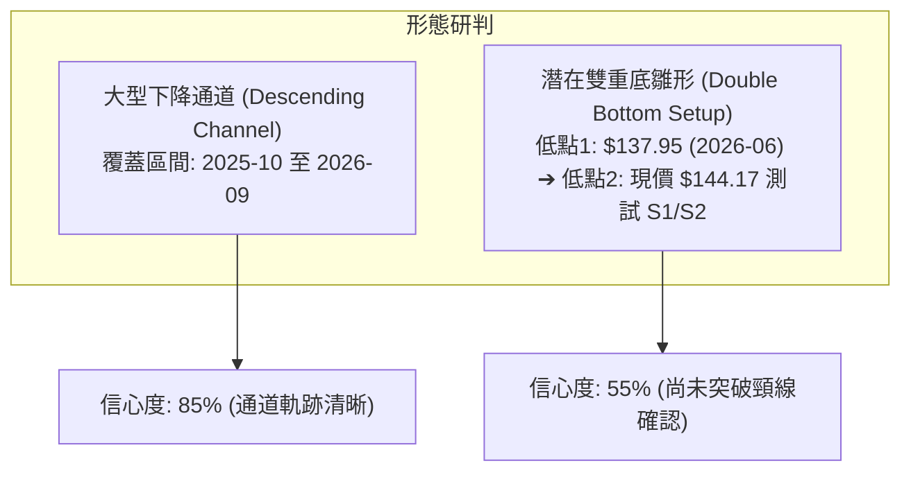
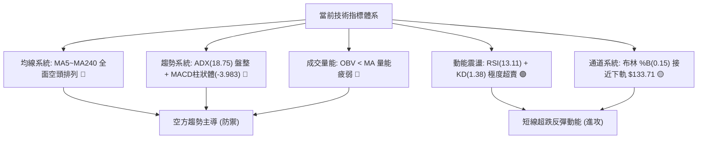
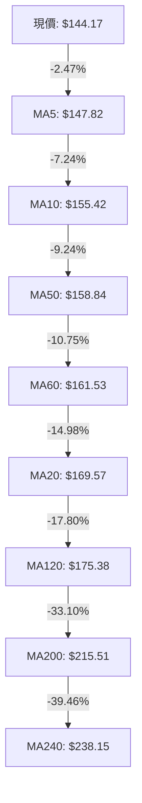
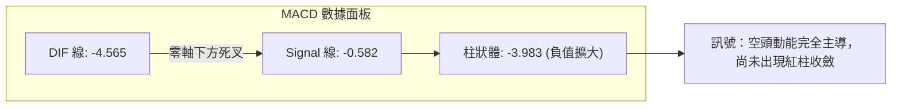
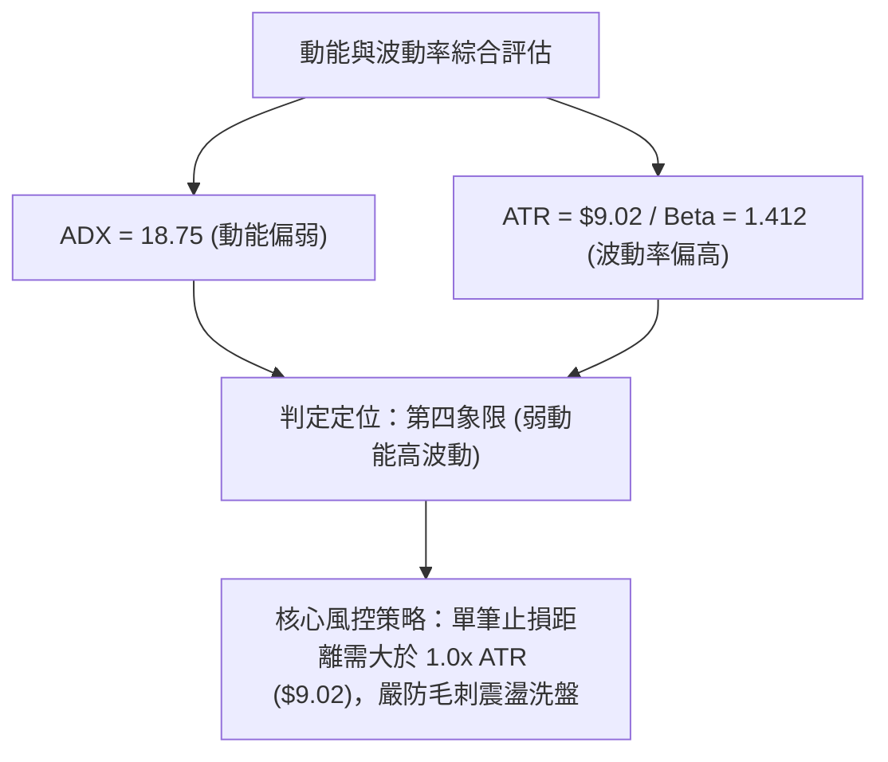
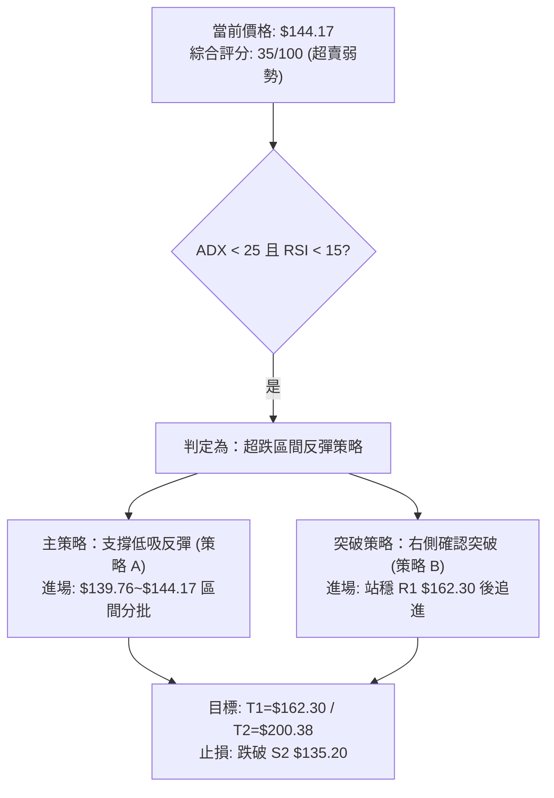
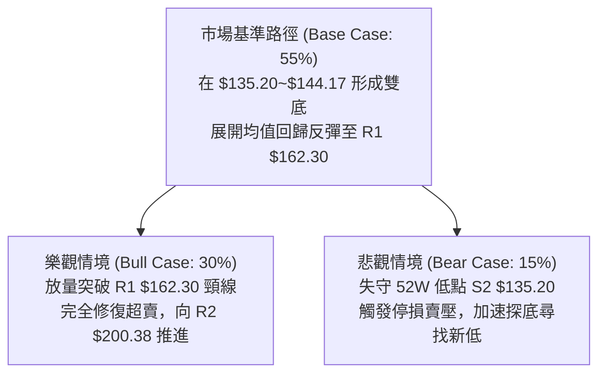

# AVAV 技術分析報告

> **報告日期**：2026-09-02 ｜ **語言**：繁體中文 ｜ **數據來源**：Yahoo Finance ｜ **當前價格**：$144.17

---

## 目錄

| 章節 | 內容 |
|------|------|
| [1. 技術面概覽](#1-技術面概覽) | 訊號儀表板、核心指標、評分卡 |
| [2. 趨勢分析](#2-趨勢分析) | 多時框趨勢、長中短期走勢、ADX解讀 |
| [3. 圖表形態分析](#3-圖表形態分析) | 形態識別、信心度評估、K線組合 |
| [4. 支撐與阻力](#4-支撐與阻力) | 關鍵價位、斐波那契回調結構 |
| [5. 技術指標深度解讀](#5-技術指標深度解讀) | MA系統、RSI背離、MACD、布林通道、OBV |
| [6. 動能與波動率](#6-動能與波動率) | 動能象限、ATR風控、Beta市場相關性 |
| [7. 多時框架總結](#7-多時框架總結) | 時框架矩陣、收斂規則判定 |
| [8. 交易策略建議](#8-交易策略建議) | 策略路由、多空情境、風險報酬比 |
| [9. 風險提示與監控](#9-風險提示與監控) | 關鍵監控清單、情境推演、資金管理 |
| [📋 報告總結](#-報告總結) | 核心結論與執行摘要 |

---

## 1. 技術面概覽

### 🎯 技術訊號儀表板



### 📊 核心指標速覽表

| 指標類別 | 指標名稱 | 當前數值 | 訊號 | 解讀 |
| :--- | :--- | :--- | :---: | :--- |
| **價格** | 當前收盤價 | $144.17 | 🔴 | 位於 52 週區間下緣 (3.2%)，短期處於嚴重弱勢下行通道 |
| **均線** | MA20 (月線) | $169.57 | 🔴 | 現價低於 MA20 達 -14.98%，短期均線呈現陡峭下行壓制 |
| **均線** | MA50 (季線) | $158.84 | 🔴 | 現價低於 MA50 達 -9.24%，中期空頭排列未變 |
| **均線** | MA200 (年線)| $215.51 | 🔴 | 現價遠低於 MA200 達 -33.10%，長期生命線失守確立空頭趨勢 |
| **動能** | RSI(14) | 13.11 | 🟢 | 極度超賣 (<20)，隨時可能引發技術性跌深反彈，但無底背離 |
| **動能** | MACD | -4.565 / -0.582 | 🔴 | DIF 位於 Signal 之下，Diff 柱狀圖 -3.983，空頭動能仍佔優勢 |
| **動能** | KD(9,3,3) | %K 1.38 / %D 6.53 | 🟢 | 極限鈍化超賣區，具備短線右側反轉觸發條件 |
| **趨勢** | ADX(14) | 18.75 | 🟡 | ADX < 25 表示單邊主跌浪動能放緩，市場轉入弱趨勢盤整築底階段 |
| **趨勢** | DMI (±DI) | +DI 21.84 / -DI 29.06 | 🔴 | 空方力量主導盤面 (-DI > +DI) |
| **通道** | 布林帶寬度 | $133.71 ~ $205.43 | 🟡 | %B 為 0.15，價格逼近下軌 $133.71，面臨通道下沿支撐測試 |
| **成交量** | 20日均量比 | 0.84x (1.01M/1.20M)| 🔴 | OBV < MA，成交量能萎縮，尚未見到機構級放量搶籌訊號 |
| **波動** | ATR(14) | $9.02 (6.26%) | 🟡 | 日內波動幅度維持高檔，需嚴格設定保護性止損區間 |

### 🏆 技術評分卡

```
╔══════════════════════════════════════════════════════════════════╗
║              技術評分卡 — AVAV (2026-09-02)                     ║
╠══════════════════════════════════════════════════════════════════╣
║ 趨勢強度 (Trend)     ██████░░░░░░░░░░░░░░  30/100  🔴 空頭壓制  ║
║ 動能指標 (Momentum)  ████████░░░░░░░░░░░░  40/100  🟡 極度超賣  ║
║ 支撐穩定度 (Support) ██████████░░░░░░░░░░  50/100  🟡 臨近波段底║
║ 成交量配合 (Volume)  ██████░░░░░░░░░░░░░░  30/100  🔴 量能萎縮  ║
║ 形態完整度 (Pattern) ████████░░░░░░░░░░░░  40/100  🟡 尋求支撐  ║
║ 均線系統 (Moving Avg)████░░░░░░░░░░░░░░░░  20/100  🔴 全面空排  ║
╠══════════════════════════════════════════════════════════════════╣
║ 綜合技術評分         ███████░░░░░░░░░░░░░  35/100  🔴 弱勢築底  ║
╚══════════════════════════════════════════════════════════════════╝
```

---

## 2. 趨勢分析

### 🌐 多時框趨勢分析



### 📈 長期趨勢 — 12個月走勢圖（Unicode）

```
AVAV 歷史月線走勢圖（2025-09 至 2026-09）
價格 ($)
$370 ┼                             ● (2025-10: $369.91)
$340 ┼                      
$310 ┼               ● (2025-09: $314.89)
$280 ┼                                    ● (2025-11: $279.46)   ● (2026-01: $278.39)
$250 ┼                                           ● (2025-12: $241.89)   ● (2026-02: $252.25)
$220 ┼                                                                         ● (2026-05: $207.24)
$190 ┼                                                                  ● (2026-04: $195.02)
$160 ┼                                                           ● (2026-03: $183.05)   ● (2026-06: $165.07)
$130 ┼                                                                                         ● (2026-08: $148.35)
$100 ┼                                                                                                ● 現價: $144.17
     └─┬─────────┬─────────┬─────────┬─────────┬─────────┬─────────┬─────────┬─────────┬─────────┬─────────┬─────────┬─────
     25-09     25-10     25-11     25-12     26-01     26-02     26-03     26-04     26-05     26-06     26-07     26-09
```

#### 走勢特徵分析表格

| 時間階段 | 價格區間 ($) | 漲跌幅 (%) | 趨勢特徵與結構解析 |
| :--- | :--- | :--- | :--- |
| **2025-09 ~ 2025-10** | $314.89 → $369.91 | +17.47% | **主升浪見頂**：受國防自主系統題材推動創下高點，成交量放大但動能衰竭。 |
| **2025-11 ~ 2026-02** | $369.91 → $252.25 | -31.81% | **第一波下跌段**：跌破短均後於 $240~$278 形成箱型震盪，隨後頸線失守。 |
| **2026-03 ~ 2026-05** | $183.05 → $207.24 | +13.22% | **中期弱反彈**：回踩 $180 關卡後的技術性抽腳，反彈受制於 MA200 反壓。 |
| **2026-06 ~ 2026-09** | $207.24 → $144.17 | -30.43% | **第二波加速主跌浪**：週線連續失守支撐，空頭慣性延續至 52 週低點附近。 |

### 📊 中期趨勢（週線分析）

中期走勢呈現典型「下降階梯」形態。過去 20 週數據顯示：
1. **反彈高點遞減**：2026-05-31 觸及 $207.24 後拉回；2026-08-16 再次反彈僅達 $192.81 即告潰敗，顯示上方 $195~$200 阻力沉重。
2. **週線 RSI 週期性觸底**：2026-06-28 跌至 $137.95 時週 RSI 降至 20.2 後觸發一波反彈至 $190.89；當前（2026-09-06）週 RSI 再次跌至 13.1 極值區，顯示中期空頭拋壓進入衰竭耗盡階段。

```
週線級別阻力與支撐示意圖：
[阻力 R3: $207.83] ──────────────────────── (2026-05 反彈頂部)
[阻力 R2: $200.38] ──────────────────────── (2026-08 反彈次高區間)
[阻力 R1: $162.30] ──────────────────────── (MA60 / 近期密集套牢區)
                         ▼
[現價: $144.17]    ════════════════════════ (逼近 52 週低點)
                         ▲
[支撐 S1: $139.76] ──────────────────────── (近一年波段次低點聚類)
[支撐 S2: $135.20] ──────────────────────── (52 週歷史最低支撐)
```

### ⚡ 趨勢強度評估（ADX 解讀）



#### ADX 趨勢強度對照表

| 指標變數 | 當前讀數 | 門檻區間 | 技術含義解讀 |
| :--- | :--- | :--- | :--- |
| **ADX(14)** | **18.75** | < 20 (極弱趨勢 / 無趨勢) | 空方主跌浪的推進速度正在放緩，市場缺乏新的拋售量能，進入低動能整理。 |
| **+DI (14)** | **21.84** | 偏低 (< 25) | 多頭多方買盤力道薄弱，尚未形成連續進攻隊形。 |
| **-DI (14)** | **29.06** | 處於主導 (> +DI) | 空頭仍掌握微觀定價權，但數值並未突破 40 以上的高危極值。 |
| **動能總結** | **空方佔優但動能鈍化** | ADX < 25 優先收斂至**日線布林區間操作** | 避免盲目做空，預防空頭回補引發的暴力軋空反彈。 |

---

## 3. 圖表形態分析

### 🔍 形態識別系統



#### 圖表形態信心度評估表

| 形態名稱 | 信心度 (%) | 判斷依據（引用數據） | 完成度 (%) | 目標價計算式與精確目標 |
| :--- | :---: | :--- | :---: | :--- |
| **大型下降通道** | **85%** | 自高點 $369.91 連續受制於下移的高點連線，週線低點不斷下移 | **90%** | 下軌目標測試 $135.20 (52W Low)；若反彈則測試上軌 $162.30 (R1) |
| **潛在雙重底 (W底)** | **55%** | 第一隻腳為 2026-06-28 之 $137.95；當前價格 $144.17 於 S1 $139.76 / S2 $135.20 尋求第二隻腳支撐 | **35%** | **需突破頸線 R1 ($162.30) 確認**：<br/>形態高度 = $162.30 - $135.20 = $27.10<br/>理論目標價 = 頸線 $162.30 + $27.10 = **$189.40** |
| **均線死叉排列** | **95%** | MA5 < MA10 < MA20 < MA60 < MA120 < MA240 全面空頭排列 | **100%** | 下行慣性壓制，壓制位見各週期 MA 數值 |

### 🕯️ 重要 K 線形態分析

| 週/月份週期 | 收盤價 ($) | K線形態特徵 | 技術面詳細解讀 | 多空訊號 |
| :--- | :--- | :--- | :--- | :---: |
| **2026-05-31** | $207.24 | 長陽反彈頂部假突破 | 成交量放大至 9.64M，但未能站穩 MA200，形成多頭力竭長上影線 | 🔴 強烈看空 |
| **2026-06-28** | $137.95 | 放量恐慌下影長陰棒 | 週成交量爆出 11.88M，觸底引發超跌買盤，確立波段低點 $137.95 | 🟡 恐慌拋售底 |
| **2026-07-05** | $190.89 | 暴力軋空實體大陽棒 | 成交量激增至 18.31M，單週大漲 38.37%，確立底部強力反彈動能 | 🟢 多頭暴衝 |
| **2026-08-16** | $192.81 | 次高點流星線 (Shooting Star)| 挑戰 R2 $200.38 未果，週 RSI 達 73.5 超買後引發獲利回吐賣壓 | 🔴 次高頂部 |
| **2026-08-30** | $152.28 | 連續中黑陰線破位 | 跌破 MA20 ($169.57) 與 MA50 ($158.84)，空方重奪短期定價權 | 🔴 空方加速 |
| **2026-09-06** | $144.17 | 低檔縮量十字星懸空 | 成交量萎縮至 1.87M，RSI 降至 13.1 極限值，拋壓大幅衰減 | 🟡 止跌孕育中 |

### 📉 ASCII 走勢形態示意圖

```
AVAV 下降通道與潛在雙底測試結構圖：
$210 ┼─────────● (2026-05: $207.24)
$200 ┼───────────＼──────────────● (2026-08: $192.81)
$190 ┼────────────＼────────────／──＼
$180 ┼─────────────＼──────────／────＼
$170 ┼──────────────＼────────／──────＼
$160 ┼──[頸線 R1: $162.30] ─＼──────／────────＼───────
$150 ┼──────────────────＼──／────────────＼──● 現價: $144.17
$140 ┼────────────────────● (2026-06: $137.95) ───[S1: $139.76]
$130 ┼─────────────────────────────────────────────[S2: $135.20 (52W Low)]
     └────────────────────────────────────────────────────────
```

---

## 4. 支撐與阻力

### 🗺️ 關鍵價位分布圖（Unicode）

```
AVAV 關鍵價位結構分布圖
═════════════════════════════════════════════════════════════════════
$207.83 ║████████████████████████████████║ 強阻力 R3 (2026-05 波段高點)
$200.38 ║████████████████████████        ║ 中期阻力 R2 (整數心理大關)
$162.30 ║████████████████                ║ 近期關鍵阻力 R1 (頸線/密集套牢區)
$144.17 ╠════════════════════════════════╣ ◄ 當前收盤價 ($144.17)
$139.76 ║▓▓▓▓▓▓▓▓▓▓▓▓▓▓▓▓                ║ 近期核心支撐 S1 (波段次低點聚類)
$135.20 ║████████████████████████████████║ 歷史強支撐 S2 (52週最低點聚類)
═════════════════════════════════════════════════════════════════════
```

### 🚧 阻力位分析表

| 阻力級別 | 價位 ($) | 距離現價 (%) | 形成原因與籌碼特徵 | 突破難度 | 重要性 |
| :--- | :--- | :--- | :--- | :---: | :---: |
| **R1** | **$162.30** | +12.58% | 近一年波段高點聚類、MA60 均線重合反壓區、W底形態頸線 | 🟡 中等 | ★★★★☆ |
| **R2** | **$200.38** | +38.99% | 近一年波段高點聚類、心理整數關卡、2026-08 反彈頭部 | 🔴 極高 | ★★★★★ |
| **R3** | **$207.83** | +44.16% | 近一年波段最高反彈頂點、布林上軌極限壓制位 | 🔴 極高 | ★★★☆☆ |

### 🛡️ 支撐位分析表

| 支撐級別 | 價位 ($) | 距離現價 (%) | 形成原因與籌碼特徵 | 守住機率 | 重要性 |
| :--- | :--- | :--- | :--- | :---: | :---: |
| **S1** | **$139.76** | -3.06% | 近一年波段低點聚類、2026-06-28 恐慌底緩衝區域 | 🟢 65% | ★★★★☆ |
| **S2** | **$135.20** | -6.22% | 52 週最低點 (52W Low)、斐波那契 100% 極限回調防守底線 | 🟢 80% | ★★★★★ |

### 📐 斐波那契回調位分析

依據 52 週區間高點 **$417.86** 至低點 **$135.20** 進行斐波那契回檔分析：

| 斐波那契層級 | 精確價位 ($) | 距離現價 (%) | 技術意義解讀 |
| :--- | :--- | :--- | :--- |
| **0.0% (52W High)** | **$417.86** | +189.83% | 歷史週期高點，估值超買頂峰 |
| **23.6%** | **$351.15** | +143.57% | 牛市第一級回調點 |
| **38.2%** | **$309.88** | +114.94% | 弱勢修正分水嶺 |
| **50.0%** | **$276.53** | +91.81% | 多空長期平衡樞軸點 |
| **61.8%** | **$243.18** | +68.67% | 黃金分割重要轉折阻力位 |
| **78.6%** | **$195.69** | +35.74% | 深幅回調防守線 (與 R2 $200.38 形成重疊阻力帶) |
| **100.0% (52W Low)** | **$135.20** | -6.22% | **本輪超級週期底線**，多頭最終堡壘 |

> **當前價位定位解讀**：現價 **$144.17** 處於斐波那契 **78.6% ($195.69)** 至 **100.0% ($135.20)** 的極深超跌區間，距離 100% 極限支撐僅剩 6.22% 空間，下行空間受歷史低點強烈收斂保護。

---

## 5. 技術指標深度解讀

### 🎛️ 指標訊號總覽



### 📈 移動平均線排列分析



#### 均線發散狀態詳細數據表

| 均線名稱 | 數值 ($) | 偏離現價幅度 | 斜率趨勢 | 歷史狀態解讀 |
| :--- | :--- | :--- | :---: | :--- |
| **MA5** | $147.82 | -2.47% | 陡峭向下 | 超短線第一道動態阻力線 |
| **MA10** | $155.42 | -7.24% | 陡峭向下 | 短線空方防守線 |
| **MA20** | $169.57 | -14.98% | 下行發散 | 月均線下壓，布林中軌所在 |
| **MA50** | $158.84 | -9.24% | 下行 | 季線下行，中期壓制顯著 |
| **MA60** | $161.53 | -10.75% | 走平偏下 | 與 R1 ($162.30) 形成密集阻力區 |
| **MA120** | $175.38 | -17.80% | 平緩向下 | 半年線持續下壓 |
| **MA200** | $215.51 | -33.10% | 下行 | 長期牛熊分水嶺，失守確立空頭格局 |
| **MA240** | $238.15 | -39.46% | 緩慢向下 | 年線長期負偏離過大 |

### 📉 RSI(14) 分析

* **RSI(14) 數值**：**13.11**
* **超賣進度條**：
  `[███░░░░░░░░░░░░░░░░░] 13.11% (嚴重超賣區間)`
* **背離判定**：
  * **價格層面**：2026-06-28 低點為 $137.95 (RSI=20.2)；當前 2026-09-06 價格為 $144.17 (RSI=13.11)。
  * **結論**：價格尚未跌破前低，但 RSI 創下更低讀數，呈現「無底背離」狀態；然而 RSI < 15 屬於歷史罕見極端超賣，隨時可能觸發空頭回補帶動的均值回歸。

### 📊 MACD(12/26/9) 訊號解讀



### 📦 布林通道分析

```
布林通道結構示意圖 (寬度: $133.71 ~ $205.43)
$205.43 ┼────────────────────────────── [BB 上軌]
        │
$169.57 ┼────────────────────────────── [BB 中軌 / MA20]
        │
$144.17 ┼──────────────●─────────────── [現價位置: %B = 0.15]
$133.71 ┼────────────────────────────── [BB 下軌]
```

* **帶寬狀態**：布林帶寬度為 $71.72，目前 %B 為 **0.15**，顯示價格已經深度滑入下軌附近弱勢區。
* **均值回歸概率**：當價格在布林下軌（$133.71）與現價（$144.17）之間獲得支撐時，通常會向中軌 **MA20 ($169.57)** 進行均值回歸測試。

### 💹 成交量分析（量價配合度）

1. **量能萎縮**：最新成交量為 1,014,923 股，相較於 20 日均量 1,204,141 股（量比 0.84x）及 50 日均量 1,714,342 股大幅萎縮。
2. **OBV 趨勢**：OBV 指標持續低於其移動平均線（OBV < MA），證實機構資金目前以觀望和逢高調節為主，尚未見到大規模主動買盤進場鎖倉。

---

## 6. 動能與波動率

### ⚡ 動能評估四象限

| 象限代號 | 動能維度 | 波動維度 | 當前市場狀態 | 策略應對指引 |
| :---: | :---: | :---: | :---: | :--- |
| **Q1** | 強動能 | 低波動 | 穩定上升趨勢 | 順勢加碼 (不適用) |
| **Q2** | 弱動能 | 低波動 | 橫盤打底震盪 | 區間高拋低吸 (逐步過渡中) |
| **Q3** | 強動能 | 高波動 | 暴跌/暴漲單邊 | 追漲殺跌 (已過主跌階段) |
| **Q4 (當前)** | **弱動能 (ADX=18.75)** | **高波動 (ATR=6.26%)** | **✓ 空頭衰竭震盪** | **嚴控倉位、分批左側低吸或等待右側突破** |



### 📊 ATR 波動率分析

* **ATR(14) 數值**：**$9.02**（佔現價 **6.26%**）。
* **風控應用**：
  * **日內正常波動區間**：$144.17 ± $9.02 ➔ **$135.15 ~ $153.19**。
  * **建議止損保護距離**：1.0x ~ 1.2x ATR（即 $9.02 ~ $10.82）。
  * **關鍵支撐驗證**：現價 $144.17 減去 1.0x ATR ($9.02) 恰好等於 **$135.15**，與 52 週最低支撐 **S2 ($135.20)** 形成技術共振。

### 📐 Beta 與市場相關性

* **Beta 係數**：**1.412**（高彈性特徵）。
* **市場解讀**：AVAV 相較於標普 500 指數具備 1.41 倍的高彈性波動特徵。在市場反彈時具備超額阿爾法潛能，但在大盤回調時亦會放大下行跌幅，操作上必須嚴格控制整體持倉比例（≤ 15%）。

---

## 7. 多時框架總結

### 📋 時框架評分表

| 時框架 | 趨勢方向 | 動能指標 | 均線排列 | 圖表形態 | 綜合評分 | 操作建議 |
| :--- | :---: | :---: | :---: | :---: | :---: | :--- |
| **月線 (長期)** | 🔴 下行修正 | 🟡 走平弱化 | 🔴 跌破年線 | 大頭部確立後回調 | **35/100** | 長期投資者保持耐心，等待估值企穩 |
| **週線 (中期)** | 🔴 空頭通道 | 🟢 極度超賣 | 🔴 空頭排列 | 下降旗形/潛在雙底 | **40/100** | 密切關注 S1/S2 防守，逢低分批建倉 |
| **日線 (短期)** | 🔴 弱勢破位 | 🟢 RSI=13.11 | 🔴 全線下壓 | 貼近布林下軌尋底 | **30/100** | 嚴禁盲目追空，短線尋求超跌博弈點 |

### 🔲 綜合訊號矩陣

```
╔══════════════════════════════════════════════════════════════════╗
║               AVAV 多時框架綜合訊號矩陣                         ║
╠═════════════╦══════════════╦══════════════╦══════════════════════╣
║ 維度 \ 週期 ║ 日線 (Short) ║ 週線 (Medium)║ 月線 (Long)          ║
╠═════════════╬══════════════╬══════════════╬══════════════════════╣
║ 趨勢方向    ║ 🔴 空頭破位  ║ 🔴 通道下行  ║ 🔴 深度調整          ║
║ RSI 狀態    ║ 🟢 13.11極限 ║ 🟢 13.10超賣 ║ 🟡 42.50中性偏弱     ║
║ MACD 狀態   ║ 🔴 負柱擴大  ║ 🔴 負柱運行  ║ 🔴 高位死叉下行      ║
║ 支撐位考驗  ║ 🟡 考驗 S1   ║ 🟢 逼近 S2   ║ 🟢 接近 52W 底部     ║
║ 均線壓力    ║ 🔴 MA5-MA20  ║ 🔴 MA50-MA60 ║ 🔴 MA200 反壓        ║
╚═════════════╩══════════════╩══════════════╩══════════════════════╝
```

### ⚖️ 多時框收斂結論

> **收斂規則執行**：
> 1. 當前 **ADX(14) = 18.75 (< 25)**，技術盤面確立為**「弱趨勢 / 盤整震盪行情」**。
> 2. 依多時框收斂規則，市場定價權由**日線布林通道（$133.71 ~ $205.43）**與關鍵波段高低點聚類主導。
> 3. **唯一方向性結論**：**【中性偏空，極度超賣醞釀區間反彈】**。空頭趨勢雖未扭轉，但因動能指標（RSI 13.11、KD 1.38）均已進入極端超賣區，且價格逼近 52 週硬支撐 **S2 ($135.20)** 與布林下軌 **$133.71**，此處做空之風險報酬比極差，策略主軸定調為：**依託 S1/S2 支撐進行超跌反彈博弈**。

---

## 8. 交易策略建議

### 🗺️ 策略決策流程圖



### 🧭 策略路由

* **當前主策略方向** = **【超跌反彈左側低吸 / 區間震盪操作】（依技術評分 35/100 與極限超賣指標判定）**。

### 🎯 價格情境階梯（Price Scenarios）

| 觸發條件 | 第一目標 | 第二目標 | 後續延伸 | 技術情境含義與操作指引 |
| :--- | :--- | :--- | :--- | :--- |
| **強勢突破 R1 $162.30** | R2 $200.38 | R3 $207.83 | 斐波那契 50% ($276.53) | **短線全面轉強**：確立 W 底反轉形態，空頭全面平倉認賠 |
| **守穩 S1 $139.76 ~ 現價**| R1 $162.30 | BB中軌 $169.57 | R2 $200.38 | **區間均值回歸**：超跌修復，在布林通道內向上測試中軌 |
| **有效跌破 S2 $135.20** | $130.00 整數關卡 | 下方無數據支撐 | 尋求新估值底部 | **中期破位下行**：52 週支撐失守，引發停損賣壓，必須無條件止損 |

### 📊 情境機率分佈

| 運行情境 | 發生機率 | 主要技術依據 |
| :--- | :---: | :--- |
| **情境一：超跌反彈 / 均值回歸** | **55%** | RSI(13.11) 與 KD(1.38) 處於極度超賣區，逼近布林下軌與 52W 底部聚類 |
| **情境二：窄幅區間磨底震盪** | **30%** | ADX=18.75 弱趨勢，量能萎縮至 1.01M，多空雙方在 $135~$155 進行籌碼沉澱 |
| **情境三：跌破 S2 繼續探底** | **15%** | 均線系統全線下壓，MACD 柱狀體維持負值，若大盤系統性風險爆發則破位 |

### 🟢 主策略詳情

| 策略要素 | 策略 A：左側超跌支撐低吸 (主推) | 策略 B：右側突破確認加碼 |
| :--- | :--- | :--- |
| **進場條件** | 價格於 S1 ($139.76) 上方企穩，出現分時底背離 | 日線實體收盤價帶量突破 R1 ($162.30) 頸線 |
| **進場價格** | **$144.17**（當前價至 $139.76 區間分批進場） | **$162.30** |
| **目標價 T1** | **$162.30** (R1 阻力位 / +12.58%) | **$200.38** (R2 阻力位 / +23.46%) |
| **目標價 T2** | **$200.38** (R2 阻力位 / +38.99%) | **$207.83** (R3 阻力位 / +28.05%) |
| **止損價格** | **$134.50** (精確設於 S2 $135.20 下方 0.5%) | **$154.00** (跌回 MA10 之下) |
| **風險報酬比 (R/R)**| **1 : 1.88** (至 T1) / **1 : 5.81** (至 T2) | **1 : 4.59** (至 T1) |
| **成功機率** | **55%** | **65%** |
| **建議總倉位** | **8% ~ 10%** (輕倉試單) | **10% ~ 15%** (順勢加碼) |

> **策略 A 風險報酬比精確計算**：
> * 單股風險 = 進場價 $144.17 - 止損價 $134.50 = **$9.67** (約 1.07x ATR)
> * 目標 T1 收益 = 目標價 $162.30 - 進場價 $144.17 = **$18.13** ➔ $18.13 / $9.67 = **1 : 1.88**
> * 目標 T2 收益 = 目標價 $200.38 - 進場價 $144.17 = **$56.21** ➔ $56.21 / $9.67 = **1 : 5.81**

### 🔴 反向風險觸發點（對沖提示）

若發生以下情形，主推之多頭反彈邏輯即刻失效，需執行風控措施：
1. **跌破核心防線**：日線收盤價跌破 **S2 ($135.20)**，表明 52 週支撐徹底瓦解。
2. **量能異常放大破位**：跌破 $135.20 時伴隨單日成交量大於 2.5M 股（放量殺跌）。
3. **對沖建議**：跌破 $135.20 後立即止損多單，並可買入標普 500 / 國防類股反向 ETF 進行宏觀下行風險對沖。

### ⭐ 整體訊號強度評星

```
╔══════════════════════════════════════════════════╗
║ 做多訊號強度 (超跌反彈)：★★☆☆☆  (2.5/5星) 偏弱試單 ║
║ 做空訊號強度 (順勢壓制)：★★★☆☆  (3.0/5星) 空間有限 ║
║ 整體技術可信度：        ★★★★☆  (4.0/5星) 點位清晰 ║
╚══════════════════════════════════════════════════╝
```

---

## 9. 風險提示與監控

### ✅ 關鍵監控指標 Checklist

```
╔══════════════════════════════════════════════════════════════════╗
║               AVAV 每日交易監控清單 (Checklist)                  ║
╠══════════════════════════════════════════════════════════════════╣
║ [ ] 價格是否跌破 S2 強支撐 ($135.20)？ ➔ 若跌破立即止損離場     ║
║ [ ] RSI(14) 是否脫離超賣區回升至 30 以上？ ➔ 確認反彈動能啟動   ║
║ [ ] 成交量是否放大至 20 日均量 (1.20M) 以上？ ➔ 驗證買盤真實度  ║
║ [ ] MACD 柱狀體負值是否開始收窄 (-3.983 ➔ -2.000)？ ➔ 動能拐點  ║
║ [ ] 價格能否有效突破並站穩 MA5 ($147.82) 與 MA10 ($155.42)？     ║
║ [ ] 布林通道 %B 是否自 0.15 回升突破 0.50 (重回中軌 $169.57)？   ║
╚══════════════════════════════════════════════════════════════════╝
```

### ⚠️ 風險場景分析



### 🛡️ 風險管理重要提醒

1. **嚴格倉位控制**：AVAV 目前 Beta 高達 1.412 且均線處於空頭排列，單一標的持倉佔總投資組合比重**嚴格限制在 10% 以內**。
2. **動態調整止損**：若價格順利反彈至 **$155.00**（MA10 附近），應立即將止損點上移至進場成本價 **$144.17**，鎖定本金安全（零風險博弈後續利潤）。
3. **拒絕情緒化加碼**：若價格跌破 S2 ($135.20)，切忌在下跌過程中進行向下攤平（Martingale）操作，必須嚴格執行紀律止損。

---

## 📋 報告總結

```
╔══════════════════════════════════════════════════════════════════╗
║                  AVAV 技術分析報告總結                          ║
╠══════════════════════════════════════════════════════════════════╣
║ 報告日期：2026-09-02                                             ║
║ 當前價格：$144.17                                                ║
║ 分析評級：⚖️ 偏空尋底 / 極度超賣醞釀技術反彈                      ║
║                                                                  ║
║ 關鍵結論：                                                       ║
║ ├─ 長期趨勢：🔴 弱勢修正，處於歷史高點回調之深水區               ║
║ ├─ 中期趨勢：🔴 下降通道運行，但週線動能進入極度超賣 (RSI 13.1)  ║
║ ├─ 短期趨勢：🟡 逼近 52 週底部，ADX=18.75 動能鈍化，下行空間收窄 ║
║ ├─ 關鍵支撐：S1: $139.76 ｜ S2: $135.20 (52W Low)               ║
║ ├─ 關鍵阻力：R1: $162.30 ｜ R2: $200.38 ｜ R3: $207.83          ║
║ └─ 分析師共識目標：均價 $225.77 (高 $326.00 / 低 $148.57)        ║
║                                                                  ║
║ 最優策略組合：                                                   ║
║ 1. 🥇 最佳機會：在現價 $144.17 至 S1 $139.76 間建立超跌反彈多單  ║
║    目標 R1 $162.30 (R/R = 1:1.88)，止損設於 $134.50。           ║
║ 2. 🥈 次選機會：等待放量突破頸線 R1 $162.30 後右側順勢追進，      ║
║    博弈目標 R2 $200.38 (R/R = 1:4.59)。                          ║
║ 3. 🥉 保守選擇：完全空倉觀望，直至價格站穩 MA20 ($169.57) 與     ║
║    MACD 出現日線級別金叉再行介入。                               ║
╚══════════════════════════════════════════════════════════════════╝
```

---

> ⚠️ **免責聲明**：本報告為技術分析研究，所有數據及估算均基於市場歷史價格與量化指標運算。本報告**僅供學術研究與參考**，**不構成任何形式的投資要約或決策建議**。金融市場投資具備固有風險，投資者應獨立評估自身的風險承受能力並自負盈虧。

---

*報告生成時間：2026-09-02 ｜ 數據來源：Yahoo Finance ｜ 分析框架：多時框量化技術分析*