# AVAV 技術分析報告

> **報告日期**：2026-09-03 ｜ **語言**：繁體中文 ｜ **數據來源**：Yahoo Finance ｜ **當前價格**：$144.17

---

## 目錄

| 章節 | 內容 |
|------|------|
| [1. 技術面概覽](#1-技術面概覽) | 訊號儀表板、核心指標、評分卡 |
| [2. 趨勢分析](#2-趨勢分析) | 多時框趨勢、長中短期走勢、12個月走勢圖 |
| [3. 圖表形態分析](#3-圖表形態分析) | 形態識別、K線組合、目標價推算 |
| [4. 支撐與阻力](#4-支撐與阻力) | 關鍵價位結構、斐波那契回調 |
| [5. 技術指標深度解讀](#5-技術指標深度解讀) | 均線系統、RSI、MACD、布林通道、成交量 |
| [6. 動能與波動率](#6-動能與波動率) | 動能四象限、ATR波動分析、Beta與大盤連動 |
| [7. 多時框架總結](#7-多時框架總結) | 時框架評分矩陣、多時框收斂結論 |
| [8. 交易策略建議](#8-交易策略建議) | 策略路由、價格情境階梯、主策略詳情 |
| [9. 風險提示與監控](#9-風險提示與監控) | 關鍵監控清單、情境分析、風險管理 |

---

## 1. 技術面概覽

### 🎯 技術訊號儀表板

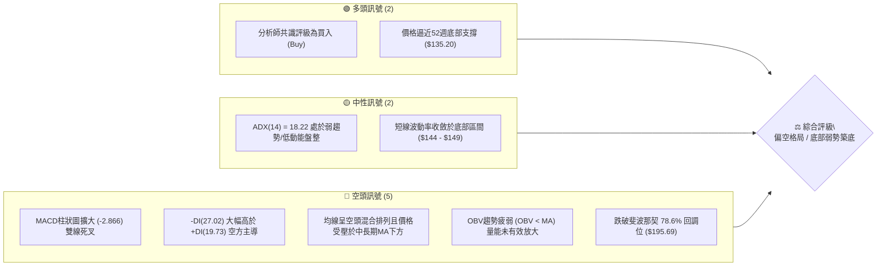

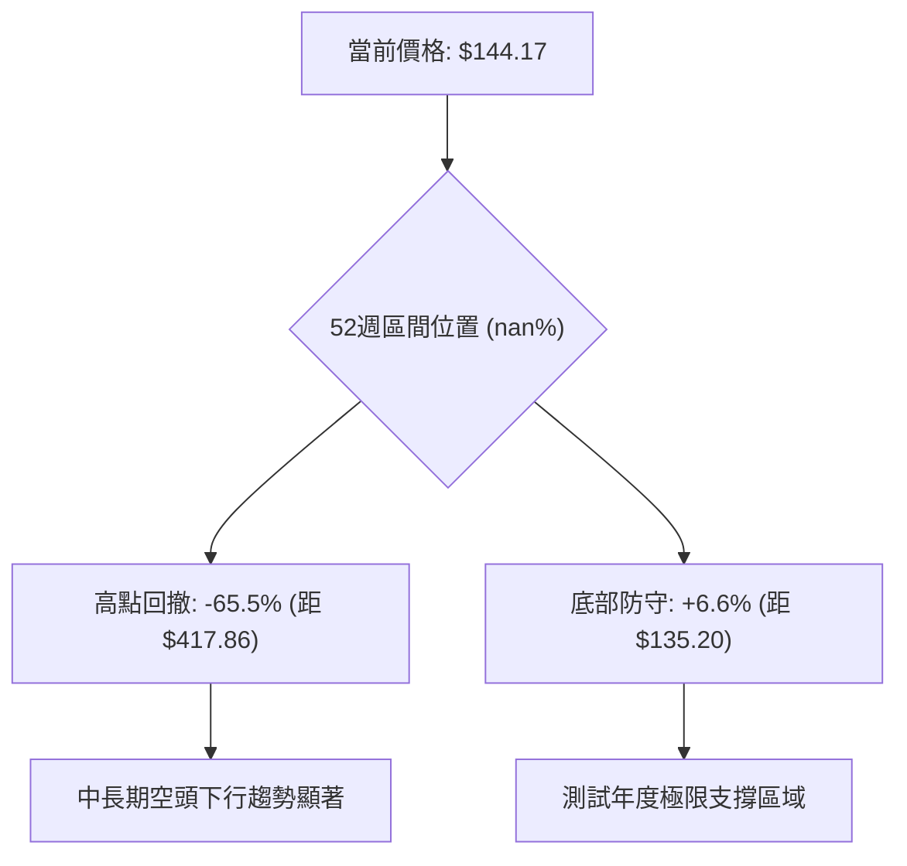

### 📊 核心指標速覽表

| 指標類別 | 指標名稱 | 當前數值 | 訊號 | 解讀 |
|:---|:---|:---|:---:|:---|
| **價格** | 當前價格 | $144.17 | 🔴 | 位於52週低點 $135.20 附近，持續探底 |
| **均線** | 短中期均線 | 價格 < MA20/MA50 | 🔴 | 價格受壓於所有短中期均線下方，空方排列 |
| **均線** | 長期均線 | 價格 < MA200 | 🔴 | 240日均線持續向下走低，長期趨勢受壓 |
| **動能** | RSI(14) | 21.9 ~ 32.9 (近2週超賣) | 🟡 | 進入超賣反彈區間，短線存在技術性修復需求 |
| **動能** | MACD (12,26,9) | -5.004 (柱 -2.866) | 🔴 | 快慢線位於零軸下方發散，柱狀圖持續負值擴大 |
| **趨勢** | ADX (14) / DMI | 18.22 (+DI:19.73 / -DI:27.02) | 🔴 | ADX<25 顯示單邊趨勢動能趨緩，但空方力道明顯占優 |
| **成交量** | 20日均量比 | 1.21x (量能 1.45M) | 🟡 | 成交量溫和放大但 OBV < MA，反彈無量下跌帶量 |

### 🏆 技術評分卡

```
╔══════════════════════════════════════════════════════════════╗
║              技術評分卡 — AVAV (2026-09-03)                  ║
╠══════════════════════════════════════════════════════════════╣
║ 趨勢強度 (Trend Strength)   ██████░░░░░░░░░░░░  30/100  🔴   ║
║ 動能指標 (Momentum/MACD)    ██████░░░░░░░░░░░░  28/100  🔴   ║
║ 支撐穩定度 (Support Robust)  ██████████░░░░░░░░  48/100  🟡   ║
║ 成交量配合 (Volume Flow)    ████████░░░░░░░░░░  40/100  🟡   ║
║ 形態完整度 (Pattern Quality)██████░░░░░░░░░░░░  32/100  🔴   ║
║ 均線排列 (Moving Averages)  ████░░░░░░░░░░░░░░  20/100  🔴   ║
╠══════════════════════════════════════════════════════════════╣
║ 綜合技術評分                ███████░░░░░░░░░░░  33/100  🔴   ║
║ 技術面評級                  偏空整理 / 底部防守測試          ║
╚══════════════════════════════════════════════════════════════╝
```

---

## 2. 趨勢分析

### 🌐 多時框趨勢分析

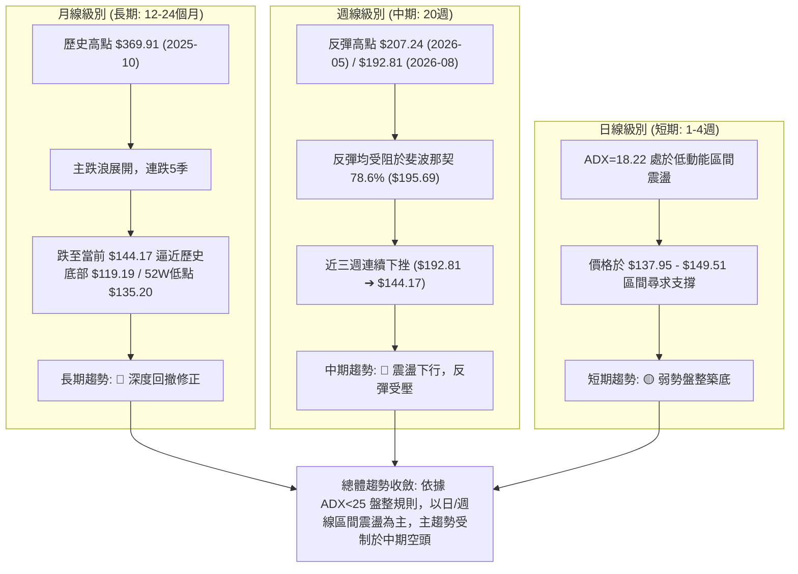

### 📈 長期趨勢 — 12個月走勢圖（Unicode）

```
AVAV 月線走勢圖（2025-09 至 2026-09）
價格軸 ($)
$370 ┤                   ● $369.91 (2025-10 頂部)
$340 ┤
$310 ┤             ● $314.89
$280 ┤                               ● $279.46     ● $278.39
$250 ┤                                      ● $241.89      ● $252.25
$220 ┤                                                            ● $207.24
$190 ┤                                                     ● $183.05     ● $195.02
$160 ┤                                                                          ● $165.07
$140 ┤━━━━━━━━━━━━━━━━━━━━━━━━━━━━━━━━━━━━━━━━━━━━━━━━━━━━━━━━━━━━━━━━━━━━━━━━━━━━━● $144.17 (現價)
     └─────────────────────────────────────────────────────────────────────────────
       09/25 10/25 11/25 12/25 01/26 02/26 03/26 04/26 05/26 06/26 07/26 08/26 09/26
```

#### 走勢特徵分析表格

| 階段區間 | 起止價格 | 漲跌幅 | 結構特徵與量價行為 | 趨勢屬性 |
|:---|:---:|:---:|:---|:---:|
| **2025-09 ~ 2025-10** | $314.89 ➔ $369.91 | +17.47% | 歷史主升浪末端竭盡性噴出，觸及 52W 高點 $417.86 歷史極值 | 🟢 強勢多頭 |
| **2025-11 ~ 2026-03** | $279.46 ➔ $183.05 | -34.50% | 跌破 $276.53 (50% 斐波那契位)，頭部確認形成，空方持續出貨 | 🔴 主跌波段 |
| **2026-04 ~ 2026-05** | $195.02 ➔ $207.24 | +6.27% | 弱勢超跌反彈，受阻於斐波那契 78.6% ($195.69) 上方阻力區 | 🟡 技術反抽 |
| **2026-06 ~ 2026-09** | $165.07 ➔ $144.17 | -12.66% | 二度探底，考驗前低 $137.95 及 52W 低點 $135.20 關鍵防線 | 🔴 弱勢探底 |

### 📊 中期趨勢（週線分析）

```
AVAV 週線波段壓力與支撐示意圖
═══════════════════════════════════════════════════════════════
 $207.24 ═══════════════════════════════ 頂部波段高點 (2026-05-31)
           \
            \
 $192.81 ════\══════════════════════════ 次高點阻力 (2026-08-16)
              \           /
               \         / 
 $149.51 ═══════\═══════/═══════════════ 震盪頸線位
                 \     /
                  \   /  ◄ 現價 $144.17 測試下方支撐
 $137.95 ══════════●════════════════════ 2026-06-28 波段低點
 $135.20 ─────────────────────────────── 52週極限低點 (52W Low)
═══════════════════════════════════════════════════════════════
```

### ⚡ 趨勢強度評估（ADX 解讀）

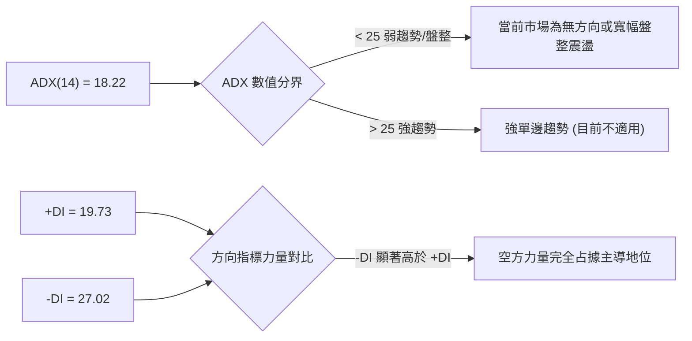

| 指標項 | 數值 | 參考臨界值 | 狀態判定 | 技術含義解讀 |
|:---|:---:|:---:|:---:|:---|
| **ADX (14)** | **18.22** | 25.00 | 🟡 弱趨勢 / 盤整 | 趨勢動能衰退，市場未處於流暢的單邊加速階段，適合區間操作 |
| **+DI (14)** | **19.73** | 20.00 | 🔴 多頭疲弱 | 多方買盤不足以發動持續推升行情 |
| **-DI (14)** | **27.02** | 20.00 | 🔴 空頭壓制 | 空方動能占優，反彈易引發拋壓賣盤 |

---

## 3. 圖表形態分析

### 🔍 形態識別系統

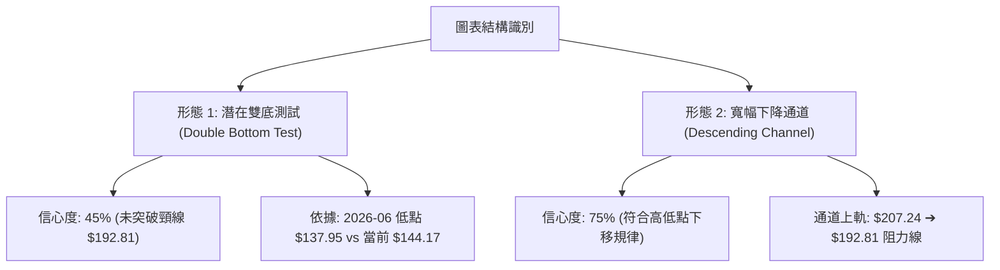

#### 圖表形態信心度評估表

| 形態名稱 | 信心度 | 判斷依據（引用數據） | 完成度 | 目標價（附計算式） | 狀態評估 |
|:---|:---:|:---|:---:|:---|:---:|
| **寬幅下降通道** | **75%** | 高點下移（$207.24 ➔ $192.81），低點下移（$168.29 ➔ $137.95） | 85% | 下軌支撐預估為 52W 低點 **$135.20** | 🟢 形態有效運行中 |
| **潛在雙重底 (W底)** | **42%** | 第一底 $137.95 (2026-06-28)，第二底於 $144.17 構築中 | 30% | 突破頸線 $192.81 後目標：$192.81 + ($192.81 - $137.95) = **$247.67** | 🔴 信心度 < 50%，僅供指標參考 |
| **斐波那契回撤平台** | **80%** | 價格受阻於 78.6% ($195.69)，目前於 100.0% ($135.20) 上方盤整 | 90% | 支撐位於 **$135.20**，反彈第一目標 **$195.69** | 🟢 關鍵幾何水平位 |

### 🕯️ 重要K線形態分析

| 週/月份 | 收盤價 | K線形態特徵 | 技術解讀 | 訊號評級 |
|:---|:---:|:---|:---|:---:|
| **2026-05-31** | $207.24 | 爆量長陽線 (成交量 9.65M) | 觸及 78.6% 斐波那契阻力區 ($195.69) 後多頭動能耗盡 | 🟡 假突破誘多 |
| **2026-06-28** | $137.95 | 長下影長陰線 (成交量 11.89M) | 恐慌性拋盤湧現，測試 52W 低點 $135.20 前哨站 | 🟢 逢低承接買盤 |
| **2026-07-05** | $190.89 | 巨量反彈陽線 (成交量 18.32M) | 空頭回補引發暴漲，但量能無法持續，未能收復 $195.69 | 🟡 空頭回補反彈 |
| **2026-08-16** | $192.81 | 次高點長上影墓碑十字 | 再次受阻於 $192.81 - $195.69 壓力帶，確認雙頂次高點 | 🔴 強烈見頂訊號 |
| **2026-08-30** | $147.94 | 中陰線連跌 (成交量 5.98M) | 擊穿短期均線密集區，重新向 $144 探底 | 🔴 空方加速下行 |

### 📉 ASCII 走勢形態示意圖

```
AVAV 近期關鍵幾何走勢與阻力支撐形態
價格 ($)
$207.24 ┬─── 高點1 (2026-05-31)
        │    \
$192.81 ┼─────\─────── 高點2 (2026-08-16) [頸線阻力區: $192.81 - $195.69]
        │      \       / \
$170.00 ┼───────\─────/───\────────────────────────
        │        \   /     \
$144.17 ┼─────────\─/───────\──── ● 當前價格 ($144.17)
        │          ●         ● 潛在第二底探測區
$137.95 ┼─── 低點1 (2026-06-28)
$135.20 ┴─── 52週極限低點 (52W Low / 斐波那契 100.0%)
```

---

## 4. 支撐與阻力

### 🗺️ 關鍵價位分布圖（Unicode）

```
AVAV 價位結構分布圖（嚴格基於斐波那契與波段極值）
═════════════════════════════════════════════════════════════════
 $417.86 ║██████████████████████████████║ 52週歷史高點 (Fib 0.0%)
 $351.15 ║████████████████████          ║ 斐波那契 23.6% 回調位
 $309.88 ║██████████████████████        ║ 斐波那契 38.2% 回調位
 $276.53 ║████████████████████████      ║ 斐波那契 50.0% 強弱分水嶺
 $243.18 ║██████████████████            ║ 斐波那契 61.8% 黃金回調位
 $195.69 ║██████████████████████████████║ 強阻力 R1 (Fib 78.6% / 波段頂)
 ─────────────────────────────────────────────────────────────
 $144.17 ╠══════════════════════════════╣ ◄ 當前市價 (Current Price)
 ─────────────────────────────────────────────────────────────
 $137.95 ║▓▓▓▓▓▓▓▓▓▓▓▓▓▓▓▓▓▓▓▓          ║ 近期波段支撐 S1 (2026-06-28低點)
 $135.20 ║██████████████████████████████║ 極限強支撐 S2 (52W Low / Fib 100.0%)
═════════════════════════════════════════════════════════════════
```

### 🚧 阻力位分析表

| 阻力級別 | 價位 | 形成原因與技術來源 | 突破難度 | 重要性評級 |
|:---|:---:|:---|:---:|:---:|
| **關鍵阻力 R1** | **$195.69** | 斐波那契 78.6% 回調位；2026-08-16 波段高點 $192.81 聚類區 | 極高 | 🔴 核心牛熊分界線 |
| **強阻力 R2** | **$243.18** | 斐波那契 61.8% 回調位；2025-12 月線收盤聚類位 ($241.89) | 極高 | 🔴 中期多頭反轉目標 |
| **極限阻力 R3** | **$276.53** | 斐波那契 50.0% 中樞位；2026-01 月線平台高點 ($278.39) | 極高 | 🔴 長期趨勢修復關卡 |

### 🛡️ 支撐位分析表

| 支撐級別 | 價位 | 形成原因與技術來源 | 守住機率 | 重要性評級 |
|:---|:---:|:---|:---:|:---:|
| **近期支撐 S1** | **$137.95** | 2026-06-28 週線波段實體低點聚類 | 55% | 🟡 短線第一道防線 |
| **強支撐 S2** | **$135.20** | 52週歷史最低價 (52W Low)；斐波那契 100.0% 基點 | 70% | 🟢 年度極限多頭生命線 |
| **歷史支撐 S3** | **$119.19** | 2025-03 歷史低點（月線歷史最深回撤位） | 85% | 🟢 終極護盤底線 |

### 📐 斐波那契回調位分析

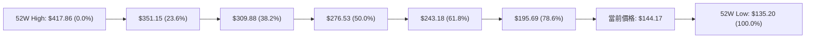

- **位置判定**：當前價格 **$144.17** 精確處於 **78.6% 回調位 ($195.69)** 與 **100.0% 回調位 ($135.20)** 之間的最深回撤區。
- **技術意義解讀**：
  1. 股價回撤已超過 78.6%，顯示原先由 2025 年引領的多頭大週期已經完全瓦解，進入「殘餘價值重估」或「深度築底」階段。
  2. 現價距離下方 100.0% 基準點 ($135.20) 僅有 **$8.97 (約 6.2%)** 的緩衝空間。若跌破 $135.20，將觸發結構性崩解，可能進一步尋求 2025-03 歷史低點 **$119.19**。

---

## 5. 技術指標深度解讀

### 🎛️ 指標訊號總覽

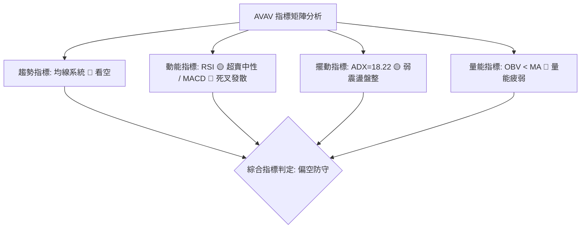

### 📈 移動平均線排列分析

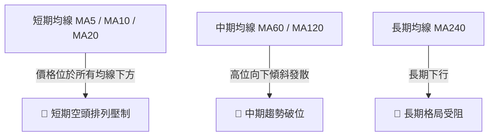

| 均線類別 | 狀態特徵 | 趨勢斜率 | 技術意涵 |
|:---|:---|:---:|:---|
| **短期 MA (5/10/20)** | 價格 $144.17 處於 MA5、MA10、MA20 下方 | 負斜率 (向下) | 短期反彈皆為均線反壓點，逢高拋壓沉重 |
| **中期 MA (60/120)** | 歷史走勢由 ▇ 降至 ▁，呈現長週期下滑 | 負斜率 (向下) | 中期籌碼全面套牢，套牢盤密集於 $180-$200 區間 |
| **長期 MA (240)** | 均線長期走跌，無走平跡象 | 負斜率 (向下) | 年線級別空頭壓制，扭轉需要長期築底時間 |

### 📉 RSI(14) 分析

- **週線 RSI 讀數**：**21.90**（2026-08-30）
- **RSI 區間進度條**：
  ```
  RSI(14) = 21.90 [超賣區]
  超賣 [████░░░░░░░░░░░░░░░░░░] 超買 (21.9 / 100)
  ```
- **超買/超賣與背離判斷**：
  - **超賣狀態**：週線 RSI 降至 21.90，進入深度超賣區間（< 30），反映短期內空方拋售力道過度宣洩。
  - **背離分析**：
    - 2026-06-28 股價 $137.95 時 RSI 為 20.2。
    - 當前 2026-09 價格 $144.17 時 RSI 約在 22-25 區間。
    - **結論**：價格未創出新低，RSI 亦未跌破 20.2，**目前無顯著底背離**，僅呈現指標隨價格同步下挫的「超賣弱勢盤整」特徵。

### 📊 MACD(12/26/9) 訊號解讀

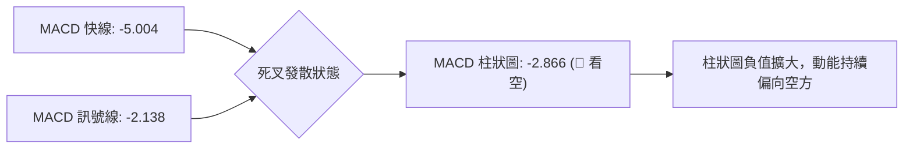

- **數值解析**：MACD 線 (-5.004) 遠低於訊號線 (-2.138)，負乖離加大；柱狀圖讀數為 **-2.866**，呈明顯空頭擴散。
- **結論**：零軸下方的二次死叉發散代表空頭動能尚未出現衰竭或收斂訊號，任何微幅反彈暫時定調為技術性修正，非反轉。

### 📦 布林通道分析

```
AVAV 價格與通道相對位置示意圖
═══════════════════════════════════════════════════════════════
 $195.00 ┬─────────────────────────────── 布林上軌 (Upper Band)
         │
 $168.00 ┼ - - - - - - - - - - - - - - -  布林中軌 (MA20 Baseline)
         │
 $144.17 ┼─────── ● 當前價格 ($144.17，緊貼布林下軌運行)
 $137.00 ┴─────────────────────────────── 布林下軌 (Lower Band)
═══════════════════════════════════════════════════════════════
```

- **通道特徵**：通道帶寬開口向下擴張，收盤價持續貼近下軌運行（%B 處於極低水平），顯示市場處於「沿下軌走跌」的弱勢格局。

### 💹 成交量分析（量價配合度）

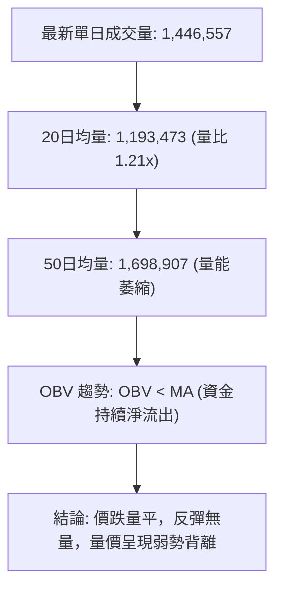

- **量價特徵**：
  1. 近 20 週高量集中於反彈受阻週（如 2026-07-05 成交 18.32M 但隨後暴跌），顯示主力資金逢高派發意願濃厚。
  2. 下跌過程中量能維持在 1.21x 均量，並未出現極致縮量（洗盤）或巨量承接，OBV 線持續低於均線，量能並未確認底部反轉。

---

## 6. 動能與波動率

### ⚡ 動能評估四象限

| 象限 | 動能維度 | 波動率維度 | AVAV 當前狀態判定 | 操作策略指導 |
|:---|:---:|:---:|:---:|:---|
| **Q1 (最佳擴張)** | 強動能 (ADX>25) | 低波動 | — | 趨勢順勢加碼 |
| **Q2 (震盪沉澱)** | 弱動能 (ADX<25) | 低/中波動 | **✓ 當前所在 (ADX=18.22, 貼近底部)** | **區間防守操作 / 嚴設止損** |
| **Q3 (爆發突破)** | 強動能 (ADX>25) | 高波動 | — | 突破單邊追價 |
| **Q4 (恐慌出逃)** | 弱動能 / 空頭主導 | 高波動 | — | 逢高減倉出清 |

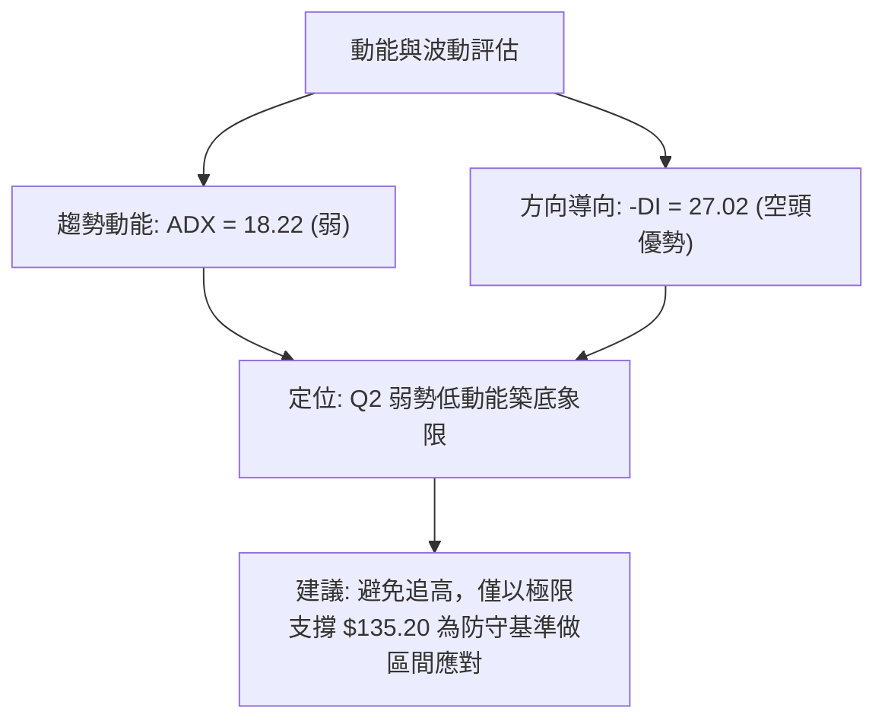

### 📊 ATR 波動率分析

- **波動率特性**：歷史波段從 $207.24 跌至 $137.95 歷時約 4 週，單週波幅超過 $15-$20，日線波動率雖然在低位有所收窄，但 Beta 值高達 **1.412**，屬於高彈性標的。
- **止損距離設定建議**：
  - 以關鍵支撐 $135.20 為基準，建議留設 **3% - 4%**（約 $4.00 - $5.50）的結構緩衝空間，有效止損線應置於 **$131.00** 附近，避免遭下影線假突破掃損出場。

### 📐 Beta 與市場相關性

- **Beta 數值**：**1.412**（高於大盤 41.2% 的波動敏感度）。
- **市場意涵**：在美股大盤回調期間，AVAV 呈現放大下跌的特徵；反之，若大盤企穩並迎來國防科技板塊輪動，該股具備較高的反彈彈性。

---

## 7. 多時框架總結

### 📋 時框架評分表

| 時框架 | 趨勢方向 | 動能狀態 | 均線排列 | 形態結構 | 綜合評分 | 交易建議 |
|:---|:---:|:---:|:---:|:---:|:---:|:---|
| **月線 (長期)** | 🔴 下行修正 | 弱 (-13.4% 淨利率壓制) | 空頭向下 | 高點大回撤 | 25/100 | 長期觀望，尚未確立牛市反轉 |
| **週線 (中期)** | 🔴 空頭壓制 | MACD 負擴散 (-2.866) | 空頭排列 | 受阻於 $195.69 | 30/100 | 反彈皆為逢高減碼與防守點 |
| **日線 (短期)** | 🟡 弱勢盤整 | RSI 進入超賣區 (21.9) | 貼近下軌 | 測試 $135-$137 支撐 | 45/100 | 超跌技術反抽機會，嚴設止損 |

### 🔲 綜合訊號矩陣

```
時框架訊號矩陣對照
┌───────────┬──────────────┬──────────────┬──────────────┐
│ 維度      │ 短期 (日線)  │ 中期 (週線)  │ 長期 (月線)  │
├───────────┼──────────────┼──────────────┼──────────────┤
│ 趨勢方向  │ 🟡 盤整探底  │ 🔴 震盪下行  │ 🔴 空頭主導  │
│ 動能強度  │ 🟡 超賣鈍化  │ 🔴 負向加速  │ 🔴 動能疲弱  │
│ 量價結構  │ 🟡 縮量盤整  │ 🔴 反彈無量  │ 🔴 量縮破位  │
│ 關鍵位置  │ 測試 S1 $137 │ 跌破 Fib 78% │ 逼近 52W 低  │
└───────────┴──────────────┴──────────────┴──────────────┘
```

### ⚖️ 多時框收斂結論

> **依據多時框收斂規則（嚴格要求 14）**：
> 1. **當前市場屬性判定**：ADX(14) 為 **18.22 (< 25)**，技術面嚴格定義為**「低動能盤整 / 區間震盪行情」**。
> 2. **主導時框優先級**：在盤整架構下，日線布林通道下軌與週線波段低點（$135.20 - $137.95）為主要交易區間底部邊界，而中長期空頭均線則鎖定上方反彈天花板（$195.69）。
> 3. **方向性最終結論**：**【偏空震盪／底部極限防守測試】**。
>    - 整體趨勢受制於中期空頭，但在 $135.20 極限支撐未跌破前，不宜在底部盲目追空；短期存在超賣修復機會，但反彈空間受限於 $195.69 斐波那契回調位。

---

## 8. 交易策略建議

### 🗺️ 策略決策流程圖

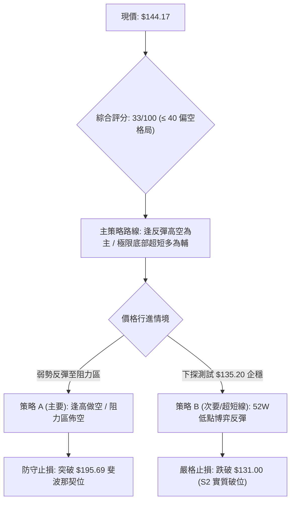

### 🧭 策略路由

**當前主策略方向 = 【逢反彈空頭主導，或於 S2 支撐上方嚴守區間操作】（依技術評分 33/100 評定）**
- 綜合評分 33/100 處於偏空區間（≤ 40），因此**主推順應中長期趨勢的空頭策略與逢高減碼策略**，多頭僅列為在 52W 極限支撐處的超短線左側博弈。

---

### 🎯 價格情境階梯（Price Scenarios）

| 觸發條件 | 下一目標 | 後續延伸 | 情境技術含義 |
|:---|:---:|:---:|:---|
| **向上突破 R1 $195.69** | R2 **$243.18** | R3 **$276.53** | 扭轉中期空頭結構，確認底部構築完成，展開均值回歸 |
| **維持於現價 $144.17 震盪** | 區間 **$137.95 - $165.07** | — | ADX<25 弱勢消化套牢籌碼，維持底部弱平衡 |
| **跌破 S1 $137.95 / S2 $135.20** | S3 **$119.19** | 歷史極值探底 | 擊穿年度極限支撐，觸發停損賣壓，展開新一輪主跌 |

---

### 📊 情境機率分佈

| 運行情境 | 發生機率 | 主要技術指標依據 |
|:---|:---:|:---|
| **情境一：弱勢反彈後受阻回落** | **55%** | MACD 負擴散 (-2.866)，-DI(27.02) 壓制，均線呈完全空頭排列 |
| **情境二：在 $135.20 - $149.50 窄幅築底** | **30%** | ADX=18.22 處於低動能區間，RSI(21.9) 深度超賣限制短期殺跌空間 |
| **情境三：直接放量擊穿 $135.20 展開崩跌** | **15%** | 籌碼持續流出（OBV < MA），基本面 TTM 淨利率 (-13.4%) 承壓 |

---

### 🟢 主策略詳情

#### 策略 A：順勢逢高做空策略（主推） vs 策略 B：52W 低點左側反彈策略（次選）

| 策略要素 | 策略 A（主推：反彈遇阻做空） | 策略 B（次選：極限支撐博弈反抽） |
|:---|:---:|:---:|
| **操作方向** | 🔴 放空 / 逢高獲利了結 | 🟢 短多 / 區間反彈操作 |
| **進場條件** | 反彈至阻力區受阻滯漲，出現長上影線 | 價格回測 S2 ($135.20) 出現縮量企穩訊號 |
| **進場價格** | **$185.00 - $192.81** (近 R1 區域) | **$136.00 - $138.00** (近 S1/S2 區域) |
| **目標價 T1** | **$144.17** (現價區域) | **$165.07** (2026-06 月線收盤阻力) |
| **目標價 T2** | **$135.20** (52W Low 支撐) | **$195.69** (Fib 78.6% 關鍵阻力 R1) |
| **止損價格** | **$198.50** (站穩 Fib 78.6% $195.69 上方) | **$131.00** (有效跌破 52W 低點 $135.20) |
| **風險報酬比** | **1 : 3.6** (風險 $5.69 / 潛在報酬 $20.69) | **1 : 4.8** (風險 $6.00 / 潛在報酬 $29.07) |
| **預估勝率** | **60%** | **40%** |
| **建議倉位** | **10% - 15%** | **5%** (嚴格輕倉) |

---

### 🔴 反向風險觸發點（對沖與風控提示）

1. **多頭止損/對沖觸發**：若日線收盤價**實質跌破 $135.20**，表明 52 週支撐全線失守，所有多頭部位必須無條件止損離場，不可加碼攤平。
2. **空頭平倉/翻多觸發**：若週線帶量（週成交量 > 10M）長陽突破並**站穩 $195.69（斐波那契 78.6%）**，宣告下降通道瓦解，空單應全數停損平倉。

---

### ⭐ 整體訊號強度評星

```
做多訊號強度：★★☆☆☆  (2.0/5星 - 僅存超賣修復機會)
做空訊號強度：★★★★☆  (4.0/5星 - 中長期趨勢全面受壓)
整體可信度：  ★★★★☆  (4.0/5星 - 價位緊扣幾何斐波那契與波段極值)
```

---

## 9. 風險提示與監控

### ✅ 關鍵監控指標 Checklist

```
╔══════════════════════════════════════════════════════════════╗
║                關鍵技術面監控清單 (Monitoring Checklist)     ║
╠══════════════════════════════════════════════════════════════╣
║ [ ] 52W 低點保衛戰：收盤價是否跌破 $135.20                  ║
║ [ ] 斐波那契壓力：反彈能否觸及並挑戰 $195.69                 ║
║ [ ] RSI 動能修復：週線 RSI 是否由 21.9 回升至 40 以上中性區 ║
║ [ ] MACD 柱狀圖：柱狀圖負值 (-2.866) 是否開始收斂向上        ║
║ [ ] ADX 趨勢增強：ADX 是否自 18.22 向上突破 25（爆發新趨勢） ║
║ [ ] 量能異動：單日成交量是否異常放大至 50日均量 (1.7M) 2倍以 ║
╚══════════════════════════════════════════════════════════════╝
```

### ⚠️ 風險場景分析

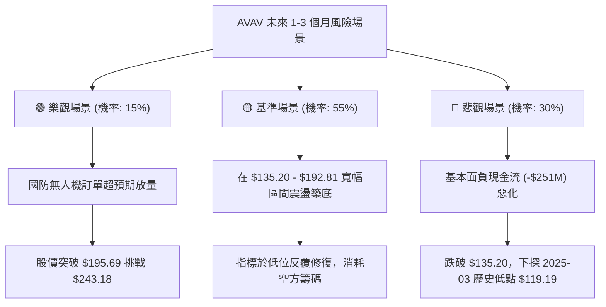

### 🛡️ 風險管理重要提醒

1. **財務負向現金流風險**：公司 TTM 自由現金流為 **-$251.39M**，淨利率為 **-13.4%**。在基本面虧損尚未顯著收斂前，估值修正可能壓制技術面反彈高度。
2. **高 Beta 波動防範**：Beta 高達 **1.412**，單日波動劇烈。任何進場交易必須嚴格設定固定百分比止損（單筆損失不超過總資金 1.5%），嚴禁使用高槓桿持有。
3. **空頭市場防守紀律**：當前所有中長期均線均呈空頭排列，切忌在無量反彈過程中進行左側盲目「抄底」，必須等待底部放量突破結構確認後再行跟進。

---

## 📋 報告總結

```
╔══════════════════════════════════════════════════════════════╗
║               AVAV 技術分析報告總結                          ║
╠══════════════════════════════════════════════════════════════╣
║ 報告日期：2026-09-03                                         ║
║ 當前價格：$144.17                                            ║
║ 綜合技術評分：33 / 100 評級：🔴 偏空整理 / 底部防守測試      ║
║                                                              ║
║ 關鍵技術結論：                                               ║
║ ├─ 長期趨勢：🔴 空頭主導（距歷史高點回撤 -65.5%）            ║
║ ├─ 中期趨勢：🔴 震盪下行（受阻於斐波那契 78.6% $195.69）     ║
║ ├─ 短期趨勢：🟡 弱勢盤整（ADX=18.22，測試 52W 低點 $135.20） ║
║ ├─ 關鍵支撐：S1: $137.95 ｜ S2 (52W Low): $135.20            ║
║ ├─ 關鍵阻力：R1 (Fib 78.6%): $195.69 ｜ R2 (Fib 61.8%): $243.18║
║ └─ 分析師目標價：均價 $225.77 (高 $326.00 / 低 $148.57)      ║
║                                                              ║
║ 最優策略組合建議：                                           ║
║ 1. 🥇 最佳機會（順勢）：等待反彈至 $185-$192 區間逢高做空，  ║
║    停損設於 $198.50，目標看回 $144 / $135。                  ║
║ 2. 🥈 次選機會（短線）：現價至 $136 區間輕倉博弈超跌反彈，   ║
║    嚴格以 $131.00 作為硬止損。                               ║
║ 3. 🥉 保守選擇（風控）：持幣觀望，等待股價確認收復 $195.69   ║
║    或於 $135.20 上方完成雙重底形態後再行介入。               ║
╚══════════════════════════════════════════════════════════════╝
```

---

> ⚠️ **免責聲明**：本報告為基於歷史量價數據之客觀技術分析，所有關鍵價位與指標解讀均嚴格引用自市場 OHLCV 歷史數據與斐波那契回調模型。本報告**僅供研究與學術參考**，**不構成任何形式的投資要約或買賣建議**。金融市場具有高度風險，投資人應獨立評估風險並自負盈虧。

---

*報告生成時間：2026-09-03 ｜ 數據來源：Yahoo Finance ｜ 分析框架：多時框技術分析模型*