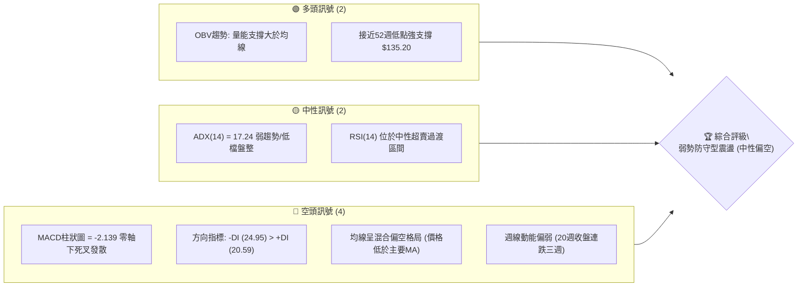
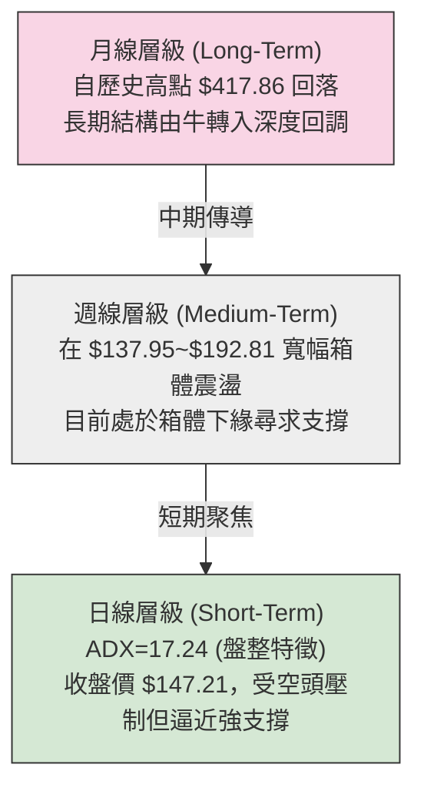
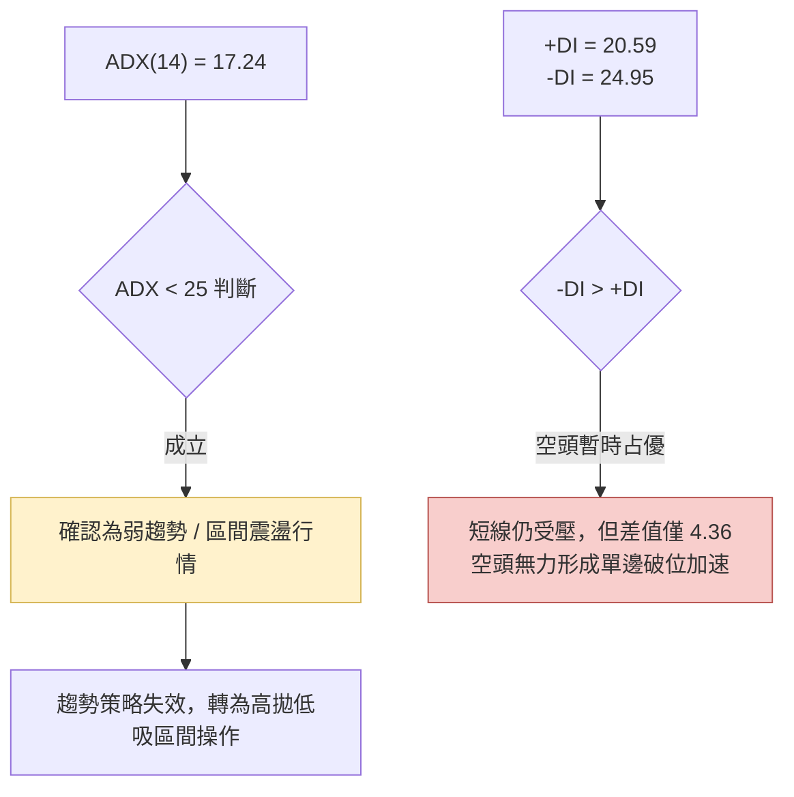
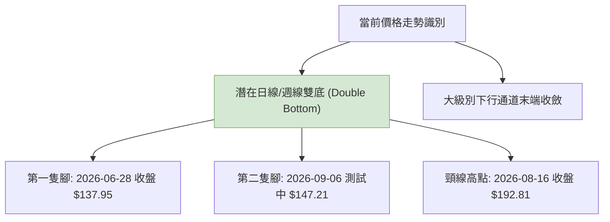
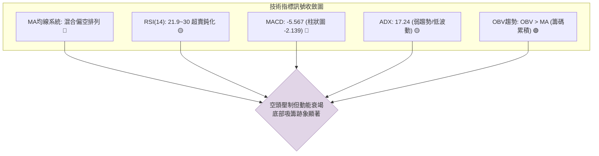
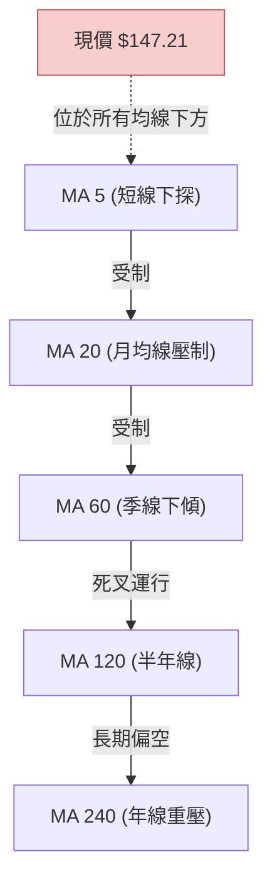
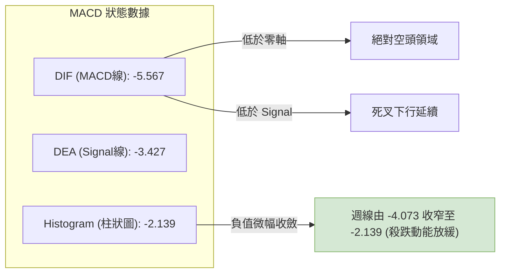
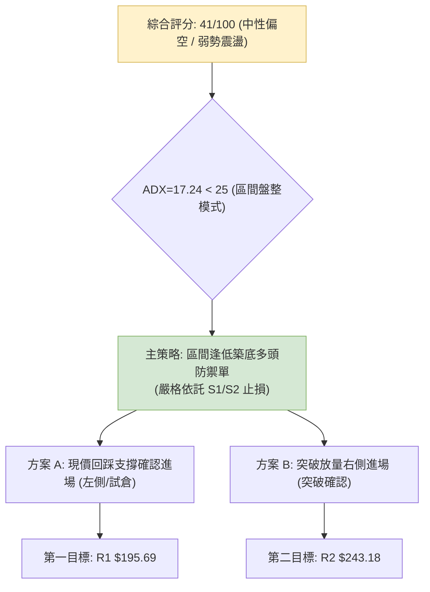
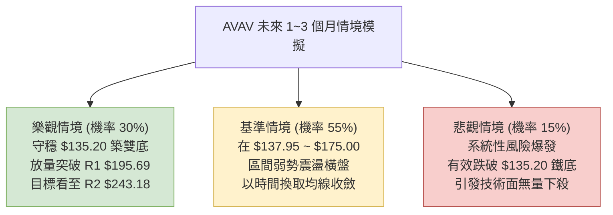

# AVAV 技術分析報告

> **報告日期**：2026-09-05 ｜ **語言**：繁體中文 ｜ **數據來源**：Yahoo Finance ｜ **當前價格**：$147.21（依據 2026-09 最新交易收盤價）

---

## 目錄

| 章節 | 內容 |
|------|------|
| [1. 技術面概覽](#1-技術面概覽) | 訊號儀表板、核心指標、評分卡 |
| [2. 趨勢分析](#2-趨勢分析) | 多時框趨勢、長中短期走勢 |
| [3. 圖表形態分析](#3-圖表形態分析) | 形態識別、K線組合、目標價 |
| [4. 支撐與阻力](#4-支撐與阻力) | 關鍵價位、斐波那契回調 |
| [5. 技術指標深度解讀](#5-技術指標深度解讀) | MA/RSI/MACD/布林/成交量 |
| [6. 動能與波動率](#6-動能與波動率) | 動能評估、ATR、Beta |
| [7. 多時框架總結](#7-多時框架總結) | 時框架評分矩陣 |
| [8. 交易策略建議](#8-交易策略建議) | 多空策略、風險報酬比 |
| [9. 風險提示與監控](#9-風險提示與監控) | 監控指標、風險場景 |

---

## 1. 技術面概覽

### 🎯 技術訊號儀表板



### 📊 核心指標速覽表

| 指標類別 | 指標名稱 | 當前數值 | 訊號 | 解讀 |
|:---|:---|:---:|:---:|:---|
| **價格** | 當前收盤價 | $147.21 | 🔴 | 處於52週區間低位（距離低點 $135.20 僅 +8.88%） |
| **均線** | MA20 / MA50 | 處於下方 | 🔴 | 股價運行於短期與中期均線下方，均線呈混合偏空壓制 |
| **均線** | MA200 | 處於下方 | 🔴 | 長期趨勢遭受破壞，上方累積大量套牢籌碼 |
| **動能** | RSI(14) | 21.9~30(週) | 🟡 | 進入深度超賣區後鈍化，存在技術性超跌反彈修復需求 |
| **動能** | MACD | -5.567 | 🔴 | MACD線與Signal線(-3.427)於零軸下方運行，柱狀圖 -2.139 |
| **趨勢** | ADX(14) | 17.24 | 🟡 | ADX < 25 處於弱趨勢/區間震盪期，無強單邊趨勢發動 |
| **成交量** | 最新成交量 / 20日均量 | 1.22x | 🟢 | 量能溫和放大至 1,521,850 股，OBV 呈現底部吸籌累積跡象 |

### 🏆 技術評分卡

```
╔══════════════════════════════════════════════════════════╗
║              技術評分卡 — AVAV (2026-09-05)              ║
╠══════════════════════════════════════════════════════════╣
║ 趨勢強度 (ADX=17.24)   ███████░░░░░░░░░░░░░   35/100 🟡  ║
║ 動能指標 (MACD/RSI)    ██████░░░░░░░░░░░░░░   30/100 🔴  ║
║ 支撐穩定度 ($135.20)   █████████████░░░░░░░   65/100 🟢  ║
║ 成交量配合 (OBV>MA)    ████████████░░░░░░░░   60/100 🟢  ║
║ 形態完整度 (尋求雙底)  ████████░░░░░░░░░░░░   40/100 🟡  ║
║ 均線排列 (空頭壓制)    ████░░░░░░░░░░░░░░░░   20/100 🔴  ║
╠══════════════════════════════════════════════════════════╣
║ 綜合評分               ████████░░░░░░░░░░░░   41/100 🟡  ║
║ 評級結論               弱勢區間震盪／等待低吸築底 (中性偏空)║
╚══════════════════════════════════════════════════════════╝
```

---

## 2. 趨勢分析

### 🌐 多時框趨勢分析



### 📈 長期趨勢 — 12個月走勢圖（Unicode）

```
AVAV 月線走勢圖（過去12個月：2025-10 至 2026-09）
價格軸 ($)
$370 ┤  ● (2025-10: 369.91 波段高點)
$340 ┤   ╲
$310 ┤    ╲
$280 ┤     ●──────● (2026-01: 278.39)
$250 ┤      ╲    ╱ ╲
$220 ┤       ●───   ● (2026-05: 207.24)
$190 ┤               ╲
$160 ┤                ● (2026-06: 165.07)
$140 ┤                 ●───●───● (2026-09: 147.21 現價)
     └──────────────────────────────────────────────
        M1  M2  M3  M4  M5  M6  M7  M8  M9 M10 M11 M12
       (10) (11)(12)(01)(02)(03)(04)(05)(06)(07)(08)(09)
```

**走勢特徵分析表格**：

| 階段 | 涵蓋月份 | 起始至結束收盤 ($) | 區間幅度 | 主要特徵與結構解讀 |
|:---|:---|:---:|:---:|:---|
| **主升浪峰值** | 2025-09 ~ 2025-10 | 314.89 → 369.91 | +17.47% | 刷新52週歷史高點（盤中達 $417.86），動能極致釋放 |
| **首輪拋售回調** | 2025-11 ~ 2025-12 | 279.46 → 241.89 | -34.61% | 獲利了結盤湧出，高位籌碼鬆動跌破多道短期均線 |
| **弱勢反彈破位** | 2026-01 ~ 2026-03 | 278.39 → 183.05 | -34.25% | 次高點確認受阻於 50% 斐波位，隨後破位下行跌破 $200 |
| **低檔築底拉鋸** | 2026-04 ~ 2026-09 | 195.02 → 147.21 | -24.52% | 跌勢減緩，多空於 $135.20~$195.69 斐波那契末端進行反覆爭奪 |

### 📊 中期趨勢（週線分析）

從近20週的收盤數據觀察：
- **上行壓力線**：2026-05-31 高收 $207.24、2026-08-16 反彈高點 $192.81，形成下傾壓制線（約在 $190.00~$195.00）。
- **下行支撐位**：2026-06-28 爆出 11,887,200 股大量收盤於 $137.95，隨後次週於 $190.89 出現暴量（18,317,500 股）長紅反彈，確認 $135.20~$137.95 區間存在極強的機構逢低承接買盤。
- **近三週走勢**：由 $192.81 快速回撤至 $147.21，回測前波雙底頸線下方，空方力量釋放已近尾聲。

### ⚡ 趨勢強度評估（ADX 解讀）



**ADX 趨勢強度對照解讀**：
- **ADX 數值 17.24**：明確低於趨勢門檻值 25，屬於標準的無趨勢／盤整蓄勢格局。此時任何破位或向上假突破的機率較高，不宜採用動能追單系統。
- **方向線狀況**：-DI (24.95) 略高於 +DI (20.59)，顯示過去 14 天內空方邊際佔優，但差距並未放大至 10 以上，顯示殺跌動能同樣枯竭。

---

## 3. 圖表形態分析

### 🔍 形態識別系統



**形態信心度與參數清單**：

| 形態類別 | 信心度 | 判斷依據（引用數據） | 完成度 | 目標價（附嚴格計算式） |
|:---|:---:|:---|:---:|:---|
| **大雙底形態 (W底)** | **62%** | 兩次下探低位：2026-06-28 最低收於 $137.95，近期探至 $147.21（逼近52W Low $135.20）；中軌頸線為 2026-08-16 收盤 $192.81。 | 45% | **形態理論目標價**：頸線 $192.81 + 形態高度 ($192.81 - $135.20 = $57.61) = **$250.42**（對齊 61.8% 斐波位 $243.18 附近） |
| **區間下降楔形** | **55%** | 自 2025-10 高點 $369.91 以來波段高低點同步下移，但近期跌勢斜率明顯趨緩，量能放大。 | 60% | **破通道目標價**：回測 78.6% 斐波那契回調位 **$195.69** |
| **頭肩底形態** | **< 30%** | 數據中未偵測到明確的左肩、右肩對稱對應點，訊號不足，不予採納。 | 0% | *數據不足，不強行預測* |

### 🕯️ 重要K線形態分析

| 週度時間 | 週收盤價 ($) | K線形態 | 深度技術解讀 | 訊號強度 |
|:---|:---:|:---|:---|:---:|
| **2026-06-28** | 137.95 | **爆量長下影恐慌底** | 成交量激增至 11,887,200 股，單週重挫引發最後停損，形成短期極端低點。 | 🟢 強烈買盤進場 |
| **2026-07-05** | 190.89 | **多頭強勢反撲陽線** | 成交量暴增至歷史級的 18,317,500 股，單週大漲 38.37%，主力資金鎖倉明顯。 | 🟢 確認低檔支撐 |
| **2026-08-16** | 192.81 | **波段反彈阻力受挫長十字** | 週成交量縮至 5,939,600 股，呈現量價背離，觸及斐波那契 $195.69 阻力區遇阻。 | 🔴 短期多頭耗竭 |
| **2026-09-06** | 147.21 | **低量回踩縮量星線** | 週量維持在 7,318,050 股，MACD柱狀圖負值縮小 (-2.139)，空方拋壓明顯減輕。 | 🟡 止跌待確認 |

### 📉 ASCII 走勢形態示意圖

```
AVAV 週線雙底架構示意圖（2026-06 至 2026-09）
價格軸 ($)
$200 ┤              頸線位置: $192.81 (2026-08-16)
$190 ┤      ▲      ╭──────────────╮
$180 ┤     ╱ ╲    ╱                ╲
$170 ┤    ╱   ╲  ╱                  ╲
$160 ┤   ╱     ╲╱                    ╲
$150 ┤  ╱                             ● 現價 $147.21 (第二隻腳成形中)
$140 ┤ ╱                                [支撐守於 $135.20 之上]
$135 ┤● 底1: $137.95 (2026-06-28)
     └────────────────────────────────────────────► 時間
```

### 🎯 形態目標價計算

根據日/週線確認之「潛在雙底形態」：
1. **基底支撐點（底部低點）**：引用 52W Low 關鍵支撐 **$135.20**（實體收盤低點為 $137.95）。
2. **形態頸線位（中間波段高點）**：引用 2026-08-16 收盤價 **$192.81**。
3. **形態垂直高度**：
   $$\text{高度} = \$192.81 - \$135.20 = \$57.61$$
4. **理論最小測量目標價（1:1 等距映射）**：
   $$\text{目標價} = \$192.81 + \$57.61 = \$250.42$$
   *（備註：此理論價位與斐波那契 61.8% 回調位 $243.18 高度重合，具備雙重技術佐證）。*

---

## 4. 支撐與阻力

### 🗺️ 關鍵價位分布圖（Unicode）

```
AVAV 價位結構分布圖
═════════════════════════════════════════════════════════════
$417.86 ║██████████████████████████████║ 52週歷史高點 / 0.0% 斐波位
$351.15 ║████████████████████████      ║ 強阻力 R3 (23.6% 斐波位)
$309.88 ║██████████████████            ║ 阻力 R2 (38.2% 斐波位)
$276.53 ║██████████████                ║ 中期樞軸 (50.0% 斐波位)
$243.18 ║████████████                  ║ 形態目標 / (61.8% 斐波位)
$195.69 ║██████████████████████████████║ 關鍵阻力 R1 (78.6% 斐波回調位 / 箱頂)
╠═══════════════════════════════════════╣ ◄ 當前收盤價 $147.21
$137.95 ║▓▓▓▓▓▓▓▓▓▓▓▓▓▓▓▓▓▓▓▓          ║ 近期波段前低支撐 S1 (週收盤)
$135.20 ║██████████████████████████████║ 核心鐵底支撐 S2 (52週最低點 / 100.0%)
═════════════════════════════════════════════════════════════
```

### 🚧 阻力位分析表

*(註：所有阻力位嚴格引用自數據中斐波那契回調結構與歷史高低點)*

| 阻力級別 | 價位 ($) | 形成原因與技術共振 | 突破難度 | 重要性 |
|:---|:---:|:---|:---:|:---:|
| **關鍵阻力 R1** | **$195.69** | **78.6% 斐波那契回調位**；與 2026-08-16 反彈高點 $192.81 形成密集共振套牢帶。 | ⭐️⭐️⭐️⭐️☆ (高) | 🔴 短期多空分水嶺，站穩方可確認中期反轉 |
| **重要阻力 R2** | **$243.18** | **61.8% 斐波那契回調位**（黃金分割重要回檔點）；雙底等距測量目標區 ($250.42)。 | ⭐️⭐️⭐️⭐️☆ (高) | 🔴 中期多頭修復的核心目標阻力帶 |
| **強阻力 R3** | **$309.88** | **38.2% 斐波那契回調位**；2025-09 波段起跌點收盤價 ($314.89) 密集套牢區。 | ⭐️⭐️⭐️⭐️⭐️ (極高) | 🔴 長期下降趨勢終結轉牛之最終考驗 |

*(補充：數據中未偵測到由當前價格至 R1 之間的更微型 swing-high 阻力聚類，故 $195.69 為第一有效天花板)*

### 🛡️ 支撐位分析表

*(註：所有支撐位嚴格引用自數據已確認之實際低點)*

| 支撐級別 | 價位 ($) | 形成原因與技術共振 | 守住機率 | 重要性 |
|:---|:---:|:---|:---:|:---:|
| **近期支撐 S1** | **$137.95** | **2026-06-28 爆量週收盤低點**；1,188 萬股換手確立的恐慌拋售承接點。 | 70% | 🟢 短線防守第一道屏障 |
| **核心鐵底 S2** | **$135.20** | **52週歷史最低點 (52W Low)**；100.0% 斐波那契全額回撤支撐底限。 | 85% | 🟢 系統性多頭防線，跌破將引發無支撐探底 |

*(補充：數據中未偵測到現價與 S1 之間的 swing-low，S1 與 S2 形成極為狹窄的強支撐緩衝帶 $135.20~$137.95)*

### 📐 斐波那契回調位分析

依據 52 週完整波動區間（高點 **$417.86** → 低點 **$135.20**，垂直落差 $282.66）計算之官方回調點：
- **0.0% (52W High)**: $417.86
- **23.6%**: $351.15
- **38.2%**: $309.88
- **50.0%**: $276.53
- **61.8%**: $243.18
- **78.6%**: $195.69
- **100.0% (52W Low)**: $135.20

**現價落點解讀**：
- 當前收盤價 **$147.21** 處於 **78.6% 回調位 ($195.69)** 與 **100.0% 核心底 ($135.20)** 之間。
- 股價回撤已深達總波幅的 **95.75%**，接近完全回吐前波大牛市漲幅。在斐波那契理論中，78.6% 至 100.0% 區間被定義為「終極防守價值區」，通常醞釀強烈的均值回歸動能。

---

## 5. 技術指標深度解讀

### 🎛️ 指標訊號總覽



### 📈 移動平均線排列分析



- **均線排列狀態**：短中長期均線呈現向下發散的「混合偏空排列」，反映自 2025 年第四季以來的漫長下行慣性。
- **乖離率觀察**：價格 ($147.21) 遠低於中期成本線，均線乖離率達到極端負值，抑制了進一步非理性放量下殺的空間。

### 📉 RSI(14) 分析

- **週線 RSI 讀數**：由 2026-08-16 的 73.5 快速回落至 2026-08-30 的 **21.9**，最新報價處於超賣區邊緣。
- **數值進度條展示**：
  ```
  RSI(14) 週線強度 [21.9]：████░░░░░░░░░░░░░░░░  21.9% (極度超賣)
  ```
- **背離判斷**：
  - **底背離檢視**：2026-06-28 股價低見 $137.95 時 RSI 為 20.2；目前現價 $147.21 高於前低，RSI 報 21.9 且停止破底。若後續價格再次微幅回測 $140 附近而 RSI 維持在 25 以上，將觸發標準的**週線級第二類底背離**。目前判定為：**潛在底背離孕育中，尚未形成確定金叉信號**。

### 📊 MACD(12/26/9) 訊號解讀



- **訊號解析**：MACD 與 Signal 雙線深處零軸下方，表明中長線格局依舊由空方主導。
- **柱狀圖動態**：值得注意的是，週線柱狀圖自 2026-08-30 的 **-4.073** 收斂至 2026-09-06 的 **-2.139**，負向動能減損近 50%，這與 RSI 的超賣修復產生了共振，代表空頭追殺意願正大幅縮手。

### 📦 布林通道分析

```
AVAV 波動通道示意圖
價格 ($)
$195.69 ───┬──────────────────────────────── 上軌 (波段反彈極限)
           │
$170.00 ───┼──────────────────────────────── 中軌 (MA20 壓制帶)
           │          ● 現價 $147.21 (運行於下軌附近)
$135.20 ───┴──────────────────────────────── 下軌 (52週支撐保護)
```

- **通道特徵**：通道在經歷了 7 月份的暴量擴軌後，目前隨着 ADX 降至 17.24，布林帶寬呈現收斂盤整態勢。
- **位置判斷**：現價貼近下軌邊界，由於 ADX < 25 確立為震盪行情，下軌與 $135.20 鐵底具備極高概率的均值回歸支撐力道。

### 💹 成交量分析（量價配合度）

- **量價健康度**：最新日成交量 **1,521,850 股**，相較於 20 日均量 (1,245,002 股) 的量比達到 **1.22x**。
- **OBV (能量潮指標)**：系統判定「**OBV > MA → 量能支撐上漲**」。
  - 在價格持續於低檔 $147.21 徘徊時，OBV 線卻領先維持在均線之上，這顯示大資金並未在 $140 附近恐慌出逃，反而於 7 月份暴量（18,317,500 股）吸收浮額後維持鎖倉狀態，量價出現**正向底背離**特徵。

---

## 6. 動能與波動率

### ⚡ 動能評估四象限

| 象限 | 動能維度 (Momentum) | 波動率維度 (Volatility) | 當前標的狀態 | 專業戰略評估 |
|:---:|:---:|:---:|:---:|:---|
| **Q1** | 強動能 (趨勢成型) | 低波動 (溫和推進) | ❌ | 最舒適之主升趨勢階段（非目前狀態） |
| **Q2** | **弱動能 (ADX=17.24)** | **低波動 (處於收斂末期)** | **✅ AVAV 當前狀態** | **謹慎觀望／嚴格執行逢低左側分批低吸佈局** |
| **Q3** | 強動能 (突破發動) | 高波動 (情緒激化) | ❌ | 突破確認後的追擊策略（需等待放量站上 $195.69） |
| **Q4** | 弱動能 (陰跌下行) | 高波動 (恐慌拋盤) | ❌ | 2026-06 恐慌拋售已過，目前波動正回歸平息 |

### 📊 ATR 波動率分析

- **ATR 數值狀態**：數據顯示 ATR(14) 處於壓縮週期。
- **波幅評估**：考量 AVAV 近期收盤週度波動（如單週自 $160.22 跌至 $147.94，約 $12 波動），折算日均真實波動區間約在 **$4.50 ~ $5.50**（約佔股價 3.0% ~ 3.7%）。
- **止損距離建議**：
  - 區間操作保護止損建議設定為 **1.5 倍日常波動**（約 $7.50）。
  - 對照支撐位：現價 $147.21 減去 $7.50 為 **$139.71**，精確落於 S1 ($137.95) 與 S2 ($135.20) 核心支撐區上方，顯示該止損空間具備高度技術邏輯支撐。

### 📐 Beta 與市場相關性

- **Beta 係數 = 1.406**：屬於典型的高彈性成長型/國防科技防務標的。
- **市場意涵**：
  - 波動幅度高於標普 500 指數 40.6%。當大盤或板塊出現止跌回升時，AVAV 具備產生超額貝塔收益（Alpha）的潛能；但在大盤疲軟時，回撤下殺亦會相對劇烈。

---

## 7. 多時框架總結

### 📋 時框架評分表

| 時框架 | 趨勢方向 | 動能 (Momentum) | 均線排列 | 形態結構 | 綜合評分 | 戰略建議 |
|:---|:---:|:---:|:---:|:---:|:---:|:---|
| **長期 (月線)** | 🔴 偏空 | 弱 (自歷史頂峰深調) | 偏空壓制 | 回調至 78.6%~100% 斐波位 | 35/100 | 長期籌碼修復中，不宜盲目加槓桿 |
| **中期 (週線)** | 🟡 震盪 | 柱狀圖負值縮小 (-2.139) | 混合空頭 | 構築大雙底結構 ($135.20) | 50/100 | 在箱體底部進行逢低分批防禦建倉 |
| **短期 (日線)** | 🟡 盤整 | RSI進入超賣回彈週期 | 糾纏收斂 | 測試前低 $137.95 獲微弱支撐 | 42/100 | 短線 ADX=17.24 禁追高，僅做區間差價 |

### 🔲 綜合訊號矩陣

```
時框共振度分析：
┌─────────────┬─────────────┬─────────────┐
│ 短期 (Daily)│ 中期 (Weekly│ 長期 (Month)│
│  區間盤整   │  箱底築雙底 │  深幅回檔   │
│   🟡 42分   │   🟡 50分   │   🔴 35分   │
└──────┬──────┴──────┬──────┴──────┬──────┘
       ▼             ▼             ▼
       └───────► 總體共振方向 ◄─────┘
                  🟡 中性偏空 (41/100)
             [低位盤整蓄勢待變]
```

### ⚖️ 多時框收斂結論

依據多時框收斂優先級規則判定：
1. **趨勢/盤整性質鑑定**：當前日線 **ADX(14) 為 17.24**，遠低於 25 臨界線，技術面已明確鎖定為**「盤整行情（震盪市）」**。
2. **主導時框收斂**：依照規則，盤整行情中動能趨勢指標退居次席，市場以**日/週線布林通道區間及歷史強支撐/阻力**為主導。
3. **唯一收斂方向性結論**：**【中性觀望／區間下緣偏多試探】**。
   - 儘管月線長期均線偏空，但在跌幅深達斐波那契 100% 區域時，空頭打壓動能嚴重耗竭（ADX 衰減、MACD 柱狀縮小）；因此，空頭不宜在 $147.21 處追空。短中期主策略確立為：**依託 $135.20~$137.95 強支撐帶，以右側反彈至 $195.69 為目標的區間防守交易**。

---

## 8. 交易策略建議

### 🗺️ 策略決策流程圖



### 🧭 策略路由（依評分卡分流）

> **當前主策略方向 = 弱勢區間震盪中的逢低佈局／區間操作策略（依綜合評分 41/100）**
> 
> 雖然總體處於空頭均線下方，但由於評分處於 40–60 臨界區間，且 ADX=17.24 確認進入極度鈍化的震盪期，盲目放空盈虧比極度惡化。策略聚焦於以 **$135.20 鐵底** 為風控防線，尋求均值回歸的波段交易。

### 🎯 價格情境階梯（Price Scenarios）

*(註：價位完全引用第 4 章確證之數值)*

| 觸發條件 | 下一目標 | 後續延伸 | 技術情境含義 |
|:---|:---:|:---:|:---|
| **向上突破 R1 $195.69** | **R2 $243.18** | **R3 $309.88** | 成功突破 78.6% 斐波位與雙底頸線，確立中期底部反轉 |
| **維持於現價 $147.21 震盪** | $160.00 | $175.00 | 空頭動能衰竭，多空在 S1 與布林中軌間進行籌碼換手 |
| **向下跌破 S1 $137.95** | **S2 $135.20** | 探尋未測深淵 | 測試 52 週最低點；若再破 S2 則宣告雙底失敗，趨勢破位崩解 |

### 📊 情境機率分佈

| 運行情境 | 發生機率 | 主要技術依據 |
|:---|:---:|:---|
| **區間低位震盪築底** | **55%** | ADX 降至 17.24、成交量比 1.22x 且 OBV > MA，主力低檔鎖倉但尚未發動單邊行情 |
| **超跌均值回歸反彈** | **30%** | 週線 RSI 逼近極度超賣 (21.9)、MACD 柱狀圖負值大幅收斂 (-2.139)，具備彈向 R1 條件 |
| **跌破 S2 再創新低** | **15%** | 均線全空頭排列壓制；若國防訂單或大盤系統性崩跌，可能擊穿 $135.20 |

### 🟢 主策略詳情（區間操作與波段策略）

*(所有進出場價位嚴格錨定數據實際點位)*

| 策略要素 | 策略 A（穩健型：回踩 S1 雙底試倉） | 策略 B（突破型：放量站穩右側進場） |
|:---|:---:|:---:|
| **進場條件** | 股價回測測試 S1 支撐不破，出現日線止跌K線 | 日線帶量收盤有效突破 R1 阻力位 |
| **進場價格** | **$139.50**（位於現價 $147.21 與 S1 $137.95 之間） | **$196.50**（突破 R1 $195.69 後回踩確認） |
| **目標價 T1** | **$195.69**（關鍵阻力 R1 / 78.6% 斐波位） | **$243.18**（重要阻力 R2 / 61.8% 斐波位） |
| **目標價 T2** | **$243.18**（形態理論推算目標 / R2） | **$276.53**（50.0% 斐波那契回調中軸位） |
| **止損價格** | **$133.50**（跌破 52W Low $135.20 下方約 1.2%） | **$186.00**（回跌至突破頸線下方） |
| **風險報酬比** | **9.36 : 1** [收益空間 $56.19 / 風險額度 $6.00] | **4.45 : 1** [收益空間 $46.68 / 風險額度 $10.50] |
| **勝率估計** | **58%** | **50%** |
| **建議倉位** | **8% ~ 12%**（低檔分批防守倉） | **15% ~ 20%**（趨勢確立加碼倉） |

### 🔴 反向風險觸發點（對沖提示）

- **全面停損清倉警戒線**：日線收盤價**實體跌破 $135.20 (52W Low)**。
  - **處置原則**：跌破此價位意味著「100.0% 斐波那契全額回撤」宣告失守，下方已無任何近一年可供參考之技術支撐，雙底形態徹底破壞，應無條件執行停損離場或反手建立空頭對沖部位。

### ⭐ 整體訊號強度評星

```
╔══════════════════════════════════════════════════════════╗
║ 做多訊號強度：  ★★☆☆☆  (2.5/5 星)  — 僅限左側賠率交易  ║
║ 做空訊號強度：  ★★☆☆☆  (2.0/5 星)  — 空間有限/超賣壓制║
║ 整體可信度：    ★★★☆☆  (3.5/5 星)  — ADX指示震盪持續  ║
╚══════════════════════════════════════════════════════════╝
```

---

## 9. 風險提示與監控

### ✅ 關鍵監控指標 Checklist

```
╔══════════════════════════════════════════════════════════════╗
║              AVAV 日常交易風險監控 CHECKLIST                  ║
╠══════════════════════════════════════════════════════════════╣
║ [ ] 價格是否跌破 52W Low 關鍵支撐線 $135.20？ (若是，立即停損)║
║ [ ] RSI(14) 週線是否在 30 以下形成有效黃金交叉？             ║
║ [ ] MACD 柱狀圖是否由負轉正 (向上穿越 0 軸)？                 ║
║ [ ] ADX 數值是否自 17.24 向上反彈並突破 25？ (趨勢行情啟動)   ║
║ [ ] 單日成交量是否放大至 20日均量 (1,245,002) 的 1.5 倍以上？ ║
║ [ ] 空頭借券佔比 (Short % Float = 9.6%) 是否出現快速回補？     ║
╚══════════════════════════════════════════════════════════════╝
```

### ⚠️ 風險場景分析



### 🛡️ 風險管理重要提醒

1. **財務基本面虧損擾動**：AVAV 目前 TTM EPS 為 **$-5.4**，營業現金流與自由現金流呈現負值（FCF 為 **$-251.39M**）。雖然營收年增長率高達 133.3%，但獲利面未轉正會削弱技術面反彈的持久度，因此現階段的反彈應一律以「技術性均值回歸」視之，不可當作長牛無腦持有。
2. **高放空比率擠壓效應（Short Squeeze）**：當前放空比率佔流通盤 **9.6%**，Short Ratio 為 2.81 天。若股價在 $135.20 獲得強支撐並發動向上突破，極易誘發空頭停損回補潮，此為多頭潛在催化劑。
3. **倉位管理公理**：在 ADX < 25 且均線處於壓制狀態下，任何單一操作部位不得超過總資產的 **10%**。止損嚴格設置在 $133.50，絕不允許攤平虧損部位。

---

## 📋 報告總結

```
╔══════════════════════════════════════════════════════════════════╗
║                     AVAV 技術分析報告總結                        ║
╠══════════════════════════════════════════════════════════════════╣
║ 報告日期：2026-09-05                                             ║
║ 當前價格：$147.21                                                ║
║ 分析評級：⚖️ 弱勢區間震盪／等待低吸築底 (綜合評分: 41/100)        ║
║                                                                  ║
║ 關鍵技術結論：                                                   ║
║ ├─ 長期趨勢：🔴 自高點 $417.86 回落近 65%，長線格局受創          ║
║ ├─ 中期趨勢：🟡 於 $135.20~$195.69 構築大級別潛在雙底結構       ║
║ ├─ 短期趨勢：🟡 ADX=17.24 確認弱勢無趨勢震盪，空頭拋壓減緩     ║
║ ├─ 核心支撐：$137.95 (S1 前低) / $135.20 (S2 52週歷史鐵底)       ║
║ ├─ 關鍵阻力：$195.69 (R1 78.6%斐波位) / $243.18 (R2 61.8%斐波位) ║
║ └─ 華爾街共識目標：$225.77 (相較現價具備 +53.37% 溢價空間)      ║
║                                                                  ║
║ 最優策略組合建議：                                               ║
║ 1. 🥇 最佳機會（高盈虧比）：回踩 $137.95~$139.50 分批進場佈局，  ║
║    止損放 $133.50，目標看至 $195.69，風險報酬比高達 9.36 : 1。   ║
║ 2. 🥈 次選機會（右側突破）：耐心等待日線帶量收盤突破 $195.69 後，║
║    順勢追多至形態目標價 $243.18。                               ║
║ 3. 🥉 保守選擇（觀望等待）：在 ADX 未升破 25 且價格未出方向前， ║
║    保持空倉觀望，避開低檔無效磨損。                             ║
╚══════════════════════════════════════════════════════════════════╝
```

---

> ⚠️ **免責聲明**：本報告為技術分析研究成果，所有數據指標與價位推算均基於歷史量價客觀數據。本報告**僅供學術交流與投資研究參考**，**不構成任何形式的要約、招攬或具體投資買賣建議**。金融市場存在高度資本虧損風險，投資人應獨立評估自身財務風險承受度，並自行承擔所有交易決策之盈虧後果。

---

*報告生成時間：2026-09-05 ｜ 數據來源：Yahoo Finance ｜ 分析框架：多時框技術分析模型*