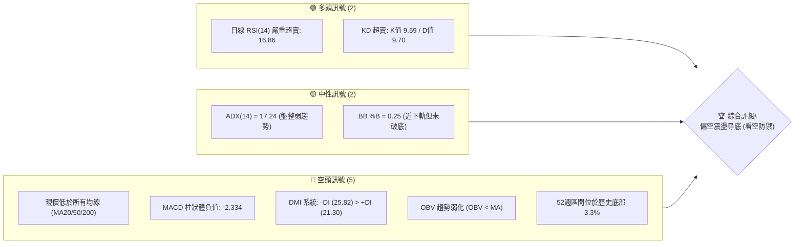
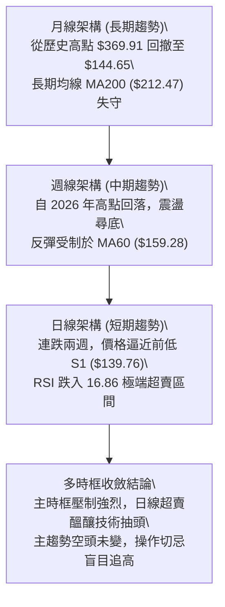
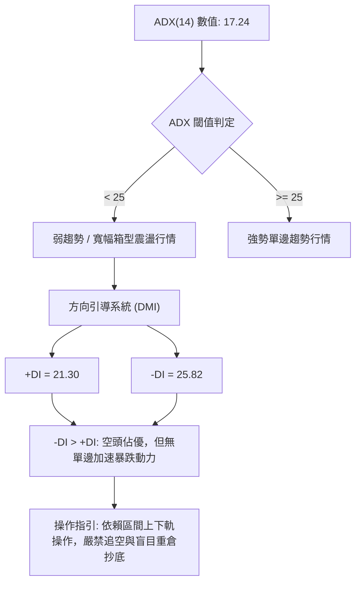
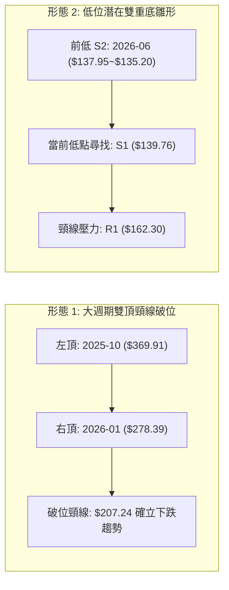
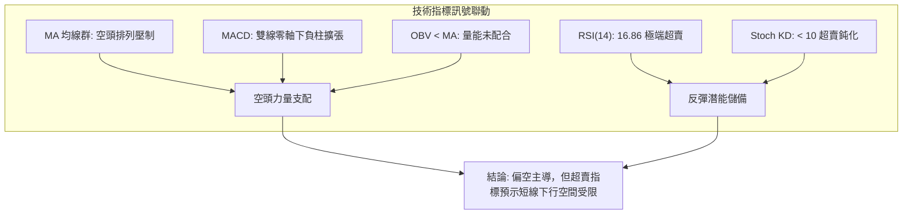
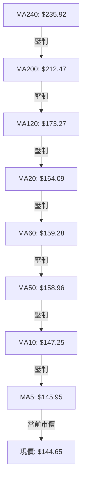
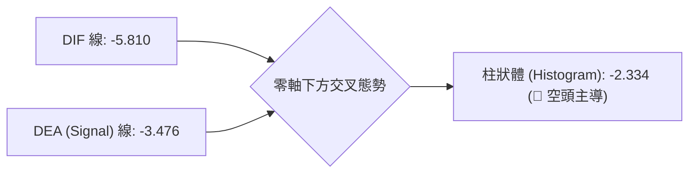
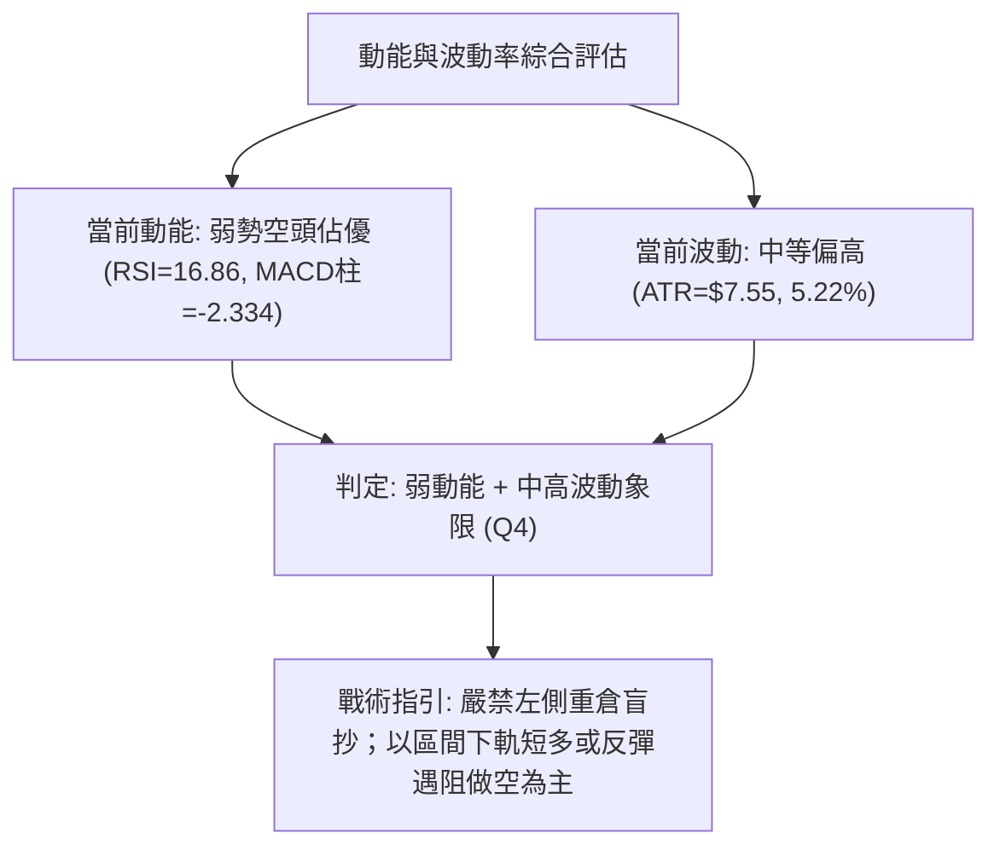
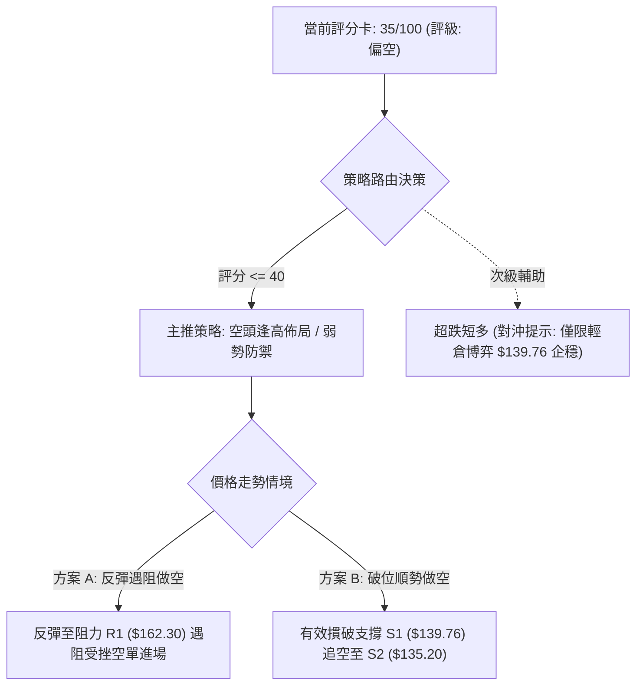
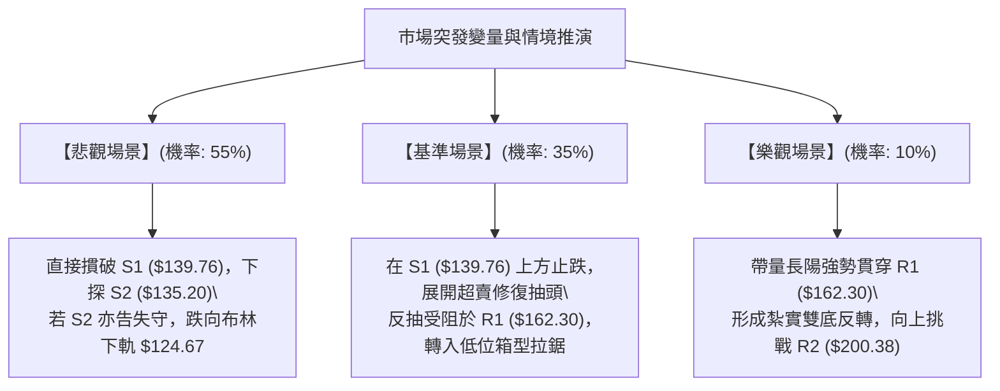

# AVAV 技術分析報告

> **報告日期**：2026-09-06 ｜ **語言**：繁體中文 ｜ **數據來源**：Yahoo Finance ｜ **當前價格**：$144.65

---

## 目錄

| 章節 | 內容 |
|------|------|
| [1. 技術面概覽](#1-技術面概覽) | 訊號儀表板、核心指標、評分卡 |
| [2. 趨勢分析](#2-趨勢分析) | 多時框趨勢、長中短期走勢、ADX解讀 |
| [3. 圖表形態分析](#3-圖表形態分析) | 形態識別、信心度、K線組合、目標價 |
| [4. 支撐與阻力](#4-支撐與阻力) | 關鍵價位結構、斐波那契回調區間 |
| [5. 技術指標深度解讀](#5-技術指標深度解讀) | MA/RSI/MACD/布林/成交量與OBV |
| [6. 動能與波動率](#6-動能與波動率) | 動能評估四象限、ATR、Beta係數 |
| [7. 多時框架總結](#7-多時框架總結) | 時框架評分矩陣、多時框收斂結論 |
| [8. 交易策略建議](#8-交易策略建議) | 策略路由、主策略詳情、風控對沖 |
| [9. 風險提示與監控](#9-風險提示與監控) | 關鍵指標Checklist、情境路徑分析 |
| [📋 報告總結](#-報告總結) | 終局結論與策略指引 |

---

## 1. 技術面概覽

### 🎯 技術訊號儀表板



### 📊 核心指標速覽表

| 指標類別 | 指標名稱 | 當前數值 | 訊號 | 解讀 |
|----------|----------|----------|------|------|
| **價格** | 當前收盤價 | $144.65 | 🔴 | 位於 52 週低點區間 3.3%，價格極度承壓 |
| **均線** | 短期 MA20 | $164.09 | 🔴 | 價格低於 MA20 達 -11.85%，空頭短線壓制 |
| **均線** | 中期 MA50 | $158.96 | 🔴 | 價格低於 MA50 達 -9.00%，中期空方控盤 |
| **均線** | 長期 MA200 | $212.47 | 🔴 | 價格低於 MA200 達 -31.92%，長期結構破壞 |
| **動能** | RSI(14) | 16.86 | 🟢 | 極度超賣（<20），短線存在技術性超跌反彈需求 |
| **動能** | MACD (12,26,9) | -5.810 / -3.476 | 🔴 | DIF 位於訊號線下方，柱狀體為 -2.334，偏空 |
| **動能** | Stoch %K / %D | 9.59 / 9.70 | 🟢 | KD 雙線落入極端超賣區（<10），隨時可能金叉 |
| **趨勢強度**| ADX (14) | 17.24 | 🟡 | ADX < 25 表明非單邊單向極端強趨勢，主導為低位震盪/弱跌 |
| **波動** | ATR(14) | $7.55 | 🟡 | 佔股價 5.22%，日常波幅維持中高水準，需寬幅防守 |
| **通道** | 布林帶 (%B) | 0.25 (帶寬 $78.84) | 🟡 | 價格位於下半部（下軌 $124.67，中軌 $164.09） |
| **量能** | 量比 / OBV | 1.23x / 弱勢 | 🔴 | 成交量雖略微放大但 OBV 低於均線，資金外流主導 |

### 🏆 技術評分卡

```
╔══════════════════════════════════════════════════════════════════╗
║              技術評分卡 — AVAV (2026-09-06)                      ║
╠══════════════════════════════════════════════════════════════════╣
║ 趨勢強度 (Trend)     ██████░░░░░░░░░░░░░░  30/100  🔴 空頭壓制  ║
║ 動能指標 (Momentum)  ████████░░░░░░░░░░░░  40/100  🟡 極端超賣  ║
║ 支撐穩定度 (Support) ██████████░░░░░░░░░░  50/100  🟡 臨近波段底║
║ 成交量配合 (Volume)  ██████░░░░░░░░░░░░░░  30/100  🔴 量能背馳  ║
║ 形態完整度 (Pattern) ████████░░░░░░░░░░░░  40/100  🟡 弱勢築底  ║
║ 均線系統 (Moving Avg)████░░░░░░░░░░░░░░░░  20/100  🔴 空頭排列  ║
╠══════════════════════════════════════════════════════════════════╣
║ 綜合技術評分         ███████░░░░░░░░░░░░░  35/100  🔴 評級: 偏空║
╚══════════════════════════════════════════════════════════════════╝
```

---

## 2. 趨勢分析

### 🌐 多時框趨勢分析



### 📈 長期趨勢 — 12個月走勢圖（Unicode）

```
AVAV 月線走勢圖（2025-10 至 2026-09）
價格軸 ($)
$370 ┤             ● (2025-10 歷史高位 $369.91)
$330 ┤            ╱ ╲
$290 ┤           ╱   ●─────● (2025-11: $279.46 / 2026-01: $278.39)
$250 ┤          ╱           ╲   ● (2026-02: $252.25)
$210 ┤         ╱             ╲ ╱ ╲     ● (2026-05: $207.24)
$170 ┤        ╱               ●   ╲   ╱ ╲
$130 ┤●──────● (2025-03: $119.19)  ●   ●───●← 現價 ($144.65)
     └────────────────────────────────────────────────────────────
       25-10 25-11 25-12 26-01 26-02 26-03 26-04 26-05 26-06 26-07 26-08 26-09
```

**走勢特徵分析表格**：

| 階段區間 | 起止價位 ($) | 漲跌幅 (%) | 核心特徵與技術解讀 |
|----------|-------------|------------|--------------------|
| **主升峰值段** (25-09~25-10) | $314.89 → $369.91 | +17.47% | 形成大週期天花板，動能衰竭後見頂。 |
| **首輪回調段** (25-10~26-03) | $369.91 → $183.05 | -50.51% | 單邊空頭釋放，長黑貫穿跌破所有短期支撐。 |
| **二次反抽段** (26-03~26-05) | $183.05 → $207.24 | +13.22% | 構築中期下降反彈高點（下行通道上軌壓制）。 |
| **下行尋底段** (26-05~26-09) | $207.24 → $144.65 | -30.20% | 破位下殺，逼近 52 週絕對低點 $135.20。 |

### 📊 中期趨勢（週線分析）

```
中期週線關鍵壓制與支撐結構示意圖：
$207.83 ────────────────────────────── 強阻力位 R3 (波段高點/5月反彈頸線)
          ╲
$200.38 ───╲────────────────────────── 阻力位 R2 (心理整數關卡/反彈次高點)
            ╲
$162.30 ─────╲──────────────────────── 短期頸線阻力 R1 (MA20 $164.09 匯聚區)
              ╲
$144.65 ───────●────────────────────── 當前價格 (處於弱勢整理帶)
                ╲
$139.76 ────────────────────────────── 近期下行支撐位 S1 (-3.38%)
$135.20 ────────────────────────────── 52週波段強支撐位 S2 (-6.53%)
```

週線走勢在 2026 年 8 月初曾一度放量反彈至 $192.81，隨後遭遇高位獲利與解套盤壓制，連續四週收黑，目前收盤價 $144.65 重新考驗 6 月底所創下的波段低位區間。

### ⚡ 趨勢強度評估（ADX 解讀）



| 指標變數 | 當前讀數 | 技術基準 | 狀態評估與含義 |
|----------|----------|----------|----------------|
| **ADX (14)** | 17.24 | 25.00 | 弱趨勢狀態。說明當前下殺並非單邊爆發性趨勢，而是處於大跌後的弱勢盤整延伸。 |
| **+DI** | 21.30 | 基準線 | 多方反擊動能偏弱，難以發動跨級別反轉。 |
| **-DI** | 25.82 | 基準線 | 空方佔據主導優勢，但未拉開極端發散差距，市場以低位沉悶陰跌為主。 |

---

## 3. 圖表形態分析

### 🔍 形態識別系統



**形態信心度表格**：

| 識別形態 | 信心度 | 判斷依據（引用數據） | 完成度 | 目標價（附嚴格計算式） |
|----------|--------|----------------------|--------|------------------------|
| **雙重底雛形 (潛在)** | 55% | 2026-06 形成波段低點 $137.95 (接近 52W 低點 S2: $135.20)，當前現價 $144.65 正在測試次低點支撐 S1 ($139.76)。 | 45% (尚未突破頸線) | 若雙底確立：頸線 R1 ($162.30) + 形態高度 ($162.30 - $135.20 = $27.10) = **$189.40** (推算目標) |
| **下降通道整理** | 75% | 自 2026-05 反彈高點 $207.24 與 2026-08 反彈高點 $192.81 連線構成下行軌道壓制。 | 85% | 通道下軌支撐落於 S2: **$135.20**；若有效突破上軌則指向 R1: **$162.30** |

### 🕯️ 重要K線形態分析

| 週期/月份 | 收盤價 ($) | K線組合形態 | 技術解讀 | 訊號強度 |
|-----------|-----------|-------------|----------|----------|
| **2026-06** | $165.07 | 長下影錘頭線 | 週線曾深跌至 $137.95 後快速收復，代表 $135.20 附近有主力護盤買盤。 | 🟡 中性抗跌 |
| **2026-08** | $148.35 | 倒轉中陰線 | 月初反抽至 $192.81 遇阻回落，形成長上影線，代表 R2 ($200.38) 上方解套賣壓沉重。 | 🔴 空方反撲 |
| **2026-09 (最新)**| $144.65 | 連續下探小實體陰線 | 空方動能有減弱跡象，實體逐漸收窄，但尚未出現明確的長陽反轉信號。 | 🟡 止跌醞釀 |

### 📉 ASCII 走勢形態示意圖

```
AVAV 近期日線/週線形態結構示意圖：
$207.83 ────────────┐ (2026-05 反彈頂部)
                    │╲
$192.81 ────────────┼─● (2026-08 次級高點)
                    │  ╲
$162.30 ────────────┼───● (潛在雙底頸線位 R1 / MA20)
                    │    ╲
$144.65 ────────────┼─────● ←── 當前現價 ($144.65，尋找右底支撐)
                    │    ╱
$135.20 ────────────┴──●─────── (2026-06 低點 / 52W 底部 S2)
                       左底      右底?
```

### 🎯 形態目標價計算

依據形態學標準測算：
1. **底部測算**：若後續能守住 S1 ($139.76) 或 S2 ($135.20) 並帶量向上突破阻力位 R1 ($162.30)，則完成雙底築底：
   - 形態垂直高度 $H = \text{頸線 R1 } (\$162.30) - \text{波段低點 S2 } (\$135.20) = \$27.10$
   - 突破最小量度升幅目標 $T = \text{頸線 R1 } (\$162.30) + \$27.10 = \mathbf{\$189.40}$ (接近 8 月中旬反彈平台)。
2. **破位測算**：若不幸有效跌破 52 週最低點 S2 ($135.20)，依通道等距下折測算：
   - 通道下軌破位目標價 = $\$135.20 - (\$162.30 - \$144.65) = \mathbf{\$117.55}$（數據中未偵測到此支撐，需提示極端深淵風險）。

---

## 4. 支撐與阻力

### 🗺️ 關鍵價位分布圖（Unicode）

```
╔══════════════════════════════════════════════════════════════════╗
║                   AVAV 價位結構分布圖                            ║
╠══════════════════════════════════════════════════════════════════╣
║ $207.83 ║██████████████████████████████║ 強阻力 R3 (+43.68%)     ║
║ $200.38 ║██████████████████████        ║ 中期阻力 R2 (+38.53%)   ║
║ $162.30 ║████████████████              ║ 關鍵頸線阻力 R1 (+12.20%)║
║ $144.65 ╠══════════════════════════════╣ ◄ 當前市價 ($144.65)    ║
║ $139.76 ║▓▓▓▓▓▓▓▓▓▓▓▓                  ║ 近端防守支撐 S1 (-3.38%)║
║ $135.20 ║██████████████████████████████║ 52週絕對底部 S2 (-6.53%)║
╚══════════════════════════════════════════════════════════════════╝
```

### 🚧 阻力位分析表

所有數值嚴格引用數據源之波段高點聚類：

| 阻力級別 | 價位 ($) | 距現價幅幅 | 形成原因與籌碼解讀 | 突破難度 | 技術重要性 |
|----------|----------|------------|--------------------|----------|------------|
| **R1** | $162.30 | +12.20% | 近一年波段高點聚類、MA20 ($164.09) 與布林中軌共振壓制區 | 🟡 中等 | ★★★★☆ 短線轉強分水嶺 |
| **R2** | $200.38 | +38.53% | 歷史重要波段折返點、心理整數強大阻力關口 | 🔴 極高 | ★★★★☆ 中期多空分界線 |
| **R3** | $207.83 | +43.68% | 2026-05 反彈頂部聚類、斐波那契 78.6% 回調位 ($195.69) 上方強壓區 | 🔴 極高 | ★★★★★ 多頭波段反轉確認點 |

### 🛡️ 支撐位分析表

所有數值嚴格引用數據源之波段低點聚類：

| 支撐級別 | 價位 ($) | 距現價幅幅 | 形成原因與籌碼解讀 | 守住機率 | 技術重要性 |
|----------|----------|------------|--------------------|----------|------------|
| **S1** | $139.76 | -3.38% | 近期日線/週線下影線密集聚類點，短線多頭第一防線 | 🟡 60% | ★★★☆☆ 短線超跌支撐 |
| **S2** | $135.20 | -6.53% | 52 週最低點 (52W Low)、波段歷史低點聚類、斐波那契 100% 支撐 | 🟢 75% | ★★★★★ 全年生命線 (不可失守)|

### 📐 斐波那契回調位分析

依據 52 週完整波段（高點 $417.86 → 低點 $135.20）計算：

| 斐波那契層級 | 回調價位 ($) | 當前狀態與技術意義 |
|--------------|--------------|--------------------|
| **0.0% (52W High)** | $417.86 | 週期最高峰值，長期天花板 |
| **23.6%** | $351.15 | 極弱反彈極限阻力位 |
| **38.2%** | $309.88 | 中長期重要籌碼套牢區間 |
| **50.0%** | $276.53 | 多空大週期強弱平衡中軸 |
| **61.8%** | $243.18 | 黃金分割強壓力位，多頭防守失效後的大阻力 |
| **78.6%** | $195.69 | 中期強反彈目標位（與 R2 $200.38 形成阻力帶） |
| **100.0% (52W Low)**| $135.20 | 波段最低點，目前股價 $144.65 緊貼此線上方運作 |

**落點解讀**：當前收盤價 $144.65 深度運行於 **78.6% 回調位 ($195.69) 至 100.0% 低點 ($135.20)** 之間的深水沉淪區，距離 52 週底線僅有 6.53% 的緩衝墊，反映市場處於回吐了過去一年全部漲幅的極弱修復期。

---

## 5. 技術指標深度解讀

### 🎛️ 指標訊號總覽



### 📈 移動平均線排列分析



**均線狀態解讀**：
- 當前所有長、中、短期均線全數懸掛在股價上方，形成了極其標準的**全面壓制排列**。
- 短期 MA5 ($145.95) 與 MA10 ($147.25) 距離現價極近，為第一道動態阻力線。
- MA20 ($164.09) 與阻力位 R1 ($162.30) 形成重合，為多方發動日線級別修復的關鍵門檻。

### 📉 RSI(14) 分析

- **RSI 數值**：**16.86**
- **進度條**：`███░░░░░░░░░░░░░░░░░` 16.86%（深度極端超賣）
- **超買超賣判定**：RSI 低於 20 屬於嚴重的空頭情緒宣洩區，歷史統計顯示，在該水位往往伴隨賣壓衰竭，易觸發技術性抽頭行情。
- **背離分析結論**：經檢視近 4 週日線與週線低點，價格由 2026-08-23 的 $160.22 跌至當前 $144.65，RSI 由 50.6 驟降至 16.86，**RSI 與價格走勢同步破位，目前「無明顯底背離」特徵**，說明下跌是由實際空頭賣盤推動，而非指標鈍化產生的假摔。

### 📊 MACD(12,26,9) 訊號解讀



- **狀態解析**：DIF (-5.810) 位於 Signal (-3.476) 下方，且兩者均在零軸深處運行。MACD 柱狀體為 **-2.334**，顯示中線空頭動能仍在持續釋放。然而柱狀體並未出現急速惡意拉長，呈現弱勢陰跌格局。

### 📦 布林通道分析

```
布林通道當前結構分布示意圖：
$203.51 ────────────────────────────── 布林上軌 (帶寬發散中)
          │
          │
$164.09 ──┼─────────────────────────── 布林中軌 (MA20 強度分水嶺)
          │
$144.65 ──┼────────●────────────────── 當前收盤價 (%B = 0.25)
          │
$124.67 ────────────────────────────── 布林下軌 (極端波動支撐線)
```

- **帶寬特徵**：布林帶上軌 $203.51，下軌 $124.67，帶寬達 $78.84。
- **相對位置 (%B)**：當前 `%B = 0.25`，位於中軌與下軌之間的弱勢區間。股價尚未直接摜破下軌 ($124.67)，意味著空頭並未引發流動性踩踏，價格在向通道下半部靠攏的同時，受到下軌引力收斂。

### 💹 成交量分析（量價配合度）

- **量能數值**：最新成交量為 **1,530,200 股**，相較於 20 日均量 (1,245,420 股) 的量比為 **1.23x**，但顯著低於 50 日均量 (1,726,846 股)。
- **OBV（能量潮）分析**：數據顯示 `OBV < MA`，能量潮呈現空頭發散，表明股價在走低的過程中，場內資金以淨流出為主，缺乏大級別機構積極建倉進場的放量吸籌特徵。
- **量價結論**：反彈無量、下跌略微放量（量比 1.23x），確認量能處於疲弱配合狀態，價格難以在短時間內組織起大跨度的 V 型反轉。

---

## 6. 動能與波動率

### ⚡ 動能評估四象限

| 象限分佈 | 動能維度 (Momentum) | 波動率維度 (Volatility) | 標的所處狀態 | 戰略應對方針 |
|----------|----------------------|--------------------------|--------------|--------------|
| **Q1 (機會區)** | 強動能 (Bullish) | 低波動 (Low Vol) | — | 最佳波段右側買點 |
| **Q2 (震盪區)** | 弱動能 (Bearish) | 低波動 (Low Vol) | — | 沉悶築底，耐心觀望 |
| **Q3 (風險區)** | 強動能 (Extreme) | 高波動 (High Vol) | — | 追漲殺跌，高風險交易 |
| **Q4 (承壓區)** | **弱動能 (RSI 16.86)**| **中高波動 (ATR 5.22%)** | **✓ AVAV 處於此區** | **順應空頭壓制，嚴控倉位防守** |



### 📊 ATR 波動率分析

- **ATR(14) 當前讀數**：**$7.55**，佔現價之百分比為 **5.22%**。
- **停損空間指引**：由於日均擺動幅度達到 $7.55，在進行任何短線交易時，停損點若小於 1.0x ATR ($7.55)，極易被日常隨機雜訊擊穿。建議波段防守點位至少設定在 **1.2x 至 1.5x ATR**（即 $9.00 ~ $11.30）的安全緩衝區間外。

### 📐 Beta 與市場相關性

- **Beta 係數**：**1.406**
- **市場解讀**：AVAV 屬於顯著的高 Beta 股（對大盤標普 500 的波動敏感度達 140.6%）。在市場整體風險偏好回落時，該股下行拋壓會被放大；反之，若大盤止跌共振回升，其高彈性特徵將賦予其劇烈的技術性反抽空間。

---

## 7. 多時框架總結

### 📋 時框架評分表

| 時框架 | 趨勢方向 | 動能狀態 | 均線排列 | 關鍵形態特徵 | 綜合評分 | 操作指導建議 |
|--------|----------|----------|----------|--------------|----------|--------------|
| **月線 (長期)** | 🔴 明確下行 | 🔴 弱勢破位 | 🔴 均線反壓 | 自 $369.91 見頂後的大級別回調 | 25/100 | 規避長期長線多頭買入 |
| **週線 (中期)** | 🔴 偏空震盪 | 🔴 空方釋放 | 🔴 空頭排列 | 下降通道運行，測試 $135.20 | 35/100 | 等待底部信號明確 |
| **日線 (短期)** | 🟡 超跌修復 | 🟢 極度超賣 | 🔴 空頭壓制 | RSI 16.86，測試支撐 S1 ($139.76)| 45/100 | 僅限超短線超跌反抽交易 |

### 🔲 綜合訊號矩陣

```
╔══════════════════════════════════════════════════════════════════════════╗
║                     AVAV 綜合時框共振矩陣                                ║
╠══════════════════════════════════════════════════════════════════════════╣
║ 時框維度   趨勢判定   動能確認   均線系統   籌碼/量能   時框加權方向     ║
║ 短期(日)   🟡 止跌中   🟢 超賣    🔴 空頭    🔴 OBV偏弱  🟡 弱勢博反彈    ║
║ 中期(週)   🔴 下降趨勢 🔴 偏空    🔴 空頭    🔴 資金流出 🔴 空頭主導      ║
║ 長期(月)   🔴 破位回調 🔴 偏空    🔴 破位    🔴 籌碼套牢 🔴 大週期空頭    ║
╠══════════════════════════════════════════════════════════════════════════╣
║ 訊號共振結論：多時框方向空頭佔據壓倒性優勢，短線僅具備超賣反彈機會。       ║
╚══════════════════════════════════════════════════════════════════════════╝
```

### ⚖️ 多時框收斂結論

依據多時框收斂優先級規則：
1. **行情性質判定**：當前日線 **ADX(14) = 17.24 < 25**，判定當前市場並非單邊加速的強趨勢行情，而是處於**「大跌之後的弱勢寬幅盤整尋底行情」**。
2. **優先級取捨收斂**：在 ADX < 25 的盤整結構中，日線技術指標超賣（RSI 16.86、Stoch 9.59）會帶來短期反撲，但中長期週線/月線均線（MA50 $158.96、MA200 $212.47）構成強大頂部天花板。日線超跌反彈僅能視為次級折返，不可視為趨勢反轉。
3. **方向性最終結論**：**🔴 偏空防禦（以反彈逢高做空或低位短線博弈反抽為主，總體傾向偏空）**。評分卡得分為 **35/100**，進入偏空策略路由。

---

## 8. 交易策略建議

### 🗺️ 策略決策流程圖



### 🧭 策略路由

> **當前主策略方向 = 🔴 主推空頭策略（依綜合評分 35/100，空方絕對控盤）**  
> 多頭策略僅作為極端超賣時的日內短線反抽對沖提示，不得作為波段重倉依據。

### 🎯 價格情境階梯（Price Scenarios）

價位嚴格引用關鍵價位聚類數值：

| 觸發條件 | 下一目標價位 | 後續延伸目標 | 情境含義解讀 |
|----------|--------------|--------------|--------------|
| **強勢突破 R1 ($162.30)** | R2 ($200.38) | R3 ($207.83) | 短線超跌反轉確立，突破 MA20 頸線，空單全面平倉止損。 |
| **反彈受阻於 R1 ($162.30)**| 當前價 ($144.65)| S1 ($139.76) | 標準空頭回踩測試阻力，為最佳中繼做空加碼點。 |
| **跌破 S1 ($139.76)** | S2 ($135.20) | 極端考驗 (無新數據)| 空頭再度發力，測試 52 週全年最低點防線。 |

### 📊 情境機率分佈

| 運行情境 | 發生機率 | 主要技術依據 |
|----------|----------|--------------|
| **弱勢回落 / 再探低點 (S1/S2)** | **55%** | 全均線空頭排列，OBV 能量疲軟，MACD 處於零軸下方負柱，空方掌控主動權。 |
| **超跌技術性反彈 (測試 R1)** | **35%** | RSI 達 16.86 極度超賣，Stoch < 10 鈍化，短線存在軋空空頭回補動力。 |
| **強勢反轉突破 (站上 R2)** | **10%** | 上方套牢籌碼巨額沉積，ADX 疲弱，短時間內缺乏催化劑發動跨級反轉。 |

### 🔴 主策略詳情（空頭交易方案）

所有進出場、停損、目標價嚴格錨定第 4 章關鍵價位：

| 策略要素 | 策略 A（反彈遇阻做空 - 首選） | 策略 B（破位順勢做空 - 次選） |
|----------|--------------------------------|--------------------------------|
| **交易邏輯** | 趁 RSI 極端超賣觸發反抽時，於關鍵阻力位埋伏空單 | 股價直接失守近期前低 S1，順勢追擊空頭動能 |
| **進場條件** | 股價反彈至 R1 附近且日 K 出現滯漲長上影線 | 日 K 收盤實體跌破支撐位 S1 ($139.76) |
| **進場價格** | **$160.00 ~ $162.30** (錨定 R1 $162.30) | **$139.00** (確認跌破 S1 $139.76) |
| **目標價 T1** | **$144.65** (回測當前平台現價) | **$135.20** (考驗 52W 底部 S2) |
| **目標價 T2** | **$135.20** (終極波段目標 S2) | **$124.67** (布林通道下軌極限位) |
| **止損價格** | **$166.50** (突破 MA20 $164.09 與 R1 上方) | **$143.00** (假跌破收復 S1 立即止損) |
| **風險報酬比** | **1 : 3.8** (獲利空間 $27.10 / 風險 $7.00) | **1 : 2.6** (獲利空間 $10.53 / 風險 $4.00) |
| **成功機率** | **65%** | **55%** |
| **建議倉位** | **15% - 20%** | **10% (輕倉快進快出)** |

### 🟢 反向風險觸發點（對沖提示）

- **多頭反轉警報線**：若日線收盤價**強勢帶量突破 R1 ($162.30)**，且 RSI 重新站上 50 中軸，說明低位雙重底形態成型，所有空頭必須無條件平倉退場。
- **激進型超跌反抽博弈（對沖專用）**：
  - 現價 $144.65 緊鄰 S1 ($139.76)，激進多頭可於 **$140.00 ~ $141.00** 輕倉（<5%）博取技術性抽頭，停損嚴格設於 **$134.50**（跌破 S2 $135.20 認賠），目標看至 **$158.00 ~ $162.30**。

### ⭐ 整體訊號強度評星

```
做多訊號強度：★★☆☆☆  (2.0/5星 - 僅存極度超賣支撐)
做空訊號強度：★★★★☆  (4.0/5星 - 均線、動能、籌碼全面壓制)
整體可信度：  ★★★★☆  (4.0/5星 - 多時框方向高度收斂)
```

---

## 9. 風險提示與監控

### ✅ 關鍵監控指標 Checklist

```
╔══════════════════════════════════════════════════════════════════╗
║              AVAV 風險監控與核心指標追蹤清單                     ║
╠══════════════════════════════════════════════════════════════════╣
║ [ ] 關鍵防線 S2: $135.20 是否失守？ (若跌破，恐引發無底深淵)     ║
║ [ ] 頸線阻力 R1: $162.30 是否被突破？ (若突破，空頭策略終止)     ║
║ [ ] RSI(14) 能否脫離超賣區 (<30)？ (若回升至40以上，反彈延續)    ║
║ [ ] 日成交量能否持續高於 20日均量 (1.24M)？ (判斷是否有主力介入) ║
║ [ ] 空頭佔比 (Short % Float = 9.6%) 是否引發潛在軋空行情？       ║
╚══════════════════════════════════════════════════════════════════╝
```

### ⚠️ 風險場景分析



### 🛡️ 風險管理重要提醒

1. **極端超賣的軋空陷阱**：目前 RSI 處於 16.86 的歷史低位，空方切不可在 $140.00 附近重倉盲目追空，極易遭遇空頭回補帶來的劇烈抽刀走勢（日波動 ATR 高達 $7.55）。
2. **高 Beta 波動性控倉**：Beta 為 1.406，個股波幅顯著超越大盤，整體部位暴露不得超過總投資組合的 10%-15%，每筆交易嚴格遵守單筆虧損不超過總資本 1.5% 的風控原則。
3. **空頭回補與基本面背離**：儘管分析師一致目標均價達 $225.77，但技術面走勢處於純粹的尋底週期，絕不能用「估值便宜」為由在技術面確認轉強前孤注一擲。

---

## 📋 報告總結

```
╔══════════════════════════════════════════════════════════════════╗
║                   AVAV 技術分析報告總結                          ║
╠══════════════════════════════════════════════════════════════════╣
║ 報告日期：2026-09-06                                             ║
║ 當前價格：$144.65                                                ║
║ 綜合技術評分：35 / 100                                           ║
║ 分析評級：🔴 偏空防禦 (弱勢尋底 / 反彈沽空)                     ║
║                                                                  ║
║ 關鍵結論：                                                       ║
║ ├─ 長期趨勢：🔴 空頭主導 (自 $369.91 見頂回落，破位下行)         ║
║ ├─ 中期趨勢：🔴 弱勢通道 (反彈無力，持續測試下方支撐)            ║
║ ├─ 短期趨勢：🟡 極端超賣 (RSI 16.86 / KD < 10，醞釀反彈)        ║
║ ├─ 關鍵支撐：S1: $139.76  /  S2: $135.20 (52W 最低點)           ║
║ ├─ 關鍵阻力：R1: $162.30  /  R2: $200.38 (強壓)                 ║
║ └─ 分析師目標：均價 $225.77 (最低 $148.57 / 最高 $326.00)        ║
║                                                                  ║
║ 最優策略指引：                                                   ║
║ 1. 🥇 最佳機會：策略 A — 待超跌反抽至 R1 ($160.00-$162.30) 遇阻  ║
║                  建立中線空單，停損設 $166.50，目標看 $135.20。  ║
║ 2. 🥈 次選機會：策略 B — 若直接跌破 S1 ($139.76)，順勢追空至 S2  ║
║                  ($135.20)，快進快出。                          ║
║ 3. 🥉 保守選擇：空倉觀望，耐心等待價格在 $135.20 形成清晰的底    ║
║                  部型態並突破 $162.30 頸線後再行進場。           ║
╚══════════════════════════════════════════════════════════════════╝
```

---

> ⚠️ **免責聲明**：本報告為技術分析研究成果，所有價位依據歷史 OHLCV 量化數據模型客觀推算。報告內容**僅供學術探討與投資研究參考**，**絕不構成任何個人或機構之買賣邀約與投資建議**。金融市場瞬息萬變，交易決策應依個人風險承受力審慎評估，入市風險自負。

---

*報告生成時間：2026-09-06 ｜ 數據來源：Yahoo Finance ｜ 分析框架：多時框技術分析模型*