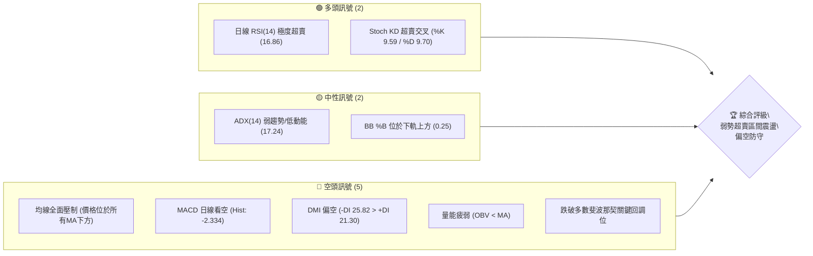
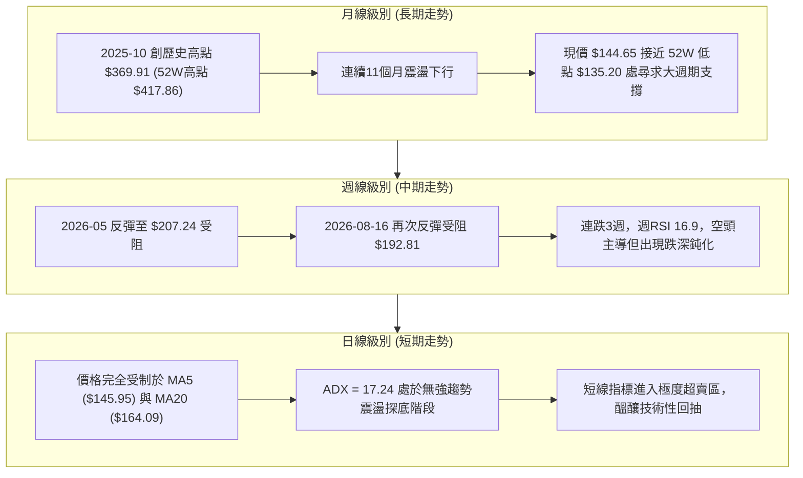
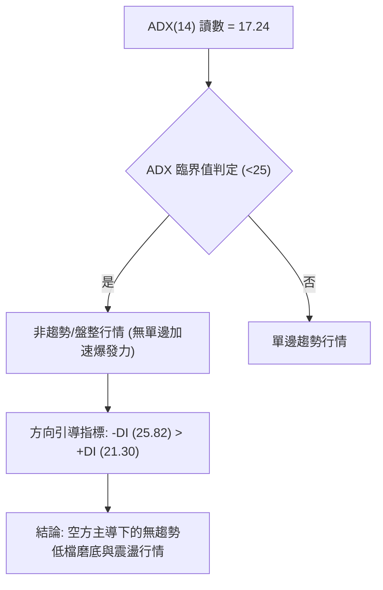
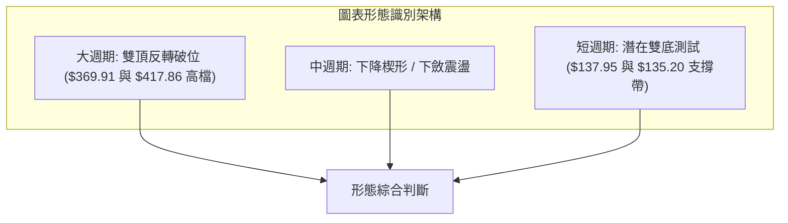
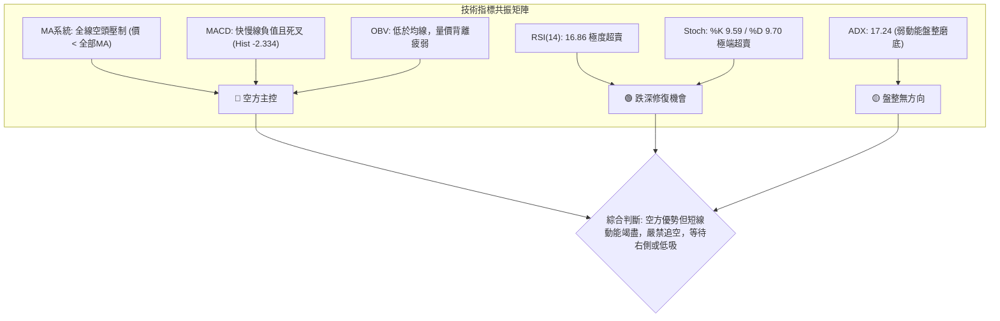
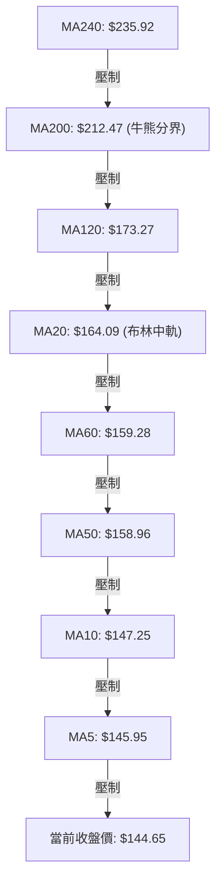
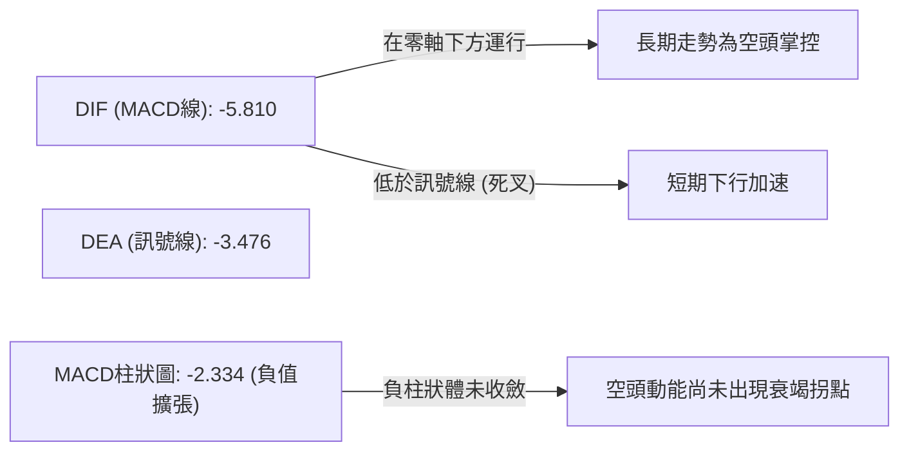
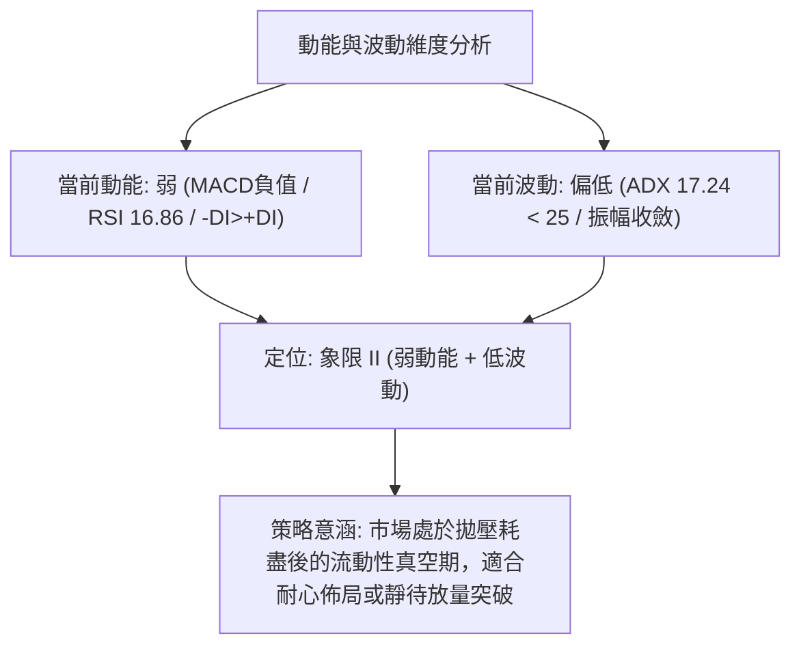
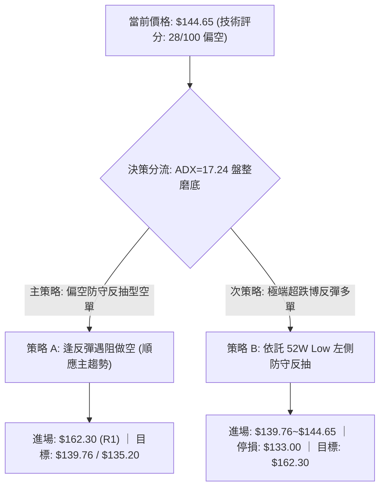
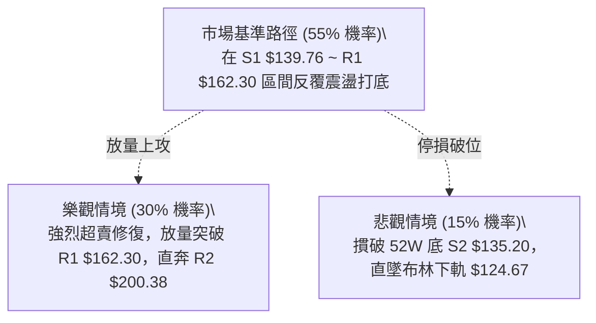

# AVAV 技術分析報告

> **報告日期**：2026-09-07 ｜ **語言**：繁體中文 ｜ **數據來源**：Yahoo Finance ｜ **當前價格**：$144.65

---

## 目錄

| 章節 | 內容 |
|------|------|
| [1. 技術面概覽](#1-技術面概覽) | 訊號儀表板、核心指標、評分卡 |
| [2. 趨勢分析](#2-趨勢分析) | 多時框趨勢、長中短期走勢 |
| [3. 圖表形態分析](#3-圖表形態分析) | 形態識別、K線組合、目標價 |
| [4. 支撐與阻力](#4-支撐與阻力) | 關鍵價位、斐波那契回調 |
| [5. 技術指標深度解讀](#5-技術指標深度解讀) | MA/RSI/MACD/布林/成交量 |
| [6. 動能與波動率](#6-動能與波動率) | 動能評估、ATR、Beta |
| [7. 多時框架總結](#7-多時框架總結) | 時框架評分矩陣 |
| [8. 交易策略建議](#8-交易策略建議) | 多空策略、風險報酬比 |
| [9. 風險提示與監控](#9-風險提示與監控) | 監控指標、風險場景 |

---

## 1. 技術面概覽

### 🎯 技術訊號儀表板



### 📊 核心指標速覽表

| 指標類別 | 指標名稱 | 當前數值 | 訊號 | 解讀 |
|----------|----------|----------|------|------|
| **價格** | 當前價格 | $144.65 | 🔴 | 位於52週高低區間底部 3.3% 位置，整體結構偏空 |
| **均線** | MA20 | $164.09 | 🔴 | 價格低於MA20達 -11.85%，短線下行阻力沉重 |
| **均線** | MA50 | $158.96 | 🔴 | 價格位於MA50下方，中期下行趨勢壓制明顯 |
| **均線** | MA200 | $212.47 | 🔴 | 價格位於長週期牛熊分界線下方 -31.92%，長期架構走空 |
| **動能** | RSI(14) | 16.86 | 🟢 | 極度超賣區（<20），隨時具備技術性跌深反抽動能 |
| **動能** | MACD | -5.810 (Hist -2.334) | 🔴 | 柱狀圖維持負值擴張，空方動能佔據主導 |
| **動能** | Stoch %K / %D | 9.59 / 9.70 | 🟢 | 雙雙跌入極端低位超賣區，具備短線技術修復條件 |
| **趨勢強度** | ADX(14) | 17.24 | 🟡 | 數值低於25，顯示當前下行動能並非單邊強烈趨勢，屬震盪偏空 |
| **波動** | ATR(14) | $7.55 | 🟡 | 佔股價 5.22%，每日波動區間較大，適度拉大停損寬度 |
| **量能** | OBV | OBV < MA | 🔴 | 能量潮指標低於均線，資金流出未見明顯反轉推升 |

### 🏆 技術評分卡

```
╔══════════════════════════════════════════════════════════════╗
║              技術評分卡 — AVAV (2026-09-07)                  ║
╠══════════════════════════════════════════════════════════════╣
║ 趨勢強度 (Trend)      ████░░░░░░░░░░░░░░░░  20/100  🔴 極弱空方║
║ 動能指標 (Momentum)   ████████░░░░░░░░░░░░  40/100  🟡 超賣醞釀║
║ 支撐穩定度 (Support)  ██████░░░░░░░░░░░░░░  30/100  🔴 逼近前低║
║ 成交量配合 (Volume)   ██████░░░░░░░░░░░░░░  30/100  🔴 量價背離║
║ 形態完整度 (Pattern)  ████████░░░░░░░░░░░░  40/100  🟡 築底雛形║
║ 均線排列 (MA System)  ██░░░░░░░░░░░░░░░░░░  10/100  🔴 空頭排列║
╠══════════════════════════════════════════════════════════════╣
║ 綜合評分              ██████░░░░░░░░░░░░░░  28/100  🔴 偏空格局║
╚══════════════════════════════════════════════════════════════╝
```

---

## 2. 趨勢分析

### 🌐 多時框趨勢分析



### 📈 長期趨勢 — 12個月走勢圖（Unicode）

```
AVAV 月線走勢圖（2025-09 至 2026-09）
價格軸 ($)
$370 ┤                 ● (2025-10: $369.91 波段頂部)
$340 ┤
$310 ┤           ● (2025-09: $314.89)
$280 ┤                       ● (2025-11: $279.46)  ● (2026-01: $278.39)
$250 ┤                             ● (2025-12)           ● (2026-02: $252.25)
$220 ┤                                                         ● (2026-05: $207.24)
$190 ┤                                                   ● (2026-04)
$160 ┤                                                               ● (2026-06: $165.07)
$130 ┤                                                                     ●──●──● (現價 $144.65)
     └─────────────────────────────────────────────────────────────────────────────
       09   10    11    12    01    02    03    04    05    06    07    08    09
      (25) (25)  (25)  (25)  (26)  (26)  (26)  (26)  (26)  (26)  (26)  (26)  (26)
```

**走勢特徵分析表格**：

| 階段 | 時間區間 | 起始價 → 結束價 | 漲跌幅 | 走勢特徵與市場行為 |
|------|----------|----------------|--------|-------------------|
| 主升段高潮 | 2025-09 ~ 2025-10 | $314.89 → $369.91 | +17.47% | 刷新歷史天價，52週最高觸及 $417.86，呈現過熱噴發 |
| 初段回踩 | 2025-11 ~ 2025-12 | $279.46 → $241.89 | -13.44% | 獲利了結賣壓湧現，跌破 MA20，高檔套牢盤開始形成 |
| 中期震盪 | 2026-01 ~ 2026-02 | $278.39 → $252.25 | -9.39% | 弱勢反彈不過前高，構築頭部右肩，長線主力資金逐步撤離 |
| 加速下挫 | 2026-03 ~ 2026-06 | $183.05 → $165.07 | -9.82% | 跌破多重斐波那契回調位，下探至 $137.95 尋求初步支撐 |
| 低檔築底/弱勢盤整 | 2026-07 ~ 2026-09 | $149.37 → $144.65 | -3.16% | 波動率收窄，現價於 $144.65 附近徘徊，逼近波段低點 $135.20 |

### 📊 中期趨勢（週線分析）

```
近期中期結構示意圖：
$207.24 (2026-05-31 週波段高點 R3: $207.83 附近)
   │
   ▼
$192.81 (2026-08-16 反彈次高點) ────► 形成中期下降壓力線
   │
   ▼
$160.22 (跌破阻力群 R1: $162.30)
   │
   ▼
$144.65 (現價，位於支撐群 S1: $139.76 與 S2: $135.20 上方收斂)
```

中期走勢呈現「一峰低於一峰」的典型下降階梯，2026年8月中旬在 $192.81 遇阻後連續三週長黑摜壓，週線級別 MACD 柱狀圖（-2.334）與 RSI（16.9）雙雙轉入超賣區，中期走勢由空頭控盤，但短線急跌後乖離率過大。

### ⚡ 趨勢強度評估（ADX 解讀）



**ADX 趨勢強度對照表**：

| ADX 數值區間 | 當前數值 | 當前狀態判定 | 交易架構解讀 |
|-------------|----------|--------------|--------------|
| 0 ~ 20 | **17.24** | 🟢 **弱趨勢 / 盤整磨底** | 缺乏持續性單邊推力，容易出現虛假突破；交易應偏向低吸高拋之區間思維，而非追空。 |
| 20 ~ 25 | - | 轉折過渡區間 | 趨勢正在醞釀或減速。 |
| 25 ~ 40 | - | 強趨勢形成 | 適合順勢突破操作。 |
| 40 以上 | - | 極強單邊 / 趨勢竭盡 | 出現超買或超賣反轉機率高。 |

---

## 3. 圖表形態分析

### 🔍 形態識別系統



**圖表形態信心度與參數表**：

| 形態 | 信心度 | 判斷依據（引用數據） | 完成度 | 目標價（附計算式） |
|------|--------|----------------------|--------|--------------------|
| 潛在雙重底 (W底) | 52% | 2026-06-28 週低點 $137.95 與 52W Low S2 $135.20 構成雙重低點測試，現價 $144.65 守於其上 | 45% (尚未突破頸線) | 頸線阻力 R1 $162.30 + 形態高度 ($162.30 - $135.20 = $27.10) = **$189.40** |
| 中期下降通道/楔形 | 68% | 連結 2026-05 高點 $207.24、08 高點 $192.81，以及 06 月底低點 $137.95、08 月底低點 $147.94，下行趨勢線收斂 | 75% (處於楔形末端) | 若向上突破通道頂部，短線測量目標為通道起跌起點 R2 **$200.38** |
| 長期雙頂破頸線 | 85% | 2025-10 高點 $369.91 與歷史高點 $417.86 構築複合頂部，頸線跌破後持續下瀉 | 100% (已完全宣洩) | 形態跌幅滿足點已達到 52W Low S2 **$135.20** |

### 🕯️ 重要K線形態分析

| 月份/週期 | 收盤價 | K線形態 | 解讀 | 訊號 |
|----------|--------|---------|------|------|
| 2025-10 | $369.91 | 長上影流星線 | 52W 高點 $417.86 衝高大幅回落，主力機構出貨訊號 | 🔴 強烈空頭反轉 |
| 2026-05 | $207.24 | 中陽線遇阻 | 月線試圖反抽 MA200 失敗，形成空頭「死叉反撲」陷阱 | 🔴 空方再起 |
| 2026-06 | $165.07 | 長陰貫穿破位 | 摜破長週期支撐，當週成交量放大至 11,887,200，恐慌盤湧出 | 🔴 恐慌殺跌 |
| 2026-07 | $149.37 | 低檔長下影十字線 | 最低探至 $137.95 後快速拉升，多頭於 $140 關口展開抵抗 | 🟡 多空拉鋸 |
| 2026-09 (即時) | $144.65 | 低檔收斂實體小陰線 | 波動率大幅萎縮，賣壓衰竭，呈現縮量窄幅盤整磨底狀態 | 🟢 賣壓減緩 |

### 📉 ASCII 走勢形態示意圖

```
AVAV 雙重底測試與下降收斂示意圖
價格 ($)
$207.83 (R3) ──┐
                ╲
$192.81 ─────────╲──────┐ (次高阻力)
                  ╲      ╲
$162.30 (R1 頸線) ─╲──────╲───────┬─────────────────────────────── (頸線阻力位)
                    ╲      ╲     ╱ 
                     ╲      ╲   ╱  
$144.65 (現價) ───────╲──────╲─● ◄── 現價正於此處尋求築底
                       ╲      ╱ ╲
$137.95 ────────────────●────╱───╲ (第一低點: 2026-06-28)
                         ╲  ╱     ● (潛在第二低點: S1 $139.76 / S2 $135.20)
$135.20 (S2 52W低點) ─────┴─────────────────────────────────────── (絕對防守底線)
```

### 🎯 形態目標價計算

根據日線/週線潛在「雙重底（Double Bottom）」假設：
1. **頸線確認點位**：波段阻力 R1 = **$162.30**
2. **形態底部低點**：52週波段低點 S2 = **$135.20**
3. **形態垂直高度**：$162.30 - $135.20 = **$27.10**
4. **理論量度等幅上漲目標價**：
   $$\text{目標價} = \text{頸線} + \text{形態高度} = \$162.30 + \$27.10 = \mathbf{\$189.40}$$
   *(註：此目標價低於長期阻力 R2 $200.38，符合週線下降通道反轉之合理回抽目標)*

---

## 4. 支撐與阻力

### 🗺️ 關鍵價位分布圖（Unicode）

```
╔══════════════════════════════════════════════════════════════════╗
║                     AVAV 價位結構分布圖                          ║
╠══════════════════════════════════════════════════════════════════╣
║ $207.83 ║██████████████████████████████║ 強阻力 R3 (2026-05高點)║
║ $200.38 ║████████████████████████      ║ 重大心理阻力 R2        ║
║ $162.30 ║████████████████              ║ 關鍵頸線阻力 R1 (MA20) ║
║ $144.65 ╠══════════════════════════════╣ ◄ 現價 (空頭超賣區)    ║
║ $139.76 ║▓▓▓▓▓▓▓▓▓▓▓▓                  ║ 近期波段支撐 S1        ║
║ $135.20 ║██████████████████████████████║ 52週絕對強支撐 S2      ║
╚══════════════════════════════════════════════════════════════════╝
```

### 🚧 阻力位分析表

所有價位均嚴格引用歷史波段高點聚類與計算數值：

| 阻力級別 | 價位 | 形成原因 | 突破難度 | 重要性 |
|----------|------|----------|----------|--------|
| **R1** | **$162.30** | 近一年波段高點聚類、貼近 MA20 ($164.09) 與 MA50 ($158.96) 壓力帶 | ★★★☆☆ | 極高。突破代表日線正式扭轉下行，開啟波段反彈 |
| **R2** | **$200.38** | 整數心理關卡、近一年強阻力聚類、貼近斐波那契 78.6% 回調位 ($195.69) | ★★★★☆ | 重大。中期牛熊分界過渡區，上方套牢盤沉重 |
| **R3** | **$207.83** | 2026-05-31 週線波段高點聚類 ($207.24~$207.83)、布林上軌 ($203.51) | ★★★★★ | 終極。多頭唯有收復此處才能宣告長期跌勢終結 |

### 🛡️ 支撐位分析表

所有價位均嚴格引用歷史波段低點聚類與計算數值：

| 支撐級別 | 價位 | 形成原因 | 守住機率 | 重要性 |
|----------|------|----------|----------|--------|
| **S1** | **$139.76** | 近一年波段低點聚類，與 2026-06-28 恐慌收盤價 $137.95 形成緩衝支撐區 | 65% | 高。短線多頭第一道防線，失守將考驗前低 |
| **S2** | **$135.20** | 52週絕對低點（52W Low）、斐波那契 100.0% 回調位 | 80% | 生死線。多頭全年底線，跌破將引發新一輪無底深淵式停損賣壓 |

### 📐 斐波那契回調位分析

**基準區間：52週最高價 $417.86 → 52週最低價 $135.20**

```
0.0%  (52W High) ───────────────────────── $417.86
23.6%            ───────────────────────── $351.15
38.2%            ───────────────────────── $309.88
50.0%            ───────────────────────── $276.53
61.8%            ───────────────────────── $243.18
78.6%            ───────────────────────── $195.69
────────────────────────────────────────── ◄ 現價 $144.65 (落於 78.6% ~ 100.0% 之間)
100.0% (52W Low) ───────────────────────── $135.20
```

**回調位深度解讀**：
1. **現價區間位置**：現價 $144.65 處於斐波那契 **78.6% ($195.69)** 至 **100.0% ($135.20)** 的極度弱勢區間，距離 100.0% 僅有 **+7.0%** 的緩衝墊。
2. **多空結構含義**：斐波那契回調一旦跌破 61.8% ($243.18) 與 78.6% ($195.69)，代表前期的多頭波段結構已被 100% 破壞，當前完全處於「回歸原點」的尋底週期。S2 ($135.20) 作為 100.0% 基準點，是此輪大週期級別回調的最後錨定點。

---

## 5. 技術指標深度解讀

### 🎛️ 指標訊號總覽



### 📈 移動平均線排列分析



**均線狀態詳解**：
- **短天期均線**：MA5 ($145.95) 與 MA10 ($147.25) 在上方形成第一道緊密「封口線」，現價與 MA5 差距 -0.89%，隨時有機會金叉上破；但 MA20 ($164.09) 呈現負斜率快速下壓，差距高達 -11.85%，構成短線強壓。
- **長天期均線**：MA200 ($212.47) 與 MA240 ($235.92) 呈標準死叉下行形態。目前價格在所有長中短期均線下方，屬於最脆弱的「空頭混亂/完全空頭」排列，任何均線反彈在未放量站穩 MA50 ($158.96) 前，均只能視為技術性反抽。

### 📉 RSI(14) 分析

```
RSI(14) 讀數儀表：
0 ─────── 16.86 ─────── 30 ──────────────── 50 ──────────────── 70 ─────── 100
[ 極度超賣區 |  超賣區  |          中性區間          |   超買區   | 極度超買 ]
████████░░░░░░░░░░░░░░░░░░░░░░░░░░░░░░░░░░░░░░░░░░░░░░░░░░░░░░░░░░ (16.86)
```

- **超賣狀態評估**：RSI(14) 目前為 **16.86**，已經連續數週處於歷史極端超賣水位（週線 RSI 亦跌至 16.9）。歷史經驗顯示，當 AVAV 的日線 RSI 跌破 20 時，通常對應中短期賣壓竭盡的衰竭低點（例如 2026-06-28 跌至 20.2 後隨即噴出反彈至 $190.89）。
- **背離分析**：
  - **日線/週線判斷**：2026-06-28 收盤價 $137.95（RSI: 20.2），當前價格 $144.65（RSI: 16.86）。雖然價格高於前低，但 RSI 指標卻刷出新低，呈現**微弱的隱性弱勢確認**，並**無標準多頭底背離**（Bullish Divergence）成立。
  - **結論**：超賣不等於立即反轉，無背離確認情況下，需提防價格繼續鈍化貼地滑行。

### 📊 MACD(12/26/9) 訊號解讀



- MACD 數值為 **-5.810**，訊號線為 **-3.476**，柱狀圖（Histogram）為 **-2.334**。
- MACD 線與信號線均深陷零軸以下，柱狀圖持續為負值，表明市場目前完全由空方定價。然而柱狀圖負值連續數週維持在 -2.3 ~ -4.0 區間，負動能未再呈爆炸性擴散，說明拋售潮已進入後段整理期。

### 📦 布林通道分析

```
AVAV 日線布林通道 (20, 2) 結構圖：
$203.51 ────────────────────────────────────────── BB 上軌 (Upper Band)
         ╲
          ╲
$164.09 ───╲────────────────────────────────────── BB 中軌 (MA20)
            ╲
$144.65 ─────● ◄── 現價 (BB %B = 0.25，處於通道下半部)
              ╲
$124.67 ───────┴────────────────────────────────── BB 下軌 (Lower Band)
```

- **布林帶寬與位置**：
  - BB 上軌：**$203.51** ｜ BB 中軌 (MA20)：**$164.09** ｜ BB 下軌：**$124.67**
  - **%B 指標**：$$\%B = \frac{\$144.65 - \$124.67}{\$203.51 - \$124.67} = \frac{19.98}{78.84} \approx \mathbf{0.25}$$
  - 現價位於 0.25 水平，說明價格並未跌破布林下軌（未形成下軌單邊開口暴跌），而是處於下軌與中軌之間的弱勢收斂震盪區。通道下軌 $124.67 提供了一定的極端波動包絡防護。

### 💹 成交量分析（量價配合度）

```
成交量結構比較 (股數)：
最新成交量  : ████████████████░░░░░░░░  1,530,200
20日均量    : █████████████░░░░░░░░░░░  1,245,420 (量比: 1.23x)
50日均量    : ██████████████████░░░░░░  1,726,846
```

- **量價特徵**：最新成交量 1,530,200 股，較 20 日均量放大 1.23 倍，但遠低於 50 日均量。回顧歷史大跌週（2026-06-28 與 2026-07-05），週成交量均爆出 1,100 萬至 1,800 萬股的巨量；而近期週成交量縮減至 700 萬股左右，說明**恐慌性出逃盤已逐步耗盡**。
- **OBV 能量潮**：OBV < MA，能量潮未呈現回升跡象，顯示主力機構目前採取「低接不推」的消極被動吸籌策略，缺乏主動推升價格的主流資金。

---

## 6. 動能與波動率

### ⚡ 動能評估四象限

| 象限 | 動能維度 | 波動維度 | 當前狀態判定 | 戰術應對策略 |
|------|----------|----------|--------------|--------------|
| **象限 I** | 強動能 (Bullish) | 低波動 (Low Vol) | — | 最佳波段加碼區 |
| **象限 II** | 弱動能 (Bearish) | 低波動 (Low Vol) | **AVAV 當前落點 (✓)** | **謹慎觀望 / 嚴格設損之低吸磨底區間** |
| **象限 III** | 強動能 (Bullish) | 高波動 (High Vol) | — | 追漲高風險高收益區 |
| **象限 IV** | 弱動能 (Bearish) | 高波動 (High Vol) | — | 恐慌崩跌主跌段，絕對避免進場 |



### 📊 ATR 波動率分析

- **ATR(14) 數值**：**$7.55**（佔當前股價之 **5.22%**）。
- **波動特性評估**：單日 $7.55 的潛在波幅意味著該股具備高彈性與高日常噪音。傳統的 1%~2% 緊密停損極易被盤中無序雜訊洗出場。
- **止損與風控建議**：
  - **一般波段交易停損距離**：建議設定為 $1.5 \times \text{ATR} = 1.5 \times \$7.55 = \mathbf{\$11.33}$。
  - **緊湊進場停損距離**：設定為 $1.0 \times \text{ATR} = \mathbf{\$7.55}$。
  - 此數值正好契合現價 $144.65 至波段強支撐 S2 ($135.20) 的空間差距（$144.65 - \$135.20 = \$9.45，約等於 $1.25 \times \text{ATR}$）。

### 📐 Beta 與市場相關性

- **Beta 係數**：**1.406**（高於市場基準 1.00 達 40.6%）。
- **解讀**：AVAV 屬於典型的高貝塔成長/國防科技軍工股。在標普 500 指數或大盤出現單邊波動時，該股將呈現放大效應。目前空方循環中，高 Beta 特性加劇了下行幅度；若後續大盤科技板塊回暖，該股亦具備展現超額彈性（High Alpha/Beta 彈升）的潛能。

---

## 7. 多時框架總結

### 📋 時框架評分表

| 時框架 | 趨勢方向 | 動能 | 均線排列 | 形態 | 綜合評分 | 建議 |
|--------|----------|------|----------|------|----------|------|
| **月線 (長期)** | 🔴 下行下跌 | 🔴 疲弱下行 | 🔴 空頭壓制 | 🔴 雙頂崩落 | 25/100 | 規避長線持有，嚴守破位止損 |
| **週線 (中期)** | 🔴 下行下降 | 🟡 超賣鈍化 | 🔴 空頭排列 | 🟡 下降通道 | 30/100 | 中期等待下降通道上軌突破 |
| **日線 (短期)** | 🟡 橫向盤整 | 🟢 極度超賣 | 🔴 空頭混合 | 🟢 潛在雙底 | 40/100 | 極限超賣跌深，博取技術性反抽 |

### 🔲 綜合訊號矩陣

```
╔══════════════════════════════════════════════════════════════════╗
║                   AVAV 綜合時框訊號矩陣                          ║
╠═════════════╦══════════════╦══════════════╦══════════════════════╣
║ 時框架      ║ 趨勢訊號     ║ 指標狀態     ║ 核心操作指引         ║
╠═════════════╬══════════════╬══════════════╬══════════════════════╣
║ 日線 (短線) ║ 🟡 築底震盪  ║ RSI 16.86 超賣║ 依託 S1/S2 輕倉低吸  ║
║ 週線 (中線) ║ 🔴 下行通道  ║ MACD -2.334  ║ 逢反彈至 R1/R2 減倉  ║
║ 月線 (長線) ║ 🔴 大三浪回調║ 貼近 52W 底  ║ 未收復 MA200 勿言反轉║
╚═════════════╩══════════════╩══════════════╩══════════════════════╝
```

### ⚖️ 多時框收斂結論

> **依據「嚴格要求 14」進行多時框衝突收斂**：
> 1. **行情屬性判定**：當前日線 ADX(14) 讀數為 **17.24 (< 25)**，嚴格界定為「**盤整磨底行情**」，而非單邊強趨勢行情。
> 2. **主導時框與交易邊界**：依規則，盤整行情以日線**布林通道上下軌**（$124.67 ~ $203.51）與**關鍵波段聚類支撐阻力**為主要交易區間。
> 3. **方向性唯一結論**：**中性偏空觀望，短線跌深反彈機會醞釀中**。由於中長期週線與均線全面偏空，任何日線級別的買入動作僅能定性為「依託 S1/S2 強支撐的左側超賣防守型反彈策略」，決不可重倉盲目長抱。第 8 章之交易主路由將依評分卡（28/100）嚴格定義為「**偏空防守架構**」。

---

## 8. 交易策略建議

### 🗺️ 策略決策流程圖



### 🧭 策略路由（依評分卡分流）

- **綜合評分**：**28 / 100**（屬於偏空評級 ≤ 40 區間）。
- **當前主策略方向**：**偏空防守（順趨勢逢高布空，超賣低吸僅作為輕倉防守對沖）**。
  - 主推順應中長期週線與均線下行的逢反彈做空策略；
  - 輔以跌深極端位置之反彈對沖交易，嚴禁無停損抄底。

### 🎯 價格情境階梯（Price Scenarios）

價位完全嚴格引用關鍵聚類價位：

| 觸發條件 | 第一目標 | 後續延伸 | 情境含義 |
|----------|----------|----------|----------|
| 向上突破 R1 **$162.30** | R2 **$200.38** | R3 **$207.83** | 短線空頭衰竭，正式啟動週線級別超賣修復波段 |
| 處於 **$139.76 ~ $162.30** | — | — | 弱勢低檔箱體震盪磨底，無趨勢無序盤整 |
| 向下跌破 S1 **$139.76** | S2 **$135.20** | 通道下軌 **$124.67** | 空方重啟下破，測試 52 週最低點生死防線 |

### 📊 情境機率分佈

| 情境 | 機率 | 主要依據 |
|------|------|----------|
| **區間震盪磨底** | **55%** | ADX 僅 17.24，日線與週線動能陷入低迷，成交量萎縮，空方動能減弱但多方缺乏資金介入 |
| **超賣反彈向上** | **30%** | RSI 16.86 處於歷史極端超賣區，Stoch %K 9.59，短線跌幅過深隨時引發技術性空頭回補 |
| **跌破破底下行** | **15%** | S2 $135.20 具備一整年之大週期多頭防守意志，若無突發基本面重大黑天鵝，直接穿透機率較低 |

### 🟢 主策略詳情

本報告依據評分規則，提供順應總體偏空格局的「反彈布空策略」（策略 A），以及順應 ADX<25 盤整特徵的「超賣左側反抽策略」（策略 B）：

| 策略要素 | 策略 A（主推：順勢逢高沽空） | 策略 B（輔推：極端超賣博反彈） |
|----------|------------------------------|--------------------------------|
| **策略類型** | 順應週線下降趨勢之反彈高空 | 依託 52W 底部的左側極限反抽 |
| **進場條件** | 反抽觸及 R1 遇阻且出現長上影線 | 現價或回踩 S1 不破企穩 |
| **進場價格** | **$162.30** | **$144.65**（現價）至 **$139.76** |
| **目標價 T1** | **$144.65**（當前低檔支撐） | **$162.30**（R1 頸線阻力） |
| **目標價 T2** | **$135.20**（52W Low S2） | **$189.40**（雙底量度目標） |
| **止損價格** | **$170.00**（站穩 MA20 上方） | **$133.00**（有效跌破 S2 $135.20 減緩衝） |
| **風險報酬比** | **3.52 : 1** 🟢 | **2.60 : 1** 🟢 |
| **成功機率** | 60% | 45% |
| **建議倉位** | 10% ~ 15% 輕倉 | 5% 極輕對沖倉 |

*計算式驗證（策略 A）：*
- 風險空間：$\$170.00 - \$162.30 = \$7.70$
- 目標利潤（T2）：$\$162.30 - \$135.20 = \$27.10$
- 風險報酬比：$\$27.10 / \$7.70 = \mathbf{3.52}$

*計算式驗證（策略 B）：*
- 風險空間（以現價 $144.65 進場）：$\$144.65 - \$133.00 = \$11.65$
- 目標利潤（以 T1 為主）：$\$162.30 - \$144.65 = \$17.65$；若看至形態目標 $189.40，利潤空間為 $\$44.75$
- 風險報酬比（以平均目標 $(\$17.65+\$44.75)/2 = \$31.20$ 計算）：$\$31.20 / \$11.65 = \mathbf{2.68}$（取保守值約 **2.60:1**）

### 🔴 反向風險觸發點（對沖提示）

若出現以下訊號，主偏空思維將被徹底推翻，空方必須無條件停損離場並轉為多方思維：
1. **日線收盤價帶量突破 R1 $162.30**，且日線 MACD 柱狀圖翻正、快慢線黃金交叉。
2. **週線收盤站上 R2 $200.38**，宣告 2026 年以來的週線級別下行通道徹底破局。

### ⭐ 整體訊號強度評星

```
做多訊號強度：★★☆☆☆  (2.0/5星 - 僅憑極端超賣，缺乏形態與量能配合)
做空訊號強度：★★★☆☆  (3.5/5星 - 大週期順勢，但短線空間受制於超賣)
整體可信度：  ★★★★☆  (4.0/5星 - 指標共振清晰，低動能盤整特徵明確)
```

---

## 9. 風險提示與監控

### ✅ 關鍵監控指標 Checklist

```
╔══════════════════════════════════════════════════════════════════╗
║               AVAV 每日交易監控 Checklist                        ║
╠══════════════════════════════════════════════════════════════════╣
║ [ ] 價格是否跌破 S1 ($139.76) 或 S2 ($135.20) 觸發恐慌停損     ║
║ [ ] 日線 RSI(14) 是否脫離超賣區（回升突破 30 水位）             ║
║ [ ] 日線 MACD 柱狀圖是否由負轉正（縮小至 0 軸以上）             ║
║ [ ] 成交量是否放大至 20 日均量（1,245,420 股）的 1.5 倍以上      ║
║ [ ] ADX(14) 是否上穿 25，開啟新一輪單邊走勢                      ║
║ [ ] 價格是否突破並站穩 MA20 ($164.09)                           ║
╚══════════════════════════════════════════════════════════════════╝
```

### ⚠️ 風險場景分析



### 🛡️ 風險管理重要提醒

1. **嚴禁追空於極端超賣區**：當前 RSI(14) 僅 16.86，空頭能量已大幅釋放，在 $144.65 附近盲目殺跌追空面臨極高的軋空與回抽風險。
2. **倉位與波動率匹配**：鑑於 ATR 高達 $7.55（5.22%），總持倉部位不宜超過總資金的 15%，單筆交易虧損必須控制在總資產的 1% 以內。
3. **空頭排列的「假突破」防範**：在均線未扭轉前，任何向上的急速拉升均應優先以「誘多反彈」視之，嚴格執行分批獲利與移動保本停損。

---

## 📋 報告總結

```
╔══════════════════════════════════════════════════════════════════╗
║                   AVAV 技術分析報告總結                          ║
╠══════════════════════════════════════════════════════════════════╣
║ 報告日期：2026-09-07                                             ║
║ 當前價格：$144.65                                                ║
║ 分析評級：⚖️ 偏空震盪磨底（短線極端超賣，隨時孕育反彈）          ║
║                                                                  ║
║ 關鍵結論：                                                       ║
║ ├─ 長期趨勢：🔴 空頭主導（跌破 MA200，大週期回調進入尾聲）       ║
║ ├─ 中期趨勢：🔴 下降通道（一峰低於一峰，未突破下降趨勢線）       ║
║ ├─ 短期趨勢：🟡 低檔震盪（ADX=17.24 弱趨勢，進入 $135~$162 區間）║
║ ├─ 關鍵支撐：S1: $139.76  ｜  S2: $135.20 (52W Low 生死線)       ║
║ ├─ 關鍵阻力：R1: $162.30  ｜  R2: $200.38  ｜  R3: $207.83      ║
║ └─ 分析師目標：均價 $225.77 (高 $326.00 / 低 $148.57)            ║
║                                                                  ║
║ 最優策略組合：                                                   ║
║ 1. 🥇 最佳機會：等待反抽至阻力 R1 $162.30 遇阻布空 (勝率 60%)    ║
║ 2. 🥈 次選機會：依託支撐 S1/S2 於現價輕倉搏極端超賣反彈 (R:R 2.6)║
║ 3. 🥉 保守選擇：空倉觀望，靜待日線站穩 MA20 且 ADX>25 右側進場   ║
╚══════════════════════════════════════════════════════════════════╝
```

---

> ⚠️ **免責聲明**：本報告為 AI 自動生成之技術分析，所有數據及估算均基於提供的歷史價格資訊。本報告**僅供研究與學術參考**，**不構成任何投資建議**。投資有風險，入市需謹慎。

---

*報告生成時間：2026-09-07 ｜ 數據來源：Yahoo Finance ｜ 分析框架：多時框技術分析*