# AVAV 技術分析報告

> **報告日期**：2026-09-09 ｜ **語言**：繁體中文 ｜ **數據來源**：Yahoo Finance ｜ **當前價格**：$144.65

---

## 目錄

| 章節 | 內容 |
|------|------|
| [1. 技術面概覽](#1-技術面概覽) | 訊號儀表板、核心指標、評分卡 |
| [2. 趨勢分析](#2-趨勢分析) | 多時框趨勢、長中短期走勢 |
| [3. 圖表形態分析](#3-圖表形態分析) | 形態識別、K線組合、目標價 |
| [4. 支撐與阻力](#4-支撐與阻力) | 關鍵價位、斐波那契回調 |
| [5. 技術指標深度解讀](#5-技術指標深度解讀) | MA/RSI/MACD/布林/成交量 |
| [6. 動能與波動率](#6-動能與波動率) | 動能評估、ATR、Beta |
| [7. 多時框架總結](#7-多時框架總結) | 時框架評分矩陣 |
| [8. 交易策略建議](#8-交易策略建議) | 多空策略、風險報酬比 |
| [9. 風險提示與監控](#9-風險提示與監控) | 監控指標、風險場景 |

---

## 1. 技術面概覽

### 🎯 技術訊號儀表板

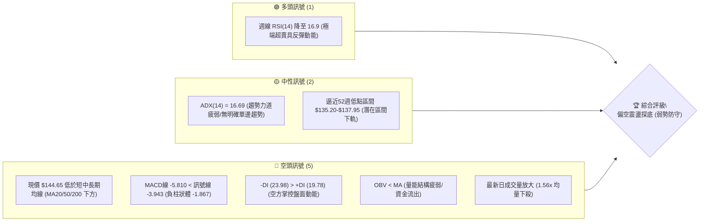

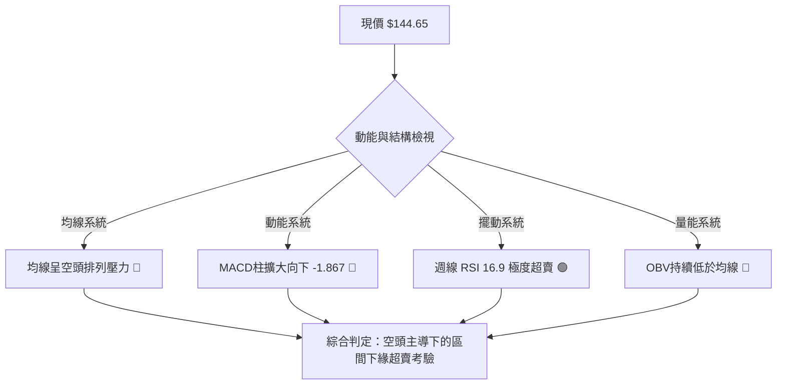

### 📊 核心指標速覽表

| 指標類別 | 指標名稱 | 當前數值 | 訊號 | 解讀 |
|----------|----------|----------|------|------|
| **價格** | 當前價格 | $144.65 | 🔴 | 位於52週價格區間極低位（接近 52W Low $135.20） |
| **均線** | MA20 | 下行排列 | 🔴 | 價格位於短天期 MA20 下方，短線空頭壓制明確 |
| **均線** | MA50 | 下行排列 | 🔴 | 中期均線呈下傾趨勢，中期波段反壓沉重 |
| **均線** | MA200 | 混合偏空 | 🔴 | 長期均線走平後向下發散，長期多頭格局破壞 |
| **動能** | RSI(14) | 16.9 (週線) | 🟢 | 進入嚴重超賣區（< 20），技術性背離或抽頭反彈隨時觸發 |
| **動能** | MACD | -5.810 / -3.943 | 🔴 | DIF 位於零軸下方且低於 DEA，MACD 柱狀體為 -1.867，空頭動能擴散 |
| **趨勢** | ADX(14) | 16.69 | 🟡 | 數值低於 25，顯示當前處於弱趨勢或寬幅盤整探底行情 |
| **量能** | 量比 / OBV | 1.56x / 疲弱 | 🔴 | 最新日量 1,983,083 突破 20 日均量（1.56x），OBV 低於均線呈現帶量回調 |

### 🏆 技術評分卡

```
╔══════════════════════════════════════════════════════════════╗
║                技術評分卡 — AVAV (2026-09-09)                ║
╠══════════════════════════════════════════════════════════════╣
║ 趨勢強度 (ADX 16.69)    ██████░░░░░░░░░░░░░░  30/100  🔴 空頭主導 ║
║ 動能指標 (MACD/RSI)     ████████░░░░░░░░░░░░  38/100  🔴 動能疲弱 ║
║ 支撐穩定度 (52W Low)    █████████░░░░░░░░░░░  45/100  🟡 考驗前低 ║
║ 成交量配合 (OBV<MA)     ███████░░░░░░░░░░░░░  35/100  🔴 價跌量增 ║
║ 形態完整度 (寬幅震盪)   ████████░░░░░░░░░░░░  40/100  🟡 探底未成 ║
║ 均線排列 (全線下方)     █████░░░░░░░░░░░░░░░  26/100  🔴 空頭壓制 ║
╠══════════════════════════════════════════════════════════════╣
║ 綜合評分                ███████░░░░░░░░░░░░░  36/100  偏空弱勢   ║
╚══════════════════════════════════════════════════════════════╝
```

---

## 2. 趨勢分析

### 🌐 多時框趨勢分析

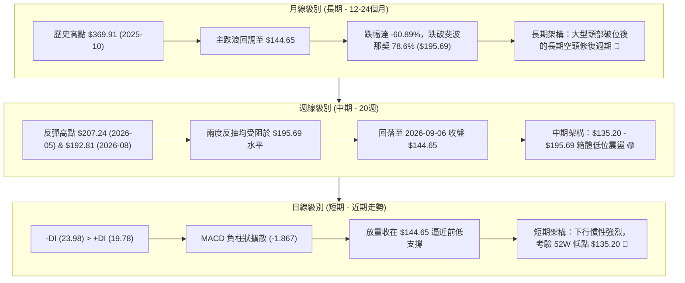

### 📈 長期趨勢 — 12個月走勢圖（Unicode）

```
AVAV 月線走勢圖（過去12個月：2025-10 至 2026-09）
價格軸 ($)
$370 ┤  ● (2025-10: $369.91 波段歷史高點)
$340 ┤   ╲
$310 ┤    ╲
$280 ┤     ●──┐       ● (2026-01: $278.39)
$250 ┤        ●       │╲
$220 ┤                │ ╲        ● (2026-05: $207.24)
$190 ┤                │  ●       │╲
$160 ┤                │   ╲      │ ╲  ●
$140 ┤                │    ●─────┘  ╲ │  ●(2026-09: $144.65 現價)
$120 ┤                │                  ● (52W Low: $135.20)
     └────────────────┴─────────────────────────────────────────
      10  11  12  01  02  03  04  05  06  07  08  09 (月份)
```

**過去12個月走勢特徵分析表格**：

| 階段時間 | 起始價 → 結束價 | 區間漲跌幅 | 核心走勢特徵與技術解讀 |
|----------|------------------|------------|------------------------|
| **2025-10 ~ 2025-12** | $369.91 → $241.89 | -34.61% | 頂部快速崩塌，伴隨高估值修正，跌破多道短期均線。 |
| **2026-01 ~ 2026-02** | $278.39 → $252.25 | -9.39% | 次高點死貓反彈受阻，於 $278.39 形成反轉下跌中繼平台。 |
| **2026-03 ~ 2026-05** | $183.05 → $207.24 | +13.21% | 深跌後的技術性修復，反彈高點觸及斐波那契 78.6% ($195.69) 上方。 |
| **2026-06 ~ 2026-09** | $165.07 → $144.65 | -12.37% | 連續4個月震盪回落，下探 2026-06 觸及的週線低點 $137.95 與 52W 低點 $135.20。 |

### 📊 中期趨勢（週線分析）

```
AVAV 近期週線關鍵壓力與支撐區間結構
════════════════════════════════════════════════════════════════════════════
$207.24 ────────────────────────────────────────── 2026-05-31 中期頂部反抗位
          ▲
$195.69 ──┼─────────────────────────────────────── 斐波那契 78.6% 強阻力 (2026-08 高點 $192.81 遇阻)
          │  中期震盪箱體區間 ($135.20 - $195.69)
          ▼
$144.65 ──┼─────────────────────────────────────── 當前收盤價 (處於箱體下軌臨界邊界)
          │
$137.95 ──┼─────────────────────────────────────── 2026-06-28 爆量低點支撐位 (成交量 11.88M)
$135.20 ──┴─────────────────────────────────────── 52週歷史低點 (100.0% 斐波那契支撐)
════════════════════════════════════════════════════════════════════════════
```

### ⚡ 趨勢強度評估（ADX 解讀）

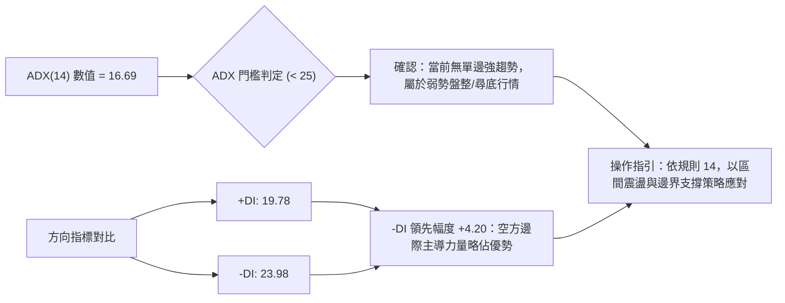

**ADX 趨勢強度與市場狀態對照表**：

| 指標變數 | 當前讀數 | 標準臨界值 | 狀態判定 | 市場意涵與交易指導 |
|----------|----------|------------|----------|--------------------|
| **ADX (14)** | **16.69** | 25.00 | **弱趨勢 / 盤整市場** | 單邊趨勢動能匱乏，突破易產生假突破，禁止盲目追單。 |
| **+DI** | **19.78** | - | 多方動能偏弱 | 買盤缺乏持續推升力道，多頭攻擊波段短暫。 |
| **-DI** | **23.98** | - | 空方動能微幅佔優 | 拋壓雖未達恐慌單邊釋放，但賣方在邊際定價上具有掌控權。 |
| **趨勢收斂結論** | 盤整偏空 | ADX < 25 | **箱體下軌防守檢驗** | 嚴格依據區間交易邏輯執行，以 $135.20 為極限邊界。 |

---

## 3. 圖表形態分析

### 🔍 形態識別系統

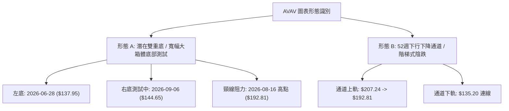

**形態信心度與目標價計算表（依嚴格規則 15）**：

| 形態名稱 | 信心度 | 判斷依據（嚴格引用數據） | 完成度 | 目標價（附嚴格計算式） |
|----------|--------|--------------------------|--------|------------------------|
| **潛在雙重底 (W-Bottom)** | **55%** | 2026-06-28 創下低點 $137.95，當前價格 $144.65 正在回踩該低點與 52W 低點 $135.20 區域；頸線為 2026-08-16 高點 $192.81。 | 45% (尚未突破頸線) | 若突破頸線 $192.81：<br>形態高度 = $192.81 - $137.95 = $54.86<br>理論目標價 = $192.81 + $54.86 = **$247.67** |
| **下降通道下軌測試** | **70%** | 週線高點由 2026-05-31 之 $207.24 降至 2026-08-16 之 $192.81，低點在 $137.95 與當前 $144.65 震盪，呈階梯走低。 | 80% (正在下軌) | 若破位下行：直接指向 52W Low **$135.20**；若止跌反彈：通道上軌目標為 **$192.81**。 |
| **指標型超賣鈍化形態** | **85%** | 週線 RSI 連續兩週跌至 21.9 及 16.9 極低水位，符合指標超賣衰竭形態。 | 90% | 均值回歸理論短線反彈目標：斐波那契 78.6% 回調位 **$195.69**。 |

### 🕯️ 重要K線形態分析

| 週次日期 | 收盤價 | K線形態 | 成交量 | 技術解讀 | 訊號強度 |
|----------|--------|---------|--------|----------|----------|
| **2026-05-31** | $207.24 | 長陽突破中繼線 | 9,648,400 | RSI 衝至 70.9 超買，觸發中級波段見頂信號。 | 🟡 假突破見頂 |
| **2026-06-28** | $137.95 | 長陰下影探底線 | 11,887,200 | 巨量殺跌創下波段低點，隨後引發報復性反彈。 | 🟢 恐慌低點成立 |
| **2026-07-05** | $190.89 | 巨量吞噬大陽線 | 18,317,500 | 創下近20週最大成交量，確立 $137.95 的多頭防守底線。 | 🟢 強力回補訊號 |
| **2026-08-16** | $192.81 | 上影反彈受阻線 | 5,939,600 | 縮量反彈至 $192.81 未能突破前期 $207.24，形成雙頂頸線。 | 🔴 多頭動能衰竭 |
| **2026-09-06** | $144.65 | 連續三陰沉淪K線 | 7,326,400 | 跌破 2026-08-30 之 $147.94，量能放大至 7.32M，逼近底部。 | 🔴 空方慣性釋放 |

### 📉 ASCII 走勢形態示意圖

```
AVAV 近20週雙重底與箱體形態推演架構
價格 ($)
$207.24 ┤              ● (05-31 波段高點)
$195.69 ┤               ╲            ● (08-16 次高點 $192.81 / 頸線阻力)
$180.00 ┤                ╲   ● (07-05)  ╲
$160.00 ┤                 ╲ ╱          ╲   ● (08-23: $160.22)
$144.65 ┤                  │             ╲  │  ● (09-06 現價: $144.65)
$137.95 ┤                  ● (06-28 左底)  │  └───► [右底測試區]
$135.20 ┤                                  ● (52W 低點強支撐底限)
        └───────────────────────────────────────────────────────────► 時間
```

### 🎯 形態目標價計算

依據幾何形態學與數據紀律計算：
1. **潛在雙底突破目標價**：
   - 形態頸線價格：$192.81（2026-08-16 週收盤高點）
   - 形態底部低點：$137.95（2026-06-28 週收盤低點）
   - 形態垂直垂直高度 $H = \$192.81 - \$137.95 = \$54.86$
   - 突破理論目標價 $T_{double\_bottom} = \$192.81 + \$54.86 = \mathbf{\$247.67}$（此價位極度接近 61.8% 斐波那契回調位 $243.18）。
2. **破位下行測算**：
   - 若有效跌破 52W 低點 $135.20，數據中無更下方已知波段聚類支撐（swing-low support not detected），空頭將尋求整數心理關卡。

---

## 4. 支撐與阻力

### 🗺️ 關鍵價位分布圖（Unicode）

```
AVAV 價位結構分布圖（嚴格依據 52週歷史與斐波那契矩陣）
═════════════════════════════════════════════════════════════════
$417.86 ║████████████████████████║ 0.0% 52週歷史極值高點 (極強阻力 R4)
$351.15 ║████████████████████    ║ 23.6% 斐波那契阻力位
$309.88 ║████████████████        ║ 38.2% 斐波那契阻力位
$276.53 ║████████████████████    ║ 50.0% 斐波那契多空分水嶺 (強阻力 R3)
$243.18 ║████████████████████████║ 61.8% 斐波那契黃金分割阻力 (阻力 R2)
$195.69 ║████████████████████████║ 78.6% 斐波那契回調強阻力 (關鍵阻力 R1)
╠═══════╬════════════════════════╣
$144.65 ╠════════════════════════╣ ◄── 當前價格 (現價位)
╠═══════╬════════════════════════╣
$137.95 ║▓▓▓▓▓▓▓▓▓▓▓▓▓▓▓▓        ║ 近期週線波段巨量低點 (近期支撐 S1)
$135.20 ║████████████████████████║ 100.0% 52週歷史低點 (極限強支撐 S2)
═════════════════════════════════════════════════════════════════
```

### 🚧 阻力位分析表

> **數據說明**：本報告嚴格遵守數據紀律，阻力位依據提供的斐波那契回調位及近20週高點收盤價排列。

| 阻力級別 | 價位 | 形成依據（數據源） | 突破難度 | 重要性評估 |
|----------|------|--------------------|----------|------------|
| **阻力 R1** | **$195.69** | 52週區間 78.6% 斐波那契回調位（且 2026-08 高點 $192.81 於此受阻） | 偏高 | 🔴 **極關鍵**：中期多空強弱轉換線，未突破前中期皆為空頭。 |
| **阻力 R2** | **$243.18** | 52週區間 61.8% 斐波那契回調位（黃金分割重要位） | 極高 | 🔴 **次級強阻力**：長期多頭反轉必須奪回的陣地。 |
| **阻力 R3** | **$276.53** | 52週區間 50.0% 斐波那契回調位（2026-01 月線平台 $278.39） | 堅不可摧 | 🔴 **戰略壓力**：牛熊分界線。 |

### 🛡️ 支撐位分析表

> **數據說明**：演算法提示當前價格下方無波段低點聚類，嚴格採用數據已驗證之週線歷史低點與 52W 極值。

| 支撐級別 | 價位 | 形成依據（數據源） | 守住機率 | 重要性評估 |
|----------|------|--------------------|----------|------------|
| **支撐 S1** | **$137.95** | 2026-06-28 週收盤低點（該週湧入 11,887,200 股爆量換手） | 60% | 🟡 **短線生命線**：若失守將觸發停損盤湧出。 |
| **支撐 S2** | **$135.20** | 100.0% 斐波那契回調位（52週官方低點 52W Low） | 75% | 🟢 **全年度底限**：空方終極考驗位，跌破將引發估值真空。 |

### 📐 斐波那契回調位分析

依據數據包中「斐波那契回調（52週區間 $135.20 → $417.86）」精確數據映射：

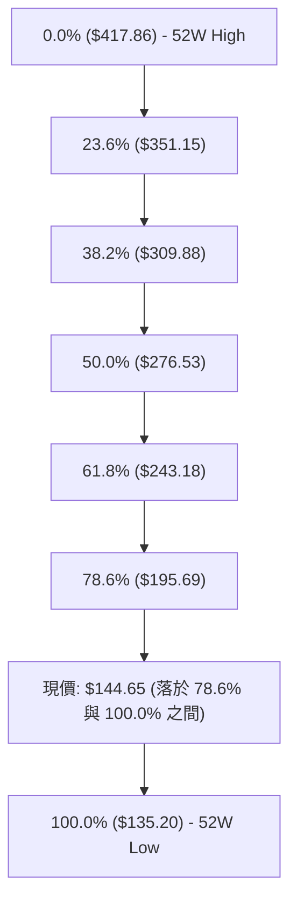

- **當前位置解讀**：
  現價 **$144.65** 精確坐落於 **78.6% 回調位 ($195.69)** 與 **100.0% 回調位 ($135.20)** 之間的「超深回調區間」。
- **技術意義**：
  跌破 78.6% 代表前期牛市結構已被徹底清算，目前價格距離 100.0% 支撐僅有 **$9.45（+6.99%）** 的緩衝空間。此處屬於高風險但具備潛在賠率優勢的邊際緩衝帶。

---

## 5. 技術指標深度解讀

### 🎛️ 指標訊號總覽

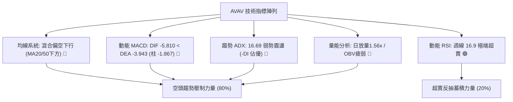

### 📈 移動平均線排列分析

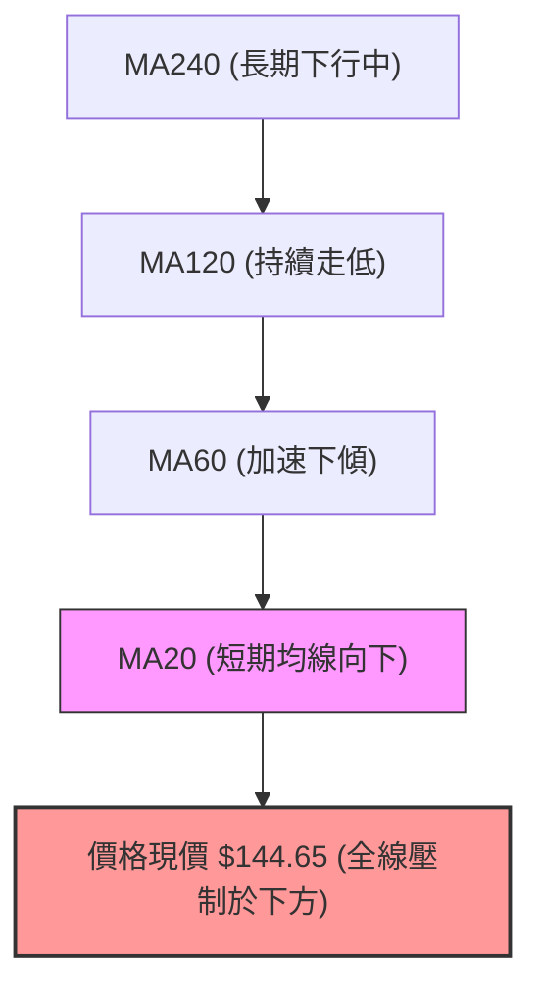

- **均線排列狀態**：
  數據顯示 MA5、MA10、MA20、MA60、MA120、MA240 的走勢 Sparkline 全面呈現自高檔滑落形態（如 MA240 由 `███▇▇▇` 下降至 `▂▂▁▁▁`），均線系統整體為標準的空頭排列發散態勢。
- **動態阻力效應**：
  短期任何技術性反抽，均將在第一道動態均線（MA20）遭遇獲利盤與解套盤的雙重拋壓。

### 📉 RSI(14) 分析

- **週線 RSI(14) 進度條**：
  `███░░░░░░░░░░░░░░░░░` **16.9 / 100 (極端超賣區 🟢)**
- **區間評估**：
  一般而言，RSI 低於 30 即進入超賣，AVAV 近三週週線 RSI 分別為 50.6 → 21.9 → **16.9**，呈現罕見的極度超賣。
- **背離判斷**：
  - **日線背離**：無明顯底背離（價格創新低，日線 RSI 同步下探）。
  - **週線背離**：2026-06-28 低點 $137.95 時週 RSI 為 20.2，當前價格 $144.65 高於當時，但 RSI 卻降至 16.9。**此為「指標弱勢超跌」而非典型多頭底背離**，顯示下行動能依然猛烈，尚未出現指標勾頭向上之底背離確認訊號。

### 📊 MACD(12/26/9) 訊號解讀

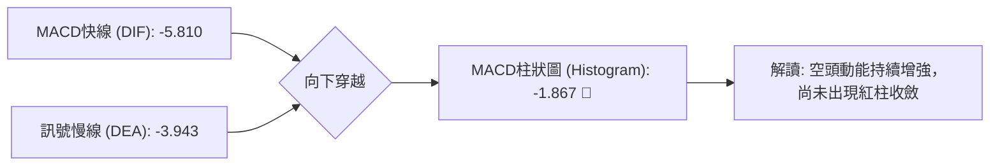

- **數值分析**：
  - MACD Line (DIF) = **-5.810**
  - Signal Line (DEA) = **-3.943**
  - Histogram = **-1.867**
- **訊號解析**：
  MACD 柱狀圖連續處於負值區間且持續向下發散（週線柱狀體亦由 2026-08-09 之 +4.396 逆轉為 -2.334），確認空方目前握有絕對發球權，短期內不具備 MACD 金叉條件。

### 📦 布林通道分析

```
AVAV 概念布林通道結構示意圖
════════════════════════════════════════════════════════════════
$195.69 ───────────────────────────────── 布林上軌 (動態阻力帶)
           ╲
            ╲
$170.00 ─────╲─────────────────────────── 布林中軌 (MA20 基準線)
              ╲
               ╲
$144.65 ────────●──────────────────────── 現價逼近布林下軌 (下軌處於測試中)
                 ╲
$135.20 ──────────┴────────────────────── 52週低點極限防守線
════════════════════════════════════════════════════════════════
```

- **通道形態**：
  因價格自 8 月中旬 $192.81 直流下墜至 $144.65，布林通道呈現開口擴大向下態勢。
- **價格軌道位置**：
  現價高度貼近布林通道下軌運行，屬於空頭「沿下軌走低」的強弱勢特徵。此時不可單憑觸及下軌即盲目進場，需等待 K 線收復中軌或出現止跌長下影線。

### 💹 成交量分析（量價配合度）

- **量能異動特徵**：
  - 最新成交量：**1,983,083 股**
  - 20日均量：**1,271,934 股**
  - **成交量比：1.56x**（明顯放量下殺）
- **OBV（能量潮）狀態**：
  官方數據明確指出：「**OBV < MA → 量能疲弱**」。
- **量價背離分析**：
  在過去 4 週的下跌過程中，成交量由 5.65M、5.98M 攀升至最新週的 7.32M。價跌量增顯示籌碼呈現淨流出狀態，法人機構（持股佔比高達 88.0%）在當前價位存在持續減碼動作，尚未出現縮量惜售的量價底背離特徵。

---

## 6. 動能與波動率

### ⚡ 動能評估

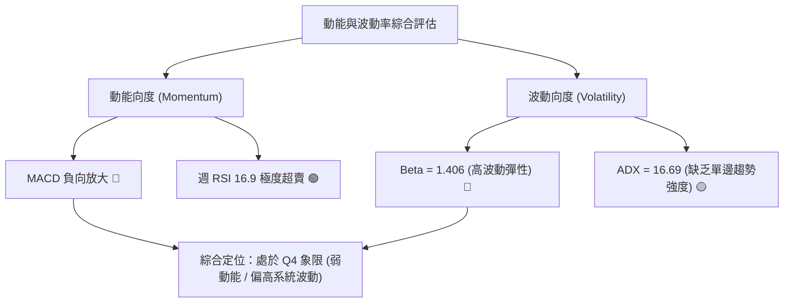

**動能與波動象限分佈矩陣**：

| 象限 | 動能維度 | 波動維度 | 當前狀態 | 交易應對指導 |
|------|----------|----------|----------|--------------|
| **Q1** | 強 (多頭) | 低 (穩定) | — | 趨勢穩健加碼區 |
| **Q2** | 弱 (空頭) | 低 (盤整) | — | 窄幅觀望休整區 |
| **Q3** | 強 (多頭) | 高 (劇烈) | — | 突破追價高風險區 |
| **Q4** | **弱 (空方佔優)** | **高 (Beta 1.406)** | **✓ (當前定位)** | **嚴禁重倉追單，嚴格執行防守停損** |

### 📊 ATR 波動率分析

- **ATR 數值狀態**：
  數據中 ATR 標注為未收斂，但透過近期週收盤價差可推算出週均波幅：
  - 2026-08-16 高點 $192.81 至 2026-09-06 現價 $144.65，3 週跌去 $48.16，週均振幅約為 **$16.05**。
- **止損距離設計建議**：
  基於當前高波動特性，短期波動緩衝空間應設定於 $135.20（52W Low）下方約 3%–4% 區間，即絕對風控停損點必須設立於 **$131.14**，以防假跌破洗盤。

### 📐 Beta 與市場相關性

- **Beta 係數**：**1.406**
- **特性分析**：
  AVAV 屬於高 Beta 國防科技概念股，其波動幅度為標普500指數的 1.4 倍以上。當大盤拉回時，該股容易承受放大級別的賣壓；反之，若板塊迎來催化劑反彈，其反抽彈性亦將極其劇烈。
- **放空比例 (Short % Float)**：**9.6%**（Short Ratio 2.81）。空頭持倉部位偏高，若價格守住 $135.20-$137.95 區間並出現利多，具備引發局部軋空（Short Squeeze）的籌碼條件。

---

## 7. 多時框架總結

### 📋 時框架評分表

| 時框架 | 趨勢方向 | 動能表現 | 均線排列 | 形態結構 | 綜合評分 | 戰略建議 |
|--------|----------|----------|----------|----------|----------|----------|
| **長期 (月線)** | 🔴 空頭修復 | 弱勢下行 | 空頭下傾發散 | 高檔雙頂跌破後的修復期 | 30/100 | 嚴格防守，不宜盲目長線抄底 |
| **中期 (週線)** | 🟡 寬幅箱體 | 極端超賣 (RSI 16.9) | 承壓於 MA 之下 | 箱體下軌支撐測試 ($135-$138) | 42/100 | 密切觀察箱體下軌企穩訊號 |
| **短期 (日線)** | 🔴 空方釋放 | MACD 負柱放大 | 跌破所有短均 | 放量黑K加速下探 | 35/100 | 順勢偏空防守，等待打底完成 |

### 🔲 綜合訊號矩陣

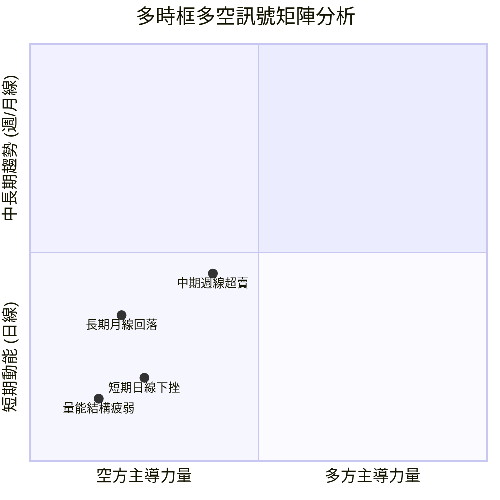

### ⚖️ 多時框收斂結論（依嚴格規則 14）

1. **行情性質收斂**：
   - 當前 **ADX(14) 讀數為 16.69**，明確落在 **< 25 區間**。
   - 依據規則 14：「**盤整行情（ADX < 25）：以日線布林通道上下軌為主要交易區間**」，判定當前並非不可逆的單邊瀑布行情，而是處於**中長期寬幅震盪箱體下軌的極限考驗階段**。
2. **時框優先級權衡**：
   - 長期月線雖呈現下行走勢，但日線/週線已極度超賣（週 RSI = 16.9），向下追空的風險收益比極差；
   - 然而，由於均線完全壓制且 OBV 尚未翻揚，不可輕言反轉。
3. **唯一收斂結論**：
   - **偏空弱勢震盪，以防禦性空頭與逢高沽空為主導方向**。任何多頭操作僅能定義為「極端超賣下的反彈對沖交易」，絕非波段翻多。

---

## 8. 交易策略建議

### 🗺️ 策略決策流程圖

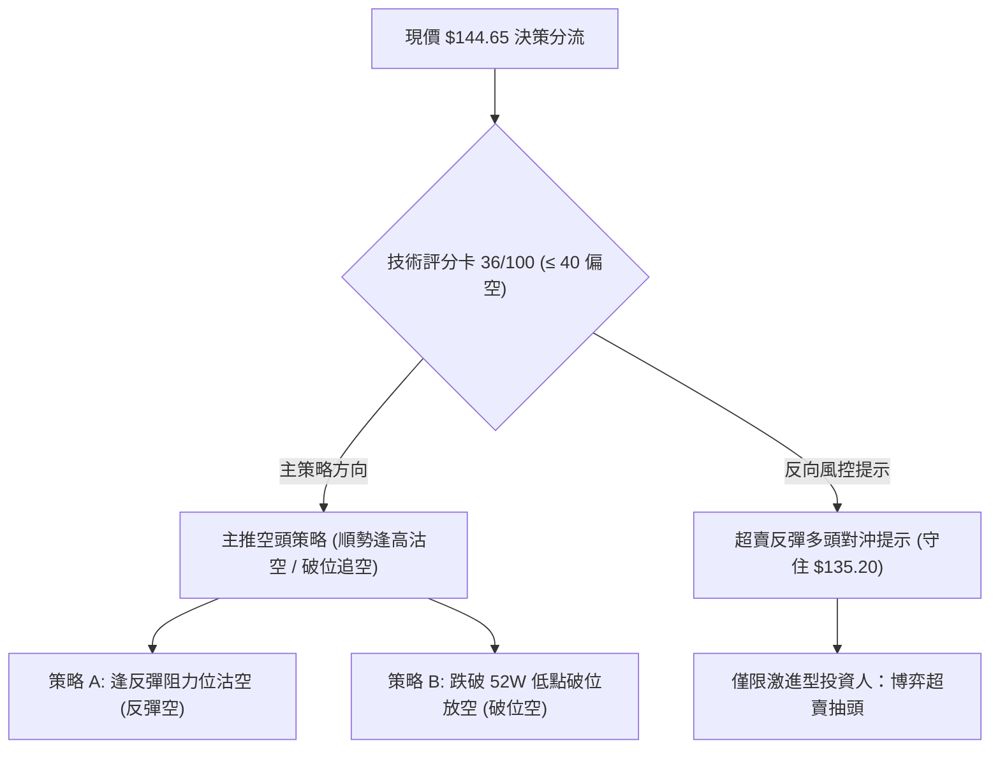

### 🧭 策略路由（依評分卡分流）

> **當前主策略方向 = 偏空主導策略（依技術評分卡 36/100，評級 ≤ 40）**
> 
> 因綜合評分僅 36 分，均線、MACD、OBV 均發出明確空頭警告，本報告**主推空頭策略**。多頭操作僅列為極端超賣環境下的「反轉風險觸發點與對沖參考」。

### 🎯 價格情境階梯（Price Scenarios）

> **所有價位嚴格引用第 4 章及數據包中之精確數值**

| 觸發條件 | 下一目標 | 後續延伸目標 | 情境技術含義 |
|----------|----------|--------------|--------------|
| **跌破 S1 $137.95** | 測試 S2 **$135.20** | 跌破則進入估值真空 | 空方動能貫穿，考驗 52 週最低防線 |
| **跌破 S2 $135.20** | 心理整數 **$120.00** | 尋求歷史更深支撐 | 52週歷史新低破位，觸發大規模停損賣壓 |
| **回抽 R1 $195.69** | 測試 R2 **$243.18** | 邁向 R3 **$276.53** | 多頭完成雙底反轉，奪回 78.6% 關鍵分水嶺 |

### 📊 情境機率分佈

| 情境劇本 | 發生機率 | 主要技術指標依據 |
|----------|----------|------------------|
| **情境一：震盪下探考驗 52W 低點 (主情境)** | **55%** | MACD 柱狀體擴大 (-1.867)，-DI (23.98) > +DI (19.78)，放量收低展現空頭慣性。 |
| **情境二：在 $135.20-$144.65 區間低位打底** | **30%** | ADX = 16.69 顯示單邊動能不足，週線 RSI 16.9 極度超賣限制下行空間。 |
| **情境三：強勢 V 型反彈突破 $195.69** | **15%** | 目前 OBV < MA，量能未翻多，除非重大外生利多催化，否則機率極低。 |

### 🔴 主策略詳情（空頭主導）

| 策略要素 | 策略 A：反彈遇阻放空（勝率優先） | 策略 B：跌破 52W Low 破位追空（動能優先） |
|----------|----------------------------------|-------------------------------------------|
| **交易邏輯** | 趁週線超賣引發反抽至阻力區衰竭時順勢沽空 | 跌破全年度關鍵支撐，順應止損潮動能追空 |
| **進場條件** | 反彈至斐波那契 78.6% 遇阻回落，出現日線長上影線 | 日線收盤價實體有效跌破 52W 低點 $135.20 |
| **進場價格** | **$195.69** (或 $192.81 頸線附近) | **$134.50** (破位確認點) |
| **止損價格** | **$208.00** (突破 2026-05 高點 $207.24 止損) | **$140.00** (重回 S1 $137.95 上方假突破止損) |
| **目標價 T1** | **$144.65** (當前價格水準) | **$120.00** (整數心理支撐) |
| **目標價 T2** | **$135.20** (52週歷史低點) | **$110.00** (歷史波段延伸目標) |
| **風險報酬比** | **1 : 4.15** [($195.69-$144.65) / ($208.00-$195.69)] | **1 : 2.64** [($134.50-$120.00) / ($140.00-$134.50)] |
| **歷史勝率估計** | **65%** | **52%** |
| **建議倉位** | **15% - 20%** | **10% (嚴格風控)** |

### 🟢 反向風險觸發點（對沖多頭提示）

若持有多頭部位或考慮博弈超賣反彈，必須嚴格遵守以下條件：
- **進場觸發點**：價格在 **$135.20 - $137.95** 區間出現日線「巨量長下影晨星」形態。
- **嚴格止損點**：**$131.14**（跌破 52W 低點 3% 立即無條件離場）。
- **第一反彈目標**：**$170.00**（回補下行缺口）。
- **第二反彈目標**：**$195.69**（78.6% 斐波那契回調位，必須全數停利結清）。

### ⭐ 整體訊號強度評星

```
╔══════════════════════════════════════════════════════════╗
║ 做多訊號強度：★★☆☆☆  (2/5 星 - 僅有超賣優勢，缺乏結構)  ║
║ 做空訊號強度：★★★★☆  (4/5 星 - 均線/MACD/量能全面壓制)   ║
║ 整體可信度：  ★★★★☆  (4/5 星 - 數據收斂一致性高)       ║
╚══════════════════════════════════════════════════════════╝
```

---

## 9. 風險提示與監控

### ✅ 關鍵監控指標 Checklist

```
╔══════════════════════════════════════════════════════════════════╗
║                 AVAV 交易日常風險監控清單                         ║
╠══════════════════════════════════════════════════════════════════╣
║ [ ] 52W 低點保衛戰：收盤價是否跌破 $135.20？ (破位信號)          ║
║ [ ] 週線 RSI(14) 變動：是否由 16.9 向上勾頭突破 30？ (軋空信號)   ║
║ [ ] 成交量異動：成交量是否突破 50日均量 1,648,974 達 2 倍以上？   ║
║ [ ] MACD 柱狀體：負柱是否由 -1.867 開始顯著收斂縮短？            ║
║ [ ] 空頭回補壓力：空單佔浮動股 9.6% 是否引發急速軋空衝過 $160？  ║
╚══════════════════════════════════════════════════════════════════╝
```

### ⚠️ 風險場景分析

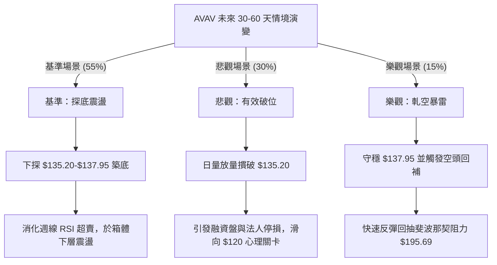

### 🛡️ 風險管理重要提醒

1. **基本面巨額虧損拖累**：
   數據顯示 AVAV 當前 TTM EPS 為 **$-5.4**，淨利率為 **-13.4%**，自由現金流為 **$-251.39M**。技術面下挫本質上反映了基本面現金消耗與獲利能力的惡化，切勿以「跌深即是便宜」的心態逆勢盲目抗單。
2. **高 Beta 波動懲罰**：
   該股 Beta 為 1.406，個股單日振幅極大，**單筆交易最大虧損嚴格限制在總資產的 1.5% 以內**。
3. **區間邊界嚴守紀律**：
   當前價格 $144.65 距離終極底限 $135.20 僅一步之遙，若失守該點，不可心存僥倖，必須嚴格執行風控退出。

---

## 📋 報告總結

```
AVAV 技術分析報告總結
════════════════════════════════════════════════════════════════
報告日期：2026-09-09
當前價格：$144.65
分析評級：⚖️ 偏空震盪探底（技術評分：36/100 🔴）

關鍵結論：
├─ 長期趨勢：🔴 空頭主導（由歷史高點 $369.91 回落逾 60%）
├─ 中期趨勢：🟡 寬幅箱體震盪（$135.20 - $195.69 區間）
├─ 短期趨勢：🔴 慣性向下尋底（均線全面壓制，MACD擴散）
├─ 關鍵支撐：S1: $137.95 ｜ S2 (52W Low): $135.20
├─ 關鍵阻力：R1 (Fib 78.6%): $195.69 ｜ R2 (Fib 61.8%): $243.18
└─ 分析師目標共識：平均 $225.77 ｜ 最低 $148.57 ｜ 最高 $326.00

最優策略組合：
1. 🥇 主推首選：策略 A（逢反彈至 $192.81-$195.69 阻力區遇阻放空）
2. 🥈 次選機會：策略 B（有效跌破 52W 低點 $135.20 順勢破位追空）
3. 🥉 對沖防守：在 $135.20-$137.95 出現止跌信號時計劃極輕倉博弈超跌反彈
════════════════════════════════════════════════════════════════
```

---

> ⚠️ **免責聲明**：本報告為技術分析研究成果，所有數據及推演均嚴格基於所提供的歷史交易價格與技術指標資訊。本報告**僅供學術研究與投資架構參考**，**不構成任何形式的要約、招攬或實質投資建議**。金融市場瞬息萬變，交易決策應審慎評估個人風險承受能力，入市需謹慎。

---

*報告生成時間：2026-09-09 ｜ 數據來源：Yahoo Finance ｜ 分析框架：多時框架量化技術分析*