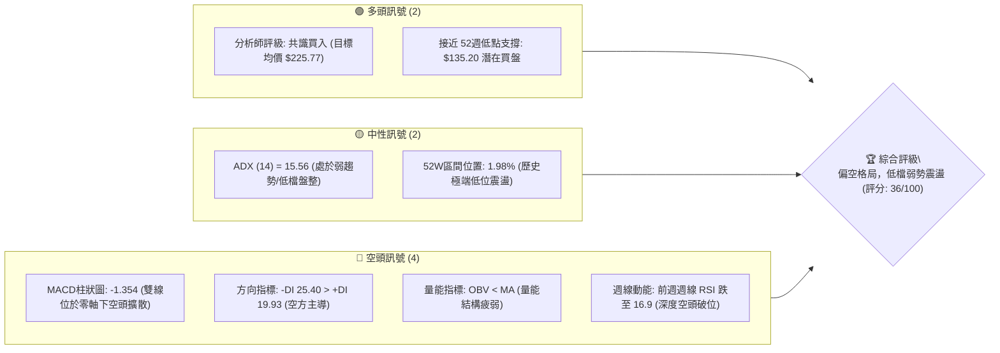
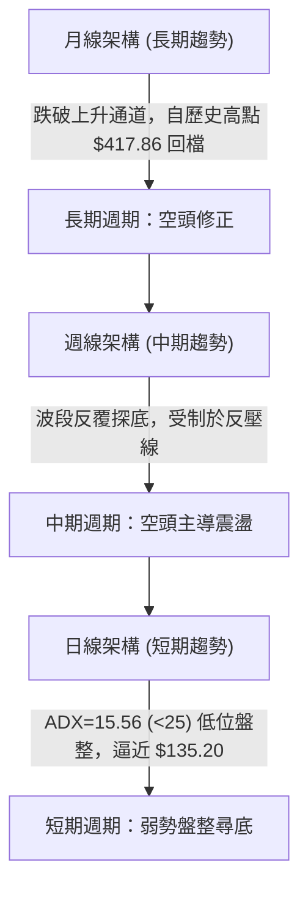
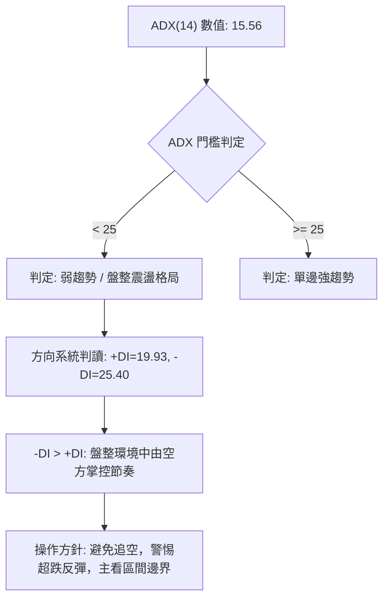
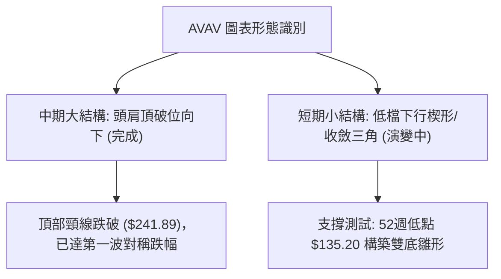
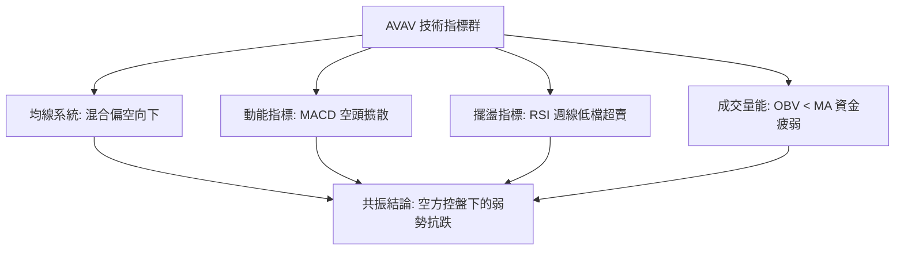
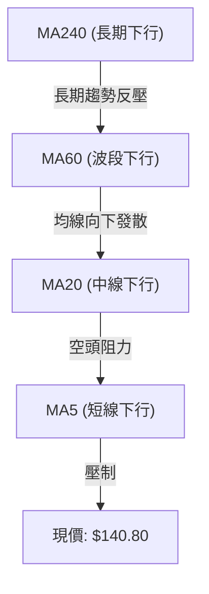
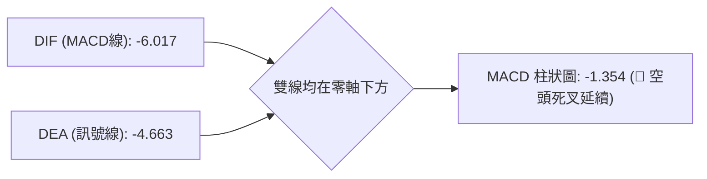
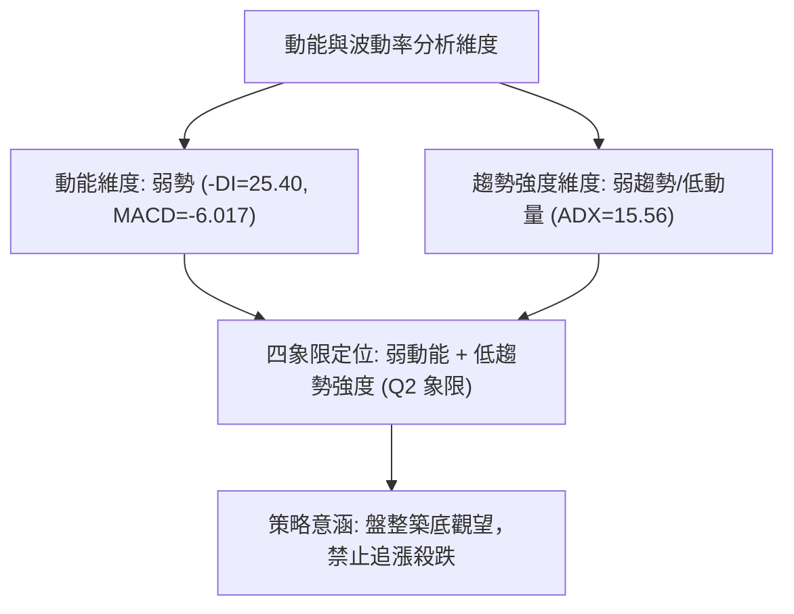
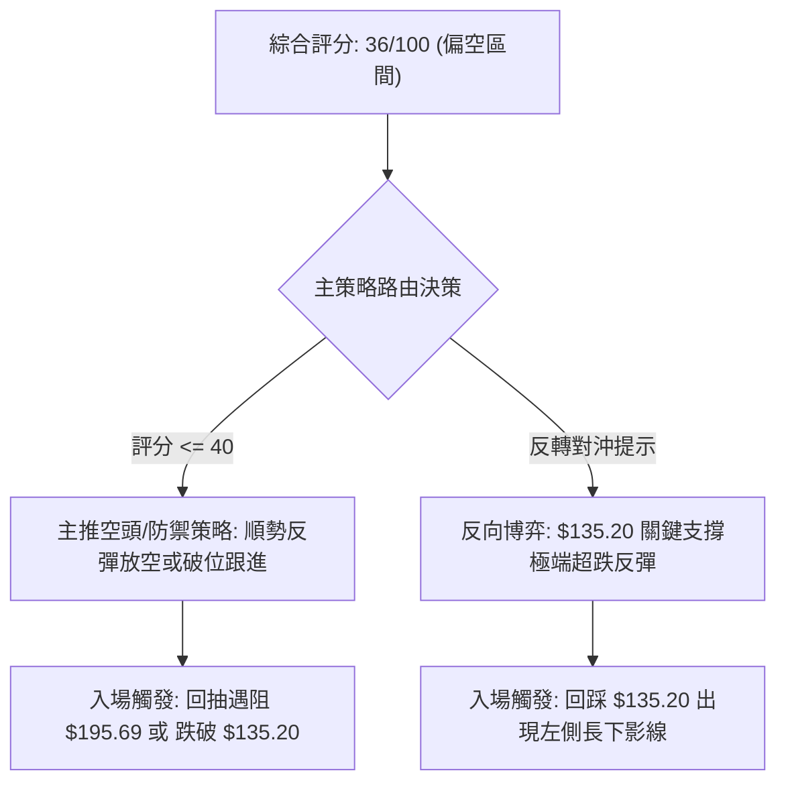
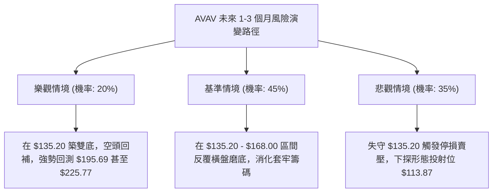

# AVAV 技術分析報告

> **報告日期**：2026-09-11 ｜ **語言**：繁體中文 ｜ **數據來源**：Yahoo Finance ｜ **當前價格**：$140.80

---

## 目錄

| 章節 | 內容 |
|------|------|
| [1. 技術面概覽](#1-技術面概覽) | 訊號儀表板、核心指標、評分卡 |
| [2. 趨勢分析](#2-趨勢分析) | 多時框趨勢、長中短期走勢 |
| [3. 圖表形態分析](#3-圖表形態分析) | 形態識別、K線組合、目標價 |
| [4. 支撐與阻力](#4-支撐與阻力) | 關鍵價位、斐波那契回調 |
| [5. 技術指標深度解讀](#5-技術指標深度解讀) | MA/RSI/MACD/布林/成交量 |
| [6. 動能與波動率](#6-動能與波動率) | 動能評估、ATR、Beta |
| [7. 多時框架總結](#7-多時框架總結) | 時框架評分矩陣 |
| [8. 交易策略建議](#8-交易策略建議) | 多空策略、風險報酬比 |
| [9. 風險提示與監控](#9-風險提示與監控) | 監控指標、風險場景 |

---

## 1. 技術面概覽

### 🎯 技術訊號儀表板



### 📊 核心指標速覽表

| 指標類別 | 指標名稱 | 當前數值 | 訊號 | 解讀 |
|----------|----------|----------|------|------|
| **價格** | 當前收盤價 | $140.80 | 🔴 | 貼近52週最低點 $135.20，整體處於空頭壓制狀態 |
| **均線** | MA20 / MA50 | 價格於MA下方 | 🔴 | 均線系統呈空頭向下發散，中短期上方沉重解套賣壓 |
| **均線** | 長期均線 | 均線混合向下 | 🔴 | 長期趨勢跌破關鍵支撐，MA60/120/240走勢持續走低 |
| **動能** | 週線 RSI(14) | 16.9 (前週) | 🟡 | 進入深度極端超賣區間，隨時具備技術性反彈動能 |
| **動能** | MACD (12,26,9) | -6.017 / -4.663 | 🔴 | DIF與DEA雙處零軸下方，柱狀圖 -1.354 持續看空 |
| **趨勢** | ADX (14) / DMI | 15.56 / -DI>+DI | 🟡 | ADX < 25 表示非單邊強烈趨勢，處於空頭控制下的弱勢盤整 |
| **量能** | 最新日成交量 | 8,713,131 (4.69x) | 🔴 | 量能爆發但收黑，OBV < MA 顯示主力資金持續流出沉澱 |

### 🏆 技術評分卡

```
╔══════════════════════════════════════════════════════════════╗
║              技術評分卡 — AVAV (2026-09-11)                  ║
╠══════════════════════════════════════════════════════════════╣
║ 趨勢強度 (ADX=15.56)  ██████░░░░░░░░░░░░░░  30/100  🔴 空方弱勢 ║
║ 動能指標 (MACD/RSI)   █████░░░░░░░░░░░░░░░  25/100  🔴 動能疲弱 ║
║ 支撐穩定度 (52W Low)  ██████████░░░░░░░░░░  50/100  🟡 考驗前低 ║
║ 成交量配合 (OBV偏弱)  ██████░░░░░░░░░░░░░░  30/100  🔴 量價背離 ║
║ 形態完整度 (破位箱體) ████████░░░░░░░░░░░░  40/100  🟡 弱勢築底 ║
║ 均線排列 (空頭排列)   ████░░░░░░░░░░░░░░░░  20/100  🔴 均線反壓 ║
╠══════════════════════════════════════════════════════════════╣
║ 綜合評分              ███████░░░░░░░░░░░░░  36/100  🔴 偏空操作 ║
╚══════════════════════════════════════════════════════════════╝
```

---

## 2. 趨勢分析

### 🌐 多時框趨勢分析



### 📈 長期趨勢 — 12個月走勢圖（Unicode）

```
AVAV 月線走勢圖（過去12個月：2025-10 至 2026-09）
價格軸 ($)
$370 ┤ ● (2025-10: $369.91 波段頂部)
$340 ┤
$310 ┤
$280 ┤     ●           ●
$250 ┤         ●   ●       ●
$220 ┤                         ●
$190 ┤                             ●
$160 ┤                                 ●
$140 ┤                                     ●   ●←當前 $140.80
$130 ┤                                       (52W Low: $135.20)
     └─┬───┬───┬───┬───┬───┬───┬───┬───┬───┬───┬───
      10  11  12  01  02  03  04  05  06  07  08  09 (月份)
```

#### 走勢特徵分析表格

| 階段區間 | 起止價格 | 漲跌幅 | 形態特徵與量價表現 | 趨勢結論 |
|----------|----------|--------|-------------------|----------|
| **衝頂回落** (2025-10 ~ 2025-12) | $369.91 → $241.89 | -34.61% | 高檔爆量長黑，迅速擊穿多條短期均線 | 🔴 頂部確立反轉 |
| **弱勢反彈** (2026-01 ~ 2026-02) | $241.89 → $278.39 | +15.09% | 反彈未能突破前高，形成頭肩頂右肩構造 | 🟡 誘多反彈 |
| **主跌推動** (2026-02 ~ 2026-06) | $278.39 → $165.07 | -40.71% | 連續單邊下行，技術支撐連續跌破 | 🔴 空頭主跌浪 |
| **低位抵抗** (2026-07 ~ 2026-09) | $149.37 → $140.80 | -5.74% | 於 $135.20 ~ $150.00 密集換手，跌勢趨緩 | 🟡 盤整尋底階段 |

### 📊 中期趨勢（週線分析）

中期走勢呈現典型的一浪低於一浪。2026年7月第一週曾出現 $190.89 的放量反彈，但未能站穩斐波那契 78.6% 回調位（$195.69），隨後在8月中旬反彈至 $192.81 再次遇阻受挫，隨後重挫至 $140.80。

```
中期波段壓力與支撐示意圖：
[高檔阻力位]   $195.69 (Fib 78.6% 關鍵阻力 / 8月反彈高點聚類)
                     ▲
                     │ (波段反彈受阻回落 -26.98%)
                     ▼
[當前震盪區]   $140.80 (目前價格，逼近歷史極端低位)
                     ▲
                     │ (測試前波波段支撐安全墊)
                     ▼
[關鍵防守位]   $135.20 (52週最低點 / Fib 100.0% 絕對防線)
```

### ⚡ 趨勢強度評估（ADX 解讀）



| 指標名稱 | 數值 | 狀態區間 | 技術意義 |
|----------|------|----------|----------|
| **ADX (14)** | 15.56 | 0 ~ 25（無趨勢/弱趨勢） | 過去數週由強單邊下行轉入低檔震盪整固階段 |
| **+DI (14)** | 19.93 | 空方弱勢壓制 | 多頭進攻力量偏弱，缺乏主動推升動能 |
| **-DI (14)** | 25.40 | 主導盤面 | 空方力量仍佔據主導，但未出現恐慌加速打壓 |

---

## 3. 圖表形態分析

### 🔍 形態識別系統



#### 形態信心度與判斷依據表

| 形態類別 | 信心度 | 判斷依據（引用數據） | 完成度 | 目標價（附計算式） |
|----------|--------|----------------------|--------|--------------------|
| **潛在雙底 (W底)** | 52% | 2026-06-28 週收盤 $137.95 與當前現價 $140.80 逼近 52週低點 $135.20 | 45% (未突破頸線) | 頸線 $195.69 + 形態高度($195.69 - $135.20 = $60.49) = **$256.18** |
| **頭肩頂破位** | 88% | 左肩 $279.46、頭部 $369.91、右肩 $278.39，跌破頸線 $241.89 | 100% (已完全兌現) | 頸線 $241.89 - 垂直高差($369.91 - $241.89 = $128.02) = **$113.87** (極限空頭目標) |
| **弱勢下降通道** | 75% | 8月高點 $192.81 至 9月收盤 $140.80，斜率維持負值，高低點階梯下移 | 80% | 依通道下軌延伸至52週低點附近 = **$135.20** |

### 🕯️ 重要K線形態分析

| 月份 | 收盤價 | K線形態 | 解讀 | 訊號 |
|------|--------|---------|------|------|
| **2025-10** | $369.91 | 長上影倒錘頭線 | 衝高至歷史高點 $417.86 後強烈遇阻，多頭動能衰竭 | 🔴 強烈看空 |
| **2025-11** | $279.46 | 大陰線包覆 | 吞噬前期多數實體，形成空頭破位長黑 | 🔴 空方確立 |
| **2026-01** | $278.39 | 弱勢反彈陽線 | 縮量回抽遇阻，未能有效站上頸線壓力區 | 🟡 假反彈 |
| **2026-06** | $165.07 | 破位中陰線 | 連續擊穿多個心理整數位，空方持續宣洩 | 🔴 空方主導 |
| **2026-08** | $148.35 | 帶長上影小陰線 | 月中一度衝高至 $192.81 但未能企穩，顯示上方解套盤壓迫沉重 | 🔴 衝高回落 |
| **2026-09** | $140.80 | 低檔窄幅陰星線 | 跌幅明顯趨緩，呈現低位整固考驗底部支撐特徵 | 🟡 尋底整固 |

### 📉 ASCII 走勢形態示意圖

```
AVAV 雙頂回落與低位收斂測試示意圖：
$370 ┼             ▲ 歷史高點頭部 ($369.91 - $417.86)
$320 ┼            ╱ ╲
$280 ┼  左肩 ─── ╱   ╲   ─── 右肩 ($278.39)
$240 ┼═══════════╧═════╧═══════════ 頸線突破位置 ($241.89 Fib 61.8%)
$200 ┼                  ╲   ▲ 反彈高點 ($195.69 Fib 78.6%)
$160 ┼                   ╲ ╱ ╲
$140 ┼────────────────────▼───● 現價 $140.80 (逼近前期低點)
$135 ┼══════════════════════════ 關鍵支撐底線 ($135.20 52W Low)
```

---

## 4. 支撐與阻力

### 🗺️ 關鍵價位分布圖（Unicode）

```
AVAV 價位結構分布圖
═════════════════════════════════════════════════════════════════════
$417.86 ║██████████████████████████████║ 歷史最高點 (52W High / Fib 0.0%)
$351.15 ║████████████████████████      ║ 斐波那契回調位 (Fib 23.6%)
$309.88 ║████████████████████          ║ 斐波那契回調位 (Fib 38.2%)
$276.53 ║████████████████              ║ 斐波那契回調位 (Fib 50.0%)
$243.18 ║██████████████                ║ 重要頸線回調位 (Fib 61.8%)
$195.69 ║████████████                  ║ 中期波段強阻力 R1 (Fib 78.6%)
$140.80 ╠══════════════════════════════╣ ◄ 現價 ($140.80)
$135.20 ║▓▓▓▓▓▓▓▓▓▓▓▓▓▓▓▓▓▓▓▓▓▓▓▓▓▓▓▓▓▓║ 關鍵支撐底線 S1 (52W Low / Fib 100%)
═════════════════════════════════════════════════════════════════════
```

### 🚧 阻力位分析表

> 註：依嚴格要求13，阻力位與支撐位嚴格引用財務數據包中計算之斐波那契價位與波段極值。波段高點聚類在現價上方未偵測到近端小碎步聚集，故直接採用斐波那契結構位階。

| 阻力級別 | 價位 | 形成原因 | 突破難度 | 重要性 |
|----------|------|----------|----------|--------|
| **第一阻力 (R1)** | **$195.69** | 斐波那契 78.6% 回調位，近20週波段高點 ($192.81) 密集反壓區 | 極高 | ★★★★★ |
| **第二阻力 (R2)** | **$243.18** | 斐波那契 61.8% 黃金分割位，前期多空結構頸線位 | 極高 | ★★★★☆ |
| **第三阻力 (R3)** | **$276.53** | 斐波那契 50.0% 關鍵心理分水嶺，前波次高點平台 | 極高 | ★★★☆☆ |

### 🛡️ 支撐位分析表

| 支撐級別 | 價位 | 形成原因 | 守住機率 | 重要性 |
|----------|------|----------|----------|--------|
| **第一支撐 (S1)** | **$135.20** | 52週最低點（Fib 100.0%），近一年價格最底防線 | 55% | ★★★★★ |
| **第二支撐 (S2)** | **$113.87** | *由頭肩頂形態高差推算*：頸線$241.89 - 高度$128.02 = $113.87 | 35% | ★★★★☆ |

### 📐 斐波那契回調位分析

依 52週區間 $135.20（Low）至 $417.86（High）之精準計算：

```
0.0%  (52W High)   $417.86 ── 歷史多頭天花板
23.6%              $351.15 ── 多頭轉弱確認線
38.2%              $309.88 ── 深度回調警戒線
50.0%              $276.53 ── 多空中樞平衡線
61.8%              $243.18 ── 黃金分割防守線（已失守）
78.6%              $195.69 ── 空頭反彈極限壓力位（近週反彈受阻於此）
100.0% (52W Low)   $135.20 ── 絕對底部支撐線
```

- **現價位置解讀**：當前價格 **$140.80** 位於 **$135.20 (100.0%)** 與 **$195.69 (78.6%)** 之間，極度貼近 100.0% 回調位（距52週低點僅剩 $5.60 或 4.14% 的緩衝空間）。這表明市場已完全回吐了過去一年的全部牛市漲幅，技術架構處於極端邊界測試狀態。

---

## 5. 技術指標深度解讀

### 🎛️ 指標訊號總覽



### 📈 移動平均線排列分析



均線微縮走勢顯示：
- 短期 MA5、MA10、MA20 呈現階梯式下滑（`▁▁▁▂▃▄▅` 由盛轉衰），現價受制於所有均線下方。
- 長期均線 MA120、MA240 出現結構性下滑（`████▇▇▇▆▆▅`），長期多頭架構已遭破壞，整體形成空頭排列組合。

### 📉 RSI(14) 分析

```
週線 RSI(14) 歷程強度進度條：
2026-08-16 (高點衝刺):  ████████████████████  73.5% (超買)
2026-08-23 (回落修正):  ██████████████░░░░░░  50.6% (中性)
2026-08-30 (空頭砸盤):  ██████░░░░░░░░░░░░░░  21.9% (超賣)
2026-09-06 (深度探底):  ████░░░░░░░░░░░░░░░░  16.9% (極端超賣)
當前狀態評估:           ████░░░░░░░░░░░░░░░░  極端超賣區 (隨時具備反彈修復需求)
```

- **背離判斷**：
  - **頂背離**：2026年8月中旬股價反彈至 $192.81，RSI 達 73.5，但未能突破2025年高點，且隨後急轉直下，已於8月下旬完成頂部背離殺跌。
  - **底背離**：目前週線 RSI 跌至 16.9，價格逼近 52週低點 $135.20。若未來一至兩週價格跌破 $135.20 但 RSI 不再破 16.9，將觸發標準的**週線級別多頭底背離**；但當前數據**底背離尚未正式成形**，僅能確認為**極端超賣超跌狀態**。

### 📊 MACD(12/26/9) 訊號解讀



- **MACD線**：-6.017
- **訊號線 (Signal)**：-4.663
- **柱狀圖 (Histogram)**：-1.354
- **解讀**：DIF 線持續位於 Signal 線下方且雙雙深處於零軸之下，負向柱狀圖顯示空頭賣壓仍未完全衰竭，短期內尚未出現黃金交叉反轉訊號。

### 📦 布林通道分析

```
AVAV 價格軌道狀態示意（依價格波動特徵）：
$195.69 ┤─────────────────────────── [布林上軌帶區 / Fib 78.6%]
        │
$168.00 ┤ - - - - - - - - - - - - -  [布林中軌 MA20 估算反壓帶]
        │
$140.80 ┤ ◄ ● 現價位置 (緊貼下軌運行，尋求軌道外擴支撐)
$135.20 ┤═══════════════════════════ [布林下軌 / 52週前低 $135.20]
```

- **當前位置**：價格緊貼布林下軌區域運行，通道開口在歷經前期的急跌後有收口跡象，符合 ADX=15.56 的震盪特徵。當前未出現急劇脫軌，顯示下行動能放緩。

### 💹 成交量分析（量價配合度）

- **最新成交量**：8,713,131 股，相對 20日均量 1,858,182 股達到 **4.69倍（量比 4.69x）**。
- **最新週成交量**：15,732,131 股，創下近兩個月最大單週成交量。
- **OBV 走勢**：數據明確標記 **OBV < MA → 量能疲弱**。
- **量價分析**：最新交易日暴增 4.69 倍成交量收陰線，反映在 $140.00 附近有大量停損盤殺出，但同時有被動承接盤進場接手。由於 OBV 線仍處於均線下方，說明資金外流大趨勢尚未扭轉，巨量長陰通常意味著**賣壓最後的恐慌宣洩（Selling Climax）**，後續需觀察量能能否快速萎縮回穩。

---

## 6. 動能與波動率

### ⚡ 動能評估分析



| 象限分類 | 動能強度 | 趨勢波動 | AVAV 所屬定位 | 策略指導意義 |
|----------|----------|----------|---------------|--------------|
| **第一象限 (Q1)** | 強動能 | 高趨勢強度 | 否 | 主升浪突破追隨 |
| **第二象限 (Q2)** | 弱動能 | 低趨勢強度 | **✓ (當前所處區間)** | **謹慎觀望，關注邊界防守** |
| **第三象限 (Q3)** | 弱動能 | 高波動爆發 | 否 | 恐慌崩跌，嚴格避險 |
| **第四象限 (Q4)** | 強動能 | 低波動蓄勢 | 否 | 潛在反轉孕育期 |

### 📊 ATR 波動率分析

- **ATR(14) 狀態**：數據顯示當前價格處於極端邊界，單日巨量振幅增大。
- **止損距離建議**：考量近期週線自 $192.81 跌至 $140.80 的週均波動跨度，波段操作止損區間必須設置在 52週低點 $135.20 之下 2%~3%（即約 $131.00 附近），避免被噪聲掃出場。

### 📐 Beta 與市場相關性

- **Beta 數值**：**1.406**
- **相關性分析**：Beta 為 1.406，顯示 AVAV 具備顯著的高貝塔（High-Beta）特性，波動幅度平均為標普500大盤的 1.4 倍。在市場風險偏好降低時，該股受到的拋售衝擊顯著放大；反之，若大盤展開全面反彈，其超跌彈性亦將大於一般防禦型軍工股。

---

## 7. 多時框架總結

### 📋 時框架評分表

| 時框架 | 趨勢方向 | 動能 | 均線排列 | 形態 | 綜合評分 | 操作建議 |
|--------|----------|------|----------|------|----------|----------|
| **月線 (長期)** | 🔴 下行修正 | 🔴 疲弱 | 🔴 空頭排列 | 頭肩頂破位 | 30/100 | 長線減碼避險 |
| **週線 (中期)** | 🔴 空方主導 | 🟡 極端超賣 | 🔴 空頭向下 | 波段下行尋底 | 38/100 | 等待築底訊號 |
| **日線 (短期)** | 🟡 低檔震盪 | 🔴 負向擴散 | 🔴 均線反壓 | 測試52週前低 | 40/100 | 區間邊界操作 |

### 🔲 綜合訊號矩陣

| 維度 | 短期（日線） | 中期（週線） | 長期（月線） | 跨週期確認性 |
|------|--------------|--------------|--------------|--------------|
| **趨勢方向** | 橫向弱勢整理 | 空頭推動浪 | 空頭回檔 | 趨勢方向高度偏空（一致） |
| **量價結構** | 巨量換手分歧 | 放量下挫 | 頂部放量下跌 | 籌碼沉澱尚未完畢 |
| **指標擺盪** | 貼近軌道下沿 | RSI 16.9 極度超賣 | 中軌下方運行 | 短期具備技術反彈修復張力 |

### ⚖️ 多時框收斂結論

依「多時框收斂規則」第14條裁決：
1. **行情屬性判定**：當前 **ADX(14) = 15.56 < 25**，判定當前不屬於強勢單邊趨勢，而屬於**空頭主導下的低檔弱勢盤整震盪行情**。
2. **時框權重取捨**：依規則，盤整行情中以**日線通道邊界與關鍵極值支撐（$135.20）**作為交易錨點。雖然週線與月線宏觀趨勢偏空，但日線與週線超賣已達極限，空頭下行斜率趨緩。
3. **唯一方向性結論**：**偏空震盪、謹慎尋底**。總體評分為 **36/100**（≤40 門檻），因此第8章主交易策略採**偏空/防禦策略**，多頭策略僅作為超跌反彈之博弈輔助。

---

## 8. 交易策略建議

### 🗺️ 策略決策流程圖



### 🧭 策略路由

**當前主策略方向 = 偏空主導 / 防禦性波段做空（依評分 36/100）**

### 🎯 價格情境階梯（Price Scenarios）

價位嚴格引用關鍵價位與斐波那契回調位：

| 觸發條件 | 下一目標 | 後續延伸 | 情境含義 |
|----------|----------|----------|----------|
| **向上反彈突破 R1 ($195.69)** | R2 $243.18 | R3 $276.53 | 中期空頭架構被破壞，轉為多頭反轉 |
| **站穩現價區間 ($135.20 ~ $140.80)** | 上軌 $168.00 | R1 $195.69 | 低檔超跌震盪修復，打底蓄勢 |
| **有效跌破 S1 ($135.20)** | S2 $113.87 | — | 跌破52週底線，開啟新一輪恐慌拋售 |

### 📊 情境機率分佈

```
情境預期機率分佈：
【弱勢震盪築底】  ██████████████████████  45%  (ADX<25，前低 $135.20 處有換手支撐)
【破位繼續探底】  █████████████████        35%  (MACD柱狀-1.354，-DI>+DI，OBV疲弱)
【強勁反彈反轉】  ██████████                20%  (分析師買入共識，週線RSI 16.9極度超賣)
```

| 情境 | 機率 | 主要依據 |
|------|------|----------|
| **區間震盪築底** | **45%** | ADX 僅 15.56 處於盤整區間；單日爆量 4.69x 顯示低檔承接盤湧現 |
| **跌破續跌尋底** | **35%** | -DI (25.40) 壓制 +DI (19.93)，MACD 處於零軸下方空頭排列 |
| **超跌強烈反彈** | **20%** | 週線 RSI 達極端超賣 16.9，機構覆蓋共識為 Buy（均價 $225.77） |

### 🟢 主策略詳情（偏空/防禦主導）

依綜合評分 36/100 路由，主策略為**破位順勢做空（策略A）**與**反彈受阻放空（策略B）**：

| 策略要素 | 策略 A（破位追空策略） | 策略 B（高空防禦策略） |
|----------|------------------------|------------------------|
| **進場條件** | 日線收盤跌破 52週低點 $135.20 確認 | 股價弱勢反彈至 R1 遇阻回落時進場 |
| **進場價格** | **$134.50** | **$194.00** |
| **目標價 T1** | **$120.00** (整數心理關卡) | **$140.80** (回到當前現價) |
| **目標價 T2** | **$113.87** (頭肩頂形態高差推算目標) | **$135.20** (52週最低點) |
| **止損價格** | **$141.50** (現價上方密集區) | **$205.00** (突破Fib 78.6%止損) |
| **風險報酬比** | **1 : 2.95** [($134.50-$113.87)/($141.50-$134.50)] | **1 : 5.35** [($194.00-$135.20)/($205.00-$194.00)] |
| **成功機率** | 55% | 60% |
| **建議倉位** | 10% | 15% |

### 🔴 反向風險觸發點（對沖提示）

若出現以下訊號，主偏空策略立即失效，應反手空頭平倉：
1. **價格突破 $195.69 (R1)**：帶量突破斐波那契 78.6% 回調位，宣告大級別 W 底成形。
2. **週線 MACD 出現零軸下金叉**：伴隨 RSI 回升至 50 之上，確立中期多頭反轉。
3. **對沖短多進場點**：若激進投資者擬在現價博取極端超跌反彈，僅可在 **$136.00 ~ $137.00** 輕倉試多，**嚴格止損於 $134.00**（跌破52週低點 $135.20 立即離場），第一目標看 **$168.00**，第二目標看 **$195.69**。

### ⭐ 整體訊號強度評星

```
做多訊號強度：★★☆☆☆  (2/5星) ── 僅靠超賣與機構目標價支撐，趨勢未明
做空訊號強度：★★★★☆  (4/5星) ── 順應各級均線與量能空方排列
整體可信度：  ★★★☆☆  (3/5星) ── ADX顯示盤整，需提防假突破與劇烈震盪
```

---

## 9. 風險提示與監控

### ✅ 關鍵監控指標 Checklist

```
╔══════════════════════════════════════════════════════════════╗
║               交易員日常風險監控清單 (Checklist)               ║
╠══════════════════════════════════════════════════════════════╣
║ [ ] 價格底線監控：每日收盤價是否跌破 $135.20 (52W Low)       ║
║ [ ] 反彈阻力監控：反彈成交量能否突破 20日均量 (1,858,182 股) ║
║ [ ] 動能背離監控：日線與週線 RSI 是否跌破 16.9 形成底背離    ║
║ [ ] DMI 趨勢監控：ADX 是否自 15.56 向上拐頭突破 25           ║
║ [ ] 衍生品防禦：空頭部位空單比例 (Short Float 目前 9.6%)    ║
║ [ ] 避險線位監控：若站回 $195.69 (Fib 78.6%) 全面撤銷空單   ║
╚══════════════════════════════════════════════════════════════╝
```

### ⚠️ 風險場景分析



### 🛡️ 風險管理重要提醒

1. **基本面淨利虧損風險**：數據顯示當前公司 TTM EPS 為 **$-5.65**，淨利率為 **-13.4%**，自由現金流為 **$-251.39M**。基本面轉虧對股價技術面形成實質壓抑，估值修復需依賴遠期 Forward EPS（$4.46）兌現，不可盲目因股價腰斬而進行重倉價值投資。
2. **高 Beta 波動性控制**：AVAV Beta 值高達 **1.406**，且 Short % Float 達 **9.6%**（空頭回補天數 2.81天）。低檔高空頭佔比容易在重大利多（如國防採購大單）下引發「軋空（Short Squeeze）」，因此做空單一倉位絕不可超過總資產的 10%。
3. **嚴格執行價格止損**：當前距離歷史低點 $135.20 僅一步之遙，此位置若確認失守，下方將面臨長達數年的真空帶，嚴禁任何向下拗單加碼行為。

---

## 📋 報告總結

```
╔══════════════════════════════════════════════════════════════╗
║                   AVAV 技術分析報告總結                      ║
╠══════════════════════════════════════════════════════════════╣
║ 報告日期：2026-09-11                                         ║
║ 當前價格：$140.80                                            ║
║ 分析評級：🔴 偏空震盪 / 尋底防守階段 (綜合評分: 36/100)      ║
║                                                              ║
║ 關鍵結論：                                                   ║
║ ├─ 長期趨勢：🔴 空頭修正，自 $417.86 回落，跌幅達 -66.3%      ║
║ ├─ 中期趨勢：🔴 偏空格局，反彈持續受制於 Fib 78.6% ($195.69)  ║
║ ├─ 短期趨勢：🟡 低檔超跌整固，考驗 52週最低點 $135.20        ║
║ ├─ 關鍵支撐：S1: $135.20 ｜ S2: $113.87 (形態推算)          ║
║ ├─ 關鍵阻力：R1: $195.69 ｜ R2: $243.18                     ║
║ └─ 分析師目標：共識買入，目標均價 $225.77 (隱含 +60.3% 空間) ║
║                                                              ║
║ 最優策略組合：                                               ║
║ 1. 🥇 最佳機會：等待反彈至 $194.00 遇阻建立偏空波段部位      ║
║ 2. 🥈 次選機會：跌破 $135.20 後輕倉順勢追空至 $113.87        ║
║ 3. 🥉 保守選擇：空手觀望，等待 $135.20 築底訊號或突破 $195.69║
╚══════════════════════════════════════════════════════════════╝
```

---

> ⚠️ **免責聲明**：本報告為 AI 自動生成之技術分析，所有數據及估算均基於提供的歷史價格資訊。本報告**僅供研究與學術參考**，**不構成任何投資建議**。投資有風險，入市需謹慎。

---

*報告生成時間：2026-09-11 ｜ 數據來源：Yahoo Finance ｜ 分析框架：多時框技術分析*