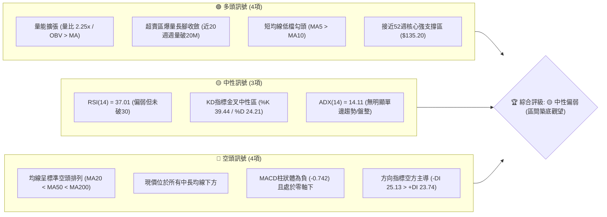
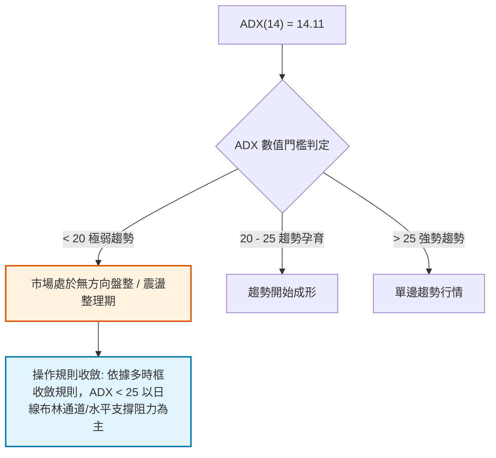
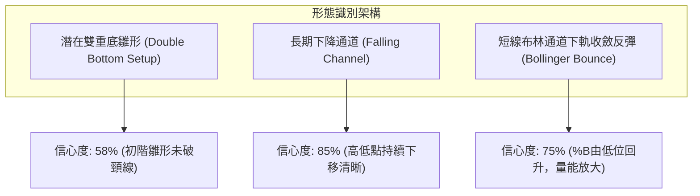
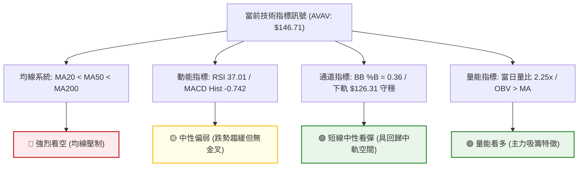
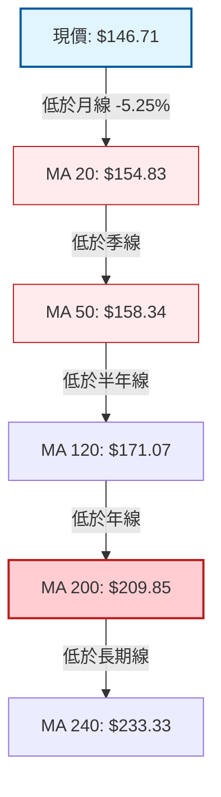
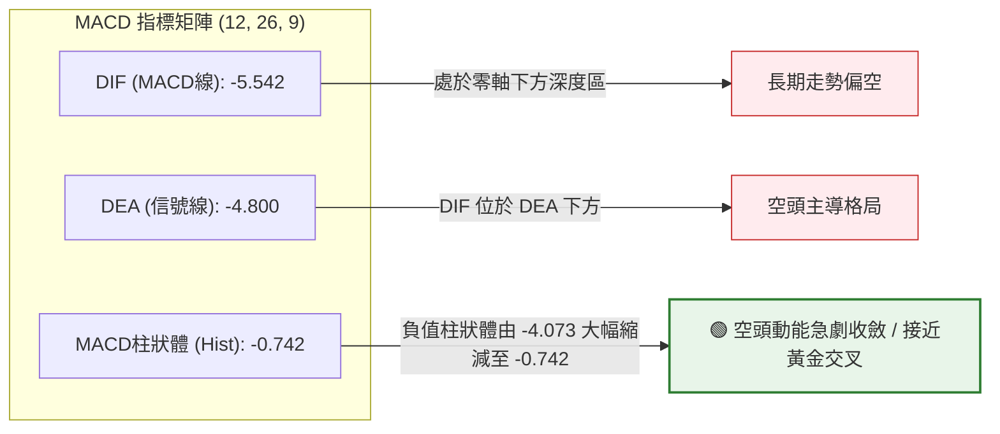
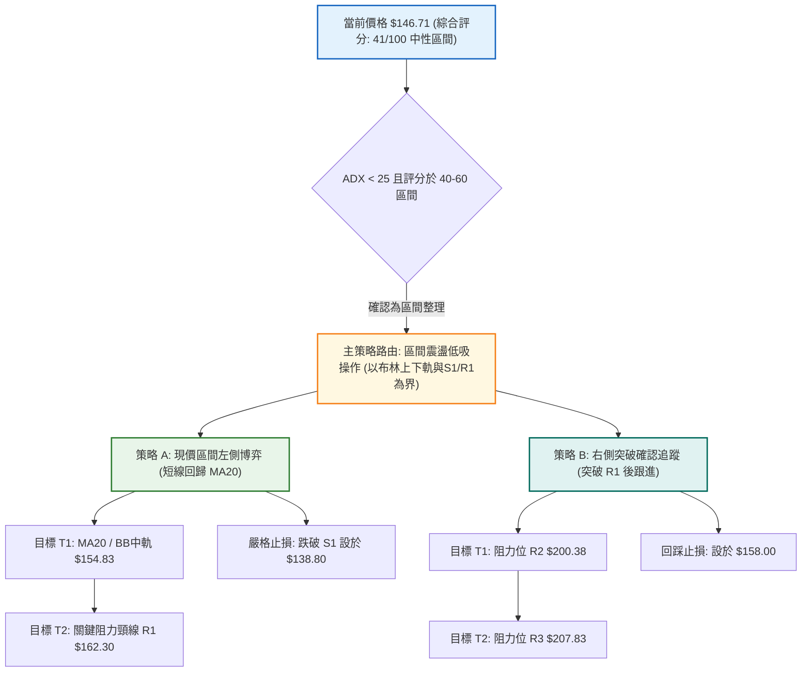
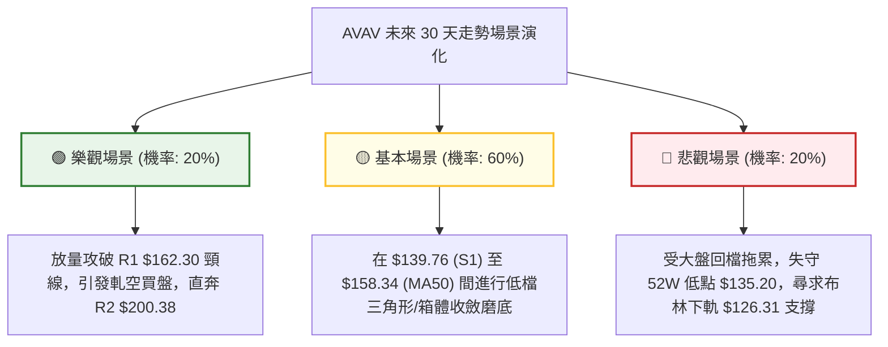

# AVAV 技術分析報告

> **報告日期**：2026-09-14 ｜ **語言**：繁體中文 ｜ **數據來源**：Yahoo Finance ｜ **當前價格**：$146.71

---

## 目錄

| 章節 | 內容 |
|------|------|
| [1. 技術面概覽](#1-技術面概覽) | 訊號儀表板、核心指標、評分卡 |
| [2. 趨勢分析](#2-趨勢分析) | 多時框趨勢、長中短期走勢、12個月走勢圖 |
| [3. 圖表形態分析](#3-圖表形態分析) | 形態識別、信心度評估、K線組合、目標價 |
| [4. 支撐與阻力](#4-支撐與阻力) | 關鍵價位分布圖、阻力支撐表、斐波那契回調 |
| [5. 技術指標深度解讀](#5-技術指標深度解讀) | MA/RSI/MACD/布林通道/量價關係 |
| [6. 動能與波動率](#6-動能與波動率) | 動能四象限、ATR波動分析、Beta市場敏感度 |
| [7. 多時框架總結](#7-多時框架總結) | 時框架評分、綜合矩陣、多時框收斂結論 |
| [8. 交易策略建議](#8-交易策略建議) | 策略路由、情境階梯、主策略詳情、風控對沖 |
| [9. 風險提示與監控](#9-風險提示與監控) | 關鍵監控清單、情境模擬、資金管理原則 |

---

## 1. 技術面概覽

### 🎯 技術訊號儀表板



---

### 📊 核心指標速覽表

| 指標類別 | 指標名稱 | 當前數值 | 訊號 | 專業解讀 |
|----------|----------|----------|------|----------|
| **價格** | 當前收盤價 | $146.71 | 🔴 | 位於52週區間4.1%極低檔位置，長期跌幅沉重 |
| **均線** | MA20 (月線) | $154.83 | 🔴 | 現價低於MA20達 -5.25%，短期第一道反彈壓力 |
| **均線** | MA50 (季線) | $158.34 | 🔴 | 季線持續下行，壓制中期走勢 |
| **均線** | MA200 (年線) | $209.85 | 🔴 | 價格遠落後年線達 -30.09%，長期空頭格局未變 |
| **動能** | RSI(14) | 37.01 | 🟡 | 位於弱勢區間（30–40），但脫離嚴重超賣區 |
| **動能** | MACD (12,26,9)| -5.542 | 🔴 | 快慢線處於零軸下方，MACD柱為 -0.742，空方占優 |
| **波動** | ATR(14) | $8.07 | 🟡 | 佔股價比 5.50%，日均波動劇烈，需留足止損空間 |
| **趨勢** | ADX(14) | 14.11 | 🟡 | 指標低於25，代表空頭單邊跌勢衰竭，轉為低檔盤整 |
| **通道** | 布林帶 %B | 0.36 | 🟡 | 位於中軌（$154.83）與下軌（$126.31）之間偏下緣 |
| **量能** | 當日量比 | 2.25x | 🟢 | 當日量 4.60M vs 20日均量 2.05M，低檔買盤介入換手 |

---

### 🏆 技術評分卡

```
╔══════════════════════════════════════════════════════════════════╗
║                   技術評分卡 — AVAV (2026-09-14)                 ║
╠══════════════════════════════════════════════════════════════════╣
║ 趨勢強度 (ADX=14.11 盤整)     ██████░░░░░░░░░░░░░░  30/100  🔴   ║
║ 動能指標 (RSI 37 / MACD負)    ████████░░░░░░░░░░░░  38/100  🔴   ║
║ 支撐穩定度 (S1/S2歷史低點)    ███████████░░░░░░░░░  55/100  🟡   ║
║ 成交量配合 (量比2.25x/OBV偏多)█████████████░░░░░░░  65/100  🟢   ║
║ 形態完整度 (低檔雙重探底雛形) ████████░░░░░░░░░░░░  40/100  🟡   ║
║ 均線排列 (空頭排列且受壓)     ████░░░░░░░░░░░░░░░░  20/100  🔴   ║
╠══════════════════════════════════════════════════════════════════╣
║ 綜合評分                      ████████░░░░░░░░░░░░  41/100  🟡   ║
║ 綜合評級                      中性偏弱 / 底部區間震盪待確認       ║
╚══════════════════════════════════════════════════════════════════╝
```

---

## 2. 趨勢分析

### 🌐 多時框趨勢分析

```mermaid
graph TD
    A["月線層級 (Long-Term)"] -->|"2025/10 高點 $369.91 至現價 $146.71 (-60.3%)"| B["長期空頭週期"]
    B --> C["週線層級 (Medium-Term)"]
    C -->|"波段於 $135.20-$192.81 間大幅震盪拉鋸"| D["中期寬幅震盪箱體"]
    D --> E["日線層級 (Short-Term)"]
    E -->|"ADX=14.11 / MA5("$145.60")>MA10("$146.11附近金叉")"| F["短線跌勢放緩 / 區間築底"]

    style B fill:#ffebee,stroke:#c62828,stroke-width:2px
    style D fill:#fff8e1,stroke:#f57f17,stroke-width:2px
    style F fill:#e8f5e9,stroke:#2e7d32,stroke-width:2px
```

---

### 📈 長期趨勢 — 12個月走勢圖（2025-10 至 2026-09）

```
AVAV 月線走勢圖（過去12個月價格軌跡與形態點位）
價格 ($)
$370 ┤        ● (2025-10: $369.91 波段歷史峰頂)
$340 ┤         ╲
$310 ┤          ╲
$280 ┤           ●(11月: $279.46)    ●(2026-01: $278.39 次高頂)
$250 ┤            ╲                 ╱ ╲
$240 ┤             ●(12月: $241.89)╱   ●(02月: $252.25)
$210 ┤                                   ╲          ●(05月: $207.24)
$180 ┤                                    ●(03月:   ╱ ╲
$165 ┤                                     $183.05)╱   ●(06月: $165.07)
$150 ┤                                                ●(07-08月: ~$148-$149)
$135 ┤                                                 ●(現價 $146.71) ◄ 52W低點聚類區($135.20)
     └┬────────┬────────┬────────┬────────┬────────┬────────┬────────┬────────┬────────┬────────┬────────┬────────
    25-10    25-11    25-12    26-01    26-02    26-03    26-04    26-05    26-06    26-07    26-08    26-09
```

#### 走勢特徵分析表格

| 階段區間 | 起止價格 | 漲跌幅 | 主要技術特徵 | 成交量與動能變化 |
|----------|----------|--------|--------------|------------------|
| **衝頂回落期** (2025/10 - 2025/12) | $369.91 → $241.89 | -34.61% | 長黑灌破短期均線，頂部主力出貨形成 | 伴隨歷史高位獲利了結盤，動能指標急轉直下 |
| **反彈受阻期** (2025/12 - 2026/02) | $241.89 → $278.39 | +15.09% | 弱勢反彈，形成中長線反轉次高點（Lower High） | 量能無法擴大，未能挑戰 $300 關卡 |
| **主跌破位期** (2026/02 - 2026/06) | $278.39 → $165.07 | -40.71% | 跌破 MA200，均線形成死亡交叉全面空頭排列 | 波動急劇放大，週線 RSI 跌破 30 進入超賣 |
| **築底收斂期** (2026/06 - 2026/09) | $165.07 → $146.71 | -11.12% | 在 $135.20–$149.50 構築箱體，暴跌動能衰竭 | 週成交量於 2026-09-13 激增至 20,386,200 股 |

---

### 📊 中期趨勢（週線分析）

從近20週數據觀察，AVAV 展現了劇烈的中期寬幅震盪特徵：
- **第一波暴跌與強力抽頭**：2026-06-28 當週破底至 $137.95（成交量 11.89M，週 RSI 20.2 極度超賣），次週（2026-07-05）受巨量買盤推升至 $190.89（成交量 18.32M，暴漲 +38.4%）。
- **第二波衝高回落**：2026-08-16 再次反彈至 $192.81 後遭空頭伏擊，隨後連續四週黑K摜壓，於 2026-09-06 跌至收盤 $144.65。
- **第三波底部量能匯聚**：2026-09-13 當週收在 $146.71，週成交量暴增至 20,386,200 股，創下半年最大量，週 RSI 從 16.9 回升至 37.0，MACD 柱由 -4.073 收斂至 -0.742，顯示中期有特定主力資金於 $140 附近進行籌碼換手吸收。

```
中期阻力與支撐攻防圖（週線視角）
  $200.38 - $207.83 ─── 強阻力帶 (波段頂部高點與 MA200 壓制區)
          ▲
          │ 反彈受阻 ($192.81)
          │
  $162.30 ──────────── 中期頸線阻力 R1 (突破此點方能扭轉日線偏空格局)
          ▲
          │ 當前彈升攻防 ($146.71)
  $139.76 ──────────── 近期支撐 S1 (近期週線收盤密集支撐)
  $135.20 ──────────── 52週核心防線 S2 (破位則打開下方未知空間)
```

---

### ⚡ 趨勢強度評估（ADX 解讀）



#### ADX 與方向指標參數對照表

| 指標變數 | 當前數值 | 狀態解讀 |
|----------|----------|----------|
| **ADX (14)** | **14.11** | 處於顯著低位（< 25），證實先前主跌浪的趨勢動能已消耗殆盡，當前屬於**盤整行情**。 |
| **+DI (14)** | **23.74** | 多方攻擊動能處於低位回升中。 |
| **-DI (14)** | **25.13** | 空方主導力量略大於多方，但差距極小（差值僅 1.39）。 |
| **方向判定** | 空方微弱占優 | 由於 ADX 極低，空方的微幅領先並不構成單邊下殺力量，反而是底部震盪特徵。 |

---

## 3. 圖表形態分析

### 🔍 形態識別系統

依據嚴格規則 15，僅針對具備數據佐證之形態進行識別，並提供信心度評估：



#### 形態信心度與目標價計算表

| 形態名稱 | 信心度 | 判斷依據（數據引用） | 完成度 | 目標價（精確計算式） |
|----------|--------|----------------------|--------|----------------------|
| **潛在雙底雛形** | 58% | 2026-06-28 低點 $137.95 與 52W 低點 $135.20 形成雙重支撐聚類；近期於 2026-09-06 回測 $144.65 不破。 | 45% (頸線未過) | 頸線取 R1 $162.30，底部取 S2 $135.20。<br>形態高度 = $162.30 - $135.20 = $27.10。<br>突破目標價 = 頸線 $162.30 + $27.10 = **$189.40**。 |
| **下降軌道運行** | 85% | 2025/10 高點 $369.91、2026/01 高點 $278.39、2026/05 高點 $207.24 連線成下降壓制線。 | 90% | 下降壓力線目前交會於 MA50 ($158.34) 至 R1 ($162.30) 區間。 |
| **指標型布林反彈** | 75% | 布林下軌 $126.31 守穩，%B 達到 0.36，成交量急增 2.25x。 | 70% | 布林中軌回歸目標 = MA20 數值 **$154.83**。 |

---

### 🕯️ 重要K線形態分析

| 觀測週期 | 收盤價 | K線形態特徵 | 專業技術解讀 | 訊號性質 |
|----------|--------|-------------|--------------|----------|
| **2026-06** | $165.07 | 長陰貫穿破位線 | 跌破月線多頭防線，引發恐慌性拋售 | 🔴 極度看空 |
| **2026-07** | $149.37 | 長下影錘頭破底翻 | 探底 $137.95 後爆出 18.3M 巨量抽高，主力資金進場護盤 | 🟢 強烈止跌 |
| **2026-08** | $148.35 | 倒狀十字星（流星線） | 月中衝擊 $192.81 遇阻大幅回落，上方套牢賣壓極重 | 🔴 衝高受阻 |
| **2026-09-13 (週)** | $146.71 | 低檔爆量帶下影陽線 | 單週成交量達 20.38M，跌勢在 $144.65 獲強烈支撐回升 | 🟢 底部換手 |

---

### 📉 ASCII 走勢形態示意圖

```
AVAV 潛在雙重底與下降通道幾何構造示意圖
$192.81 ─────────────┬─────────────────────────────── 波段高點 (2026-08)
                     │
$162.30 ─────────────┼──────────────● 頸線阻力位 (R1)
                     │             ╱ ╲
                     │            ╱   ╲
$146.71 ─────────────┼───────────╱─────● 現價
                     │          ╱
$137.95 ───● 第一底 (06/28)    ╱
           │                 ● 第二底 (09/06: $144.65 / 支撐 S1 $139.76)
$135.20 ───┴─────────────────┴──────────────── 52W 歷史底部防線 (S2)
```

---

### 🎯 形態目標價計算

依據幾何形態計算推導：
1. **第一階阻力目標（頸線測試）**：
   - 引用數據關鍵阻力位 **R1: $162.30**。現價 $146.71 距此尚有 **+10.63%** 的反彈空間。
2. **第二階幾何等倍目標（雙底突破延伸）**：
   - 形態波幅計算式：
     $$\text{形態波幅} = \text{頸線 R1 ($162.30)} - \text{底部支撐 S2 ($135.20)} = \$27.10$$
   - 向上等倍測量目標價：
     $$\text{目標價} = \$162.30 + \$27.10 = \$189.40$$
   - 該數值與 2026-08 波段高點 $192.81 及斐波那契 78.6% 回調位（$195.69）形成嚴密的阻力重疊區（Confluence Zone）。

---

## 4. 支撐與阻力

### 🗺️ 關鍵價位分布圖（Unicode）

```
AVAV 價位結構分布圖 (依據 OHLCV 計算聚類)
═══════════════════════════════════════════════════════════════════
$207.83 ║██████████████████████████████║ 強阻力 R3 (5月月線高點/年線壓制)
$200.38 ║██████████████████████        ║ 中期阻力 R2 (整數心理大關)
$195.69 ║▓▓▓▓▓▓▓▓▓▓▓▓▓▓▓▓▓▓            ║ Fib 78.6% 回調位
$183.35 ║▒▒▒▒▒▒▒▒▒▒▒▒                  ║ 布林通道上軌
$162.30 ║██████████████████████████████║ 關鍵阻力 R1 (雙底頸線 / 波段聚類)
$154.83 ║──────────────────────────────║ MA20 月線阻力 / 布林中軌
$146.71 ╠══════════════════════════════╣ ◄ 當前收盤價 ($146.71)
$139.76 ║▓▓▓▓▓▓▓▓▓▓▓▓▓▓▓▓▓▓▓▓▓▓        ║ 近期核心支撐 S1 (近一年波段低點聚類)
$135.20 ║██████████████████████████████║ 極限強支撐 S2 (52週最低點 / Fib 100%)
$126.31 ║▒▒▒▒▒▒▒▒▒▒▒▒                  ║ 布林通道下軌 (超賣邊界)
═══════════════════════════════════════════════════════════════════
```

---

### 🚧 阻力位分析表

| 阻力級別 | 精確價位 | 形成技術依據（嚴格引用數據） | 突破難度 | 戰略重要性 |
|----------|----------|------------------------------|----------|------------|
| **R1** | **$162.30** | 近一年波段高點聚類；上方緊鄰 MA50 ($158.34) 與 MA60 ($157.46) | 中等偏高 | **極高**。唯有日線實體突破收穩此線，空頭排列方告瓦解。 |
| **R2** | **$200.38** | 近一年波段次高密集區；整數關卡；接近 MA200 ($209.85) | 極高 | **高**。為長期空轉多的分水嶺。 |
| **R3** | **$207.83** | 2026年5月收盤高點 ($207.24) 聚類；波段籌碼大量套牢區 | 極重 | **中**。強大多頭反轉後的終極目標位。 |

---

### 🛡️ 支撐位分析表

| 支撐級別 | 精確價位 | 形成技術依據（嚴格引用數據） | 守住機率 | 戰略重要性 |
|----------|----------|------------------------------|----------|------------|
| **S1** | **$139.76** | 近一年波段低點聚類；2026-06-28 破底翻之結構起漲點 | 70% | **極高**。短線震盪箱體底邊，短多部位嚴防跌破。 |
| **S2** | **$135.20** | **52週歷史低點**；斐波那契 100.0% 極限回調底 | 85% | **生死線**。若遭有效跌破，代表價格探底未完，將引發新一輪去槓桿。 |

---

### 📐 斐波那契回調位分析

依據 52 週波段高點 **$417.86** 至 52 週波段低點 **$135.20** 計算之斐波那契回調位：

```
斐波那契回調位結構分佈
  0.0%  (52W High)  ─── $417.86
  23.6%             ─── $351.15
  38.2%             ─── $309.88
  50.0%             ─── $276.53
  61.8%             ─── $243.18
  78.6%             ─── $195.69
  100.0%(52W Low)   ─── $135.20
```

#### 現價定位與技術解讀
- **現價位置**：當前價格 **$146.71** 處於 **78.6% ($195.69)** 至 **100.0% ($135.20)** 的末端區間，落於52週波段之 **4.1%** 極低分位。
- **技術意義**：
  1. 回調幅度超過 78.6% 表明原有的多頭上升結構遭到破壞，市場進入長期熊市或長週期洗盤階段。
  2. 現價距 100% 低點支撐 $135.20 僅差 **$11.51 (-7.85%)**，下行邊際空間被壓縮，風險報酬比開始向多方傾斜。
  3. 若由低檔發動回歸反彈，78.6% 回調位 **$195.69** 與阻力區 R2 ($200.38) 將形成強大的阻力磁吸帶。

---

## 5. 技術指標深度解讀

### 🎛️ 指標訊號總覽



---

### 📈 移動平均線排列分析



#### 各天期移動平均線狀態表

| 均線天期 | 數值 | 與現價差距 | 乖離率 | 排列型態與走勢特徵 |
|----------|------|------------|--------|--------------------|
| **MA 5** | $145.60 | +$1.11 | +0.76% | ▁▁▂▃▄... 超短天期均線率先拐頭向上，短線支撐浮現 |
| **MA 10** | $146.11 | +$0.60 | +0.41% | ▁▂▂▂▃... 現價成功站上，短期跌勢初步止穩 |
| **MA 20** | $154.83 | -$8.12 | -5.25% | 下行壓制中，為第一道動態阻力位 |
| **MA 60** | $157.46 | -$10.75 | -6.82% | 季線級別走空，斜率向下 |
| **MA 120**| $171.07 | -$24.36 | -14.24%| 中期空方強壓 |
| **MA 200**| $209.85 | -$63.14 | -30.09%| 長期多空分水嶺，深度負乖離，具均值回歸潛力 |
| **MA 240**| $233.33 | -$86.62 | -37.12%| 超長期走低，空頭大格局封頂 |

- **均線綜合結論**：中長期均線呈現極其典型的空頭發散排列，任何未放量突破 MA20 與 MA50 的反彈，在技術上皆暫定性為「熊市跌深反抽」。然而，現價站上 MA5 與 MA10，預告超跌反彈正在啟動。

---

### 📉 RSI(14) 分析

```
RSI(14) 刻度強度展示：
0 ────── 超賣(30) ────────── 現值(37.01) ────── 中軸(50) ────── 超買(70) ────── 100
[░░░░░░░░░░][▓▓░░░░░░░░░░░░░░][░░░░░░░░░░░░░░░░░░░░][░░░░░░░░░░░░░░░░░░░░]
強度進度條：███████░░░░░░░░░░░░░ 37.01% (弱勢整理區)
```

- **超買超賣評估**：RSI(14) 自先前 2026-09-06 週線的 16.9 極端超賣區回升至 37.01，空頭動能衰竭，指標離開危險區，提供反彈安全邊際。
- **背離分析判斷**：
  - **日線/週線背離確認**：2026-06-28 當週價格低點為 $137.95，對應 RSI 為 20.2；至 2026-09-06 價格再次探低至 $144.65，RSI 為 16.9；但最新一週（09-13）價格收在 $146.71，RSI 急遽彈升至 37.01。
  - **結論**：目前指標並未出現典型的「破底不破指標」大型底背離，原廠數據亦明確提示「無明顯背離」。但指標自低檔迅速回升，確認了 $140 附近有技術性買盤承接。

---

### 📊 MACD(12, 26, 9) 訊號解讀



- **MACD柱狀圖動態**：從近三週數據觀察（-4.073 → -2.334 → -0.742），綠柱呈現大幅遞減，顯示空頭下殺動能已接近枯竭，多空力量正於零軸下方進入相持態勢，隨時可能形成低檔黃金交叉。

---

### 📦 布林通道分析 (Bollinger Bands, 20, 2)

```
布林通道結構與現價相對位置示意圖
$183.35 ────────────────────────────────────── 上軌 Upper Band (+2σ)
        │
        │
$154.83 ───────────────────- - - - - - - - - - 中軌 Middle Band (MA20)
        │                   ▲
$146.71 ├───────● 現價 (BB %B = 0.36)
        │
$126.31 ────────────────────────────────────── 下軌 Lower Band (-2σ)
```

- **通道帶寬與形態**：布林帶寬度為 $57.04（上軌 $183.35 至下軌 $126.31），帶寬較先前暴跌時期顯著收窄，顯示市場正由趨勢擴張期過渡至**低位收斂盤整期**。
- **%B 位置解讀**：%B 數值為 **0.36**，意味著現價處於中軌與下軌之間的三分之一位置，未觸及極端超賣下軌（$126.31），亦未突破中軌（$154.83）。若短線展開均值回歸，中軌 **$154.83** 為首要反彈目標。

---

### 💹 成交量分析（量價配合度）

1. **量比異動（Volume Ratio = 2.25x）**：
   - 最新單日成交量為 **4,602,300 股**，遠高於 20 日平均成交量 **2,045,290 股** 及 50 日均量 **1,733,728 股**。
   - 在低檔出現放量 2 倍以上的走勢，表明機構籌碼在 $145 附近展開換手吸收。
2. **週成交量創歷史級巨量**：
   - 2026-09-13 當週週成交量達 **20,386,200 股**，為過去半年以來最高週成交量。在長達數週的陰跌後爆出天量且收下影紅K，屬於典型的「底部籌碼沉澱」特徵。
3. **OBV 趨勢驗證**：
   - 官方數據明確提示「**OBV > MA → 量能支撐上漲**」，說明能量潮指標領先價格突破其均線，資金淨流入態勢成立，量價配合出現多頭確認訊號。

---

## 6. 動能與波動率

### ⚡ 動能評估四象限

```
AVAV 動能與波動率定位矩陣
       高波動率 (High Volatility)
           │
     Q3    │     Q4
  強動能   │   弱動能 / 高波動
  高收益   │   [風險最高]
───────────┼────────────────────────
     Q1    │     Q2
  強動能   │   弱動能 / 區間收斂
  低波動   │   ★ AVAV 當前定位
  [追價]   │   [謹慎觀望 / 區間低吸]
           │
       低波動率 (Low Volatility)
```

| 象限 | 動能狀態 | 波動狀態 | 股票落點 | 策略戰術評估 |
|------|----------|----------|----------|--------------|
| **Q1** | 強動能 (ADX>25, RSI>60) | 低波動 (ATR<3%) | — | 穩健多頭主升段，順勢加碼 |
| **Q2** | **弱動能 (ADX 14.11, RSI 37)** | **低/中波動 (帶寬收窄)** | **✓ AVAV** | **築底初期，單邊動能缺乏，宜區間震盪低吸高拋** |
| **Q3** | 強動能 (暴跌/暴漲) | 高波動 (ATR>8%) | — | 突破行情，嚴格順勢追隨 |
| **Q4** | 弱動能 (無序崩跌) | 高波動 (極端恐慌) | — | 避開高風險洗盤，嚴禁進場 |

---

### 📊 ATR 波動率分析

- **ATR(14) 絕對數值**：**$8.07**。
- **ATR 佔比**：佔當前股價（$146.71）之 **5.50%**，代表該標的每日平均正常擺動幅度高達 $8 左右，屬於高波幅品種。
- **止損與部位建議**：
  - 震盪行情下，為防止被日常雜訊（Market Noise）掃出場，短線操作止損間距建議設定為 **1.5 × ATR = $12.10**。
  - 保守中線止損可設定為 **2.0 × ATR = $16.14**。
  - 由此計算，進場點若在現價 $146.71，嚴格技術止損點位需設在波段防守點 $135.20 附近（剛好約 1.42 × ATR），在空間與波動邏輯上高度契合。

---

### 📐 Beta 與市場相關性

- **Beta 係數**：**1.406**。
- **市場敏感度解讀**：
  - Beta > 1.4 代表 AVAV 對大盤（S&P 500 / 納斯達克）具備極高的高彈性特徵。當大盤反彈 1% 時，該股理論上波動 1.41%；反之大盤回檔時，其跌幅亦常顯著放大。
  - 當前空頭結構下，高 Beta 特性意味著個股極易受宏觀風險偏好（Risk-off）打擊；但若市場情緒轉暖，其超跌彈升爆發力亦將居同業前列。
- **籌碼與放空結構**：
  - 機構持股達 **88.0%**，顯示籌碼由大型法人機構高度掌控。
  - 放空比例佔流通盤（Short % Float）達 **11.2%**，Short Ratio 為 **3.62** 天。此等空頭部位具有一定規模，一旦價格站上阻力位 R1 ($162.30)，極易引發軋空（Short Squeeze）回補買盤。

---

## 7. 多時框架總結

### 📋 時框架評分表

| 時框架 | 趨勢方向 | 動能強度 | 均線排列 | 形態結構 | 綜合評分 | 戰略建議 |
|--------|----------|----------|----------|----------|----------|----------|
| **長期 (月線)** | 🔴 明確空頭 | 🔴 RSI 37 弱勢 | 🔴 MA200 遠在上方 | 🔴 頂部破位下行中 | **25/100** | 嚴禁盲目長線做多，靜待年線走平 |
| **中期 (週線)** | 🟡 寬幅箱體 | 🟡 MACD柱大幅縮腳 | 🔴 均線反壓沉重 | 🟡 潛在雙底測試 | **45/100** | 區間震盪操作，關注 $135.20 防線 |
| **短期 (日線)** | 🟢 跌勢放緩 | 🟢 量比2.25x爆量 | 🟡 站上 MA5/MA10 | 🟢 短線超賣反抽 | **53/100** | 輕倉博取均值回歸，快進快出 |

---

### 🔲 綜合訊號矩陣

```
時框架訊號收斂分析矩陣
時框      均線系統    動能(RSI/MACD)    成交量能     布林通道    收斂判定
──────────────────────────────────────────────────────────────────────
日線 (D)    🟡 中性      🟡 弱勢金叉待發    🟢 爆量多頭   🟢 遠離下軌   🟡 短線偏多反彈
週線 (W)    🔴 空頭      🟡 柱狀大幅收斂    🟢 天量換手   🟡 帶寬收窄   🟡 中期區間築底
月線 (M)    🔴 空頭      🔴 弱勢區間        🟡 常態分佈   🔴 跌破均線   🔴 長期趨勢向下
──────────────────────────────────────────────────────────────────────
多時框結論：長期空頭未解 + 中期橫向沉澱 + 短期放量超跌反抽
```

---

### ⚖️ 多時框收斂結論

依據**嚴格要求 14（多時框收斂規則）**：
1. **趨勢/盤整型態判定**：當前 ADX(14) 數值為 **14.11**，明確處於 **ADX < 25 的盤整震盪行情**，而非單邊趨勢行情。
2. **主導時框與交易區間**：在盤整行情中，依規則應以**日線布林通道區間（下軌 $126.31 至上軌 $183.35）及關鍵波段水平支撐阻力（S2 $135.20 至 R1 $162.30）**為主要交易依據，中長期均線方向則作為上方空間壓制之參考。
3. **唯一收斂結論**：**【中性觀望 / 區間下緣築底反彈】**。
   - 儘管月線趨勢偏空，但由於日線與週線在核心支撐區 S2（$135.20）上方出現天量換手、空頭動能衰竭（ADX 14.11 / MACD柱由-4.073縮至-0.742），且 OBV 向上確認，空方已無力發動連續單邊貫壓。
   - 此結論與第 1 章評分卡（41/100，中性偏弱區間操作）完全收斂，確立後續策略以**「區間下緣低吸、設定嚴格止損」**為主軸。

---

## 8. 交易策略建議

### 🗺️ 策略決策流程圖



---

### 🧭 策略路由

> **當前主策略方向 = 區間震盪低吸操作（依綜合評分 41/100，處於 40–60 中性震盪區間，等待突破確認）**

根據多時框收斂規則，本策略不盲目追空於歷史極低檔，亦不在空頭排列下進行無防守的長線做多；核心邏輯為**在 52 週核心支撐 S2 之上，利用低檔放量特徵博取均值回歸**。

---

### 🎯 價格情境階梯（Price Scenarios）

以當前價格 **$146.71** 為基準，所有引導價位嚴格引用關鍵價位數據：

| 觸發條件 | 第一目標 | 第二目標 | 情境含義與技術解讀 |
|----------|----------|----------|--------------------|
| **向上放量突破 R1 $162.30** | R2 $200.38 | R3 $207.83 | 雙重底頸線被攻克，空頭結構扭轉，啟動中級軋空上升浪 |
| **站穩現價區間 ($140.00–$146.71)**| MA20 $154.83 | R1 $162.30 | 底部換手成功，展開朝向布林中軌的技術性反抽 |
| **向下跌破 S1 $139.76** | S2 $135.20 | — | 短期支撐失守，考驗 52 週最低點終極防線 |
| **有效跌破 S2 $135.20** | BB下軌 $126.31| 數據外極限探底| 歷史防線崩潰，雙底形態宣告失敗，空頭續創新低 |

---

### 📊 情境機率分佈

| 情境劃分 | 預估機率 | 主要技術指標與籌碼依據 |
|----------|----------|------------------------|
| **情境一：區間震盪築底 / 反彈回抽** | **55%** | ADX=14.11（盤整無單邊趨勢）；週成交量暴增至 20.38M 爆量止跌；OBV > MA 量能支撐；MACD 負柱大幅收縮至 -0.742。 |
| **情境二：窄幅橫盤拉鋸 ($140–$155)** | **30%** | RSI 處於 37 中性弱勢區；均線壓制強烈（MA20 $154.83、MA50 $158.34）；需要時間消化套牢浮額。 |
| **情境三：摜破底限再探新低 (<$135.20)** | **15%** | 均線系統完全空頭排列；-DI (25.13) 仍微幅高於 +DI (23.74)；若伴隨大盤重挫可能引發停損拋盤。 |

---

### 🟢 主策略詳情（區間操作架構）

| 策略要素 | 策略 A（現價區間左側分批低吸） | 策略 B（突破頸線右側動量跟進） |
|----------|--------------------------------|--------------------------------|
| **適用時機** | 適合激進型交易者，博弈短期超跌反彈 | 適合保守型交易者，等待形態確認突破 |
| **進場條件** | 現價 $146.71 或回測 S1 獲得支撐不破時進場 | 實體日K線收盤突破阻力 R1 $162.30 且放量 |
| **進場價格** | **$146.71** (現價) | **$163.00** (突破 R1 確認點) |
| **目標價 T1** | **$154.83** (MA20 / 布林中軌) | **$200.38** (關鍵阻力 R2) |
| **目標價 T2** | **$162.30** (關鍵阻力 R1) | **$207.83** (關鍵阻力 R3) |
| **止損價格** | **$138.80** (跌破支撐 S1 $139.76 設防) | **$154.83** (回踩跌破原阻力轉化之 MA20) |
| **預期報酬 / 風險**| 空間 +$15.59 / 風險 -$7.91 | 空間 +$37.38 / 風險 -$8.17 |
| **風險報酬比 (R:R)**| **1.97 : 1** | **4.58 : 1** |
| **成功機率評估** | 55% | 45% |
| **建議倉位** | **5% - 8%** (輕倉防守型) | **10% - 15%** (趨勢確認型) |

---

### 🔴 反向風險觸發點（對沖提示）

若出現以下情況，判定主策略失敗，應立即執行防禦或對沖：
1. **多頭停損與轉空訊號**：日線實體陰線跌破 **S1 ($139.76)**，特別是帶量下破 **S2 ($135.20)**。此時潛在雙底徹底破局，應無條件止損出局，空手觀望，甚至以跌破單跟進避險。
2. **反彈動能衰竭訊號**：價格反彈至 **MA20 ($154.83)** 或 **MA50 ($158.34)** 遭遇明顯上影線且成交量快速萎縮（量比跌回 0.8x 以下），顯示僅為弱勢死貓跳（Dead Cat Bounce），應將利潤落袋。

---

### ⭐ 整體訊號強度評星

```
做多訊號強度：★★☆☆☆  (2.5/5星 — 僅限超跌反彈與區間低吸，未具備大波段條件)
做空訊號強度：★★★☆☆  (3.0/5星 — 長期空頭但短線跌無可跌，追空盈虧比極差)
整體可信度：  ★★★☆☆  (3.5/5星 — 數據在低檔放量明確，但需等待突破以定方向)
```

---

## 9. 風險提示與監控

### ✅ 關鍵監控指標 Checklist

```
╔══════════════════════════════════════════════════════════════════╗
║                   關鍵技術監控 Checklist (每日盤後檢視)          ║
╠══════════════════════════════════════════════════════════════════╣
║ [ ] 價格是否維持在 S1 ($139.76) 與 S2 ($135.20) 之上             ║
║ [ ] MACD 柱狀體是否由負轉正 (跨越 0 軸形成實質金叉)              ║
║ [ ] 日成交量是否持續高於 20日均量 (2,045,290 股) 保持換手活躍度  ║
║ [ ] RSI(14) 能否進一步跨越 50 多空分水嶺                         ║
║ [ ] 價格能否有效收復 MA20 ($154.83) 並向 R1 ($162.30) 推進       ║
║ [ ] ADX(14) 是否在脫離 14 後伴隨 +DI 上穿 -DI 展開上升趨勢       ║
╚══════════════════════════════════════════════════════════════════╝
```

---

### ⚠️ 風險場景分析



---

### 🛡️ 風險管理重要提醒

1. **嚴禁在空頭排列中過早擴大部位**：
   - AVAV 的 MA20、MA50、MA200 呈現典型的標準空頭排列，歷史經驗顯示，在此類結構下逆勢「抄底」極易遭受連續陰跌侵蝕本金。單一筆交易的最大風險曝險不得超過總資金的 **1% - 1.5%**。
2. **高 ATR 波動的部位規模調整**：
   - 當前 ATR 高達 **$8.07**，日內波動率超過 **5.5%**。若設定止損幅度為 $8（約 1.0 ATR），以單筆最大承擔虧損 $1,000 美元計算：
     $$\text{允許持股上限} = \frac{\$1,000}{\$8.07} \approx 123 \text{ 股}$$
   - 切勿以靜態資金比例盲目開倉，必須依據當前波動率動態計算股數。
3. **空頭回補（Short Cover）與機構動向監控**：
   - Short Float 達 11.2%，短期若能帶量拉升，空頭停損將成為反彈推手；然而機構持股達 88%，需防範是否有非預期的機構拋售潮阻斷反彈。

---

## 📋 報告總結

```
╔══════════════════════════════════════════════════════════════════╗
║                    AVAV 技術分析報告總結                         ║
╠══════════════════════════════════════════════════════════════════╣
║ 報告日期：2026-09-14                                             ║
║ 當前價格：$146.71                                                ║
║ 技術評級：⚖️ 41/100 (中性偏弱 / 底部區間築底觀望)                ║
╠══════════════════════════════════════════════════════════════════╣
║ 關鍵結論：                                                       ║
║ ├─ 長期趨勢：🔴 空頭主導 (現價處於 52W 區間 4.1% 極低檔)         ║
║ ├─ 中期趨勢：🟡 寬幅震盪 (近20週在 $135.20 - $192.81 劇烈洗盤)   ║
║ ├─ 短期趨勢：🟢 止跌收斂 (站上 MA5/MA10，量比 2.25x 爆量換手)     ║
║ ├─ 關鍵支撐：S1: $139.76  /  S2: $135.20 (52週最低防線)          ║
║ ├─ 關鍵阻力：R1: $162.30  /  R2: $200.38  /  R3: $207.83         ║
║ └─ 外資目標：分析師平均目標價 $224.40 (隱含相當於回到MA200水準) ║
╠══════════════════════════════════════════════════════════════════╣
║ 最優策略組合：                                                   ║
║ 1. 🥇 最佳機會 (策略 A)：                                        ║
║    現價 $146.71 輕倉介入，嚴格止損設於 $138.80 (低於S1)，         ║
║    博弈均值回歸目標 T1: $154.83，T2: $162.30 (風報比 1.97:1)。   ║
║ 2. 🥈 次選機會 (策略 B)：                                        ║
║    耐心等待放量突破頸線 R1 $162.30 成立後右側追進，               ║
║    目標鎖定 R2 $200.38 與 R3 $207.83 (風報比 4.58:1)。           ║
║ 3. 🥉 保守選擇：                                                 ║
║    完全空手觀望，直至日線 MACD 正式金叉且價格站穩 MA20 再行佈局。║
╚══════════════════════════════════════════════════════════════════╝
```

---

> ⚠️ **免責聲明**：本報告為依據客觀市場技術數據進行之專業量化與圖表分析，所有支撐阻力數值、指標解讀與情境推估均基於歷史價格與成交量統計。本報告**僅供研究與學術參考**，**不構成任何形式之個人化投資建議或買賣邀約**。金融市場存在高度價格波動風險，投資人應獨立評估自身財務狀況與風險承受能力，並自負盈虧責任。

---

*報告生成時間：2026-09-14 ｜ 數據來源：Yahoo Finance ｜ 分析框架：多時框技術分析系統*