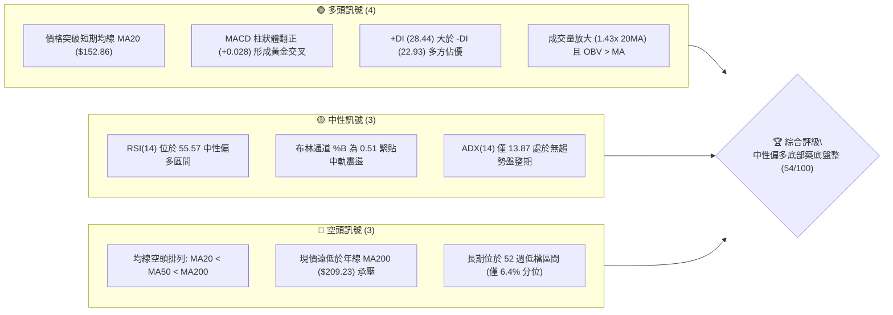
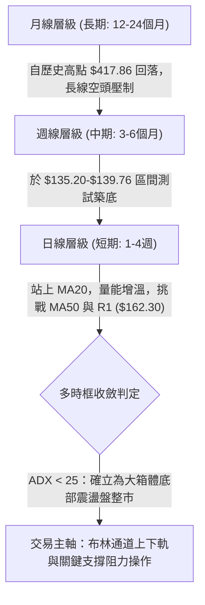
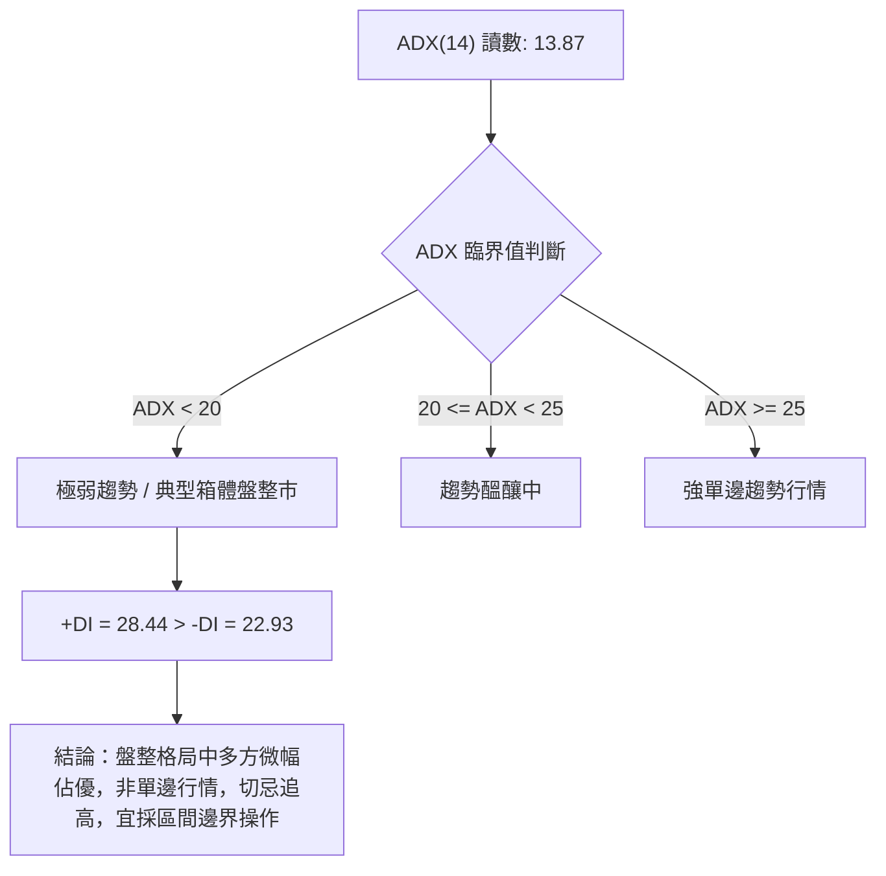
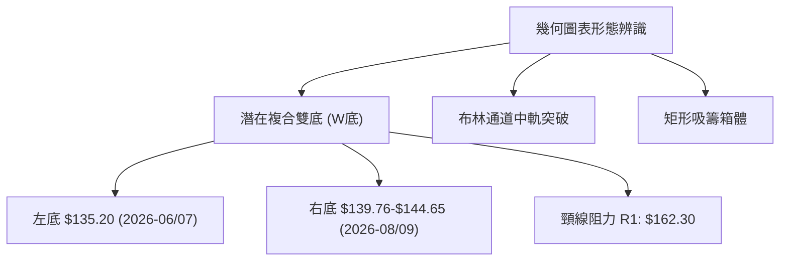
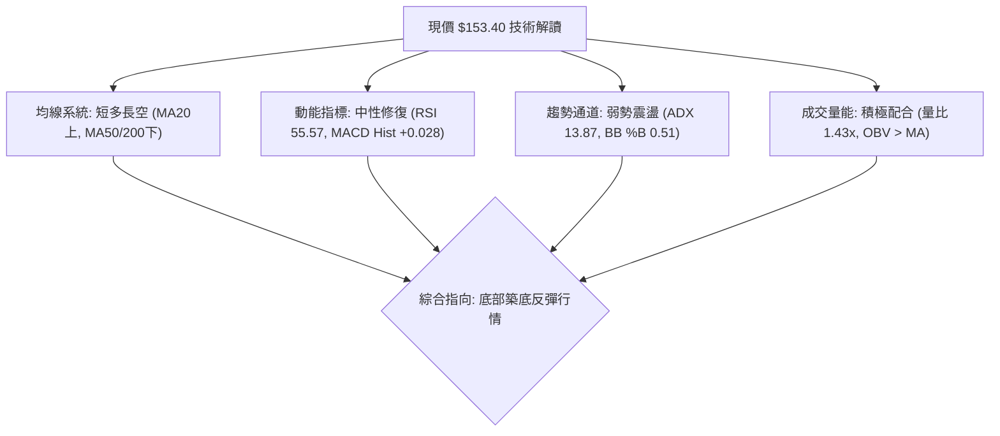
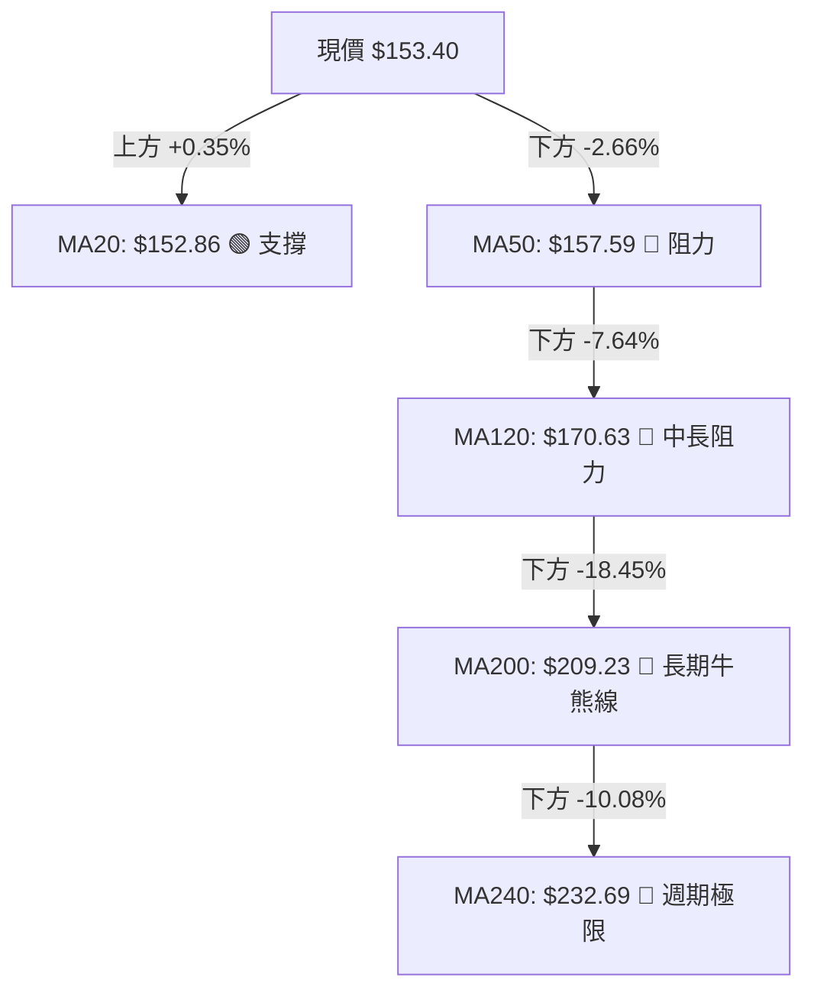
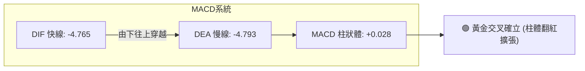
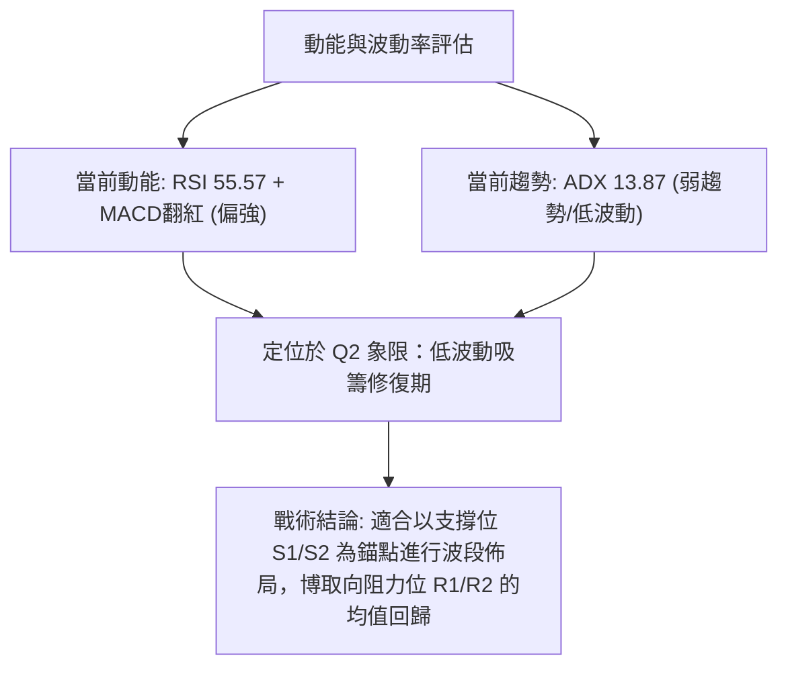
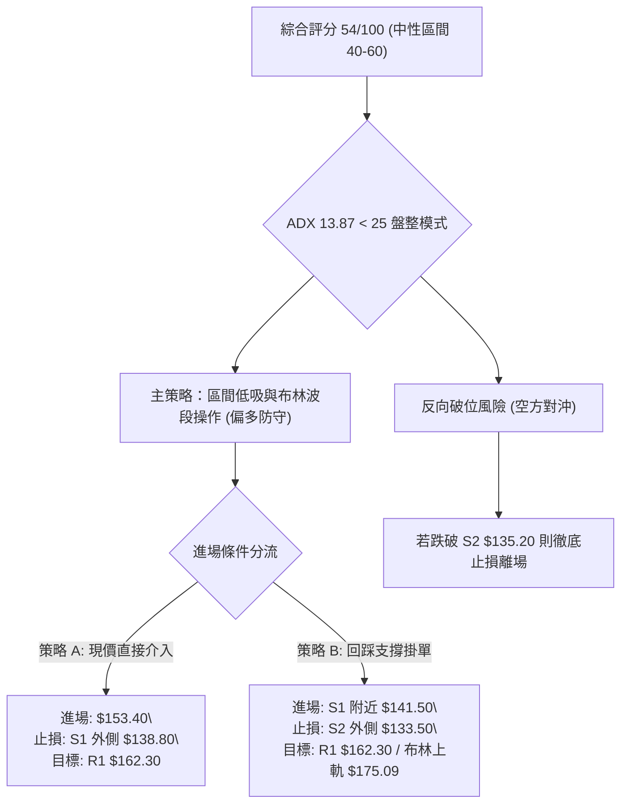
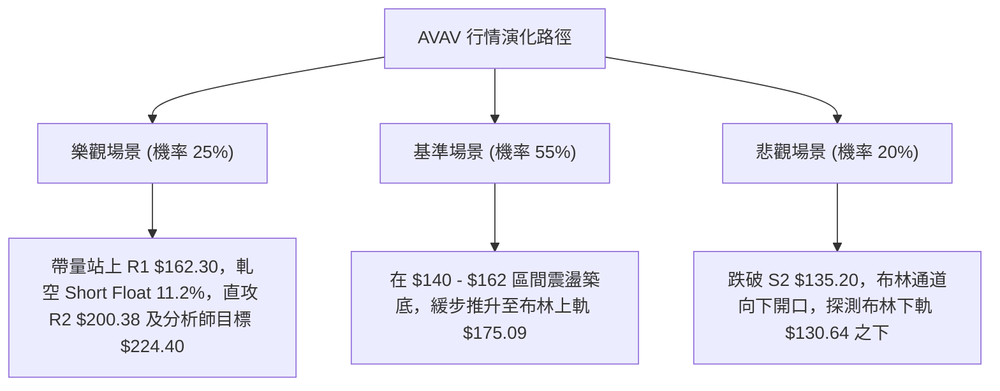

# AVAV 技術分析報告

> **報告日期**：2026-09-15 ｜ **語言**：繁體中文 ｜ **數據來源**：Yahoo Finance ｜ **當前價格**：$153.40

---

## 目錄

| 章節 | 內容 |
|------|------|
| [1. 技術面概覽](#1-技術面概覽) | 訊號儀表板、核心指標、評分卡 |
| [2. 趨勢分析](#2-趨勢分析) | 多時框趨勢、長中短期走勢 |
| [3. 圖表形態分析](#3-圖表形態分析) | 形態識別、K線組合、目標價 |
| [4. 支撐與阻力](#4-支撐與阻力) | 關鍵價位、斐波那契回調 |
| [5. 技術指標深度解讀](#5-技術指標深度解讀) | MA/RSI/MACD/布林/成交量 |
| [6. 動能與波動率](#6-動能與波動率) | 動能評估、ATR、Beta |
| [7. 多時框架總結](#7-多時框架總結) | 時框架評分矩陣 |
| [8. 交易策略建議](#8-交易策略建議) | 多空策略、風險報酬比 |
| [9. 風險提示與監控](#9-風險提示與監控) | 監控指標、風險場景 |

---

## 1. 技術面概覽

### 🎯 技術訊號儀表板



### 📊 核心指標速覽表

| 指標類別 | 指標名稱 | 當前數值 | 訊號 | 解讀 |
|:---|:---|:---|:---:|:---|
| **價格** | 當前收盤價 | $153.40 | 🟡 | 位於52週區間6.4%低檔，短期自低位反彈 |
| **均線** | MA20 (短期) | $152.86 | 🟢 | 現價微幅站上20日線（+0.35%），短多浮現 |
| **均線** | MA50 (中期) | $157.59 | 🔴 | 現價位於MA50下方（-2.66%），中期壓力未解 |
| **均線** | MA200 (長期)| $209.23 | 🔴 | 現價遠低於年線（-26.68%），長線空頭壓制 |
| **動能** | RSI(14) | 55.57 | 🟡 | 脫離超賣區進入中性溫和區間，無背離訊號 |
| **動能** | MACD 柱狀體 | +0.028 | 🟢 | 快線(-4.765)微幅上穿慢線(-4.793)，微弱金叉 |
| **動能** | 隨機指標 %K/%D| 72.10 / 47.11 | 🟢 | 短期動能快速上揚，%K穿過%D呈現向上發散 |
| **趨勢強度**| ADX(14) | 13.87 | 🟡 | 指標低於25，顯示強烈單邊趨勢不存在，為箱體盤整 |
| **通道位置**| 布林通道 %B | 0.51 | 🟡 | 剛站回中軌（$152.86），通道上下軌為$130.64~$175.09 |
| **量能** | 量比 (vs 20MA)| 1.43x | 🟢 | 最新量3.04M高於均量2.12M，OBV>MA顯示量能支撐 |
| **波動** | ATR(14) | $8.04 | 🟡 | 日波動率5.24%，處於中等波幅，適合區間防守佈局 |

### 🏆 技術評分卡

```
╔══════════════════════════════════════════════════════════════╗
║              技術評分卡 — AVAV (2026-09-15)                  ║
╠══════════════════════════════════════════════════════════════╣
║ 趨勢強度 (ADX=13.87)   ██████░░░░░░░░░░░░░░  30/100 🔴 弱勢盤整 ║
║ 動能指標 (RSI/MACD)    ████████████░░░░░░░░  60/100 🟢 金叉初現 ║
║ 支撐穩定度 (S1/S2雙底) ██████████████░░░░░░  70/100 🟢 低檔守穩 ║
║ 成交量配合 (OBV/量比)  ██████████████░░░░░░  70/100 🟢 放量反彈 ║
║ 形態完整度 (潛在雙底)  ████████████░░░░░░░░  60/100 🟡 構築頸線 ║
║ 均線排列 (MA20/50/200) ███████░░░░░░░░░░░░░  35/100 🔴 均線反壓 ║
╠══════════════════════════════════════════════════════════════╣
║ 綜合評分               ███████████░░░░░░░░░  54/100 🟡 區間震盪 ║
╚══════════════════════════════════════════════════════════════╝
```

---

## 2. 趨勢分析

### 🌐 多時框趨勢分析



### 📈 長期趨勢 — 12個月走勢圖（Unicode）

AVAV 在過去 12 個月經歷了自高點腰斬的劇烈下行波段。2025 年 10 月觸及歷史頂部收盤價 $369.91（52 週盤中最高 $417.86）後，持續遭獲利了結與基本面評價修正，一路跌至 2026 年夏季的低位。

```
AVAV 月線走勢圖（2025-10 至 2026-09）
價格軸 ($)
$370 ┤  ● (2025-10: $369.91 歷史高位聚類)
$330 ┤   \
$290 ┤    ●(11: 279.46)   ●(01: 278.39)
$250 ┤     \             / \
$240 ┤      ●(12: 241.89)   ●(02: 252.25)
$210 ┤                       \     ●(05: 207.24)
$190 ┤                        ●(03: 183.05) \
$170 ┤                         \   /         ●(06: 165.07)
$150 ┤                          ●(04: 195.02) \   ●(07: 149.37) ●(09: 153.40 ◄ 現價)
$130 ┤                                         ●(08: 148.35 / 52W低點: $135.20)
     └─┬────┬────┬────┬────┬────┬────┬────┬────┬────┬────┬────┬────
      M1   M2   M3   M4   M5   M6   M7   M8   M9   M10  M11  M12
     (10) (11) (12) (01) (02) (03) (04) (05) (06) (07) (08) (09)
```

#### 走勢特徵分析表格

| 週期階段 | 涵蓋月份 | 區間收盤變動 | 區間漲跌幅 | 走勢特徵與量價行為 |
|:---|:---|:---|:---:|:---|
| **歷史衝頂期** | 2025-09 ~ 2025-10 | $314.89 → $369.91 | +17.47% | 爆量主升段，創下52週歷史極值 $417.86 後見頂滯漲 |
| **首輪下殺期** | 2025-10 ~ 2025-12 | $369.91 → $241.89 | -34.61% | 獲利賣壓湧現，連續跌破短期與中期均線支撐 |
| **中繼反彈期** | 2025-12 ~ 2026-02 | $241.89 → $252.25 | +4.28% | 於 $240-$278 區間構築次級頭部（M頭右肩），動能衰竭 |
| **加速崩跌期** | 2026-02 ~ 2026-06 | $252.25 → $165.07 | -34.56% | 跌破年線 MA200，籌碼多殺多，空頭趨勢完全確立 |
| **低檔築底期** | 2026-07 ~ 2026-09 | $149.37 → $153.40 | +2.70% | 於 $135.20-$148 區間反覆探底，量能回溫，進入收斂築底 |

### 📊 中期趨勢（週線分析）

從近 20 週數據觀察，AVAV 在 2026 年 6 月 28 日該週下探低點收在 $137.95（帶出 11.88M 鉅量），隨後於 7 月初強彈至 $190.89（成交量擴大至 18.31M）。8 月中旬衝高至 $192.81 後受阻於長期均線，拉回於 9 月 6 日當週見次低點 $144.65（成交量 7.32M）。隨後於 2026-09-13 當週暴增成交量至 20,402,600 股，價格回升至 $146.71，本週更進一步反彈至 $153.40。

```
近期週線壓力與支撐示意圖：
$200.38 ───────────────────────────────────── [阻力位 R2]
$192.81 ──────────────●─────────────────────── [8月中旬波段次高]
$162.30 ───────────────────────────────────── [阻力位 R1 / 頸線反壓]
$157.59 ┄┄┄┄┄┄┄┄┄┄┄┄┄┄┄┄┄┄┄┄┄┄┄┄┄┄┄┄┄┄┄┄┄┄┄┄┄┄┄ [中期均線 MA50 反壓]
$153.40 ══════════════════●══════════════════ [現價 $153.40]
$139.76 ───────────────────────────────────── [波段支撐位 S1]
$135.20 ──────────────────●────────────────── [52週歷史低點 S2 (雙底左腳)]
```

### ⚡ 趨勢強度評估（ADX 解讀）



#### ADX 趨勢強度對照表

| 指標變量 | 數值 | 狀態級別 | 技術解讀 |
|:---|:---|:---:|:---|
| **ADX(14)** | 13.87 | 弱勢/無趨勢 (極低) | 數值低於20，表明市場處於明顯的均值回歸與吸籌區間，單邊趨勢指標失效 |
| **+DI** | 28.44 | 多頭主導 | 正向動向線向上抬升，反映短線買盤力量強於空方 |
| **-DI** | 22.93 | 空頭減弱 | 負向動向線回落，顯示賣盤拋壓暫時告一段落 |
| **方向差距 (+DI - -DI)** | +5.51 | 短期偏多 | 差值為正但未超過10，僅支持反彈至阻力位，不足以引發長多主升浪 |

---

## 3. 圖表形態分析

### 🔍 形態識別系統



#### 圖表形態信心度評估表

| 形態名稱 | 信心度 | 判斷依據（引用數據） | 完成度 | 目標價（附計算式） |
|:---|:---:|:---|:---:|:---|
| **低檔複合雙底 (W-Bottom)** | **65%** | 52週低點 $135.20 形成左底；9月初低點 $144.65 與支撐 S1 $139.76 構成抬高的右底；量能於 2026-09-13 爆出 20.40M 鉅量確認止跌 | 70% (尚未越過頸線) | 頸線阻力 R1 $162.30 + 形態垂直高度 ($162.30 - S2 $135.20 = $27.10) = **$189.40**（接近阻力 R2 $200.38） |
| **吸籌震盪矩形 (Rectangle)** | **75%** | 價格受困於下軌支撐群 ($135.20-$139.76) 與上方反壓區 ($162.30-$175.09 布林上軌) 間橫向拉鋸超過8週 | 85% | 矩形頂部 R1: **$162.30**；突破後等距測量目標: $162.30 + ($162.30 - $139.76) = **$184.84** |
| **大型頭肩頂頸線回抽** | **45%** | 2025年10月至2026年3月構築之長期大型頭肩頂（頭部$417.86，頸線約$200-$207）已向下破位，當前反彈僅為深幅修正後的超跌自救 | 90% | 依規則15，此長線形態已大部分完成，中長期目標仍受制於頸線阻力 R2 $200.38 與 R3 $207.83 |

### 🕯️ 重要K線形態分析

| 週期/月份 | 收盤價 | K線形態 | 解讀 | 訊號 |
|:---|:---:|:---|:---|:---:|
| **2026-06** | $165.07 | 長陰破位線 | 帶量長黑摜破 $180 心理關卡，確立空頭延伸，殺出波段恐慌盤 | 🔴 |
| **2026-07** | $149.37 | 長下影長十字星 (Hammer) | 探底 $135.20 後爆出 18.31M 鉅量長下影線拉回，主力資金進場護盤 | 🟢 |
| **2026-08** | $148.35 | 倒狀十字變盤星 | 上攻 $192.81 遇長線均線反壓大幅回落，顯示上方套牢賣壓沉重 | 🟡 |
| **2026-09-13 (週)** | $146.71 | 低檔放量孕線 (Harami) | 單週成交量暴增至 20,402,600 股，收盤高於前一週且不破底，籌碼完成換手 | 🟢 |
| **2026-09-20 (現)** | $153.40 | 短紅K實體突破線 | 突破 MA5 ($147.35)、MA10 ($146.65) 與 MA20 ($152.86)，短線轉強 | 🟢 |

### 📉 ASCII 走勢形態示意圖

```
AVAV 底部雙底 (W底) 構築進度示意圖：
價格 ($)
$175.09 ┬                                             [布林上軌]
$162.30 ┼────────────────── 頸線壓力 (R1) ─────────────────────
        │                  /\
        │                 /  \
$153.40 ┼────────────────/────\───────● 現價突破 MA20 ($152.86)
        │  \            /      \     /
        │   \          /        \   /
$139.76 ┼────\────────/──────────●─/────── 支撐 (S1) 右底抬高
        │     \      /   (09-06: $144.65)
$135.20 ┴──────●────/────────────────────── 支撐 (S2) 52W最低 (左底)
             (06-28: $137.95)
        └───────────────────────────────────────────────► 時間軸
```

### 🎯 形態目標價計算

根據古典圖表學派量度原則，W 底成立的充要條件為日收盤價實質收復頸線 R1 $162.30。
1. **第一波量度等距漲幅 (Conservative Target)**：
   - 公式：$\text{頸線價位} + (\text{頸線} - \text{右底低點}) = 162.30 + (162.30 - 139.76) = \$184.84$
2. **完整形態等距垂直目標價 (Standard Target)**：
   - 公式：$\text{頸線價位} + (\text{形態垂直幅度}) = 162.30 + (162.30 - 135.20) = \$189.40$
3. **極限目標（重疊阻力 R2 區間）**：
   - 近一年波段高點聚類形成的實質反壓：**$200.38**（距離現價 +30.63%）。

---

## 4. 支撐與阻力

### 🗺️ 關鍵價位分布圖（Unicode）

```
AVAV 價位結構分布圖
══════════════════════════════════════════════════════════════
$207.83 ║██████████████████████████████║ 極強阻力 R3 (密集套牢頂部)
$200.38 ║██████████████████████        ║ 強阻力 R2 (波段高點聚類)
$195.69 ║▓▓▓▓▓▓▓▓▓▓▓▓▓▓▓▓▓▓▓▓          ║ 斐波那契 78.6% 回調位
$175.09 ║░░░░░░░░░░░░░░░░░░            ║ 動態阻力 (布林通道上軌)
$162.30 ║████████████████████████      ║ 關鍵阻力 R1 (頸線/波段高點聚類)
$157.59 ║▒▒▒▒▒▒▒▒▒▒▒▒                  ║ 動態阻力 (MA50 中期均線)
$153.40 ╠══════════════════════════════╣ ◄ 現價 $153.40 (剛站上 MA20 $152.86)
$139.76 ║▓▓▓▓▓▓▓▓▓▓▓▓▓▓▓▓▓▓            ║ 近期實質支撐 S1 (次低點聚類)
$135.20 ║██████████████████████████████║ 極強支撐 S2 (52週歷史低點聚類)
$130.64 ║░░░░░░░░░░░░░░                ║ 動態支撐 (布林通道下軌)
══════════════════════════════════════════════════════════════
```

### 🚧 阻力位分析表

所有價位嚴格引用自數據庫波段高點聚類計算值：

| 阻力級別 | 價位 | 距現價空間 | 形成原因與技術意義 | 突破難度 | 重要性評級 |
|:---|:---:|:---:|:---|:---:|:---:|
| **動態反壓** | **$157.59** | +2.73% | 50日移動平均線 (MA50) 與 MA60 ($157.23) 重疊共振位 | 中等 🟡 | ★★★☆☆ |
| **阻力 R1** | **$162.30** | +5.80% | 近一年波段高點聚類、潛在W底頸線、近期矩形震盪箱頂 | 高 🔴 | ★★★★★ |
| **阻力 R2** | **$200.38** | +30.63% | 波段高點聚類、整數心理防線、重疊 MA200 ($209.23) 核心防守區 | 極高 🔴 | ★★★★☆ |
| **阻力 R3** | **$207.83** | +35.48% | 近一年高點強烈聚類位、5月反彈高點 ($207.24) 密集成交區 | 極高 🔴 | ★★★★☆ |

### 🛡️ 支撐位分析表

所有價位嚴格引用自數據庫波段低點聚類計算值：

| 支撐級別 | 價位 | 距現價空間 | 形成原因與技術意義 | 守住機率 | 重要性評級 |
|:---|:---:|:---:|:---|:---:|:---:|
| **動態支撐** | **$152.86** | -0.35% | 20日移動平均線 (MA20) 兼布林通道中軌，短線防守第一道 | 60% 🟡 | ★★★☆☆ |
| **支撐 S1** | **$139.76** | -8.89% | 近一年波段低點聚類、6月底收盤價 $137.95 附近密集成交帶 | 80% 🟢 | ★★★★★ |
| **支撐 S2** | **$135.20** | -11.86% | 52週歷史絕對低點、雙底之左腳低點、多頭最後底線 | 90% 🟢 | ★★★★★ |

### 📐 斐波那契回調位分析

依據 52 週完整波動區間（高點 $417.86 至 低點 $135.20，總垂直落差高達 $282.66）計算之黃金分割水準如下：

| 斐波那契回調層級 | 價位 | 當前相對位置與技術解讀 |
|:---|:---:|:---|
| **0.0% (52W High)** | **$417.86** | 歷史極限高位，長期多頭終極目標 |
| **23.6%** | **$351.15** | 長期深幅回撤阻力位 |
| **38.2%** | **$309.88** | 結構性多空牛熊分水嶺 |
| **50.0%** | **$276.53** | 均衡價值中樞，歷史密集震盪區間 |
| **61.8%** | **$243.18** | 黃金分割重要黃金阻力帶 |
| **78.6%** | **$195.69** | 強烈空頭趨勢下的第一反彈阻力位，緊鄰 R2 ($200.38) |
| **100.0% (52W Low)**| **$135.20** | 絕對底部基準支撐，回調已達 100% |

> **當前價位診斷**：現價 **$153.40** 緊密運行於 **100.0% ($135.20)** 與 **78.6% ($195.69)** 之間。這代表 AVAV 目前仍處於極度深幅修正後的「殘餘底部區間」。若能有效突破 R1 ($162.30)，技術面上行空間將直接向 78.6% 斐波那契回調位 **$195.69** 靠攏。

---

## 5. 技術指標深度解讀

### 🎛️ 指標訊號總覽



### 📈 移動平均線排列分析



#### 均線發散度與狀態詳細表

| 均線名稱 | 當前價格 | 與現價乖離度 | 近期走勢軌跡特徵 | 訊號意涵 |
|:---|:---:|:---:|:---|:---:|
| **MA5** | $147.35 | +4.10% | ▁▂▃▄▅▆▇████▇▇▆▅▄▃▂▁ (低檔強烈勾頭向上) | 🟢 超短期多頭 |
| **MA10** | $146.65 | +4.60% | ▂▂▂▃▃▄▅▆▇██████▇▆▅▄▃ (已形成低位金叉) | 🟢 短期助漲 |
| **MA20** | $152.86 | +0.35% | ▁▁▁▁▂▃▄▅▆▇▇████████ (走平轉向上揚) | 🟢 剛站上中軌 |
| **MA50** | $157.59 | -2.66% | 空頭排列中，即將面臨考驗 | 🔴 中期下壓 |
| **MA60** | $157.23 | -2.43% | ▆▆▆▆▆▇▇▇███████▇▆▆▅ (緩步向下壓制) | 🔴 密集蓋頭 |
| **MA200**| $209.23 | -26.68% | 長線下彎，乖離率達 -26.68%，具技術反彈動能 | 🔴 長空壓制 |

### 📉 RSI(14) 分析

當前 RSI(14) 讀數為 **55.57**。

```
RSI(14) 狀態進度條：
0            30                  50    55.57         70           100
[───────────超賣區───────────][───中性軸───][──●──][──────────超買區───────────]
████████████████████████████████████████░░░░░░░░░░░░░░░░░░░░░░░░ 55.57%
```

- **超買超賣評估**：RSI 脫離 9 月 6 日當週的極度超賣區（16.9），快速爬升至 55.57，進入 50-70 的溫和多頭掌控區。
- **背離分析判斷**：
  - 價格於 2026-06-28 觸及 $137.95 時週 RSI 為 20.2；隨後 2026-09-06 價格再次回測 $144.65，週 RSI 跌至 16.9，價格未創新低但 RSI 創下極低值；接著 2026-09-20 快速拉升至 55.6。日線層級上，**未偵測到明顯頂背離或底背離**（數據明確標注：RSI 背離：無明顯背離）。動能與價格同向回升，代表當前反彈屬常態技術修復。

### 📊 MACD(12/26/9) 訊號解讀



- **MACD 快慢線**：快線 (-4.765) 微幅越過慢線 (-4.793)，差值轉正。
- **柱狀體變化**：MACD Histogram 來到 **+0.028**，結束了先前連續多週的負值收斂，發出零軸下方的「低位黃金交叉」買進訊號。儘管快慢線仍深處於零軸下方（代表長期空方市場），但柱體翻紅標誌著短線修正結束，進入反彈循環。

### 📦 布林通道分析

布林帶寬計算：
$$\text{帶寬} = \frac{\text{BB上軌 } \$175.09 - \text{BB下軌 } \$130.64}{\text{中軌 } \$152.86} = \frac{\$44.45}{\$152.86} = 29.08\%$$

```
AVAV 日線布林通道結構示意圖：
$175.09 ┬──────────────────────────────────────────── BB 上軌 (動態目標)
        │
        │
$153.40 ┼───────────────────────● 現價 (%B = 0.51)
$152.86 ┼┄┄┄┄┄┄┄┄┄┄┄┄┄┄┄┄┄┄┄┄┄┄┄┄┄┄┄┄┄┄┄┄┄┄┄┄┄┄┄┄┄ BB 中軌 (MA20支撐)
        │
        │
$130.64 ┴──────────────────────────────────────────── BB 下軌 (極限保護)
```

- **位置解讀**：現價 $153.40 剛好坐落於中軌 $152.86 上方（%B = 0.51），代表股價擺脫下軌吸附，正轉變為「中軌至上軌」間的多頭震盪通道。上軌 $175.09 構成第一波反彈的擴張極限。

### 💹 成交量分析（量價配合度）

1. **量能放大確認**：最新交易日成交量為 **3,043,200** 股，相較於 20 日均量（2,120,730 股）擴大 **1.43 倍**，顯著高於 50 日均量（1,711,878 股）。
2. **OBV 能量潮驗證**：數據明確標注 **OBV > MA**，顯示主力資金持續流入，籌碼呈現淨吸籌狀態。
3. **週級別巨量確認**：回顧 2026-09-13 當週暴增至 **20,402,600** 股，為過去一年來的最高週成交量，低檔巨量換手不破底，是技術分析中典型的「賣壓衰竭、主力承接」特徵。

---

## 6. 動能與波動率

### ⚡ 動能評估四象限

根據 AVAV 的動能指標（RSI 55.57、MACD 金叉）與波動率指標（ADX 13.87、ATR 5.24%）進行分類定位：

| 象限 | 動能維度 | 波動/趨勢維度 | AVAV 當前歸屬 | 操作意涵與策略建議 |
|:---|:---:|:---:|:---:|:---|
| **Q1 (最佳主升)** | 強動能 | 高波動/強趨勢 | — | 順勢突破加碼 |
| **Q2 (低檔潛伏)** | **溫和偏強** | **低趨勢/盤整** | **✓ (當前定位)** | **箱體下緣佈局，等待波動率壓縮後向上擴張** |
| **Q3 (震盪反抽)** | 弱動能 | 高波動/強趨勢 | — | 逆勢逢高放空 |
| **Q4 (流動性枯竭)**| 弱動能 | 低趨勢/極低波動 | — | 資金觀望，不宜參與 |



### 📊 ATR 波動率分析

- **ATR(14) 絕對值**：**$8.04**
- **ATR 相對價格比率**：$8.04 / 153.40 = \mathbf{5.24\%}$
- **止損與交易區間量化**：
  - 正常日內安全緩衝區（1.5 倍 ATR）：$1.5 \times \$8.04 = \mathbf{\$12.06}$
  - 寬幅波段防守區（2.0 倍 ATR）：$2.0 \times \$8.04 = \mathbf{\$16.08}$
  - 若自現價 $153.40 扣除 1.5 倍 ATR，得價位 **$141.34**，該水平恰好落在關鍵支撐 **S1 ($139.76)** 上方約 $1.58 處，印證以 S1 外側設定保護止損在量化統計上具備高度合理性。

### 📐 Beta 與市場相關性

- **Beta 係數**：**1.406**
- **市場特徵分析**：
  - AVAV 屬於典型的高彈性成長型國防科技標的，相較標普 500 指數具備 40.6% 的超額波動度。
  - 在大盤回暖時具備強烈的向上彈性；但同時空頭排列未解除前，大盤下挫亦會放大其修正壓力。目前空頭回補（Short Float 達 11.2%，Short Ratio 3.62 天）可能隨時因正向催化劑觸發軋空。

---

## 7. 多時框架總結

### 📋 時框架評分表

| 時框架 | 趨勢方向 | 動能狀態 | 均線排列 | 形態結構 | 綜合評分 | 戰術建議 |
|:---|:---:|:---:|:---:|:---:|:---:|:---|
| **長期 (月線)** | 🔴 空頭 | 🔴 偏弱 (自頂腰斬) | 🔴 MA200 反壓 | 跌勢減緩尋求支撐 | 35/100 | 嚴格控制長期核心持倉 |
| **中期 (週線)** | 🟡 震盪 | 🟢 修復 (MACD+量) | 🔴 MA50 下壓 | 底部複合雙底成形中 | 55/100 | 區間操作，逢低吸納 |
| **短期 (日線)** | 🟢 偏多 | 🟢 轉強 (RSI>50) | 🟢 站回 MA20 | 突破中軌展開反彈 | 65/100 | 順應短多訊號尋機進場 |

### 🔲 綜合訊號矩陣

```
時框訊號一致性評估矩陣：
┌─────────────┬───────────┬───────────┬───────────┐
│ 指標維度    │ 短期 (日) │ 中期 (週) │ 長期 (月) │
├─────────────┼───────────┼───────────┼───────────┤
│ 均線位階    │   🟢 多   │   🔴 空   │   🔴 空   │
│ 動能 (RSI)  │   🟢 多   │   🟡 中性 │   🔴 空   │
│ MACD 狀態   │   🟢 多   │   🟢 多   │   🔴 空   │
│ 成交量/OBV  │   🟢 多   │   🟢 多   │   🟡 中性 │
│ 趨勢強度    │   🟡 盤整 │   🟡 盤整 │   🔴 空   │
└─────────────┴───────────┴───────────┴───────────┘
```

### ⚖️ 多時框收斂結論

> **依「嚴格要求 14」進行多時框收斂判定**：
> 1. **趨勢/盤整 regime 判定**：當前 ADX(14) 讀數為 **13.87**，遠低於 25 臨界值，系統嚴格進入**「盤整行情」模式**。
> 2. **主導時框與交易邊界**：依規則，當 ADX < 25 時，以**日線布林通道上下軌（$130.64 ~ $175.09）**為主要交易區間。中長期的空頭排列在此時僅扮演「反彈頂部壓制」角色，而非單邊下殺階段。
> 3. **唯一收斂方向性結論**：**【中性偏多區間震盪（底部均值回歸行情）】**。短線動能與量能已由多方掌控，現價 $153.40 站上中軌，主策略聚焦於「依託關鍵支撐進行低吸，向上挑戰 MA50 ($157.59) 及頸線阻力 R1 ($162.30)，進一步擴張至布林上軌 ($175.09)」。

---

## 8. 交易策略建議

### 🗺️ 策略決策流程圖



### 🧭 策略路由

**當前主策略方向 = 【中性偏多之箱體區間交易（依評分 54/100）】**
由於綜合評分處於 40–60 之間，且 ADX < 25，本報告不建議盲目追單邊，而是在區間下緣與中軌上方尋找高勝率切入點，等待向上突破確認。

### 🎯 價格情境階梯（Price Scenarios）

價位完全採用數據庫與第 4 章之關鍵高低點聚類數值：

| 觸發條件 | 第一目標 | 後續延伸 | 情境技術含義 |
|:---|:---:|:---:|:---|
| **突破 R1 $162.30** | R2 $200.38 | R3 $207.83 | 雙底結構正式確認，多頭啟動中期翻轉，挑戰年線 MA200 ($209.23) |
| **站穩現價區間 ($152-$154)** | MA50 $157.59 | R1 $162.30 | 均線短多發酵，於布林中軌上方逐步墊高底部 |
| **回踩 S1 $139.76 獲支撐** | MA20 $152.86 | R1 $162.30 | 箱體震盪洗盤，形成二次回踩買點 |
| **實質跌破 S2 $135.20** | 布林下軌 $130.64 | 破底探尋未知區 | 雙底築底失敗，52週破底多殺多，空頭主趨勢重啟 |

### 📊 情境機率分佈

| 情境劇本 | 發生機率 | 主要依據與技術論證 |
|:---|:---:|:---|
| **溫和上行 / 挑戰 R1** | **55%** | MACD 柱狀體翻正 (+0.028)、+DI (28.44) > -DI (22.93)、OBV 向上且成交量放大至 1.43 倍均量 |
| **區間震盪 ($139.76 - $162.30)** | **30%** | ADX 僅 13.87 處於無趨勢狀態，布林中軌橫向延伸，上方受制於 MA50 ($157.59) |
| **回落跌破 S2 破底** | **15%** | 機率偏低，但若大盤重挫且均線空頭排列（MA20<MA50<MA200）引發停損潮時可能發生 |

### 🟢 主策略詳情

本報告提供兩種不同風險偏好之進場方案：

| 策略要素 | 策略 A：動量突破跟進型（現價進場） | 策略 B：穩健回踩低吸型（支撐掛單） |
|:---|:---|:---|
| **進場條件** | 日K確認收於 MA20 ($152.86) 之上，短線動能延續 | 股價回踩測試 S1 支撐帶不破，出現止跌紅K |
| **進場價格** | **$153.40** (當前市價) | **$141.50** (位於 S1 $139.76 上方緩衝區) |
| **目標價 T1** | **$162.30** (阻力 R1 聚類點) | **$162.30** (阻力 R1 聚類點) |
| **目標價 T2** | **$175.09** (布林通道動態上軌) | **$175.09** (布林通道動態上軌) |
| **止損價格** | **$144.00** (前週低點 $144.65 之下) | **$133.80** (跌破 52W 低點 S2 $135.20 離場) |
| **風險空間** | $153.40 - $144.00 = **$9.40** (6.13%) | $141.50 - $133.80 = **$7.70** (5.44%) |
| **第一報酬空間**| $162.30 - $153.40 = **$8.90** (5.80%) | $162.30 - $141.50 = **$20.80** (14.70%) |
| **第二報酬空間**| $175.09 - $153.40 = **$21.69** (14.14%)| $175.09 - $141.50 = **$33.59** (23.74%) |
| **風險報酬比** | T1 = **1 : 0.95** ｜ T2 = **1 : 2.31** | T1 = **1 : 2.70** ｜ T2 = **1 : 4.36** |
| **預估勝率** | 58% | 65% |
| **建議倉位** | 10% - 15% 總資金 | 15% - 20% 總資金 |

### 🔴 反向風險觸發點（對沖提示）

若出現以下訊號，證明多頭築底失敗，應即刻撤銷多單並考慮防守性避險：
1. **實質收盤跌破 S1 ($139.76)**：代表震盪箱體下破，多頭防線退縮至最後底線。
2. **摜破 52 週最低點 S2 ($135.20)**：此為本輪築底的「基石」，跌破即代表形態徹底破壞，下方無任何歷史成交密集區支撐。
3. **MACD 柱狀體重新翻綠且跌破 -2.00**：動能再度惡化。

### ⭐ 整體訊號強度評星

```
╔══════════════════════════════════════════════════════════════╗
║ 做多訊號強度：★★★☆☆  (3.0/5星 - 底部反彈確認，受制於長期均線)║
║ 做空訊號強度：★★☆☆☆  (2.0/5星 - 動能衰竭，放量滯跌，不宜放空)║
║ 整體可信度：  ★★★★☆  (4.0/5星 - 成交量與低點聚類提供高度依據)║
╚══════════════════════════════════════════════════════════════╝
```

---

## 9. 風險提示與監控

### ✅ 關鍵監控指標 Checklist

```
╔══════════════════════════════════════════════════════════════╗
║                   每日交易前技術監控清單                     ║
╠══════════════════════════════════════════════════════════════╣
║ [ ] 價格是否維持在 MA20 ($152.86) 之上？（破則短多減弱）     ║
║ [ ] RSI(14) 是否穩健運行於 50 中性線上？（回落至 45 以下需警戒）║
║ [ ] MACD Histogram 是否維持正值擴張？（收斂至 0 軸為警訊）   ║
║ [ ] 成交量是否維持在 20 日均量 (2.12M) 之上？（量縮防假突破）  ║
║ [ ] 上攻是否在 MA50 ($157.59) 出現長上影線滯漲賣壓？         ║
║ [ ] 絕對防守位：S1 ($139.76) 與 S2 ($135.20) 是否完好無損？  ║
╚══════════════════════════════════════════════════════════════╝
```

### ⚠️ 風險場景分析



### 🛡️ 風險管理重要提醒

1. **基本面催化劑風險**：
   - 儘管 19 位華爾街分析師給出共識「買入 (Buy)」評級且平均目標價高達 **$224.40**（最高達 $326.00），多家券商（B of A, JP Morgan, Needham 等於 2026 年 9 月重申買進），但公司 TTM EPS 仍為 -4.06，自由現金流仍為負值 (-$25.92M)。技術面反彈若無基本面盈利扭虧確認，易在 R1 至 R2 遭遇沉重阻力。
2. **高 Beta 與空頭部位風險**：
   - Beta 值 1.406 意味著個股波動幅度高於大盤 40%。此外，空頭佔流通盤比例高達 **11.2%**，短期雖有利於空頭回補推升價格，但一旦大盤回調，高空頭部位個股可能面臨快速拋售。
3. **倉位管理守則**：
   - 在 ADX 處於 13.87 的低動能環境下，**嚴禁使用超過 20% 的集中倉位**。
   - 務必將單筆交易的實質資本虧損限制在整體資產的 1% 至 1.5% 之內。若採策略 A（風險 $9.40/股），10 萬美元帳戶之最大持有股數不應超過 100-150 股。

---

## 📋 報告總結

```
╔══════════════════════════════════════════════════════════════════╗
║                  AVAV 技術分析報告總結                         ║
╠══════════════════════════════════════════════════════════════════╣
║ 報告日期：2026-09-15                                            ║
║ 當前價格：$153.40                                               ║
║ 分析評級：🟡 中性偏多（低檔築底反彈進行中）                    ║
╠══════════════════════════════════════════════════════════════════╣
║ 關鍵結論：                                                       ║
║ ├─ 長期趨勢：🔴 空頭壓制（MA200 位於 $209.23，長線均線空頭排列）║
║ ├─ 中期趨勢：🟡 區間築底（受制於 MA50 $157.59，但低檔獲支撐）  ║
║ ├─ 短期趨勢：🟢 震盪轉強（站上 MA20 $152.86，MACD 低檔金叉）    ║
║ ├─ 關鍵支撐：S1: $139.76 ｜ S2: $135.20 (52週最低點)            ║
║ ├─ 關鍵阻力：R1: $162.30 (頸線) ｜ R2: $200.38 ｜ R3: $207.83    ║
║ └─ 機構目標：華爾街平均目標價 $224.40 (19位分析師共識 Buy)      ║
╠══════════════════════════════════════════════════════════════════╣
║ 最優策略組合：                                                   ║
║ 1. 🥇 最佳機會（穩健）：回踩 S1 附近 ($141.50) 低吸，止損設在   ║
║      52W 低點外側 ($133.80)，目標直指 R1 $162.30 (風報比 1:2.7)║
║ 2. 🥈 次選機會（動能）：現價 $153.40 輕倉介入，博取中軌突破至   ║
║      布林通道上軌 $175.09 之均值回歸 (風報比 1:2.3)              ║
║ 3. 🥉 保守選擇（右側）：耐心等待日K實質帶量突破頸線 R1 $162.30  ║
║      確認 W 底成立後，再行順勢追進挑戰 R2 $200.38               ║
╚══════════════════════════════════════════════════════════════════╝
```

---

> ⚠️ **免責聲明**：本報告為技術分析研究，所有數據及支撐阻力水準均嚴格基於所提供之歷史價格與成交量計算。本報告**僅供研究與學術參考**，**不構成任何要約、招攬或投資建議**。金融市場瞬息萬變，投資有高度風險，操作前請務必獨立評估並嚴格落實風控。

---

*報告生成時間：2026-09-15 ｜ 數據來源：Yahoo Finance ｜ 分析框架：多時框技術分析*