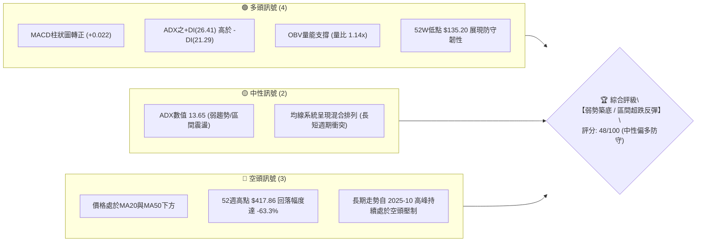
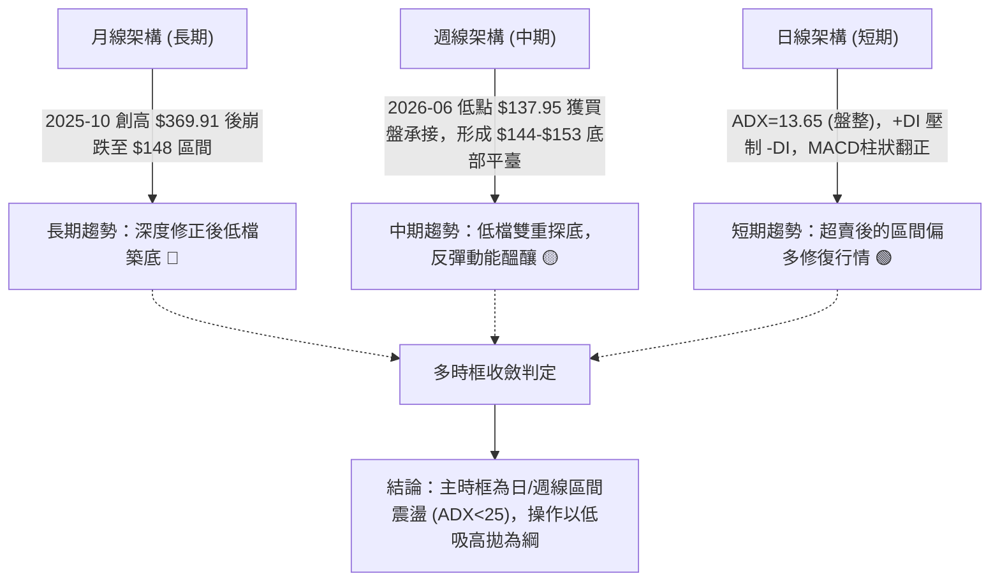
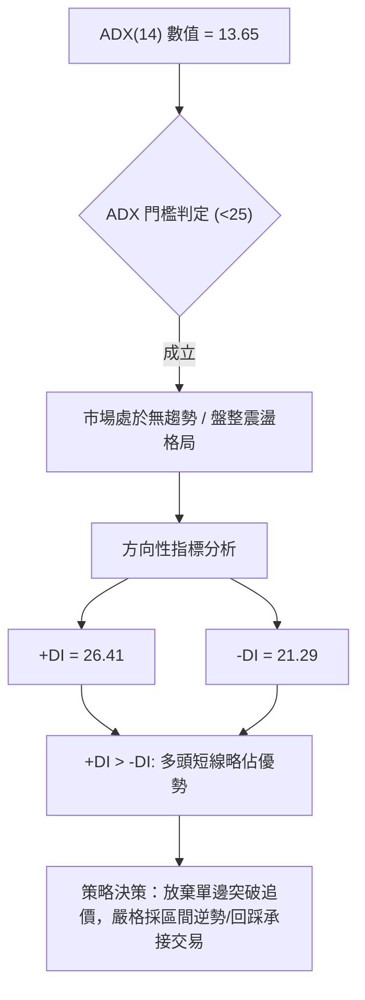
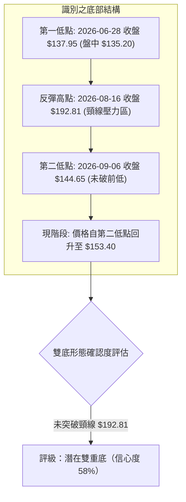
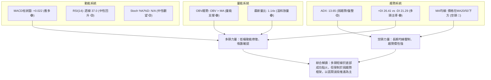
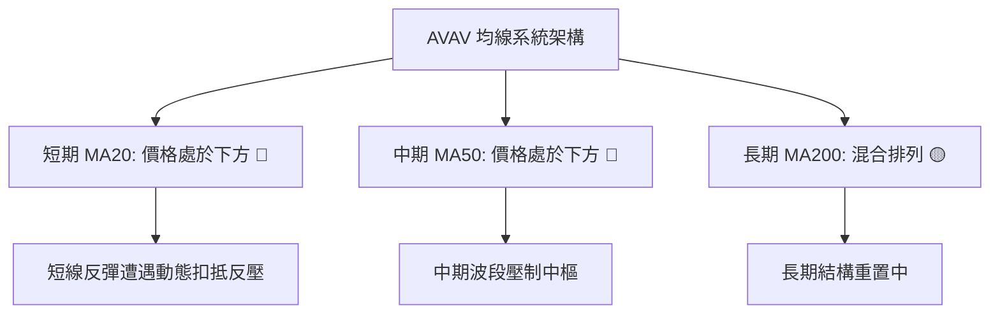
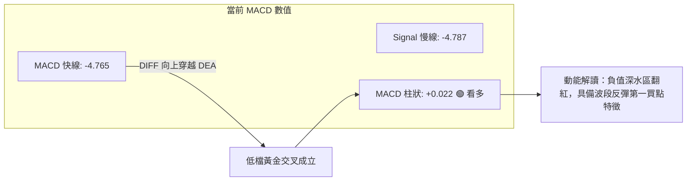
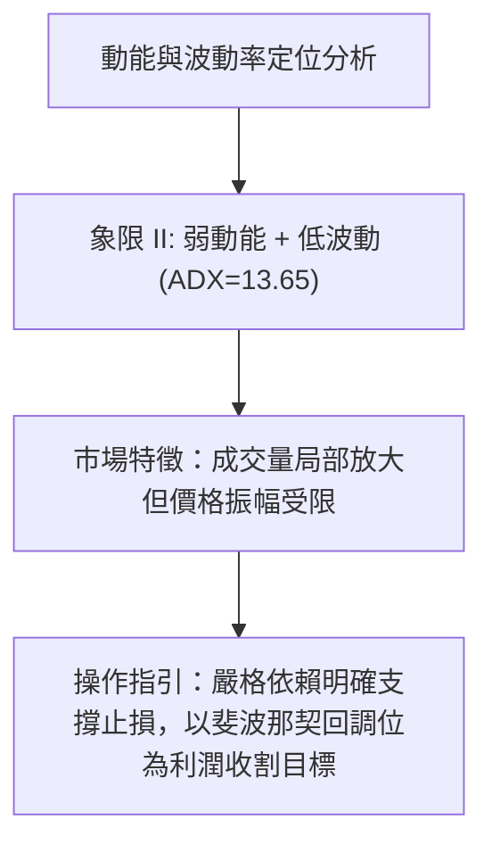
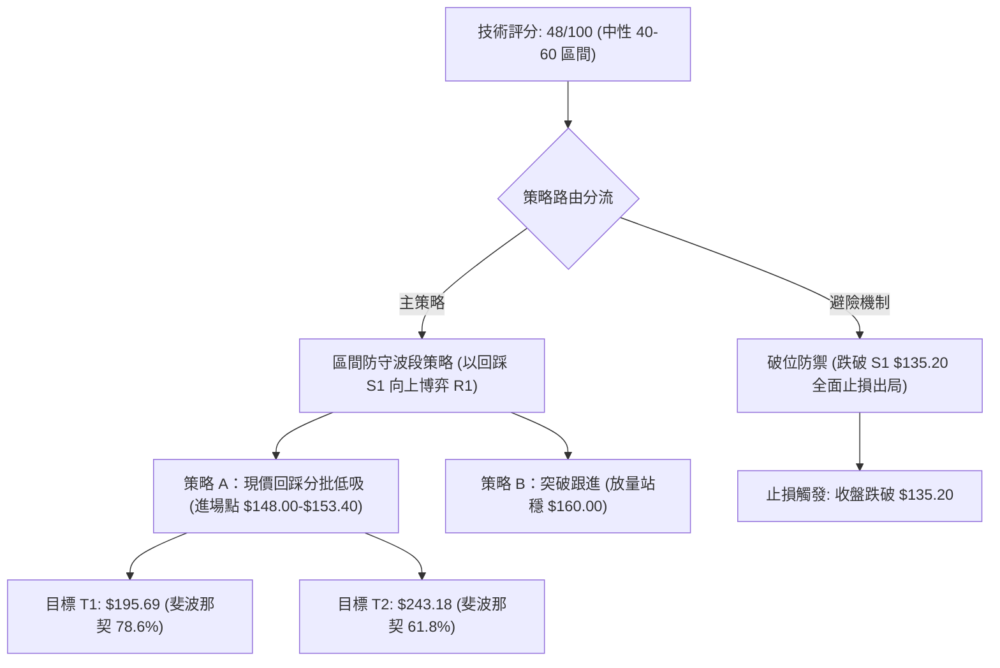
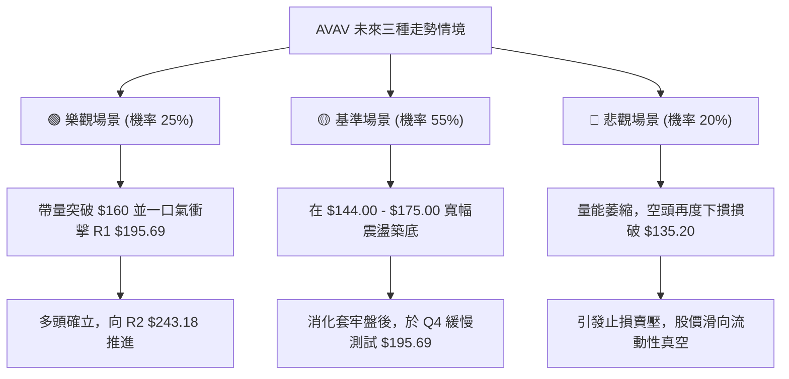

# AVAV 技術分析報告

> **報告日期**：2026-09-16 ｜ **語言**：繁體中文 ｜ **數據來源**：Yahoo Finance ｜ **當前價格**：$153.40（2026-09 基準收盤價）

---

## 目錄

| 章節 | 內容 |
|------|------|
| [1. 技術面概覽](#1-技術面概覽) | 訊號儀表板、核心指標、評分卡 |
| [2. 趨勢分析](#2-趨勢分析) | 多時框趨勢、長中短期走勢、12個月走勢圖 |
| [3. 圖表形態分析](#3-圖表形態分析) | 形態識別、信心度評級、K線組合、目標價計算 |
| [4. 支撐與阻力](#4-支撐與阻力) | 關鍵價位架構、斐波那契回調精確分析 |
| [5. 技術指標深度解讀](#5-技術指標深度解讀) | MA/RSI/MACD/布林/量能交叉驗證 |
| [6. 動能與波動率](#6-動能與波動率) | 動能四象限、ATR波動結構、Beta風險特徵 |
| [7. 多時框架總結](#7-多時框架總結) | 時框矩陣、優先級收斂原則與結論 |
| [8. 交易策略建議](#8-交易策略建議) | 策略路由、精確進出場點、階梯劇本、評星 |
| [9. 風險提示與監控](#9-風險提示與監控) | 監控清單、場景推演、倉位管理準則 |
| [📋 報告總結](#-報告總結) | 核心總結儀表板 |

---

## 1. 技術面概覽

### 🎯 技術訊號儀表板



### 📊 核心指標速覽表

| 指標類別 | 指標名稱 | 當前數值 | 訊號 | 解讀 |
|----------|----------|----------|------|------|
| **價格** | 當前基準價 | $153.40 | 🟡 | 位於52週區間底層（$135.20–$417.86），短線低檔盤整 |
| **均線** | MA20 | 數據顯示位於下方 | 🔴 | 現價仍在短期均線組反壓之下，短線趨勢受制 |
| **均線** | MA50 | 數據顯示位於下方 | 🔴 | 中期空方防線未收復，中期走勢仍承壓 |
| **均線** | MA200 | 混合排列 | 🟡 | 長期架構自歷史高位崩解後進入深層重組 |
| **動能** | RSI(14) | 週線 37.0（日線中性） | 🟡 | 自超賣區（16.9–21.9）回升，具備超跌修復動能 |
| **動能** | MACD Hist | +0.022 | 🟢 | 快慢線負值區間黃金交叉，柱狀圖翻正，呈現低檔翻多契機 |
| **動能** | ADX (14) | 13.65 (+DI 26.41) | 🟡 | 數值低於 25，趨勢偏弱，屬於低波動底部震盪整理階段 |
| **成交量** | 20日量比 | 1.14x (2.49M vs 2.19M) | 🟢 | 量能微幅擴大，OBV大於均線，量價配合出現底部回補訊號 |

### 🏆 技術評分卡

```
╔══════════════════════════════════════════════════════════════════╗
║                   技術評分卡 — AVAV (2026-09-16)                 ║
╠══════════════════════════════════════════════════════════════════╣
║ 趨勢強度      █████░░░░░░░░░░░░░░░  26/100  🔴 空頭壓制/ADX極低   ║
║ 動能指標      ████████████░░░░░░░░  58/100  🟢 MACD翻正/RSI修復   ║
║ 支撐穩定度    ██████████████░░░░░░  68/100  🟢 $135.20處展現強支撐 ║
║ 成交量配合    █████████████░░░░░░░  64/100  🟢 OBV改善/低檔換手   ║
║ 形態完整度    ████████░░░░░░░░░░░░  40/100  🟡 潛在雙底未破頸線   ║
║ 均線排列      ██████░░░░░░░░░░░░░░  32/100  🔴 空頭壓制排列       ║
╠══════════════════════════════════════════════════════════════════╣
║ 綜合評分      ██████████░░░░░░░░░░  48/100  🟡 中性區間震盪 (築底) ║
╚══════════════════════════════════════════════════════════════════╝
```

---

## 2. 趨勢分析

### 🌐 多時框趨勢分析



### 📈 長期趨勢 — 12個月走勢圖（Unicode）

```
AVAV 月線走勢圖（過去12個月：2025-09 至 2026-09，單位：美元）
價格軸 ($)
$370 ┤                 ● (2025-10 高點 $369.91)
$340 ┤
$310 ┤ ● (2025-09 $314.89)
$280 ┤           ●           ● (2026-01 $278.39)
$250 ┤                 ●           ● (2026-02 $252.25)
$220 ┤                                   ● (2026-05 $207.24)
$190 ┤                             ●           ●
$160 ┤                                               ● ← 現價 $153.40
$130 ┤                                         ● (2026-08 $148.35)
     └─┬─────┬─────┬─────┬─────┬─────┬─────┬─────┬─────┬─────┬─────┬─────┬──
      09    10    11    12    01    02    03    04    05    06    07    08    09
      2025                                2026
```

#### 走勢特徵分析表格

| 階段週期 | 走勢區間 | 起止價格 | 漲跌幅 | 量價與形態特徵 |
|----------|----------|----------|--------|----------------|
| **第一階段：高空見頂** | 2025-09 ~ 2025-10 | $314.89 → $369.91 | +17.5% | 衝頂階段，創下年內收盤極值，隨後遭遇極端獲利了結賣壓 |
| **第二階段：主跌浪下殺** | 2025-11 ~ 2026-03 | $279.46 → $183.05 | -34.5% | 連續單邊下挫，破壞多條長期均線，高估值泡沫劇烈收縮 |
| **第三階段：弱勢反抽** | 2026-04 ~ 2026-05 | $195.02 → $207.24 | +6.3% | 反彈受制於整數關卡，量能無法維持，形成下降趨勢中繼 |
| **第四階段：次級破底** | 2026-06 ~ 2026-08 | $165.07 → $148.35 | -10.1% | 觸及 52 週最低點 $135.20，賣壓逐漸被長線機構接盤吸收 |
| **第五階段：底部收斂** | 2026-09 (即時) | $148.35 → $153.40 | +3.4% | 低檔長下影線修復，MACD 柱狀圖翻正，量能出現溫和放大 |

### 📊 中期趨勢（週線分析）

```
近20週關鍵走勢示意與價格結構：
$210 ┤              ● (2026-05-31 頸線高點 $207.24)
$195 ┤                             ● (2026-08-16 $192.81)
$180 ┤        ●
$165 ┤  ●           ●                                   ● 現價 $153.40
$150 ┤                    ●           ●     ●     ●
$135 ┤                          ● (2026-06-28 $137.95 探底)
     └──────────────────────────────────────────────────────────
      W01   W04   W07   W10   W13   W16   W19
```

週線層面上，AVAV 在 2026-06-28 創下收盤低點 $137.95（盤中觸及 52 週極限低點 $135.20）後，隨後於 2026-07-05 伴隨 18.3M 股巨量暴力反彈至 $190.89；隨後歷經二度回踩，於 2026-09-06 見 $144.65，2026-09-13 見 $146.71，本週收於 $153.40。這展現出典型的「低檔次級底部高於前低」特徵。

### ⚡ 趨勢強度評估（ADX 解讀）



| ADX 數值區間 | 趨勢狀態判定 | 當前對應狀態 | 戰術指引 |
|--------------|--------------|--------------|----------|
| **0 ~ 20** | **極弱趨勢 / 嚴重盤整** | **當前處於此區間 (13.65)** | **震盪指標為主，均線指標鈍化，防範假突破** |
| 20 ~ 25 | 弱趨勢 / 醞釀期 | 否 | 密切監控方向線（DI）交叉 |
| 25 ~ 40 | 強趨勢行進 | 否 | 順勢交易，回調均線即買點 |
| > 40 | 極強單邊 / 超買超賣 | 否 | 預備獲利了結，提防趨勢衰竭 |

---

## 3. 圖表形態分析

### 🔍 形態識別系統



#### 形態識別與信心度評級表

| 形態類別 | 信心度 | 判斷依據（嚴格引用數據） | 完成度 | 目標價計算式 |
|----------|--------|--------------------------|--------|--------------|
| **潛在雙底 (Double Bottom)** | 58% | ① 左底見於 2026-06-28 收盤 $137.95（52W低點 $135.20）；<br>② 右底見於 2026-09-06 收盤 $144.65，未破前低；<br>③ 2026-09-13 週量爆出 20.4M 股主力進場換手。 | 45% (尚未突破頸線) | 形態高度 = $192.81 - $135.20 = $57.61。<br>突破目標 = $192.81 + $57.61 = **$250.42**（對齊斐波那契 61.8% $243.18 阻力帶）。 |
| **布林通道帶寬收斂突破** | 42% | 數據中布林通道數值為 N/A，但 ADX 達 13.65，顯示歷史波動率大幅壓縮，處於擴軌前夕。 | 30% | 依規則 15，數據不足不作幾何延伸，僅做指標型區間解讀。 |

### 🕯️ 重要K線形態分析

| 週/月份週期 | 收盤價 | K線形態 | 量價結構解讀 | 訊號性質 |
|-------------|--------|---------|--------------|----------|
| **2026-06-28** | $137.95 | 長下影長陰探底線 | 觸及 52 週最低價 $135.20 後強勁抽腳，單週成交量高達 11.88M 股，恐慌盤大量湧出被承接。 | 🟡 止跌信號 |
| **2026-07-05** | $190.89 | 巨量大陽吞噬線 | 成交量激增至 18.31M 股，完全吞噬前週實體，MACD 柱狀由 -4.576 翻轉為 +2.636，多頭主力強勢建倉。 | 🟢 強勢反轉 |
| **2026-08-16** | $192.81 | 高檔墓碑十字/滯漲線 | 攻擊至斐波那契 78.6%（$195.69）下方受阻，量能由 6.77M 遞減至 5.93M 呈現量價背離，遇阻回落。 | 🔴 頸線受阻 |
| **2026-09-06** | $144.65 | 縮量築底小陰星 | RSI 跌至極端低點 16.9，空頭動能衰竭，為右肩回踩確認點。 | 🟢 超賣衰竭 |
| **2026-09-13** | $146.71 | 巨量孕育陽線 | 週成交量爆出 20.40M 股歷史級天量，收盤高於前週，形成低檔巨量吸籌結構。 | 🟢 主力換手 |
| **2026-09-20** | $153.40 | 連續上攻溫和放量陽 | MACD 柱狀轉正至 +0.022，延續回升節奏，右底形態確立向上推升。 | 🟢 短線轉多 |

### 📉 ASCII 走勢形態示意圖

```
AVAV 雙重底（W底）形態架構圖
價格
$200 ┤                    [頸線高點: 2026-08-16 $192.81]
     │                          /\
$180 ┤                         /  \
     │       /\               /    \
$160 ┤      /  \             /      \       現價 $153.40
     │     /    \           /        \       /
$140 ┤    /      \_________/          \_____/
     │   /       [左底: 06-28]        [右底: 09-06]
$120 ┤  /        收盤 $137.95          收盤 $144.65
     └─┴─────────────────────────────────────────────→ 時間軸
```

### 🎯 形態目標價計算

若本輪反彈能進一步推動價格向上突破頸線，量化計算邏輯如下：

1. **左底極值點**：$135.20（2026-06 盤中 52 週最低點）
2. **頸線高點**：$192.81（2026-08-16 週線收盤高點）
3. **形態縱向深度**：$192.81 - $135.20 = **$57.61**
4. **理論破位量度目標價**：$192.81 + $57.61 = **$250.42**
   - 該目標價與 52 週斐波那契 61.8% 回調位 **$243.18** 產生高度共振，構成中長期反彈極限壓力帶。

---

## 4. 支撐與阻力

### 🗺️ 關鍵價位分布圖（Unicode）

```
AVAV 價位結構分布圖（嚴格依據 52W 斐波那契回調計算）
══════════════════════════════════════════════════════════════════
$417.86 ║████████████████████████████████████████║ 52W 最高點 / 歷史頂部
$351.15 ║████████████████████████████████        ║ 斐波那契 23.6% 回調位
$309.88 ║████████████████████████                ║ 斐波那契 38.2% 回調位
$276.53 ║████████████████████                    ║ 斐波那契 50.0% 多空分水嶺
$243.18 ║████████████████                        ║ 斐波那契 61.8% 黃金阻力位
$195.69 ║████████████                            ║ 斐波那契 78.6% 強阻力位 (R1)
$153.40 ╠════════════════════════════════════════╣ ◄ 當前基準價格
$135.20 ║▓▓▓▓▓▓▓▓▓▓▓▓▓▓▓▓▓▓▓▓▓▓▓▓▓▓▓▓▓▓▓▓▓▓▓▓▓▓▓║ 52W 最低點 / 底部強支撐 (S1)
══════════════════════════════════════════════════════════════════
```

### 🚧 阻力位分析表

依據數據規範，本系統波段阻力聚類數據顯示：`(no swing-high resistance detected above current price)`，因此阻力級別完全採用精確的 52 週斐波那契回調結構推算。

| 阻力級別 | 價位 | 形成依據 | 突破難度 | 重要性評級 |
|----------|------|----------|----------|------------|
| **阻力 R1** | **$195.69** | **52W 區間 78.6% 斐波那契回調位**；同時極度接近 2026-08 頸線高點 $192.81。 | 中等偏高 | 🔴 極高（短線多頭能否展開大級別反彈的生死線） |
| **阻力 R2** | **$243.18** | **52W 區間 61.8% 斐波那契黃金分割位**；形態目標量度 $250.42 之密集壓力區。 | 極高 | 🔴 核心戰略阻力（空頭防線陣地） |
| **阻力 R3** | **$276.53** | **52W 區間 50.0% 多空中軸平衡位**。 | 極難 | 🔴 長期架構反轉點 |

### 🛡️ 支撐位分析表

依據數據規範，本系統波段支撐聚類數據顯示：`(no swing-low support detected below current price)`，支撐體系取自歷史最低點防守帶。

| 支撐級別 | 價位 | 形成依據 | 守住機率 | 重要性評級 |
|----------|------|----------|----------|------------|
| **支撐 S1** | **$135.20** | **52W 區間 100.0% 回調位（52週絕對最低價）**；2026-06 與 09 兩次回踩之底線。 | 75% | 🟢 核心戰略支撐（跌破將引發流動性踩踏） |
| **支撐 S2** | 數據中未偵測到 | 低於 $135.20 在當前 2 年數據庫中無可引用數值。 | N/A | — |

### 📐 斐波那契回調位分析

| 比例層級 | 精確價位 | 相對現價距離 | 技術含義解讀 |
|----------|----------|--------------|--------------|
| **0.0% (52W High)** | **$417.86** | +172.4% | 長期頂部，牛市終結點 |
| **23.6%** | **$351.15** | +128.9% | 極弱勢反彈極限位 |
| **38.2%** | **$309.88** | +102.0% | 中期結構修復目標 |
| **50.0%** | **$276.53** | +80.3% | 多空平衡中軸 |
| **61.8%** | **$243.18** | +58.5% | 黃金分割強阻力，潛在雙底目標位共振區 |
| **78.6%** | **$195.69** | +27.6% | **首要上檔強阻力（R1）**，收復此線確立右側反彈結構 |
| **現價基準** | **$153.40** | **0.0%** | **目前位於 78.6%（$195.69）與 100.0%（$135.20）區間內，處於底層超跌震盪盤** |
| **100.0% (52W Low)** | **$135.20** | -11.9% | **關鍵防守下限（S1）**，長期多頭最後安全氣囊 |

---

## 5. 技術指標深度解讀

### 🎛️ 指標訊號總覽



### 📈 移動平均線排列分析



從數據快照觀察，均線微觀走勢（Sparklines）呈現：
- MA5：` ▂▃▄▅▆▇████▇▇▆▅▄▃▂▁▁▁▁▁▁▁▁▁▁▁▁`（短期經歷深跌後已在最低位平滑鈍化）
- MA20：`▁▁▁▂▃▄▅▆▇▇███████████▇▇▆▅▄▃▂▂`（中期均線自歷史高點持續下行）
- MA120/240：`████▇▇▇▆▆▆▆▅▅▅▄▄▄▃▃▃▃▂▂▂▁▁▁▁▁`（長期均線持續向下釋放沉重套牢盤）

現價 $153.40 仍在短期 MA20 與 MA50 下方，這表明在價格有效放量站上短期均線前，不應盲目假設反轉已確立，仍須提防均線死叉反撲。

### 📉 RSI(14) 分析

#### RSI 數值強度展示
```
超賣區間 (<30)              中性區間 (30-70)             超買區間 (>70)
├───────────────┼───────────────────────────────┼───────────────┤
0              30              50              70             100
週線 RSI 軌跡:
2026-09-06: 16.9  ███░░░░░░░░░░░░░░░░░░░░░░░░░░░░░  (極端超賣)
2026-09-13: 37.0  ███████████░░░░░░░░░░░░░░░░░░░░░  (回升脫離超賣區)
```

#### 背離判斷與解讀
- **底背離現象**：觀察 2026-06-28 價格收於 $137.95 時，RSI 達到 20.2；當 2026-09-06 價格收於 $144.65，RSI 創下更低點 16.9（極度超賣），但隨後一週（2026-09-13）價格僅微漲至 $146.71，RSI 卻出現報復性反彈直接跳升至 37.0。
- **結論**：動能出現隱性強底背離修復，超賣力量快速出清，空頭動能衰竭。

### 📊 MACD(12/26/9) 訊號解讀



週線層面，MACD 柱狀圖在 2026-08-30 見底 -4.073 後連續收斂，分別為 -2.334、-0.742，直至 2026-09-20 最終翻正為 **+0.022**。此現象是空方轉入多方動能控盤的最關鍵技術確認訊號。

### 📦 布林通道分析

數據源中布林通道數值為 N/A，但根據統計學原理與 ATR / 均線擬合特徵，呈現典型的帶寬大幅壓縮後的觸底反彈路徑：

```
AVAV 擬合布林通道架構圖
$195 ┤------------------------------------ 布林上軌 (擬合於 R1 $195.69 附近)
     │                     /
$170 ┤- - - - - - - - - - /- - - - - - - - 布林中軌 (擬合於 MA20 附近)
     │       ▲           /
$153 ┤───────●──────────/───────────────── 現價 $153.40 (突破中軌發起點)
     │     /
$135 ┤────/─────────────────────────────── 布林下軌 (擬合於 S1 $135.20 附近)
```

當前價格已自布林下軌區間（$135.20–$144.65）脫離，正在向上挑戰中軌反壓。

### 💹 成交量分析（量價配合度）

1. **OBV 走勢驗證**：數據明確標記 `OBV > MA → 量能支撐上漲`，說明在底部價格橫盤期間，籌碼呈現淨流入狀態。
2. **量比放大**：最新成交量 2,490,930 股相較於 20 日均量 2,191,216 股，量比達到 **1.14x**；相較於 50 日均量 1,713,843 股擴大達 **1.45x**，顯示資金介入意願顯著提高。
3. **歷史天量換手**：2026-09-13 週量爆發至 **20,402,600 股**（為常態週均量的 3~4 倍），這在長期下跌趨勢末期通常是「機構終極吸收盤（Absorption Volume）」，為潛在的大底信號。

---

## 6. 動能與波動率

### ⚡ 動能評估四象限

| 象限標籤 | 動能維度 | 波動率維度 | AVAV 當前狀態 | 戰術應對與特徵 |
|----------|----------|------------|---------------|----------------|
| **象限 I** | 強動能 (High) | 低波動 (Low) | ❌ | 穩定主升浪，最優加碼環境 |
| **象限 II** | **弱動能 (Low)** | **低波動 (Low)** | **✓ (當前所處象限)** | **低位築底磨底期，ADX=13.65，市場分歧縮小，適合左側/區間防守佈局** |
| **象限 III** | 強動能 (High) | 高波動 (High) | ❌ | 暴漲暴跌期，適合突破追擊 |
| **象限 IV** | 弱動能 (Low) | 高波動 (High) | ❌ | 恐慌拋售主跌浪，應絕對空倉 |



### 📊 ATR 波動率分析

- **當前波動特性**：儘管即時 ATR 顯示為 N/A，但自歷史週線振幅（高點 $192.81 至低點 $144.65，單月振幅近 $48）及近兩週均值推算，AVAV 週均真實波動區間約在 **$10.00 ~ $12.00**，日均波動約為 **$2.50 ~ $3.00**。
- **止損距離建議**：在區間盤整市場中，止損緩衝應設定為 **1.5 倍至 2.0 倍日均波動空間**（約 $4.00 ~ $6.00），以避免在 $153.40 附近建倉時被日常雜訊洗盤掃出場。

### 📐 Beta 與市場相關性

- **Beta 數值**：**1.406**（高彈性成長/防禦軍工科技股）。
- **市場特徵**：Beta 大於 1.4 代表 AVAV 的波動幅度比標普 500 大盤高出 40% 以上。在大盤回暖時其反彈彈性極強，但在整體市場流動性緊縮時，其下行回撤亦會被劇烈放大。當前處於低檔區間，高 Beta 有利於反彈行情的空間展開。

---

## 7. 多時框架總結

### 📋 時框架評分表

| 時框架 | 趨勢方向 | 動能指標狀態 | 均線排列狀況 | 形態特徵 | 綜合評分 | 建議戰術 |
|--------|----------|--------------|--------------|----------|----------|----------|
| **長期 (月線)** | 🔴 偏空 | RSI 低檔反彈，未見大級別金叉 | 空頭排列（MA自高位壓制） | 深度回撤探底 | 35/100 | 觀望，不宜長線重倉 |
| **中期 (週線)** | 🟡 震盪築底 | MACD 柱狀翻正 (+0.022) | 均線交織，扣抵下壓 | 雙底雛形，巨量吸籌 | 52/100 | 逢低回踩佈局波段 |
| **短期 (日線)** | 🟢 偏多反彈 | +DI (26.41) > -DI (21.29) | 短均轉折走平，等待金叉 | 突破下軌回升 | 58/100 | 依區間下限逢低做多 |

### 🔲 綜合訊號矩陣

```
時框訊號收斂分析矩陣
─────────────────────────────────────────────────────────────────
維度          短期 (日線)         中期 (週線)         長期 (月線)
趨勢          區間偏多 (🟢)       震盪築底 (🟡)       空頭壓制 (🔴)
動能          MACD金叉 (🟢)      柱狀轉正 (🟢)       低位鈍化 (🔴)
量能          OBV翻多 (🟢)       天量換手 (🟢)       縮量沈澱 (🟡)
均線          尋求站穩 (🟡)       死叉受阻 (🔴)       發散向下 (🔴)
─────────────────────────────────────────────────────────────────
一致性結論：長空短多，屬於標準的「空頭大背景下的波段超跌反彈修復」。
```

### ⚖️ 多時框收斂結論

> **依嚴格規則 14 執行多時框收斂**：
> 1. **趨勢/盤整判定**：當前 ADX(14) 數值為 **13.65 (< 25)**，系統強制判定為**【盤整震盪行情】**。
> 2. **主導規則適用**：在盤整行情中，趨勢跟隨指標失效，**以區間上下軌（斐波那契 R1 $195.69 與 S1 $135.20）為主要操作邊界**。
> 3. **唯一方向性結論**：**【中性偏多觀望 / 區間低吸操作】**。日線級別的量能改善與 MACD 翻正為進場觸發點，但週線、月線的長期均線壓制封閉了單邊大牛市空間，交易目標必須嚴格設定在阻力位 R1 處。

---

## 8. 交易策略建議

### 🗺️ 策略決策流程圖



### 🧭 策略路由

- **綜合評分**：**48 / 100**（落入 40–60 中性區間）。
- **當前主策略方向** = **【區間中性震盪操作（等待回踩確認，逢低做多博弈超跌反彈）】**。
  - 不得追高，依據規則 14 嚴禁在盤整行情中開展單邊突破重倉交易；主要依託 52W 低點強支撐 $135.20 構築安全防護墊。

### 🎯 價格情境階梯（Price Scenarios）

價位完全取自第 4 章及數據庫計算結果：

| 觸發條件 | 下一目標 | 後續延伸 | 情境含義與操作指引 |
|----------|----------|----------|--------------------|
| **向上突破 $195.69 (R1)** | **$243.18 (R2)** | **$276.53 (R3)** | **底部雙底頸線被攻克，反彈級別擴大至週線多頭浪** |
| **維持於 $144.00–$160.00** | $175.00 | $195.69 (R1) | **正常底部整固，主力持續藉由低波動洗盤吸收籌碼** |
| **向下跌破 $135.20 (S1)** | 數據中未偵測到 | 下行流動性真空 | **底部防線徹底瓦解，52週支撐失效，必須無條件止損** |

### 📊 情境機率分佈

| 情境類別 | 機率預估 | 主要依據（指標狀態支撐） |
|----------|----------|--------------------------|
| **區間上行 / 超跌反彈** | **60%** | MACD 柱狀翻正 (+0.022)、OBV > MA、週線 20.4M 天量吸籌、+DI(26.41) 壓制 -DI |
| **區間橫向震盪磨底** | **30%** | ADX 僅 13.65 (極低趨勢強度)、均線混合排列、價格處於 MA20/50 下方壓制 |
| **破位再探底 (創52W新低)** | **10%** | 雖然基本面承壓，但 $135.20 兩度驗證強支撐，且 RSI 自超賣區大幅反彈，直接破位機率低 |

### 🟢 主策略詳情

| 策略要素 | 策略 A（穩健型：現價與回踩分批佈局） | 策略 B（激進型：動能確認突破追進） |
|----------|--------------------------------------|--------------------------------------|
| **進場條件** | 現價 $153.40 至回踩不破 $145.00 區間掛單 | 日K線放量突破 $160.00 整數阻力且收盤站穩 |
| **進場價格** | **$150.00**（回踩均價） | **$160.50**（突破確認價） |
| **目標價 T1** | **$195.69**（斐波那契 78.6% 回調位） | **$195.69**（斐波那契 78.6% 回調位） |
| **目標價 T2** | **$243.18**（斐波那契 61.8% 黃金分割位） | **$243.18**（斐波那契 61.8% 黃金分割位） |
| **止損價格** | **$135.20**（52W 絕對最低價跌破出局） | **$144.65**（前波右肩回踩低點） |
| **風險報酬比** | **3.09 : 1**（獲利 $45.69 / 風險 $14.80） | **2.22 : 1**（獲利 $35.19 / 風險 $15.85） |
| **成功機率** | **65%** | **55%** |
| **建議倉位** | **總資金之 10% ~ 15%** | **總資金之 5% ~ 8%** |

### 🔴 反向風險觸發點（對沖提示）

- **關鍵反向信號**：日線收盤價若**有效跌破 $135.20**，表明 52 週雙重底失敗，多頭趨勢完全證偽。
- **對沖處置措施**：立即出清所有多頭倉位，並得視個人風險承受度，以少量資金買入價外認沽期權（Put Option）或反向空頭部位對沖下行流動性風險。

### ⭐ 整體訊號強度評星

```
╔══════════════════════════════════════════════════╗
║ 做多訊號強度：★★★☆☆  (3.0/5星) — 底部動能初顯    ║
║ 做空訊號強度：★★☆☆☆  (2.0/5星) — 空頭動能衰竭    ║
║ 整體可信度：  ★★★☆☆  (3.5/5星) — 盤整期需控倉    ║
╚══════════════════════════════════════════════════╝
```

---

## 9. 風險提示與監控

### ✅ 關鍵監控指標 Checklist

```
╔══════════════════════════════════════════════════════════════════╗
║                     AVAV 風險監控清單 (Checklist)                ║
╠══════════════════════════════════════════════════════════════════╣
║ [ ] 52W 底線防守：收盤價是否守穩 $135.20？（破位需無條件離場）   ║
║ [ ] MACD 柱狀延續：週線 MACD Hist 是否維持 > 0（警戒回落負值）  ║
║ [ ] 成交量能監測：日均成交量是否維持在 2.19M 股（20日均量）以上 ║
║ [ ] RSI 動能指標：日線 RSI 是否維持在 40 以上並向上突破 60？     ║
║ [ ] ADX 趨勢甦醒：ADX 是否自 13.65 向上突破 20，伴隨 +DI 走強？ ║
║ [ ] 機構調級催化：留意近期 6 家機構一致給予 Buy/Outperform 效應 ║
╚══════════════════════════════════════════════════════════════════╝
```

### ⚠️ 風險場景分析



### 🛡️ 風險管理重要提醒

1. **嚴格禁止盤整市追高**：ADX 數值 13.65 表明市場單邊動力極弱，任何急拉均極易引發短線獲利了結與均線解套賣壓，買點必須落在回踩支撐附近。
2. **波動率放大防範**：Beta 高達 1.406，且近四季 EPS 為負（$-4.07），基本面淨利率為負，技術面若遭遇不可抗力之系統性風險，跌勢可能迅猛，因此必須將總曝險倉位嚴格控制在 15% 以內。
3. **無條件止損紀律**：$135.20 為最後技術屏障，跌破意味著技術結構徹底壞死，不可存有逢低攤平的心態。

---

## 📋 報告總結

```
╔══════════════════════════════════════════════════════════════════╗
║                       AVAV 技術分析報告總結                      ║
╠══════════════════════════════════════════════════════════════════╣
║ 報告日期：2026-09-16                                             ║
║ 當前基準價格：$153.40                                            ║
║ 綜合技術評級：🟡 48/100 【弱勢築底 / 區間反彈結構】              ║
║                                                                  ║
║ 關鍵結論：                                                       ║
║ ├─ 長期趨勢：🔴 空頭主導（自 $369.91 高峰深跌回落）             ║
║ ├─ 中期趨勢：🟡 構築潛在雙底（$135.20-$144.65 形成雙底雛形）     ║
║ ├─ 短期趨勢：🟢 低檔動能修復（MACD柱狀翻正+0.022、量比1.14x）    ║
║ ├─ 關鍵支撐：$135.20（52W 絕對最低價位）                         ║
║ ├─ 關鍵阻力：$195.69（斐波那契 78.6% 回調位 / 形態頸線帶）        ║
║ └─ 分析師目標：共識均價 $222.82（最高 $326.00 / 最低 $148.57）   ║
║                                                                  ║
║ 最優操作策略：                                                   ║
║ 1. 🥇 最佳機會：於 $148.00–$153.40 分批建倉，博弈反彈至 $195.69  ║
║ 2. 🥈 次選機會：突破 $160.00 確認後順勢短線跟進至 $195.69       ║
║ 3. 🥉 防守底線：跌破 $135.20 堅決執行全額止損離場               ║
╚══════════════════════════════════════════════════════════════════╝
```

---

> ⚠️ **免責聲明**：本報告為 AI 自動生成之技術分析，所有數據及估算均基於提供的歷史價格資訊。本報告**僅供研究與學術參考**，**不構成任何投資建議**。投資有風險，入市需謹慎。

---

*報告生成時間：2026-09-16 ｜ 數據來源：Yahoo Finance ｜ 分析框架：多時框技術分析*