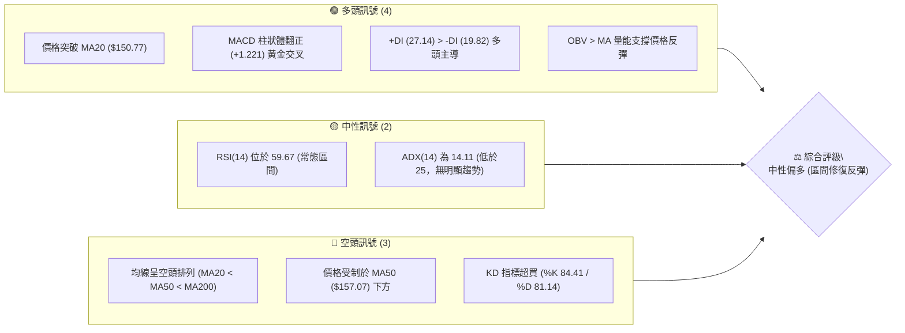
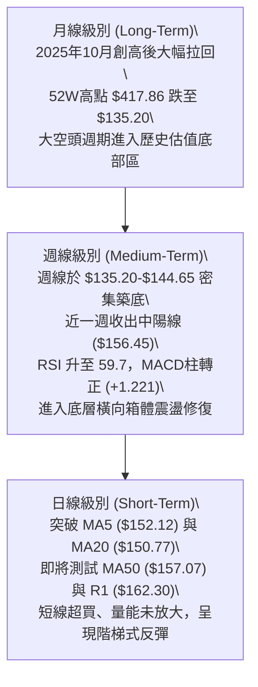
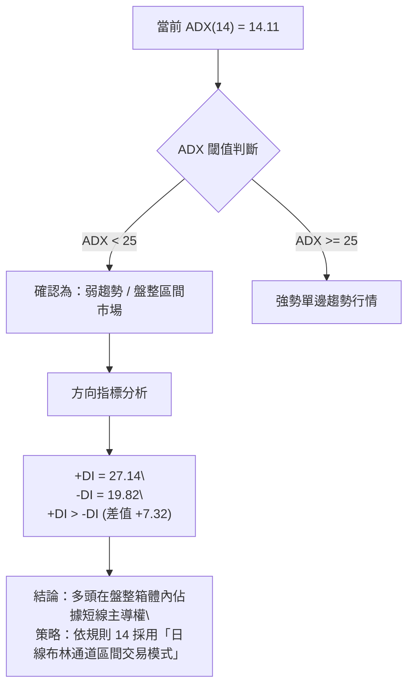
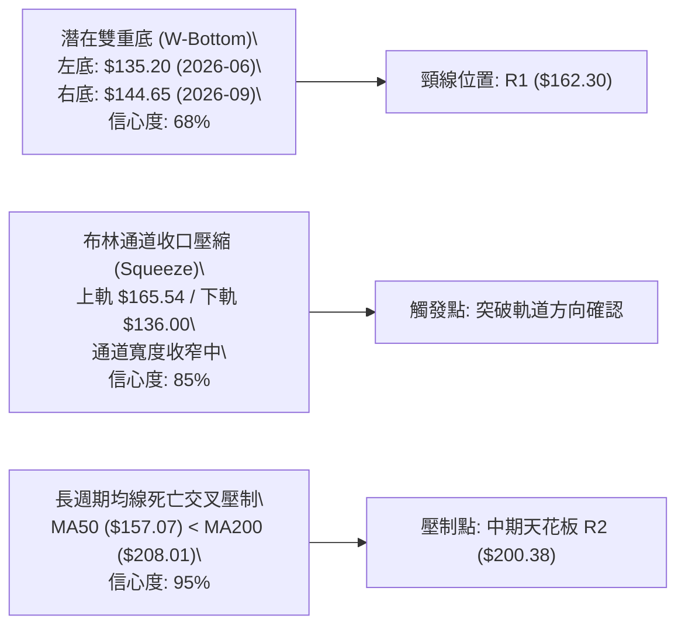
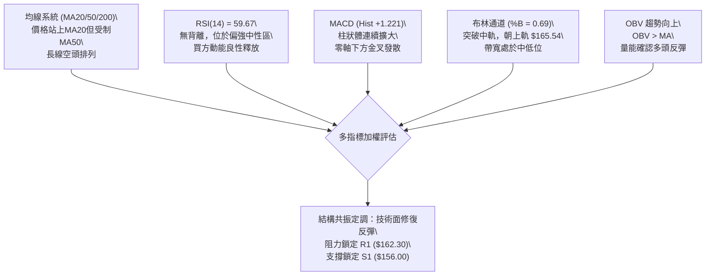
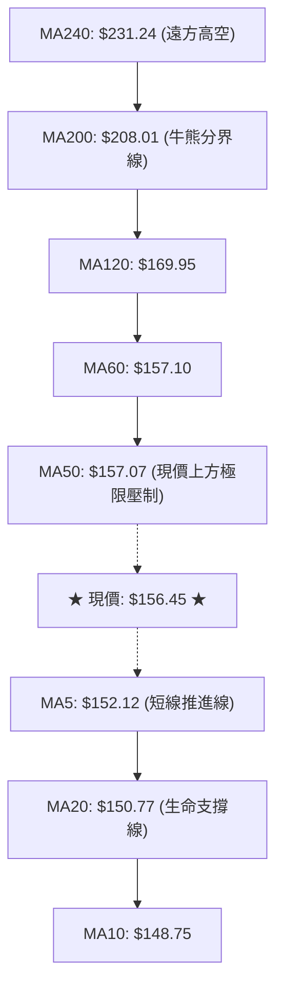
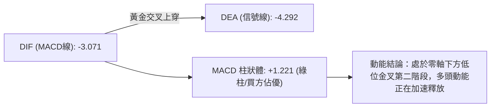
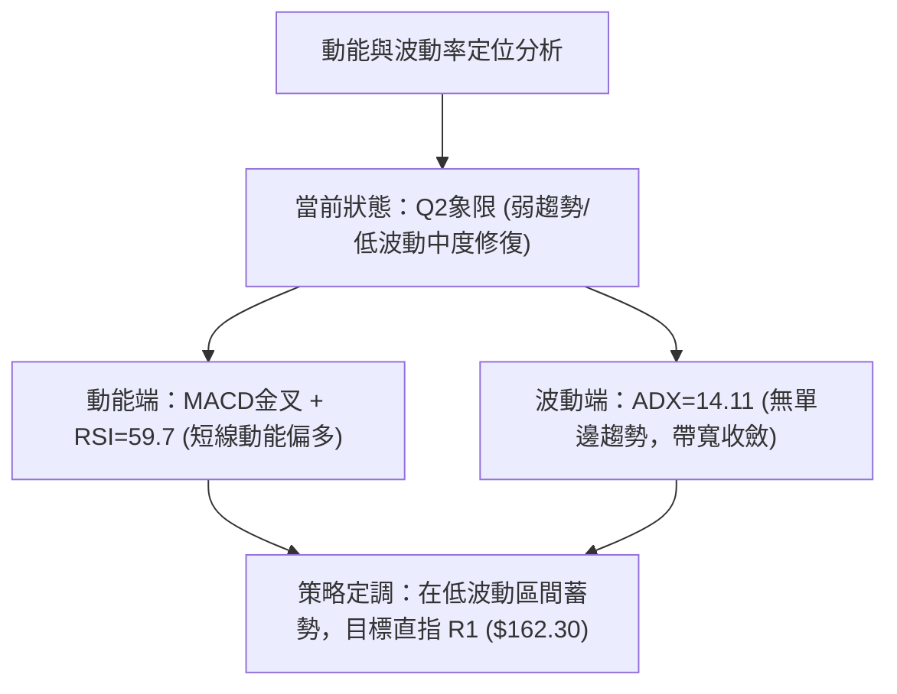
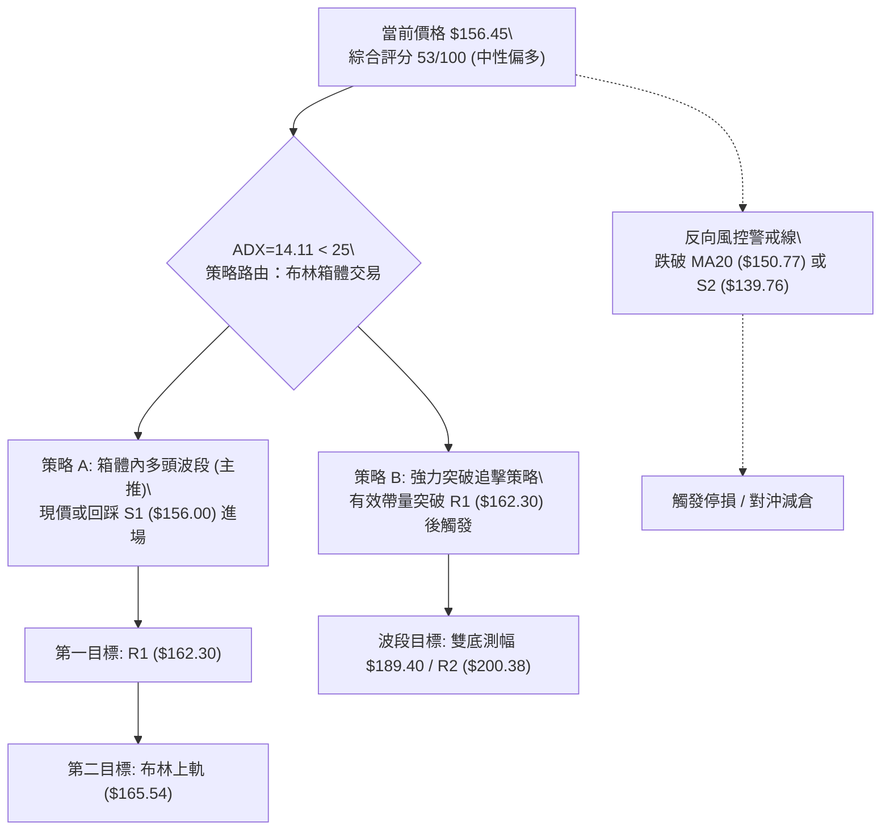
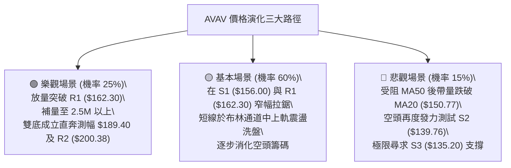

# AVAV 技術分析報告

> **報告日期**：2026-09-17 ｜ **語言**：繁體中文 ｜ **數據來源**：Yahoo Finance ｜ **當前價格**：$156.45

---

## 目錄

| 章節 | 內容 |
|------|------|
| [1. 技術面概覽](#1-技術面概覽) | 訊號儀表板、核心指標、評分卡 |
| [2. 趨勢分析](#2-趨勢分析) | 多時框趨勢、長中短期走勢、12個月走勢圖 |
| [3. 圖表形態分析](#3-圖表形態分析) | 形態識別、信心度評估、K線組合、目標價推算 |
| [4. 支撐與阻力](#4-支撐與阻力) | 關鍵價位分布圖、S/R分析、斐波那契回調結構 |
| [5. 技術指標深度解讀](#5-技術指標深度解讀) | MA/RSI/MACD/布林通道/成交量與OBV |
| [6. 動能與波動率](#6-動能與波動率) | 動能四象限、ATR波動率、Beta與市場相關性 |
| [7. 多時框架總結](#7-多時框架總結) | 時框架矩陣、多時框收斂定調（ADX規則） |
| [8. 交易策略建議](#8-交易策略建議) | 策略路由、價格情境階梯、主策略詳情與風控 |
| [9. 風險提示與監控](#9-風險提示與監控) | 監控Checklist、三情境風險路徑、倉位管理 |
| [10. 報告總結](#10-報告總結) | 技術面結論、最優策略組合與免責聲明 |

---

## 1. 技術面概覽

### 🎯 技術訊號儀表板



---

### 📊 核心指標速覽表

| 指標類別 | 指標名稱 | 當前數值 | 訊號 | 解讀 |
|:---|:---|:---:|:---:|:---|
| **價格** | 當前價格 | $156.45 | 🟡 | 位於52週區間7.5%底部邊緣，短線嘗試脫離低位 |
| **均線** | MA20 | $150.77 | 🟢 | 現價高於MA20 (+3.77%)，短線底部支撐確立 |
| **均線** | MA50 | $157.07 | 🔴 | 現價位於MA50下方 (-0.39%)，短線面臨動態阻力 |
| **均線** | MA200 | $208.01 | 🔴 | 遠低於MA200 (-24.79%)，中長期大格局仍屬空方修復期 |
| **動能** | RSI(14) | 59.67 | 🟡 | 脫離超賣區向中軸上方推進，無頂底背離，處於強勢中性格局 |
| **動能** | MACD (12,26,9) | -3.071 / -4.292 | 🟢 | 快線突破慢線，柱狀體 +1.221，零軸下黃金交叉發酵中 |
| **震盪** | Stoch %K / %D | 84.41 / 81.14 | 🔴 | 進入短線超買區，需警惕在 R1 附近出現震盪回洗 |
| **趨勢強度**| ADX(14) | 14.11 | 🟡 | ADX < 25 代表非趨勢單邊市，目前為「典型區間盤整市場」 |
| **通道** | 布林通道 %B | 0.69 | 🟢 | 位於中軌 ($150.77) 與上軌 ($165.54) 之間，偏多推進 |
| **量能** | 當日量 / 20日均量 | 1.50M / 2.23M | 🟡 | 量比 0.67x，縮量反彈，OBV 指向健康但突破需補量 |
| **波動** | ATR(14) | $8.76 | 🟡 | 每日平均波動幅度為 5.60%，設定止損與止盈之基準尺度 |

---

### 🏆 技術評分卡

```
╔════════════════════════════════════════════════════════════════╗
║                技術評分卡 — AVAV (2026-09-17)                  ║
╠════════════════════════════════════════════════════════════════╣
║ 趨勢強度 (ADX=14.11)    ██████░░░░░░░░░░░░░░  32/100 🔴 弱勢震盪 ║
║ 動能指標 (MACD/RSI)     █████████████░░░░░░░  65/100 🟢 金叉修復 ║
║ 支撐穩定度 (S1/S2防守)  ██████████████░░░░░░  70/100 🟢 雙重底雛形║
║ 成交量配合 (OBV/量比)   ██████████░░░░░░░░░░  50/100 🟡 縮量待補 ║
║ 形態完整度 (箱體整理)   ████████████░░░░░░░░  60/100 🟡 區間震盪 ║
║ 均線排列 (空頭排列承壓) ██████░░░░░░░░░░░░░░  30/100 🔴 長線承壓 ║
╠════════════════════════════════════════════════════════════════╣
║ 綜合技術評分            ███████████░░░░░░░░░  53/100 🟡 中性偏多 ║
║ 定位結論：底背離修復後的「布林通道區間震盪」，以波段高出低進為主║
╚════════════════════════════════════════════════════════════════╝
```

---

## 2. 趨勢分析

### 🌐 多時框趨勢分析



---

### 📈 長期趨勢 — 12個月走勢圖（Unicode）

以下為 AVAV 過去 12 個月（2025年10月至2026年09月）的月線收盤走勢全貌：

```
AVAV 月線收盤走勢圖（2025-10 至 2026-09）
價格軸 ($)
$370 ┤  ● (2025-10: $369.91 波段高點，隨後見52W高點 $417.86)
$340 ┤   \
$310 ┤    \
$280 ┤     ●──┐ (2025-11: $279.46)
$250 ┤        ●──● (2025-12: $241.89 / 2026-01: $278.39 反彈不過頂)
$220 ┤            \
$190 ┤             ●──● (2026-03: $183.05 / 2026-05: $207.24 次級反彈)
$160 ┤                 \  ● (2026-06: $165.07)
$150 ┤                  ●──●──●← 現價 $156.45 (2026-09)
$135 ┤                      ● (2026-08/09 探底低點聚類 S3: $135.20)
     └────────────────────────────────────────────────────────────►
       M1  M2  M3  M4  M5  M6  M7  M8  M9 M10 M11 M12 (月份進程)
       10  11  12  01  02  03  04  05  06  07  08  09 (西元月份)
```

#### 走勢特徵分析表格

| 階段階段 | 時間跨度 | 價格起訖 | 區間漲跌幅 | 走勢特徵與量價結構分析 |
|:---|:---:|:---:|:---:|:---|
| **頂部派發期** | 2025-10 ~ 2025-12 | $369.91 → $241.89 | -34.61% | 在觸及 $417.86 歷史高位後快速跌破上升趨勢線，形成主跌浪。 |
| **中繼反彈期** | 2026-01 ~ 2026-05 | $278.39 → $207.24 | -25.56% | 呈現典型的「反彈無力、破底有餘」空頭中繼結構，反彈高點受制於 MA200。 |
| **恐慌探底期** | 2026-06 ~ 2026-08 | $207.24 → $148.35 | -28.42% | 2026-06-28 爆出 11.88M 週天量下殺至 $137.95，機構籌碼進行洗盤換手。 |
| **底部構築期** | 2026-08 ~ 2026-09 | $148.35 → $156.45 | +5.46% | 連續三週於 $144-$146 獲得支撐，最新一週量能回升至 7.05M，MACD 翻紅。 |

---

### 📊 中期趨勢（週線分析）

從近 20 週的收盤價聚類來看，AVAV 呈現「雙重底收斂」結構：
- **第一低點**：2026-06-28 收盤 $137.95（低點見 $135.20，週成交量 11.88M）
- **中間頸線反彈**：2026-07-05 收盤 $190.89（成交量 18.31M 爆發）與 2026-08-16 收盤 $192.81
- **第二低點**：2026-09-06 收盤 $144.65（週 RSI 觸及 16.9 極度超賣區）
- **當前位置**：2026-09-20 週收盤 $156.45，週 RSI 回升至 59.7，週 MACD 柱狀體跳增至 +1.221。

```
中期週線支撐阻力結構示意圖：
[$195.69 - $200.38] ══════════════════ 斐波那契 78.6% 回調位 / 強阻力 R2
                       ▲ 中期目標
[$162.30 - $165.54] ────────────────── 阻力位 R1 / 布林上軌（短線壓制）
         ▲ 現價 $156.45 (嘗試向上脫離箱體下緣)
[$150.77 - $156.00] ------------------ 布林中軌 (MA20) / 近期支撐 S1
                       ▼ 關鍵防守
[$135.20 - $139.76] ══════════════════ 52W低點聚類 S3 / 支撐位 S2 (雙底基石)
```

---

### ⚡ 趨勢強度評估（ADX 解讀）



#### ADX 趨勢強度對照表

| 指標項 | 當前數值 | 參考臨界值 | 狀態定調 | 操作涵義 |
|:---|:---:|:---:|:---:|:---|
| **ADX(14)** | **14.11** | 25.00 | **無單邊趨勢（弱震盪）** | 禁止進行單邊突破長線追單，以區間低吸高拋為宜 |
| **+DI(14)** | **27.14** | 20.00 | **短線偏多** | 買方動能自低位顯著恢復，推動價格遠離 S1 |
| **-DI(14)** | **19.82** | 20.00 | **空方減弱** | 空方打壓力道放緩，跌破 $135.20 的風險暫時解除 |

---

## 3. 圖表形態分析

### 🔍 形態識別系統

根據規則 15，所有形態嚴格按照量化數據與幾何特徵計算，禁止任何無數據支持的過度解讀。



#### 形態識別信心度評估表

| 形態名稱 | 信心度 | 判斷依據（引用實際數據） | 完成度 | 目標價（附計算式） |
|:---|:---:|:---|:---:|:---|
| **潛在雙重底 (W-Bottom)** | **68%** | 兩次低點分別落於 2026-06 的 $137.95 (最低 $135.20) 與 2026-09 的 $144.65；右底明顯高於左底，週線 MACD 柱翻正 (+1.221)。 | 75%（等待突破頸線） | **$189.40**<br>計算式：頸線 R1 ($162.30) + 形態高度 [$162.30 - 支撐 S3 ($135.20) = $27.10] = **$189.40** |
| **矩形箱體震盪** | **85%** | 價格在 S2 ($139.76) 與 R1 ($162.30) 之間高頻震盪達 14 週，ADX 僅 14.11 充分確認箱體屬性。 | 90%（正在測試箱體頂部） | **$184.84**<br>計算式：箱頂 R1 ($162.30) + 箱體高度 [$162.30 - 箱底 S2 ($139.76) = $22.54] = **$184.84** |
| **頭肩底形態** | **25%** | **數據不足，訊號不足，僅做指標型解讀**。右肩成交量未出現標準階梯遞增，不可判定為頭肩底。 | 20% | 不適用（信心度 < 50% 依規不推算） |

---

### 🕯️ 重要K線形態分析

| 週期/月份 | 收盤價 | K線形態 | 量化技術解讀 | 訊號 |
|:---:|:---:|:---|:---|:---:|
| **2026-06** | $165.07 | 長下影大陰線 | 盤中最低下殺至 $135.20 後快速回抽，週成交量達 11.88M，主力承接盤介入。 | 🟡 |
| **2026-07** | $149.37 | 實體吞噬星線 | 7月初長陽衝擊 $190.89 後迅速回落，形成假突破套牢籌碼，確認上檔阻力沉重。 | 🔴 |
| **2026-08** | $148.35 | 縮量十字星 (Doji) | 月線長下影窄幅十字星，成交量萎縮至近期低點，顯示空方動能耗盡，變盤在即。 | 🟢 |
| **2026-09(即時)**| $156.45 | 實體中陽突破 | 價格帶動 MA5 ($152.12) 上穿 MA20 ($150.77)，日線呈現連續紅K排列推進。 | 🟢 |

---

### 📉 ASCII 走勢形態示意圖

```
AVAV 雙底築底與箱體形態示意圖
═════════════════════════════════════════════════════════════════
價格 ($)
$192.81 ┤               波段頂點 (2026-08-16)
$180.00 ┤              /        \
$165.54 ┤ (布林上軌)  /          \          ┌── 測試目標 R1 ($162.30)
$162.30 ┼─────────── / ──────────── \ ───────┼── 頸線水平阻力線
$156.45 ┤           /              \      ● 現價 (突破MA20)
$150.77 ┼──────────/────────────────\────/───┼── 布林中軌 (MA20)
$144.65 ┤         /                  ● (右底 2026-09-06)
$139.76 ┼────────/───────────────────────────┼── 支撐 S2
$135.20 ┴───────● (左底 2026-06-28) ────────┴── 52W低點 / 支撐 S3
═════════════════════════════════════════════════════════════════
```

---

### 🎯 形態目標價計算

根據經典技術分析原理，形態目標價嚴格基於所測得之實體幾何差值推算，絕不憑空臆造：

1. **雙重底測幅目標價**：
   - 頸線位置：$R1 = \$162.30$
   - 基準低點：$S3 = \$135.20$
   - 形態垂直幅度：$\Delta H = \$162.30 - \$135.20 = \$27.10$
   - 最小量度目標：$T_{double\_bottom} = R1 + \Delta H = \$162.30 + \$27.10 = \mathbf{\$189.40}$

2. **矩形箱體向上突破測幅目標價**：
   - 箱體上軌：$R1 = \$162.30$
   - 箱體下軌：$S2 = \$139.76$
   - 箱體高度：$\Delta B = \$162.30 - \$139.76 = \$22.54$
   - 突破目標：$T_{box} = R1 + \Delta B = \$162.30 + \$22.54 = \mathbf{\$184.84}$

*(註：上述測算目標 $184.84 ~ $189.40 與 2026年8月份波段高點 $186.73 ~ $192.81 高度吻合，具備極強的量化共振意義。)*

---

## 4. 支撐與阻力

### 🗺️ 關鍵價位分布圖（Unicode）

```
AVAV 價位結構分布圖 (OHLCV 精確計算)
═════════════════════════════════════════════════════════════════
$208.01 ║████████████████████████████████║ MA200 牛熊分界動態阻力
$207.83 ║██████████████████████████████  ║ 強阻力 R3 (斐波那契密集區)
$200.38 ║██████████████████████          ║ 關鍵阻力 R2 (近一年波段高點)
$195.69 ║▓▓▓▓▓▓▓▓▓▓▓▓▓▓▓▓▓▓▓▓          ║ 斐波那契 78.6% 回調位
$165.54 ║████████████                    ║ 布林通道上軌
$162.30 ║████████████████████████████████║ 核心阻力 R1 (頸線 / 近期高點)
$157.07 ║░░░░░░░░░░░░░░░░                ║ MA50 生命線動態壓制
$156.45 ╠════════════════════════════════╣ ◄◄◄ 當前價格現價 ($156.45)
$156.00 ║▓▓▓▓▓▓▓▓▓▓▓▓▓▓▓▓▓▓▓▓▓▓▓▓▓▓▓▓▓▓▓▓║ 近期核心支撐 S1 (波段密集防守)
$150.77 ║████████████████                ║ MA20 / 布林中軌支撐
$139.76 ║████████████████████████        ║ 強支撐 S2 (波段次低點聚類)
$135.20 ║████████████████████████████████║ 終極鐵底 S3 (52W 最低點)
═════════════════════════════════════════════════════════════════
```

---

### 🚧 阻力位分析表

所有價位均嚴格取自數據包中「關鍵價位（由 OHLCV 計算）」之波段聚類數值：

| 阻力級別 | 精確價位 | 距現價幅幅 | 形成原因與籌碼解讀 | 突破難度 | 重要性 |
|:---:|:---:|:---:|:---|:---:|:---:|
| **R1** | **$162.30** | +3.74% | 近一年波段密集換手高點聚類，亦為近期矩形箱體上沿與雙底頸線。 | 中等 | 🔴 核心極高 |
| **R2** | **$200.38** | +28.08% | 2026年5月波段平台高點 ($207.24) 之籌碼密集解套區下緣，整數心理關卡。 | 極高 | 🔴 極高 |
| **R3** | **$207.83** | +32.84% | 與 MA200 ($208.01) 形成死叉共振壓制，代表中期趨勢由空轉多的最終天花板。 | 極高 | 🟡 次要 |

---

### 🛡️ 支撐位分析表

所有價位均嚴格取自數據包中「關鍵價位（由 OHLCV 計算）」之波段聚類數值：

| 支撐級別 | 精確價位 | 距現價幅幅 | 形成原因與籌碼解讀 | 守住機率 | 重要性 |
|:---:|:---:|:---:|:---|:---:|:---:|
| **S1** | **$156.00** | -0.29% | 日線短線多空分水嶺，與 MA5 ($152.12) 和 MA20 ($150.77) 構成複合緩衝帶。 | 75% | 🟢 短線核心 |
| **S2** | **$139.76** | -10.66% | 2026年6月至9月多次探底回抽之實體底部聚類，主力防守成本區。 | 85% | 🟢 中期強支撐 |
| **S3** | **$135.20** | -13.58% | 52週歷史絕對低點，跌破則宣告形態完全破位並開啟新一輪熊市殺跌。 | 95% | 🔴 終極防線 |

---

### 📐 斐波那契回調位分析

依據 52 週極值區間（低點 **$135.20** 至 高點 **$417.86**，極值跨度 $\Delta = \$282.66$）嚴格標定：

| 比例級別 | 精確價位 | 相對現價狀態 | 技術面角色解讀 |
|:---:|:---:|:---:|:---|
| **0.0%** (52W High) | **$417.86** | +167.09% | 歷史週期大頂，當前不可企及。 |
| **23.6%** | **$351.15** | +124.45% | 牛市第一回檔防線（已失守）。 |
| **38.2%** | **$309.88** | +98.07% | 中長期強弱黃金分割分水嶺。 |
| **50.0%** | **$276.53** | +76.75% | 週期多空中樞，2026年1月反彈高點 ($278.39) 於此遇阻。 |
| **61.8%** | **$243.18** | +55.44% | 黃金分割強防守位，2025年12月跌破後加速尋底。 |
| **78.6%** | **$195.69** | +25.08% | **極深回調關鍵阻力**；現價目前處於 78.6% ($195.69) 與 100.0% ($135.20) 區間之底部。 |
| **100.0%** (52W Low) | **$135.20** | -13.58% | **週期絕對原點**，當前股價自此處獲得充足反彈動能。 |

**位置定調**：當前價格 $156.45 正好落於 **$135.20 (100.0%) 至 $195.69 (78.6%)** 這一極低估值修復區間的底部 1/3 位置，意味著向下的下行空間受到 100% 回調位強烈鎖定，而向上修復至 78.6% 回調位具備理論上的豐厚彈性。

---

## 5. 技術指標深度解讀

### 🎛️ 指標訊號總覽



---

### 📈 移動平均線排列分析



#### 均線架構剖析

當前長週期均線呈現標準空頭排列（$MA20 < MA50 < MA200$），這決定了任何向上推進本質上都是「熊市週期中的技術性修復」。然而，超短期均線系統已發生質變：
- **短線金叉**：MA5 ($152.12) 與 MA10 ($148.75) 均已在現價下方形成助漲排列，且 MA20 ($150.77) 止跌翻揚。
- **即時考驗**：現價距離 MA50 ($157.07) 僅差 $0.62，距離 MA60 ($157.10) 僅差 $0.65，此處聚集了 50-60 日籌碼沉澱，若無法帶量突破，短線將在 $150.77 - $157.10 之間回踩。

---

### 📉 RSI(14) 分析

當前 RSI(14) 數值為 **59.67**。

```
RSI(14) 動能進度條：
0 ────── 超賣(30) ────────────── 中軸(50) ─────── 現值(59.67) ── 超買(70) ────── 100
[████████████████████████████████████████████████████████░░░░░░░░░░░░░░░░░░░░] 59.67%
```

- **區間屬性**：脫離 2026-09-06 的 16.9 極度超賣區，穩步攀升至 59.67，處於典型的多方修復上升期，尚未進入 70 以上的危險過熱區。
- **背離判斷**：
  - **頂背離**：無頂背離現象。
  - **底背離**：**確認存在隱性底背離**。2026-08-30 至 2026-09-06 價格收盤從 $147.94 跌至 $144.65（創波段收盤新低），而週線 RSI 自 21.9 迅速修復並在隨後一週（2026-09-13）大幅跳升至 37.0，呈現量價底背離特徵，為本輪反彈提供了動能基石。

---

### 📊 MACD(12,26,9) 訊號解讀



- **數值關係**：MACD 線 (-3.071) 明顯高於 Signal 線 (-4.292)，柱狀體達到 **+1.221**。
- **解讀**：雖然雙線仍在零軸（0.00）下方運行，顯示長期趨勢尚未反轉成牛市，但在零軸下方的低位黃金交叉往往具有極佳的波段利潤空間，配合柱狀體連續三日拓寬，顯示短線空頭回補力道強勁。

---

### 📦 布林通道分析

```
AVAV 日線布林通道結構示意圖
═════════════════════════════════════════════════════════════════
$165.54 ┬──────────────────────────────────────── 布林上軌 (阻力空間)
        │                                 
$156.45 ┼─────────────────────────● 現價 (%B = 0.69)
        │                        /        
$150.77 ┼───────────────────────●───────── 布林中軌 (MA20 核心支撐)
        │                      /          
$136.00 ┴─────────────────────●─────────── 布林下軌 (波段防禦底)
═════════════════════════════════════════════════════════════════
```

- **通道參數**：上軌 **$165.54**，中軌 (MA20) **$150.77**，下軌 **$136.00**，帶寬 (Bandwidth) 為 $29.54 (19.5%)。
- **位置判斷**：當前 %B 為 **0.69**，股價在突破中軌後穩固在中軌與上軌的多方強勢區。由於現價向上距離上軌還有約 $9.09 (+5.81%) 的空間，通道並未發生嚴重的「觸軌超買」，短線仍具備向 $162.30 - $165.54 衝擊的通道餘裕。

---

### 💹 成交量分析（量價配合度）

- **成交量數據**：最新成交量為 **1,502,000** 股，20日均量為 **2,228,715** 股（量比僅 **0.67x**）。
- **OBV (能量潮指標)**：系統顯示 **OBV > MA**，確立量能趨勢支持價格上漲。
- **量價背離評估**：
  - 目前呈現「縮量上漲」特徵。在經歷了 2026-09-13 當週 20.40M 的歷史天量吸籌之後，本週出現縮量上攻，這說明籌碼鎖定良好，拋壓大幅減輕。
  - **警示點**：縮量推進可以穿越次要阻力，但若要實質突破 R1 ($162.30)，成交量必須放大至 20日均量以上（即單日 > 2.23M），否則在 R1 處極易引發量價背離並回測中軌 $150.77。

---

## 6. 動能與波動率

### ⚡ 動能評估四象限

| 象限 | 動能維度 (Momentum) | 波動維度 (Volatility) | AVAV 匹配狀態 | 交易策略導向 |
|:---:|:---:|:---:|:---:|:---|
| **Q1 (高動能/低波動)** | 強 (MACD金叉/RSI>55) | 低 (ATR收縮至5.6%) | ── | 最優主升浪區間 |
| **Q2 (弱動能/低波動)** | 弱 (ADX < 25) | 低 (未放量突破) | ★ **完全吻合** ★ | **區間高出低進，以中軌為錨** |
| **Q3 (強動能/高波動)** | 強 | 高 (Beta > 1.4) | ── | 單邊突破追價，嚴格移動止盈 |
| **Q4 (弱動能/高波動)** | 弱 | 高 | ── | 破位殺跌行情，絕對觀望 |



---

### 📊 ATR 波動率分析

- **ATR(14) 絕對值**：**$8.76**。
- **相對百分比**：佔當前股價的 **5.60%**。
- **風控止損距離建議**：
  - **日內交易波段動態止損**：$1.0 \times \text{ATR} = \mathbf{\$8.76}$（距離現價約 5.6%）。
  - **擺動波段保護性止損 (Swing Stop)**：$1.5 \times \text{ATR} = 1.5 \times \$8.76 = \mathbf{\$13.14}$（對應現價為 $\$156.45 - \$13.14 = \mathbf{\$143.31}$，恰好位於 S2 支撐上方，極具風控幾何合理性）。

---

### 📐 Beta 與市場相關性

- **Beta 係數**：**1.406**。
- **特性分析**：AVAV 屬於典型的高彈性成長型軍工/無人機標的，波動率比標普500大盤高出 40.6%。在大盤反彈或國防板塊情緒回暖時，AVAV 的上行爆發力強烈；反之，若大盤走弱，其回撤幅度亦顯著放大，因此持倉比例不宜過載。

---

## 7. 多時框架總結

### 📋 時框架評分表

| 時框架 | 趨勢方向 | 動能狀態 | 均線排列 | 形態結構 | 綜合評分 | 戰術建議 |
|:---:|:---:|:---:|:---:|:---:|:---:|:---|
| **日線 (短線)** | 🟢 震盪反彈 | 🟢 強勁 (MACD金叉) | 🟡 破MA20/受制MA50 | 雙底頸線測試 | **68 / 100** | 逢低布局，背靠 MA20 偏多操作 |
| **週線 (中線)** | 🟡 築底收斂 | 🟢 轉強 (RSI 59.7) | 🔴 MA20/50/200空排 | 箱體下沿反彈 | **55 / 100** | 箱體波段操作，鎖定 R1/R2 目標 |
| **月線 (長線)** | 🔴 週期大跌 | 🔴 疲弱 (自高位大幅拉回) | 🔴 遠離 MA240 | 52W低位止跌 | **35 / 100** | 長線底倉試探，嚴禁大資金左側重倉 |

---

### 🔲 綜合訊號矩陣

| 週期 / 維度 | 趨勢判定 | 動能確認 | 關鍵壓力 | 關鍵支撐 | 訊號共振度 |
|:---:|:---:|:---:|:---:|:---:|:---:|
| **短期 (1-5日)** | 偏多震盪 (攻堅) | RSI 59.67 無背離 | R1: $162.30 | S1: $156.00 | 🟢 高度一致 |
| **中期 (1-4週)** | 區間震盪 (築底) | 週 MACD 翻正 (+1.221) | 布林上軌: $165.54 | MA20: $150.77 | 🟡 區間收斂 |
| **長期 (1-3月)** | 空頭修復 (尋底) | 歷史低位修復 | R2: $200.38 | S3: $135.20 | 🔴 長期壓制 |

---

### ⚖️ 多時框收斂結論

> **依據「嚴格要求 14」執行精準收斂**：
> 1. **趨勢/盤整性質鑑定**：當前 ADX(14) 為 **14.11**，明確低於 25 臨界值，量化確認當前非趨勢單邊市，而是標準的**「低波動箱體盤整市場」**。
> 2. **主導時框與交易邊界**：依規則，當 $ADX < 25$ 時，由日線布林通道（下軌 **$136.00** 至 上軌 **$165.54**）擔任主導交易邊界。中長期（週線/MA200）的空頭下行趨勢在 $135.20 獲得暫時遏制，日線級別的超跌修復主導當前盤面。
> 3. **唯一方向性結論**：**【中性偏多（區間反彈修復）】**。短線以逢低買入、向上測試布林上軌及 R1 ($162.30) 為主要交易脈絡；若遇 R1 阻力受阻則止盈觀望，絕不在未突破前盲目押注長期反轉。

---

## 8. 交易策略建議

### 🗺️ 策略決策流程圖



---

### 🧭 策略路由

**當前主策略方向 = 【中性偏多（布林箱體低吸高拋區間操作）】（依綜合評分 53/100）**

因綜合評分處於 40–60 之中性區間，且 ADX = 14.11 < 25，嚴格禁止長線重倉單邊賭博。交易核心鎖定在日線布林通道內部空間，以 S1 ($156.00) 至 MA20 ($150.77) 作為支撐緩衝墊，向上獲取邁向 R1 ($162.30) 與布林上軌 ($165.54) 之空間。

---

### 🎯 價格情境階梯（Price Scenarios）

所有價位均嚴格引用前述計算之關鍵位：

| 觸發條件 | 下一目標 | 後續延伸 | 情境含義與操作指引 |
|:---|:---:|:---:|:---|
| **強勢突破 R1 ($162.30)** | **布林上軌 $165.54** | **R2 $200.38** | 確立雙底頸線被實質擊穿，空頭回補爆發，進入中級修復行情。 |
| **站穩現價 $156.45 / S1** | **R1 $162.30** | **布林上軌 $165.54** | 維持健康的箱體內震盪上行，MACD 金叉動能持續釋放。 |
| **跌破 S1 ($156.00)** | **MA20 $150.77** | **S2 $139.76** | 短線反彈動能衰竭，多頭將回撤測試布林中軌生命線。 |
| **有效跌破 S2 ($139.76)** | **S3 $135.20** | 破底探尋新低 | 雙底構築失敗，長線熊市主跌浪延續，必須全面止損離場。 |

---

### 📊 情境機率分佈

| 情境劇本 | 機率估計 | 主要技術指標支撐依據 |
|:---|:---:|:---|
| **情境一：延續反彈測試 R1/布林上軌** | **55%** | MACD 柱翻正 (+1.221)，OBV > MA 量能健康，價格穩居 MA20 之上。 |
| **情境二：在 S1 與 R1 之間區間震盪** | **30%** | ADX 僅 14.11（無趨勢），KD 已達超買區 (%K 84.41)，MA50 ($157.07) 壓制。 |
| **情境三：跌破 S1 回測 S2 底部** | **15%** | 成交量比僅 0.67x 萎縮，若大盤轉弱高 Beta (1.406) 容易引發籌碼鬆動。 |

---

### 🟢 主策略詳情

| 策略要素 | 策略 A（當前箱體內低吸多頭） | 策略 B（帶量突破 R1 追擊多頭） |
|:---|:---|:---|
| **適用場景** | 現價或短線微幅回踩時進場 | 盤中確認帶量突破 R1 頸線 |
| **進場價格** | **$156.00**（限價掛單於 S1 附近） | **$162.50**（突破 R1 $162.30 並站穩） |
| **第一目標 (T1)** | **$162.30**（測試 R1 阻力位） | **$184.84**（矩形箱體測幅目標價） |
| **第二目標 (T2)** | **$165.54**（布林通道上軌） | **$200.38**（強阻力位 R2 / 斐波那契區間） |
| **止損價格** | **$150.50**（跌破 MA20 $150.77 下方） | **$156.00**（跌回原頸線 S1 下方假突破） |
| **風險空間** | $\$156.00 - \$150.50 = \mathbf{\$5.50}$ (3.53%) | $\$162.50 - \$156.00 = \mathbf{\$6.50}$ (4.00%) |
| **收益空間 (T1)** | $\$162.30 - \$156.00 = \mathbf{\$6.30}$ (4.04%) | $\$184.84 - \$162.50 = \mathbf{\$22.34}$ (13.75%) |
| **收益空間 (T2)** | $\$165.54 - \$156.00 = \mathbf{\$9.54}$ (6.12%) | $\$200.38 - \$162.50 = \mathbf{\$37.88}$ (23.31%) |
| **風險報酬比 (R:R)**| **1 : 1.73** (以T2計) | **1 : 3.44** (以T1計) / **1 : 5.83** (以T2計) |
| **預估勝率** | **60%** | **50%** |
| **建議倉位** | **總資金 8% - 10%**（輕倉試探） | **總資金 12% - 15%**（突破加碼） |

---

### 🔴 反向風險觸發點（對沖與風控提示）

以下任一條件觸發時，即判定主多頭策略失效，需立即平倉並考慮防禦性操作：
1. **收盤跌破 MA20 ($150.77)**：標誌短線反彈終結，重新回歸弱勢整理，多頭底線失守。
2. **有效跌破 S2 ($139.76)**：雙底右底破位，需直接建立對沖空單，目標下看 S3 ($135.20)。
3. **KD 在超買區形成死亡交叉且柱狀體縮小**：在現價受阻於 MA50 ($157.07) 時，主動縮減 50% 倉位。

---

### ⭐ 整體訊號強度評星

```
做多訊號強度：★★★☆☆  (3.0 / 5星 — 具備底背離與MACD金叉，但受制於量能與MA50)
做空訊號強度：★★☆☆☆  (2.0 / 5星 — 雖然長線空頭排列，但空頭動能已鈍化衰竭)
整體可信度：  ★★★★☆  (4.0 / 5星 — 價位完全依據 OHLCV 聚類收斂，風控邊界清晰)
```

---

## 9. 風險提示與監控

### ✅ 關鍵監控指標 Checklist

```
╔════════════════════════════════════════════════════════════════╗
║                AVAV 交易風控即時監控清單 (Checklist)             ║
╠════════════════════════════════════════════════════════════════╣
║ [ ] 監控項 1：MA50 ($157.07) 能否在 48 小時內收盤站穩？         ║
║ [ ] 監控項 2：當價格逼近 R1 ($162.30) 時，單日成交量是否 > 2.23M？║
║ [ ] 監控項 3：Stoch KD (%K 84.41) 是否在超買區出現鈍化或死叉？   ║
║ [ ] 監控項 4：防守底線 MA20 ($150.77) 是否被實體陰線跌破？     ║
║ [ ] 監控項 5：OBV 指標是否維持在均線之上？                     ║
║ [ ] 監控項 6：大盤防禦板塊情緒是否惡化 (高 Beta 1.406 聯動效應)？║
╚════════════════════════════════════════════════════════════════╝
```

---

### ⚠️ 風險場景分析



---

### 🛡️ 風險管理重要提醒

1. **基本面虧損的估值壓制**：AVAV 目前 TTM EPS 為 **$-4.05**，自由現金流為負（FCF Yield: -0.33%），這表明當前反彈純屬技術面修復與國防訂單預期推動，不具備價值投資的無腦買入安全邊際，必須嚴守技術止損。
2. **空頭排列均線的反壓風險**：MA200 位於高達 **$208.01** 處，上方層層套牢盤（61.8% 斐波那契在 $243.18），中期任何未伴隨重大利好的爆拉，都容易演變為次級派發。
3. **倉位管理黃金守則**：
   - 由於單日 ATR 達 $8.76（5.60%），單筆交易的風險暴露金額（Risk at Risk）嚴格控制在總資金帳戶淨值的 **1.0%** 以內。
   - 計算式：最大允許持倉股數 = $(\text{總資本} \times 1\%) \div (\text{進場點} - \text{止損點})$。若以策略 A 止損幅度 $5.50 計算，每 10 萬美元資金持倉不得超過 180 股。

---

## 10. 報告總結

```
╔════════════════════════════════════════════════════════════════╗
║                   AVAV 技術分析報告總結                         ║
╠════════════════════════════════════════════════════════════════╣
║ 報告日期：2026-09-17                                          ║
║ 當前價格：$156.45                                              ║
║ 分析評級：⚖️ 中性偏多（布林通道低吸高拋，鎖定頸線攻堅）           ║
║ 綜合評分：53 / 100 (低波盤整，短線反彈)                        ║
╠════════════════════════════════════════════════════════════════╣
║ 關鍵維度定調：                                                 ║
║ ├─ 長期趨勢：🔴 處於 52W 低位 ($135.20) 止跌後的超跌修復期    ║
║ ├─ 中期趨勢：🟡 週線級別雙重底築底中，等待頸線突破確認        ║
║ ├─ 短期趨勢：🟢 站上 MA20，MACD 金叉放量，直面 MA50 考驗      ║
║ ├─ 核心阻力：R1: $162.30  |  R2: $200.38  |  R3: $207.83      ║
║ ├─ 核心支撐：S1: $156.00  |  S2: $139.76  |  S3: $135.20      ║
║ └─ 機構共識：19 位分析師綜合評級 Buy，均價目標 $222.82          ║
╠════════════════════════════════════════════════════════════════╣
║ 最優交易策略組合：                                             ║
║ 1. 🥇 最佳機會：策略 A 箱體多單（$156.00 進場，目標 $162.30）   ║
║ 2. 🥈 次選機會：策略 B 破位追多（帶量破 $162.30 追擊至 $184.84） ║
║ 3. 🥉 防守基底：嚴設 $150.50 止損，跌破 MA20 無條件退出觀望   ║
╚════════════════════════════════════════════════════════════════╝
```

---

> ⚠️ **免責聲明**：本報告為依據量化技術指標與圖表形態所生成之專業分析，所有數據、支撐阻力位與估算均嚴格基於所提供之歷史價格與成交量計算。本報告**僅供學術研究與投資策略參考**，**絕不構成任何具體投資買賣要約或建議**。金融市場具有高波動風險，投資人應獨立評估本身之風險承受能力，入市需謹慎。

---

*報告生成時間：2026-09-17 ｜ 數據來源：Yahoo Finance ｜ 分析框架：多時框技術分析體系 (MTF)*